# Tutorial SEEP-1 — Seepage Under a Sheetpile

This tutorial builds a two-dimensional groundwater flow analysis from nothing and
carries it through to a discharge you can defend. It teaches what a seepage model
is made of, the difference between a confined and an unconfined problem, the three
boundary condition types a flow region can carry and why choosing them is the
part of the job that decides the answer, how a finite element mesh is built and how
fine it has to be, and how to read the **flow net** — the grid of head contours and
flow lines the solution is drawn as, and the form a seepage answer was given in
long before there were finite elements.

The example is a sheetpile wall driven 3 m into a 10 m silt foundation, with an
impervious clay blanket laid over the ground upstream of it and 3 m of water
standing behind it. It makes a good first seepage problem because it is small
enough to read by hand: one soil, no water table inside the ground, and a flow net
whose channel count comes out a whole number, so the discharge can be read off it
by counting lines.

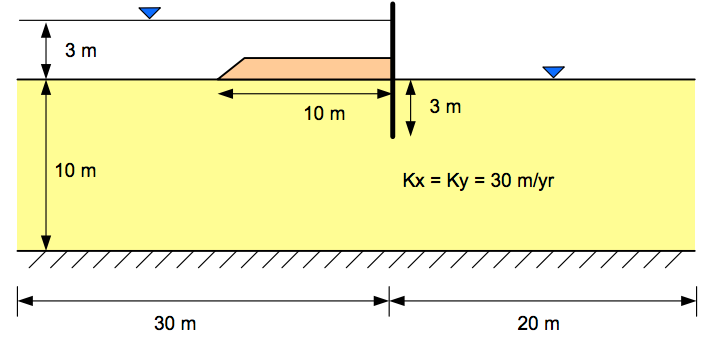{width=700}

<div class="tut-glance" markdown>
<div class="tgt-row">
<div class="tgt-tile"><span class="tg-label">Analysis</span><p>Seepage</p></div>
<div class="tgt-tile"><span class="tg-label">Assistant</span><p>~10 min</p></div>
<div class="tgt-tile"><span class="tg-label">By hand</span><p>25–30 min</p></div>
</div>
<div class="tgm-obj" markdown>
**Objectives** — Build a seepage model from scratch and assign its boundary
conditions, mesh it and choose an element type, solve it for the discharge under
the wall, set the flow net up so it can be read and read it, measure how much of
the answer is mesh rather than physics, refine the mesh at the sheetpile toe where
the flow turns, and sweep the hydraulic conductivity to see what it is worth.
</div>
<p><span class="tg-pill">one material</span><span class="tg-pill">confined flow</span><span class="tg-pill">specified head</span><span class="tg-pill">no-flow boundaries</span><span class="tg-pill">mesh generation</span><span class="tg-pill">element types</span><span class="tg-pill">flow net</span><span class="tg-pill">feature refinement</span><span class="tg-pill">parametric study</span></p>
<div class="tgm-model" markdown>**Completed model** — [xslope_clay_blanket.xlsx](../seep/files/xslope_clay_blanket.xlsx), the same file used by [Seepage Sample Problem 1](../seep/samples.md#1-sheetpile-with-clay-blanket)</div>
</div>

---

## What a seepage analysis computes

A seepage analysis solves for one field: the **total head** *h* at every point of
the ground. Total head is the sum of two parts,

$$ h = z + \frac{u}{\gamma_w} $$

the **elevation head** *z* — how high the point is — and the **pressure head**
*u*/γ<sub>w</sub>, the height of water a standpipe at that point would stand up
to. Water flows from high total head to low total head, never from high pressure
to low pressure, which is why an analysis solves for *h* and reports everything
else from it.

Darcy's law relates the flow velocity to the slope of that field, and combining
it with the requirement that water is neither created nor destroyed gives the
governing equation XSLOPE solves. Once the head field is known, the pore pressure
at every node, the velocity and hydraulic gradient at every node, and the **total
discharge** through the section all follow from it by arithmetic. The
[Seepage Analysis](../seep/overview.md#governing-equations) page carries the
equations and the finite element formulation in full.

### Confined and unconfined problems

A **confined** flow region is saturated everywhere by construction — the whole
domain is below water, and its shape is known before the analysis starts. Flow
between two reservoirs under a cutoff wall, through a foundation beneath a
concrete dam, or into an excavation below the water table is confined. The
governing equation is linear, so the answer comes from a single solve.

An **unconfined** problem has a free surface inside it — a **phreatic surface**,
the boundary between the saturated soil below and the unsaturated soil above,
which is where the pore pressure passes through zero. Flow through an earth dam
is the standard case: the water table inside the dam is part of the answer, not
part of the input, so the solver has to find it. That makes the problem
nonlinear, and it has to be iterated.

XSLOPE decides which of the two it is solving from the boundary conditions
themselves rather than from a setting: a model with any exit-face nodes is
unconfined and is iterated, and a model without them is confined and is solved
directly. This tutorial's problem is confined. A confined solution draws no
phreatic surface at all, and a negative pore pressure in one — which happens
wherever a point stands higher than the head driving it — is ordinary suction in a
saturated potential field rather than a water table.

### Boundary condition types

XSLOPE offers three boundary-condition types, entered on the
[**seep bc** sheet](../usage/input_template.md#worksheet-seep-bc) and documented in
full under [Boundary Conditions](../seep/overview.md#boundary-conditions). The
specified-head type comes in two flavors, which is why the table below has four
rows:

| Type | What it states | Typical use |
|---|---|---|
| **Specified head** (`head`) | Total head held at a stated value, every node, all times | Reservoir floor, tailwater, a matched piezometer |
| **Reservoir** (`reservoir`) | Held only while submerged; nodes above the water line seep freely | A pool that falls; a partly submerged face |
| **Exit face** | Water may leave to the atmosphere; where it starts leaving is part of the answer | Downstream face of a dam; a seeping slope |
| **Specified flux** (`flux`) | Flow rate across the boundary (normal Darcy velocity, positive inward) | Rainfall infiltration, recharge |

This problem is confined and never activates an exit face;
[SEEP-2](seep02_johnson_dam.md) is built around one and gives its full
condition there.

There is one further possibility, and it is entered nowhere: an edge with **no
boundary condition on it is a no-flow boundary**. That is the default rather than
an omission the solver puts up with, and it is a real physical statement — bedrock,
an impervious liner, a cutoff wall, a line of symmetry, and the far ends of a
section drawn wide enough that nothing crosses them. Every edge of a flow region
carries one of the three types above or nothing at all. Two of the three features
that make this tutorial's problem what it is, the clay blanket and the sheetpile
wall itself, are no-flow boundaries that nobody enters anything for.

Assessing and assigning the boundary conditions is the most important part of
building a seepage model. A conductivity that is wrong by a factor of two moves
the discharge by a factor of two and moves nothing else; a boundary condition that
is wrong changes the shape of the flow field, and every number that comes out of
it.

---

## The problem

The section is a 10 m layer of silt on rock, 50 m long. A sheetpile wall is
driven 3 m into it at x = 30. Upstream of the wall, a 10 m strip of the ground
surface is covered by a clay blanket, which is impervious. The pool behind the
wall stands 3 m above the ground, and the tailwater in front of it stands at
ground level.

**Material** — one soil, isotropic, with a hydraulic conductivity of 30 m/yr.
`k1` and `k2` are the major and minor principal conductivities — the maximum
permeability and the permeability at right angles to it — and `alpha` is the
angle of the `k1` direction above horizontal, in degrees. An isotropic soil
has `k1` = `k2`, which makes `alpha` irrelevant; it is entered here as 0.
The columns shown are the first six of the `mat` worksheet's seepage band,
in its order; the four after them belong to the unsaturated and transient
models this problem does not use. The row carries no strength properties:
this model is analyzed for flow only.

| mat | name | k1 | k2 | alpha | unsat |
|:---:|---|:---:|:---:|:---:|---|
| 1 | `soil` | 30 | 30 | 0 | `lf` |

**Geometry** — Profile Line 1, on material 1 (`soil`), one vertex per row, with
Maximum depth = `0`. The drawing shows every vertex the line needs, including
the three that cut the sheetpile slot, and the two base corners the maximum
depth supplies:

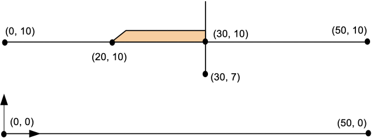{width=650}

| x (m) | y (m) |
|:---:|:---:|
| 0 | 10 |
| 20 | 10 |
| 29.9 | 10 |
| 30 | 7 |
| 30.1 | 10 |
| 50 | 10 |

Three of those six vertices are the flat ground surface, at x = 0, 20 and 50. The
middle three are the **sheetpile**: the line dives from (29.9, 10) down to
(30, 7) and comes straight back up to (30.1, 10), cutting a 0.2 m slot into the
top of the section. The mesh follows the profile line, so the slot becomes a
narrow notch that the elements have to go around, and its two faces — carrying no
boundary condition — are no-flow. A cutoff wall is modeled this way rather than as
a material: as a slit in the flow region that water cannot cross.

**Boundary conditions** — two specified-head blocks:

| Block | Type | Value (m) | From | To |
|---|---|:---:|:---:|:---:|
| Head/Flux BC #1 | `head` | 13 | (0, 10) | (20, 10) |
| Head/Flux BC #2 | `head` | 10 | (30.1, 10) | (50, 10) |

The upstream head of 13 m is the ground at elevation 10 with 3 m of water on it.
It stops at x = 20, not at the wall, and the 10 m of ground surface between x = 20
and the wall carries nothing. **That gap is the clay blanket.** An impervious
blanket is modeled by the absence of a boundary condition, because a boundary with
nothing on it is a no-flow boundary. It is also what the problem is about: the
blanket forces the water to enter the ground 10 m further upstream than the wall,
which lengthens every flow path under it. The downstream head of 10 m is the
tailwater standing at ground level, applied from the far side of the sheetpile slot
out to the end of the section.

The remaining boundaries — the base at elevation 0 and the two vertical ends —
carry nothing and are therefore no-flow. The base is the rock the silt sits on.
Treating the ends as no-flow is a judgment call: the section is drawn far
enough either side of the wall that the flow has become horizontal by the
time it reaches them, so nothing crosses.

These tables carry the entire model, and each is laid out exactly as its
destination is — the template's worksheets and Studio's editors, same
columns in the same order. Select a table's block of values, copy, and
paste it straight into the sheet or editor rather than retyping it.

---

## Choose how you want to build it

There are three ways to get this model into XSLOPE. They produce the same model —
pick one and skip the other two.

1. **[Build it with the AI assistant](#a-building-it-with-the-ai-assistant)** —
   hand Studio's assistant the drawing (or a paragraph describing the section) and
   let it build the model, then check its work. The fastest path by a wide margin.
2. **[Build the Excel input file](#b-building-the-excel-file)** — fill in the
   template worksheet by worksheet. The next-fastest path, and the one that shows
   you exactly what the file contains.
3. **[Build it in Studio](#c-building-the-problem-in-studio)** — enter the data
   through Studio's editors, watching the section redraw as you go.

Whichever you choose, rejoin at [Building the mesh](#building-the-mesh).

---

## A — Building it with the AI assistant {#a-building-it-with-the-ai-assistant}

### What you need first

The assistant is bring-your-own-model: it does nothing until you give it a
provider and credentials. That setup is a one-time job, described in
[The AI assistant](building_models.md#the-ai-assistant).

### Give it the problem

The drawing at the top of this page carries the geometry, the conductivity and the
two water levels.

1. Right-click the problem figure at the top of this page and choose **Copy image**.
2. Click in the assistant's chat box and press Ctrl/Cmd+V to attach it.
3. Type `Build this model` and press **Enter**.

A section this simple is faster to describe than to paste, and a description works
with a model that has no vision. Use this instead if you prefer:

<div class="prompt-block" markdown>
```text
Build a seepage model of flow under a sheetpile wall. The foundation is a single silt layer, 50 m long and 10 m deep on impervious rock, with a level ground surface at elevation 10 and the base at elevation 0. Hydraulic conductivity is 30 m/yr, isotropic. A sheetpile wall at x = 30 penetrates 3 m, so add a narrow slot in the profile line: vertices at (29.9, 10), (30, 7) and (30.1, 10). Upstream there is 3 m of water on the ground, so put a specified head of 13 m along the ground surface from x = 0 to x = 20. From x = 20 to the wall the ground is covered by an impervious clay blanket, so leave that stretch with no boundary condition at all. Downstream the tailwater is at ground level, so put a specified head of 10 m from x = 30.1 to x = 50. Units are SI and the time unit is years.
```
</div>

The assistant builds into the open project, not into a file: its work appears on
the canvas immediately and lands on the undo stack as one labeled step. Nothing is
saved until you use **Save As**.

### Check its work

This is the part that teaches. Read what it built against the section it was
given, and correct it in the same conversation — plain sentences work, and each
correction is undoable.

- **The blanket is a gap, not a material.** Check this first, because it is the
  judgment the drawing leaves to you and the likeliest miss: a drawing that colors
  the blanket in invites a second material. If a low-conductivity layer was added
  over x = 20 to 30, say: *"The clay blanket is impervious — remove that material
  and model it by leaving the ground surface from x = 20 to x = 30 with no
  boundary condition."*
- **Two specified-head boundaries and no exit face.** The problem is confined; an
  exit face would make the solver iterate for a phreatic surface that does not
  exist here.
- **The upstream head is 13, not 3.** A head is a total head, measured from the
  same datum as the geometry, so 3 m of water on ground at elevation 10 is a head
  of 13.
- **The sheetpile slot reaches elevation 7** and is narrow — a tenth of a meter
  either side of x = 30. If the profile line has the wall as a single vertical
  segment, the mesh has nothing to go around and water will cross it freely.
- **The time unit is declared.** Conductivity, flux and discharge all carry a time
  dimension, and XSLOPE labels them with whatever **Time** says. Leave it blank and
  the plots and forms show these quantities unlabeled.
- **One material, k₁ = k₂ = 30**, with no strength properties. A seepage-only model
  needs none.

Then open the [completed model](../seep/files/xslope_clay_blanket.xlsx) beside
yours and compare. Continue at [Building the mesh](#building-the-mesh).

---

## B — Building the Excel file {#b-building-the-excel-file}

Start from [input_template.xlsx](../inputs/input_template.xlsx) and save a copy
under a name of your own.

Fill the worksheets in the order the model depends on them: `main` first, since
the unit system and time unit it declares are what every number after it means;
then the material; then the geometry; then the boundary conditions.

### 1. The `main` worksheet

This sheet needs exactly two edits:

1. Set `main!D8` **Units** to `SI`. Choosing a unit system fills
   **Unit weight of water** with that system's value, `9.81` kN/m³ here.
   XSLOPE never converts between systems — the declaration states what the
   numbers you type already mean, and drives the unit labels on the plots.
2. Set `main!D9` **Time** to `yr`, the base this model's conductivity is
   stated in. On a seepage model this field is load-bearing: it is what puts
   `m/yr` on the material form and `m³/yr per m` on the flow net's title.
   Left blank, the arithmetic is unchanged but the results carry no unit
   labels.

Nothing else on the sheet applies to this model — the crack and seismic
entries, the mesh presets, **Tension SRF (FEM)**, **Side BC** and
**Water loads** all belong to stability analyses or to choices made later at
mesh time. Leave them however they stand.

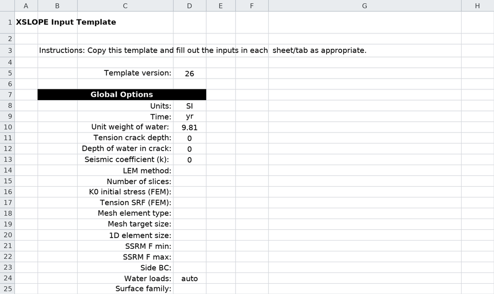

### 2. The `mat` worksheet

The `mat` sheet is wide, and a seepage-only material fills one band of it: the
**Seepage** band at columns AG–AP. Enter (or copy-paste) the material properties
from the table above into the first row of the table, row 11:

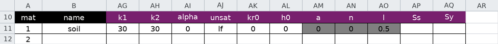

`k1` is the major principal conductivity and `k2` the minor one, with `alpha`
the rotation of those principal directions from the x-axis in degrees.
Setting `k1 = k2 = 30` makes the soil isotropic, and at that point `alpha`
means nothing and stays `0`. The `unsat` column and every column after it
stay blank: they belong to the unsaturated and transient analyses of the
next tutorials, and a confined steady problem reads none of them.
[SEEP-2](seep02_johnson_dam.md) is where they come into play.

Everything to the left of the Seepage band — unit weight, strength option,
cohesion, friction angle — stays empty. A stability analysis would need them; this
one does not read them.

### 3. The `profile` worksheet

A profile line is the *top* of a material layer: everything below it, down to the
next profile line or the maximum depth, is that layer's material. Here one line on
one material defines the whole flow region, closed from below by the rock.

1. `profile!B2` **Max Depth** = `0`. This is an *elevation*, not a thickness: it
   places the impervious base at elevation 0, 10 m under the ground surface.
2. Profile Line #1 — set its **Mat ID** to `1`, and enter (or copy-paste) the six
   points from the table above into the `x` / `y` columns beneath, left to right.

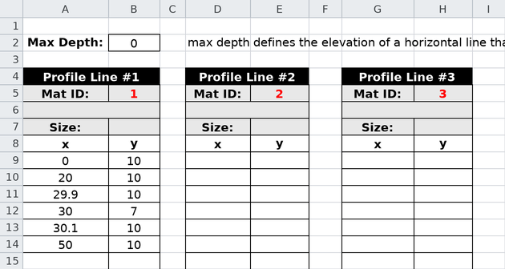

The three middle rows are the sheetpile. Enter them exactly: 29.9, then 30 with
y = 7, then 30.1. The 0.1 m offset either side is what gives the slot a width, and
the width is what makes its two faces separate boundaries of the flow region, so
no element can bridge them and no water can cross. A wall entered as a single
vertical line at x = 30 leaves the ground surface unbroken, and the mesh covers it
as though it were not there.

### 4. The `seep bc` worksheet

This sheet carries an exit-face polyline and up to five head or flux blocks. This
problem uses two of the head blocks and no exit face.

1. Head/Flux BC #1 — the type cell `E3` = `head`, the value cell `F3` = `13`, and
   the two points `(0, 10)` and `(20, 10)` in the `x` / `y` columns beneath.
2. Head/Flux BC #2 — the type cell `H3` = `head`, the value cell `I3` = `10`, and
   the two points `(30.1, 10)` and `(50, 10)`.

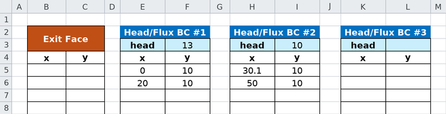

Leave the **Exit Face** columns empty. That is what makes this a confined problem,
and it is a decision, not a blank: an exit face here would send the solver looking
for a phreatic surface in a domain that is saturated throughout.

Leave the ground surface between x = 20 and x = 29.9 out of both blocks. That gap
is the clay blanket, and the no-flow default is what models it.

Save the file, and continue at [Building the mesh](#building-the-mesh) — open the
file in Studio and mesh it there.

---

## C — Building the problem in Studio {#c-building-the-problem-in-studio}

Start with **File → New**, an empty project, and switch the toolbar's **Mode**
selector to **Seepage** (or press `Ctrl+2`). The mode decides which analysis the
run buttons start — **Run Seep…** rather than **Run LEM…** — and puts **Build
Mesh…** beside it, which only the finite element workflows need. The **Inputs**
tree is the same in every mode, **Seep BC** included, because one file carries the
inputs for all three analyses. Work down the tree in the order the model depends
on: settings, then the material, then the geometry, then the boundary conditions.

### 1. Global parameters

Click **Global parameters** and set **Units** to `SI`. The unit weight of water
fills itself with `9.81`.

Then set **Time** to `yr`. This field is inert on a limit equilibrium model and
load-bearing here: it is what makes the material form label its conductivity boxes
`k1 (m/yr)` and the solution title read `m³/yr per m`. XSLOPE never converts, so
the declaration states what the conductivity you are about to type already means.

Leave the tension crack and seismic fields at `0`, and the two FEM fields empty.

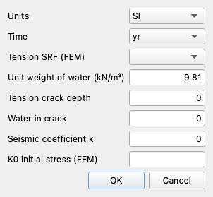

Click **OK**.

### 2. Materials

Click **Materials**. The editor opens on **Table view**, one material per row, with
a row of toggles above it labeled **Show parameters for:** that decides which
columns the table shows. There are four — **LEM**, **Seepage**, **FEM** and
**Reliability** — and each is remembered between sessions, so the table may not
open with the same ones ticked as the capture below. Leave **Seepage** ticked and
untick the other three: the table then shows the seepage band and nothing else,
which on this model is the whole material.

Press **Add row**, and fill it:

1. **name** = `soil`.
2. **k1 (m/yr)** = `30` and **k2 (m/yr)** = `30`.
3. **alpha** = `0`.
4. Leave **unsat** and everything after it alone — the editor shows the
   `lf` default for the blank cell. Those columns belong to the unsaturated
   and transient analyses of the next tutorials; a confined problem
   evaluates none of them.

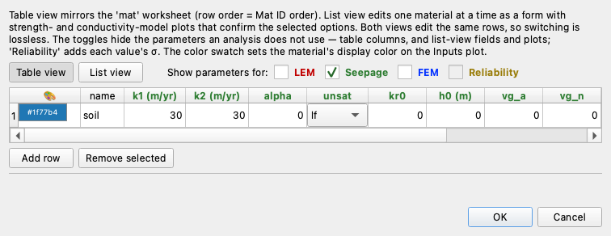

The unit suffix in the column headers is the **Time** declaration from the previous
step showing up. If those headers read `k1` with no unit, go back and set it.

### 3. Profile lines

Click **Profile lines**, then **Add line**:

1. Set **Max depth (bottom boundary elevation):** to `0`. This is an *elevation*,
   not a thickness: it places the impervious base 10 m below the ground surface.
2. Set **Material:** to `1: soil`.
3. Copy the two columns of the vertex table above and paste them into the
   grid in one stroke — or **Add row** six times and type them.

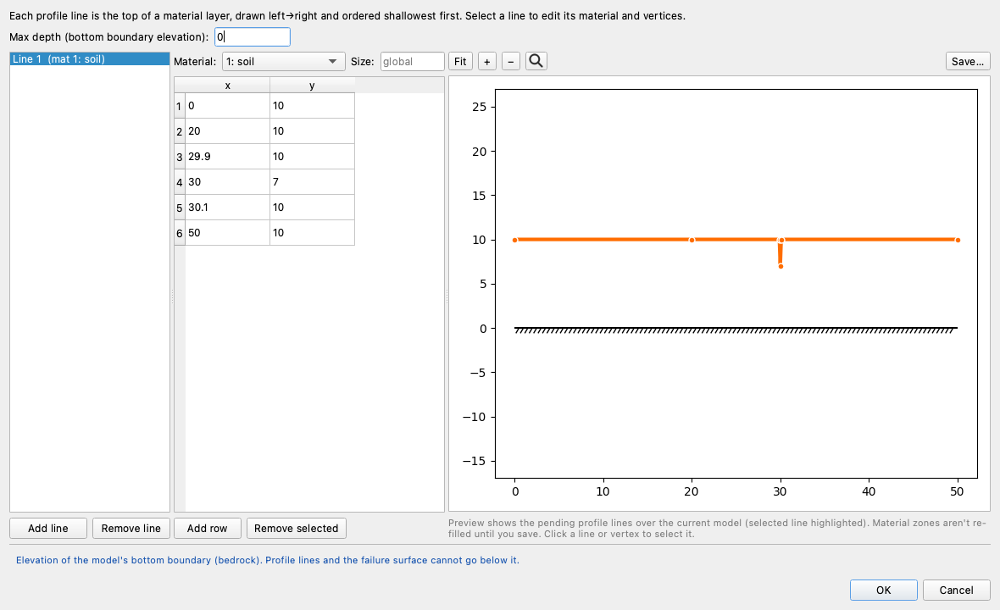

The preview redraws as you type, so the sheetpile shows up as soon as its three
vertices are in: a thin spike dropping from the ground surface at x = 30 down to
elevation 7. If the preview shows a wide V instead of a thin spike, one of
the 29.9 / 30.1 values is wrong.

Click **OK**.

### 4. Boundary conditions

Click **Seep BC**. The editor opens on **Set 1**, with a list on the left holding
every boundary in the set — each specified-head block, each flux block, and the
exit face — and the selected one's value and points beside it. The preview on the
right draws every boundary over the section with the selected one highlighted;
clicking a boundary in the preview selects it in the list. (**Set 2** is the
second boundary set a rapid drawdown analysis uses; it stays empty here.)

Press **Add head**, and fill the upstream boundary:

1. Leave **Type:** at `head`. The alternative, `reservoir`, holds a node at the
   level only while that node is submerged and releases it to seep when the water
   line drops below it — which matters when the pool falls or the boundary is drawn
   up a slope, and changes nothing on a level boundary that is under water at all
   times.
2. **Head value (m):** = `13`.
3. **Add row** twice, and enter `0, 10` and `20, 10`.

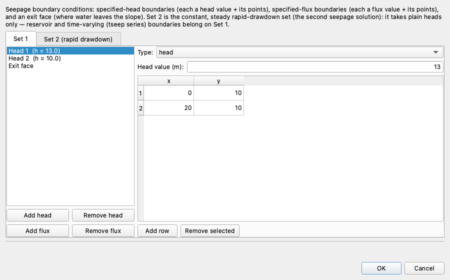

Press **Add head** again for the downstream boundary — **Type:** `head`,
**Head value (m):** `10`, points `30.1, 10` and `50, 10`.

Leave the **Exit face** entry in the list with no points. That is the choice that
makes this a confined problem.

Leave the ground between x = 20 and x = 29.9 out of both blocks. It is the clay
blanket, and the no-flow default is what models it.

Click **OK**, and continue below.

---

## Building the mesh

However you built it, you now hold the same model. A limit equilibrium analysis
would run on it as it stands; a seepage analysis cannot, because the finite element
method needs the flow region divided into elements first. Compare your Inputs view
against this before meshing anything:

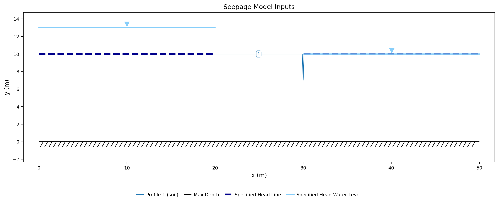{width=1000}

The dark dashed segment from x = 0 to x = 20 is the upstream specified-head
boundary, and the light line above it at elevation 13, with the inverted triangle,
is the water level that head stands for. Downstream the two coincide: the tailwater
is at ground level, so the light water line at elevation 10 lies directly on the
dashed boundary from x = 30.1 to x = 50 and hides it. The stretch of ground between
the two carries neither, which is the blanket. The hatched line at elevation 0 is
the maximum depth, and the spike at x = 30 is the sheetpile.

Click **Build Mesh…**.

**Element type** decides the order of the interpolation inside each element. The
dialog opens on **Quadratic triangles (tri6)** — the safe default, because a
finite element stability analysis requires a quadratic mesh (a limit equilibrium
analysis does not; it reads only pore pressures from the seepage solution).
Change it to **Linear triangles (tri3)** — three nodes at the corners, head
varying linearly across the element. That is enough for a stand-alone seepage
analysis: head is a scalar field, and the smaller system solves faster. The
[mesh study](#how-fine-the-mesh-has-to-be) below builds this section with all
five element types and measures what the choice is worth.

Element type is the only control this build changes. Everything below it stays at
its default, so the dialog now stands as your settings leave it:

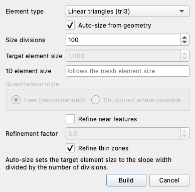

**Auto-size from geometry** is ticked, and **Size divisions** below it sets the
element size to the width of the section divided by that number. Leave it at
`100`: the section is 50 m wide, so the target element size is 0.5 m and the
grayed **Target element size** box shows it. Untick **Auto-size from geometry** to
type a size directly instead — useful when you are comparing meshes, which is what
the [mesh study](#how-fine-the-mesh-has-to-be) below does.

**Quadrilateral style** is dimmed, because it applies to quadrilateral element
types and this mesh is triangles.

Leave **Refine near features** unticked for now. It drives the element size down
locally around cracks, notches, thin zones and structural lines, and this section
has a feature that wants it — the [refinement step](#refining-at-the-sheetpile-toe)
below turns it on and measures what it buys.

Click **Build**. The Log pane reports the size of what it built, and the mesh
appears with the boundary nodes marked on it:

```text
Auto element size: 0.500 (slope width / 100 divisions)
Building tri3 mesh, target size 0.5…
Mesh built: 2490 nodes, 4726 elements.
```

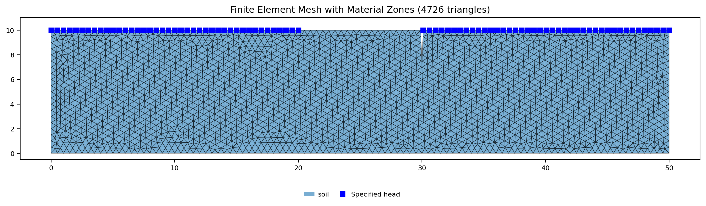{width=1000}

**2,490 nodes and 4,726 triangles** — the element count is on the figure's title
as well, and the node count comes from the log line. The blue squares are the
specified-head nodes, 82 of them, and the two stretches they cover are the two
boundaries. Everything they do not cover — the base, the two ends, the 10 m of
ground under the blanket, and both faces of the sheetpile slot — is no-flow, which
is why it is worth checking this picture rather than trusting the sheet: a no-flow
boundary is invisible in the input, and the only way to see it is to see where the
markers stop.

---

## Running the analysis

Click **Run Seep…**:


**Convergence tol** is the head-change tolerance the unconfined iteration stops
at, and on a confined problem it is inert — there is no iteration to stop. Leave
it at `0.0001`.

The **Model checks** column beside the controls reads *No problems found for this
run*. It is worth reading rather than clicking past: a conductivity of zero, a
boundary set that drives no flow, or a mesh built against a different material
table each produce a finished-looking number, and this column says so before the
solve rather than after.

Click **Run**. The Log pane says which path the solver took:

```text
Solving CONFINED seep problem...
Number of fixed-head nodes: 82
Number of exit face nodes: 0
```

With zero exit-face nodes the problem is confined, so a single direct solve
finishes it.

The solution view arrives with a **Display** panel in the left dock, holding the
plot options of whichever result view is showing
([The Display dock](../studio/interface.md#the-display-dock)). One of them decides
what the picture can be read for: **set Contour levels to 10**, which opens at
`20`. It fixes how many lines of both families get drawn, and ten is what makes
them countable on this problem — [Reading the flow net](#reading-the-flow-net)
below is the reason, and every seepage figure from here on is drawn at it.
Changing the setting re-draws the solution already in hand; nothing is re-solved.

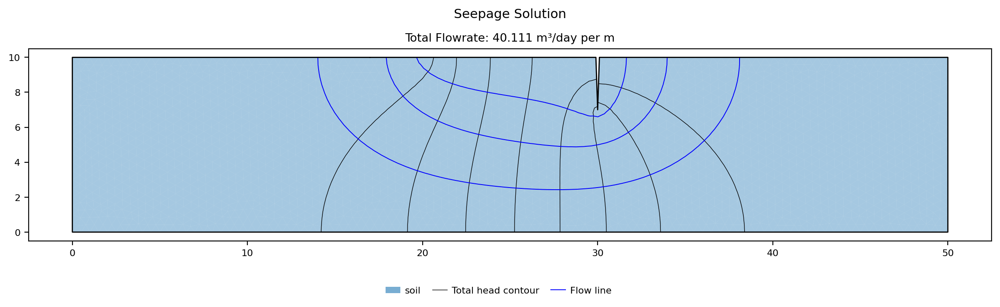{width=1000}

**The total discharge is 40.111 m³/yr per m.** That trailing *per m* states a
convention. The section has no thickness, so every flow quantity a two-dimensional
analysis reports is **per meter of wall measured along its length**: the discharge
under a 60 m stretch of this wall is 60 × 40.111 = 2,406.7 m³/yr. Everything else
a two-dimensional analysis produces carries the same convention — a slice weight, a
reinforcement force, a pile row's share of the soil — and it is the easiest place
to be out by a factor of the wall length.

The head ranges from **10.000 m to 13.000 m**, which is the two boundary values and
nothing outside them. That is a property of the governing equation rather than a
coincidence: with no sources or sinks inside the region, the head field can have no
interior maximum or minimum, so every head in the ground lies between the highest
and lowest boundary head. Pore pressure runs from **0 to 126.8 kPa**, the larger at
(0, 0), the base under the upstream pool. It never goes negative, and the two
numbers above are why: the lowest head anywhere is 10 m and the highest elevation
anywhere is also 10 m, so the pressure head *h* − *z* cannot be less than zero
anywhere in the section. That is what being confined looks like in the output.

---

## Reading the flow net

The solution plot is a **flow net**: two families of lines that together describe
the whole head field.

The black lines are **equipotentials** — contours of total head. Along one of
them, the head is the same everywhere, so a standpipe anywhere on it stands to
the same level. There are as many as **Contour levels** asks for, evenly spaced
between the two boundary heads, which is where the value of 10 set above lands.
The outermost two lie on the boundaries themselves, so eight are visible inside
the ground, and they divide the 3 m head drop into **nine equal drops of
0.333 m**.

The blue lines are **flow lines**, and they are not paths traced by following the
velocity around. They are contours of a **stream function**, a companion field
computed by a second finite element solve on the same mesh. Water flows along a
flow line and never across one, so the strip between two adjacent flow lines is a
**flow channel** carrying a fixed share of the total discharge. The impervious
boundaries are flow lines too, since no water crosses them either: the rock base
and the two ends bound the flow from below, and the blanket and the two faces of
the sheetpile slot bound it from above. Three flow lines are drawn between them,
which makes **four flow channels**.

The two families cross at right angles wherever the soil is isotropic, and the
number of flow lines is not a drawing choice. A flow net reads correctly only when
its cells come out as **curvilinear squares**, and for such a net the discharge is

$$ q = k \, \Delta h \, \frac{N_f}{N_d} $$

with *N<sub>f</sub>* the number of flow channels and *N<sub>d</sub>* the number of
head drops. XSLOPE knows *q* from the solve and *N<sub>d</sub>* from the contour
count, so it computes the *N<sub>f</sub>* that satisfies the identity and draws
that many flow lines. The channel count on the screen is therefore derived from
the discharge rather than an independent check on it.

What the picture does say is the number that was derived before it was rounded to
whole lines:

$$ N_f = \frac{q \, N_d}{k \, \Delta h} = \frac{40.111 \times 9}{30 \times 3} = 4.011 $$

Four channels against nine drops, with the channel count landing within 0.3% of a
whole number rather than somewhere between two. That is what makes this a true
curvilinear-square net rather than a drawing that approximates one, and it is why
the arithmetic runs backwards as cleanly as forwards: counting 4 and 9 off the
screen gives

$$ q = 30 \times 3 \times \frac{4}{9} = 40.0 \text{ m³/yr per m} $$

against the finite element answer of 40.111, and the 0.3% between them is the
rounding above and nothing else.

That is what the contour count was for. Left at the panel's default of 20 levels,
the same solution gives *N<sub>f</sub>* = 8.47 against 19 drops, which rounds to 8
channels and reads back as 30 × 3 × 8/19 = 37.9 — 5.5% under the answer it was
drawn from. That picture is the same head field with more contours on it, but its
cells are not square and its counts do not reproduce the discharge. A net is worth
counting only when both counts come out whole, and on this problem 10 levels is
what does it.

A flow net drawn by hand on graph paper is a legitimate solution to a confined
seepage problem and was the standard one for decades; what the finite element solve
adds is speed, a field you can query at any point, and independence from how well
you draw curves.

The ratio *N<sub>f</sub>*/*N<sub>d</sub>* = 4/9 is the **shape factor**, and on
this problem it is a property of the geometry alone — the length of the blanket,
the depth of the sheetpile, the thickness of the layer. It does not depend on the
head or on the conductivity, which is the fact the
[conductivity sweep](#discharge-against-conductivity) below measures.

The gradient field says where the flow is working hardest:

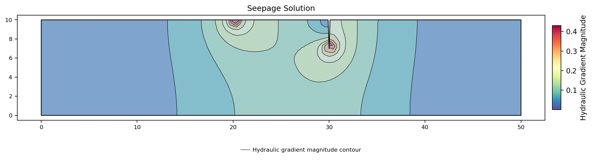{width=1000}

The hydraulic gradient is the rate at which head falls with distance, so it is
largest where the equipotentials crowd together. It is smallest across the two
ends: over the outer 5 m at each, the largest gradient anywhere is 0.015 upstream
and 0.022 downstream, and the head varies by 0.09 m and 0.14 m. That is the check
on the earlier judgment that the section was drawn wide enough — almost nothing is
moving out there, which is what the no-flow ends assume.

The two peaks are at the sheetpile toe at (30, 7), where the whole flow has to turn
around the end of the wall, and at (20, 10), the upstream edge of the clay blanket,
where a boundary held at 13 m meets a boundary that carries nothing. They are two
different defects. The toe is a **re-entrant corner**, where the boundary turns
back on itself; the blanket edge is a **boundary-condition change**, where a held
head meets a no-flow face on smooth ground. Both give a gradient with no finite
value in the exact solution — a **singularity**, a point the true answer is
infinite at, so no mesh ever resolves it and every mesh reports whatever its own
spacing can reach. The next section is about what that does to the answer.

---

## How fine the mesh has to be {#how-fine-the-mesh-has-to-be}

A finite element answer is an answer for the mesh it was computed on, and the only
way to find out how much of it is mesh is to solve the same model again on a finer
one. Rebuild the mesh at a range of element sizes — untick **Auto-size from
geometry** and type each size into **Target element size** — and run each one:

| Target size (m) | Nodes | Triangles | q (m³/yr per m) |
|:---:|---:|---:|---:|
| 2.0 | 191 | 316 | 41.978 |
| 1.0 | 670 | 1,212 | 40.797 |
| 0.5 | 2,490 | 4,726 | 40.111 |
| 50/120 | 3,544 | 6,782 | 39.983 |
| 0.25 | 9,607 | 18,708 | 39.786 |
| 0.125 | 37,656 | 74,300 | 39.618 |

The fourth row is reached the other way round. **Target element size** takes three
decimals, and 50/120 = 0.41666… is not one of them, so leave **Auto-size from
geometry** ticked and set **Size divisions** to `120` instead: the log reads
`Auto element size: 0.417 (slope width / 120 divisions)` and the mesh it builds is
the 3,544-node one above. Typing `0.417` builds a different mesh — 3,546 nodes, and
a discharge of 39.982.

The discharge falls at every refinement and never turns around. Two things follow
from that.

The first is that the coarse answers are **wrong in a known direction**. Between
the coarsest mesh and the finest the discharge drops 5.6%, and the 0.5 m mesh the
run above used is 1.2% above the 0.125 m one. A coarse mesh cannot resolve the
crowding of the equipotentials at the two singular points, so it under-states how
much the flow has to squeeze around the wall, and over-states how much gets
through.

The second is that the sequence does not settle on a value, and it will not. The
gradient at each of those two points is genuinely infinite in the exact solution,
so each halving of the element size resolves a bit more of a peak that has no top,
and the discharge keeps creeping down. In practice the refinement stops where the
change stops mattering: going from 0.25 m to 0.125 m nearly quadrupled the node
count and moved the discharge by 0.4%.

The cataloged discharge on the [sample page](../seep/samples.md#1-sheetpile-with-clay-blanket)
is **39.983**, which is the 50/120 row — that page's regression tag meshes at the
width divided by 120. A seepage discharge is only meaningful together with the mesh
it was computed on, which is why that row is stated with its size.

The element type moves the answer the same way, and more cheaply. The quadratic
types (`tri6`, `quad8`, `quad9`) carry extra nodes at the element midsides and let
the head vary quadratically across the element; `quad4` is the linear
quadrilateral, the four-cornered counterpart of tri3. Meshing the same section at
a 1 m target size with each of the five element types gives:

| Element type | Nodes | Elements | q (m³/yr per m) |
|---|---:|---:|---:|
| `tri3` | 670 | 1,212 | 40.797 |
| `tri6` | 2,551 | 1,212 | 39.866 |
| `quad4` | 568 | 503 | 40.288 |
| `quad8` | 1,638 | 503 | 39.838 |
| `quad9` | 2,141 | 503 | 39.714 |

The three quadratic types land within 0.4% of each other, and each sits below the
linear type built on the same element layout — 2.3% below for the triangles, 1.1%
for the quads — because a quadratic element can bend its head field across itself
where a linear one has to stair-step it. Quadratic triangles at 1 m
reach 39.866 on 2,551 nodes, which is a better answer than linear triangles at
0.5 m reach on 2,490 — the same size of system, spent on element order instead of
element count. On a model that will also carry a finite element stability
analysis, quadratic elements are free — there they are required, not preferred:
linear triangles and quads become artificially stiff under the incompressible
plastic flow of a Mohr-Coulomb collapse and return a factor of safety that is too
high, by 21% for tri3 and 11% for quad4 on the benchmark under
[Element type and volumetric locking](../fem/overview.md#element-type-selection-and-volumetric-locking).

---

## Refining at the sheetpile toe {#refining-at-the-sheetpile-toe}

Halving the element size everywhere is a blunt way to resolve two singular points.
The gradient plot showed that almost all of the section is flowing gently and that
the work is concentrated in two small neighborhoods, so the mesh should be too.

Open **Build Mesh…** again, leave the element type and the size divisions where
they are, tick **Refine near features**, and raise **Refinement factor** from its
default of `3` to `4`, which puts the local element size at 0.125 m — the finest
size in the mesh study — around the toe alone:

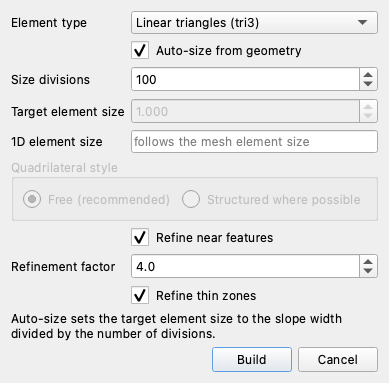

The refinement factor is the ratio the local element size is driven down by: with a
0.5 m target and a factor of 4, elements near a detected feature are built at
0.125 m and grow smoothly back to 0.5 m away from it. The features it looks for
are the ones a mesh usually fails at — reinforcement and pile lines, thin material
zones, and crack and notch tips — which is what the bottom of the sheetpile slot
is. Crack tips are refined twice as strongly as the rest, so the mesh at the toe
is finer still.

**Refine thin zones** below it is ticked by default, and can stay ticked. It is a
guarantee rather than a second refinement setting: it makes sure a thin material
layer gets enough rows of elements across it to carry a shear band, whatever the
element type. Unticking it adds nothing and removes nothing else — the feature
refinement above is left exactly as you set it. This model has one material and no
thin layer, so the setting changes nothing here either way.

Click **Build**. At section scale the two meshes look the same; at the toe they do
not:

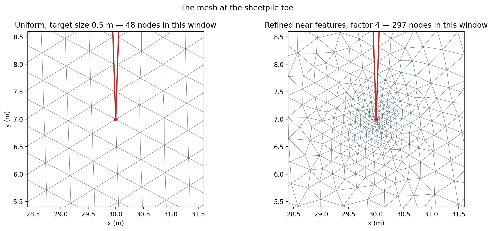{width=1000}

In the 3.2 m window drawn here the uniform mesh has **48 nodes** and the refined
one has **297**. The toe is a node on both meshes; its nearest neighbor moves from
**0.500 m away to 0.048 m**, and the count of nodes within half a meter of it goes
from 1 — the toe itself — to 114. The whole mesh grew from 2,490 nodes to 2,753 —
11% — because everything more than a couple of meters from the toe is untouched.
The blanket edge is not one of the feature classes this setting detects, and the
gradient there says so: the largest within half a meter of (20, 10) reads 0.4297 on
the uniform mesh and 0.4295 on the refined one.

Run it again:

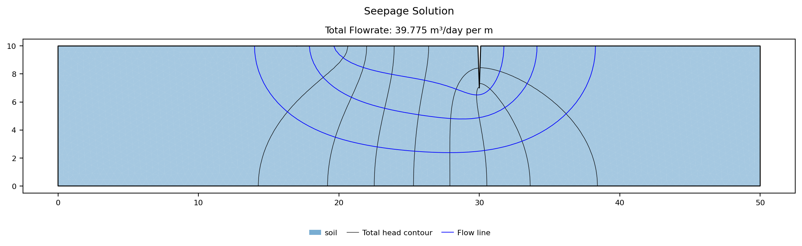{width=1000}

**39.775 m³/yr per m**, against 40.111 on the uniform mesh of nearly the same size.
The uniform mesh needs to be built at 0.25 m — **9,607 nodes** — to reach 39.786,
which is the same answer to three figures. The refinement bought a 3.5× smaller
system for it, and on a problem where the solve is fast that is a convenience; on a
large model, or on the finite element stability analysis that would run on the same
mesh afterward, it is a large saving in solve time.

The local gradient shows what the refinement is actually resolving. The largest
gradient within half a meter of the toe reads **0.325** on the uniform mesh and
**1.068** on the refined one. That is not a better estimate of a real number
converging — it is a mesh resolving more of a peak that has no top, and it will
keep climbing at every refinement. That is the reason to judge convergence on the
discharge rather than on the gradient at the toe: the discharge is an integral
of the flow field over a boundary and converges, while a point value at a
singularity does not converge to anything.

---

## Discharge against conductivity {#discharge-against-conductivity}

The last question this model can answer cheaply is what the soil's hydraulic
conductivity is worth — the input a site investigation is least sure about, and
often by an order of magnitude.

Studio sweeps it from **Run → Parametric…**, which in seepage mode takes the total
discharge as its output quantity instead of a factor of safety, and fills the
dialog in one control at a time:

- **Mode** = `Design (q target)`, which sweeps one parameter between stated bounds
  and reports where the discharge reaches a target you name. The other two are
  `Sensitivity (tornado + plots)`, which moves several parameters a percentage
  either side of their current values and ranks them, and
  `Back-Analysis (target q)`, the same single-parameter sweep run backwards from a
  discharge you have measured.
- **Convergence tol** = `0.0001`, the same solver control the Run Seepage dialog
  carries and with the same meaning: every step of the sweep is one of those
  runs.
- **Material / BC** = `soil`. The list holds one entry per material, plus
  **Boundary heads** for sweeping a specified head instead of a soil property.
- **Property** = `k1`. In seepage mode the list is the material's seepage
  properties and nothing else — `k1`, `k2`, `alpha`, `kr0`, `h0`.
- **From** `30`, **To** `300`, **Steps** `10` — the bounds and the number of solves
  spread across them, starting at the model's own conductivity so the first swept
  point is the run already made.
- **Target q** = `100`, the discharge the sweep is asked to locate. It reports the
  parameter value that reaches it, interpolating between the two solves that
  bracket it, and says which way to widen the range if nothing does.

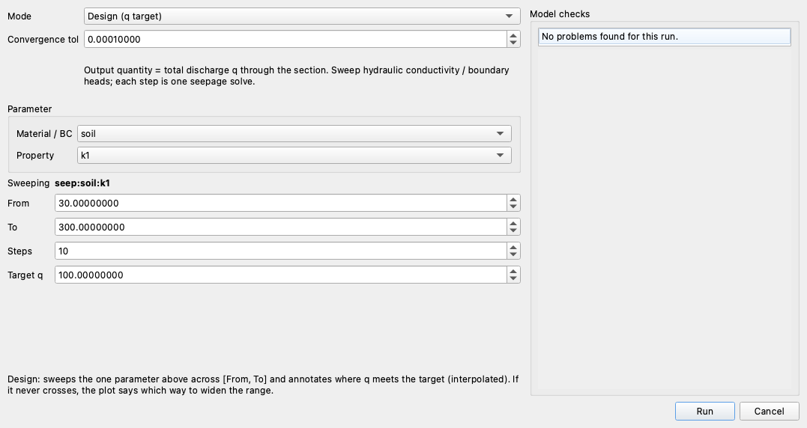

Each step is one seepage solve on the mesh already built, so the whole sweep costs
about what a single run does. It reports:

```text
q = 100 at seep:soil:k1 = 126.1 (interpolated between solves).
```

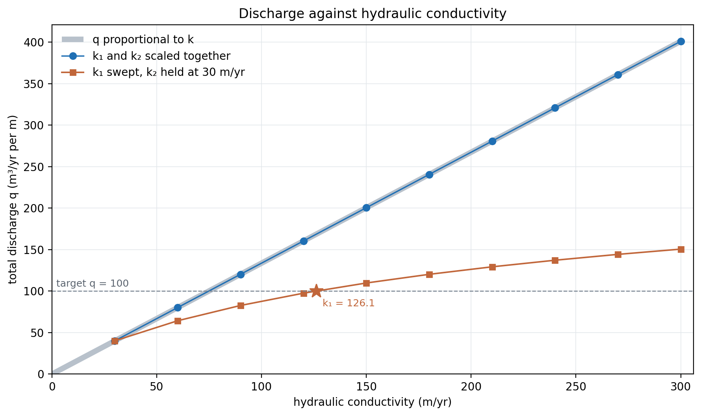{width=900}

The orange series is that sweep, and it is **not** a straight line: from 30 to
300 m/yr the discharge only rises from 40.1 to 150.6, so q/k₁ falls from 1.337 to
0.502 across the range. The reason is that the sweep changes one principal
conductivity and not the other. At the start of it the soil is isotropic; by the
end k₁ is ten times k₂, and the soil is **anisotropic** — water moves more easily
along one direction than across it. That is a different flow problem: the head
field itself changes shape, and the shape factor with it.

Scale **both** principal conductivities together and the answer is exactly
proportional. The blue series is the same range with k₂ moved to match k₁ at every
step, and it sits on the proportional line through the origin to eight significant
figures: q/k = 1.33704613 at 30 m/yr and at every one of the ten values up to
300.

That is not a numerical coincidence, and the head field says why. Comparing the
solved head at every node against the first of the ten runs, the largest difference
anywhere is 3 × 10⁻¹³ m — machine rounding on a 3 m head drop. **Scaling an
isotropic conductivity does not change the head field at all.** For a homogeneous
region driven entirely by specified heads, a constant conductivity multiplies both
sides of the governing equation and cancels out of it; the head field is a property
of the shape of the region and its boundary values, and the conductivity enters
only afterward, when Darcy's law turns that field into a velocity. So the shape
factor of 4/9 the flow net was read off is fixed, and

$$ q = k \, \Delta h \, \frac{N_f}{N_d} $$

does all of it: the discharge is proportional to *k*, proportional to the head
drop across the section, and otherwise a matter of geometry. The head drop behaves
the same way and for the same reason — moving the upstream head from 11 m to 15 m,
a drop of 1 m to 5 m, gives q/Δh = 13.370461 at every one of them.

Two consequences follow for practice. Uncertainty in the conductivity passes straight through
to the discharge, one for one, and no amount of solving improves on that — a *k*
known to within a factor of three gives a *q* known to within a factor of three.
And the head field, and everything read off it — the flow net, the pore pressures
that a stability analysis would take from this solution, the gradient at the
sheetpile toe — is **independent of the conductivity** on a problem like this one.
The moment a second material appears, that stops being true and only the ratio of
the conductivities matters; it is one soil that makes *k* cancel completely.

---

## Conclusion

This tutorial demonstrated:

- A confined seepage model built from three inputs: one soil at
  k₁ = k₂ = **30 m/yr**, a profile line whose 0.2 m slot at x = 30 is the
  sheetpile, and two specified-head boundaries at **13 m** and **10 m**. Every
  other edge — the rock base, the two ends, both faces of the slot, and the 10 m of
  ground under the clay blanket — is a no-flow boundary that nothing was entered
  for.
- The path the solver chose being read off the boundary conditions rather than a
  setting: **zero exit-face nodes**, so one direct confined solve, no phreatic
  surface, and pore pressures from 0 to **126.8 kPa** that never go negative.
- A discharge of **40.111 m³/yr per m** on 2,490 nodes — per meter of wall, the
  convention every quantity a two-dimensional analysis reports carries, and
  **2,406.7 m³/yr** under a 60 m stretch of it.
- A flow net drawn at **10 contour levels**, where the channel count the discharge
  implies comes out at **4.011** — whole to within 0.3%, so the cells are
  curvilinear squares and **nine head drops and four flow channels** read back as
  q = k·Δh·N<sub>f</sub>/N<sub>d</sub> = **40.0**.
- A discharge that falls at every refinement — **41.978 at a 2 m element size down
  to 39.618 at 0.125 m** — and does not settle, because the sheetpile toe is a
  re-entrant corner and the blanket edge a boundary-condition change on smooth
  ground, and neither has a finite gradient; and quadratic elements reaching
  **39.866** on the node count linear ones spend to reach 40.111.
- Feature refinement at a factor of 4 putting a node **0.048 m** from the toe
  instead of 0.500 m and reaching **39.775** on 2,753 nodes, where a uniform mesh
  needs **9,607** to reach the same three figures.
- A discharge exactly proportional to an isotropic conductivity —
  **q/k = 1.33704613** at every one of ten values from 30 to 300 m/yr, with the
  head field unchanged to 3 × 10⁻¹³ m — against the same sweep of k₁ alone, where
  q/k₁ falls from 1.337 to 0.502 because the anisotropy changes the head field.

**Where to go next:** the [tutorials index](index.md) lists the series.
[Seepage Analysis](../seep/overview.md) carries the governing equations, the
boundary-condition types in full, and the flow-net rule the channel count follows;
[Sample Problem 1](../seep/samples.md#1-sheetpile-with-clay-blanket) catalogs
this model; [Seepage and Slope Stability](../seep/seep_slope.md) is how a solved
head field becomes the pore pressure on a slice base, and where the requirement for
quadratic elements comes from.
[SEEP-2](seep02_johnson_dam.md) takes on an unconfined problem, where the phreatic
surface is part of the answer and the unsaturated conductivity model this page left
at its default starts doing work.
