# Tutorial SEEP-2 — Unconfined Seepage Through a Zoned Dam

This tutorial works an unconfined seepage problem — one where the water table
inside the ground is part of the answer rather than part of the input — and the
choices that kind of problem forces on the modeler. It covers the boundary
conditions an unconfined problem needs and the seepage face that is peculiar to
it, how the phreatic surface is arrived at and how much water moves above it, the
three unsaturated conductivity models XSLOPE offers and what each one is worth,
the base material a flow net drawn on a zoned section has to be scaled to, and
what the iteration does when the conductivity curve is steep enough to give it
trouble.

The example is the Johnson Reservoir dam: an 80 ft embankment with a shell, a
clay core keyed 40 ft into the foundation, and 60 ft of water behind it. It is a
better vehicle for these questions than a one-soil section, because a zoned dam is
where the base material stops being obvious and where the conductivities are far
enough apart that the choices show up in the numbers.

[Tutorial SEEP-1](seep01_sheetpile.md) built a seepage model from scratch, three
different ways, and solved a confined one. The model here arrives finished, and
the work is the physics an unconfined problem adds to it.

<div class="tut-glance" markdown>
<div class="tgt-row">
<div class="tgt-tile"><span class="tg-label">Analysis</span><p>Seepage</p></div>
<div class="tgt-tile"><span class="tg-label">Open &amp; explore</span><p>~25 min</p></div>
</div>
<div class="tgm-obj" markdown>
**Objectives** — Solve unconfined flow through a zoned earth dam and read the
phreatic surface it produces, see what the seepage face on the downstream slope
does and make it do more, measure how much of the discharge travels above the
phreatic surface and how much passes under the core, scale the flow net to each
of the three zones in turn and find the one that reads, run all three unsaturated
conductivity models against each other and explain the difference between them,
and watch the iteration fail and then succeed on a curve steep enough to make it
struggle.
</div>
<p><span class="tg-pill">three materials</span><span class="tg-pill">unconfined flow</span><span class="tg-pill">seepage face</span><span class="tg-pill">phreatic surface</span><span class="tg-pill">unsaturated models</span><span class="tg-pill">relative conductivity</span><span class="tg-pill">flow net base material</span><span class="tg-pill">convergence</span><span class="tg-pill">underseepage</span></p>
<div class="tgm-model" markdown>**Completed model** — [xslope_johnson_res.xlsx](../seep/files/xslope_johnson_res.xlsx), the same file used by [Seepage Sample Problem 5](../seep/samples.md#johnson-reservoir)</div>
</div>

---

## What an unconfined analysis has to find

A seepage analysis solves for the total head *h* at every point of the ground, and
everything else — pore pressure, velocity, hydraulic gradient, total discharge —
follows from that field by arithmetic. [SEEP-1](seep01_sheetpile.md) works through
what total head is and where the governing equation comes from, and the
[Seepage Analysis](../seep/overview.md#governing-equations) page carries the
equations in full.

What separates an unconfined problem from a confined one is the shape of the
saturated region. A **confined** region is saturated everywhere by construction:
the whole domain lies below water, its outline is known before the analysis
starts, and one direct solve produces the answer. An **unconfined** region has a
free surface inside it, and where that surface sits depends on the answer.

The free surface is the **phreatic surface** — the boundary between the saturated
soil below it and the unsaturated soil above it, which is the locus of points
where the pore pressure passes through zero. Below it the soil is saturated and
the pore pressure is positive. Above it the soil is unsaturated: the pores hold
both air and water, and the pore pressure is negative. The pressure head there,
ψ = *h* − *z* in feet of water, is negative; its magnitude −ψ is the **suction**,
and every suction quoted here is that positive number, which is also the quantity
Studio's own conductivity curves are plotted against.

Water still moves through the unsaturated zone, but not as freely. The
conductivity there falls as the suction grows, because the wider pores drain
first and what is left is a thinner, more tortuous path. XSLOPE carries that as a
**relative conductivity** *k<sub>r</sub>*(ψ), a dimensionless factor between 0 and
1 that multiplies the saturated conductivity of the material:
*k<sub>r</sub>* = 1 at and below the phreatic surface, and it falls off above it.
That factor depends on the head, and the head is what is being solved for, so an
unconfined problem is nonlinear and has to be iterated.

XSLOPE reads which of the two it is solving off the boundary conditions rather
than off a setting: a model with any exit-face nodes is unconfined and is
iterated, and a model without them is confined and is solved directly.

---

## Boundary conditions on an unconfined problem

The boundary condition types XSLOPE offers are the same on both kinds of
problem, and
[SEEP-1](seep01_sheetpile.md#boundary-condition-types) tabulates them.
Three of them place the water:

**Specified head** (`head`) holds the total head at a stated value along a
polyline, at every node, at all times. A reservoir floor is the usual case, and
the value is a total head measured from the model's own datum, not a depth of
water.

**Reservoir** (`reservoir`) holds a node at the stated level only while that node
is submerged, and releases to seep any node left standing above the water. The two
are identical for a polyline that lies entirely under the water, which is the
usual steady case, and they differ when the pool falls or the polyline is drawn up
a slope above it.

**Specified flux** (`flux`) prescribes the rate at which water crosses the
boundary — rainfall or recharge — rather than the head on it. It is the boundary
to use wherever the water-table position is an output and so cannot be imposed.

A boundary that carries none of these is a **no-flow** boundary, which is a real
statement rather than an omission: bedrock, an impervious liner, a line of
symmetry, and the far ends of a section drawn wide enough that nothing crosses
them.

### The seepage face

The fourth kind is the one an unconfined problem needs, and the one this dam turns
on. An **exit face** — a *seepage face* in the older literature — is a boundary
where water may discharge to the atmosphere. A downstream dam slope, an excavation
wall and a cut that seeps are the standard cases.

What makes it different from the other three is that nothing about it can be
stated in advance. The phreatic surface meets the slope at some point; below that
point the face is wet and water is leaving through it, and above it the face is
dry and nothing crosses. Where that point sits is part of the answer, so the
boundary condition cannot be written as a head or as a flux — it is a condition
that switches:

- Wherever seepage is occurring, the pressure on the face is atmospheric, so
  ψ = 0 and the total head equals the elevation.
- Above the discharge point, nothing crosses, so ∂*h*/∂*n* = 0.

XSLOPE resolves this by an **active set** iteration, following SEEP2D. Every node
of the exit face is provisionally held saturated at atmospheric pressure. A node
is released to no-flow if its head would fall below its own elevation, or if the
boundary would have to push water *into* the domain to hold it — a free-draining
face can only let water out. A released node is taken back into the face when its
pressure climbs back to zero and the sweep is no longer pushing water into it.
The sweep repeats until the set stops changing,
which is one of the three conditions the run has to satisfy before it reports an
answer. [Exit face (seepage face)](../seep/overview.md#exit-face-seepage-face)
carries the full statement, including how the set is tracked per element edge
rather than per node on a quadratic mesh.

An exit face is entered as a single polyline on the
[**seep bc** sheet](../usage/input_template.md#worksheet-seep-bc), with no value
beside it. There is nothing to give it a value from.

---

## The dam

The section is 750 ft long and 180 ft tall at the crest. A 100 ft foundation runs
the whole length of it, on rock at elevation 0. The embankment sits on that
foundation from x = 200 to x = 550, rising at 2:1 upstream from the toe at
(200, 100) to (320, 160) and on to a 20 ft crest at elevation 180, then falling at
about 2.1:1 to the downstream toe at (550, 100).

Inside the embankment is a clay **core** — a low-conductivity zone whose job is to
carry the head drop so the shell does not have to. It rises to elevation 165, 15 ft
below the crest, and it is continued downward as a **cutoff key**: a trench dug
40 ft into the foundation, from elevation 100 down to 60, and backfilled with the
same clay. The foundation continues below that key, so the key narrows the
underseepage path rather than closing it. That distinction is measured further
down this page.

The reservoir stands at elevation 160, which is 60 ft of water over the foundation
surface and 20 ft of freeboard below the crest. The tailwater stands at ground
level, elevation 100.

### Opening the model

Download [xslope_johnson_res.xlsx](../seep/files/xslope_johnson_res.xlsx) and open
it in Studio with **File → Open**, then switch the toolbar's **Mode** selector to
**Seepage** (`Ctrl+2`) so the run buttons start a seepage analysis. The Inputs plot
draws the section, the three zones, and the boundary conditions on it:

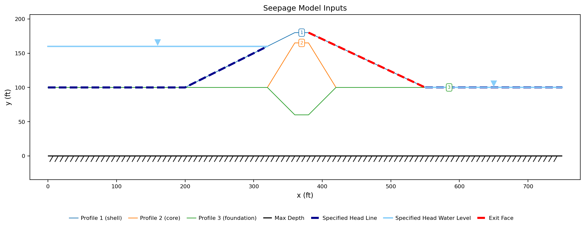{width=1000}

The dark dashed segments are the two specified-head boundaries and the pale lines
with the inverted triangles above them are the water levels those heads stand for
— 160 ft upstream, 100 ft downstream. The heavy red dashed line down the whole
downstream slope is the exit face. The hatched line at elevation 0 is the maximum
depth, the impervious rock the foundation rests on.

The file declares **Units** = `imperial` and **Time** = `day`, so heads and
pore pressures are labeled `ft` and `psf`, the conductivities are feet per
day, and every discharge on this page is cubic feet per day per foot of dam;
[SEEP-1](seep01_sheetpile.md#1-global-parameters) is where those two fields
are explained.

### The three zones

Open **Materials** in the **Inputs** tree and press **Table view**, with
**Show parameters for:** set to **Seepage** alone. The table then shows the
seepage band of the `mat` worksheet and nothing else, which on this model is three
rows:

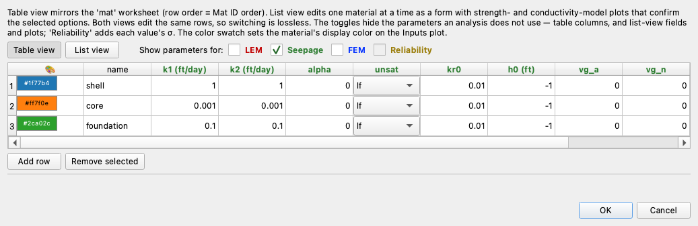

| mat | name | k1 (ft/day) | k2 (ft/day) | alpha | unsat | kr0 | h0 (ft) | vg_a | vg_n |
|:---:|---|:---:|:---:|:---:|---|:---:|:---:|:---:|:---:|
| 1 | `shell` | 1 | 1 | 0 | `lf` | 0.01 | −1 | 0 | 0 |
| 2 | `core` | 0.001 | 0.001 | 0 | `lf` | 0.01 | −1 | 0 | 0 |
| 3 | `foundation` | 0.1 | 0.1 | 0 | `lf` | 0.01 | −1 | 0 | 0 |

All three zones are isotropic — `k1` equals `k2`, so `alpha` means nothing and
stays at 0 — and the whole of the zoning is in the conductivities. The core is a
thousand times tighter than the shell and a hundred times tighter than the
foundation it is keyed into. Those three numbers are what makes this a zoned dam,
and every result on this page traces back to their ratios rather than to their
absolute size.

Unlike SEEP-1's model, this file also carries the strength properties for a
stability run — the shell at γ = 130 pcf, c = 100 psf, φ = 35°, and the other two
zones their own — because the same workbook is used for the limit equilibrium and
finite element analyses of the
[seepage-to-stability worked example](../seep/seep_slope.md#worked-example). A
seepage analysis does not read them.

The `unsat` column and the four columns after it are the subject of a later
section. They are read only above the phreatic surface, so on SEEP-1's confined
problem they were ignored entirely; here they do work. `vg_a` and `vg_n` sit at 0
because the model this file selects does not read them.

### The boundary conditions

Open **Seep BC**. The editor opens on **Set 1**. Every boundary in the set is
listed on the left, and a specified-head entry carries its head value in the list
entry itself; the table on the right holds the selected entry's points and nothing
else. This model has three entries:

| Entry | Type | Value (ft) | Points |
|---|---|:---:|---|
| Head 1 | `head` | 160 | (0, 100), (200, 100), (320, 160) |
| Head 2 | `head` | 100 | (550, 100), (750, 100) |
| Exit face | — | — | (380, 180), (550, 100) |

Head 1 runs along the foundation surface from the upstream end of the section to
the embankment toe, then up the upstream face to elevation 160, which is where the
reservoir surface meets the slope. Everything on that polyline is under water, so
holding it at a head of 160 is exact. Head 2 is the tailwater, applied along the
downstream foundation surface from the toe of the dam out to the end of the
section.

Select the third entry:

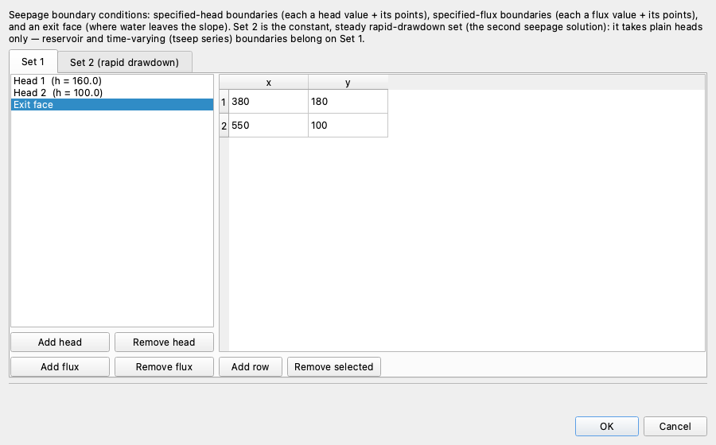

The exit face carries two points and no value, and it covers the whole downstream
slope from the crest at (380, 180) to the toe at (550, 100). Drawing it over the
entire slope rather than over the part expected to be wet is the correct habit:
the active set finds the discharge point, and a face drawn short enough to stop
below the real discharge point would force the water out through a boundary that
was never asked to carry it.

Everything else is no-flow — the rock at elevation 0, the two ends of the section,
and the strip along the top of the dam between the two: the crest, and the part of
the upstream slope that stands above the reservoir surface.

---

## Building the mesh

The file arrives with a mesh and a solved head field beside it, in
`xslope_johnson_res_mesh.json` and `xslope_johnson_res_seep.csv`, which is how a
solved seepage field travels to a stability run. Studio loads both when it opens
the workbook, so pressing **Run Seep…** immediately would solve on the mesh
already there. That mesh is quadratic — 3,362 nodes and 1,605 `tri6` elements —
because the same file is also run through the finite element stability analysis,
which requires quadratic elements. It gives a discharge of **1.9391**.

This page rebuilds the mesh instead, at the linear element type and the element
size the [sample page](../seep/samples.md#johnson-reservoir) catalogues its
discharge at. Click **Build Mesh…**:

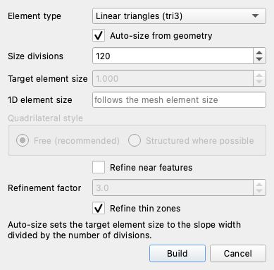

Set **Element type** to **Linear triangles (tri3)**, which is the right choice for
a stand-alone seepage run: head is a scalar field, so there is nothing for a
linear element to lock up on.

Leave **Auto-size from geometry** ticked. It takes the element size from the width
of the section rather than from a number typed in feet, which is what makes the
next field the one to set.

Set **Size divisions** to `120`. The section is 750 ft wide, so the target element
size becomes 750/120 = 6.25 ft, and the grayed **Target element size** box shows
it.

**Quadrilateral style** is disabled, both of its radio buttons with it. It governs
how quadrilaterals are laid out, and the element type chosen above is triangular.

Leave **Refine near features** unticked, which leaves **Refinement factor** grayed
at its default of 3.0. Ticking it would shrink the elements around reinforcement
lines, crack tips and thin material zones by that factor; this section has none of
the first two and no zone thin enough to need the third.

**Refine thin zones** is ticked, which is its default. It gives any zone too thin
to carry about four element rows across its width a local size that will. It finds
no such zone on this model, so the mesh comes out the same either way.

[SEEP-1](seep01_sheetpile.md#how-fine-the-mesh-has-to-be) is where the element
type and the element size are studied; here they are set once and left.

Click **Build**. The mesh comes out at **2,913 nodes and 5,543 triangles**, with
the boundary nodes marked on it:

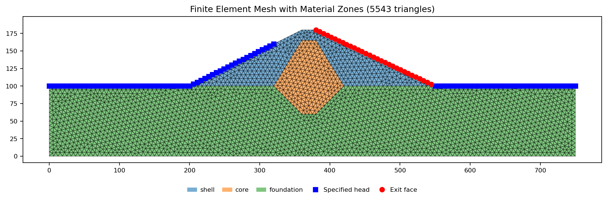{width=1000}

The blue squares are the specified-head nodes, 88 of them across the two head
boundaries. The red circles are the 31 exit-face nodes on the downstream slope.
The three material zones and the two boundary types are all visible on it at once:
the core and its key are drawn in their own color, so a key that failed to reach
elevation 60 or a core that failed to reach elevation 165 would show here rather
than in the answer.

---

## Running the analysis

Click **Run Seep…**:

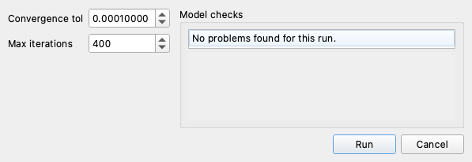

**BC set** stays at `Set 1`. A second set appears in this list only for a file that
defines one, which is how a rapid drawdown analysis carries its drawn-down
boundaries.

**Convergence tol** is the head-change tolerance the unconfined iteration is
tested against, and unlike on SEEP-1's confined problem it is live here. Leave it
at `0.0001` for now — a later section measures what changing it does.

The **Model checks** panel filling the right half of the dialog is the preflight
report for this run: it reads the geometry, the material table and the boundary
set before anything is solved, and an error in it blocks the run. On this file it
reports **No problems found for this run.**

Click **Run**. The Log pane opens with the path the solver took:

```text
Solving UNCONFINED seep problem...
Number of fixed-head nodes: 88
Number of exit face nodes: 31
Starting unsaturated flow iteration...
Convergence tolerance: 1.800000e-02
```

The 31 exit-face nodes are what make this problem unconfined. The tolerance
printed on the last line is not the 0.0001 that was typed: it is scaled by the
height of the domain, 180 ft here, to 0.0001 × 180 = 0.018. What that 0.018 is
compared against is the **relative** head change — the largest change in head at
any node between sweeps, divided by the largest head in the field — so both sides
of the test are dimensionless. The largest head here is 160 ft, so the loosest
head change the test admits is 0.018 × 160 = 2.9 ft at the node that moved most.
Asking for the tolerance as a fraction of the domain rather than as a length is
what lets one default work on a 10 m sheetpile section and on a 180 ft dam.

The run finishes in **23 iterations**:

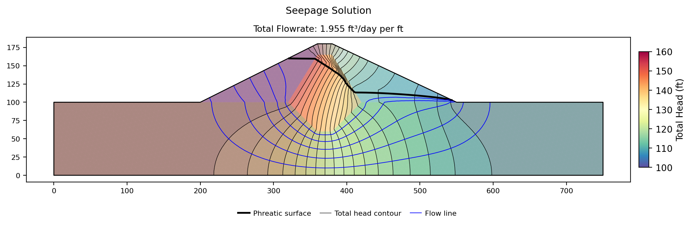{width=1000}

**The total discharge is 1.9546 ft³/day per ft** — per foot of dam measured along
its axis, the convention every quantity a two-dimensional analysis reports carries.
The [sample page](../seep/samples.md#johnson-reservoir) reports 1.9575 for the same
model on the 2,604-node mesh it exported to SEEP2D; the 0.15% between them is the
mesh, not the physics.

The head ranges from **100.000 ft to 160.000 ft**, which is the two boundary values
and nothing outside them, because a region with no sources or sinks inside it can
have no interior maximum or minimum of head.

The pore pressure runs from **−2,577.9 psf to 9,971.1 psf**. The negative end is
the difference from SEEP-1: a confined solution cannot produce a pore pressure
below zero anywhere, and here the whole upper part of the downstream half of the
dam stands above the phreatic surface and is in suction. The largest suction is
**41.31 ft** — a pressure head of −41.31 ft — at (401.9, 169.7), on the downstream
slope about 10 ft below the crest, where the slope stands well above the phreatic
surface and the flow through the unsaturated soil is slowest.

The heavy black line across the section is the phreatic surface. It leaves the
reservoir at elevation 160 where the water meets the upstream slope, runs nearly
flat through the upstream shell, drops steeply through the core, and continues
down through the downstream shell to meet the downstream slope near the toe.

---

## Where the water goes

The flow net says where the water goes, and on a zoned section the answer is not
the one the drawing suggests. Three measurements taken off the solved field make
it concrete.

**The core carries the head drop.** At elevation 110 the core runs from x = 326 to
x = 414, so reading the solved head at x = 315 and x = 425 straddles it with about
10 ft of shell either side. Those two readings are **159.32 ft** and **113.18 ft**:
the core absorbs **46.13 ft of the 60 ft** total drop — 77% of it, across 88 ft of
a 750 ft section. The shell either side of it stands at nearly the full reservoir
head or nearly the full tailwater head, and the steep hydraulic gradient that would
otherwise run through the embankment is confined to a zone built to take it.

**The key does not stop the underseepage.** Integrating Darcy's horizontal velocity
up the dam centerline at x = 370 gives **1.9619 ft³/day per ft** crossing that
section, which is the total discharge to within the discretization. Of it,
**1.7672 — 90.1% — passes below elevation 60**, the bottom of the cutoff key,
through foundation the key does not reach. Only a tenth of the water that reaches
the tailwater goes through the core itself. The key reaches 40 ft into a 100 ft
foundation, leaving 60 ft of foundation open beneath it, so this dam's discharge is
set by the foundation rather than by the embankment.

**Some of the flow is above the phreatic surface.** Above the phreatic surface the
conductivity is reduced by *k<sub>r</sub>*, not switched off, so the unsaturated
soil still carries water. Splitting the same velocity integral at the phreatic
surface, in the downstream shell where the unsaturated zone is thickest:

| Section | q across it (ft³/day per ft) | Phreatic surface (ft) | Above it | Share |
|:---:|---:|---:|---:|---:|
| x = 400 | 1.9531 | 124.98 | 0.0998 | 5.1% |
| x = 450 | 1.8955 | 112.31 | 0.0846 | 4.5% |
| x = 500 | 2.0676 | 108.84 | 0.2139 | 10.3% |

Each of those section integrals reproduces the reported total discharge only to
within 6% — x = 400 comes out 0.1% low, x = 450 3.0% low, x = 500 5.8% high — so
the shares beside them are good to a few points rather than to the tenth. Read
that way, somewhere between about a twentieth and a tenth of the flow crossing the
downstream shell travels through unsaturated soil. That is small, and it is not
zero, which is what gives the choice of unsaturated model something to act on.

The pore-pressure field draws the same story as a field rather than as numbers:

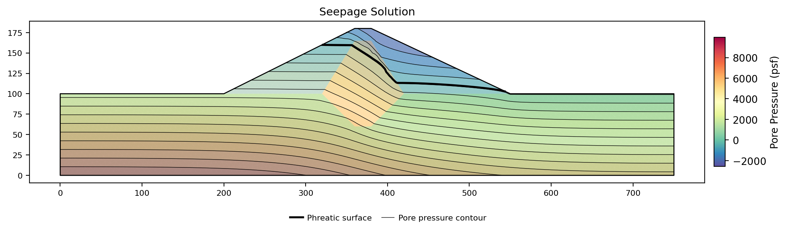{width=1000}

Contours below the phreatic surface are positive pressures increasing with depth,
and the crowding of them through the core is the 46 ft of head the core takes. The
region above the surface, in the downstream shell and the top of the core, is all
negative.

### How the phreatic surface is arrived at

The phreatic surface is not an object the solver tracks. It is the ψ = 0 contour of
the solved pressure-head field, drawn afterward by the plotting routine on any
solution whose pore pressure goes negative somewhere. Nothing places it, and
nothing constrains it to be smooth or single-valued.

What the solver iterates on is the two things that make the problem nonlinear.
Each sweep recomputes the pressure head from the current head field, evaluates
*k<sub>r</sub>*(ψ) at each element's integration points and scales that element's
saturated stiffness by the average, solves the resulting linear system, and updates
the exit-face active set. Averaging *k<sub>r</sub>* over an element's integration
points rather than switching it node by node smears the wet-to-dry transition over
one element instead of snapping it across a node.

Two consequences follow for reading the result. The phreatic surface is resolved to
about one element — 6.25 ft here — so a phreatic elevation quoted to better than
that is quoting the interpolation rather than the physics. And the surface is a
consequence of the head field, so it moves only when the head field moves: the
next section runs three different unsaturated models and finds the surface moving
by less than half a foot between them.

---

## Scaling the flow net on a zoned section

The blue lines on the solution plot are flow lines, contours of a stream function
computed by a companion solve on the same mesh. Water flows along a flow line and
never across one, so the strip between two adjacent flow lines is a **flow
channel** carrying a fixed share of the discharge.
[SEEP-1](seep01_sheetpile.md#reading-the-flow-net) is where flow nets are read.

How many flow lines get drawn is not a matter of taste. A flow net reads correctly
only when its cells come out as curvilinear squares, and for such a net

$$ q = k \, \Delta h \, \frac{N_f}{N_d} $$

with *N<sub>f</sub>* the number of flow channels and *N<sub>d</sub>* the number of
head drops. The renderer knows *q*, and *N<sub>d</sub>* is one less than the
head-contour count requested through **levels**, so it computes the
*N<sub>f</sub>* that satisfies the identity and asks the contouring routine for
*N<sub>f</sub>* + 1 stream-function levels — one more line than channels, and
never fewer than two.

That leaves one thing to supply — the *k*. On SEEP-1's single-soil problem there
was only one candidate and the argument was inert. On a zoned section there are
three, they differ by three orders of magnitude, and the answer changes by three
orders of magnitude with them. That argument is **base_mat**, a 1-based index into
the `mat` sheet, and this dam is where it matters. With 20 contour levels, so 19
head drops of 3.158 ft each, and a 60 ft head drop:

| base_mat | Zone | k (ft/day) | N<sub>f</sub> = q·N<sub>d</sub>/(k·Δh) | φ contour levels requested |
|:---:|---|:---:|---:|:---:|
| 1 | shell | 1 | 0.62 | 2 |
| 2 | core | 0.001 | 618.96 | 620 |
| 3 | foundation | 0.1 | 6.19 | 7 |

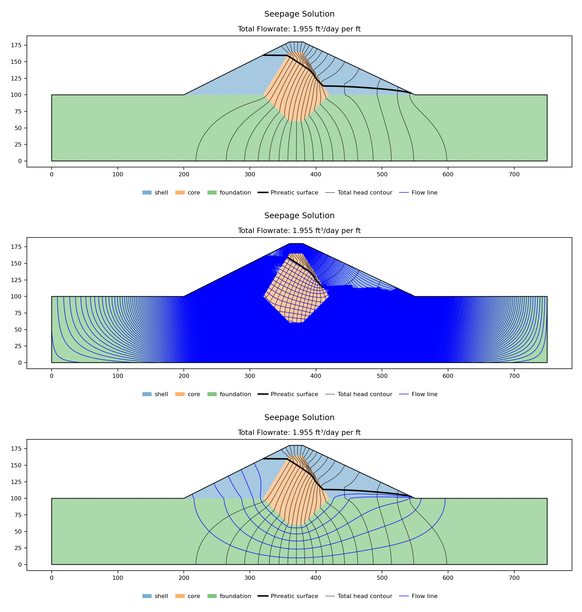{width=1000}

Scaled to the shell, the net asks for less than one flow channel, so the count
falls to its floor of two levels, both of them on the extreme values of the stream
function; the top panel has no flow lines in it at all. Scaled to the core, it asks for 619 channels,
and nearly the whole section fills with solid blue, with only the core coarse
enough to show individual lines. Only the foundation gives a
net that can be read, and the reason is arithmetic rather than aesthetic: 90% of
the discharge crosses the foundation, so the foundation is the zone the identity
above is nearly true of, and a net drawn in a zone that carries almost none of the
flow has to be either impossibly coarse or impossibly fine to satisfy it.

The rule this follows is that **base_mat must name a real material — the zone that
carries the through-flow — and never a padded or averaged value**. A conductivity
invented to make a picture look right would draw a net that no longer satisfies the
flow-net identity, which is the only thing making the picture readable in the first
place. XSLOPE picks the base material this way when none is named: it takes the
zone whose channel count lands nearest a readable one, which for a net of
*N<sub>d</sub>* drops is about *N<sub>d</sub>*/2 channels. On this model that
choice is the foundation, material 3, which is what the sample figure and every
flow net on this page are drawn with.

Reading the drawn net back is a check on all of it. The bottom panel has 6 flow
channels and 19 head drops in the foundation, so

$$ q = 0.1 \times 60 \times \frac{6}{19} = 1.895 \text{ ft³/day per ft} $$

against the computed 1.9546 — 3.1% low, and the whole of that gap is the rounding
of 6.19 channels down to the 6 that can actually be drawn.

---

## The three unsaturated models

Above the phreatic surface the governing equation carries *k<sub>r</sub>*(ψ), and
XSLOPE offers three functions for it, chosen per material through the `unsat`
column. Open **Materials**, press **List view**, and scroll to the **Conductivity**
group:

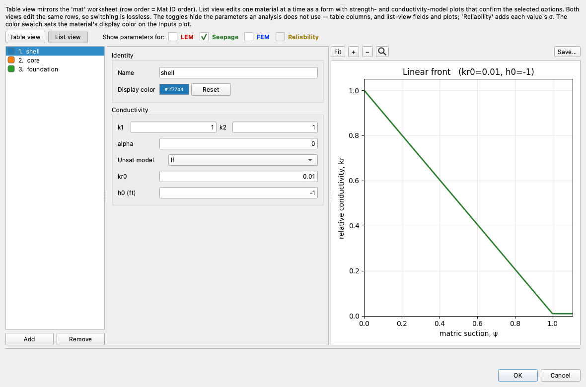

**Unsat model** is the selector, and the lower of the two plots on the right — the
upper one is the strength envelope — redraws as it changes, so the curve a choice
implies is visible before anything is run. Its axis is labeled *matric suction, ψ*
and runs positive, which is the suction rather than the pressure head. The parameter
fields below it follow the selection: with `lf` chosen, `kr0` and `h0` are shown
and the van Genuchten and Gardner parameters are hidden, because the linear front
does not read them.

### What each model assumes

**Linear front** (`lf`) is the default and the model this file uses. It holds
*k<sub>r</sub>* at 1 in the saturated soil, falls linearly to a floor value
*kr<sub>0</sub>* as the pressure head reaches *h<sub>0</sub>*, and stays at that
floor beyond it. It takes two parameters, needs no special functions, and gives a
transition across the phreatic surface that a solver finds easy. It carries no soil physics —
it is a shape chosen to be well-behaved — and the
[seepage overview](../seep/overview.md#linear-front-lf) recommends it for slope
stability work, where suction is conservatively neglected in the strength anyway
and the shape of the curve has little influence on the result.

**van Genuchten** (`vg`) is the standard model of unsaturated soil mechanics, a
retention curve of parameters α and *n* passed through Mualem's conductivity
relation. Its parameters are measurable and tabulated: the
[overview](../seep/overview.md#van-genuchten-model) carries the
Carsel & Parrish (1988) table by USDA soil texture, the same dataset HYDRUS and
most unsaturated-flow codes use. Choose it when the soils are characterized, when
an unsaturated result has to be defensible, or when the model is being compared
against a code that uses it.

**Gardner** (`gard`) is the power form *k<sub>r</sub>* = 1/(1 + *a*|ψ|<sup>*n*</sup>),
the legacy option in SEEP/W and Slide. Choose it to reproduce a model imported from
one of those packages, which will carry *a* and *n* in exactly this form, or to
match a curve fitted to measured data. It has no published texture table to read
parameters off; the [seepage overview](../seep/overview.md#gardner-gard)
tabulates fitted equivalents for the twelve Carsel & Parrish textures,
produced the same way as the fits below.

The van Genuchten and Gardner models share one pair of input columns, `vg_a` and
`vg_n`, read according to whichever is selected.

### Parameters for these three soils

Running the three models against each other means giving each of them parameters
for the same soil, and each model gets those parameters a different way — one of
the three does not get them from the soil at all.

The linear front's are already in the file: *kr<sub>0</sub>* = 0.01 at
*h<sub>0</sub>* = −1 ft, the same pair on all three materials. That pair is a
numerical shape rather than a measurement of any of these soils, and the section
after the comparison turns that difference into the explanation for the gap.

The van Genuchten parameters come from the Carsel & Parrish table, each material
matched to the nearest texture by saturated conductivity — sandy clay loam for the
1 ft/day shell, clay loam for the 0.1 ft/day foundation, clay for the core. The
table gives α in 1/cm, and XSLOPE is unit-agnostic, so α is converted to this
model's foot by multiplying by 30.48. *n* is dimensionless and carries over
unchanged.

The shell and the foundation match well. The core does not: the clay Carsel &
Parrish measured is a natural soil of about 0.16 ft/day, over a hundred times this
core's 0.001, and no texture in that dataset comes down to an engineered clay
fill. The core's curve is therefore the shape of a clay rather than a measurement
of this one.

The Gardner parameters have no table to read off, so each material's pair is a
least-squares fit to that same material's van Genuchten curve, in
log *k<sub>r</sub>* over suctions from 0.01 to 100 ft. Fitting them that way is
what makes the three-way comparison a comparison of models rather than of soils.

| Material | k (ft/day) | Texture | vg `a` (1/ft) | vg `n` | gard `a` | gard `n` | RMS misfit |
|---|:---:|---|:---:|:---:|:---:|:---:|:---:|
| shell | 1 | sandy clay loam | 1.798 | 1.48 | 115.5 | 2.29 | 0.164 |
| core | 0.001 | clay | 0.244 | 1.09 | 128.2 | 1.03 | 0.252 |
| foundation | 0.1 | clay loam | 0.579 | 1.31 | 52.8 | 1.61 | 0.237 |

The last column is the root-mean-square difference between the Gardner and van
Genuchten curves in log<sub>10</sub> *k<sub>r</sub>* over that range of suctions —
about a quarter of a decade at worst, which is as close as a two-parameter power
law gets to a van Genuchten curve. Gardner's *a* is not van Genuchten's α and the
values are not comparable: with *n* fixed, *k<sub>r</sub>* falls to one half at a
suction of *a*<sup>−1/*n*</sup>, so a large *a* means a curve that starts dropping
immediately.

Drawn against each other, on this dam's own soils and parameters, with both axes
logarithmic — the curves differ by decades and across decades, and on log axes the
linear front's straight line reads as the cliff a solver sees:

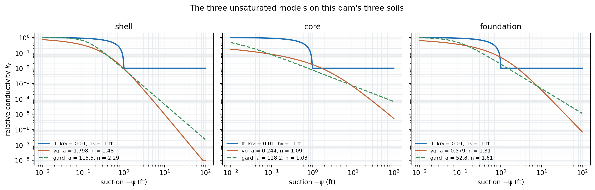{width=1000}

The van Genuchten and Gardner curves lie close together on the shell and the
foundation, which is what the fit was for. On the core they part by about a
quarter of a decade over the wet end — 0.18 against 0.45 at a hundredth of a foot
of suction — and cross near one foot; that gap is the 0.252 in the table above,
the worst of the three fits. The linear front lies with none of them, and reading
the three off at four suctions on the shell's parameters says where they part:

| ψ (ft) | −0.5 | −1 | −5 | −20 |
|---|---:|---:|---:|---:|
| `lf` | 0.50500 | 0.01000 | 0.01000 | 0.01000 |
| `vg` | 0.04469 | 0.00947 | 0.00010 | 0.00010 |
| `gard` | 0.04062 | 0.00858 | 0.00022 | 0.00010 |

Between zero and one foot of suction the linear front stays much wetter: at half a
foot it is halfway down its straight line, at
*k<sub>r</sub>* = 0.01 + 0.99 × 0.5 = 0.505, an order of magnitude above the other
two. Below one foot it stops falling entirely and holds its floor of 0.01, while
the other two continue down to the solver's own floor of 10<sup>−4</sup> and stay
there. Over most of the unsaturated zone of this dam — where suctions of ten to
forty feet are ordinary — the linear front leaves the soil a hundred times more
conductive than the other two models do.

### Running all three

Change the `unsat` column and its parameters on all three materials, rebuild
nothing, and run again. The mesh, the geometry, the conductivities and the boundary
conditions are identical across the three runs; only the curve above the phreatic
surface changes.

**Relaxation** in the last column is how much of each new solve the iteration
actually takes. The full step is taken through sweep 20; past that the new field is
blended with the previous one, at 0.5 first and lower as the sweep count climbs,
which is the solver's response to slow progress rather than a setting. All three of
these runs finish just past sweep 20 — `lf` by three sweeps, `gard` by seven,
`vg` by eight — so all three take their last step at 0.5 and none reaches the
next rung.

| Model | q (ft³/day per ft) | Iterations | Flow above the phreatic surface at x = 500 | Relaxation at the last sweep |
|---|---:|---:|---:|---:|
| `lf` | 1.9546 | 23 | 10.3% | 0.50 |
| `vg` | 1.8649 | 28 | 8.3% | 0.50 |
| `gard` | 1.8661 | 27 | 8.6% | 0.50 |

The two calibrated models agree with each other to **0.06%** in discharge, and
both sit **4.5 to 4.6% below** the linear front. That gap is the whole of what the
choice of model is worth on this dam's total discharge.

On the phreatic surface it is worth less still:

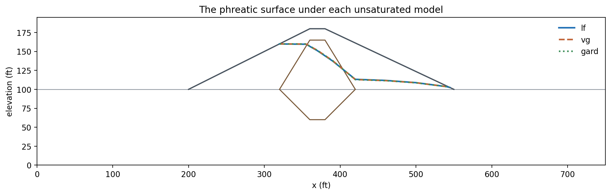{width=1000}

At section scale the three surfaces are one line. Read station by station, the
linear front and van Genuchten differ by at most **0.40 ft** anywhere, the linear
front and Gardner by at most **0.35 ft**, and van Genuchten and Gardner by at most
**0.08 ft** — on a dam 80 ft tall, under a 60 ft head, on a mesh whose elements are
6.25 ft.

The lower panel shows where those tenths of a foot are, and they do not all point
the same way. Over the crest of the core, at x = 370 and x = 390, the two
calibrated models hold the surface **0.32 to 0.40 ft higher** than the linear
front. At the downstream toe of the core, at x = 420, they put it **0.29 to
0.33 ft lower**, and that deficit shrinks downstream — 0.21 to 0.25 ft at x = 460,
about a tenth of a foot at x = 500, less than that at x = 540. The surface pivots
about the core rather than shifting up or down as a whole, and the two calibrated
models pivot together, staying within 0.08 ft of each other at every station.

These are differences between three runs on one mesh, so the discretization error
common to all three cancels out of them. That is what makes a shift smaller than
one element worth reading at all.

Which model to choose follows from those two comparisons, and it is why the
[overview](../seep/overview.md#unsaturated-flow-formulation) recommends the linear
front for stability work. The pore pressures that drive a stability analysis are
the ones *below* the phreatic surface, and those are set by the saturated
conductivities and the boundary conditions. If the deliverable is a factor of
safety, any of the three gives it. If the deliverable is a discharge — a seepage
collection design, a reservoir loss estimate, a comparison against a measured
tailwater flow — a 4.6% spread is worth caring about, and the model whose
parameters can be defended from measurements is the one to use.

### Why the linear front passes more water

The candidate explanation for that 4.6% is the floor: the linear front holds
*k<sub>r</sub>* at 0.01 through the deep unsaturated zone, a hundred times more
conductive than the other two models leave it, so it carries more water through
that zone. The test of the explanation is a measurement that could contradict it,
and the next run makes that measurement. If the
floor is what makes the difference, lowering *kr<sub>0</sub>* to the
10<sup>−4</sup> the other two models bottom out at should bring the linear front to
their answer; if the difference is coming from somewhere else, it will not.

Sweeping *kr<sub>0</sub>* with *h<sub>0</sub>* held at −1 ft:

| kr<sub>0</sub> | 0.1 | 0.03 | 0.01 | 0.003 | 0.001 | 0.0003 | 0.0001 |
|---|---:|---:|---:|---:|---:|---:|---:|
| q | 2.6328 | 2.1136 | 1.9546 | 1.8957 | 1.8782 | 1.8723 | 1.8707 |
| Iterations | 11 | 14 | 23 | 24 | 22 | 145 | 148 |

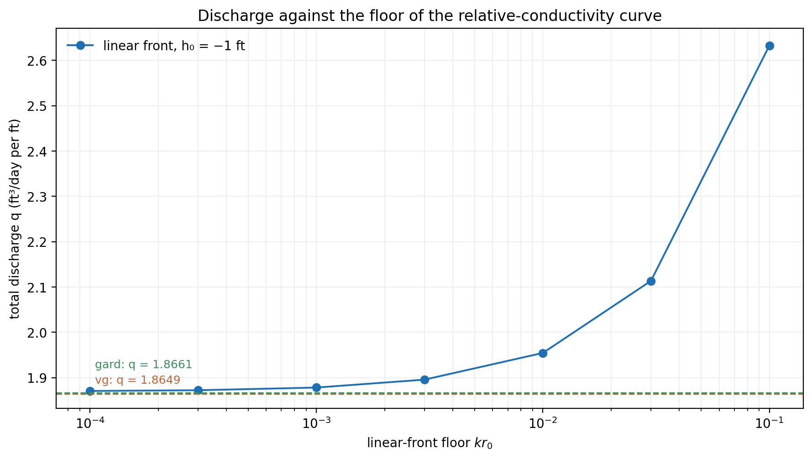{width=900}

The series lands on the reference lines, which sit 0.0012 apart and draw as one
dashed line under two labels. At a floor of 10<sup>−4</sup> the linear
front gives **1.8707**, against van Genuchten's 1.8649 and Gardner's 1.8661. Of the
0.090 gap it started with, 0.006 is left, so the floor alone accounts for **93%** of
the difference between the linear front and the two calibrated models. It works the
other way too: at *kr<sub>0</sub>* = 0.1, a tenth of the saturated conductivity
retained everywhere above the phreatic surface, the discharge rises to **2.6328**,
35% above the shipped answer, on a change that alters nothing about the saturated
soil. Across the whole thousandfold sweep of the floor the discharge moves by 41%.

The linear front's other parameter behaves the way that explanation predicts.
Holding *kr<sub>0</sub>* at 0.01 and sweeping *h<sub>0</sub>* — the pressure head at
which the floor is reached, and so the entire shape of the curve above it — moves the
discharge from 1.9487 at −0.5 ft to 2.0382 at −10 ft: a **4.6%** spread across a
twentyfold change, against the floor's 41% across a thousandfold one. On a dam whose
unsaturated zone stands tens of feet above the water inside it, what the curve does
in its first foot of suction hardly matters and where it bottoms out matters a great
deal.

---

## What the unsaturated parameters cost in convergence

Sweeping *kr<sub>0</sub>* changed more than the answer, as the iteration row of
that table shows. The five coarsest floors converged in 11 to 24 sweeps; the two
finest took 145 and 148, far enough into the run for the solver to have dropped
its step to a hundredth of each new solve. That cost is what stands between a
plausible set of unsaturated parameters and a run that finishes.

### The three conditions

An unconfined run stops when all three of these hold at once, and reports
`converged = False` if it runs out of iterations first.

**Head change.** The largest change in head at any node between sweeps, divided by
the largest head in the field, below the tolerance from the **Run Seepage** dialog
scaled by the domain height — 0.018 here, a ratio rather than a length. This
measures whether the head field has stopped moving.

**Flow closure.** The unsigned nodal flow residual at the free nodes, recomputed
with the conductivity rebuilt from the current unrelaxed heads, below a default of
0.1% of the inflow. This measures whether the *k<sub>r</sub>* field is consistent
with the head field it was computed from, in flow units. It is not a mass balance
on the reported discharge: the two are different quantities and differ by orders of
magnitude on the same solve. The head test cannot see the *k<sub>r</sub>* lag,
which is why this one exists — an iterate can sit still while its conductivities
are still wrong.

**Exit-face stability.** The active set unchanged since the previous sweep. A
discharge computed while nodes are still switching between seeping and no-flow
belongs to no one set of boundary conditions.

The relaxation ladder runs further down than the model comparison reached. Below
the 0.5 those three runs stopped at, the step drops to 0.2, 0.1, 0.05, 0.02 and
0.01 after sweeps 40, 60, 80, 100 and 120. The two finest floors of the
*kr<sub>0</sub>* sweep ran to 145 and 148, past the last rung.

The head tolerance is the only one of the three the dialog exposes, and it turns
out to control the iteration count rather than the answer:

| Convergence tol | Scaled to | q | Iterations |
|---:|---:|---:|---:|
| 0.001 | 0.18 | 1.954617 | 23 |
| 0.0001 | 0.018 | 1.954617 | 23 |
| 0.00001 | 0.0018 | 1.954618 | 24 |
| 0.000001 | 0.00018 | 1.954616 | 28 |

A thousandfold tightening moves the discharge in the sixth figure and costs five
extra sweeps. The reason is the flow-closure condition: whichever head tolerance is
asked for, the run does not stop until the conductivity field has stopped lagging
the head field to within 0.1% of the inflow, and by then the head has stopped
moving anyway. The default needs no adjustment on a model of this kind.

### The run that does not finish

The parameter set that makes this dam hard is the one that tries to draw a van
Genuchten curve with straight lines: a floor of 10<sup>−4</sup>, matching where the
other two models bottom out, reached over 10 ft of suction rather than one.
Set `unsat` to `lf` with `kr0` = `0.0001` and `h0` = `-10` on all three materials
and run it. The solver uses all 400 sweeps its default ceiling allows and then
stops:

```text
Iteration 400: residual = 1.378519e-04, closure = 6.779e-01, relax = 0.010, 1/31 exit face active
Warning: Did not converge in 400 iterations
…
WARNING: seepage solution did not converge — flowrate is unreliable (solution['converged'] is False).
```

The elided lines are the solver's own convergence history — every twentieth sweep
of it — the inflow-against-outflow check on the final head field, and the range of
the stream function.

The last iteration line reports all three conditions. The relative head change is
1.38 × 10<sup>−4</sup> against a tolerance of 0.018 — inside it by two orders of
magnitude, and it had gone inside it **by sweep 50**, so it has been satisfied for
seven eighths of the run. The `1/31 exit face active` at the end of the line is the
third: the set settled to a single active node by sweep 7 and has not moved since.
What has not converged is the flow closure, at 0.678 against a target of 0.001, and
it is not creeping toward it:

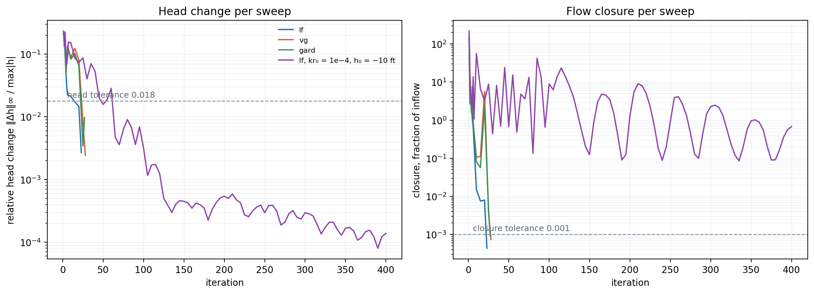{width=1000}

The left panel is the condition the dialog's tolerance controls, and on this run it
is satisfied and irrelevant. The right panel is the one that decides. The three
well-behaved models drop through both thresholds inside thirty sweeps and stop
there. The hard run oscillates over three decades, between 0.09 and 200, for four
hundred sweeps — each sweep computes a
conductivity field from a head field, gets a head field back that implies a
different conductivity field, and swings between them. A curve that falls four
decades over ten feet of suction puts most of the unsaturated zone on the steep
part of it, where a fraction of a foot of head change moves *k<sub>r</sub>* by a
factor of several, and the fixed-point iteration is chasing a target that moves
faster than it does.

Had the run reported a number and stopped, the number would have looked fine:
**1.9706**, a plausible discharge in the middle of everything else on this page.
The fix is the ceiling, not the tolerance. Raising `max_iter` from its default of
400 to 1,000 lets the same model converge in **963 iterations**, at
*q* = **1.9755** — 0.25% from the truncated value, close enough that the truncated
one was nearly right and far enough that nothing about the run said so. The cost of
getting there is 963 sweeps against the shipped parameters' 23, on a model of
2,913 nodes.

Three working rules come out of that. Check `converged` before quoting a flowrate,
because a non-converged run still returns one. When a run does not converge, read
which of the three conditions failed rather than reaching for the tolerance — the
one the dialog exposes is often the one already satisfied. And prefer a gentler
relative-conductivity curve when nothing about the result depends on its shape,
which on a stability model is the usual case.

---

## Giving the seepage face something to do

The seepage face has been quiet on every run so far: one of its 31 nodes active,
at (544.5, 102.58), 2.6 ft above the downstream toe. That is a correct answer and a
poor demonstration, because it makes the exit face look like a boundary condition
that barely earns its keep. The reason it is quiet is the core. The core drops the
head to within about 13 ft of the tailwater, so the phreatic surface in the
downstream shell runs low — elevation 113.3 at the downstream edge of the core,
103.7 at x = 540 — and stays well under the slope above it, meeting the face 2.6 ft
above the toe. Everything higher up the slope is dry.

Raising the core's conductivity is two cells on one row — **k1** and **k2** on
material 2 — and it makes the face work. Everything else, including the exit-face
polyline itself, stays exactly as it was:

| Core k (ft/day) | q (ft³/day per ft) | Exit-face nodes wet | Highest wet node | Iterations |
|:---:|---:|:---:|---|---:|
| 0.001 | 1.9546 | 1 of 31 | (544.5, 102.6) | 23 |
| 0.01 | 2.2258 | 1 of 31 | (544.5, 102.6) | 17 |
| 0.1 | 4.3501 | 2 of 31 | (539.0, 105.2) | 20 |
| 1 | 10.2959 | 8 of 31 | (506.1, 120.6) | 8 |

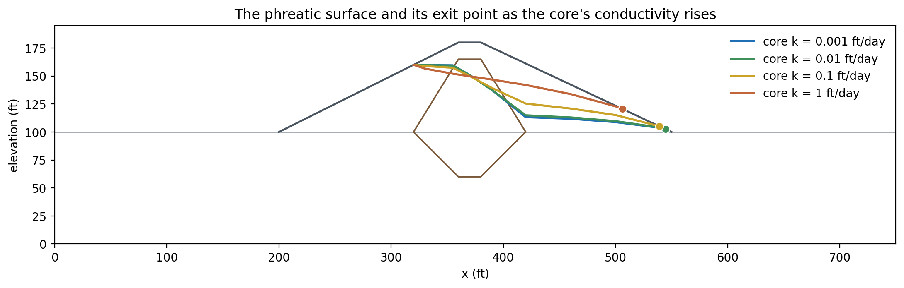{width=1000}

With the core given the shell's own conductivity, the embankment becomes one soil
and the cutoff key becomes a trench of that soil through the foundation, ten times
more conductive than the foundation around it. The discharge is **5.3 times** what
the intact core allows, and the water
comes out **20.6 ft above the toe** instead of 2.6 ft above it, over 8 of the 31
nodes. Nothing about the boundary condition was changed to produce that. The active
set found a different discharge point because the head field gave it one, which is
the property that separates an exit face from the other three boundary types: it is
the only one whose extent is an output.

The discharge point matters beyond the seepage analysis. Water emerging partway up
a downstream slope carries a seepage force out of the face and saturates the soil
above the toe, which is the condition that drives shallow downstream instability and
the reason a real dam of this kind carries a filter or a toe drain.
[Sample Problem 6](../seep/samples.md#6-earth-dam-with-core-and-filter) is a dam
that carries one.

---

## From this head field to a stability analysis

A pore pressure at every node of the mesh is what a stability analysis needs, and
this file is set up to hand it over: all three materials carry `seep` in their **u** column, so every
slice base and every Gauss point reads the solved field rather than a piezometric
line.

The handover is by file. A solved run writes `xslope_johnson_res_mesh.json` and
`xslope_johnson_res_seep.csv` beside the workbook, and loading the workbook again
for a stability run picks both up by name. That pair is what arrived with the
download at the top of this page.

The one thing that has to be decided before the seepage run, rather than after, is
the element type. A finite element stability analysis requires quadratic elements,
so a mesh built at `tri3` for a fast seepage solve has to be rebuilt at `tri6`
before it can carry one. That is why the mesh shipped with this file is quadratic,
and why its discharge of 1.9391 differs slightly from the 1.9546 of the linear
tri3 mesh built above.

[Seepage and Slope Stability](../seep/seep_slope.md#worked-example) carries this
same dam through the rest of the workflow: a Spencer search on the seepage-derived
pore pressures at **FS = 1.25**, and a finite element strength-reduction analysis on
the same mesh and the same field at **FS = 1.25** as well.

---

## Conclusion

This tutorial demonstrated:

- An unconfined problem identified by its boundary conditions rather than by a
  setting — **31 exit-face nodes**, so an iterated solve, a phreatic surface, and
  pore pressures from **−2,577.9 to 9,971.1 psf** where a confined solve can produce
  no negative pressure at all.
- A seepage face as the only boundary type whose extent is an output: the same
  31-node polyline down the whole downstream slope, resolved by an active-set sweep
  to **1 wet node** at (544.5, 102.6) on the dam as built, and to **8 wet nodes**
  reaching (506.1, 120.6) when the core is given the shell's conductivity.
- A discharge of **1.9546 ft³/day per ft** in **23 iterations**, with the core
  taking **46.13 ft of the 60 ft** head drop across 88 ft of a 750 ft section,
  **90.1%** of
  the centerline flow passing *below* the cutoff key through foundation it does not
  reach, and somewhere between **5% and 10%** of the flow in the downstream shell
  traveling above the phreatic surface.
- A flow net whose channel count is set by the base material: **0.62 channels**
  scaled to the shell, **619** scaled to the core, **6.19** scaled to the
  foundation that carries the through-flow — and the drawn net read back at
  q = k·Δh·N<sub>f</sub>/N<sub>d</sub> = **1.895**, 3.1% from the computed answer
  and all of it the rounding of 6.19 channels to 6.
- Three unsaturated models on one mesh: **1.9546** for the linear front,
  **1.8649** for van Genuchten and **1.8661** for a Gardner curve fitted to it —
  the two calibrated models 0.06% apart and both 4.5 to 4.6% below the linear
  front — with the phreatic surface moving by at most **0.40 ft** across all three,
  and in opposite directions either side of the core.
- That difference traced to the floor of the curve rather than to its shape: the
  linear front swept from **2.6328 at kr₀ = 0.1 down to 1.8707 at 10⁻⁴**, where it
  closes **93%** of its gap to van Genuchten, against a 4.6% spread from sweeping
  h₀ over a twentyfold range.
- A convergence test of three conditions, of which the exposed tolerance is the
  least binding — **1.95462 at every tolerance from 10⁻³ to 10⁻⁶** — and a
  linear front at **kr₀ = 10⁻⁴, h₀ = −10 ft** whose relative head change sat two
  orders of magnitude inside tolerance from sweep 50 onward while its flow closure
  oscillated over three decades, from 0.09 to 200, stopping at
  **q = 1.9706 with converged = False** at the
  default ceiling and reaching **1.9755 in 963 iterations** when the ceiling was
  raised.

**Where to go next:** the [tutorials index](index.md) lists the series.
[Seepage Analysis](../seep/overview.md) carries the governing equations, all three
unsaturated models with their parameter tables, and the convergence conditions in
full; [Sample Problem 5](../seep/samples.md#johnson-reservoir) catalogues this model
and reports its cross-check against the USACE SEEP2D program on a mesh identical to
the one it exported to SEEP2D;
[Seepage and Slope Stability](../seep/seep_slope.md) takes this head field into a
limit equilibrium search and a finite element strength reduction on the same file;
and [Sample Problem 9](../seep/samples.md#9-johnson-reservoir-zoned-drawdown-transient)
is this same dam solved through a 45-day reservoir drawdown, where the boundaries
move and the answer depends on when the dam is examined.
[SEEP-1](seep01_sheetpile.md) is where a seepage model gets built from nothing.
