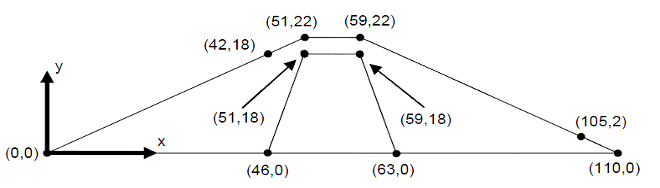
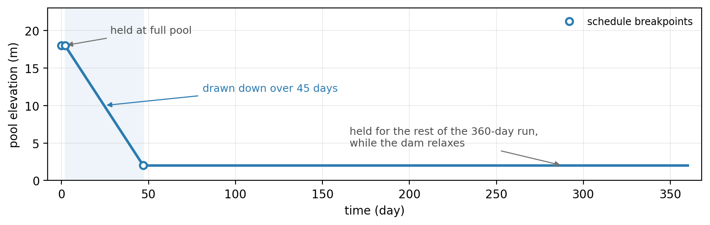
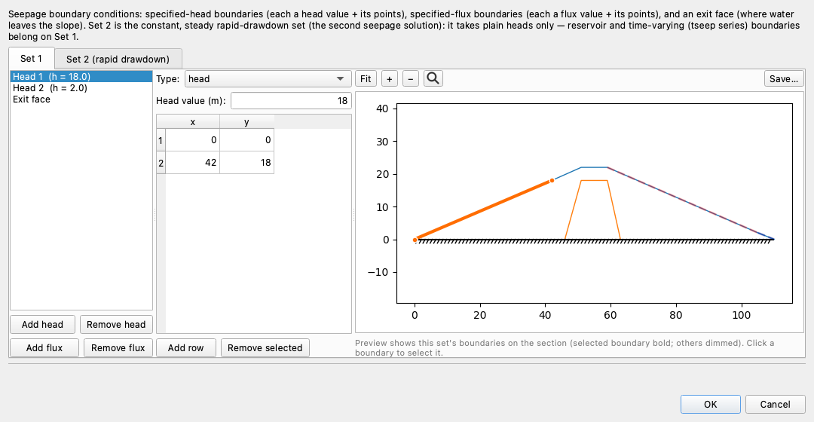
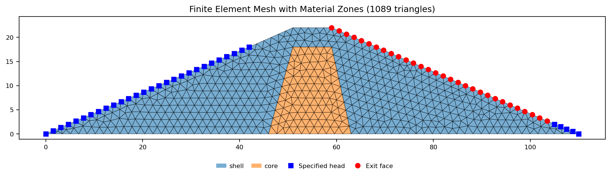
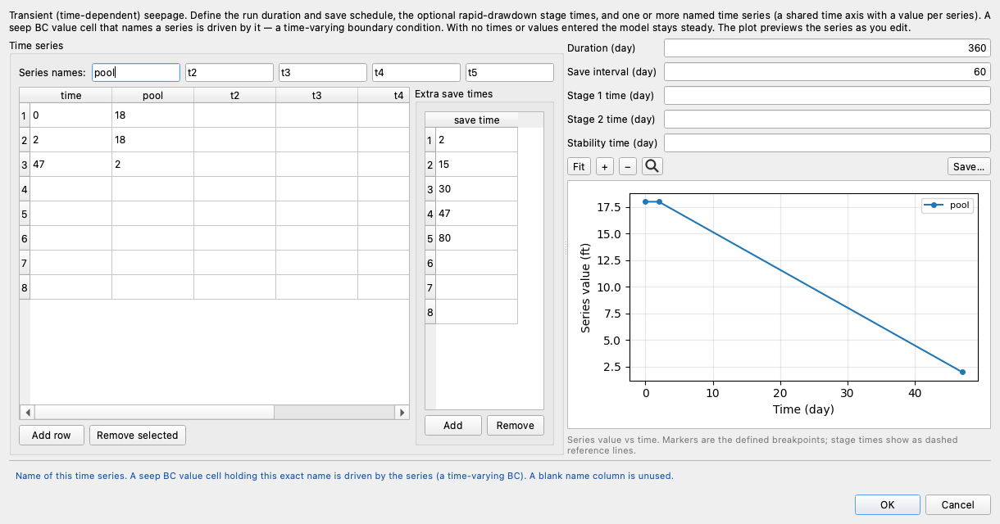
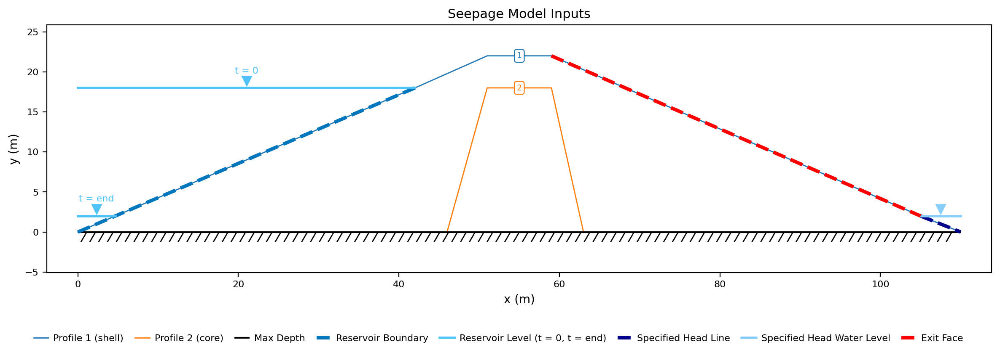
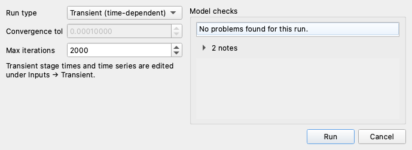
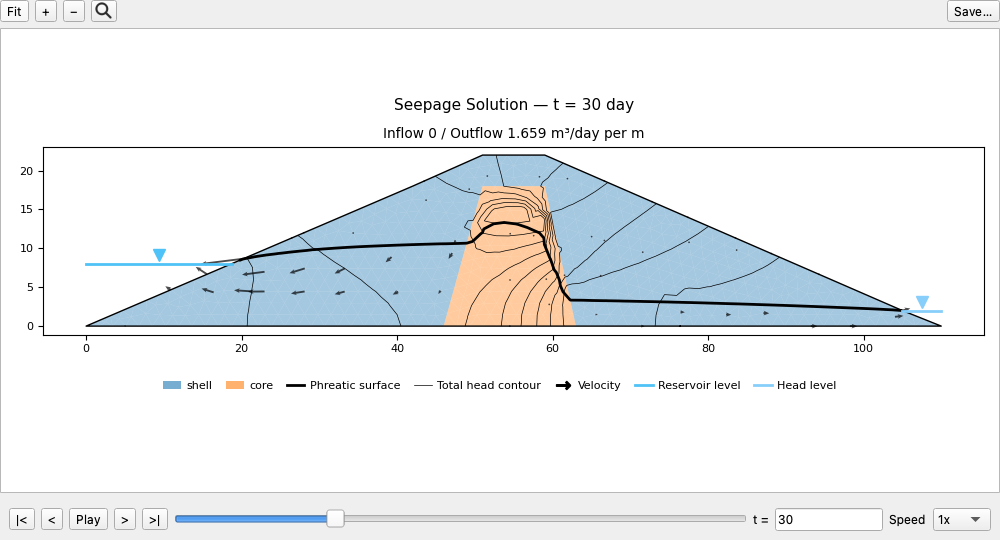
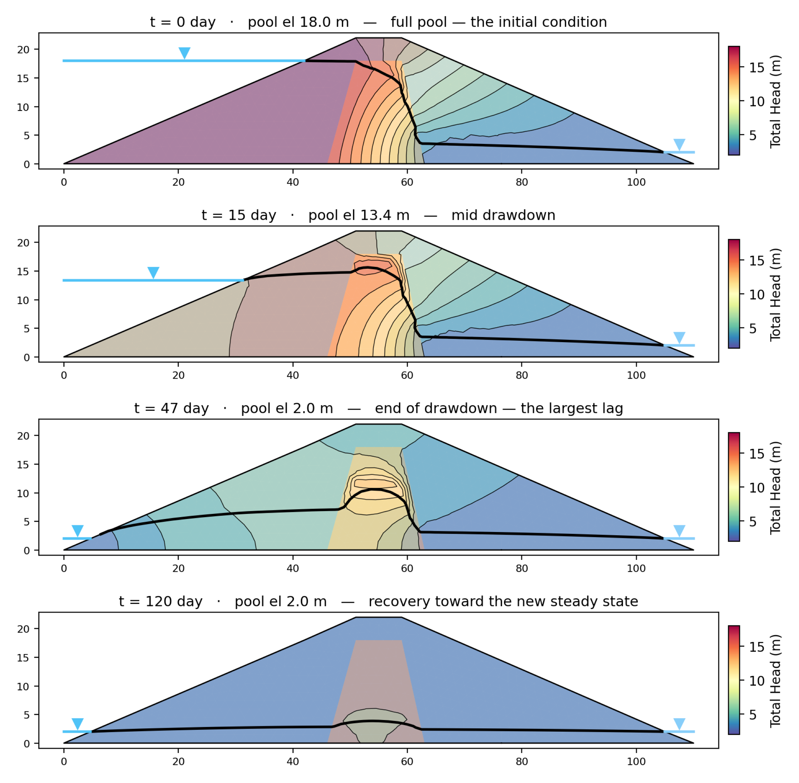
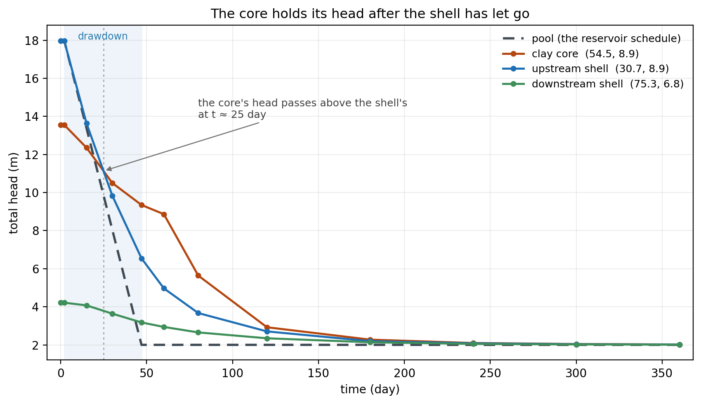

# Tutorial SEEP-3 — Transient Seepage: Reservoir Drawdown

This tutorial works a **transient** seepage problem — one where the boundaries
move and the answer depends on when the ground is examined — and what such an
analysis adds to a steady one. Two of the additions are things the modeler
supplies: the **storage properties** that decide how much water a soil gives up
as the head in it falls, and the **schedule** that states when the boundary moves
and which instants get saved. A third is computed rather than entered — the
**initial condition** the march starts from. And the answer comes back as a
sequence rather than as a picture, so the page closes on how one is read: as
frames on a play bar, as a head history at a point, and as a ledger of water
crossing the boundary against water leaving storage.

The example is a small earth dam with a granular shell and a clay core, holding a
reservoir at elevation 18 m, which is then lowered to equal the tailwater
elevation over 45 days. It
is a good vehicle for these questions because the two zones drain at very
different rates: the shell follows the pool down, the core does not, and the
head left inside the core after the drawdown ends is what a rapid-drawdown
stability check has to account for.

[Tutorial SEEP-2](seep02_johnson_dam.md) built a zoned dam from nothing and
solved the steady unconfined flow through it. This page does not repeat that
work. It starts from a **starter file** that already carries the geometry, the
two zones and the material properties, so that the build on this page is only the
part that is new — the boundary set, and then the transient schedule that drives
it. (To skip the construction and go straight to the analysis, download the
completed file below and pick the page back up at
[Building the mesh](#building-the-mesh).)

<div class="tut-glance" markdown>
<div class="tgt-row">
<div class="tgt-tile"><span class="tg-label">Analysis</span><p>Seepage</p></div>
<div class="tgt-tile"><span class="tg-label">Build &amp; explore</span><p>~30 min</p></div>
</div>
<div class="tgm-obj" markdown>
**Objectives** — Learn how to model transient seepage: what storage properties
the materials need, how to define time-varying boundary conditions with a time
series, how to run a transient simulation, and how to read the results — frames,
head histories, and the mass balance.
</div>
<p><span class="tg-pill">two materials</span><span class="tg-pill">transient seepage</span><span class="tg-pill">specific storage</span><span class="tg-pill">specific yield</span><span class="tg-pill">time series</span><span class="tg-pill">reservoir boundary</span><span class="tg-pill">initial condition</span><span class="tg-pill">saved frames</span><span class="tg-pill">head history</span><span class="tg-pill">mass balance</span></p>
<div class="tgm-model" markdown>
**Starter file** — [xslope_earth_dam_drawdown_start.xlsx](files/xslope_earth_dam_drawdown_start.xlsx),
the section, the two zones and their properties, with no boundary conditions and
no schedule; this is the file the build below starts from

**Completed model** — [xslope_earth_dam_drawdown.xlsx](files/xslope_earth_dam_drawdown.xlsx),
the same model with the boundary set and the schedule filled in; open it to skip
the construction and start at [Building the mesh](#building-the-mesh)
</div>
</div>

---

## The problem

{width=1000}

The section is 110 m long and 22 m tall at the crest, sitting on rock at
elevation 0. The upstream face rises at about 2.3:1 from the heel at (0, 0) to
the crest at elevation 22, and the downstream face falls at about 2.3:1 from
(59, 22) to the toe at (105, 2).

Inside the embankment is a clay **core**, a low-conductivity zone whose job is to
carry the head drop so the shell does not have to. It runs the full height of the
foundation contact, from (46, 0) up to elevation 18 and back down to (63, 0) —
about 17 m wide at the base and 8 m wide at its crest, 4 m below the dam crest.
The rest of the section is the granular **shell**. The coordinates those
paragraphs quote are the vertices the section is built from, all of them shown
here:

{width=650}

The reservoir stands at elevation 18, which is 18 m of water against the
upstream face and 4 m of freeboard below the crest. The tailwater stands at
elevation 2 at the downstream toe.

The history the reservoir follows is the whole of what makes this problem
transient. The pool is held at elevation 18 for 2 days, drawn down 16 m to the
tailwater datum at elevation 2 over the next 45 days, and then held there for the
remaining 313 days of a 360-day run while the dam relaxes toward its new steady
state. Three breakpoints state that schedule — (0, 18), (2, 18) and (47, 2) — and
building them is the featured step of this page.

{width=1000}

---

## What a transient analysis adds

A steady seepage analysis solves for the total head *h* at every point of the
ground — the elevation a column of water would stand to in a standpipe at that
point, in meters here — and everything else follows from that one field.
[SEEP-1](seep01_sheetpile.md) works through what total head is, and
[SEEP-2](seep02_johnson_dam.md) through what an unconfined problem adds to it. A
transient analysis solves for the same field, but for *h*(*x*, *y*, *t*) rather
than for one answer, and it needs two things a steady analysis does not.

### The storage properties

A steady solution has water in equal to water out everywhere: nothing accumulates
and nothing is released. The moment the boundary moves, that stops being true.
Water leaves the dam faster than it enters because the soil itself is giving water
up, and how much it gives up per meter of head lost is a soil property. XSLOPE
takes it from two columns on the material table.

**Specific storage, *S<sub>s</sub>*** — the volume of water a unit volume of
*saturated* soil releases per unit decline in head, in units of 1/m here. It is
compressibility: the skeleton closes slightly and the water expands slightly as
the pressure in the pores comes off, and the small amount of water that displaces
has to go somewhere. It acts only below the phreatic surface.

**Specific yield, *S<sub>y</sub>*** — the drainable porosity, dimensionless: the
fraction of a unit volume that actually drains out when the water table passes
down through it. This is a far larger quantity than the elastic storage, and it
acts only in the band of soil the falling water table is crossing.

The two therefore work in different places at the same instant, and both are
needed on this problem: the water table falls through many meters of shell, so
*S<sub>y</sub>* is doing most of the work there, while deep saturated soil that
the water table never reaches still gives up its elastic storage.
[Storage properties](../seep/transient.md#storage) carries both with typical
values by soil type and the form the storage coefficient takes between them.

### The initial condition and the march

A field that changes with time has to start somewhere. XSLOPE computes the
starting field as a **steady solve at the t = 0 boundary configuration** — the
series are evaluated at time zero and the ordinary steady solver is run — so the
march begins from a genuine steady state rather than from a guess. The
[initial conditions](../seep/transient.md#initial-conditions) section states the
rule, and it is why this page solves the full-pool steady problem before it builds
the schedule: that solution *is* the first frame.

From there the solver advances the head field step by step to the end of the run,
choosing its own step size and shortening it wherever the field is changing fast.
It does not keep every step. It keeps a curated set of **saved frames**, whose
times you control, and those frames are the solution you read and the solution a
later stability analysis can consume.

---

## Opening the starter file

Download [xslope_earth_dam_drawdown_start.xlsx](files/xslope_earth_dam_drawdown_start.xlsx)
and open it with **File → Open…**. Then click the **Seepage** segment of the
toolbar's mode strip (it reads LEM | Seepage | FEM) so the Inputs tree and the Run
menu offer the seepage tables rather than the limit equilibrium ones.

The file carries the section — two profile lines, one per zone, with the maximum
depth at elevation 0 — and the material properties. It carries no boundary
conditions and no schedule, which is what the rest of this page builds.

Its global parameters are already set: **Units** `SI`, so the unit weight of
water is 9.81 kN/m³ and heads read in meters, and **Time** `day`, which puts
`k1 (m/day)` on the material form and makes every discharge on this page cubic
meters per day per meter of dam. Those two fields are explained on
[SEEP-1](seep01_sheetpile.md#1-global-parameters). On a transient model the time
unit does one more thing: it is the unit of every time on the schedule, so
`Duration (day)` and the breakpoint times below are all in days because of it.

Click **Materials**, set the **Show parameters for:** toggles to **Seepage**
alone, and the table shows the seepage band of the `mat` worksheet — ten columns,
the last two of which need a scroll to the right to reach:

| mat | name | k1 (m/day) | k2 (m/day) | alpha | unsat | kr0 | h0 (m) | vg_a | vg_n | Ss (1/m) | Sy |
|:---:|---|:---:|:---:|:---:|---|:---:|:---:|:---:|:---:|:---:|:---:|
| 1 | `shell` | 1.5 | 0.5 | 0 | `lf` | 0.01 | −0.3 | 0 | 0 | 3 × 10<sup>−4</sup> | 0.22 |
| 2 | `core` | 0.012 | 0.005 | 0 | `lf` | 0.01 | −0.3 | 0 | 0 | 3 × 10<sup>−3</sup> | 0.03 |

Both zones are **anisotropic** — `k1` is three times `k2` on the shell and about
2.4 times on the core, which is what compacted horizontal lifts produce. `alpha`
is the angle the major conductivity is oriented at. Neither row sets one — the
worksheet cell is blank, which the table shows as 0 — so `k1` lies along +x.
That is the right reading for lifts placed horizontally, and the run reports it
back to you in its model checks rather than assuming silently.

The `unsat` selector and the two parameters after it are the linear-front
relative-conductivity model, which
[SEEP-2](seep02_johnson_dam.md#the-three-unsaturated-models) covers in full.
`vg_a` and `vg_n` carry the curve the van Genuchten and Gardner models use, and
sit at zero here because this model uses neither.

The last two columns — the ones the scroll was for — are what this page is about.
The shell's *S<sub>s</sub>* = 3 × 10<sup>−4</sup> /m and *S<sub>y</sub>* = 0.22 are
sand values, and the core's 3 × 10<sup>−3</sup> /m and 0.03 are clay values, in
both cases read straight off the
[tables on the transient page](../seep/transient.md#storage): the shell's pair
sits in the sand row and the clean-sand-and-gravel row, and the core's in the
plastic-clay row and the clay row. Those tables are quoted in 1/m and
*S<sub>s</sub>* is entered in the model's own length unit, so on a model in meters
the values go in as they stand.
Note that the two properties move in opposite directions with soil
type: the clay is the *more* compressible of the two and so has the larger
*S<sub>s</sub>*, but it holds nearly all of its pore water against gravity and so
has by far the smaller *S<sub>y</sub>*.

That opposition is the source of everything this page measures. A falling water
table drains **downward**, so the rate it can fall through a zone goes as that
zone's *vertical* conductivity over its *S<sub>y</sub>* — the conductivity that
moves the water divided by the volume that has to be moved. For the shell that is
0.5 / 0.22 = 2.3 m/day. For the core it is 0.005 / 0.03 = 0.17 m/day, about
fourteen times slower, because the core's conductivity is a hundred times smaller
while its drainable porosity is only seven times smaller. The pool falls 16 m in
45 days, which is 0.36 m/day: the shell can keep up with that at six times over,
and the core, at half the pool's rate, cannot. The solution further down bears the
estimate out — inside the core the water table falls from 16.4 m to 10.6 m
between day 2 and day 47, 5.9 m in 45 days, which is 0.13 m/day.

Click **OK**.

---

## Building the boundary conditions

The dam has water on both sides of it and a face that water may leave through, so
it takes three boundary entries. Their mechanics — what each type does, why an
exit face is drawn over the whole slope, and what the no-flow default covers — are
[SEEP-2's subject](seep02_johnson_dam.md#4-boundary-conditions), and this section
does not repeat them. What follows is the set this dam needs and the points that
define it.

Click **Seep BC** in the Inputs dock. The editor opens on **Set 1**. Press **Add
head** twice and fill the two entries, then select the **Exit face** entry already
waiting in the list and give it its points. Each table below pastes straight into
the points grid.

**Head 1 — the reservoir.** Leave **Type:** at `head` and set
**Head value (m):** to `18`. Its polyline runs along the foundation contact at
the heel and up the submerged part of the upstream face:

| x | y |
|---:|---:|
| 0 | 0 |
| 42 | 18 |

The upper end is the point where the reservoir surface meets the slope. Every
node on that polyline is under 18 m of water or at its surface, so holding the
total head at 18 along it is exact.

**Head 2 — the tailwater.** Press **Add head** again, set
**Head value (m):** to `2`, and enter the two points that carry the downstream
water:

| x | y |
|---:|---:|
| 105 | 2 |
| 110 | 0 |

**Exit face.** An exit face is the boundary where water may discharge to the
atmosphere, and its wet extent is an output rather than an input —
[SEEP-2](seep02_johnson_dam.md#the-seepage-face) is where that active-set rule is
worked through. Draw it over the whole downstream slope, from the crest to the
tailwater:

| x | y |
|---:|---:|
| 59 | 22 |
| 105 | 2 |



The preview draws the selected boundary in bold and the others dimmed, so the
reservoir polyline stands out against the section as you check it. Everything not
named in the list is no-flow: the rock at elevation 0 that closes the section
along its base, the crest, and the part of the upstream face standing above the
reservoir.

The **Set 2 (rapid drawdown)** tab beside Set 1 is a second, separate boundary set
that a rapid-drawdown stability analysis uses. It stays empty on this model, and
so do the stage fields you will meet on the Transient dialog for the same reason.

Click **OK**, and save the model with **File → Save As** under a name of your own.

---

## Building the mesh

The model has no mesh yet. Build the one every number on this page is computed
on. Click **Run → Build Mesh…**

Set **Element type** to **Linear triangles (tri3)**. Head is a scalar field, so
there is nothing for a linear element to lock up on, and unlike a stability
analysis a transient seepage run puts no restriction on element order.

Leave **Auto-size from geometry** ticked, and set **Size divisions** to `64`. The
grayed **Target element size** box does not follow the divisions — it keeps
whatever value it held — so the size actually used is the one the Log states when
the mesh is built, `Auto element size: 1.719 (slope width / 64 divisions)`. The
section is 110 m long, and 110/64 is 1.72 m. Leave the rest of the dialog alone.

Click **Build**. The mesh comes out at **614 nodes and 1,089 triangles**:

{width=1000}

The blue squares are the **33 specified-head nodes**: the long run up the upstream
face is Head 1, and the short group at the downstream toe is Head 2. The red
circles are the **30 exit-face nodes** down the downstream slope. The core is
drawn in its own color, so a core that failed to reach elevation 18 or failed to
reach the rock would show here rather than in the answer.

---

## The steady solution at full pool

Before the pool moves, the dam is in steady state under 18 m of water, and that
state is the field the march will start from. Solving it now is worth doing on its
own terms as well: it is the reference every transient number on this page is read
against.

Anyone who opened the completed download rather than building the model reads this
section rather than runs it. That file's reservoir boundary is already bound to
the time series built two sections below, and a steady run on it is refused:
XSLOPE reports that a boundary value is bound to a series and that a steady solve
has no time axis to read one at, then points you either at a transient run — whose
first saved frame, at t = 0, is the steady solution at the initial series values —
or at replacing the series name with a number. A preflight check catches it before
the solve, so in steady mode the **Run** button on that file is unavailable. Take
this section as the account of where the march begins, and rejoin the page at
[Running the transient march](#running-the-transient-march), whose first frame is
this same solution at the same 0.165 m³/day per m.

Built as above, the model's reservoir boundary is still the plain 18 m head, and
the steady run goes ahead. Click **Run → Run Seep…**. The dialog offers
**Convergence tol** and **Max iterations** and nothing else — there is no
run-type selector yet, because
the model has no schedule for a transient run to follow. Leave both fields at
their defaults, `0.00010000` and `400`, and click **Run**.

The Log pane opens with the path the solver took. The head and the tail of it:

```text
Solving UNCONFINED seep problem...
Number of fixed-head nodes: 33
Number of exit face nodes: 30
Starting unsaturated flow iteration...
Convergence tolerance: 2.200000e-03
Iteration 1: residual = 6.156139e-01, closure = 2.308e+02, relax = 1.000, 12/30 exit face active
Iteration 2: residual = 3.454960e-01, closure = 6.006e+00, relax = 1.000, 7/30 exit face active
Iteration 3: residual = 2.356367e-01, closure = 1.432e+01, relax = 1.000, 3/30 exit face active
Iteration 4: residual = 2.298170e-01, closure = 9.756e+00, relax = 1.000, 1/30 exit face active
Iteration 5: residual = 1.791190e-01, closure = 5.469e+00, relax = 1.000, 0/30 exit face active
...
Iteration 55: residual = 1.045643e-04, closure = 2.452e-03, relax = 0.200, 0/30 exit face active
Converged in 59 iterations (residual = 4.791e-05, closure = 9.100e-04, exit face stable)
```

The last column is the exit face reporting its own answer, and on this dam that
answer is **none of it**. The iteration starts by holding 12 of the 30 nodes wet,
sheds them over four sweeps, and from sweep 5 to the end holds **0 of 30**. The
downstream slope never develops a seepage face on this model: the core drops the
head far enough that the phreatic surface passes *under* the slope and meets the
downstream boundary at the tailwater. The exit face was still the right boundary
to draw, because whether it is wet is not something you can know before solving —
here the solution says it is dry, and on the same dam with a more conductive core
it would not be.

In the **Display** panel, tick **Filled contours** and set **Base material** to
`2: core`. A flow net has to be scaled to the zone the through-flow actually
crosses, which
[SEEP-2 works through](seep02_johnson_dam.md#scaling-the-flow-net-on-a-zoned-section);
on this dam the core spans the full height of the section, so every drop that
reaches the tailwater goes through it.

{width=1000}

**The total discharge is 0.165 m³/day per m** — per meter of dam measured along
its axis. The head ranges from **2.000 m to 18.000 m**, the two boundary values
and nothing outside them. The pore pressure runs from **−78.6 kPa to 176.6 kPa**;
the negative end is the unsaturated soil above the phreatic surface, where
the pressure head ψ = *h* − *z* (*z* the elevation) is negative.

The heavy black line is the phreatic surface, and the flow lines crowding into the
core say the same thing it does. Read across the section, the surface stands at
**17.90 m at x = 50**, inside the core's upstream half, and at **3.52 m at
x = 63**, at the core's downstream toe. That is 14.4 m of the total 16 m head
drop taken across the core — the zone doing exactly the job it was built for.
Downstream of it the surface runs low and nearly flat to the tailwater, which is
why the slope above it stays dry.

---

## Building the transient schedule

Everything so far describes a dam under a pool that does not move. This section is
where the pool is given a history, a run is given a length, and the boundary that
holds the reservoir is told to follow the one rather than stay put.

Click **Transient** in the Inputs dock — the row reads `off` before it is filled
in and `on` afterward.



**Series names.** The left half of the dialog holds up to five named time series
sharing one time column, and the boxes across the top are their names. They arrive
carrying the input template's defaults, `t1` through `t5`. Type `pool` over `t1`.
The name is not decoration: a boundary becomes time-varying by having this exact
name typed into its value cell, which is the last step of this section, so a name
you will recognize there is worth choosing. A name column left blank is simply
unused, which is what `t2` through `t5` are on this model.

**The breakpoints.** Fill the first three rows of the table, one time and one pool
elevation each:

| time | pool |
|---:|---:|
| 0 | 18 |
| 2 | 18 |
| 47 | 2 |

A series runs **linearly between its entries** and is **held constant** before the
first and after the last, so those three rows are the entire schedule drawn at the top
of this page: flat at 18 from the start of the run through day 2, straight down to
2 by day 47, and flat at 2 from there to the end. The first row
matters twice over, because the initial condition is a steady solve at the t = 0
value, so `0, 18` is what makes the march start from the full-pool solution
computed above. The second row buys a check: with the pool still at 18 on day 2,
the frame saved there should show a field that has not moved. Repeating a *time*
on two rows instead, with two different values, would give a vertical step rather
than a ramp; [time series](../seep/transient.md#time-series) has the full set of
breakpoint rules.

**Duration (day).** Set it to `360`. This is how long the march runs, and the
right value is one that carries the answer past the question being asked. Here the
drawdown itself is over on day 47, but the dam goes on draining for months
afterward, and 360 days is long enough for the outflow to fall to two thousandths
of its peak — measured further down this page. A run that stops at day 47 answers
what the dam looks like at the worst instant; this one also answers what it
settles to.

**Save interval (day).** Set it to `60`. The solver takes thousands of steps but
stores only the frames you ask for, and this field lays down a regular grid of
them: 60, 120, 180, 240, 300 and 360. Left blank, it defaults to roughly fifty
frames spread over the duration. A coarse grid like this one is the right choice
when it is paired with the next field.

**Extra save times.** Press **Add** under the list and enter `2`, `15`, `30`, `47`
and `80`. These are the instants the regular grid would miss and the drawdown makes
interesting: the end of the hold, the middle and the end of the ramp, and one point
just past it. Anything you will want to look at later has to be on this list,
because a time that is not a saved frame is served by running again with that time
added — never by interpolating between two frames, since a field blended from two
solutions solves nothing.

**Stage 1 time (day), Stage 2 time (day) and Stability time (day).** Leave all
three blank. They
belong to [rapid-drawdown staging](../seep/transient.md#rapid-drawdown-staging),
used when a stability analysis consumes a transient solution and needs particular
instants marked in it — the subject of a later tutorial. Nothing on this page reads
them, and the Set 2 boundary tab left empty earlier is their counterpart.

The plot on the right redraws as you type, so the schedule is visible before
anything is run: two markers at elevation 18 and one at elevation 2, with the ramp
between them. Click **OK**.

### Binding the reservoir boundary to the series

The schedule exists, but nothing is following it yet. Reopen **Seep BC**, select
**Head 1**, and change two fields.

Set **Type:** to `reservoir`. A `head` boundary holds every node of its polyline at
the value at all times, which is correct for a boundary that stays submerged and
wrong for one the water is leaving. A `reservoir` boundary holds a node only while
that node is at or below the water level, and releases any node the falling water
has left standing above it to seep freely — which is what an upstream face does
once the pool has dropped past it. [Head types](../seep/transient.md#head-types-head-and-reservoir)
carries both. On a steady problem the choice makes no difference as long as the
polyline is drawn no higher than the level, as it is here: every node on it is
submerged either way. Drawn above its own level, a constant-value reservoir face
releases the nodes standing above it to seep even in a steady run.

Then clear the **Head value (m):** field and type `pool` in place of the number
18. That is the whole of what makes a boundary condition time-varying: a value
cell holding the name of a series is driven by that series instead of by a
constant. Click **OK**.

### The finished inputs

The Inputs plot now draws a model that knows about time:

{width=1000}

The heavy dashed line up the upstream face is the **reservoir boundary**, and the
legend under the axes names the two waterlines the transient symbology adds:
**Reservoir Level (t = 0, t = end)**, drawn at elevation 18 and at elevation 2 with
their inverted triangles. Before the binding there was one upstream waterline and
it did not move; now the plot shows where the pool starts and where it ends. The
short dark dashed segment and pale line at the downstream toe are the tailwater
head of 2, and the heavy red dashed line down the downstream slope is the exit
face.

Save the model. The completed file calls it `xslope_earth_dam_drawdown.xlsx`.

---

## Running the transient march

Click **Run → Run Seep…** again. The dialog has grown a control since the steady
run:



**Run type** appears only on a file that carries a schedule, and it offers the
choice between solving the model as it stands and marching it through the
schedule. Set it to **Transient (time-dependent)**.

**Convergence tol** and **Max iterations** gray out the moment **Transient** is
chosen, and there is nothing to do to them. They belong to the steady solve — the
nonlinear iteration SEEP-2 measured on the unconfined problem — while the march
carries its own step-size and iteration controls and sets them from how fast the
field is moving.

The **Model checks** panel reports **No problems found for this run.** with
**2 notes** collapsed beneath it. Opening them shows the anisotropy reading from
the material table stated back: both materials have `k1` ≠ `k2` with `alpha`
blank, so the major conductivity is taken along +x on each. That is what this
model intends, so the notes are confirmation rather than a problem.

Click **Run**. The march first solves its initial condition — the same unconfined
iteration as the steady run above, at the tighter tolerance it sets for itself —
and then prints a line per saved frame:

```text
Building seepage data (transient, BC set 1)…
Running transient seepage analysis…
  t=2: frame saved (steps so far=6, mass-balance closure=7.60e-04)
  t=15: frame saved (steps so far=283, mass-balance closure=4.66e-03)
  t=30: frame saved (steps so far=716, mass-balance closure=1.82e-02)
  t=47: frame saved (steps so far=1207, mass-balance closure=2.89e-02)
  t=60: frame saved (steps so far=1579, mass-balance closure=2.67e-02)
  t=80: frame saved (steps so far=1802, mass-balance closure=3.99e-02)
  t=120: frame saved (steps so far=1940, mass-balance closure=4.92e-02)
  t=180: frame saved (steps so far=2050, mass-balance closure=3.25e-02)
  t=240: frame saved (steps so far=2076, mass-balance closure=1.59e-02)
  t=300: frame saved (steps so far=2084, mass-balance closure=9.54e-03)
  t=360: frame saved (steps so far=2098, mass-balance closure=6.84e-03)
Transient seepage complete — 12 saved frame(s).
```

**Twelve frames, from three lists.** The saved times are the union of everything
that asked for one: t = 0 always, the six times on the save-interval grid, the five
extra save times, and the three breakpoints of the `pool` series. Overlaps are
dropped, so 0, 2, 15, 30, 47, 60, 80, 120, 180, 240, 300 and 360 is what survives.
[Saved-frame schedule](../seep/transient.md#saved-frame-schedule) states the rule
in full. Nothing on this file contributes stage times, since those fields were
left blank.

**2,098 steps behind those 12 frames**, and the running count in the log says where
the solver spent them. It reaches day 47 on step 1,207 — **the first 47 days are
13% of the run's duration but take 58% of its steps** — and it covers the last 180 days in
**48 steps**. The step size is chosen from how fast the field is moving, so the step
count is itself a reading: the dam is changing quickly while the pool is falling
and barely at all by the end.

---

## Reading the frames

A transient run does not land as one picture. It lands in a **Seep · Transient**
tab carrying all twelve frames, with a play bar under the plot:



`|<` and `>|` jump to the first and last frame, `<` and `>` step one at a time,
**Play** animates through them at the **Speed** multiplier, and the **t =** box
takes a typed time and jumps to the nearest saved frame. The title carries the
frame's time, and the subtitle carries **Inflow 0 / Outflow 1.658 m³/day per m**
— two numbers where a steady solution reports one, because under storage exchange
the water entering and the water leaving are no longer the same.

The frame shown is day 30, in the middle of the drawdown, and it is the whole
problem in one picture. The pool has fallen to elevation 8. The phreatic surface
inside the dam still stands at elevation 13.2 over the core, more than 5 m above
the water that used to hold it up.

The arrows are **velocity vectors**, which is how direction is read on a transient
frame. The flow-line display SEEP-2 used is offered only for steady solutions: flow
lines are contours of a stream function, and a stream function exists only where
the flow field is divergence-free, which storage exchange breaks — water is
appearing from and disappearing into the soil throughout the section. The
[outputs](../seep/transient.md#outputs) section states this. Note the vectors in
the upstream shell pointing back *toward* the reservoir: with the pool down to
elevation 8 and still falling, the shell drains out through the face it was filled
through.

Four of the twelve frames, drawn on one color scale so the panels can be compared
directly:

{width=1000}

**t = 0, the initial condition.** The full-pool steady solution, and the same one
the previous section solved on its own.

**t = 15, mid drawdown.** The pool has dropped to elevation 13.4. The phreatic
surface in the upstream shell has followed it down and largely flattened, but it
still climbs about 2 m on its way in — 13.4 m where it leaves the face against
15.5 m over the middle of the core at x = 54.5 — and the head field inside the
core has hardly moved.

**t = 47, the end of drawdown, and the largest lag.** The pool is at elevation 2
and the drawdown is complete, but the water table inside the core stands at
**elevation 10.6** — a lag of **8.6 m, more than half the entire 16 m drawdown**,
still in place at the instant the pool reaches its final level. The warm pocket over the core is the
head field's residue in damp soil the drawdown has not drained yet: every node in
it sits above the water table, at negative pressure. The pore pressure a
rapid-drawdown stability check exists to account for is below that pocket, in the
paler region — a water table at elevation 10.6 inside the dam against a pool at
elevation 2 outside it. The upstream shell has lost the water pressure that was
holding it up from outside while the core has kept the water pressure pushing
outward from within.

**t = 120, recovery.** The pocket is nearly gone — a faint rise over the core is
all that remains — and the surface is settling toward the new pool level. Measured
over the core at the same station, the lag is down from 8.6 m on day 47 to 4.5 m
on day 80, 1.9 m on this frame, and 0.6 m on day 180, and by day 360 the whole
surface is within **0.05 m** of the pool it stands over.

---

## The head history inside the core and the shell

The frames show the lag as a shape. Following two points through every frame shows
it as a history, and puts numbers on how far apart the two zones get.

Take one node in the middle of the core, at (54.5, 8.9), and one in the upstream
shell at the same elevation, (30.7, 8.9), so the comparison is like for like. A
third at (75.3, 6.8) in the downstream shell gives a control — a point the
reservoir never supplied.

{width=1000}

The gray dashed line is the pool, the shaded band is the drawdown window, and the
three solid traces are the nodes. Four instants tell the story:

| t (day) | pool (m) | core *h* (m) | shell *h* (m) | core ψ (m) | shell ψ (m) |
|:---:|:---:|:---:|:---:|:---:|:---:|
| 0 | 18.00 | 13.56 | 17.98 | +4.65 | +9.06 |
| 30 | 8.04 | 10.50 | 9.84 | +1.59 | +0.92 |
| 47 | 2.00 | 9.35 | 6.54 | +0.44 | −2.37 |
| 120 | 2.00 | 2.92 | 2.71 | −5.99 | −6.21 |

At full pool the shell node stands at **17.98 m** and the core node at
**13.56 m** — the shell is **4.42 m higher**, which is just the steady picture
again: the core is what the head drops across, so a point inside it is already
partway down.

Over the 45 days of drawdown the two exchange places. The shell node loses
**11.44 m** of head, nearly three quarters of the 16 m the pool itself dropped.
The core node loses **4.21 m**, little more than a quarter of it. The traces cross
at **t ≈ 25 day**, marked on the figure, and by
the end of the drawdown the core stands **2.81 m above** the shell it began 4.42 m
below. They do not come back together until about day 120.

The pressure head ψ in the last two columns says what that means for the soil.
At day 47 the shell node has gone **unsaturated**, at ψ = −2.37 m, while
the core node 24 m away at the same elevation is **still saturated** at
ψ = +0.44 m. The water table has passed below one and not the other.

The downstream shell node barely notices any of it, its head easing just over a
meter — from 4.21 m to 3.18 m — over the whole drawdown. It was never supplied by the reservoir in the
first place — the core saw to that — so removing the reservoir asks little of it.

---

## Inflow, outflow, and the water released from storage

The frames and the histories both describe the field. The last reading is the
water budget, and it is the one that says where the water in those frames came
from. Each saved frame reports the flow across the boundary in each direction:

| t (day) | pool (m) | inflow (m³/day per m) | outflow (m³/day per m) |
|:---:|:---:|:---:|:---:|
| 0 | 18.00 | 0.16488 | 0.16488 |
| 2 | 18.00 | 0.16488 | 0.16488 |
| 15 | 13.38 | 0.00000 | 1.25079 |
| 30 | 8.04 | 0.00000 | 1.65767 |
| 47 | 2.00 | 0.00000 | 1.43680 |
| 60 | 2.00 | 0.00000 | 0.81468 |
| 80 | 2.00 | 0.00000 | 0.42130 |
| 120 | 2.00 | 0.00000 | 0.15870 |
| 180 | 2.00 | 0.00000 | 0.04799 |
| 240 | 2.00 | 0.00000 | 0.01830 |
| 300 | 2.00 | 0.00000 | 0.00769 |
| 360 | 2.00 | 0.00000 | 0.00326 |

The first two rows are the check the two-day hold was entered for: inflow equals
outflow at **0.16488**, which is the steady discharge computed at full pool, and it
is unchanged on day 2. The march starts from a genuine steady state and sits in it
until the pool is asked to move.

**The inflow then goes to zero and stays there.** Once the level starts falling,
the upstream face stops being a source. The first frame to record that is t = 15,
and from there to the end of the run — 345 days — nothing enters the dam at all.

**The outflow peaks at 1.6577 on day 30**, which is **ten times** the steady
discharge the same dam passed under a full reservoir. Every bit of that is water
the soil is giving up: it cannot be water arriving from the reservoir, because
there is none. This is what the storage properties bought, and it is why a
drawdown cannot be modeled by rerunning the steady problem at the lower pool — a
steady solve at elevation 2 would report a small discharge and no lag at all.

**Late in the run the outflow decays toward the new steady state.** It drops by
roughly a factor of two and a half between successive frames at the end of the
run — 0.04799, 0.01830, 0.00769, 0.00326 — which is what a diffusive relaxation
looks like, and
finishes at **0.20% of the peak**. That decay and the 0.05 m of remaining lag from
the frames are the same statement made two ways: by day 360 there is almost
nothing left to drain.

The solver also keeps a running ledger of the whole run, which is the transient
counterpart of the steady solver's flow-closure check. Over the 360 days,
**105.109 m³ per m of dam crossed the boundary outward**, and the soil released
**105.828 m³ per m** from storage. Those two are the same volume counted two
ways, so their difference is a measure of how well the march conserved water: over
the whole run it comes to **0.7% of the volume transferred**. That difference is
the `mass-balance closure` printed on each frame line of the log — a running
figure, the imbalance accumulated up to that instant rather than the frame's own.
It accumulates through the drawdown and the two months of drainage that follow,
peaking at **4.9%** on day 120, and then closes back to 0.7% as the field settles.
[The ledger](../seep/transient.md#mass-balance-ledger) is where it is defined.

---

## Conclusion

This tutorial covered:

- The two storage properties a transient run reads from the material table —
  specific storage below the water table, specific yield in the band it is passing
  through — and why the clay core has more of the first and far less of the
  second.
- Building a boundary set for a dam with water on both sides, including an exit
  face whose wet extent the solution decides, and which on this dam turns out to
  be dry.
- The initial condition: a steady solve at the schedule's t = 0 value, which is
  why a drawdown model starts by stating the full-pool level.
- Building a schedule — a named time series of pool level against time, a run
  duration long enough to carry the answer past the question, and a save schedule
  chosen so the instants worth looking at are among the frames kept.
- Making a boundary time-varying by typing the series name into its value cell,
  and choosing the reservoir type so that face nodes the water leaves are free to
  seep rather than pinned or sealed.
- Reading the result three ways: the frames, where the phreatic surface visibly
  lags the pool; the head history, where the core's head passes above the shell's
  partway through the drawdown; and the water budget, where an outflow many times
  the steady discharge is drawn entirely from storage.

**Where to go next:** the [tutorials index](index.md) lists the series.
[Transient Seepage](../seep/transient.md) carries the formulation, the storage
tables, the time-stepping scheme and the boundary types in full;
[Sample Problem 8](../seep/samples.md#8-earth-dam-reservoir-drawdown-transient)
catalogues this dam as a worked example, and
[Sample Problem 9](../seep/samples.md#9-johnson-reservoir-zoned-drawdown-transient)
is SEEP-2's larger Johnson Reservoir dam taken through a drawdown of its own.
[Rapid Drawdown Analysis](../lem/rapid.md) is where the stage times left blank
here are used, taking a transient solution like this one into a stability
analysis. [SEEP-2](seep02_johnson_dam.md) is where the unconfined steady problem
and its seepage face are built from nothing.
