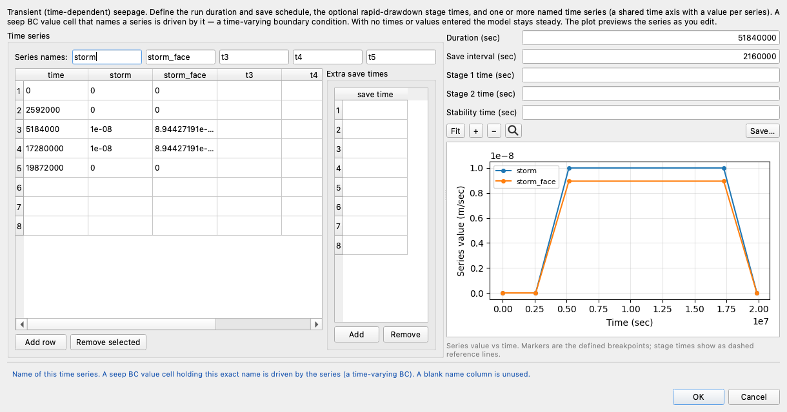
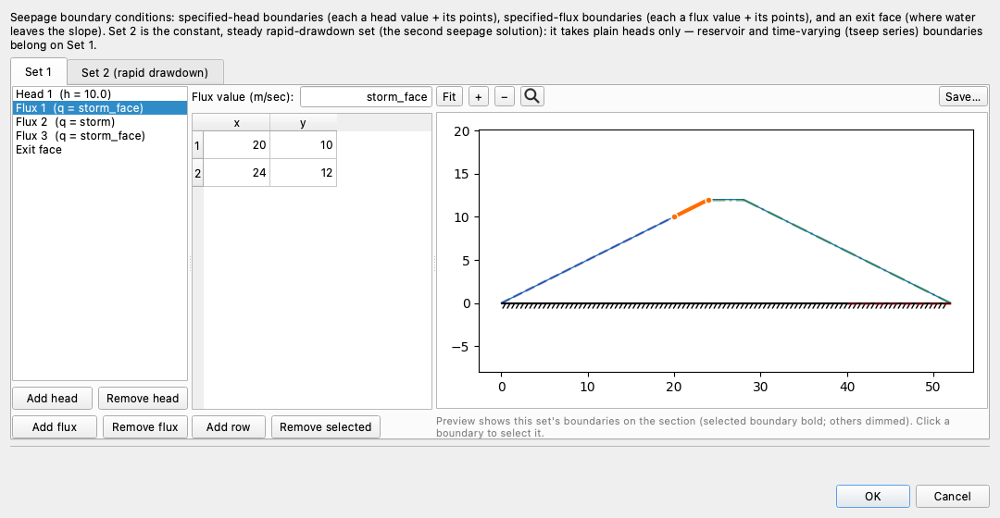
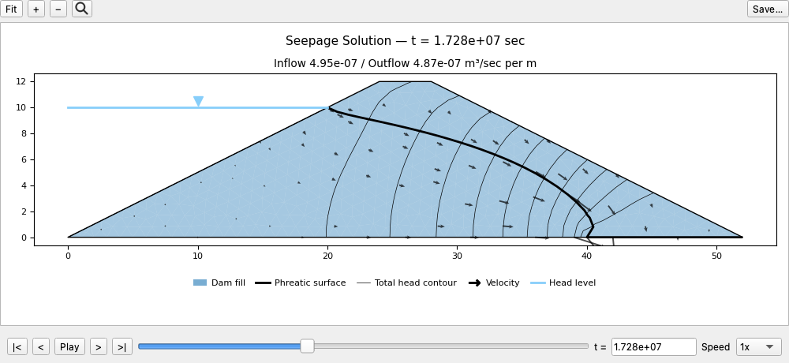
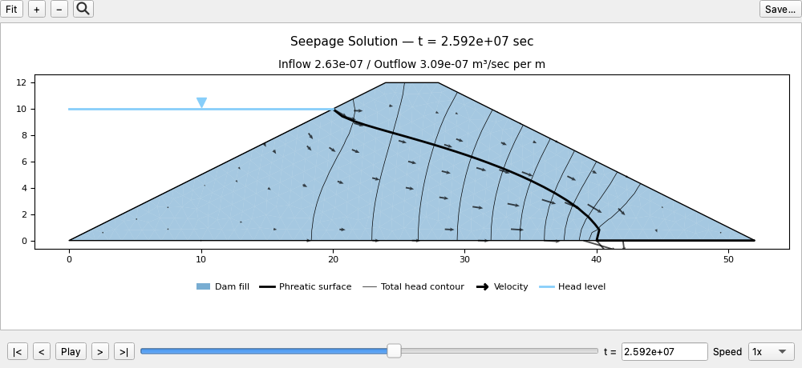

# Tutorial SEEP-4 — Infiltration and Flux Boundaries

The first three seepage tutorials put water into the ground through a boundary
where the **head** was known — a reservoir, a tailwater, a pool falling on a
schedule. This one puts water in where the head is not known and the **rate** is:
rain landing on the surface of a dam, soaking in at a rate the weather sets while
the water table it feeds finds its own position. That is what the third boundary
condition type, the **specified flux**, is for, and building one is the subject of
this page. Rain is this page's instance of the general case, **infiltration** —
water arriving at the ground surface at a known rate, which can just as well be
snowmelt or irrigation — and everything here applies to any of them.

The example is a 12 m earth dam holding 10 m of water, with a horizontal drain
at its downstream toe. We solve it twice. The first run is the dam in dry
weather, and it is the reference. The second is the same model with steady rain
falling on it at 1 × 10−8 m/s, and nothing else changed — one input
added, the run repeated, the two answers compared. Most of what we measure
comes out of that comparison: where the water enters, where it leaves, how far the
phreatic surface climbs, and the result that the drain passes 75% more water while
the reservoir supplies a third less. We then sweep six rain rates, asking what the
dam does when the weather changes, and close by letting the rain start and stop:
the same three boundaries driven from a schedule rather than a number, marched
through 600 days of storm and recovery.

In [SEEP-2](seep02_johnson_dam.md) we built an unconfined dam from nothing, and
[SEEP-1](seep01_sheetpile.md) covers what a seepage analysis computes; we repeat
neither here. We start from a **starter file** that already carries the
section and the soil, so the build here is only the boundary set — the reservoir,
the drain, and the rain. (To skip the construction, download the completed file
below and pick the page back up at [Building the mesh](#building-the-mesh). That
file already carries the rain, so the dry-weather run in between is one to read
rather than to repeat — running it on the completed file returns the wet answer.)

Analysis
Seepage

Build &amp; explore
~35 min

**Objectives** — Learn how to model rainfall infiltration: how a vertical rain
rate becomes the normal flux a boundary takes, what happens where a flux boundary
runs into a specified head, how to read one run against another when a single
input is all that changed, how far a rain rate can be scaled before the soil
can no longer take what the boundary prescribes, and how to drive the same
boundaries from a time series so the rain can start and stop.

one materialsteady seepagespecified fluxinfiltrationnormal fluxspecified headexit facetoe drainvan Genuchtenphreatic surfacewater budgettransient seepagetime seriesstorage

**Starter file** — [xslope_dam_infiltration_start.xlsx](files/xslope_dam_infiltration_start.xlsx),
the section, the material and the units, with no boundary conditions at all; this
is the file the build below starts from

**Completed model** — [xslope_dam_infiltration.xlsx](files/xslope_dam_infiltration.xlsx),
the same model with the reservoir, the drain and the three rain blocks filled in;
open it to skip the construction and start at [Building the mesh](#building-the-mesh),
then run it at [Running it again](#running-it-again) — the rain is already in it, so
the dry-weather run is an account of where the comparison starts, not a step to
carry out on this file

**Time-varying model** — [xslope_dam_infiltration_storm.xlsx](files/xslope_dam_infiltration_storm.xlsx),
the same dam with its three rain blocks driven from a schedule rather than held at
a rate, built in [Rain that comes and goes](#rain-that-comes-and-goes) at the end
of the page; it ships with its mesh and its solved march beside it

---

## The problem

{width=1000}

The dam is 12 m high with a 4 m crest and symmetric 2:1 faces, 52 m across the
base, sitting on rock at elevation 0. Its ground surface runs from the upstream
toe at (0, 0) up to the crest at (24, 12), across to (28, 12), and down the
downstream face to (52, 0). The reservoir stands at elevation 10 — 10 m of water
against the upstream face, 2 m of freeboard below the crest — and it meets the
face at (20, 10). A 12 m **horizontal toe drain** runs along the base from
(40, 0) to (52, 0), which is what keeps the phreatic surface from daylighting on
the downstream slope.

The embankment is one soil, `Dam fill`, with a saturated conductivity of
1 × 10−7 m/s in both directions. Above the phreatic surface the soil is
unsaturated and conducts less than that, by a van Genuchten curve the material
table carries.

The rain is a **vertical** Darcy velocity of 1 × 10−8 m/s, a tenth of
the soil's saturated conductivity, applied over the whole exposed surface: the
upstream face above the waterline, the crest, and the downstream face down to the
toe. Turning that one vertical number into the two numbers the boundary condition
takes is the first thing the build has to get right, and we work it out in the
[flux section](#adding-the-rain).

The dam, the soil and the rain are all from a published verification problem, so
both runs on this page have an answer to be checked against —
[GW6 in the Rocscience groundwater corpus](../verification/rocscience_groundwater.md#gw6)
carries the comparison.

---

## Opening the starter file

Download [xslope_dam_infiltration_start.xlsx](files/xslope_dam_infiltration_start.xlsx)
and open it with **File → Open…**. Then click the **Seepage** segment of the
toolbar's mode strip (it reads LEM | Seepage | FEM), so the Inputs tree and the
Run menu offer the seepage tables rather than the limit equilibrium ones.

The file carries the section as one profile line with its maximum depth at
elevation 0, and it carries the material. It carries no boundary conditions,
which is what we build in the next two sections.

Its global parameters are already set: **Units** `SI` and **Time** `sec`, so the
unit weight of water is 9.81 kN/m³, heads read in meters, conductivities and
fluxes in m/s, and every discharge in cubic meters per second per meter of dam
measured along its axis. Those fields are covered in
[SEEP-1](seep01_sheetpile.md#1-global-parameters).

Click **Materials**, and on **Table view** set the **Show parameters for:** toggles
to **Seepage** alone. One row, with the seepage band of the `mat` worksheet
across it:

| mat | name | k1 (m/sec) | k2 (m/sec) | alpha | unsat | kr0 | h0 (m) | vg_a | vg_n |
| :---: | --- | :---: | :---: | :---: | --- | :---: | :---: | :---: | :---: |
| 1 | `Dam fill` | 1 × 10−7 | 1 × 10−7 | 0 | `vg` | 0 | 0 | 0.2452 | 2.5739 |

The soil is **isotropic**: `k1` and `k2` are equal, so the direction `alpha` would
orient the major conductivity in makes no difference and it is left at 0.

`unsat` is set to `vg`, the
[**Mualem–van Genuchten**](../seep/overview.md#van-genuchten-model)
relative-conductivity model, and `vg_a` and `vg_n` are the only two parameters a
steady solve needs from it. `vg_a` = 0.2452 is α, in 1/m on a model in meters, and
it sets the suction scale over which the soil desaturates; `vg_n` = 2.5739 is
dimensionless and controls how steeply the conductivity falls once it does.
In [SEEP-2](seep02_johnson_dam.md#the-three-unsaturated-models) we run all three
unsaturated models against one another and measure how much the choice changes;
`kr0` and `h0` belong to the linear-front model and sit at zero here because this
model uses neither. The two van Genuchten values are a least-squares fit to the
conductivity table the source problem publishes, described with its residuals
[on the verification page](../verification/rocscience_groundwater.md#gw6).

The unsaturated curve matters more on this problem than on a dam without rain,
because the rain lands on unsaturated soil and has to travel down through it
before it reaches the water table. Click **OK**.

---

## Building the boundary conditions

The dam takes two boundary conditions before the rain: the reservoir on the
upstream face, and the drain at the downstream toe. What each type does and why an
exit face goes where the discharge point is unknown is the subject of
[SEEP-2](seep02_johnson_dam.md#4-boundary-conditions), and we do not repeat it
here.

Click **Seep BC** in the Inputs dock. The editor opens on **Set 1**.

**Head 1 — the reservoir.** Press **Add head**, leave **Type:** at `head`, and
set **Head value (m):** to `10`. Its polyline runs up the submerged part of the
upstream face, from the heel to the waterline. Enter or copy-paste the following
points:

| x | y |
| :---: | :---: |
| 0 | 0 |
| 20 | 10 |

Every node on that line is under water or at its surface, so holding the total
head at 10 along it is exact.

**Exit face — the toe drain.** Select the **Exit face** entry already waiting in
the list. Its line runs along the base, over the 12 m the drain occupies. Enter
or copy-paste the following points:

| x | y |
| :---: | :---: |
| 40 | 0 |
| 52 | 0 |

A drain is a place where water leaves the soil at atmospheric pressure, and the
source problem states it as a boundary held at total head 0 over its whole length.
An exit face says the same thing with one difference that matters here: it holds a
node at atmospheric pressure only while water is actually leaving through it, and
releases any node where the soil has gone unsaturated. That release is what gives
the solution a free surface to find. Written instead as a specified head of 0, this
model would have no exit face anywhere, and XSLOPE would solve it as a confined
problem: saturated everywhere, with no phreatic surface in either run and none of
the unsaturated behavior this dam is posed to show. The cost of
the exit face is that how much of the drain actually runs becomes an output rather
than something entered, and [the first run](#the-dry-weather-solution) reports it.

Everything not named in the list is **no-flow**: the rock under the dam at
elevation 0, the base upstream of the drain, and — for now — the whole exposed
surface above the waterline. Click **OK**, and save the model with
**File → Save As…** under a name of your own.

---

## Building the mesh

Click **Run → Build Mesh…**

Set **Element type** to **Linear triangles (tri3)**. Head is a scalar field, so
there is nothing for a linear element to lock up on, and unlike a stability
analysis a seepage run puts no restriction on element order. One plan does
restrict it. A finite element stability analysis reading its pore pressures from
this solution runs on this same mesh, and the FEM side requires quadratic
elements, so for that workflow build the mesh as **Quadratic triangles (tri6)**
from the start. We stay with seepage here, so tri3 is sufficient.

Untick **Auto-size from geometry**, which enables the **Target element size** box
below it, and confirm that box reads `1.0`. Leave the rest of the dialog alone and
click **Build**.
The mesh comes out at **473 nodes and 833 triangles**:

{width=1000}

The blue squares up the submerged face are the specified-head nodes and the red
circles along the base from x = 40 are the exit-face nodes — thirteen of them, the
number the solver reports back when it runs.

---

## The dry-weather solution

The rain is not in the model yet, so this first run is the dam in dry weather —
the reference everything after it is read against. (If you downloaded the
completed file rather than building the boundaries, the rain is already in it:
read this run's numbers rather than reproducing them, and resume at
[Running it again](#running-it-again).)

Click **Run → Run Seep…**

The dialog offers two settings, **Convergence tol** and **Max iterations**.
Leave both at their defaults, `0.00010000` and `400` — this model closes in well
under ten sweeps — and click **Run**. The **Model checks** panel reads
**No problems found for this run.**

In the **Display** panel, tick **Filled contours**.

{width=1000}

**The discharge is 2.808 × 10−7 m³/s per m**, and every drop of it
comes from the reservoir: the head boundary is the only place water can enter this
model. The head ranges from **0 to 10 m**, the two boundary values and nothing
outside them, and the Log's flow-closure check reports inflow and outflow agreeing
to six figures. The exit face finishes with
**all 13 of its nodes draining**, so the drain runs over its whole 12 m rather
than over part of it.

The heavy black line is the phreatic surface. It leaves the upstream face at the
waterline, elevation 10, crosses under the crest at about elevation 7.6, and comes
down to the base at x = 40, the upstream end of the drain — which is the drain
doing its job. From there the zero-pressure line is the drain itself: an active
exit-face node is held at atmospheric pressure, ψ = 0, and all thirteen stay
active, so the drain runs at zero pressure head end to end. Water arrives all
along it, but not evenly — the first meter passes over half the discharge, the
shares fall away tenfold by mid-drain, and what little lands farther along has
percolated down through the unsaturated soil that sits above the drain
downstream of x = 40. Below and left of that line the soil is saturated and the pressure
head is positive; above it the soil is unsaturated and the pressure head is
negative, which on the crest centerline reaches −4.2 m at the crest itself.

This is materially different from an exit face on a slope, like the downstream
face of [the dam in SEEP-2](seep02_johnson_dam.md#the-seepage-face). There the
phreatic surface meets the face partway up, and the face **above** that point
deactivates: the soil behind it is unsaturated, gravity carries what water it
holds down and away from the face rather than out through it, and the iteration
releases those nodes — the seepage face's wet extent is the answer the solve
finds. A drain along the **base** sits on the other side of gravity: everything
above it drains *toward* it, so even where the soil over it is unsaturated the
water still arrives, and every node stays an active outlet at ψ = 0. On a slope,
the water table decides how much of the exit face runs; under the base, the
drain runs end to end and the water table instead decides how the discharge is
shared along it.

Strictly, then, the heavy line over the drain is no longer a water table in the
sense we often think of one.
Upstream of x = 40 it caps a saturated zone — the water table as usually meant.
Over the drain there is no saturated zone beneath it to cap: the same ψ = 0
rule is now tracing the atmospheric boundary itself. The figure shows the
consequence. In a textbook flow net the uppermost flow line *is* the phreatic
surface, but here a flow line rides **above** the heavy line on its way to the
drain — the unsaturated soil over the drain still conducts, and the water
percolating through it is still bound for the drain, so the flow lines pass
through that zone rather than ending at the line.

This run is the source problem's own dry-weather case, solved on the same section
with the same soil, and its discharge of 2.808 × 10−7 m³/s per m is the
value
[the verification page checks that case against](../verification/rocscience_groundwater.md#gw6).
Nothing about the model changes from here except the rain.

---

## Adding the rain

Rain is a **specified flux**: a boundary where the rate at which water crosses is
prescribed and the head is left to the solution. That is the right statement for
infiltration, because the position of the water table under falling rain is
exactly what is being solved for and so cannot be imposed.
[The flux boundary](../seep/overview.md#specified-flux-boundary-conditions-neumann)
carries the formulation. Three properties of it govern the build.

### A flux is a rate normal to the boundary

The value a flux boundary takes, *q*, is the **normal Darcy velocity** — the flow
per unit area of boundary, into the domain, in meters per second here. It is not a
total discharge over the segment, and it is not the vertical rain rate.

The rain falls vertically at 1 × 10−8 m/s. A sloping face does not
receive all of that per unit of its own area: the face is longer than the ground
it covers, so the same water spread along it arrives at a lower rate per unit
length. What the boundary takes is the component along the face's normal, which is
the vertical rate times the cosine of the face's inclination:

>>*q*n = *q*vertical cos θ

A 2:1 face rises 1 for every 2 across, so θ = arctan ½ = 26.5651° and
cos θ = 2/√5 = 0.894427. Both faces of this dam are 2:1, so on both,

>>*q*n = 1 × 10−8 × 0.894427 = **8.94427 × 10−9 m/s**

The crest is horizontal, θ = 0 and cos θ = 1, so there *q*n is the
**full 1 × 10−8 m/s**. Two rates, three blocks — the upstream face above
the waterline, the crest, and the downstream face — because the surface has three
slopes.

The projection is right if the water it delivers is the water that fell. A block
of length *L* at a uniform *q* puts *qL* into the model, so:

| block | from | to | length (m) | *q* (m/s) | *qL* (m³/s per m) | footprint (m) |
| --- | :---: | :---: | :---: | :---: | :---: | :---: |
| upstream face | (20, 10) | (24, 12) | 4.4721 | 8.94427 × 10−9 | 4.0000 × 10−8 | 4 |
| crest | (24, 12) | (28, 12) | 4.0000 | 1 × 10−8 | 4.0000 × 10−8 | 4 |
| downstream face | (28, 12) | (52, 0) | 26.8328 | 8.94427 × 10−9 | 2.4000 × 10−7 | 24 |
| **total** | | | | | **3.2000 × 10−7** | **32** |

The three blocks together offer 3.2000 × 10−7 m³/s per m, and the rain
rate times the 32 m of horizontal ground the dam's surface covers is
1 × 10−8 × 32 = 3.2 × 10−7. The two agree exactly, and they
agree because of the projection: enter the vertical rate on the sloping
faces instead, and the model takes in 1 × 10−8 × 35.305 m of boundary
length = 3.5305 × 10−7, 10% more water than fell on it.

The projection is geometry alone, and it assumes every drop that lands soaks in.
On a real slope some of the rain runs off instead — more as the face steepens —
so in practice the rate applied to an inclined boundary is often reduced
further, to a net infiltration rate the modeler judges. The full geometric values
are kept here, which is what the source problem applies.

### Entering the flux boundary conditions

Enter the three blocks in **Seep BC**, each the same way: press **Add flux**,
set **Flux value (m/sec):**, and enter or copy-paste the block's two points.

**Flux 1 — the upstream face above the waterline.** Flux value
`8.94427191e-09`:

| x | y |
| :---: | :---: |
| 20 | 10 |
| 24 | 12 |

**Flux 2 — the crest.** Flux value `1e-08`:

| x | y |
| :---: | :---: |
| 24 | 12 |
| 28 | 12 |

**Flux 3 — the downstream face.** Flux value `8.94427191e-09`:

| x | y |
| :---: | :---: |
| 28 | 12 |
| 52 | 0 |

The list now reads `Head 1  (h = 10.0)`, the three flux blocks with their rates,
and `Exit face`. Flux 1 is selected in the shot — its rate in the value box
(displayed shortened), its two points below — and the preview draws the selected
boundary bold over its stretch of the upstream face, dimming the others.

Those endpoints are the corners of the dam's own surface, and that is the habit
to build: a boundary defined on the geometry is honored at its stated length on
any mesh. The
[GW6 verification case](../verification/rocscience_groundwater.md#gw6) shows
what the alternative costs — the source problem's model picks its rain extent
off mesh edges and ends up applying about 4% less water than falls on the
surface.

### Where the rain meets the reservoir, the head wins

The rain covers the surface from the waterline at (20, 10) all the way to the
toe at (52, 0), so it shares a node with the reservoir boundary at one end and
with the exit face at the other. A node cannot serve both conditions, and the
head wins: where a flux meets a **specified head**, the flux load on the shared
node is discarded when the head is enforced, and where it meets a **draining
exit face**, the same happens — a draining node is held at atmospheric pressure,
so rain landing on it simply runs off. The discarding is complete, so overlap is
not an error to be avoided: cover the surface the rain falls on and let the
shared nodes sort themselves out. On this model about 2.6% of the offered rain
lands on those two nodes and is discarded there.

### The finished inputs

Click **OK**. The Inputs plot now draws the whole boundary set:

{width=1000}

The dark dashed line up the submerged face is the reservoir head boundary and the
light line at elevation 10 with its inverted triangle is the water level that head
stands for. The heavy green line is the rain, labeled with its rate on each of the
three blocks — `q = 8.94427e-09` on the two faces and `q = 1e-08` on the crest —
and it covers the exposed surface from the waterline to the toe with no gap. The
red line along the base from x = 40 is the exit face. The hatched line at
elevation 0 is the maximum depth, the rock the dam sits on.

Save the model. The completed file calls it `xslope_dam_infiltration.xlsx`.

---

## Running it again

Click **Run → Run Seep…** and **Run**, with the same two settings as before —
there is no need to rebuild the mesh, because every vertex of the three rain
blocks already sits on a pinned node of the one built earlier. The solver
reaches the answer in the same handful of sweeps it took in dry weather, with
the same 13 of 13 exit-face nodes draining at the end.

{width=1000}

**The discharge is 4.916 × 10−7 m³/s per m**, against
2.808 × 10−7 in dry weather — the drain is passing **75% more water**.
The head still ranges from **0 to 10 m**: the rain lifts heads inside the dam but
does not push any of them above the reservoir that is the model's high point.

The two solution figures are drawn on the **same color scale**, 0 to 10 m of total
head, so we can read them against each other directly. Everything downstream of the
crest is warmer under rain — heads there are higher — and the phreatic surface is
visibly higher along its whole length, meeting the drain in both cases but
arriving from further up and landing about a meter further along it. The extra
flow lines entering through the downstream face are the rain, water that never
touched the reservoir.

---

## Where the water comes from

The discharge went up by three quarters, and the natural reading is that the rain
was added to what the reservoir was already supplying. It was not. Each boundary
reports the water crossing it, and the ledger says something else:

| | dry weather | with infiltration |
| --- | :---: | :---: |
| in at the reservoir | +2.808 × 10−7 | +1.800 × 10−7 |
| in as rain, assembled | 0 | +3.2000 × 10−7 |
| of that, discarded on head and draining nodes | 0 | −0.0844 × 10−7 |
| out at the drain | −2.808 × 10−7 | −4.916 × 10−7 |

The three inflow rows close on the outflow: 1.800 + 3.2000 − 0.0844 =
4.916 × 10−7 m³/s per m.

**What the reservoir supplies falls by 36%** — from 2.808 × 10−7 to
1.800 × 10−7 — while the drain's discharge rises by 75%. The rain
partly replaces the reservoir rather than adding to it. The mechanism is the
gradient: water moves from the reservoir toward the drain because the head falls
between them, and the rate it moves at is set by how steeply the head falls. Rain landing on the
dam's surface raises the head in the soil between them while the reservoir stays
at 10 m, so what the reservoir has to push against is higher than it was. That
flattens the gradient across the upstream face, and less
water crosses the upstream face per second as a result. The drain receives all of
it either way, which is why the total goes up while one of its two sources goes
down.

---

## Scaling the rain

The rain on this page is one steady-state assumption: infiltration held at
1 × 10−8 m/s for long enough that the flow field has stopped changing.
Design questions arrive as a range instead — a wetter season, the same dam in a
different climate — and what settles the dam's answer is
not the rain rate on its own but the rain rate against the soil's ability to carry
it away. That ratio is **q/k**, the rain rate over the saturated conductivity.
Here q = 1 × 10−8 m/s and k = 1 × 10−7 m/s, so
**q/k = 0.1**: the soil can pass ten times the water landing on it.

### Run it at twice the rain

Click **Seep BC** in the Inputs dock and double all three flux values:

| block | at q/k = 0.1 | at q/k = 0.2 |
| --- | :---: | :---: |
| Flux 1 — upstream face | `8.94427191e-09` | `1.788854382e-08` |
| Flux 2 — crest | `1e-08` | `2e-08` |
| Flux 3 — downstream face | `8.94427191e-09` | `1.788854382e-08` |

The three scale together because they are one vertical rain rate resolved onto
three slopes: the faces stay at 2/√5 of the crest at every rate, which is what
keeps the set standing for rain falling straight down. Click **OK**, then
**Run → Run Seep…** and **Run**. (Work on a copy, or set the three values back
afterwards.)

The discharge comes out at **6.949 × 10−7 m³/s per m**, against
4.916 × 10−7 at the rain the file carries, and the phreatic surface on
the crest centerline stands at **9.55 m**, up from 8.49 m. Doubling the rain
bought the dam another meter of saturated height.

### Six rates on one section

Sweeping that experiment from dry weather to four times the file's rain draws the
whole family on one section:

{width=1000}

| q/k | q (m/s) | discharge Q (m³/s per m) | water table at x = 26 (m) |
| :---: | :---: | :---: | :---: |
| 0 | 0 | 2.808 × 10−7 | 7.58 |
| 0.025 | 2.5 × 10−9 | 3.340 × 10−7 | 7.80 |
| 0.05 | 5 × 10−9 | 3.869 × 10−7 | 8.03 |
| 0.1 | 1 × 10−8 | 4.916 × 10−7 | 8.49 |
| 0.2 | 2 × 10−8 | 6.949 × 10−7 | 9.55 |
| 0.4 | 4 × 10−8 | 1.246 × 10−6 | none — saturated to the surface |

All six runs are on the mesh we have been using, all six converge in the
same eight sweeps, and all thirteen drain nodes drain in every one of them, so
nothing below is the drain switching on or off.

**The water table rises faster than the rain does.** Each step of the sweep
lifts the centerline surface more than the step before — the table above shows
the climb. Why the rise accelerates is not something these six runs settle.

**The discharge does not.** Q grows nearly linearly with the rain, and what
drift there is runs the other way: the mound the rain builds stands higher at
every rate, so the reservoir supplies less and less — the same effect the water
budget above measures at one rate — until by q/k = 0.4 the dam is pushing water
back out into the reservoir.

**Above q/k ≈ 0.26 the model stops being an answer.** A specified flux
prescribes the rate water crosses the boundary whatever the head does, and soil
that cannot conduct that much water away has no way to refuse it: the boundary
pressure simply rises until it is positive — which in the field means the
surface ponds and the boundary becomes a specified head, a switch this model
does not make. At the top rate there is no phreatic surface anywhere in the
dam — the section is saturated to its own surface from the upstream shoulder to
the drain, which is why the figure draws that case dashed and lying on the
dam's own profile rather than inside it.

XSLOPE does not let that pass quietly. The run comes back with a warning:

> 23 specified-flux node(s) finished with positive pore pressure (max u = 14.11):
> the specified inflow exceeds what the soil can accept there, so in reality the
> surface would pond and the boundary would become a specified head. **This
> solution is suspect.**

A specified flux is a promise about water that the soil may not be able to keep.
Below this dam's ceiling it is the right boundary for rain, and the five rates up
to q/k = 0.2 all return real solutions. Above it, the boundary insists on putting
in more water than the section can carry away, and what comes back is a number
rather than a solution. In reality the excess would run off the surface, but a
specified flux has no way to say so — it insists the water enters. Check q/k
before trusting a rain boundary, and read what the solver says about the run.

---

## Rain that comes and goes

Every run so far has held the rain at one rate forever. That is what a **steady**
solve means: the flow field it returns is the one the dam settles into if the
weather never changes. Real rain starts and stops, and the questions that matter
in between — how long the dam takes to feel a wet season, how high it gets before
the rain ends, how long it stays wet afterwards — are ones a steady solve has no
way to answer. A **transient** run can: it marches the solution forward in time
from a starting field, so the answer is a sequence of states rather than one.

The mechanism is the same one [SEEP-3](seep03_reservoir_drawdown.md) uses to lower
a reservoir. A boundary's value cell holds a number or the **name of a time
series**, and a series is a curve of value against time defined on the `tseep`
sheet. SEEP-3 puts a series in a *head*; here we put one in a *flux*, and the
boundary that has been raining at a constant rate becomes a boundary that rains on
a schedule.

The finished model is
[xslope_dam_infiltration_storm.xlsx](files/xslope_dam_infiltration_storm.xlsx),
which ships with the mesh and the solved march beside it —
`xslope_dam_infiltration_storm_mesh.json`,
`xslope_dam_infiltration_storm_tseep.csv` and
`xslope_dam_infiltration_storm_tseep_meta.json` — so opening it in the same folder
gives you the frames without re-solving. The sections below build it from the file
we already have.

### Storage: what a transient run needs that a steady one does not

A steady solve balances what comes in against what goes out. A transient one has a
third term: the water the soil takes into or gives back out of storage as the head
changes, which is what makes the dam respond over months rather than instantly.
Two material properties set it, and both are blank on this file because the source
problem is steady and publishes neither.

**Specific storage** `Ss` is the water a unit volume of *saturated* soil releases
per unit of head drop — the compressibility of the skeleton and the pore water. It
has units of 1/length. **Specific yield** `Sy` is the drainable porosity: the water
that leaves the pores *above* the water table as it falls, dimensionless, and for a
van Genuchten material it doubles as the drainable water content θs −
θr. [Storage](../seep/transient.md#storage) carries both in full, with
tables of representative values.

Click **Materials**, keep the **Show parameters for:** toggles on **Seepage**, and
fill the two columns at the right of the row:

| mat | name | Ss (1/m) | Sy |
| :---: | --- | :---: | :---: |
| 1 | `Dam fill` | 0.0003 | 0.15 |

These are the compacted-silt entries from those tables — a stiff, fine-grained
fill of the kind this dam's conductivity and retention curve describe. They are
chosen, not measured, and they set how fast the dam responds: a smaller `Sy`
means less water to move and a quicker rise. Click **OK**.

### The storm

The next step is to set up the transient flux boundary. That takes two pieces:
entering the rain as a time series, then pointing the flux boundary conditions
at it — the same pattern [SEEP-3](seep03_reservoir_drawdown.md) uses for its
falling pool, where a head boundary follows a series.

It takes two series rather than one, because the three rain blocks do not carry
one rate: the crest takes the vertical rain, and the two 2:1 faces take it
times cos θ = 2/√5 — the projection worked out in the flux section above. A
single series driving all three would put the crest rate on the faces and take
in 10% more water than fell on the dam. So the schedule is written twice —
`storm` is the rain itself, `storm_face` the same curve scaled by 0.894427 —
and the ratio between the two columns is the same ratio that stood between the
three numbers before.

With that settled, the series can be entered. Click **Transient** in the Inputs
dock — the row reads `off` until the sheet has something on it. The editor is one form: the run controls on the right, the time
series on the left.

Type `storm` over the default `t1` in the first **Series names:** box and
`storm_face` over `t2` in the second, then enter or copy-paste the schedule into the
series table:

| time | storm | storm_face |
| :---: | :---: | :---: |
| 0 | 0 | 0 |
| 2592000 | 0 | 0 |
| 5184000 | 1e-08 | 8.94427191e-09 |
| 17280000 | 1e-08 | 8.94427191e-09 |
| 19872000 | 0 | 0 |

Set **Duration (sec)** to `51840000` and **Save interval (sec)** to `2160000`.
Leave **Stage 1 time (sec)**, **Stage 2 time (sec)**, **Stability time (sec)** and
**Extra save times** empty — the stage fields flag the rapid-drawdown states a
stability analysis reads, and this page stops at the seepage field. Click **OK**.

**Why those times.** The times are in **seconds**, because this model's **Time** is
`sec` — the schedule has to be in whatever unit the conductivity is in. In days
they read 0, 30, 60, 200 and 230, and the run lasts 600 days with a frame saved
every 25:

- **Thirty dry days first.** The march begins from the dry-weather field, and a
  model already at its answer must sit still while nothing drives it. Frames over
  these days are the check that it does.
- **A thirty-day ramp to the full rate**, then a **140-day hold** at
  1 × 10−8 m/s — the rain the rest of this page uses. Between them the
  storm spans 170 days, and with the two ramps counted at their average the whole
  schedule delivers the volume of 170 days at the full rate.
- **A thirty-day fall back to nothing**, then **370 days of draining**, which is
  long enough for the dam to give back what it took in.

The plot beside the table draws both series as you type them, so the shape — flat,
ramp, hold, fall, flat — is visible before anything is run. Its y-axis is labeled
from what the series drive: the shot above is the finished model, where the three
flux blocks already name them, so it reads **Series value (m/sec)** rather than
meters.

### Binding the rain blocks to the schedule

The schedule exists but nothing refers to it yet. Click **Seep BC** in the Inputs
dock and replace each of the three flux values with the name of the series that
drives it:

| block | was | becomes |
| --- | :---: | :---: |
| Flux 1 — upstream face | `8.94427191e-09` | `storm_face` |
| Flux 2 — crest | `1e-08` | `storm` |
| Flux 3 — downstream face | `8.94427191e-09` | `storm_face` |

The list now reads `Flux 1  (q = storm_face)`, `Flux 2  (q = storm)` and
`Flux 3  (q = storm_face)` where it read three rates, and the head boundary is still
the number 10 — a model can mix constant and time-varying boundaries freely.
Click **OK**, and save the model under a name of your own; the file linked at the
top of this section calls it `xslope_dam_infiltration_storm.xlsx`.

### Running the march

Click **Run → Run Seep…** The dialog now carries a **Run type** row it did not have
before, because the file has a `tseep` sheet. Set it to **Transient
(time-dependent)**, leave **Convergence tol** and **Max iterations** at their
defaults, and click **Run**.

The run reports **28 saved frames** — t = 0, the 24 times on the 25-day grid, and
the three series breakpoints that do not fall on it — reached in **92 steps**. The
step size is chosen from how fast the field is moving, so the count is itself a
reading: the dam is barely changing for most of 600 days.

### Reading the frames

A transient run lands in a **Seep · Transient** tab carrying every frame, with a
play bar under the plot; [SEEP-3](seep03_reservoir_drawdown.md#reading-the-frames)
covers its controls. Two of the 28 frames carry the result.

**Day 200 (t = 1.728 × 107 sec), the end of the hold.** The subtitle
reads **Inflow 4.95 × 10−7 / Outflow 4.87 × 10−7 m³/sec per
m** — two numbers where a steady solution reports one, because the difference is
what the soil is still taking into storage. The drain's
**4.87 × 10−7** is 99% of the
**4.916 × 10−7** the steady rain run gave, so 170 days of rain gets this
dam most of the way to the answer "steady rain" assumes. The phreatic surface
stands essentially where the steady rain run put it, and the soil above it has
taken water in: the pressure head on the crest centerline, −4.2 m in dry weather,
has eased to **−2.8 m** — set the Display panel's **Variable** to **Pore
pressure** to read it, −41 kPa dry against −28 kPa here. The rain wets the
unsaturated soil above the water table and lifts the water table through it,
rather than arriving as a front that saturates the surface.

**Day 300, seventy days after the rain stopped.** The subtitle now reads **Inflow
2.63 × 10−7 / Outflow 3.09 × 10−7** — more leaving than
arriving, which is the mound the storm built draining into the toe drain. The
phreatic surface has dropped visibly and the velocity vectors under the downstream
face have swung toward the drain.

Scrubbing the whole bar gives the shape of the response, and it is not the shape of
the rain. The rain reaches full rate on day 60 and the drain is still climbing a
hundred days after that; it stops climbing only because the rain does, so day 200
is a breakpoint in the schedule rather than a limit the dam reached. The dam's own
pace is in the rise instead: measured from the moment the rain starts on day 30,
the drain takes **102 days** to cover 90% of its climb. The fall is slower still —
the rain stops on day 230, and two hundred days after that the drain is still 1.7%
above its dry-weather discharge. **The dam lags the weather by months**, and the
lag is asymmetric: the storm pushed the water table up over 170 days and gravity
alone takes 370 to bring it back down.

### Checking the run

- **It starts where it should.** The drain reads 2.808 × 10−7 m³/s per m
  at day 0 and again at day 25, which is the dry-weather discharge this page
  measured before any rain was added. A march that begins at equilibrium stays
  there while nothing drives it.
- **It ends where it should.** At day 600 the drain is at
  2.813 × 10−7 and the crest suction is back to −4.2 m, both within a
  fraction of a percent of where they started. The dam returns to the dry-weather
  solution because that is the state its unchanged boundaries hold it in.
- **It heads for the steady answer.** The peak discharge is 99% of the steady rain
  run's, on the same mesh with the same rain. The remaining 1% is response the
  storm ended before the dam finished: the discharge is still rising frame by frame
  when the rain begins to fall.
- **The water is accounted for.** At the peak the dam holds **1.04 m³ per meter**
  more water than it started with, against **1.02 m³ per meter** of net inflow
  over the same 200 days, and the Log's mass-balance closure for that frame reads
  2.3 × 10−2. That closure is the gap between those two terms measured
  against the inflow, so by the end of the run, when the dam has given everything
  back and both are near zero, the figures it prints carry no meaning.

<!-- Transient regression: total head at three interior stations at the end of the storm's hold (day 200 = 1.728e7 sec), re-solved through the run_tests tseep_head path (tri3, target_size=1.0). Built by tools/build_seep04_transient.py, which asserts the same three values. -->
<!-- test: file=files/xslope_dam_infiltration_storm.xlsx, type=tseep_head, target_size=1.0, time=17280000, points=26:8:8.4242;26:4:8.0568;34:2:5.3144, tolerance=0.05 -->

---

## Conclusion

This tutorial covered:

- The specified flux — a boundary that prescribes the rate water crosses at and
  leaves the head to the solution, which is what rainfall infiltration needs.
- Turning a vertical rain rate into the normal flux a boundary takes, by the
  cosine of the face's slope, and checking it against the water that fell.
- Drawing a flux boundary on the section's own corners rather than on mesh nodes,
  and the collision rule where it overlaps a head or a draining exit face.
- A drain written as an exit face rather than as a head of zero, so the solution
  keeps a free surface to find.
- Reading one run against another and scaling the rain by q/k: the discharge up
  75%, the reservoir's share down 36%, and the rate above which the soil cannot
  take what the boundary prescribes.
- Rain on a schedule — a flux value naming a tseep series, the storage a
  transient run needs, and a dam that lags the weather by months.

**Where to go next:** the [tutorials index](index.md) lists the series.
[Seepage Analysis](../seep/overview.md#specified-flux-boundary-conditions-neumann)
carries the flux formulation, the nodal loads it assembles into, and the rest of
the boundary condition types, and
[Transient Seepage](../seep/transient.md) carries the storage laws, the series
semantics and the time stepper behind the march;
[GW6](../verification/rocscience_groundwater.md#gw6) carries five published cases
for this dam, among them the dry dam solved here, the same dam under rain, and
the same dam again with its drain replaced by a seepage face.
[SEEP-2](seep02_johnson_dam.md) is where we build the unconfined steady problem
and its seepage face from nothing, and
[SEEP-3](seep03_reservoir_drawdown.md) drives a *head* boundary from a series
instead of a flux, on a zoned dam whose core paces the whole response. In
[FEM-1](fem01_strength_reduction.md) we mesh a slope for stability
instead of seepage and find its factor of safety by reducing the soil's
strength until it fails.
