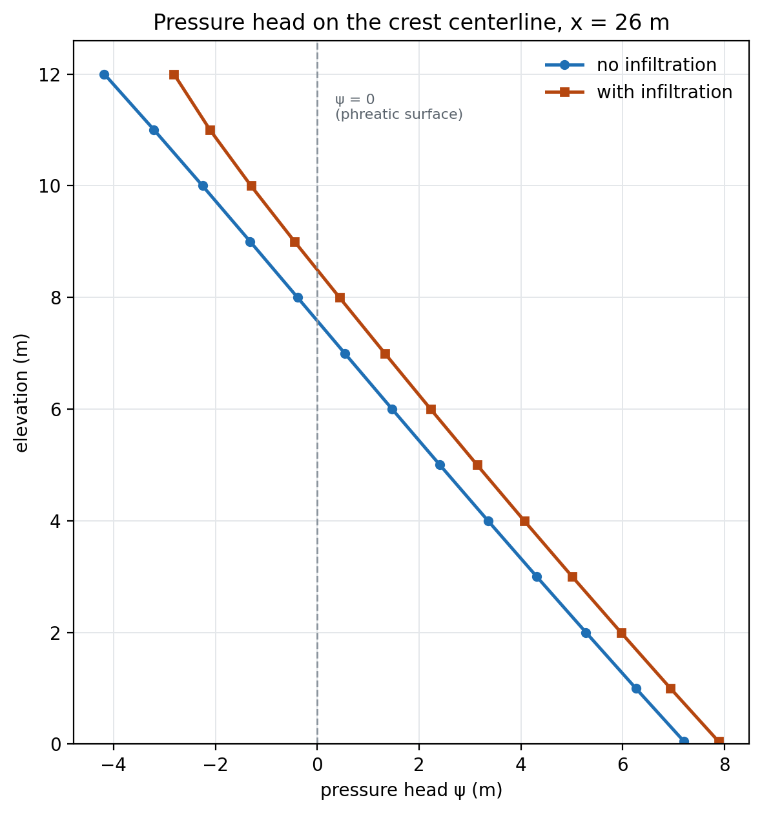

# Tutorial SEEP-4 — Infiltration and Flux Boundaries

The first three seepage tutorials put water into the ground through a boundary
where the **head** was known — a reservoir, a tailwater, a pool falling on a
schedule. This one puts water in where the head is not known and the **rate** is:
rain landing on the surface of a dam, soaking in at a rate the weather sets while
the water table it feeds finds its own position. That is what the third boundary
condition type, the **specified flux**, is for, and building one is the subject of
this page.

The example is a 12 m earth dam with a horizontal drain at its downstream toe,
holding 10 m of water. It is solved twice. The first run is the dam in dry
weather, and it is the reference. The second is the same model with steady rain
falling on it at 1 × 10−8 m/s, and nothing else changed — one input
added, the run repeated, the two answers compared. Most of what the page measures
comes out of that comparison: where the water enters, where it leaves, how far the
phreatic surface climbs, and the result that the drain passes 75% more water while
the reservoir supplies a third less.

[SEEP-2](seep02_johnson_dam.md) built an unconfined dam from nothing and
[SEEP-1](seep01_sheetpile.md) covers what a seepage analysis computes; this page
does not repeat either. It starts from a **starter file** that already carries the
section and the soil, so the build here is only the boundary set — the reservoir,
the drain, and the rain. (To skip the construction, download the completed file
below and pick the page back up at [Building the mesh](#building-the-mesh).)

Analysis
Seepage

Build &amp; explore
~25 min

**Objectives** — Learn how to model rainfall infiltration: how a vertical rain
rate becomes the normal flux a boundary takes, how to draw a flux boundary on the
geometry rather than on mesh nodes, what happens where a flux boundary runs into a
specified head, and how to read one run against another when a single input is all
that changed.

one materialsteady seepagespecified fluxinfiltrationnormal fluxspecified headexit facetoe drainvan Genuchtenphreatic surfacewater budget

**Starter file** — [xslope_dam_infiltration_start.xlsx](files/xslope_dam_infiltration_start.xlsx),
the section, the material and the units, with no boundary conditions at all; this
is the file the build below starts from

**Completed model** — [xslope_dam_infiltration.xlsx](files/xslope_dam_infiltration.xlsx),
the same model with the reservoir, the drain and the three rain blocks filled in;
open it to skip the construction and start at [Building the mesh](#building-the-mesh)

---

## The problem

{width=1000}

The dam is 12 m high with a 4 m crest and symmetric 2:1 faces, 52 m across the
base, sitting on rock at elevation 0. Its ground surface runs from the upstream
toe at (0, 0) up to the crest at (24, 12), across to (28, 12), and down the
downstream face to (52, 0). The reservoir stands at elevation 10 — 10 m of water
against the upstream face, 2 m of freeboard below the crest — and it meets the
face at (20, 10). A 12 m **horizontal toe drain** runs along the base from
(40, 0) to (52, 0), which is what keeps the phreatic surface from daylighting on
the downstream slope.

The embankment is one soil, `Dam fill`, with a saturated conductivity of
1 × 10−7 m/s in both directions. Above the phreatic surface the soil is
unsaturated and conducts less than that, by a van Genuchten curve the material
table carries.

The rain is a **vertical** Darcy velocity of 1 × 10−8 m/s, a tenth of
the soil's saturated conductivity, applied over the whole exposed surface: the
upstream face above the waterline, the crest, and the downstream face down to the
toe. Turning that one vertical number into the two numbers the boundary condition
takes is the first thing the build has to get right, and the
[flux section](#adding-the-rain) works it out.

The dam, the soil and the rain are all from a published verification problem, so
both runs on this page have an answer to be checked against —
[GW6 in the Rocscience groundwater corpus](../verification/rocscience_groundwater.md#gw6)
carries the comparison.

---

## Opening the starter file

Download [xslope_dam_infiltration_start.xlsx](files/xslope_dam_infiltration_start.xlsx)
and open it with **File → Open…**. Then click the **Seepage** segment of the
toolbar's mode strip (it reads LEM | Seepage | FEM), so the Inputs tree and the
Run menu offer the seepage tables rather than the limit equilibrium ones.

The file carries the section as one profile line with its maximum depth at
elevation 0, and it carries the material. It carries no boundary conditions,
which is what the next two sections build.

Its global parameters are already set: **Units** `SI`, so the unit weight of water
is 9.81 kN/m³ and heads read in meters. Conductivity is entered in m/s on this
model, so every rate on this page is per second, and every discharge is cubic
meters per second per meter of dam measured along its axis.
[SEEP-1](seep01_sheetpile.md#1-global-parameters) covers those fields.

Click **Materials**, and on **Table view** set the **Show parameters for:** toggles
to **Seepage** alone. One row, with the seepage band of the `mat` worksheet
across it:

| mat | name | k1 (m/s) | k2 (m/s) | alpha | unsat | kr0 | h0 (m) | vg_a | vg_n |
|:---:|---|:---:|:---:|:---:|---|:---:|:---:|:---:|:---:|
| 1 | `Dam fill` | 1 × 10−7 | 1 × 10−7 | 0 | `vg` | 0 | 0 | 0.2452 | 2.5739 |

The soil is **isotropic**: `k1` and `k2` are equal, so the direction `alpha` would
orient the major conductivity in makes no difference and it is left at 0.

`unsat` is set to `vg`, the
[**Mualem–van Genuchten**](../seep/overview.md#van-genuchten-model)
relative-conductivity model, and `vg_a` and `vg_n` are the only two parameters a
steady solve needs from it. `vg_a` = 0.2452 is α, in 1/m on a model in meters, and
it sets the suction scale over which the soil desaturates; `vg_n` = 2.5739 is
dimensionless and controls how steeply the conductivity falls once it does.
[SEEP-2](seep02_johnson_dam.md#the-three-unsaturated-models) runs all three
unsaturated models against one another and measures what the choice is worth;
`kr0` and `h0` belong to the linear-front model and sit at zero here because this
model uses neither. The two van Genuchten values are a least-squares fit to the
conductivity table the source problem publishes, described with its residuals
[on the verification page](../verification/rocscience_groundwater.md#gw6).

The unsaturated curve matters more on this problem than on a dam without rain,
because the rain lands on unsaturated soil and has to travel down through it
before it reaches the water table. Click **OK**.

---

## Building the boundary conditions

The dam takes two boundary conditions before the rain: the reservoir on the
upstream face, and the drain at the downstream toe. What each type does and why an
exit face is drawn where the discharge point is unknown is
[SEEP-2's subject](seep02_johnson_dam.md#4-boundary-conditions), and this section
does not repeat it.

Click **Seep BC** in the Inputs dock. The editor opens on **Set 1**. Press **Add
head** once and fill it in, then select the **Exit face** entry already waiting in
the list and give it its points. **Add row** under the points table adds a row to
whichever boundary is selected.

**Head 1 — the reservoir.** Leave **Type:** at `head` and set
**Head value (m):** to `10`. Its polyline runs up the submerged part of the
upstream face, from the heel to the waterline:

| x | y |
|---:|---:|
| 0 | 0 |
| 20 | 10 |

Every node on that line is under water or at its surface, so holding the total
head at 10 along it is exact.

**Exit face — the toe drain.** Draw it along the base over the 12 m the drain
occupies:

| x | y |
|---:|---:|
| 40 | 0 |
| 52 | 0 |

A drain is a place where water leaves the soil at atmospheric pressure, and the
source problem states it as a boundary held at total head 0 over its whole length.
An exit face says the same thing with one difference that matters here: it holds a
node at atmospheric pressure only while water is actually leaving through it, and
releases any node where the soil has gone unsaturated. That release is what gives
the solution a free surface to find. Written instead as a specified head of 0, this
model would have no exit face anywhere, and XSLOPE would solve it as a confined
problem — saturated everywhere, with the unsaturated behavior this dam is posed to
show dropped — leaving neither run below a phreatic surface to read. The cost of
the exit face is that how much of the drain actually runs becomes an output rather
than something entered, and [the first run](#the-dry-weather-solution) reports it.

Everything not named in the list is **no-flow**: the rock under the dam at
elevation 0, the base upstream of the drain, and — for now — the whole exposed
surface above the waterline. Click **OK**, and save the model with
**File → Save As** under a name of your own.

---

## Building the mesh

Click **Run → Build Mesh…**

Set **Element type** to **Linear triangles (tri3)**. Head is a scalar field, so
there is nothing for a linear element to lock up on, and unlike a stability
analysis a seepage run puts no restriction on element order. The one plan that
would restrict it: a finite element stability analysis reading its pore pressures
from this solution runs on this same mesh, and the FEM side requires quadratic
elements — for that workflow, build the mesh as **Quadratic triangles (tri6)**
from the start. This page stays with seepage, so tri3 serves.

Untick **Auto-size from geometry**, which enables the **Target element size** box
below it, and type `1.0`. Leave the rest of the dialog alone and click **Build**.
The mesh comes out at **473 nodes and 833 triangles**:

{width=1000}

The blue squares up the submerged face are the specified-head nodes and the red
circles along the base from x = 40 are the exit-face nodes — thirteen of them, the
number the solver reports back when it runs. The green triangles over the whole
exposed surface are the rain, which the next section adds; they are drawn here
because this is the mesh both runs use. Adding the rain does not change it: the
mesher pins a node at every vertex of every boundary polyline, and all four
vertices of the three rain blocks — (20, 10), (24, 12), (28, 12) and (52, 0) —
are already nodes, the first because the reservoir polyline ends there, the last
because the exit face does, and the two crest corners because the section itself
turns there.

That figure is the check on the boundary conditions as much as on the mesh. A
no-flow boundary is invisible in the input, so the only way to see where one
begins is to see where the markers stop.

---

## The dry-weather solution

Click **Run → Run Seep…**

The dialog offers **Convergence tol** and **Max iterations** and nothing else.
Leave both at their defaults, `0.00010000` and `400` — this model closes in well
under ten sweeps — and click **Run**. There is no run-type selector, because the
file carries no schedule for a transient run to follow;
[SEEP-3](seep03_reservoir_drawdown.md#running-the-transient-march) is where that
control appears. The **Model checks** panel reads **No problems found for this
run.**

In the **Display** panel, tick **Filled contours**.

{width=1000}

**The discharge is 2.808 × 10−7 m³/s per m**, and every drop of it
comes from the reservoir: the head boundary is the only place water can enter this
model. The head ranges from **0 to 10 m**, the two boundary values and nothing
outside them, and the Log's flow-closure check reports inflow and outflow agreeing
to the digits it prints. The exit face finishes with
**all 13 of its nodes draining**, so the drain runs over its whole 12 m rather
than over part of it.

The heavy black line is the phreatic surface. It leaves the upstream face at the
waterline, elevation 10, crosses under the crest at about elevation 7.6, and comes
down to the base at x = 40, the upstream end of the drain — which is the drain
doing its job. Below and left of that line the soil is saturated and the pressure
head is positive; above it the soil is unsaturated and the pressure head is
negative, which on the crest centerline reaches −4.2 m at the crest itself.

This run is the source problem's own dry-weather case, solved on the same section
with the same soil, and its discharge of 2.808 × 10−7 m³/s per m is the
value
[the verification page locks for that case](../verification/rocscience_groundwater.md#gw6).
Nothing about the model changes from here except the rain.

---

## Adding the rain

Rain is a **specified flux**: a boundary where the rate at which water crosses is
prescribed and the head is left to the solution. That is the right statement for
infiltration, because the position of the water table under falling rain is
exactly what is being solved for and so cannot be imposed.
[The flux boundary](../seep/overview.md#specified-flux-boundary-conditions-neumann)
carries the formulation. Three properties of it govern the build.

### A flux is a rate normal to the boundary

The value a flux boundary takes, *q*, is the **normal Darcy velocity** — the flow
per unit area of boundary, into the domain, in meters per second here. It is not a
total discharge over the segment, and it is not the vertical rain rate.

The rain falls vertically at 1 × 10−8 m/s. A sloping face does not
receive all of that per unit of its own area: the face is longer than the ground
it covers, so the same water spread along it arrives at a lower rate per unit
length. What the boundary takes is the component along the face's normal, which is
the vertical rate times the cosine of the face's inclination:

>>*q*n = *q*vertical cos θ

A 2:1 face rises 1 for every 2 across, so θ = arctan ½ = 26.5651° and
cos θ = 2/√5 = 0.894427. Both faces of this dam are 2:1, so on both,

>>*q*n = 1 × 10−8 × 0.894427 = **8.94427 × 10−9 m/s**

The crest is horizontal, θ = 0 and cos θ = 1, so there *q*n is the
**full 1 × 10−8 m/s**. Two rates, three blocks — the upstream face above
the waterline, the crest, and the downstream face — because the surface has three
slopes.

The check that the projection is right is that the water it delivers is the water
that fell. A block of length *L* at a uniform *q* puts *qL* into the model, so:

| block | from | to | length (m) | *q* (m/s) | *qL* (m³/s per m) | footprint (m) |
|---|---|---|---:|---|---|---:|
| upstream face | (20, 10) | (24, 12) | 4.4721 | 8.94427 × 10−9 | 4.0000 × 10−8 | 4 |
| crest | (24, 12) | (28, 12) | 4.0000 | 1 × 10−8 | 4.0000 × 10−8 | 4 |
| downstream face | (28, 12) | (52, 0) | 26.8328 | 8.94427 × 10−9 | 2.4000 × 10−7 | 24 |
| **total** | | | | | **3.2000 × 10−7** | **32** |

The three blocks together offer 3.2000 × 10−7 m³/s per m, and the rain
rate times the 32 m of horizontal ground the dam's surface covers is
1 × 10−8 × 32 = 3.2 × 10−7. The two agree to seven figures,
and they agree because of the projection: enter the vertical rate on the sloping
faces instead, and the model takes in 1 × 10−8 × 35.305 m of boundary
length = 3.5305 × 10−7, 10% more water than fell on it.

### A flux is drawn on the geometry

Enter the three blocks. Click **Seep BC**, press **Add flux** three times, and
give each block its rate and its two points. The **Add row** and **Remove
selected** pair beside those buttons manages the points of whichever block is
selected.

| block | Flux value | points |
|---|---|---|
| Flux 1 | `8.94427191e-09` | (20, 10), (24, 12) |
| Flux 2 | `1e-08` | (24, 12), (28, 12) |
| Flux 3 | `8.94427191e-09` | (28, 12), (52, 0) |

The list now reads `Head 1 (h = 10.0)`, the three flux blocks with their rates,
and `Exit face`. Flux 1 is selected in the shot, so the **Flux value:** box shows
its rate and the points table below shows (20, 10) and (24, 12); the preview draws
the selected boundary bold, in orange, over that stretch of the upstream face, and
dims the others.

Those endpoints are the corners of the dam's own surface, not points chosen off a
mesh, and that is deliberate. The mesher pins a node at every boundary vertex, so
a polyline drawn on the section is honored at its stated length whatever element
size is used. A polyline drawn to land on the nodes of one particular mesh is not:
an element edge carries load only when **both** of its corners lie on the polyline,
so an endpoint falling part way along an edge drops that edge's water entirely, and
the model quietly takes in less rain than it was given. The
[closing section](#where-the-rain-starts-and-stops) measures what that costs on
this dam.

### Where the rain meets the reservoir, the head wins

The rain is drawn from the waterline at (20, 10) all the way to the toe at
(52, 0), so it touches the reservoir boundary at one end and the exit face at the
other. Both shared nodes are visible on the mesh figure above — a green flux
triangle sitting inside a blue specified-head square at (20, 10), and another at
the drain's far end at (52, 0).

A node cannot be both. Where a flux boundary meets a **specified head**, the head
wins: the flux load is assembled onto that node like any other and then discarded
when the head is enforced, because a prescribed head cannot be moved by adding
water to it. Where a flux meets an **exit face**, the exit face wins while it is
draining — a draining node is held at atmospheric pressure, so rain landing on it
runs off — and an inactive exit-face node is a free unknown that does take the
rain.

The discarding is complete rather than partial, which is worth knowing because it
means overlap is not an error to be avoided. Laying a flux block wholly inside the
reservoir boundary of this model — enough load to add 27% to its rain — changes the
discharge and every nodal head by **exactly zero**.

Draw the rain over the surface it falls on, in other words, and let the collisions
fall where they will. On this model 8.444 × 10−9 of the assembled
3.2000 × 10−7 is discarded that way, 2.6% of it: 4.000 × 10−9
at the waterline node, and the remaining 4.444 × 10−9 at the toe node,
where the flux polyline ends on the draining exit face.

### The finished inputs

Click **OK**. The Inputs plot now draws the whole boundary set:

{width=1000}

The dark dashed line up the submerged face is the reservoir head boundary and the
light line at elevation 10 with its inverted triangle is the water level that head
stands for. The heavy green line is the rain, labeled with its rate on each of the
three blocks — `q = 8.94427e-09` on the two faces and `q = 1e-08` on the crest —
and it covers the exposed surface from the waterline to the toe with no gap. The
red line along the base from x = 40 is the exit face. The hatched line at
elevation 0 is the maximum depth, the rock the dam sits on.

Save the model. The completed file calls it `xslope_dam_infiltration.xlsx`.

---

## Running it again

Click **Run → Run Seep…** and **Run**, with the same two settings as before. The
solver reaches the answer in the same handful of sweeps it took in dry weather,
with the same 13 of 13 exit-face nodes draining at the end: the rain costs the
solution nothing in effort.

{width=1000}

**The discharge is 4.916 × 10−7 m³/s per m**, against
2.808 × 10−7 in dry weather — the drain is passing **75% more water**.
The head still ranges from **0 to 10 m**: the rain lifts heads inside the dam but
does not push any of them above the reservoir that is the model's high point.

The two solution figures are drawn on the **same color scale**, 0 to 10 m of total
head, so they can be read against each other directly. Everything downstream of the
crest is warmer under rain — heads there are higher — and the phreatic surface is
visibly higher along its whole length, meeting the base at the drain in both cases
but arriving there from further up. The extra flow lines entering through the
downstream face are the rain, water that never touched the reservoir.

---

## Where the water comes from

The discharge went up by three quarters, and the natural reading is that the rain
was added to what the reservoir was already supplying. It was not. Each boundary
reports the water crossing it, and the ledger says something else:

| | dry weather | with infiltration |
|---|---:|---:|
| in at the reservoir | +2.808 × 10−7 | +1.800 × 10−7 |
| in as rain, assembled | 0 | +3.2000 × 10−7 |
| of that, discarded on head and draining nodes | 0 | −0.0844 × 10−7 |
| out at the drain | −2.808 × 10−7 | −4.916 × 10−7 |

The three inflow rows close on the outflow: 1.800 + 3.2000 − 0.0844 =
4.916 × 10−7 m³/s per m.

**What the reservoir supplies falls by 36%** — from 2.808 × 10−7 to
1.800 × 10−7 — while the drain's discharge rises by 75%. The rain
partly replaces the reservoir rather than adding to it. The mechanism is the
gradient: water moves from the reservoir toward the drain because the head falls
between them, and the rate it moves at is set by how steeply. Rain landing on the
dam's surface raises the head inside the dam, which is the downstream end of that
drop. Raising it flattens the gradient the reservoir is working against, and less
water crosses the upstream face per second as a result. The drain receives all of
it either way, which is why the total goes up while one of its two sources goes
down.

---

## Reading the change inside the dam

The source problem's own comparison line is the **crest centerline**, the vertical
line at x = 26 m, read as pressure head ψ = *h* − *y* against elevation: positive
below the phreatic surface, zero on it, negative in the unsaturated soil above.

{width=600}

| elevation (m) | ψ dry (m) | ψ with rain (m) | change (m) |
|---:|---:|---:|---:|
| 0.05 (base) | 7.20 | 7.88 | +0.68 |
| 2 | 5.28 | 5.97 | +0.69 |
| 4 | 3.35 | 4.07 | +0.71 |
| 6 | 1.47 | 2.23 | +0.76 |
| 8 | −0.39 | +0.44 | +0.82 |
| 10 | −2.25 | −1.30 | +0.95 |
| 12 (crest) | −4.18 | −2.81 | +1.37 |

Both profiles are close to straight lines, which is what a nearly vertical
hydraulic gradient through a uniform soil gives. The rain moves the whole line to
the right — the soil is wetter at every elevation — but not by a constant amount:
**+0.68 m at the base, widening to +1.37 m at the crest**, twice as much. The
widening is the unsaturated zone taking the rain. Below the water table the soil is
already full and can only pass water along; above it there is capacity, and the
deeper the suction the more the rain relieves it.

The ψ = 0 crossing marked on the figure is the phreatic surface on this line, and
it moves from **elevation 7.6 dry to elevation 8.5 under rain**. At elevation 8 the
sign flips with it: that point is 0.39 m into suction in dry weather and 0.44 m
into positive pressure under rain. The crest node itself is still 2.81 m into
suction under rain, so the dam does not saturate to its surface — the soil takes
the rain at the rate it falls.

Across the whole section the same story, station by station along the phreatic
surface:

| station x (m) | 24 | 26 | 28 | 32 | 36 | 40 |
|---|---:|---:|---:|---:|---:|---:|
| dry weather | 8.20 | 7.58 | 6.95 | 5.56 | 3.81 | 0.94 |
| with infiltration | 8.94 | 8.50 | 8.00 | 6.76 | 4.99 | 1.81 |
| **rise (m)** | **+0.74** | **+0.91** | **+1.04** | **+1.20** | **+1.18** | **+0.87** |

The largest rise is not under the crest but **downstream of it, +1.20 m at
x = 32**, out on the downstream face. That is where the rain has the furthest to
travel before it reaches the drain and the least head driving it there, so the
water it adds banks up more than it does anywhere else on the
section. Averaged over every node, the interior head rise is **+0.54 m**, and its
maximum anywhere is **+1.63 m at (28, 12)** — the downstream crest shoulder, where
the crest block and the long downstream block meet.

Both phreatic surfaces still land on the base at x = 40, the head of the drain.
Under this rain the drain is still what stops the free surface daylighting on the
downstream face.

---

## Where the rain starts and stops {#where-the-rain-starts-and-stops}

The rain on this model runs from the waterline (20, 10) to the toe (52, 0), the
full extent of the exposed surface, because that is the extent of the surface the
rain falls on. The vendor model this problem is verified against arrives at a
different extent, by applying its rain to **selected element edges on its own
mesh**: the selection starts one edge above the waterline at
(22, 11) and stops one edge above the toe at (50, 1). Two meters of horizontal
footprint at each end therefore carry no rain: 28 m against this page's 32 m, and
2.800 × 10−7 m³/s per m of water offered against 3.2000 ×
10−7. The extra water shows in the answer — **4.916 × 10−7
against 4.737 × 10−7, +3.8%** — with the section, the soil, the rates
and the drain identical between the two.
[The verification case](../verification/rocscience_groundwater.md#gw6) transcribes
the vendor's extents exactly, because they are part of the model it checks against.

An extent picked off mesh nodes has two problems, and the 2 m gaps are the smaller
of them. Those gaps at least stay put: they are in the extent rather than in the
discretization, so refining the mesh never fills them in — the surface simply goes
on receiving no rain, at any element size. The larger problem is that the extent is
only correct on the mesh it was picked on. Put the vendor's extents on this page's
mesh — which has no node at (22, 11) or at (50, 1) — and the boundary assembles
**96% of the rain it was given**, because the part-edge at each end has only one
corner on the polyline and is dropped whole. Drawn corner to corner on the section
instead, the same boundary delivers its stated rain at any element size, so the
mesh can be refined without changing how much water the model takes in. XSLOPE
does warn when a flux
boundary's matched length falls more than one element short of the length it was
given, so a boundary that has quietly lost an edge is reported rather than silently
solved.

---

## Conclusion

This tutorial covered:

- The specified flux — a boundary that prescribes the rate water crosses at and
  leaves the head to the solution, which is what rainfall infiltration needs.
- Turning a vertical rain rate into the normal flux a boundary takes, by the
  cosine of the face's slope, and checking it against the water that fell.
- Drawing a flux boundary on the section's own corners rather than on a mesh's
  nodes, and what a node-tied extent costs when the mesh changes.
- The collision rule where boundaries overlap: a specified head wins, and a
  draining exit face wins, with the flux load discarded at those nodes.
- A drain written as an exit face rather than as a head of zero, so the solution
  keeps a free surface to find.
- Reading one run against another: the discharge up 75%, the reservoir's share
  down 36%, and the phreatic surface up 0.7 to 1.2 m.

**Where to go next:** the [tutorials index](index.md) lists the series.
[Seepage Analysis](../seep/overview.md#specified-flux-boundary-conditions-neumann)
carries the flux formulation, the nodal loads it assembles into, and the rest of
the boundary condition types;
[GW6](../verification/rocscience_groundwater.md#gw6) runs this dam through five
published cases, among them the dry dam solved here, the same dam under rain, and
the same dam again with its drain replaced by a seepage face.
[SEEP-2](seep02_johnson_dam.md) is where the unconfined steady problem and its
seepage face are built from nothing, and
[SEEP-3](seep03_reservoir_drawdown.md) takes a dam's boundary and makes it move
with time.
