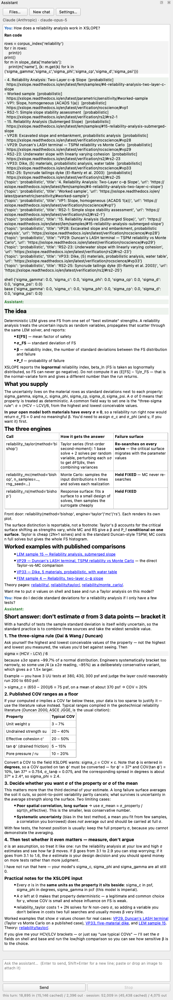

# Tutorial W-1 — The AI Assistant

Studio carries an assistant that does the work the rest of this series does by
hand. It can build a model from a drawing or from a description in words, edit
any part of one afterwards, run every analysis XSLOPE offers, sweep a parameter
across a range, answer a question out of the built-in documentation, and write
the analysis report — all in the open project, on the same undo stack the
editors use. This tutorial takes one slope and asks for each of those in turn,
and after every request it shows what to look at to decide whether the answer is
right.

<div class="tut-glance" markdown>
<div class="tgt-row">
<div class="tgt-tile"><span class="tg-label">Analysis</span><p>Any</p></div>
<div class="tgt-tile"><span class="tg-label">Read &amp; try</span><p>~30 min</p></div>
</div>
<div class="tgm-obj" markdown>
**Objectives** — Learn how to set the assistant up and what to ask it for, and
learn how to check each kind of answer it gives back.
</div>
<p><span class="tg-pill">AI assistant</span><span class="tg-pill">provider setup</span><span class="tg-pill">images</span><span class="tg-pill">model edits</span><span class="tg-pill">parameter studies</span><span class="tg-pill">strength reduction</span><span class="tg-pill">documentation</span><span class="tg-pill">analysis report</span></p>
<div class="tgm-model" markdown>**Model** — the reinforced slope of
[LEM-8](lem08_reinforced_slope.md) —
[xslope_reinforced_slope.xlsx](files/xslope_reinforced_slope.xlsx)</div>
</div>

---

## Setting it up

The assistant lives in a dock on the right side of the Studio window, titled
**Assistant**. It opens with the window; if it has been closed, **View →
Assistant** brings it back, and like every Studio dock it can be dragged to
another edge, floated, or widened by dragging its inner border.

{width=430}

Three buttons sit across the top. **Files…** opens the folder where the
assistant saves the plots and files it generates, **New chat** starts a fresh
conversation, and **Settings…** opens the dialog below. Under them is a caption
naming the provider and model in use — *Claude (Anthropic) · claude-opus-5* in
the figure. The transcript fills the middle, the input box is below it, and
**Send** and **Stop** are at the bottom.

### The settings dialog

You bring your own model: the assistant does nothing at all until it has a
provider and credentials. To supply them, click **Settings…**.

{width=460}

The dialog has four fields and a checkbox:

**Provider** — one of five: **Claude (Anthropic)**, **OpenAI**, **Kimi
(Moonshot AI)**, **Z.ai (GLM)**, and **Ollama (local, free)**. Every one of them
can read an image, which is a requirement rather than a coincidence: handing the
assistant a photograph or a sketch of a cross section is the first thing this
tutorial does, and a model that cannot see turns that request into a
conversation about what the picture shows. Where a provider sells text-only
models alongside models that can see, only the second kind is listed. The first
four are hosted services that bill for what you use; Ollama runs a model on your
own machine, free, and sends nothing anywhere.

**Model** — a list of what the chosen provider currently offers, with one marked
as recommended. The box also accepts free text, so a model id released after
your copy of Studio was built can be typed in. **Refresh** beside it asks the
provider for its list again; until a key is entered there is nothing to ask
with, and the caption under the box says the list is the one this version
shipped with.

**API key** — the key from your provider's account page, pasted in. It is masked
as you type and stored in your operating system's keychain, not in a settings
file and not in plain text. Ollama needs no key, and the field is disabled when
Ollama is selected.

**Base URL** — the address the provider is reached at. It is enabled for Kimi,
Z.ai and Ollama, whose endpoints move — a Z.ai coding-plan key uses a different
base from a standard one, and a local Ollama may be on another port — and
disabled for Claude and OpenAI, whose addresses are fixed.

**Confirm before running code** — checked by default. The assistant works by
writing small Python snippets and running them in Studio's own process, so with
this box checked every snippet is shown to you and waits for your approval
before it executes. Unchecked, the assistant runs code without asking, which
goes faster on a long build. Read what that means before you uncheck it: the
code runs as you, with your file access.

Below the fields, two captions report where the model list came from and what
the selected model can do — whether it supports running code, whether it can
read an image, and whether the provider caches the prompt.

### What it costs

A hosted provider bills per token, and both the tokens read and the tokens
written count. A routine question — one asked of a built model, answered with a
run — costs about **32,000 input tokens** on Claude Opus 5, roughly half of them
served from the provider's prompt cache at a fraction of the price of fresh
input, for a few hundred tokens of reply. A request that has to measure something
costs far more, because it is many runs: the diagnosis below spends 192,000. In
writing this documentation, $20 of API credit covered weeks of use.

Models differ in both price and capability, and the two do not track each other
perfectly: a cheaper model may answer a question about the documentation as well
as an expensive one and still fail at a long autonomous build. The line under
the input box reports the tokens each turn spent and the running total for the
conversation:

```
this turn: 31,709 in (15,146 cached) / 610 out · session: 31,709 in (15,146 cached) / 610 out
```

One request is usually several calls to the model, so that first number climbs
while the assistant works. **New chat** starts the count over.

The eight conversations below cost this much between them, measured as they ran:

| Session | Turns | Model calls | Tokens in (cached) | Tokens out | Wall |
| --- | :---: | :---: | :---: | :---: | :---: |
| Building from a drawing | 1 | 5 | 91,314 (75,730) | 15,102 | 219 s |
| Modifying the model | 3 | 12 | 215,159 (163,848) | 7,243 | 187 s |
| A sweep with a helper | 1 | 2 | 26,868 (25,044) | 1,577 | 104 s |
| A sweep without one | 1 | 3 | 49,548 (45,438) | 3,724 | 101 s |
| Stiffnesses and strength reduction | 2 | 5 | 71,104 (62,610) | 2,654 | 175 s |
| Two questions | 2 | 3 | 52,009 (45,438) | 4,075 | 61 s |
| A broken file | 1 | 9 | 191,949 (136,314) | 11,209 | 784 s |
| The report | 2 | 4 | 65,001 (45,438) | 998 | 43 s |
| **Total** | **13** | **43** | **762,952 (599,860)** | **46,582** | **1,674 s** |

Thirteen turns, 43 calls to the model and about 763,000 input tokens, of which
some 600,000 came from the prompt cache, come to about **$2.28** at Claude Opus 5
list rates — $5.00 per million input tokens, $0.50 per million cache reads and
$25.00 per million output tokens. One session is a quarter of that on its own:
the diagnosis, which answers by measuring rather than by reading.

---

## What to expect

Everything below was produced with **Claude Opus 5**. Another model will do the
same work differently, and so will the same model on another day — the wording
will differ, the code it writes will differ, and it may take a different number
of steps to arrive at the same place. Treat the transcripts as an illustration
of what the requests look like and what comes back, not as a script to match
line for line.

The assistant is good at this work, and everything it produces should still be
checked. Checking is usually easy, and it is the same checking a model built by
hand deserves: read the model checks Studio runs after every edit, look at the
section on the canvas, and do one hand calculation against the number that came
back. Each use case below ends with **Check its work** — what to look at, and
what it should say.

---

## Building a model from a drawing

We will paste the problem drawing from [LEM-8](lem08_reinforced_slope.md) into
an empty project and ask for the model it describes, with nothing else to go on
but the units. One request exercises everything at once here: reading dimensions
off a picture, entering materials, geometry, a load and six reinforcement lines,
and then searching for the critical circle.

We start from **File → New**. Right-clicking the drawing at the top of that page
and choosing **Copy image** puts it on the clipboard; from there we click in the
chat box, press Ctrl/Cmd+V to attach it, and type:

<div class="prompt-block" markdown>
```text
Build this model. Use the dimensions and properties on the drawing. Unit system: US customary (ft, psf, pcf). Add a starting circle and run Spencer with a search.
```
</div>

{width=560}

The first snippet came back empty — one call to the model that ran nothing and
printed nothing.

The second builds the model, and every dimension in it comes off the drawing. The
rigid base sits at y = 0, the toe at (30, 10), the crest break at (60, 34) up a
1.25:1 face, and the crest runs out to x = 130: 130 ft overall, which is the width
the drawing gives, with 30 ft of ground in front of the toe. That is LEM-8's own
section moved 30 ft to the right and 10 ft up. The cohesive face band was measured
2 ft horizontally, giving the shell polygon (30,10)–(60,34)–(62,34)–(32,10) —
LEM-8's band exactly. Both materials carry γ = 130 pcf and φ′ = 37°, with
c′ = 300 psf on the shell and 0 on the base. A 240 psf `dloads` block crosses the
70 ft crest, and six geosynthetic lines at Tmax = 800 lb/ft sit at el. 10, 14, 18,
22, 26 and 30, each starting on the face, each 20 ft long, each with 4 ft of
pullout at both ends.

The input checks came back with 13 errors: no failure surface yet, a support type
of `geotextile` on all six reinforcement lines, and a pullout delta out of range on
all six. The assistant read them, set the type to `geosynthetic`, cleared
`adhesion` and `delta` to blank so the drawing's stated pullout length governs,
generated three starting circles from a center at (45, 58), and the checks came
back clean. Spencer with a search then returned **FS = 1.471** on the circle
Xo = 24.24, Yo = 55.91, R = 46.27, bottoming at el. 9.64 — a third of a foot below
the toe. It passed on the note the run printed: 6 of 887 trial surfaces with no
Spencer solution, none of them ranking below the reported minimum.

The session saved
[w1_build_from_image_after.xlsx](files/w1_build_from_image_after.xlsx), and that
file will not reopen. Studio refuses it — *Reinforcement line 'Line 1' (reinforce
sheet, Excel row 3) has an unrecognized Dir='0.0'. Expected: tangent or axial.*
Beside every reinforcement line sit two fields, **Dir** and **Appl**, that the
template fills in for itself with a lookup on the support type; the assistant wrote
a number into the first and a blank into the second, replacing both lookups. `Dir`
takes only the two words the message names, so the file no longer loads, and
clearing that one cell on all six rows is the whole repair.

Both values are also read while the model is open, which is where the reported
factor of safety went. A `Dir` other than `tangent` applies the six lines along the
bar axis rather than tangent to the failure surface, and an `Appl` other than
`active` applies their capacity as passive, divided by the factor of safety. Set
one at a time on the repaired file:

| Dir | Appl | FS |
| :--- | :--- | :---: |
| tangent | active — the template's own | **1.5881** |
| 0.0 | active | 1.6058 |
| tangent | blank | 1.4533 |
| 0.0 | blank — what the session ran | **1.4710** |

LEM-8 publishes 1.5867 for this slope, from a search that starts on different
circles. So the model built off the drawing reproduces the published one to three
figures, and the 0.117 between 1.5881 and the reported 1.471 comes entirely from
two fields the drawing never mentions.

### Check its work

- **Open the saved workbook, clear the six `Dir` cells, and run Spencer with a
  search: 1.5881**, against the 1.471 the session reported and LEM-8's own 1.5867.
- **Do not wait for the model checks to raise it.** Set `Dir = 'sideways'` on the
  same model and the checks return six errors; leave it at `0.0` and they come back
  clean. Reloading the file is what finds this one.
- **Open the Materials editor.** Both materials read γ = 130 pcf and φ′ = 37°,
  with c′ = 300 psf on the shell and 0 on the base — what the drawing states.
- **Open the Reinforcement editor.** Six layers sit 4 ft apart from the toe
  elevation up, each starting on the face, each 20 ft long, each at 800 lb/ft,
  with the pullout envelope breakpoints 4 ft in from each tip. The surcharge reads
  240 psf across the 70 ft crest.
- **Measure the section against the drawing.** It runs 130 ft overall with the 2 ft
  cohesive band measured horizontally, which is what the drawing dimensions.
- **The geometry landed on the `polygon` sheet, not the `profile` sheet.** Open
  the repaired file in Studio and Profile lines is empty. Max depth reads blank in
  consequence, which is correct — max depth has no meaning for polygon input — so
  the `max_depth = 0.0` the assistant wrote is inert.
- **Both materials carry E = 0 and ν = 0.** Harmless for a limit equilibrium run,
  and a singular stiffness matrix for any finite element run later.

---

## Modifying the model

We will take the finished slope and change three things in one conversation: the
face from 1.25:1 to 2:1, a 500 psf load added across part of the crest, and
every reinforcement line extended 5 ft to the right. Each edit is a request in
plain language against a model already built, and each is rerun so we can watch
the factor of safety move.

We open the finished slope,
[xslope_reinforced_slope.xlsx](files/xslope_reinforced_slope.xlsx), and send three
requests in one conversation. First the face:

<div class="prompt-block" markdown>
```text
Change the slope face to 2:1 and rerun the search.
```
</div>

Then the load:

<div class="prompt-block" markdown>
```text
Add a distributed load of 500 psf on the crest from x = 60 to x = 90 and rerun.
```
</div>

Then the reinforcement:

<div class="prompt-block" markdown>
```text
Extend all the reinforcement lines 5 ft to the right and rerun.
```
</div>

{width=560}

Read the first turn closely, because it corrects itself. The assistant opened by
rebuilding `slope_data['polygons']` for the 2:1 face, and the snippet's result came
back carrying a warning:

> WARNING: polygons were edited on a profile-line model and have been rebuilt
> from profile_lines; edit profile_lines instead (and the ground surface if it is
> separate), then call resync_geometry(). The polygon edit did not take.

It read that, printed `profile_lines` back out and rewrote them — the shell band
as `(0,0) (48,24) (50,24)` and the base as `(−30,0) (2,0) (50,24) (100,24)` —
then resynced, printed the vertices again to confirm, and only then ran. Everything the
edit implies went with it: the six layers moved to start at x = 2y on the new face,
each still 20 ft long with 4 ft of pullout at both ends; the 240 psf block moved to
start at the new crest break x = 48; the toe starting circle was rebuilt through
the toe at Xo = 24, Yo = 48, R = 53.67, and the deep circle recentered. It laid all
of it out in a before-and-after table, ran Spencer without being told to, and said
why — "Spencer (the method the model declares)". **FS = 1.948.**

The second turn adds the 500 psf as a second `dloads` block from (60, 24) to
(90, 24) and returns **1.916**. The assistant noticed on its own that the new block
overlaps the 240 psf one, reported that the crest therefore carries 740 psf over
x = 60 to 90, and asked whether replacement was meant instead. The third turn adds
5 ft to every `x2`, leaves the pullout breakpoints 4 ft from each tip, and returns
**2.029**; it also passed on the admissibility note that run printed, a line of
thrust outside the slice on 13% of boundaries.

One workbook was saved per turn:
[w1_modify_after_1.xlsx](files/w1_modify_after_1.xlsx),
[w1_modify_after_2.xlsx](files/w1_modify_after_2.xlsx) and
[w1_modify_after_3.xlsx](files/w1_modify_after_3.xlsx).

### Check its work

- **Reload each saved workbook and run the search yourself: 1.9479, 1.9158 and
  2.0292** — the three numbers reported, to four figures.
- **Open the first of the three and look at the `profile` sheet**, not the
  `polygon` sheet: the face runs (0,0) to (48,24) there, so the edit reached the
  source the geometry is built from rather than the polygons derived from it.
  That is what the warning asked for, and what the first snippet had not done.
- **Read the critical circle beside each factor of safety** — (7.39, 59.83) with
  R = 61.14, then (2.69, 84.39) with R = 84.39, then (8.65, 72.99) with
  R = 74.80. All three searches moved the surface, so none of the three numbers is
  the previous surface re-solved.
- **Check the method.** All three runs are Spencer, which is what the model
  declares; a run that silently used another method would not compare with the
  1.587 the same model gives in [LEM-8](lem08_reinforced_slope.md).

---

## A sweep the engine runs for it

We will ask for the geogrid tensile capacity swept from 500 to 3000 lb/ft in six
steps, with a search at every step, plotted against the factor of safety. The
sweep engine behind Studio's **Parametric…** dialog is preloaded in the
assistant's kernel, so the request tests whether the assistant reaches for the
machinery already there rather than rebuilding it.

<div class="prompt-block" markdown>
```text
Sweep the geogrid Tmax from 500 to 3000 lb/ft in 6 steps with a search at each step and plot FS against Tmax.
```
</div>

{width=560}

It reached for the preloaded `sensitivity(values, apply, …)` helper with
`method='spencer'` and `search=True`, held `t_res` at its original 0.75 of `t_max`
on all six layers, wrote `sensitivity.csv` and `sensitivity.png`, and put the model
back at 800 lb/ft. The plot arrives inline in the transcript, and **Files…** opens
the folder holding both.

| Tmax (lb/ft) | 500 | 1000 | 1500 | 2000 | 2500 | 3000 |
| --- | :---: | :---: | :---: | :---: | :---: | :---: |
| FS (Spencer, searched) | 1.425 | 1.641 | 1.669 | 1.681 | 1.681 | 1.681 |

The callback form suits this study, and no reference-based form could have run
it.
`list_params` — which fills the Parametric dialog's **Property** dropdown and
`design_sweep(param=…)` alike — lists each material's strength and general fields
plus the global seismic coefficient, and carries no reinforcement entries at all,
so Tmax has no parameter reference to name. Passing a function instead reaches a
value that lives on six reinforcement rows at once.

Its reading of the curve goes past what it ran. Past about
2000 lb/ft, it wrote, "the mobilizable force is capped by pullout/anchorage (the
`lp1`/`lp2` embedment terms)". Removing the pullout limit entirely — Lp1 = Lp2 = 0,
fully anchored — at Tmax = 2000 raises the factor of safety from 1.681 to only
**1.715**, 2%, where that account predicts the plateau should lift. What the six
runs do show is the critical circle migrating: its center moves from
(−7.74, 48.06) at Tmax = 500 to (5.69, 48.64) at 3000, as the search finds a
mechanism that engages less of the reinforcement. The numbers are right and the
shape of the curve is right; the mechanism offered for it is contradicted by a
measurement.

### Check its work

- **Re-run three of the six steps**: 1.4252 at 500 lb/ft, 1.6407 at 1000 and
  1.6813 at 3000 — the reported values to four figures.
- **Open the Reinforcement editor when it finishes.** Tmax reads 800 lb/ft on all
  six layers; the sweep restored the project, and no workbook was written.
- **Test the account of the plateau before repeating it.** Set Lp1 = Lp2 = 0 at
  Tmax = 2000 and re-run: 1.715, not the lift a pullout ceiling implies.
- **Read the critical circle at each step, not only the factor of safety.** The
  center walks from x = −7.74 to x = 5.69 across the six runs, which is the part
  of the answer the plot does not carry.

---

## A sweep it has to write itself

We will ask for the same slope with two, three, four, five and six geogrid
layers, removing from the top down and searching each time. No dialog offers
that study — the parameter being varied is the number of rows in a table, not a
number in a cell — so the assistant has to write the loop itself.

<div class="prompt-block" markdown>
```text
Run the analysis with 2, 3, 4, 5 and 6 geogrid layers (removing the top layers first), searching each time, and tabulate FS against the number of layers.
```
</div>

{width=560}

It opens straight on the study. One snippet prints the six reinforcement rows;
the second is the loop, which keeps the bottom n rows, resyncs the geometry,
searches once per row, and puts all six back at the end. Two layers means the two
lowest grids, at y = 0 and 4 ft. Three calls to the model and 49,548 input tokens
covered it, against the 26,868 the previous sweep spent on a study of the same
size.

| Layers | 2 | 3 | 4 | 5 | 6 |
| --- | :---: | :---: | :---: | :---: | :---: |
| FS (Spencer, searched) | 1.210 | 1.272 | 1.433 | 1.512 | 1.587 |

Its reading of the table survives testing. It takes the step from three layers to
four as the point where the critical surface changes character: with two and three
layers the minimum bottoms at el. +2.7 and +7.3, above the reinforcement, so the
grids are bypassed. Deleting the reinforcement and re-solving on those same circles
returns the same factor of safety — 1.2096 against 1.2099, and 1.2724 either way —
with the reinforcement force summed over the slices at 1.4 lb/ft and exactly zero.
What the grids do at two and three layers is set the mechanism: with every layer
removed the search drops to **1.1674**, so the reinforcement holds the deeper
surface shut and forces the minimum up above itself.

It also reads its own increments before summarizing them. "The gain per layer is
**not** uniform," it wrote, and named the fourth layer's +0.161 as the largest
step of the four rather than the smallest.

### Check its work

- **Re-run three of the five rows, factor of safety and circle both**: 1.2097 on
  (−5.71, 48.23) with R = 45.51, 1.2722 on (2.73, 43.07) with R = 35.80, and
  1.5117 on (−6.00, 47.74) with R = 48.11.
- **Read the six-layer row against the published answer.** It returns 1.5867,
  which is [LEM-8](lem08_reinforced_slope.md)'s Spencer result for this model, so
  the loop's last row reproduces a number computed elsewhere.
- **Test the bypass before repeating it.** Delete the reinforcement and re-solve
  on the two- and three-layer circles: 1.2096 and 1.2724, against 1.2099 and
  1.2724 with the grids in place.
- **Open the Reinforcement editor when it finishes.** All six layers are back;
  the loop restored them, and no workbook was written.

---

## Material properties for a finite element run

We will ask what Young's modulus and Poisson's ratio to use for these two soils,
and why, then have the assistant enter them, mesh the slope and run the strength
reduction analysis. A limit equilibrium analysis needs no stiffnesses and the
finite element engine will not start without them, so this is the gap every model
crossing from one engine to the other has to close.

<div class="prompt-block" markdown>
```text
Suggest values of Young's modulus and Poisson's ratio for these materials so I can run a finite element analysis, and explain your choice.
```
</div>

Then, once it has proposed values:

<div class="prompt-block" markdown>
```text
Enter them, build a quadratic mesh at 2 ft, and run the strength reduction analysis.
```
</div>

{width=560}

The first turn runs one snippet: it printed both materials, called
`suggest_elastic()`, and reported the classifier's answers verbatim — shell
classified as Medium Clay at E = 668,300 psf and ν = 0.40, base as Dense Sand at
E = 2,861,300 psf and ν = 0.30 — noting that both materials already carried a
placeholder E = 1,000,000 psf with ν = 0.3. It then argued that a c = 300 psf,
φ = 37° material behaves as a c–φ fill rather than as a clay, and proposed
ν = 0.30 with E = 1.2 × 10⁶ psf for the shell instead of the classifier's clay
value, saying so plainly.

The second turn entered those values. Since the model already declares tri6 at a
2 ft target size, `run_fem(analysis='ssrm')` built the mesh itself — 4,364 nodes
and 2,101 elements — and bisected to **SSRM FS = 1.4727** in 125.5 s, against
Spencer's 1.587 on the same slope. It read the bisection trace correctly,
including the runaway displacement at the failed bracket as the criterion rather
than as a solver defect. It raised two things to follow up: it could not tell
whether the six reinforcement lines were contributing to the finite element run
and asked the user to confirm, where one snippet would have answered it; and its
read-back of the mesh type came back empty, because `slope_data['mesh']` reports
`element_type` as `None`.

The session saved
[w1_elastic_fem_after.xlsx](files/w1_elastic_fem_after.xlsx).

### Check its work

- **Rebuild the mesh from the saved file at the same settings**: the same 4,364
  nodes and 2,101 elements, and the same factor of safety to eight digits,
  1.47265625.
- **Open the Materials editor.** The shell carries E = 1.2 × 10⁶ psf and ν = 0.30,
  the value the assistant argued for, not the 668,300 psf and ν = 0.40 the
  classifier returned; the base carries the classifier's 2,861,300 psf and
  ν = 0.30.
- **Test the claim that E and ν do not move the factor of safety.**
  [FEM-2](fem02_reinforcement.md) runs this same model at tri6 and 2 ft with the
  shell at E = 1.0 × 10⁶ psf and reports 1.496; this run raised the shell to
  1.2 × 10⁶ psf and reports 1.473. FEM-2 also measures that a reinforced finite
  element model responds to the ratio of soil stiffness to layer stiffness rather
  than to either stiffness alone, so put the shell back at 1.0 × 10⁶ psf and
  re-run before carrying the claim anywhere.
- **Answer the reinforcement question rather than leaving it asked.** Whether the
  six lines are carried into the finite element run is one snippet's work, and
  1.473 means one thing if they are and another if they are not.

---

## Asking how something works

We will ask two questions that change nothing: how a reliability analysis works
in XSLOPE, and how to choose standard deviations from a handful of tests. The
assistant carries this documentation as context, so a question like this is
answered from the same pages the rest of the site is written on, with a link to
follow.

<div class="prompt-block" markdown>
```text
How does a reliability analysis work in XSLOPE?
```
</div>

Then, in the same conversation:

<div class="prompt-block" markdown>
```text
How do I decide standard deviations for a reliability analysis if I only have a few tests?
```
</div>

{width=560}

The first snippet does two things: it calls `corpus_index('reliability')`, which
returns ten verification pages on the topic, and it prints the `sigma_*` fields on
both materials. The answer opens on the second of those — every standard deviation
on this model is zero — before saying anything general, and closes on the first,
citing four worked examples by name: LEM sample 15, VP29 (Duncan's LASH terminal,
Taylor against Monte Carlo), VP33 (the five-material dike) and FEM sample 4. The
three theory pages it links, `reliability/`, `reliability/taylor/` and
`reliability/monte_carlo/`, are real and correct.

Its three-engine table matches the implementation, including the distinction that
decides how the engines compare — `reliability_taylor` re-searches the critical
surface on every one of its 1 + 2N solves, while `reliability_mc` and
`reliability_rs` hold one surface fixed. Every helper it names is real and spelled
correctly, with the right keyword arguments. And it takes the reliability index
from the engine rather than from the textbook: "XSLOPE reports the **lognormal**
reliability index, `beta_ln` … Do not compute it as `(E[FS] − 1)/σ_FS` — that is
the normal-variate form and gives a different number than the run returns."

The second answer holds up as practice — Duncan's three-sigma rule with the caution
to divide by 4 rather than 6, published coefficient-of-variation bands, the sample
standard deviation as a lower bound when there are few tests, spatial averaging
along the surface, and the advice to run the analysis at a low and a high σ instead
of arguing about the estimate. It adds "I have not run that here", which is what a
suggestion the assistant has not tested should say.

Two things in the pair were not run. Its prediction that a model with every σ at
zero "would return σ_FS = 0 and no meaningful β" is not what happens: run on this
model, `reliability_taylor` returns no result at all — it refuses, naming the σ
columns and the sheet they live on. And the one conversion it worked by hand comes
out short: for φ′ = 37° and a 10% coefficient of variation on tan φ′, it gives
σ_tanφ = 0.075, which is right, and then 37° ± 2.4°, which is not — 0.075 on
tan 37° works out to 2.75° of friction angle.

### Check its work

- **Check that nothing moved.** Neither turn edited the model or ran an analysis,
  and no workbook was written; the questions were answered out of the
  documentation, the verification corpus and one read of the open file.
- **Follow the four worked examples and the three theory links.** They land on
  real pages, and the reading there is what the answer summarizes.
- **Run `reliability_taylor` on the model as it stands.** It refuses and names the
  σ columns, rather than returning the zero standard deviation the answer predicts.
- **Redo the conversion in section 2 of the second answer.** σ_tanφ = 0.075 on
  tan 37° = 0.754 puts the friction angle between 34.15° and 39.66°, so
  `sigma_phi` is about 2.75, not the 2.4 the answer gives.
- **Ask for more worked examples if the four are not enough.**
  [LEM-11](lem11_reliability.md) runs the same three engines on a worked slope,
  and neither answer mentions it.

---

## Finding what is wrong with a model

We will open a copy of the slope with three transcription errors written into it
and say only that the factor of safety is below 1. No request in this tutorial
carries less information, and none depends more on testing the answer that comes
back.

That copy, [w1_diagnose_start.xlsx](files/w1_diagnose_start.xlsx), carries three
errors typed into the LEM-8 model: the base material's φ′ as **3°** instead of
37, a dropped digit; the crest surcharge as **2,400 psf** instead of 240, a decimal
slip; and the maximum depth as **−100** instead of −10, another dropped digit.
Spencer with a search returns 0.071 on it.

<div class="prompt-block" markdown>
```text
This model gives a factor of safety below 1. Can you find what is wrong?
```
</div>

{width=560}

It answers by changing things rather than by reading them. After one read of the
model and the baseline search, six more snippets set the base friction angle to 10,
20, 30 and 37 degrees; the surcharge to 240 psf and then to nothing; the maximum
depth to 0; the reinforcement to none; and the material zoning to two alternatives
— each followed by its own search, and the model put back afterwards. That takes
nine calls to the model, 192,000 input tokens and thirteen minutes, the most any
single request in this tutorial costs, and the answer opens with what each change
did:

| Change (from the baseline 0.071) | FS |
| :--- | ---: |
| base φ′: 3° → 30° | 0.914 |
| base φ′: 3° → 37° | 1.181 |
| base φ′: 3° → 20° | 0.582 |
| base φ′: 3° → 10° | 0.287 |
| surcharge 2400 → 240 psf | 0.096 |
| surcharge removed entirely | 0.103 |
| maximum depth −100 → 0 | 0.070 (no effect) |
| φ′ = 30° and 240 psf together | 1.222 |

All three planted errors are in that table, and the diagnosis under it ranks them.
The friction angle comes first, on the grounds that it is the only input moving the
factor of safety by more than a hundredth; the assistant reads it as a dropped
digit and recommends 30°, where the file was broken from 37°, and its own table
carries both. The surcharge comes second, named as the same kind of typo, with the
0.914 → 1.222 it adds once the strength is fixed. The maximum depth comes last,
de-ranked by the measurement rather than by an argument about it, with the note
that a base 100 ft below a 24 ft section is invented depth whatever the factor of
safety does.

The 2 ft cohesive face band gets measured too, and hedged: regrouping the zones so
the shell becomes the whole embankment gives 0.129 on its own and 1.353 with the
friction angle restored, and the assistant writes that it "could not tell from the
model which was intended". An earlier recording of this same request invented that
regrouping as the cause and offered to redraw the published problem, which is why
the checks below reproduce each of these numbers rather than read them.

One claim does not survive, and it is the one that says "I measured that". The
assistant reports that the six geogrid layers contribute nothing, identical to
three decimals with and without them. Its test set `reinforcement_lines` to an
empty list, and the slicer falls back to the derived `reinforce_lines` when that
list is empty, so all six lines were still in the model both times. Clear both and
the broken model goes from 0.0709 to **0.0312**, and the repaired case from 1.2218
to **0.9358**.

It changed nothing, said so, and no workbook was written. The answer ends with a
section headed **What I did not test**.

### Check its work

- **Restore φ′ = 37 on the base and change nothing else.** Spencer goes from
  0.0709 to **1.1805**, the 1.181 in its table.
- **Restore the 240 psf surcharge as well.** **1.5867** — LEM-8's published
  Spencer answer to four figures, the model this file was broken from. On the
  broken model the surcharge alone moves 0.0709 to 0.0964.
- **Put the maximum depth back to −10.** Nothing changes: 0.0709 either way, which
  is what the table says.
- **Remove the reinforcement properly before believing it does nothing.** Clearing
  `reinforcement_lines` alone leaves the derived list in place and changes nothing;
  clearing both takes the broken model to 0.0312 and the repaired case to 0.9358.
  The same removal on the LEM-8 model gives 1.1674, which is that tutorial's own
  no-reinforcement answer.
- **Read the run behind the 0.129 row.** Spencer could not solve 147 of its 528
  trial surfaces there, and 68 of those rank below the reported minimum, so 0.129
  is not a number to carry anywhere. The assistant quoted the baseline's
  admissibility notes and not this one's.

---

## Generating the report

We will run Spencer with a search and then ask for the analysis report in one
sentence. What comes back is the same document the Report dialog writes, built
from the same run, so this request shortcuts the dialog rather than making a
second kind of report.

The report documents what the session has solved, so the run comes first:

<div class="prompt-block" markdown>
```text
Run Spencer with a search.
```
</div>

Then the document:

<div class="prompt-block" markdown>
```text
Generate the analysis report for this model.
```
</div>

{width=560}

The first turn returns **FS = 1.587** on the circle (−5.13, 46.98) with R = 47.26
— [LEM-8](lem08_reinforced_slope.md)'s published answer to four figures. It read
the surface straight off the result — `Xo`, `Yo`, `R`, `Depth`, `x_entry` and
`x_exit` — and laid the six numbers out in a small table, reading the circle as a
toe circle bottoming at el. −0.28, well above the rigid base at −10. It passed on
the search note as well: Spencer could not solve 13 of the 838 trial surfaces, and
none of the 13 rank below the reported minimum.

The second turn makes one call to `generate_report`. The document runs 12 pages with
six figures: *1 Traceability*, *2 Project Definition* and *3 Limit Equilibrium
Analysis*, the last carrying 3.1 Analysis Inputs, 3.2 Materials, 3.3 Loads,
3.4 Reinforcement and 3.5 Spencer's Method, itself split into the search, the
results, the slice table and the calculations. It lands in the folder **Files…**
opens, and the dock shows it as an attachment with a *show in folder* link beside
it.

The session saved [w1_report_after.docx](files/w1_report_after.docx).

### Check its work

- **Open the report at §3.5.2.** It reads "Spencer's Method gives a factor of
  safety of 1.587 on the critical surface of Figure 4" — the run made in the first
  turn, not a second analysis the report performed for itself.
- **Read the traceability page.** It names the file the session ran on and its
  digest:

```text
xslope_reinforced_slope.xlsx
43bb96b090d647c594102c40142e4eed9acd181a6f1802318b132e0e8b412bb3
```

  Hashing `docs/tutorials/files/xslope_reinforced_slope.xlsx` returns the same 64
  characters, so the document names the model it was written from.
- **Read §3.5.1 against the console.** The search summary reports 838 trial
  surfaces evaluated and 96 grid centers refined, on two rows, which is what the
  run printed.
- **One line of its summary does not match the document.** The assistant describes
  what it generated as covering "2-zone polygon geometry"; the geometry is on
  profile lines, and the report's own Project Definition says so — "2 material
  zones described with profile lines".

---

## What it will not do

**It does not convert units.** A model is in one unit system throughout, and the
assistant works in whatever the project already uses. Give it feet and pounds
and it enters feet and pounds; give it a drawing in meters and kilonewtons for a
project in feet and it will say so rather than convert on its own. Convert the
numbers yourself before you hand them over.

**It asks when a request is ambiguous.** A request that could reasonably mean two
things gets a question back rather than a guess. The 500 psf load added above
lands on a crest that already carries 240 psf from x = 48 to 100, so the assistant
reported that the strip from x = 60 to 90 now carries 740 psf and asked whether
the 500 psf was meant to replace the 240 psf instead of adding to it.

**It can misread a dimension, and it can invent one nobody drew.** Reading a
number off a drawing leaves room for error — a dimension line that points at two
places at once, a label sitting nearer the wrong feature, a decimal point lost to
image resolution. Nothing downstream will catch it: the model checks test whether
a model is consistent, not whether it matches the picture. In the build above
every dimension came off the drawing correctly, and the error landed instead on
two fields no drawing mentions, Dir and Appl on the reinforcement lines, which the
template fills in for itself. That cost 0.117 of factor of safety and left a
workbook that will not reopen. Check the built model against the picture, then
open the file it saved.

**It can be confidently wrong, including about its own measurements.** Asked to
diagnose a model broken on purpose, the assistant found all three planted errors
and ranked them by what restoring each one did. In the same reply it wrote that
the six reinforcement layers contribute nothing, and added "I measured that" — but
the removal it ran cleared one of the two lists the solver reads, so nothing was
removed either time. Done properly, removing them takes that model from 0.071 to
0.031. Nothing in the reply reads as a guess, and no model check catches it. Only
running it again finds it.

---

## Conclusion

This tutorial covered:

- Setting the assistant up: a provider, a model and a key in **Settings…**, and
  13 turns of work for about $2.28.
- Building a model from a drawing: materials, geometry, a load, six reinforcement
  lines and a search from one request, every dimension right, and two fields
  filled in that the template fills for itself.
- Editing a built model: three plain-language edits, each rerun, and a warning the
  assistant read and repaired for itself.
- A sweep the engine ran for it: six searched steps, right to four figures, with a
  mechanism offered for the plateau that a measurement contradicts.
- A sweep it wrote itself: five layer counts, and a mechanism reading that holds
  when the grids are deleted and the same circles re-solved.
- Crossing to the finite element engine: stiffnesses classified from strength,
  argued over, entered, meshed at 2 ft and reduced to 1.473.
- Two questions answered out of the documentation and the verification corpus, a
  diagnosis that found all three planted faults by varying one input at a time,
  and a 12-page report carrying the run it names.

**Where to go next:** The [AI Assistant reference](../studio/assistant.md)
documents the helpers the assistant calls, the checks that run after every edit it
makes, and what each provider can do. [LEM-8](lem08_reinforced_slope.md) builds
this same slope by hand three ways, and [LEM-11](lem11_reliability.md) runs the
reliability analysis the assistant was asked about.
