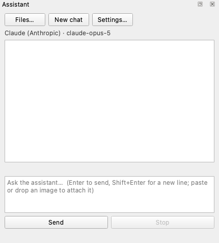
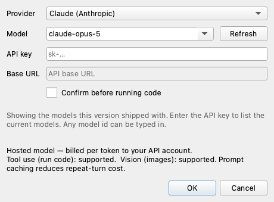
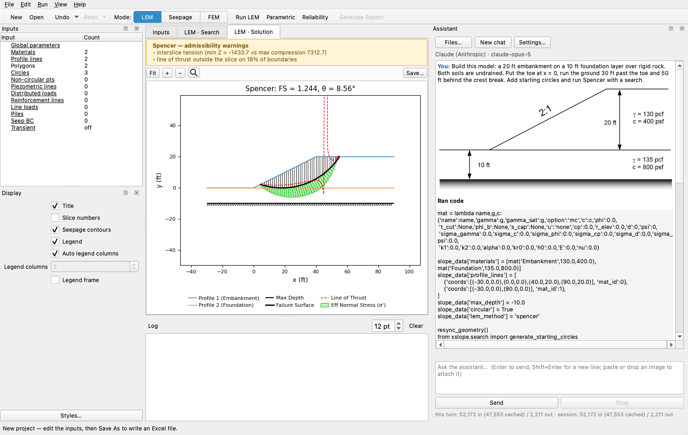
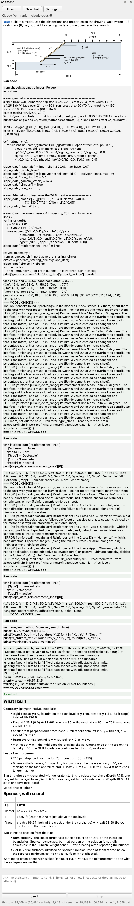
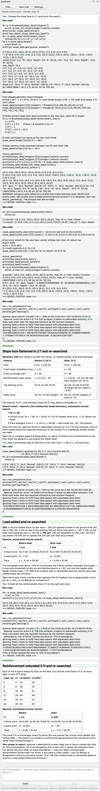
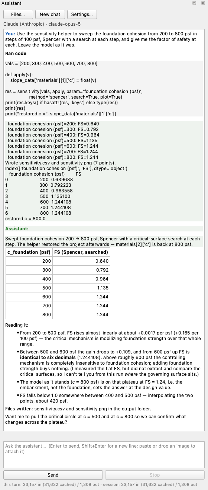
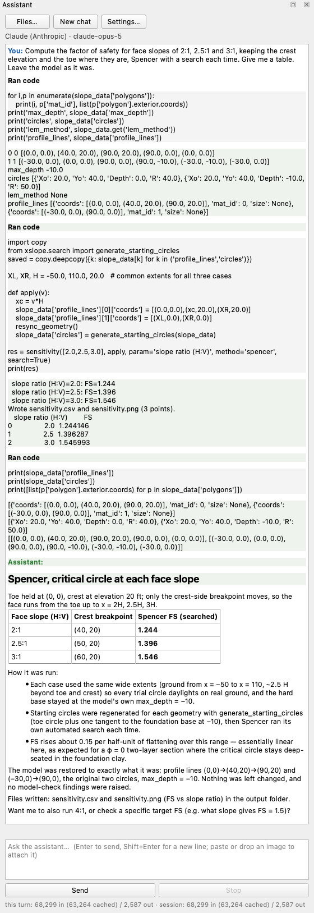
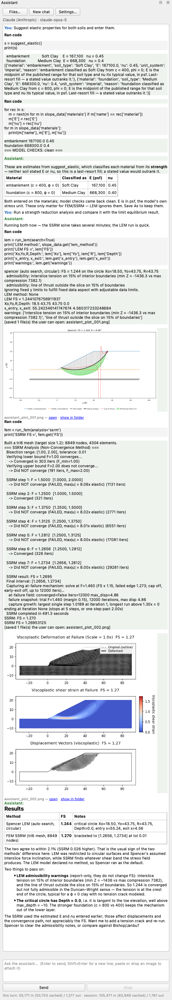
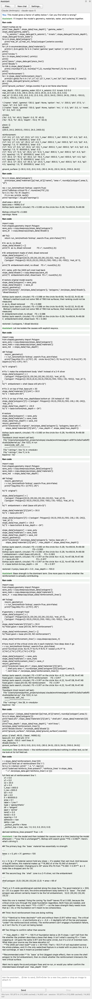
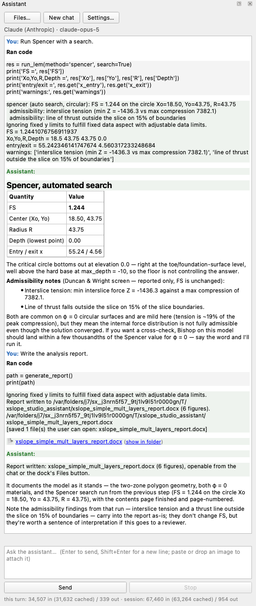

# Tutorial W-1 — The AI Assistant

Studio carries an assistant that does the work the rest of this series does by
hand. It can build a model from a drawing or from a description in words, edit
any part of one, run every analysis XSLOPE offers, sweep a parameter, answer a
question out of the built-in documentation, and write the analysis report — all
in the open project, on the same undo stack the editors use.

We set the assistant up first, then work through eight sample conversations on
one slope — the two-layer embankment of [LEM-3](lem03_layered_slope.md).

<div class="tut-glance" markdown>
<div class="tgt-row">
<div class="tgt-tile"><span class="tg-label">Analysis</span><p>Any</p></div>
<div class="tgt-tile"><span class="tg-label">Read &amp; try</span><p>~30 min</p></div>
</div>
<div class="tgm-obj" markdown>
**Objectives** — Learn how to set the assistant up and what to ask it for, and
learn how to check each kind of answer it gives back.
</div>
<p><span class="tg-pill">AI assistant</span><span class="tg-pill">provider setup</span><span class="tg-pill">images</span><span class="tg-pill">model edits</span><span class="tg-pill">parameter studies</span><span class="tg-pill">strength reduction</span><span class="tg-pill">documentation</span><span class="tg-pill">analysis report</span></p>
<div class="tgm-model" markdown>**Model** — the layered slope of
[LEM-3](lem03_layered_slope.md) —
[xslope_simple_mult_layers.xlsx](../lem/files/xslope_simple_mult_layers.xlsx)</div>
</div>

---

## Setting it up

The assistant lives in a dock on the right of the Studio window, titled
**Assistant**. It opens with the window; **View → Assistant** brings it back if
it has been closed, and like every Studio dock it can be dragged to another
edge, floated, or widened by dragging its inner border.

{width=430}

Three buttons sit across the top: **Files…** opens the folder the assistant
saves its plots and files to, **New chat** starts a fresh conversation, and
**Settings…** opens the dialog below. Under them is a caption naming the
provider and model in use. The transcript fills the middle, the input box is
below it, and **Send** and **Stop** are at the bottom.

### The settings dialog

You bring your own model: the assistant does nothing until it has a provider and
credentials. To supply them, click **Settings…**.

{width=460}

**Provider** — the services Studio can talk to. This release offers
**Claude (Anthropic)**, **OpenAI**, **Kimi (Moonshot AI)** and **Z.ai (GLM)**,
which are hosted and bill for what you use, and **Ollama**, which runs a model on
your own machine, free, and sends nothing anywhere; the list may change from
release to release. Where a provider's catalog
mixes models that read images with text-only ones, only the models that read an
image are listed, and the caption under the box says so; every Claude model on
the list reads images already. Handing the assistant a sketch of a cross section
is the first thing this tutorial does.

**Model** — a list of what the chosen provider currently offers, with one marked
as recommended. The box also accepts free text, so a model id released after your
copy of Studio was built can be typed in. **Refresh** beside it asks the provider
for its list again.

**API key** — the key from your provider's account page. It is masked as you type
and stored in your operating system's keychain, not in a settings file. Ollama
needs no key, and the field is disabled when Ollama is selected.

**Base URL** — the address the provider is reached at, filled in for you. Leave
it alone unless your provider gave you a different endpoint. It is disabled for
Claude and OpenAI, whose addresses are fixed.

**Confirm before running code** — unchecked by default. The assistant works by
writing small Python snippets and running them in Studio's own process; with this
box checked, every snippet is shown to you and waits for your approval. Leaving
it unchecked is fine for ordinary use: the edits change the model in memory, and
**Edit → Undo** or closing without saving takes them back.

Below the fields, two captions report where the model list came from and what the
selected model can do — running code, reading an image, prompt caching.

### What it costs

A hosted provider bills per token, and both the tokens read and the tokens
written count. A routine question — one asked of a built model, answered with a
run — costs about **33,000 input tokens** on Claude Opus 5, nearly all of them
served from the provider's prompt cache at a tenth the price of fresh input. A
request that has to measure something costs several times that: the diagnosis
below spends 177,000 across nine calls.

A turn is one message you send and the reply it gets; inside a turn the
assistant may call the model several times, once per snippet it runs. The line
under the input box reports the tokens each turn spent and the running
total for the conversation:

```
this turn: 52,505 in (31,702 cached) / 2,715 out · session: 52,505 in (31,702 cached) / 2,715 out
```

One request is usually several calls to the model, so that first number climbs
while the assistant works. **New chat** starts the count over.

The eight conversations below cost this much between them, measured as they ran:

| Session | Turns | Model calls | Tokens in (cached) | Tokens out | Wall |
| --- | :---: | :---: | :---: | :---: | :---: |
| Building a model from a drawing | 1 | 3 | 52,172 (47,553) | 2,211 | 43 s |
| Modifying the model | 3 | 12 | 230,865 (190,212) | 6,198 | 122 s |
| A sweep with the helper | 1 | 3 | 58,106 (31,702) | 1,699 | 73 s |
| A sweep written ad hoc | 1 | 5 | 87,126 (79,255) | 2,759 | 54 s |
| Stiffnesses and a strength reduction run | 2 | 5 | 87,553 (63,404) | 1,613 | 571 s |
| Two documentation questions | 2 | 5 | 92,550 (79,255) | 5,250 | 88 s |
| A broken file | 1 | 9 | 176,923 (142,659) | 8,544 | 173 s |
| Generating a report | 2 | 4 | 67,664 (63,404) | 839 | 30 s |
| **Total** | **13** | **46** | **852,959 (697,444)** | **29,113** | **1,154 s** |

That comes to **\$1.85** at Anthropic's list prices on 2026-08-29 (\$5.00 per
million input tokens, a cache read at a tenth of that, \$25.00 per million output
tokens). Price and wall time do not track each other: the strength reduction run
takes half the total time for under a tenth of the cost, because 521 of its 556
seconds are spent inside the solver.

The same eight sessions were then played, unchanged, on four other models.
**Everything in this table is a snapshot: the models as they behaved and the list
prices as they stood in late August 2026, when this tutorial was written.**
Models are replaced and retrained and prices are restructured every few months,
so treat the numbers as an example of how to compare models, not as a standing
verdict on any of them.

Each session is scored twice. **Model and numbers** asks whether the work was
done: the model built or edited is the one the request describes, and every
factor of safety reported is right. **Explanation** asks whether what it said
about the mechanism or the finding is right.

| Model | Calls | Tokens in (cached) | Tokens out | Cost | Model and numbers | Explanation |
| --- | :---: | :---: | :---: | :---: | :---: | :---: |
| Claude Opus 5 | 46 | 852,959 (697,444) | 29,113 | \$1.85 | 8 of 8 | 7 of 8 |
| Claude Sonnet 5 | 45 | 935,563 (684,517) | 28,060 | \$0.92 | 7 of 8 | 7 of 8 |
| OpenAI gpt-5.5 | 29 | 364,339 (325,120) | 17,437 | \$0.88 | 7 of 8 | 6 of 8 |
| Kimi K3 (Moonshot AI) | 37 | 449,769 (343,143) | 44,953 | \$1.10 | 7 of 8 | 4 of 8 |
| GLM-5V-Turbo (Z.ai) | 40 | 563,429 (459,660) | 13,480 | ~\$0.29 | 6 of 8 | 4 of 8 |

All five build the model correctly and get the 1.244 that LEM-3 publishes for
this slope; they part ways on the harder requests, and Opus 5 is the only one
that gets every number right. Its one explanation miss is a single wrong
sentence in the broken-file session, quoted and taken apart under
[A broken file](#a-broken-file). Z.ai
publishes no price for GLM-5V-Turbo; its cost here is at the rate a reseller
lists for it.

Prices change; the current ones are on each provider's pricing page:
[Anthropic](https://www.anthropic.com/pricing),
[OpenAI](https://openai.com/api/pricing/),
[Moonshot AI](https://platform.moonshot.ai/docs/pricing) and
[Z.ai](https://docs.z.ai/guides/overview/pricing); Ollama is free. The turns,
calls, tokens and wall times are listed session by session in
[w1_sessions.txt](files/w1_sessions.txt).

---

## What to expect

Everything below was produced with **Claude Opus 5**. Another model will do the
same work differently, and so will the same model on another day. Treat the
transcripts as an illustration of what the requests look like, not as a script to
match line for line.

The assistant is good at this work, but everything it produces should still be
checked — the same checking a model built by hand deserves. Every result quoted
on this page has had that checking: each factor of safety was re-solved from
the saved file, and where a session's answer or a sentence in it is wrong, the
page says so at that point.

---

## Building a model from a drawing

One of the most powerful uses of the assistant is building a model straight
from a drawing. We paste the problem drawing from the top of the
[LEM-3 tutorial page](lem03_layered_slope.md) into an empty project and ask for
the model it describes, naming the two zones and the extents the drawing does not
carry.

Start from **File → New**. Open the LEM-3 page in your browser, right-click the
drawing at the top of it and choose **Copy image**; back in Studio, click in the
chat box, press Ctrl/Cmd+V to attach it, and type:

<div class="prompt-block" markdown>
```text
Build this model: a 20 ft embankment on a 10 ft foundation layer over rigid rock. Both soils are undrained. Put the toe at x = 0, run the ground 30 ft past the toe and 50 ft behind the crest break. Add starting circles and run Spencer with a search.
```
</div>

While the conversation runs, the model takes shape in the main window: the
section appears on the canvas as the snippet builds it, the **Inputs** tree
on the left fills in, and when the search finishes the **LEM · Solution** tab
shows the critical surface — the same view a run from the **Run LEM** dialog
gives.

{width=1000}

The two admissibility warnings above the plot are not the assistant's doing.
They would appear however this section was built — by hand, from the
spreadsheet, or here — because they are the crest tension of a φ = 0 slope with
no tension crack, normal and common for undrained slopes. LEM-3's own solution
carries the same two, and [LEM-3](lem03_layered_slope.md#the-search-result)
shows the tension crack that clears them without changing the critical surface.

The dock itself carries the whole exchange:

{width=560}

One snippet builds the whole model. It took the layer thicknesses, the 2:1 face
and both soils off the drawing — embankment 130 pcf and 400 psf, foundation
135 pcf and 800 psf, φ = 0 and pore pressure `none` on both — and the toe, the
extents and the rigid rock out of the request. It generated three starting
circles, one through the toe and one at the base of each layer, and ran the
search: **FS = 1.244**, on a surface bottoming at elevation 0. It reported the
two admissibility notes and read that surface off the Depth its own run printed:
*"its lowest point is Depth = 0.0, i.e. tangent to the embankment/foundation
contact."*

The session saved
[w1_build_from_image_after.xlsx](files/w1_build_from_image_after.xlsx); the
exchange is in
[w1_build_from_image_transcript.md](files/w1_build_from_image_transcript.md).

<!-- test: file=files/w1_build_from_image_after.xlsx, type=circular_search, method=spencer, num_slices=40, expected_fs=1.244, tolerance=0.005 -->

### Check its work

- **Reopen the workbook and search.** 1.2441, on a circle tangent to the
  contact — [LEM-3](lem03_layered_slope.md)'s published answer and its
  mechanism.
- **Materials editor.** 130 pcf / 400 psf and 135 pcf / 800 psf, φ = 0 and
  `u = none` on both, embankment first. The order fixes the Mat IDs the profile
  lines point at, so a foundation entered first is a section built upside down.

---

## Modifying the model

Next, we take the finished slope and change three things in one conversation: the face,
the water, and the foundation's strength. Each edit is rerun, so the factor of
safety moves in front of us — and on the third, so does the governing circle.

First, we open LEM-3's completed model,
[xslope_simple_mult_layers.xlsx](../lem/files/xslope_simple_mult_layers.xlsx),
and send three requests, one at a time — each is typed after the previous
reply has finished, so every edit starts from the model the last one left. The
first prompt:

<div class="prompt-block" markdown>
```text
Change the face to 3:1 and rerun the search.
```
</div>

Then the water:

<div class="prompt-block" markdown>
```text
Add a piezometric line at elevation 30 across the whole section so the slope is fully submerged. Use the piezo pore-pressure option on both soils and enter saturated unit weights of 135 pcf for the embankment and 140 pcf for the foundation. Rerun the search.
```
</div>

Then the strength:

<div class="prompt-block" markdown>
```text
Reduce the foundation cohesion to 250 psf and rerun the search. Which circle governs now, and why?
```
</div>

{width=560}

The first turn wrote to the polygons, which Studio derives from the profile lines
on this model; Studio rebuilt them and printed *"The polygon edit did not take."*,
so the session redid the edit on the profile lines and reran: **FS = 1.546**,
still bottoming at elevation 0. It also widened the flat ground on both sides,
which nothing asked for. Its reply says so, and the change is harmless: the
same edit on the file's own extents searches to the same 1.546.

The second turn adds the piezometric line and the saturated unit weights:
**FS = 2.767**, with no admissibility notes this time. It added no distributed
load for the pool, because `water_loads` is already `auto` and the load on the
submerged ground comes from the piezometric line itself. The third turn drops the
foundation to 250 psf: **FS = 1.418**, and now the critical surface bottoms at
**elevation −10** and exits past the toe. At 250 psf the foundation is the
weakest material in the section, so the search drives the surface down to
`max_depth` — the mechanism switch [LEM-3](lem03_layered_slope.md) makes its
point out of.

One workbook was saved per turn —
[w1_modify_after_1.xlsx](files/w1_modify_after_1.xlsx),
[w1_modify_after_2.xlsx](files/w1_modify_after_2.xlsx),
[w1_modify_after_3.xlsx](files/w1_modify_after_3.xlsx) — and the conversation is
in [w1_modify_transcript.md](files/w1_modify_transcript.md).

<!-- test: file=files/w1_modify_after_1.xlsx, type=circular_search, method=spencer, num_slices=40, expected_fs=1.546, tolerance=0.005 -->
<!-- test: file=files/w1_modify_after_2.xlsx, type=circular_search, method=spencer, num_slices=40, expected_fs=2.767, tolerance=0.005 -->
<!-- test: file=files/w1_modify_after_3.xlsx, type=circular_search, method=spencer, num_slices=40, expected_fs=1.418, tolerance=0.005 -->

### Check its work

- **Reload each workbook and search.** 1.5460, 2.7673 and 1.4184.
- **Read the lowest point beside each number.** Elevation 0, then 0, then −10.
  The third run is a different mechanism, not the same surface re-solved.
- **Profile lines editor, first workbook.** The ground is wider on both sides
  than the file we opened. Decide whether to keep that before comparing 1.546
  with anything.
- **Materials editor, second workbook.** `u = piezo`, with the saturated unit
  weights beside the total ones — the water explicit and the weights total, which
  is how XSLOPE wants a submerged section stated.

---

## A sweep with the helper

Next, we ask for the foundation's cohesion swept from 200 to 800 psf with a
search at every step:

<div class="prompt-block" markdown>
```text
Sweep the foundation cohesion from 200 to 800 psf in steps of 100 psf, Spencer with a search at each step, and give me the factor of safety at each. Leave the model as it was.
```
</div>



Nothing in the request names a tool, and the assistant reached for one on its
own — a sweep helper preloaded in its kernel, the counterpart of Studio's
**Parametric…** dialog. It ran the seven searches,
printed the critical circle and its depth at every step, and put the cohesion
back — `foundation c now = 800.0`.

| Foundation c (psf) | FS (Spencer, searched) |
| :---: | :---: |
| 200 | 0.640 |
| 300 | 0.792 |
| 400 | 0.964 |
| 500 | 1.135 |
| 600 | 1.244 |
| 700 | 1.244 |
| 800 | 1.244 |

The rise below 500 psf is close to linear, and the last three rows are
identical. This time the cause is in the table it printed: below 600 psf every
critical circle bottoms on the rock at elevation −10, and from 600 psf up the
surface moves to the contact and the embankment governs, capping the factor of
safety at 1.244. The transcript is
[w1_sweep_builtin_transcript.md](files/w1_sweep_builtin_transcript.md).

### Check its work

- **Re-run any step.** The seven values reproduce.
- **Read two rows against LEM-3.** 0.792 at 300 psf is its weak-foundation
  answer; 1.244 at 800 psf is its published one.
- **Read the Depth column.** The switch from −10 to 0 at 600 psf is the
  mechanism change, printed rather than guessed.
- **Materials editor.** The foundation's cohesion reads 800 psf again.

---

## A sweep written ad hoc

In this test, we ask for the factor of safety at face slopes of 2:1, 2.5:1 and
3:1, with the toe and crest elevation held. What varies is the shape of the
section rather than a value in a cell, and no parametric tool sweeps a geometry
change — neither the **Parametric…** dialog nor the helper the last section
used covers it. This time the assistant has to write its own loop from scratch,
rebuilding the geometry between steps.

<div class="prompt-block" markdown>
```text
Compute the factor of safety for face slopes of 2:1, 2.5:1 and 3:1, keeping the crest elevation and the toe where they are, Spencer with a search each time. Give me a table. Leave the model as it was.
```
</div>

{width=560}

It wrote its own loop rather than calling a helper. Each pass moves the crest
break, holds the toe at (0, 0) and the crest at elevation 20, widens the flat
ground, and regenerates the starting circles.

| Face slope | Crest break | FS (Spencer, searched) |
| :---: | :---: | :---: |
| 2:1 | (40, 20) | 1.244 |
| 2.5:1 | (50, 20) | 1.396 |
| 3:1 | (60, 20) | 1.546 |

In its summary it stated, correctly, that all three critical circles stay
tangent to the top of the foundation and never cut into it — the same
observation LEM-3 makes about this slope. It finished by putting the geometry
back the way it found it, and saved a copy of the model,
[w1_sweep_adhoc_after.xlsx](files/w1_sweep_adhoc_after.xlsx), which reopens
identical to the original. The transcript is
[w1_sweep_adhoc_transcript.md](files/w1_sweep_adhoc_transcript.md).

### Check its work

- **Re-run the three steps.** The three values reproduce, and the 3:1 row agrees
  with the modify conversation above.
- **Read the circle at each step, not only the number.** All three bottom at
  elevation 0, which is what the closing note claims.
- **Reload the saved workbook.** The section and the original two circles are
  back, so the restoration is in the file and not only in the printout.

---

## Stiffnesses and a strength reduction run

For many problems, we may need assistance in selecting elastic properties:
limit equilibrium needs no stiffnesses, the finite element engine will not
start without them, and measured values are rarely on hand. In our next prompt,
we ask what these two soils should carry, have the assistant enter them, and
then run the strength reduction analysis beside a limit equilibrium analysis
with Spencer's method.

<div class="prompt-block" markdown>
```text
Suggest elastic properties for both soils and enter them.
```
</div>

Then, once they are in:

<div class="prompt-block" markdown>
```text
Run a strength reduction analysis and compare it with the limit equilibrium result.
```
</div>

{width=560}

A built-in estimator classifies each soil from its strength and suggests
values — the embankment as **Soft Clay** at E = 167,100 psf with ν = 0.45, the
foundation as **Medium Clay** at E = 668,300 psf with ν = 0.40 — and the
assistant entered both, calling them last-resort suggestions since the model
states no stiffnesses. The second turn ran the Spencer's-method search at
**FS = 1.244**, built the mesh, and ran the strength reduction to **1.254**,
about 0.8% higher — on a φ = 0 section the two mechanisms develop in
essentially the same place. The two trials just past failure stopped at the
solver's iteration limit, so 1.254 sits in a narrow interval rather than on a
single converged value.

The session saved
[w1_elastic_fem_after.xlsx](files/w1_elastic_fem_after.xlsx); the exchange is in
[w1_elastic_fem_transcript.md](files/w1_elastic_fem_transcript.md).

### Check its work

- **Materials editor.** The classifier's two values, entered unedited, with the
  strengths untouched.
- **Read 1.254 as a narrow interval.** The two trials just past failure stopped
  at the iteration limit; the interval is 0.008 wide, so the answer is pinned
  to about ±0.3%.
- **The mesh came from defaults.** The summary calls it "built from the model's
  declared settings", but this model declares neither an element type nor a mesh
  size. Rebuilding at another size is how to find out what the answer owes to
  it.

---

## Two documentation questions

The assistant can also answer questions. Next, we ask two about the analysis
rather than for a change to the model; the first question's premise is false,
which makes it the more useful of the two.

<div class="prompt-block" markdown>
```text
Why do all of the limit equilibrium methods give the same factor of safety on this model?
```
</div>

Then, in the same conversation:

<div class="prompt-block" markdown>
```text
Both soils are undrained. What should the pore-pressure option be, and what would change in the analysis if I added a water table?
```
</div>

{width=560}

**It refused the premise.** One snippet ran all seven methods on the circle the
file already defines, with no search, and the answer opens "They're not *all* the
same".

| Method | Equilibrium satisfied | FS |
| :--- | :--- | :---: |
| Ordinary Method of Slices (OMS) | moment only | 1.2471 |
| Bishop | moment, and vertical force | 1.2471 |
| Spencer | moment and force | 1.2471 |
| Morgenstern-Price | moment and force | 1.2471 |
| Lowe & Karafiath | force only | 1.2988 |
| Janbu (corrected, f₀ = 1.09) | force only | 1.3215 |
| Corps of Engineers | force only | 1.3631 |

The reason it gives is the right one: at φ = 0 the base resistance is c·ΔL, which
carries no normal force, so moment equilibrium about the center is the same
equation for all four moment methods. The force-only methods resolve along an
assumed interslice inclination, which reaches the answer directly, and they
spread from 1.2988 to 1.3631.

The second answer keeps `u = none`, which a total-stress undrained analysis
takes, and then measured that in four runs before putting the model back. A water
table at ground level changes the factor of safety not at all, because pore
pressure cannot reduce an undrained strength. Raise it until water stands against
the face and the factor of safety rises — all of that from the water pushing on
the toe, which XSLOPE derives from the piezometric line itself. Add a saturated
unit weight and a little of the rise comes back, because heavier soil adds
driving weight without adding strength. The transcript is
[w1_conceptual_transcript.md](files/w1_conceptual_transcript.md).

### Check its work

- **Check that nothing moved.** Neither turn edited the model, and no workbook
  was written.
- **Solve the file's circle with Analysis = Single surface.** 1.247, not the
  1.244 a search returns — which is why the answer says which of the two it
  computed.
- **Test the water attribution.** Re-solve the ponded case with the pore
  pressure option back at `none`: the same number. The rise really is the water
  load and nothing else.

---

## A broken file

A model is often typed in from a report, a paper or a tutorial, and one wrong
cell can move the answer without tripping any check. Finding it by hand means
reading every input against the source — a job the assistant can do. We open a
copy of the slope with three transcription errors written into it, give the
assistant the tutorial's own inputs, and ask it to check the file against them.
Nothing says where the faults are or how many there are.

That copy, [w1_diagnose_start.xlsx](files/w1_diagnose_start.xlsx), carries three
faults typed into LEM-3's model: the material rows **swapped**, so the strong clay
sits in the fill and the weak clay in the foundation; the embankment's unit weight
**13 pcf** instead of 130; and the maximum depth **−100** instead of −10, putting a
rigid base 100 ft below a 20 ft section. A Spencer's-method search returns
1.004 on it.

<div class="prompt-block" markdown>
```text
This model was built from the LEM-3 tutorial, but the factor of safety looks wrong. The tutorial's inputs are: embankment 130 pcf, c = 400 psf; foundation 135 pcf, c = 800 psf; both undrained; rigid rock 10 ft below the top of the foundation. Check the file against them, fix anything that does not match, and rerun.
```
</div>

{width=560}

It answers by changing things rather than by reading them: one snippet undoes
each fault alone and re-searches, so every fault arrives with a measured effect
beside it. The material-assignment test came back unchanged at first, because that
edit went to the derived polygons and was rebuilt away; the session read the
warning and re-measured on the profile lines.

All three faults were found and fixed, and the rerun returns **FS = 1.244** on a
surface bottoming at elevation 0 — LEM-3's answer. It repaired the swap by
re-pointing the profile lines' Mat IDs rather than reordering the material rows,
so the saved [w1_diagnose_after.xlsx](files/w1_diagnose_after.xlsx) still lists
the foundation first — defensible, and one to notice before the next person reads
that table top down.

Its closing summary then puts that circle in the wrong place:

> **FS = 1.244** (Spencer, critical circle Xo = 18.51, Yo = 42.98, R = 42.98,
> Depth = 0.0, entry x = 54.83, exit x = 4.61). The critical circle now bottoms
> at the top of the rock rather than cutting through it.

The `Depth = 0.0` in that same sentence is the lowest point, and the rock sits at
−10: the circle bottoms at the embankment/foundation contact, 10 ft above the
rock. Every number is right and the feature named beside them is not, which is
the shape most wrong explanations here take.

<!-- test: file=files/w1_diagnose_start.xlsx, type=circular_search, method=spencer, num_slices=40, expected_fs=1.004, tolerance=0.005 -->
<!-- test: file=files/w1_diagnose_after.xlsx, type=circular_search, method=spencer, num_slices=40, expected_fs=1.244, tolerance=0.005 -->

### Check its work

- **Reload the repaired workbook and search.** 1.2441 on a contact-tangent
  circle, against LEM-3's published 1.244.
- **Materials editor, before trusting the row order.** The foundation is still
  listed first, with profile line 1 pointing at material 2.
- **Maximum depth.** It reads −10 in the repaired file; the file that came in read
  −100.

The transcript is [w1_diagnose_transcript.md](files/w1_diagnose_transcript.md).

---

## Generating a report

Every analysis ends in a document someone else reads, and Studio writes that
document itself — the same report **File → Generate Report…** produces, which
[W-3](w03_report.md) walks through in full. The assistant can drive it from the
chat box, so we close the eight conversations by asking for it. The report
documents what the session has solved, so a Spencer's-method search comes
first:

<div class="prompt-block" markdown>
```text
Run Spencer with a search.
```
</div>

Then the document:

<div class="prompt-block" markdown>
```text
Write the analysis report.
```
</div>

{width=560}

The first turn returns **FS = 1.244** — [LEM-3](lem03_layered_slope.md)'s
published answer, on its published circle — and reads the lowest point as sitting
well above the rigid base, so the floor is not controlling the answer. The
second
turn generates the document and answers in a sentence. The report carries six
figures and three tables across its Traceability, Project Definition and Limit
Equilibrium Analysis sections — a short version of the full report
[W-3](w03_report.md) builds, where the model carries all three engines and the
dialog's options are walked through. The session saved
[w1_report_after.docx](files/w1_report_after.docx); the transcript is
[w1_report_transcript.md](files/w1_report_transcript.md).

### Check its work

- **Open the report at §3.4.2.** "Spencer's Method gives a factor of safety of
  1.244 on the critical surface of Figure 4" — the run made in the first turn,
  not a second analysis the report performed for itself.
- **Read the traceability page.** It names the input file and its SHA-256 digest,
  so the document says which model it was written from.
- **Read what it says about water and loads.** No groundwater, no external water,
  no distributed loads — this section as built.

---

## A harder problem

As the slope and the prompts get more complicated, the opportunity for error
rises. The same eight tasks were also run on the reinforced slope of
[LEM-8](lem08_reinforced_slope.md) — a 2 ft cohesive band along the face, six
geogrid layers, and a surcharge across the crest — and scored the same two ways.
Those sessions were recorded earlier, under different wording of the same
requests, so read them as a second problem rather than as one model measured
twice.

| Model | Cost | Model and numbers | Explanation |
| :--- | :---: | :---: | :---: |
| Claude Opus 5 | \$2.23 | 8 of 8 | 5 of 8 |
| OpenAI gpt-5.5 | \$1.12 | 5 of 8 | 7 of 8 |
| Kimi K3 | \$1.20 | 5 of 8 | 5 of 8 |
| Claude Sonnet 5 | \$1.31 | 5 of 8 | 6 of 8 |
| Claude Haiku 4.5 | \$0.53 | 2 of 8 | 3 of 8 |
| GLM-5V-Turbo | ~\$0.24 | 5 of 8 | 4 of 8 |

Three things did most of the damage. The 2 ft band along the face is a thin zone
read off a drawing, and a model that missed it gave the whole embankment one
strength. Moving the crest break for a flatter face left the surcharge behind on
the old geometry. And in the diagnosis, several models measured the effect of a
planted fault and then filed it under something other than a fault — which is why
the checks above re-run the measurements rather than read the conclusions.

---

## Conclusion

This tutorial covered:

- Setting the assistant up: a provider, a model and a key in **Settings…**, and
  13 turns of work for about \$1.85.
- Building a layered model from a drawing and editing it three ways — face, water
  and strength — with every factor of safety reproducing from the saved workbook.
- Two sweeps, a strength reduction run, two questions answered without touching
  the model, a diagnosis that fixed all three planted faults, and a report
  carrying the run it names.
- Checking what came back: reload the workbook and re-run the search, and read
  the critical surface and not only the factor of safety — the diagnosis puts a
  right factor of safety on a surface it places 10 ft too low.

**Where to go next:** The [AI Assistant reference](../studio/assistant.md)
documents the helpers the assistant calls, the checks that run after every edit,
and what each provider can do. [LEM-3](lem03_layered_slope.md) builds this same
slope by hand three ways, and [LEM-8](lem08_reinforced_slope.md) builds the
reinforced slope the comparison above runs on.
