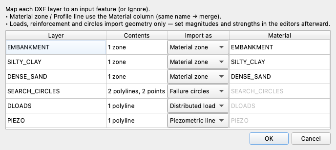
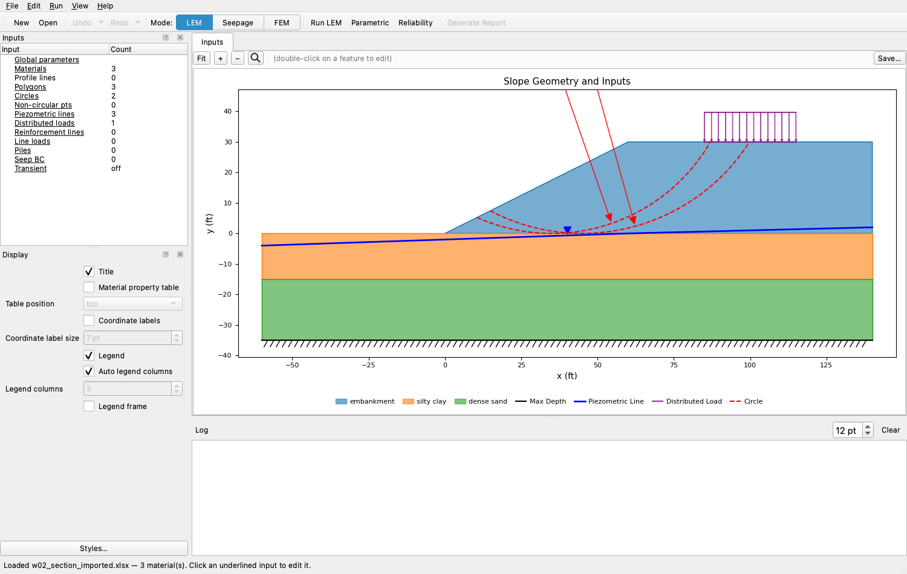
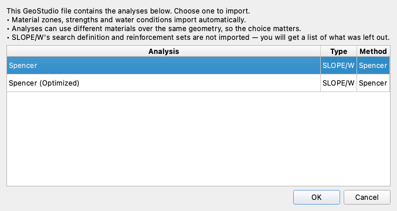
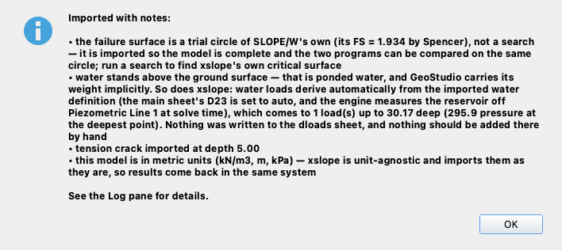
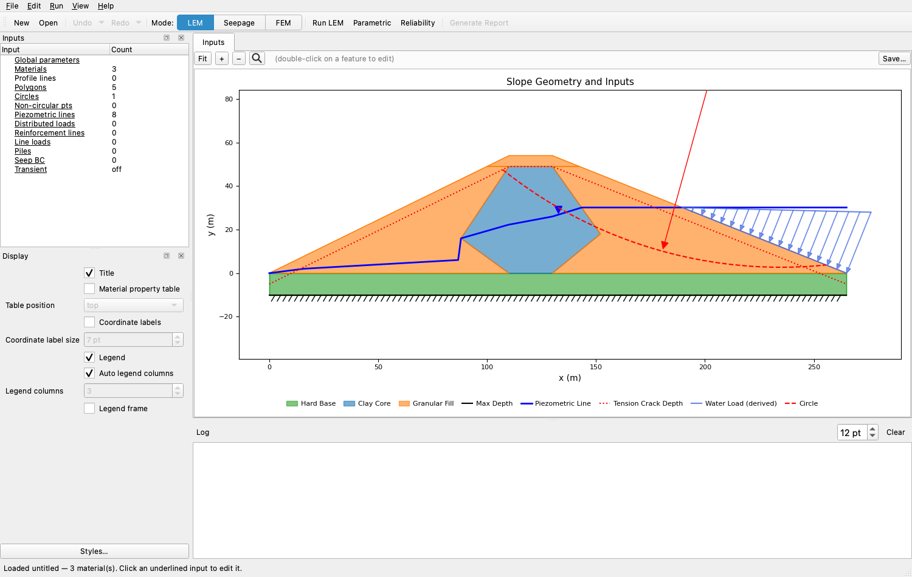
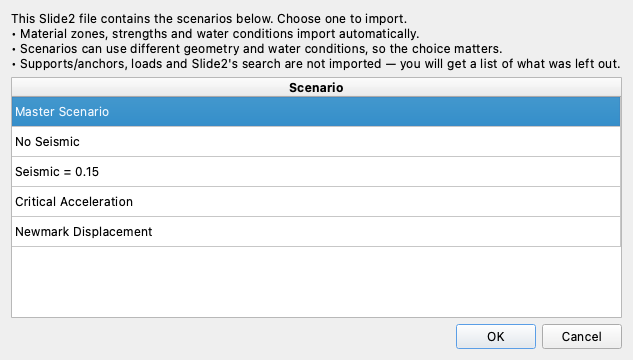
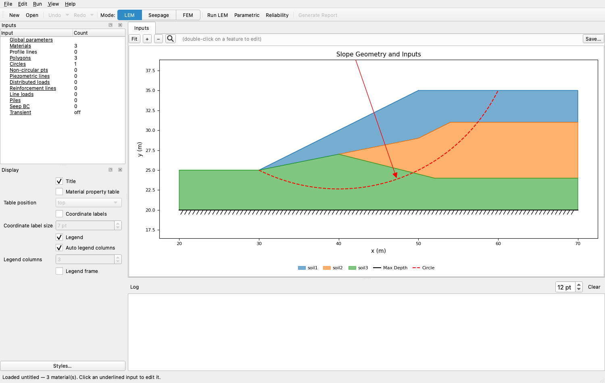

# Tutorial W-2 — Importing Models from CAD and Other Programs

A section that already exists somewhere else does not have to be redrawn. Studio's
File menu carries four importers, and this tutorial walks the three that bring in
a limit-equilibrium model: a **DXF** drawing from any CAD program, a **GeoStudio
SLOPE/W** project (`.gsz`), and a **Rocscience Slide2** model (`.sli`, `.slim` or
`.slmd`) — the fourth, **Import RS2 (.fez)…**, reads a finite element model — not
covered here, but the process is the same. A DXF is just lines, so Studio asks what each layer means. A
GeoStudio or Slide2 file already defines its regions, materials and water, so
the only question is which analysis or scenario to import. All three end with a
new unsaved project on the canvas and a list of what did not come across.

Analysis
Limit equilibrium

Open &amp; run
~25 min

**Objectives** — Map a CAD drawing's layers to input features, import a
GeoStudio and a Slide2 model, and read the notes each import reports against what
the source model defines.

DXF importlayer mappingmaterial zonespiezometric linedistributed loadfailure circlesGeoStudio importanalysis pickerimported trial circleSlide2 importscenario pickerimport notesSpencercircular search

**Part 1 drawing** — [w02_section.dxf](files/w02_section.dxf)

**Part 1 completed model** — [w02_section_imported.xlsx](files/w02_section_imported.xlsx),
the same drawing after the import, with the properties typed in

**Parts 2 and 3** run on the vendors' own published models — each part says where
to download the file.

Everything below happens in Studio. DXF and GeoStudio also have a script route,
written up under [DXF Import/Export](../usage/dxf.md) and
[GeoStudio Import/Export](../usage/geostudio.md).

---

## Part 1 — A CAD drawing

A slope usually exists as a CAD drawing long before it exists as an analysis
model: the project's plans and cross sections are drawn in AutoCAD, Civil 3D,
MicroStation or a similar program, and every one of them exports DXF, the
common exchange format for CAD line work. Importing that drawing is faster than
re-entering the geometry point by point, so we start there.

[w02_section.dxf](files/w02_section.dxf) holds a highway embankment in feet: 30 ft
of fill on a 2:1 face over 15 ft of silty clay on dense sand, a water table a few
feet down, and a 600 psf crest surcharge. A DXF file says where the lines are and
which layer each sits on, and nothing about unit weights, strengths or load
pressures.

Six layers carry the section:

| Layer | What it holds |
| --- | --- |
| `EMBANKMENT` | the fill zone, a closed outline |
| `SILTY_CLAY` | the upper foundation zone |
| `DENSE_SAND` | the lower foundation zone |
| `SEARCH_CIRCLES` | two starting circles, each an arc plus a center point |
| `DLOADS` | the strip the surcharge acts over |
| `PIEZO` | the water table, an open polyline |

Those are XSLOPE's own reserved names, which the wizard recognizes; a drawing
from outside CAD gets the same table, and every row can be overridden.

With the drawing downloaded, we start the import from the File menu. Click
**File → Import DXF…** and choose `w02_section.dxf`.

{width=688}

**Layer** and **Contents** come from the file; **Import as** carries the choice,
and **Material** applies to the two targets that use it:

| Import as | What the layer becomes |
| --- | --- |
| Ignore | nothing — the layer is skipped |
| Material zone | one closed material region per ring |
| Profile line | the top of a material layer |
| Piezometric line | the piezometric surface (a second one becomes Piezo Line 2) |
| Distributed load | a load block, at zero pressure |
| Reinforcement | a reinforcement line, at zero capacity |
| Failure circles | starting circles for the search |

Two layers sharing a material name merge. Every row here is already right, so the
only edit is cosmetic: the **Material** column defaults to the layer name, and
these are uppercase because that is how `export_dxf` writes them. Type
`embankment`, `silty clay` and `dense sand` into the three material rows, then
click **OK**.

{width=1000}

The Inputs tree counts what arrived — 3 materials, 3 polygons, 2 circles, the
piezometric line's 3 points and 1 distributed load — and one note comes back:
*distributed-load magnitudes and reinforcement strengths imported as 0 — set them
in the editors*. There is no reinforcement here, so two things still have to be
typed. We open the materials editor and fill in the three rows. Unit weights are
pcf, cohesions psf and φ′ degrees; the columns none of the three soils use stay
blank:

| name | γ | γsat | option | c | φ | c/p | r-elev | d | psi | t_cut | E | nu | u |
| --- | :---: | :---: | --- | :---: | :---: | :---: | :---: | :---: | :---: | :---: | :---: | :---: | --- |
| `embankment` | 125 |  | `mc` | 250 | 28 |  |  |  |  |  |  |  | `piezo` |
| `silty clay` | 118 |  | `mc` | 700 | 0 |  |  |  |  |  |  |  | `piezo` |
| `dense sand` | 132 |  | `mc` | 0 | 36 |  |  |  |  |  |  |  | `piezo` |

Then we open the distributed loads editor and set the surcharge to 600 psf at both
of its points. That model ships as
[w02_section_imported.xlsx](files/w02_section_imported.xlsx).

With the properties in, the model is complete. Click **Run LEM**, choose
**Spencer** and **Auto search**, leave **Number of slices** at 40, and click
**OK**. The search returns **FS = 1.185** on a circle tangent to the top of the
dense sand — through the foundation clay rather than the fill.

<!-- test: file=files/w02_section_imported.xlsx, type=circular_search, method=spencer, num_slices=40, expected_fs=1.185, tolerance=0.005, benchmark=W-2-dxf -->

### Check its work

- **The geometry closed** — three zones, no gap and no overlap. A ring that
  failed to close arrives as a missing zone.
- **The water table sits below the ground surface everywhere** — −4 ft at the left
  edge, +2 ft under the crest, against ground at 0 and 30.
- **The surcharge reads 600 psf, not 0.** A load left at zero changes nothing and
  looks like it worked.

---

## Part 2 — A GeoStudio SLOPE/W model

A `.gsz` needs no mapping wizard: its regions already know which material they
are, and a file saved after solving carries SLOPE/W's own answer on every trial
surface. Only one question is left — which analysis to import, since a GeoStudio
file routinely holds several over one geometry.

**Where to get the file.** Part 2 runs on problem §2.25 of Seequent's
[GeoStudio slope stability verification manual](https://files.seequent.com/GeoStudio/Manuals/Slope%20Stability%20Verification%20Manual.pdf),
Baker and Leshchinsky's clay-core earth dam — a diamond core in a granular fill on
a hard base, with a reservoir part way up one face. Seequent publishes the manual
and the models behind it, and the file downloads as
[Baker and Leschinsky - Earth Dam.gsz](https://files.seequent.com/GeoStudio/SlopeW/Baker%20and%20Leschinsky%20-%20Earth%20Dam.gsz)
from Seequent's own file server. It belongs to Seequent, not to us, and is not
redistributed here.

The import runs from the same menu. Click
**File → Import GeoStudio (SLOPE/W)…** and choose the `.gsz`.

{width=677}

Take the first, **Spencer**, and click **OK**. (A file holding one analysis skips
this step.)

{width=708}

Four notes come back. The failure surface came from one of SLOPE/W's own trial
circles rather than a search, and the note gives
SLOPE/W's factor of safety on it, 1.934 by Spencer. Water stands above the ground
surface, so XSLOPE derives the reservoir from the piezometric line — adding a load
block by hand would count it twice. The tension crack imported at depth 5.00, the
cracked crest layer. And the model is metric, so answers come back in kN/m³, m and
kPa.

{width=1000}

We want the two programs on the same surface, so this run goes on the imported
circle. Click **Run LEM**, choose **Spencer**, set **Analysis** to **Single
surface**, and click **OK**. XSLOPE returns **FS = 1.939** against SLOPE/W's 1.934
— a difference of 0.3% on identical geometry, materials and water, and the value
[§2.25 of the GeoStudio verification page](../verification/geostudio.md#gs-2-25)
already publishes from a hand-built input file.

### Check its work

- **The materials match the manual's table.** Clay core c′ = 20 kPa, φ′ = 20°,
  γ = 20 kN/m³; granular fill c′ = 0, φ′ = 40°, γ = 21.5; hard base c′ = 200,
  φ′ = 45°, γ = 24.
- **The reservoir is carried once** — the loads sheet is empty, water loads
  automatic.
- **The imported circle is SLOPE/W's, not a search result.** A free search finds a
  lower minimum of its own.

### What does not come across

Material zones, strengths, water conditions, surcharge and line loads,
reinforcement and a surface-defined tension crack all import. SLOPE/W's search
definition does not, so a file saved without a solved surface arrives with no
failure surface at all; nor do reinforcement sets, an inclined tension crack, or a
vertical seismic coefficient. Strength and pore-pressure options XSLOPE does not
carry come in as whatever fits, named in the notes — and where that would make the
answer wrong, as with SLOPE/W's `Ru` pore pressures, the note says so. A
probabilistic analysis brings its standard deviations but not the correlations or
truncated ranges applied to them.

---

## Part 3 — A Slide2 model

A Slide2 model behaves like a `.gsz`: it already knows what its geometry means, so
it prompts only for the scenario to take. A `.slmd` bundles several — a base case
plus variants — the way a GeoStudio file bundles analyses.

**Where to get the file.** Rocscience publishes its
[Slide2 verification manuals](https://www.rocscience.com/help/slide2/verification-theory/verification-manuals)
as PDFs, but not the 111 verification models behind them; the download links on
that page cover two hand-calculation examples only. Problem 104 can still be
followed all the way, because the manual builds it on Slide2's own *Tutorial 28 —
Seismic Analysis with the Newmark Method*, and the tutorial models are a public
download: [the Slide2 tutorials page](https://www.rocscience.com/help/slide2/tutorials)
links the older tutorial set as a zip, and `Tutorial 28 Seismic.slmd` sits in its
Model Files folder. That file belongs to Rocscience, not to us, and is not
redistributed here. It models a 10 m slope at 2:1 in three dry layers over a
horizontal base.

With the zip unpacked, we start the import. Click **File → Import Slide2…** and
choose `Tutorial 28 Seismic.slmd`.

{width=633}

The picker opens on **Master Scenario**, so select **No Seismic** and click
**OK**. Three notes come back: the model is metric, Slide2 was set to run
Spencer — so we solve with Spencer too and the comparison stays like-for-like —
and

> no failure surface was imported — this scenario defines a SEARCH (grid, block,
> path or metaheuristic), which has no xslope equivalent, and no specified circle
> or surface to take one from. Define circles or a non-circular surface before
> solving (an input file with no surface will not re-load).

A search definition does not translate, so a starting circle has to be added. We
open the circles editor and add a row: **Xo** = 40, **Yo** = 45, **Option** =
`Intercept`, **Xi** = 30, **Yi** = 25 — the center two slope heights above the
toe, on a circle through it, the placement
[LEM-3](lem03_layered_slope.md) explains.

{width=1000}

The model now has everything a search needs. Click **Run LEM**, choose
**Spencer** and **Auto search**, leave **Number of slices** at 40, and click
**OK**.
The search returns **FS = 1.372** against Slide2's published 1.360, a difference
of 0.9% that
[problem 104 of the Slide2 verification page](../verification/rocscience.md#vp104)
explains: Slide2's Surface Altering optimization refines the surface away from a
circle and reaches lower than a circular search can.

### Check its work

- **Three materials, three zones**, in the manual's order, all at the same unit
  weight.
- **The model is dry** — pore pressure reads `none` on every material, which is
  what the source defines.
- **The starting circle is yours, not Slide2's.** A run without one has no surface
  to solve.

---

## Conclusion

This tutorial covered:

- A DXF drawing imported layer by layer, then given the properties no CAD file
  holds: Spencer 1.185.
- A GeoStudio model imported whole, its solved circle putting both programs on one
  surface: 1.939 against 1.934.
- A Slide2 scenario arriving with no failure surface, because Slide2 stores a
  search: 1.372 against 1.360 once a circle is added.
- The notes every import reports, which name what the import could not carry and
  what to set before solving.

**Where to go next:** [DXF Import/Export](../usage/dxf.md) and
[GeoStudio Import/Export](../usage/geostudio.md) carry the full mapping tables and
the script route; the [GeoStudio](../verification/geostudio.md) and
[Slide2](../verification/rocscience.md) verification pages hold the corpora these
two models come from.
