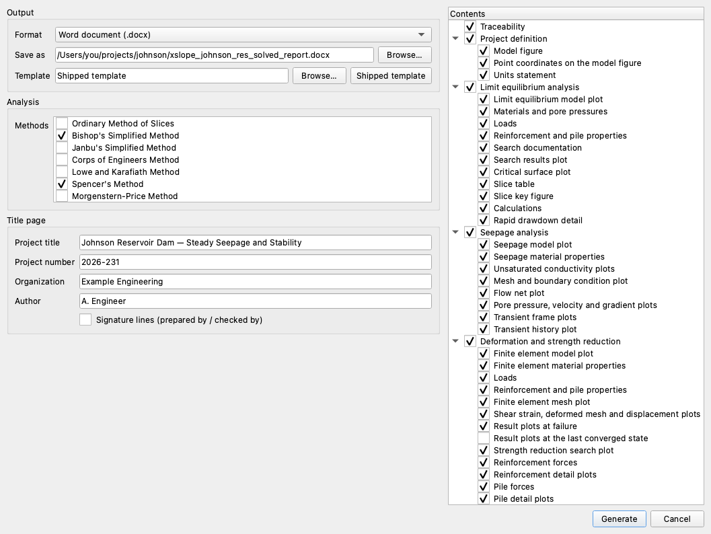
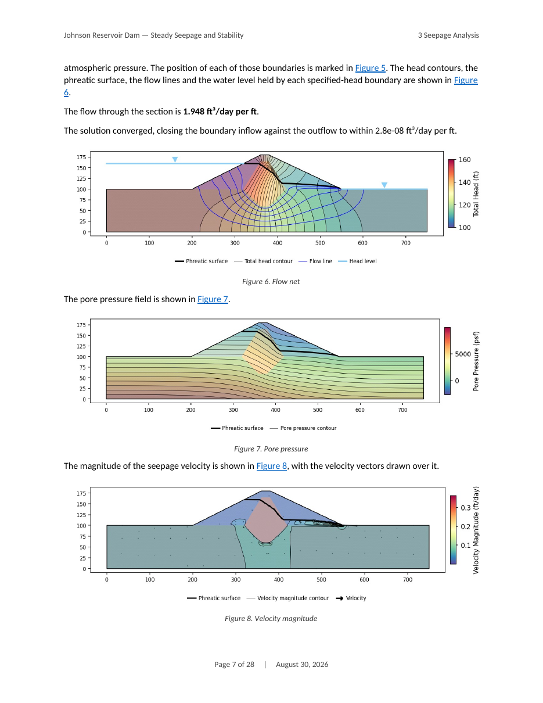
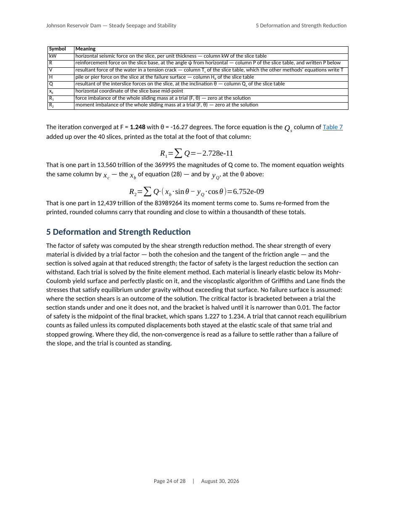
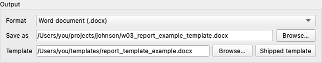
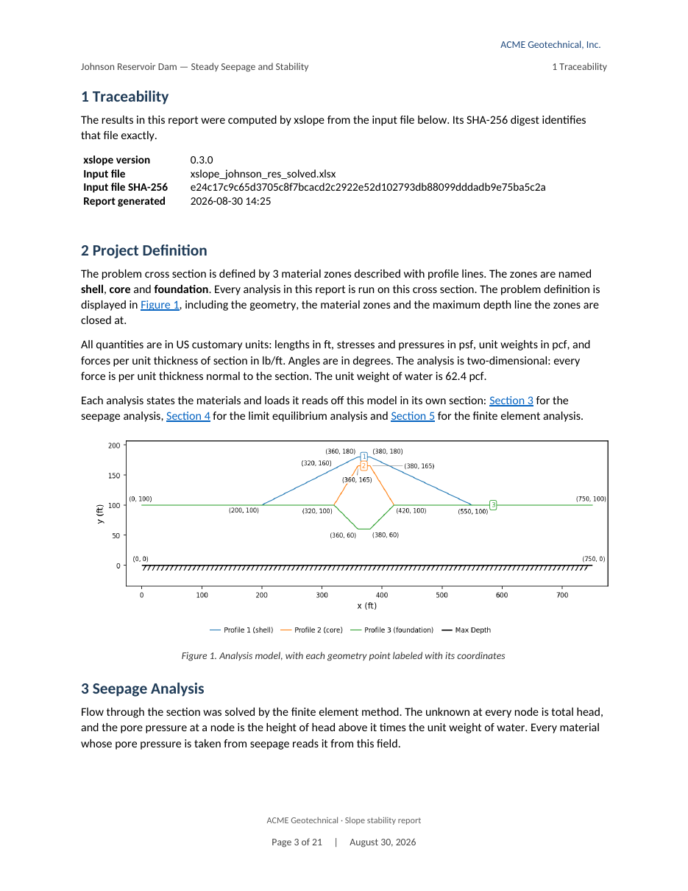

# Tutorial W-3 — Generating the Analysis Report

An analysis that stays on the canvas is not yet a deliverable. **File → Generate
Report…** writes one: a Word document with a title page, a table of contents,
running heads and footers, numbered figures and tables, and a section for every
engine that was run — down to the equation each stability method evaluated and
the converged numbers in it. Nothing in it is a screenshot. The plots are drawn
at 300 dpi by the same code the canvas draws with, and every table comes from the
same DataFrame the solver produced.

We generate two reports on one model. The first documents Bishop and Spencer on
the page layout XSLOPE ships. The second goes out on a firm's letterhead, built
on a Word template we prepare first.

Analysis
Seepage + limit equilibrium + finite element

Open &amp; run
~20 min

**Objectives** — Generate a report from a solved model, read what each of its
sections states, and put the same report on a company template.

generate reportattached solutionsmethod selectiontitle pagecontents treeflow netcalculationsslice tablecompany templateWord stylesletterhead

**Model** — [xslope_johnson_res_solved.xlsx](files/xslope_johnson_res_solved.xlsx),
COMBO-1's dam with its seepage and finite element solutions saved beside it

**Reports** — [w03_report.docx](files/w03_report.docx) and
[w03_report_example_template.docx](files/w03_report_example_template.docx)

**Template** — [report_template_example.docx](files/report_template_example.docx)

Everything below happens in Studio. The same document can be written from a
script, which [Analysis Report](../studio/reports.md#from-python) covers.

---

## The model

[xslope_johnson_res_solved.xlsx](files/xslope_johnson_res_solved.xlsx) holds the
Johnson Reservoir dam of [COMBO-1](combo01_seepage_stability.md) — an 80 ft
zoned embankment with a shell, a keyed clay core and a foundation, under 60 ft of
water. Eight companion files sit beside it: `..._mesh.json` carries the mesh all
three analyses share, `..._seep.csv` the steady head and pore pressure at every
node, and six `..._fem_*` files the strength reduction solution and the mechanism
it failed on. Download the workbook and its companions into one folder, then open
the workbook with **File → Open…**.

Studio reads those companions on open, so the seepage and finite element
solutions are attached before anything is run. A report **documents** an attached
solution; it never solves one again. That distinction is why this file
ships solved: the strength reduction behind it took a quarter of an hour of
bisection, and a report that repeated it to describe it would be spending that
time twice.

One analysis is still missing. No companion file carries a limit equilibrium
solution, so the stability run is ours to make. Switch the mode strip to **LEM**
(`Ctrl+1`) and click **Run → Run LEM…**. Leave **Method** on **Spencer**,
**Analysis** on **Auto search** and **Number of slices** at 40, and click
**Run**. The search returns **FS = 1.248**, COMBO-1's own answer on this model.

---

## Generating the report

With three engines' results in the session, the report has something to document.
Click **File → Generate Report…**.

{width=1000}

Four groups sit on the left, and a contents tree on the right. Every field opens
on a default that works, and this report changes two of the groups: the methods,
and the title page.

**Output.** **Format** offers Word (`.docx`); PDF is listed and dimmed. **Save
as** defaults to `<model>_report.docx` beside the model. **Template** reads
*Shipped template*, which gives the layout we want here; the company template
below changes it. Leave all three.

**Analysis.** **Methods** lists every method XSLOPE offers, ticked on the one the
results view is showing. Spencer is already ticked because we just ran it. Tick
**Bishop's Simplified Method** as well. A method that has not been run is run by
the report, exactly as ticking it in the Run dialog would have run it — its own
search for its own critical surface — so Bishop costs a search here, and the two
methods settle on two different surfaces.

**Title page.** These four fields become Word document properties, so the title
page, the running head and any company template all read the same values. Fill in
**Project title** `Johnson Reservoir Dam — Steady Seepage and Stability`,
**Project number** `2026-231`, **Organization** `Example Engineering` and
**Author** with your own name. Leave **Signature lines (prepared by / checked
by)** unticked; a submittal that needs ruled *prepared by* and *checked by* lines
gets them from that box.

**Contents.** One checkbox per section, opening on that section's own default. A
parent turned off dims its whole branch. Leave the tree alone; its defaults
document every analysis this model carries.

The dialog is composed. Click **Generate**.

The progress bar counts the figures by name, and the window stays live —
generating runs off the GUI thread, and **Cancel** stops the build at the next
figure. A labelled stretch at the end builds the page numbers on the contents
page: Word does it where the machine has Word, LibreOffice where it does not, and
where neither is available the report is complete but its contents page lists the
headings without page numbers.

---

## What the document carries

The report runs to 28 pages and 24 figures:
[w03_report.docx](files/w03_report.docx). Its sections follow the analyses, with
seepage placed ahead of the two stability sections that consume its answer.

| Analysis | Where the answer came from | Result |
| --- | --- | :---: |
| Seepage | attached to the file | 1.925 ft³/day per ft |
| Spencer's method | the search we ran | 1.248 |
| Bishop's Simplified Method | searched by the report | 1.222 |
| Strength reduction | attached to the file | 1.2305 |

<!-- test: file=files/xslope_johnson_res_solved.xlsx, type=circular_search, method=bishop, num_slices=40, expected_fs=1.222, tolerance=0.005 -->

The seepage section states the conductivities and the mesh it was solved on, then
the four fields the solution carries — the flow net, pore pressure, velocity
magnitude with the velocity vectors over it, and hydraulic gradient magnitude.

{width=620}

Each stability method then gets a block of its own: its search, its critical
surface with the slices and base stresses drawn on it, a slice table on a
landscape page with column totals and a legend, and the calculations. The
calculations print the published equation for that method, in the symbols of its
own documentation page, followed by the converged numbers in it.

{width=620}

Spencer's method solves for a pair — a factor of safety and an interslice
inclination θ — at which both the force sum and the moment sum vanish, so the
section prints both sums at the converged pair rather than a single quotient.
Here they close at F = 1.248 and θ = −16.27°, with residuals of −2.7e−11 and
6.8e−9 against sums whose terms come to 369,995 and 83,989,264. Every number is
printed at a precision the factor of safety can be rebuilt from.

---

## A company template

A report goes out on the firm's letterhead by being built on the firm's own Word
template. Start from the one XSLOPE ships —
[report_template.docx](../studio/files/report_template.docx) — and edit it in
Word. Its page size and margins, its header and footer, and the fonts and colors
of its styles are all yours to change. Three edits make a letterhead:

- **A logo in the header.** Insert the picture and size it to the header frame.
- **The firm's name**, beside the logo.
- **A footer line** naming the firm and the document type.

Two rules decide whether a report can be built on the result. **Keep the style
names** — the report is written in *Title*, *Heading 1*, *Heading 2*, *Heading
3*, *Body Text* and *Caption*, and it asks the template for them by name.
Restyle them as far as you like; renaming one is refused when Generate is
pressed, with the missing style named. And **leave the metadata to the fields** —
the title, project number, organization and author arrive as Word document
properties, so a `DOCPROPERTY` field in the template picks up whatever the dialog
was given.

One more thing decides where a letterhead lands on the page. The report writes
its running head into the first paragraph of the header and *page N of M* into
the first paragraph of the footer, replacing whatever a template put there.
Anything the template needs to keep goes outside those paragraphs — a one-row
table above each does it — and prints on every page.

We ship that template for a firm invented for this page —
[report_template_example.docx](files/report_template_example.docx), the shipped
file with a logo and the firm's name in a header table and a footer line above
the page numbers, and nothing else changed. Download it, then open the dialog
again with **File → Generate Report…**.

{width=646}

Under **Output**, click **Browse…** on the **Template** row and choose
`report_template_example.docx`; the field replaces *Shipped template* with the
path. Change **Save as** to `w03_report_example_template.docx`, so the first
report is not overwritten. Under **Analysis**, untick **Bishop's Simplified
Method**, which leaves Spencer's finished search as the only stability run.
Under **Title page**, set **Organization** to `ACME Geotechnical`. Click
**Generate**.

{width=620}

The letterhead prints on every page, and the report's own running head sits under
it. **Template** is remembered between sessions, so the next report on any model
opens on the same letterhead. The 22-page result downloads as
[w03_report_example_template.docx](files/w03_report_example_template.docx).

### Check its work

- **The traceability stamp names the file the numbers came from**, with its
  SHA-256 digest. A digest that does not match the workbook on disk means the
  report documents a different file.
- **The seepage and strength reduction sections state COMBO-1's numbers** —
  1.925 ft³/day per ft and 1.2305 — because they were read from the attached
  solutions, not solved again.
- **Bishop's calculations divide out.** The two sums it prints, 475,756 and
  389,345, give the 1.222 printed beside them — the precision every number in
  that section is printed at.
- **The contents page carries page numbers.** A list of headings without them
  means the finishing step did not run, and Word rebuilds them with F9.

---

## Conclusion

This tutorial covered:

- A report generated from a model whose seepage and finite element solutions were
  attached rather than re-solved, documenting four results from one run of one
  method.
- The Generate Report dialog's four groups and its contents tree, and what
  ticking an unrun method costs: Bishop searched for its own surface and reported
  1.222 against Spencer's 1.248.
- What the document states — the flow net and the fields beside it, and each
  method's equation with its converged numbers in it, at a precision the factor
  of safety can be rebuilt from.
- A company template made from the shipped one: keep the style names, leave the
  metadata to the document properties, and put the letterhead outside the
  paragraphs the report writes into.

**Where to go next:** [Analysis Report](../studio/reports.md) documents every
section, every content option and the script route;
[COMBO-1](combo01_seepage_stability.md) builds and runs the three analyses this
page reports on.
