# XSLOPE Input Template

## Overview

The XSLOPE input template is the primary means of defining slope stability problems in xslope. It is an Excel workbook that contains all necessary information about the slope geometry, material properties, loading conditions, boundary conditions, and analysis parameters. The template is designed to support three main types of analysis:

- **Limit Equilibrium Method (LEM)**: Classical slope stability analysis using methods like Bishop, Spencer, Janbu, and others
- **Seepage Analysis**: Finite element groundwater flow analysis for steady-state and transient conditions
- **Finite Element Method (FEM)**: Stress-deformation analysis including the Shear Strength Reduction Method (SSRM)

The template uses a structured format with multiple worksheets (tabs), each dedicated to a specific aspect of the problem definition. This organization makes it easy to prepare complex slope stability analyses while maintaining clarity and avoiding errors.

## Download

A template for the Excel file can be downloaded here:

[input_template.xlsx](../inputs/input_template.xlsx)

The input file can be modified using any spreadsheet software such as Microsoft Excel, LibreOffice Calc, or Google Sheets.

## Loading the Template

The template is loaded into xslope using the `load_slope_data()` function from the `fileio` module:

```python
from xslope.fileio import load_slope_data

# Load the input template
slope_data = load_slope_data("path/to/your/input_template.xlsx")
```

This function reads all worksheets, validates the data, and returns a dictionary containing all parsed information. The resulting `slope_data` dictionary is then used by various xslope modules for analysis.

Loading checks that the file is well formed, not that it is complete — a
half-built model must always open. Whether a model carries everything the analysis
you are about to run actually needs is checked separately, when the run starts; see
[Preflight Input Checks](preflight.md).

## Template Structure

The template consists of 13 worksheets, each serving a specific purpose. Different worksheets are used by different analysis types: Limit Equilibrium Method (LEM), seepage analysis (SEEP), and Finite Element Method (FEM).

| Sheet Name | Description | LEM | SEEP | FEM |
|------------|-------------|:---:|:----:|:---:|
| **main** | Global parameters and instructions | X   | X    | X   |
| **mat** | Material properties including strength, permeability, and stiffness | X   | X    | X   |
| **profile** | XY coordinates of profile lines defining slope geometry | X   | X    | X   |
| **polygon** | Material zones defined as closed polygons (alternative to **profile**) | X   | X    | X   |
| **piezo** | Piezometric lines for pore pressure calculations | X   |      | X   |
| **circles** | Circular failure surface definitions | X   |      |     |
| **non-circ** | Non-circular failure surface coordinates | X   |      |     |
| **dloads** | Distributed surface loads | X   |      | X   |
| **reinforce** | Soil reinforcement elements (anchors, nails, geosynthetics) | X   |      | X   |
| **piles** | Pile and concrete pier support elements | X   |      | X   |
| **lloads** | Line loads (concentrated forces on the ground surface) | X   |      |     |
| **seep bc** | Seepage analysis boundary conditions |     | X    |     |
| **tseep** | Transient seepage time series and run controls |     | X    |     |

The following sections describe each worksheet in detail, including the data structure and how it is used in analysis.

To check your geometry visually before running an analysis, open the file in [XSLOPE Studio](../studio/index.md) or
call `plot_inputs()` from Python — both draw the profile lines, material zones, piezometric lines, loads,
reinforcement, and boundary conditions to scale.

---

## Worksheet: main

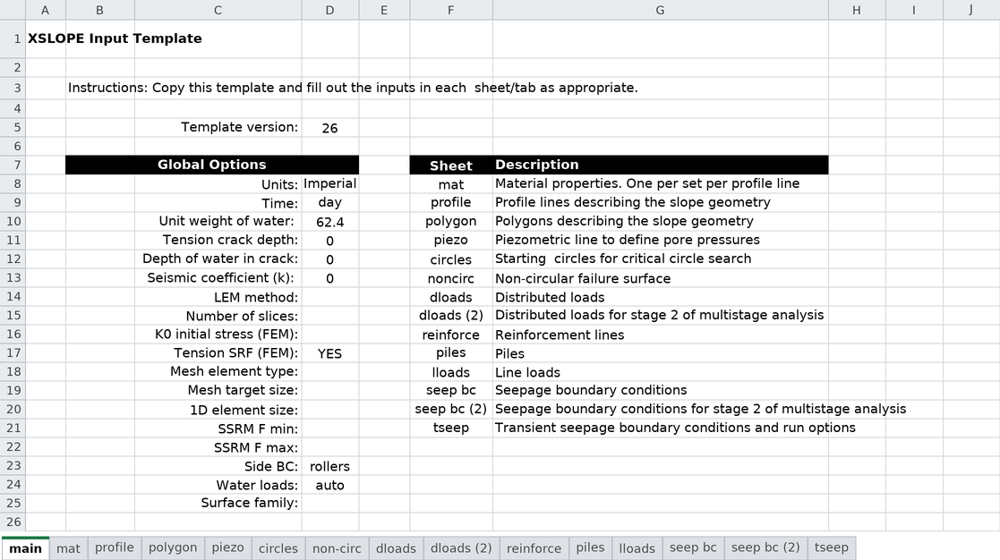

The **main** worksheet provides global parameters that apply to all analyses and serves as the instruction page for the template. This tab contains:

- **Template version**: Tracks template format for compatibility. The current version is **21**; xslope refuses files whose version it does not recognize, so older installs cannot silently mis-read newer templates. Version 16 added the mat sheet's `t_cut` column and `elastic` strength option; version 17 added the `phi_b`/`s_cap` matric-suction columns; version 18 added the **Units** and **Time** selectors on this sheet, the [transient-seepage **tseep** sheet](#worksheet-tseep), and the mat sheet's `Ss`/`Sy` storage columns (see [Worksheet: mat](#worksheet-mat)); version 19 added the eight **run options** below and the optional [search window](#worksheet-circles) on the circles sheet; version 20 added the [SSR zone](#ssr-zones) rows on the polygon sheet; version 21 added the polygon sheet's **Type** and **Size** rows, the profile sheet's **Size** row, the **Direction** option on both dloads sheets, and the **Side BC** selector below. Older files load unchanged: pre-v18 files have no Units/Time selectors, so the unit system is inferred from the unit weight of water and no time unit is assigned, and `t_cut`, `phi_b` and `s_cap` remain blank on every material. A version-20 file's negative [SSR zone](#ssr-zones) Material IDs keep loading exactly as they always did.
- **Units** (`SI` or `Imperial`): declares the unit system for the model. Selecting a system fixes the unit weight of water to its standard value (**9.81 kN/m³** for SI, **62.4 pcf** for Imperial) and records the system with the model. XSLOPE is unit-agnostic and never converts your numbers — the declaration simply keeps the model's units explicit and self-consistent (SI = m, kPa, kN/m³; Imperial = ft, psf, pcf). If you leave this blank, xslope **infers** the system from the unit weight of water you enter (≈9.81 → SI, ≈62.4 → Imperial), so existing files behave exactly as before.
- **Time** (`sec`, `min`, `hr`, or `day`): declares the time unit for every time-bearing quantity — hydraulic conductivity (length/time), specified flux, and the transient-seepage series and durations on the **tseep** sheet. Because xslope never converts, this one declared time unit governs them all together. Unlike the unit system, the time unit is **never inferred or guessed** (a wrong time label is worse than none), so it applies only when you set it here. Leave it blank for a static model with no time-bearing inputs; the **tseep** sheet requires it to be set.
- **Unit weight of water** (γw) — **[F/L³]**: used in pore pressure calculations. When you select a unit system, this cell is auto-filled with the canonical value, but you may **override** it — a value you type wins (e.g. ≈10.05 kN/m³ or 64 pcf for seawater), and xslope warns at load time if your value differs from the canonical one by more than about 2%. With the Units selector blank, the value you enter here is what determines the inferred system.
- **Tension crack parameters**: Depth **[L]** and water-surface elevation **[L]** within tension cracks at the top of the failure surface
- **Seismic coefficient** (kh) — **[–]**: Horizontal seismic acceleration coefficient (dimensionless) for pseudo-static earthquake analysis

### Run options

The eight cells below the seismic coefficient record **how this model is meant to be
analyzed**, so the analysis travels with the file instead of living only in a dialog.
Every one of them is optional, and **blank always means unspecified** — the solver or
the Studio dialog uses its own default, exactly as it did before these cells existed.
A choice you make in a Studio dialog always wins over the value in the file.

- **LEM method** (`oms`, `janbu`, `bishop`, `corps`, `lowe`, `spencer`, `mprice`, or `all`) — **[–]**: the limit-equilibrium method this model is built for. `all` means "run every method" and is used by the batch drivers; the Studio run dialog, which solves one method at a time, leaves its own default in place for it. An unrecognized value is an error at load time, never a silent fallback to some other method.
- **Number of slices** — **[–]**: the slice count for limit-equilibrium runs. Minimum 2; blank uses the solver default.
- **K0 initial stress (FEM)** — **[–]**: at-rest lateral earth pressure coefficient for the FEM's **initial stress state**. Blank starts from zero stress and switches gravity on in one step, so the initial lateral stress is whatever elasticity produces — σ<sub>h</sub> = ν/(1−ν)·σ<sub>v</sub>, about 0.43·σ<sub>v</sub> at ν = 0.3, a number set by the stiffness rather than by the soil. Enter a value and the initial stress is built from the overburden instead, σ<sub>h</sub> = K0·σ<sub>v</sub> both in-plane and out-of-plane, and then iterated to equilibrium — in an SSRM run as a separate full-strength step, so that establishing the in-situ state is not charged to the strength reduction. Normally consolidated sand sits near Jaky's 1 − sin φ′; compacted fills and overconsolidated clays run at 1.0 and above. Set **1.0** to reproduce an RS2 result, whose models are authored with an isotropic K = 1 field stress. The effect is small on a cohesive slope and worth several percent on a reinforced or near-cohesionless one, always in the direction of a higher factor of safety. A value here must be positive; leave the cell blank for the gravity turn-on. See [K0 initial stress](../fem/overview.md#k0-initial-stress) for the formulation, how to choose a value, and the measured sensitivity.
- **Tension SRF (FEM)** (`YES` or `NO`) — **[–]**: whether the tensile-strength cap (`t_cut`) is reduced along with c and tan φ during a strength reduction. `YES` (what the template ships with) makes the factor of safety the factor on the whole strength envelope, shear and tensile. `NO` holds each cap at its authored value through the bisection. On a model that sets no `t_cut` there is no cap to reduce and the setting changes nothing.
- **Mesh element type** (`tri3`, `tri6`, `quad4`, `quad8`, or `quad9`) — **[–]**: the element type the Build Mesh dialog opens on. Quadratic elements (`tri6`, `quad8`, `quad9`) are strongly preferred for FEM/SSRM; the linear ones lock volumetrically and overestimate the factor of safety.
- **Mesh target size** — **[L]**: the target element size the Build Mesh dialog opens on. Setting it also turns auto-sizing off, since a size in the file means the file meant that size.
- **SSRM F min** / **SSRM F max** — **[–]**: the strength-reduction bracket the SSRM search starts from. F min must be less than F max.
- **Side BC** (`rollers` or `fixed`) — **[–]**: how the FEM restrains the left and right truncation boundaries of the model. `rollers` (the default, and what every file that leaves this blank gets) fixes horizontal movement and leaves the face free to settle vertically. `fixed` clamps both directions. Rollers are the usual choice: a truncation boundary is an artificial cut through ground that continues, and the ground on the other side of it does not hold the face up. `fixed` adds shear restraint that ground does not have, and stiffens a domain truncated close to the slope; use it to reproduce a program that fixes its side boundaries. The bottom boundary is fully fixed either way.

**Dimensional notation.** The field descriptions on this page tag each quantity with its dimensions in
brackets, built from three base dimensions — **[L]** length, **[F]** force, **[t]** time — plus the derived
forms the page uses: stress **[F/L²]**, unit weight **[F/L³]**, strength gradient **[F/L²/L]** (stress per
unit change in depth — dimensionally the same as [F/L³], written this way because it means something
different), hydraulic conductivity and flux **[L/t]**, specific storage **[1/L]**, moment **[F·L]**,
angle **[deg]**, and dimensionless **[–]**. XSLOPE never
converts, so a bracket means the same in either system; under a declaration it resolves to concrete units —
SI with **Time = day** gives [L] = m, [F/L²] = kPa, [F/L³] = kN/m³, [L/t] = m/day, while Imperial gives ft,
psf, pcf, ft/day.

These global parameters are accessed throughout the analysis. For example, the unit weight of water is used in 
computing pore pressures from piezometric lines, and the seismic coefficient is used to add horizontal inertial 
forces to each slice in limit equilibrium calculations. The tension crack parameters allow the simulation of a tension
crack at the top of the slope for cohesive soils to reduce the likelihood that negative normal forces develop along the 
face, which are unconservative in the limit equilibrium method. Filling the crack with water adds an extra level of 
conservatism as this applies a driving force to the failure surface.

The run options are read the same way everywhere: the Studio dialogs open on them, and a
library caller gets them on the loaded `slope_data` (`lem_method`, `num_slices`, `k0`,
`tension_srf`, `element_type`, `target_size`, `ssrm_f_min`, `ssrm_f_max`, `side_bc`) as
`None` wherever the file leaves a cell blank.

The declared **Units** and **Time** selectors are carried through to the display layer as well: they set the unit labels shown on generated plots and a
units-provenance line (for example `# units: SI, time: day`) written at the top of exported seepage and FEM result
files. When nothing is declared, those labels and the provenance line are simply omitted, so a legacy file's plots
and exports are unchanged.

---

## Worksheet: mat

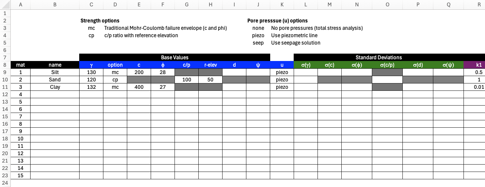

The **mat** worksheet defines material properties for the soil layer defined by the profile lines (see next section). Each profile line from the **profile** worksheet is assigned a material id referencing one of the materials in the materials table. It is possible for multiple profile lines to reference a single material. The template is formatted for 15 materials. However, you extend the table by adding additional rows as needed. The table includes comprehensive property definitions for strength, permeability, and stiffness.

The sheet is wide, so it is shown here in three views, each re-showing the **mat** and **name** identity columns on the left and matching one of the sheet's own column-group headers: **Shear Strength/Stiffness** (the strength-model parameters, the tensile cutoff, the FEM properties E and ν, the pore-pressure option, and the matric-suction pair phi_b/s_cap, shown above), **Standard Deviations** (variability for reliability analysis, further below), and **Seepage** (permeability, the unsaturated-flow model, and the transient-storage pair Ss/Sy, further below still). Cells that do not apply to a material's selected strength or pore-pressure option are automatically greyed out, and a color legend on the sheet marks each column **LEM only**, **LEM & FEM**, or **FEM only**.

**Strength Properties** (for LEM and FEM analysis):

- **$\gamma$** — **[F/L³]**: Unit weight of the soil. This is the *total* unit weight — moist above the water table. It is used to calculate the weight of the soil in each slice.
- **$\gamma_{sat}$** — **[F/L³]**: Saturated unit weight, used for the portion of each slice below the water table. Leave blank to use $\gamma$ throughout (the pre-v12 behavior). When both are given, $\gamma_{sat} \geq \gamma$ is required.
- **option**: Strength model to use for this layer. `mc` = Mohr-Coulomb; `cp` = undrained strength that increases
  with depth below a reference elevation; `pow` = nonlinear power-curve envelope; `hb` = generalized Hoek-Brown
  (rock); `elastic` = elastic / infinite strength — the material cannot fail (added in template version 16; see
  below).
- **c** (cohesion **[F/L²]**) and **φ** (friction angle **[deg]**): Mohr-Coulomb shear strength parameters (option = `mc`).
- **c** **[F/L²]**, **cp** **[F/L²/L]** (a strength gradient — stress per unit change in depth, e.g. psf/ft), and **r-elev** **[L]** (option = `cp`): undrained strength that increases linearly below a reference
  elevation — see the formula below.
- **d** — **[F/L²]**: cohesion intercept for Kc=1 envelope used in [rapid drawdown analysis](../lem/rapid.md)
- **$\psi$** — **[deg]**: friction angle for Kc=1 envelope used in [rapid drawdown analysis](../lem/rapid.md)
- **t_cut** — **[F/L²]**: tensile-strength cutoff, added in template version 16 — see below.
- **E** — **[F/L²]**: Young's modulus (FEM only).
- **ν** — **[–]**: Poisson's ratio, dimensionless (FEM only).
- **u**: pore pressure option (a selector, not a numeric value)
- **$r_u$** — **[–]**: pore pressure ratio, dimensionless (u = `ru`) — see below.
- **phi_b** ($\phi^b$) — **[deg]**: Fredlund unsaturated (matric-suction) friction angle, added in template version 17 — see
  below.
- **s_cap** — **[F/L²]**: maximum credited suction (stress units), added in template version 17 — see below.
- **pow_a … pow_d** (option = `pow`): power-curve envelope parameters — $pow_c$ and $pow_d$ are **[F/L²]**
  (added to a stress), $pow_b$ is **[–]** (an exponent), and $pow_a$'s units follow from $pow_b$ so that the
  product is a stress — see the formula below.
- **hb_sci** **[F/L²]**, **hb_gsi** **[–]**, **hb_mi** **[–]**, **hb_d** **[–]** (option = `hb`): generalized Hoek-Brown parameters (only $\sigma_{ci}$ carries units; GSI, $m_i$, and $D$ are dimensionless) — see the
  formula below.

For the **mc** strength option — the Mohr-Coulomb envelope, and the option you will use most of the time — the
shear strength is a straight line in terms of the effective normal stress $\sigma'_n$ on the failure surface:

>>$\tau = c + \sigma'_n \tan\phi = c + (\sigma_n - u)\tan\phi   \qquad (1)$

where **c** is the cohesion (the intercept), **φ** is the effective friction angle (the slope of the line), and $u$
is the pore pressure from the selected **u** option. Setting $\phi = 0$ gives a constant undrained strength
$\tau = c = S_u$; setting $c = 0$ gives a purely frictional material. Every other strength option below is
ultimately reduced to this same form — the curved envelopes are linearized into an equivalent local $(c, \phi)$
before they are solved.

For the **cp** strength option, the undrained shear strength at elevation $y$ is:

>>$S_u = c + c_p \cdot \max(0,\; r_{elev} - y)   \qquad (2)$

where **c** is the strength at the reference elevation **r-elev** and **cp** is the *rate* of strength increase per
unit elevation below it (e.g. psf/ft). At or above **r-elev** the strength equals **c**. This behaves like a
$S_u/\sigma'_v$ (c/p) ratio but is referenced to elevation rather than depth, giving more precise control for
slope-stability problems. The rate is normally **positive** — undrained strength increasing with depth, the
familiar c/p behavior. A negative rate is accepted for one special case: a stronger consolidated crust over
softer clay, as in the Borges & Cardoso embankment ([VP30](../verification/rocscience.md#vp30)), where the top
metre of the foundation gained strength under construction loading and the profile decreases into the layer
beneath.

For the **pow** strength option, the shear strength is a curved envelope in terms of the effective normal stress
$\sigma'_n$ on the failure surface:

>>$\tau = pow_a \cdot (\sigma'_n + pow_d)^{pow_b} + pow_c   \qquad (3)$

With $pow_b = 1$ this collapses to Mohr-Coulomb. Curved envelopes are appropriate for rockfill, waste rock,
weathered rock, and heavily overconsolidated clays, where a straight-line fit over a wide stress range
overestimates strength at one end and underestimates it at the other.

For the **hb** strength option, strength follows the generalized Hoek-Brown criterion (Hoek, Carranza-Torres &
Corkum, 2002), written in principal stresses:

>>$\sigma'_1 = \sigma'_3 + \sigma_{ci}\left(m_b \dfrac{\sigma'_3}{\sigma_{ci}} + s\right)^{a}   \qquad (4)$

The four inputs are the ones a geologist actually records; the rock-mass constants $m_b$, $s$ and $a$ are
*derived* from them and are never entered directly:

- **hb_sci** — $\sigma_{ci}$, the uniaxial compressive strength of the **intact** rock, **[F/L²]**.
- **hb_gsi** — GSI, the Geological Strength Index, from 0 (completely broken) to 100 (intact). Must be in (0, 100].
- **hb_mi** — $m_i$, the intact Hoek-Brown constant, a rock-type property (≈ 4 for claystone, ≈ 10 for sandstone,
  ≈ 25 for granite).
- **hb_d** — $D$, the disturbance factor, from 0 (undisturbed) to 1 (heavily blast-damaged). Must be in [0, 1].

>>$m_b = m_i \exp\!\left(\dfrac{GSI - 100}{28 - 14D}\right), \quad
   s = \exp\!\left(\dfrac{GSI - 100}{9 - 3D}\right), \quad
   a = \tfrac12 + \tfrac16\!\left(e^{-GSI/15} - e^{-20/3}\right)   \qquad (5)$

Slope stability needs shear strength as a function of the normal stress on the failure plane, not a relationship
between principal stresses, so XSLOPE converts Eq. (3) to an equivalent Mohr envelope using Balmer's (1952)
transformation and linearizes it at the operative normal stress into an instantaneous $(c_i, \phi_i)$ tangent.
This happens automatically and iteratively — see [Hoek-Brown strength](../lem/overview.md#hoek-brown-strength).

For the **elastic** strength option, the material is treated as linear-elastic with infinite strength — it cannot
fail, regardless of stress state. In the FEM its elements are never checked against a yield criterion, so no
plasticity ever develops in them (see [Elastic-only materials](../fem/overview.md#mohr-coulomb-failure-criterion)
in the FEM overview). In the LEM, a trial failure surface may not cross into the material's interior — it may
still ride along its boundary (e.g. a slide daylighting on top of bedrock), but a surface that cuts through it is
rejected. This mirrors the "impenetrable" or "plasticity: none" material other slope-stability packages offer for
bedrock or a structural foundation that is not itself part of the stability question. Only **$\gamma$**,
**$\gamma_{sat}$**, **E**, and **ν** are read for an elastic material — the strength columns (**c** … **hb_d**,
including **t_cut**) and the standard-deviation columns are ignored and greyed out automatically. The pore-pressure
option is accepted but has no effect (leave it `none`).

**Tensile-strength cutoff (t_cut).** Added in template version 16, **t_cut** is a Rankine cap on the major
principal stress, **[F/L²]**, honored by the **FEM only** — the LEM ignores it (use the
[tension crack](#worksheet-main) global parameters instead if that is the effect wanted in LEM). It layers on top
of whichever shear envelope the material's `option` defines and never changes the envelope itself:

- **Blank** (the default): no cutoff — unbounded tension, exactly today's behavior. Every existing input file is
  unaffected.
- **0**: the material carries no tension at all.
- **A positive value**: the major principal stress is capped at that value.

| option | `t_cut` read? | Blank `t_cut` = native tensile behavior |
|--------|:---:|---|
| `mc` | Yes — the primary use case | Tension permitted up to the envelope's own apex, $\sigma' = -c/\tan\phi$ |
| `cp` | Yes — physically the most important case | Unlimited: a $\phi = 0$ envelope has no tensile limit of its own |
| `pow` | Yes, rarely needed | The envelope's own $pow_d$ intercept already terminates tension at a finite value |
| `hb` | Yes, rarely needed | The native Hoek-Brown tensile strength already applies; `t_cut` adds a further cap |
| `elastic` | No — ignored (a warning is issued if strength values, including `t_cut`, are present) | Not applicable — the material cannot fail |

The `cp` row is why **t_cut = 0** is a common setting for a soft, undrained clay: without it, the $\phi = 0$
envelope carries tension without limit, which is rarely realistic for a layer prone to cracking.

**When to set it.** The `mc` row is the one to watch: leaving **t_cut** blank does not mean "no tension" — it means
the material is allowed the full implicit tensile strength $c/\tan\phi$ of its own extended envelope (28 kPa for
$c = 20$, $\phi = 35°$), which the strength-reduction factor never reduces. In SSRM that fictitious tension can hold
a steep crest cut shut and push the factor of safety up. Set **t_cut** whenever the mechanism has to open a tension
zone, and always when the target is an **RS2 or Plaxis** comparison: those codes cap tension by default, so the
vendor model carries a tensile strength that must be transcribed for the two answers to mean the same thing. Once
set, the cap is reduced along with $c$ and $\tan\phi$ during strength reduction — XSLOPE's default, and RS2's and
Plaxis' — so the factor of safety is the factor by which the whole envelope, shear and tensile, is reduced. An
RS2 model imported with `xslope.rs2.read_fez` (or Studio's
[File → Import RS2](../studio/analysis.md#geostudio-slopew-import-and-export)) brings its caps across
automatically. See
[Tensile Strength in SSRM](../fem/overview.md#tensile-strength-in-ssrm) for the mechanics and a worked case.

!!! warning "Reinforced fills"
    In a reinforced fill (e.g. a geotextile-wrapped wall), the reinforcement carries most of the tension, but the
    soil between layers still needs some tensile tolerance to reach equilibrium. Setting `t_cut = 0` on a
    reinforced-fill material can prevent the FEM from converging. Leave `t_cut` blank, or use a small nonzero
    value, for reinforced-fill materials.

See [Tension cutoff](../fem/overview.md#elastic-plastic-behavior-viscoplastic-algorithm) in the FEM overview for
how the FEM applies the cutoff during the viscoplastic solve.

**Pore Pressure Options** (column labeled **u**):

- **piezo**: Use piezometric line from **piezo** worksheet
- **seep**: Interpolate from seepage analysis solution (requires mesh and solution files - see [Using Seepage Results for Pore Pressures](../seep/seep_slope.md))
- **ru**: Pore pressure as a constant fraction of vertical overburden stress, $u = r_u \cdot \sigma_v$, with the
  ratio given in the **r_u** column. $\sigma_v$ is the soil-column stress only — distributed loads and tension-crack
  water are *not* included.
- **none**: No pore pressure

The cell carries a drop-down list of these four values. Any other entry — a misspelling, or a value typed into a
file built outside Excel — is rejected when the file is loaded, naming the material and the unrecognized string, so
a typo can never quietly become "no pore pressure".

**Water on an imported model.** Both the **u** option and the **r_u** ratio are filled in automatically when a
model is imported from a vendor file, and the importers read the water source **per material**, because the vendor
formats define it that way — one model can take pore pressure from a piezometric line in one zone and from a ratio
in another. `xslope.rs2.read_fez` (Studio's **File → Import RS2**) maps RS2's per-material water source onto the
**u** column: a **piezometric line** becomes `piezo` and its points become the model's piezo line; a **pore-pressure
ratio** becomes `ru` with the vendor's ratio; and RS2's two remaining sources — a **pore-pressure / total-head grid**
and a **finite-element (or transient) groundwater solve** — have no counterpart to import into and arrive as
**zero pore pressure**. Those two, along with an out-of-range ratio, an unrecognized source and a material pointing
at a piezometric line the file never defines, are each reported in the import notes as a loud caveat that names the
factor of safety as wrong until the water is set, because dropping $u$ is not conservative — it removes the pore
pressure that was holding the vendor's answer down. When you see one, re-solve the seepage in XSLOPE (material
**u** = `seep`) or fit a piezometric line before running the model.

**Matric-suction apparent cohesion (phi_b / s_cap).** Added in template version 17, these two columns let a
material credit extra shear strength from negative pore pressure (matric suction) above the water table, using
the Fredlund extended Mohr-Coulomb criterion:

>>$\tau = c' + (\sigma_n - u_a)\tan\phi' + (u_a - u_w)\tan\phi^b   \qquad (6)$

With the pore-air pressure $u_a = 0$ (the standard slope-stability idealization), the last term reduces to
$s\tan\phi^b$, where $s = \max(0,\, -u_w)$ is the suction at the point being evaluated (the slice base in the LEM,
a Gauss point in the FEM) — an **apparent cohesion** added to the resisting side of the effective-stress envelope.
Below the water table $u_w \geq 0$, so $s = 0$ and the term vanishes; the material behaves exactly as it always has.

- **phi_b** ($\phi^b$): the unsaturated friction angle. **Blank** (the default): no suction strength — exactly
  today's behavior, bit-identical FS. A positive value turns the credit on.
- **s_cap** — **[F/L²]**: the maximum suction credited (stress) — a cap on $s$ before it is multiplied by
  $\tan\phi^b$. **Blank**: uncapped.

Both columns are read only where the material's envelope is an effective-stress one *and* its **u** option can
actually go negative:

| option | `u = piezo` or `seep` | `u = none` or `ru` |
|--------|:---:|:---:|
| `mc`, `pow`, `hb` | active | inert (greyed) |
| `cp`, `elastic` | inert (greyed) | inert (greyed) |

`cp` is a total-stress ($\phi = 0$) undrained model — the field suction its strength already embodies is not a
separate effective-stress term to layer on top. `elastic` cannot fail, so no strength term applies at all. `none`
and `ru` supply no signed pore pressure to draw the suction from (`ru` is a positive fraction of overburden by
construction), so the columns stay inert there even on an `mc`/`pow`/`hb` material.

!!! warning "s_cap is essential with u = piezo"
    A piezometric line's hydrostatic head goes negative without bound above the line — the higher above it a
    slice base sits, the larger the (unphysical) suction and the larger the credited strength. Leaving **s_cap**
    blank on a `u = piezo` material can inflate the factor of safety for slices far above the line. **Always set
    s_cap** when using `phi_b` with `u = piezo`. With `u = seep`, the finite-element field is self-bounded by the
    unsaturated flow physics, so a cap there is a useful backstop rather than a hard requirement.

Both the limit-equilibrium and the finite-element solvers read `phi_b`/`s_cap` and credit the same apparent
cohesion — the red header marks the pair **LEM & FEM**. See
[Matric suction](../lem/overview.md#matric-suction-apparent-cohesion-above-the-water-table) in the LEM overview for
the effective-cohesion form and the `generate_slices` run-option (kwarg) path this auto-wires,
[Matric suction](../fem/overview.md#matric-suction-apparent-cohesion-above-the-water-table) in the FEM overview for
how the finite-element solve credits it (reducing the term by the strength-reduction factor $F$ alongside $c'$ and
$\tan\phi'$ in an SSRM run), and [VP38](../verification/rocscience.md#vp38) for a worked seepage-to-suction example.

**Variability** (for reliability analysis):

- **σ(γ)**, **σ(c)**, **σ(φ)**, etc.: Standard deviations for probabilistic analysis — each carries the **same units as its parameter** (σ(γ) in [F/L³], σ(c) in [F/L²], σ(φ) in [deg], …)

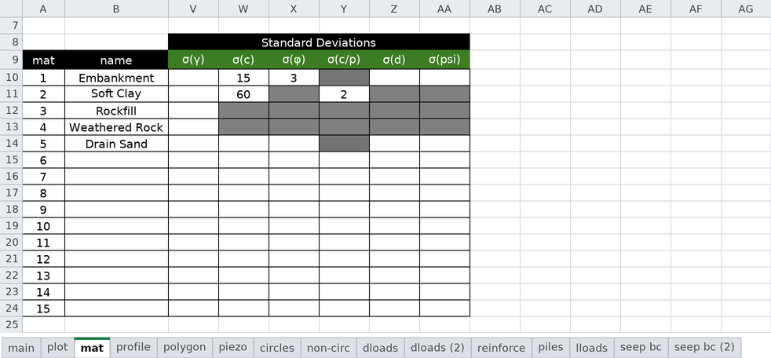

The remaining columns hold the seepage properties, shown in the third view below.

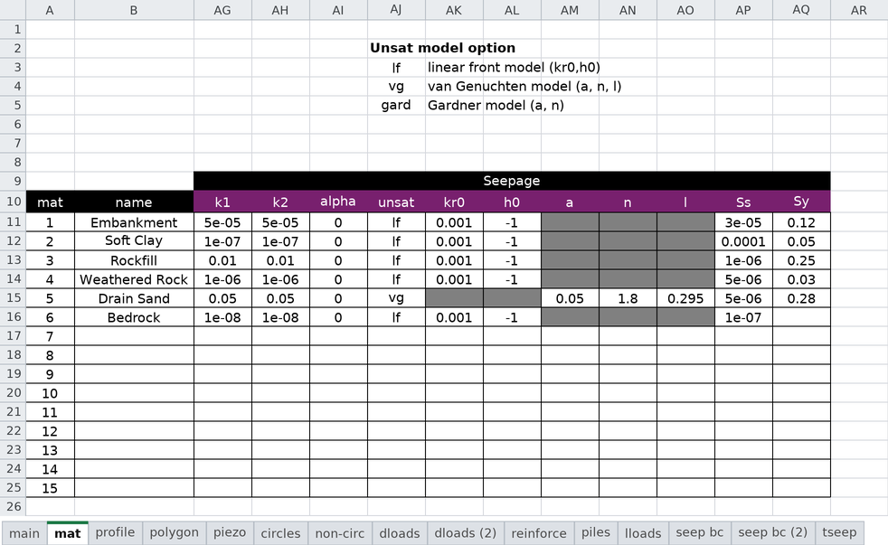

**Permeability** (for seepage analysis):

- **k1**, **k2** — **[L/t]**: Major and minor hydraulic conductivity (can be anisotropic)
- **alpha** — **[deg]**: Orientation angle of permeability tensor
- **unsat**: Unsaturated relative-permeability model — `lf` (linear front, the default), `vg` (van Genuchten), or
  `gard` (Gardner power form). Selects which parameter pair below applies.
- **kr0** **[–]**, **h0** **[L]**: Linear-front (`unsat = lf`) parameters — relative conductivity (dimensionless) and suction head at which K = kr0.
- **a**, **n**: the curve parameters for the *other two* models. Their meaning depends on **unsat**:
    - `vg` (van Genuchten): $a = \alpha$ **[1/L]** and $n$ **[–]**. (For steady-state flow only α and n are needed;
      residual/saturated water contents are not required.)
    - `gard` (Gardner): $a$ and $n$ **[–]** of the power form $k_r = 1/(1 + a\,\psi^{\,n})$, with $\psi$ the suction
      head **[L]**; $a$'s units follow from $n$ so that $a\,\psi^{\,n}$ is dimensionless.

  The columns are deliberately law-agnostic — one pair serves both models rather than two near-duplicate pairs.

**Transient storage (Ss / Sy).** Added in template version 18, these two columns supply the
storage properties that a **transient** (time-dependent) seepage analysis needs — the analysis
driven by the [**tseep** sheet](#worksheet-tseep). They are read only when the model has a tseep
sheet; for a steady-state analysis leave both blank. The role each storage term plays in the
transient flow equation is set out under [Storage](../seep/transient.md#storage).

- **Ss** — **[1/L]**: specific storage — the volume of water released from storage per unit volume
  of soil per unit drop in head, arising from the compressibility of the water and the soil
  skeleton. **Required for every material** when a tseep sheet is present.
- **Sy** — **[–]**: specific yield (dimensionless) — the drainable/fillable porosity that governs storage
  as the phreatic surface rises and falls. **Required only when the model is unconfined** (an
  exit-face boundary is present, so parts of the domain can desaturate). A confined or
  always-saturated transient problem needs only Ss and may leave Sy blank.

Typically, alpha = 0 and K1 = Kx and K2 = Ky. Leave **unsat** blank or `lf` to use the
linear-front model (the established default); set it to `vg` or `gard` only when those
properties are wanted (e.g. imported from another package). Typical `a`/`n`
values by soil texture, and the unit convention for α, are tabulated in the
[seepage overview](../seep/overview.md#van-genuchten-model).

These parameters are defined in more detail in the [seepage analysis](../seep/overview.md) section.

---

## Worksheet: profile

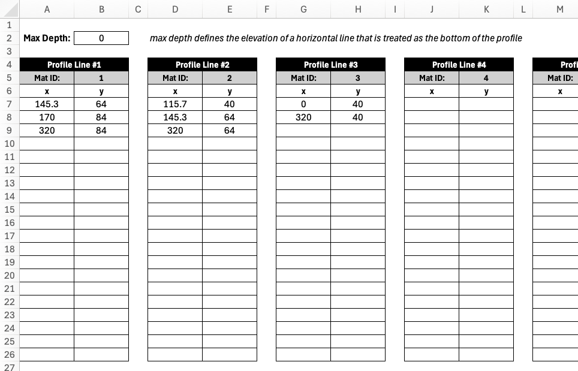

The **profile** worksheet defines the slope geometry using XY coordinates of profile lines are the primary input for 
all types of analysis (LEM, SEEP, and FEM). 
Each profile line the top of a soil layer or profile and all of the soil below that line and above all of the lower 
profile lines is assumed to consist of the material associated with the profile line. The material id listed for each profile line references one of the materials in the 
material properties table. The material name in row 6 is found by using the material ids in row 5 to look up the 
name in the second column of the materials table.

To illustrate how profile lines can be used to define the geometry of a slope, consider the following slope 
with three 
layers:

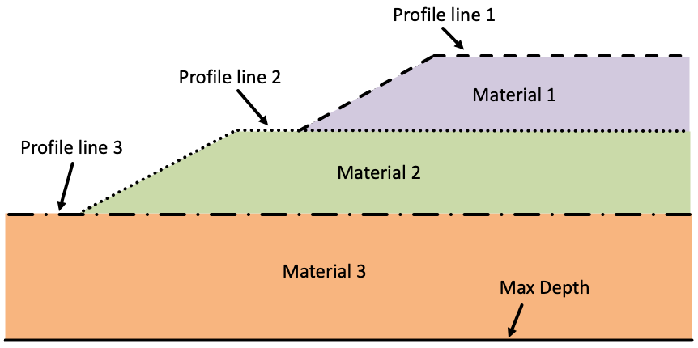

The profile lines should always be drawn in the order of increasing depth, from top to bottom and the XY coordinates 
defining the line should be listed from left to right. All profile-line coordinates are lengths **[L]**. In the example above, the top profile line has three points, 
the next line has three points, and the last line has two points. Each line should have at least two points. The 
bottom of the slope is defined by the Max Depth parameter **[L]** (an elevation) at the top of the **profile** worksheet. This defines a 
horizontal base to the problem. During a limit equilibrium analysis using an automated search algorithm, the failure 
surface is not allowed to go below this depth. Thus, it can be thought of as a bedrock surface.

Each profile line also has an optional **Size** cell — a target finite-element size **[L]** for
the material zone that line builds, used only when a mesh is generated. Leave it blank and the
zone meshes at the global target size; set it and elements inside that zone are driven down to
the value given, growing smoothly back to the global size outside it. Use it to resolve a thin
or critical layer without refining the whole model. It has no effect on a limit-equilibrium run,
which does not mesh.

The template includes tables for 15 profile lines, organized horizontally. However, you can copy additional tables to the right as needed. There is no limit to the number of profile lines that can be defined. Furthermore, each table includes 20 rows of XY coordinates, but you can add as many rows as needed.

During analysis, xslope uses these lines to:

1. Construct the ground surface by finding the highest elevation at each x-coordinate
2. Determine slice geometry when a failure surface is intersected with the profile
3. Assign material properties to slices based on which layer they fall within
4. Build polygons for finite element meshing in seepage or FEM analysis

---

## Worksheet: polygon

The **polygon** worksheet is an **alternative to the profile worksheet** for defining slope
geometry. Instead of describing each soil layer as a left-to-right line, each material zone is
described as a **closed polygon** — a self-contained region with an assigned material. Use whichever
method best fits the geometry; do **not** fill in both the **profile** and **polygon** worksheets in
the same file.

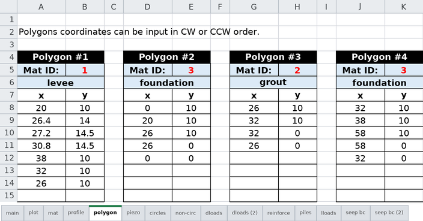

Polygons are well suited to geometries that are awkward to express as stacked profile lines, such as:

- Irregular or dipping bedrock surfaces
- Lenticular deposits (lens-shaped inclusions) embedded within another material
- Complex fill geometries such as zoned dam cross-sections
- Geometry imported from CAD software, which is typically drawn as closed regions

Each polygon is defined in its own table, organized horizontally just like the profile tables. For
each polygon you provide:

- A **Type**, which says what kind of region the polygon is. `material` (the default, and what a
  blank cell means) is a soil zone; the three `ssr` values are [SSR zone](#ssr-zones) analysis
  overlays; `refine` is a [mesh refinement region](#refine-regions). An unrecognized word is
  rejected at load time, never read as a material zone.
- A **Material ID**, which references one of the materials in the **mat** worksheet. As with the
  profile sheet, the name below it is filled in automatically. Both cells grey out for any Type
  other than `material`, because an overlay has no material.
- An optional **Size** — a target finite-element size **[L]** inside the polygon, used only when a
  mesh is generated. Blank means the global target size. Size is available on **every** polygon and
  layers on top of the Type rather than replacing it: a material zone may carry one, an SSR zone may
  carry one, and a `refine` polygon carries nothing else. See
  [Local mesh sizes](#refine-regions).
- The polygon **vertices** as XY coordinates **[L]**, one vertex per row.

A few rules govern how the vertices are interpreted:

- **Winding order does not matter** — vertices may be listed clockwise or counter-clockwise.
- **Polygons are closed automatically** — the last vertex is connected back to the first, so you do
  not need to repeat the starting point.
- **Nesting is detected from the geometry** — if one polygon lies entirely inside another (for example
  a sand lens within a clay deposit), the inner polygon overrides the outer one in the overlap region.
  No parent/child bookkeeping is required.
- Each polygon must have at least three vertices, and the polygons together should tile the cross
  section without overlaps or gaps.

The template includes tables for 15 polygons, organized horizontally, and you can copy additional
tables to the right as needed. Each table includes room for many vertices, and you can add as many
rows as required.

Unlike the profile worksheet, the **polygon** worksheet does **not** use a Max Depth parameter. The
overall extent of the model — including the ground surface and the bottom boundary — is derived from
the **union of all polygons** (the domain polygon). The ground surface is taken from the upper edge of
that union, and during an automated limit equilibrium search the failure surface is constrained to
stay within the domain polygon, which can therefore represent an irregular bedrock surface directly.

### SSR zones {#ssr-zones}

A polygon whose **Type** begins with `ssr` is not a material zone at all. It is an **SSR zone** — an
analysis overlay that tells the finite-element [strength reduction method](../fem/overview.md#ssr-exclusion-zones)
which part of the model to weaken.

| Type | Meaning |
|:-----|:--------|
| **`ssr reduce`** | **Search area.** Strength reduction applies **only inside** this polygon. |
| **`ssr hold`** | **Exclusion, full strength.** Inside is never reduced, but it can still yield. |
| **`ssr elastic`** | **Exclusion, elastic.** Inside is linear elastic and cannot yield at all. |

Any other word is rejected at load time rather than ignored, so a typo can never quietly run the
model unconstrained.

Template version 20 wrote these three as **negative Material IDs** (−1, −2, −3) with no Type row.
Those files still load exactly as they always did, and mean exactly the same thing; the Type
dropdown replaced the codes so the Material ID column is never asked to carry two unrelated
meanings at once.

**They are overlays, not geometry.** An SSR zone is never meshed, never becomes a material region and
never generates slices. It changes nothing about the model except which elements the strength reduction
touches, and it is classified element by element, by where each element's centre falls. That is what
makes a zone safe to add to a finished model: the mesh and the factor of safety are untouched unless the
zone actually constrains something. Zones may overlap each other and may cross material boundaries
freely — the no-overlap rule above applies to material zones only. The limit-equilibrium solvers ignore
them entirely.

**How several zones combine.** There is one rule:

> The reduced region is the union of the `ssr reduce` zones, minus the union of the `ssr hold` and
> `ssr elastic` zones. With no `ssr reduce` zone drawn, it is the **whole model** minus those exclusions.

So exclusions always carve out — of a search area they sit inside, or of the model as a whole — and an
interior hole in a search area is drawn simply by putting an `ssr hold` (or `ssr elastic`) polygon on
top of it. An `ssr elastic` zone additionally makes its elements linear elastic, the same treatment as a
material whose strength option is `elastic`, but addressed by outline instead of by material.

**When to use one.** Use a search area when the mechanism you want to measure is confined to part of the
model and a competing one elsewhere would otherwise take over — a stiff foundation held at full strength
forces the failure up into the fill above it. This is RS2's "SSR Search Area" and "SSR Exclusion Area",
and both senses are drawn directly: mark the region you want reduced `ssr reduce`, or mark the region you
want held `ssr hold`. Both forms, and when each is the natural one to use, are covered under
[SSR search areas and exclusion zones](../fem/overview.md#ssr-exclusion-zones).

A zone drawn on the polygon sheet applies to every run of the model. A search-area polygon passed
explicitly to a run takes precedence over the file's zones (XSLOPE warns when both are present, rather
than quietly intersecting the two).

**Zones on a profile-sheet model.** Because zones are not geometry, the "do not fill in both sheets"
rule does not apply to them: a model whose geometry lives on the **profile** sheet may still carry SSR
zone rows on the **polygon** sheet.

### Local mesh sizes and refine regions {#refine-regions}

The **Size** cell on a polygon (and the matching cell on a [profile line](#worksheet-profile)) sets a
target finite-element size **[L]** inside that region. Blank means the global target size — the value
in the Build Mesh dialog, or **Mesh target size** on the [main](#worksheet-main) sheet. Set it and the
elements inside the region are driven down to the value given, growing smoothly back to the global size
outside it so there is no abrupt jump in element size at the boundary.

Size is **independent of Type**. A material zone with a Size is that soil zone, meshed finer. An SSR
zone with a Size is the same analysis overlay, with the elements it selects resolved more finely. And a
polygon whose Type is **`refine`** is nothing but a Size: it carries no material, never becomes a mesh
region, never generates slices and is invisible to every solver — the only thing it does is make the
mesh finer where it is drawn. A `refine` polygon must therefore carry a Size; one without is rejected
at load time rather than sitting silently in the file doing nothing.

Use a refine region to resolve something the geometry does not mark out on its own — the ground under a
footing, the zone a slip surface is expected to pass through, or the tip of a cutoff wall. Use a
material or profile-line Size when the thing to resolve *is* a layer. Neither affects a
limit-equilibrium run, which does not mesh, and neither changes the mesh at all when left blank.

A Size only ever **refines**. A value at or above the global target size cannot make the mesh coarser
there; xslope warns at mesh time rather than leaving a setting with no effect to pass unnoticed.

Refine regions may overlap anything, including each other and material boundaries; where several apply,
the smallest size wins.

---

## Worksheet: piezo

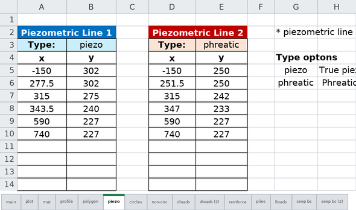

The **piezo** worksheet defines up to two water lines used to compute pore water pressures in limit equilibrium
analysis. A line is used by every material on the **mat** sheet whose pore pressure option is set to "piezo", so it
applies to soils analyzed with effective-stress (drained) strengths. Below the line, pore pressures are positive;
above it, they are zero.

Each line has a **Type** cell that states what the line represents, which determines how the pressure head is
computed:

- **piezo** (the default — a blank cell means the same): the line is a true *piezometric line*, i.e., the locus of
  pressure heads measured by piezometers at the slip surface. The pore pressure at a slice base is the full static
  head, u = γw · Δz, where Δz is the vertical distance from the slice base up to the line (upper figure below).

- **phreatic**: the line is the *phreatic surface* (the water table) in a slope with inclined, roughly
  surface-parallel steady seepage. In that flow regime the equipotentials are not vertical, so the head at depth is
  less than the static column and the static head is reduced by cos²θ, where θ is the inclination of the line
  segment directly above the slice base (lower figure below). This is the same correction as Slide2's "Hu: Auto"
  and the phreatic-surface option in XSTABL, and it matters most on steep phreatic lines — on a flat line the two
  types are identical.


Choosing between them: if the line came from piezometer readings, a flow net, or a seepage analysis, it is a
piezometric line — use **piezo**. If all you have is the water table position, **phreatic** is the appropriate
shortcut. For full rigor on complex problems, run a finite element seepage analysis and set the material pore
pressure option to "seep" instead; the pore pressures then come from the seepage solution directly and neither line
type is needed.

A line applies only over its own horizontal extent — its pressures are not extended past either end. That makes a
line that stops short of the section a legitimate model, for a water body that stops there too (a reservoir on one
side of a dam and no tailwater on the other). It does mean the line must reach everywhere it is *read*: if a slice
base, mesh node, or Gauss point in a material set to "piezo" falls beyond the end of the line, the analysis stops
with an error rather than treating that point as having no pore pressure. To model dry ground past the end of a
line, carry the line on at an elevation below the section. For the same reason, a material set to "piezo" in a file
whose piezo worksheet is empty is an error too — a model with no water is **none**, not a piezometric line that was
never drawn.

The worksheet provides space for two lines, which supports rapid drawdown analysis:

- **Piezometric Line 1 (columns A–B)**: steady-state or initial condition
- **Piezometric Line 2 (columns D–E)**: post-drawdown condition (only required for rapid drawdown)

Each line has its own Type cell and requires at least two XY coordinate pairs **[L]**, ordered from left to right. The table
is formatted for 20 rows, but coordinates can be entered beyond the bottom of the table as needed.

The Type cell was added in template version 13. Older (v8–v12) input files load unchanged: a file with no Type cell
behaves as **piezo**, which reproduces their previous results exactly.

---

## Worksheet: circles

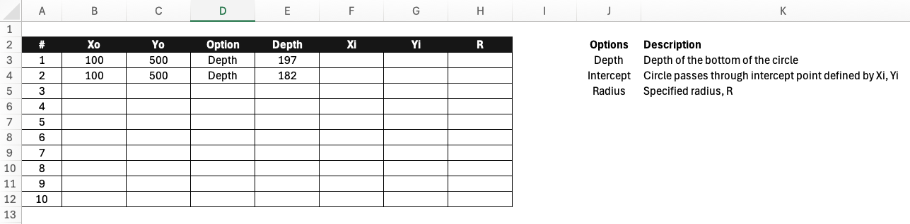

The **circles** worksheet defines circular failure surfaces for limit equilibrium analysis. Circular surfaces are 
the most common assumption in slope stability analysis and are required for methods like Bishop's Simplified Method 
and Spencer's Method. XSLOPE supports up to 10 circular failure surfaces, each of which can be analyzed 
individually or used as starting points when searching for a critical failure surface with a minimum factor of 
safety using an automated search algorithm.

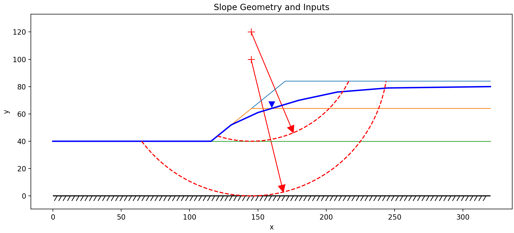{width=1000px}

Each row in the circles table specifies one circular failure surface with the following 
parameters:

- **Xo, Yo** — **[L]**: Coordinates of the circle center
- **Option**: Method for defining circle size - "Depth", "Radius", or "Intercept"
>>- **Depth**: Specify depth below ground surface at center location
>>- **Radius**: Directly specify circle radius
>>- **Intercept**: Specify a point (Xi, Yi) where circle should pass through
- **Depth, R, Xi, Yi** — **[L]**: Associated values depending on option selected

During a limit equilibrium (LEM) analysis, XSLOPE performs the following steps:

1. Constructs the circular arc geometry from the parameters
2. Finds intersection points with the ground surface
3. Divides the arc into slices
4. Assigns material properties to each slice based on its position

A common problem in limit equilibrium analysis is finding the critical 
failure surface. The automated search algorithm sometimes converges to a location corresponding to a local minimum 
of the factor of safety, but this location may not correspond to the global minimum. To find the critical surface, 
it is common practice to start the search at multiple locations and then analyze the results to identify the 
critical surface. XSLOPE automates this process by testing each of the defined circle locations when performing an 
automated search and then continuing to iterate from the location with the lowest factor of safety. When defining multiple circles, a good strategy is to start define one circle passing through the toe of the slope 
(for steep slopes) and one circle at the base of each soil layer.

### Search window (optional)

The **Search window** block at the right of the sheet (added in template version 19)
confines the automated circular search to a chosen region of the geometry. This is the
counterpart to the "search limits" other programs offer, and its purpose is to make the
search settle on a particular **local** minimum rather than the global one — a benched
slope, for example, has several competing mechanisms and you may want the factor of
safety of one of them specifically.

Every limit is optional and independent. Leave a cell blank and that limit is not
applied; leave all ten blank and the search is exactly the unconstrained search
described above.

| Cell | Meaning |
|---|---|
| **Entry X min / max** — **[L]** | X range the failure surface's crest-side (higher-ground) endpoint must fall in. |
| **Exit X min / max** — **[L]** | X range the toe-side (lower-ground) endpoint must fall in. |
| **Center box X min / X max / Y min / Y max** — **[L]** | Rectangle the circle centers are confined to. The refining grid stays inside it, so the search cannot walk out. |
| **Max tangent depth** — **[L]** | The lowest **elevation** the circle's bottom (its tangent point) may reach. |
| **Min slip depth** — **[L]** | Minimum depth below the ground surface a surface must reach. Rejects shallow surficial "skin" mechanisms, whose factor of safety is depth-independent on a cohesionless face and would otherwise win. |

A range is applied only when **both** of its ends are filled — half a range is not a
window, and XSLOPE will not invent the missing end. Entry and exit ranges and the
tangent-depth limit **reject** a trial surface that violates them rather than clamping it,
so the reported minimum genuinely honors the window; the center box confines the grid
itself. Both ends of every range must be increasing (min ≤ max), which is checked when the
file loads.

---

## Worksheet: non-circ

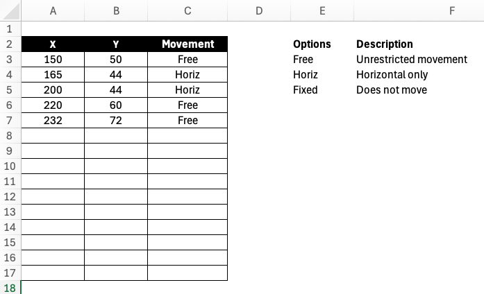

The **non-circ** worksheet allows definition of arbitrary non-circular failure surfaces. Some slopes include thin 
layers with especially weak soils. In such cases, a failure surface where much of the surface is confined to the 
weak layer can be more critical than a circular failure surface. A non-circular failure surface is defined by a set 
of XY points, listed from left to right. The table is formatted for 20 rows, but extra rows can be added below the table if needed. Generally, the leftmost point is the entry point and the rightmost point is 
the exit point and both should correspond to the ground suface. 

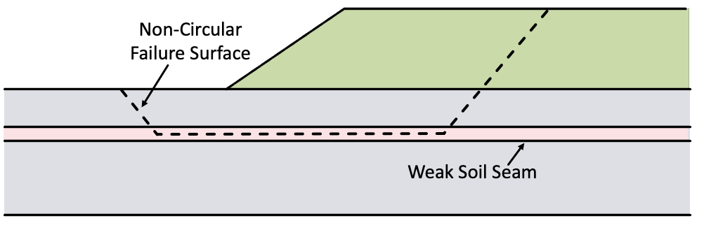

The worksheet contains three columns:

- **X, Y** — **[L]**: Coordinates of points along the failure surface, defined sequentially from left to right
- **Movement**: Direction of movement constraint at each point (used in automated search) — a selector, not a numeric value

Non-circular surfaces can only be used with LEM methods that support non-circular failure surfaces. For the methods 
supported in XSLOPE, the following table defines which methods support non-circular failure surfaces:

| Method                                         |         Non-circular         |
|------------------------------------------------|:----------------------------:|
| Ordinary Method of Slices                      |              No              |
| Bishop's Simplified Method                     |              No              |
| Janbu Method                                   |             Yes              |
| Force Equilibrium - Corps of Engineer's Method |             Yes              |
| Force Equilibrium - Lowe & Karafiath Method    |             Yes              |
| Spencer's Method                               |             Yes              |

For the movement option, the following values are supported:

- **Free**: No movement constraint
- **Horiz**: Point moves in the horizontal direction only
- **Fixed**: Fixed movement constraint at each point

For the **Free** option, if the point is the first or last point in the list, the movement constraint is applied 
such that the point moves left or right along the ground surface. For interior points, the movement constraint is 
applied such that the point moves in the direction of tangent of the failure surface at that point. This process is 
described in more detail in the [Automated Search Algorithms](../lem/search.md) section.

---

## Worksheet: dloads

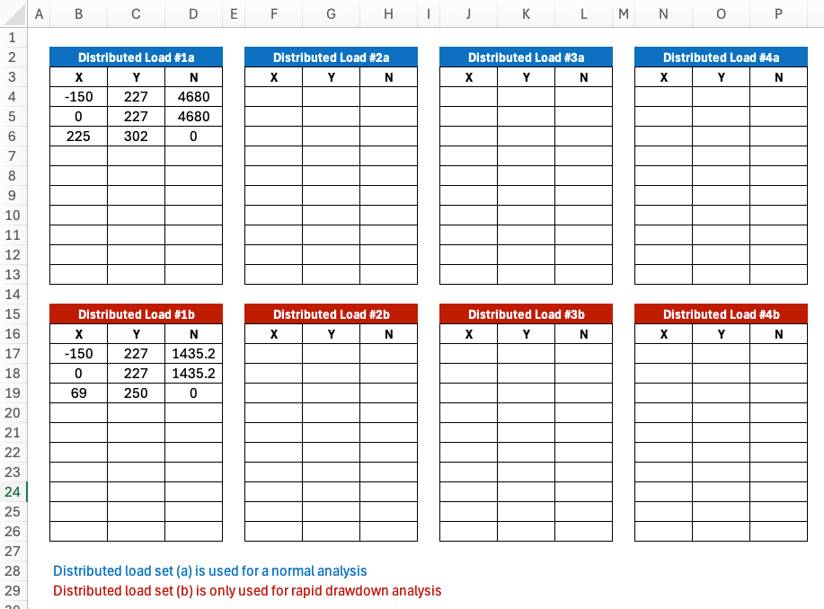

The **dloads** and **dloads (2)** worksheets define distributed surface loads applied to the slope. These represent surcharge loads 
such as traffic, buildings, stockpiled materials, or other surface loading. They are also used with submerged slopes 
to represent the force of the water on the slope. During limit equilibrium analysis, distributed loads are applied to the top of each slice, which affects either or both of the driving and resisting forces depending on the slope angle and load orientation. The **dloads** sheet defines loads used in a normal slope stability analysis or the first stage of a rapid drawdown analysis. The **dloads (2)** sheet defines loads used in the second stage of a rapid drawdown analysis, and has the same layout:

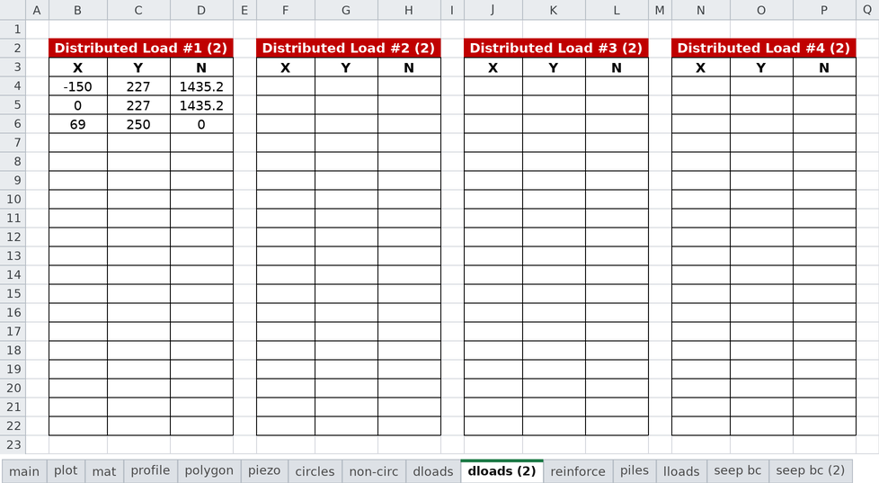

Each worksheet is formatted for 6 distributed loads, but additional loads can be added by copying and pasting more tables to the right. Each table is formatted for up to 20 rows, but additional rows can be added below the end of table if necessary.

Each distributed load is defined by a **Direction** and a series of points with:

- **X, Y** — **[L]**: Coordinates of points along the load distribution line, ordered from left to right
- **Normal** — **[F/L²]**: Load intensity (force per unit area) along the line

At least two points are required to define each load block.

**Direction** (`normal` or `vertical`) sets which way the load pushes. `normal` — the default, and
what a blank cell means — applies it **perpendicular to the loaded line**. That is right for
anything that acts as a pressure on a surface, and it is what water does, so ponded water and
reservoir loads always use it. `vertical` applies the same intensity **straight down**, which is what
a dead-weight surcharge does: a stockpile, a fill, or an equipment load presses down under gravity
whatever the ground beneath it is doing.

The distinction only matters on an **inclined** loaded surface, and there it matters a lot. On ground
falling at angle β the perpendicular reading carries a horizontal component of tan β times the load —
on a 6° crest that is 11% of the surcharge, pushed sideways into the hill, which is a real restraining
force the surcharge does not actually apply. Both readings carry the same total force; they differ
only in where it points. On level ground the two are identical. The direction is set per load block,
so a model may mix them — a pond on the face and a stockpile on the crest — and both sheets carry the
option independently, so the two stages of a rapid drawdown may differ.

The direction applies to limit-equilibrium slices and to the finite-element edge tractions alike. The load distribution typically follows the ground 
surface. The points should be listed in order from left to right. For example, consider the following load distribution:

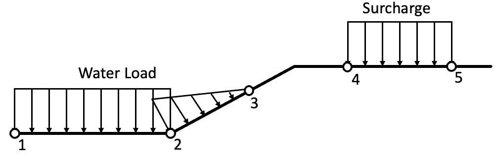

**Point order.** Left to right is the convention, but a line entered right to left is not an error and does not
change the answer: a load line that runs monotonically in decreasing X is re-oriented to increasing X when the file
is read, and a `normal` load's push direction is taken from the **geometry** — perpendicular to the line, into the
material — rather than from the order the points were typed in. A line whose X genuinely turns back on itself (an
overhang, or a small backstep at a toe) has no increasing-X form and is kept exactly as authored.

The forces are defined using a unit width perpendicular to the plane of the slope. For the water load, 
the force at each point would be the unit weight of water multiplied by the height of water above the point in 
question. For the example shown above, there distributed load would consist of three points, the first two points 
having the normal force and the last point having a normal force of zero. The surcharge load on the right would be 
defined by two points with a normal force for each.

---

## Worksheet: reinforce

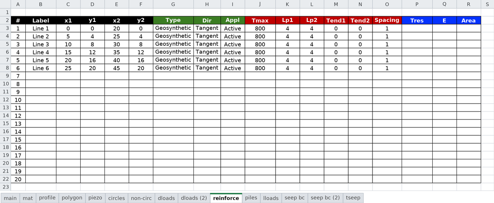

The **reinforce** worksheet defines soil reinforcement elements such as soil nails, rock anchors, geosynthetic 
reinforcement, or tiebacks. These elements provide additional resistance to sliding by mobilizing tensile forces 
along the failure surface. Each reinforcement object is represented as a straight line defined by the XY coordinates of 
the endpoints. Each line also has a set of properties that define the type of support, the strength of the
reinforcement, and the anchorage at each end.

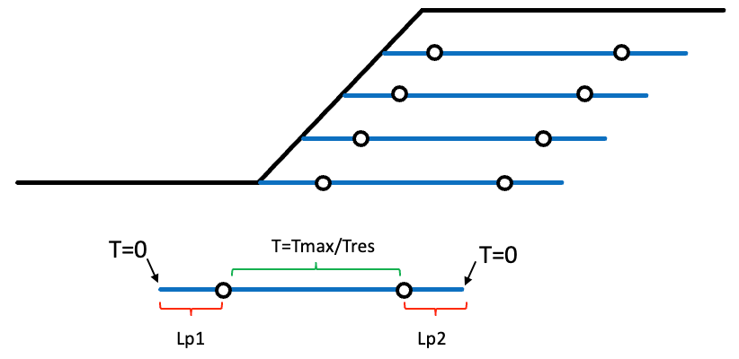

The template is formatted for up to 20 reinforcement lines (rows 3-22), but additional rows can be added to the 
table as needed. Column headers are color-coded by analysis type: **green** = LEM only, **red** = LEM & FEM,
**blue** = FEM only.

Each reinforcement element is defined by:

- **Geometry**:<br>
>>Label: Name used in error messages, summaries, and plots (optional)<br>
>>x1, y1 **[L]**: Start point coordinates <br>
>>x2, y2 **[L]**: End point coordinates<br>
- **Support Type** (LEM only):<br>
>>Type: Support preset — selecting a Type fills Dir and Appl automatically: Geosynthetic (Tangent, Active),
Nail (Axial, Passive), Tieback (Axial, Active), Anchor (Axial, Active). Leave blank for a generic tensile line.<br>
>>Dir: Force direction at the slip surface. **Tangent** = the force reorients tangent to the slip surface
(correct for flexible reinforcement such as geosynthetics — the default). **Axial** = the force acts along the
reinforcement's own axis (correct for rigid supports such as nails and tiebacks). Filled by Type; overtype to
override.<br>
>>Appl: Force application. **Active** = the force is a known *allowable* force applied to the driving side and is
NOT divided by the factor of safety (the default). **Passive** = the force is an *ultimate* capacity added to the
resisting side and divided by FS, i.e. it mobilizes with the soil. Filled by Type; overtype to override.<br>
- **Strength / Capacity Properties** (LEM &amp; FEM):<br>
>>Tmax — **[F] per element (÷ Spacing)** or **[F/L] per unit width** when Spacing is blank: Maximum tensile force that can be mobilized. Per unit width of slope; for discrete supports (nails,
tiebacks) enter the per-element capacity and provide **Spacing**, and xslope divides for you.<br>
>>Lp1 **[L]**: Pullout bond length at end 1<br>
>>Lp2 **[L]**: Pullout bond length at end 2<br>
>>Tend1 — **[F] per element (÷ Spacing)** or **[F/L] per unit width**: Anchorage/plate/connection capacity at end 1 (0 = friction only)<br>
>>Tend2 — **[F] per element (÷ Spacing)** or **[F/L] per unit width**: Anchorage/plate/connection capacity at end 2 (0 = friction only)<br>
>>Spacing **[L]**: Out-of-plane spacing for discrete supports. Leave blank (or 1) for geosynthetics, whose properties are
already per unit width.<br>
- **Stiffness / Residual** (FEM only):<br>
>>Tres — **[F] per element (÷ Spacing)** or **[F/L] per unit width**: Residual tensile force *after* the element yields — its post-peak strength. **Leave it blank** for the
usual elastic-perfectly-plastic bar, which simply holds its capacity once it yields; a blank is not the same as a
zero. Entering **0** means brittle rupture: the element drops to carrying nothing at all. Anything in between models
a bar that sheds part of its load and retains the rest.<br>
>>E **[F/L²]**: Elastic modulus of reinforcement<br>
>>Area — **[L²] per element (÷ Spacing)** (or [L²/L] per unit width when Spacing is blank): Cross-sectional area<br>

The available tensile force varies *along* the line: it is limited by the tendon's own capacity in the middle, and
tapers off toward each end as there is progressively less bond length available to develop it. That capacity
envelope is what `Tmax`, `Lp1`, `Lp2`, `Tend1` and `Tend2` describe between them, and it is the same in LEM and
FEM. The envelope, the end-condition cases, and how to convert a bond strength into an `Lp`, are all set out in
**[Soil Reinforcement in LEM](../lem/reinforcement.md#capacity-envelope)** — the figures there are the quickest way
to see what a given combination of columns actually produces.

How the force is then *used* differs by analysis:

- **LEM** applies the envelope force at the point where the line crosses the slip surface, in the direction set by
  **Dir**, factored (or not) by **Appl**. `Tres`, `E` and `Area` are ignored. See
  [Force Direction](../lem/reinforcement.md#force-direction-dir) and
  [Force Application](../lem/reinforcement.md#force-application-appl).
- **FEM** models the line as a 1D truss element with stiffness `E`·`Area`, so the force is an *output* of the
  analysis rather than an input — the bar carries whatever the deforming soil pushes into it, capped by the
  envelope, and dropping to `Tres` once it yields. **Dir** and **Appl** have no effect. See
  [Soil Reinforcement in FEM](../fem/reinforcement.md#force-behavior-and-failure-modes).

---

## Worksheet: piles

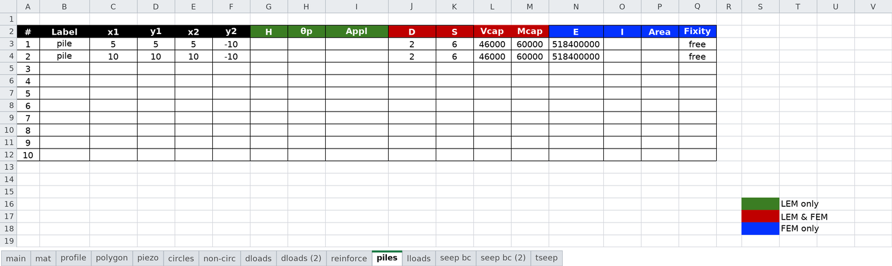

The **piles** worksheet defines pile and concrete pier support elements that provide lateral resistance to slope movement. Unlike flexible reinforcement (soil nails, geogrids) which resists movement through tension along the reinforcement axis, piles are rigid structural elements that resist soil movement through lateral shear and bending at the failure surface intersection.

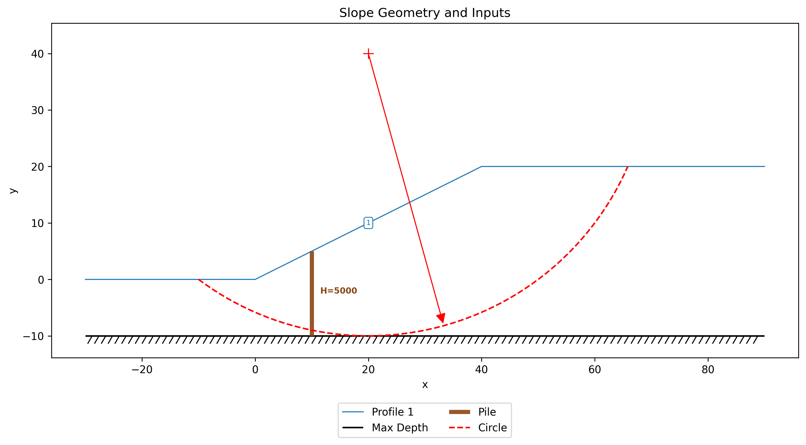{width=800px}

Each pile is represented as a straight line defined by its top and bottom endpoint coordinates. The line geometry supports both vertical piles ($x_1 = x_2$) and battered (inclined) piles. The template is formatted for up to 20 piles, but additional rows can be added to the table as needed.

Each pile is defined by:

- **Geometry**:<br>
>>x1, y1 **[L]**: Pile top coordinates<br>
>>x2, y2 **[L]**: Pile tip (bottom) coordinates<br>
- **LEM Properties**:<br>
>>H — **[F/L]** (per unit width of slope): Pile force magnitude. If the user has a row of piles at spacing $S$ with individual capacity $H_{\text{single}}$, input $H = H_{\text{single}} / S$.<br>
>>$\theta$ — **[deg]**: Force angle from horizontal in degrees (positive = upward). If left blank, $\theta$ is auto-computed as the direction perpendicular to the pile axis (0° for vertical piles).<br>
>>Appl: Force application. **Active** = $H$ is a known *allowable* force, not divided by the factor of safety (the default, and the behavior of earlier xslope versions). **Passive** = $H$ is an *ultimate* capacity added to the resisting side and divided by FS. Has no effect on FEM analysis, where the pile resistance is computed rather than prescribed.<br>
- **Pile Geometry**:<br>
>>D **[L]**: Pile diameter. Required for Ito & Matsui auto-computation of $H$. Also used by FEM to compute $I$ and $Area$ if those columns are left blank.<br>
>>S **[L]**: Center-to-center spacing. Required for Ito & Matsui auto-computation of $H$. Also required when structural capacity limits (V_cap, M_cap) are specified, since capacity is per-pile and must be compared against the per-pile force F = H &times; S. Recommended in general so that xslope can report per-pile forces in the summary output.<br>
- **FEM Properties** (for FEM analysis):<br>
>>E **[F/L²]**: Young's modulus of pile material<br>
>>I — **[L⁴]** (single-pile section; xslope scales EI to per unit width by ÷ S): Moment of inertia. If omitted and D is provided, computed for a solid circular section as I = &pi;D<sup>4</sup>/64.<br>
>>Area — **[L²]** (single-pile section; xslope scales EA to per unit width by ÷ S): Cross-sectional area. If omitted and D is provided, computed for a solid circular section as A = &pi;D<sup>2</sup>/4.<br>
- **Structural Capacity** (optional, LEM &amp; FEM):<br>
>>V_cap — **[F]** (per single pile; requires S so it can be checked against the per-pile force F = H &times; S): Shear capacity of the pile. This is the maximum lateral shear force that the pile cross-section can resist. If provided, the per-pile force $F_{\text{pile}}$ is capped at this value. Requires S to be specified.<br>
>>M_cap — **[F·L]** (per single pile; requires S): Moment capacity of the pile. This is the maximum bending moment the pile can resist. In LEM, the per-pile force is capped at $M_{\text{cap}} / L_m$, where $L_m$ is the moment arm from the pressure centroid to the failure surface. In FEM, a plastic hinge forms when the bending moment at any point along the pile reaches $M_{\text{cap}}$. Requires S to be specified.<br>
>>Fixity: Pile head rotational boundary condition for FEM analysis. **free** (default) = pile head can rotate freely; **fixed** = zero rotation at pile top (e.g., pile connected to a pile cap or retaining wall). Blank or omitted = free. This parameter has no effect on LEM analysis.<br>

Both V_cap and M_cap are properties of a **single pile**, not per unit width. When either is specified, xslope computes the per-pile force $F_{\text{pile}} = H \times S$ and checks it against the structural limits. If the structural capacity governs, the pile force is reduced accordingly before entering the equilibrium equations. If both V_cap and M_cap are blank, the full soil-computed (or user-specified) force is used with no structural limit.

During limit equilibrium analysis, xslope intersects each pile line with the failure surface to find the point where the pile force is applied. The force $H$ at angle $\theta$ is resolved into components normal and tangential to the slice base:

- **Normal to base**: $H\sin(\alpha - \theta)$ — increases effective stress, boosting frictional resistance
- **Tangential to base**: $H\cos(\alpha - \theta)$ — directly resists sliding

For methods with moment equilibrium (OMS, Bishop), the pile force also contributes a resisting moment about the circle center. The pile must extend below the failure surface to be effective — if the failure surface does not intersect the pile line, the pile provides no resistance for that surface.

When $H$ is left blank and $D$ and $S$ are provided, xslope auto-computes $H$ using the [Ito & Matsui (1975)](https://doi.org/10.3208/sandf1972.15.4_43) method for each trial failure surface. This auto-computation requires vertical piles ($x_1 = x_2$). For battered piles, $H$ must be specified directly.

See the [LEM Piles](../lem/piles.md) section for detailed equation derivations and the [FEM Piles](../fem/piles.md) section for the beam element formulation used in finite element analysis.

---

## Worksheet: lloads

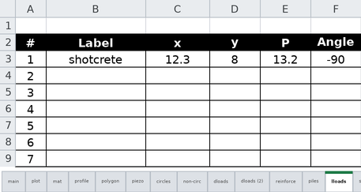

The **lloads** worksheet defines line loads — concentrated forces applied at a point on the ground surface, per
unit width of slope. A typical use is the self-weight of a facing element, such as the shotcrete plate of a soil
nail wall, applied as a point load on the wall face. (For loads spread over an area of the surface, use the
**dloads** worksheet instead.)

The template is formatted for up to 20 line loads (rows 3-22). Each line load is defined by:

- **Label**: Name used in error messages, summaries, and plots (optional)
- **x, y** — **[L]**: Coordinates of the point where the load acts. The point must lie on (or within a small tolerance of)
  the ground surface.
- **P** — **[F/L]** (per unit width of slope): Force magnitude
- **Angle** — **[deg]**: Direction of the force measured from horizontal in degrees. Leave blank for the default of **−90**
  (straight down — a weight).

During limit equilibrium analysis, the load is applied to the slice whose top boundary contains the point, entering
the equilibrium equations as force components with a real moment arm (analogous to the pile force terms, but applied
at the top of the slice rather than at the failure surface).

---

## Worksheet: seep bc

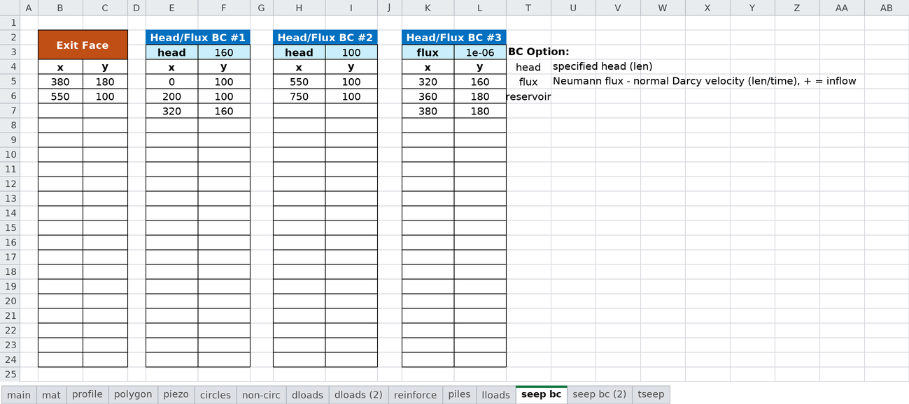

The **seep bc** and **seep bc (2)** worksheets define boundary conditions for finite element seepage analysis. 
Boundary conditions 
specify where water enters or exits the domain and the magnitude of hydraulic head on the boundary. There are three 
types of boundary conditions: specified head, specified flux, and exit face. **Specified head** boundaries correspond to free water on 
the face of the slope and the magnitude of the head is the height of water above the datum defined for the problem. 
**Exit face** boundaries conditions are used for unconfined problems are applied to the "downstream" side of the slope 
where water exits the slope. In the unconfined seepage solution, the phreatic surface intersects the exit face at 
some point (exit point) that is determined as part of an iterative solution process. For points on the exit face below 
the exit point, a head = elevation (zero pressure) condition is applied. For points on the exit face above the exit 
point, the head is determined by the pore pressure equation. 

Each of the five **Head/Flux BC** tables carries a **type** cell (a dropdown reading
`head`, `reservoir`, or `flux`) above its value cell. The type determines how the value
directly to its right is interpreted:

| type | value is | units |
|---|---|---|
| `head` | specified head — a **plain Dirichlet** total head held at every node of the polyline, at all times (may be a suction/negative-pressure head) | **[L]** |
| `reservoir` | a reservoir/tailwater **level** — a **submerged-only** Dirichlet: nodes at or below the level are held at it, nodes above it become seepage (exit) faces | **[L]** |
| `flux` | specified flux — the **normal Darcy velocity**, **positive into the domain** | **[L/t]** |

Both `head` and `reservoir` are total heads (height of water above the datum) and, for a
level drawn at or below the applied value, behave identically; they differ only in what
happens to a node the water level leaves above the line (a `head` holds it; a `reservoir`
releases it to an exit face). Use `reservoir` for a free-water face that rises or falls
(dam pool, tailwater, pond) and `head` for a drained face or an imposed head that must be
enforced regardless of elevation.

A **specified flux** (Neumann) boundary prescribes the *rate* at which water crosses the
boundary instead of the head on it. The usual use is rainfall infiltration or recharge applied
to the ground surface, where the water table position is a result of the analysis and so
cannot be entered as a head. Two points to be careful about:

- The flux is a flow per unit *area* of boundary, not a total discharge spread over the
  boundary — a rate of 1×10⁻⁶ m/s applied along a 40 m surface admits 4×10⁻⁵ m³/s per metre of
  slope, not 1×10⁻⁶.
- The sign matters and is easy to get backwards. **Positive is inflow** (infiltration,
  recharge). A negative value withdraws water.

Unlike a head boundary, whose points are simply pinned, a flux boundary's points define a
**polyline whose edges carry the load**, so it needs at least two points and they must run
along the boundary of the mesh. Zero flux is the default condition on any boundary that is not
otherwise specified, so a flux boundary only needs to be defined where the flux is non-zero. A
model with no specified-head boundary and no exit face anywhere is singular — head would be
determined only up to an additive constant — and xslope will refuse to solve it.

**Time-varying boundaries (transient).** A head or flux **value** cell may hold the *name* of a
time series defined on the [**tseep** sheet](#worksheet-tseep) instead of a number. When it does,
that boundary becomes time-dependent — its head (for a `head` type) or its flux (for a `flux`
type) follows the named series through the run. A series is simply a curve of numbers versus time;
whether those numbers mean head or flux is decided by the block's own **type** cell, so one series
can drive several boundaries. The name must match a series header on the tseep sheet exactly —
xslope reports an error listing the available series names if it does not — and a name is only
valid when a tseep sheet is present. Constant boundaries keep taking a plain number, exactly as
before. A series on a `head` block is a plain Dirichlet held at $h(t)$ at every node of the
polyline at all times; a series on a `reservoir` block is the rising/falling level. For a
series-driven **reservoir** boundary, draw the polyline over the *full* face the water can ever
cover: at each time step only the currently submerged nodes are held at the series level, while
nodes above the waterline automatically become seepage-face (exit face) nodes so the
still-saturated soil behind a freshly exposed face can drain through it — see
[head types](../seep/transient.md#head-types-head-and-reservoir).

For a typical unconfined problem, there is one upstream specified head boundary condition and a single downstream 
exit face. For confined problems, there is typically one upstream and one downstream specified head boundary 
condition. Additional boundary conditions can be defined to represent the water level in an 
excavation, infiltration on the ground surface, etc. The sheet is formatted for one exit face and up to 5 head or flux boundaries. Additional 
boundary 
conditions can be added by copying and pasting more tables to the right. Each table is formatted for up to 20 rows, 
but additional rows can be added below the end of table if necessary.

For most analyses, only the main **seep bc** sheet is used. However, the **seep bc (2)** sheet is used for rapid drawdown 
analysis where a second seepage solution is used to calculate the pore pressures corresponding to the drawdown 
condition. It has the same layout as the main **seep bc** sheet:

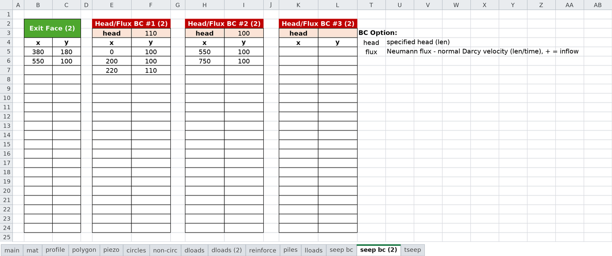

During seepage analysis, xslope:

1. Builds a finite element mesh from the **profile** geometry
2. Applies specified head values at nodes on the specified head boundaries
3. Integrates any specified flux over the boundary edges it covers, into consistent nodal inflows
4. Applies exit face conditions where water exits
5. Solves the Laplace equation (∇·(k∇h) = 0) for hydraulic head at all nodes
6. Computes pore pressures (u = γw(h - y)) and flow velocities

For coupled seepage-LEM analysis, the computed pore pressures can be exported and later interpolated onto slice bases using the "seep" option in the **mat** worksheet.

See the [Seepage Analysis](../seep/overview.md) section for more details and the [samples](../seep/samples.md) 
section for sample input files illustrating various boundary conditions

---

## Worksheet: tseep

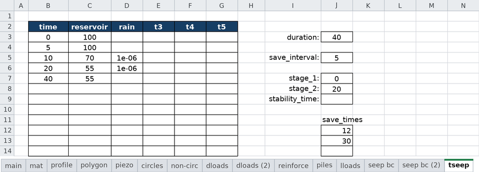

The **tseep** worksheet defines a **transient** (time-dependent) seepage analysis: a set of time
series that drive time-varying boundary conditions, together with the controls for the transient
run. It is used only for seepage. **A filled-in tseep sheet is what makes a seepage analysis
transient** — leave the sheet empty (as it is in the blank template) and seepage behaves exactly
as the steady-state analysis described in the [seep bc](#worksheet-seep-bc) section, with results
bit-for-bit unchanged.

This section documents the tseep sheet as an *input*. How the transient analysis is formulated and
solved — the storage term, the time-stepping scheme, the initial and boundary conditions, and the
saved output frames — is described in [Transient Seepage](../seep/transient.md).

**Time-series table** (left side of the sheet). The first column, headed **time** **[t]**, lists times in
increasing order, in the model's declared [time unit](#worksheet-main). Each remaining column is a
**named series**: the column header is the series name (the template ships with the default names
`t1`…`t5`, but any short name works — in the image above two have been renamed `reservoir` and
`rain`), and the cells beneath hold that series' values at the listed times. A
[seep bc](#worksheet-seep-bc) value cell references a series by this name, and the referencing
block's **type** decides whether the numbers are read as heads **[L]** or as fluxes **[L/t]** (matching
the head/flux BC convention above) — so one series can drive several boundaries.

Each series is interpolated **linearly** between its values, and held constant before its first
time and after its last. A **blank cell** inside a series means "no breakpoint here" — the series
interpolates straight through it — so each series needs values only at its own breakpoints, and
independent series with different breakpoints can share the single time column (the `rain` series
in the image is blank at times where only `reservoir` changes). A **step change** is entered by
repeating a time on two consecutive rows with different values.

**Run controls** (right side of the sheet):

- **duration** — **[t]**: the total time to simulate. It may extend past the last time in the table; series
  values are held constant beyond their last breakpoint.
- **save_interval** — **[t]**: the spacing between saved output frames. Leave blank for an automatic default
  (roughly 50 frames over the duration).
- **save_times** — **[t]**: an optional list of extra individual times, entered down the column, at which a
  frame is additionally saved — useful for capturing specific instants, such as the times at which
  a published verification result reports its values.
- **stage_1**, **stage_2** — **[t]**: optional times that couple a transient run to a
  [rapid-drawdown](../lem/rapid.md#transient-solution) stability analysis — the two instants (for example the steady
  full-reservoir state at `stage_1` and the drawn-down state at `stage_2`) whose pore pressures
  supply the two stages of the drawdown calculation. Leave both blank when not doing rapid
  drawdown; if you set one you must set the other, with `stage_1` earlier than `stage_2`.

A tseep sheet requires the **Time** unit on the [main](#worksheet-main) sheet to be set, and every
material to carry a specific storage `Ss` (with `Sy` as well on unconfined models) — see
[Worksheet: mat](#worksheet-mat). Any save time, stage time, or series breakpoint that falls beyond
the run **duration** draws a load-time warning, since it would never be reached.

---

## Notes

- All variables must use one consistent unit system throughout the template. Declare it with the
  **Units** selector on the [main](#worksheet-main) sheet — **SI** (m, kPa, kN/m³) or **Imperial**
  (ft, psf, pcf). XSLOPE never converts your numbers; the declaration fixes the unit weight of
  water and keeps the model's units explicit. Time-bearing quantities (permeability, flux,
  transient series) additionally follow the single **Time** unit declared there.
- Angles are specified in degrees **[deg]**
- The template is designed to be flexible - you need not fill in all worksheets for every analysis
- Always check your geometry visually after entering data — open the file in XSLOPE Studio or call `plot_inputs()`
- Templates can be saved and reused for parametric studies or similar projects