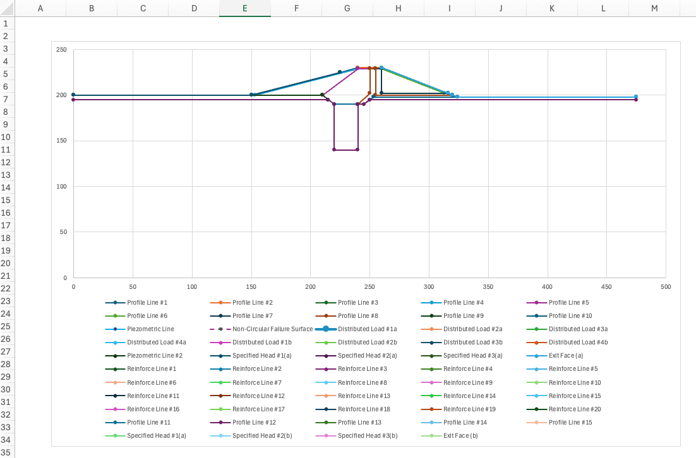
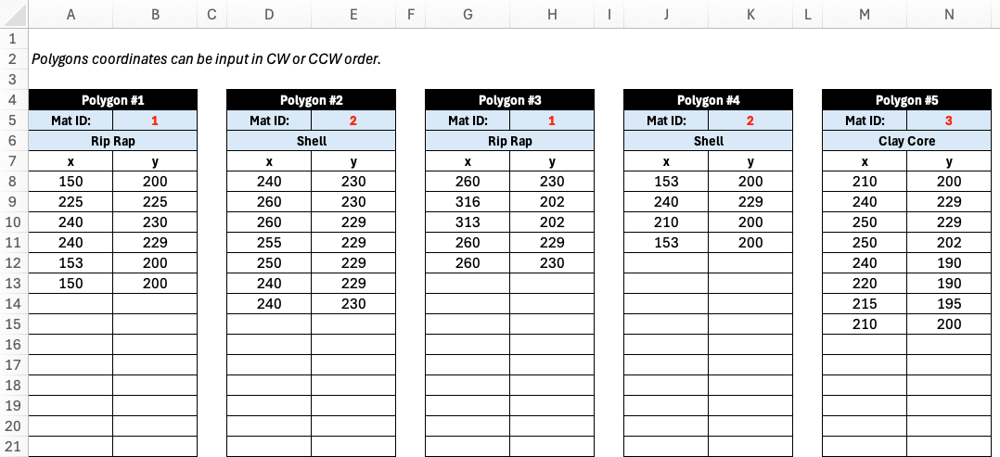

# XSLOPE Input Template

## Overview

The XSLOPE input template is the primary means of defining slope stability problems in xslope. It is an Excel workbook that contains all necessary information about the slope geometry, material properties, loading conditions, boundary conditions, and analysis parameters. The template is designed to support three main types of analysis:

- **Limit Equilibrium Method (LEM)**: Classical slope stability analysis using methods like Bishop, Spencer, Janbu, and others
- **Seepage Analysis**: Finite element groundwater flow analysis for steady-state and transient conditions
- **Finite Element Method (FEM)**: Stress-deformation analysis including the Shear Strength Reduction Method (SSRM)

The template uses a structured format with multiple worksheets (tabs), each dedicated to a specific aspect of the problem definition. This organization makes it easy to prepare complex slope stability analyses while maintaining clarity and avoiding errors.

## Download

A template for the Excel file can be downloaded here:

[input_template.xlsx](../inputs/input_template.xlsx)

The input file can be modified using any spreadsheet software such as Microsoft Excel, LibreOffice Calc, or Google Sheets.

## Loading the Template

The template is loaded into xslope using the `load_slope_data()` function from the `fileio` module:

```python
from xslope.fileio import load_slope_data

# Load the input template
slope_data = load_slope_data("path/to/your/input_template.xlsx")
```

This function reads all worksheets, validates the data, and returns a dictionary containing all parsed information. The resulting `slope_data` dictionary is then used by various xslope modules for analysis.

## Template Structure

The template consists of 13 worksheets, each serving a specific purpose. Different worksheets are used by different analysis types: Limit Equilibrium Method (LEM), seepage analysis (SEEP), and Finite Element Method (FEM).

| Sheet Name | Description | LEM | SEEP | FEM |
|------------|-------------|:---:|:----:|:---:|
| **main** | Global parameters and instructions | X   | X    | X   |
| **plot** | Auto-generated geometry preview | X   | X    | X   |
| **mat** | Material properties including strength, permeability, and stiffness | X   | X    | X   |
| **profile** | XY coordinates of profile lines defining slope geometry | X   | X    | X   |
| **polygon** | Material zones defined as closed polygons (alternative to **profile**) | X   | X    | X   |
| **piezo** | Piezometric lines for pore pressure calculations | X   |      | X   |
| **circles** | Circular failure surface definitions | X   |      |     |
| **non-circ** | Non-circular failure surface coordinates | X   |      |     |
| **dloads** | Distributed surface loads | X   |      | X   |
| **reinforce** | Soil reinforcement elements (anchors, nails, geosynthetics) | X   |      | X   |
| **piles** | Pile and concrete pier support elements | X   |      | X   |
| **lloads** | Line loads (concentrated forces on the ground surface) | X   |      |     |
| **seep bc** | Seepage analysis boundary conditions |     | X    |     |

The following sections describe each worksheet in detail, including the data structure and how it is used in analysis.

---

## Worksheet: main


**⚠ FIGURE NEEDS UPDATE: screenshot shows template version 11; current version is 14.**

The **main** worksheet provides global parameters that apply to all analyses and serves as the instruction page for the template. This tab contains:

- **Template version**: Tracks template format for compatibility. The current version is **14**; xslope refuses files whose version it does not recognize, so older installs cannot silently mis-read newer templates.
- **Unit weight of water** (γw): Used in pore pressure calculations
- **Tension crack parameters**: Depth and water level within tension cracks at the top of the failure surface
- **Seismic coefficient** (kh): Horizontal seismic acceleration coefficient for pseudo-static earthquake analysis

These global parameters are accessed throughout the analysis. For example, the unit weight of water is used in 
computing pore pressures from piezometric lines, and the seismic coefficient is used to add horizontal inertial 
forces to each slice in limit equilibrium calculations. The tension crack parameters allow the simulation of a tension
crack at the top of the slope for cohesive soils to reduce the likelihood that negative normal forces develop along the 
face, which are unconservative in the limit equilibrium method. Filling the crack with water adds an extra level of 
conservatism as this applies a driving force to the failure surface.

---

## Worksheet: plot



The **plot** worksheet contains an auto-generated visual preview of the slope geometry based on the inputs in other tabs. This plot updates automatically when you modify the **profile**, **piezo**, **circles**, or other geometry-related worksheets.

This worksheet is purely for quality control and visualization within the Excel environment. It allows you to quickly verify that:

- Profile lines are correctly positioned and form a reasonable slope geometry
- Piezometric lines are within the slope boundaries
- Distributed loads and seepage boundary conditions are at correct locations
- Reinforcement lines are correctly positioned
- etc.

The plot is not used by xslope during analysis - it exists solely to help you validate your inputs before running 
calculations. When working with complex multi-layer geometries or multiple water tables, this visual check can catch 
data entry errors early. It should be noted that the plot does not auto-scale to an equalized aspect ratio so the 
vertical 
scale may 
differ from 
the horizontal scale.

---

## Worksheet: mat


**⚠ FIGURE NEEDS UPDATE: new γ_sat, pow_a–pow_d, r_u and hb_sci–hb_d columns; new blank spacer row above the table (headers moved down one row); new `pow`, `hb` and `ru` legend entries.**

The **mat** worksheet defines material properties for the soil layer defined by the profile lines (see next section). Each profile line from the **profile** worksheet is assigned a material id referencing one of the materials in the materials table. It is possible for multiple profile lines to reference a single material. The template is formatted for 15 materials. However, you extend the table by adding additional rows as needed. The table includes comprehensive property definitions for strength, permeability, and stiffness.

**Strength Properties** (for LEM and FEM analysis):

- **$\gamma$**: Unit weight of the soil. This is the *total* unit weight — moist above the water table. It is used to calculate the weight of the soil in each slice.
- **$\gamma_{sat}$**: Saturated unit weight, used for the portion of each slice below the water table. Leave blank to use $\gamma$ throughout (the pre-v12 behavior). When both are given, $\gamma_{sat} \geq \gamma$ is required.
- **option**: Strength model to use for this layer. `mc` = Mohr-Coulomb; `cp` = undrained strength that increases
  with depth below a reference elevation; `pow` = nonlinear power-curve envelope; `hb` = generalized Hoek-Brown
  (rock).
- **c** (cohesion) and **φ** (friction angle): Mohr-Coulomb shear strength parameters (option = `mc`).
- **c**, **cp**, and **r-elev** (option = `cp`): undrained strength that increases linearly below a reference
  elevation — see the formula below.
- **d**: cohesion intercept for Kc=1 envelope used in [rapid drawdown analysis](../lem/rapid.md)
- **$\psi$**: friction angle for Kc=1 envelope used in [rapid drawdown analysis](../lem/rapid.md)
- **pow_a … pow_d** (option = `pow`): power-curve envelope parameters — see the formula below.
- **hb_sci**, **hb_gsi**, **hb_mi**, **hb_d** (option = `hb`): generalized Hoek-Brown parameters — see the
  formula below.
- **u**: pore pressure option
- **$r_u$**: pore pressure ratio (u = `ru`) — see below.

For the **mc** strength option — the Mohr-Coulomb envelope, and the option you will use most of the time — the
shear strength is a straight line in terms of the effective normal stress $\sigma'_n$ on the failure surface:

>>$\tau = c + \sigma'_n \tan\phi = c + (\sigma_n - u)\tan\phi   \qquad (1)$

where **c** is the cohesion (the intercept), **φ** is the effective friction angle (the slope of the line), and $u$
is the pore pressure from the selected **u** option. Setting $\phi = 0$ gives a constant undrained strength
$\tau = c = S_u$; setting $c = 0$ gives a purely frictional material. Every other strength option below is
ultimately reduced to this same form — the curved envelopes are linearized into an equivalent local $(c, \phi)$
before they are solved.

For the **cp** strength option, the undrained shear strength at elevation $y$ is:

>>$S_u = c + c_p \cdot \max(0,\; r_{elev} - y)   \qquad (2)$

where **c** is the strength at the reference elevation **r-elev** and **cp** is the *rate* of strength increase per
unit elevation below it (e.g. psf/ft). At or above **r-elev** the strength equals **c**. This behaves like a
$S_u/\sigma'_v$ (c/p) ratio but is referenced to elevation rather than depth, giving more precise control for
slope-stability problems.

For the **pow** strength option, the shear strength is a curved envelope in terms of the effective normal stress
$\sigma'_n$ on the failure surface:

>>$\tau = pow_a \cdot (\sigma'_n + pow_d)^{pow_b} + pow_c   \qquad (3)$

With $pow_b = 1$ this collapses to Mohr-Coulomb. Curved envelopes are appropriate for rockfill, waste rock,
weathered rock, and heavily overconsolidated clays, where a straight-line fit over a wide stress range
overestimates strength at one end and underestimates it at the other.

For the **hb** strength option, strength follows the generalized Hoek-Brown criterion (Hoek, Carranza-Torres &
Corkum, 2002), written in principal stresses:

>>$\sigma'_1 = \sigma'_3 + \sigma_{ci}\left(m_b \dfrac{\sigma'_3}{\sigma_{ci}} + s\right)^{a}   \qquad (4)$

The four inputs are the ones a geologist actually records; the rock-mass constants $m_b$, $s$ and $a$ are
*derived* from them and are never entered directly:

- **hb_sci** — $\sigma_{ci}$, the uniaxial compressive strength of the **intact** rock (stress units).
- **hb_gsi** — GSI, the Geological Strength Index, from 0 (completely broken) to 100 (intact). Must be in (0, 100].
- **hb_mi** — $m_i$, the intact Hoek-Brown constant, a rock-type property (≈ 4 for claystone, ≈ 10 for sandstone,
  ≈ 25 for granite).
- **hb_d** — $D$, the disturbance factor, from 0 (undisturbed) to 1 (heavily blast-damaged). Must be in [0, 1].

>>$m_b = m_i \exp\!\left(\dfrac{GSI - 100}{28 - 14D}\right), \quad
   s = \exp\!\left(\dfrac{GSI - 100}{9 - 3D}\right), \quad
   a = \tfrac12 + \tfrac16\!\left(e^{-GSI/15} - e^{-20/3}\right)   \qquad (5)$

Slope stability needs shear strength as a function of the normal stress on the failure plane, not a relationship
between principal stresses, so XSLOPE converts Eq. (3) to an equivalent Mohr envelope using Balmer's (1952)
transformation and linearizes it at the operative normal stress into an instantaneous $(c_i, \phi_i)$ tangent.
This happens automatically and iteratively — see [Hoek-Brown strength](../lem/overview.md#hoek-brown-strength).

**Pore Pressure Options** (column labeled **u**):

- **piezo**: Use piezometric line from **piezo** worksheet
- **seep**: Interpolate from seepage analysis solution (requires mesh and solution files - see [Using Seepage Results for Pore Pressures](../seep/seep_slope.md))
- **ru**: Pore pressure as a constant fraction of vertical overburden stress, $u = r_u \cdot \sigma_v$, with the
  ratio given in the **r_u** column. $\sigma_v$ is the soil-column stress only — distributed loads and tension-crack
  water are *not* included.
- **none**: No pore pressure

**Variability** (for reliability analysis):

- **σ(γ)**, **σ(c)**, **σ(φ)**, etc.: Standard deviations for probabilistic analysis


**⚠ FIGURE NEEDS UPDATE: seepage/stiffness columns shifted right by the new strength columns; headers moved down one row; the van Genuchten `vg_a`/`vg_n` columns are now the law-agnostic `a`/`n` pair shared with the new `gard` option.**

**Permeability** (for seepage analysis):

- **k1**, **k2**: Major and minor hydraulic conductivity (can be anisotropic)
- **alpha**: Orientation angle of permeability tensor
- **unsat**: Unsaturated relative-permeability model — `lf` (linear front, the default), `vg` (van Genuchten), or
  `gard` (Gardner power form). Selects which parameter pair below applies.
- **kr0**, **h0**: Linear-front (`unsat = lf`) parameters — relative conductivity and suction head at which K = kr0.
- **a**, **n**: the curve parameters for the *other two* models. Their meaning depends on **unsat**:
    - `vg` (van Genuchten): $a = \alpha$ (1/length) and $n$. (For steady-state flow only α and n are needed;
      residual/saturated water contents are not required.)
    - `gard` (Gardner): $a$ and $n$ of the power form $k_r = 1/(1 + a\,\psi^{\,n})$.

  The columns are deliberately law-agnostic — one pair serves both models rather than two near-duplicate pairs.

Typically, alpha = 0 and K1 = Kx and K2 = Ky. Leave **unsat** blank or `lf` to use the
linear-front model (the established default); set it to `vg` or `gard` only when those
properties are wanted (e.g. imported from another package). Typical `a`/`n`
values by soil texture, and the unit convention for α, are tabulated in the
[seepage overview](../seep/overview.md#van-genuchten-model).

These parameters are defined in more detail in the [seepage analysis](../seep/overview.md) section.

**Stiffness** (for FEM analysis):

- **E**: Young's modulus
- **ν**: Poisson's ratio

---

## Worksheet: profile


The **profile** worksheet defines the slope geometry using XY coordinates of profile lines are the primary input for 
all types of analysis (LEM, SEEP, and FEM). 
Each profile line the top of a soil layer or profile and all of the soil below that line and above all of the lower 
profile lines is assumed to consist of the material associated with the profile line. The material id listed for each profile line references one of the materials in the 
material properties table. The material name in row 6 is found by using the material ids in row 5 to look up the 
name in the second column of the materials table.

To illustrate how profile lines can be used to define the geometry of a slope, consider the following slope 
with three 
layers:


The profile lines should always be drawn in the order of increasing depth, from top to bottom and the XY coordinates 
defining the line should be listed from left to right. In the example above, the top profile line has three points, 
the next line has three points, and the last line has two points. Each line should have at least two points. The 
bottom of the slope is defined by the Max Depth parameter at the top of the **profile** worksheet. This defines a 
horizontal base to the problem. During a limit equilibrium analysis using an automated search algorithm, the failure 
surface is not allowed to go below this depth. Thus, it can be thought of as a bedrock surface.

The template includes tables for 15 profile lines, organized horizontally. However, you can copy additional tables to the right as needed. There is no limit to the number of profile lines that can be defined. Furthermore, each table includes 20 rows of XY coordinates, but you can add as many rows as needed.

During analysis, xslope uses these lines to:

1. Construct the ground surface by finding the highest elevation at each x-coordinate
2. Determine slice geometry when a failure surface is intersected with the profile
3. Assign material properties to slices based on which layer they fall within
4. Build polygons for finite element meshing in seepage or FEM analysis

---

## Worksheet: polygon

The **polygon** worksheet is an **alternative to the profile worksheet** for defining slope
geometry. Instead of describing each soil layer as a left-to-right line, each material zone is
described as a **closed polygon** — a self-contained region with an assigned material. Use whichever
method best fits the geometry; do **not** fill in both the **profile** and **polygon** worksheets in
the same file.



Polygons are well suited to geometries that are awkward to express as stacked profile lines, such as:

- Irregular or dipping bedrock surfaces
- Lenticular deposits (lens-shaped inclusions) embedded within another material
- Complex fill geometries such as zoned dam cross-sections
- Geometry imported from CAD software, which is typically drawn as closed regions

Each polygon is defined in its own table, organized horizontally just like the profile tables. For
each polygon you provide:

- A **Material ID** in row 5, which references one of the materials in the **mat** worksheet. As with
  the profile sheet, the material name in row 6 is filled in automatically by looking up the material
  ID in the materials table.
- The polygon **vertices** as XY coordinates starting in row 8, one vertex per row.

A few rules govern how the vertices are interpreted:

- **Winding order does not matter** — vertices may be listed clockwise or counter-clockwise.
- **Polygons are closed automatically** — the last vertex is connected back to the first, so you do
  not need to repeat the starting point.
- **Nesting is detected from the geometry** — if one polygon lies entirely inside another (for example
  a sand lens within a clay deposit), the inner polygon overrides the outer one in the overlap region.
  No parent/child bookkeeping is required.
- Each polygon must have at least three vertices, and the polygons together should tile the cross
  section without overlaps or gaps.

The template includes tables for 15 polygons, organized horizontally, and you can copy additional
tables to the right as needed. Each table includes room for many vertices, and you can add as many
rows as required.

Unlike the profile worksheet, the **polygon** worksheet does **not** use a Max Depth parameter. The
overall extent of the model — including the ground surface and the bottom boundary — is derived from
the **union of all polygons** (the domain polygon). The ground surface is taken from the upper edge of
that union, and during an automated limit equilibrium search the failure surface is constrained to
stay within the domain polygon, which can therefore represent an irregular bedrock surface directly.

---

## Worksheet: piezo


The **piezo** worksheet defines up to two water lines used to compute pore water pressures in limit equilibrium
analysis. A line is used by every material on the **mat** sheet whose pore pressure option is set to "piezo", so it
applies to soils analyzed with effective-stress (drained) strengths. Below the line, pore pressures are positive;
above it, they are zero.

Each line has a **Type** cell that states what the line represents, which determines how the pressure head is
computed:

- **piezo** (the default — a blank cell means the same): the line is a true *piezometric line*, i.e., the locus of
  pressure heads measured by piezometers at the slip surface. The pore pressure at a slice base is the full static
  head, u = γw · Δz, where Δz is the vertical distance from the slice base up to the line (upper figure below).

- **phreatic**: the line is the *phreatic surface* (the water table) in a slope with inclined, roughly
  surface-parallel steady seepage. In that flow regime the equipotentials are not vertical, so the head at depth is
  less than the static column and the static head is reduced by cos²θ, where θ is the inclination of the line
  segment directly above the slice base (lower figure below). This is the same correction as Slide2's "Hu: Auto"
  and the phreatic-surface option in XSTABL, and it matters most on steep phreatic lines — on a flat line the two
  types are identical.


Choosing between them: if the line came from piezometer readings, a flow net, or a seepage analysis, it is a
piezometric line — use **piezo**. If all you have is the water table position, **phreatic** is the appropriate
shortcut. For full rigor on complex problems, run a finite element seepage analysis and set the material pore
pressure option to "seep" instead; the pore pressures then come from the seepage solution directly and neither line
type is needed.

The worksheet provides space for two lines, which supports rapid drawdown analysis:

- **Piezometric Line 1 (columns A–B)**: steady-state or initial condition
- **Piezometric Line 2 (columns D–E)**: post-drawdown condition (only required for rapid drawdown)

Each line has its own Type cell and requires at least two XY coordinate pairs, ordered from left to right. The table
is formatted for 20 rows, but coordinates can be entered beyond the bottom of the table as needed.

The Type cell was added in template version 13. Older (v8–v12) input files load unchanged: a file with no Type cell
behaves as **piezo**, which reproduces their previous results exactly.

---

## Worksheet: circles


The **circles** worksheet defines circular failure surfaces for limit equilibrium analysis. Circular surfaces are 
the most common assumption in slope stability analysis and are required for methods like Bishop's Simplified Method 
and Spencer's Method. XSLOPE supports up to 10 circular failure surfaces, each of which can be analyzed 
individually or used as starting points when searching for a critical failure surface with a minimum factor of 
safety using an automated search algorithm.

{width=1000px}

Each row in the circles table specifies one circular failure surface with the following 
parameters:

- **Xo, Yo**: Coordinates of the circle center
- **Option**: Method for defining circle size - "Depth", "Radius", or "Intercept"
>>- **Depth**: Specify depth below ground surface at center location
>>- **Radius**: Directly specify circle radius
>>- **Intercept**: Specify a point (Xi, Yi) where circle should pass through
- **Depth, R, Xi, Yi**: Associated values depending on option selected

During a limit equilibrium (LEM) analysis, XSLOPE performs the following steps:

1. Constructs the circular arc geometry from the parameters
2. Finds intersection points with the ground surface
3. Divides the arc into slices
4. Assigns material properties to each slice based on its position

A common problem in limit equilibrium analysis is finding the critical 
failure surface. The automated search algorithm sometimes converges to a location corresponding to a local minimum 
of the factor of safety, but this location may not correspond to the global minimum. To find the critical surface, 
it is common practice to start the search at multiple locations and then analyze the results to identify the 
critical surface. XSLOPE automates this process by testing each of the defined circle locations when performing an 
automated search and then continuing to iterate from the location with the lowest factor of safety. When defining multiple circles, a good strategy is to start define one circle passing through the toe of the slope 
(for steep slopes) and one circle at the base of each soil layer.

---

## Worksheet: non-circ


The **non-circ** worksheet allows definition of arbitrary non-circular failure surfaces. Some slopes include thin 
layers with especially weak soils. In such cases, a failure surface where much of the surface is confined to the 
weak layer can be more critical than a circular failure surface. A non-circular failure surface is defined by a set 
of XY points, listed from left to right. The table is formatted for 20 rows, but extra rows can be added below the table if needed. Generally, the leftmost point is the entry point and the rightmost point is 
the exit point and both should correspond to the ground suface. 


The worksheet contains three columns:

- **X, Y**: Coordinates of points along the failure surface, defined sequentially from left to right
- **Movement**: Direction of movement constraint at each point (used in automated search)

Non-circular surfaces can only be used with LEM methods that support non-circular failure surfaces. For the methods 
supported in XSLOPE, the following table defines which methods support non-circular failure surfaces:

| Method                                         |         Non-circular         |
|------------------------------------------------|:----------------------------:|
| Ordinary Method of Slices                      |              No              |
| Bishop's Simplified Method                     |              No              |
| Janbu Method                                   |             Yes              |
| Force Equilibrium - Corps of Engineer's Method |             Yes              |
| Force Equilibrium - Lowe & Karafiath Method    |             Yes              |
| Spencer's Method                               |             Yes              |

For the movement option, the following values are supported:

- **Free**: No movement constraint
- **Horiz**: Point moves in the horizontal direction only
- **Fixed**: Fixed movement constraint at each point

For the **Free** option, if the point is the first or last point in the list, the movement constraint is applied 
such that the point moves left or right along the ground surface. For interior points, the movement constraint is 
applied such that the point moves in the direction of tangent of the failure surface at that point. This process is 
described in more detail in the [Automated Search Algorithms](../lem/search.md) section.

---

## Worksheet: dloads


The **dloads** and **dloads (2)** worksheets define distributed surface loads applied to the slope. These represent surcharge loads 
such as traffic, buildings, stockpiled materials, or other surface loading. They are also used with submerged slopes 
to represent the force of the water on the slope. During limit equilibrium analysis, distributed loads are applied to the top of each slice, which affects either or both of the driving and resisting forces depending on the slope angle and load orientation. The **dloads** sheet defines loads used in a normal slope stability analysis or the first stage of a rapid drawdown analysis. The **dloads (2)** sheet defines loads used in the second stage of a rapid drawdown analysis.

Each worksheet is formatted for 6 distributed loads, but additional loads can be added by copying and pasting more tables to the right. Each table is formatted for up to 20 rows, but additional rows can be added below the end of table if necessary.

Each distributed load is defined by a series of points with:

- **X, Y**: Coordinates of points along the load distribution line, ordered from left to right
- **Normal**: Normal stress (force per unit area) acting perpendicular to the line

At least two points are required to define each load block. The load distribution typically follows the ground 
surface. The points should be listed in order from left to right. For example, consider the following load distribution:


The forces are defined using a unit width perpendicular to the plane of the slope. For the water load, 
the force at each point would be the unit weight of water multiplied by the height of water above the point in 
question. For the example shown above, there distributed load would consist of three points, the first two points 
having the normal force and the last point having a normal force of zero. The surcharge load on the right would be 
defined by two points with a normal force for each.

---

## Worksheet: reinforce


**⚠ FIGURE NEEDS UPDATE (v12): new Label column; new Type/Dir/Appl (green), Tend1/Tend2/Spacing (red) columns; columns regrouped by analysis type; legend text box and color key added.**

The **reinforce** worksheet defines soil reinforcement elements such as soil nails, rock anchors, geosynthetic 
reinforcement, or tiebacks. These elements provide additional resistance to sliding by mobilizing tensile forces 
along the failure surface. Each reinforcement object is represented as a straight line defined by the XY coordinates of 
the endpoints. Each line also has a set of properties that define the type of support, the strength of the
reinforcement, and the anchorage at each end.


The template is formatted for up to 20 reinforcement lines (rows 3-22), but additional rows can be added to the 
table as needed. Column headers are color-coded by analysis type: **green** = LEM only, **red** = LEM & FEM,
**blue** = FEM only.

Each reinforcement element is defined by:

- **Geometry**:<br>
>>Label: Name used in error messages, summaries, and plots (optional)<br>
>>x1, y1: Start point coordinates <br>
>>x2, y2: End point coordinates<br>
- **Support Type** (LEM only):<br>
>>Type: Support preset — selecting a Type fills Dir and Appl automatically: Geosynthetic (Tangent, Active),
Nail (Axial, Passive), Tieback (Axial, Active), Anchor (Axial, Active). Leave blank for a generic tensile line.<br>
>>Dir: Force direction at the slip surface. **Tangent** = the force reorients tangent to the slip surface
(correct for flexible reinforcement such as geosynthetics — the default). **Axial** = the force acts along the
reinforcement's own axis (correct for rigid supports such as nails and tiebacks). Filled by Type; overtype to
override.<br>
>>Appl: Force application. **Active** = the force is a known *allowable* force applied to the driving side and is
NOT divided by the factor of safety (the default). **Passive** = the force is an *ultimate* capacity added to the
resisting side and divided by FS, i.e. it mobilizes with the soil. Filled by Type; overtype to override.<br>
- **Strength / Capacity Properties** (LEM &amp; FEM):<br>
>>Tmax: Maximum tensile force that can be mobilized. Per unit width of slope; for discrete supports (nails,
tiebacks) enter the per-element capacity and provide **Spacing**, and xslope divides for you.<br>
>>Lp1: Pullout bond length at end 1<br>
>>Lp2: Pullout bond length at end 2<br>
>>Tend1: Anchorage/plate/connection capacity at end 1 (0 = friction only)<br>
>>Tend2: Anchorage/plate/connection capacity at end 2 (0 = friction only)<br>
>>Spacing: Out-of-plane spacing for discrete supports. Leave blank (or 1) for geosynthetics, whose properties are
already per unit width.<br>
- **Stiffness / Residual** (FEM only):<br>
>>Tres: Residual tensile force *after* the element yields — its post-peak strength. **Leave it blank** for the
usual elastic-perfectly-plastic bar, which simply holds its capacity once it yields; a blank is not the same as a
zero. Entering **0** means brittle rupture: the element drops to carrying nothing at all. Anything in between models
a bar that sheds part of its load and retains the rest.<br>
>>E: Elastic modulus of reinforcement<br>
>>Area: Cross-sectional area<br>

The available tensile force varies *along* the line: it is limited by the tendon's own capacity in the middle, and
tapers off toward each end as there is progressively less bond length available to develop it. That capacity
envelope is what `Tmax`, `Lp1`, `Lp2`, `Tend1` and `Tend2` describe between them, and it is the same in LEM and
FEM. The envelope, the end-condition cases, and how to convert a bond strength into an `Lp`, are all set out in
**[Soil Reinforcement in LEM](../lem/reinforcement.md#capacity-envelope)** — the figures there are the quickest way
to see what a given combination of columns actually produces.

How the force is then *used* differs by analysis:

- **LEM** applies the envelope force at the point where the line crosses the slip surface, in the direction set by
  **Dir**, factored (or not) by **Appl**. `Tres`, `E` and `Area` are ignored. See
  [Force Direction](../lem/reinforcement.md#force-direction-dir) and
  [Force Application](../lem/reinforcement.md#force-application-appl).
- **FEM** models the line as a 1D truss element with stiffness `E`·`Area`, so the force is an *output* of the
  analysis rather than an input — the bar carries whatever the deforming soil pushes into it, capped by the
  envelope, and dropping to `Tres` once it yields. **Dir** and **Appl** have no effect. See
  [Soil Reinforcement in FEM](../fem/reinforcement.md#force-behavior-and-failure-modes).

---

## Worksheet: piles


**⚠ FIGURE NEEDS UPDATE (v12): new Appl column (green); columns regrouped by analysis type (H, θp, Appl | D, S, Vcap, Mcap | E, I, Area, Fixity); legend text box updated.**

The **piles** worksheet defines pile and concrete pier support elements that provide lateral resistance to slope movement. Unlike flexible reinforcement (soil nails, geogrids) which resists movement through tension along the reinforcement axis, piles are rigid structural elements that resist soil movement through lateral shear and bending at the failure surface intersection.

{width=800px}

Each pile is represented as a straight line defined by its top and bottom endpoint coordinates. The line geometry supports both vertical piles ($x_1 = x_2$) and battered (inclined) piles. The template is formatted for up to 20 piles, but additional rows can be added to the table as needed.

Each pile is defined by:

- **Geometry**:<br>
>>x1, y1: Pile top coordinates<br>
>>x2, y2: Pile tip (bottom) coordinates<br>
- **LEM Properties**:<br>
>>H: Pile force magnitude per unit width of slope (force/length). If the user has a row of piles at spacing $S$ with individual capacity $H_{\text{single}}$, input $H = H_{\text{single}} / S$.<br>
>>$\theta$: Force angle from horizontal in degrees (positive = upward). If left blank, $\theta$ is auto-computed as the direction perpendicular to the pile axis (0° for vertical piles).<br>
>>Appl: Force application. **Active** = $H$ is a known *allowable* force, not divided by the factor of safety (the default, and the behavior of earlier xslope versions). **Passive** = $H$ is an *ultimate* capacity added to the resisting side and divided by FS. Has no effect on FEM analysis, where the pile resistance is computed rather than prescribed.<br>
- **Pile Geometry**:<br>
>>D: Pile diameter. Required for Ito & Matsui auto-computation of $H$. Also used by FEM to compute $I$ and $Area$ if those columns are left blank.<br>
>>S: Center-to-center spacing. Required for Ito & Matsui auto-computation of $H$. Also required when structural capacity limits (V_cap, M_cap) are specified, since capacity is per-pile and must be compared against the per-pile force F = H &times; S. Recommended in general so that xslope can report per-pile forces in the summary output.<br>
- **FEM Properties** (for FEM analysis):<br>
>>E: Young's modulus of pile material<br>
>>I: Moment of inertia. If omitted and D is provided, computed for a solid circular section as I = &pi;D<sup>4</sup>/64.<br>
>>Area: Cross-sectional area. If omitted and D is provided, computed for a solid circular section as A = &pi;D<sup>2</sup>/4.<br>
- **Structural Capacity** (optional, LEM &amp; FEM):<br>
>>V_cap: Shear capacity of the pile (force units). This is the maximum lateral shear force that the pile cross-section can resist. If provided, the per-pile force $F_{\text{pile}}$ is capped at this value. Requires S to be specified.<br>
>>M_cap: Moment capacity of the pile (force &times; length units). This is the maximum bending moment the pile can resist. In LEM, the per-pile force is capped at $M_{\text{cap}} / L_m$, where $L_m$ is the moment arm from the pressure centroid to the failure surface. In FEM, a plastic hinge forms when the bending moment at any point along the pile reaches $M_{\text{cap}}$. Requires S to be specified.<br>
>>Fixity: Pile head rotational boundary condition for FEM analysis. **free** (default) = pile head can rotate freely; **fixed** = zero rotation at pile top (e.g., pile connected to a pile cap or retaining wall). Blank or omitted = free. This parameter has no effect on LEM analysis.<br>

Both V_cap and M_cap are properties of a **single pile**, not per unit width. When either is specified, xslope computes the per-pile force $F_{\text{pile}} = H \times S$ and checks it against the structural limits. If the structural capacity governs, the pile force is reduced accordingly before entering the equilibrium equations. If both V_cap and M_cap are blank, the full soil-computed (or user-specified) force is used with no structural limit.

During limit equilibrium analysis, xslope intersects each pile line with the failure surface to find the point where the pile force is applied. The force $H$ at angle $\theta$ is resolved into components normal and tangential to the slice base:

- **Normal to base**: $H\sin(\alpha - \theta)$ — increases effective stress, boosting frictional resistance
- **Tangential to base**: $H\cos(\alpha - \theta)$ — directly resists sliding

For methods with moment equilibrium (OMS, Bishop), the pile force also contributes a resisting moment about the circle center. The pile must extend below the failure surface to be effective — if the failure surface does not intersect the pile line, the pile provides no resistance for that surface.

When $H$ is left blank and $D$ and $S$ are provided, xslope auto-computes $H$ using the Ito & Matsui (1975) method for each trial failure surface. This auto-computation requires vertical piles ($x_1 = x_2$). For battered piles, $H$ must be specified directly.

See the [LEM Piles](../lem/piles.md) section for detailed equation derivations and the [FEM Piles](../fem/piles.md) section for the beam element formulation used in finite element analysis.

---

## Worksheet: lloads

**⚠ FIGURE NEEDED (v12): add a screenshot of the new lloads worksheet.**

The **lloads** worksheet defines line loads — concentrated forces applied at a point on the ground surface, per
unit width of slope. A typical use is the self-weight of a facing element, such as the shotcrete plate of a soil
nail wall, applied as a point load on the wall face. (For loads spread over an area of the surface, use the
**dloads** worksheet instead.)

The template is formatted for up to 20 line loads (rows 3-22). Each line load is defined by:

- **Label**: Name used in error messages, summaries, and plots (optional)
- **x, y**: Coordinates of the point where the load acts. The point must lie on (or within a small tolerance of)
  the ground surface.
- **P**: Force magnitude per unit width of slope (force/length)
- **Angle**: Direction of the force measured from horizontal in degrees. Leave blank for the default of **−90**
  (straight down — a weight).

During limit equilibrium analysis, the load is applied to the slice whose top boundary contains the point, entering
the equilibrium equations as force components with a real moment arm (analogous to the pile force terms, but applied
at the top of the slice rather than at the failure surface).

---

## Worksheet: seep bc

<!-- TODO(Norm): re-shoot images/sheet_seepbc.png for template v15. The current screenshot
     still shows the v14 sheet ("Specified Head #1..#5", a "Head:" label in E3) and does not
     show the new Head/Flux BC blocks: the head/flux type dropdown in E3/H3/K3/N3/Q3, or the
     "BC Option:" legend in T3:U5. Same for the seep bc (2) sheet if it is shown anywhere. -->


The **seep bc** and **seep bc (2)** worksheets define boundary conditions for finite element seepage analysis. 
Boundary conditions 
specify where water enters or exits the domain and the magnitude of hydraulic head on the boundary. There are three 
types of boundary conditions: specified head, specified flux, and exit face. **Specified head** boundaries correspond to free water on 
the face of the slope and the magnitude of the head is the height of water above the datum defined for the problem. 
**Exit face** boundaries conditions are used for unconfined problems are applied to the "downstream" side of the slope 
where water exits the slope. In the unconfined seepage solution, the phreatic surface intersects the exit face at 
some point (exit point) that is determined as part of an iterative solution process. For points on the exit face below 
the exit point, a head = elevation (zero pressure) condition is applied. For points on the exit face above the exit 
point, the head is determined by the pore pressure equation. 

Each of the five **Head/Flux BC** tables carries a **type** cell (a dropdown reading either
`head` or `flux`) above its value cell. The type determines how the value directly to its
right is interpreted:

| type | value is | units |
|---|---|---|
| `head` | specified head (total head, i.e. height of water above the datum) | length |
| `flux` | specified flux — the **normal Darcy velocity**, **positive into the domain** | length/time |

A **specified flux** (Neumann) boundary prescribes the *rate* at which water crosses the
boundary instead of the head on it. The usual use is rainfall infiltration or recharge applied
to the ground surface, where the water table position is a result of the analysis and so
cannot be entered as a head. Two points to be careful about:

- The flux is a flow per unit *area* of boundary, not a total discharge spread over the
  boundary — a rate of 1×10⁻⁶ m/s applied along a 40 m surface admits 4×10⁻⁵ m³/s per metre of
  slope, not 1×10⁻⁶.
- The sign matters and is easy to get backwards. **Positive is inflow** (infiltration,
  recharge). A negative value withdraws water.

Unlike a head boundary, whose points are simply pinned, a flux boundary's points define a
**polyline whose edges carry the load**, so it needs at least two points and they must run
along the boundary of the mesh. Zero flux is the default condition on any boundary that is not
otherwise specified, so a flux boundary only needs to be defined where the flux is non-zero. A
model with no specified-head boundary and no exit face anywhere is singular — head would be
determined only up to an additive constant — and xslope will refuse to solve it.

For a typical unconfined problem, there is one upstream specified head boundary condition and a single downstream 
exit face. For confined problems, there is typically one upstream and one downstream specified head boundary 
condition. Additional boundary conditions can be defined to represent the water level in an 
excavation, infiltration on the ground surface, etc. The sheet is formatted for one exit face and up to 5 head or flux boundaries. Additional 
boundary 
conditions can be added by copying and pasting more tables to the right. Each table is formatted for up to 20 rows, 
but additional rows can be added below the end of table if necessary.

For most analyses, only the main **seep bc** sheet is used. However, the **seep bc (2)** sheet is used for rapid drawdown 
analysis where a second seepage solution is used to calculate the pore pressures corresponding to the drawdown 
condition.

During seepage analysis, xslope:

1. Builds a finite element mesh from the **profile** geometry
2. Applies specified head values at nodes on the specified head boundaries
3. Integrates any specified flux over the boundary edges it covers, into consistent nodal inflows
4. Applies exit face conditions where water exits
5. Solves the Laplace equation (∇·(k∇h) = 0) for hydraulic head at all nodes
6. Computes pore pressures (u = γw(h - y)) and flow velocities

For coupled seepage-LEM analysis, the computed pore pressures can be exported and later interpolated onto slice bases using the "seep" option in the **mat** worksheet.

See the [Seepage Analysis](../seep/overview.md) section for more details and the [samples](../seep/samples.md) 
section for sample input files illustrating various boundary conditions

---

## Notes

- All variables should use consistent units throughout the template (English or metric)
- Angles are specified in degrees
- The template is designed to be flexible - you need not fill in all worksheets for every analysis
- Always check the **plot** worksheet after entering data to visually verify your geometry
- Templates can be saved and reused for parametric studies or similar projects