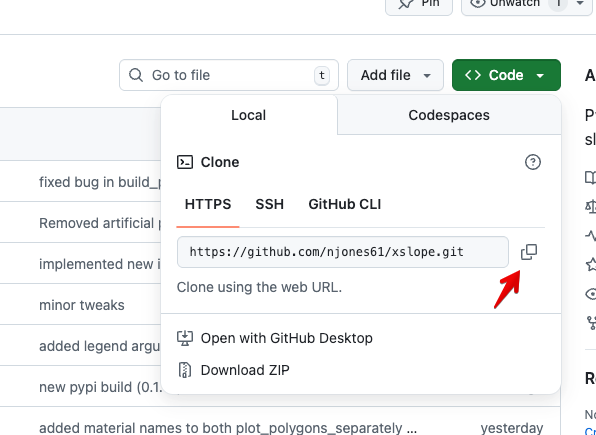

# Installation

XSLOPE is available on PyPI. If you intend to only run limit equilibrium problems, you can install xslope as follows:

```bash
pip install xslope
```

If you intend to peform either seepage analysis or slope stability using the finite element method, you will need to 
install xslope as follows:

```bash
apt-get update && apt-get install -y libgl1-mesa-glx libglu1-mesa # required by gmsh
pip install xslope[fem]==0.1.12
pip install gmsh
```
This installs the **gmsh** package as well, which is used for mesh generation in xslope.

After installing xslope, you can access the functions as follows:

```python
import xslope as xslope

from xslope.fileio import load_slope_data, print_dictionary
from xslope.mesh import build_polygons, build_mesh_from_polygons, export_mesh_to_json, import_mesh_from_json
from xslope.plot import plot_inputs, plot_mesh, plot_polygons, plot_polygons_separately
from xslope.plot_seep import plot_seep_data, plot_seep_solution
from xslope.seep import build_seep_data, run_seepage_analysis, save_seep_data_to_json, export_seep_solution
```

If you wish to access all of the underlying code in xslope, you can bypass PyPI and install directly from the 
repository:

[https://github.com/njones61/xslope/tree/main](https://github.com/njones61/xslope/tree/main)

To clone the repository, click on the green Code button and click the clipboard icon to copy the clone URL.



Then, in your terminal, navigate to the directory where you want to clone the repository and run the following 
command (you can either type the URL or paste it from the clipboard):

```bash
git clone https://github.com/njones61/xslope.git
```

You can also clone the repo directly into your IDE.

