# GeoStudio (SLOPE/W) Verification Corpus

The [GeoStudio slope stability verification manual](https://files.seequent.com/GeoStudio/Manuals/Slope%20Stability%20Verification%20Manual.pdf)
(Seequent) contains 47 two-dimensional verification problems solved with SLOPE/W. Most of them are the same
published benchmarks as the [Rocscience Slide2 corpus](rocscience.md), so a second commercial program's numbers
are available on those problems, and the manual's geometry figures are coordinate-labeled where Slide2's are
sometimes not. Where a problem coincides with a built Rocscience entry, the two pages cross-reference
each other and the same XSLOPE input file serves both.

XSLOPE's Janbu carries the f₀ correction; SLOPE/W's "Janbu" column is the uncorrected force solution, so those
columns are compared through the correction factor where noted.

Full bibliographic details for the author-year citations on this page are on the
shared [References](references.md) page.

**Status terms** follow the [shared definitions](rocscience.md) used across this
section; on this page *covered* means the same problem is built under the
[Rocscience corpus](rocscience.md), and the row links there.

**Completeness.** Where a section cannot be reproduced, the row records why. The one *no lock possible*
row (§2.10 Lanester) prints a measured loading-induced pressure grid with no flow field behind it, so no
seepage solution can regenerate it — a gap it shares with the Slide2 corpus. The one
*blocked* row (§2.47) needs a strength model XSLOPE does not have: a dip-relative
anisotropic/compound strength. Everything else is built and verified here or under the Rocscience build; the corpus is
complete relative to what is independently verifiable.

**Manual edition.** The manual tracked here is the **2025.2 edition**. Its 47
two-dimensional problems (chapter 2, "Verifications – 2D", §2.1–2.47) are carried
unchanged from the October 2022 edition, so the section numbering below is valid against
either. The 2025.2 edition also adds an 11-problem "Verifications – 3D" chapter
(§3.1–3.11) verifying SLOPE3D — ellipsoidal and wedge surfaces, 3D seismic and
piezometric cases, and the Kettleman Hills case history. XSLOPE is a 2D formulation, so
the 3D chapter is out of scope and not tracked here. The seven **SEEP/W** transient-seepage
examples (T01–T07) at the foot of the table come from GeoStudio's separate example library,
not from this manual.

**Match to the published value**

| Symbol | Meaning |
|---|---|
| 🟢 | within 3% of the vendor and/or reference figure |
| 🟡 | 3–6% |
| 🔴 | more than 6% |
| 🟣 | in progress |
| <span class="nodata">⊘</span> | insufficient data or out of scope |

The dot scores the **match quality of what is locked**, not how much of a problem is built — a partly built problem is scored on the stages that are built, and the partial/blocked detail is in the row text. Where a row reports several limit-equilibrium methods, the comparison behind the dot is XSLOPE's Spencer or Morgenstern-Price value against the published one, unless the source itself names a method — then that method is compared like-for-like. **Only same-method pairings derive a dot.** SLOPE/W's uncorrected Janbu force solution and XSLOPE's f₀-corrected Janbu are not the same quantity, so that pairing (and any other of ours-vs-theirs where the methods differ) is reported as information only and never governs a dot; where the source names a method XSLOPE does not run, the fallback is XSLOPE's Spencer or Morgenstern-Price against the source's headline value. A closed-form or theoretical value is a first-class reference authority in its own right — same-method logic does not apply to it — so where a problem has both, the dot takes the **best of the valid pairings**: same-method vendor/reference pairings and the theory anchor. Where XSLOPE and SLOPE/W each ran their *own* free search, the two searches are not an anchor for one another — the dot goes to the originating source's published value and, where the vendor's solved critical surface is stored in the model file, to the SLOPE/W value on that surface. A source's single headline factor of safety is its published answer and takes a delta whatever engine produced it — carrying a delta is a separate question from governing the dot; where the same source prints a per-method table, each value is read like any other column — same-method entries pair and carry a delta, cross-method entries stay bare. On the transient-seepage rows the compared quantity is total head rather than a factor of safety, and the dot scores the head agreement as a fraction of the problem's driving head.

<div class="corpus-summary match" markdown>

| # | Match | Problem | Results | Notes |
|---:|:-:|---|---|---|
| [2.1](#gs-2-1) | 🟢 | ACADS Simple Slope | Bishop 0.985 vs ACADS 1.00 (−1.5%) · vs Slide 0.987 (−0.2%) | **built** |
| [2.2](#gs-2-2) | 🟢 | ACADS Tension Crack | Bishop 1.589 vs Slide 1.596 (−0.4%) · M-P 1.586 vs Slide 1.592 (−0.4%) | **built**; SLOPE/W reads higher and sits closer to the ACADS band — tension-crack water handling and search |
| [2.3](#gs-2-3) | 🟢 | ACADS Non-Homogeneous | Bishop 1.403 vs SLOPE/W 1.414 (−0.8%) · M-P 1.371 vs SLOPE/W 1.382 (−0.8%) | **built** |
| [2.4](#gs-2-4) | 🟢 | ACADS Non-Homogeneous + Seismic | Bishop 1.013 vs SLOPE/W 1.02 (−0.7%) · M-P 0.987 vs SLOPE/W 0.989 (−0.2%) | **built** |
| [2.5](#gs-2-5) | 🟢 | ACADS Talbingo Dam – Dry | All methods (infinite-slope mechanism) 1.955 vs SLOPE/W 1.951 (+0.2%) | **built** |
| [2.6](#gs-2-6) | 🟢 | ACADS Talbingo – Specified Surface | Bishop 2.206 vs SLOPE/W 2.207 (0.0%) · M-P 2.299 vs SLOPE/W 2.299 (0.0%) | **built** |
| [2.7](#acads-weak-layer) | 🟢 | ACADS Weak Layer | M-P 1.248 vs SLOPE/W M-P 1.261 (−1.0%) · Spencer 1.258 vs ACADS ≈ 1.26 (−0.2%) | **built** |
| [2.8](#gs-2-8) | 🟢 | ACADS Weak Layer – Specified Surface | M-P 1.260 vs SLOPE/W 1.261 (−0.1%) | **built** |
| [2.9](#gs-2-9) | 🟢 | ACADS External Loading | Spencer 0.724 vs the ACADS published band 0.67–0.81 (inside) · corrected Janbu 0.718 (inside) | **built**; search-sensitive. SLOPE/W's own Bishop 0.699 and M-P 0.689 are cross-method beside XSLOPE's Spencer and stay bare |
| [2.10](#gs-2-10) | <span class="nodata">⊘</span> | Lanester Embankment | | *no lock possible* — measured pressures, with no flow field behind them |
| [2.11](#gs-2-11) | 🟢 | Arai & Tagyo Homogeneous | Bishop 1.404 vs SLOPE/W 1.417 (−0.9%) · M-P 1.400 vs SLOPE/W 1.414 (−1.0%) | **built** |
| [2.12](#gs-2-12) | 🟢 | Arai & Tagyo Pore-Water Pressure | Bishop 1.112 vs Arai & Tagyo's own Bishop 1.138 (−2.3%) · vs Slide 1.118 (−0.5%) | **built**; SLOPE/W is the outlier of the four sources |
| [2.13](#gs-2-13) | 🟢 | Greco Layered Slope | Circular Spencer 1.429 vs SLOPE/W M-P 1.389 (+2.9%) | **built**; sits just above the Greco reference range |
| [2.14](#gs-2-14) | 🟢 | Greco Weak Layer | Noncircular Spencer 1.082 vs Greco 1.08 (+0.2%) · vs SLOPE/W Spencer 1.054 (+2.7%) | **built** |
| [2.15](#gs-2-15) | 🟢 | Chen & Shao Frictionless Slope | Spencer 1.052 vs Chen & Shao 1.05 (+0.2%) · vs Slide 1.051 (+0.1%) | *covered* — [Slide2 VP25](rocscience.md#vp25) |
| [2.16](#gs-2-16) | 🟢 | Prandtl Bearing Capacity | Lowe & Karafiath 1.017 vs the closed-form 1.0 (+1.7%) · Spencer 1.043 vs the closed-form 1.0 (+4.3%) | *covered* — [Slide2 VP26](rocscience.md#vp26); XSLOPE's methods bracket the closed form (0.98–1.10) and the best of them sets the dot. The same file's SSRM solution returns ≈ 1.0, and SLOPE/W's own fully-specified M-P brackets the closed form from below |
| [2.17](rocscience.md#vp28) | 🟢 | [Chowdhury & Xu (1995)](https://doi.org/10.1016/0951-8320(94)00063-T), 5 examples | XSLOPE reproduces the ten cases on SLOPE/W's own imported circles, with Taylor σ_F within ≈ 1% of SLOPE/W's Monte Carlo | *covered* (3 of 10 cases built and reliability-tagged) |
| [2.18](#gs-2-18) | 🟢 | Borges & Cardoso Geosynthetic Emb. #2 | On SLOPE/W's own critical circle M-P 1.153 vs 1.171 (−1.5%) · vs Borges & Cardoso 1.15 (+0.3%) | **built** |
| [2.19](rocscience.md#vp32) | 🟢 | Borges & Cardoso Geosynthetic Emb. #3 | Two fill stages on SLOPE/W's own solves: 1.218 vs 1.229 (−0.9%) · 0.981 vs 0.972 (+0.9%) | *covered*; identical materials and geometry (verified to <1 cm), and the vendor reinforcement-friction difference (39.6° vs 31.0°) is immaterial — the fully-embedded bar develops its full 200 kN/m either way; also [RS2 #24](rs2.md#rs2-24) |
| [2.20](rocscience.md#vp33) | 🟢 | Probabilistic – Syncrude Dyke | Bishop 1.320 on Slide's circle vs Slide 1.305 (+1.1%) · vs El-Ramly et al. 1.31 (+0.8%) | *covered* (deterministic) |
| [2.21](rocscience.md#vp34) | 🟢 | Cannon Dam | M-P 2.384 vs Wolff & Harr 2.36 (+1.0%) · Spencer 2.423 vs Slide 2.383 (+1.7%) | *covered* |
| [2.22](#gs-2-22) | 🟢 | Cannon Dam #2 | All nine Hassan & Wolff fixed circles: Morgenstern-Price within 0.19% of SLOPE/W's own M-P · Bishop within 0.5% of Slide2 Table 35.2 on eight of nine · slice weight within 0.17% | **built** (nine fixed surfaces); the reliability side is *covered* under [Slide2 VP35](rocscience.md#vp35) |
| [2.23](#gs-2-23) | 🟢 | Li & Lumb – Reliability Index | Bishop 1.333 vs Hassan & Wolff 1.334 (−0.1%) · β_ln 2.263 vs Hassan & Wolff 2.336 (−3.1%) | **built**; SLOPE/W instead searches for the minimum β across surfaces, so its β and FS are not on this surface |
| [2.24](#gs-2-24) | 🟢 | Tandjiria – Geosynthetic Reinforced Emb. | On SLOPE/W's own circles the imported geosynthetic reproduces its factor of safety to −0.27% (clay) and −0.64% (sand) | **built**; the reinforcement benchmark for the importer |
| [2.25](#gs-2-25) | 🟢 | Baker & Leshchinsky – Earth Dam | On SLOPE/W's own solved circle Spencer 1.939 vs 1.934 (+0.3%) · on Slide's circle 1.926 vs Slide 1.925 (+0.1%) · on Baker's surface 1.882 vs Baker & Leshchinsky 1.91 (−1.5%) | *covered* — [Slide2 VP42](rocscience.md#vp42) |
| [2.26](#gs-2-26) | 🟢 | Baker – Planar Homogeneous | Spencer / Janbu 1.352 vs SLOPE/W's own solve of the identical toe plane 1.352 (0.0%) · vs Baker ≈ 1.35 (+0.1%) | **built**; the fixed crest offset controls the answer |
| [2.27](#gs-2-27) | 🟢 | Sheahan – Amherst Soil Nails | Janbu 0.899 vs Slide 0.890 (+1.0%) · vs Sheahan & Ho's trial wedge 0.887 (+1.4%) | *covered* — [Slide2 VP47](rocscience.md#vp47) |
| [2.28](rocscience.md#vp48) | 🟢 | Sheahan – Clouterre Test Wall | On the 55° plane Janbu 0.991 vs Slide 0.989 (+0.2%) · vs Sheahan 0.989 (+0.2%) | *covered* |
| [2.29](rocscience.md#vp49) | 🟢 | Snailz – Reinforced Slope | Janbu (corrected) 1.469 vs Slide 1.479 (−0.7%) | *covered* |
| [2.30](#gs-2-30) | 🟢 | Snailz – Geotextile Layers | M-P / Spencer 1.576 vs SLOPE/W M-P 1.606 (−1.9%) · Janbu (corrected) 1.448 vs SNAILZ 1.46 (−0.8%) | **built** |
| [2.31](#gs-2-31) | 🟢 | Zhu – Four Layer Slope | Spencer 1.294 vs SLOPE/W 1.299 (−0.4%) · M-P 1.304 vs SLOPE/W 1.310 (−0.5%) | **built**; wider spread on the Lowe and Corps side-force assumptions |
| [2.32](#gs-2-32) | 🟢 | Zhu & Lee – Heterogeneous Slope | Wet Spencer 1.189 vs Slide 1.189 (0.0%) | **built** |
| [2.33](#gs-2-33) | 🟢 | Priest – Rigid Blocks | M-P 1.049 vs SLOPE/W 1.049 (0.0%) · Janbu 1.049 vs Priest's hand calculation 1.049 (0.0%) | **built** |
| [2.34](#gs-2-34) | 🟢 | Yamagami – Stabilizing Piles | Unreinforced Bishop 1.100 vs SLOPE/W 1.102 (−0.2%) · with piles 1.185 vs Yamagami 1.20 (−1.3%) | **built**; pile-force conventions differ program to program |
| [2.35](#gs-2-35) | 🟢 | Pockoski & Duncan – Tie-Back Wall | Bishop 1.142 vs Slide 1.147 (−0.4%) · Spencer 1.140 vs Slide 1.145 (−0.4%) | *covered* — [Slide2 VP58](rocscience.md#vp58); the vendor model was saved unsolved, so the SLOPE/W value is the one Pockoski & Duncan themselves report |
| [2.36](#gs-2-36) | 🟢 | Pockoski & Duncan – Reinforcement | Janbu 0.579 vs SLOPE/W's own Janbu 0.575 (+0.7%) · Corps / Lowe 0.577 vs SLOPE/W's Lowe 0.587 (−1.7%) | *covered* — [Slide2 VP59](rocscience.md#vp59); under-designed, so every published factor of safety is below 1 |
| [2.37](#gs-2-37) | 🟢 | Pockoski & Duncan – Soil Nails | Spencer 1.010 vs SLOPE/W's own 1.000 (+1.0%) · vs Slide 1.009 (+0.1%) | *covered* — [Slide2 VP60](rocscience.md#vp60) |
| [2.38](#gs-2-38) | 🟢 | Loukidis – Seismic Coefficient | Spencer 1.001 in both cases vs SLOPE/W 1.00 (+0.1%) | **built** |
| [2.39](#gs-2-39) | 🟢 | Loukidis – Seismic Coefficient #2 | Spencer FS 1.001 at the paper's k꜀ = 0.155 vs Loukidis 1.000 (+0.1%) | *covered* — [Slide2 VP63](rocscience.md#vp63); the `critical_kc` harness also solves k꜀ directly, landing inside the paper's rigorous bracket |
| [2.40](#gs-2-40) | 🟢 | Rapid Drawdown – Walter Bouldin Dam | Spencer 1.046 vs the published DWW 1.04 (+0.6%) · vs SLOPE/W's Spencer 1.02 (+2.5%) | **built** (Duncan-Wright-Wong 3-stage) |
| [2.41](#gs-2-41) | 🟢 | Rapid Drawdown – USACE Benchmark | Spencer 1.434 vs the published 1.44 (−0.4%) · Bishop 1.432 vs 1.44 (−0.6%) | **built** (Duncan-Wright-Wong 3-stage, on the specified circle) |
| [2.42](#gs-2-42) | 🟢 | Rapid Drawdown – Pumped Storage Dam | Spencer 1.527 vs SLOPE/W 1.550 (−1.5%) · vs DWW 1.56 (−2.1%) | **built** (Duncan-Wright-Wong 3-stage) |
| [2.43](#gs-2-43) | 🟢 | Rapid Drawdown – Pilarcitos Dam | Spencer 1.044 vs Slide 1.043 (+0.1%) · vs DWW 1.05 (−0.6%) | **built** (Duncan-Wright-Wong 3-stage) |
| [2.44](rocscience.md#vp75) | 🟢 | Probability – James Bay Case History | Bishop free search 1.424 vs Duncan & Wright 1.45 (−1.8%) · vs SLOPE/W 1.46 (−2.5%) | *covered* (deterministic); probabilistic case *planned* — the 8 Bishop analyses are a pure spatial-averaging study differing *only* in a `SamplingDistance` (autocorrelation length): every-slice (0 m) / 30 / 40 / 50 / 80 / 100 m / none, over one set of plain σ's (marine-clay c σ = 8.14, lacustrine c σ = 8.65, fill γ and φ σ = 1). SLOPE/W's own results trace the variance-reduction curve directly: mean FS ≈ 1.46 throughout, **σ_F 0.065 → 0.215** and **PF 0 → 1.45%** as the averaging length grows. Only the "no spatial consideration" point-variance case (σ_F 0.215, PF 1.45%) is reproducible; the rest need the correlation-length treatment [Slide2 #33](rocscience.md#vp33) names |
| [2.45](#gs-2-45) | 🟢 | Eurocode 7 – Cutting in Clay | Spencer 1.173 vs SLOPE/W's Overdesign Factor 1.174 (−0.1%) · Bishop 1.172 vs 1.173 (−0.1%) | **built**; Design Approach 3 partial factors baked into the material |
| [2.46](#gs-2-46) | 🟢 | Eurocode 7 – Earth Dam | On SLOPE/W's own circle M-P 1.099 vs 1.101 (−0.2%) · Bishop free search 1.074 vs the Smith textbook's Bishop 1.07 (+0.4%) | **built**; DA1-C2 factors with pore pressures from XSLOPE's own finite-element seepage |
| [2.47](#gs-2-47) | <span class="nodata">⊘</span> | Compound Strength vs Anisotropic Function | | *blocked* — needs a dip-relative strength model |
| [T01](#seepw-t01) | 🟢 | SEEP/W – Simulating consolidation | Centre excess pore pressure within 0.02 kPa of the Terzaghi closed form at 25 / 50 / 75% consolidation (t = 150 / 604 / 1460 s; 9.96 / 7.78 / 3.95 kPa) — 0.2% of the 10 kPa initial excess | **built**; saturated storage S<sub>s</sub>, where SEEP/W's ten exponential time steps lag the closed form at late time |
| [T02](#seepw-t02) | 🟢 | SEEP/W – Infiltration into dry soil | Wetted zone behind the front within 0.05 m of SEEP/W head at t = 46 800 s (0.6% of the 8 m suction step) | **built**; unsaturated storage C(ψ) and van Genuchten–Mualem k<sub>r</sub>(ψ) — the mid-front crossing sits 0.04 m deeper than SEEP/W's (lumped- versus consistent-mass front diffusion) |
| [T03](#seepw-t03) | 🟢 | SEEP/W – Rapid drawdown | Interior total head tracks SEEP/W within 0.08–0.23 m through the 30-day drawdown (1.0–2.9% of the 8 m drawdown) | **built** (both drawdown rates); the reference column is sampled from SEEP/W's own solved `node.csv` field with the same probe used on XSLOPE's |
| [T04](#seepw-t04) | 🟡 | SEEP/W – Leakage from pond with clay liner | Interior head within 0.03–0.08 m of SEEP/W at the near-steady leaking state (≈1% of the 6.5 m pond head) · 0.13–0.24 m low mid-fill (3.6% at worst) | **built**; the residual is the filling *rate*, traced by measurement to the elastic *S*<sub>s</sub> being applied above the phreatic surface |
| [T05](#seepw-t05) | 🟢 | SEEP/W – Mineral heap leaching | Head within ~0.04 m of SEEP/W at the initial and early frames and ~0.12 m at the high-rate near-steady (0.5–1.5% of the 8 m column) | **built**; specified-flux (Neumann) top boundary on a gravity-drained unsaturated column |
| [T06](#seepw-t06) | <span class="nodata">⊘</span> | SEEP/W – Infiltration into multi-layered system | Two gates on the 14-layer infiltration leg: a measured, non-steady per-layer initial condition no steady solve returns, and a unit-gradient (free-drainage) base boundary that is not in the solver's boundary-condition set. The drainage leg is hysteretic, and XSLOPE carries one retention curve per material. | *blocked* |
| [T07](#seepw-t07) | 🟢 | SEEP/W – GeoStudio-PEST Multistep Outflow | Column total head −0.093 / −0.134 / −0.175 m at the three stages, reproducing SEEP/W's −0.07 … −0.22 m pressure field to the published read-off precision | **built**; stepped base suction through a time-varying head (plain-Dirichlet) series |

</div>

---

## The published SLOPE/W models

Most entries are built by transcribing the manual's geometry figures. Seequent also publishes the **models**
behind the manual, not just the figures, on a public CDN — no login, no license:

```
https://files.seequent.com/GeoStudio/SlopeW/<Manual Section Name>.gsz
```

Confirmed for e.g. [ACADS Simple Slope](https://files.seequent.com/GeoStudio/SlopeW/ACADS%20Simple%20Slope.gsz),
[ACADS External Load](https://files.seequent.com/GeoStudio/SlopeW/ACADS%20External%20Load.gsz),
[Prandtl Bearing Capacity](https://files.seequent.com/GeoStudio/SlopeW/Prandtl%20Bearing%20Capacity.gsz),
[Tandjiria Geosynthetic Reinforced Embankment](https://files.seequent.com/GeoStudio/SlopeW/Tandjiria%20Geosynthetic%20Reinforced%20Embankment.gsz),
[Sheahan Amhearst Soil Nails](https://files.seequent.com/GeoStudio/SlopeW/Sheahan%20Amhearst%20Soil%20Nails.gsz) and
[Cannon Dam](https://files.seequent.com/GeoStudio/SlopeW/Cannon%20Dam.gsz).

XSLOPE reads them directly — see [GeoStudio Import/Export](../usage/geostudio.md) — so a problem's exact geometry
and material properties are available without transcribing a figure:

```python
from xslope.geostudio import read_gsz, list_analyses, gsz_to_slope_data

gsz = read_gsz("ACADS Simple Slope.gsz")
for a in list_analyses(gsz):
    print(a["id"], a["name"], a["method"])

slope_data, caveats = gsz_to_slope_data(gsz, analysis_id=1)
```

A **solved** `.gsz` also records SLOPE/W's factor of safety for *every trial surface it evaluated*, not just
the critical one — several hundred per analysis — along with the weight of each sliding mass. XSLOPE can
therefore be run on the *identical* surfaces and the two programs compared with the search held fixed.
See [Importer verification](#importer-verification) below.

!!! note "The model files are Seequent's, and stay Seequent's"
    The `.gsz` files are Seequent's copyrighted material. XSLOPE links to them and reads them; it does not
    redistribute them, and none are stored in this repository. To reproduce this work, download them from the
    links above. The XSLOPE `.xlsx` inputs derived from the published problem data are XSLOPE's own and are
    published here.

## Importer verification {#importer-verification}

Verifying the importer is a separate exercise from verifying the solver. A `.gsz` read back through XSLOPE's own
reader tests nothing that matters: a reader and a writer that share one interpretation of the schema agree with
each other whatever the schema actually says. The importer is therefore scored against **SLOPE/W's own answers** —
import the model, re-solve every trial circle SLOPE/W saved, and compare with the surface and the method held
fixed. The check is `tools/gsz_corpus.py`, which takes a path to a local folder of `.gsz` files (they are not
redistributable, so they are not in the repository).

Two numbers are reported per analysis:

- **weight** — XSLOPE's sliding mass against the weight SLOPE/W recorded for the same surface. This tests the
  imported polygons, the material assignment and the unit weights **with the solver taken out of the way**.
- **FS** — the whole model: strengths, pore pressure, loads, cracks, reinforcement.

An error in the imported geometry moves both; an error in strength, pore pressure or loads moves only the second.

**Importer conformance scorecard** — XSLOPE re-solved on SLOPE/W's own saved trial surfaces:

| Model | Analysis | Surfaces | Weight | FS | Within 1% |
|---|---|---:|---:|---:|---:|
| [ACADS Simple Slope](#gs-2-1) | a. simple slope | 355 | +0.19% | −0.10% | 91% |
| [ACADS Simple Slope](#gs-2-1) | b. tension crack | 152 | +0.15% | −0.12% | 100% |
| [ACADS External Load](#gs-2-9) | a. base case | 116 | +0.03% | +0.50% | 70% |
| [Tandjiria](#gs-2-24) | Clay – circular | 210 | +0.11% | −0.10% | 100% |
| [Tandjiria](#gs-2-24) | Sand – circular | 338 | +0.19% | −0.07% | 99% |
| [Tandjiria](#gs-2-24) | Clay – circular – **reinforced** | 1 | +0.17% | −0.27% | 100% |
| [Tandjiria](#gs-2-24) | Sand – circular – **reinforced** | 1 | +0.45% | −0.64% | 100% |
| [Rapid drawdown](#seepw-t03) | 2a – after rapid drawdown (SEEP/W) | 2576 | +0.16% | −0.13% | 98% |
| [Rapid drawdown](#seepw-t03) | 3a – during slow drawdown (SEEP/W) | 2536 | +0.15% | −0.11% | 97% |

**All 9 scorable analyses agree with SLOPE/W to within 1%** (median 0.12%) over 6285 slip surfaces. Every model's
geometry and unit weights import correctly too — the weight column never exceeds +0.5% anywhere.

The two drawdown analyses are the SEEP/W-coupled ones, and they are scored at **every one of their 11 saved time
steps**, against the pore-pressure field and the trial surfaces SLOPE/W solved at that step. Both the
[SEEP/W head field and the reservoir it implies](../usage/geostudio.md#pore-pressure-from-a-seepw-analysis)
are imported for these analyses.

Non-circular analyses are reported as not comparable rather than scored. SLOPE/W writes a centre and a radius even
for a block or fully-specified surface, but that circle is *fitted* to the surface, not the surface it solved —
rebuilding it as a circle silently scores the wrong geometry, an apparent −26% error that is an artifact of the
fitted circle.

??? note "Five `.gsz` conventions that change the answer"
    Each of these is silent if it is read wrongly — the model still solves, at a different factor of safety:

    - **Piezometric surfaces index the analysis's *local* point list**, not the shared geometry `<Points>` table.
      Read against the geometry, one model's water table doubles back on itself and the pore pressures come out
      low: **FS +9.7%**. Cannon Dam's water table lands 6 m low and slopes the wrong way. Writing a `.gsz` takes
      the mirror-image convention.
    - **A tension crack is switched off by *dropping* `<TensionOption>`** — GeoStudio keeps the crack's geometry
      regardless. Read as a live crack, the leftover points put a 2 m water-filled crack into models that have
      none: invisible in the φ=0 clay analyses (pore pressure cannot touch an undrained strength) and worth
      **−2%** in the c′=0 sand ones.
    - **A surcharge's `<Pressure>` is a *unit weight*.** The load is the weight of the fill between the drawn line
      and the ground, so it varies with depth rather than acting as a uniform pressure. Worth **+4%**. The two
      readings coincide only where the fill is exactly 1 m deep.
    - **Reinforcement acts along the bar (axial), not tangent to the slip surface.** Axial reproduces SLOPE/W to
      0.2% on Tandjiria's reinforced clay, where tangent does not converge at all.
    - **SLOPE/W derives the reservoir from the SEEP/W head field.** A SEEP/W-coupled analysis records **no water
      surface anywhere** and still loads the submerged face: water stands to `y + u/γ_w` at the ground surface.
      That rule reproduces SLOPE/W's own per-slice surcharge forces at every time step of the drawdown example,
      receding 627 → 566 → 480 → 363 → 217 → 67 → 0 kN and vanishing at exactly the step SLOPE/W's does. The
      reservoir and the pore pressures together are worth **−13.2%**, and most of that is the reservoir rather
      than the pressures.

## Problem details

### 2.1 — ACADS Simple Slope {#gs-2-1}

The headline ACADS limit-equilibrium benchmark: a simple homogeneous 2:1 slope analyzed with a circular search against the ACADS accepted consensus.

**Input:** [xslope_acads_simple.xlsx](../lem/files/xslope_acads_simple.xlsx) · **Rocscience detail:** [VP1](rocscience.md#vp1)

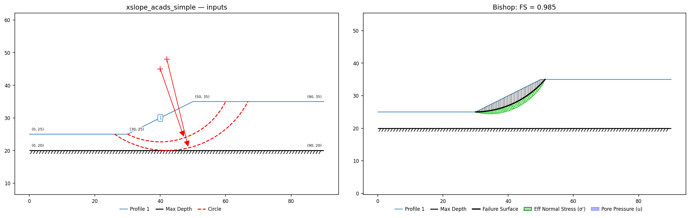

| Method | XSLOPE | SLOPE/W | Slide | ACADS |
|---|---|---|---|---|
| Bishop | 0.985 | 0.963 (+2.3%) | 0.987 (−0.2%) | 1.00 (−1.5%) |

XSLOPE's Bishop FOS (0.985) matches Slide (0.987) and sits close to the ACADS consensus of 1.00, and reads slightly above SLOPE/W (0.963).

**Sources:** GeoStudio SLOPE/W Verification Manual §2.1; Donald & Giam (1989), Giam & Donald (1992).

### 2.2 — ACADS Tension Crack {#gs-2-2}

ACADS problem 1(b): a homogeneous slope with a water-filled tension crack, verifying tension-crack handling in the limit-equilibrium solution.

**Input:** [vp002.xlsx](files/rocscience/vp002.xlsx) · **Rocscience detail:** [VP2](rocscience.md#vp2)

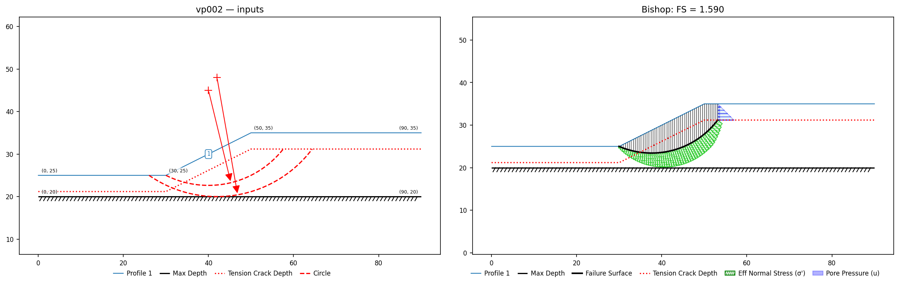

| Method | XSLOPE | SLOPE/W | Slide | ACADS band |
|---|---|---|---|---|
| Bishop | 1.589 | 1.664 (−4.5%) | 1.596 (−0.4%) | 1.65–1.70 |
| Morgenstern-Price | 1.586 | 1.660 (−4.5%) | 1.592 (−0.4%) | 1.65–1.70 |

SLOPE/W sits closer to the ACADS reference band than XSLOPE or Slide2; the difference traces to tension-crack water handling and search.

**Sources:** GeoStudio SLOPE/W Verification Manual §2.2; Giam & Donald (1989).

### 2.3 — ACADS Non-Homogeneous {#gs-2-3}

ACADS benchmark 1(c): a non-homogeneous three-layer slope analyzed for its critical circular surface.

**Input:** [vp003.xlsx](files/rocscience/vp003.xlsx) · **Rocscience detail:** [VP3](rocscience.md#vp3)

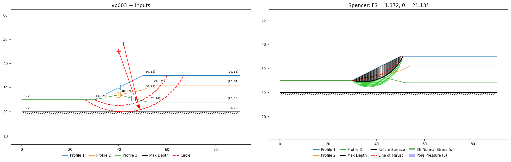

| Method | XSLOPE | SLOPE/W | ACADS |
|---|---|---|---|
| Bishop | 1.403 | 1.414 (−0.8%) | 1.39 (+0.9%) |
| Morgenstern-Price | 1.371 | 1.382 (−0.8%) | 1.39 (−1.4%) |

XSLOPE agrees with SLOPE/W to within about 1% for both methods and brackets the ACADS consensus reference of 1.39.

**Sources:** GeoStudio SLOPE/W Verification Manual §2.3; Donald, I.B. & Giam, P. (1989), ACADS.

### 2.4 — ACADS Non-Homogeneous + Seismic {#gs-2-4}

ACADS 1(d): the three-material non-homogeneous slope of §2.3 with a horizontal pseudo-static seismic coefficient of 0.15 added, verifying seismic loading over layered strengths.

**Input:** [vp004.xlsx](files/rocscience/vp004.xlsx) · **Rocscience detail:** [VP4](rocscience.md#vp4)

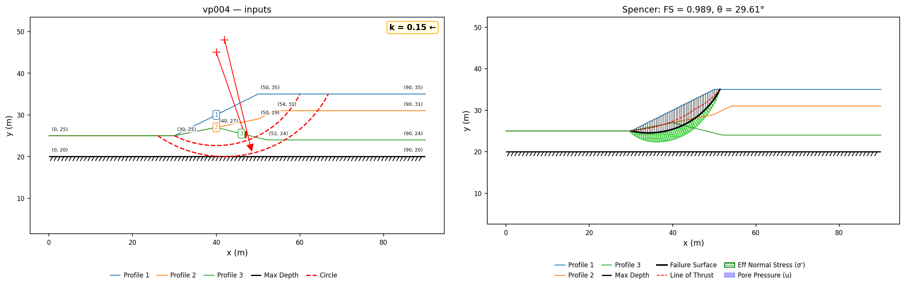

| Method | XSLOPE | SLOPE/W | ACADS |
|---|---|---|---|
| Bishop | 1.013 | 1.02 (−0.7%) | 1.00 (+1.3%) |
| Morgenstern-Price | 0.987 | 0.989 (−0.2%) | 1.00 (−1.3%) |

XSLOPE's Bishop (1.013) and Morgenstern-Price (0.987) bracket the ACADS consensus of 1.00 and agree with SLOPE/W to within ~1%.

**Sources:** GeoStudio SLOPE/W Verification Manual §2.4; Donald, I.B. & Giam, P. (1989), ACADS suite.

### 2.5 — ACADS Talbingo Dam – Dry {#gs-2-5}

ACADS benchmark 2(a): the four-zone Talbingo Dam at end of construction (dry), searched for the critical circular surface, whose minimum collapses to a shallow infinite-slope mechanism parallel to the steeper upstream face.

**Input:** [vp005.xlsx](files/rocscience/vp005.xlsx) · **Rocscience detail:** [VP5](rocscience.md#vp5)

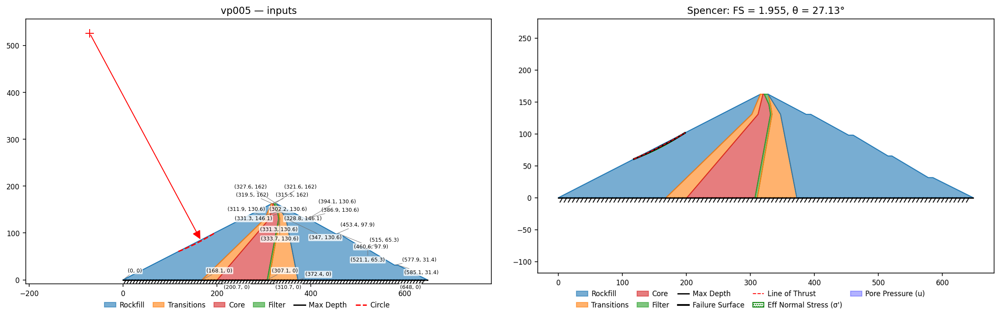

| Method | XSLOPE | SLOPE/W | Reference |
|---|---|---|---|
| All methods (infinite-slope mechanism) | 1.955 | 1.951 (+0.2%) | — |

Because the critical mechanism is the infinite-slope limit, every method converges to the same XSLOPE factor of safety of 1.955, in close agreement with SLOPE/W's 1.951.

**Sources:** GeoStudio SLOPE/W Verification Manual §2.5; Giam & Donald (1989), ACADS benchmark 2(a).

### 2.6 — ACADS Talbingo – Specified Surface {#gs-2-6}

ACADS benchmark 2(b): the Talbingo Dam, a four-material embankment evaluated on a single specified circular slip surface, verifying that XSLOPE and SLOPE/W agree on a fixed surface.

**Input:** [vp006.xlsx](files/rocscience/vp006.xlsx) · **Rocscience detail:** [VP6](rocscience.md#vp6)

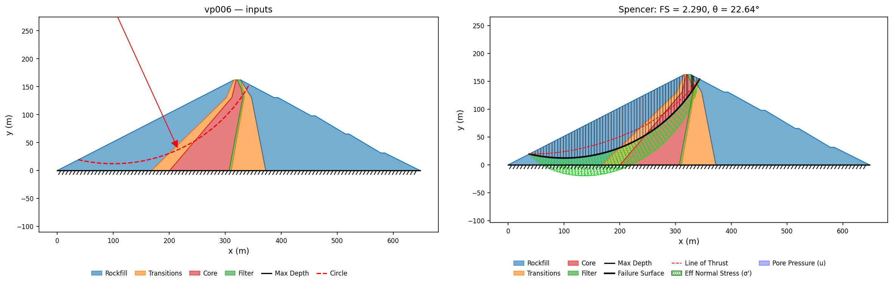

| Method | XSLOPE | SLOPE/W | Reference |
|---|---|---|---|
| Bishop | 2.206 | 2.207 (0.0%) | — |
| Morgenstern-Price | 2.299 | 2.299 (0.0%) | — |

XSLOPE and SLOPE/W match essentially exactly: Bishop 2.206 vs 2.207 and Morgenstern-Price 2.299 vs 2.299.

**Sources:** GeoStudio SLOPE/W Verification Manual §2.6; ACADS benchmark (Giam & Donald).

### 2.7 — ACADS Weak Layer (non-circular) {#acads-weak-layer}

The ACADS weak-layer case
([SLOPE/W Verification Manual](https://files.seequent.com/GeoStudio/Manuals/Slope%20Stability%20Verification%20Manual.pdf)
sec. 2.7): a 2:1 slope
crossed by a thin low-strength interlayer with a piezometric line at its base.
The critical surface is non-circular, sliding along the weak layer with a back
scarp to the crest — this is the non-circular search verification test, scored
against the ACADS accepted band.

| Property | Soil 1 | Weak layer |
|---|---|---|
| Cohesion, $c'$ (kPa) | 28.5 | 0 |
| Friction angle, $\phi'$ | 20° | 10° |
| Unit weight, $\gamma$ (kN/m³) | 18.84 | 18.84 |

Excel input file: [xslope_acads_weak_layer.xlsx](../lem/files/xslope_acads_weak_layer.xlsx) ·
**Rocscience detail:** [Slide2 #7](rocscience.md) · **LEM sample:**
[non-circular failure surface](../lem/samples.md#7-non-circular-failure-surface)

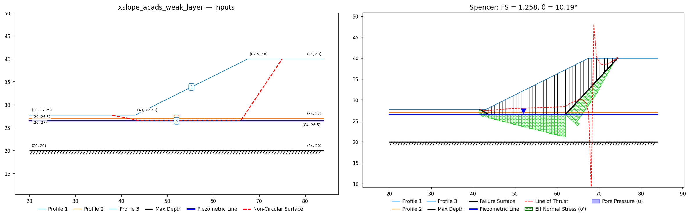

Results for the methods applicable to non-circular surfaces:

| Method | XSLOPE FOS | SLOPE/W | ACADS reference | Note |
|---|---|---|---|---|
| Spencer | 1.258 | — | ~1.26 (−0.2%) | — |
| Morgenstern-Price | 1.248 | 1.261 (−1.0%) | ~1.26 (−1.0%) | SLOPE/W's Bishop on this problem reads 1.269 |
| Corps of Engineers | 1.336 | — | ~1.26 (+6.0%) | — |
| Lowe & Karafiath | 1.249 | — | ~1.26 (−0.9%) | — |
| Simplified Janbu | 1.278 | — | ~1.26 (+1.4%) | — |

The two interior surface points are seeded just above the base of the weak
layer (base $y=26.5$, top $y=27.0$). Because the non-circular search moves
``Horiz`` points horizontally only, that seed elevation *is* the sliding plane:
placing it near the base of a weak interlayer is standard practice and matches
the reference, whereas seeding it at the layer center biases the factor of
safety roughly 1.5% high. With the base placement, XSLOPE's complete-equilibrium
methods land within ~1% of SLOPE/W's Morgenstern-Price value (1.261): Spencer at
1.258 (−0.2%) and Morgenstern-Price (half-sine) at 1.248 (−1.0%). Corps of
Engineers reads modestly
high here, consistent with ground-parallel side-force inclinations on a surface
with a steep back scarp (XSLOPE uses the standard "Corps #2" convention — see
[Force Equilibrium Methods](../lem/force_eq.md)).

**Sources:** GeoStudio [SLOPE/W Verification Manual](https://files.seequent.com/GeoStudio/Manuals/Slope%20Stability%20Verification%20Manual.pdf),
sec. 2.7; Donald, I.B. & Giam, P. (1989), ACADS.

<!-- fs-table -->
**Factor of safety by method** (each method's own critical surface):

| OMS | Bishop | Janbu | Corps | Lowe | Spencer | M-P |
|---:|---:|---:|---:|---:|---:|---:|
| — | — | 1.278 | 1.336 | 1.249 | 1.258 | 1.248 |
<!-- /fs-table -->

<!-- test: file=../lem/files/xslope_acads_weak_layer.xlsx, type=noncircular_search, num_slices=50, fs_janbu=1.278, fs_corps=1.336, fs_lowe=1.249, fs_spencer=1.258, fs_mprice=1.248, benchmark=LEM-2 -->

### 2.8 — ACADS Weak Layer – Specified Surface {#gs-2-8}

The ACADS 3(b) weak-layer slope analyzed on a fully specified non-circular slip surface, verifying XSLOPE against SLOPE/W for a two-material section with a thin weak seam.

**Input:** [vp008.xlsx](files/rocscience/vp008.xlsx) · **Rocscience detail:** [VP8](rocscience.md#vp8)

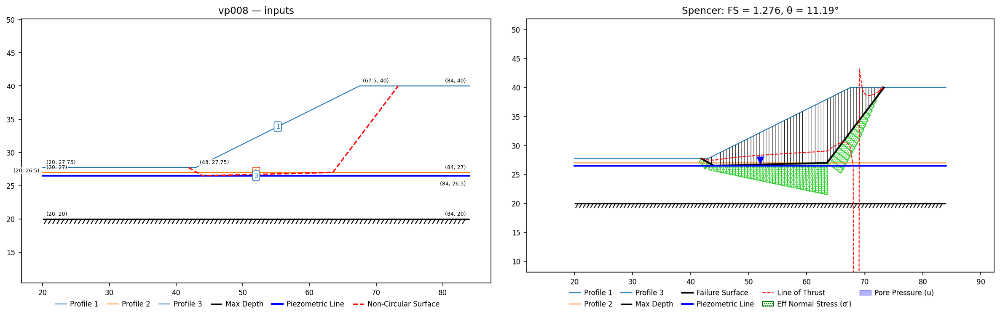

| Method | XSLOPE | SLOPE/W | Note |
|---|---|---|---|
| Morgenstern-Price | 1.260 | 1.261 (−0.1%) | — |
| Janbu (corrected) | 1.294 | — | SLOPE/W's uncorrected force solution 1.197 (×fo ≈ 1.29) — not a same-method pairing |

XSLOPE's Morgenstern-Price matches SLOPE/W's M-P essentially exactly (1.260 vs 1.261); XSLOPE's corrected Janbu (1.294) reproduces SLOPE/W's uncorrected force solution (1.197) once the Janbu fo correction (×fo ≈ 1.29) is applied.

**Sources:** GeoStudio SLOPE/W Verification Manual §2.8; Donald, I.B. & Giam, P. (1989), *Soil slope stability programs review*, ACADS, Melbourne.

### 2.9 — ACADS External Loading {#gs-2-9}

The ACADS benchmark (Slide #9): a two-material slope with a weak layer, a piezometric water table, and two surcharge strips, solved with a non-circular search.

**Input:** [vp009.xlsx](files/rocscience/vp009.xlsx) · **Rocscience detail:** [VP9](rocscience.md#vp9)

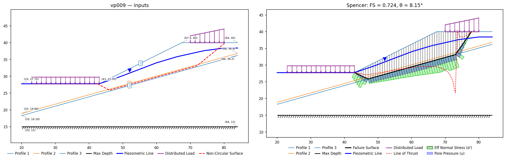

| Method | XSLOPE | SLOPE/W | Published band |
|---|---|---|---|
| Spencer | 0.724 | — | 0.67–0.81 |
| Janbu (corrected) | 0.718 | — | 0.67–0.81 |
| Bishop | — | 0.699 | 0.67–0.81 |
| Morgenstern-Price | — | 0.689 | 0.67–0.81 |

This is a search-sensitive benchmark with a wide published spread; XSLOPE's Spencer (0.724) and corrected Janbu (0.718) sit just above the SLOPE/W Bishop (0.699) and Morgenstern-Price (0.689) values, with all four results falling inside the published band. No pairing is like-for-like — XSLOPE's converging methods here are Spencer and Janbu, the manual's are Bishop and Morgenstern-Price — so the columns stand side by side without a delta.

**Sources:** GeoStudio SLOPE/W Verification Manual §2.9; ACADS benchmark study (Giam & Donald).

### 2.10 — Lanester Embankment {#gs-2-10}

A test embankment built on soft ground, with the manual supplying pore pressures as a
grid of point values across the section rather than as a water table.

That grid is what closes the problem to verification. Its values are **measured
loading-induced pressures** — the excess pore pressure generated in the soft foundation
by placing the fill, recorded by piezometers as construction proceeded — not a steady
flow field. No seepage solution reproduces them: they are a record of how fast the
foundation drained under load, which depends on the fill schedule and the foundation's
consolidation properties, and they decay with time toward a very different long-term
state.

XSLOPE takes water into a limit-equilibrium analysis in one of four ways, set by the
material's `u` option: no pore pressure, a piezometric line, a pore-pressure ratio
r<sub>u</sub>, or a finite-element seepage solution carried in mesh and solution
sidecars. Every one of those is a *model* of the pressure field, which is the point —
the analysis states where the water is and the solver derives the pressures. A grid of
measured point values is none of them, and transcribing one back through an interpolator
would only re-read the manual's own numbers; it would verify nothing about XSLOPE. The
row is therefore recorded as no lock possible rather than blocked: nothing in XSLOPE is
missing, and the problem simply has no independently reproducible pore-pressure field
behind it.

Same problem as [Slide2 #12](rocscience.md), which is open for the same reason.

**Sources:** GeoStudio SLOPE/W Verification Manual §2.10.

### 2.11 — Arai & Tagyo Homogeneous {#gs-2-11}

A homogeneous 20 m, 1.5:1 slope in total-stress soil (Arai & Tagyo 1985, example 1), used to verify the automated critical-circle search against SLOPE/W and the published reference.

**Input:** [xslope_arai_tagyo.xlsx](../lem/files/xslope_arai_tagyo.xlsx) · **Rocscience detail:** [VP14](rocscience.md#vp14)

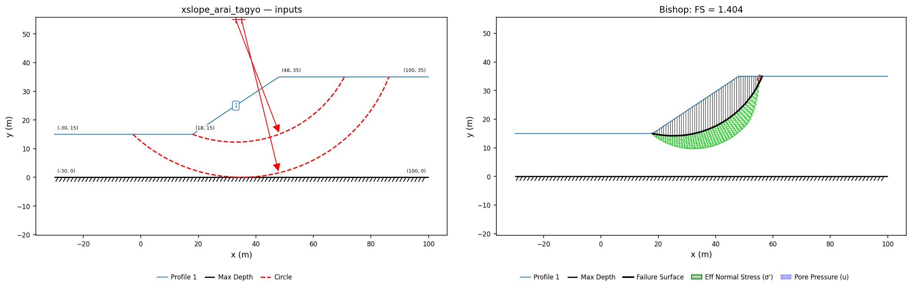

| Method | XSLOPE | SLOPE/W | Arai & Tagyo |
|---|---|---|---|
| Bishop's Simplified | 1.404 | 1.417 (−0.9%) | 1.451 (−3.2%) |
| Morgenstern-Price | 1.400 | 1.414 (−1.0%) | 1.451 (−3.5%) |

XSLOPE's Bishop (1.404) and Morgenstern-Price (1.400) sit 0.9% below SLOPE/W's, and the two programs together sit modestly below the Arai & Tagyo reference of 1.451. The full six-method set for this shared input is tabulated with [VP14](rocscience.md#vp14).

**Sources:** GeoStudio SLOPE/W Verification Manual §2.11; [Arai & Tagyo (1985)](https://doi.org/10.3208/sandf1972.25.43).

### 2.12 — Arai & Tagyo Pore-Water Pressure {#gs-2-12}

Arai & Tagyo (1985) example 3: a homogeneous slope with a water table, verifying pore-water pressure handling on a circular search.

**Input:** [vp016.xlsx](files/rocscience/vp016.xlsx) · **Rocscience detail:** [VP16](rocscience.md#vp16)

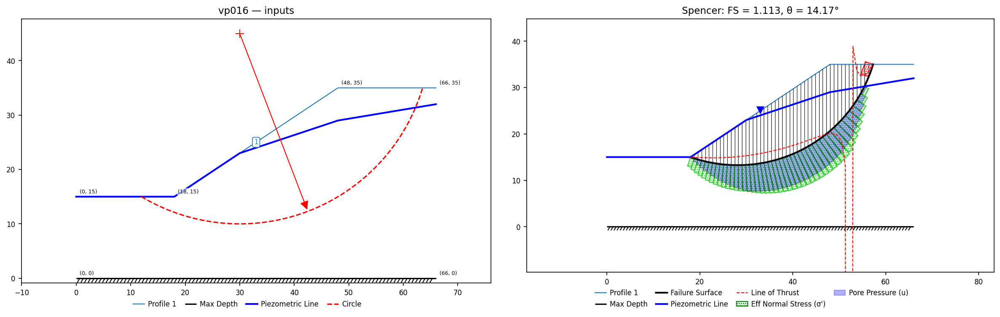

| Method | XSLOPE | SLOPE/W | Slide | Arai & Tagyo | Note |
|---|---|---|---|---|---|
| Bishop | 1.112 | 1.190 (−6.6%) | 1.118 (−0.5%) | 1.138 (−2.3%) | Arai & Tagyo's own Bishop is the originating reference; SLOPE/W is the outlier of the four sources |

XSLOPE's Bishop 1.112 agrees closely with Slide 1.118 and the Arai & Tagyo reference 1.138; SLOPE/W's 1.190 is the outlier of the four sources.

**Sources:** GeoStudio SLOPE/W Verification Manual §2.12; Arai & Tagyo (1985).

### 2.13 — Greco Layered Slope {#gs-2-13}

A four-layer slope with no water (Greco 1996, example 4 / Yamagami & Ueta 1988), verifying the critical-surface search against a shallow non-circular benchmark optimum.

**Input:** [vp019.xlsx](files/rocscience/vp019.xlsx) · **Rocscience detail:** [VP19](rocscience.md#vp19)

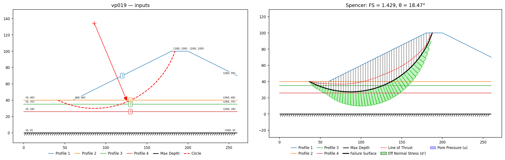

| Method | XSLOPE | SLOPE/W | Greco |
|---|---|---|---|
| Spencer / M-P | 1.429 | 1.389 (+2.9%) | 1.40–1.42 |

XSLOPE's circular Spencer (1.429) sits just above the Greco reference range (1.40–1.42) and 2.9% above SLOPE/W's Morgenstern-Price solution (1.389).

**Sources:** GeoStudio SLOPE/W Verification Manual §2.13; [Greco (1996)](https://doi.org/10.1061/(ASCE)0733-9410(1996)122:7(517)), [Yamagami & Ueta (1988)](https://doi.org/10.1201/9781003763291-97).

### 2.14 — Greco Weak Layer {#gs-2-14}

A four-layer slope with a 0.5 m weak seam running along the inclined model base beneath a water table, verifying the search for a noncircular slip surface through a weak layer.

**Input:** [vp020.xlsx](files/rocscience/vp020.xlsx) · **Rocscience detail:** [VP20](rocscience.md#vp20)

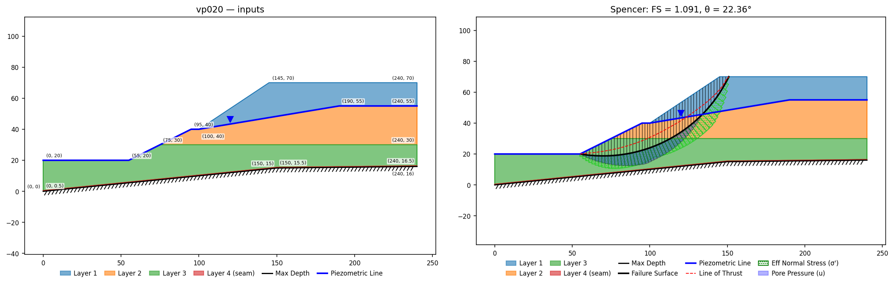

| Method | XSLOPE | SLOPE/W | Greco |
|---|---|---|---|
| Spencer (noncircular) | 1.082 | 1.054 (+2.7%) | 1.08 (+0.2%) |
| Spencer (circular) | 1.091 | — | — |

XSLOPE's noncircular Spencer solution (1.082) matches the published Greco value (1.08) and runs slightly above SLOPE/W's Spencer result (1.054); the circular Spencer surface gives a marginally higher 1.091.

**Sources:** GeoStudio SLOPE/W Verification Manual §2.14; Greco (1996) ex. 5; [Chen & Shao (1988)](https://doi.org/10.1139/t88-084).

### 2.15 — Chen & Shao Frictionless Slope {#gs-2-15}

The classical Prandtl bearing mechanism on a weightless, frictionless 60° slope under a critical strip load, verifying limit equilibrium against the closed-form factor of safety on an analytically constructed slip surface.

**Input:** [vp025.xlsx](files/rocscience/vp025.xlsx) · **Rocscience detail:** [VP25](rocscience.md#vp25)

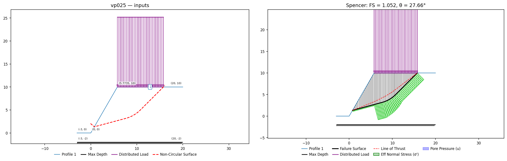

| Method | XSLOPE | SLOPE/W | Slide | Theory |
|---|---|---|---|---|
| Spencer | 1.052 | 1.036 (+1.5%) | 1.051 (+0.1%) | 1.0 (+5.2%) |

XSLOPE's Spencer FS of 1.052 matches Slide (1.051) and sits just above SLOPE/W (1.036), all close to the theoretical value of 1.0 for this frictionless mechanism.

**Sources:** GeoStudio SLOPE/W Verification Manual §2.15; Chen & Shao (1988).

### 2.16 — Prandtl Bearing Capacity {#gs-2-16}

The classical Prandtl bearing mechanism on level ground: a weightless (γ ≈ 0), c = 20 kPa, φ = 0 soil under a strip surcharge of 102.83 kPa — exactly c·N<sub>c</sub>, so the closed-form factor of safety is unity by construction. Both ground crossings of the slip surface sit at the same elevation, which leaves the facing direction ambiguous; the `right_facing` override settles it, so the surface — an active wedge, a log-spiral/circular fan, and a passive wedge — solves cleanly.

The SLOPE/W model carries the comparison directly: its "Fully Specified" analysis solves the identical, non-circular Prandtl surface with Morgenstern-Price, and that factor of safety — tabulated below — is read from the model's saved results with `read_gsz_results`. It is quoted rather than re-solved, because the `.gsz` importer does not rebuild a fully-specified (non-circular) surface into an XSLOPE slip surface.

**Input:** [vp026.xlsx](files/rocscience/vp026.xlsx) · **Rocscience detail:** [VP26](rocscience.md#vp26)

| Method | XSLOPE | SLOPE/W | Slide2 | Theory | Note |
|---|---|---|---|---|---|
| Spencer | 1.043 | 0.960* (+8.6%) | 0.941 (+10.8%) | 1.0 (+4.3%) | the closed form is the governing anchor |

\* SLOPE/W's own Morgenstern-Price solution on its fully-specified surface, not an XSLOPE re-solve — see above.

XSLOPE's Spencer (1.043) and SLOPE/W's own Morgenstern-Price (0.960) bracket the theoretical FS of 1.0 from
opposite sides, about 4% apart each way — the same interslice-convention spread that separates XSLOPE's
Spencer from Slide2's (0.941).

**Sources:** GeoStudio SLOPE/W Verification Manual §2.16; [Prandtl (1921)](https://doi.org/10.1002/zamm.19210010102).

### 2.18 — Borges & Cardoso – Geosynthetic Embankment #2 {#gs-2-18}

[Borges & Cardoso (2002)](https://doi.org/10.1016/S0266-1144(02)00014-6)'s Case 2: a 5 m geosynthetic-reinforced embankment (c′ = 0,
φ′ = 35°, γ = 20) over four soft-clay layers whose undrained strength increases with
depth. The two deeper clays are GeoStudio "Su-varies-with-depth" (SFnDepth) materials,
which map exactly onto XSLOPE's `cp` option (Su = c + cp·max(0, r_elev − y)): Clay 3 is
16 + 0.96·z and Clay 4 is 18.4 + 1.314·z below their layer tops (the mapped rates
reproduce the manual's printed layer-bottom strengths to the digit). The geosynthetic
(Tmax = 200 kN/m, interface friction 33.7°, unanchored) is laid at y = 1.0 across the
embankment base as an axial geosynthetic; on the critical surface it is fully embedded,
so the full 200 kN/m develops and the factor of safety is insensitive to the bond
length. This is also [Slide2 VP31](rocscience.md), the same Borges & Cardoso Case 2 with
materials matching to rounding. The full geometry is written by
`benchmarks/geostudio/build_gs2_18.py`.

**Input:** [gs2_18.xlsx](files/geostudio/gs2_18.xlsx)

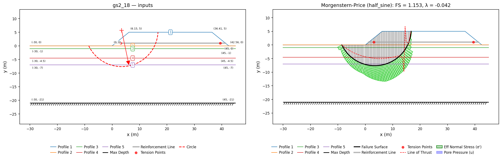

| Method | XSLOPE | SLOPE/W | Borges & Cardoso | Note |
|---|---|---|---|---|
| Morgenstern-Price | 1.153 | 1.171 (−1.5%) | 1.15 (+0.3%) | — |
| Bishop | 1.154 | 1.170 (−1.4%) | — | — |
| Janbu | 1.327 | 1.233 | — | XSLOPE's f₀-corrected value against the manual's uncorrected Janbu column — not a same-method pairing |
| Morgenstern-Price, geosynthetic removed | 1.011 | — | — | the reinforcement carries a large share of the resistance |

Run on SLOPE/W's own critical circle (which a grid search confirms is also XSLOPE's
critical), XSLOPE's Morgenstern-Price 1.153 sits 1.5% below SLOPE/W's 1.171 and 0.3%
above the Borges & Cardoso (2002) published 1.15; Bishop tracks at −1.4%. Janbu is
higher because XSLOPE reports the f₀-corrected value where the manual's Janbu column is
uncorrected.

**Sources:** GeoStudio SLOPE/W Verification Manual §2.18; Borges & Cardoso (2002).

<!-- test: file=files/geostudio/gs2_18.xlsx, type=single_circle, num_slices=60, fs_bishop=1.155, fs_spencer=1.148, fs_mprice=1.153, fs_janbu=1.330, benchmark=GS-2.18 -->

### 2.22 — Cannon Dam #2 {#gs-2-22}

[Hassan & Wolff (1999)](https://doi.org/10.1061/(ASCE)1090-0241(1999)125:4(301))'s
reliability study of the Clarence Cannon Dam, Missouri. Alongside its search for the
minimum-reliability-index surface, the paper prints factors of safety on **nine fixed
circular surfaces** — its Figure 7 surfaces A–E and its Figure 8 surfaces B, F, G and H.
The SLOPE/W model stores all nine as nine saved analyses of one geometry, each solved
with Morgenstern-Price, so every surface arrives with the vendor's own factor of safety,
its converged λ, and a full per-slice table on the vendor's own frame. That makes this
the corpus' widest single fixed-surface comparison: nine surfaces spanning a
factor-of-safety range of 2.6 to 11.6 on one set of materials.

The dam is a total-stress model — seven zones over six Mohr-Coulomb materials (Phase I
clay fill c′ = 117.79 kPa / φ′ = 8.5°, Phase II clay fill 143.64 / 15°, sand filter
0 / 35°, foundation sand 5 / 18°, spoil fill 5 / 35°, and the limestone the Slide2 manual
omits as non-influencing), no piezometric line, and the vendor's own solved slice tables
carry pore-water pressure identically zero on all nine surfaces. Geometry, materials and
circles are written by `benchmarks/geostudio/build_gs2_22.py`; the material table matches
the Slide2 manual's printed Table 35.1 property for property.

**Input:** [gs2_22.xlsx](files/geostudio/gs2_22.xlsx) · **Reliability detail:** [Slide2 VP35](rocscience.md#vp35)

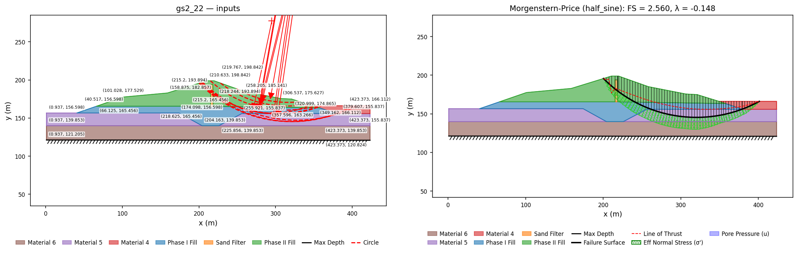

| Surface | XSLOPE M-P | SLOPE/W M-P | XSLOPE Bishop | Slide2 Bishop (Table 35.2) | Hassan & Wolff |
|---|---:|---:|---:|---:|---:|
| Fig. 7 A | 2.560 | 2.560 (0.0%) | 2.549 | 2.551 (−0.1%) | 2.753 |
| Fig. 7 B | 2.803 | 2.806 (−0.1%) | 2.815 | 2.820 (−0.2%) | 2.352 |
| Fig. 7 C | 2.769 | 2.771 (−0.1%) | 2.779 | 2.777 (+0.1%) | 2.523 |
| Fig. 7 D | 2.589 | 2.589 (0.0%) | 2.577 | 2.583 (−0.2%) | 2.457 |
| Fig. 7 E | 2.703 | 2.703 (0.0%) | 2.690 | 2.692 (−0.1%) | 2.602 |
| Fig. 8 B | 2.671 | 2.673 (−0.1%) | 2.673 | 2.672 (0.0%) | 2.995 |
| Fig. 8 F | 3.581 | 3.586 (−0.1%) | 3.591 | 3.598 (−0.2%) | 3.916 |
| Fig. 8 G | 6.059 | 6.069 (−0.2%) | 6.060 | 6.074 (−0.2%) | 10.576 |
| Fig. 8 H | 11.561 | 11.583 (−0.2%) | 11.561 | 11.230 (+2.9%) | 6.293 |

XSLOPE's Morgenstern-Price reproduces SLOPE/W's own Morgenstern-Price on all nine
surfaces to **0.19%** or better, and its Bishop reproduces the Slide2 manual's Bishop
column to **0.5%** on eight of nine (Fig. 8 H, the shallowest and lightest circle,
+2.9%). Summed slice weight matches SLOPE/W's own per-slice table to **0.13–0.17%** on
every surface, so the imported mass is right and the factor-of-safety agreement is the
solver's rather than a cancellation.

**The paper's printed factors of safety for surfaces G and H read as transposed.**
Hassan & Wolff print G = 10.576 and H = 6.293, while Slide2 (6.074 / 11.230), SLOPE/W
(6.069 / 11.583) and XSLOPE (6.059 / 11.561) all agree on the opposite ordering — three
independent programs, two of them on the vendor's exact geometry. Reversing the paper's
two rows moves XSLOPE's residuals against them from −43% / +84% to −3.7% / +9.3%, in
line with the rest of the column. The physics points the same way: F, G and H are a
nested sequence of shrinking circles (R = 144.4 → 139.8 → 135.1, sliding mass
35 900 → 18 800 → 7 200 kN/m), so in a cohesion-dominated fill the factor of safety must
rise monotonically along it, which the reversed ordering gives and the printed one
breaks. The reading is confined to that column: the paper's reliability-index entries for
G and H do not show the same swap.

**Why the circles are locked here and not on the Slide2 file.** The Slide2 corpus builds
this dam as [vp035.xlsx](files/rocscience/vp035.xlsx) from the paper's printed section,
whose frame is anisotropic — a least-squares fit of its ground surface onto this one
returns an *x* scale of 0.958 against a *y* scale of 1.011, and still leaves a 1.8 m rms
shape residual over the nine shared vertices. Fixed circles do not survive that: carried
onto vp035.xlsx the same nine surfaces cut 33–372% too much weight, rising with the
circle's shallowness. The digitized frame is
sound for a free search, which finds its own critical surface on whatever frame it is
given, and that is the row it keeps; a surface specified by centre and radius needs the
exact frame, which is the one here.

**Sources:** GeoStudio SLOPE/W Verification Manual §2.22; Slide2 Verification Manual
§35 (Tables 35.1, 35.2); Hassan & Wolff (1999).

<!-- test: file=files/geostudio/gs2_22.xlsx, type=single_circle, circle_index=0, num_slices=50, fs_mprice=2.560, fs_bishop=2.549, benchmark=GS-2.22-f7a -->
<!-- test: file=files/geostudio/gs2_22.xlsx, type=single_circle, circle_index=1, num_slices=50, fs_mprice=2.803, fs_bishop=2.815, benchmark=GS-2.22-f7b -->
<!-- test: file=files/geostudio/gs2_22.xlsx, type=single_circle, circle_index=2, num_slices=50, fs_mprice=2.769, fs_bishop=2.779, benchmark=GS-2.22-f7c -->
<!-- test: file=files/geostudio/gs2_22.xlsx, type=single_circle, circle_index=3, num_slices=50, fs_mprice=2.589, fs_bishop=2.577, benchmark=GS-2.22-f7d -->
<!-- test: file=files/geostudio/gs2_22.xlsx, type=single_circle, circle_index=4, num_slices=50, fs_mprice=2.703, fs_bishop=2.690, benchmark=GS-2.22-f7e -->
<!-- test: file=files/geostudio/gs2_22.xlsx, type=single_circle, circle_index=5, num_slices=50, fs_mprice=2.671, fs_bishop=2.673, benchmark=GS-2.22-f8b -->
<!-- test: file=files/geostudio/gs2_22.xlsx, type=single_circle, circle_index=6, num_slices=50, fs_mprice=3.581, fs_bishop=3.591, benchmark=GS-2.22-f8f -->
<!-- test: file=files/geostudio/gs2_22.xlsx, type=single_circle, circle_index=7, num_slices=50, fs_mprice=6.059, fs_bishop=6.060, tolerance=0.02, benchmark=GS-2.22-f8g -->
<!-- test: file=files/geostudio/gs2_22.xlsx, type=single_circle, circle_index=8, num_slices=50, fs_mprice=11.561, fs_bishop=11.561, tolerance=0.03, benchmark=GS-2.22-f8h -->

### 2.23 — Li & Lumb – Reliability Index {#gs-2-23}

The [Li & Lumb (1987)](https://doi.org/10.1139/t87-068) / Hassan & Wolff (1999) reliability benchmark: a homogeneous slope with an r_u pore-pressure ratio for which both the deterministic Bishop factor of safety and the lognormal reliability index β are computed from the variability in c′, φ′, and γ.

**Input:** [vp036.xlsx](files/rocscience/vp036.xlsx) · **Rocscience detail:** [VP36](rocscience.md#vp36)

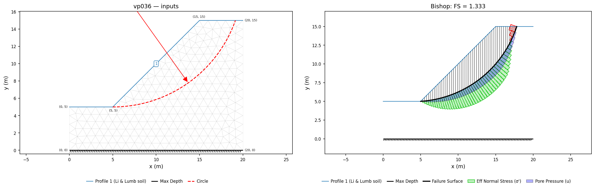

| Quantity | XSLOPE | Hassan & Wolff | SLOPE/W (min-β search) | Note |
|---|---|---|---|---|
| Bishop (deterministic FS) | 1.333 | 1.334 (−0.1%) | 1.190 | SLOPE/W searches for the minimum β across surfaces, not on this one |
| Reliability index β_ln | 2.263 | 2.336 (−3.1%) | 2.04 | — |

XSLOPE's deterministic Bishop FS (1.333) and its β on that surface (2.263) match the Hassan & Wolff reference (1.334 / 2.336); SLOPE/W instead searches for the minimum reliability index across surfaces, reporting β 2.04 at FS 1.190, so its β and FS are not evaluated on the deterministic surface.

**Sources:** GeoStudio SLOPE/W Verification Manual §2.23; Li & Lumb (1987), Hassan & Wolff (1999).

### 2.24 — Tandjiria – Geosynthetic Reinforced Emb. {#gs-2-24}

[Tandjiria (2002)](https://doi.org/10.1016/S0266-1144(02)00015-8)'s required-reinforcement half-embankment on soft clay, evaluated as a clay fill and as a sand fill with a geosynthetic at the embankment base. This section's role is the geosynthetic-reinforcement benchmark for the SLOPE/W importer.

**Input:** [vp039a.xlsx](files/rocscience/vp039a.xlsx) · **Rocscience detail:** [VP39](rocscience.md#vp39)

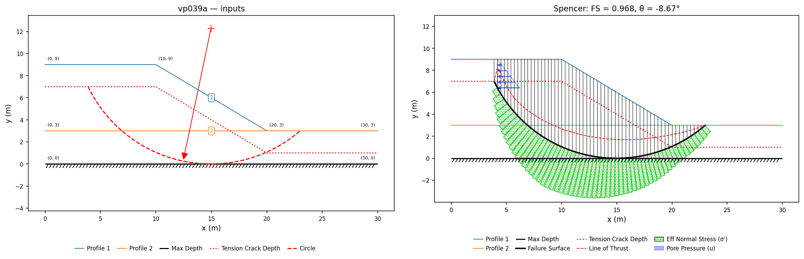

| Method | XSLOPE | SLOPE/W | Reference |
|---|---|---|---|
| Clay fill, reinforced (imported, on SLOPE/W's own circles) | −0.27% | baseline | — |
| Sand fill, reinforced (imported, on SLOPE/W's own circles) | −0.64% | baseline | — |

Run on SLOPE/W's own critical circles, the imported geosynthetic reproduces SLOPE/W's reinforced factor of safety to within −0.27% (clay fill) and −0.64% (sand fill), which isolates the reinforcement handling from any difference in search.

**Sources:** GeoStudio SLOPE/W Verification Manual §2.24; Tandjiria (2002).

### 2.25 — Baker & Leshchinsky – Earth Dam {#gs-2-25}

[Baker & Leshchinsky (2001)](https://doi.org/10.1061/(ASCE)1090-0241(2001)127:2(135))'s safety-map clay-core dam: granular fill (c′ = 0, φ′ = 40°,
γ = 21.5) around a diamond core (c′ = 20, φ′ = 20°, γ = 20) on a hard base (c′ = 200,
φ′ = 45°), a half-full upstream reservoir, a phreatic surface dropping through the core
to the downstream toe, and a 5-m cracked crest layer modeled as a dry tension crack. The
XSLOPE input tiles the section directly as the material-zone polygons of this model's own
`.gsz` region set.

**Input:** [vp042.xlsx](files/rocscience/vp042.xlsx) · **Rocscience detail:** [VP42](rocscience.md#vp42)

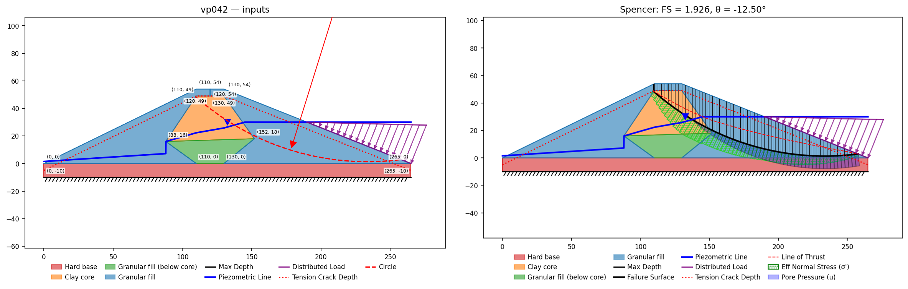

| Surface | XSLOPE (rigorous statics) | SLOPE/W (own solve) | Slide | Baker & Leshchinsky (2001) |
|---|---|---|---|---|
| Spencer, Slide's critical circle | 1.926 | — | 1.925 (+0.1%) | — |
| Spencer, SLOPE/W's own circle | 1.939 | 1.934 (+0.3%) | — | — |
| Spencer, Baker's surface | 1.882 | — | — | 1.91 (−1.5%) |
| Sliding-mass weight, SLOPE/W's own circle | ≈ 56,020 | 56,127 (−0.2%) | — | — |

XSLOPE reproduces the tightly clustered published references on all three surfaces. On
SLOPE/W's own solved critical circle (read from the `.gsz`) the two programs agree to
within 0.005 in Spencer FS on the identical surface, geometry, and water. Both sides use total unit
weight with phreatic pore pressure, as B&L (2001) specify and this model's own materials
set; the reservoir load reproduces the equivalent buoyant-weight statics exactly, and
XSLOPE's phreatic matches this model's own piezometric line to within ~0.2 m along the
failure surface. Baker & Leshchinsky (2001) supplies the phreatic geometry the vendor
manuals leave unlabeled (its Fig. 5(a)) and reports the dam's global minimum Fmin = 1.91 by
Spencer's method, computed with total unit weight and pore pressure taken from the vertical
distance to the phreatic surface.

**Sources:** GeoStudio SLOPE/W Verification Manual §2.25; Baker & Leshchinsky (2001).

### 2.26 — Baker – Planar Homogeneous {#gs-2-26}

Baker (2001)'s planar-slip-surface benchmark: a homogeneous, dry c′-φ′ slope (H = 10 m,
face angle 76.0°, c′ = 30, φ′ = 30°, γ = 20) evaluated on planes through the toe, with
FS plotted against the daylight point's normalized position X = x/H on the backslope.
The critical plane sits at X = 0.85. The SLOPE/W model fixes the crest offset at 2.5 m,
and that offset controls the answer — moving it moves the factor of safety well outside
the reference cluster, as the second table row shows.

**Input:** [gs2_26.xlsx](files/geostudio/gs2_26.xlsx) · **Rocscience detail:** [VP43](rocscience.md#vp43)

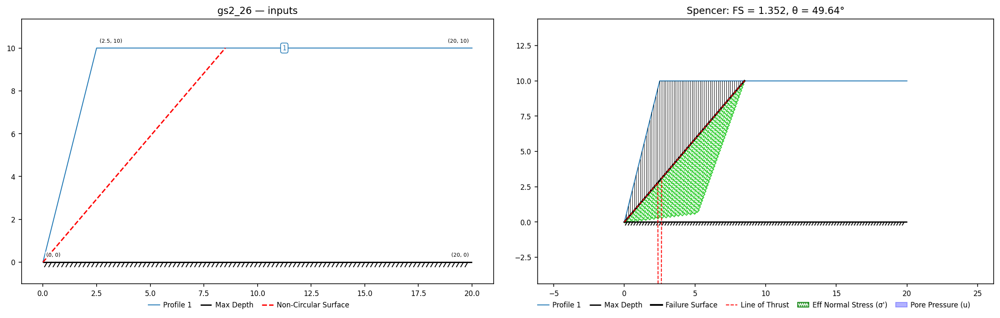

| Method | XSLOPE | SLOPE/W | Baker & Leshchinsky (2001) |
|---|---|---|---|
| Spencer / Janbu | 1.352 | 1.352 (0.0%) | ≈ 1.35 (+0.1%) |
| Spencer / Janbu, crest offset moved to 3 m (face angle 73.3°) | ≈ 1.43 | — | ≈ 1.35 (+5.9%) |

XSLOPE's Spencer and Janbu match SLOPE/W's own solved value (1.352, on the identical
toe-to-(8.5, 10) plane; sliding-mass weight 600 kN/m agrees exactly) to within 0.01%,
and the Baker & Leshchinsky reference to 0.15%. XSLOPE's Morgenstern-Price declines
this surface: on a single straight plane α is constant for every slice, and the
unconstrained λ-search reaches equilibrium only by driving ~70% of the interslice
forces into tension — the solver's admissibility guard rejects that as unphysical
(Corps and Lowe-Karafiath hit the same guard), leaving Spencer as the rigorous method
that converges.

**Sources:** GeoStudio SLOPE/W Verification Manual §2.26; Baker (2001); Baker &
Leshchinsky (2001).

<!-- test: file=files/geostudio/gs2_26.xlsx, type=single_noncirc, num_slices=50, fs_spencer=1.352, fs_janbu=1.352, benchmark=GS-2.26 -->

### 2.27 — Sheahan – Amherst Soil Nails {#gs-2-27}

The Amherst test wall — a 6 m vertical cut in undrained clay retained by two rows of soil nails and a shotcrete facing, which failed in the field test — evaluated on planar surfaces through the toe.

**Input:** [vp047.xlsx](files/rocscience/vp047.xlsx) · **Rocscience detail:** [VP47](rocscience.md#vp47)

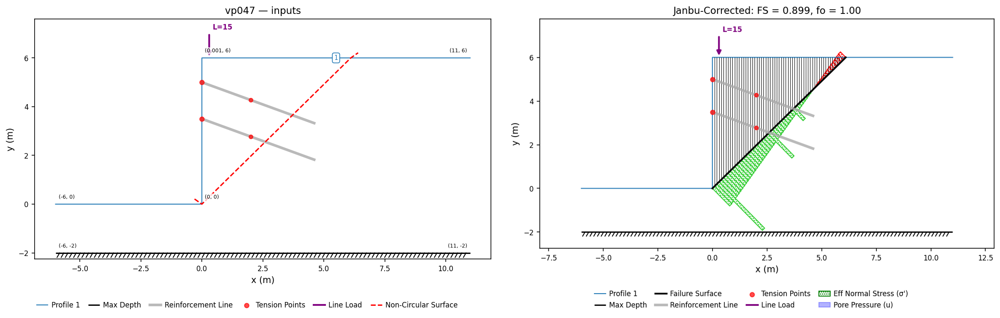

| Method | XSLOPE | Sheahan | Slide | SLOPE/W |
|---|---|---|---|---|
| Janbu | 0.899 | 0.887 (+1.4%) | 0.890 (+1.0%) | — |

XSLOPE's Janbu FS of 0.899 agrees closely with Slide's 0.890 and Sheahan's trial-wedge 0.887. The manual tabulates no SLOPE/W factor of safety for this section; the model is one of the public downloads listed above.

**Sources:** GeoStudio SLOPE/W Verification Manual §2.27; Sheahan & Ho (2003).

### 2.30 — Snailz – Geotextile Layers {#gs-2-30}

A reinforced-slope problem from the Caltrans SNAILZ reference manual — a multi-row nail/geotextile-reinforced wall evaluated on a predefined deep wedge surface — verifying XSLOPE's reinforcement handling against SLOPE/W and the published SNAILZ solution.

**Input:** [vp050.xlsx](files/rocscience/vp050.xlsx) · **Rocscience detail:** [VP50](rocscience.md#vp50)

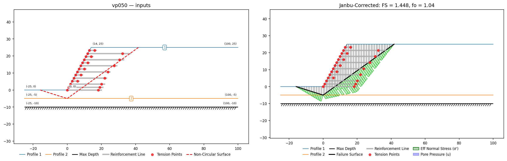

| Method | XSLOPE | SLOPE/W | SNAILZ | Note |
|---|---|---|---|---|
| Janbu (corrected) | 1.448 | — | 1.46 (−0.8%) | SLOPE/W's uncorrected force solution 1.354 (×fo ≈ 1.44) — not a same-method pairing |
| Morgenstern-Price / Spencer | 1.576 | 1.606 (M-P, −1.9%) | — | — |

XSLOPE's Janbu (corrected) 1.448 matches SLOPE/W's uncorrected force solution 1.354 once the fo correction (×fo ≈ 1.44) is applied and agrees with the SNAILZ 1.46 reference; the Morgenstern-Price/Spencer pair agrees at 1.576 vs SLOPE/W's 1.606.

**Sources:** GeoStudio SLOPE/W Verification Manual §2.30; Caltrans SNAILZ reference manual.

### 2.31 — Zhu – Four Layer Slope {#gs-2-31}

Zhu, Lee & Jiang's four-layer slope with a water table, a 5 m dry tension crack, and seismic loading (k=0.1), analyzed on a specified circle.

**Input:** [vp051.xlsx](files/rocscience/vp051.xlsx) · **Rocscience detail:** [VP51](rocscience.md#vp51)

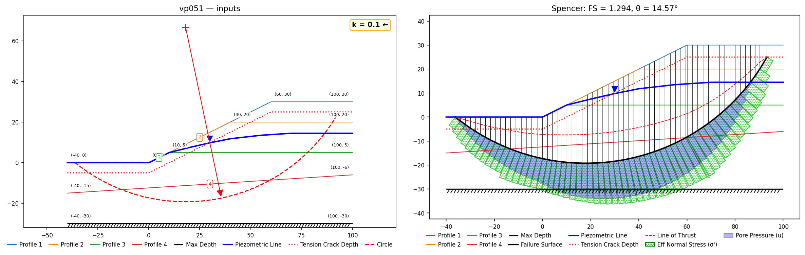

| Method | XSLOPE | SLOPE/W |
|---|---|---|
| Bishop | 1.278 | 1.284 (−0.5%) |
| Spencer | 1.294 | 1.299 (−0.4%) |
| Morgenstern-Price | 1.304 | 1.310 (−0.5%) |
| Lowe-Karafiath | 1.296 | 1.283 (+1.0%) |
| Corps of Engineers | 1.404 | 1.368 (+2.6%) |

XSLOPE tracks SLOPE/W within a few thousandths across the rigorous methods (Bishop, Spencer, Morgenstern-Price), with the wider spread confined to the Lowe-Karafiath and Corps side-force assumptions.

**Sources:** GeoStudio SLOPE/W Verification Manual §2.31; [Zhu, Lee & Jiang (2003)](https://doi.org/10.1680/geot.2003.53.4.377).

### 2.32 — Zhu & Lee – Heterogeneous Slope {#gs-2-32}

The Zhu & Lee heterogeneous benched slope (four materials, water table, tension crack), verifying that an unconstrained circular search lands in the governing deep failure family.

**Input:** [vp052a.xlsx](files/rocscience/vp052a.xlsx) · **Rocscience detail:** [VP52](rocscience.md#vp52)

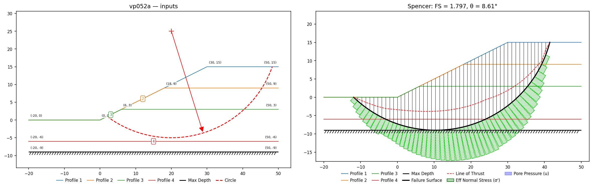

| Method | XSLOPE | Slide | SLOPE/W |
|---|---|---|---|
| Spencer (wet, deep family) | 1.189 | 1.189 (0.0%) | — |

XSLOPE's wet deep-family Spencer FS of 1.189 matches Slide exactly.

**Sources:** GeoStudio SLOPE/W Verification Manual §2.32; [Zhu & Lee (2002)](https://doi.org/10.1002/nag.260).

### 2.33 — Priest – Rigid Blocks {#gs-2-33}

Priest (1993), *Discontinuity Analysis for Rock Engineering*: a classical rock-slope
planar failure — a single rigid block translating on one straight failure plane
(despite the section title, not a multi-block assembly) — with a 15 m tension crack at
the crest, 25% water-filled. One Mohr-Coulomb material: c′ = 20, φ′ = 30°, γ = 25. The
face rises at 60° from the toe (0, 0) to the crest (17.32, 30) with a flat crest
beyond. The failure plane dips at 30° from the toe; XSLOPE specifies it untruncated (to
its natural daylight point) and lets `tcrack_depth = 15` truncate it, which reproduces
SLOPE/W's own solved endpoint (25.98, 15.0) exactly.

**Input:** [gs2_33.xlsx](files/geostudio/gs2_33.xlsx)

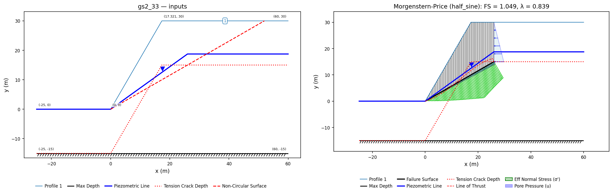

| Method | XSLOPE | SLOPE/W | Priest (hand) |
|---|---|---|---|
| Janbu | 1.049 | 1.049 (0.0%) | 1.049 (0.0%) |
| Morgenstern-Price | 1.049 | 1.049 (0.0%) | — |

All XSLOPE methods agree to four decimals on this surface and Janbu's f₀ correction is
exactly 1.00 — expected for a single straight plane, and the same behaviour the
manual's FS-vs-λ figure shows for SLOPE/W (moment and force factors coincide regardless
of the interslice assumption). Total sliding weight matches SLOPE/W's to 0.004%.

**Sources:** GeoStudio SLOPE/W Verification Manual §2.33; Priest (1993).

<!-- test: file=files/geostudio/gs2_33.xlsx, type=single_noncirc, num_slices=50, fs_janbu=1.049, fs_mprice=1.049, fs_spencer=1.049, benchmark=GS-2.33 -->

### 2.34 — Yamagami – Stabilizing Piles {#gs-2-34}

A homogeneous slope stabilized by a row of micro-piles, verifying pile-reinforced limit equilibrium against the unreinforced baseline.

**Input:** [vp054a.xlsx](files/rocscience/vp054a.xlsx) · **Rocscience detail:** [VP54](rocscience.md#vp54)

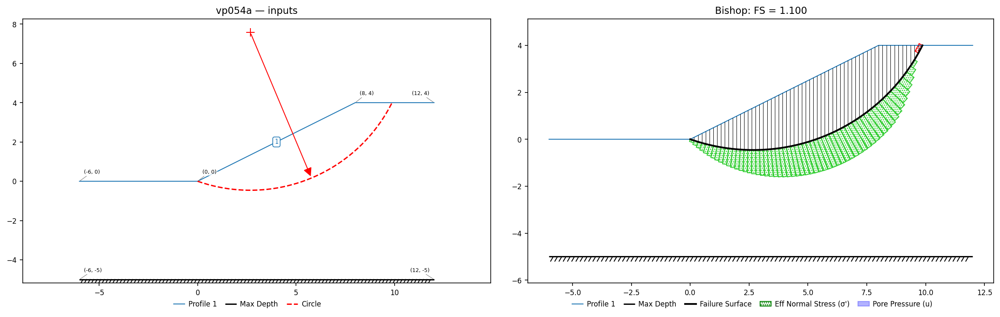

| Method | XSLOPE | SLOPE/W | Slide | Yamagami |
|---|---|---|---|---|
| Bishop (no pile) | 1.100 | 1.102 (−0.2%) | — | — |
| Bishop (with piles) | 1.185 | 1.223 (−3.1%) | 1.193 (−0.7%) | 1.20 (−1.3%) |

The unreinforced case matches SLOPE/W essentially exactly (1.100 vs 1.102), while the reinforced FS spreads because pile-force conventions differ program-to-program.

**Sources:** GeoStudio SLOPE/W Verification Manual §2.34; Yamagami.

### 2.35 — Pockoski & Duncan – Tie-Back Wall {#gs-2-35}

Pockoski & Duncan (2000)'s tied-back excavation wall: a 44-ft wall in eight horizontal
soil layers (granular and cohesive fills over organic silt, an over-consolidated crust,
marine clays and glaciomarine deposits), water table at grade in front and el. 102.5
behind, retained by three tieback rows at 20° whose capacity is bond-governed at 40,000
lb/ft of wall.

**Input:** [vp058.xlsx](files/rocscience/vp058.xlsx) · **Rocscience detail:** [VP58](rocscience.md#vp58)

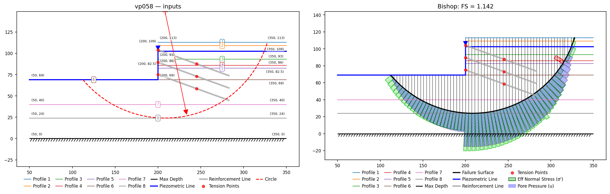

| Method | XSLOPE | Slide | UTEXAS4 | P&D's SLOPE/W | SLOPE/W | Note |
|---|---|---|---|---|---|---|
| Bishop | 1.142 | 1.147 (−0.4%) | 1.14 (+0.2%) | 1.14 (+0.2%) | — (file saved unsolved) | the vendor file carries no solved value of its own |
| Spencer | 1.140 | 1.145 (−0.4%) | 1.14 (0.0%) | — | — | — |

The vendor `.gsz` was saved unsolved, so SLOPE/W's own critical factor of safety is not in
the file; the SLOPE/W reference is the value Pockoski & Duncan themselves reported for it
(1.14). XSLOPE's Bishop and Spencer (1.142 / 1.140) sit within the published cluster. Pockoski
& [Duncan (2000)](https://doi.org/10.1061/(ASCE)1090-0241(2000)126:4(307)) supplies the eight-layer section, strengths and anchor capacities.

**Sources:** GeoStudio SLOPE/W Verification Manual §2.35; Pockoski & Duncan (2000).

### 2.36 — Pockoski & Duncan – Reinforcement {#gs-2-36}

Pockoski & Duncan (2000)'s single-row tieback wall in homogeneous sand (c′ = 0, φ′ = 30°)
with the water table drawn down to the wall face — under-designed on purpose, so every
published factor of safety is below 1.

**Input:** [vp059.xlsx](files/rocscience/vp059.xlsx) · **Rocscience detail:** [VP59](rocscience.md#vp59)

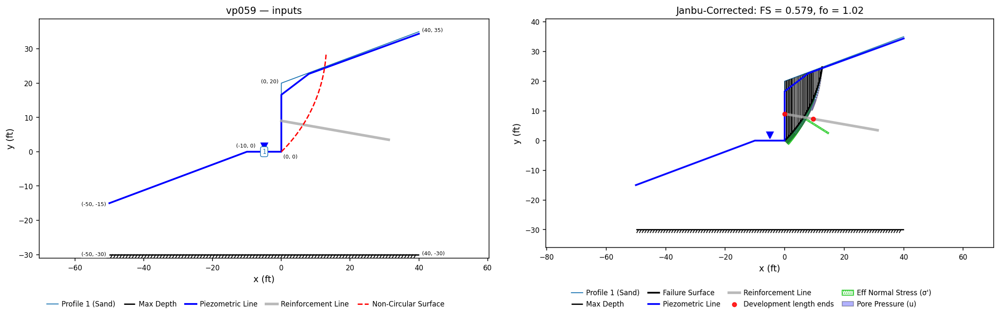

| Method | XSLOPE | SLOPE/W (own solve) | Slide | P&D's SLOPE/W | Note |
|---|---|---|---|---|---|
| Janbu simplified | 0.579 | 0.575 (+0.7%) | 0.583 (−0.7%) | 0.61 (−5.1%) | published Bishop values alone span 0.56–0.74 |
| Corps / Lowe-Karafiath | 0.577 | 0.587 (Lowe, −1.7%) | 0.588 (−1.9%) | — | — |
| Spencer, SLOPE/W's own circular search | — | 0.564 | — | — | a different (circular) surface — not comparable to the prescribed one |
| Bishop, SLOPE/W's own circular search | — | 0.531 | — | — | as above |

XSLOPE's force-family lock (Janbu 0.579, Corps 0.577) matches SLOPE/W's own current solve
(Janbu 0.575, Lowe-Karafiath 0.587) to within 1–2% — tighter than the historical
inter-program spread this problem was built to expose. Spencer and Morgenstern-Price are
inadmissible on the prescribed non-circular
surface in XSLOPE (base normals near the wall go into tension), so the force-equilibrium
methods carry the lock; SLOPE/W's own search rides a circular critical surface instead,
tabulated above. The P&D (2000) report supplies the sand
strengths, drawn-down water table and anchor layout.

**Sources:** GeoStudio SLOPE/W Verification Manual §2.36; Pockoski & Duncan (2000).

### 2.37 — Pockoski & Duncan – Soil Nails {#gs-2-37}

Pockoski & Duncan (2000)'s 25-ft soil-nailed wall in undrained sandy clay (c = 800 psf,
φ = 0) under a 250-psf crest surcharge plus a 500-psf strip, with a dry 7-ft tension crack
and five passive nail rows at 15°.

**Input:** [vp060.xlsx](files/rocscience/vp060.xlsx) · **Rocscience detail:** [VP60](rocscience.md#vp60)

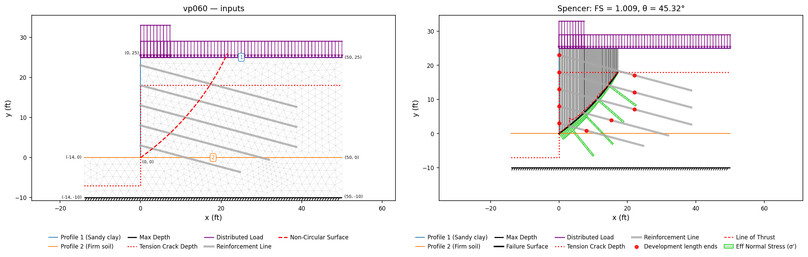

| Method | XSLOPE | SLOPE/W (own solve) | Slide | P&D's SLOPE/W |
|---|---|---|---|---|
| Spencer | 1.010 | 1.000 (+1.0%) | 1.009 (+0.1%) | 1.02 (−1.0%) |
| Janbu simplified | 1.043 | — | 1.041 (+0.2%) | 1.07 (−2.5%) |
| Bishop | — | 0.995 | — | — |

XSLOPE's Spencer (1.010) matches SLOPE/W's own solved Spencer (1.000) to 1% and Slide
(1.009) essentially exactly; the nailed wall is designed for a factor of safety near 1.
Pockoski & Duncan (2000) supplies the surcharge pattern, tension-crack depth and five-row
nail layout.

**Sources:** GeoStudio SLOPE/W Verification Manual §2.37; Pockoski & Duncan (2000).

### 2.38 — Loukidis – Seismic Coefficient {#gs-2-38}

A homogeneous slope loaded pseudo-statically at its critical seismic coefficient (dry and ru = 0.5 cases), where the factor of safety is driven to ≈ 1.

**Input:** [vp062a.xlsx](files/rocscience/vp062a.xlsx) · **Rocscience detail:** [VP62](rocscience.md#vp62)

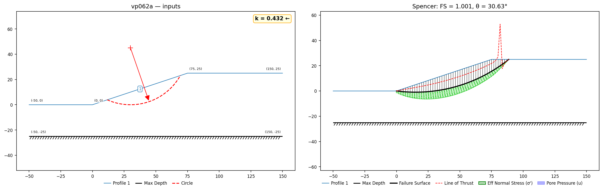

| Method | XSLOPE | SLOPE/W | Reference |
|---|---|---|---|
| Spencer | 1.001 | 1.00 (+0.1%) | — |

XSLOPE's Spencer factor of safety is 1.001 in both cases, matching SLOPE/W's 1.00 exactly.

**Sources:** GeoStudio SLOPE/W Verification Manual §2.38; Loukidis, Bandini & Salgado (2003).

### 2.39 — Loukidis – Seismic Coefficient #2 {#gs-2-39}

Loukidis, Bandini & Salgado (2003)'s second example: a three-layer dry slope — a light
c = 4 kPa cap (φ = 30°, γ = 17), a weak c = 25 kPa / **φ = 15°** middle band (γ = 19) that
the mechanism rides, and a strong φ = 45° base (c = 15, γ = 19). The target is not a
factor of safety but the **critical seismic coefficient** k꜀, the horizontal pseudo-static
coefficient at which the searched minimum FS = 1.

**Input:** [vp063.xlsx](files/rocscience/vp063.xlsx) · **Rocscience detail:** [VP63](rocscience.md#vp63) · **RS2 detail (critical_kc):** [RS2-68 Case 3](rs2.md#rs2-68)

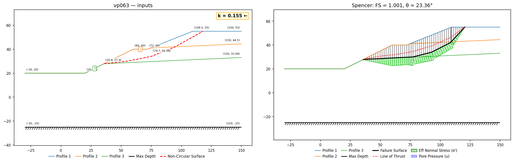

| Target | XSLOPE | SLOPE/W | Loukidis | Slide2 | Note |
|---|---|---|---|---|---|
| FS at the paper's k꜀ = 0.155 (Spencer) | 1.001 | — (file saved unsolved) | 1.000 (+0.1%) | — | Loukidis defines FS = 1.000 at k꜀ by construction |
| Critical k꜀ (Spencer / Bishop) | 0.167 / 0.169 | — | Spencer 0.155 (+7.7% / +9.0%), FEM 0.161 | 0.151 / 0.155 (+10.6% / +9.0%) | the paper's rigorous bracket is UB 0.172 / LB 0.148 |

The two targets are checked separately. [VP63](rocscience.md#vp63) fixes k at the paper's
0.155 and confirms the slope is just stable there (noncircular Spencer 1.001). The
[RS2-68 Case 3](rs2.md#rs2-68) `critical_kc` bisection harness instead solves for k꜀
directly and returns 0.167 (Spencer) / 0.169 (Bishop) — ~10% above the paper's 0.155
because the governing surface rides the thin φ = 15° band, which is intrinsically
non-circular, and a circular search cannot follow it as tightly as the log-spiral. The
XSLOPE values still fall inside the paper's rigorous upper/lower-bound bracket [0.148,
0.172] and sit on the reference FEM (0.161). The vendor `.gsz` was saved unsolved, so
SLOPE/W's own k꜀ is not in the file. Loukidis, Bandini & Salgado (2003) supplies the
three-layer section (Fig. 9(a): a 15 m upper block over a 20 m lower face, φ = 15° band)
and Table 3's k꜀ values.

**Sources:** GeoStudio SLOPE/W Verification Manual §2.39; Loukidis, Bandini & Salgado (2003).

### 2.40 — Rapid Drawdown – Walter Bouldin Dam {#gs-2-40}

The Walter Bouldin Dam is a rolled earthfill dam that failed during a rapid drawdown in 1975; this case verifies XSLOPE's Duncan-Wright-Wong three-stage rapid drawdown procedure.

**Input:** [vp098.xlsx](files/rocscience/vp098.xlsx) · **Rocscience detail:** [VP98](rocscience.md#vp98)

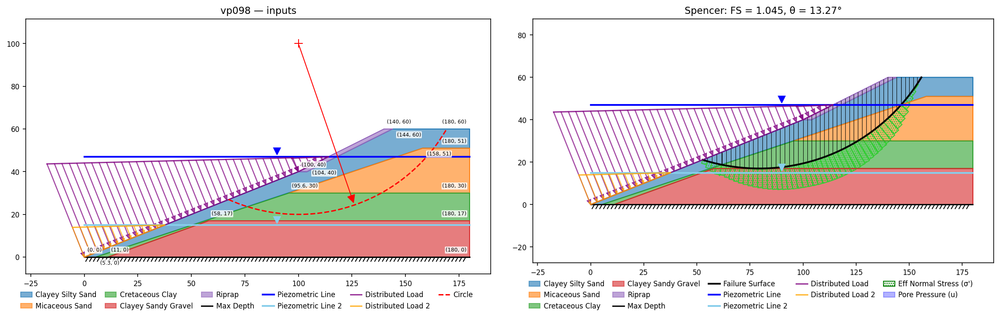

| Method | XSLOPE | SLOPE/W | DWW |
|---|---|---|---|
| DWW 3-stage (Spencer) | 1.046 | 1.02 (+2.5%) | 1.04 (+0.6%) |
| DWW 3-stage (Bishop) | — | 1.016 | — |

XSLOPE's DWW three-stage FS (1.046, Spencer circular search) agrees with SLOPE/W's Spencer (1.02) and the published DWW value (1.04) to within about 1%, and brackets SLOPE/W's Bishop result (1.016).

**Sources:** GeoStudio SLOPE/W Verification Manual §2.40; Duncan, Wright & Wong (1990).

### 2.41 — Rapid Drawdown – USACE Benchmark {#gs-2-41}

A homogeneous embankment dam rapid-drawdown benchmark from USACE EM 1110-2-1902 (2003) Appendix G, evaluated with the Duncan-Wright-Wong 3-stage procedure on the specified circle.

**Input:** [vp096.xlsx](files/rocscience/vp096.xlsx) · **Rocscience detail:** [VP96](rocscience.md#vp96)

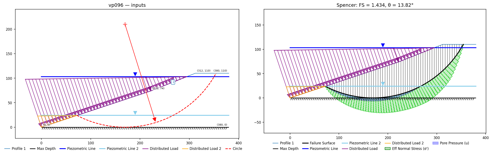

| Method | XSLOPE | USACE | SLOPE/W |
|---|---|---|---|
| Bishop | 1.432 | 1.44 (−0.6%) | — |
| Spencer | 1.434 | 1.44 (−0.4%) | — |

XSLOPE's 3-stage Spencer (1.434) and Bishop (1.432) both agree with the published USACE benchmark of 1.44 to within about half a percent.

**Sources:** GeoStudio SLOPE/W Verification Manual §2.41; USACE EM 1110-2-1902 (2003) Appendix G (Duncan, Wright & Wong 3-stage procedure).

### 2.42 — Rapid Drawdown – Pumped Storage Dam {#gs-2-42}

Rapid drawdown (285 → 120 ft) of a hypothetical pumped-storage dam — silty-clay core and free-draining rockfill shells — analyzed with the Duncan-Wright-Wong 3-stage procedure.

**Input:** [vp099.xlsx](files/rocscience/vp099.xlsx) · **Rocscience detail:** [VP99](rocscience.md#vp99)

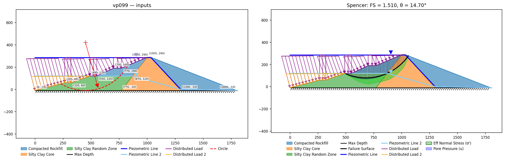

| Method | XSLOPE | Slide | SLOPE/W | DWW |
|---|---|---|---|---|
| Spencer (DWW 3-stage) | 1.527 | 1.534 (−0.5%) | 1.550 (−1.5%) | 1.56 (−2.1%) |

The geometry is taken from this model's own .gsz (read with `xslope.geostudio.read_gsz`) rather than traced from Slide's unlabeled figure. On that geometry XSLOPE reads 1.527, just below the Slide / SLOPE/W / DWW band (1.53–1.56).

**Sources:** GeoStudio SLOPE/W Verification Manual §2.42; Duncan, Wright & Wong (1990).

### 2.43 — Rapid Drawdown – Pilarcitos Dam {#gs-2-43}

A three-stage rapid-drawdown analysis of Pilarcitos Dam — a homogeneous earthfill embankment (Duncan, Wright & Wong 1990) drawn down from 72 to 37 ft, a documented drawdown-failure case. It verifies XSLOPE's staged rapid-drawdown procedure.

**Input:** [vp097.xlsx](files/rocscience/vp097.xlsx) · **Rocscience detail:** [VP97](rocscience.md#vp97)

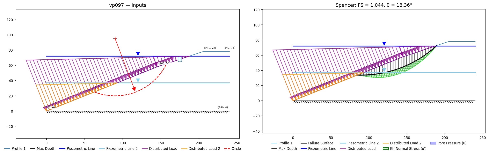

| Method | XSLOPE | DWW | Slide | SLOPE/W |
|---|---|---|---|---|
| Bishop | 1.042 | 1.05 (−0.8%) | 1.043 (−0.1%) | — |
| Spencer | 1.044 | 1.05 (−0.6%) | 1.043 (+0.1%) | — |

XSLOPE's Spencer (1.044) and Bishop (1.042) staged factors of safety are essentially identical, and both sit on Slide's 1.043 and just under the Duncan-Wright-Wong published 1.05.

**Sources:** GeoStudio SLOPE/W Verification Manual §2.43; Duncan, Wright & Wong (1990).

### 2.45 — Eurocode 7: Cutting in Clay {#gs-2-45}

A 1:2 cutting in a homogeneous clay (characteristic c′ = 10, φ′ = 28°, γ = 20) with a
water table and a 35 kPa permanent crest surcharge, checked to Eurocode 7 Design
Approach 3 (after the *Designers' Guide to Eurocode 7*). XSLOPE has no native
partial-factor feature, so the DA3 material factors (set M2) are baked into the
authored material — c′* = 10/1.25 = 8.0 kPa, φ′* = atan(tan 28°/1.25) = 23.04° — with
soil weight and the permanent surcharge at their factor of 1.0. An ordinary analysis of
the factored model then reproduces GeoStudio's Overdesign Factor (ODF).

**Input:** [gs2_45.xlsx](files/geostudio/gs2_45.xlsx)

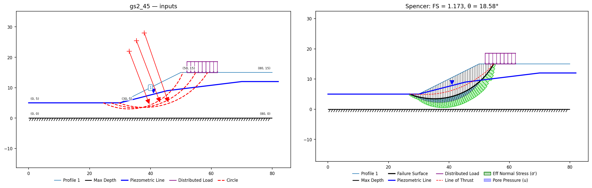

| Method | XSLOPE | SLOPE/W (ODF) | Book (Bishop) | Note |
|---|---|---|---|---|
| Spencer | 1.173 | 1.174 (−0.1%) | — | on SLOPE/W's own critical circle the two agree to −0.09% |
| Bishop | 1.172 | 1.173 (−0.1%) | 1.193 (−1.8%) | — |

XSLOPE's Spencer ODF matches SLOPE/W's to −0.07% — the factored-parameter emulation
reproduces the EC7 design check at method level. Janbu is not compared (XSLOPE reports the f₀-corrected value;
the manual's column is uncorrected).

**Sources:** GeoStudio SLOPE/W Verification Manual §2.45; *Designers' Guide to
Eurocode 7*.

<!-- test: file=files/geostudio/gs2_45.xlsx, type=circular_search, num_slices=40, fs_spencer=1.173, fs_bishop=1.172, benchmark=GS-2.45 -->

### 2.46 — Eurocode 7: Earth Dam {#gs-2-46}

A homogeneous clay dam (characteristic c′ = 12, φ′ = 20°, γ = 19.2) with an upstream
reservoir at 5.1 m total head, analysed as coupled steady-state seepage + slope
stability under Eurocode 7 Design Approach 1, Combination 2 (after *Smith's Elements of
Soil Mechanics*, ex. 5.12). Pore pressures come from an XSLOPE finite-element seepage
solve (u = 'seep' with mesh/solution sidecars); the DA1-C2 material factors (set
M2) are baked in — c′* = 9.6
kPa, φ′* = 16.23° — so an ordinary analysis yields the Overdesign Factor.

**Input:** [gs2_46.xlsx](files/geostudio/gs2_46.xlsx) (+ `gs2_46_mesh.json`,
`gs2_46_seep.csv`)

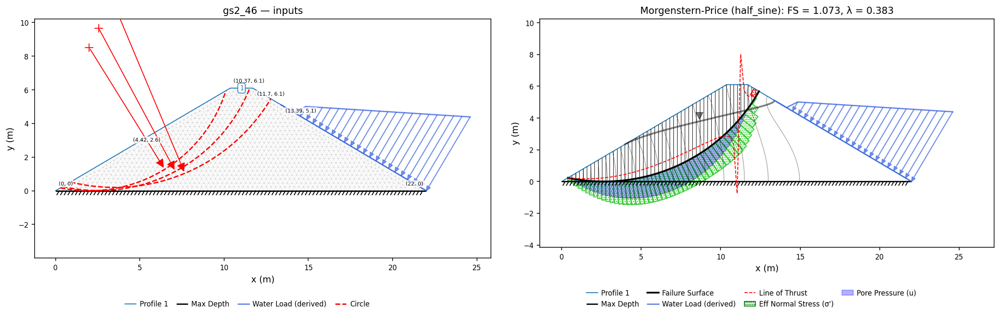

| Method | XSLOPE | SLOPE/W (ODF) | Book (Bishop) | Note |
|---|---|---|---|---|
| Morgenstern-Price, on SLOPE/W's own critical circle | 1.099 | 1.101 (−0.2%) | — | pore pressures from XSLOPE's own FE seepage, whose phreatic reproduces SEEP/W's to ~0.1–0.2 m |
| Morgenstern-Price, free search | 1.073 | 1.091 (−1.6%, base-truncated composite minimum) | — | — |
| Bishop, free search | 1.074 | 1.092 (−1.6%, base-truncated composite minimum) | 1.07 (+0.4%) | — |

The two programs agree closely on SLOPE/W's own critical circle. XSLOPE's free search
then finds a slightly more critical downstream surface, landing on the Smith textbook
value, where SLOPE/W reports its base-truncated composite minimum — a search-coverage
difference, not a model one. Janbu is not compared (corrected vs uncorrected
convention).

**Sources:** GeoStudio SLOPE/W Verification Manual §2.46; *Smith's Elements of Soil
Mechanics* (8th ed.), ex. 5.12.

<!-- test: file=files/geostudio/gs2_46.xlsx, type=circular_search, num_slices=40, fs_mprice=1.073, fs_bishop=1.074, fs_spencer=1.074, benchmark=GS-2.46 -->

### 2.47 — Compound Strength vs Anisotropic Function {#gs-2-47}

A faulted rock section verifying SLOPE/W's two orientation-dependent strength models
against one another: an anisotropic strength function and a compound strength, both of
which make a material's strength depend on **how the slip surface is oriented relative
to a discontinuity**, not on position alone.

Both models work the same way. The material carries a discontinuity dip and two angle
ranges, A and B; each slice's base angle is measured against that dip, and the strength
used on that base is interpolated between the discontinuity's strength inside range A
and the intact rock's strength outside range B. XSLOPE's material model has no such
term — a material's cohesion and friction angle are the same on every slice base that
crosses it, whatever the base's inclination — so the section cannot be built. This is
not a silent gap: the `.gsz` importer detects `AnisotropicFn` and `CompoundStrength`
materials and flags exactly this on import rather than dropping the orientation
dependence and returning a plausible wrong answer.

The vendor's own recorded results show that the strength model is the whole of the
difference:

| Strength model (same surface) | XSLOPE | SLOPE/W | Note |
|---|---|---|---|
| Anisotropic function | — (not supported) | 1.113 | no XSLOPE counterpart — the orientation term has no equivalent |
| Compound strength | — (not supported) | 1.118 | the two formulations differ by 0.4% on the *same* surface |

Two formulations of the same orientation-dependent idea agree with each other to within
a rounding step while the search is held fixed, so a factor of safety computed without
the orientation term would be wrong for a reason no search refinement could recover.

A secondary blocker stands behind the first: the 21-material faulted section has no
printed coordinate table, so even the geometry would have to be digitized from the
figure.

**Sources:** GeoStudio SLOPE/W Verification Manual §2.47.

## Transient seepage (SEEP/W) {#transient-seepage}

The sections above are SLOPE/W limit-equilibrium problems. GeoStudio also ships a **SEEP/W**
example library, and a handful of those examples are pure (uncoupled) transient-seepage
verifications — the same physics XSLOPE's [transient solver](../seep/transient.md)
(`run_transient_seepage`) implements: two-dimensional saturated/unsaturated flow with a
storage term, `div(kr K grad h) + Q = S dh/dt`. Six are built, and they span the range of
that path: the closed-form-anchored consolidation and infiltration columns (T01, T02); the
two-dimensional reservoir-drawdown dam (T03), whose upstream face is a falling series head;
the two-dimensional clay-lined pond (T04), whose water table rises through an exit face; the
leach column (T05), driven by a specified-flux boundary; and the stepped-suction
multistep-outflow column (T07), which uses a time-varying **head** (plain-Dirichlet) series.
Each is locked with `type=tseep_head` tags — the same transient head-profile check the
[Rocscience groundwater](rocscience_groundwater.md) corpus uses: the solver marches the
transient problem and the total head is sampled at named points at a save time. The seventh
example (T06) lies outside what the transient solver supports and is documented as blocked
below.

As with the SLOPE/W corpus, the `.gsz` model files are Seequent's and are not
redistributed here; their solved per-timestep `node.csv` results are read as the comparison
values, which appear in the tables and locks below.

### SEEPW-T01 — Simulating consolidation with SEEP/W {#seepw-t01}

The SEEP/W example that reproduces **Terzaghi one-dimensional consolidation** as an
uncoupled seepage run: a 0.05 m saturated clay column (K = 1×10⁻⁸ m/s,
m_v = 0.005 /kPa, so S_s = m_v γ_w = 0.04905 /m and c_v = K/S_s = 2.04×10⁻⁷ m²/s)
carries a uniform initial excess pore pressure u₀ = 10 kPa and drains at both ends
(double drainage, drainage path H = 0.025 m). It is the ideal test of the **saturated
storage term**: the problem is linear, so there is a closed-form target and no
unsaturated nonlinearity to confound it.

The excess pore pressure is carried on a datum offset of 100 m (the same device the
[GW15–21](rocscience_groundwater.md) consolidation problems use): the total head is held
uniform at t = 0 (the t = 0 steady solve sets the uniform initial condition) and both
faces step down for t > 0, so the excess head follows Terzaghi Eq. 17.3 and the excess
pressure γ_w(h − 100) is directly comparable to SEEP/W's `node.csv` in kPa.

**Input:** [gs2_cons.xlsx](files/geostudio/gs2_cons.xlsx)

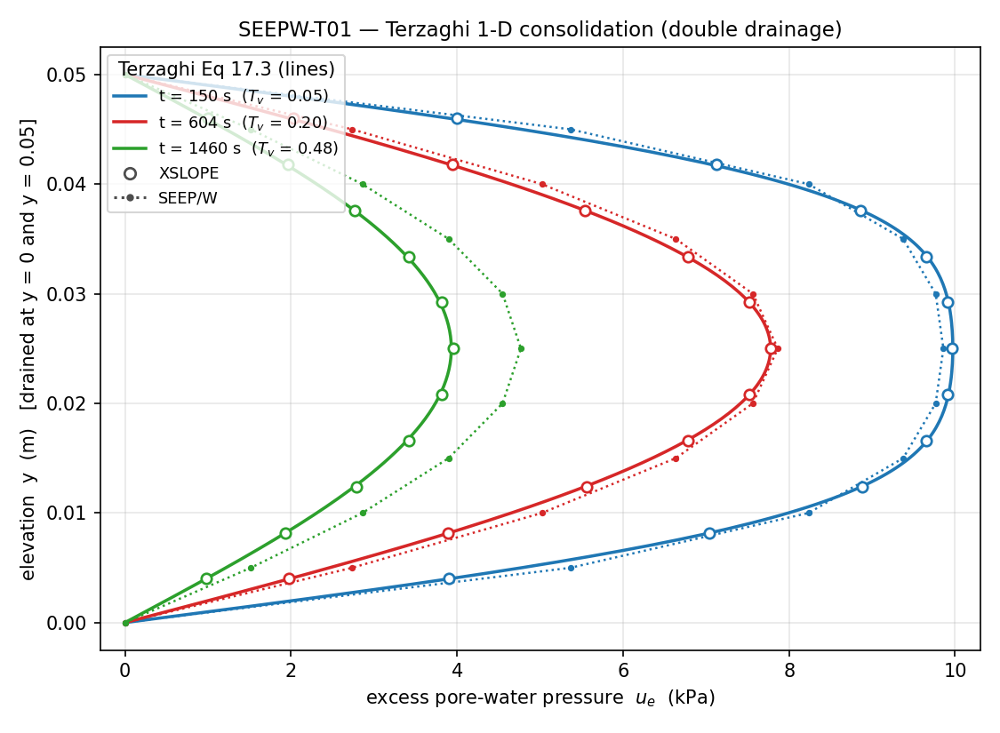

| t (s) | U (Terzaghi) | XSLOPE centre | Terzaghi centre $u_e$ | SEEP/W centre |
|---:|---:|---:|---:|---:|
| 150 | 25% | 9.96 kPa | 9.97 kPa (−0.01) | 9.86 kPa (+0.10) |
| 604 | 50% | 7.78 kPa | 7.78 kPa (0.00) | 7.86 kPa (−0.08) |
| 1460 | 75% | 3.95 kPa | 3.93 kPa (+0.02) | 4.77 kPa (−0.82) |

XSLOPE sits on the Terzaghi closed form to within 0.02 kPa at every point and time — the
locked values are the analytical excess heads. SEEP/W is a second, independent comparison:
it agrees at early time but lags the closed form by t = 1460 s (its own reported degree of
consolidation is 24/48/69 % against Terzaghi's 25/50/75 %), because it runs only ten
exponential time steps, where XSLOPE steps finely. This is visible in the figure as the
green (t = 1460 s) SEEP/W dots standing off the analytical curve while XSLOPE's open
circles lie on it.

**Sources:** GeoStudio SEEP/W example "Simulating Consolidation with SEEP/W"; Terzaghi
(1943), *Theoretical Soil Mechanics*, Eq. 17.3.

<!-- test: file=files/geostudio/gs2_cons.xlsx, type=tseep_head, target_size=0.001, time=150, max_head_change_frac=0.02, points=0.005:0.0125:100.9073;0.005:0.025:101.0165;0.005:0.0375:100.9073, tolerance=0.02, benchmark=SEEPW-CONS-t150 -->
<!-- test: file=files/geostudio/gs2_cons.xlsx, type=tseep_head, target_size=0.001, time=604, max_head_change_frac=0.02, points=0.005:0.0125:100.5683;0.005:0.025:100.7928;0.005:0.0375:100.5683, tolerance=0.02, benchmark=SEEPW-CONS-t604 -->
<!-- test: file=files/geostudio/gs2_cons.xlsx, type=tseep_head, target_size=0.001, time=1460, max_head_change_frac=0.02, points=0.005:0.0125:100.2834;0.005:0.025:100.4008;0.005:0.0375:100.2834, tolerance=0.02, benchmark=SEEPW-CONS-t1460 -->

### SEEPW-T02 — Verification: infiltration into dry soil {#seepw-t02}

The canonical hard-infiltration benchmark, and the **unsaturated** counterpart to T01: a
1 m column, initially dry at a uniform pressure head ψ = −8 m, is ponded at the surface
(ψ = 0) and a sharp wetting front advances downward over 46 800 s. It exercises the parts
of the transient path T01 does not — the van Genuchten moisture-capacity storage C(ψ)
(θ_s = 0.363, θ_r = 0.186 so the drainable porosity S_y = 0.177; GeoStudio A = 9.81 kPa
maps to α = 1.0 /m, n = 1.53) and the van Genuchten–Mualem relative permeability kr(ψ),
on Ksat = 1×10⁻⁶ m/s. The dry initial state is set without an explicit initial-head
field: a uniform ψ with a unit downward gradient is itself a steady state, so holding the
top and bottom at ψ = −8 at t = 0 makes the steady initial solve return it, and for
t > 0 the top steps to the ponded head.

**Input:** [gs2_infil.xlsx](files/geostudio/gs2_infil.xlsx)

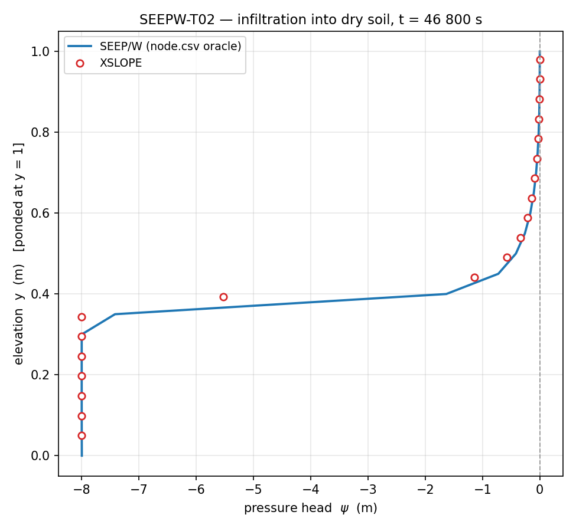

The comparison is against SEEP/W's own `node.csv` pressure field at the final time (the
published external reference is the [Warrick, Lomen & Yates (1985)](https://doi.org/10.2136/sssaj1985.03615995004900010006x) semi-analytical
profile). XSLOPE reproduces the **wetted zone** behind the front — the physically
meaningful, water-bearing part of the profile — to within 0.05 m of head:

| y (m) | XSLOPE ψ | SEEP/W ψ (Δ = XSLOPE − SEEP/W) |
|---:|---:|---:|
| 0.6 | −0.215 m | −0.166 m (−0.049 m) |
| 0.7 | −0.082 m | −0.064 m (−0.018 m) |
| 0.8 | −0.025 m | −0.020 m (−0.005 m) |
| 0.9 | −0.003 m | −0.003 m (0.000 m) |

The mid-front (ψ = −4 m) crossing lands at y ≈ 0.41 in XSLOPE against y ≈ 0.37 in
SEEP/W — a ~0.04 m offset that is the expected **lumped-mass vs consistent-mass front
diffusion**: XSLOPE uses a lumped HRZ mass matrix, which damps the front oscillations
SEEP/W's own dry-soil write-up warns about at the cost of a slightly smeared front
position. The deep dry zone below the front differs by up to 0.3 m of head for a
different reason: SEEP/W holds ψ = −8 there (its explicit initial condition, essentially
frozen since kr is tiny), where XSLOPE's steady-solve initial condition relaxes to
hydrostatic; on the flat dry tail of the retention curve this barely changes the water
deficit the front must fill, which is why the front position and wetted profile still
agree. The four wetted-zone points above are locked at a 0.08 m tolerance, wider than the
0.05 m used on the saturated groundwater page so that it carries the front-diffusion
offset.

**Sources:** GeoStudio SEEP/W example "Verification – Infiltration into Dry Soil";
Warrick, Lomen & Yates (1985), *Soil Sci. Soc. Am. J.* 49.

<!-- test: file=files/geostudio/gs2_infil.xlsx, type=tseep_head, target_size=0.01, time=46800, max_head_change_frac=0.01, points=0.025:0.6:0.4344;0.025:0.7:0.6358;0.025:0.8:0.7803;0.025:0.9:0.8967, tolerance=0.08, benchmark=SEEPW-INF -->

### SEEPW-T03 — Rapid drawdown {#seepw-t03}

A two-dimensional reservoir drawdown on an embankment dam. A silty-clay embankment (base
x = 3–47 m, crest 10 m tall, upstream slope carrying a reservoir to el. 8, a free-draining
toe drain below the downstream toe) sits at steady state under a full reservoir, then is
drained two ways: **instantaneously** (the reservoir is removed at t = 0, head steps
8 → 0) and **slowly** (head falls 8 → 0 m linearly over 5 days). Both run 30 days. The pair
exercises the **submerged-only Dirichlet series head** path: a node
on the upstream face is held at the reservoir head h(t) only while submerged
(y ≤ h(t)) and flips to a potential seepage (exit) face once the falling water line drops
below it, so the emerging upstream face and the trapped-then-dissipating interior
pressures are resolved by the same active-set the steady unconfined solver uses.

The dam fill is a silty clay (Ksat = 1×10⁻⁶ m/s, θ_s = 0.4, θ_r = 0.05 so S_y = 0.35,
m_v = 1×10⁻⁴ /kPa so S_s = 9.81×10⁻⁴ /m). The vendor's SampleMatls "Silty Clay" retention
curve is mapped to van Genuchten by a least-squares fit of its 20 tabulated points
(suction → pressure head), giving α = 0.338 /m, n = 1.85 (RMS 0.007 in effective
saturation). The toe drain is ~11× more permeable (Ksat = 1.157×10⁻⁵ m/s) and its boundary
is pinned at total head 0. The initial condition is the t = 0 steady solve with the
reservoir series held at 8 m, the same repeated-time step-series construction
[GW15–21](rocscience_groundwater.md) and T01/T02 use.

**Input:** [gs2_rdd_inst.xlsx](files/geostudio/gs2_rdd_inst.xlsx) (instantaneous),
[gs2_rdd_slow.xlsx](files/geostudio/gs2_rdd_slow.xlsx) (slow)

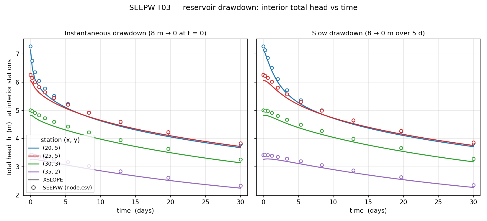

The example's *published* answer is a factor-of-safety-vs-time curve from a downstream
SLOPE/W coupling — out of scope here — so the seepage comparison is SEEP/W's own solved
`node.csv` pore-pressure field, and the locked values are XSLOPE's own solved total heads
at four interior stations, checked against the vendor at the initial state, mid-drawdown,
and the near-drained end state.

**How the reference column is read.** Each SEEP/W value below is the vendor's own solved
field sampled at the station: total head h = y + u/γ<sub>w</sub> built from the `node.csv`
pore pressures on the analysis mesh `mesh_1.ply`, interpolated by the same inverse-squared-
distance probe over the four nearest nodes that reads XSLOPE's field. Sampling both sides
with one probe is what makes the difference column a difference in the *fields* rather than
in how they were read.

| station (x, y) | state | XSLOPE h | SEEP/W h (Δ head) |
|---|---|---:|---:|
| (20, 5) | IC (full reservoir) | 7.166 m | 7.280 m (−0.11 m) |
| (25, 5) | IC (full reservoir) | 6.030 m | 6.258 m (−0.23 m) |
| (30, 3) | IC (full reservoir) | 4.818 m | 5.008 m (−0.19 m) |
| (20, 5) | slow, t = 1.2 d | 6.427 m | 6.509 m (−0.08 m) |
| (30, 3) | slow, t = 1.2 d | 4.755 m | 4.914 m (−0.16 m) |
| (20, 5) | instantaneous, t = 30 d | 3.714 m | 3.808 m (−0.09 m) |
| (35, 2) | instantaneous, t = 30 d | 2.236 m | 2.331 m (−0.10 m) |

Across the whole 30-day drawdown the interior seepage field tracks SEEP/W to within
0.08–0.23 m of head — 1.0–2.9% of the 8 m drawdown, and the largest of them is at the
t = 0 steady initial condition, a state with no storage and no timing in it. XSLOPE runs
uniformly a little below SEEP/W at every station and both drawdown rates, and the offset is
close to constant in time — a difference in the steady field the transient starts from, not
in the rate at which it drains. Two model-setup differences remain untranscribed and are the
open candidates for it: the vendor meshes this dam as three regions with the core refined to
0.5 m on a quad-dominant mesh where XSLOPE's build merges them into one polygon at a uniform
0.7 m tri3 size, and the toe drain is saturated-only in the vendor model against XSLOPE's
linear unsaturated front. The locks are on the interior
stations at the IC, mid-drawdown, and end state, at a 0.03 m regression tolerance on
XSLOPE's own values.

**Sources:** GeoStudio SEEP/W example "Rapid Drawdown" (Seequent); the SLOPE/W factor-of-
safety coupling is documented on the [importer verification](#importer-verification) rows
above but is not part of this seepage lock.

<!-- test: file=files/geostudio/gs2_rdd_inst.xlsx, type=tseep_head, target_size=0.7, time=0, max_head_change_frac=0.05, points=20:5:7.166;25:5:6.030;30:3:4.818;35:2:3.216, tolerance=0.03, benchmark=SEEPW-RDD-inst-ic -->
<!-- test: file=files/geostudio/gs2_rdd_inst.xlsx, type=tseep_head, target_size=0.7, time=2592000, max_head_change_frac=0.05, points=20:5:3.714;25:5:3.743;30:3:3.167;35:2:2.236, tolerance=0.03, benchmark=SEEPW-RDD-inst-end -->
<!-- test: file=files/geostudio/gs2_rdd_slow.xlsx, type=tseep_head, target_size=0.7, time=103638, max_head_change_frac=0.05, points=20:5:6.427;25:5:5.857;30:3:4.755;35:2:3.227, tolerance=0.03, benchmark=SEEPW-RDD-slow-mid -->
<!-- test: file=files/geostudio/gs2_rdd_slow.xlsx, type=tseep_head, target_size=0.7, time=2592000, max_head_change_frac=0.05, points=20:5:3.750;25:5:3.778;30:3:3.200;35:2:2.261, tolerance=0.03, benchmark=SEEPW-RDD-slow-end -->

### SEEPW-T04 — Leakage from pond with clay liner {#seepw-t04}

The two-dimensional unconfined transient with an exit face — the benchmark for a
storage-driven **water-table rise**. A clay-lined pond on a hillside (a symmetric
half-model, x = 0 the pond centre-line) is filled to a constant level; water leaks down
through the low-permeability liner into the embankment, and the phreatic surface rises
over 240 days from its initial far-field position toward a new near-steady leaking state
that drains out the downstream seepage face. The solver's quadratic-exit-face caveat
calls for a **linear** mesh here, so the model is meshed with tri3 elements — as SEEP/W's
own mesh is (1083 quad4 + 31 tri3, no higher-order elements anywhere in `mesh_1.ply`).

The embankment fill is Ksat = 1.157×10⁻⁶ m/s (θ_s = 0.35, θ_r = 0.032 so S_y = 0.318);
the clay liner is ~12× less permeable (Ksat = 9.259×10⁻⁸ m/s, θ_s = 0.45, θ_r = 0.131).
Both vendor retention functions carry Beta (m_v) = 0.001 /kPa, so
S_s = γ_w·m_v = 9.81×10⁻³ m⁻¹.

**The van Genuchten pairs are fitted to the vendor's conductivity tables, not to its
retention splines.** SEEP/W ships θ(ψ) and k(ψ) as two independent 20-point tables, and
XSLOPE has one (α, n) driving both the relative conductivity and the moisture capacity, so
the fit has to choose. It fits k(ψ) (fill α = 0.661 /m, n = 1.988; liner α = 0.168 /m,
n = 1.603), because the liner's conductivity at the ≈7 kPa the vendor's own write-up says
prevails beneath the pond is what sets the leakage rate. Against the vendor's tables that
choice costs and buys measurably: the relative-conductivity residual is 0.004 and 0.011
decades rms (fill, liner) against 0.059 and 0.151 for a retention fit, while the retention
residual rises to 0.016 and 0.079 RMS in effective saturation from 0.008 and 0.022.

**The liner is meshed at the vendor's own 0.125 m.** SEEP/W sets a 0.5 m global edge length
with a RelativeLength 0.25 constraint on the liner region, and its write-up states the
reason — "to simulate the influence of the clay liner on the movement of water accurately".
A uniform 0.5 m tri3 mesh puts *eleven* triangles in the whole liner with no nodes interior
to it, so the entire head drop the problem turns on is carried by a single layer of
constant-gradient elements. The tags run `refine_factor=2`, whose thin-zone size field lands
the liner at a 0.125 m mean element edge (145 triangles, 42 interior nodes). The initial
condition is the pre-fill steady state — the pond series held at head 4 m, below the pond
floor at y = 10 m, so the floor nodes are unsubmerged (inactive exit faces) and only the
far-field water table at el. 4 sets the field (uniform total head 4). For t > 0 the pond
series steps to head 10.5 m (the floor submerges to a Dirichlet head) and the pond leaks —
the same submerged-only reservoir series as the rapid-drawdown problem ([T03](#seepw-t03)),
run in the filling direction.

**Input:** [gs2_pond.xlsx](files/geostudio/gs2_pond.xlsx)

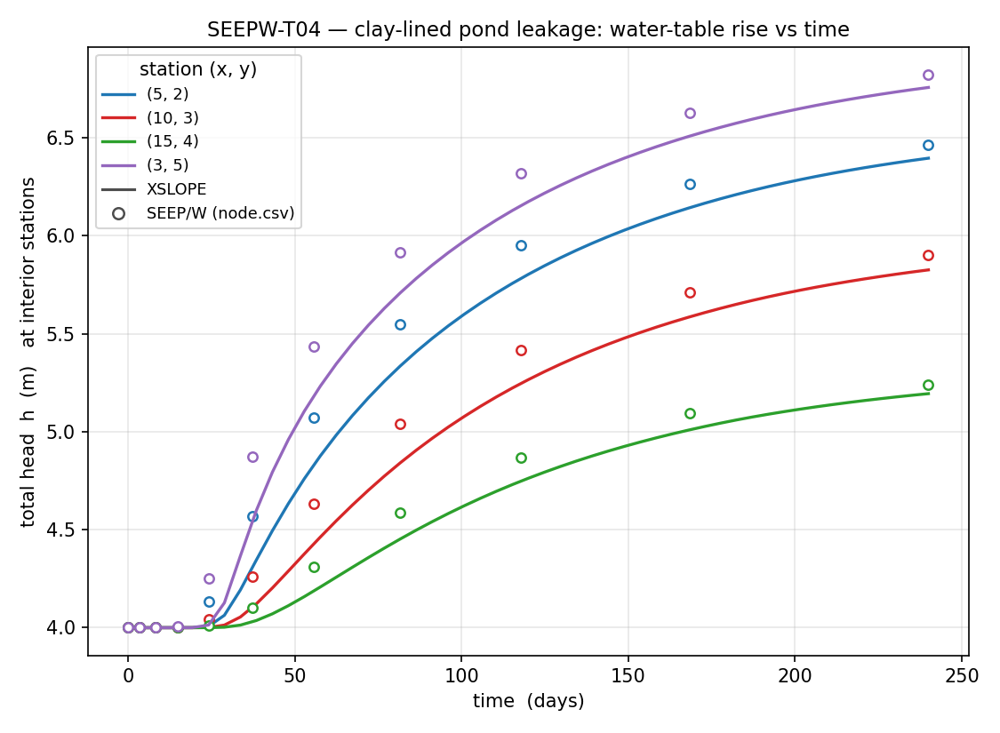

The example's *published* answer is a water-table-rise-vs-time graph (no closed form), so
the seepage comparison is SEEP/W's own solved `node.csv`, and the locked values are XSLOPE's
own solved total heads at interior stations at the initial state and the near-steady
leaking end state:

As on [T03](#seepw-t03), each SEEP/W value is the vendor's own solved field — total head
h = y + u/γ<sub>w</sub> from the step's `node.csv` on `mesh_1.ply` — read with the same
inverse-squared-distance probe over the four nearest nodes that reads XSLOPE's.

| station (x, y) | state | XSLOPE h | SEEP/W h (Δ head) |
|---|---|---:|---:|
| (5, 2) | IC (pre-fill) | 4.000 m | 4.000 m (0.00 m) |
| (5, 2) | t = 24 d (filling) | 4.007 m | 4.133 m (−0.13 m) |
| (3, 5) | t = 24 d (filling) | 4.014 m | 4.251 m (−0.24 m) |
| (5, 2) | t = 240 d (near-steady) | 6.395 m | 6.463 m (−0.07 m) |
| (10, 3) | t = 240 d (near-steady) | 5.825 m | 5.900 m (−0.08 m) |
| (15, 4) | t = 240 d (near-steady) | 5.194 m | 5.238 m (−0.04 m) |
| (20, 4) | t = 240 d (near-steady) | 4.393 m | 4.424 m (−0.03 m) |

The initial condition is exact (uniform head 4) and the fully developed leaking state now
tracks SEEP/W to **0.03–0.08 m** at every station — about 1% of the 6.5 m pond head. The
worst delta has moved to the *filling* frame at 24 days, where XSLOPE is 0.13–0.24 m low,
i.e. it fills more slowly than SEEP/W.

That residual has a measured cause rather than an attributed one. XSLOPE adds the elastic
specific storage S<sub>s</sub> everywhere, including above the phreatic surface, while
SEEP/W applies m<sub>v</sub> only where the soil is saturated and takes the unsaturated
capacity from the retention curve alone; leakage into initially unsaturated fill therefore
has ~9.8×10⁻³ m⁻¹ of storage to fill in XSLOPE that SEEP/W does not carry. Re-running the
same model with S<sub>s</sub> confined to the saturated zone takes the 240-day frame to
±0.016 m at every station and the 24-day frame to −0.08 / −0.13 m. The same term accounts
for [GW18](rocscience_groundwater.md#gw18)'s late-frame timing lag on the Slide2 corpus.
It is recorded here rather than changed: it sets the timing of every transient row in
both corpora.

The locks are on the interior stations at the two near-steady end members (IC and
t = 240 d), at a 0.03 m regression tolerance on XSLOPE's own values.

**Sources:** GeoStudio SEEP/W example "Leakage from Pond with Clay Liner" (Seequent).

<!-- test: file=files/geostudio/gs2_pond.xlsx, type=tseep_head, target_size=0.5, refine_factor=2, time=0, max_head_change_frac=0.05, points=5:2:4.0000;10:3:4.0000;15:4:4.0000, tolerance=0.03, benchmark=SEEPW-POND-ic -->
<!-- test: file=files/geostudio/gs2_pond.xlsx, type=tseep_head, target_size=0.5, refine_factor=2, time=2.0736e+07, max_head_change_frac=0.05, points=5:2:6.3949;10:3:5.8250;15:4:5.1938, tolerance=0.03, benchmark=SEEPW-POND-end -->

### SEEPW-T05 — Mineral heap leaching {#seepw-t05}

A one-dimensional column of leach ore under a surface irrigation flux — the test of
XSLOPE's **specified-flux (Neumann) boundary** path and the van Genuchten moisture-capacity
storage in a gravity-drained unsaturated column. The uniform silty-sand ore column (8 m,
Ksat = 5×10⁻⁶ m/s, θ_s = 0.5, θ_r = 0.025 so S_y = 0.475; the vendor retention spline
maps to van Genuchten α = 1.39 /m, n = 1.90) drains freely at its base (specified head 0)
and takes a downward irrigation flux at its top, bound to a `tseep` series. The initial
condition is the low-rate steady state (q = 3×10⁻⁷ m/s); at t = 0 the series steps to the
high rate (q = 3×10⁻⁶ m/s) and the extra water works its way down. (The example's *other*,
non-transient analyses layer the coarse/fine ore; the transient rate case runs on the
single uniform ore, as read from the vendor's own material assignment.)

The low-rate initial condition is a gravity-drained **unit-gradient** profile: away from
the base the steady pressure head is the constant ψ with kr(ψ)·Ksat = q, i.e. kr = 0.06 so
ψ ≈ −0.78 m, relaxing to ψ = 0 at the drained base. That nonlinear unsaturated steady
state is only found by XSLOPE's unsaturated (exit-face) initial-condition solver, not the
linear confined one, so the column's impermeable upper side is declared a potential
seepage-exit face. It never activates (ψ < 0 over the whole run, so it is a no-flow
boundary in fact) but it routes the t = 0 solve through the unsaturated solver, which
returns the unit-gradient profile; without it the linear confined IC would return a dry
hydrostatic column and the front would never advance.

**Input:** [gs2_heap.xlsx](files/geostudio/gs2_heap.xlsx)

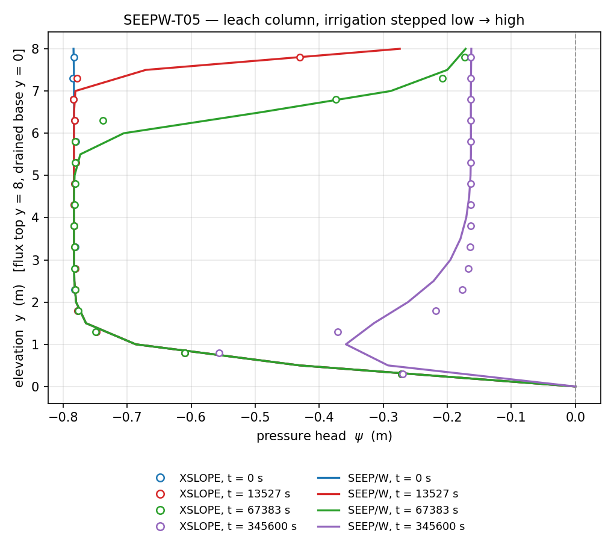

The published answer is a graphical volumetric-water-content / flow-rate response (no
closed form), so the seepage comparison is SEEP/W's own solved `node.csv`:

| Frame | XSLOPE total head at y = 2 / 4 / 6 m | Δ vs SEEP/W (bound over the sampled stations) |
|---|---|---|
| Initial condition, low rate (t = 0) | 1.2471 / 3.2540 / 5.2570 | within ≈0.04 m of head |
| High-rate near-steady (t = 96 h) | 1.8479 / 3.8634 / 5.8670 | up to ≈0.12 m at the deep stations |

SEEP/W's own per-station values are not reproduced here — the vendor `.gsz` and its solved
`node.csv` are Seequent's and are not redistributed — so the comparison column carries the
bound the frames satisfy rather than a per-station source value. At the high-rate near-steady
end state XSLOPE reaches a flatter, slightly wetter unit-gradient profile than SEEP/W, the
SWCC-mapping timing caveat — the
van Genuchten kr(ψ) wets the column a little faster than SEEP/W's tabulated conductivity
spline. The figure shows the XSLOPE markers on the SEEP/W low-rate profile at the IC and
early frames and standing off it at the high-rate near-steady. The locks are XSLOPE's own
solved total heads at interior elevations at the IC and end state, at a 0.03 m regression
tolerance.

**Sources:** GeoStudio SEEP/W example "Mineral Heap Leaching" (Seequent).

<!-- test: file=files/geostudio/gs2_heap.xlsx, type=tseep_head, target_size=0.2, time=0, max_head_change_frac=0.05, points=0.1:2:1.2471;0.1:4:3.2540;0.1:6:5.2570, tolerance=0.03, benchmark=SEEPW-HEAP-ic -->
<!-- test: file=files/geostudio/gs2_heap.xlsx, type=tseep_head, target_size=0.2, time=345600, max_head_change_frac=0.05, points=0.1:2:1.8479;0.1:4:3.8634;0.1:6:5.8670, tolerance=0.03, benchmark=SEEPW-HEAP-end -->

### SEEPW-T06 — Infiltration into multi-layered system (blocked) {#seepw-t06}

A laboratory column ponds water on a fourteen-layer soil profile and watches a wetting
front descend (the "Infiltration" analysis), then lets it drain (a "Drainage" child). The
drainage leg is hysteretic, and XSLOPE carries a single retention curve per material, so
it cannot be reproduced. The infiltration leg is blocked by two features of the vendor
model:

1. **A non-steady, per-layer initial condition.** The vendor imposes the initial state
   layer by layer through a per-material initial pore-pressure attribute, and it is not a
   hydrostatic or steady field — it is a measured profile with a −50 kPa suction *spike*
   wedged between −5 and −30 kPa layers near the surface. No steady solve returns that
   field. XSLOPE's transient solver *can* take an arbitrary initial field through its
   `h_init` argument, but the regression check here computes the initial condition as a
   t = 0 **steady** solve of the boundary configuration, with no way to inject a per-node
   initial head, so the forward solve — expressible in code — cannot be locked.

2. **A unit-gradient (free-drainage) base boundary.** The base is a unit-gradient outlet
   (q = kr·Ksat out under gravity). XSLOPE's seepage BC set is specified head, specified
   flux and potential seepage face — there is no unit-gradient boundary, and an exit face
   clamps the base to ψ = 0 rather than letting it drain under a unit gradient.

Either feature alone blocks a faithful lock. The van Genuchten storage and kr path this
example would exercise is already covered against clean references by
[SEEPW-T02](#seepw-t02) (infiltration into dry soil) and [SEEPW-T05](#seepw-t05) (the
leach column). The model itself is written by
`benchmarks/geostudio/build_gs2_mlayer.py`.

**Sources:** GeoStudio SEEP/W example "Infiltration into Multi-Layered System" (Seequent);
field / HYDRUS-1D references (Zettl 2011, Huang 2011).

### SEEPW-T07 — GeoStudio-PEST Multistep Outflow {#seepw-t07}

A multistep-outflow laboratory experiment: a coarse-sand sample (van Genuchten
a = 8.91 /m, n = 10.19, S_y = 0.319) sits on a saturated porous ceramic plate (two
orders of magnitude less permeable than the sand, so it meters the outflow), and the
base **suction** is stepped progressively more negative in five stages over ~61 hours.
It exercises the unsaturated storage term C(ψ) under a stepped specified-pressure-head
boundary.

The base head is a *suction* — a specified **pressure head that is negative at every
stage** (IC −0.073 m, stepping to −0.093 … −0.175 m). Because the base polyline sits at
y = 0, its total head equals its pressure head, and it is carried by a time-varying
**head** (plain-Dirichlet) series: the boundary is held at h(t) at every node of the
polyline at all times, so the negative-pressure Dirichlet is applied faithfully (unlike
the submerged-only *reservoir* series, which would flip an unsubmerged node to a
pressure-head-0 exit face and drop the suction). The IC is the uniform H = −0.073 m
column reached by the t = 0 steady solve, set with a repeated-time step series.

The published external answer is the lab outflow curve (the scalar the example's PEST
loop fits), not a seepage headline number, so the lock is XSLOPE's own solved total-head
field as a regression guard; the SEEP/W `node.csv` pore-water pressures are read as the
comparison. The high-conductivity sample equilibrates within the sample in
seconds, so at each reporting time the column has drained to the current base suction and
the total head is uniform at that stage value — the hydrostatic profile ψ(y) = h − y then
matches SEEP/W's stepped-suction field to within the read-off precision of the published
`node.csv` (the residual is storage-discretization; the van Genuchten fit reproduces the
retention curve to RMS 1×10⁻⁴, so it is not SWCC mapping).

**Input:** [gs2_mso.xlsx](files/geostudio/gs2_mso.xlsx)

| t (s) | Stage base suction (m) | XSLOPE total head (m) | ψ at y = 0.02 … 0.10 m |
|---|---|---|---|
| 46 000 | −0.093 | −0.0932 | −0.113 … −0.193 |
| 132 000 | −0.134 | −0.1341 | −0.154 … −0.234 |
| 219 600 | −0.175 | −0.1749 | −0.195 … −0.275 |

<!-- test: file=files/geostudio/gs2_mso.xlsx, type=tseep_head, target_size=0.004, time=46000, points=0.003:0.02:-0.0932;0.003:0.06:-0.0932;0.003:0.1:-0.0932, tolerance=0.01, benchmark=SEEPW-T07-t46000 -->
<!-- test: file=files/geostudio/gs2_mso.xlsx, type=tseep_head, target_size=0.004, time=132000, points=0.003:0.02:-0.1341;0.003:0.06:-0.1341;0.003:0.1:-0.1341, tolerance=0.01, benchmark=SEEPW-T07-t132000 -->
<!-- test: file=files/geostudio/gs2_mso.xlsx, type=tseep_head, target_size=0.004, time=219600, points=0.003:0.02:-0.1749;0.003:0.06:-0.1749;0.003:0.1:-0.1749, tolerance=0.01, benchmark=SEEPW-T07-t219600 -->

**Sources:** GeoStudio SEEP/W example "GeoStudio-PEST – Multistep Outflow" (Seequent).
