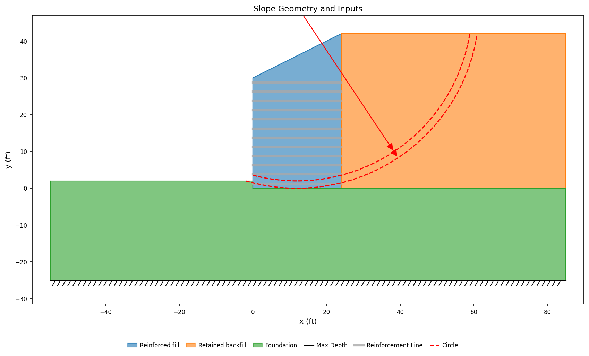
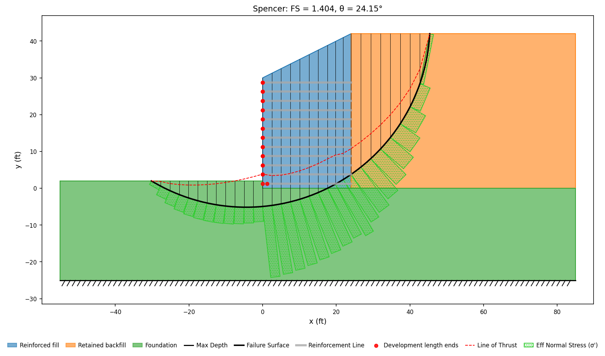
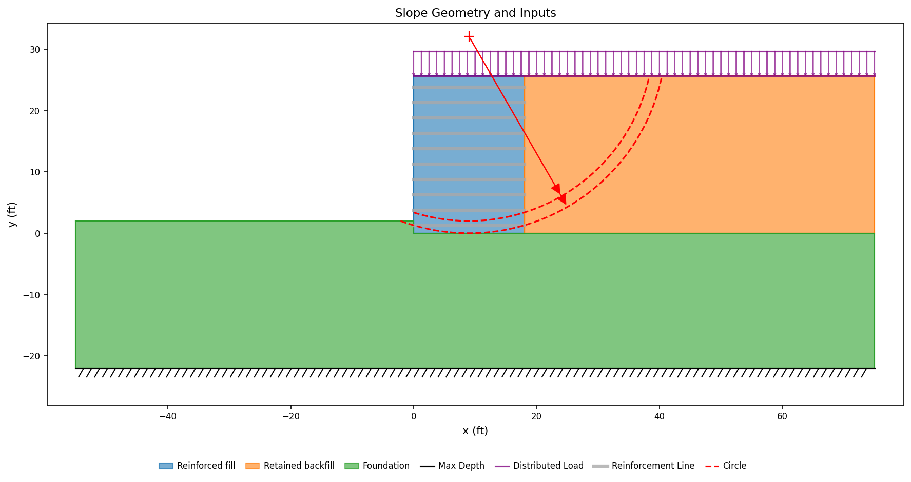
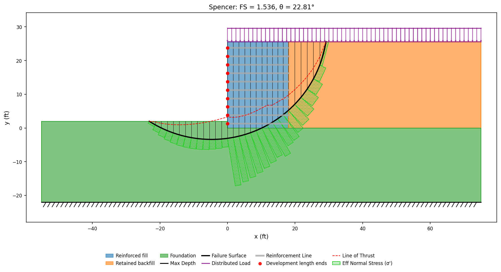
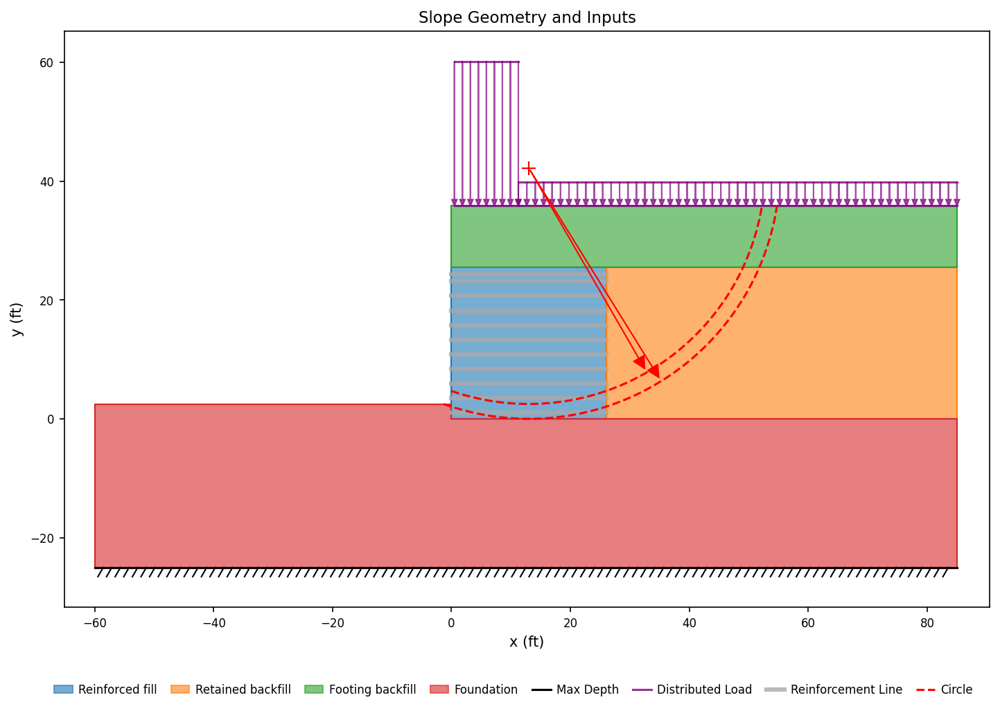
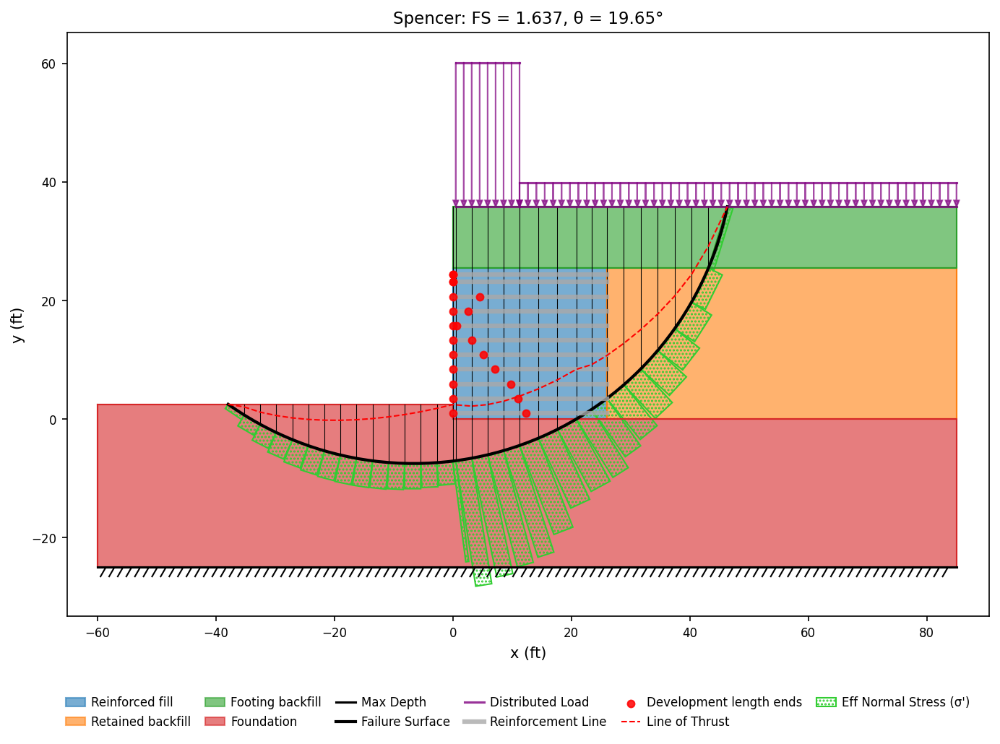
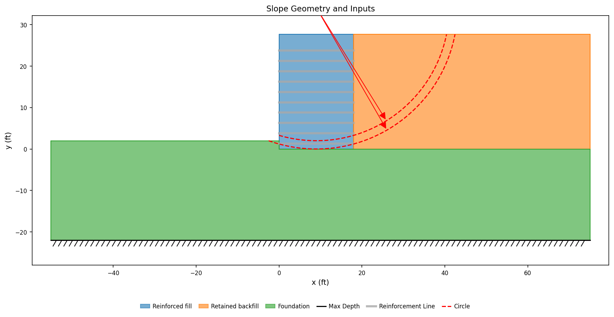
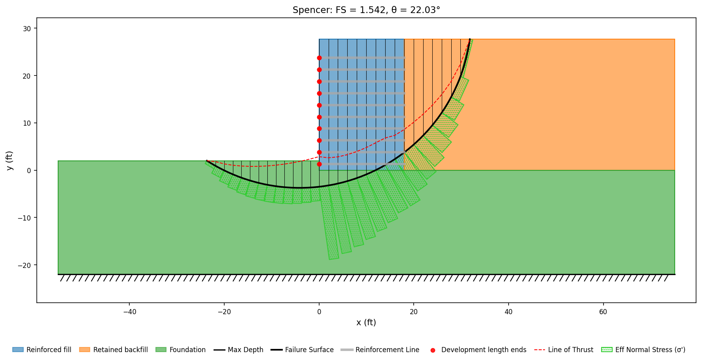
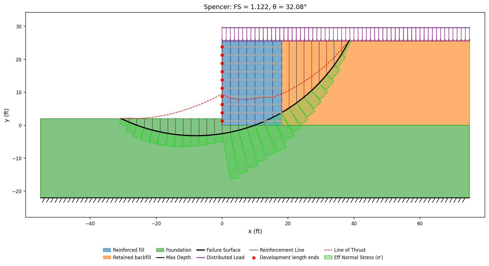

# Published Problems

The other corpus pages compare XSLOPE against a program: a vendor verification
manual states what Slide2, RS2 or SLOPE/W returns, and the comparison is one
solver against another. This page collects problems of a different kind —
**worked examples published as hand calculations**, in design manuals and in the
literature, where the reference value was computed from a stated equation and
printed step by step.

Those problems verify something the program-to-program comparisons cannot. A
published hand calculation names its own formula, so agreement is traceable to a
particular clause of a particular design method rather than to two codes
happening to share an implementation. Where a manual tabulates a quantity layer
by layer or station by station, the whole table is locked, not a single headline
number.

Full bibliographic details for the author-year citations on this page are on the
shared [References](references.md) page.

**Match to the published value**

| Symbol | Meaning |
|---|---|
| 🟢 | within 3% of the vendor and/or reference figure |
| 🟡 | 3–6% |
| 🔴 | more than 6% |
| 🟣 | in progress |
| ⊘ | insufficient data or out of scope |

The dot scores the **match quality of what is locked**, not how much of a
problem is built; the partial detail is in the row text. A worked example
frequently publishes one part of a design and defers the rest, and where XSLOPE
computes a quantity the example does not carry, that quantity is reported as
XSLOPE's own with no published counterpart and takes no dot.

| # | Match | Problem | Results | Notes |
|---:|:-:|---|---|---|
| [E1](#fhwa-e1) | 🟢 | FHWA MSE wall — per-layer geogrid pullout | All eleven layers of Table E1-7.5 reproduced within 0.1% of the manual's nominal pullout resistance | **built**; the example defers global and compound stability, so XSLOPE's searched Spencer 1.477 has no published counterpart |
| [E3](#fhwa-e3) | 🟢 | FHWA MSE wall — sloping backfill, steel strips | Every one of the twelve levels of Table E3-7.3 within 0.1% of the manual's per-strip pullout resistance | **built**; the example works no stability analysis, so XSLOPE's searched Spencer 1.404 has no published counterpart |
| [E4](#fhwa-e4) | 🟢 | FHWA MSE wall — level backfill, steel bar mats | All ten levels of Table E4-7.4 within 0.1% of the manual's per-mat pullout resistance | **built**; the example works no stability analysis, so XSLOPE's searched Spencer 1.536 has no published counterpart |
| [E5](#fhwa-e5) | 🟢 | FHWA bridge abutment on a spread footing | All eleven levels of Table E5-8.3 within 0.1% of the manual's per-strip pullout resistance | **built**; the example works no stability analysis, so XSLOPE's searched Spencer 1.637 has no published counterpart |
| [E6](#fhwa-e6) | 🟢 | FHWA MSE wall — traffic barrier impact | Both layers the impact check covers within 0.3% of the manual's full-length pullout resistance | **built**; the impact loads are tension demands the envelope does not carry, and XSLOPE's searched Spencer 1.542 has no published counterpart |
| [E7](#fhwa-e7) | 🟢 | FHWA MSE wall — seismic loading | All ten levels of Table E7-7 within 0.1% of the manual's reduced seismic pullout resistance | **built**; the example checks capacity against demand rather than solving for a factor of safety, so XSLOPE's searched Spencer 1.122 has no published counterpart |

---

## 🟢 FHWA Example E1 — MSE wall with a broken backslope {#fhwa-e1}

The FHWA MSE wall manual (Berg et al., 2009) works ten design examples in
Appendix E of its second volume. Example E1 is a modular-block-faced wall
reinforced with geogrid, and Step 7.8 of the example checks every reinforcement
layer for pullout and tabulates the result.

**The problem.** The wall stands 18 ft above finished grade and is embedded 2 ft,
so its design height is H = 20 ft. A 2H:1V backslope rises 9 ft from the top of
the wall to a crest that sits directly above the back end of the reinforcement,
which fixes the total height above the leveling pad at 29 ft; the retained
backfill is level beyond the crest and carries a 250 psf traffic surcharge.
Eleven geogrid layers, each 18 ft long, are placed at the depths Z of the table
below, from 0.67 ft under the top of the wall to 0.67 ft above the leveling pad.
All three soils weigh 125 pcf and are drained with no cohesion: the reinforced
wall fill at φ = 34°, the retained backfill and the foundation at φ = 30°. There
is no groundwater. The manual instructs that the 3° facing batter be treated as
vertical, and the model does so.

**Input:** [fhwa_e1.xlsx](files/published/fhwa_e1.xlsx) · built by
`benchmarks/published/build_fhwa_e1.py`

{width=800}

**The pullout law, in the manual's terms and in XSLOPE's.** FHWA writes the
nominal pullout resistance of a layer as

>$P_r = F^{*}\alpha\,\sigma'_v L_e C R_c$

with $F^{*} = 0.45$ and $\alpha = 0.8$ for these geogrids, $C = 2$ for the two
bearing faces of a sheet, and a coverage ratio $R_c = 1.0$ for continuous
geogrid. XSLOPE states the same resistance as a rate per unit length of line,
$r(s) = 2(a + \sigma'_v(s)\tan\delta)$, and integrates it along the embedment
([overburden-dependent pullout](../lem/reinforcement.md#pullout-from-the-effective-overburden)).
The two are the same statement with the adhesion set to zero and

>$\delta = \arctan(F^{*}\alpha) = \arctan(0.36) = 19.80°$

XSLOPE's factor of two carrying the manual's $C$, and $R_c = 1$ needing no
representation because the law is already stated per unit width of a continuous
sheet. So the reinforce sheet takes Adhesion = 0 and Delta = 19.80° on every
layer, and nothing else about the bond is entered.

A reinforcement that covers less of the wall than a continuous sheet — steel
strips or bar mats at a horizontal spacing — carries its coverage ratio in the
same place, $\delta = \arctan(F^{*}\alpha R_c)$ on the interface and $T_{max} =
T_{al}R_c$ on the capacity. Equivalently, and more directly, the reinforce sheet
takes the manual's own per-element values with Spacing set to the element's
horizontal spacing, which the loader divides through once. The manual's steel
examples, [E3](#fhwa-e3) through [E7](#fhwa-e7), are built that way.

The one difference in form is what the two integrate. FHWA evaluates $\sigma'_v$
once, at the depth $Z_P$ of soil standing over the **midpoint** of the resisting
length, and multiplies by that length; XSLOPE integrates the vertical stress
point by point along the line. Under a straight backslope the two agree
identically, because the mean of a linear depth over an interval is its value at
the midpoint — which is what makes this table an exact check of the law rather
than an approximate one.

**Per-layer pullout resistance.** The internal failure surface for extensible
reinforcement is the Rankine wedge from the toe, $L_a = (H - Z)\tan(45° -
\varphi_r/2)$, and $L_e = L - L_a$ is the embedment beyond it. Reading XSLOPE's
envelope at the station where that surface crosses each layer gives the
resistance the resisting zone alone develops, which is the quantity Table E1-7.5
publishes:

| Layer | Z (ft) | La (ft) | Le (ft) | ZP (ft) | Tal (lb/ft) | XSLOPE Pr (lb/ft) | FHWA Pr (lb/ft) |
|---:|---:|---:|---:|---:|---:|---:|---:|
| 1 | 0.67 | 10.28 | 7.72 | 7.74 | 1,085 | 5,378 | 5,378 (0.0%) |
| 2 | 2.67 | 9.22 | 8.78 | 9.47 | 1,085 | 7,488 | 7,483 (+0.1%) |
| 3 | 4.67 | 8.16 | 9.84 | 11.21 | 1,085 | 9,928 | 9,928 (0.0%) |
| 4 | 6.67 | 7.09 | 10.91 | 12.94 | 1,085 | 12,709 | 12,706 (0.0%) |
| 5 | 8.67 | 6.03 | 11.97 | 14.68 | 2,169 | 15,813 | 15,815 (0.0%) |
| 6 | 10.67 | 4.96 | 13.04 | 16.41 | 2,169 | 19,260 | 19,259 (0.0%) |
| 7 | 12.67 | 3.90 | 14.10 | 18.14 | 2,169 | 23,027 | 23,020 (0.0%) |
| 8 | 14.67 | 2.84 | 15.16 | 19.88 | 2,169 | 27,126 | 27,124 (0.0%) |
| 9 | 16.67 | 1.77 | 16.23 | 21.61 | 2,169 | 31,571 | 31,566 (0.0%) |
| 10 | 18.67 | 0.71 | 17.29 | 23.35 | 2,169 | 36,333 | 36,335 (0.0%) |
| 11 | 19.33 | 0.36 | 17.64 | 23.92 | 2,169 | 37,978 | 37,975 (0.0%) |

$L_a$, $L_e$ and $Z_P$ are the manual's own printed columns, and the FHWA
resistance is $F^{*}\alpha\gamma Z_P C L_e$ evaluated from them; XSLOPE's value
is its envelope read at the station $L_a$ names. The largest difference anywhere
in the table is 7 lb/ft, on layer 7, and it is the manual's own rounding of
$L_a$ and $Z_P$ to hundredths of a foot rather than a difference in the physics:
the two sides integrate the same stress field over embedments that differ in the
third decimal place.

The Tal column is each layer's nominal long-term tensile strength,
1,085 lb/ft for the GG-I grade on the top four layers and 2,169 lb/ft for the
GG-II grade below them. It is far under the pullout resistance at every level,
so the full capacity envelope — the smaller of rupture and pullout — reads
Tal on all eleven layers. That is the example's own conclusion:
its capacity-demand ratios run 11.4 to 31.1 against pullout and 1.00 to 2.82
against rupture, so pullout is nowhere near controlling this design.

**Where the traffic surcharge acts.** AASHTO excludes live load from the
vertical stress used for pullout, and the model honors that exclusion twice
over. The surcharge is placed on the level retained backfill, which begins at
the crest, and the reinforcement ends at the same station, so no part of the
loaded surface stands over a layer. Independently of the geometry, XSLOPE's
overburden law reads material zones and pore pressure only: a distributed load
is a boundary force on the sliding mass and never enters $\sigma'_v$. Spreading
the surcharge over the reinforced zone as well leaves every resistance in the
table above exactly where it is; what it changes is the searched factor of
safety below, where the live load is a driving load like any other.

**What is not modeled.** Two limits:

- **Connection strength.** XSLOPE models the reinforcement as a line with a
  tensile capacity and a bond to the soil; it does not model the
  geogrid-to-block connection, block shear or facing flexure. The example's
  Step 7.9 checks the connection and finds capacity-demand ratios of 1.00 to
  1.03 on five of the lower layers — tighter than anything pullout or rupture
  produces on this wall. Reading the envelope alone is not the whole internal
  check.
- **A pullout resistance factor that varies along one line.** Delta is one value
  per line, so $F^{*}$ may differ from layer to layer but not from end to end of
  a layer. Every reinforcement layer in an MSE wall is horizontal and stands at
  a single depth, so the depth-interpolated $F^{*}$ of the manual's steel
  examples is one Delta per layer and enters exactly ([Example E3](#fhwa-e3)).
  An inclined or very long reinforcement, whose $F^{*}$ would change along its
  own length, has no input to carry that variation.

**Global stability.** With the eleven layers in place, a Spencer search returns
FS = 1.477 on a surface that passes under the wall and daylights in the level
ground in front of the toe. Example E1 defers its Steps 9 and 10 — overall and
compound stability — to a separate chapter and works neither, so this is
XSLOPE's own number with no published value behind it, and it takes no part in
the match above.

**Sources:** FHWA-NHI-10-025 (Volume II), Appendix E, Example E1, Steps 1–4 and
Step 7 (Berg et al., 2009).

<!-- test: file=files/published/fhwa_e1.xlsx, type=pullout_envelope, expected_pullout=10.28:5378;9.22:7488;8.16:9928;7.09:12709;6.03:15813;4.96:19260;3.90:23027;2.84:27126;1.77:31571;0.71:36333;0.36:37978, expected_envelope=10.28:1085;9.22:1085;8.16:1085;7.09:1085;6.03:2169;4.96:2169;3.90:2169;2.84:2169;1.77:2169;0.71:2169;0.36:2169, tolerance=0.002, benchmark=FHWA-E1 -->
<!-- test: file=files/published/fhwa_e1.xlsx, type=circular_search, method=spencer, expected_fs=1.477, num_slices=30, benchmark=FHWA-E1-global -->

---

## 🟢 FHWA Example E3 — precast panel wall with a sloping backfill {#fhwa-e3}

Example E3 is the first of the manual's steel-reinforcement designs: a segmental
precast panel wall carrying a 2H:1V backfill slope, reinforced with galvanized
ribbed steel strips. Step 7.5 sizes the pullout resistance of every level and
Table E3-7.3 tabulates it.

**The problem.** The wall stands 28 ft above finished grade and is embedded
2 ft, so its design height is H = 30 ft. Twelve strip levels, each 24 ft long
(0.8H), sit at depths Z from 1.25 ft to 28.75 ft below the top of the wall, at a
vertical spacing of 2.5 ft. The backfill rises 2H:1V from the top of the wall.
All three soils weigh 125 pcf and are drained with no cohesion: the reinforced
fill at φ = 34°, the retained backfill and the foundation at φ = 30°. There is
no groundwater and no traffic surcharge. The reinforcement is a 1.969 in by
0.157 in Grade 65 ribbed strip whose 75-year corroded section carries a nominal
tensile resistance Tn = 13,000 lb per strip.

The backslope rises 12 ft across the reinforced zone, which is the manual's own
h = H + L tan β = 42 ft at the back of that zone, and the retained-fill wedge
Step 4 weighs is the triangle standing on the reinforced zone. The model levels
the ground at that station. No level's overburden reads past it: the deepest
station the pullout table averages over is the back end of the reinforcement.

**Input:** [fhwa_e3.xlsx](files/published/fhwa_e3.xlsx) · built by
`benchmarks/published/build_fhwa_e3_e7.py`

{width=800}

**A discrete element, in the manual's terms and in XSLOPE's.** FHWA writes the
nominal pullout resistance of one strip as

>$P_r = F^{*}\alpha\,\sigma'_v (2b) L_e$

with $b = 0.164$ ft the strip width, $\alpha = 1.0$ for inextensible
reinforcement, and $2b$ carrying the two bearing faces. XSLOPE states the same
resistance as a rate per unit length of line divided by the element's horizontal
spacing, $r(s) = 2(a + \sigma'_v(s)\tan\delta)/S_h$, and integrates it along the
embedment. The two are the same statement with the adhesion set to zero and

>$\delta = \arctan(F^{*}\alpha b)$

so the bearing width rides in Delta, which is where a coefficient on the
overburden term belongs. Every entry on the reinforce sheet is then the manual's
own per-strip number — Tn, and $F^{*}$ through Delta — with Spacing
carrying the horizontal spacing Sh the design selects, and the loader
divides through once to reach the per-foot-of-wall convention the engines work
in.

$F^{*}$ for steel strips interpolates from $1.2 + \log_{10}C_u$ at the top of the
wall to $\tan\varphi_r$ at 20 ft depth, which for this backfill is 2.000 down to
0.675. A reinforcement layer is horizontal, so its depth is a single number and
its $F^{*}$ is a single number: one Delta per level, taken from the manual's own
column.

**Per-level pullout resistance.** The internal failure surface for inextensible
reinforcement is the bilinear surface of Figure E3-5, and $L_e$ is the embedment
beyond it. Reading XSLOPE's envelope at the station L − Le where that
surface crosses each level gives the resistance the resisting zone alone
develops, which is the quantity Table E3-7.3 publishes:

| Level | Z (ft) | Le (ft) | ZP (ft) | F\* | Sh (ft) | Tn (lb/ft) | XSLOPE Pr (lb/ft) | FHWA Pr (lb/ft) |
|---:|---:|---:|---:|---:|---:|---:|---:|---:|
| 1 | 1.25 | 13.41 | 9.90 | 1.917 | 2.50 | 5,200 | 4,173 | 4,174 (0.0%) |
| 2 | 3.75 | 13.41 | 12.40 | 1.751 | 2.50 | 5,200 | 4,774 | 4,775 (0.0%) |
| 3 | 6.25 | 13.41 | 14.90 | 1.586 | 2.50 | 5,200 | 5,196 | 5,197 (0.0%) |
| 4 | 8.75 | 13.41 | 17.40 | 1.420 | 2.50 | 5,200 | 5,433 | 5,434 (0.0%) |
| 5 | 11.25 | 13.41 | 19.90 | 1.254 | 2.50 | 5,200 | 5,487 | 5,488 (0.0%) |
| 6 | 13.75 | 14.25 | 22.19 | 1.089 | 2.50 | 5,200 | 5,647 | 5,647 (0.0%) |
| 7 | 16.25 | 15.75 | 24.31 | 0.923 | 2.50 | 5,200 | 5,796 | 5,796 (0.0%) |
| 8 | 18.75 | 17.25 | 26.44 | 0.757 | 2.50 | 5,200 | 5,662 | 5,662 (0.0%) |
| 9 | 21.25 | 18.75 | 28.56 | 0.675 | 1.67 | 7,784 | 8,875 | 8,874 (0.0%) |
| 10 | 23.75 | 20.25 | 30.69 | 0.675 | 1.67 | 7,784 | 10,298 | 10,299 (0.0%) |
| 11 | 26.25 | 21.75 | 32.81 | 0.675 | 1.67 | 7,784 | 11,827 | 11,826 (0.0%) |
| 12 | 28.75 | 23.25 | 34.94 | 0.675 | 1.67 | 7,784 | 13,461 | 13,462 (0.0%) |

$L_e$, $Z_P$, $F^{*}$ and $S_h$ are the manual's own printed columns; the FHWA
resistance is $F^{*}\alpha\gamma Z_P (2b) L_e$ evaluated from them and divided by
$S_h$, which puts it in XSLOPE's per-foot-of-wall convention. The largest
difference anywhere in the table is 1 lb/ft, and it is the manual's rounding of
$Z_P$ to hundredths of a foot rather than a difference in the physics: FHWA
evaluates the vertical stress once, at the depth $Z_P$ of soil standing over the
midpoint of the resisting length, where XSLOPE integrates it point by point. The
two agree identically under a straight backslope, because the mean of a linear
depth over an interval is its value at the midpoint.

The Tn column is each level's rupture capacity in the same per-foot
convention — 13,000 lb per strip over the spacing beside it. Pullout is the
weaker branch of the capacity envelope on the top three levels and rupture on
the nine below them. The example's own Step 7.6 compares factored resistances
rather than nominal ones, and pullout and tension carry different resistance
factors, so its crossover sits higher: pullout sets the strip count at the
topmost level and tension breakage at every level under it.

**Global stability.** With the twelve levels in place, a Spencer search returns
FS = 1.404 on a surface that passes under the wall and daylights in the level
ground in front of the toe. Example E3 works no stability analysis at all — its
Step 9 declares overall stability adequate by observation — so this is XSLOPE's
own number with no published value behind it, and it takes no part in the match
above.

{width=800}

**Sources:** FHWA-NHI-10-025 (Volume II), Appendix E, Example E3, Steps 1–4
(printed pages E3-1 to E3-4) and Step 7 (printed pages E3-12 to E3-19)
(Berg et al., 2009).

<!-- test: file=files/published/fhwa_e3.xlsx, type=pullout_envelope, expected_pullout=10.59:4173;10.59:4774;10.59:5196;10.59:5433;10.59:5487;9.75:5647;8.25:5796;6.75:5662;5.25:8875;3.75:10298;2.25:11827;0.75:13461, expected_envelope=10.59:4173;10.59:4774;10.59:5196;10.59:5200;10.59:5200;9.75:5200;8.25:5200;6.75:5200;5.25:7784;3.75:7784;2.25:7784;0.75:7784, tolerance=0.002, benchmark=FHWA-E3 -->
<!-- test: file=files/published/fhwa_e3.xlsx, type=circular_search, method=spencer, expected_fs=1.404, num_slices=30, benchmark=FHWA-E3-global -->

---

## 🟢 FHWA Example E4 — precast panel wall with a level backfill {#fhwa-e4}

Example E4 reinforces a segmental precast panel wall with welded steel bar mats
under a level backfill and a traffic surcharge. Step 7.5 sizes the pullout
resistance of every level and Table E4-7.4 tabulates it.

**The problem.** The wall stands 23.64 ft above finished grade and is embedded
2 ft, so its design height is H = 25.64 ft. Ten bar mat levels, each 18 ft long
(0.7H), sit at depths Z from 1.87 ft to 24.37 ft at a vertical spacing of
2.5 ft. The backfill is level and carries a live load surcharge of 250 psf, the
2 ft of equivalent soil height AASHTO gives a wall of this height. All three
soils weigh 125 pcf and are drained with no cohesion: the reinforced fill at
φ = 34°, the retained backfill and the foundation at φ = 30°. There is no
groundwater. The reinforcement is a Grade 65 bar mat of W11 or W15 longitudinal
wires at 6 in centers with W11 transverse wires, whose 75-year corroded sections
carry 5,170 lb and 7,420 lb per wire.

**Input:** [fhwa_e4.xlsx](files/published/fhwa_e4.xlsx) · built by
`benchmarks/published/build_fhwa_e3_e7.py`

{width=800}

**What the discrete element is here.** The law and its transformation are the
[Example E3](#fhwa-e3) ones, with two changes. The bearing width $b$ is the mat
width rather than a strip width, and Step 7.6 fixes it: sizing the mat from
pullout as $N_p = 1 + (T_{max}/P_{rr})/S_l$ is the manual's own statement that a
mat of $N$ longitudinal wires at spacing $S_l$ spans $(N-1)S_l$, which is 1.5 ft
for the four-wire mats and 1.0 ft for the three-wire mat at level 2. The
element's horizontal spacing is the 5 ft panel width, so Spacing is 5 ft and
each line's Tmax is the whole mat, $N$ wires' worth. The pullout resistance
factor for a bar mat runs from $20(t/S_t)$ at the top of the wall to $10(t/S_t)$
at 20 ft depth, with the transverse wire spacing $S_t$ stepping from 6 in on the
top four levels to 12 in and then 18 in below them; that step is what makes
$F^{*}$ fall abruptly between levels 4 and 5 and again between 7 and 8.

The traffic surcharge is a distributed load on the finished top of the wall.
AASHTO excludes live load from the vertical stress used for pullout, and Step
7.5 does so explicitly; XSLOPE's overburden law reads material zones and pore
pressure only, so a distributed load never enters $\sigma'_v$ and the exclusion
needs no separate statement.

**Per-level pullout resistance.** Above mid-height the internal failure surface
stands at 0.3H from the face and $L_e = L - 0.3H$; below it the surface slopes
and $L_e = L - 0.6(H - Z)$. Reading XSLOPE's envelope at the station
L − Le gives the resistance Table E4-7.4 publishes:

| Level | Z (ft) | Le (ft) | F\* | b (ft) | Tn (lb/ft) | XSLOPE Pr (lb/ft) | FHWA Pr (lb/ft) |
|---:|---:|---:|---:|---:|---:|---:|---:|
| 1 | 1.87 | 10.31 | 1.188 | 1.5 | 4,136 | 1,718 | 1,718 (0.0%) |
| 2 | 4.37 | 10.31 | 1.110 | 1.0 | 3,102 | 2,501 | 2,501 (0.0%) |
| 3 | 6.87 | 10.31 | 1.033 | 1.5 | 4,136 | 5,488 | 5,488 (0.0%) |
| 4 | 9.37 | 10.31 | 0.955 | 1.5 | 4,136 | 6,919 | 6,919 (0.0%) |
| 5 | 11.87 | 10.31 | 0.438 | 1.5 | 5,936 | 4,020 | 4,020 (0.0%) |
| 6 | 14.37 | 11.24 | 0.399 | 1.5 | 5,936 | 4,833 | 4,833 (0.0%) |
| 7 | 16.87 | 12.74 | 0.360 | 1.5 | 5,936 | 5,803 | 5,803 (0.0%) |
| 8 | 19.37 | 14.24 | 0.214 | 1.5 | 5,936 | 4,427 | 4,427 (0.0%) |
| 9 | 21.87 | 15.74 | 0.208 | 1.5 | 5,936 | 5,370 | 5,370 (0.0%) |
| 10 | 24.37 | 17.24 | 0.208 | 1.5 | 5,936 | 6,554 | 6,554 (0.0%) |

$L_e$ and $F^{*}$ are the manual's own printed columns, and the FHWA resistance
is $F^{*}\alpha\gamma Z (2b) L_e$ evaluated from them and divided by the 5 ft
panel width. The backfill is level and the reinforcement is horizontal, so the
vertical stress is constant along the resisting length and the two sides
integrate the same number; every level agrees to the last figure the manual
prints.

The Tn column is each level's rupture capacity per foot of wall.
Pullout is the weaker branch of the capacity envelope on levels 1, 2 and 5
through 9, and rupture on levels 3, 4 and 10. Within a band of constant
transverse wire spacing the pullout resistance grows with depth while the mat's
tensile capacity does not, so rupture takes over at the bottom of a band and
pullout returns at the top of the next, where $F^{*}$ steps down. The example's
own Step 7.6 compares factored resistances and adds a wire to the pullout
requirement, so its split between the two is not this one.

**Global stability.** With the ten levels in place, a Spencer search returns
FS = 1.536 on a surface that passes under the wall and daylights in the level
ground in front of the toe. Example E4 works no stability analysis — its Step 9
declares overall stability adequate by observation — so this is XSLOPE's own
number with no published value behind it.

{width=800}

**Sources:** FHWA-NHI-10-025 (Volume II), Appendix E, Example E4, Steps 1–3
(printed pages E4-2 to E4-3) and Step 7 (printed pages E4-11 to E4-18)
(Berg et al., 2009).

<!-- test: file=files/published/fhwa_e4.xlsx, type=pullout_envelope, expected_pullout=7.69:1718;7.69:2501;7.69:5488;7.69:6919;7.69:4020;6.76:4833;5.26:5803;3.76:4427;2.26:5370;0.76:6554, expected_envelope=7.69:1718;7.69:2501;7.69:4136;7.69:4136;7.69:4020;6.76:4833;5.26:5803;3.76:4427;2.26:5370;0.76:5936, tolerance=0.002, benchmark=FHWA-E4 -->
<!-- test: file=files/published/fhwa_e4.xlsx, type=circular_search, method=spencer, expected_fs=1.536, num_slices=30, benchmark=FHWA-E4-global -->

---

## 🟢 FHWA Example E5 — bridge abutment on a spread footing {#fhwa-e5}

Example E5 puts a cast-in-place spread footing carrying a bridge on top of a
precast panel MSE wall reinforced with ribbed steel strips. Step 8.5 sizes the
pullout resistance of every level and Table E5-8.3 tabulates it.

**The problem.** The abutment stands 23 ft from finished grade to the bottom of
the spread footing and is embedded 2.5 ft, so the wall's design height is
H = 25.5 ft. Eleven strip levels, each 26 ft long (about 1.0H), sit at depths Z
from 1.12 ft to 24.49 ft below the bottom of the footing. The footing is
10.35 ft high and 10.75 ft wide at its base, set back 0.5 ft from the back of
the panels, and it carries an unfactored dead load reaction of 10,600 lb/ft and
a live load reaction of 5,700 lb/ft. The bridge approach behind it carries a
live load surcharge of 250 psf. The reinforced fill and the backfill around the
footing are drained at φ = 34° and 125 pcf, the retained backfill at φ = 30° and
125 pcf, the foundation at φ = 30° and 120 pcf; there is no water table. The
strip section is E3's, corroded over a 100-year design life, so the nominal
tensile resistance is Tn = 10,000 lb per strip.

Step 8.5 states the pullout overburden as $\sigma'_v = \gamma(Z + h)$: the whole
height above a level, footing included, read as backfill at 125 pcf, with the
footing's own net pressure kept out of the pullout check and carried separately
as a spread load. The model is that statement — the block standing on the wall
is backfill of the example's own unit weight, and the bridge reactions are a
distributed load over the footing's base width, which XSLOPE's overburden law
does not read. The concrete's excess weight over the soil it displaces is not
carried, which is the same approximation Step 8.5 makes.

**Input:** [fhwa_e5.xlsx](files/published/fhwa_e5.xlsx) · built by
`benchmarks/published/build_fhwa_e3_e7.py`

{width=800}

**Per-level pullout resistance.** The law and its transformation are the
[Example E3](#fhwa-e3) ones — the same strip width, the same $F^{*}$ ladder, the
per-strip entries with Spacing carrying Sh — with the depth read from
the roadway surface rather than from the top of the wall, so the ladder is
entered against z = Z + h. The internal failure surface for a wall carrying a
footing is the one of Figure E5-5: the active length is the footing set-back
plus its width down to z′ = 6.75 ft, and $L_e = L - 0.6(H - Z)$ below that.

| Level | Z (ft) | Le (ft) | z (ft) | F\* | Sh (ft) | Tn (lb/ft) | XSLOPE Pr (lb/ft) | FHWA Pr (lb/ft) |
|---:|---:|---:|---:|---:|---:|---:|---:|---:|
| 1 | 1.12 | 14.75 | 11.47 | 1.240 | 1.7 | 5,882 | 5,060 | 5,060 (0.0%) |
| 2 | 2.35 | 14.75 | 12.70 | 1.158 | 1.7 | 5,882 | 5,232 | 5,232 (0.0%) |
| 3 | 4.81 | 14.75 | 15.16 | 0.995 | 1.3 | 7,692 | 7,017 | 7,017 (0.0%) |
| 4 | 7.27 | 15.06 | 17.62 | 0.832 | 1.4 | 7,143 | 6,466 | 6,466 (0.0%) |
| 5 | 9.73 | 16.54 | 20.08 | 0.675 | 1.4 | 7,143 | 6,565 | 6,565 (0.0%) |
| 6 | 12.19 | 18.01 | 22.54 | 0.675 | 1.4 | 7,143 | 8,025 | 8,025 (0.0%) |
| 7 | 14.65 | 19.49 | 25.00 | 0.675 | 1.4 | 7,143 | 9,632 | 9,632 (0.0%) |
| 8 | 17.11 | 20.97 | 27.46 | 0.675 | 1.4 | 7,143 | 11,383 | 11,383 (0.0%) |
| 9 | 19.57 | 22.44 | 29.92 | 0.675 | 1.3 | 7,692 | 14,293 | 14,293 (0.0%) |
| 10 | 22.03 | 23.92 | 32.38 | 0.675 | 1.3 | 7,692 | 16,489 | 16,489 (0.0%) |
| 11 | 24.49 | 25.39 | 34.84 | 0.675 | 1.3 | 7,692 | 18,832 | 18,832 (0.0%) |

$L_e$, $F^{*}$ and $S_h$ are the manual's own printed columns, and the FHWA
resistance is $F^{*}\alpha\gamma z (2b) L_e$ evaluated from them and divided by
$S_h$. The surface above the reinforcement is flat, so the vertical stress is
constant along each resisting length and the two sides integrate the same
number.

The Tn column is each level's rupture capacity per foot of wall.
Pullout is the weaker branch of the capacity envelope on the top five levels and
rupture on the bottom six: the overburden grows steadily down the abutment while
$F^{*}$ has already reached its floor of 0.675 by level 5, so below that the
strips break before they pull. The example's own Step 8.6 compares factored
resistances rather than nominal ones and lands on tension breakage at all eleven
levels.

**Global stability.** With the eleven levels in place, a Spencer search returns
FS = 1.637 on a surface that passes under the wall and daylights well out in the
level ground in front of the toe. Example E5 works no stability analysis — its
Step 10 declares overall stability adequate by observation — so this is XSLOPE's
own number with no published value behind it.

{width=800}

**Sources:** FHWA-NHI-10-025 (Volume II), Appendix E, Example E5, Steps 1–3
(printed pages E5-4 to E5-5) and Step 8 (printed pages E5-21 to E5-29)
(Berg et al., 2009).

<!-- test: file=files/published/fhwa_e5.xlsx, type=pullout_envelope, expected_pullout=11.25:5060;11.25:5232;11.25:7017;10.94:6466;9.46:6565;7.99:8025;6.51:9632;5.03:11383;3.56:14293;2.08:16489;0.61:18832, expected_envelope=11.25:5060;11.25:5232;11.25:7017;10.94:6466;9.46:6565;7.99:7143;6.51:7143;5.03:7143;3.56:7692;2.08:7692;0.61:7692, tolerance=0.002, benchmark=FHWA-E5 -->
<!-- test: file=files/published/fhwa_e5.xlsx, type=circular_search, method=spencer, expected_fs=1.637, num_slices=30, benchmark=FHWA-E5-global -->

---

## 🟢 FHWA Example E6 — traffic barrier impact on the E4 wall {#fhwa-e6}

Example E6 re-checks the [Example E4](#fhwa-e4) wall for a vehicle striking the
traffic barrier at the top, an Extreme Event II load combination. Only the top
two reinforcement levels are examined, and Step 7.5 states their pullout
resistance.

**The problem.** The wall, the soils, the bar mats and their layout are E4's.
Two things about the pullout check change. The impact load is resisted over the
full length of a layer rather than beyond the internal failure surface, so
Le = L = 18 ft; and Step 7.5 states the vertical stress as
$\sigma'_v = \gamma(Z + h_{eq})$, which puts the live load surcharge inside the
overburden where E4's static check leaves it out. The model carries the
surcharge the way $h_{eq}$ itself is defined — as 2 ft of equivalent soil on the
reinforced and retained fill alike — so the fill stands 2 ft higher than in the
E4 model and no distributed load is entered.

The impact loads themselves, 2,300 lb/ft of wall for rupture and 1,300 lb/ft for
pullout on the top layer and 600 lb/ft for both on the second, are tension
demands added to Tmax. They size the reinforcement; they are not
properties of it, and the capacity envelope does not carry them.

**Input:** [fhwa_e6.xlsx](files/published/fhwa_e6.xlsx) · built by
`benchmarks/published/build_fhwa_e3_e7.py`

{width=800}

**Per-level pullout resistance.** The station is the wall face, since the whole
layer resists. Example E6 checks the top two levels and prints a resistance for
each; the other eight are the same law read at the same station on the same
wall, and have no published counterpart. Reading XSLOPE's envelope there gives:

| Level | Z (ft) | F\* | b (ft) | Tn (lb/ft) | XSLOPE Pr (lb/ft) | FHWA Pr (lb/ft) |
|---:|---:|---:|---:|---:|---:|---:|
| 1 | 1.87 | 1.189 | 1.5 | 4,136 | 6,196 | 6,212 (−0.3%) |
| 2 | 4.37 | 1.111 | 1.0 | 3,102 | 6,353 | 6,369 (−0.3%) |
| 3 | 6.87 | 1.033 | 1.5 | 4,136 | 12,339 | — |
| 4 | 9.37 | 0.955 | 1.5 | 4,136 | 14,622 | — |
| 5 | 11.87 | 0.438 | 1.5 | 5,936 | 8,181 | — |
| 6 | 14.37 | 0.399 | 1.5 | 5,936 | 8,796 | — |
| 7 | 16.87 | 0.360 | 1.5 | 5,936 | 9,148 | — |
| 8 | 19.37 | 0.214 | 1.5 | 5,936 | 6,158 | — |
| 9 | 21.87 | 0.208 | 1.5 | 5,936 | 6,686 | — |
| 10 | 24.37 | 0.208 | 1.5 | 5,936 | 7,387 | — |

$F^{*}$ is the manual's own printed value at each depth, and the FHWA resistance
is $F^{*}\alpha\gamma(Z + h_{eq})(2b)L$ evaluated from it and divided by the 5 ft
panel width. The quarter of a percent is the wall face itself: XSLOPE integrates
the overburden along the whole line, and its first sample sits on the facing,
where the panel stands rather than soil and no bond develops. Every level in the
model is short by the same quarter of a percent for the same reason, and the
face sample is the only station where the two sides differ.

Rupture governs the envelope on every level: read over the full length, the
pullout resistance exceeds the mat's own tensile capacity everywhere, by half
again on the top level and by twice on the second. Step 7.6 reaches the same
conclusion on the two levels it checks, where tension breakage sets the wire
count on both.

**Global stability.** With the ten levels in place and the surcharge standing as
soil, a Spencer search returns FS = 1.542 on a surface that passes under the
wall and daylights in the level ground in front of the toe. Example E6 works no
stability analysis, so this is XSLOPE's own number with no published value
behind it.

{width=800}

**Sources:** FHWA-NHI-10-025 (Volume II), Appendix E, Example E6, Steps 4–7
(printed pages E6-1 to E6-9) (Berg et al., 2009).

<!-- test: file=files/published/fhwa_e6.xlsx, type=pullout_envelope, expected_pullout=0:6196;0:6353;0:12339;0:14622;0:8181;0:8796;0:9148;0:6158;0:6686;0:7387, expected_envelope=0:4136;0:3102;0:4136;0:4136;0:5936;0:5936;0:5936;0:5936;0:5936;0:5936, tolerance=0.002, benchmark=FHWA-E6 -->
<!-- test: file=files/published/fhwa_e6.xlsx, type=circular_search, method=spencer, expected_fs=1.542, num_slices=30, benchmark=FHWA-E6-global -->

---

## 🟢 FHWA Example E7 — seismic loading on the E4 wall {#fhwa-e7}

Example E7 re-checks the [Example E4](#fhwa-e4) wall for earthquake loading, an
Extreme Event I load combination. Internal Step 4 reduces the pullout resistance
of every level and Table E7-7 tabulates the result.

**The problem.** The wall, the soils, the bar mats, their layout and the traffic
surcharge are E4's. Two things change. External Step 5 works the site's average
peak ground acceleration within the reinforced zone out to
kav = 0.211 g, and the model carries that as its seismic coefficient.
Internal Step 4 reduces $F^{*}$ to 80 percent of its static value for seismic
loading, so every level's Delta is taken on 0.8F\*. The static resistances the
reduction applies to are E4's own, computed on the soil stress with the live
load excluded, so the surcharge stays a distributed load here as it is there.

**Input:** [fhwa_e7.xlsx](files/published/fhwa_e7.xlsx) · built by
`benchmarks/published/build_fhwa_e3_e7.py`

{width=800}

**Per-level pullout resistance.** The stations are E4's, since the failure
surface is unchanged:

| Level | Z (ft) | Le (ft) | 0.8F\* | b (ft) | Tn (lb/ft) | XSLOPE Pr (lb/ft) | FHWA Pr (lb/ft) |
|---:|---:|---:|---:|---:|---:|---:|---:|
| 1 | 1.87 | 10.31 | 0.950 | 1.5 | 4,136 | 1,374 | 1,374 (0.0%) |
| 2 | 4.37 | 10.31 | 0.888 | 1.0 | 3,102 | 2,000 | 2,000 (0.0%) |
| 3 | 6.87 | 10.31 | 0.826 | 1.5 | 4,136 | 4,390 | 4,390 (0.0%) |
| 4 | 9.37 | 10.31 | 0.764 | 1.5 | 4,136 | 5,535 | 5,535 (0.0%) |
| 5 | 11.87 | 10.31 | 0.350 | 1.5 | 5,936 | 3,216 | 3,216 (0.0%) |
| 6 | 14.37 | 11.24 | 0.319 | 1.5 | 5,936 | 3,867 | 3,867 (0.0%) |
| 7 | 16.87 | 12.74 | 0.288 | 1.5 | 5,936 | 4,642 | 4,642 (0.0%) |
| 8 | 19.37 | 14.24 | 0.171 | 1.5 | 5,936 | 3,542 | 3,542 (0.0%) |
| 9 | 21.87 | 15.74 | 0.166 | 1.5 | 5,936 | 4,296 | 4,296 (0.0%) |
| 10 | 24.37 | 17.24 | 0.166 | 1.5 | 5,936 | 5,243 | 5,243 (0.0%) |

The FHWA resistance is E4's, level by level, times the 0.8 the manual applies
and divided by the 5 ft panel width. Table E7-7 states the same quantity per
panel instead, converting the per-foot resistance by the whole 5 ft panel width
rather than by the mat's own width, which is what Step 7.6 sizes the mat to in
[Example E4](#fhwa-e4); the comparison above is made on the per-foot resistance
the reduction acts on, where the two conventions cannot differ. The reduction
factor is printed as 0.0 rather than 0.8 in that table's level 2 row, and the
product printed beside it in the same row is 0.8 of the static value.

The seismic reduction moves the balance between the two branches of the
envelope. Pullout is the weaker branch on levels 1, 2 and 5 through 10 here,
against levels 1, 2 and 5 through 9 in [Example E4](#fhwa-e4): the reduction
takes a fifth off every pullout resistance and leaves the mats' tensile capacity
alone, so the bottom level, which broke before it pulled under static loading,
now pulls first.

**Global stability.** With the ten levels in place and the seismic coefficient
applied, a Spencer search returns FS = 1.122 on a surface that passes under the
wall and daylights in the level ground in front of the toe, reaching further out
in front and further back into the fill than the static one does. Example E7
checks capacity against demand
rather than solving for a factor of safety, so this is XSLOPE's own number with
no published value behind it.

{width=800}

**Sources:** FHWA-NHI-10-025 (Volume II), Appendix E, Example E7, external
Steps 2–5 (printed pages E7-2 to E7-4) and internal Steps 1–4 (printed pages
E7-11 to E7-14) (Berg et al., 2009).

<!-- test: file=files/published/fhwa_e7.xlsx, type=pullout_envelope, expected_pullout=7.69:1374;7.69:2000;7.69:4390;7.69:5535;7.69:3216;6.76:3867;5.26:4642;3.76:3542;2.26:4296;0.76:5243, expected_envelope=7.69:1374;7.69:2000;7.69:4136;7.69:4136;7.69:3216;6.76:3867;5.26:4642;3.76:3542;2.26:4296;0.76:5243, tolerance=0.002, benchmark=FHWA-E7 -->
<!-- test: file=files/published/fhwa_e7.xlsx, type=circular_search, method=spencer, expected_fs=1.122, num_slices=30, benchmark=FHWA-E7-global -->
