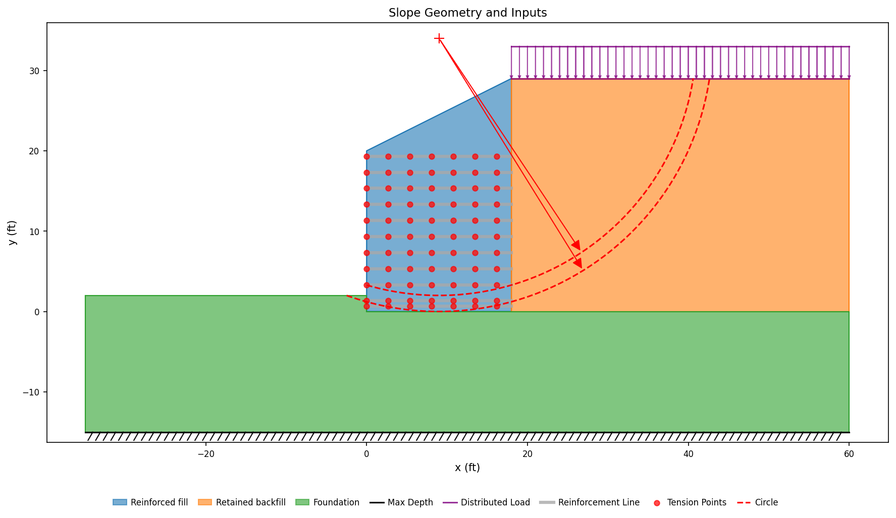

# Published Problems

The other corpus pages compare XSLOPE against a program: a vendor verification
manual states what Slide2, RS2 or SLOPE/W returns, and the comparison is one
solver against another. This page collects problems of a different kind —
**worked examples published as hand calculations**, in design manuals and in the
literature, where the reference value was computed from a stated equation and
printed step by step.

Those problems verify something the program-to-program comparisons cannot. A
published hand calculation names its own formula, so agreement is traceable to a
particular clause of a particular design method rather than to two codes
happening to share an implementation. Where a manual tabulates a quantity layer
by layer or station by station, the whole table is locked, not a single headline
number.

Full bibliographic details for the author-year citations on this page are on the
shared [References](references.md) page.

**Match to the published value**

| Symbol | Meaning |
|---|---|
| 🟢 | within 3% of the vendor and/or reference figure |
| 🟡 | 3–6% |
| 🔴 | more than 6% |
| 🟣 | in progress |
| ⊘ | insufficient data or out of scope |

The dot scores the **match quality of what is locked**, not how much of a
problem is built; the partial detail is in the row text. A worked example
frequently publishes one part of a design and defers the rest, and where XSLOPE
computes a quantity the example does not carry, that quantity is reported as
XSLOPE's own with no published counterpart and takes no dot.

| # | Match | Problem | Results | Notes |
|---:|:-:|---|---|---|
| [E1](#fhwa-e1) | 🟢 | FHWA MSE wall — per-layer geogrid pullout | All eleven layers of Table E1-7.5 reproduced within 0.1% of the manual's nominal pullout resistance | **built**; the example defers global and compound stability, so XSLOPE's searched Spencer 1.477 has no published counterpart |

---

## FHWA Example E1 — MSE wall with a broken backslope {#fhwa-e1}

The FHWA MSE wall manual (Berg et al., 2009) works ten design examples in
Appendix E of its second volume. Example E1 is a modular-block-faced wall
reinforced with geogrid, and Step 7.8 of the example checks every reinforcement
layer for pullout and tabulates the result.

**The problem.** The wall stands 18 ft above finished grade and is embedded 2 ft,
so its design height is H = 20 ft. A 2H:1V backslope rises 9 ft from the top of
the wall to a crest that sits directly above the back end of the reinforcement,
which fixes the total height above the leveling pad at 29 ft; the retained
backfill is level beyond the crest and carries a 250 psf traffic surcharge.
Eleven geogrid layers, each 18 ft long, are placed at the depths Z of the table
below, from 0.67 ft under the top of the wall to 0.67 ft above the leveling pad.
All three soils weigh 125 pcf and are drained with no cohesion: the reinforced
wall fill at φ = 34°, the retained backfill and the foundation at φ = 30°. There
is no groundwater. The manual instructs that the 3° facing batter be treated as
vertical, and the model does so.

**Input:** [fhwa_e1.xlsx](files/published/fhwa_e1.xlsx) · built by
`benchmarks/published/build_fhwa_e1.py`

{width=800}

**The pullout law, in the manual's terms and in XSLOPE's.** FHWA writes the
nominal pullout resistance of a layer as

>$P_r = F^{*}\alpha\,\sigma'_v L_e C R_c$

with $F^{*} = 0.45$ and $\alpha = 0.8$ for these geogrids, $C = 2$ for the two
bearing faces of a sheet, and a coverage ratio $R_c = 1.0$ for continuous
geogrid. XSLOPE states the same resistance as a rate per unit length of line,
$r(s) = 2(a + \sigma'_v(s)\tan\delta)$, and integrates it along the embedment
([overburden-dependent pullout](../lem/reinforcement.md#pullout-from-the-effective-overburden)).
The two are the same statement with the adhesion set to zero and

>$\delta = \arctan(F^{*}\alpha) = \arctan(0.36) = 19.80°$

XSLOPE's factor of two carrying the manual's $C$, and $R_c = 1$ needing no
representation because the law is already stated per unit width of a continuous
sheet. So the reinforce sheet takes Adhesion = 0 and Delta = 19.80° on every
layer, and nothing else about the bond is entered.

The one difference in form is what the two integrate. FHWA evaluates $\sigma'_v$
once, at the depth $Z_P$ of soil standing over the **midpoint** of the resisting
length, and multiplies by that length; XSLOPE integrates the vertical stress
point by point along the line. Under a straight backslope the two agree
identically, because the mean of a linear depth over an interval is its value at
the midpoint — which is what makes this table an exact check of the law rather
than an approximate one.

**Per-layer pullout resistance.** The internal failure surface for extensible
reinforcement is the Rankine wedge from the toe, $L_a = (H - Z)\tan(45° -
\varphi_r/2)$, and $L_e = L - L_a$ is the embedment beyond it. Reading XSLOPE's
envelope at the station where that surface crosses each layer gives the
resistance the resisting zone alone develops, which is the quantity Table E1-7.5
publishes:

| Layer | Z (ft) | La (ft) | Le (ft) | ZP (ft) | Tal (lb/ft) | XSLOPE Pr (lb/ft) | FHWA Pr (lb/ft) |
|---:|---:|---:|---:|---:|---:|---:|---:|
| 1 | 0.67 | 10.28 | 7.72 | 7.74 | 1,085 | 5,378 | 5,378 (0.0%) |
| 2 | 2.67 | 9.22 | 8.78 | 9.47 | 1,085 | 7,488 | 7,483 (+0.1%) |
| 3 | 4.67 | 8.16 | 9.84 | 11.21 | 1,085 | 9,928 | 9,928 (0.0%) |
| 4 | 6.67 | 7.09 | 10.91 | 12.94 | 1,085 | 12,709 | 12,706 (0.0%) |
| 5 | 8.67 | 6.03 | 11.97 | 14.68 | 2,169 | 15,813 | 15,815 (0.0%) |
| 6 | 10.67 | 4.96 | 13.04 | 16.41 | 2,169 | 19,260 | 19,259 (0.0%) |
| 7 | 12.67 | 3.90 | 14.10 | 18.14 | 2,169 | 23,027 | 23,020 (0.0%) |
| 8 | 14.67 | 2.84 | 15.16 | 19.88 | 2,169 | 27,126 | 27,124 (0.0%) |
| 9 | 16.67 | 1.77 | 16.23 | 21.61 | 2,169 | 31,571 | 31,566 (0.0%) |
| 10 | 18.67 | 0.71 | 17.29 | 23.35 | 2,169 | 36,333 | 36,335 (0.0%) |
| 11 | 19.33 | 0.36 | 17.64 | 23.92 | 2,169 | 37,978 | 37,975 (0.0%) |

$L_a$, $L_e$ and $Z_P$ are the manual's own printed columns, and the FHWA
resistance is $F^{*}\alpha\gamma Z_P C L_e$ evaluated from them; XSLOPE's value
is its envelope read at the station $L_a$ names. The largest difference anywhere
in the table is 7 lb/ft, on layer 7, and it is the manual's own rounding of
$L_a$ and $Z_P$ to hundredths of a foot rather than a difference in the physics:
the two sides integrate the same stress field over embedments that differ in the
third decimal place.

The Tal column is each layer's nominal long-term tensile strength,
1,085 lb/ft for the GG-I grade on the top four layers and 2,169 lb/ft for the
GG-II grade below them. It is far under the pullout resistance at every level,
so the full capacity envelope — the smaller of rupture and pullout — reads
Tal on all eleven layers. That is the example's own conclusion:
its capacity-demand ratios run 11.4 to 31.1 against pullout and 1.00 to 2.82
against rupture, so pullout is nowhere near controlling this design.

**Where the traffic surcharge acts.** AASHTO excludes live load from the
vertical stress used for pullout, and the model honors that exclusion twice
over. The surcharge is placed on the level retained backfill, which begins at
the crest, and the reinforcement ends at the same station, so no part of the
loaded surface stands over a layer. Independently of the geometry, XSLOPE's
overburden law reads material zones and pore pressure only: a distributed load
is a boundary force on the sliding mass and never enters $\sigma'_v$. Spreading
the surcharge over the reinforced zone as well leaves every resistance in the
table above exactly where it is; what it changes is the searched factor of
safety below, where the live load is a driving load like any other.

**What is not modeled.** Three limits, each of which the example itself
exercises:

- **Connection strength.** XSLOPE models the reinforcement as a line with a
  tensile capacity and a bond to the soil; it does not model the
  geogrid-to-block connection, block shear or facing flexure. The example's
  Step 7.9 checks the connection and finds capacity-demand ratios of 1.00 to
  1.03 on five of the lower layers — tighter than anything pullout or rupture
  produces on this wall. Reading the envelope alone is not the whole internal
  check.
- **Coverage ratio.** The pullout law is stated per unit width of a continuous
  sheet, so a coverage ratio below 1 — discrete steel strips or bar mats at a
  horizontal spacing — has no input to carry it. That rules out the manual's
  strip and bar-mat examples E3 through E7.
- **Depth-varying F\*.** Delta is one value per line, so a pullout resistance
  factor that interpolates with depth, as the same manual's steel-reinforcement
  examples use, cannot be entered.

**Global stability.** With the eleven layers in place, a Spencer search returns
FS = 1.477 on a surface that passes under the wall and daylights in the level
ground in front of the toe. Example E1 defers its Steps 9 and 10 — overall and
compound stability — to a separate chapter and works neither, so this is
XSLOPE's own number with no published value behind it, and it takes no part in
the match above.

**Sources:** FHWA-NHI-10-025 (Volume II), Appendix E, Example E1, Steps 1–4 and
Step 7 (Berg et al., 2009).

<!-- test: file=files/published/fhwa_e1.xlsx, type=pullout_envelope, expected_pullout=10.28:5378;9.22:7488;8.16:9928;7.09:12709;6.03:15813;4.96:19260;3.90:23027;2.84:27126;1.77:31571;0.71:36333;0.36:37978, expected_envelope=10.28:1085;9.22:1085;8.16:1085;7.09:1085;6.03:2169;4.96:2169;3.90:2169;2.84:2169;1.77:2169;0.71:2169;0.36:2169, tolerance=0.002, benchmark=FHWA-E1 -->
<!-- test: file=files/published/fhwa_e1.xlsx, type=circular_search, method=spencer, expected_fs=1.477, num_slices=30, benchmark=FHWA-E1-global -->
