# Rocscience Slide2 Verification Corpus

The [Rocscience Slide2 verification manual](https://www.rocscience.com/help/slide2/verification-theory/verification-manuals)
contains 111 slope stability problems drawn from the published literature, each with Slide2's computed
factors of safety and (in most cases) independent reference values from the original authors. XSLOPE is
verified against this corpus problem by problem: each built entry links an XSLOPE input file
reproducing the problem, reports the comparison against Slide2 and the original reference, and is
re-verified automatically whenever XSLOPE changes.

**Status terms** (used in the Notes column on every verification page in this section):
*covered* — the same problem is built under another corpus page, and the row links there;
*partial* — some cases are built, and the row names what remains; *planned* — reachable with
today's capability and source data, not yet built; *blocked* — cannot be built today, and the
row names what is missing (source data or a capability); *no lock possible* — the source
publishes no reproducible numeric target; *not supported* — a deliberate scope exclusion.
A row with a match dot and none of these terms is fully built and verified; a parenthetical
may narrow it (*(caveat)*, *(3 of 6)*).

Full bibliographic details for the author-year citations on this page are on the
shared [References](references.md) page.

Problems are built from the manual's tabulated data and coordinate-labeled figures; where a problem's
geometry exists only as an unlabeled figure, the original source publication is consulted before the
problem is marked *built* — no digitized guesses are used for benchmark inputs.

Roughly a third of these problems are also in the [GeoStudio (SLOPE/W) corpus](geostudio.md), which solves them
with a second commercial program. Shared rows link to it, and it links back. That corpus is worth reading
alongside this one for two reasons: SLOPE/W's numbers give an independent third opinion where Slide2 and the
original author disagree, and its verification models are **public downloads** that XSLOPE can import directly —
so those problems need no rebuilding from a figure at all.

**Completeness.** Problems that cannot be reproduced say why in their row. The *no lock
possible* rows are final: the pore-pressure-grid embankments (VP11–13) publish measured
construction-induced pressures with no flow field behind them, so no seepage analysis can
regenerate them — XSLOPE takes water as piezometric lines, ru, or an FE seepage
solution. The remaining *blocked* and *partial* rows each name their specific gap: a support
type whose physics XSLOPE does not share (VP110), or a strength field the original source
publishes only as a two-dimensional contour map (VP46's third stage, Baker 1993). Every other
problem is built and verified; the corpus is complete relative to what is independently
verifiable.

<!-- test: file=files/rocscience/vp002.xlsx, type=circular_search, num_slices=40, fs_bishop=1.589, fs_spencer=1.585, fs_janbu=1.481, fs_mprice=1.586, benchmark=VP2 -->
<!-- test: file=files/rocscience/vp003.xlsx, type=circular_search, num_slices=40, fs_bishop=1.403, fs_spencer=1.372, fs_janbu=1.354, fs_mprice=1.371, benchmark=VP3 -->
<!-- test: file=files/rocscience/vp004.xlsx, type=circular_search, num_slices=40, fs_bishop=1.013, fs_spencer=0.989, fs_janbu=0.963, fs_mprice=0.987, benchmark=VP4 -->
<!-- test: file=files/rocscience/vp005.xlsx, type=single_circle, num_slices=60, fs_bishop=1.955, fs_spencer=1.955, fs_janbu=1.965, fs_mprice=1.955, benchmark=VP5 -->
<!-- test: file=files/rocscience/vp006.xlsx, type=single_circle, num_slices=60, fs_bishop=2.206, fs_spencer=2.290, fs_janbu=2.073, fs_mprice=2.299, benchmark=VP6 -->
<!-- test: file=files/rocscience/vp008.xlsx, type=single_noncirc, num_slices=50, fs_spencer=1.276, fs_janbu=1.294, fs_mprice=1.260, benchmark=VP8 -->
<!-- test: file=files/rocscience/vp009.xlsx, type=noncircular_search, num_slices=50, fs_spencer=0.724, fs_janbu=0.718, benchmark=VP9 -->
<!-- test: file=files/rocscience/vp010.xlsx, type=circular_search, num_slices=40, fs_bishop=1.500, fs_spencer=1.501, fs_janbu=1.440, benchmark=VP10 -->
<!-- test: file=files/rocscience/vp015.xlsx, type=circular_search, num_slices=40, fs_bishop=0.419, fs_spencer=0.422, fs_janbu=0.436, fs_mprice=0.420, benchmark=VP15 -->
<!-- test: file=files/rocscience/vp016.xlsx, type=circular_search, num_slices=40, fs_bishop=1.112, fs_spencer=1.113, fs_janbu=1.122, fs_mprice=1.111, benchmark=VP16 -->
<!-- test: file=files/rocscience/vp017.xlsx, type=circular_search, num_slices=50, fs_oms=1.274, fs_bishop=1.342, fs_spencer=1.340, benchmark=VP17 -->
<!-- test: file=files/rocscience/vp018.xlsx, type=noncircular_search, num_slices=50, fs_spencer=1.033, fs_mprice=1.024, benchmark=VP18 -->
<!-- test: file=files/rocscience/vp019.xlsx, type=circular_search, num_slices=50, fs_bishop=1.448, fs_spencer=1.429, benchmark=VP19 -->
<!-- test: file=files/rocscience/vp020.xlsx, type=circular_search, num_slices=50, fs_bishop=1.086, fs_spencer=1.091, benchmark=VP20-circ -->
<!-- test: file=files/rocscience/vp020.xlsx, type=noncircular_search, num_slices=50, fs_spencer=1.082, benchmark=VP20-noncirc -->
<!-- test: file=files/rocscience/vp023.xlsx, type=circular_search, num_slices=50, fs_oms=1.357, fs_bishop=1.130, benchmark=VP23 -->
<!-- test: file=files/rocscience/vp024.xlsx, type=circular_search, num_slices=50, fs_oms=1.435, fs_bishop=1.435, benchmark=VP24 -->
<!-- test: file=files/rocscience/vp025.xlsx, type=single_noncirc, num_slices=60, fs_spencer=1.052, benchmark=VP25 -->
<!-- test: file=files/rocscience/vp026.xlsx, type=single_noncirc, num_slices=60, right_facing=true, fs_spencer=1.043, benchmark=VP26 -->
<!-- test: file=files/rocscience/vp027.xlsx, type=single_circle, num_slices=50, fs_bishop=1.369, fs_spencer=1.375, fs_janbu=1.365, fs_mprice=1.371, fs_corps=1.388, fs_lowe=1.386, benchmark=VP27 -->
<!-- test: file=files/rocscience/vp035.xlsx, type=circular_search, num_slices=50, fs_bishop=2.529, benchmark=VP35-fs -->
<!-- test: file=files/rocscience/vp035.xlsx, type=reliability, method=bishop, circular=true, search=false, expected_beta=3.353, tolerance=0.03, benchmark=VP35-beta -->
<!-- test: file=files/rocscience/vp036.xlsx, type=circular_search, num_slices=50, fs_bishop=1.333, benchmark=VP36-fs -->
<!-- test: file=files/rocscience/vp037.xlsx, type=single_circle, num_slices=60, fs_bishop=0.764, fs_spencer=0.764, benchmark=VP37 -->
<!-- test: file=files/rocscience/vp038a.xlsx, type=single_circle, num_slices=60, suction_phi_b=Cut soil:15, fs_bishop=1.612, benchmark=VP38-h61 -->
<!-- test: file=files/rocscience/vp038b.xlsx, type=single_circle, num_slices=60, suction_phi_b=Cut soil:15, fs_bishop=1.533, benchmark=VP38-h62 -->
<!-- test: file=files/rocscience/vp038c.xlsx, type=single_circle, num_slices=60, suction_phi_b=Cut soil:15, fs_bishop=1.413, benchmark=VP38-h63 -->
<!-- test: file=files/rocscience/vp028a.xlsx, type=single_circle, num_slices=60, fs_bishop=1.129, benchmark=VP28a -->
<!-- test: file=files/rocscience/vp028a.xlsx, type=reliability, method=bishop, circular=true, search=false, expected_beta=0.768, tolerance=0.03, benchmark=VP28a-beta -->
<!-- test: file=files/rocscience/vp028a.xlsx, type=reliability_mc, method=bishop, circular=true, search=false, n_samples=10000, num_slices=40, expected_beta=0.761, tolerance=0.02, expected_pf=0.219, pf_tol=0.02, benchmark=VP28a-mc -->
<!-- test: file=files/rocscience/vp028b.xlsx, type=single_circle, num_slices=60, fs_bishop=1.158, benchmark=VP28b -->
<!-- test: file=files/rocscience/vp028b.xlsx, type=reliability, method=bishop, circular=true, search=false, expected_beta=0.787, tolerance=0.03, benchmark=VP28b-beta -->
<!-- test: file=files/rocscience/vp028b.xlsx, type=reliability_mc, method=bishop, circular=true, search=false, n_samples=10000, num_slices=40, expected_beta=0.794, tolerance=0.02, expected_pf=0.208, pf_tol=0.02, benchmark=VP28b-mc -->
<!-- test: file=files/rocscience/vp028c.xlsx, type=single_circle, num_slices=60, fs_bishop=1.177, benchmark=VP28c -->
<!-- test: file=files/rocscience/vp028c.xlsx, type=reliability, method=bishop, circular=true, search=false, expected_beta=0.798, tolerance=0.03, benchmark=VP28c-beta -->
<!-- test: file=files/rocscience/vp028c.xlsx, type=reliability_mc, method=bishop, circular=true, search=false, n_samples=10000, num_slices=40, expected_beta=0.783, tolerance=0.02, expected_pf=0.211, pf_tol=0.02, benchmark=VP28c-mc -->
<!-- test: file=files/rocscience/vp029.xlsx, type=single_circle, num_slices=60, fs_spencer=1.145, fs_mprice=1.145, benchmark=VP29-det -->
<!-- test: file=files/rocscience/vp029.xlsx, type=reliability, method=spencer, circular=true, search=false, expected_beta=0.936, tolerance=0.03, benchmark=VP29-beta -->
<!-- test: file=files/rocscience/vp030a.xlsx, type=single_circle, num_slices=60, fs_bishop=1.679, benchmark=VP30a -->
<!-- test: file=files/rocscience/vp030b.xlsx, type=single_circle, num_slices=60, fs_bishop=1.650, benchmark=VP30b -->
<!-- test: file=files/rocscience/vp032a.xlsx, type=single_circle, num_slices=60, fs_bishop=1.218, fs_spencer=1.218, benchmark=VP32a -->
<!-- test: file=files/rocscience/vp032b.xlsx, type=single_circle, num_slices=60, fs_bishop=1.216, fs_spencer=1.216, benchmark=VP32b -->
<!-- test: file=files/rocscience/vp032c.xlsx, type=single_circle, num_slices=60, fs_bishop=0.981, fs_spencer=0.981, benchmark=VP32c -->
<!-- test: file=files/rocscience/vp033.xlsx, type=single_circle, num_slices=60, composite=true, fs_bishop=1.320, benchmark=VP33 -->
<!-- test: file=files/rocscience/vp034.xlsx, type=single_noncirc, num_slices=60, fs_spencer=2.423, fs_mprice=2.384, benchmark=VP34 -->
<!-- test: file=files/rocscience/vp036.xlsx, type=reliability, method=bishop, expected_beta=2.263, tolerance=0.03, benchmark=VP36-beta -->
<!-- test: file=files/rocscience/vp039a.xlsx, type=single_circle, num_slices=60, fs_spencer=0.968, benchmark=VP39a -->
<!-- test: file=files/rocscience/vp039b.xlsx, type=single_circle, num_slices=60, fs_spencer=1.332, benchmark=VP39b -->
<!-- test: file=files/rocscience/vp039c.xlsx, type=single_circle, num_slices=60, fs_spencer=1.200, benchmark=VP39c -->
<!-- test: file=files/rocscience/vp039d.xlsx, type=single_circle, num_slices=60, fs_spencer=1.343, benchmark=VP39d -->
<!-- test: file=files/rocscience/vp040.xlsx, type=single_noncirc, num_slices=30, fs_janbu=1.003, benchmark=VP40-det -->
<!-- test: file=files/rocscience/vp040.xlsx, type=sensitivity, param=mat:Soil:pow_a, method=janbu, search=false, num_slices=30, n=3, rel_range=0.15, expected_base=1.003, expected_low=0.853, expected_high=1.154, tolerance=0.01, benchmark=VP40-sensA -->
<!-- test: file=files/rocscience/vp040.xlsx, type=sensitivity, param=mat:Soil:pow_b, method=janbu, search=false, num_slices=30, n=3, rel_range=0.15, expected_base=1.003, expected_low=0.552, expected_high=1.830, tolerance=0.01, benchmark=VP40-sensB -->
<!-- test: file=files/rocscience/vp041.xlsx, type=circular_search, num_slices=50, fs_bishop=1.668, fs_spencer=1.670, fs_janbu=1.660, benchmark=VP41 -->
<!-- test: file=files/rocscience/vp042.xlsx, type=single_circle, num_slices=60, fs_oms=1.773, fs_bishop=1.882, fs_spencer=1.926, fs_mprice=1.925, benchmark=VP42-circle -->
<!-- test: file=files/rocscience/vp042.xlsx, type=single_noncirc, num_slices=60, fs_spencer=1.882, fs_mprice=1.869, benchmark=VP42-noncirc -->
<!-- test: file=files/rocscience/vp043.xlsx, type=single_noncirc, num_slices=50, fs_spencer=1.352, fs_janbu=1.352, benchmark=VP43 -->
<!-- test: file=files/rocscience/vp044a.xlsx, type=circular_search, num_slices=40, fs_spencer=0.958, benchmark=VP44-pow -->
<!-- test: file=files/rocscience/vp044b.xlsx, type=circular_search, num_slices=40, fs_spencer=1.518, benchmark=VP44-mc -->
<!-- test: file=files/rocscience/vp044c.xlsx, type=circular_search, num_slices=40, fs_spencer=0.980, benchmark=VP44-lla -->
<!-- test: file=files/rocscience/vp045a.xlsx, type=circular_search, num_slices=50, fs_spencer=2.801, benchmark=VP45-mc -->
<!-- test: file=files/rocscience/vp045b.xlsx, type=circular_search, num_slices=50, fs_spencer=2.649, benchmark=VP45-pow -->
<!-- test: file=files/rocscience/vp047.xlsx, type=single_noncirc, num_slices=50, fs_janbu=0.899, benchmark=VP47 -->
<!-- test: file=files/rocscience/vp048.xlsx, type=single_noncirc, num_slices=50, fs_janbu=0.991, fs_spencer=0.991, benchmark=VP48 -->
<!-- test: file=files/rocscience/vp049.xlsx, type=single_noncirc, num_slices=60, fs_janbu=1.469, fs_spencer=1.439, benchmark=VP49 -->
<!-- test: file=files/rocscience/vp058.xlsx, type=single_circle, num_slices=60, fs_bishop=1.142, fs_spencer=1.140, fs_oms=1.119, benchmark=VP58 -->
<!-- test: file=files/rocscience/vp059.xlsx, type=single_noncirc, num_slices=60, fs_janbu=0.579, fs_corps=0.577, benchmark=VP59 -->
<!-- test: file=files/rocscience/vp060.xlsx, type=single_noncirc, num_slices=60, fs_spencer=1.010, fs_janbu=1.073, benchmark=VP60 -->
<!-- test: file=files/rocscience/vp050.xlsx, type=single_noncirc, num_slices=60, fs_janbu=1.448, fs_spencer=1.576, benchmark=VP50 -->
<!-- test: file=files/rocscience/vp051.xlsx, type=single_circle, num_slices=100, fs_oms=1.069, fs_bishop=1.278, fs_janbu=1.205, fs_corps=1.404, fs_lowe=1.296, fs_spencer=1.294, fs_mprice=1.304, benchmark=VP51 -->
<!-- test: file=files/rocscience/vp052a.xlsx, type=circular_search, num_slices=50, fs_spencer=1.797, fs_bishop=1.796, benchmark=VP52-dry -->
<!-- test: file=files/rocscience/vp052b.xlsx, type=circular_search, num_slices=50, fs_spencer=1.189, fs_bishop=1.176, benchmark=VP52-wet -->
<!-- test: file=files/rocscience/vp053.xlsx, type=single_noncirc, num_slices=30, fs_janbu=1.048, fs_spencer=1.048, fs_mprice=1.048, fs_lowe=1.048, benchmark=VP53 -->
<!-- test: file=files/rocscience/vp054a.xlsx, type=single_circle, num_slices=50, fs_bishop=1.100, benchmark=VP54-nopile -->
<!-- test: file=files/rocscience/vp054b.xlsx, type=single_circle, num_slices=50, fs_bishop=1.185, benchmark=VP54-pile -->
<!-- test: file=files/rocscience/vp055.xlsx, type=single_circle, num_slices=60, fs_oms=1.138, fs_bishop=1.290, fs_spencer=1.297, fs_lowe=1.321, benchmark=VP55-circle -->
<!-- test: file=files/rocscience/vp055.xlsx, type=circular_search, num_slices=50, fs_bishop=1.289, fs_spencer=1.295, benchmark=VP55-search -->
<!-- test: file=files/rocscience/vp056.xlsx, type=single_circle, num_slices=60, fs_oms=1.142, fs_bishop=1.283, fs_spencer=1.288, fs_lowe=1.307, benchmark=VP56-circle -->
<!-- test: file=files/rocscience/vp056.xlsx, type=circular_search, num_slices=50, fs_bishop=1.282, fs_spencer=1.288, benchmark=VP56-search -->
<!-- test: file=files/rocscience/vp057.xlsx, type=single_circle, composite=true, num_slices=60, fs_oms=1.086, fs_bishop=1.389, fs_spencer=1.396, fs_mprice=1.375, fs_lowe=1.387, benchmark=VP57-composite-circle -->
<!-- test: file=files/rocscience/vp057.xlsx, type=circular_search, num_slices=50, fs_bishop=1.411, fs_spencer=1.416, benchmark=VP57-circles-only -->
<!-- test: file=files/rocscience/vp057.xlsx, type=circular_search, composite=true, num_slices=50, fs_bishop=1.388, fs_spencer=1.396, benchmark=VP57-composite-search -->
<!-- test: file=files/rocscience/vp086.xlsx, type=circular_search, num_slices=50, fs_bishop=1.617, fs_spencer=1.611, benchmark=VP86 -->
<!-- test: file=files/rocscience/vp061a.xlsx, type=circular_search, num_slices=40, fs_spencer=1.466, benchmark=VP61-pow -->
<!-- test: file=files/rocscience/vp061b.xlsx, type=circular_search, num_slices=40, fs_spencer=1.367, benchmark=VP61-mc -->
<!-- test: file=files/rocscience/vp062a.xlsx, type=circular_search, num_slices=50, fs_spencer=1.001, fs_bishop=0.991, benchmark=VP62-dry -->
<!-- test: file=files/rocscience/vp062b.xlsx, type=circular_search, num_slices=50, fs_spencer=1.001, fs_bishop=0.986, benchmark=VP62-ru -->
<!-- test: file=files/rocscience/vp063.xlsx, type=noncircular_search, num_slices=50, fs_spencer=1.001, fs_janbu=0.999, benchmark=VP63 -->
<!-- test: file=files/rocscience/vp097.xlsx, type=circular_search, rapid=true, num_slices=50, fs_spencer=1.044, fs_bishop=1.042, benchmark=VP97 -->
<!-- test: file=files/rocscience/vp100.xlsx, type=circular_search, num_slices=50, fs_bishop=1.201, fs_spencer=1.206, benchmark=VP100 -->
<!-- test: file=files/rocscience/vp101.xlsx, type=circular_search, num_slices=50, fs_bishop=1.416, fs_spencer=1.422, benchmark=VP101 -->
<!-- test: file=files/rocscience/vp087.xlsx, type=single_circle, num_slices=50, fs_bishop=1.031, benchmark=VP87 -->
<!-- test: file=files/rocscience/vp088.xlsx, type=single_circle, num_slices=50, fs_spencer=1.057, benchmark=VP88 -->
<!-- test: file=files/rocscience/vp089.xlsx, type=single_circle, num_slices=50, fs_spencer=1.011, benchmark=VP89 -->
<!-- test: file=files/rocscience/vp090.xlsx, type=single_circle, num_slices=50, fs_bishop=1.012, benchmark=VP90 -->
<!-- test: file=files/rocscience/vp091.xlsx, type=single_circle, num_slices=50, fs_spencer=0.960, benchmark=VP91 -->
<!-- test: file=files/rocscience/vp092.xlsx, type=single_circle, num_slices=50, fs_bishop=1.010, benchmark=VP92 -->
<!-- test: file=files/rocscience/vp093.xlsx, type=single_circle, num_slices=50, fs_bishop=0.961, benchmark=VP93 -->
<!-- test: file=files/rocscience/vp094.xlsx, type=single_circle, num_slices=50, fs_bishop=1.020, benchmark=VP94 -->
<!-- test: file=files/rocscience/vp098.xlsx, type=circular_search, num_slices=40, rapid=true, fs_spencer=1.046, benchmark=VP98 -->
<!-- test: file=files/rocscience/vp099.xlsx, type=circular_search, num_slices=40, rapid=true, fs_spencer=1.527, benchmark=VP99 -->
<!-- test: file=files/rocscience/vp106a.xlsx, type=circular_search, num_slices=40, fs_bishop=1.143, benchmark=VP106a -->
<!-- test: file=files/rocscience/vp106b.xlsx, type=circular_search, num_slices=40, fs_bishop=1.540, benchmark=VP106b -->
<!-- test: file=files/rocscience/vp106c.xlsx, type=circular_search, num_slices=40, fs_bishop=1.451, benchmark=VP106c -->
<!-- test: file=files/rocscience/vp106d.xlsx, type=circular_search, num_slices=40, fs_bishop=1.341, benchmark=VP106d -->
<!-- test: file=files/rocscience/vp106e.xlsx, type=circular_search, num_slices=40, fs_bishop=1.260, benchmark=VP106e -->
<!-- test: file=files/rocscience/vp107a.xlsx, type=single_circle, num_slices=60, fs_bishop=1.382, fs_spencer=1.398, benchmark=VP107a -->
<!-- test: file=files/rocscience/vp107b.xlsx, type=single_circle, num_slices=60, fs_bishop=1.382, benchmark=VP107b -->
<!-- test: file=files/rocscience/vp108a.xlsx, type=single_circle, num_slices=60, fs_bishop=1.790, fs_spencer=1.797, benchmark=VP108a -->
<!-- test: file=files/rocscience/vp108b.xlsx, type=single_circle, num_slices=60, fs_bishop=1.830, fs_spencer=1.835, benchmark=VP108b -->
<!-- test: file=files/rocscience/vp109.xlsx, type=single_circle, num_slices=60, fs_bishop=1.790, fs_spencer=1.797, benchmark=VP109 -->
<!-- test: file=files/rocscience/vp096.xlsx, type=single_circle, rapid=true, num_slices=60, fs_spencer=1.434, fs_bishop=1.432, benchmark=VP96 -->
<!-- test: file=files/rocscience/vp064.xlsx, type=single_circle, num_slices=60, fs_bishop=2.489, fs_spencer=2.488, benchmark=VP64 -->
<!-- test: file=files/rocscience/vp065.xlsx, type=single_circle, num_slices=60, fs_bishop=2.725, fs_spencer=2.748, benchmark=VP65 -->
<!-- test: file=files/rocscience/vp066.xlsx, type=single_circle, num_slices=60, fs_bishop=2.254, fs_spencer=2.258, benchmark=VP66 -->
<!-- test: file=files/rocscience/vp067.xlsx, type=single_circle, num_slices=60, fs_bishop=1.320, fs_spencer=1.316, fs_janbu=1.340, benchmark=VP67 -->
<!-- test: file=files/rocscience/vp068.xlsx, type=single_circle, num_slices=60, fs_bishop=1.234, fs_mprice=1.234, benchmark=VP68 -->
<!-- test: file=files/rocscience/vp069.xlsx, type=single_circle, num_slices=60, fs_bishop=1.999, fs_spencer=2.013, fs_mprice=2.013, benchmark=VP69 -->
<!-- test: file=files/rocscience/vp075.xlsx, type=circular_search, num_slices=40, fs_bishop=1.424, fs_spencer=1.420, benchmark=VP75 -->
<!-- test: file=files/rocscience/vp075.xlsx, type=circular_search, seed=grid, num_slices=40, fs_bishop=1.424, fs_spencer=1.420, benchmark=VP75-grid -->
<!-- test: file=files/rocscience/vp076a.xlsx, type=circular_search, num_slices=40, fs_bishop=1.065, fs_spencer=1.072, benchmark=VP76-seep -->
<!-- test: file=files/rocscience/vp076b.xlsx, type=circular_search, num_slices=40, fs_bishop=1.049, fs_spencer=1.056, benchmark=VP76-piezo -->
<!-- test: file=files/rocscience/vp072a.xlsx, type=single_circle, num_slices=60, fs_oms=1.071, fs_bishop=1.339, fs_spencer=1.341, fs_mprice=1.342, benchmark=VP72-seep-tan197 -->
<!-- test: file=files/rocscience/vp072b.xlsx, type=single_circle, num_slices=60, fs_oms=1.348, fs_bishop=1.572, fs_spencer=1.563, fs_mprice=1.564, benchmark=VP72-piezo-tan197 -->
<!-- test: file=files/rocscience/vp073.xlsx, type=circular_search, num_slices=40, fs_bishop=1.766, fs_spencer=1.766, fs_janbu=1.733, benchmark=VP73 -->
<!-- test: file=files/rocscience/vp102a.xlsx, type=circular_search, num_slices=40, fs_bishop=2.452, fs_spencer=2.451, benchmark=VP102-dry -->
<!-- test: file=files/rocscience/vp102b.xlsx, type=circular_search, num_slices=40, fs_bishop=1.720, fs_spencer=1.729, benchmark=VP102-steady -->
<!-- test: file=files/rocscience/vp103a.xlsx, type=noncircular_search, num_slices=40, fs_spencer=1.221, benchmark=VP103a-deep -->
<!-- test: file=files/rocscience/vp103b.xlsx, type=noncircular_search, num_slices=40, fs_spencer=1.298, benchmark=VP103b-deep -->
<!-- test: file=files/rocscience/vp103c.xlsx, type=noncircular_search, num_slices=40, fs_spencer=1.374, benchmark=VP103c-deep -->
<!-- test: file=files/rocscience/vp103d.xlsx, type=noncircular_search, num_slices=40, fs_spencer=1.322, benchmark=VP103d-shallow -->
<!-- test: file=files/rocscience/vp103a.xlsx, type=circular_search, num_slices=40, seed=grid, tangent_depth=0;3, fs_spencer=1.299, benchmark=VP103a-deep-circ -->
<!-- test: file=files/rocscience/vp103b.xlsx, type=circular_search, num_slices=40, seed=grid, tangent_depth=0;3, fs_spencer=1.379, benchmark=VP103b-deep-circ -->
<!-- test: file=files/rocscience/vp103c.xlsx, type=circular_search, num_slices=40, seed=grid, tangent_depth=0;3, fs_spencer=1.458, benchmark=VP103c-deep-circ -->
<!-- test: file=files/rocscience/vp103a.xlsx, type=circular_search, num_slices=40, seed=grid, tangent_depth=18;30, fs_spencer=1.348, benchmark=VP103a-shallow-circ -->
<!-- test: file=files/rocscience/vp103b.xlsx, type=circular_search, num_slices=40, seed=grid, tangent_depth=18;30, fs_spencer=1.348, benchmark=VP103b-shallow-circ -->
<!-- test: file=files/rocscience/vp103c.xlsx, type=circular_search, num_slices=40, seed=grid, tangent_depth=18;30, fs_spencer=1.348, benchmark=VP103c-shallow-circ -->
<!-- test: file=files/rocscience/vp104a.xlsx, type=circular_search, num_slices=40, fs_spencer=1.372, benchmark=VP104-noseismic -->
<!-- test: file=files/rocscience/vp104b.xlsx, type=circular_search, num_slices=40, fs_spencer=0.989, benchmark=VP104-k015 -->
<!-- test: file=files/rocscience/vp104a.xlsx, type=critical_kc, method=spencer, expected_kc=0.144, k_min=0.08, k_max=0.22, kc_tol=0.01, num_slices=40, benchmark=VP104-kc -->
<!-- test: file=files/rocscience/vp082.xlsx, type=circular_search, num_slices=40, fs_bishop=1.521, fs_spencer=1.533, benchmark=VP82 -->
<!-- test: file=files/rocscience/vp083a.xlsx, type=circular_search, num_slices=40, fs_bishop=1.305, fs_spencer=1.275, benchmark=VP83-I -->
<!-- test: file=files/rocscience/vp083b.xlsx, type=circular_search, num_slices=40, fs_bishop=1.328, fs_spencer=1.326, benchmark=VP83-II -->
<!-- test: file=files/rocscience/vp084a.xlsx, type=circular_search, num_slices=40, fs_bishop=0.756, fs_spencer=0.751, benchmark=VP84-I -->
<!-- test: file=files/rocscience/vp084b.xlsx, type=circular_search, num_slices=40, fs_bishop=0.905, fs_spencer=0.897, benchmark=VP84-II -->
<!-- test: file=files/rocscience/vp084c.xlsx, type=circular_search, num_slices=40, fs_bishop=1.042, fs_spencer=1.028, benchmark=VP84-III -->
<!-- test: file=files/rocscience/vp084d.xlsx, type=circular_search, num_slices=40, fs_bishop=1.151, fs_spencer=1.131, benchmark=VP84-IV -->
<!-- test: file=files/rocscience/vp071a.xlsx, type=circular_search, num_slices=40, fs_bishop=1.132, fs_spencer=1.132, benchmark=VP71-seep -->
<!-- test: file=files/rocscience/vp071b.xlsx, type=circular_search, num_slices=40, fs_bishop=1.132, fs_spencer=1.132, benchmark=VP71-piezo -->
<!-- test: file=files/rocscience/vp070a.xlsx, type=circular_search, num_slices=40, fs_bishop=1.596, fs_spencer=1.593, benchmark=VP70-p30 -->
<!-- test: file=files/rocscience/vp070b.xlsx, type=circular_search, num_slices=40, fs_bishop=1.596, fs_spencer=1.593, benchmark=VP70-p60 -->
<!-- test: file=files/rocscience/vp074.xlsx, type=circular_search, num_slices=40, fs_bishop=1.219, fs_spencer=1.194, fs_janbu=1.161, benchmark=VP74 -->
<!-- test: file=files/rocscience/vp077a.xlsx, type=single_circle, num_slices=60, fs_oms=1.506, fs_bishop=1.652, fs_spencer=1.724, fs_mprice=1.734, benchmark=VP77-seep-circle -->
<!-- test: file=files/rocscience/vp077a.xlsx, type=circular_search, num_slices=50, fs_bishop=1.637, fs_spencer=1.700, benchmark=VP77-seep-search -->
<!-- test: file=files/rocscience/vp077b.xlsx, type=single_circle, num_slices=60, fs_oms=1.477, fs_bishop=1.591, fs_spencer=1.659, fs_mprice=1.670, benchmark=VP77-piezo-circle -->
<!-- test: file=files/rocscience/vp078.xlsx, type=circular_search, num_slices=40, fs_bishop=1.117, fs_spencer=1.131, benchmark=VP78 -->
<!-- test: file=files/rocscience/vp079.xlsx, type=circular_search, num_slices=40, fs_bishop=1.407, fs_spencer=1.397, benchmark=VP79 -->
<!-- test: file=files/rocscience/vp080a.xlsx, type=single_circle, num_slices=60, fs_bishop=2.533, fs_spencer=2.530, benchmark=VP80-t0 -->
<!-- test: file=files/rocscience/vp080b.xlsx, type=single_circle, num_slices=60, fs_bishop=1.389, fs_spencer=1.352, benchmark=VP80-t15 -->
<!-- test: file=files/rocscience/vp081.xlsx, type=circular_search, num_slices=40, fs_bishop=1.223, fs_spencer=1.204, benchmark=VP81 -->
<!-- test: file=files/rocscience/vp085a.xlsx, type=single_circle, num_slices=60, fs_bishop=1.567, fs_spencer=1.567, benchmark=VP85-active -->
<!-- test: file=files/rocscience/vp085b.xlsx, type=single_circle, num_slices=60, fs_oms=1.319, fs_bishop=1.319, benchmark=VP85-passive -->
<!-- test: file=files/rocscience/vp021a.xlsx, type=single_circle, num_slices=60, fs_oms=1.927, fs_bishop=2.075, fs_spencer=2.071, fs_mprice=2.071, benchmark=VP21-dry -->
<!-- test: file=files/rocscience/vp021b.xlsx, type=single_circle, num_slices=60, fs_oms=1.606, fs_bishop=1.759, fs_spencer=1.757, fs_mprice=1.756, benchmark=VP21-ru -->
<!-- test: file=files/rocscience/vp021c.xlsx, type=single_circle, num_slices=60, fs_oms=1.693, fs_bishop=1.829, fs_spencer=1.827, fs_mprice=1.826, benchmark=VP21-wt -->
<!-- test: file=files/rocscience/vp022a.xlsx, type=single_circle, composite=true, num_slices=60, fs_oms=1.297, fs_bishop=1.380, fs_spencer=1.379, fs_mprice=1.370, benchmark=VP22-dry -->
<!-- test: file=files/rocscience/vp022b.xlsx, type=single_circle, composite=true, num_slices=60, fs_oms=1.037, fs_bishop=1.121, fs_spencer=1.122, fs_mprice=1.112, benchmark=VP22-ru -->

**Match to the published value**

| Symbol | Meaning |
|---|---|
| 🟢 | within 3% of the vendor and/or reference figure |
| 🟡 | 3–6% |
| 🔴 | more than 6% |
| 🟣 | in progress |
| ⊘ | insufficient data or out of scope |

The dot scores the **match quality of what is locked**, not how much of a problem is built — a partly built problem is scored on the stages that are built, and the partial/blocked detail is in the row text. Where a row reports several limit-equilibrium methods, the comparison behind the dot is XSLOPE's Spencer or Morgenstern-Price value against the published one, unless the source itself names a method — then that method is compared like-for-like. **Only same-method pairings derive a dot.** Slide2's GLE and XSLOPE's Morgenstern-Price are different methods of the same family, not the same method, so an M-P-vs-GLE pairing (and any other of ours-vs-theirs where the methods differ) is reported as information only and never governs a dot; where the source names a method XSLOPE does not run, the fallback is XSLOPE's Spencer or Morgenstern-Price against the source's headline value. A closed-form or theoretical value is a first-class reference authority in its own right — same-method logic does not apply to it — so where a problem has both, the dot takes the **best of the valid pairings**: same-method vendor/reference pairings and the theory anchor. Where XSLOPE and the vendor each ran their *own* free search, the two searches are not an anchor for one another — the dot goes to the originating source's published value and, where the vendor prints its critical surface, to the vendor value on that surface. A comparison is scored at the source's own precision: where a value is printed rounded or read from a figure at a stated resolution, a difference smaller than that resolution counts as a match, and no dot rests on precision the source does not have. A source's single headline factor of safety is its published answer and takes a delta whatever engine produced it — carrying a delta is a separate question from governing the dot; where the same source prints a per-method table, each value is read like any other column — same-method entries pair and carry a delta, cross-method entries stay bare. Every printed difference is **relative to the source**, (XSLOPE − source) / source, so a −2% row reads "2% below the published value" whichever way the pair is written. Where a problem has more than one published vendor model, a row is scored against the number produced by the model its corpus file was built from; the [RS2 corpus page](rs2.md) works through the case that arises most often here.

| # | Match | Problem | Results | Notes |
|---:|:-:|---|---|---|
| [1](#vp1) | 🟢 | Slope, homogenous | Spencer/M-P 0.984 vs ACADS 1.00 (−1.6%) · Bishop 0.985 vs Slide 0.987 (−0.2%) | ACADS consensus names no method |
| [2](#vp2) | 🟢 | Slope, homogenous, tension crack | Spencer 1.585 vs Slide 1.592 (−0.4%) · Bishop 1.589 vs Slide 1.596 (−0.4%) |  |
| [3](#vp3) | 🟢 | Slope, (3) materials | Spencer 1.372 vs Slide 1.375 (−0.2%) · Bishop 1.403 vs Slide 1.405 (−0.1%) |  |
| [4](#vp4) | 🟢 | Slope, (3) materials, seismic | Spencer 0.989 vs Slide 0.991 (−0.2%) · Bishop 1.013 vs Slide 1.016 (−0.3%) |  |
| [5](#vp5) | 🟢 | Dam, (4) materials | Spencer 1.955 vs Slide 1.948 (+0.4%) · Spencer 1.955 vs infinite-slope theory 1.9475 (+0.4%) |  |
| [6](#vp6) | 🟢 | Dam, (4) materials, predefined slip surface | Spencer 2.290 vs Slide 2.292 (−0.1%) · Spencer 2.290 vs ACADS 2.29 (0.0%) |  |
| [7](../lem/samples.md#7-non-circular-failure-surface) | 🟢 | Slope, (2) materials, weak layer | Spencer 1.258 vs Slide 1.246 (+1.0%) · M-P 1.248 vs Slide 1.275 (−2.1%) | *covered* — [LEM sample 7](../lem/samples.md#7-non-circular-failure-surface) (`xslope_acads_weak_layer.xlsx`), ACADS 3(a); Giam reference band 1.24–1.27; also [SLOPE/W §2.7](geostudio.md) |
| [8](#vp8) | 🟢 | Slope, (2) materials, weak layer, predefined slip surface | Spencer 1.276 vs Slide 1.277 (−0.1%) · M-P 1.260 vs SLOPE/W 1.261 (−0.1%) | every method within 0.002 of Slide |
| [9](#vp9) | 🟢 | Slope, (2) materials, weak layer, water table, distributed load | Spencer 0.724 vs Slide optimized 0.707 (+2.4%) · Janbu(corr) 0.718 vs Slide 0.734 (−2.2%) | search-difficulty benchmark with a wide published band |
| [10](#vp10) | 🟢 | Slope, homogenous, pore pressure grid, ponded water | Spencer 1.501 vs Slide 1.500 (+0.1%) · Bishop 1.500 vs Slide 1.498 (+0.1%) | **built** (via FE seepage); no GeoStudio counterpart for ACADS #5 |
| [11](#vp11) | ⊘ | Embankment, (2) materials, pore pressure grid |  | *no lock possible* — measured pressures, no flow field behind them |
| [12](#vp12) | ⊘ | Embankment, (4) materials, tension crack, pore pressure grid |  | *no lock possible* — measured pressures, no flow field behind them |
| [13](#vp13) | ⊘ | Embankment, (3) materials, pore pressure grid |  | *no lock possible* — measured pressures, no flow field behind them |
| [14](#vp14) | 🟢 | Slope, homogenous | Bishop 1.404 vs SLOPE/W 1.417 (−0.9%) · Bishop 1.404 vs A&T 1.451 (−3.2%) | A&T report Bishop, so Bishop governs like-for-like |
| [15](#vp15) | 🟢 | Slope, (3) materials, weak layer | Bishop 0.419 vs A&T 0.417 (+0.5%) · Bishop 0.419 vs Slide 0.420 (−0.2%) | A&T report Bishop, so Bishop governs like-for-like |
| [16](#vp16) | 🟢 | Slope, homogenous, water table | Bishop 1.112 vs Slide 1.118 (−0.5%) · Bishop 1.112 vs A&T 1.138 (−2.3%) | A&T report Bishop, so Bishop governs like-for-like |
| [17](#vp17) | 🟢 | Slope, homogenous | Bishop 1.342 vs Slide 1.344 (−0.1%) · Bishop 1.342 vs Y&U 1.348 (−0.4%) | circular search; the local non-circular search hits the same ceiling as #19/#20 |
| [18](#vp18) | 🟢 | Slope, homogenous slope, ru pore pressure | Spencer 1.033 vs Baker 1.02 (+1.3%) · Spencer 1.033 vs Slide 1.010 (+2.3%) | Slide's value is an MC-optimized non-circular search |
| [19](#vp19) | 🟢 | Slope, (4) materials | Spencer 1.429 vs Slide MC 1.398 (+2.2%) | circular search; documented non-circular search-power gap |
| [20](#vp20) | 🟢 | Slope, (4) materials, weak layer, water table | Spencer 1.082 vs Slide 1.093 (−1.0%) · Bishop 1.086 vs Slide 1.087 (−0.1%) | same search-power gap as #19 |
| [21](#vp21) | 🟢 | Slope, homogenous, ru pore pressure | dry: Spencer 2.071 vs F&K 2.073 (−0.1%) · ru = 0.25: Spencer 1.757 vs F&K 1.761 (−0.2%) · water table: Spencer 1.827 vs F&K 1.830 (−0.2%) |  |
| [22](#vp22) | 🟢 | Slope, (2) materials, weak layer, ru pore pressure | dry: Spencer 1.379 vs Slide 1.382 (−0.2%) · ru = 0.25: Spencer 1.122 vs Slide 1.124 (−0.2%) | the corpus's first composite-surface problem |
| [23](#vp23) | 🟢 | Slope, (3) materials | Ordinary 1.357 vs Low 1.36 (−0.2%) · Bishop 1.130 vs Low 1.14 (−0.9%) | the published Bishop values themselves spread 1.14–1.19 |
| [24](#vp24) | 🟢 | Slope, (3) materials | Ordinary 1.435 vs Slide 1.439 (−0.3%) · Bishop 1.435 vs Low 1.44 (−0.3%) |  |
| [25](#vp25) | 🟢 | Bearing capacity test slope, homogenous, distributed load, predefined slip surface | Spencer 1.052 vs Slide 1.051 (+0.1%) · Spencer 1.052 vs Chen & Shao 1.05 (+0.2%) | the M-P/GLE pair is not like-for-like |
| [26](#vp26) | 🟢 | Bearing capacity test prism, homogenous, distributed load, predefined slip surface | Spencer 1.043 vs bearing-capacity theory 1.0 (+4.3%) · Lowe 1.017 vs bearing-capacity theory 1.0 (+1.7%) | the closed form is the reference authority; Slide2's own Spencer 0.941 sits ~6% below it |
| [27](#vp27) | 🟢 | Slope, (2) materials, tension crack, water table (auto Hu) | Spencer 1.375 vs Slide 1.402 (−1.9%) · Spencer 1.375 vs XSTABL 1.403 (−2.0%) | a uniform offset across all six methods (digitized water table) |
| [28](#vp28) | 🟢 | Excavated slope and embankment, (3) materials and (5) materials, probabilistic analysis | Congress St.: Bishop 1.129 vs Slide 1.128 (+0.1%) · embankment, interface: Bishop 1.158 vs Slide 1.160 (−0.2%) · embankment, base: Bishop 1.177 vs Slide 1.185 (−0.7%) | **built** (3 of 10 cases) |
| [29](#vp29) | 🟢 | Submerged slope, homogenous, probabilistic analysis, water table | Spencer 1.145 vs Slide 1.157 (−1.0%) · Spencer 1.145 vs Duncan 1.17 (−2.1%) |  |
| [30](#vp30) | 🟢 | Reinforced embankment, (4) materials, tension crack, geosynthetic | circle A: Bishop 1.679 vs Slide 1.69 (−0.7%) · circle B: Bishop 1.650 vs Slide 1.66 (−0.6%) | the manual specifies Bishop for this problem |
| [31](geostudio.md#gs-2-18) | 🟢 | Reinforced embankment, (5) materials, geosynthetic | M-P 1.153 vs SLOPE/W 1.171 (−1.5%) · M-P 1.153 vs Borges & Cardoso 1.15 (+0.3%) · Bishop 1.154 vs SLOPE/W 1.170 (−1.4%) | *covered* — Borges & Cardoso Case 2, built in the GeoStudio corpus as [SLOPE/W §2.18](geostudio.md#gs-2-18) (identical embankment c'=0, φ'=35, γ=20; soft-clay layers Clay1 33, Clay2 16, Clay3 16→18.4, Clay4 18.4→55.1, matching Slide2's Table 31.2 to rounding; unanchored 200 kN/m geosynthetic at δ=33.7°). Slide2's own Circle A/B read 1.18 / 1.16 (Borges 1.19 / 1.15); the VP30 reverse-curvature blocker does not arise here. |
| [32](#vp32) | 🟢 | Reinforced embankment, (7) materials, geosynthetic | H = 7, circle A: Bishop 1.218 vs Slide 1.23 (−1.0%) · circle B: Bishop 1.216 vs Slide 1.22 (−0.3%) · H = 8.75, circle C: Bishop 0.981 vs Slide 0.98 (+0.1%) |  |
| [33](#vp33) | 🟢 | Dike, (5) materials, probabilistic analysis, water table | Bishop 1.320 vs Slide 1.305 (+1.1%) · Bishop 1.320 vs El-Ramly et al. 1.31 (+0.8%) | **built** (deterministic); composite critical surface |
| [34](#vp34) | 🟢 | Dam, (3) materials, probabilistic analysis, water table | M-P 2.384 vs Wolff & Harr 2.36 (+1.0%) | deterministic lock; the Phase I COV of 124% is outside the Taylor series' domain |
| [35](#vp35) | 🟢 | Dam, (5) materials, probabilistic analysis, reliability index | Bishop critical FS at mean strengths 2.529 vs Slide 2.551 (−0.9%) | reproduced by procedure; β spreads with the estimator at these COVs · the paper's nine fixed surfaces are reproduced at [§2.22](geostudio.md#gs-2-22) |
| [36](#vp36) | 🟢 | Slope, homogenous, probabilistic analysis, ru pore pressure, reliability index | Bishop 1.333 vs H&W 1.334 (−0.1%) · Bishop 1.333 vs Slide 1.340 (−0.5%) |  |
| [37](#vp37) | 🟢 | Slope, homogenous, distributed load, back analysis of required support force and length | Bishop 0.764 vs Slide 0.764 (0.0%) · Bishop 0.764 vs XSTABL 0.734 (+4.1%) | **built** (base slope); the support-force back-analysis and reinforced-zone length are documented, not locked |
| [38](#vp38) | 🟢 | Excavated slope, homogenous, finite element groundwater seepage analysis, matric suction | H = 61: Bishop 1.612 vs Slide 1.621 (−0.6%) · H = 62: Bishop 1.533 vs Slide 1.538 (−0.3%) · H = 63: Bishop 1.413 vs Slide 1.407 (+0.4%) |  |
| [39](#vp39) | 🟢 | Reinforced embankment, (2) materials, tension crack, geosynthetic | clay fill: Spencer 0.968 vs Slide 0.975 (−0.7%) · sand fill: Spencer 1.200 vs Slide 1.209 (−0.7%) | **built** (circular cases); noncircular cases not locked |
| [40](#vp40) | 🟢 | Slope, homogenous, sensitivity analysis | Janbu(corr) 1.003 vs Perry 0.98 (+2.3%) · Janbu simplified 0.930 vs Slide 0.944 (−1.5%) | the A and b sensitivity sweeps track Slide's published curves within about a percent |
| [41](#vp41) | 🟢 | Slope, homogenous, ru pore pressure | Bishop 1.668 vs Slide 1.656 (+0.7%) · Bishop 1.668 vs Charles & Soares 1.66 (+0.5%) |  |
| [42](#vp42) | 🟢 | Dam, (3) materials, water table, ponded water, tension crack | Slide's circle: Spencer 1.926 vs Slide 1.925 (+0.1%) · Baker's noncircular: Spencer 1.882 vs Baker & Leshchinsky 1.91 (−1.5%) · SLOPE/W's circle: Spencer 1.939 vs SLOPE/W 1.934 (+0.3%) | the reservoir is carried as an explicit hydrostatic face load |
| [43](#vp43) | 🟢 | Slope, homogenous, planar surface, RocPlane comparison | Spencer 1.352 vs RocPlane 1.351 (+0.1%) · Spencer 1.352 vs SLOPE/W 1.352 (0.0%) | the SLOPE/W model pins the crest-offset geometry |
| [44](#vp44) | 🟢 | Slope, homogenous | power curve: Spencer 0.958 vs Slide 0.960 (−0.2%) · Mohr-Coulomb: Spencer 1.518 vs Slide 1.536 (−1.2%) · LLA converged: Spencer 0.980 vs Slide 0.981 (−0.1%) |  |
| [45](#vp45) | 🟢 | Slope, homogenous | Mohr-Coulomb: Spencer 2.801 vs Slide 2.794 (+0.3%) · power curve: Spencer 2.649 vs Slide 2.662 (−0.5%) |  |
| [46](#vp46) | 🟢 | Dam, (2) materials, rapid drawdown, FE seepage, ponded water | Stage 1: 2.50 vs closed form 2.50 (0.0%) · Stage 2: Spencer 7.086 vs Slide 7.003 (+1.2%) | **partial** (stages 1–2 built; stage 3 blocked — Baker publishes the undrained strength only as a contour figure). Baker's own values: 2.41 / 6.98 / 2.18. |
| [47](#vp47) | 🟢 | Retaining wall, homogenous, planar failure, line load, shotcrete, soil nails | Janbu 0.899 vs Slide 0.890 (+1.0%) · Janbu 0.899 vs Sheahan 0.887 (+1.4%) |  |
| [48](#vp48) | 🟢 | Retaining wall, homogenous, planar failure, line load , soil nails, shotcrete | 55° plane: Janbu 0.991 vs Slide 0.989 (+0.2%) · 55° plane: Janbu 0.991 vs Sheahan 0.989 (+0.2%) | Janbu/Spencer within 0.3% of Slide at 55–70° |
| [49](#vp49) | 🟢 | Retaining wall, (2) materials, grouted tiebacks, soldier piles | Janbu(corr) 1.469 vs Slide 1.479 (−0.7%) · Janbu(corr) 1.469 vs SNAILZ 1.52 (−3.4%) |  |
| [50](#vp50) | 🟢 | Reinforced slope, (2) materials, predefined slip surface, geosynthetic | Janbu(corr) 1.448 vs SNAILZ 1.46 (−0.8%) · Janbu(corr) 1.448 vs Slide 1.417 (+2.2%) |  |
| [51](#vp51) | 🟢 | Slope, (4) materials, water table, tension crack, seismic | Spencer 1.294 vs Slide 1.293 (+0.1%) · Spencer 1.294 vs Zhu 1.293 (+0.1%) | phreatic line calibrated to the agreeing published Bishop/Spencer values |
| [52](#vp52) | 🟢 | Slope, (4) materials, water table, tension crack | dry: Spencer 1.797 vs Slide 1.804 (−0.4%) · wet: Spencer 1.189 vs Slide 1.189 (0.0%) | the shallow/noncircular surfaces need constrained searches not yet exposed |
| [53](#vp53) | 🟢 | Slope, homogenous, water table, tension crack, planar failure, RocPlane comparison | all methods 1.048 vs Slide / RocPlane / Priest 1.049 (−0.1%) | on a single plane every method coincides |
| [54](#vp54) | 🟢 | Slope, homogenous, micro piles | no pile: Bishop 1.100 vs Slide 1.102 (−0.2%) · with pile: Bishop 1.185 vs Slide 1.193 (−0.7%) |  |
| [55](#vp55) | 🟢 | Slope, homogenous, water table | Spencer 1.297 vs Slide 1.300 (−0.2%) · Bishop 1.290 vs Slide 1.293 (−0.2%) |  |
| [56](#vp56) | 🟢 | Slope, homogenous, water table, tension crack | Spencer 1.288 vs Slide 1.290 (−0.2%) · Bishop 1.283 vs Slide 1.285 (−0.2%) |  |
| [57](#vp57) | 🟢 | Slope, (2) materials, water table, tension crack, composite surfaces | composite: Spencer 1.396 vs Slide 1.400 (−0.3%) · circles-only: Spencer 1.419 vs Slide 1.422 (−0.2%) |  |
| [58](#vp58) | 🟢 | Retaining wall, (8) materials, water table, grouted tieback | Spencer 1.140 vs Slide 1.145 (−0.4%) · Spencer 1.140 vs UTEXAS4 1.14 (0.0%) |  |
| [59](#vp59) | 🟢 | Retaining wall, homogenous, water table, grouted tieback | Janbu simplified 0.566 vs Slide 0.583 (−2.9%) · Corps / Lowe 0.577 vs Slide 0.588 (−1.9%) | **built** (Janbu/Corps); Spencer/M-P are inadmissible on this surface |
| [60](#vp60) | 🟢 | Retaining wall, (2) materials, tension crack, distributed load, soil nails | Spencer 1.010 vs Slide 1.009 (+0.1%) · Janbu simplified 1.043 vs Slide 1.041 (+0.2%) |  |
| [61](#vp61) | 🟢 | Slope, homogenous, composite surfaces | power curve: Spencer 1.466 vs Slide 1.468 (−0.1%) · Mohr-Coulomb: Spencer 1.367 vs Slide 1.366 (+0.1%) |  |
| [62](#vp62) | 🟢 | Slope, homogenous, ru pore pressure, seismic | dry, kc = 0.432: Spencer 1.001 vs Loukidis 1.000 (+0.1%) · ru = 0.5, kc = 0.132: Spencer 1.001 vs Loukidis 1.000 (+0.1%) | FS should be 1.0 at kc |
| [63](#vp63) | 🟢 | Slope, (3) materials, seismic | Spencer 1.001 vs Loukidis 1.000 (+0.1%) · Spencer 1.001 vs Slide 0.991 (+1.0%) | noncircular search at the paper's kc = 0.155 |
| [64](#vp64) | 🟢 | Embankment, (4) materials, water table, tension crack | Spencer 2.488 vs Slide 2.445 (+1.8%) · Spencer 2.488 vs USACE 2.44 (+2.0%) |  |
| [65](#vp65) | 🟢 | Embankment, (4) materials, water table, ponded water | Bishop 2.725 vs Slide 2.716 (+0.3%) · Spencer 2.748 vs Slide 2.736 (+0.4%) |  |
| [66](#vp66) | 🟢 | Embankment, (4) materials, water table, ponded water | Spencer 2.258 vs Slide 2.307 (−2.1%) · Spencer 2.258 vs USACE 2.30 (−1.8%) |  |
| [67](#vp67) | 🟢 | Embankment, (2) materials | Spencer 1.316 vs Slide 1.328 (−0.9%) · Spencer 1.316 vs USACE 1.33 (−1.1%) |  |
| [68](#vp68) | 🟢 | Embankment, (3) materials, ponded water | Bishop 1.234 vs Slide 1.241 (−0.6%) | Spencer's admissibility guard declines this surface |
| [69](#vp69) | 🟢 | Embankment, (2) materials, water table, ponded water | Spencer 2.013 vs Slide 2.026 (−0.6%) · Bishop 1.999 vs USACE 2.01 (−0.5%) |  |
| [70](#vp70) | 🟢 | Submerged slope, homogenous, water table, ponded water | pool +30 ft: Spencer 1.593 vs Slide 1.599 (−0.4%) · pool +60 ft: Spencer 1.593 vs Slide 1.599 (−0.4%) | identical FS at both pools — the depth-independence reproduces exactly |
| [71](#vp71) | 🟢 | Slope, homogenous, finite element groundwater seepage analysis, water table | FE seepage: Spencer 1.132 vs Slide 1.141 (−0.8%) · piezometric line: Spencer 1.132 vs Slide 1.142 (−0.9%) | the two pore-pressure models agree with each other |
| [72](#vp72) | 🟢 | Embankment dam, (4) materials, finite element groundwater seepage analysis, ponded water | FE seepage, tangent 197: Spencer 1.341 vs Slide 1.312 (+2.2%) · piezometric line: Spencer 1.562 vs Slide 1.557 (+0.3%) |  |
| [73](#vp73) | 🟢 | Excavated slope, (4) materials, tension crack | Spencer 1.766 vs Slide 1.758 (+0.5%) · Spencer 1.766 vs D&W 1.76 (+0.3%) |  |
| [74](#vp74) | 🟢 | Embankment, (2) materials | Spencer 1.194 vs Slide 1.201 (−0.6%) · Spencer 1.194 vs D&W 1.19 (+0.3%) |  |
| [75](#vp75) | 🟢 | Dyke, (4) materials | free search: Bishop 1.424 vs D&W 1.45 (−1.8%) · on Slide's circle: Bishop 1.438 vs Slide 1.468 (−2.0%) | D&W report Bishop, so Bishop governs like-for-like |
| [76](#vp76) | 🟡 | Embankment dam, homogenous, finite element groundwater seepage analysis, ponded water | FE seepage: Spencer 1.072 vs Slide 1.075 (−0.3%) · piezometric line: Spencer 1.056 vs Slide 1.100 (−4.0%) | a shallow toe surface hypersensitive to the piezometric-line elevation |
| [77](#vp77) | 🟢 | Dam, (2) materials, finite element groundwater seepage analysis, ponded water | FE seepage: Spencer 1.724 vs Slide 1.724 (0.0%) · piezometric line: Spencer 1.659 vs Slide 1.648 (+0.7%) |  |
| [78](#vp78) | 🟢 | Slope, homogenous | Spencer 1.131 vs Slide 1.139 (−0.7%) · Bishop 1.117 vs D&W 1.124 (−0.6%) |  |
| [79](#vp79) | 🟢 | Slope, (2) materials, infinite slope failure | Spencer 1.397 vs Slide 1.400 (−0.2%) · Spencer 1.397 vs D&W 1.40 (−0.2%) |  |
| [80](#vp80) | 🟢 | Embankment, (6) materials | tangent 0 ft: Spencer 2.530 vs Slide 2.545 (−0.6%) · tangent 15 ft: Spencer 1.352 vs Slide 1.359 (−0.5%) |  |
| [81](#vp81) | 🟢 | Embankment, (2) materials, infinite slope failure | Spencer 1.204 vs Slide 1.209 (−0.4%) · Spencer 1.204 vs D&W 1.21 (−0.5%) |  |
| [82](#vp82) | 🟢 | Embankment, (2) materials, water table | Spencer 1.533 vs Slide 1.540 (−0.5%) · Bishop 1.521 vs D&W 1.535 (−0.9%) |  |
| [83](#vp83) | 🟢 | Embankment, (2) materials | profile I: Spencer 1.275 vs Slide 1.285 (−0.8%) · profile II: Spencer 1.326 vs Slide 1.330 (−0.3%) |  |
| [84](#vp84) | 🟢 | Embankment, (2) materials | cz = 0: Spencer 0.751 vs Slide 0.756 (−0.7%) · cz = 5: Spencer 0.897 vs Slide 0.898 (−0.1%) · cz = 10: Spencer 1.028 vs Slide 1.032 (−0.4%) · cz = 15: Spencer 1.131 vs Slide 1.134 (−0.3%) |  |
| [85](#vp85) | 🟢 | Reinforced slope, homogenous, grouted tieback | passive: Bishop 1.319 vs Slide 1.324 (−0.4%) · passive: Bishop 1.319 vs D&W 1.32 (−0.1%) | the active case pairs only against Slide's GLE 1.575, which is cross-method |
| [86](#vp86) | 🟢 | Reinforced slope, homogenous, grouted tieback | Spencer 1.611 vs Slide 1.620 (−0.6%) · Spencer 1.611 vs D&W 1.61 (+0.1%) |  |
| [87](#vp87) | 🟢 | Retaining wall, (3) materials, geotextile | Bishop 1.031 vs Slide 1.040 (−0.9%) |  |
| [88](#vp87) | 🟢 | Retaining wall, (3) materials, geotextile | Spencer 1.057 vs Slide 1.043 (+1.3%) |  |
| [89](#vp87) | 🟢 | Retaining wall, (3) materials, geotextile | at Ta = 11.4: Spencer 1.011 vs L&H design intent 1.0 (+1.1%) · at Ta = 10: Spencer 0.980 vs Slide 0.971 (+0.9%) | Slide's printed result uses the baseline Ta = 10 |
| [90](#vp87) | 🟢 | Retaining wall, (3) materials, geotextile | Bishop 1.012 vs Slide 1.004 (+0.8%) |  |
| [91](#vp87) | 🟢 | Retaining wall, (3) materials, geotextile | Spencer 0.960 vs Slide 0.964 (−0.4%) | deep bearing circle |
| [92](#vp87) | 🟢 | Retaining wall, (3) materials, geotextile | at Ta = 10: Bishop 1.039 vs Slide 1.037 (+0.2%) · at Ta = 9.25: Bishop 1.010 vs L&H 1.01 (0.0%) | Slide's printed result uses the baseline Ta = 10 |
| [93](#vp87) | 🟢 | Retaining wall, (3) materials, distributed load, geotextile | at Ta = 10: Bishop 0.961 vs Slide 0.958 (+0.3%) · at Ta = 11.6: Bishop 1.017 vs L&H 1.02 (−0.3%) | Slide's printed result uses the baseline Ta = 10 |
| [94](#vp87) | 🟢 | Retaining wall, (3) materials, geotextile | Bishop 1.020 vs Slide 1.040 (−1.9%) |  |
| [95](#vp95) | ⊘ | Embankment dam, homogenous, rapid drawdown, water table |  | *not supported* — Corps 2-stage, superseded by the DWW 3-stage method XSLOPE implements |
| [96](#vp96) | 🟢 | Embankment dam, homogenous, rapid drawdown, water table | Spencer 1.434 vs Slide 1.443 (−0.6%) · Spencer 1.434 vs USACE 1.44 (−0.4%) | Duncan-Wright-Wong 3-stage |
| [97](#vp97) | 🟢 | Embankment dam, homogenous, rapid drawdown, water table | Spencer 1.044 vs Slide 1.043 (+0.1%) · Spencer 1.044 vs DWW 1.05 (−0.6%) |  |
| [98](#vp98) | 🟢 | Embankment dam, (5) materials, rapid drawdown, water table | Spencer 1.046 vs Slide 1.039 (+0.7%) · Spencer 1.046 vs DWW 1.04 (+0.6%) | DWW 3-stage |
| [99](#vp99) | 🟢 | Embankment dam, (3) materials, rapid drawdown, water table | Spencer 1.527 vs Slide 1.534 (−0.5%) · Spencer 1.527 vs DWW 1.56 (−2.1%) | geometry re-pinned from the vendor GeoStudio model |
| [100](#vp100) | 🟢 | Embankment dam, homogenous, rapid drawdown, water table | Bishop 1.201 vs Morgenstern chart 1.20 (+0.1%) · Bishop 1.201 vs Slide 1.212 (−0.9%) | runs single-stage |
| [101](#vp101) | 🟢 | Embankment dam, homogenous, rapid drawdown, water table | Bishop 1.416 vs Slide 1.417 (−0.1%) · Bishop 1.416 vs Morgenstern chart 1.41 (+0.4%) |  |
| [102](#vp102) | 🟡 | Embankment dam, homogenous, rapid drawdown | dry: Spencer 2.451 vs Slide 2.455 (−0.2%) · steady state (t = 0): Spencer 1.729 vs Slide 1.745 (−0.9%) · drawdown at 300 h: Spencer 2.006 vs Slide 2.092 (−4.1%) | the 300 h frame is the widest of the 60–1500 h transient series, which runs 0.9–4.1% below the Slide2 Spencer column, and sets the dot |
| [103](#vp103) | 🟢 | Undrained slope, multi-model optimization (MMO) | deep, P = 1.4: Spencer 1.221 vs Slide2 1.215 (+0.5%) · P = 1.5: Spencer 1.298 vs Slide2 1.290 (+0.6%) · P = 1.6: Spencer 1.374 vs Slide2 1.366 (+0.6%) · shallow: Spencer 1.322 vs Slide2 1.324 (−0.2%) | **built** (4 files, both mechanisms); the deep→shallow switch lands in Slide2's own interval |
| [104](#vp104) | 🟢 | Newmark analysis, seismic analysis, multi-modal optimization (MMO) | no seismic: Spencer 1.372 vs Slide2 uni-modal 1.360 (+0.9%) · k = 0.15: Spencer 0.989 vs Slide2 uni-modal 0.980 (+0.9%) · Ky 0.144 vs Slide2 uni-modal 0.140 (+2.9%) | **built** (3 of 4 scenarios); the Newmark displacement is reproduced by a benchmark diagnostic (−0.5% at Slide2's Ky), not an XSLOPE mode |
| [105](#vp105) | ⊘ | Anisotropic surface, multi-modal optimization (MMO) |  | *blocked* — needs an orientation-dependent strength model |
| [106](#vp106) | 🟢 | Support, Ito & Matsui pile | no pile: Bishop 1.143 vs Slide 1.14 (+0.3%) · D1/D = 2: Bishop 1.540 vs Slide 1.54 (0.0%) · D1/D = 3: Bishop 1.451 vs Slide 1.43 (+1.5%) · D1/D = 4: Bishop 1.341 vs Slide 1.33 (+0.8%) · D1/D = 6: Bishop 1.260 vs Slide 1.25 (+0.8%) | **built** (5 cases); the Ito & Matsui limit pressure is auto-computed |
| [107](#vp107) | 🟢 | Retaining walls, gabion walls, supports | equivalent cohesion: Spencer 1.398 vs Slide 1.386 (+0.9%) · mesh supports: Spencer 1.398 vs Slide 1.392 (+0.4%) |  |
| [108](#vp108) | 🟢 | Retaining walls, gabion walls, supports | equivalent cohesion: Bishop 1.790 vs Slide 1.787 (+0.2%) · mesh: Bishop 1.830 vs Slide 1.835 (−0.3%) | Spencer within 0.3% on both |
| [109](#vp109) | 🟢 | Retaining walls, gabion walls, weak layers | Spencer 1.797 vs Slide's joint block search 1.803 (−0.3%) · Bishop 1.790 vs Slide 1.799 (−0.5%) | the joints do not govern overall stability |
| [110](#vp110) | ⊘ | Retaining walls, equivalent fluid pressure |  | *blocked* — vendor tutorial file, no published properties or coordinates |
| [111](#vp111) | ⊘ | Helical anchor | Slide's problem 111 verifies its helical-anchor capacity envelope, not a slope — there is no slope and no factor of safety to lock. Helically anchored slopes are analyzed in XSLOPE by entering the governing capacity as a standard anchor force — see the [worked note](#vp111). | *no lock possible* |

---

## Problem details

Each built problem below shows the XSLOPE inputs (with coordinate labels) beside a representative solved surface. The build scripts live in `benchmarks/rocscience/build_problems.py` (the FE-seepage problem #38, which solves its own steady unsaturated field and writes the `_mesh.json` / `_seep.csv` sidecars, has its own builder `benchmarks/rocscience/build_vp038.py`); the figures are regenerated by `benchmarks/rocscience/make_figures.py`.

### VP1: Slope, homogeneous (ACADS 1(a)) {#vp1}

This is the headline limit-equilibrium verification benchmark, from the ACADS
slope stability program review (Donald & Giam, 1989; Giam & Donald, 1992), as
documented in the [GeoStudio SLOPE/W Verification Manual (Oct 2022)](https://files.seequent.com/PDFs/Geostudio-Slope%20Stability%20Verification%20Manual-Oct2022.pdf). A simple
homogeneous slope analyzed with a circular search against the ACADS consensus
answer for the problem.

| Property | Value |
|---|---|
| Slope | 2:1, 10 m high, with a bench |
| Cohesion, $c'$ | 3.0 kPa |
| Friction angle, $\phi'$ | 19.6° |
| Unit weight, $\gamma$ | 20.0 kN/m³ |
| Pore pressure | none (total stress) |

Excel input file: [xslope_acads_simple.xlsx](../lem/files/xslope_acads_simple.xlsx)

XSLOPE results for all six methods (automated critical-circle search, 50
slices, each method searched independently):

| Method | XSLOPE FOS | ACADS |
|---|---|---|
| Ordinary (OMS) | 0.942 | 1.00 (−5.8%) |
| Bishop's Simplified | 0.985 | 1.00 (−1.5%) |
| Simplified Janbu | 0.986 | 1.00 (−1.4%) |
| Corps of Engineers | 0.990 | 1.00 (−1.0%) |
| Lowe & Karafiath | 0.987 | 1.00 (−1.3%) |
| Spencer | 0.984 | 1.00 (−1.6%) |
| Morgenstern-Price | 0.984 | 1.00 (−1.6%) |

All rigorous methods fall within the ACADS accepted band; OMS reads low, as
expected for the legacy method (its conservative bias on this class of problem
is why it is reported for completeness only).

**Sources:** Donald, I.B. & Giam, P. (1989), *Soil slope stability programs
review*, ACADS, Melbourne; Giam, P. & Donald, I.B. (1992); GeoStudio
[SLOPE/W Verification Manual (Oct 2022)](https://files.seequent.com/PDFs/Geostudio-Slope%20Stability%20Verification%20Manual-Oct2022.pdf),
ACADS suite.

<!-- fs-table -->
**Factor of safety by method** (each method's own critical surface):

| OMS | Bishop | Janbu | Corps | Lowe | Spencer | M-P |
|---:|---:|---:|---:|---:|---:|---:|
| 0.942 | 0.985 | 0.986 | 0.990 | 0.987 | 0.984 | 0.984 |
<!-- /fs-table -->

<!-- test: file=../lem/files/xslope_acads_simple.xlsx, type=circular_search, num_slices=50, fs_oms=0.942, fs_bishop=0.985, fs_janbu=0.986, fs_corps=0.990, fs_lowe=0.987, fs_spencer=0.984, fs_mprice=0.984, benchmark=LEM-1 -->

Also [SLOPE/W §2.1](geostudio.md) — the same problem in the GeoStudio corpus.

### VP2: Slope, homogenous, tension crack {#vp2}

ACADS 1(b) (Giam & Donald 1989): the 1(a) slope with c'=32, phi'=10, gamma=20 and a water-filled tension crack of depth 2c/(gamma*sqrt(ka)) [Craig 1997].

**Input files:** [vp002.xlsx](files/rocscience/vp002.xlsx)

| Method | XSLOPE | Slide | SLOPE/W | Giam |
|---|---|---|---|---|
| Bishop | 1.589 | 1.596 (−0.4%) | 1.664 (−4.5%) | 1.65 (−3.7%) |
| Janbu (corrected) | 1.495 | 1.489 (+0.4%) | — | 1.65 (−9.4%) |
| Spencer | 1.585 | 1.592 (−0.4%) | — | 1.65 (−3.9%) |
| Morgenstern-Price | 1.586 | — | 1.660 (−4.5%) | 1.65 (−3.9%) |
| Slide2 GLE — cross-method, no XSLOPE counterpart | — | 1.592 | — | — |

*ACADS reference band 1.65–1.70 (Giam & Donald).*

Also [SLOPE/W §2.2](geostudio.md) — the same problem in the GeoStudio corpus.

### VP3: Slope, (3) materials {#vp3}

ACADS 1(c): a non-homogeneous three-layer slope, solved on its critical circle.

**Input files:** [vp003.xlsx](files/rocscience/vp003.xlsx)

| Method | XSLOPE | Slide | SLOPE/W | ACADS |
|---|---|---|---|---|
| Bishop | 1.403 | 1.405 (−0.1%) | 1.414 (−0.8%) | 1.39 (+0.9%) |
| Janbu (corrected) | 1.354 | 1.357 (−0.2%) | — | 1.39 (−2.6%) |
| Spencer | 1.372 | 1.375 (−0.2%) | — | 1.39 (−1.3%) |
| Morgenstern-Price | 1.371 | — | 1.382 (−0.8%) | 1.39 (−1.4%) |
| Slide2 GLE — cross-method, no XSLOPE counterpart | — | 1.374 | — | — |

Interface coordinates are read from the labeled GeoStudio verification-manual figure. Also [SLOPE/W §2.3](geostudio.md) — the same problem in the GeoStudio corpus.

### VP4: Slope, (3) materials, seismic {#vp4}

ACADS 1(d): the problem #3 slope with a horizontal seismic coefficient of 0.15.

**Input files:** [vp004.xlsx](files/rocscience/vp004.xlsx)

| Method | XSLOPE | Slide | SLOPE/W | ACADS |
|---|---|---|---|---|
| Bishop | 1.013 | 1.016 (−0.3%) | 1.02 (−0.7%) | 1.00 (+1.3%) |
| Janbu (corrected) | 0.963 | 0.965 (−0.2%) | — | 1.00 (−3.7%) |
| Spencer | 0.989 | 0.991 (−0.2%) | — | 1.00 (−1.1%) |
| Morgenstern-Price | 0.987 | — | 0.989 (−0.2%) | 1.00 (−1.3%) |
| Slide2 GLE — cross-method, no XSLOPE counterpart | — | 0.989 | — | — |

Also [SLOPE/W §2.4](geostudio.md) — the same problem in the GeoStudio corpus.

### VP5: Dam, (4) materials {#vp5}

ACADS 2(a) (Giam & Donald 1989): Talbingo Dam at end of construction, 4 zones, solved on its critical circular surface. The minimum is a shallow slide parallel to the (steeper) upstream face.

**Input files:** [vp005.xlsx](files/rocscience/vp005.xlsx)

| Method | XSLOPE | Slide | SLOPE/W | Giam | Infinite-slope limit |
|---|---|---|---|---|---|
| Bishop | 1.955 | 1.948 (+0.4%) | 1.951 (+0.2%) | 1.95 (+0.3%) | 1.9475 (+0.4%) |
| Janbu (corrected) | 1.965 | 1.949 (+0.8%) | — | 1.95 (+0.8%) | 1.9475 (+0.9%) |
| Spencer | 1.955 | 1.948 (+0.4%) | — | 1.95 (+0.3%) | 1.9475 (+0.4%) |
| Morgenstern-Price | 1.955 | — | — | 1.95 (+0.3%) | 1.9475 (+0.4%) |
| Slide2 GLE — cross-method, no XSLOPE counterpart | — | 1.948 | — | — | — |

*The critical mechanism is the infinite-slope limit tan φ′/tan β on the upstream face, which is the closed-form column above.*

The section is entered as polygon material zones. Also [SLOPE/W §2.5](geostudio.md) — the same problem in the GeoStudio corpus.

### VP6: Dam, (4) materials, predefined slip surface {#vp6}

ACADS 2(b): Talbingo Dam on the single specified circle Xc=100.3, Yc=291.0, R=278.8 (Table 6.1).

**Input files:** [vp006.xlsx](files/rocscience/vp006.xlsx)

| Method | XSLOPE | Slide | SLOPE/W | Giam |
|---|---|---|---|---|
| Bishop | 2.206 | 2.208 (−0.1%) | 2.207 (0.0%) | 2.29 (−3.7%) |
| Janbu (corrected) | 2.073 | 2.073 (0.0%) | — | 2.29 (−9.5%) |
| Spencer | 2.290 | 2.292 (−0.1%) | — | 2.29 (0.0%) |
| Morgenstern-Price | 2.299 | — | 2.299 (0.0%) | 2.29 (+0.4%) |
| Slide2 GLE — cross-method, no XSLOPE counterpart | — | 2.301 | — | — |

Also [SLOPE/W §2.6](geostudio.md) — the same problem in the GeoStudio corpus.

### VP8: Slope, (2) materials, weak layer, predefined slip surface {#vp8}

ACADS 3(b): the weak-layer slope (= LEM sample 13 / Slide #7) evaluated on the fully specified non-circular surface of Table 8.2.

**Input files:** [vp008.xlsx](files/rocscience/vp008.xlsx)

| Method | XSLOPE | Slide | SLOPE/W | Giam |
|---|---|---|---|---|
| Janbu (corrected) | 1.294 | 1.294 (0.0%) | — | 1.34 (−3.4%) |
| Spencer | 1.276 | 1.277 (−0.1%) | — | 1.34 (−4.8%) |
| Morgenstern-Price | 1.260 | — | 1.261 (−0.1%) | 1.34 (−6.0%) |
| Slide2 GLE — cross-method, no XSLOPE counterpart | — | 1.262 | — | — |
| SLOPE/W Bishop — not run by XSLOPE on this specified surface | — | — | 1.259 | — |

Table 8.2's specified surface is a 4-point polyline. Also [SLOPE/W §2.8](geostudio.md) — the same problem in the GeoStudio corpus.

### VP9: Slope, (2) materials, weak layer, water table, distributed load {#vp9}

ACADS 4 (Slide #9): weak-layer slope + piezometric surface (Table 9.3) + two surcharge strips (Table 9.2: 20 kPa on the lower bench x=23-43, 20->40 kPa ramp on the crest x=70-80), solved by non-circular search. The published spread is wide — this is a search-difficulty benchmark.

**Input files:** [vp009.xlsx](files/rocscience/vp009.xlsx)

| Method | XSLOPE | Slide (block search) | Slide (optimized) | SLOPE/W | Giam |
|---|---|---|---|---|---|
| Janbu (corrected) | 0.718 | 0.734 (−2.2%) | — | — | 0.78 (−7.9%) |
| Spencer | 0.724 | 0.760 (−4.7%) | 0.707 (+2.4%) | — | 0.78 (−7.2%) |
| Bishop — not run by XSLOPE on this surface | — | — | — | 0.699 | — |
| Morgenstern-Price — not run by XSLOPE on this surface | — | — | — | 0.689 | — |
| Slide2 GLE — cross-method, no XSLOPE counterpart | — | 0.720 | — | — | — |

*Slide's optimized band is 0.683–0.707; ACADS also records 0.6878 from Slope 2000 (GLE, cross-method) and a 20-program mean of 0.808 — a wide published band.*

The weak seam is 0.6 m thick and inclined, the piezometric line has 8 points, and the geometry is read from the labeled GeoStudio figure. Also [SLOPE/W §2.9](geostudio.md) — the same problem in the GeoStudio corpus.

### VP10: Slope, homogenous, pore pressure grid, ponded water {#vp10}

**Input files:** [vp010.xlsx](files/rocscience/vp010.xlsx) (+ seepage sidecars)

ACADS problem #5 (Giam & Donald 1989): a slope excavated at 1:2 below initially
horizontal ground, analyzed for the long-term condition with 1 m of ponded water over
the excavation floor. The survey supplied pore pressures either as boundary conditions
or as an approximate flow net; Slide interpolates a pore-pressure grid digitized from
the net, while XSLOPE solves the seepage problem itself (specified head 26 on the
submerged boundary, the labeled far-field water table as head 32 on the right edge, a
seepage exit face above the waterline). The head field in a homogeneous steady problem
is independent of conductivity, so the solution is fully determined by the figure's
boundary conditions; the solved phreatic surface matches the manual's flow net within
about 0.1 m across the section (the manual's flow net is its Figure 10.2).

| Method | XSLOPE (FE seepage) | Slide (grid) | ACADS reference | ACADS survey mean |
|---|---|---|---|---|
| Bishop | 1.500 | 1.498 (+0.1%) | 1.53 (−2.0%) | 1.464 (+2.5%) |
| Spencer | 1.501 | 1.500 (+0.1%) | 1.53 (−1.9%) | 1.464 (+2.5%) |
| Janbu corrected | 1.440 | 1.457 (−1.2%) | 1.53 (−5.9%) | 1.464 (−1.6%) |

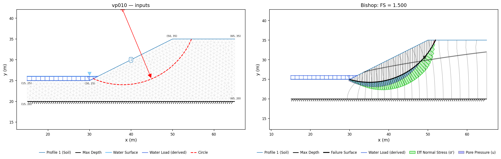

### VP11: Saint-Alban test embankment — measured pore-pressure grid {#vp11}

Slide #11 is the Saint-Alban test embankment (Pilot et al. 1982), a two-material
section built on soft clay and loaded until it failed. The manual supplies its pore
pressures as a grid of values interpolated from the isobars the paper prints.

Those isobars are **construction-induced excess pore pressures** — the undrained
response of the foundation clay to the fill placed on top of it, recorded by
piezometer as the embankment was raised. There is no seepage problem behind them: no
steady or transient flow field generates that pattern, so no flow solution can
regenerate it, and reading the printed grid is the only way to obtain it.

XSLOPE takes water three ways — a piezometric line, an ru coefficient, or a
finite-element seepage solution — and deliberately carries no pore-pressure-grid
input. Each of those three describes a pressure field with a physical model behind it,
which is what makes a benchmark reproducible rather than transcribed. A grid of
measured values has no such model.

There is therefore no reproducible numeric target here and no factor of safety to
lock. The same reasoning applies to [VP12](#vp12) and [VP13](#vp13); every other
water problem in this corpus is built.

### VP12: Lanester test embankment — measured pore-pressure grid {#vp12}

Slide #12 is the Lanester test embankment: four materials, a tension crack, and the
same class of input as [VP11](#vp11) — a printed 22-point pore-pressure grid.

The grid records measured loading-induced pressure rather than a flow field, so the
position is identical to VP11's: nothing XSLOPE can solve produces those numbers, and
transcribing them is not verification. No factor of safety is locked.

Also [SLOPE/W §2.10](geostudio.md) — the same problem in the GeoStudio corpus.

### VP13: Cubzac-les-Ponts test embankment — measured pore-pressure grid {#vp13}

Slide #13 is the Cubzac-les-Ponts test embankment, three materials on a soft
foundation, and it sits in the same position as [VP11](#vp11) and [VP12](#vp12): the
manual's pore pressures are measured construction-induced values interpolated from the
source's isobars, not a solved flow field.

No seepage analysis reproduces them, XSLOPE has no pore-pressure-grid input, and no
factor of safety is locked.

### VP14: Slope, homogeneous (Arai & Tagyo ex. 1) {#vp14}

From [Arai & Tagyo (1985)](https://doi.org/10.3208/sandf1972.25.43), *Soils
and Foundations* 25(1), and republished by Greco (1996), Malkawi et al.
(2001), and [Kim et al. (2002)](https://doi.org/10.1061/(ASCE)1090-0241(2002)128:7(546)); also
[SLOPE/W Verification Manual](https://files.seequent.com/PDFs/Geostudio-Slope%20Stability%20Verification%20Manual-Oct2022.pdf)
sec. 2.11. A homogeneous 1.5:1 slope, 20 m high, with
c = 41.65 kPa, φ = 15.0°, γ = 18.82 kN/m³ (total stress).

Excel input file: [xslope_arai_tagyo.xlsx](../lem/files/xslope_arai_tagyo.xlsx)

Results for all six methods (automated critical-circle search, 50 slices):

| Method | XSLOPE FOS | SLOPE/W | Arai & Tagyo |
|---|---|---|---|
| Ordinary (OMS) | 1.344 | — | 1.451 (−7.4%) |
| Bishop's Simplified | 1.404 | 1.417 (−0.9%) | 1.451 (−3.2%) |
| Simplified Janbu | 1.411 | — | 1.451 (−2.8%) |
| Corps of Engineers | 1.476 | — | 1.451 (+1.7%) |
| Lowe & Karafiath | 1.438 | — | 1.451 (−0.9%) |
| Spencer | 1.401 | — | 1.451 (−3.4%) |
| Morgenstern-Price | 1.400 | 1.414 (−1.0%) | 1.451 (−3.5%) |

SLOPE/W publishes only Bishop and Morgenstern-Price for this problem, in its §2.11;
the remaining methods are compared against the Arai & Tagyo reference alone. The
same two pairings are tabulated at [SLOPE/W §2.11](geostudio.md#gs-2-11).

**Source:** Arai, K. & Tagyo, K. (1985). Determination of noncircular slip
surface giving the minimum factor of safety in slope stability analysis.
*Soils and Foundations* 25(1):43-51.
[doi:10.3208/sandf1972.25.43](https://doi.org/10.3208/sandf1972.25.43).
Republished in Greco (1996), [Malkawi et al. (2001)](https://doi.org/10.1061/(ASCE)1090-0241(2001)127:8(688)), and Kim et al. (2002);
also SLOPE/W Verification Manual sec. 2.11.

<!-- fs-table -->
**Factor of safety by method** (each method's own critical surface):

| OMS | Bishop | Janbu | Corps | Lowe | Spencer | M-P |
|---:|---:|---:|---:|---:|---:|---:|
| 1.344 | 1.404 | 1.411 | 1.476 | 1.438 | 1.401 | 1.400 |
<!-- /fs-table -->

<!-- test: file=../lem/files/xslope_arai_tagyo.xlsx, type=circular_search, num_slices=50, fs_oms=1.344, fs_bishop=1.404, fs_janbu=1.411, fs_corps=1.476, fs_lowe=1.438, fs_spencer=1.401, fs_mprice=1.400, benchmark=LEM-2b -->

Also [SLOPE/W §2.11](geostudio.md) — the same problem in the GeoStudio corpus.

### VP15: Slope, (3) materials, weak layer {#vp15}

Slide #15: Arai & Tagyo (1985) example 2 — three layers with a weak (c=9.8, phi=5) middle band and no water, solved by circular search. Slide2's values come from its auto-refine search.

**Input files:** [vp015.xlsx](files/rocscience/vp015.xlsx)

| Method | XSLOPE | Slide | A&T | Kim et al. (2002) |
|---|---|---|---|---|
| Bishop | 0.419 | 0.420 (−0.2%) | 0.417 (+0.5%) | — |
| Janbu (corrected) | 0.436 | 0.423 (+3.1%) | 0.430 (+1.4%) | — |
| Spencer | 0.422 | 0.409 (+3.2%) | — | 0.43 (−1.9%) |
| Morgenstern-Price | 0.420 | — | — | — |
| Slide2 GLE — cross-method, no XSLOPE counterpart | — | 0.437 | — | — |

*Kim et al. state no method, so their 0.43 is a headline factor of safety and pairs with
Spencer under the fallback rule. A&T report Bishop; the A&T Janbu (corrected) entry 0.430
is the attribution this page has always carried and is not independently confirmed here.*

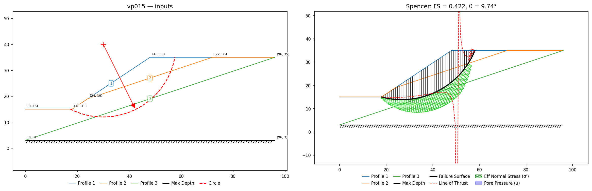

### VP16: Slope, homogenous, water table {#vp16}

Slide #16: Arai & Tagyo (1985) example 3 — a homogeneous slope with a water table, solved by circular search (Slide2 runs it with auto refine).

**Input files:** [vp016.xlsx](files/rocscience/vp016.xlsx)

| Method | XSLOPE | Slide | A&T | SLOPE/W |
|---|---|---|---|---|
| Bishop | 1.112 | 1.118 (−0.5%) | 1.138 (−2.3%) | 1.190 (−6.6%) |
| Janbu (corrected) | 1.122 | 1.131 (−0.8%) | — | — |
| Spencer | 1.113 | 1.118 (−0.4%) | — | — |
| Morgenstern-Price | 1.111 | — | — | — |
| Janbu (simplified) — cross-method, XSLOPE reports the f₀-corrected value | — | 1.046 | — | — |

*SLOPE/W's Bishop is the outlier of the four sources.*

Also [SLOPE/W §2.12](geostudio.md) — the same problem in the GeoStudio corpus.

### VP17: Slope, homogenous {#vp17}

Slide #17: the Yamagami & Ueta (1988) homogeneous dry slope. The benchmark is run two ways — a circular search and a non-circular search — and the published sources report both.

**Input files:** [vp017.xlsx](files/rocscience/vp017.xlsx)

| Surface | Method | XSLOPE | Slide | Y&U | Greco |
|---|---|---|---|---|---|
| circular | Ordinary | 1.274 | 1.278 (−0.3%) | 1.282 (−0.6%) | — |
| circular | Bishop | 1.342 | 1.344 (−0.1%) | 1.348 (−0.4%) | — |
| circular | Spencer | 1.340 | — | — | — |
| non-circular | Spencer | 1.394 | 1.325 (+5.2%) | 1.339 (+4.1%) | 1.33 (+4.8%) |

*The circular Spencer value has no published circular counterpart — all three sources
report Spencer on the non-circular surface. XSLOPE's local non-circular search plateaus
above every published optimized surface, the same search-power note as VP19/VP20.*

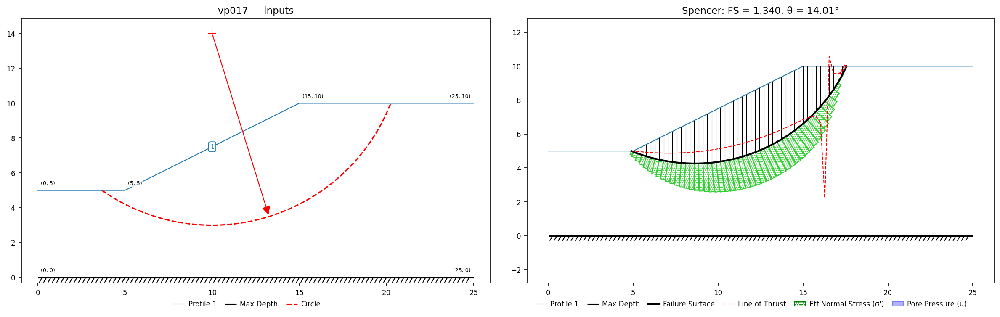

### VP18: Slope, homogenous slope, ru pore pressure {#vp18}

Slide #18: Spencer (1969) / Baker (1980) homogeneous slope with ru=0.5, non-circular critical surface. The slope descends left-to-right (a right-facing case). Slide2 solves it with a random search plus Monte-Carlo optimization.

**Input files:** [vp018.xlsx](files/rocscience/vp018.xlsx)

| Method | XSLOPE | Slide (MC-optimized) | Baker | Spencer (1969) |
|---|---|---|---|---|
| Spencer | 1.033 | 1.010 (+2.3%) | 1.02 (+1.3%) | 1.08 (−4.4%) |
| Morgenstern-Price | 1.024 | — | — | — |

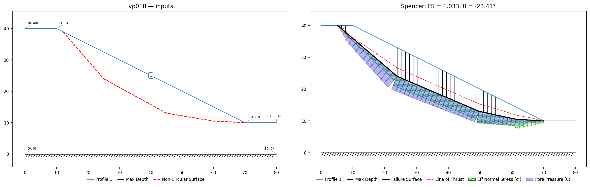

### VP19: Slope, (4) materials {#vp19}

Slide #19: Greco (1996) ex. 4 / Yamagami & Ueta (1988) four-layer slope, no water, non-circular critical surface. Slide2 solves it with a random search plus Monte-Carlo optimization, restricted to convex surfaces.

**Input files:** [vp019.xlsx](files/rocscience/vp019.xlsx)

| Method | XSLOPE | Slide (MC) | Greco / Y&U (published band) |
|---|---|---|---|
| Bishop | 1.448 | — | — |
| Spencer | 1.429 | 1.398 (+2.2%) | 1.40–1.42 |

*Circular-search values; the local non-circular search plateaus ~1.45 (search-power gap).*

Also [SLOPE/W §2.13](geostudio.md) — the same problem in the GeoStudio corpus.

### VP20: Slope, (4) materials, weak layer, water table {#vp20}

Slide #20: Greco (1996) ex. 5 / Chen & Shao (1988): four layers with a 0.5 m weak seam along the inclined model base, water table. Polygon-zone geometry (the base is not horizontal). Slide2 runs the problem twice — a circular toe-focus grid search, and a non-circular block search in the seam with Monte-Carlo optimization.

**Input files:** [vp020.xlsx](files/rocscience/vp020.xlsx)

*Circular (toe-focus grid)*

| Method | XSLOPE | Slide | Greco |
|---|---|---|---|
| Bishop | 1.086 | 1.087 (−0.1%) | — |
| Spencer | 1.082 | 1.093 (−1.0%) | 1.08 (+0.2%) |

*Non-circular seam block*

| Method | XSLOPE (local search) | Slide (block search + MC) | Chen & Shao (published band) | Greco (published band) |
|---|---|---|---|---|
| Spencer | 1.082 | 1.010 (+7.1%) | 1.01–1.03 | 0.973–1.1 |

Also [SLOPE/W §2.14](geostudio.md) — the same problem in the GeoStudio corpus.

### VP21: Slope, homogeneous, ru pore pressure (Fredlund & Krahn 1977) {#vp21}

Slide #21: Fredlund & Krahn (1977)'s classic homogeneous slope — the reference
problem that [VP22](#vp22) extends with a weak seam. A single fixed circle,
center (120, 90), R = 80, in imperial units, solved for all three of F&K's
pore-pressure cases: dry, ru = 0.25, and a piezometric water table.
F&K published all four method values for every case.

**Input files:** [vp021a.xlsx](files/rocscience/vp021a.xlsx) (dry),
[vp021b.xlsx](files/rocscience/vp021b.xlsx) (ru = 0.25),
[vp021c.xlsx](files/rocscience/vp021c.xlsx) (water table)

| Method | XSLOPE (dry) | F&K (dry) | XSLOPE (ru) | F&K (ru) | Slide (ru) |
|---|---|---|---|---|---|
| Ordinary | 1.927 | 1.928 (−0.1%) | 1.606 | 1.607 (−0.1%) | 1.687 (−4.8%) |
| Bishop | 2.075 | 2.080 (−0.2%) | 1.759 | 1.766 (−0.4%) | — |
| Spencer | 2.071 | 2.073 (−0.1%) | 1.757 | 1.761 (−0.2%) | — |
| Morgenstern–Price | 2.071 | 2.076 (−0.2%) | 1.756 | 1.764 (−0.5%) | — |

Case 3 adds F&K's piezometric line, read from the Slide2 model itself — the
vendor RS2 "Slide2 Import" of Slide #21 carries it verbatim in its `piezos`
block. The line enters the crest face at el. 40, descends to meet the ground at
the slope toe (140, 20) and runs along the toe bench: coordinates
(0, 40) — (140, 20) — (180, 20).

| Method | XSLOPE (water table) | F&K | Slide |
|---|---|---|---|
| Ordinary | 1.693 | 1.693 (0.0%) | 1.716 (−1.3%) |
| Bishop | 1.829 | 1.834 (−0.3%) | 1.833 (−0.2%) |
| Spencer | 1.827 | 1.830 (−0.2%) | 1.831 (−0.2%) |
| Morgenstern–Price | 1.826 | 1.832 (−0.3%) | 1.831 (−0.3%) |

*XSLOPE reproduces Fredlund & Krahn's own Ordinary-method value exactly in both
the ru case (1.606 vs 1.607) and the water-table case (1.693 vs 1.693),
where Slide reads 1.687 and 1.716; the rigorous methods agree with both F&K and
Slide to within 0.006.*

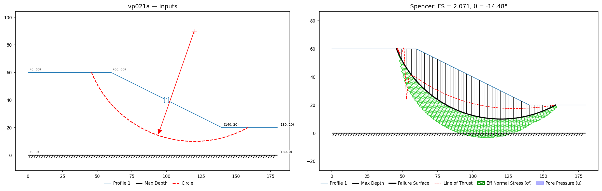
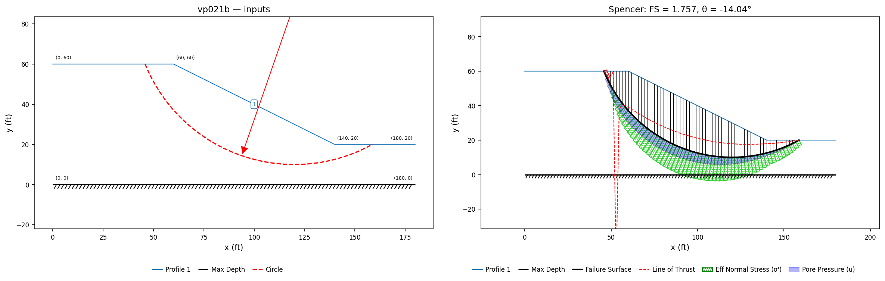
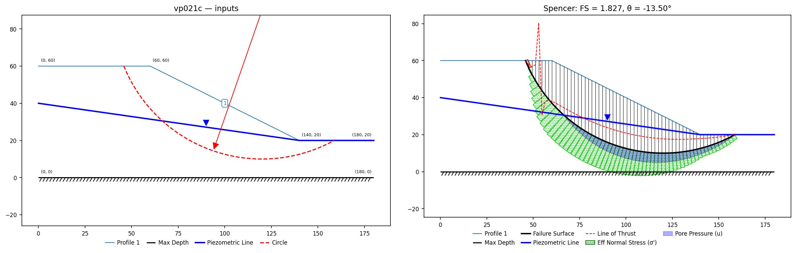

### VP22: Slope, (2) materials, weak layer, composite surface {#vp22}

Slide #22: the Fredlund & Krahn (1977) slope of #21 with a 1-ft weak seam (c'=0, φ'=10°) between el. 16 and the impenetrable base at el. 15. This is the corpus's **composite-surface** benchmark. F&K's circle — center (120, 90), R = 80 — bottoms out at el. 10, five feet *below* the base, so it cannot be used as a circle at all: the slip surface descends on the arc until it meets the base, runs horizontally along the weak seam, and climbs back out on the arc. Here 30 of the 59 slices sit on the seam.

Two cases: dry, and ru = 0.25 in both materials.

**Input files:** [vp022a.xlsx](files/rocscience/vp022a.xlsx) (dry), [vp022b.xlsx](files/rocscience/vp022b.xlsx) (ru = 0.25)

| Method | XSLOPE (dry) | Slide (dry) | F&K (dry) | XSLOPE (ru) | Slide (ru) | F&K (ru) |
|---|---|---|---|---|---|---|
| Ordinary | 1.297 | 1.300 (−0.2%) | 1.288 (+0.7%) | 1.037 | 1.121 (−7.5%) | 1.029 (+0.8%) |
| Bishop | 1.380 | 1.382 (−0.1%) | 1.377 (+0.2%) | 1.121 | 1.124 (−0.3%) | 1.124 (−0.3%) |
| Spencer | 1.379 | 1.382 (−0.2%) | 1.373 (+0.4%) | 1.122 | 1.124 (−0.2%) | 1.118 (+0.4%) |
| Morgenstern–Price | 1.370 | 1.372 (GLE — cross-method) | 1.370 (0.0%) | 1.112 | 1.114 (GLE — cross-method) | 1.118 (−0.5%) |

*Every method agrees with Slide to within 0.004 except the Ordinary method with ru, where XSLOPE (1.037) reproduces Fredlund & Krahn's own published value (1.029) rather than Slide's (1.121). The Ordinary method has no unique treatment of pore pressure — it takes N' = W·cosα − u·Δℓ from equilibrium perpendicular to the base, which on the near-horizontal seam drives N' far down — and the published values themselves split on it. The three methods that satisfy real equilibrium all agree.*

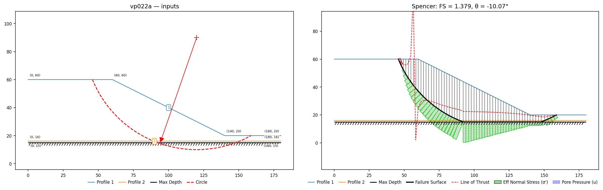
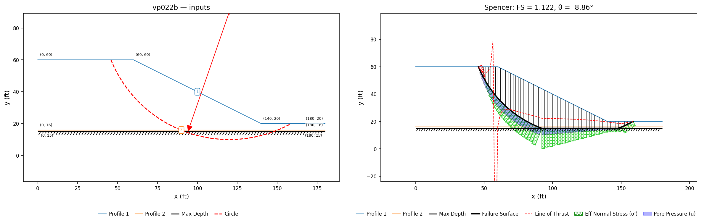

### VP23: Slope, (3) materials {#vp23}

Slide #23: Low (1989) slope over two undrained layers; the lower layer's cu grows linearly 15->30 kPa from y=4 to y=0 (xslope 'cp' option: Su = c + cp*(r_elev - y)). Circular search.

**Input files:** [vp023.xlsx](files/rocscience/vp023.xlsx)

| Method | XSLOPE | Slide | Low | Kim |
|---|---|---|---|---|
| Ordinary | 1.357 | 1.370 (−0.9%) | 1.36 (−0.2%) | — |
| Bishop | 1.130 | 1.192 (−5.2%) | 1.14 (−0.9%) | 1.17 (−3.4%) |

*Published Bishop values themselves spread 1.14–1.19 on this deep φ=0 problem.*

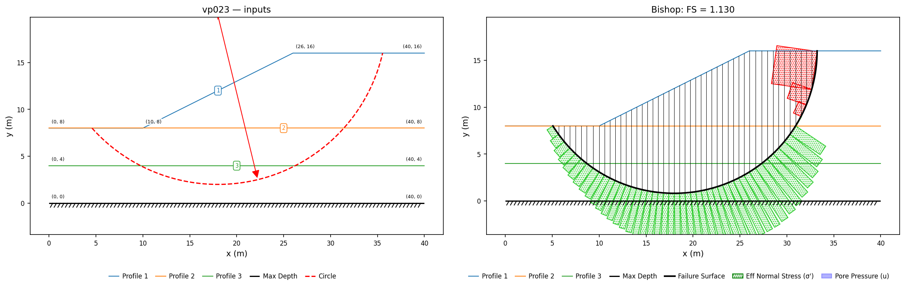

### VP24: Slope, (3) materials {#vp24}

Slide #24: Low (1989) three-layer undrained slope (phi=0). Circular search.

**Input files:** [vp024.xlsx](files/rocscience/vp024.xlsx)

| Method | XSLOPE | Slide | Low |
|---|---|---|---|
| Ordinary | 1.435 | 1.439 (−0.3%) | 1.44 (−0.3%) |
| Bishop | 1.435 | 1.439 (−0.3%) | 1.44 (−0.3%) |

*Geometry follows the RS2 vendor `.fez`: three equal 4.5 m layers (crest y = 13.5, bench
y = 7.5, slope break x = 33.5).*

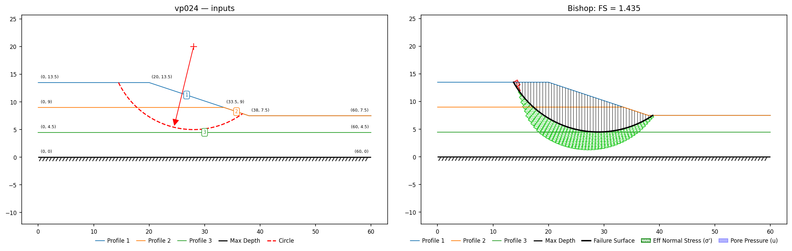

### VP25: Prandtl bearing mechanism on a 60° slope (Chen & Shao 1988) {#vp25}

Slide #25 / Chen & Shao (1988): the classical plasticity problem — a weightless, frictionless 10-m slope at 60° (c = 49 kPa, γ = 10⁻⁶) loaded by the critical strip load q = 149.31 kPa over 10 m of crest, evaluated on the Prandtl slip surface (theoretical FS = 1.0). The surface is built analytically: a 45° active wedge from the load's right edge, a circular fan of radius 10/√2 centered on the load's left edge (tangent to both straight segments), and an exit through the face at Slide's printed endpoint (0.773, 1.340).

**Input files:** [vp025.xlsx](files/rocscience/vp025.xlsx)

| Method | XSLOPE | Slide | Chen & Shao | Theory |
|---|---|---|---|---|
| Spencer | 1.052 | 1.051 (+0.1%) | 1.05 (+0.2%) | 1.0 (+5.2%) |
| Morgenstern-Price (half-sine) | 1.069 | 1.009 (GLE — cross-method) *(custom interslice function fit to the theoretical distribution)* | — | 1.0 (+6.9%) |

Also [SLOPE/W §2.15](geostudio.md) — the same problem in the GeoStudio corpus.

### VP26: Prandtl bearing mechanism on level ground {#vp26}

Slide #26: the classical Prandtl footing problem — a weightless c = 20 soil (γ = 10⁻⁶,
φ = 0) on **level ground**, loaded by a strip UDL of **102.83** over the crest. That load
is exactly the ultimate bearing capacity c·Nc = 20·(2 + π) = 102.83, so the
theoretical factor of safety is **1.0** by construction. The evaluation runs on the printed
Prandtl surface (an active wedge, a logarithmic-spiral/circular fan, and a passive wedge),
extracted with its end segments extended past the ground line.

This is the corpus's canonical **level-ground bearing** problem: its two ground crossings
sit at the same elevation, which the flat-arc facing rule handles. The surface itself
is symmetric, so the facing is set by the load — offset to the loaded side — via the
`right_facing` override the rule exposes.

**Input files:** [vp026.xlsx](files/rocscience/vp026.xlsx)

| Method | XSLOPE | Theory | Slide2 |
|---|---|---|---|
| Spencer | **1.043** | 1.0 (+4.3%) | 0.941 (+10.8%) |
| Morgenstern-Price (half-sine) | 1.051 | 1.0 (+5.1%) | — |
| Lowe & Karafiath | 1.017 | 1.0 (+1.7%) | — |
| Janbu (corrected) | 1.095 | 1.0 (+9.5%) | — |

XSLOPE's methods **bracket the exact theory FS of 1.0** (0.98–1.10), with Spencer at 1.043;
Slide2 reads 0.941, −5.9% against theory. The gap is a genuine interslice-convention difference
on this degenerate flat-ground mechanism, not a discretization artifact — Spencer is stable
from 8 to 200 slices, and densifying the analytic arc moves it *away* from Slide, toward
theory. The lock is XSLOPE's own Spencer value, referenced against both anchors. The RS2
strength-reduction rendition of the same problem (RS2-21) independently converges on the
theory value from the continuum side. Also [SLOPE/W §2.16](geostudio.md) — the same Prandtl
problem in the GeoStudio corpus.

### VP27: XSTABL slope with undulating bedrock and auto-Hu pore pressures {#vp27}

Slide #27 / XSTABL v5 reference manual (Sharma 1996), via Malkawi et al. (2001): a two-material slope over undulating bedrock (polygon-mode bottom), a zero-strength cap layer, and a water table, with soil 1 carrying distinct moist/saturated unit weights (116.4/124.2 pcf). Slide and XSTABL both apply the phreatic-inclination correction (u reduced by cos² of the local phreatic slope), which XSLOPE selects with the piezometric-line **Type** flag (`piezo` | `phreatic`). Evaluated on the specified circle (59.52, 219.21, R=157.68); all geometry vertices are labeled in Slide's figure, and the water table was pixel-traced (±2 ft).

**Input files:** [vp027.xlsx](files/rocscience/vp027.xlsx)

| Method | XSLOPE (phreatic Type) | Slide | XSTABL |
|---|---|---|---|
| Bishop | 1.369 | 1.396 (−1.9%) | 1.397 (−2.0%) |
| Janbu | 1.365 | 1.391 (−1.9%) | 1.392 (−1.9%) |
| Spencer | 1.375 | 1.402 (−1.9%) | 1.403 (−2.0%) |
| Morgenstern-Price | 1.371 | 1.398 (−1.9%) | 1.399 (−2.0%) |
| Corps #2 | 1.388 | 1.414 (−1.8%) | 1.416 (−2.0%) |
| Lowe & Karafiath | 1.386 | 1.411 (−1.8%) | 1.413 (−1.9%) |

*A uniform −1.9% across all six methods (−3.0% with the plain static-head `u=piezo`), consistent with a small systematic difference in the digitized water table rather than any method-level disagreement — the method-to-method spread matches Slide/XSTABL exactly. The manual's tension-crack variants (analyses 3–4) are not built.*

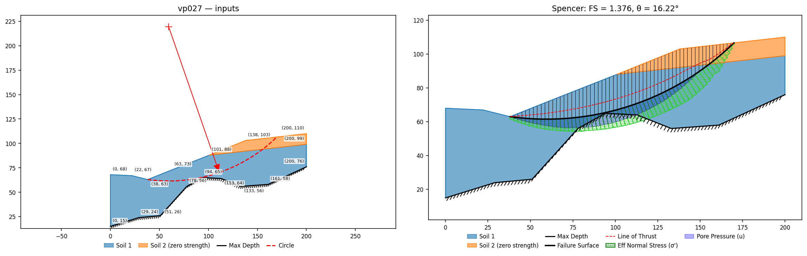

### VP28: Excavated slope and embankment, probabilistic analysis {#vp28}

**Input files:** [vp028a.xlsx](files/rocscience/vp028a.xlsx) (Congress St. Cut, shallow
mode) · [vp028b.xlsx](files/rocscience/vp028b.xlsx) (embankment, interface mode) ·
[vp028c.xlsx](files/rocscience/vp028c.xlsx) (embankment, deep mode)

Chowdhury & Xu (1995) evaluate probabilities of failure for two slopes: the Congress
Street Cut (Ireland 1954) — three frictionless clays under a sand cap whose strength is
excluded — and an embankment on a soft clay foundation, each with slip circles tangent to
two different layer boundaries. Slide's manual prints the critical circle (center and
radius) for every case; those circles are evaluated here as fixed surfaces with Bishop's
method, and reliability uses the Taylor-series procedure on the same surfaces.

| Case | XSLOPE FS | Slide FS | C&X FS | XSLOPE TSPM β_ln / PF | XSLOPE MC β_ln / PF | Slide RI_ln / MC PF (cross-estimator) | C&X PF (cross-estimator) |
|---|---|---|---|---|---|---|---|
| Congress St., tangent clay-2 base | 1.129 | 1.128 (+0.1%) | 1.128 (+0.1%) | 0.768 / 22.1% | 0.761 / 21.9% | 0.650 / 24.6% | 26.6% |
| Embankment, tangent interface | 1.158 | 1.160 (−0.2%) | 1.1625 (−0.4%) | 0.787 / 21.6% | 0.794 / 20.8% | 0.799 / 21.2% | 20.2% |
| Embankment, tangent foundation base | 1.177 | 1.185 (−0.7%) | 1.1479 (+2.5%) | 0.798 / 21.2% | 0.783 / 21.1% | 0.820 / 19.9% | 19.7% |

The **XSLOPE MC** column is a 10,000-sample Monte Carlo run on the same fixed circles and the
same normal input distributions the Taylor series uses (seeded, so the values are
regression-locked). It separates the estimator from the inputs in the cross-source
disagreement below: XSLOPE's Taylor series and Monte Carlo, given identical inputs, land on
top of each other — σ_F 0.163 vs 0.164 and β_ln 0.768 vs 0.761 on the Congress St. circle, and
within ±0.015 of β_ln on all three cases.

*Input provenance — the vendor SLOPE/W model settles it.* C&X's paper states no unit
weights, so the manual notes Rocscience chose the clay unit weights to reproduce the
published deterministic FS. The **Seequent `.gsz` for this problem** (SLOPE/W
[§2.17](geostudio.md), 20 analyses) carries the actual calibrated values SLOPE/W used:
**sand cap γ = 21**, **all three Congress-St. clays γ = 22**, and — the layer the Slide
manual leaves unstated below clay-3 — a **`bed` unit, c′ = 200 / φ′ = 35°**, essentially
impenetrable. It also puts every cohesion σ as a per-material perturbation, and those are
C&X's own published statistics (Example 1 clays σ = 20.4 / 8.2 / 13.2, etc.). Two
corrections follow. First, **the embankment (Example 5) is not uncalibrated**: the `.gsz`
specifies it fully (fill c′ = 10 / φ′ = 12° / γ = 20, foundation clay c′ = 40 / φ′ = 0 /
γ = 18, over the bedrock), which is exactly what vp028b/c carry — those are calibrated
inputs, not free parameters. Second, **the deep circle is not indeterminate**: the
`.gsz` places the clay-3 base at el. −12.19 and the Layer-3 circle is *tangent* there, so
it rides the clay-3 base with the strong `bed` untouched — a hand-digitized section that puts
the circle 0.19 m into an unstated layer is reading the figure, not a real sensitivity. (One
provenance seam remains in the XSLOPE files: vp028a carries a
sand↔clay-1 γ swap [sand 22 / clay-1 21] that tunes it to Slide's *printed* FS of 1.128;
the vendor's un-swapped γ's read 1.132, a 0.3 % difference.)

**SLOPE/W's own solved FS and probability of failure for all ten cases** are in the `.gsz`
too, and XSLOPE reproduces them on the identical (imported) circles with the vendor σ's:

| Case (C&X example, tangent layer) | XSLOPE M-P | SLOPE/W (M-P) | XSLOPE TSPM σ_F | SLOPE/W MC σ_F (cross-estimator) | XSLOPE PF (Taylor) | SLOPE/W MC PF (cross-estimator) |
|---|---|---|---|---|---|---|
| Ex 1 Congress St., clay-2 *(= locked row 1)* | 1.129 | 1.132 (−0.3%) | 0.192 | 0.190 | 26.2% | 25.3% |
| Ex 1 Congress St., clay-3 (deep) | 1.113 | 1.116 (−0.3%) | 0.188 | 0.186 | 28.8% | 26.2% |
| Ex 2 Congress St. (Su set B), clay-2 | 1.108 | 1.110 (−0.2%) | 0.041 | 0.041 | 0.27% | 0.4% |
| Ex 2 Congress St. (Su set B), clay-3 | 1.061 | 1.063 (−0.2%) | 0.028 | 0.028 | 1.17% | 1.3% |
| Ex 3 Congress St. (Su set C), clay-2 | 2.244 | 2.248 (−0.2%) | 0.378 | 0.377 | 0.0001% | 0.04% |
| Ex 3 Congress St. (Su set C), clay-3 | 2.135 | 2.138 (−0.1%) | 0.353 | 0.347 | 0.0003% | 0.02% |
| Ex 4 Congress St. (drained c′-φ′), clay-2 | 1.444 | 1.422 (+1.5%) | 0.211 | 0.210 | 0.71% | 2.4% |
| Ex 4 Congress St. (drained c′-φ′), clay-3 | 1.560 | 1.504 (+3.7%) | 0.192 | 0.195 | 0.017% | 0.5% |
| Ex 5 embankment, interface *(= locked row 2)* | 1.157 | 1.158 (−0.1%) | 0.197 | 0.198 | 21.8% | 21.0% |
| Ex 5 embankment, foundation *(= locked row 3)* | 1.173 | 1.178 (−0.4%) | 0.218 | 0.222 | 21.8% | 21.4% |

*The σ_F reconciliation.* Evaluated on **SLOPE/W's own critical surfaces with the vendor's
own cohesion σ's**, XSLOPE's Taylor-series σ_F matches SLOPE/W's Monte-Carlo σ_F to ≈ 1% on
every one of the ten cases (0.192 vs 0.190 on Congress St., 0.041 vs 0.041, 0.378 vs 0.377,
…). Most of the cross-source σ_F spread the locked table above records
(XSLOPE Taylor 0.163 vs Slide/C&X ≈ 0.19–0.21) is therefore **the surface, not the
estimator or the input family**. The locked row is evaluated on Slide's *printed* circle
over a hand-digitized section — a slightly larger, differently-centred arc that propagates
the same cohesion σ's into a smaller σ_F; on SLOPE/W's searched circle the same XSLOPE
Taylor series lands on SLOPE/W's Monte Carlo. The estimator itself is not the variable:
XSLOPE's own Taylor series and Monte Carlo on one surface agree to <1%, and VP29 and VP36
reach the same conclusion from the σ-input side.*

*Method and estimator.* Every analysis in the `.gsz` is Morgenstern-Price, so the
factor-of-safety column is XSLOPE's Morgenstern-Price against SLOPE/W's, like for like, and
each campaign is run with the vendor's own circle held fixed rather than re-searched.
Bishop is not tabulated separately because it coincides with M-P to four figures on the six
undrained Congress St. cases and separates only where friction enters — Bishop reads 1.549
on Example 4 clay-3, and 1.159 / 1.176 on the two Example 5 cases. Deterministic FS agrees
within 0.3% on the six φ = 0 Congress St. cases; the drained Example 4 is where the two
programs genuinely part company, at +1.5% and +3.7%, and that residual **survives the
like-for-like pairing** rather than being an artifact of comparing Bishop with M-P. The two
probability-of-failure columns are comparable where the probability is large — 26.2% against
25.3%, and 21.8% against 21.0% and 21.4% — and diverge in the far tail, where SLOPE/W's
10⁴-sample Monte Carlo is at its resolution limit (0.01% per realization, so its 0.04% is
four realizations) while XSLOPE's Taylor series extrapolates a lognormal tail from β. The
`.gsz` marks the Example 5 bedrock *impenetrable*; it is carried here as the corpus files
carry it, a high-strength Mohr-Coulomb layer the slip surface never enters.*

*Examples 2–4 and the deep tangent modes are computable
and vendor-anchored to the numbers above; because they re-run the same Congress-St. mechanism
the locked cases already exercise, they are documented here rather than each minted as a
separate regression lock.*

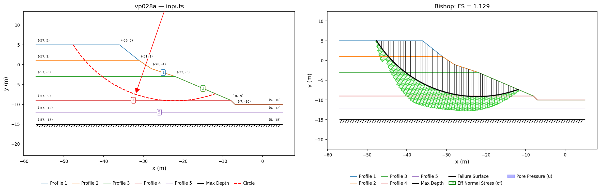
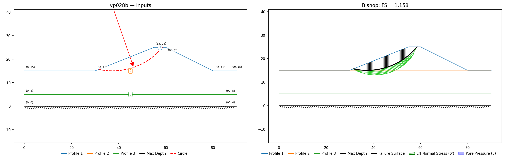
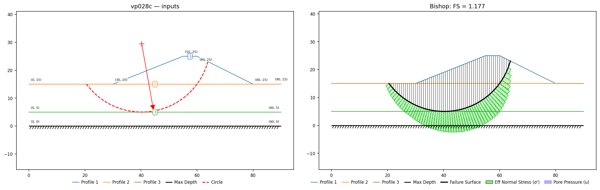

### VP29: Duncan's LASH terminal — TSPM reliability vs Monte Carlo {#vp29}

Slide #29 / Duncan (2000): the underwater trench failure at the Port of San Francisco LASH terminal — the example the Taylor-series reliability method (TSPM) was built on, and the method XSLOPE's `reliability()` implements. San Francisco Bay Mud with depth-growing undrained strength (su = 100 psf at el. −20 + 9.8 psf/ft — XSLOPE's `cp` option; the profile is confirmed against Duncan's Fig. 2(b)/D&W Fig. 13.1 average line), γ = 100 pcf (γ′ = 37.6), fully submerged below el. 0. Probabilistic inputs: σ_γ = 3.3, σ_cp = 1.2 (Slide's Table 29.2 rendering of Duncan's ±σ envelopes). Duncan's estimated slip surface is stored as a pixel-trace of the drawn surface, validated against the printed endpoints (Slide's printed "Axis Location" is the noncircular moment axis, not a circle center — a circle built from it lies up to 17 ft off the drawn surface at mid-span, though it reads a similar FS). `reliability(search=False)` evaluates the prescribed surface directly for F_MLV and every perturbation.

**TSPM component comparison (fixed surface, Spencer):**

| Component | XSLOPE | Duncan (2000) Table 5 | Slide (LHS Monte Carlo) |
|---|---|---|---|
| F, most likely values | 1.145 | 1.17 (−2.1%) | 1.157 (−1.0%), mean 1.166 |
| ΔF, unit weight ±3.3 | 0.203 | 0.20 (+1.5%) | — |
| ΔF, strength ±σ | 0.235 (rate ±1.2) | 0.31 (envelope shift — a different perturbation, cross-basis) | — |
| σ_F | 0.155 | 0.18 (−13.9%) | — |
| β_ln → PF | 0.936 → **17.5%** | ≈0.9 → **18%** | 1.088 → 13.96% (Monte Carlo — cross-estimator) |

*Both published sources are reproduced. The deterministic factor of safety brackets between them (−1.0% vs Slide, −2.1% vs Duncan) on Duncan's surface represented as a smooth least-squares arc (RMS 1.1 ft against the pixel trace of Slide's figure; both sources describe the surface as nearly circular). The probability of failure reproduces Duncan's own 18% almost exactly, with the unit-weight derivative matching his table term for term. The strength ΔF is smaller than Duncan's by construction — Slide's Table 29.2 renders his whole-envelope ±σ as a rate-only σ (±1.2 psf/ft), the only form expressible in a c/cp parameterization — which is also why Slide's Monte Carlo PF (14%) sits below Duncan's 18%.*

*Surface provenance: the arc is anchored at the trench corner (138, −120) rather than Slide's printed left endpoint, which is pulled 0.25 ft below the trench floor; the drawn surface in Slide's figure is partially occluded by a coordinate label near its entry, so that span is read at the label's edges. On the probabilistic side, note that the same slope carries three published probabilities of failure — 14% (Slide MC), 18% (Duncan 2000 TSPM), 30–33% (D&W 2014 §13.5.6, wider 2σ-rule envelope): two TSPM analyses by the same author differ by more than TSPM differs from Monte Carlo, so the σ-input choice, not the estimator, dominates probabilistic comparisons.*

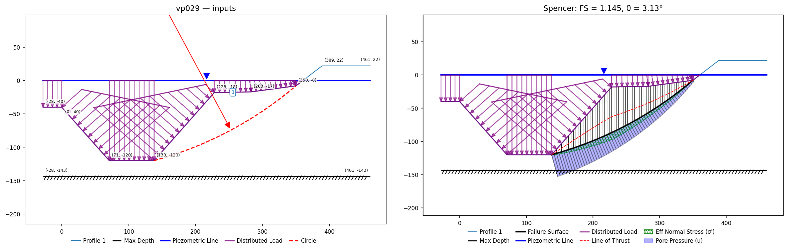

### VP30: Reinforced embankment, (4) materials, tension crack, geosynthetic {#vp30}

**Input files:** [vp030a.xlsx](files/rocscience/vp030a.xlsx) (circle A) ·
[vp030b.xlsx](files/rocscience/vp030b.xlsx) (circle B)

Borges & Cardoso (2002)'s first geosynthetic-reinforced embankment on soft clay: a 2 m
symmetric embankment, 10.6 m crest, 2:3 (V/H) faces, on a 5 m saturated clay layer over a
rigid stratum, with one unanchored geosynthetic level (T = 200 kN/m, force parallel to the
sheet) at the fill base. The paper's other two embankments are also built: Case 2 as VP31,
covered by [SLOPE/W §2.18](geostudio.md#gs-2-18), and Case 3 as [VP32](#vp32).

The two sources are complementary. The manual prints the materials (Table 30.2) and the
reinforcement but leaves the geometry to an unlabeled Figure 30.1; the paper supplies the
geometry (§4.1) and, in Table 10, both published circles outright — center (1.0, 1.0),
R = 5.74 (A) and R = 5.24 (B). They cross-check to the digit (circle A: MO 631.38 /
MR 1114.70 against the manual's 631 / 1115), and MRR = 200.00 on every
circle fixes the datum — 200 kN/m on a 1.0 m arm puts the geosynthetic at y = 0.

| Circle | XSLOPE (Bishop) | Slide2 | Borges & Cardoso |
|---|---|---|---|
| A (R = 5.74) | **1.679** | 1.69 (−0.7%) | 1.77 (−5.1%) |
| B (R = 5.24) | **1.650** | 1.66 (−0.6%) | 1.74 (−5.2%) |

*Borges & Cardoso's column is the uncracked arc integrated whole; the paragraphs below
work through why a method of vertical slices cannot reproduce it.*

Bishop is the method the manual specifies for this problem — it "best simulates the moment
based limit-equilibrium method the authors use" — and it lands within 0.7% of Slide on both
circles. The locked values include the geosynthetic at full capacity: removing it drops
Bishop to 1.359 / 1.262, a ΔF of +0.320 / +0.388 — the paper's own decomposition to the
third decimal (MRR/MO = 200/631.38 = 0.317 and 200/521.66 = 0.383).
The soil-side moments agree with Table 10 to under 1% (driving 635.9 vs 631.38, clay arc
845.0 vs 849.25), so the three published anchors reconcile completely: Borges' 1.77 is the
uncracked arc plus the geosynthetic, Slide's 1.69 and XSLOPE's 1.679 are the cracked arc
plus the same geosynthetic, and the crack costs −0.090 of FS — which is the published
1.77 − 1.69 spread, computed rather than asserted.

**The tension crack is the whole problem.** Both circles have their center below the crest,
so the arc's uphill end is buried at its equator and the daylight point sits *above* it
(circle A enters the crest at y = 2.0 with Yo = 1.0); the arc they bound exceeds a
semicircle. Slide resolves this by auto-cracking the reverse-curvature portion, and the manual
attributes its own gap to the source to exactly that. XSLOPE never synthesizes a crack from
curvature — the equivalent is an explicit `tcrack_depth`, which clips at a proper offset
surface. The principled depth is not tuned: the reverse-curvature portion *is* the arc above
the equator, and the equator lies at Yo, so the crack depth is
ycrest − Yo = **1.0 m**, which is what both files carry. The answer is
flat for any crack from 0.90 to 1.25 m, because the arc is near-vertical where the crack cuts
it — the insensitivity is the check that the model is right rather than fitted.

**Borges' 1.77 / 1.74 are not reproduced, and cannot be.** They come from a moment-based limit
equilibrium method integrating the whole arc, overhang included. Between the crest entry and
the equator that surface doubles back 89 mm, so one x-position carries two depths — a method
of vertical slices cannot represent it at all. This is not a guard that could be relaxed; it
is what slicing is. The published spread is itself instructive: Slide 1.69 / 1.66 against
Borges 1.77 / 1.74 is the cost of the crack, and XSLOPE reproduces the cracked branch.

**Spencer is not locked here, and the disagreement is measured, not mysterious** (1.192 /
1.080 against Bishop's 1.679 / 1.650, with Janbu refusing outright and Corps / Lowe & Karafiath
inflating to 2.8–4.6). The crack-shortened arc exceeds a semicircle — base angles run from
+83° at the crack face to −74° at the exit — so the horizontal projections of the base normals
nearly cancel: the whole mass carries only ≈68 kN/m of net horizontal driving force at F = 1,
a third of the 200 kN/m the geosynthetic mobilizes. Horizontal force equilibrium is close to
the null space of the problem, and any FS built on it is a ratio of two cancelling sums; Janbu
says so plainly ("net horizontal driving force is non-positive"). Spencer's constant
interslice inclination can transmit the concentrated horizontal force entering at the
near-vertical end only by hanging ≈240 kN/m of interslice *tension* at the crack face with a
negative normal on the cohesionless sliver — a root that satisfies both equations while the
thrust line leaves the soil, and that never converges: 1.19 → 1.38 as the slices refine from
60 to 960, then no solution at all. The two controls isolate the cause. Soil-only, the
geometry is benign (Bishop 1.359, Spencer 1.358 on circle A); and the same 200 kN/m spread
along the arc instead of concentrated at the entry returns Spencer to 1.683, beside Bishop.
Complete equilibrium *is* satisfiable at the moment answer: Morgenstern–Price with a half-sine
interslice function — side forces flattening exactly where the horizontal force enters —
converges with all base normals positive at **1.670 / 1.632**, within 0.6% of Bishop. For
φ = 0 circles the moment-equilibrium FS is the complete-equilibrium value (Duncan, Wright &
Brandon 2014, pp. 89, 96–97), which is why the manual prescribes Bishop and only the Bishop
comparison is regression-locked. On [VP32](#vp32) — same paper, same reinforcement model, no
crack — none of this arises: the arc is an ordinary sub-semicircle and Bishop and Spencer
agree to three decimals.

One note on the materials: the Case-1 clay profile has a middle layer whose undrained strength
*decreases* with depth (8.49 → 4.725 kPa), unlike the monotonically increasing profiles in
Cases 2 and 3. The paper explains it — the top metre consolidated during construction (~14 kPa
of effective volumetric stress), so its strength was computed at the raised stress, leaving it
stronger than the layer beneath.

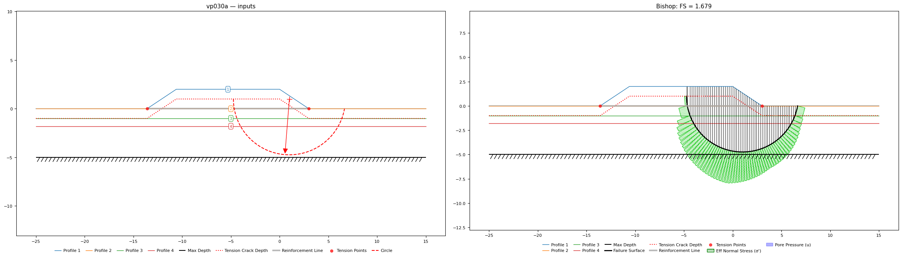

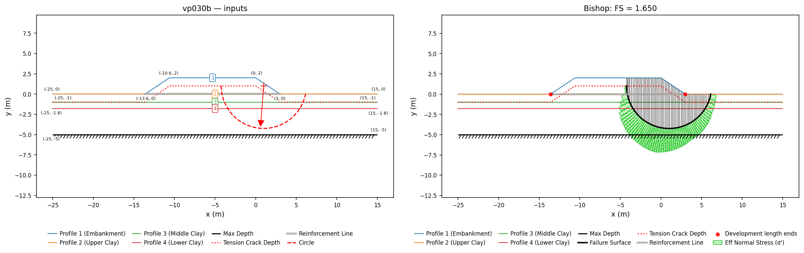

**Sources:** Slide Slope Stability Verification Manual §30; Borges & Cardoso (2002),
*Geotextiles and Geomembranes* 20(6), 395–421.

### VP32: Reinforced embankment, (7) materials, geosynthetic {#vp32}

**Input files:** [vp032a.xlsx](files/rocscience/vp032a.xlsx) (case 1, circle A) ·
[vp032b.xlsx](files/rocscience/vp032b.xlsx) (case 1, circle B) ·
[vp032c.xlsx](files/rocscience/vp032c.xlsx) (case 2, circle C)

Borges & Cardoso (2002)'s third geosynthetic-reinforced embankment: two fill stages
(a 7 m and an 8.75 m crest) of granular fill over five soft clay layers, with a
T = 200 kN/m geosynthetic at the fill base (interface friction 30.96°, force parallel
to the reinforcement). Slide2's figures for this problem carry no coordinates; the
geometry here comes from the RS2 manual's fully labeled figures for the same problem,
which print every vertex, the clay layer boundaries, and the three published circles.

| Case | XSLOPE (Bishop = Spencer) | Slide2 | Borges & Cardoso |
|---|---|---|---|
| H = 7, circle A | 1.218 | 1.23 (−1.0%) | 1.25 (−2.6%) |
| H = 7, circle B | 1.216 | 1.22 (−0.3%) | 1.19 (+2.2%) |
| H = 8.75, circle C | 0.981 | 0.98 (+0.1%) | 0.99 (−0.9%) |

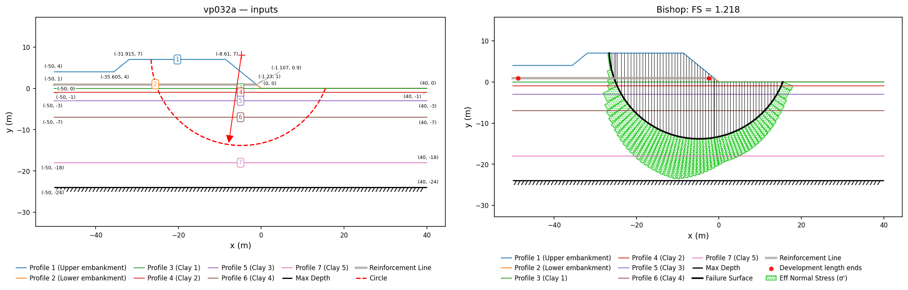

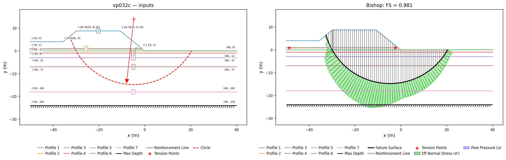

This is the paper's case 3.

### VP33: Dike, (5) materials, probabilistic analysis, water table {#vp33}

**Input files:** [vp033.xlsx](files/rocscience/vp033.xlsx)

El-Ramly, Morgenstern & Cruden (2003)'s simplified probabilistic model of a Syncrude
tailings dyke: a cohesionless section (tailing sand over glacio-fluvial sands and tills,
all φ = 34°) resting on a presheared disturbed clay-shale with φ = 7.5° ± 2.1°. The
critical mechanism rides the clay-shale: Slide's drawn circle (center (327.5, 394),
R = 124) is tangent to el. 270 — about nineteen meters below the model base (the vendor
`.fez` places the base near el. 289, gently sloping) — so the surface is **composite**,
truncated at the base and running flat inside the weak band.
This is the [composite-surface option](../lem/overview.md#composite-failure-surfaces) exercised
on a published benchmark.

|  | XSLOPE (composite) | Slide | El-Ramly et al. |
|---|---|---|---|
| Bishop, Slide's circle | 1.320 | 1.305 (+1.1%) | 1.31 (+0.8%) |
| Bishop, critical search | 1.261 | — | — |

*Modeling notes: Slide assigns three piezometric lines to different materials; XSLOPE's
single piezometric line uses the lowest (the one Slide assigns to the glacio-fluvial
sand) everywhere — applying each of Slide's lines everywhere brackets the factor of
safety within 1–3%, so the simplification is well inside the digitizing tolerance. The
clayey till's properties are not printed in the manual; the geometry and material zonation
(including the clayey till's φ = 7.5°, matching the clay-shale, and the diagonal wedge cut
that separates the two) follow the RS2 vendor `.fez` for this problem. The published
probability of failure
(1.5–1.6×10⁻³ by Monte Carlo) is reported here without a regression lock: it rests on
the paper's spatial-averaging variance treatment, which a single slope-scale σ does not
reproduce. Running the probabilistic analysis on the point-scale σ (φ = 7.5° ± 2.1° along the clay-shale) both
ways — Taylor series and a 10,000-sample Monte Carlo — gives PF ≈ 2.2% (β_ln ≈ 2.02) and
PF ≈ 3.5% (β_ln ≈ 2.03) respectively: the two estimators agree with each other, and both
sit roughly twenty times above El-Ramly et al.'s 0.15%. That factor is exactly the
variance reduction El-Ramly obtain by averaging φ over the length of the slip surface
(their autocorrelation model), a spatial-variability feature XSLOPE does not carry — so
the missing ingredient is a correlation-length treatment, not the estimator. A smaller
lumped σ would reproduce the published value only by being fitted to it.*

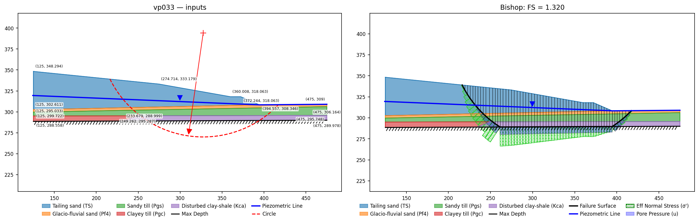

Also [SLOPE/W §2.20](geostudio.md) — the same problem in the GeoStudio corpus.

### VP34: Dam, (3) materials, probabilistic analysis, water table {#vp34}

**Input files:** [vp034.xlsx](files/rocscience/vp034.xlsx)

Wolff & Harr (1987)'s reliability model of the Clarence Cannon Dam (Salt River,
Missouri): Phase I fill placed to el. 548 with a cutoff trench to rock, a Phase II
shell to the crest at el. 659, a vertical chimney drain under the crown, and a flat
water table at el. 557. The model uses polygon zones (the drain is a rectangular
inclusion inside the shell). Geometry is digitized from the Slide model's vertex
dots; Slide's model reads a few feet off the labels in W&H's original figure
(crest ~659 vs El. 654, water table ~557 vs El. 550) and is used as-built here
since the factor-of-safety targets are Slide's. The unit weight γ = 150 pcf is
Slide's published choice, tuned to reproduce W&H's factor of safety.

The analysis evaluates W&H's prescribed noncircular surface: 45° from the crest
edge through the shell and drain, along the base of the Phase I fill (el. 516),
exiting the downstream face at the waterline.

|  | XSLOPE | Slide | Wolff & Harr |
|---|---|---|---|
| Spencer | 2.423 | 2.383 (+1.7%) | — |
| Morgenstern–Price | 2.384 | 2.333 (GLE — cross-method) | 2.36 (+1.0%) |

Morgenstern–Price lands within 1% of W&H's 2.36 and 2.2% of Slide's GLE, within
the tolerance of the pixel-traced geometry.

*On the probabilistic side, this problem sits outside the Taylor-series method's
domain: W&H's inputs give the Phase I fill a φ standard deviation (7.87°) larger
than its mean (6.34°), so the F(φ−σ) evaluation would use a negative friction
angle, and `reliability()` declines the input. A hand Taylor series with a
one-sided φ derivative and W&H's correlation coefficients gives β 1.54 / PF
6.2×10⁻² under their normal-FS treatment, against W&H's point-estimate 4.55×10⁻²
and Slide's Monte-Carlo 3.55×10⁻³ — the two published values themselves differ by
13×, the sampling treatment of the φ ≥ 0 bound on a COV-124% variable dwarfing
the estimator choice. Monte Carlo is the right tool past that boundary, and XSLOPE's
`reliability_mc` carries it: sampling each parameter normally and truncating
the negative φ draws at zero — exactly the φ ≥ 0 bound the published samplers apply —
a 10,000-sample run on W&H's noncircular surface (Spencer) returns a mean FS of 2.54,
σ_F ≈ 0.81, and an empirical probability of failure of about 2% (2–3% depending on
whether the ~1% of realizations whose extreme low-strength draws drive Spencer to
non-convergence are counted as failures). That lands inside the 0.36%–6.2% band the
three published estimates span, so the case is reproducible once the estimator
is switched. It is reported rather than regression-locked: at COV 124% the admissible
subset shifts with solver convergence on the pathological draws, so the empirical PF is
not a stable lock target — the same reason VP33's PF is documented without a lock. The
deterministic factor of safety is the locked benchmark, and the two estimators divide the
work as their domains require: the Taylor series declines the negative-φ evaluation,
Monte Carlo carries it.*

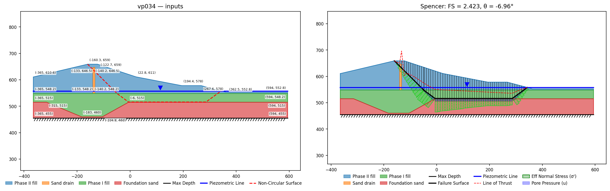

Also [SLOPE/W §2.21](geostudio.md) — the same problem in the GeoStudio corpus.

### VP35: Dam, (5) materials, probabilistic analysis, reliability index {#vp35}

**Input files:** [vp035.xlsx](files/rocscience/vp035.xlsx)

Hassan & Wolff (1999)'s end-of-construction model of Cannon Dam, the benchmark for
their central finding: **the surface of minimum reliability index is not the surface of
minimum factor of safety**. Two clay fills with large strength scatter (Phase I
φ = 8.5° ± 8.5°, Phase II c = 143.6 ± 79 kPa with ρ(c,φ) = −0.55), a vertical sand-filter
strip under the crest, and a spoil-covered downstream toe, in polygon-zone geometry.

Hassan & Wolff's published surfaces are search products (their figures do not resolve
the individual circles), so the comparison reproduces the *procedure*: a Bishop critical
search at mean strengths (their surface A), and a direct minimum-β scan over downstream
circles evaluating the Taylor-series β on each fixed candidate (their surface B). The
benchmark — and the lock — is **downstream-slope-specific**: a global (grid-seeded)
search finds a substantial upstream mechanism at Bishop ≈ 1.88, well below the
downstream 2.53, on this dry end-of-construction model. Hassan & Wolff and Slide
analyze the downstream slope, so the seeded search reproduces the published problem;
the upstream face is simply outside the benchmark's scope. The
c–φ correlations enter as the standard Taylor-series cross-terms
(2ρ·(ΔF_c/2)·(ΔF_φ/2)); the regression tag locks the uncorrelated β.

| Quantity | XSLOPE | Slide | Hassan & Wolff |
|---|---|---|---|
| Critical FS at means (Bishop search) | 2.529 | 2.551 (−0.9%) | 2.753 (−8.1%) |
| β_ln on that surface | 6.71 (7.29 with ρ) | 10.95 (−38.7%) | 10.36 (−35.2%) |
| Minimum-β surface: β_ln | 3.353 (3.50 with ρ) | 4.351 (−22.9%) | 3.987 (−15.9%) |
| FS on the minimum-β surface | 2.97 | 2.820 (+5.3%) | 2.352 (+26.3%) |

All three programs agree on the structure: a mid-depth circle through the Phase II fill
and upper Phase I carries roughly one-third the β of the FS-critical surface, so a
design screened on FS alone would examine the wrong surface. The β magnitudes spread
with the estimator at these extreme COVs — the Taylor series evaluates strength at
φ − σ = 0° for the Phase I fill, a tail that truncated-normal Monte Carlo sampling
rarely reaches — the same direction as VP36's spread at three times the COV. The
manual notes its own inputs were partly inferred, and its factor of safety departs from
Hassan & Wolff's by large margins on several of the paper's fixed surfaces. Those nine
surfaces *are* reproduced — on the SLOPE/W model's exact frame rather than this one, at
[GeoStudio §2.22](geostudio.md#gs-2-22), where XSLOPE's Morgenstern-Price matches SLOPE/W's
own to 0.19% on all nine and its Bishop matches Slide2's Table 35.2 column to 0.5% on eight
of nine. That comparison also shows the paper's printed factors of safety for surfaces G and
H to be transposed: Slide2, SLOPE/W and XSLOPE all order them the opposite way, and reversing
the paper's two rows brings the residuals from −43% / +84% to −3.7% / +9.3%. The circles are
not carried onto vp035.xlsx: its digitized frame is anisotropic (x scale 0.958 against y
scale 1.011, 1.8 m rms shape residual over nine shared vertices), which moves the sliding
weight 33–372%. A free search is insensitive to that; a specified centre and radius is not.

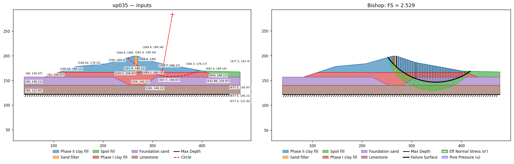

Also [SLOPE/W §2.22](geostudio.md) — the same problem in the GeoStudio corpus.

### VP36: Slope, homogenous, probabilistic analysis, ru pore pressure, reliability index {#vp36}

Slide #36: Li & Lumb (1987) / Hassan & Wolff (1999) reliability benchmark: c'=18+-3.6, phi'=30+-3, gamma=18+-0.9, ru=0.2 (+-0.02, not perturbed by xslope's Taylor-series reliability - its contribution to sigma_F is small). The comparison is the deterministic Bishop factor of safety and the lognormal reliability index beta on that same surface, against Hassan & Wolff's published pair and Slide's; both are tabulated below.

**Input files:** [vp036.xlsx](files/rocscience/vp036.xlsx)

| Method | XSLOPE | H&W | Slide |
|---|---|---|---|
| Bishop | 1.333 | 1.334 (−0.1%) | 1.340 (−0.5%) |
| β_ln (reliability) | 2.263 | 2.336 (FOSM) (−3.1%) | 2.482 (Monte-Carlo) (−8.8%) |

*β estimates legitimately spread by estimation method; xslope does not perturb ru (σ = 0.02, minor).*

Also [SLOPE/W §2.23](geostudio.md) — the same problem in the GeoStudio corpus.

### VP37: Cohesionless slope, crest surcharge, back-analysis of required support force {#vp37}

Slide #37 reproduces the "Reinforcement Example" of the XSTABL v5 reference manual (Sharma 1996, §3.8, Fig. 3.15), itself after Koerner (1991): a 12 m high, 45° cohesionless slope under a 40 kN/m² crest surcharge. The soil properties are printed on XSTABL's Fig. 3.15 — **φ = 36°, γ = 20 kN/m³, c = 0** — which the Slide2 manual does not reproduce. Geometry is read from Slide's coordinate-labeled Fig. 37.1: ground surface (0,5)–(5,5)–(17,17)–(40,17), domain base at y = 0, surcharge on the crest from the edge (17,17).

**Input files:** [vp037.xlsx](files/rocscience/vp037.xlsx) (base slope)

**Base slope (unreinforced).** On Slide's printed critical circle (center −11.410, 35.264, R 34.426; Fig. 37.3), and equally from a toe-focus, 2 m-minimum-depth search that lands on that circle unaided:

| Method | XSLOPE | Slide (Fig. 37.3) | XSTABL (Fcrit) |
|---|---|---|---|
| Bishop | 0.764 | 0.764 (0.0%) | 0.734 (+4.1%) |
| Spencer | 0.764 | — | — |

**Required support force (part a).** XSTABL and Slide back-analyse the horizontal support (the resultant of a triangular 0→57.5 kN/m² face load, applied at ⅓ of the slope height, el 9 m) that raises the slope to FS = 1.5, reported as the maximum over all toe surfaces. Sweeping that support force in XSLOPE (a reinforcement line at el 9, re-searching the critical surface at each step) gives the required design force below; at the published force the passive design factor of safety is ≈1.56.

| Back-analysed quantity for FS = 1.5 | XSLOPE | Slide | XSTABL |
|---|---|---|---|
| Required support force (part a) | ≈205 kN/m (active) / ≈305 kN/m (passive) | 351 kN/m (support-force procedure — cross-basis) | 345 kN/m (support-force procedure — cross-basis) |
| Reinforced-zone length (part b) | — *not built* | 7.6 m | 7.5 m |

The published forces come from XSTABL's support-force procedure (App. D.5, Eqs. D.38–D.41), which sizes the force from the effective normal forces evaluated at the target factor of safety, a more conservative crediting than a limit-equilibrium reinforcement line. The concentrated resultant also strains the interslice assumptions, as already noted for [VP85](#vp85). The regression therefore locks the base-slope factor of safety — which reproduces the source exactly — and documents the back-analysis rather than locking a force that the two methods compute differently.

**Reinforced-zone length (part b)** — the minimum length of an elevated-friction zone (φ_reinf = 56.04°) that holds FS = 1.5 — needs a variable-length material zone, which XSLOPE does not have.

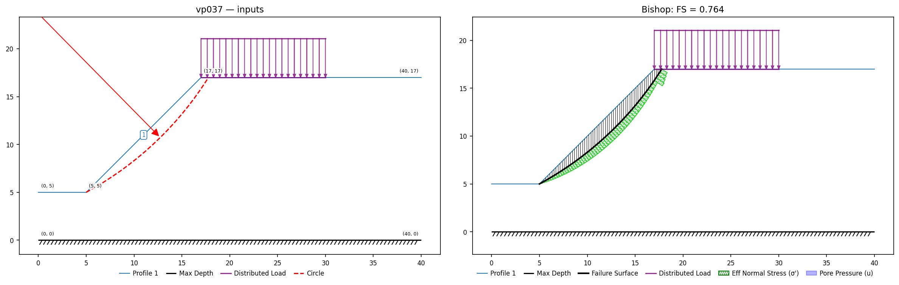

### VP38: Excavated slope, FE groundwater seepage, matric suction {#vp38}

Slide #38 reproduces Ng & Shi (1998), a 28° cut slope in Hong Kong: a homogeneous soil (24 m over a 6 m bedrock band) in which the steady groundwater regime leaves the upper part of the cut **unsaturated**, and the negative pore water pressure there (matric suction) raises the shear strength. The stability is a conventional Bishop analysis on the FE seepage field, with the strength above the water table given by the extended (Fredlund) Mohr-Coulomb criterion:

$$\tau = c' + (\sigma_n - u_a)\tan\varphi' + (u_a - u_w)\tan\varphi^{\,b}$$

The last term is an **apparent cohesion** from suction: with the pore-air pressure $u_a = 0$, it is $(-u_w)\tan\varphi^{\,b}$ on any slice whose base sits above the water table. Material (Table 38.1): $c' = 10$ kPa, $\varphi' = 38°$, $\varphi^{\,b} = 15°$, $\gamma = 16$ kN/m³.

**Input files:** [vp038a](files/rocscience/vp038a.xlsx) / [vp038b](files/rocscience/vp038b.xlsx) / [vp038c](files/rocscience/vp038c.xlsx) (right-side head $H = 61 / 62 / 63$ m), each with its `_mesh.json` / `_seep.csv` seepage sidecars.

**The seepage (XSLOPE's own FE solve).** Geometry is read from the vendor RS2 mesh's external boundary — ground surface (0.13, 19.15)–(40.74, 40.6)–(50.95, 40.6)–(57.06, 49.31)–(97.89, 70.78), the domain closing down the right edge and along an impermeable base to the toe. XSLOPE solves the steady **unsaturated** field itself (`u='seep'`): constant total head $H$ on the right (uphill) side, head 6 m on the left (toe) side, the ground surface a seepage/exit face, base and the far edges no-flow. The soil's relative permeability is Ng (1998)'s measured $k$-function, cast as a Gardner curve $k_r(\psi) = 1/(1 + a\,|\psi|^n)$ with $a = 7.479$, $n = 2.908$ (a log-space fit to the RS2 `.slw` curve, $k_s = 4.19$ m/day) — SWCC data, not a fitted knob (a van Genuchten cast of the same curve moves the factor of safety by < 0.005). The solved field carries a **bounded** matric suction above the water table (max ≈ 60–70 kPa on the trial surface, unlike a deep piezometric line's unbounded hydrostatic suction), so no suction cap is required.

**The suction (strength delivery).** On the direct-surface tests the tag sets `suction_phi_b = {Cut soil: 15}`. `generate_slices` reads the signed seepage pressure at each slice base; where it is negative it prices the suction $s = \max(0, -u_w)$ into an apparent cohesion $c_\text{suction} = s\tan\varphi^{\,b}$, added to the resisting $c\,\Delta\ell$ term, while the effective-normal term keeps $u$ clamped at 0 — exactly the extended Mohr-Coulomb term with $u_a = 0$. Below the water table the slice sees positive $u$ and no suction credit, as it should.

**Slide's critical surface.** Slide prints its $H = 61$ critical circle (Fig. 38.2): Bishop FS 1.621, center (47.490, 56.311), radius 16.087, endpoints (50.953, 40.601)–(63.120, 52.500) — a shallow circle entirely in the upper, unsaturated part of the cut, where the suction credit lives. Only $H = 61$ has a figure; the critical geometry is head-invariant to that precision (the head boundary changes the pore field, not the slope), so all three cases carry this circle and are evaluated on it as a specified surface.

**Results** (Bishop simplified, on Slide's printed circle, `num_slices=60`):

| $H$ (m) | XSLOPE | Slide | Ng & Shi (1998) |
|---|---|---|---|
| 61 | 1.612 | 1.621 (−0.6%) | 1.636 (−1.5%) |
| 62 | 1.533 | 1.538 (−0.3%) | 1.527 (+0.4%) |
| 63 | 1.413 | 1.407 (+0.4%) | 1.436 (−1.6%) |

XSLOPE reproduces Slide's Bishop values within 0.6% and Ng & Shi's own published Bishop values within 1.6%, and tracks the physics: the factor of safety falls as the right-side head rises (more saturation, less suction). Turning the suction credit off drops all three to ≈ 1.35–1.41, confirming the apparent cohesion — not the effective-normal pressure — carries the difference from the published band.

**Free search.** The verification locks the specified surface, which is immune to the search-selection question. For the record, a free search *with* the suction credit does not land on Slide's shallow circle: it localizes to a somewhat deeper circle a few percent below the published value (H = 61: ≈ 1.57 vs 1.621), because a deeper surface trades away some suction credit for a longer saturated base. Slide's reported minimum is the shallow suction circle; the specified-surface comparison isolates the seepage-plus-suction physics from that difference in which circle each search selects.

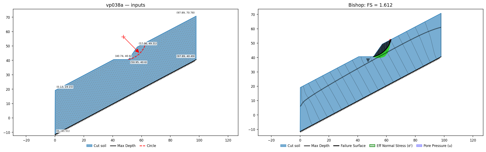

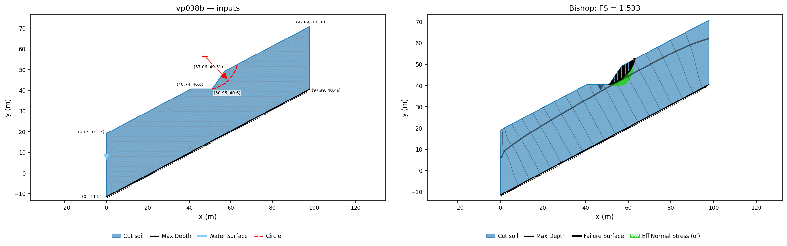

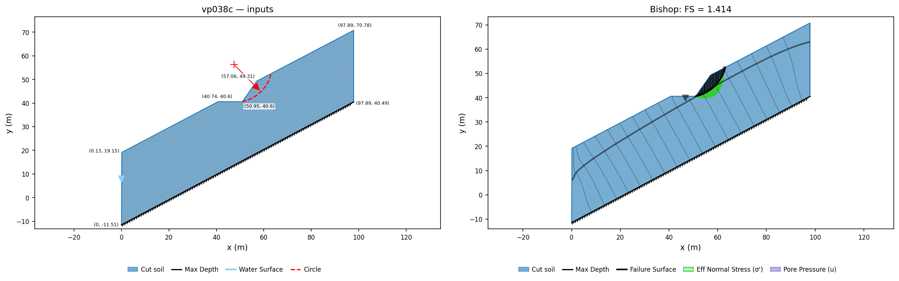

### VP39: Reinforced embankment, (2) materials, tension crack, geosynthetic {#vp39}

**Input files:** [vp039a.xlsx](files/rocscience/vp039a.xlsx) (clay fill, unreinforced) ·
[vp039b.xlsx](files/rocscience/vp039b.xlsx) (clay, T=169) ·
[vp039c.xlsx](files/rocscience/vp039c.xlsx) (sand fill, unreinforced) ·
[vp039d.xlsx](files/rocscience/vp039d.xlsx) (sand, T=44)

Tandjiria (2002)'s required-reinforcement problem: a half-embankment (centerline at
x = 0) on soft clay, analyzed as a clay fill (c′ = 20 kPa, φ = 0, water-filled tension
crack) and as a sand fill (φ′ = 37°, dry crack). The unreinforced critical surface is
located first; the geosynthetic force at the embankment base that restores FS = 1.35
on that surface is then computed (active application, force parallel to the
reinforcement, per the source).

| Case | XSLOPE | Slide | Tandjiria (2002) |
|---|---|---|---|
| Clay fill, unreinforced (Spencer) | 0.968 | 0.975 (−0.7%) | 0.981 (−1.3%) |
| Clay fill, FS at T = 169 kN/m | 1.332 | 1.35 (−1.3%) | — |
| Clay fill, required T for FS = 1.35 | 175 kN/m | 169 (+3.6%) | 170 (+2.9%) |
| Sand fill, unreinforced (Spencer) | 1.200 | 1.209 (−0.7%) | 1.219 (−1.6%) |
| Sand fill, FS at T = 44 kN/m | 1.343 | 1.35 (−0.5%) | — |
| Sand fill, required T for FS = 1.35 | 46 kN/m | 44 (+4.5%) | 45 (+2.2%) |

The regression locks the unreinforced factors of safety and the factors of safety at
Slide's published forces, each on the stored critical circle. The source's noncircular
variants (Slide 0.935/1.188, required T 184/56) are not locked: XSLOPE's noncircular
search returns seed-dependent local minima on this φ = 0 problem, and the noncircular
reinforced evaluation needs the reinforcement generalization noted for VP30.

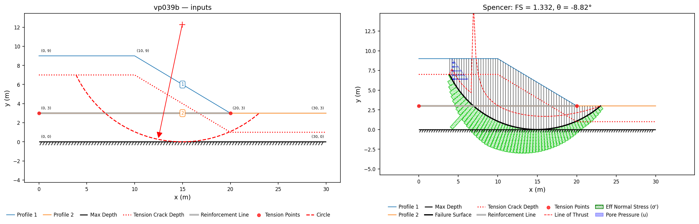
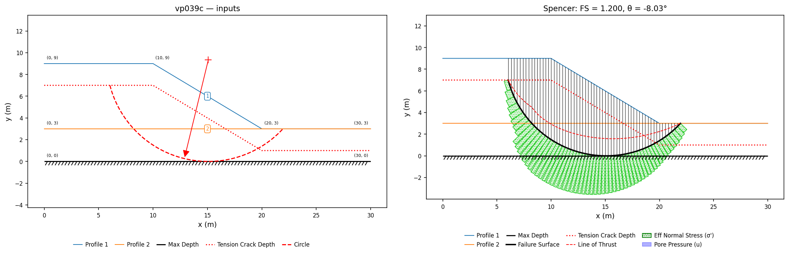

Also [SLOPE/W §2.24](geostudio.md) — the same problem in the GeoStudio corpus.

### VP40: Slope, homogenous, sensitivity analysis {#vp40}

**Input files:** [vp040.xlsx](files/rocscience/vp040.xlsx)

Perry (1993, Fig. 10): a dry homogeneous slope with power-curve strength
τ = A·σ′ᵇ (A = 2, b = 0.7, γ = 20) evaluated on the specified five-segment surface —
and the corpus's first *sensitivity* benchmark: the manual sweeps A and b over ±15% of
their means (the "Rel. max/min" values 0.3 and 0.105) and publishes the FS-vs-parameter
curves. The XSLOPE sweep runs through `sensitivity()` on the fixed surface
(`search=False`, since the surface is specified), and the regression tags lock the base
case and both range endpoints for each parameter.

| Quantity | XSLOPE (Janbu) | Slide | Perry | Note |
|---|---|---|---|---|
| FS on the specified surface | 1.003 corrected / 0.930 simplified | 0.944 (−1.5% against XSLOPE's simplified; the f₀ convention differs) | 0.98 (+2.3%) | Perry's value pairs with the corrected factor |
| ΔFS over the A range (±15%) — **sweep result** | −15.0% / +15.0% | −15.2% / +14.4% | ≈ ±13% | these cells are percent *changes* in FS, not factors of safety, so they are compared directly rather than ratioed: XSLOPE lands within 0.2 and 0.6 percentage points of Slide, and 2.0 pp of Perry's chart read at each end |
| ΔFS over the b range (±15%) — **sweep result** | −45.0% / +82.5% | −44.4% / +81.1% | ≈ −38% / +82% | within 0.6 and 1.4 percentage points of Slide; against Perry, 7.0 pp at the −15% end and 0.5 pp at the +15% end — Perry's endpoints are read off the published curve, as the ≈ marks |

The relative sensitivities — the quantity this problem exists to verify — agree with
Slide's Figure 40.3 within about a percent at every endpoint, and the A-sweep is exactly
linear as theory requires (on a fixed dry surface every increment of strength scales
with A). The absolute FS spread is the Janbu correction-factor convention for a
power-curve soil: XSLOPE applies the c–φ correction curve (fo = 1.078) while Slide's
tabulated value implies fo ≈ 1.015 on the same simplified result; the simplified
factors themselves differ by 1.5%.

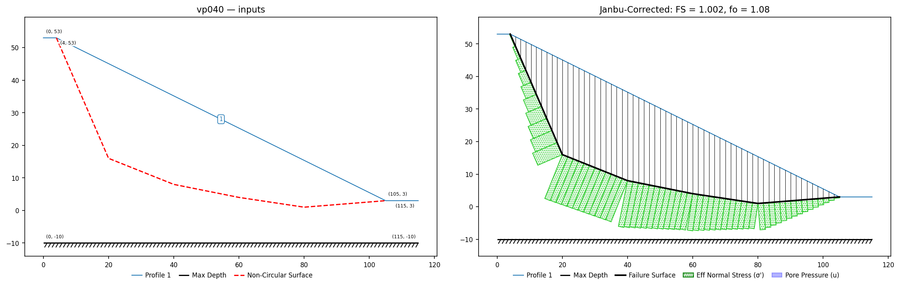

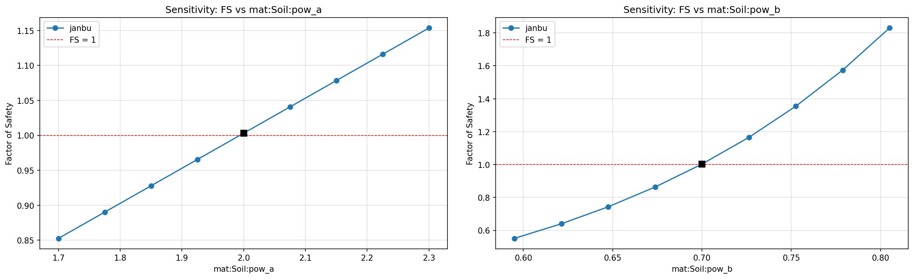

### VP41: Slope, homogenous, ru pore pressure {#vp41}

Slide #41: Jiang, Baker & Yamagami (2003) homogeneous clay slope with power-curve strength tau = 1.4*(sigma')^0.8 and ru = 0.3 — exercises the v12 pow option and ru together.

**Input files:** [vp041.xlsx](files/rocscience/vp041.xlsx)

| Method | XSLOPE | Slide | Charles & Soares | Perry |
|---|---|---|---|---|
| Bishop | 1.668 | 1.656 (+0.7%) *(path search)* | 1.66 (+0.5%) | 1.67 (−0.1%) |
| Janbu (corrected) | 1.660 | 1.563 (simplified — cross-method) | — | — |
| Spencer | 1.670 | — | — | — |

*Baker's published band for the same problem is 1.56–1.60; the published headline
factors span 1.56–1.67 overall.*

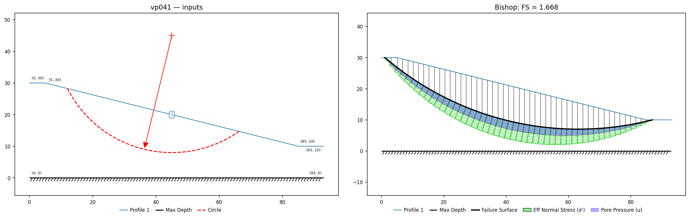

### VP42: Baker & Leshchinsky safety-map dam — reservoir-loaded clay-core dam {#vp42}

Slide #42 / Baker & Leshchinsky (2001): the safety-map clay-core dam — granular fill (c' = 0, φ' = 40°, γ = 21.5) around a diamond core (c' = 20, φ' = 20°, γ = 20) on a hard base (c' = 200, φ' = 45°), a half-full upstream (right-side) reservoir, a phreatic dropping through the core and daylighting at the downstream toe, and a 5-m cracked layer at the crest modeled as a dry tension crack. Geometry is fully labeled in Slide's figure (all six core vertices). The section is tiled directly as material-zone polygons matching the SLOPE/W `.gsz` region set ([§2.25](geostudio.md#gs-2-25)): the granular shell wraps both faces down to the foundation, so the downstream toe carries fill with continuous material coverage across the domain. The phreatic's downstream limb is the vendor polyline, which both source models of this problem carry identically — the `.gsz` piezometric surface runs (0, 0)-(15.82, 2.04)-(86.72, 6.05), and RS2's Slide2-import model `#042` reproduces it as (0, 0)-(16, 2)-(87, 6) with a nodal pore-pressure field that is zero at the toe. There is no tailwater: the line exits **at** elevation 0, on the ground surface.

The paper states its method explicitly: pore pressures are *"evaluated using the vertical distance between the phreatic surface and the slice center,"* and the material weights are total unit weights — the clay core is given as *"{c′ = 20, φ′ = 20°, γT = 20} where {c′, φ′} are effective strength parameters and γT represents the total unit weight."* It reports a global minimum Fmin = 1.91 by Spencer's method. So the published analysis uses **total unit weights and explicit pore pressures from the phreatic surface — the same effective-stress convention XSLOPE uses.** The vendor `.gsz` confirms it: identical geometry, the same three Mohr-Coulomb materials at their **total** unit weights, and a piezometric surface XSLOPE's line reproduces vertex for vertex from the downstream toe to the core's upstream face. Through the core and over the reservoir the two lines part by at most 0.6 m, and by 0.17 m over the reservoir itself — the zone carrying ~92% of the pore force — where the corpus line holds the pool at the el. 30 the manual states and the reservoir load carries.

**What XSLOPE computes.** Total unit weights, pore pressures from the piezometric line, and the reservoir as an explicit hydrostatic load on the submerged face. On the three published reference surfaces XSLOPE reproduces the published cluster:

| Surface (Spencer) | XSLOPE | Slide | Baker & Leshchinsky (2001) | SLOPE/W (own solve) |
|---|---|---|---|---|
| Slide's critical circle | 1.926 | 1.925 (+0.1%) | — | — |
| Baker's noncircular surface | 1.882 | — | 1.91 (−1.5%) | — |
| SLOPE/W's own critical circle | 1.939 | — | — | 1.934 (+0.3%) |

Evaluated on SLOPE/W's *own* critical circle (center 234.9, 207.1, R = 204.4) the two programs agree to within 0.005 in Spencer FS on the *same surface, same geometry, same water*, with XSLOPE's total sliding-mass weight ≈ 56,020 against SLOPE/W's 56,127. The stored-circle result is regression-locked as **VP42-circle** (OMS 1.773, Bishop 1.882, Spencer 1.926, M-P 1.925) and Baker's surface as **VP42-noncirc** (Spencer 1.882, M-P 1.869).

**Reservoir-load statics, validated.** XSLOPE carries the reservoir as a hydrostatic traction normal to the submerged face. For a fully submerged still-water slope this treatment is exact: on an identical circle it reproduces the closed-form dry-buoyant-weight solution (γ′ = γsat − γw, no water, no load) to within 0.006 in Bishop and Spencer FS. The alternative of folding the ponded-water column into vertical slice weight is genuinely inequivalent — it differs by tens of percent and can drive the base into non-physical tension — so xslope keeps the water formulation explicit rather than buoyant. FS on this deep, mostly-submerged circle is sensitive to the phreatic (a uniform 1-m lowering of the line moves Spencer ≈ 0.075) — and to the pool and the load agreeing with each other: raising the piezometric line to the `.gsz`'s pool of el. 30.17 while leaving the reservoir load at el. 30 asserts 0.17 m of water pressure that nothing is standing on, and reads 0.013 lower in Spencer. Raising the load to match puts it back. The reservoir level (el 30) is pinned by the water surface and shared by both programs, and the line and the load are held at it together.

**Input files:** [vp042.xlsx](files/rocscience/vp042.xlsx)

### VP43: Slope, homogeneous — planar surface (Baker 2001) {#vp43}

Slide #43 / Baker (2001): the planar-slip-surface benchmark on a homogeneous, dry c′-φ′ slope (H = 10 m, c′ = 30 kPa, φ′ = 30°, γ = 20 kN/m³), with the factor of safety evaluated on planes through the toe as a function of where the plane daylights on the backslope. Baker's critical plane sits at X = x/H = 0.85.

The manual's figure for this problem is unlabeled, and the geometry it implies controls the answer: a 3.0 m crest offset (face 73.3°) read from that figure gives Spencer ≈ 1.43. The [SLOPE/W model for the same problem](geostudio.md#gs-2-26) stores the geometry exactly, with the crest offset at **2.5 m** (face angle atan(10/2.5) = 75.96°), and that is the geometry used here. On it, the critical slip plane runs from the toe (0, 0) to the daylight point (8.5, 10) — inclination 49.6°, matching Slide's reported ≈ 49.5° — and both endpoints lie on the ground surface, so no construction apron is needed. The published property table is reproduced as printed.

**Input files:** [vp043.xlsx](files/rocscience/vp043.xlsx)

| Method | XSLOPE | RocPlane | Baker (Culmann) | Slide |
|---|---|---|---|---|
| Spencer | 1.352 | 1.351 (+0.1%) | ≈ 1.35 | 1.329 (circular search — a different surface) |
| Janbu (corrected) | 1.352 | — | — | 1.329 (circular search — a different surface) |

Spencer and Janbu on the toe-to-(8.5, 10) plane both read 1.352, matching SLOPE/W's own solve of the identical plane (1.352, §2.26) and the RocPlane/Baker references. Morgenstern-Price, Corps, and Lowe-Karafiath decline this single straight plane: α is constant for every slice, and reaching equilibrium drives most interslice forces into tension, which the admissibility guard rejects — Spencer is the rigorous method that converges (same behavior as [SLOPE/W §2.26](geostudio.md#gs-2-26)).

**Sources:** Slide Slope Stability Verification Manual §43; GeoStudio SLOPE/W Verification Manual §2.26; Baker (2001); Baker & Leshchinsky (2001).

### VP44: Slope, homogeneous — linear vs non-linear envelope (Baker ex. 1) {#vp44}

Slide #44 / Baker (2003) example problem 1: a straight 43° slope, H = 6 m, γ = 18 kN/m³, in compacted Israeli clays, analyzed with three strength models fitted to the same triaxial data: (a) the power curve τ = 1.107·σ′^0.86 (Baker's A = 0.58, n = 0.86, T = 0); (b) the experimentally fitted Mohr-Coulomb envelope c′ = 11.64 kPa, φ′ = 24.7° (Table I, iteration 0 of Baker's paper — this resolves the property-table ambiguity in the Slide manual); and (c) Baker's converged local-linear-approximation parameters c′ = 0.39 kPa, φ′ = 38.6°. The point of the example is the danger of extrapolating a linear envelope into the low-stress range: the M-C fit says FS = 1.5, the non-linear law says the slope is failing.

**Input files:** [vp044a.xlsx](files/rocscience/vp044a.xlsx), [vp044b.xlsx](files/rocscience/vp044b.xlsx), [vp044c.xlsx](files/rocscience/vp044c.xlsx)

| Case | Method | XSLOPE | Slide | Baker |
|---|---|---|---|---|
| (a) power curve | Spencer | 0.958 | 0.960 (−0.2%) | 0.97 (−1.2%) |
| (b) Mohr-Coulomb | Spencer | 1.518 | 1.536 (−1.2%) | 1.50 (+1.2%) |
| (c) LLA converged | Spencer | 0.980 | 0.981 (−0.1%) | 0.97 (+1.0%) |

*Baker states γ = 18 for all his examples; the Slide manual's table prints 19.5, which reconciles with neither program's results (γ = 19.5 gives Spencer 1.459 on case b). Slide's Janbu values are simplified/uncorrected, as in [#45](#vp45).*

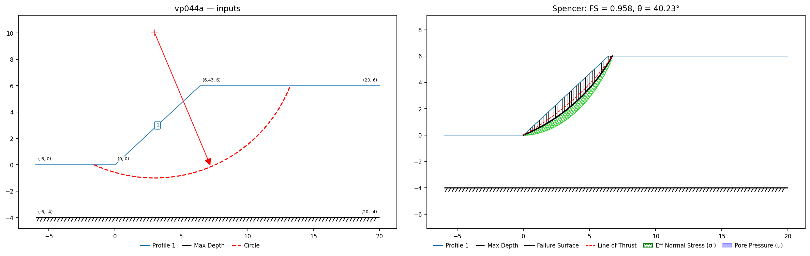

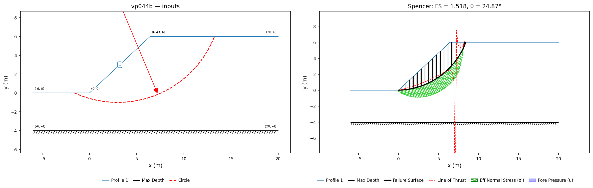

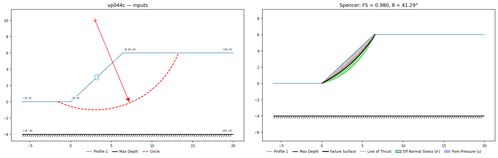

### VP45: Slope, homogenous {#vp45}

Slide #45 runs one 4:1 slope through two strength models. Mohr-Coulomb case:
c'=11.64, phi'=24.7, gamma=18. Power-curve case: tau = 1.107*(sigma')^0.86 (Baker's
A=0.58, n=0.86, T=0).

**Input files:** [vp045a.xlsx](files/rocscience/vp045a.xlsx), [vp045b.xlsx](files/rocscience/vp045b.xlsx)

*Mohr-Coulomb case*

| Method | XSLOPE | Slide |
|---|---|---|
| Spencer | 2.801 | 2.794 (+0.3%) |
| Janbu (simplified) — cross-method, XSLOPE reports the f₀-corrected value | — | 2.662 |

*Power-curve case*

| Method | XSLOPE | Slide |
|---|---|---|
| Spencer | 2.649 | 2.662 (−0.5%) |
| Janbu (simplified) — cross-method, XSLOPE reports the f₀-corrected value | — | 2.559 |

*Slide’s Janbu values are simplified/uncorrected; XSLOPE's carry fo and agree once scaled.*

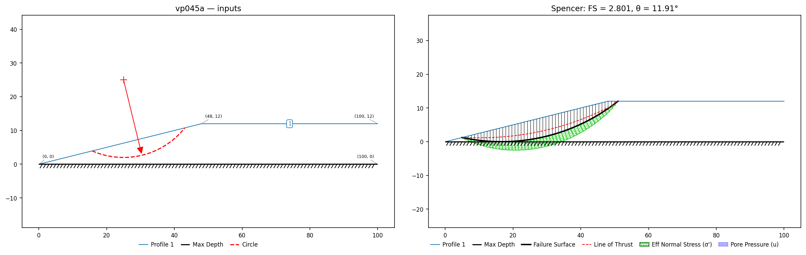

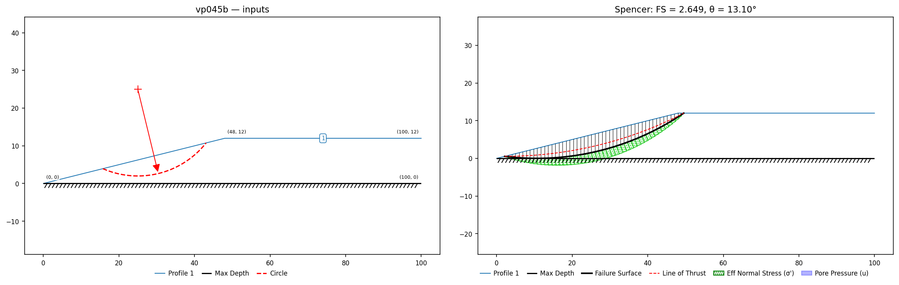

Both strength models run on the same 4:1 slope.

### VP46: Baker (1993) three-stage dam — stages 1-2 built {#vp46}

Slide #46 / Baker (1993): a three-loading-stage validation dam — (1) end-of-construction with an empty reservoir, (2) steady-state seepage with a full reservoir, (3) rapid drawdown. The manual states outright that this is a *validation* problem: Baker's paper gives no numeric permeability (the natural and compacted clays are simply "approximately equal", with a 10:1 horizontal:vertical anisotropy, p. 32), so Rocscience estimated the seepage parameters, and the stage-3 undrained strengths live in Baker's own discrete functions (`Compacted Clay.fn6` / `Natural Clay.fn6`). **Stages 1 (dry) and 2 (steady-state seepage) are both built** — stage 2 by solving the seepage first-principles from the conductivity *ratios* Baker publishes (below), the absolute value being FS-irrelevant. **Stage 3 (rapid drawdown) is not built:** its undrained-strength field is printed only as a two-dimensional contour map, which no per-material 1-D function reproduces to lock tolerance.

A small compacted-clay embankment (crest el 101, toes at x = 80 and x = 128, both el 95) sits on a deep natural-clay foundation; downstream, the natural-clay ground drops on a **4H:1V** face from (128, 95) to the toe bench (148, 90) and runs flat to x = 220. Geometry from Figure 46.1 (axis-tick-calibrated vertex extraction). Materials (Table 46.1): compacted clay c′ = 6.5 kPa, φ′ = 40°, γ = 18; natural clay c′ = 0, φ′ = 32°, γ = 18.

**Input files:** [vp046.xlsx](files/rocscience/vp046.xlsx) (stage 1, dry) / [vp046b.xlsx](files/rocscience/vp046b.xlsx) (stage 2, steady seepage, with `_mesh.json` / `_seep.csv` sidecars)

The critical mechanism is the cohesionless (c′ = 0) downstream natural-clay face. For c′ = 0 the infinite-slope factor of safety FS = tan φ′ / tan β is depth-independent; on the 4H:1V face (β = atan(1/4) = 14.04°) that is the closed form tan 32° / tan 14.04° = **2.50** — the manual's "Theoretical FS = 2.5". XSLOPE's circular search rides that face (every slice base ≈ 14°) and lands on it:

| Method | XSLOPE | Slide | Baker | theory |
|---|---|---|---|---|
| Spencer (circular) | 2.500 | 2.534 (−1.3%) | 2.41 (+3.7%) | 2.5 (0.0%) |
| Bishop (circular) | 2.500 | — | — | — |

XSLOPE reproduces the theoretical infinite-slope value exactly. Slide's published Spencer 2.534 is a **minimum-depth-5m** noncircular random search, which rides a 5-m slab slightly off the pure infinite-slope minimum and so reads ~1.4% high; Baker (1993) 2.41 sits ~3.6% below theory. XSLOPE brackets both, on theory.

<!-- test: file=files/rocscience/vp046.xlsx, type=circular_search, num_slices=40, fs_spencer=2.500, fs_bishop=2.500, benchmark=VP46-dry -->

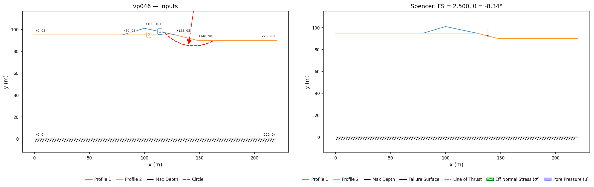

**Stage 2 — steady seepage, full reservoir (built).** With the reservoir full at el 100 the pore pressures come from a steady FE seepage field XSLOPE solves itself (`u='seep'`, `_mesh.json` / `_seep.csv` sidecars, the same route as [VP38](#vp38)): total head 100 on the submerged upstream boundary, head 0 on the base (the regional water table at el 0), the dry downstream ground an exit face, and the reservoir water carried as a distributed load on the submerged face. The conductivities are the ratio quantities Baker *does* publish — the natural and compacted clays equal, with a 10:1 horizontal:vertical anisotropy (p. 32) — and a steady head field depends only on those ratios, so the factor of safety is independent of the absolute conductivity: solving at Ks = 7×10⁻⁵ and at 7×10⁻⁶ m/s gives an identical FS (the absolute value sets the flow rate, not the field). The one field-relevant estimated input is the natural-clay unsaturated fringe (manual Table 46.1 Gardner a = 0.06, n = 2); halving or doubling a moves FS by ≈ ±2%. The search targets the upstream (reservoir) slope — the slope Baker's whole analysis is about, and the one Slide's inherited search limits ("Limits are as they were before") select; a global grid instead rides an unsupported downstream-toe mechanism the published analyses do not report.

| Method | XSLOPE | Slide | Baker |
|---|---|---|---|
| Spencer (circular) | 7.086 | 7.003 (+1.2%) | 6.98 (+1.5%) |
| Bishop (circular) | 7.093 | — | — |

<!-- test: file=files/rocscience/vp046b.xlsx, type=circular_search, num_slices=40, fs_spencer=7.086, fs_bishop=7.093, benchmark=VP46-steady -->

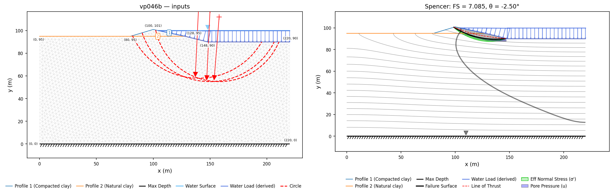

**Stage 3 — rapid drawdown (not built: representation error swamps the target).** The direct/undrained analysis needs the undrained-strength distribution S(x,y), which Baker generates point-by-point with his STRNGH routine (from the Fig. 11 stress paths and the FLAC steady-state effective stresses) and prints only as the Fig. 14 contour map (20–120 kPa). That field is genuinely two-dimensional: at the reservoir bottom the near-surface strength is ≈ 5–10 kPa, yet under the embankment surcharge, at the same elevation, it is ≈ 60 kPa — a ~6× horizontal variation the critical drawdown surface samples end to end. Reducing it to the per-material 1-D functions XSLOPE (or Slide's `.fn6`) can carry is under-determined: a single cu-vs-elevation `cp` fit digitized from Fig. 14 swings the factor of safety from 1.10 (anchored to the reservoir-bottom profile) to 3.11 (anchored under the embankment), and 2-zone stepped fits that honour the surcharge give 2.40–2.70 as the zone split moves ±5 m. The representation choice moves FS by far more than the ±10–15% a lock could tolerate, and reaching Slide's 2.181 / Baker's 2.18 would mean tuning the anchor to the target rather than reading it off the figure, so stage 3 is not locked. Slide's own 2.181 is itself a manual extraction of the same figure via the `.fn6` strength functions, which ship only with the Slide2 install (the RS2 `.fez` "Slide2 Import" set skips #046, and the RS2-native "#046 (cz=…)" is a different cohesion-with-depth problem under RS2's own numbering).

The paper corroborates every stage's published factor of safety — Baker Fs = 2.41 (empty reservoir, §6.4.1), 6.98 (steady state, §6.4.2 + Table I), 2.18 (rapid drawdown, §6.4.3.1 + Table I) — bracketing Slide's 2.534 / 7.003 / 2.181.

### VP47: Soil-nailed wall in clay (Amherst test wall) {#vp47}

Slide #47 / Sheahan & Ho (2003): 6 m vertical cut in undrained Amherst clay (cᵤ = 25 kPa, γ = 18.9 kN/m³), two nail rows at 20° declination (L = 4.9 m, tensile 118 kN, plate 86 kN, bond 15 kN/m, sₕ = 1.5 m) and the shotcrete facing weight applied as a 14.6 kN/m vertical line load at the crest. The wall failed in the field test; the published analyses sweep planar surfaces through the toe. Nails are modeled axial/passive with the FHWA-style capacity envelope (plate strength at the head, bond-strength taper at the tip).

**Input files:** [vp047.xlsx](files/rocscience/vp047.xlsx)

| Method | XSLOPE | Slide | Sheahan (trial wedge) |
|---|---|---|---|
| Janbu, critical plane (44.5°) | 0.899 | 0.890 (+1.0%) *(simplified = corrected on this plane)* | 0.887 (+1.4%) |

*Sheahan adds the nail tension unfactored; that convention (`appl=active`) gives 0.893. The tabulated 0.899 uses Slide's nail default (passive).*

Also [SLOPE/W §2.27](geostudio.md) — the same problem in the GeoStudio corpus.

### VP48: Soil-nailed wall in sand (Clouterre test wall no. 1) {#vp48}

Slide #48 / Sheahan & Ho (2003): the CEBTP Clouterre full-scale wall — 7 m cut in Fontainebleau sand (c′ = 3 kPa, φ′ = 38°, γ = 20 kN/m³), seven nail rows at 10° declination (lengths 6/8/7.5/8/8/8/6 m from the paper's Fig. 4a, sₕ = 1.15 m), shotcrete weight as a 13.2 kN/m line load. Following Sheahan, each nail carries a constant 15 kN tension (fully anchored ends in xslope). The benchmark evaluates planar surfaces through the toe at 45–70°:

**Input files:** [vp048.xlsx](files/rocscience/vp048.xlsx)

| Plane angle | XSLOPE Janbu | XSLOPE Spencer | Slide Janbu | Sheahan |
|---|---|---|---|---|
| 45° | 1.154 | 1.154 | 1.123 (+2.8%) | 1.176 (−1.9%) |
| 50° | 1.060 | 1.060 | 1.043 (+1.6%) | 1.070 (−0.9%) |
| 55° | 0.991 | 0.991 | 0.989 (+0.2%) | 0.989 (+0.2%) |
| 60° | 0.944 | 0.944 | 0.945 (−0.1%) | 0.929 (+1.6%) |
| 65° | 0.920 | 0.920 | 0.922 (−0.2%) | 0.893 (+3.0%) |
| 70° | — | 0.921 | 0.923 | 0.887 |

*The stored surface (and test tag) is the 55° plane, where Slide and Sheahan agree exactly. Janbu's fixed-point iteration does not converge at 70° (Spencer shown). Right-facing axial reinforcement against a vertical wall face — the force components, the facing detection and the Janbu correction-factor chord — is guarded by a left/right mirror consistency test.*

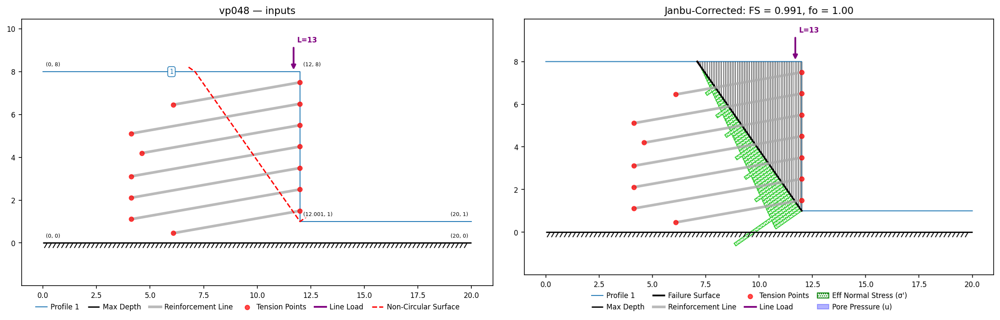

Also [SLOPE/W §2.28](geostudio.md) — the same problem in the GeoStudio corpus.

### VP49: Retaining wall, grouted tiebacks, soldier piles {#vp49}

**Input files:** [vp049.xlsx](files/rocscience/vp049.xlsx)

From the Caltrans SNAILZ reference manual: a two-layer slope cut by a soldier-pile
tieback wall, evaluated on the manual's given bilinear wedge from the wall toe (Slide
prints its endpoints; the interior kink is digitized from the figure at (37.0, 33.6)).
The two tieback rows carry different bar capacities (Table 49.2, tensile = plate, bond
13,571.68 lb/ft, 8-ft spacing); the soldier pile is modeled as Slide models it — a
micro-pile at the wall face contributing 5,900 lb/ft of shear where the surface passes.

|  | XSLOPE | Slide | SNAILZ |
|---|---|---|---|
| Janbu simplified | 1.434 | 1.446 (−0.8%) | — |
| Janbu corrected | 1.469 | 1.479 (−0.7%) | 1.52 (−3.4%) |

*Both tiebacks are tensile-governed at the given surface (bond capacity behind the
crossing exceeds the bar capacity), so the digitized tieback lengths carry no
factor-of-safety sensitivity. Spencer reads 1.439 on the same wedge (no published
counterpart).*

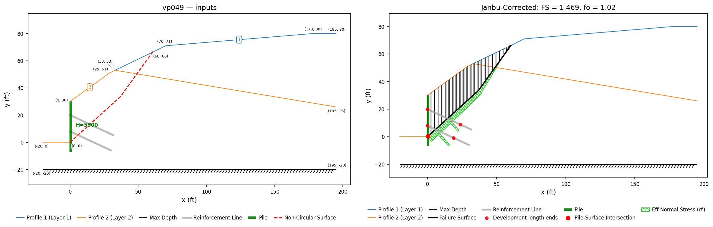

Also [SLOPE/W §2.29](geostudio.md) — the same problem in the GeoStudio corpus.

### VP50: Reinforced slope, (2) materials, predefined slip surface, geosynthetic {#vp50}

Slide #50 (SNAILZ reference manual): nail-reinforced wall, 14 horizontal rows with per-row length/capacity/bond strength, evaluated on the printed deep wedge (-15.813,0)-(0,-5)-(41.722,25). Plate strength equals tensile strength, so the wall end is fully anchored (lp1=0); the embedded end tapers at the bond strength (lp2 = T/bond). Active application, imperial units.

**Input files:** [vp050.xlsx](files/rocscience/vp050.xlsx)

| Method | XSLOPE | Slide | SNAILZ | SLOPE/W |
|---|---|---|---|---|
| Janbu (corrected) | 1.448 | 1.417 (+2.2%) | 1.46 (−0.8%) | 1.354 force solution, ×f₀ ≈ 1.44 (uncorrected — cross-method) |
| Spencer | 1.576 | — | — | 1.606 (M-P — cross-method) |

*Tangent orientation with the force factored by FS (Slide’s nail defaults + SNAILZ convention); axial+active gives 1.675 — conventions dominate this comparison.*

Also [SLOPE/W §2.30](geostudio.md) — the same problem in the GeoStudio corpus.

### VP51: Slope, (4) materials, water table, tension crack, seismic {#vp51}

Slide #51 / GS 2.31: Zhu, Lee & Jiang (2003) four-layer slope, wet, k=0.1, 5 m dry tension crack, specified circle (18.058, 66.744, R=86) read from the printed info box (fig 51.2). Layer-4 properties from the GeoStudio manual (Table 85). The phreatic line is the one element read from the figure trace (anchored at (0,0)-(10,5) on the face, flat ~15.5 at the right); a ±1 m sensitivity bracket moves Bishop by less than 0.01.

**Input files:** [vp051.xlsx](files/rocscience/vp051.xlsx)

| Method | XSLOPE | Slide | Zhu | SLOPE/W |
|---|---|---|---|---|
| Ordinary | 1.069 | 1.145 (−6.6%) | 1.066 (+0.3%) | 1.284 (no Ordinary value is published for SLOPE/W — this is its Bishop entry, cross-method here) |
| Bishop | 1.278 | 1.278 (0.0%) | 1.278 (0.0%) | 1.284 (−0.5%) |
| Janbu (corrected) | 1.205 | 1.112 (simplified — cross-method; ×f₀ ≈ 1.20) | 1.112 (simplified — cross-method) | 1.115 (uncorrected — cross-method) |
| Corps #2 | 1.404 | 1.422 (−1.3%) | 1.377 (+2.0%) | 1.368 (+2.6%) |
| Lowe-Karafiath | 1.296 | 1.288 (+0.6%) | 1.290 (+0.5%) | 1.283 (+1.0%) |
| Spencer | 1.294 | 1.293 (+0.1%) | 1.293 (+0.1%) | 1.299 (−0.4%) |
| Morgenstern-Price | 1.304 | 1.304 (GLE — cross-method) | 1.303 (GLE — cross-method) | 1.310 (−0.5%) |

*Phreatic line calibrated against the two independently agreeing Bishop/Spencer anchors (±1 m bracket).*

Also [SLOPE/W §2.31](geostudio.md) — the same problem in the GeoStudio corpus.

### VP52: Slope, (4) materials, water table, tension crack {#vp52}

Slide #52, dry. An unconstrained circular search lands in the deep (surface 3) family:
Slide runs a grid search, Zhu a specified deep circle, and the published values for that
family spread widely.

Slide #52, wet (Table 52.2 water table), on the same deep family.

**Input files:** [vp052a.xlsx](files/rocscience/vp052a.xlsx), [vp052b.xlsx](files/rocscience/vp052b.xlsx)

*Dry — governing deep (surface 3) family*

| Method | XSLOPE | Slide | Zhu |
|---|---|---|---|
| Bishop | 1.796 | 1.804 (−0.4%) | 1.429 (+25.7%) |
| Spencer | 1.797 | 1.804 (−0.4%) | 1.836 (−2.1%) |

*Wet — governing deep (surface 3) family*

| Method | XSLOPE | Slide | Zhu |
|---|---|---|---|
| Bishop | 1.176 | 1.176 (0.0%) | 1.079 (+9.0%) |
| Spencer | 1.189 | 1.189 (0.0%) | 1.211 (−1.8%) |

*Wet Spencer and Bishop match Slide exactly; the manual itself shows a wide Slide–Zhu spread on this family.*

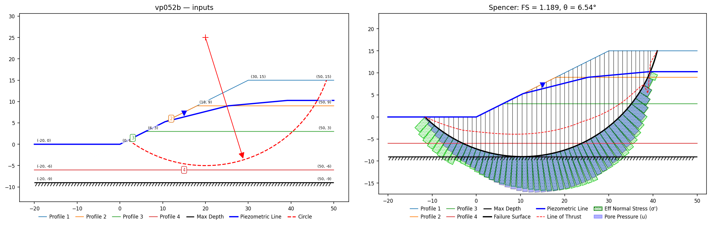

Also [SLOPE/W §2.32](geostudio.md) — the same problem in the GeoStudio corpus.

### VP53: Priest (1993) rigid block on a plane {#vp53}

Slide #53: Priest's (1993) example rigid-block problem, cross-checked by Rocscience against both Slide and RocPlane. A homogeneous slope (c' = 20 kN/m², φ' = 30°, γ = 25 kN/m³) fails on a specified 30° plane from the toe (0,0). A 15-m tension crack at the crest cuts the surface at (25.981, 15) and holds 3.75 m of water (25% filled — XSLOPE's `tcrack_water`, giving the ½γwd² crack thrust). The water table runs horizontal at el. 18.75 from the right until above the crack/plane intersection, then linearly to the toe — which reproduces Priest's triangular uplift distribution on the plane through the ordinary piezometric-line machinery.

**Input files:** [vp053.xlsx](files/rocscience/vp053.xlsx)

| Method | XSLOPE | Slide | RocPlane | Priest |
|---|---|---|---|---|
| Janbu (uncorrected = corrected) | 1.048 | 1.049 (−0.1%) | 1.049 (−0.1%) | 1.049 (−0.1%) |
| Spencer / M-P / Corps / Lowe | 1.048 | — | — | — |

*On a single plane the sliding block is statically determinate: every method returns the same 1.048, and Janbu's correction factor is exactly 1 (d/L = 0). The 0.001 gap to the three published sources is rounding.*

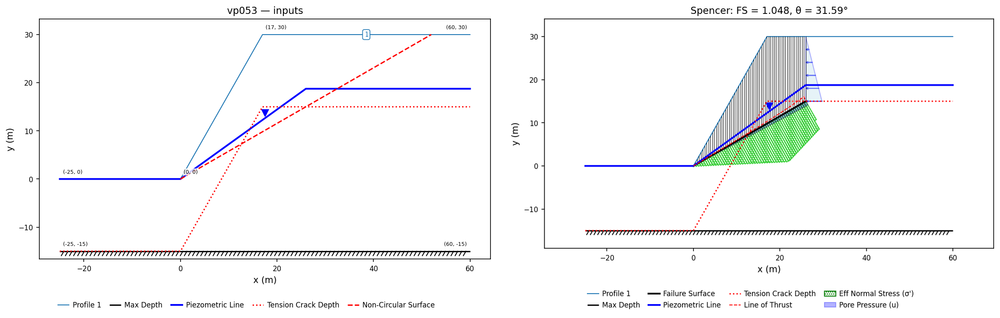

### VP54: Slope, homogenous, micro piles {#vp54}

Slide #54, unreinforced case on the printed critical circle (2.674, 7.573, R=8.031).

Slide #54 with the micro-pile row added.

**Input files:** [vp054a.xlsx](files/rocscience/vp054a.xlsx), [vp054b.xlsx](files/rocscience/vp054b.xlsx)

*No pile*

| Method | XSLOPE | Slide | Yamagami | SLOPE/W |
|---|---|---|---|---|
| Bishop | 1.100 | 1.102 (−0.2%) | 1.10 (0.0%) | 1.102 (−0.2%) |

*With micro-pile row*

| Method | XSLOPE | Slide | Yamagami | SLOPE/W |
|---|---|---|---|---|
| Bishop | 1.185 | 1.193 (−0.7%) | 1.20 (−1.3%) | 1.223 (−3.1%) |

*Slide adds the pile shear un-factored (= XSLOPE's active application); a free search finds 1.113 on a circle exiting upslope of the pile, so the tags pin the printed circle.*

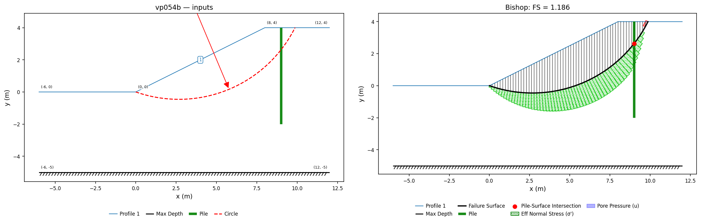

Also [SLOPE/W §2.34](geostudio.md) — the same problem in the GeoStudio corpus.

### VP55: Pockoski & Duncan test slope 1 {#vp55}

Slide #55: Pockoski & Duncan (2000) test slope 1 — a homogeneous sandy clay slope (c' = 300 psf, φ' = 30°, γ = 120 pcf), 2:1 face, 50 ft high, with the water table at ground on the lower plateau rising to 10 ft below the crest. P&D used this trio of slopes to compare eight programs; Slide ran an 80×80 grid at tolerance 10⁻⁴. XSLOPE's seed is Slide's printed critical circle (center (24.103, 195.256), R = 100.266), whose endpoints XSLOPE reproduces to 0.01 ft.

**Input files:** [vp055.xlsx](files/rocscience/vp055.xlsx)

| Method | XSLOPE | Slide | Other published codes | Note |
|---|---|---|---|---|
| Bishop | 1.290 *(search 1.289)* | 1.293 (−0.2%) | 1.29 (0.0%) | UTEXAS4, SLOPE/W, XSTABL and RSS all publish 1.29 |
| Spencer | 1.297 *(search 1.295)* | 1.300 (−0.2%) | 1.30 (−0.2%) | UTEXAS4 and SLOPE/W both publish 1.30 |
| Lowe–Karafiath | 1.321 | 1.318 (+0.2%) | 1.32 (+0.1%) | UTEXAS4 |
| Janbu (uncorrected) | 1.178 | 1.151 (+2.3%) | 1.15–1.24 | the published spread across the eight programs |

*The water table between its two pinned ends (at ground on the plateau, 10 ft below the crest) is a figure trace; the 0.003 three-method agreement on Slide's own circle validates it.*

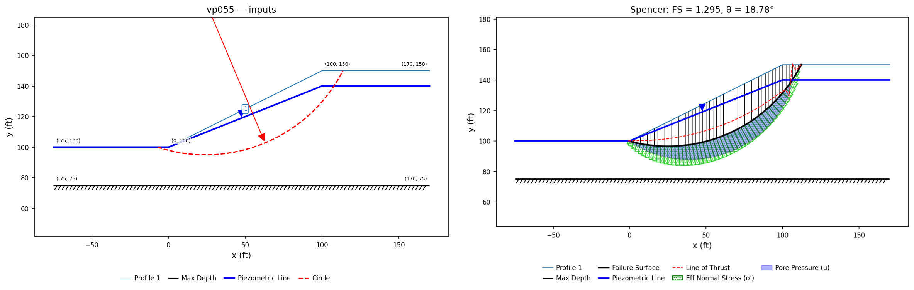

### VP56: Pockoski & Duncan test slope 2 {#vp56}

Slide #56: P&D test slope 2 — the slope of #55 with a **dry 5.5-ft tension crack**. The crack depth comes straight from Slide's info box: the critical surface's right endpoint sits at el. 144.5 while its slope intercept is 150.0. Seed = Slide's printed critical (center (24.662, 197.656), R = 100.790).

**Input files:** [vp056.xlsx](files/rocscience/vp056.xlsx)

| Method | XSLOPE | Slide | Other published codes | Note |
|---|---|---|---|---|
| Bishop | 1.283 *(search 1.282)* | 1.285 (−0.2%) | 1.28 (+0.2%) | UTEXAS4 and SLOPE/W both publish 1.28 |
| Spencer | 1.288 *(search 1.288)* | 1.290 (−0.2%) | 1.29 (−0.2%) | UTEXAS4 and SLOPE/W both publish 1.29 |
| Lowe–Karafiath | 1.307 | 1.304 (+0.2%) | 1.31 (−0.2%) | UTEXAS4 |
| Janbu (uncorrected) | 1.175 | 1.141 (+3.0%) | 1.13–1.23 | the published spread across the eight programs |

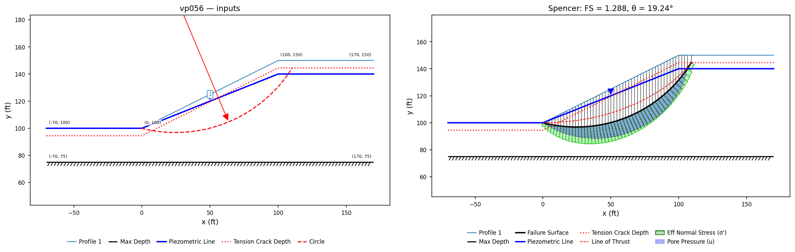

### VP57: Pockoski & Duncan test slope 3 — composite vs. circles-only {#vp57}

Slide #57: Pockoski & Duncan (2000) test slope 3 — sandy clay (c' = 300 psf, φ' = 35°, γ = 130 pcf) over a 5-ft highly plastic clay seam (c' = 0, φ' = 25°) resting on the model base at el. 85; water table at ground on the lower plateau rising to 10 ft below the crest; dry 6-ft tension crack. The manual runs the problem **twice — with and without composite surfaces** — precisely to compare programs that have the option against those that don't, which makes it the ideal A/B test of XSLOPE's `composite` option against the clamped default.

Slide's printed composite critical (center (37.547, 191.192), R = 108.668) bottoms at el. 82.5, below the base, so the surface truncates and rides the weak seam; XSLOPE reproduces its endpoints (−21.55, 100)–(135.43, 144) to 0.01 ft. Slide's circles-only critical (center (36.451, 201.910), R = 116.891) bottoms at el. 85.02 — tangent to the base, exactly what a clamped search must settle for.

**Input files:** [vp057.xlsx](files/rocscience/vp057.xlsx)

| Method | XSLOPE composite | Slide composite | XSTABL (composite) | SLOPE/W (composite) | XSLOPE circles-only | Slide circles-only |
|---|---|---|---|---|---|---|
| Bishop | 1.389 | 1.392 (−0.2%) | — | — | 1.415 *(search 1.411)* | 1.417 (−0.1%) |
| Spencer | 1.396 | 1.400 (−0.3%) | — | — | 1.419 *(search 1.416)* | 1.422 (−0.2%) |
| Lowe–Karafiath | 1.387 | 1.385 (+0.1%) | — | — | 1.422 | 1.414 (+0.6%) |
| Janbu (uncorrected) | 1.240 | 1.222 (+1.5%) | 1.34 (Janbu corrected — cross-method) | — | 1.284 | 1.263 (+1.7%) |
| Ordinary | 1.086 | 1.257 (−13.6%) | — | 0.85 (+27.8%) | 1.162 | 1.319 (−11.9%) |

*Bishop, Spencer and Lowe agree with Slide to 0.008 in both modes, and `circular_search(composite=True)` finds the truncated critical unaided (1.388 / 1.396). The Ordinary method is the outlier by design, not by error: the manual's own table shows the published OMS values spanning 0.85 (SLOPE/W) to 1.257 (Slide) on the composite surface — the same pore-pressure pathology documented on [VP22](#vp22) — and XSLOPE's 1.086 sits inside that spread. Janbu simplified spans 1.21–1.34 across the published codes; XSLOPE's uncorrected 1.240 is in range and its corrected value (1.336) matches XSTABL.*

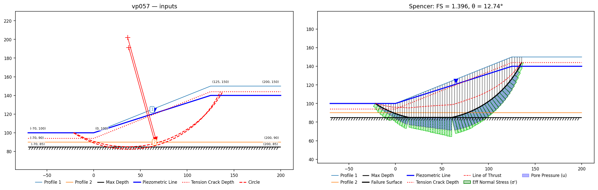

### VP58: Tied-back wall in layered soil {#vp58}

**Input files:** [vp058.xlsx](files/rocscience/vp058.xlsx)

Pockoski & Duncan (2000)'s fourth test slope, from their eight-program comparison of
reinforced-slope analysis: a 44-ft tied-back excavation wall in eight horizontal layers
(granular and cohesive fills over organic silt, an over-consolidated crust, three marine
clays, and glaciomarine deposits), water table at grade in front of the wall and el.
102.5 behind it. Three identical tieback rows at 20° (88 ft, 40-ft bond; capacity is
bond-governed at 40,000 lb/ft of wall). Evaluated on Slide's printed critical circle,
tangent to the glaciomarine contact.

| Method | XSLOPE | Slide | UTEXAS4 | SLOPE/W | WINSTABL |
|---|---|---|---|---|---|
| Bishop simplified | 1.142 | 1.147 (−0.4%) | 1.14 (+0.2%) | 1.14 (+0.2%) | 1.16 (−1.6%) |
| Spencer | 1.140 | 1.145 (−0.4%) | 1.14 (0.0%) | 1.14 (0.0%) | 1.20 (−5.0%) |
| Ordinary | 1.119 | 1.129 (−0.9%) | — | 1.12 (−0.1%) | — |
| Janbu simplified | 1.059 | 1.061 (−0.2%) | 1.13 (−6.3%) | 1.05 (+0.9%) | 1.12 (−5.4%) |

### VP59: Tieback wall in sand, drawdown water table {#vp59}

**Input files:** [vp059.xlsx](files/rocscience/vp059.xlsx)

Pockoski & Duncan (2000)'s fifth test slope: a single-row tieback wall in homogeneous
sand (c′ = 0, φ′ = 30°) with a water table drawn down to the wall face — under-designed
on purpose (every published factor of safety is below 1). The critical circle is
prescribed from Slide's printout, running from the wall toe (the manual pins it with a
focus point) to the upper ground. The water table enters with the phreatic-inclination
(Hu) pore-pressure correction that Slide and XSTABL apply on steeply inclined water
tables.

| Method | XSLOPE | Slide | UTEXAS4 | SLOPE/W | WINSTABL |
|---|---|---|---|---|---|
| Janbu simplified | 0.566 | 0.583 (−2.9%) | 0.64 (−11.6%) | 0.61 (−7.2%) | 0.76 (−25.5%) |
| Corps / Lowe-Karafiath | 0.577 | 0.588 (−1.9%) | 0.76 (−24.1%) | — | — |
| Bishop simplified | — | 0.582 | 0.56 | 0.60 | 0.74 |
| Spencer | — | 0.596 | 0.65 | 0.59 | — |

*This problem was built to stress reinforced-slope codes and it shows: the published
Bishop values alone span 0.56–0.74, and Slide's own Ordinary result (0.859) sits 44%
above its Spencer. On this surface XSLOPE's Spencer and Morgenstern–Price refuse the
solution as inadmissible (base normals near the wall go into tension), and Bishop/OMS
do not apply to a non-circular polyline, so the force-equilibrium family carries the
lock; both values sit 2–3% below Slide's and within every published pairing.*

### VP60: Soil-nailed wall with tension crack and surcharges {#vp60}

**Input files:** [vp060.xlsx](files/rocscience/vp060.xlsx)

Pockoski & Duncan (2000)'s seventh test slope: a 25-ft soil-nailed wall in undrained
sandy clay (c = 800 psf, φ = 0) carrying a 250-psf surcharge across the whole crest plus
a 500-psf strip over the first 7.3 ft, with a dry 7-ft tension crack. Five passive nail
rows at 15° (25,918 lb tensile at 5-ft spacing, bond 1,508 lb/ft). Evaluated on Slide's
printed critical circle, truncated by the crack at its printed endpoint (17.157,
18.003); at the printed geometry the top nail row passes above the truncated surface
and does not participate.

| Method | XSLOPE | Slide | UTEXAS4 | SLOPE/W | WINSTABL |
|---|---|---|---|---|---|
| Spencer | 1.010 | 1.009 (+0.1%) | 1.02 (−1.0%) | 1.02 (−1.0%) | 0.99 (+2.0%) |
| Janbu simplified | 1.043 | 1.041 (+0.2%) | 1.08 (−3.4%) | 1.07 (−2.5%) | 1.10 (−5.2%) |

*GOLD-NAIL reads 0.91 and SNAIL 0.84 (wedge) on their own mechanisms — the nailed-wall
codes and the LEM codes disagree more with each other than the LEM codes do among
themselves.*

### VP61: London clay, linear vs non-linear envelope (Baker ex. 3) {#vp61}

Slide #61 / Baker (2003) example problem 3: the same 43°, H = 6 m slope as [#44](#vp44), with strength functions fitted to Perry's CD triaxial data on London clay — (a) power curve τ = 3.39344·(σ′+0.152)^0.6 (Baker A = 0.535, n = 0.60, T = 0.0015) and (b) the fitted Mohr-Coulomb envelope c′ = 6.0 kPa, φ′ = 32°. Unlike the compacted-clay data of #44, this data set includes measurements at very low normal stress, so the two envelopes give similar factors of safety.

**Input files:** [vp061a.xlsx](files/rocscience/vp061a.xlsx), [vp061b.xlsx](files/rocscience/vp061b.xlsx)

| Case | Method | XSLOPE | Slide | Baker |
|---|---|---|---|---|
| (a) power curve | Spencer | 1.466 | 1.468 (−0.1%) | 1.48 (−0.9%) |
| (b) Mohr-Coulomb | Spencer | 1.367 | 1.366 (+0.1%) | 1.35 (+1.3%) |

*Slide's Janbu rows (1.348/1.291) are simplified/uncorrected, as in [#44](#vp44)/[#45](#vp45).*

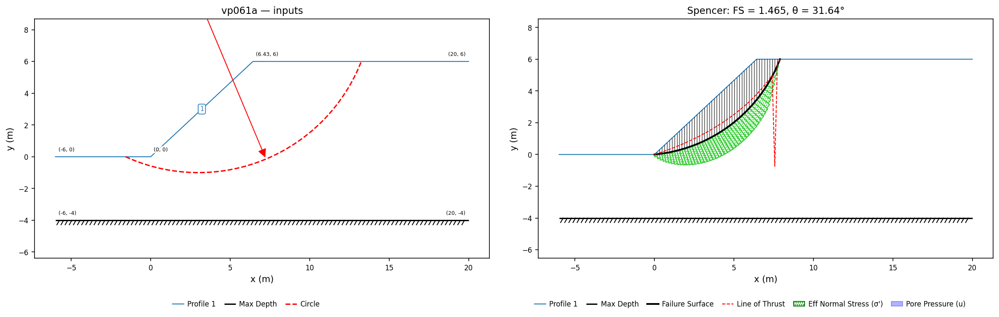

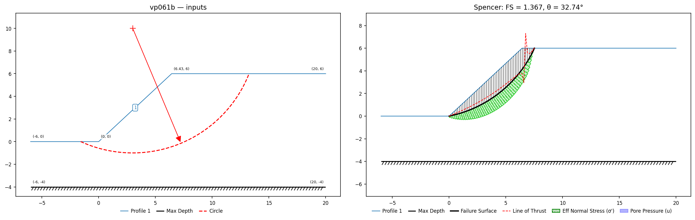

### VP62: Slope, homogenous, ru pore pressure, seismic {#vp62}

Slide #62 dry case, kc=0.432: Slide solves it with a circular search, Loukidis with a
log-spiral mechanism.

Slide #62 ru=0.5 case, kc=0.132, the same pair of solutions.

**Input files:** [vp062a.xlsx](files/rocscience/vp062a.xlsx), [vp062b.xlsx](files/rocscience/vp062b.xlsx)

*Dry, kc = 0.432*

| Method | XSLOPE | Slide | SLOPE/W | Loukidis |
|---|---|---|---|---|
| Bishop | 0.991 | 0.991 (0.0%) | 0.993 (−0.2%) | — |
| Spencer | 1.001 | 1.001 (0.0%) | 1.001 (0.0%) | 1.000 (+0.1%) |

*ru = 0.5, kc = 0.132*

| Method | XSLOPE | Slide | SLOPE/W | Loukidis |
|---|---|---|---|---|
| Bishop | 0.986 | 0.987 (−0.1%) | 0.988 (−0.2%) | — |
| Spencer | 1.001 | 1.001 (0.0%) | 1.001 (0.0%) | 1.000 (+0.1%) |

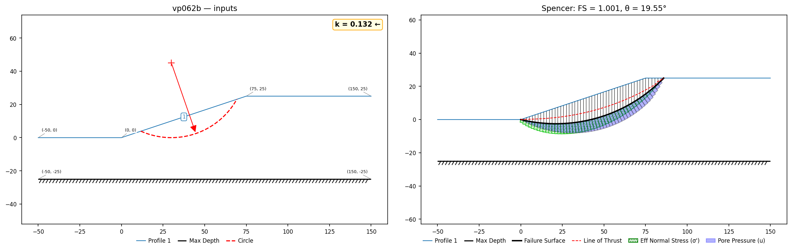

Also [SLOPE/W §2.38](geostudio.md) — the same problem in the GeoStudio corpus.

### VP63: Slope, (3) materials, seismic — critical seismic coefficient {#vp63}

**Input files:** [vp063.xlsx](files/rocscience/vp063.xlsx)

Loukidis, Bandini & Salgado (2003)'s second example: a three-layer dry slope (a weak
φ = 15° middle layer between a light c = 4 kPa cap and a strong φ = 45° base) loaded
pseudo-statically at the paper's critical seismic coefficient kc = 0.155 — the
coefficient at which the factor of safety is exactly 1. Loukidis analyzed a log-spiral
mechanism; Slide reproduced it with a path search plus Monte-Carlo optimization; XSLOPE
runs its noncircular search from a seed through the layer-2/3 daylight point on the
lower slope face, which the manual identifies as a point on the critical surface.

|  | XSLOPE | Slide | Loukidis et al. |
|---|---|---|---|
| Spencer, noncircular search | 1.001 | 0.991 (+1.0%) | 1.000 (log-spiral, by definition of kc) |

The critical surface enters at the daylight point (35.8, 27.9) and exits on the crest
at x ≈ 121. The paper's own cross-bearings bracket the same answer: rigorous limit
analysis bounds kc between 0.148 and 0.172, finite elements give 0.161, and Sarma's
method 0.159, against the 0.155 used here. A circular search reads 1.031 on this
problem — the mechanism is genuinely noncircular. Geometry is calibrated from the Slide
figure's vertex dots; Slide's bench is 12 m wide where the paper's figure annotates
8 m, and Slide's model is the factor-of-safety target here.

### VP64: USACE end-of-construction dam (EM 1110-2-1902 Fig. 4-1) {#vp64}

Slide #64 / USACE EM 1110-2-1902 (2003) Figure 4-1: the manual's Spencer hand-verification dam at end-of-construction — a symmetric 50-ft embankment at 4H:1V (undrained c=1000 psf, φ=5°) over a 10-ft sand blanket, foundation clay (c=3000, φ=0) and rock, with an embankment core trench through the sand, groundwater at the sand top, and a 7-ft crest tension crack. Evaluated on the specified circle (center (102,163), tangent to el. 0).

**Input files:** [vp064.xlsx](files/rocscience/vp064.xlsx)

| Method | XSLOPE | Slide | USACE |
|---|---|---|---|
| Spencer | 2.488 | 2.445 (+1.8%) | 2.44 (+2.0%) |
| Bishop | 2.489 | 2.447 (+1.7%) | — |

*+1.8%. Neither figure labels its vertices; the crest half-width (17 ft) and toes (±217) were pinned by reconciling USACE's printed slice table (slice 1: width 23 ft, average height 16 ft; 173-ft total span). The residual is within that geometric uncertainty.*

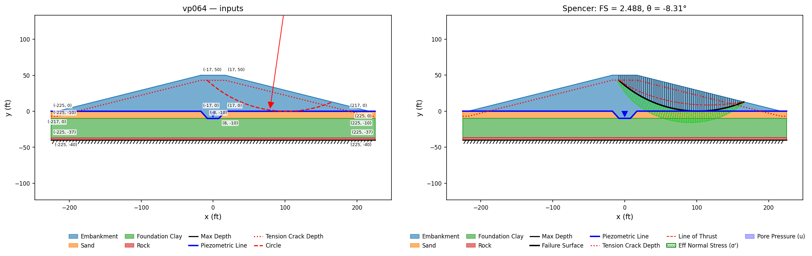

### VP65: USACE dam, upstream low pool (EM 1110-2-1902 Fig. 4-2) {#vp65}

Slide #65: the [#64](#vp64) dam under steady low-pool conditions — drained strengths (embankment c = 100 psf, φ = 25°; sand 0/35; clay 0/28; rock 0/45, moist/saturated unit-weight splits), pool at el. 20 with the pond load on the submerged upstream face, no tension crack. Evaluated on USACE's printed circle (center (−102, 163), R = 173, tangent to the clay top). This dam is ponded on the upstream face only: the figure hatches ponded water there and nowhere else, and the piezometric line stops short of the downstream face — it ends at x = 117.778, the value RS2's import of this model carries, whose solved pore-pressure field is zero everywhere beyond it. The printed circle daylights near x = 27, so the truncation does not touch the limit-equilibrium result; it matters to the [SSRM build](rs2.md#p4-vp65), which carries the field everywhere.

**Input files:** [vp065.xlsx](files/rocscience/vp065.xlsx)

| Method | XSLOPE | Slide | USACE |
|---|---|---|---|
| Bishop | 2.725 | 2.716 (+0.3%) | 2.71 (+0.6%) |
| Spencer | 2.748 | 2.736 (+0.4%) | — |

*Janbu corrected reads 2.522 vs Slide's 2.650 — the fo chart correction differs on this deep, pond-loaded upstream circle; the force-equilibrium base values agree.*

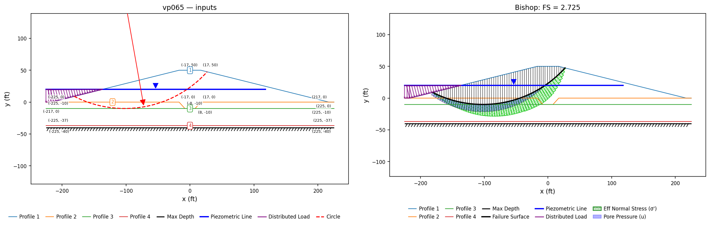

### VP66: USACE dam, chart-check properties (EM 1110-2-1902 Fig. 4-3) {#vp66}

Slide #66: the same dam family as [#64](#vp64)/[#65](#vp65) with the manual's chart-check property set (single unit weights: embankment c = 200 psf, φ = 25°, γ = 115; sand 0/35/130; clay 0/27/115), pool at el. 20, evaluated on Slide's printed circle (center (−135, 169), tangent to the sand top). Slide's printed slip endpoints prove its model uses a slightly different face than its #64/#65 siblings (toe −222, crest edge −15, 1:4.14) — reproduced here; the circle needs +0.1 ft of radius past its exact crest-corner tangency to intersect. Unlike [#65](#vp65) this dam is ponded on **both** faces — the figure draws the water symbol and the ponded hatch upstream and downstream alike, and RS2's import of the model carries hydrostatic tractions on x 139.2…220.7 as well as on the upstream face — so the file carries both ponds under a full-width piezometric line at el. 20. The printed circle is upstream, so the downstream pond does not enter the limit-equilibrium result; it is what lets the same file drive the [SSRM build](rs2.md#p4-vp66).

**Input files:** [vp066.xlsx](files/rocscience/vp066.xlsx)

| Method | XSLOPE | Slide | USACE |
|---|---|---|---|
| Spencer | 2.258 | 2.307 (−2.1%) | 2.30 (−1.8%) |
| Bishop | 2.254 | 2.307 (−2.3%) | — |

*−2.1%; the three Slide sibling models (#64/#65/#66) carry three slightly different digitizations of the same USACE dam, so each is matched against its own printed evidence.*

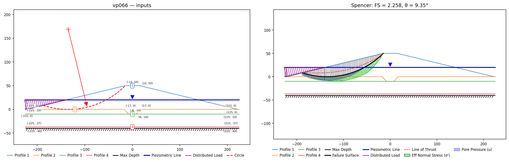

### VP67: USACE end-of-construction embankment (example F-5) {#vp67}

Slide #67 / USACE EM 1110-2-1902 (2003) example F-5: a non-homogeneous embankment (c = 1780 psf, φ = 5°, γ = 135 pcf) on a 100-ft undrained fine-grained foundation (c = 1600 psf, φ = 2°, γ = 127 pcf), analyzed at end of construction. Slide's figure labels every vertex; the circle is centered 259 ft above and 101 ft right of the toe and passes through the toe (R = 278.0).

**Input files:** [vp067.xlsx](files/rocscience/vp067.xlsx)

| Method | XSLOPE | Slide | USACE |
|---|---|---|---|
| Spencer | 1.316 | 1.328 (−0.9%) | 1.33 (−1.1%) |
| Bishop | 1.320 | 1.332 (−0.9%) | — |
| Janbu (corrected) | 1.340 | 1.345 (−0.4%) | — |

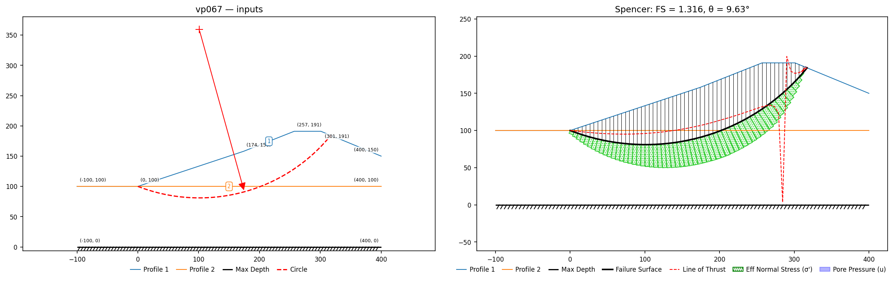

### VP68: USACE φ=0 slope with ponded water (example E-10) {#vp68}

Slide #68 / USACE EM 1110-2-1902 example E-10: an undrained three-layer slope (c = 600/400/500 psf, γ = 120/100/105 pcf, all φ = 0) with 8 ft of water ponded against it (pool el. 0), fully labeled figure. The specified circle sits 8.4 ft right and 36 ft above the toe and is tangent to the base of soil 3 (center (48.4, 28), R = 48).

**Input files:** [vp068.xlsx](files/rocscience/vp068.xlsx)

| Method | XSLOPE | Slide | USACE (E-10 chart) |
|---|---|---|---|
| Bishop | 1.234 | 1.241 (−0.6%) | 1.33 (−7.2%) |
| Morgenstern-Price | 1.234 | 1.244 (GLE — cross-method) | — |

*Slide notes the same offset against the USACE chart solution. Spencer's admissibility guard declines this surface (base tension at the φ=0 crest slices); M-P carries the complete-equilibrium comparison.*

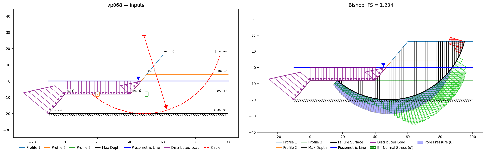

### VP69: Steady-seepage dam with a piezometric line (USACE example F-6) {#vp69}

Slide #69 / USACE EM 1110-2-1902 example F-6: a 112-ft embankment (c' = 0, φ' = 34°, γ = 130 pcf) on a granular foundation (c' = 0, φ' = 35°, γ = 125 pcf) under steady seepage. Pore pressures come from the piezometric line, which leaves the pool surface at el. 100, drops to the chimney drain, follows it down to the tailwater elevation (el. 22.5) and then runs out flat to the downstream face. USACE computes u as γw times the *vertical* distance from the slice base to that line, so it is a plain piezometric line — the `phreatic` (cos²θ) flag is off. The tailwater ponds the toe from x = 337.4 rightward. Specified circle: center (269, 248), R = 280 — 131 ft left of and 248 ft above the toe, bottoming out exactly on USACE's el. −32 stratum line.

**Input files:** [vp069.xlsx](files/rocscience/vp069.xlsx)

| Method | XSLOPE | Slide | USACE |
|---|---|---|---|
| Bishop | 1.999 | 2.011 (−0.6%) | 2.01 (−0.5%) |
| Spencer | 2.013 | 2.026 (−0.6%) | — |
| Morgenstern-Price | 2.013 | 2.027 (GLE — cross-method) | — |

*Slide's Figure 69.1 carries axis ticks and vertex markers, so the section was recovered exactly rather than estimated: ground (0,100)–(38.4,100)–(60.8,112)–(81,112)–(194.9,73.7)–(400,0)–(450,0). The rip-rap, chimney drain and drainage blanket are given the embankment properties, as USACE does — the circle misses all three. The uniform −0.6% offset is the residual of the piezometric-line kink, which the figure locates only to about a foot.*

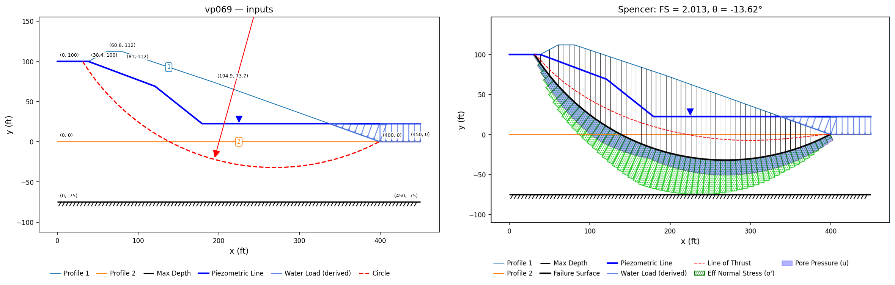

### VP70: Submerged slope, two pool depths (D&W Fig. 6.27) {#vp70}

Slide #70 / Duncan & Wright (2005) Fig. 6.27: a fully submerged homogeneous slope (c = 100 psf, φ = 20°, γ = 128 pcf; (0,15)–(30,15)–(105,45)–(140,45)) analyzed with the pool 30 ft and then 60 ft above the crest. The point of the example is that the factor of safety is independent of the submergence depth — the extra water weight and the extra pore pressure cancel. Pond loads applied over the whole submerged surface; free circular search.

**Input files:** [vp070a.xlsx](files/rocscience/vp070a.xlsx), [vp070b.xlsx](files/rocscience/vp070b.xlsx)

| Case | Method | XSLOPE | Slide | D&W |
|---|---|---|---|---|
| pool +30 ft | Bishop / Spencer | 1.596 / 1.593 | 1.603 / 1.599 (−0.4% / −0.4%) | 1.60 (−0.3% / −0.4%) |
| pool +60 ft | Bishop / Spencer | 1.596 / 1.593 | 1.603 / 1.599 (−0.4% / −0.4%) | 1.60 (−0.3% / −0.4%) |

*xslope reproduces the depth-independence exactly (identical FS at both pools) — a direct check on the consistency of the pond-load and pore-pressure treatments.*

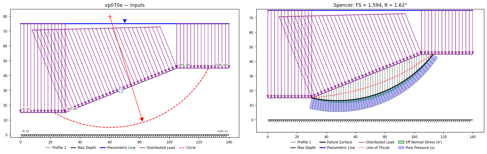
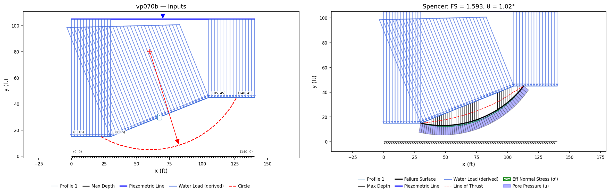

### VP71: FE seepage vs. piezometric line, same slope (D&W Figs. 6.37–6.38) {#vp71}

Slide #71 / Duncan & Wright (2005) Figs. 6.37 and 6.38: a homogeneous 2H:1V slope (c' = 200 psf, φ' = 20°, γ = 125 pcf; ground (0,40)–(120,40)–(200,80)–(440,80) over a base at el. 0) with water standing at el. 40 on the toe side and el. 75 behind the crest. The point of the example is that the same slope is solved two ways — pore pressures from a finite-element seepage analysis, and pore pressures from a piezometric line — and the two must agree.

Case 1 runs XSLOPE's own FE seepage solver on the section (specified heads of 40 and 75 on the two vertical boundaries, the ground surface an exit face), exports the nodal pore pressures, and feeds them to the limit-equilibrium search through `u = 'seep'`. Case 2 uses the piezometric line read off Slide's Figure 71.2. Free circular search in both cases.

**Input files:** [vp071a.xlsx](files/rocscience/vp071a.xlsx) (FE seepage), [vp071b.xlsx](files/rocscience/vp071b.xlsx) (piezometric line)

| Case | Method | XSLOPE | Slide | D&W |
|---|---|---|---|---|
| FE seepage | Bishop / Spencer | 1.132 / 1.132 | 1.141 / 1.141 (−0.8% / −0.8%) | 1.138 (−0.5% / −0.5%) |
| Piezometric line | Bishop / Spencer | 1.132 / 1.132 | 1.142 / 1.142 (−0.9% / −0.9%) | 1.141 (−0.8% / −0.8%) |

*The two pore-pressure models land within 0.0006 of each other — the same near-identity Slide reports (1.141 vs 1.142). This is the corpus's end-to-end check on the seepage → limit-equilibrium handoff: XSLOPE's phreatic surface, computed from scratch, reproduces the one Duncan & Wright drew.*

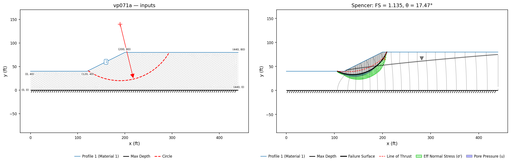
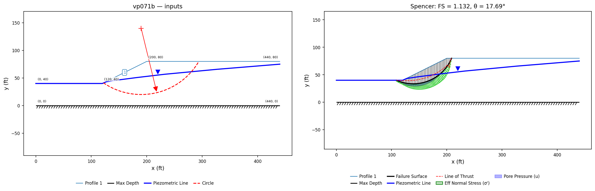

### VP72: Dam on a layered foundation — underseepage and artesian uplift (D&W Fig. 6.39) {#vp72}

Slide #72 / Duncan & Wright (2005) Figs. 6.39–6.40: a symmetric embankment dam (3:1 shell faces, 90 ft high, narrow 0.5H:1V clay core) on a **layered foundation** — 30 ft of clay over 15 ft of much more permeable sand — with pond at el. 302 and tailwater at the downstream ground. Elevations, slopes and properties come from D&W's figure; x-coordinates from vertex extraction of Slide's Figure 72.1, self-consistent with D&W's slopes to 0.5 ft. The physics D&W built this example around: underseepage through the sand produces **upward flow beneath the downstream shell**, and a single piezometric line cannot represent it — their FS with FE pore pressures is 14–19% lower than with the piezo line. One modelling detail matters enormously: Slide's BC markers (zoomed) show *no-flow vertical edges* — the heads sit on the ground surface only, forcing all underseepage up through the clay. Giving the sand a fixed-head exit at the model edge guts the artesian pressures and reads ~13% high; XSLOPE's FE solution with the correct BCs shows u at the toe 40% above hydrostatic, and 65% at 5 ft depth.

Pore pressures both ways, as in the manual: FE seepage (XSLOPE's own solver, tri3, converged in 29 iterations) and Slide's piezometric line (vertex-extracted from Figure 72.2; the pond/face point measures (385.8, 301.3) against the geometric (385, 302)). This dam is also [LEM sample problem 8](../lem/samples.md#8-earth-dam), built independently from the book: its piezometric line agrees with the Slide-figure trace within a few feet, and its downstream deep criticals (Bishop 1.561 / Spencer 1.558) sit within ~1% of Slide's tangent-197 values — though the corpus file follows Slide's slightly different crest and core-top dimensions (45-ft crest, core top el. 312) rather than the book's (50 ft, el. 307), since Slide's published numbers are the benchmark here.

**Input files:** [vp072a.xlsx](files/rocscience/vp072a.xlsx) (FE seepage), [vp072b.xlsx](files/rocscience/vp072b.xlsx) (piezometric line)

| Method | XSLOPE FE seepage, tan. 197 | Slide FE seepage | XSLOPE piezo line, tan. 197 | Slide piezo line |
|---|---|---|---|---|
| Bishop | 1.339 | 1.312 (+2.1%) | 1.572 | 1.563 (+0.6%) |
| Spencer | 1.341 | 1.312 (+2.2%) | 1.562 | 1.557 (+0.3%) |
| D&W reference | — | 1.37 | — | 1.57 |

*The tagged benchmarks are the circles tangent to el. 197 (bottom of the foundation clay) — D&W's own reported case, well-posed and reproducible; XSLOPE's constrained-sweep criticals are stored in the input files. The piezo case agrees with Slide to 0.6%; the FE case (1.34) sits inside the D&W–Slide spread (1.31–1.37). The **global** critical (Slide FE 1.149 / piezo 1.306) is deliberately not tagged: it is a shallow toe slough driven by the artesian exit gradient, and its factor of safety depends on the minimum admissible surface size — XSLOPE reads 1.28 on a 40-ft-radius slough and 0.87 on a 4-ft sliver at the singular toe point, and Slide does not print its critical surface. The 0.87 is itself physically meaningful: the FE solution predicts local heave marginality at the toe, which is why D&W's global value (1.11) barely exceeds 1.*

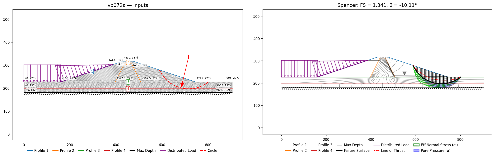

The piezometric-line case for comparison (Slide's line from Figure 72.2, with its tangent-197 critical):

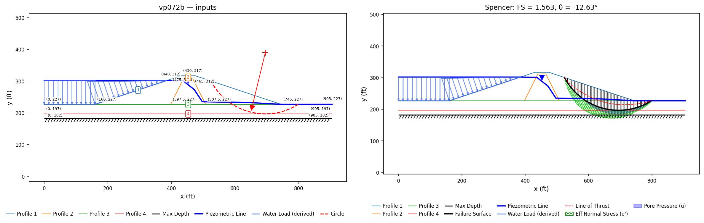

### VP73: The Bradwell excavated slope (Skempton & LaRochelle 1965) {#vp73}

Slide #73 / Duncan & Wright (2005): the excavated slope for reactor 1 at Bradwell — one of the classic case histories of short-term failure in stiff-fissured clay. The lower excavation is cut at ½:1 in London Clay; the overlying Marsh Clay and the clay fill (spoil, placed back on the Marsh Clay) are both at 1:1. The fill is cracked to its full depth (11.4 ft).

London Clay is stratified into six sublayers, each with an undrained strength that grows linearly with depth, Su = cz + (yz − y)·Δcz. That is precisely XSLOPE's `cp` option, so the six rows of Slide's Table 73.2 map straight onto six materials — with the two upper units (clay fill, Marsh Clay) that makes eight. Free circular search.

**Input files:** [vp073.xlsx](files/rocscience/vp073.xlsx)

| Method | XSLOPE | Slide | D&W |
|---|---|---|---|
| Bishop | 1.766 | 1.762 (+0.2%) | 1.76 (+0.3%) |
| Spencer | 1.766 | 1.758 (+0.5%) | 1.76 (+0.3%) |
| Janbu (corrected) | 1.733 | 1.736 (−0.2%) | 1.74 (−0.4%) |

*Every method within 0.5% — the tightest agreement of the Duncan & Wright group, and a good check that the stratified `cp` profile and the full-depth tension crack compose correctly.*

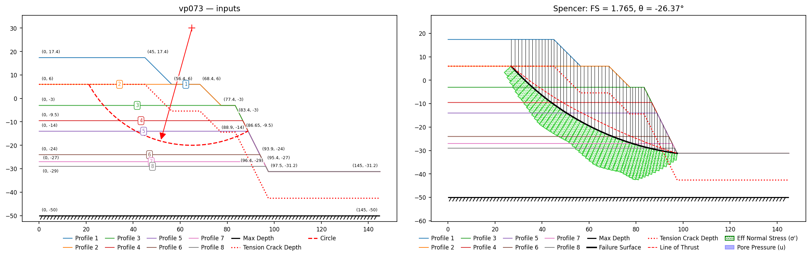

### VP74: Sand embankment on saturated clay (D&W Fig. 7.12) {#vp74}

Slide #74 / Duncan & Wright (2005) Fig. 7.12: a 100-ft cohesionless embankment (c=0, φ=40°, γ=140 pcf) on a 50-ft saturated clay foundation (c=2500 psf, φ=0); fully labeled figure, imperial units, dry. Free circular search.

**Input files:** [vp074.xlsx](files/rocscience/vp074.xlsx)

| Method | XSLOPE (search) | Slide | D&W |
|---|---|---|---|
| Bishop | 1.219 | 1.228 (−0.7%) | 1.22 (−0.1%) |
| Spencer | 1.194 | 1.201 (−0.6%) | 1.19 (+0.3%) |
| Janbu (corrected) | 1.161 | 1.174 (−1.1%) *(Slide's simplified value is 1.079 — cross-method)* | 1.07 (simplified — cross-method) |

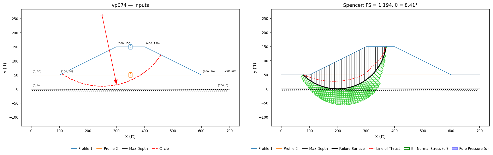

### VP75: The James Bay dyke (D&W Fig. 7.16) {#vp75}

Slide #75 / Duncan & Wright (2005) Fig. 7.16: one of the planned James Bay dykes — a granular fill embankment with a wide berm (ground (−17,31)–(40,31)–(58,25)–(114,25)–(132,19)–(168,19), metric) resting on three soft clay units: a 4 m crust (c = 41 kN/m²), 8 m of marine clay (34.5) and 7 m of lacustrine clay (31.2), all φ = 0. Fill c' = 0, φ' = 30°. Free circular search.

**Input files:** [vp075.xlsx](files/rocscience/vp075.xlsx)

| Method | XSLOPE (search) | XSLOPE on Slide's circle | D&W | Slide | Note |
|---|---|---|---|---|---|
| Bishop | 1.424 | 1.438 | 1.45 (−1.8% on XSLOPE's own critical, −0.8% on Slide's circle) | 1.468 (−2.0%) | same circle |
| Spencer | 1.420 | 1.436 | — | 1.464 (−1.9%) | same circle |

*The critical surface is a deep circle tangent to the base of the lacustrine clay, cutting all three foundation units. Two notes. First, this problem is the corpus's local-minimum showcase: from a single shallow seed the 9-point descent settles into a local minimum up in the fill at FS 1.74 — converged, plausible-looking, and 23% high with no warning — so the input file carries three seeds spanning shallow to deep. [Grid seeding](../lem/search.md#grid-seeding-global-search) (`seed='grid'`) removes the trap entirely: with the circles sheet ignored it finds Spencer 1.420 on its own, and it is regression-locked here alongside the seeded search. Second, on Slide's own printed critical circle (center (89.28, 139.38), R = 139.37) XSLOPE gives 1.438 against Slide's 1.468; XSLOPE and Slide bracket Duncan & Wright's 1.45 from either side.*

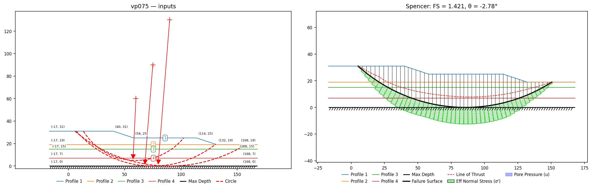

Also [SLOPE/W §2.44](geostudio.md) — the same problem in the GeoStudio corpus.

### VP76: Homogeneous dam, FE seepage vs. piezometric line (D&W Fig. 7.19) {#vp76}

Slide #76 / Duncan & Wright (2005) Fig. 7.19: a homogeneous earth embankment (c' = 100 psf, φ' = 30°, γ = 100 pcf) on an impermeable foundation, ground (0,0)–(100,40)–(120,48)–(135,48)–(255,0), with the pool at el. 40 covering the entire upstream face. As in VP71, pore pressures are modelled two ways — an FE seepage analysis and a piezometric line — and the critical circle is found by free search.

**Input files:** [vp076a.xlsx](files/rocscience/vp076a.xlsx) (FE seepage), [vp076b.xlsx](files/rocscience/vp076b.xlsx) (piezometric line)

| Case | Method | XSLOPE | Slide | D&W |
|---|---|---|---|---|
| FE seepage | Bishop / Spencer | 1.065 / 1.072 | 1.068 / 1.075 (−0.3% / −0.3%) | 1.19 & 1.08 (chart) — a published band, not one value |
| Piezometric line | Bishop / Spencer | 1.049 / 1.056 | 1.090 / 1.100 (−3.8% / −4.0%) | 1.16 (−9.6% / −9.0%) |

*The FE case lands within 0.6% of Slide, and XSLOPE's computed phreatic surface tracks the piezometric line Slide digitized from Duncan & Wright to better than a foot everywhere. The piezometric case sits 3% low, and the reason is that this particular problem is ill-conditioned: the critical circle is a shallow toe surface where the water table is nearly at the ground, so u/σv ≈ 0.57 and effective stresses are small. Dropping the piezometric line by just ½ ft raises Bishop from 1.049 to 1.118 — 6% of FS per half-foot. The 3% gap is worth only about 0.3 ft of line elevation, which is finer than a raster figure can be read. Duncan & Wright's own reference values (1.19 and 1.08 for the same FE case) show the same spread.*

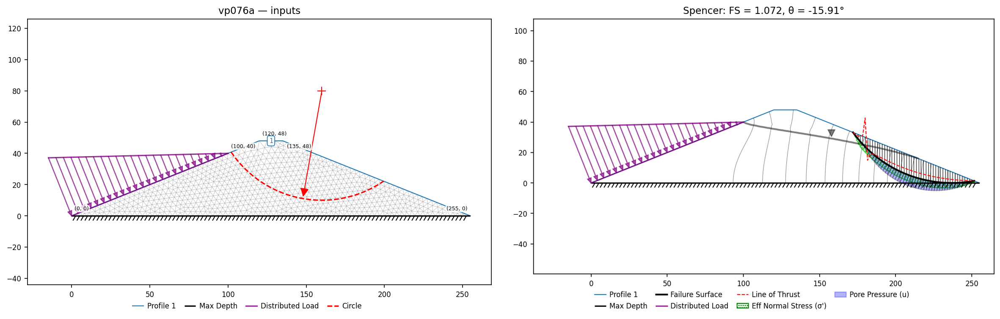
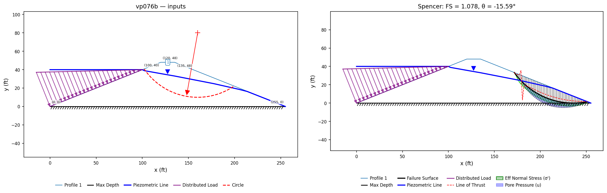

### VP77: Thick-core dam, FE seepage vs. piezometric line (D&W Fig. 7.24) {#vp77}

Slide #77 / Duncan & Wright (2005) Fig. 7.24 (Fig. 7.37 in the 2014 edition): a symmetric earth dam with a thick clay core on an impervious foundation, pond at el. 315. Geometry comes from D&W's coordinate-labeled figure — shell faces 2.75:1 to an 80-ft crest at el. 338; the core is a trapezoid with 1.5:1 faces and a 50-ft top at el. **328** (the Slide figure leaves the core-top vertices unlabeled; the core does not reach the crest). Core c' = 0, φ' = 20°, γ = 120 pcf, k = 10⁻⁵ ft/min; shell c' = 0, φ' = 38°, γ = 140 pcf, k = 10⁻³ — a 100:1 contrast. Both zones are cohesionless, so the benchmark targets the **deep circle tangent to the base** at el. 127; both of Slide's printed criticals bottom at exactly 127.0.

Like VP71 and VP76, pore pressures are modelled two ways. Case 1 runs **XSLOPE's own FE seepage** (head 315 on the submerged upstream face, exit face downstream, no-flow base): the phreatic surface drops from 312 to 231 across the core and runs near-flat at el. ~134 through the downstream shell, matching D&W's Fig. 7.38. Case 2 uses **Slide's piezometric line**, extracted from Figure 77.2 by axis-tick-calibrated vertex detection — the affine validates itself on the labeled pond point (measured (517.2, 315.1)), and the detected vertices land exactly on the core's 1.5:1 face at (572, 312) and the downstream 2.75:1 face at (1182, 148), where the line daylights and follows the face to the toe.

**Input files:** [vp077a.xlsx](files/rocscience/vp077a.xlsx) (FE seepage), [vp077b.xlsx](files/rocscience/vp077b.xlsx) (piezometric line)

| Method | XSLOPE FE seepage | Slide FE seepage | XSLOPE piezo line | Slide piezo line |
|---|---|---|---|---|
| Bishop | 1.652 *(search 1.637)* | 1.658 (−0.4%) | 1.591 *(search 1.566)* | 1.584 (+0.4%) |
| Spencer | 1.724 *(search 1.700)* | 1.724 (0.0%) | 1.659 | 1.648 (+0.7%) |
| Morgenstern–Price | 1.734 | — | 1.670 | — |
| Ordinary | 1.506 | — | 1.477 | — |

*Values on Slide's printed circles (endpoints reproduced to 0.1 ft); the free-search values in parentheses are slightly deeper circles of the same family. D&W's four-program Spencer spread for the FE case is 1.67–1.72 (UTEXAS 1.69, SLIDE 1.70, SLOPE/W 1.67); XSLOPE's 1.724 sits at its top edge, equal to Slide's own manual value. Two numerical notes from the seepage run, both documented in the builder: the unsaturated front width must scale with the dam (h0 = −5 ft ≈ one element; the VP76-style −1 ft is sub-grid here and the fixed-point iteration never converges), and the sidecar is generated on a tri3 mesh because tri6 midside kr sampling oscillates. Spencer reads 1.753/1.737/1.724/1.715 at h0 = −20/−10/−5/−2 — the h0 = −5 choice is the sharpest mesh-resolvable front, not a fit.*

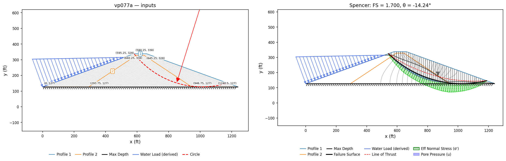
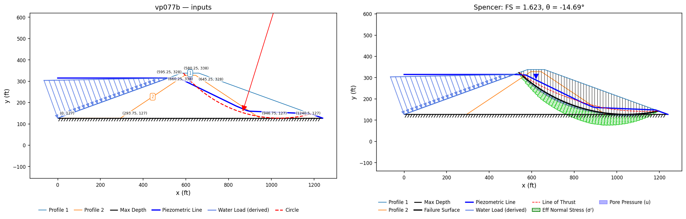

### VP78: Pure cohesive slope on a foundation (D&W Fig. 14.3) {#vp78}

Slide #78 / Duncan & Wright (2005) Fig. 14.3: c = 1000 psf, φ = 0, γ = 100 pcf; a 50-ft slope at 1V:0.8H over a 30-ft foundation ((0,30)–(90,30)–(130,80)–(240,80), base at y = 0, all vertices labeled in Slide's figure). For φ = 0 the critical circle is the deep, base-tangent one, which the free search finds directly.

**Input files:** [vp078.xlsx](files/rocscience/vp078.xlsx)

| Method | XSLOPE (search) | Slide (base-tangent) | Slide (toe circle — a different surface) | D&W |
|---|---|---|---|---|
| Bishop | 1.117 | 1.141 (−2.1%) | 1.126 | 1.124 (−0.6%) |
| Spencer | 1.131 | 1.139 (−0.7%) | 1.200 | — |

*xslope's free search reaches slightly below Slide's tangent-line-constrained minimum. Slide's toe-circle rows repeat identically for the 46.5-ft and 60-ft foundation variants, so only the 30-ft model is built.*

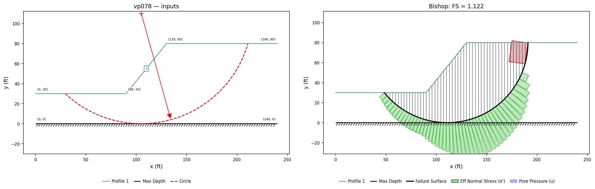

### VP79: Cohesionless embankment on a φ=0 foundation (D&W Fig. 14.4) {#vp79}

Slide #79 / Duncan & Wright (2005) Fig. 14.4: a c=0, φ=30°, γ=120 pcf embankment (15 ft high at ~21.5°) over a 20-ft φ=0 foundation with c=450 psf; geometry fully labeled in Slide's figure ((0,20)–(40,20)–(78,35)–(130,35), base y=0). The critical mechanism is the deep circle tangent to the base; the shallow infinite-slope FS is tan30°/tan21.5° ≈ 1.46 and does not govern.

**Input files:** [vp079.xlsx](files/rocscience/vp079.xlsx)

| Method | XSLOPE (search) | Slide | D&W |
|---|---|---|---|
| Bishop | 1.407 | 1.412 (−0.4%) | 1.40 (+0.5%) |
| Spencer | 1.397 | 1.400 (−0.2%) | — |

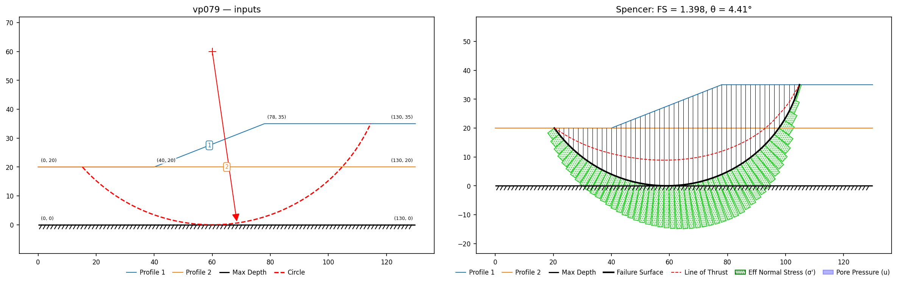

### VP80: Embankment on a stratified foundation (D&W Fig. 14.5) {#vp80}

Slide #80 / Duncan & Wright (2005) Fig. 14.5: an embankment (c=1 psf, φ=35°, γ=120 pcf) over five alternating φ=0 clay and c≈0 sand layers (fully labeled figure, imperial units). Two circles from the published center (142, 147): tangent to the foundation top (R=87) and tangent to the 15-ft-depth line (R=102) — the deeper circle drops FS from ~2.5 to ~1.35 as it engages the 500-psf clay.

**Input files:** [vp080a.xlsx](files/rocscience/vp080a.xlsx), [vp080b.xlsx](files/rocscience/vp080b.xlsx)

| Case | Method | XSLOPE | Slide | D&W |
|---|---|---|---|---|
| tangent 0 ft | Bishop / Spencer | 2.533 / 2.530 | 2.549 / 2.545 (−0.6% / −0.6%) | 2.56 (−1.1% / −1.2%) |
| tangent 15 ft | Bishop / Spencer | 1.389 / 1.352 | 1.398 / 1.359 (−0.6% / −0.5%) | 1.35 (+2.9% / +0.1%) |

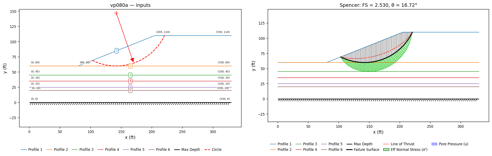

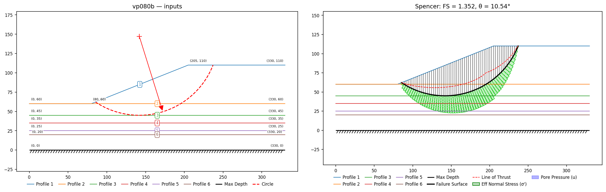

### VP81: Embankment on a φ=0 foundation (D&W Fig. 14.7) {#vp81}

Slide #81 / Duncan & Wright (2005) Fig. 14.7: a c=0, φ=30°, γ=124 pcf embankment (19 ft at ~26.6°) over a 15-ft φ=0 foundation with c=500 psf, γ=98 pcf; geometry fully labeled in Slide's figure ((0,15)–(35,15)–(73,34)–(128,34), base y=0). The deep base-tangent circle governs.

**Input files:** [vp081.xlsx](files/rocscience/vp081.xlsx)

| Method | XSLOPE (search) | Slide | D&W |
|---|---|---|---|
| Bishop | 1.223 | 1.230 (−0.6%) | 1.21 (+1.1%) |
| Spencer | 1.204 | 1.209 (−0.4%) | — |

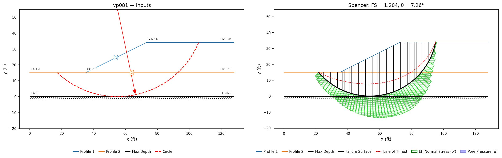

### VP82: Embankment with a water table (D&W Fig. 14.20-a) {#vp82}

Slide #82 / Duncan & Wright (2005) Fig. 14.20-a: an embankment (c' = 600 psf, φ' = 25°, γ = 125 pcf; ground (0,60)–(60,60)–(140,20)–(200,20)) on a cohesionless foundation (c' = 0, φ' = 30°, γ = 132 pcf), with a piezometric line running (0,40)–(100,30)–(140,20)–(200,20). Free circular search.

**Input files:** [vp082.xlsx](files/rocscience/vp082.xlsx)

| Method | XSLOPE | Slide | D&W |
|---|---|---|---|
| Bishop | 1.521 | 1.533 (−0.8%) | 1.535 (−0.9%) |
| Spencer | 1.533 | 1.540 (−0.5%) | — |

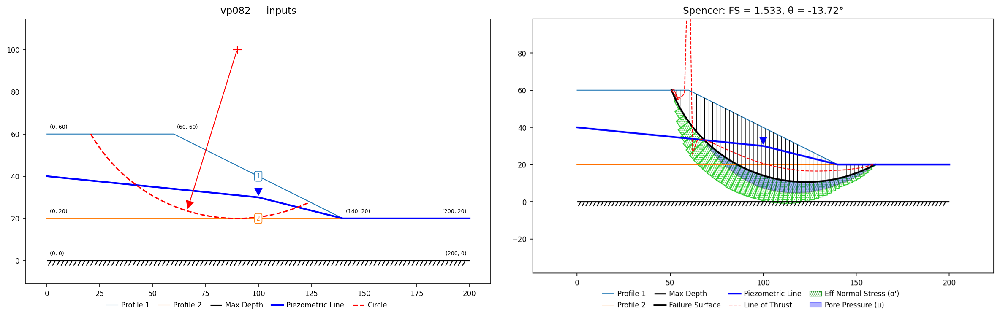

### VP83: Embankment wall on an undrained foundation (D&W Fig. 14.20-b) {#vp83}

Slide #83 / Duncan & Wright (2005) Fig. 14.20-b: an embankment (c' = 0, φ' = 36°, γ = 123 pcf; ground (0,40)–(55,40)–(75,30)–(140,30)) on a 30-ft undrained foundation (φ = 0, γ = 97 pcf) down to a base at el. 0. Two foundation strength profiles are tested: profile I increases with depth, cu = 200 + 15·z psf, and profile II is constant at 300 psf. Free circular search.

Profile I uses XSLOPE's `cp` strength option, which is exactly this form — an undrained strength `c` at a reference elevation `r_elev`, growing at rate `cp` per foot below it.

**Input files:** [vp083a.xlsx](files/rocscience/vp083a.xlsx) (profile I), [vp083b.xlsx](files/rocscience/vp083b.xlsx) (profile II)

| Case | Method | XSLOPE | Slide | D&W |
|---|---|---|---|---|
| I: cu = 200 + 15·z | Bishop / Spencer | 1.305 / 1.275 | 1.313 / 1.285 (−0.6% / −0.8%) | 1.300 (+0.4% / −1.9%) |
| II: cu = 300 | Bishop / Spencer | 1.328 / 1.326 | 1.335 / 1.330 (−0.5% / −0.3%) | 1.312 (+1.2% / +1.1%) |

*With the constant profile the critical circle runs all the way down to the base of the foundation, as Slide notes; the free search finds it without being told to.*

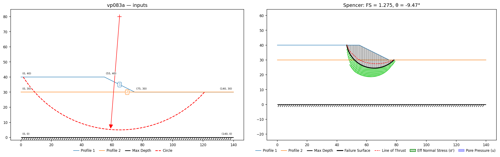
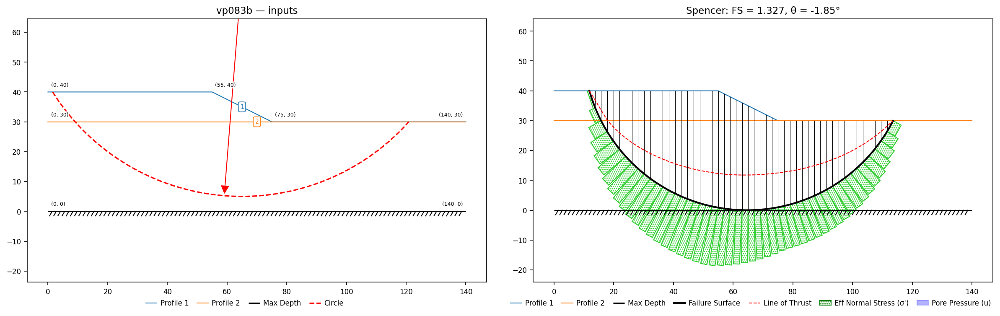

### VP84: Embankment on a foundation with four strength gradients (D&W Fig. 15.9) {#vp84}

Slide #84 / Duncan & Wright (2005) Fig. 15.9: an embankment (c' = 0, φ' = 35°, γ = 125 pcf; ground (0,20)–(40,20)–(90,40)–(140,40)) on a 20-ft undrained foundation (φ = 0, γ = 100 pcf) whose strength is cu = 300 + cz·z. The same slope is run with four strength gradients, cz = 0, 5, 10 and 15 psf/ft — a systematic sweep of the `cp` option.

**Input files:** [vp084a.xlsx](files/rocscience/vp084a.xlsx), [vp084b.xlsx](files/rocscience/vp084b.xlsx), [vp084c.xlsx](files/rocscience/vp084c.xlsx), [vp084d.xlsx](files/rocscience/vp084d.xlsx)

| Profile | cz (psf/ft) | XSLOPE Bishop / Spencer | Slide | D&W |
|---|---|---|---|---|
| I | 0 | 0.756 / 0.751 | 0.761 / 0.756 (−0.7% / −0.7%) | 0.75 (+0.8% / +0.1%) |
| II | 5 | 0.905 / 0.897 | 0.909 / 0.898 (−0.4% / −0.1%) | 0.90 (+0.6% / −0.3%) |
| III | 10 | 1.042 / 1.028 | 1.045 / 1.032 (−0.3% / −0.4%) | 1.03 (+1.2% / −0.2%) |
| IV | 15 | 1.151 / 1.131 | 1.154 / 1.134 (−0.3% / −0.3%) | 1.13 (+1.9% / +0.1%) |

*Four gradients, one geometry: the whole family tracks Slide within 0.7% and D&W within 1%. Together with VP83 this exercises the depth-varying undrained strength option across five different gradients, from constant to 15 psf/ft.*

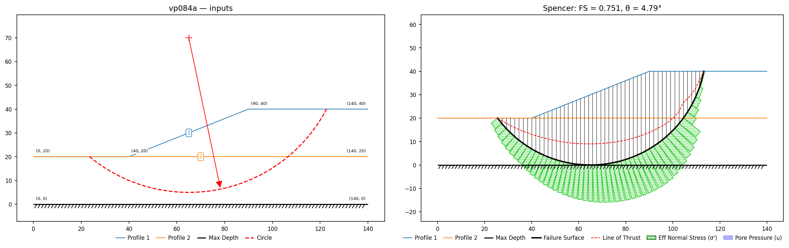
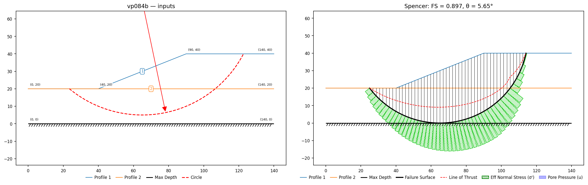
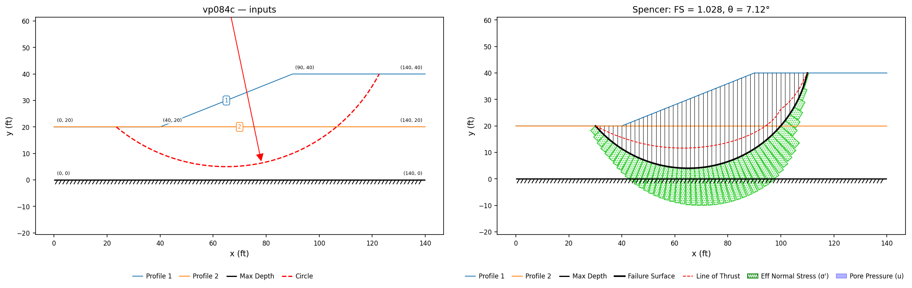
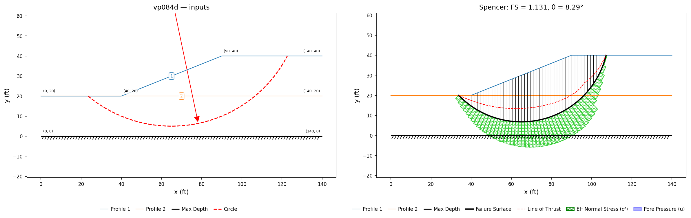

### VP85: Reinforced slope, homogenous, grouted tieback {#vp85}

Slide #85 case 1 applies the tieback as active support, case 2 as passive; each is
evaluated on the circle Slide prints for it.

**Input files:** [vp085a.xlsx](files/rocscience/vp085a.xlsx), [vp085b.xlsx](files/rocscience/vp085b.xlsx)

*Active support, on Slide’s printed GLE circle*

| Method | XSLOPE | Slide | D&W |
|---|---|---|---|
| Bishop | 1.567 | 1.575 (GLE on the same circle — cross-method) | 1.51 (+3.8%) |
| Spencer | 1.567 | 1.575 (GLE on the same circle — cross-method) | — |
| Bishop, on Slide's own searched circle | — | 1.531 (a different surface) | — |

*Passive support, on Slide’s printed Bishop circle*

| Method | XSLOPE | Slide (Bishop, same circle) | D&W |
|---|---|---|---|
| Ordinary | 1.319 | 1.324 (Bishop — cross-method) | 1.32 (−0.1%) |
| Bishop | 1.319 | 1.324 (−0.4%) | 1.32 (−0.1%) |

*Slide’s own method table scatters 1.42–2.05 here (concentrated force strains interslice assumptions), so per-circle comparison is the meaningful one.*

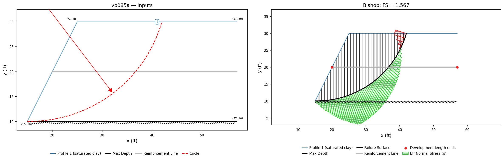

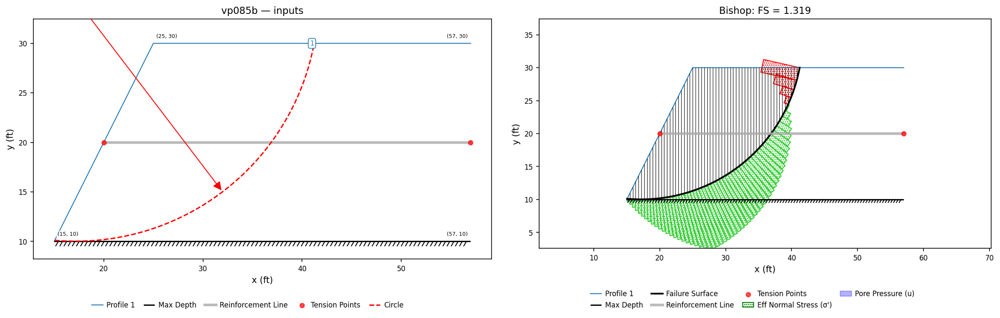

The problem is Duncan & Wright (2005) Fig. 6.34; the tieback carries 9,000 lb/ft, applied horizontally at mid-height of the slope.

### VP86: Reinforced slope, homogenous, grouted tieback {#vp86}

Slide #86: Duncan & Wright (2005) Fig. 7.28 / STABGM reinforced fill on a strong rock foundation: 5 geogrids (800 lb/ft, 20 ft long, every 4 ft), solved by Slide2 with a circular search.

**Input files:** [vp086.xlsx](files/rocscience/vp086.xlsx)

| Method | XSLOPE | Slide | D&W |
|---|---|---|---|
| Bishop | 1.617 | 1.629 (−0.7%) | 1.61 (+0.4%) |
| Spencer | 1.611 | 1.620 (−0.6%) | 1.61 (+0.1%) |
| Slide2 GLE — cross-method, no XSLOPE counterpart | — | 1.622 | — |

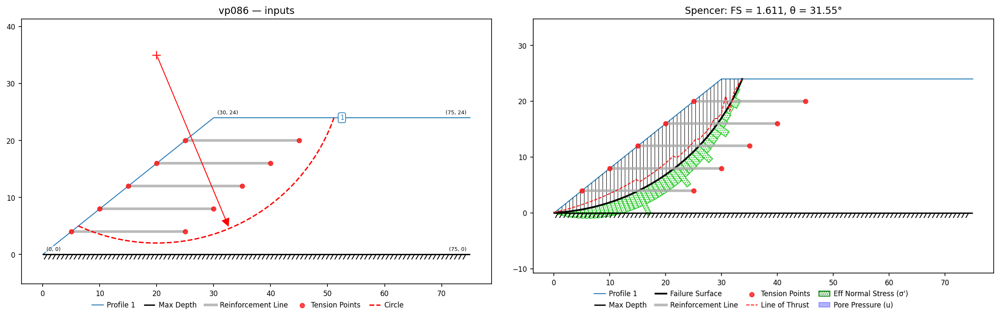

### VP87–VP94: Geosynthetic multitiered MSE walls (Leshchinsky & Han 2004) {#vp87}

Slide #87–#94 reproduce the parametric study in [Leshchinsky & Han (2004)](https://doi.org/10.1061/(ASCE)1090-0241(2004)130:12(1225)): a three-tier segmental (block-faced) MSE wall — three 3-m tiers offset 1.2 m, 0.3-m block columns (c=2.5 kPa, φ=34°), reinforced/retained fill c=0/φ=34°, foundation c=10 kPa/φ=34° (6 m deep), γ=18 kN/m³ throughout — with geotextile layers every 0.6 m, L=6.3 m, and the tensile strength Ta the paper *required* for FS=1.0 in each variation. Pullout resistance is 80% of the fill strength (translated to xslope anchorage lengths from the local overburden at each layer end); the geotextile force is applied horizontally (`dir=axial`, `appl=passive` — Slide's convention, verified against its printed VP87 circle). Each problem's Slide-printed critical circle is stored in the file, so the test tags evaluate a deterministic surface.

Two quirks in the manual: (1) Slide's VP89/92/93 *results* were computed with the **baseline Ta = 10** supports even though their support tables print the paper's per-case required strengths (11.4/9.25/11.6) — with Ta=10 xslope lands within 1% of all three Slide numbers, and with the paper's strengths it lands on L&H's design intent (FS ≈ 1.0). (2) VP91's printed circle exits exactly tangent to the crest and needs a hair of extra radius to intersect.

| # | Case | Method (Slide's figure) | XSLOPE | Slide | L&H reference (FLAC continuum / limit-equilibrium design target, 1.00 by construction) |
|---|---|---|---|---|---|
| 87 | Baseline (Ta=10) | Bishop | 1.031 | 1.040 (−0.9%) | 0.99 (FLAC) / 1.00 (Bishop) |
| 88 | Fill φ=25 (Ta=22) | Spencer | 1.057 | 1.043 (+1.3%) | 0.99 / 1.00 |
| 89 | L=4.2 m (Ta=11.4) | Spencer | 1.011 *(0.980 at Ta=10)* | 0.971 *(used Ta=10)* (+0.9% against XSLOPE at Ta = 10) | 0.98 / 1.00 |
| 90 | Two types (7.5/11.0) | Bishop | 1.012 | 1.004 (+0.8%) | 1.01 / 1.00 |
| 91 | Foundation c=0, φ=18 | Spencer | 0.960 | 0.964 (−0.4%) | 0.86 (FLAC, bearing) / 1.00 |
| 92 | Water hw=3 m (Ta=9.25) | Bishop | 1.010 *(1.039 at Ta=10)* | 1.037 *(used Ta=10)* (+0.2% against XSLOPE at Ta = 10) | 1.01 / 1.00 |
| 93 | Surcharge q=20 (Ta=11.6) | Bishop | 1.017 *(0.961 at Ta=10)* | 0.958 *(used Ta=10)* (+0.3% against XSLOPE at Ta = 10) | 1.02 / 1.00 |
| 94 | Five 1.8-m tiers (Ta=10.1) | Bishop | 1.020 | 1.040 (−1.9%) | 1.00 |

*VP92 models the paper's hw as pore pressure in the foundation soil only (a drained MSE fill), plus the 3-m pond standing against the lower tier — treating the fill as saturated drops FS to ~0.89 and reconciles with neither program. xslope's free circular search finds slightly more critical circles than Slide's grid on several of these (e.g. 0.99 on the baseline, matching the L&H reference).*

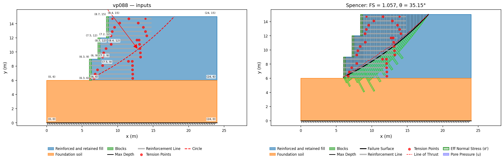

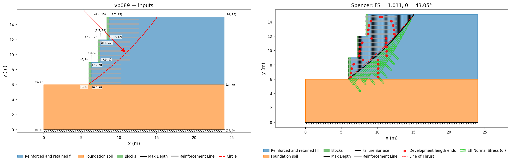

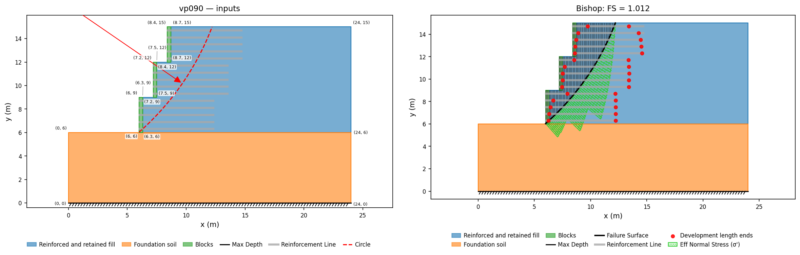

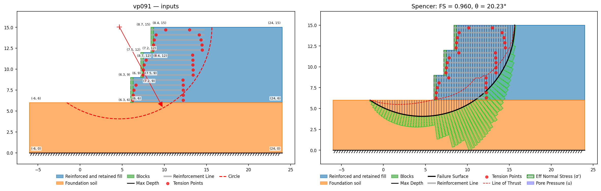

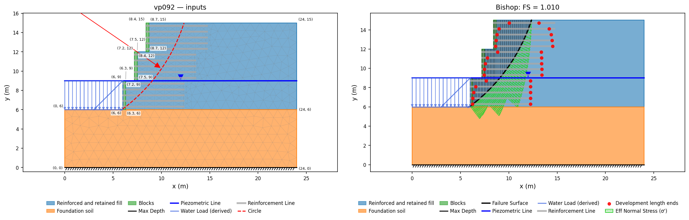

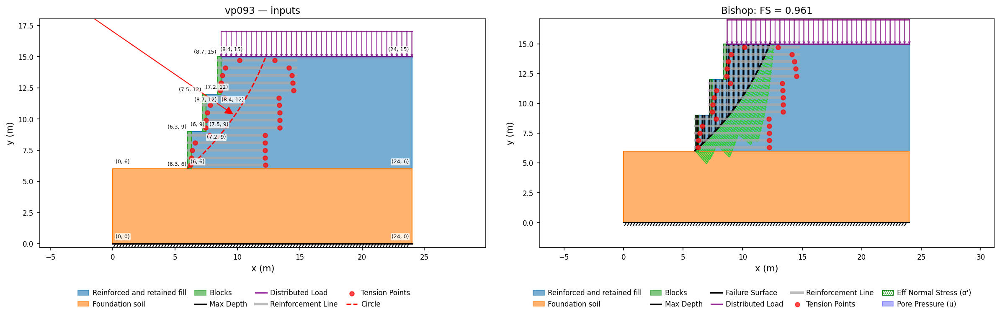

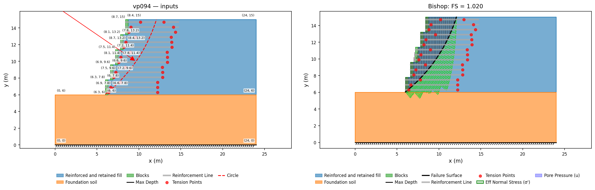

In VP90 the upper 8 geotextile layers carry Ta = 7.5 and the lower 7 carry Ta = 11.0; VP93's Ta = 10 is also the value stored in the RS2 vendor `.fez`.

### VP95: USACE Appendix G dam, Corps 2-stage drawdown method {#vp95}

Slide #95 runs the USACE EM 1110-2-1902 (1970) Appendix G example — the same dam that
[VP96](#vp96) builds — through the **Corps of Engineers 2-stage** rapid-drawdown
procedure and its R-envelope.

| Method | XSLOPE | Slide | USACE |
|---|---|---|---|
| Corps of Engineers 2-stage drawdown | — *not implemented* | 1.347 | 1.35 |

XSLOPE does not implement the 2-stage method. It implements the Duncan, Wright & Wong
(1990) **3-stage** procedure that superseded it, which is the method the later edition
of the same manual carries and the one every drawdown problem in this corpus is solved
with. That procedure is verified on this very dam in [VP96](#vp96), and on six further
drawdown problems in VP97–VP102 — Pilarcitos Dam, Walter Bouldin Dam, the pumped-storage
dam, both Morgenstern chart cases, and the Huang & Jia transient dam.

So the omission is a deliberate scope exclusion rather than a gap: the physics this row
would exercise is covered, by the procedure that replaced the one Slide #95 uses. There
is nothing here XSLOPE should reproduce.

### VP96: Embankment dam, homogenous, rapid drawdown, water table {#vp96}

Slide #96 / USACE EM 1110-2-1902 (2003) Appendix G example: 3:1 then 2.5:1 embankment face, max pool el. 103 drawn down to 24, specified circle (169.5, 210, R=210). Material: c'=0, phi'=30, gamma=135 pcf with the Kc=1 envelope d=1379 psf, psi=18.2 deg (Figure G-5). Solved with the Duncan-Wright-Wong 3-stage procedure. (Slide's #95 runs the same model with the older Corps 2-stage method — see [VP95](#vp95).)

**Input files:** [vp096.xlsx](files/rocscience/vp096.xlsx)

| Method | XSLOPE | Slide | USACE |
|---|---|---|---|
| Bishop | 1.432 | 1.443 (−0.8%) | 1.44 (−0.6%) |
| Spencer | 1.434 | 1.443 (−0.6%) | 1.44 (−0.4%) |

*Duncan-Wright-Wong 3-stage on the specified circle; Kc=1 envelope d=1379 psf, ψ=18.2°.*

Also [SLOPE/W §2.41](geostudio.md) — the same problem in the GeoStudio corpus.

### VP97: Embankment dam, homogenous, rapid drawdown, water table {#vp97}

Slide #97: Pilarcitos Dam (Duncan, Wright & Wong 1990). Homogeneous earthfill, gamma=135 pcf, c'=0, phi'=45; R-envelope cR=60 psf, phiR=23. Kc=1 envelope via D&W (2014) eqs 9.6-9.7: d = cR cos(phiR) cos(phi') / (1-sin(phiR)) = 64.1 psf, psi = 24.4 deg (the same equations reproduce the USACE App G values 1379/18.2 exactly). Drawdown 72 -> 37 ft.

**Input files:** [vp097.xlsx](files/rocscience/vp097.xlsx)

| Method | XSLOPE | Slide | DWW |
|---|---|---|---|
| Bishop | 1.042 | 1.043 (−0.1%) | 1.05 (−0.8%) |
| Spencer | 1.044 | 1.043 (+0.1%) | 1.05 (−0.6%) |
| Corps 2-stage — not implemented, superseded by the DWW 3-stage procedure | — | 0.823 | 0.82 |

*The dam that actually failed in drawdown sits right at FS ≈ 1.*

Also [SLOPE/W §2.43](geostudio.md) — the same problem in the GeoStudio corpus.

### VP98: Walter Bouldin Dam rapid drawdown (Duncan, Wright & Wong 1990) {#vp98}

Slide #98: the Walter Bouldin Dam failure case — a rolled earthfill dam that failed during a 32-ft drawdown in 1975. Pool drops 47 ft → 15 ft. Five zones (riprap, clayey silty sand, micaceous sand, cretaceous clay, clayey sandy gravel) rebuilt from Slide's coordinate-labeled Figure 98.1 with the interior boundaries traced from its color zones (axis-calibrated, ±1 ft); the Kc=1 undrained envelopes come from the paper's own Table 2 — (750 psf, 15°), (480, 13°), (280, 15.5°) — with riprap and gravel drained.

**Input files:** [vp098.xlsx](files/rocscience/vp098.xlsx)

| Method | XSLOPE | Slide | DWW |
|---|---|---|---|
| DWW 3-stage (Spencer, circular search) | 1.046 | 1.039 (+0.7%) | 1.04 (+0.6%) |

*The critical circle ((52,21)→(157,60)) falls where the dam actually slid. Slide's Corps 2-stage (0.931) and Lowe & Karafiath (1.075) rows exercise staged procedures xslope does not implement.*

Also [SLOPE/W §2.40](geostudio.md) — the same problem in the GeoStudio corpus.

### VP99: Pumped-storage project dam rapid drawdown (DWW 1990) {#vp99}

Slide #99: the paper's hypothetical pumped-storage dam — silty clay core and random zone (c′=0, φ′=36°, Kc=1 envelope 2250 psf/20°), free-draining rockfill shells (φ′=37°), drawdown 285 ft → 120 ft (paper El 545 → 380). The core and random zone carry identical strengths, so only the rockfill/clay boundary affects the result.

The geometry is **re-pinned from the vendor GeoStudio model** of the same DWW problem ([SLOPE/W §2.42](geostudio.md), "Staged rapid drawdown – Pumped Storage Project Dam.gsz"), read with `xslope.geostudio.read_gsz`. Slide's Figure 99.1 is unlabeled, and a trace of it gives a dam ≈19 ft short in crest-to-base height (281 ft rather than 300), which reads FS ≈7% low. The .gsz point table fixes the section exactly: its frame, translated by y−260 to keep the 285/120 pool levels, puts the base at −10, crest at 290, and the three upstream benches at el. 60/120/190. The two vendors' figures genuinely differ (berm elevations, core width); GeoStudio's is the one that matches the published FS.

**Input files:** [vp099.xlsx](files/rocscience/vp099.xlsx)

| Method | XSLOPE | Slide | SLOPE/W | DWW |
|---|---|---|---|---|
| DWW 3-stage (Spencer, circular search) | 1.527 | 1.534 (−0.5%) | 1.550 (−1.5%) | 1.56 (−2.1%) |

*With the vendor geometry, XSLOPE lands within 0.5% of Slide (1.527 vs 1.534) and inside the Slide / SLOPE/W / DWW band (1.53–1.56). Tagged as a regression lock.*

### VP100: Embankment dam, homogenous, rapid drawdown, water table {#vp100}

Slide #100: complete drawdown (100 -> 0), B-bar = 1: the residual pore pressure is hydrostatic below the slope surface, i.e. piezo = ground, no external pond.

**Input files:** [vp100.xlsx](files/rocscience/vp100.xlsx)

*Complete drawdown (100 → 0)*

| Method | XSLOPE | Morgenstern chart | Slide |
|---|---|---|---|
| Bishop | 1.201 | 1.20 (+0.1%) | 1.212 (B-bar) (−0.9%) |
| Spencer | 1.206 | — | — |

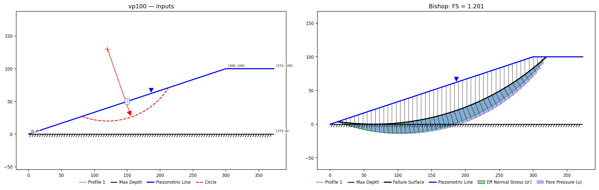

### VP101: Embankment dam, homogenous, rapid drawdown, water table {#vp101}

Slide #101: partial drawdown (100 -> 50), B-bar = 1: piezo follows the ground where the face is above the pool and stays at 50 below it, with the remaining pond loading the submerged face.

**Input files:** [vp101.xlsx](files/rocscience/vp101.xlsx)

*Partial drawdown (100 → 50)*

| Method | XSLOPE | Slide | Morgenstern chart |
|---|---|---|---|
| Bishop | 1.416 | 1.417 (−0.1%) | 1.41 (+0.4%) |
| Spencer | 1.422 | — | — |

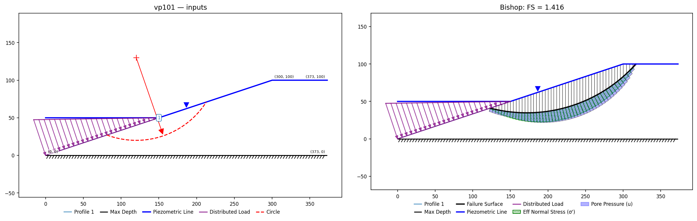

### VP102: Earth dam before rapid drawdown (Huang & Jia 2008) {#vp102}

Slide #102 / Huang & Jia (2008), *Strength reduction FEM in stability analysis of soil slopes subjected to transient unsaturated seepage*: a homogeneous earth dam (c' = 13.8 kPa, φ' = 37°, γ = 18.2 kN/m³; ground (0,7.3)–(33.5,7.3)–(86.66,24.39)–(99.75,28.6)–(107.05,28.6)–(157.9,7.3)–(191.4,7.3)) with the reservoir at el. 24.39 — the upstream face breaks slope exactly at the waterline. The coordinate labels printed on Slide's Figure 102.1 are rounded to the nearest metre; the section built here follows the manual's *result* figures instead, whose printed critical surfaces all enter at el. 28.600 and exit at el. 7.300, each endpoint pair lying on that figure's own printed centre and radius. The distinction is worth about 3% of the factor of safety: the rounded labels describe a dam 0.7 m taller with a steeper downstream face, which is where the critical mechanism sits.

The Slide problem is a *transient* rapid-drawdown series: the reservoir is drawn down instantaneously from full pool (el. 24.39) to the tailwater level (el. 7.3) and factors of safety are reported at 60–1500 h for φb = 0° (Table 102.3) and φb = 37° (Table 102.4). This entry reproduces both the two end members Slide reports separately — the dry dam and the initial steady-state seepage condition from which the drawdown starts — and the transient FS-vs-time curve between them, from XSLOPE's own uncoupled [transient seepage solve](../seep/transient.md).

**Input files:** [vp102a.xlsx](files/rocscience/vp102a.xlsx) (dry), [vp102b.xlsx](files/rocscience/vp102b.xlsx) (initial steady seepage), [vp102t_60/100/300/600/1500.xlsx](files/rocscience/vp102t_1500.xlsx) (drawdown snapshots)

**End members.**

| Case | Method | XSLOPE | Slide | Huang & Jia |
|---|---|---|---|---|
| Dry | Bishop / Spencer | 2.452 / 2.451 | 2.455 (−0.1% / −0.2%) | 2.43 (+0.9% / +0.9%) |
| Steady state (t = 0) | Bishop / Spencer | 1.720 / 1.729 | 1.745 (−1.4% / −0.9%) | 1.70 (+1.2% / +1.7%) |

*Both critical surfaces are shallow wedges on the downstream face, which is why the section is taken from the manual's result figures rather than its rounded labels — the mechanism sits on the face whose slope the rounding changes. Against Slide2's Spencer the dry case now agrees to −0.2% and the initial steady state to −0.9%; both sit about 1–2% above Huang & Jia's own values.*

**Transient drawdown series (φb = 0°).** After the reservoir drops at *t* = 0, the phreatic surface inside the dam falls (≈ 19 m at 60 h to ≈ 8 m by 1500 h in a crest column) and the pore pressures dissipate, so the factor of safety *rises monotonically* — the governing (minimum) FS is the initial steady state above, already built; this series verifies the dissipation curve, not a new critical minimum (Huang & Jia note the critical strength-reduction factor occurs at the initial stage). One uncoupled transient seepage solve (the reservoir series steps el. 24.39 → 7.3 at *t* = 0; IC = the steady full-pool solve, which is the initial-steady case above; isotropic *k* = 6×10⁻⁵ m/s carried as 0.216 m/hr, *S*s = γw·*m*v = 0.0196 /m, *S*y = 0.4) writes one *u* = 'seep' snapshot per save time; the Spencer search runs on each. The vendor material selects RS2's built-in "Simple" conductivity and water-content functions (soil type "Silt"), which XSLOPE does not implement; the unsaturated pair used here is therefore a substitution — the Gardner model with *a* = 0.1, *n* = 3 — and is the one input on this problem not transcribed from the vendor's own model.

| Stage | XSLOPE Spencer | Slide2 Spencer |
|---|---|---|
| 60 h | 1.756 | 1.804 (−2.7%) |
| 100 h | 1.800 | 1.867 (−3.6%) |
| 300 h | 2.006 | 2.092 (−4.1%) |
| 600 h | 2.185 | 2.242 (−2.5%) |
| 1500 h | 2.351 | 2.373 (−0.9%) |

*The curve is reproduced end to end. Both end members sit within a percent of the Slide2 Spencer column, and the stations between them run 0.9–4.1% low — a single-signed shortfall that grows to the 300 h mid-frame and closes again by 1500 h. That shape is a drainage-RATE difference, not a flow-field error: a wrong field would not vanish at both ends of the series. Its direction matches the substituted retention curve, which holds water in the unsaturated zone more tightly than the vendor's "Simple" one and so drains this dam a little more slowly; priced against the section's own sensitivity to the phreatic surface (≈ 0.13 FS per metre) the worst station is about 0.7 m of head. The RS2 strength-reduction counterpart (both φb cases) is [P4-VP102](rs2.md#p4-vp102), which rides the same single flow solve.*

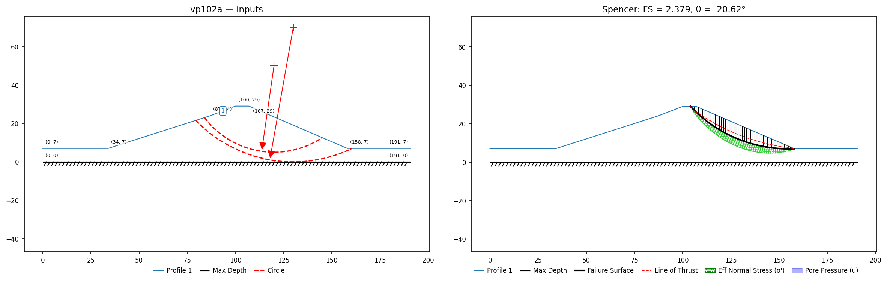
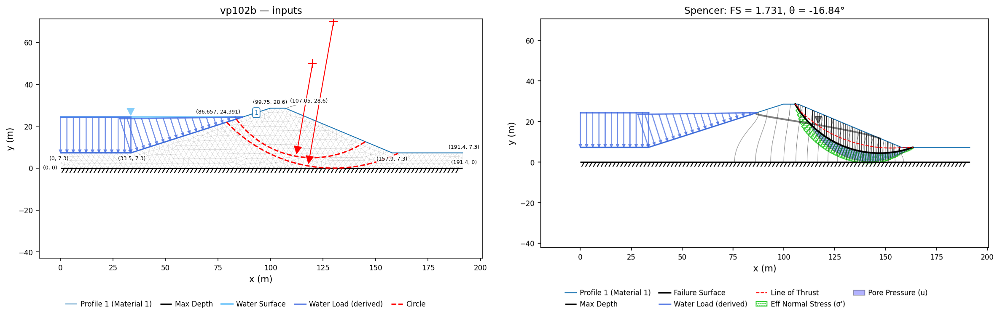
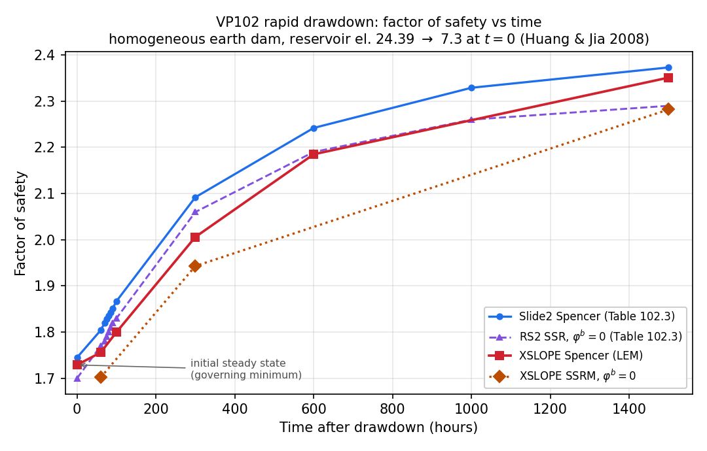

<!-- test: file=files/rocscience/vp102t_60.xlsx, type=circular_search, num_slices=40, fs_spencer=1.756, benchmark=VP102-t-60 -->
<!-- test: file=files/rocscience/vp102t_100.xlsx, type=circular_search, num_slices=40, fs_spencer=1.800, benchmark=VP102-t-100 -->
<!-- test: file=files/rocscience/vp102t_300.xlsx, type=circular_search, num_slices=40, fs_spencer=2.006, benchmark=VP102-t-300 -->
<!-- test: file=files/rocscience/vp102t_600.xlsx, type=circular_search, num_slices=40, fs_spencer=2.185, benchmark=VP102-t-600 -->
<!-- test: file=files/rocscience/vp102t_1500.xlsx, type=circular_search, num_slices=40, fs_spencer=2.351, benchmark=VP102-t-1500 -->

### VP103: Two-layer undrained slope — deep vs shallow mechanism {#vp103}

Slide #103 reproduces the headline case of [Guo & Griffiths (2020)](https://doi.org/10.1139/cgj-2019-0642):
an undrained embankment of strength cu1 resting on an undrained foundation of strength
cu2, over a firm base. The paper's subject is not a single factor of safety — it is *which
mechanism governs*. Two minima compete:

- a **deep** mechanism that cuts through the embankment and swings down through the foundation to
  the firm base, whose factor of safety rises with cu2; and
- a **shallow** mechanism confined to the embankment, riding along the layer interface, whose factor
  of safety does not depend on cu2 at all.

As the foundation is made stronger the deep branch climbs past the flat shallow branch and the
critical mechanism jumps from deep to shallow. The strength ratio at which they cross is the
paper's Pcrit = (cu2/cu1)crit.

**Geometry** (paper Figure 1a, at the paper's H = 18 m, cot β = 2.0, D = 2.0): crest 2H back from
the slope break, face 1V:2H, toe bench H beyond the toe, firm base at depth DH *below the crest*
(Taylor's depth factor). In coordinates: ground (0, 36)-(36, 36)-(72, 18)-(90, 18), layer interface
horizontal at el 18, base at el 0. **Materials** (manual Figure 103.2): cu1 = 60 kPa,
cu2 = 84 / 90 / 96 kPa — strength ratios P = 1.4 / 1.5 / 1.6 — with γ = 20 kN/m³ in both
layers and no water.

**Isolating the two modes.** Slide2 separates the minima with a multi-modal Particle Swarm search;
XSLOPE separates them with a `tangent_depth` window (the [RS2-61](rs2.md#rs2-61) precedent) — one
window in the foundation, one in the embankment — and refines each with the non-circular search from
a seed on that mode. The comparison is only fair if the surface freedom matches: Slide2 ran Particle
Swarm **with Surface Altering optimization**, so its reported surfaces are not circles.

**Input files:** [vp103a.xlsx](files/rocscience/vp103a.xlsx) (P = 1.4) ·
[vp103b.xlsx](files/rocscience/vp103b.xlsx) (P = 1.5) ·
[vp103c.xlsx](files/rocscience/vp103c.xlsx) (P = 1.6) ·
[vp103d.xlsx](files/rocscience/vp103d.xlsx) (P = 1.6, seeded on the shallow mode)

| Strength ratio P | Mode | XSLOPE Spencer, optimized | XSLOPE Spencer, circles only | Slide2 (PS + SA) |
|---|---|---|---|---|
| 1.4 | deep | **1.221** | 1.299 | 1.215 (uni-modal 1.216) (+0.5%) |
| 1.5 | deep | **1.298** | 1.379 | 1.290 (+0.6%) |
| 1.6 | deep | 1.374 | 1.458 | 1.366 (+0.6%) |
| 1.4 | shallow | 1.322 | 1.348 | *not reported* |
| 1.5 | shallow | 1.322 | 1.348 | 1.324 (−0.2%) |
| 1.6 | shallow | **1.322** | 1.348 | **1.315** (+0.5%) |

*(Bold marks the governing mechanism at that strength ratio. The shallow row is one solved file,
vp103d: the mechanism never enters the foundation, so its factor of safety is identical at all three
ratios — the circles-only column confirms this to four figures.)*

Every optimized value sits within 0.6% of Slide2, and the sign is the same throughout: XSLOPE runs
marginally high, as a coordinate-descent refinement from a single seed does against a swarm.

**Circles are not enough for the deep mode.** The circles-only column runs about 7% above Slide2 on
the deep mechanism but only 2% high on the shallow one, and the reason is the mechanism itself: the
deep surface wants to cut steeply through the weak embankment and then run long and flat through the
strong foundation, and no single circle does both. Guo & Griffiths make the same observation about
their own limit-equilibrium comparison — the method of slices "requires the critical mechanism to be
circular, while the FEM places no restriction on its shape." Releasing the shape closes the gap from
7% to 0.6%. The shallow mechanism is nearly circular already, so it barely moves.

**The transition.** With optimized surfaces the deep branch is critical at P = 1.4 (1.221 < 1.322)
and still critical at P = 1.5 (1.298 < 1.322), but has been overtaken by P = 1.6 (1.374 > 1.322).
The switch therefore falls between 1.5 and 1.6 — interpolating the deep branch onto the shallow
plateau puts it at P ≈ 1.53. That is exactly the interval the manual reports ("the split into the
two failure modes must occur somewhere between the 1.5 and 1.6 ratios") and is one grid step above
the paper's finite-element value, Pcrit = 1.5 for cot β = 2.0 and D = 2.0. At the
crossing XSLOPE gives FS ≈ 1.32 for both mechanisms against the paper's FS ≈ 1.35.

Restricted to circles the crossing moves *down*, to between 1.4 and 1.5 — a reminder that on a
two-layer undrained slope the choice of surface family changes not just the factor of safety but
which mechanism is predicted to govern.

*The paper itself is not a source of locked values here: apart from the Pcrit table it
publishes its factors of safety as charts, and a chart read is not a reproducible numeric target.
The locks above are measured against the Slide2 values printed in the manual's §103.2 result
figures.*

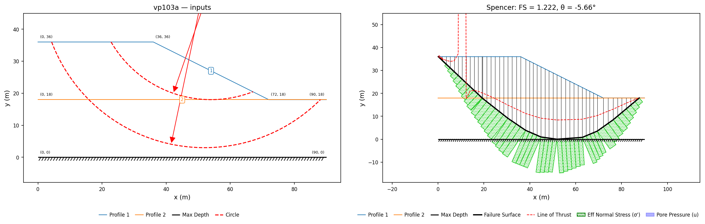

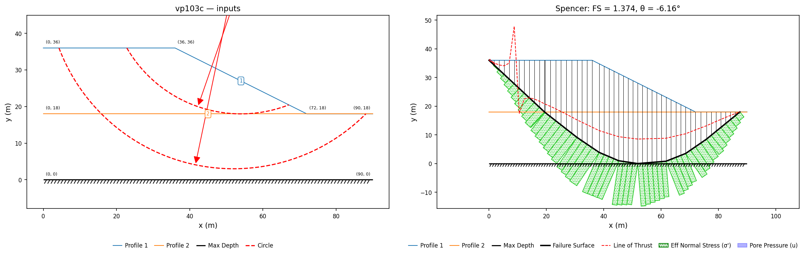

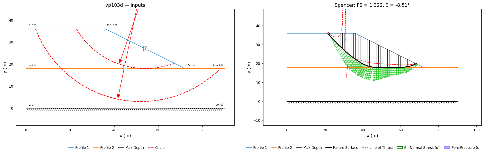

### VP104: Seismic slope with Newmark and multi-modal optimization {#vp104}

Slide #104 is built on Slide2's own *Tutorial 28 — Seismic Analysis with the Newmark Method*,
so the verification manual prints no geometry of its own. The model is a 10 m, 2:1 slope in
three layers over a horizontal base (soil 1: c = 0, φ = 38°; soil 2: c = 5.3 kPa, φ = 23°;
soil 3: c = 7.2 kPa, φ = 20°; all γ = 19.5 kN/m³), dry, with no external loads. The manual
runs four scenarios twice — once with multi-modal Particle Swarm + Surface Altering
optimization (MMO), which reports several distinct local minima, and once with the ordinary
uni-modal search — and prints both columns in Table 104.1.

**XSLOPE has no multi-modal search, and does not need one to verify this problem.** The two
published columns agree to about 0.1%, and the uni-modal column is exactly what an ordinary
circular search targets, so three of the four scenarios reproduce directly. (Where a *specific*
non-global mode is the question, `entry_range` / `exit_range` / `tangent_depth` windows isolate
it — see [RS2-61](rs2.md#rs2-61) — but that is not what this problem's numbers require.)

**Input files:** [vp104a.xlsx](files/rocscience/vp104a.xlsx) (no seismic) ·
[vp104b.xlsx](files/rocscience/vp104b.xlsx) (k = 0.15)

| Scenario | XSLOPE (Spencer) | Slide2 uni-modal | Slide2 MMO |
|---|---|---|---|
| No seismic | 1.372 | 1.360 (+0.9%) | 1.359 (+1.0%) |
| Seismic coefficient k = 0.15 | 0.989 | 0.980 (+0.9%) | 0.978 (+1.1%) |
| Critical acceleration | Ky = 0.144 | Ky = 0.140 (+2.9%) | Ky = 0.139 (+3.6%) |
| Newmark displacement | — *diagnostic, below* | 5.081 cm | 5.042 cm |

*All three built scenarios run about +0.9% high, in the same direction and by the same amount:
Slide2's Surface Altering optimization refines the surface shape away from a circle, so it
finds a slightly lower minimum than a circular search can. The critical acceleration follows
from that — a marginally stronger slope needs marginally more seismic load to reach FS = 1.
The critical-acceleration row is a `critical_kc` lock (the k at which the searched minimum
FS = 1), not a factor of safety.*

**The fourth scenario — permanent Newmark displacement — is reproduced as a diagnostic.**
The seismic record it needs is not printed in the verification manual, but it ships with the
product: the tutorial model the problem is built on (`Tutorial 28 Seismic.slmd`, a ZIP holding
one file per scenario) stores the whole time history inside its *Newmark Displacement*
scenario — 5862 samples at a uniform dt = 0.005 s spanning 0 to 29.305 s, labelled
*Mammoth Lakes-1 1980: CVK-090*, with peaks of −0.416 g and +0.342 g.

`benchmarks/rocscience/newmark_vp104.py` carries that record — transcribed from the model
file, and re-verifiable sample-for-sample against any Slide2 install's own copy — and
integrates it with the textbook rigid-block scheme: while the driving acceleration exceeds
the yield acceleration Ky the block accelerates relative to the ground at
(a − Ky)·g, one-way, and the relative velocity is integrated to a permanent
displacement.

| Ky | Rigid-block integration | Slide2 published |
|---|---|---|
| 0.139 — Slide2 MMO | 5.015 cm | 5.042 cm (−0.5%) |
| 0.140 — Slide2 uni-modal | 4.906 cm | 5.081 cm (−3.4%) |
| 0.144 — XSLOPE `critical_kc` | 4.496 cm | — |

Two things that table makes visible. First, the published pair is **non-monotone in
Ky** — the larger yield acceleration is printed with the larger displacement —
which no single integration of one record can produce, since displacement falls as
Ky rises. The two columns are two different critical surfaces whose Ky
is printed rounded to three decimals, and inverting each published displacement back through
the integration shows which of them the printed value supports: 5.042 cm implies
Ky = 0.1388, inside the rounding of the printed 0.139, while 5.081 cm implies
0.1384, outside the rounding of the printed 0.140. Only the multi-modal row can be scored
against a common integration, and it agrees to −0.5%. (The record is strongly asymmetric, so
the sliding polarity is a stated choice: the block slides under the negative-going
accelerations, which carry the larger peak. The opposite polarity gives 3.995 cm at
Ky = 0.139.)

Second, permanent displacement is far more sensitive to the yield acceleration than the
factor of safety is. XSLOPE's Ky runs +2.9% high for the reason above — a circular
search cannot follow Slide2's surface-altering optimization — and carried through the same
integration that 2.9% removes about 11% of the displacement. A displacement estimate inherits
and amplifies whatever error the yield acceleration carries, which is the practical reason the
yield acceleration is the quantity worth locking.

**Scope.** XSLOPE's seismic modelling is pseudo-static: a seismic coefficient in the
limit-equilibrium solve, plus the `critical_kc` search for the k at which the searched minimum
FS reaches 1. Displacement integration is not an analysis mode — the script above is a
benchmark diagnostic that takes a yield acceleration as an input and reads no XSLOPE model —
so the displacement row carries no locked value.

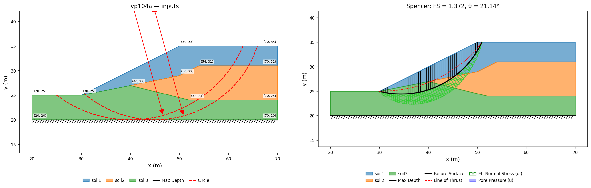

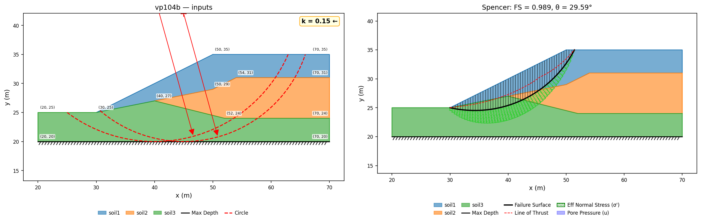

### VP105: Anisotropic strength surface {#vp105}

Slide #105 gives its material an **anisotropic strength function** — shear strength
that depends on the orientation of the slip surface relative to a fabric direction —
and searches it with multi-modal optimization.

XSLOPE has no orientation-dependent (dip-relative) strength model. Every material's
strength is a function of position and normal stress; nothing in the slice
formulation reads the direction the base of the slice runs. Until an anisotropic
strength option exists there is no input that expresses this problem, so there is
nothing to compare and no factor of safety to lock.

This is a strength-model gate, not a search gate: the multi-modal side of the problem
is already covered. [VP103](#vp103) separates two competing minima with
`tangent_depth` windows, and [VP104](#vp104) reproduces Slide2's multi-modal table
from an ordinary circular search. The same orientation-dependent strength gap blocks
[GeoStudio §2.47](geostudio.md).

### VP106: Support, Ito & Matsui pile {#vp106}

**Input files:** [vp106a.xlsx](files/rocscience/vp106a.xlsx) (no pile) ·
[vp106b](files/rocscience/vp106b.xlsx) / [c](files/rocscience/vp106c.xlsx) /
[d](files/rocscience/vp106d.xlsx) / [e](files/rocscience/vp106e.xlsx)
(D1/D = 2, 3, 4, 6)

Cai & Ugai (2000)'s pile-reinforced slope: a 10-m, 1V:1.5H dry cohesive-frictional slope
(γ = 20, c′ = 10, φ′ = 20) with a row of 0.8-m steel-tube piles at mid-slope, embedded to
bedrock, at center-to-center spacings of 2–6 diameters. The pile's stabilizing force is
the Ito & Matsui (1975) theoretical limit pressure, which XSLOPE computes automatically
from the pile diameter and spacing (the per-pile force is divided by the spacing to give
the per-meter-width value). The reaction is applied in the passive sense — added to the
resisting moment and divided by the factor of safety — which is how Slide applies it.

| Case | XSLOPE (Bishop search) | Slide | Cai & Ugai |
|---|---|---|---|
| No pile | 1.143 | 1.14 (+0.3%) | 1.13 (+1.2%) |
| D1/D = 2 | 1.540 | 1.54 (0.0%) | 1.54 (0.0%) |
| D1/D = 3 | 1.451 | 1.43 (+1.5%) | 1.37 (+5.9%) |
| D1/D = 4 | 1.341 | 1.33 (+0.8%) | 1.31 (+2.4%) |
| D1/D = 6 | 1.260 | 1.25 (+0.8%) | 1.25 (+0.8%) |

At the closest spacing (D1/D = 2) all three programs agree exactly: the pile force is
large enough that the critical surface avoids the pile entirely. At D1/D = 3 the published
values themselves spread — Slide sits 4.4% above the paper, a search-method difference the
manual acknowledges — and XSLOPE lands 1.5% above Slide but 5.9% above Cai & Ugai's own
value, the widest gap among this section's references. Every other case agrees with
Slide within 0.8% and with the originating paper within 2.4%.

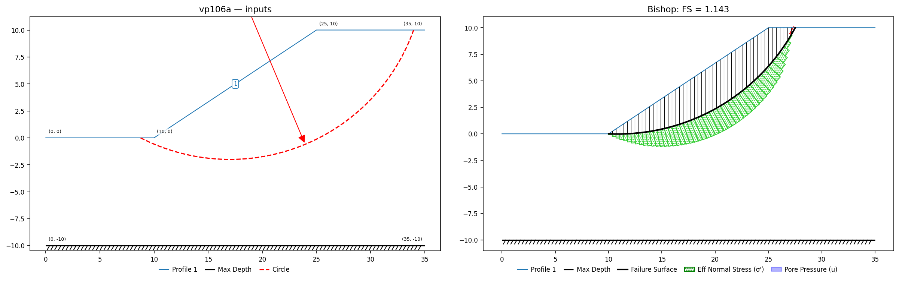
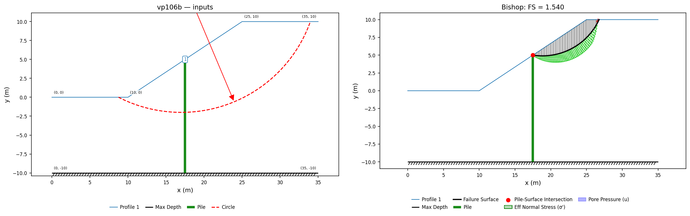
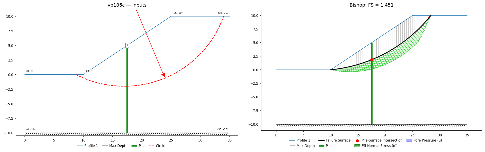
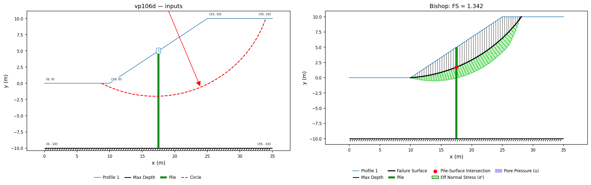
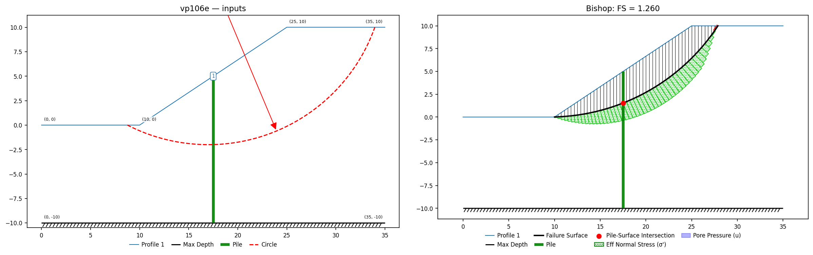

### VP107: Retaining walls, gabion walls, supports {#vp107}

**Input files:** [vp107a.xlsx](files/rocscience/vp107a.xlsx) (equivalent cohesion) ·
[vp107b.xlsx](files/rocscience/vp107b.xlsx) (mesh method)

Cao et al. (2016)'s case study of a Vancouver gabion-wall failure: a 6 m battered wall
of 1 m gabions (courses 4–3–3–2–2–1 wide) retaining a 30° backfill with a 12 kN/m²
crest surcharge and a water table rising into the retained slope. Slide models the
steel mesh two ways — an equivalent gabion cohesion (c = 100 kPa, from Grodecki 2017)
or explicit geosynthetic supports at every course interface (T = 71 kN/m, tangent,
active, anchored both ends) — and reports overall (external) stability only. Both
variants are evaluated on Slide's drawn critical circle, which passes about a metre
beneath the wall base.

| Variant | XSLOPE Bishop | Slide Bishop | XSLOPE Spencer | Slide Spencer |
|---|---|---|---|---|
| Equivalent cohesion | 1.382 | 1.373 (+0.7%) | 1.398 | 1.386 (+0.9%) |
| Mesh (geosynthetic supports) | 1.382 | 1.378 (+0.3%) | 1.398 | 1.392 (+0.4%) |

XSLOPE's unconstrained grid search finds the same deep basin at 1.366, within 0.5% of
Slide's limit-filtered search. The governing surface passes under the wall, so it
never crosses the mesh supports and the two representations coincide exactly on it —
the manual's own conclusion. (The mesh-variant file exercises the geosynthetic input
path; reinforcement mechanics are locked by VP87–VP94.) Slide's non-circular Cuckoo
search reports unfiltered minima of 1.032/1.034 for small surfaces at the wall face,
below the second limit set the manual applies to exclude them; those are not locked.

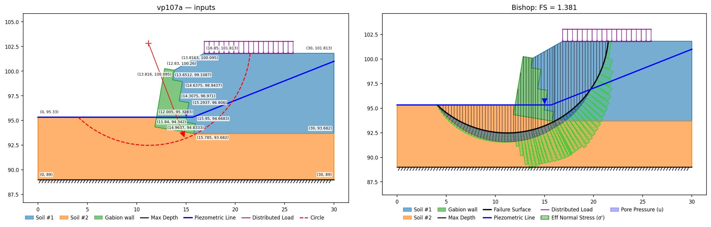
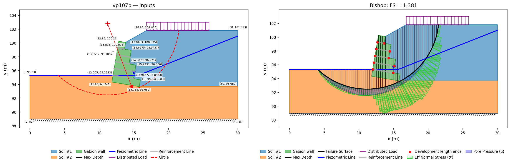

### VP108: Stepped gabion wall, steps facing outwards {#vp108}

**Input files:** [vp108a.xlsx](files/rocscience/vp108a.xlsx) (equivalent cohesion) ·
[vp108b.xlsx](files/rocscience/vp108b.xlsx) (mesh method)

A 4 m gabion wall of 1 m cubes (courses 4–3–2–1, staircase exposed on the outward
face, back face straight and partly embedded) on a sloping soil-1 over soil-2
profile, dry. As in VP107, Slide represents the steel mesh either as an equivalent
gabion cohesion (c = 59.7 kPa, Grodecki 2017 with f_t = 100 kN/m) or as explicit
geosynthetic supports (T = 100 kN/m) at the course interfaces. Both variants are
evaluated on Slide's drawn critical circles, which enter the crest behind the wall
and pass just beneath its base. The labeled points (16.453, 5.178) and
(18.573, 5.89) pin where the soil-1/soil-2 interface meets the wall base and
re-emerges one course up the back face — the bottom course's back is embedded in
soil 2.

| Variant | XSLOPE Bishop | Slide Bishop | XSLOPE Spencer | Slide Spencer |
|---|---|---|---|---|
| Equivalent cohesion | 1.790 | 1.787 (+0.2%) | 1.797 | 1.791 (+0.3%) |
| Mesh (geosynthetic supports) | 1.830 | 1.835 (−0.3%) | 1.835 | 1.839 (−0.2%) |

XSLOPE's unconstrained grid search finds 1.761 in the same basin, 1.5% below Slide's
limit-filtered grid search. The governing circles do not cross the mesh supports
(the two variants differ only through their slightly different critical circles), so
the mesh file's tag guards the geosynthetic input path rather than reinforcement
mechanics — VP87–VP94 lock those. Slide's unfiltered Cuckoo minima (1.512/1.522,
small wall-face surfaces) are excluded by the manual's own limit set.

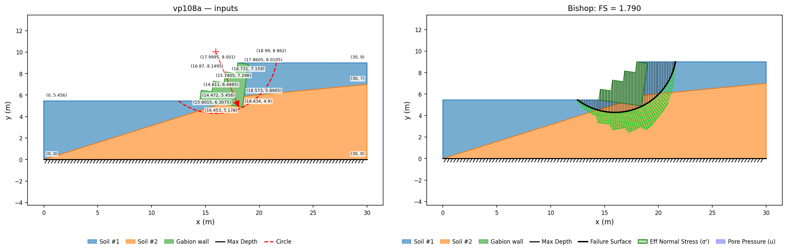
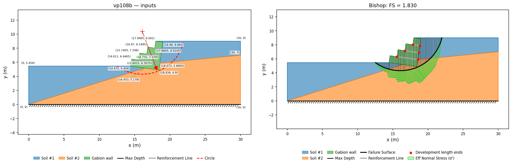

### VP109: Gabion wall with weak joint layers {#vp109}

**Input files:** [vp109.xlsx](files/rocscience/vp109.xlsx)

The VP108 wall with thin weak layers between the gabion courses representing
potential joint or shear failure through the wall: friction 90% of the gabion fill
(φ = 37.8°) and cohesion from the 20.4 kN/m joint tensile strength across the 1 m
gabion width (c = 20.4 kPa), modeled here as 6 cm bands carved from the wall at the
three course interfaces. Slide runs a block search along the layers with endpoint
limits that exclude small wall-hugging surfaces.

|  | XSLOPE (Fig 108.3 circle) | Slide (block search along joints) |
|---|---|---|
| Bishop | 1.790 | 1.799 (−0.5%) |
| Spencer | 1.797 | 1.803 (−0.3%) |

The joint layers do not govern overall stability: Slide's constrained block search
lands within 0.7% of the plain VP108 deep circle, which passes beneath wall and
bands alike, and XSLOPE's unconstrained circular search on the weak-layer model
agrees at 1.761. Slide's figure also reports an unfiltered block minimum of 1.516
for a small surface at the wall face, excluded by its limit set and not locked here.

### VP110: Equivalent fluid pressure wall support {#vp110}

Slide #110 verifies its **equivalent fluid pressure (EFP)** support type by showing
that it gives the same answer as the distributed load it stands for: the wall modelled
as an EFP support and the wall modelled as an explicit triangular pressure on the face
return the same factor of safety.

| Model (Slide's own equivalence check) | XSLOPE | Slide2 (Spencer) |
|---|---|---|
| EFP support | — *nothing to rebuild* | 2.566 |
| Explicit triangular face pressure | — *nothing to rebuild* | 2.566 |

The manual prints neither soil properties nor coordinates for the model — it is
Slide's own tutorial file — so there is nothing independent to rebuild and nothing to
lock.

The equivalence the problem demonstrates is, however, exactly how XSLOPE models an EFP
wall. The wall's restraint is entered directly as a boundary pressure: a triangular
distributed load over the face, through `dloads`. XSLOPE carries no separate EFP
support type because the distributed load *is* the model, and Slide #110 is the
demonstration that the two formulations coincide.

### VP111: Helical anchor — capacity note (no lock) {#vp111}

Slide's problem 111 verifies its helical-anchor **capacity envelope**, not a slope
analysis: for an anchor with three 0.2-m helices (1-m spacing, 0.1-m shaft), shaft
tensile capacity 85 kN, head capacity 80 kN, in soil with c′ = 15 kPa, φ′ = 35°,
γ = 20 kN/m³, the manual tabulates the available force as a function of where a slip
surface crosses the anchor — the minimum of three failure modes (plate pullout behind
the surface, stripping ahead of it, shaft tension), each from the Perko (2009)
plate-bearing formulas. Stripping governs (80 kN) for crossings in the first ~3 m,
plate pullout beyond (73.53 kN/m at the 3.5-m crossing for 1-m out-of-plane spacing),
tapering to zero at the tip. There is no slope and no factor of safety, so there is
nothing for XSLOPE to verify against.

**Analyzing helically anchored slopes in XSLOPE:** compute the governing capacity at
the expected slip-surface crossing — from the supplier's rating, an installation-torque
correlation, or the Perko formulas as above — divide by the out-of-plane spacing, and
enter the result as the tension capacity of a standard anchor/reinforcement line at the
anchor's geometry. This is the same value Slide's internal model would apply; only the
plate-bearing bookkeeping is external. The manual's Table 111.1 serves as the acceptance
test if an internal helical capacity model is ever added.
