# Rocscience Slide2 Groundwater Corpus

The [Slide2 Groundwater Verification Manual](https://www.rocscience.com/help/slide2/verification-theory/verification-manuals)
(Rocscience, 2022) verifies Slide2's finite-element groundwater engine against closed-form
solutions (Polubarinova-Kochina, Vedernikov, Terzaghi consolidation) and published numerical
benchmarks. This page compares XSLOPE's finite-element seepage solver against the same
21 problems. Each problem has a row in the summary table; each built problem has an XSLOPE
input file, a results section, and figures. The quantities compared are seepage-specific —
flow rates, free-surface positions, head and pressure profiles — rather than factors of
safety.

Full bibliographic details for the author-year citations on this page are on the
shared [References](references.md) page.

<!-- test: file=files/rocscience_gw/gw001.xlsx, type=seep, target_size=0.2, expected_flowrate=2.500e-05, tolerance=0.02, benchmark=GW1-q -->
<!-- test: file=files/rocscience_gw/gw001.xlsx, type=seep_head, target_size=0.2, points=2:2:4.052;4:2:4.150;6:2:4.030, tolerance=0.02, benchmark=GW1-h -->
<!-- test: file=files/rocscience_gw/gw002.xlsx, type=seep, target_size=0.10, expected_flowrate=4.534e-06, tolerance=0.02, benchmark=GW2-q -->
<!-- test: file=files/rocscience_gw/gw002.xlsx, type=seep_head, target_size=0.10, points=4:1:0.500;4.5:0.866:0.381;5:0:0.263;6:0:0.202, tolerance=0.01, benchmark=GW2-h -->
<!-- test: file=files/rocscience_gw/gw003.xlsx, type=seep, target_size=0.10, expected_flowrate=2.351e-05, tolerance=0.02, benchmark=GW3-q -->
<!-- test: file=files/rocscience_gw/gw003.xlsx, type=seep_head, target_size=0.10, points=0:-4:4.47;10:-4:3.40;14:-4:2.44;20:-4:1.05;30:-4:0.19, tolerance=0.05, benchmark=GW3-h -->
<!-- test: file=files/rocscience_gw/gw004.xlsx, type=seep, target_size=0.147, expected_flowrate=5.462e-06, tolerance=0.05, benchmark=GW4-q -->
<!-- test: file=files/rocscience_gw/gw006a.xlsx, type=seep, target_size=1.0, max_iter=2000, expected_flowrate=2.437e-07, tolerance=0.05, benchmark=GW6a-q -->
<!-- test: file=files/rocscience_gw/gw006a.xlsx, type=seep_head, target_size=1.0, max_iter=2000, points=26:0.05:7.40;26:2:7.47;26:4:7.52;26:6:7.66, tolerance=0.15, benchmark=GW6a-h -->
<!-- test: file=files/rocscience_gw/gw006b.xlsx, type=seep, target_size=1.0, max_iter=2000, expected_flowrate=1.639e-06, tolerance=0.05, benchmark=GW6b-q -->
<!-- test: file=files/rocscience_gw/gw006b.xlsx, type=seep_head, target_size=1.0, max_iter=2000, points=26:0.05:6.573;26:2:6.738;26:4:7.191;26:6:7.789, tolerance=0.05, benchmark=GW6b-h -->
<!-- test: file=files/rocscience_gw/gw006c.xlsx, type=seep, target_size=1.0, max_iter=2000, expected_flowrate=2.502e-08, tolerance=0.05, benchmark=GW6c-q -->
<!-- test: file=files/rocscience_gw/gw006c.xlsx, type=seep_head, target_size=1.0, max_iter=2000, points=26:0.05:5.602;26:2:6.056;26:4:6.678;26:6:7.478, tolerance=0.05, benchmark=GW6c-h -->
<!-- test: file=files/rocscience_gw/gw006e.xlsx, type=seep, target_size=1.0, max_iter=2000, expected_flowrate=1.686e-07, tolerance=0.05, benchmark=GW6e-q -->
<!-- test: file=files/rocscience_gw/gw006e.xlsx, type=seep_head, target_size=1.0, max_iter=2000, points=26:0.05:8.337;26:2:8.348;26:4:8.386;26:6:8.446, tolerance=0.05, benchmark=GW6e-h -->
<!-- test: file=files/rocscience_gw/gw009a.xlsx, type=seep, expected_flowrate=2.2985e-05, tolerance=0.05, benchmark=GW9a-q -->
<!-- test: file=files/rocscience_gw/gw009b.xlsx, type=seep, expected_flowrate=4.2885e-06, tolerance=0.05, benchmark=GW9b-q -->
<!-- test: file=files/rocscience_gw/gw010.xlsx, type=seep, target_size=0.25, max_iter=1500, expected_flowrate=6.07e-05, tolerance=0.05, benchmark=GW10-q -->
<!-- test: file=files/rocscience_gw/gw012.xlsx, type=seep, target_size=1.0, max_iter=1500, expected_flowrate=4.137e-04, tolerance=0.05, benchmark=GW12-q -->
<!-- test: file=files/rocscience_gw/gw013.xlsx, type=seep, target_size=1.0, max_iter=1500, expected_flowrate=2.087e-02, tolerance=0.05, benchmark=GW13-q -->

Problems 1–13 are steady-state. Problems 15–21 are **transient** (15–16 are
consolidation), solved with XSLOPE's
[transient seepage solver](../seep/transient.md) — the first three against
closed-form (or recomputed series) solutions:

- **15** — Terzaghi 1-D consolidation (single and double drainage), against the Eq 17.3 series.
- **16** — Pyrah two-layer consolidation, against a recomputed two-layer eigenfunction series.
- **21** — transient flow in a fully confined aquifer, against Ferris' erfc solution.
- **18** — transient flow through the GW6 earth dam (reservoir raised 4 m → 10 m, no drain),
  against the digitized Fig 20.5 toe-slope profile.
- **17** — the same dam with a toe drain, against the Fig 19-5 total-head contours (qualitative).
- **19** — transient flow below a lined lagoon as the pond is filled, against the Fig 21.9
  top-boundary pressure profile (qualitative).
- **20** — transient flow through the GW7 layered slope as rainfall switches on, against the
  Fig 22.7 query-line profile (qualitative).

Problems **17–20** add a Mualem–van Genuchten unsaturated-conductivity fit — 17/18
also a reservoir boundary applied only where the face is submerged, 19/20 a stepped pond head
and a stepped rainfall flux. Their published targets are figures rather than closed forms, so
those four comparisons are qualitative. One modelling difference applies to all of them:
Slide2 defines independent conductivity and water-content curves, while XSLOPE fits a single
van Genuchten curve to both, which shifts transient timing slightly.

The transient problems compare the head and pressure field as it evolves, not a factor of safety: a
transient head field does not change an FS on its own (rainfall-triggered failure would
additionally need an unsaturated shear-strength model such as Fredlund's $\phi^b$), and rapid
drawdown — the classic transient stability case — is handled by the staged Duncan & Wright
procedure. These problems exercise the seepage engine's storage and time-stepping directly.

Problems 1, 7, 8 and 14 apply a uniform infiltration rate to the ground surface, which has no
fixed-head equivalent. These require a
[specified-flux (Neumann) boundary condition](../seep/overview.md#specified-flux-boundary-conditions-neumann),
which the solver supports. Three of them — **1** (Dupuit recharge mound), **7** (Rulon &
Freeze layered slope) and **8** (ditch-drained aquifer) — are built on that boundary. The fourth,
**14**, is blocked for a different reason: its published quantity is the Gardner
(1958) capillary profile, which is derived for the *exponential* conductivity law
$k = k_s\,e^{\alpha\psi}$ — a law XSLOPE does not implement (its `gard` option is the power form
$k_r = 1/(1 + a\,\psi^n)$ that SEEP/W and Slide carry, a different function). With no exponential
law and no tabulated Slide value to compare against (the manual prints only Fig. 14.3/14.4 charts),
no comparable published value remains beyond the one-dimensional through-flux, which is
verified to machine precision.

## Status

**Match to the published value**

| Symbol | Meaning |
|---|---|
| 🟢 | within 3% of the vendor and/or reference figure |
| 🟡 | 3–6% |
| 🔴 | more than 6% |
| 🟣 | in progress |
| ⊘ | insufficient data or out of scope |

The dot scores the **match quality of what is locked**, not how much of a problem is built; the partial/blocked detail is in the row text.

Status values follow the [shared vocabulary](rocscience.md)
used across this section (**built**, *covered*, *partial*, *planned*, *blocked*,
*no lock possible*, *not supported*).

| # | Match | Problem | Results | Notes |
|---:|:-:|---|---|---|
| [1](#gw1) | 🟢 | Shallow unconfined flow with rainfall | Crest x_a ≈ 4.1 vs Slide 4.06 (~0.05 m) · h_max 4.61 vs Slide 4.49 (~0.12 m) · Q = P·L = 2.5×10⁻⁵ locked | slightly-high free-surface family, above Haar's Dupuit closed form (SEEP2D cross-check) |
| [2](#gw2) | 🟢 | Flow around cylinder | Solved heads within 0.0013 m of Slide at every printed point · closed form matched within its own idealization error | |
| [3](#gw3) | 🟢 | Confined flow under dam foundation | Head profiles under and beyond the dam within 0.08 m of the published Rushton & Redshaw / Slide chart everywhere | |
| [4](#gw4) | 🟡 | Steady unconfined flow through earth dam | Phreatic surface within 1–2% of the Kozeny basic parabola over the dam body · drain-tip height y₁ 0.50 vs parabola 0.480 (+4.2%) · vs Slide 0.442 (+13.1%) | the published pair itself spreads 9% |
| [5](#gw5) | ⊘ | Unsaturated flow behind an embankment | | *no lock possible* — qualitative contours only, nothing numeric published |
| [6](#gw6) | ⊘ | Steady-state seepage through saturated–unsaturated soils | Pressure head along line 1-1: cases 2 and 5 reproduce the Slide/F&R curve almost exactly · cases 1 and 3 sit ~0.3–0.5 m high (mesh- and fit-insensitive; the published Slide/Ref[1] themselves scatter ~1.5 m near the crest on case 3) | **built** (4 of 5 cases); chart-only target, locked on XSLOPE's own field |
| [7](#gw7) | ⊘ | Seepage within layered slope | Water table at the toe el 0.30 vs the stated Slide / Rulon & Freeze 0.3 m (0.00 m) · perched zone and slope-face spring reproduced · Q = q·L = 1.68×10⁻⁴ locked | **built** (caveat); chart-only targets, so only the flowrate is locked |
| [8](#gw8) | 🔴 | Flow through ditch-drained soils | Flux boundary exact — total inflow = *q*·*L*, the confined response matching the closed form to six figures · water table at the symmetry edge 0.025 m vs Slide / Gureghian ≈0.25 m (≈10× too small — the published contours cannot be reproduced from the manual's printed inputs) | **built** (discrepancy); only the flowrate is locked |
| [9](#gw9) | 🟢 | Seepage through dam | Dam 1: Q = 1.379×10⁻³ vs Slide 1.378×10⁻³ m³/(min·m) (+0.1%) · dam 2: Q = 4.29×10⁻⁶ vs Slide 4.23×10⁻⁶ m³/(s·m) (+1.4%) | **built** (both dams); body k read from Bowles (1984) Fig E9-2b, not the Chapuis caption |
| [10](#gw10) | 🟢 | Steady unconfined flow, van Genuchten permeability | Q = 6.070×10⁻⁵ vs Slide 6.066×10⁻⁵ (+0.1%) · vs Clement 6.076×10⁻⁵ (−0.1%) · phreatic exit el. 4.87 vs Slide 5.0 (−0.13 m) · vs Clement 4.8 (+0.07 m) | |
| [11](#gw11) | 🔴 | Earth/rock-fill dam, Gardner permeability function | Free-surface release point el. 17.90 (17.8 ± 0.15 across the mesh sweep) vs Slide 19.40 (−1.50 m) · vs ABAQUS 19.64 (−1.74 m) | **built** (case 1 of 2, discrepancy); only the flowrate is locked |
| [12](#gw12) | 🟢 | Seepage from a trapezoidal ditch into a deep drainage layer | Q = 4.137×10⁻⁴ vs Slide 4.093×10⁻⁴ (+1.1%) · vs Vedernikov theory 4.0×10⁻⁴ (+3.4%) · flow-bulb half-width ≈42 vs Slide 41 (+1) · vs theory 40 (+2) | |
| [13](#gw12) | 🟢 | Seepage from a triangular ditch into a deep drainage layer | Q = 2.087×10⁻² vs Slide 2.050×10⁻² (+1.8%) · vs Vedernikov theory 2.0×10⁻² (+4.4%) | |
| [14](#gw14) | ⊘ | Unsaturated soil column | | *blocked* — the closed form assumes an exponential conductivity law XSLOPE does not implement |
| [15](#gw15) | 🟢 | 1-D consolidation, uniform initial excess pore pressure | Isochrones within ≈0.3% of u₀ of the Terzaghi Eq 17.3 closed form | **built** (both cases) |
| [16](#gw16) | 🟢 | Pore pressure dissipation of stratified soil | Within ≈0.3–0.5% of u₀ of the recomputed Pyrah 1996 two-layer eigen-series | **built** (3 cases) |
| [17](#gw17) | ⊘ | Transient seepage, earth fill dam with toe drain | The near-steady field (locked at 500 h) reproduces the Fig 19-5 total-head contours qualitatively — reservoir 10 → drain 0, phreatic drawn to the toe · the 15 h transient frame is figured but not locked | **built** (near-steady); contour-only target, locked as a regression guard |
| [18](#gw18) | 🟡 | Transient seepage through an earth fill dam | Toe-slope total head at t = 0.6 h and near-steady within ≈0.2 m of the digitized Fig 20.5 profile | **built** (both frames); SWCC-mapping timing caveat on the early frame |
| [19](#gw19) | ⊘ | Transient seepage below a lagoon | Pressure head along the top boundary (Fig 21.9) is a chart-only target, so XSLOPE's own solved heads at interior stations are locked as a regression guard at the four report times (73 / 416 / 792 / 11340 min). | **built** (regression); SWCC-mapping timing caveat |
| [20](#gw20) | ⊘ | Transient seepage in a layered slope | Total head along a query line (Fig 22.7) is chart-only, so XSLOPE's own solved heads are locked as a regression guard at 4.6 / 31 / 208 s; the perched mound builds on the fine-sand lens toward the steady [GW7](#gw7) result. | **built** (regression); SWCC-mapping timing caveat |
| [21](#gw21) | 🟢 | Transient seepage through a fully confined aquifer | Within ≈0.02 ft of the Ferris erfc closed form at 600 hr | **built** (both cases) |

## Results

### GW1: Shallow unconfined flow with rainfall {#gw1}

**Input files:** [gw001.xlsx](files/rocscience_gw/gw001.xlsx)

Flow between two long parallel rivers 10 m apart (Haar 1990; the Dupuit–Forchheimer
recharge problem), the manual's first specified-flux case. A 10 × 5 m block (base
impermeable, ground surface at el 5) with river heads h₁ = 3.75 m on the left edge and
h₂ = 3.0 m on the right, a uniform rainfall P = 2.5×10⁻⁶ m/s infiltrating the top, and
k = 1×10⁻⁵ m/s. The recharge builds an **internal** free surface that mounds above both
river levels; there is no daylighting seepage face, so the top edge is declared both the
flux boundary and an (inactive) exit face — the device that puts the solver on the
unsaturated free-surface path the internal mound needs. The free-surface position is set
by mass balance, independent of k and of the unsaturated model.

| Quantity | XSLOPE | Slide | Haar eqs 1.2–1.3 |
|---|---|---|---|
| x_a (crest position) | ≈ 4.1 | 4.06 (~0.05 m) | 3.98 (+0.12 m) |
| h_max (crest elevation) | 4.61 | 4.49 (+0.12 m) | 4.25 (+0.36 m) |
| Q (m³/s per m) | 2.500×10⁻⁵ | — | P·L = 2.5×10⁻⁵ (0.0%) |

The mound crest lands within ~0.05 m of Slide in position and ~0.12 m in height — XSLOPE
sits a touch above Slide, the same slightly-high free-surface bias the
[SEEP2D cross-check](#seep2d-crosscheck) documents across this panel; both finite-element
solutions sit above Haar's Dupuit closed form, which neglects the vertical flow the FE
models resolve near the crest. The flowrate lock is Q = P·L = 2.5×10⁻⁵ (exact by
construction, since all the rain enters and drains to the rivers); a head regression at
three interior stations guards the mound shape, which the flux total alone does not.

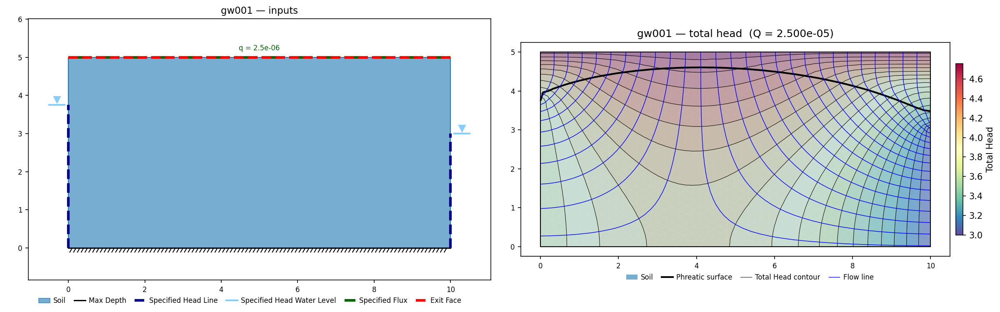

### GW2: Flow around cylinder {#gw2}

**Input files:** [gw002.xlsx](files/rocscience_gw/gw002.xlsx)

Confined potential flow past a cylinder (Streeter's closed form; Desai & Kundu's finite
elements): a half-domain 8 × 4 m with a semicircular notch of radius 1 m at the bottom
center and fixed heads of 1.0 and 0.0 on the vertical edges. The domain is fully
saturated, and the head field in homogeneous confined flow is independent of the
conductivity, so the problem is determined by geometry and boundary heads alone.

| Point | XSLOPE | Slide | Closed form | Desai & Kundu |
|---|---|---|---|---|
| (4, 1) | 0.500 | 0.500 (0.000 m) | 0.500 (0.000 m) | 0.500 (0.000 m) |
| (4.5, 0.866) | 0.381 | 0.381 (0.000 m) | 0.375 (+0.006 m) | 0.378 (+0.003 m) |
| (5, 0) | 0.263 | 0.263 (0.000 m) | 0.250 (+0.013 m) | 0.277 (−0.014 m) |
| (6, 0) | 0.202 | 0.203 (−0.001 m) | 0.188 (+0.014 m) | 0.213 (−0.011 m) |
| (8, 0) | 0.000 | 0.000 (0.000 m) | −0.031 (+0.031 m) | 0.000 (0.000 m) |

The two finite-element solutions agree with each other within 0.0013 m everywhere; both
depart from the closed form near the downstream edge, where the analytical solution
assumes an infinite domain (its −0.031 at the finite model's zero-head boundary measures
that idealization, not an error). Flowrate is locked as a regression value.

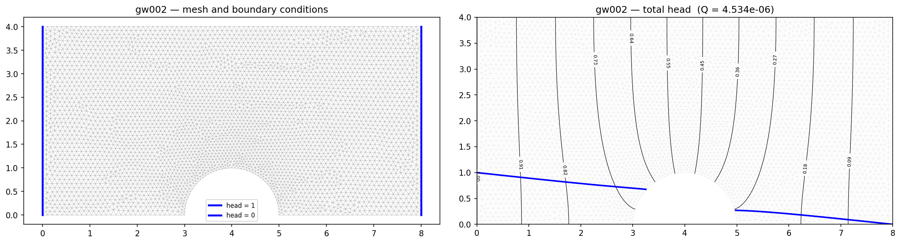

### GW3: Confined flow under a dam foundation {#gw3}

**Input files:** [gw003.xlsx](files/rocscience_gw/gw003.xlsx)

The classic flow-net problem (Rushton & Redshaw): a 40 × 10 m soil block with head 5 m
on the ground surface upstream of the dam (x = 0–8), head 0 downstream (x = 20–40), and
the dam base impervious between them.

| Station (line 1-1, y = −4) | XSLOPE | Rushton & Redshaw / Slide |
|---|---|---|
| x = 0 | 4.47 | 4.50 (−0.03 m) |
| x = 10 | 3.40 | 3.45 (−0.05 m) |
| x = 14 | 2.44 | 2.47 (−0.03 m) |
| x = 20 | 1.05 | 1.05 (0.00 m) |
| x = 30 | 0.19 | 0.20 (−0.01 m) |
| x = 40 | 0.08 | 0.07 (+0.01 m) |

| Profile | XSLOPE | Rushton & Redshaw / Slide |
|---|---|---|
| line 2-2 (x = 20), head span | 0.17–1.30 | 0.24–1.30 |

Heads along both published profile lines fall within 0.08 m of the chart everywhere
(Slide's markers coincide with Rushton & Redshaw's). The line 2-2 span is quoted as a
band rather than a delta: its lower end sits on the (20, 0) singularity discussed below,
where neither solution has a converged point value to difference.

This problem is solved on a finer mesh than the rest of the panel (`target_size` 0.1
rather than 0.4) because of the singularity at (20, 0), where the impervious dam base
meets the zero-head boundary. The head gradient is unbounded at that corner, so the
solution converges slowly in its immediate neighbourhood — the top of line 2-2 sits
right on top of it — while the rest of the domain is well resolved at any mesh size.
A coarse mesh reports a plausible number there for the wrong reason.

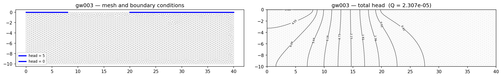

### GW4: Steady unconfined flow through an earth dam {#gw4}

**Input files:** [gw004.xlsx](files/rocscience_gw/gw004.xlsx)

Free-surface seepage through a small dam with a toe drain, against Kozeny's basic
parabola: reservoir head 4 m on the upstream face, a seepage exit face on the
downstream slope and drain end. The free-surface shape is independent of k.

| Quantity | XSLOPE | Slide | Kozeny parabola |
|---|---|---|---|
| Phreatic el. at x = 14 | 2.88 | — | 2.81 (+0.07 m) |
| Phreatic el. at x = 18 | 2.03 | — | 2.02 (+0.01 m) |
| Phreatic el. at x = 20 | 1.43 | — | 1.47 (−0.04 m) |
| y₁ at the drain | 0.50 | 0.442 (+0.06 m, +13.1%) | 0.480 (+0.02 m, +4.2%) |
| Q (m³/s per m) | 5.46×10⁻⁶ | — | k·y₁ = 4.80×10⁻⁶ (+13.8%) |

The solved phreatic surface tracks the parabola within 1–2% across the dam body. At the
drain tip the published values themselves spread 9% (Slide's measured 0.442 vs the
parabola's 0.480), and the parabola is an idealization exact only at the drain; XSLOPE's
0.50–0.53 across a mesh refinement (Q changing 2%) sits just above that band. The
flowrate lock exceeds the idealized k·y₁ (above) because the
parabola underestimates entry-face flow.

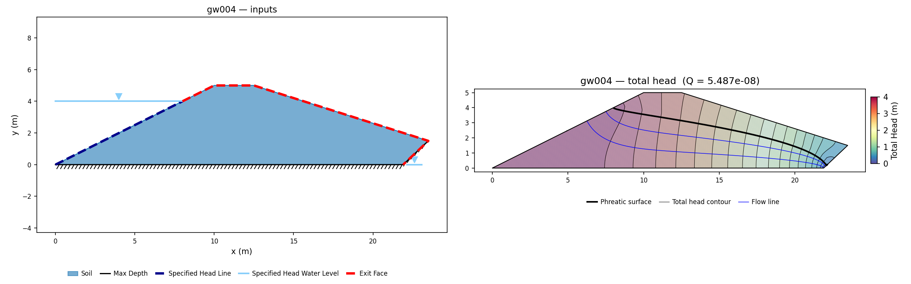

### GW5: Unsaturated flow behind an embankment {#gw5}

This problem is not built, because the manual publishes nothing numeric for it. Slide2's
unsaturated response behind an embankment is verified against FLAC, but the comparison is
presented qualitatively: pressure-head contours and flow lines are shown side by side and
reported to have "compared very well", with no tabulated head, pressure or discharge
anywhere in the write-up. There is no published quantity to lock a result against.

The geometry figure compounds it. It is unlabeled, so the domain would have to be
recovered by the axis-calibrated pixel measurement this corpus uses on unlabeled plates —
and that reconstruction is normally validated against the problem's printed solution
quantities, which here do not exist. A model could be built, but neither its geometry nor
its answer could be checked, so nothing about it would be verification.

### GW6: Steady-state seepage through saturated–unsaturated soils {#gw6}

**Input files:** [gw006a.xlsx](files/rocscience_gw/gw006a.xlsx) (case 1, isotropic) /
[gw006b.xlsx](files/rocscience_gw/gw006b.xlsx) (case 2, 9:1 anisotropy) /
[gw006c.xlsx](files/rocscience_gw/gw006c.xlsx) (case 3, core) /
[gw006e.xlsx](files/rocscience_gw/gw006e.xlsx) (case 5, seepage face)

This manual problem runs the same 12 m dam through five cases. The published target in every
case is the pressure-head profile along **line 1-1** (the crest centerline, x = 26) — a chart
curve (Figs 6.6 / 6.9 / 6.14 / 6.23) with no tabulated value — so, as the methodology note
allows for GW6/GW7, each case locks XSLOPE's own flowrate and total-head field. The case-2/3/5
material and boundary data were read verbatim from the vendor RS2 groundwater models
(`groundwater #006_02/03/05.slw` in the RS2 Groundwater zip): case 2's `condx:1 condy:0.111111`
(kₕ = 9e-7, k_v = 1e-7), case 3's 100×-lower core over the mesh's material-2 footprint (a
rectangle x ∈ [24, 28], y ∈ [0, 10]), and case 5's crest-plus-downstream-slope seepage face.

**Case 1 — isotropic dam with a 12 m horizontal drain.**

Fredlund & Rahardjo (1993)'s saturated–unsaturated earth dam (12 m high, symmetric 2:1
faces, reservoir at 10 m, a 12 m horizontal drain at the downstream toe), case 1:
isotropic conductivity. The conductivity function is digitized from the manual's chart
(ks = 10⁻⁷ m/s, air entry ≈ 9 kPa) and fit by a Mualem–van Genuchten curve; three fit
variants move the answer by less than 3 cm, so the fit is not the controlling
uncertainty. The published target is the pressure-head profile along the crest
centerline, where Slide's and Fredlund & Rahardjo's curves coincide within 0.2 m.

| Elevation on the crest line | XSLOPE pressure head | Slide | F&R |
|---|---|---|---|
| 0 | 7.40 | 7.15 (+0.25 m) | ≈7.3 (≈+0.10 m) |
| 2 | 5.47 | 5.15 (+0.32 m) | ≈5.3 (≈+0.17 m) |
| 4 | 3.52 | 3.25 (+0.27 m) | ≈3.4 (≈+0.12 m) |
| 6 | 1.66 | 1.30 (+0.36 m) | ≈1.45 (≈+0.21 m) |
| 8 | −0.22 | −0.60 (+0.38 m) | ≈−0.45 (≈+0.23 m) |

*The profile shape reproduces exactly; the whole curve sits 0.25–0.5 m above the
published pair, insensitive to the conductivity fit and to mesh refinement. This is a
family difference, not a solver error: run against SEEP2D (the original USACE/WES code)
on the identical mesh, boundary conditions and unsaturated law, XSLOPE's free surface
daylights at the same place — see [the SEEP2D cross-check](#seep2d-crosscheck) below. The
regression locks XSLOPE's own values.*

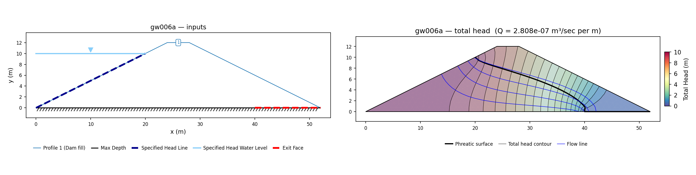

**Case 2 — anisotropic dam (kₕ = 9 kᵥ) with the horizontal drain.** The horizontal
conductivity is nine times the vertical (vendor `condx:1 condy:0.111111`, so kₕ = 9×10⁻⁷,
kᵥ = 10⁻⁷ m/s), which spreads the flow and lowers the phreatic surface; the unsaturated
relative shape is identical to case 1, so the same Mualem–vG fit is reused. Here XSLOPE
reproduces the published curve **almost exactly**:

| Elevation on line 1-1 | XSLOPE pressure head | Slide / F&R (Fig 6.9) |
|---|---|---|
| 0 | 6.52 | ≈6.5 (≈+0.02 m) |
| 2 | 4.74 | ≈4.7 (≈+0.04 m) |
| 4 | 3.19 | ≈3.2 (≈−0.01 m) |
| 6 | 1.79 | ≈1.85 (≈−0.06 m) |
| 8 | 0.42 | ≈0.4 (≈+0.02 m) |

Flowrate 1.639×10⁻⁶ m³/s per m (locked with the total-head field).

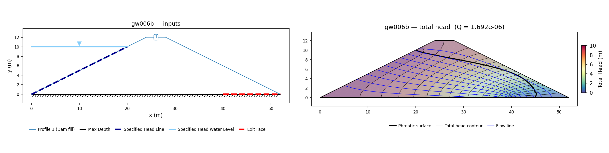

**Case 3 — isotropic dam with a low-permeability core and the horizontal drain.** A
rectangular central core (x ∈ [24, 28], y ∈ [0, 10], read from the vendor mesh's material-2
footprint) with saturated k = 10⁻⁹ m/s — 100× lower than the 10⁻⁷ shell — is tiled into the
dam as four non-overlapping polygons (three shell pieces + the core). The core forces almost
the whole head drop across its 4 m width (Fig 6.13's crowded contours), throttling the
flowrate to 2.502×10⁻⁸ m³/s per m. Along line 1-1 (now inside the core) XSLOPE reproduces the
profile shape and sits at the high end of the published scatter:

| Elevation on line 1-1 | XSLOPE pressure head | Slide (Fig 6.14) | Ref[1] |
|---|---|---|---|
| 0 | 5.55 | ≈5.9 (≈−0.35 m) | ≈5.8 (≈−0.25 m) |
| 2 | 4.06 | ≈3.9 (≈+0.16 m) | ≈3.9 (≈+0.16 m) |
| 4 | 2.68 | ≈2.1 (≈+0.58 m) | ≈2.1 (≈+0.58 m) |
| 6 | 1.48 | ≈0.4 (≈+1.08 m) | ≈0.7 (≈+0.78 m) |
| 8 | 0.28 | ≈−1.2 (≈+1.48 m) | ≈−0.3 (≈+0.58 m) |

*The published Slide and Ref[1] curves themselves diverge ~1.5 m near the crest; XSLOPE
tracks the shape and sits above both up high — the same +0.5 m free-surface family as case 1.
Locked at XSLOPE's own values.*

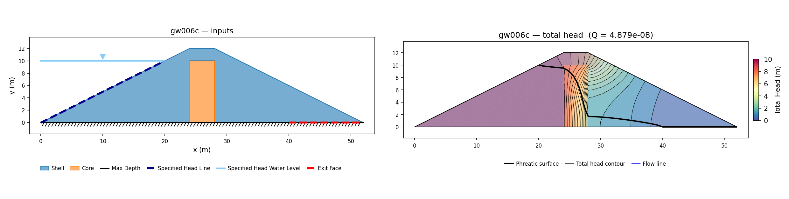

**Case 5 — isotropic dam with a downstream seepage face (no drain).** The horizontal toe
drain is replaced by the "unknown boundary condition": the crest and the whole downstream
slope are a seepage face where the phreatic surface may daylight (vendor seepage-face nodes
(22,11)→(50,1)). Without the drain the phreatic surface rides higher. XSLOPE again reproduces
the published curve **almost exactly**:

| Elevation on line 1-1 | XSLOPE pressure head | Slide / F&R (Fig 6.23) |
|---|---|---|
| 0 | 8.29 | ≈8.4 (≈−0.11 m) |
| 2 | 6.35 | ≈6.4 (≈−0.05 m) |
| 4 | 4.39 | ≈4.5 (≈−0.11 m) |
| 6 | 2.45 | ≈2.5 (≈−0.05 m) |
| 8 | 0.50 | ≈0.55 (≈−0.05 m) |

Flowrate 1.686×10⁻⁷ m³/s per m (locked with the total-head field).

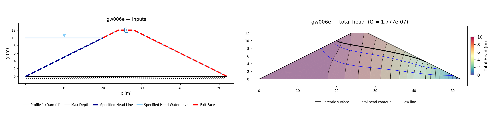

*Case 4 (steady-state infiltration, a 10⁻⁸ m/s flux over the whole dam surface) is not built:
a surface flux boundary combined with a downstream exit face does not converge.*

### GW7: Seepage within a layered slope {#gw7}

**Input file:** [gw007.xlsx](files/rocscience_gw/gw007.xlsx)

Rulon & Freeze's sandbox slope (after Fredlund & Rahardjo 1993): a medium-sand slope
holding a thin fine-sand lens. Geometry from the vendor RS2 model (a 2.4 × 1.0 m box, a
2:1 downstream slope from the crest at (1.6, 1.0) to the toe at (0, 0.2), and the fine
lens as the y = 0.6–0.7 band from the slope face to the right wall); conductivity curves
from the manual's Fig 7.2, fit here by Mualem–van Genuchten (medium ks = 1.4×10⁻³ m/s,
fine ks = 5.5×10⁻⁵ m/s). A uniform 2.1×10⁻⁴ m/s falls on the crest; the submerged toe is
a tailwater head of 0.3 m; the rest of the slope is a seepage face; base and right wall
are no-flow.

The infiltration rate exceeds the fine sand's saturated conductivity, so the recharge
cannot drain vertically through the lens: it **perches** a water table on top of the fine
band and sheds laterally to daylight as a slope-face spring — the physical result Rulon &
Freeze observed. XSLOPE reproduces it: the perched saturated zone above the lens (the
crowded head contours across the low-k band), the free surface daylighting on the slope,
and the main water table exiting at el 0.30 at the toe — the "0.3 m from the toe" the
manual reports.

| Quantity | XSLOPE | Slide / Rulon & Freeze |
|---|---|---|
| water table at the toe | el 0.30 | 0.3 m stated (0.00 m) |
| Q, m³/s per m | 1.680×10⁻⁴ | q·L = 1.68×10⁻⁴ (0.0%) |

Every published target is a chart curve — the water table (Fig 7.4) and the total-head
profiles along lines 1-1 and 2-2 (Figs 7.7, 7.8) — with no tabulated number, the same
situation the methodology note flags for GW6/GW7. So only the flowrate is locked
(Q = q·L, exact by construction on the flux boundary), with a three-station head
regression guarding the solved field. The conductivity fit shifts the unsaturated detail
but not the flowrate or the perched-table topology.

<!-- test: file=files/rocscience_gw/gw007.xlsx, type=seep, target_size=0.04, max_iter=1000, expected_flowrate=1.680e-04, tolerance=0.02, benchmark=GW7-q -->
<!-- test: file=files/rocscience_gw/gw007.xlsx, type=seep_head, target_size=0.04, max_iter=1000, points=1:0.1:0.518;2:0.1:0.642;2.2:0.3:0.657, tolerance=0.02, benchmark=GW7-h -->

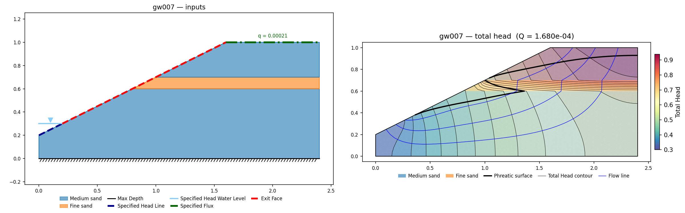

### GW8: Flow through ditch-drained soils {#gw8}

**Input file:** [gw008.xlsx](files/rocscience_gw/gw008.xlsx)

A ditch-drained two-layer aquifer after Gureghian (1981), and the corpus' exercise of the
[specified-flux boundary](#flux-crosscheck) — the whole problem is driven by rainfall
infiltration on the ground surface, so it cannot be posed at all without one. A half-drain
spacing of 1.0 m over an impermeable base at 0.5 m depth; a coarse Soil A in the lowest 0.1 m
(*k* = 1.11×10⁻³ m/s, Gardner *a* = 1000, *n* = 4.5) beneath a finer Soil B (*k* = 1.11×10⁻⁴ m/s,
*a* = 2777.7, *n* = 4.2); a uniform infiltration of 4.4×10⁻⁶ m/s on the top; the water-free
ditch as a seepage face on the left wall; base and right-hand symmetry edge no-flow.

**The flux boundary behaves exactly.** Total applied inflow is *q*·*L* = 4.400000×10⁻⁶ at every
mesh size; the confined form of the same model (fix the base, remove the seepage face) produces
a head rise of 0.016252 m against the one-dimensional hand calculation
*q*·(0.4/*k*B + 0.1/*k*A) = 0.016252 m, agreeing to six figures; and the
computed suction in the unsaturated zone lands on the Gardner gravity asymptote — with
*kr* = *q*/*ks* = 0.0396, the law gives ψ\* = 0.323 m, against a computed
−0.315 m. Reversing the sign of *q* inverts the response antisymmetrically. The reported flowrate
is *q*·*L* = 4.400000×10⁻⁶ to six figures at every mesh size tested, from 243 to 14 867 nodes.

**The published contours, however, do not follow from the printed inputs.**

| | XSLOPE | Slide / Gureghian (Figs 8.3, 8.4) |
|---|---|---|
| total head | 0.000 – 0.186 m | 0.05 – 0.29 m |
| pressure head, unsaturated zone | to −0.315 m | −0.10 to −0.20 m |
| water table at the symmetry edge | 0.025 m | ≈0.25 m (−0.225 m) |

The mound is about ten times too small, and this is not a solver error. A Dupuit calculation on
the layered aquifer gives an *upper bound* on the mound of √(*q*/*k*A) = 0.063 m —
generous, because it credits only the saturated transmissivity — which is already four times
below the published 0.25 m. The printed infiltration and the printed conductivities cannot
produce the published water table, whatever code solves them. Scaling *q*/*k* by ten reproduces
the charts closely (water table 0.256 m, minimum pressure head −0.162 m), which suggests the
manual's "4.4×10⁻⁶" may be a *per-node* discharge on its own mesh rather than a distributed
flux — but that is a conjecture, and the input file carries the printed values, untuned.

Only the flowrate is locked, on tri3: the total inflow is the one quantity here that is exact by
construction. No head values are locked, since XSLOPE's own head field disagrees with the
manual's published contours.

<!-- test: file=files/rocscience_gw/gw008.xlsx, type=seep, target_size=0.025, element_type=tri3, expected_flowrate=4.400e-06, tolerance=0.02, benchmark=GW8-q -->

### GW9: Seepage through dam {#gw9}

**Input files:** [gw009a.xlsx](files/rocscience_gw/gw009a.xlsx) (dam 1) ·
[gw009b.xlsx](files/rocscience_gw/gw009b.xlsx) (dam 2, toe drain)

Bowles' homogeneous dam, the flow-net textbook example re-solved numerically by Chapuis,
Chenaf & Bowles (2001) and by Slide: base 100 m, crest 10 m at el. 20 (2.5:1 upstream,
2:1 downstream), reservoir head 18.5 m, ks = 6.67×10⁻⁶ m/s with the manual's printed
8-point unsaturated conductivity table, fit here by a Mualem–van Genuchten curve
(α = 0.2835, n = 2.765).

| | XSLOPE | Slide | SEEP/W (fine) | Bowles (flow nets) |
|---|---|---|---|---|
| Q, m³/(min·m) | 1.379×10⁻³ | 1.378×10⁻³ (+0.1%) | 1.37×10⁻³ (+0.7%) | 1.10–1.28×10⁻³ |

**Dam 2 — Bowles' dam with a toe drain** (Bowles 1984, Example 9-2 / Fig E9-2b, p. 248;
Slide manual §9.2, Fig 9.5; Chapuis et al. 2001, Fig 5). Base 190 m; crest 10 m wide at
el. 45; symmetric 2:1 faces (upstream and downstream horizontal runs 90 m each); reservoir
head 40 m. A coarse toe drain (ks = 1.0×10⁻⁴ m/s) fills the downstream-toe triangle
(100, 0)–(190, 0)–(145, 22.5) — base 90 m, apex at mid-height of the downstream slope. The
body's saturated conductivity is ks = 2.0×10⁻⁷ m/s, carrying the dam-1 unsaturated k(u) curve.

| | XSLOPE | Slide | SEEP/W (2328 el.) | Bowles (flow net) |
|---|---|---|---|---|
| Q, m³/(s·m) | 4.29×10⁻⁶ | 4.23×10⁻⁶ (+1.4%) | 4.23×10⁻⁶ (+1.4%) | 3.8×10⁻⁶ (+12.9%) |

XSLOPE matches the two numerical benchmarks to 1.4% and Bowles' flow net to its graphical
accuracy. Note the units: dam 2 is worked per **second** (Bowles solves it in cm/s), where
dam 1 was per minute.

*Provenance.* The body conductivity comes straight from Bowles (1984), Example 9-2, Fig E9-2b:
the figure prints k = 2×10⁻⁵ cm/s = 2.0×10⁻⁷ m/s, and its flow net (n_f/n_d = 1.9/4) gives
q = k·h·n_f/n_d = 2.0×10⁻⁷ × 40 × 0.475 = 3.8×10⁻⁶ m³/(s·m) as an independent hand-check.
(Bowles' printed answer, 3.8×10⁻² m³/(s·m), applies the cm→m factor the wrong way in that same
line; the conductivity, head, and flow net are unambiguous.) Two errata in the secondary
sources are resolved by the figure:

- **Body k.** The 2.0×10⁻⁶ m/s in the Chapuis et al. (2001) Fig 5 caption is one decade high —
  a −6/−7 exponent slip. Bowles' value is 2.0×10⁻⁷ m/s, and the Slide manual's own Fig 9.6
  chart draws the earth-dam curve at ≈2×10⁻⁷.
- **Flowrate units.** The published Q, tabulated as m³/(min·m) beside dam 1, is actually
  m³/(s·m). Bowles 3.8×10⁻⁶ and Chapuis's SEEP/W and Slide 4.23×10⁻⁶ are all per second, and
  agree because all three used k ≈ 2×10⁻⁷ m/s.

Run at the caption's 2.0×10⁻⁶ m/s, XSLOPE returns 3.97×10⁻⁵ m³/(s·m) — an order of magnitude
above the published value (Q is nearly linear in k), which makes the exponent slip visible. The
locked value is XSLOPE's own Q at Bowles' conductivity, 4.29×10⁻⁶ m³/(s·m).

*Vendor check.* The RS2 Groundwater Verification set ships only `groundwater #009_01.fez`
(dam 1, no drain); the Slide manual's `Groundwater#09_2.sli` is not in the distributed model
set. Neither is needed — Bowles (1984) fixes the conductivity directly.

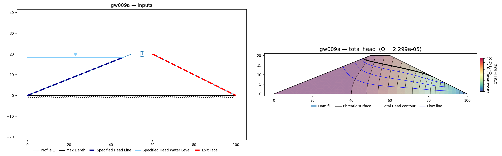

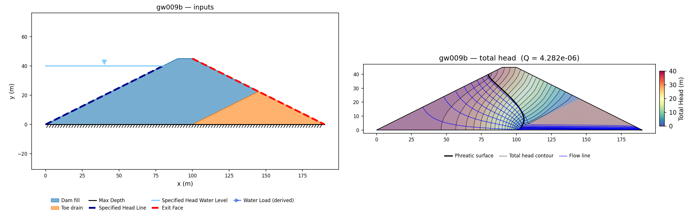

### GW10: Steady unconfined flow, van Genuchten permeability {#gw10}

**Input files:** [gw010.xlsx](files/rocscience_gw/gw010.xlsx)

Clement, Wise, Molz & Wen (1996)'s unconfined square domain, the manual's designated
van Genuchten test: a 10 × 10 m block with head 10 on the left edge, tailwater 2 on the
right, an exit face above the tailwater, and vG conductivity (α = 0.64, n = 4.65,
ks = 1.1574×10⁻⁵ m/s) — an exact capability match for the solver's `vg` option.

| | XSLOPE | Slide | Clement et al. |
|---|---|---|---|
| Q (m³/s per m) | 6.070×10⁻⁵ | 6.066×10⁻⁵ (+0.1%) | 6.076×10⁻⁵ (−0.1%) |
| Phreatic exit elevation | 4.87 | 5.0 (−0.13 m) | 4.8 (+0.07 m) |

The manual's "seepage face" column tabulates the phreatic exit *elevation* (both
published figures show the free surface exiting near el. 4.9–5.0), not a face length.
Only the tailwater-2 case carries published numbers and is locked.

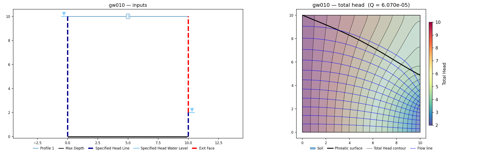

### GW11: Earth/rock-fill dam, Gardner permeability function {#gw11}

**Input file:** [gw011.xlsx](files/rocscience_gw/gw011.xlsx)

A 45 m homogeneous earth/rock-fill dam after Zhang et al. (2001), and the manual's dedicated
test of the **Gardner** relative-conductivity function, $k_r = 1/(1 + a\,\psi^n)$, with the
published $a$ = 0.15 and $n$ = 6. Crest 17 m, upstream run 89.1 m, downstream run 76.9 m,
impermeable base; reservoir at el. 40 m, no tailwater; the whole downstream slope is an exit
face. The published quantity is the **release point** — the elevation at which the free surface
daylights on the downstream face.

| | release point |
|---|---|
| XSLOPE (Gardner `unsat=gard`, `target_size` = 1.0) | 17.90 m |
| Slide | 19.397 m (−1.50 m) |
| ABAQUS (Zhang et al.) | 19.64 m (−1.74 m) |

*XSLOPE releases about 1.5 m low, and the difference is unexplained.*

The unsaturated conductivity model is not the cause. This problem is the manual's Gardner test,
and the Gardner law gives the same release point (≈17.4 m) as the van Genuchten and
linear-front laws. Nor is it discretization or the relative-conductivity floor:

| `target_size` | nodes | release point |
|---|---|---|
| 2.0 | 1,338 | 17.79 m |
| 1.0 | 5,317 | 17.90 m |
| 0.6 | 14,621 | 17.76 m |

There is no trend with refinement, and at the finest mesh the next face node *above* the
release point sits at 18.06 m — still 1.3 m below Slide, so the gap is not a nodal-resolution
artifact. The release point is identical to three decimals for $k_{r,\min}$ = 10⁻⁴, 10⁻⁶ and
10⁻⁸.

Two notes on reading the manual. Its text gives the downstream slope as 1:1.171, but the
printed dimensions on Fig. 11.1 give 76.9/45 = 1.709 — a digit transposition. The figure's
dimensions are used here (they also agree with a direct measurement of the plate), and they are
the *more favourable* read: the text's slope releases at 16.54 m, lower still. Separately,
$k_s$ is not printed for this case; because the dam is homogeneous the free-surface position is
independent of $k_s$, so it does not affect the published target, but it does set the discharge —
which is why the regression tag below locks XSLOPE's own flowrate rather than a published one.

GW11 is the single exit-face problem in this panel where XSLOPE releases low. The
[SEEP2D cross-check](#seep2d-crosscheck) below puts XSLOPE on the *same* release point as the
original USACE code on every other exit-face problem, so the difference is specific to this
problem rather than a family-wide convention difference. Case 2 of the manual's
problem (the zoned dam with a foundation and toe drain) is not built.

<!-- test: file=files/rocscience_gw/gw011.xlsx, type=seep, target_size=1.0, max_iter=2000, expected_flowrate=7.814e-07, tolerance=0.05, benchmark=GW11-q -->

### GW12 / GW13: Ditch seepage into a deep drainage layer (Vedernikov) {#gw12}

**Input files:** [gw012.xlsx](files/rocscience_gw/gw012.xlsx) (trapezoidal) ·
[gw013.xlsx](files/rocscience_gw/gw013.xlsx) (triangular)

Vedernikov's closed-form solutions for steady seepage from a channel into a deep
drainage layer, modeled as half-domains by symmetry with the ditch perimeter at head 50
and the deep drain as head 0 on the base. The seepage detaches below the ditch and
descends as a bulb whose width the theory predicts.

| | XSLOPE | Slide | Vedernikov |
|---|---|---|---|
| Trapezoidal: Q per half | 4.137×10⁻⁴ | 4.093×10⁻⁴ (+1.1%) | 4.0×10⁻⁴ (+3.4%) |
| Trapezoidal: bulb half-width | ≈42 | 41 (+1) | 40 (+2) |
| Triangular: Q per half | 2.087×10⁻² | 2.050×10⁻² (+1.8%) | 2.0×10⁻² (+4.4%) |

The detached-bulb iteration converges cleanly at 1,500 free-surface iterations (the
`max_iter` tag key); the default 400 is not enough for these geometries.

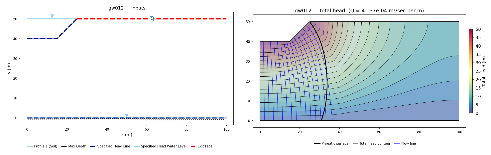

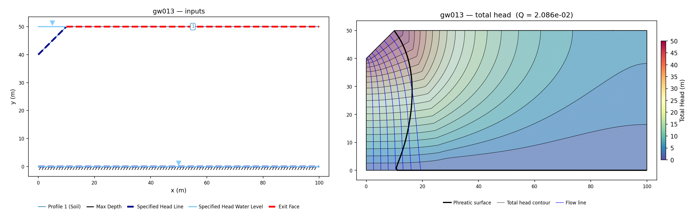

### GW14: Unsaturated soil column {#gw14}

The manual's steady capillary-profile problem, after
[Gardner (1958)](https://doi.org/10.1097/00010694-195804000-00006): a soil column of length
L = 1 m with ks = 10⁻⁷ m/s and α = 1 m⁻¹, carrying a steady vertical flux
ν = ±8.64×10⁻⁴ m/d = ±10⁻⁸ m/s — evaporation drawing water up, or infiltration pushing it
down — whose steady suction profile Gardner solves in closed form.

The problem is blocked because the published profile and XSLOPE's conductivity model are not
the same function. Gardner's analytical profile is derived for the **exponential**
conductivity law k = ks·e^(αψ), and the vendor RS2 model is configured to match it
(`conductivity: Gardner, α = 1`). XSLOPE does not implement that law: its `gard` option is
the power form kr = 1/(1 + a·ψⁿ), the Gardner-named function that SEEP/W and Slide carry,
which is a different function from the exponential one the closed form assumes. Fitting the
one to the other would change the quantity under test rather than verify it.

Nor is there a vendor number to fall back on. The manual publishes only the Fig 14.3/14.4
charts for this problem, with no tabulated Slide value, so there is nothing numeric to
compare a differently-shaped profile against. What remains lockable is a 1-D through-flux,
which the [flux cross-check](#flux-crosscheck) already verifies to machine precision.

## Transient problems {#transient}

The three transient problems below exercise XSLOPE's uncoupled
[transient seepage solver](../seep/transient.md). Each has a **closed-form** target (Terzaghi, Ferris) or a **recomputed
analytical series** (Pyrah's two-layer consolidation), so the lock is the analytical value
itself and the tolerance only absorbs the numerical (mesh + backward-Euler) error, which is
reported for each.

All three are modelled as **saturated** columns/strips. The excess pore pressure (or aquifer
head rise) is carried on an arbitrary datum offset — a constant baseline head $h_\text{ref}$
added to every node — so the pressure head stays positive everywhere and the storage is $S_s$
throughout. The offset cancels out of the excess head $h-h_\text{ref}$, which is the physical
quantity; it only selects the solver's saturated branch, where the governing equation is exactly
the linear diffusion $\partial h/\partial t = (K/S_s)\nabla^2 h = c_v\nabla^2 h$. The uniform
non-steady initial condition is set with a repeated-time **step series**: the boundary head
holds the initial value at $t=0$ (so the solver's $t=0$ steady solve produces the uniform IC)
and steps to the drained value for $t>0$. No initial-field input is needed — the `tseep`
sheet alone defines the transient model.

### GW15: Terzaghi 1-D consolidation {#gw15}

**Input files:** [gw015a.xlsx](files/rocscience_gw/gw015a.xlsx) (double drainage) ·
[gw015b.xlsx](files/rocscience_gw/gw015b.xlsx) (single drainage)

The manual's designated consolidation test: a 1 m clay column with a uniform initial excess
pore pressure $u_0$ dissipating by one-dimensional flow. Case 1 drains at **both** faces
(drainage path $H=0.5$ m); case 2 drains at the **top only** over an impermeable base
($H=1.0$ m). The excess pore pressure follows Terzaghi's (1943) Eq 17.3,

$$ \frac{u_e}{u_0}=\sum_{m=0}^{\infty}\frac{2}{M}\sin\!\left(M Z\right)e^{-M^2 T_v},
\qquad M=\tfrac{\pi}{2}(2m+1),\quad T_v=\frac{c_v t}{H^2}, $$

with the normalized depth $Z=z/H$ measured from a drained face. The material is
$m_v=0.01\ \text{kPa}^{-1}$, $k=10^{-5}$ m/s, giving $S_s=\gamma_w m_v=0.0981\ \text{m}^{-1}$ and
$c_v=k/S_s=1.02\times10^{-4}\ \text{m}^2/\text{s}$ (the published target is dimensionless, so
$c_v$ only sets the real-time scale).

XSLOPE reproduces the isochrones (below) at every interior sample point and time:

| Case | Drainage path $H$ | Δ vs Terzaghi Eq 17.3 (max over the sampled depths and times) |
|---|---|---|
| 1 — drained at both faces | 0.5 m | 0.20% of $u_0$ |
| 2 — drained at the top only | 1.0 m | 0.34% of $u_0$ |

The tags lock the closed-form total head
$h_\text{ref}+u_0\,(u_e/u_0)$ at three depths and two time factors per case, tolerance 0.6 m.

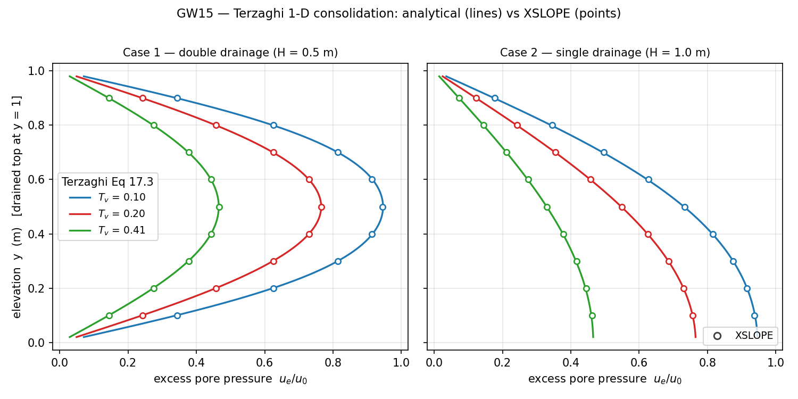

<!-- test: file=files/rocscience_gw/gw015a.xlsx, type=tseep_head, target_size=0.02, time=500, points=0.125:0.25:154.766;0.125:0.5:176.533;0.125:0.75:154.766, tolerance=0.6, benchmark=GW15a-t500 -->
<!-- test: file=files/rocscience_gw/gw015a.xlsx, type=tseep_head, target_size=0.02, time=1000, points=0.125:0.25:132.924;0.125:0.5:146.551;0.125:0.75:132.924, tolerance=0.6, benchmark=GW15a-t1000 -->
<!-- test: file=files/rocscience_gw/gw015b.xlsx, type=tseep_head, target_size=0.02, time=2000, points=0.125:0.25:170.955;0.125:0.5:154.766;0.125:0.75:129.887, tolerance=0.6, benchmark=GW15b-t2000 -->
<!-- test: file=files/rocscience_gw/gw015b.xlsx, type=tseep_head, target_size=0.02, time=4000, points=0.125:0.25:143.010;0.125:0.5:132.924;0.125:0.75:117.821, tolerance=0.6, benchmark=GW15b-t4000 -->

### GW16: Pore-pressure dissipation in stratified soil {#gw16}

**Input files:** [gw016a.xlsx](files/rocscience_gw/gw016a.xlsx) (uniform) ·
[gw016b.xlsx](files/rocscience_gw/gw016b.xlsx) (A over B) ·
[gw016c.xlsx](files/rocscience_gw/gw016c.xlsx) (B over A)

Pyrah's (1996) two-layer consolidation column: a 1 m column, drained at the top and
impermeable at the base, of two 0.5 m layers with **the same coefficient of consolidation**
$c_v=1$ but different conductivity and compressibility — Soil A ($k=1$, $m_v=1$) and Soil B
($k=10$, $m_v=10$), in consistent units with $\gamma_w=1$. Because $c_v$ is uniform, the
dissipation is shaped entirely by the $k/m_v$ contrast at the layer interface, which is Pyrah's
point: **layer order matters even when $c_v$ does not.** Case 1 is a uniform column (a Terzaghi
check); cases 2 and 3 swap the layer order.

The analytical solution is a **recomputed eigenfunction series** rather than a digitized chart.
With equal $c_v$ the excess pore pressure satisfies $\partial u_e/\partial t=\partial^2
u_e/\partial z^2$ in both layers, so $u_e=\sum_n c_n Z_n(z)\,e^{-\beta_n^2 t}$ where the spatial
eigenfunctions $Z_n$ satisfy $Z'(0)=0$ (impermeable base), $Z(L)=0$ (drained top), and
continuity of head **and of Darcy flux** ($k\,\mathrm{d}Z/\mathrm{d}z$) at the interface. For
two equal-thickness layers this collapses to the eigenvalue equation
$k_\text{bot}\tan^2(\beta/2)=k_\text{top}$; the coefficients $c_n$ come from the
$S_s$-weighted projection of the uniform initial condition (all integrals in closed form). The
builder recomputes this series directly.

The layer-order labels follow the **upper/lower** reading ("A/B" = A on top). The eigen-series
and the solver use the identical assignment, so the comparison is order-independent; only the
match to Pyrah's Fig 18-3/18-4 depends on the convention.

XSLOPE tracks the recomputed series across all three cases:

| Case | Layer order | Δ vs the recomputed eigenfunction series (max over the sampled depths and times) |
|---|---|---|
| 1 | uniform column | 0.13% of $u_0$ |
| 2 | Soil A over Soil B | 0.33% of $u_0$ |
| 3 | Soil B over Soil A | 0.28% of $u_0$ |

The interface kink and the strong effect of layer order are clear in
the isochrones: with the low-permeability Soil A **on top** (case 2) the underlying Soil B stays
near its initial pressure far longer, while high-permeability Soil B on top (case 3) drains the
upper layer quickly. The tags lock the closed-form head at three depths and two times per case,
tolerance 4–6 m (of $u_0=1000$), with small time steps (`max_head_change_frac=0.005`) since the
residual error at the interface is temporal.

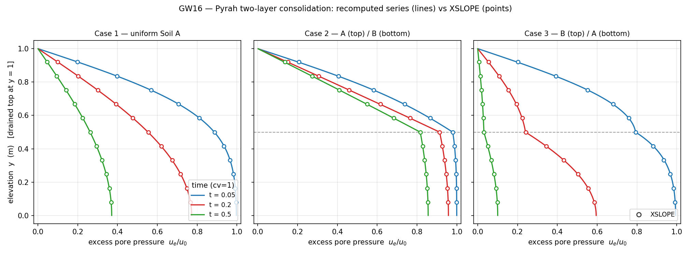

<!-- test: file=files/rocscience_gw/gw016a.xlsx, type=tseep_head, target_size=0.02, time=0.2, max_head_change_frac=0.005, points=0.25:0.25:816.227;0.25:0.5:653.176;0.25:0.75:402.084, tolerance=4.0, benchmark=GW16a-t0.2 -->
<!-- test: file=files/rocscience_gw/gw016a.xlsx, type=tseep_head, target_size=0.02, time=0.5, max_head_change_frac=0.005, points=0.25:0.25:442.557;0.25:0.5:362.188;0.25:0.75:241.899, tolerance=4.0, benchmark=GW16a-t0.5 -->
<!-- test: file=files/rocscience_gw/gw016b.xlsx, type=tseep_head, target_size=0.02, time=0.2, max_head_change_frac=0.005, points=0.25:0.25:1046.604;0.25:0.5:1013.431;0.25:0.75:562.623, tolerance=6.0, benchmark=GW16b-t0.2 -->
<!-- test: file=files/rocscience_gw/gw016b.xlsx, type=tseep_head, target_size=0.02, time=0.5, max_head_change_frac=0.005, points=0.25:0.25:945.851;0.25:0.5:916.037;0.25:0.75:512.850, tolerance=6.0, benchmark=GW16b-t0.5 -->
<!-- test: file=files/rocscience_gw/gw016c.xlsx, type=tseep_head, target_size=0.02, time=0.2, max_head_change_frac=0.005, points=0.25:0.25:601.928;0.25:0.5:340.125;0.25:0.75:255.692, tolerance=6.0, benchmark=GW16c-t0.2 -->
<!-- test: file=files/rocscience_gw/gw016c.xlsx, type=tseep_head, target_size=0.02, time=0.5, max_head_change_frac=0.005, points=0.25:0.25:181.529;0.25:0.5:131.238;0.25:0.75:119.462, tolerance=6.0, benchmark=GW16c-t0.5 -->

### GW17: Transient seepage through an earth fill dam with a toe drain {#gw17}

**Input files:** [gw017.xlsx](files/rocscience_gw/gw017.xlsx)

The same dam as [GW18](#gw18) but **with a 12 m toe drain** — a 0.5 m deep high-k strip
under the downstream toe ($x\in[40,52]$, $y\in[-0.5,0]$) held at total head 0 (the vendor's
$t_x=0$ drain nodes). The drain draws the phreatic surface down so the downstream slope
stays largely unsaturated and the flow concentrates into the drain. The reservoir is raised
4 m → 10 m at $t=0$ as in GW18. Storage $S_s=\gamma_w m_v=10\times0.003=0.03\ \text{m}^{-1}$,
$S_y=0.4-0.1=0.3$; the dam-fill $k(\psi)$ (a steeper 5-point Custom curve, $k_r$ down to
$10^{-5}$ by 20 m suction) is fit by Mualem–van Genuchten ($\alpha=0.232\ \text{m}^{-1}$,
$n=2.93$); the drain is a high-k ($0.36$ m/s) strip.

The published targets are total-head and pressure-head **contours** at 15 h and 16383 h
(Figs 19-4…19-7, vs FlexPDE and SEEP/W, Pentland et al. 2001) — chart-only, no tabulated
profile. XSLOPE's **near-steady** field (locked here at 500 h — the dam is steady by
$\approx300$ h) reproduces the published Fig 19-5 contours qualitatively: reservoir head 10
drawn down through the dam to the toe drain at total head 0, with the phreatic surface
descending to the drain. Its own solved heads at four interior stations are locked as a
regression guard.

The early 15 h transient frame is computed and figured but **not** locked against the
vendor: the vendor's steep Custom $k(\psi)$ curve suppresses flow through the initially-dry
downstream far more than our vG fit's $k_r$ floor, so XSLOPE's 15 h wetting front runs ahead
of RS2's — the SWCC-mapping timing caveat, larger here than in GW18 because the 15 h frame
is deep into the transient rather than near either steady end-member.

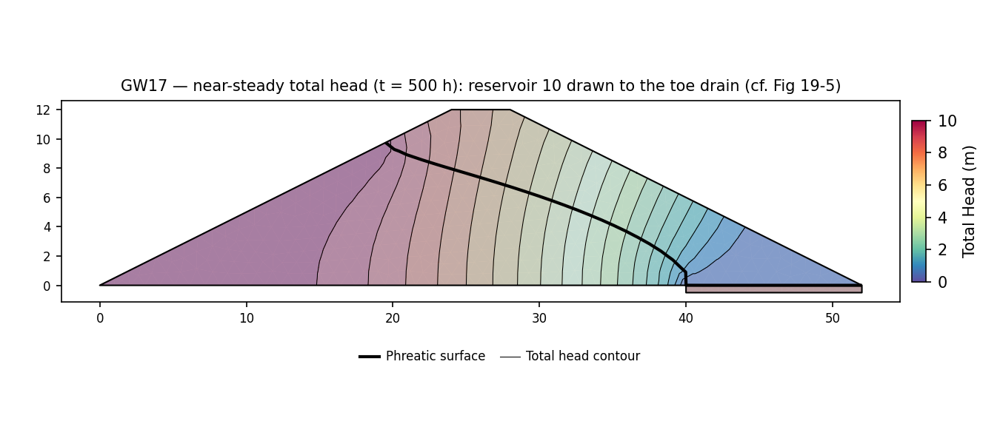

<!-- test: file=files/rocscience_gw/gw017.xlsx, type=tseep_head, target_size=1.5, time=500, max_head_change_frac=0.25, points=26:4:7.199;26:8:7.517;32:10:5.838;36:8:4.403, tolerance=0.15, benchmark=GW17-t500 -->

### GW18: Transient seepage through an earth fill dam {#gw18}

**Input files:** [gw018.xlsx](files/rocscience_gw/gw018.xlsx)

The Fredlund & Rahardjo (1993) 12 m earth-fill dam — the same body as the steady
[GW6](#gw6) family (base 52 m, 4 m crest, symmetric 2:1 faces) — with the reservoir
**quickly raised from 4 m to 10 m at $t=0$** and no drain. The phreatic surface rises
through the dam and daylights on the downstream (toe) slope, the free seepage face.
It adds a moving reservoir boundary and an unsaturated-conductivity fit on top of the storage
formulation the [consolidation problems](#gw15) lock.

Storage $S_s=\gamma_w m_v = 9.81\times0.002=0.0196\ \text{m}^{-1}$ (the vendor RS2 model
carries $m_v=0.002$; the manual *text* prints 0.003 — the model value is used, since it
is what produced RS2's own Fig 20.5 result), with drainable porosity
$S_y=\theta_s-\theta_r=0.7-0.4=0.3$. The dam-fill Custom $k(\psi)$ table (saturated
$k_s=3.6\times10^{-4}$ m/s, one relative decade lost by ~10 m suction) is fit by
Mualem–van Genuchten ($\alpha=0.251\ \text{m}^{-1}$, $n=2.77$), the GW6/GW9 dam family's
unsaturated model. The reservoir raise is a **submerged-only Dirichlet series** on the
upstream face (the $t=0$ steady solve at reservoir 4 sets the initial condition; every
upstream node with $y\le h(t)$ is then held at $h(t)$, nodes above becoming exit-face
nodes). Linear tri3 mesh.

The published target is **total head sampled along the toe slope** at $t=0.6$ h and
(near-steady) $t=19656$ h, compared with Ref [1] in Fig 20.5 — a digitizable line
profile. XSLOPE reaches the steady profile by $\approx200$ h (the toe-slope heads are
unchanged from 500 h to 19656 h), so the late frame is locked at **1000 h** — comfortably
steady, reproducing the Fig 20.5 t = 19656 h curve at a fraction of the run cost (the
unsaturated Picard iteration pins the adaptive step near $\approx0.25$ h, so marching to
19656 h would cost hundreds of seconds for no additional state). XSLOPE's own solved heads
are locked; the comparison with the digitized Fig 20.5 profile is:

| $x$ (m) | XSLOPE, early $t=0.6$ h | Fig 20.5, early $t=0.6$ h | XSLOPE, near-steady | Fig 20.5, near-steady |
|---|---|---|---|---|
| 30 | 2.75 | 2.78 (−0.03 m) | 7.96 | 7.95 (+0.01 m) |
| 35 | 2.42 | 2.50 (−0.08 m) | 6.90 | 7.0 (−0.10 m) |
| 40 | 2.10 | 2.22 (−0.12 m) | 5.64 | 5.65 (−0.01 m) |
| 45 | 1.73 | 1.83 (−0.10 m) | 3.66 | 3.45 (+0.21 m) |

Both frames track Fig 20.5 to within $\approx0.2$ m — the honest read-off precision of the
chart. The early 0.6 h frame carries the recurring **SWCC-mapping caveat**: our single vG
$(\alpha,n)$ drives both the relative permeability *and* the moisture capacity, where the
vendor stores independent conductivity and water-content curves, which shifts the transient
*timing*; it is smallest here because the 0.6 h field is still close to the shared
initial steady state and the late frame is steady (both SWCC-shape-independent).

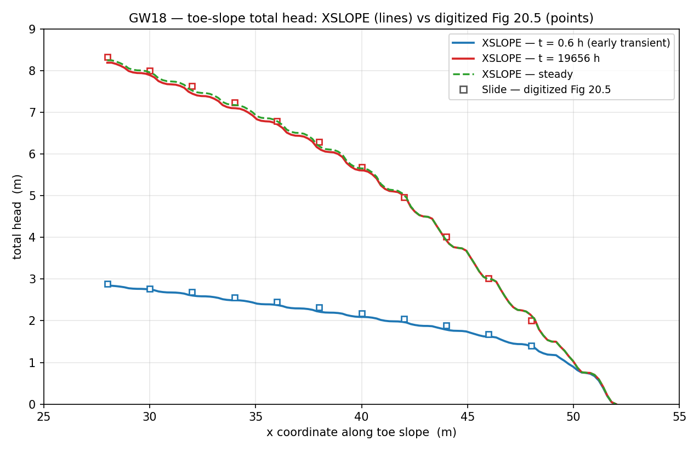

<!-- test: file=files/rocscience_gw/gw018.xlsx, type=tseep_head, target_size=1.5, time=0.6, max_head_change_frac=0.25, points=30:11:2.747;35:8.5:2.415;40:6:2.096;45:3.5:1.728, tolerance=0.15, benchmark=GW18-t0.6 -->
<!-- test: file=files/rocscience_gw/gw018.xlsx, type=tseep_head, target_size=1.5, time=1000, max_head_change_frac=0.25, points=30:11:7.962;35:8.5:6.895;40:6:5.638;45:3.5:3.655, tolerance=0.15, benchmark=GW18-t1000 -->

### GW19: Transient seepage below a lagoon {#gw19}

**Input files:** [gw019.xlsx](files/rocscience_gw/gw019.xlsx)

A lined lagoon leaking into a two-layer aquifer, modelled as a **half-model** (the lagoon
centerline at $x=0$ is a no-flow symmetry plane): 19 m wide × 10 m deep, a 1 m **soil
liner** across the top ($y\in[9,10]$, the lower-permeability layer) over 9 m of **soil**
($y\in[0,9]$). A 2 m-wide lagoon ($x\in[0,2]$ at the surface) is filled with 1 m of water
at $t=0$ and leaks down through the liner.

From the vendor RS2 model both materials carry $m_v=0.002$ and porosity 0.7; the soil
Custom $k(\psi)$ has $k_s=6\times10^{-4}$ m/min (down two decades by 10 m suction) and the
liner $k_s=3.54\times10^{-4}$ m/min with the same relative shape, both fit by one
Mualem–van Genuchten curve ($\alpha=0.173\ \text{m}^{-1}$, $n=1.91$). Storage
$S_s=\gamma_w m_v=10\times0.002=0.02\ \text{m}^{-1}$, $S_y=0.3$. The far field (right edge,
$y\in[0,5]$) is held at total head 5 — the regional water table 5 m below the surface, which
is also the **initial condition**: the $t=0$ steady solve at a lagoon head of 5 (equal to the
far field) gives a uniform water table at el 5, then the lagoon steps to total head 11
(el 10 + 1 m ponded) for $t>0$. The base, the centerline and the top away from the lagoon are
no-flow. Report times are the vendor stage schedule: 73 / 416 / 792 / 11340 min.

The published target is **pressure head along the top boundary** (Fig 21.9, vs Ref [1]
Fredlund & Rahardjo) plus pressure-head contours at the four times — chart-only, no tabulated
value. XSLOPE reproduces the expected behaviour: at 73 min the leak is confined near the
lagoon, and by 11340 min the pressure mound has spread across the whole top boundary toward
the far-field water table (the field below). XSLOPE's own solved heads at three interior
stations are locked as a regression guard. This problem carries the recurring **SWCC-mapping
caveat**: the single vG curve stands in for the vendor's independent conductivity and
water-content tables, which shifts the transient *timing*.

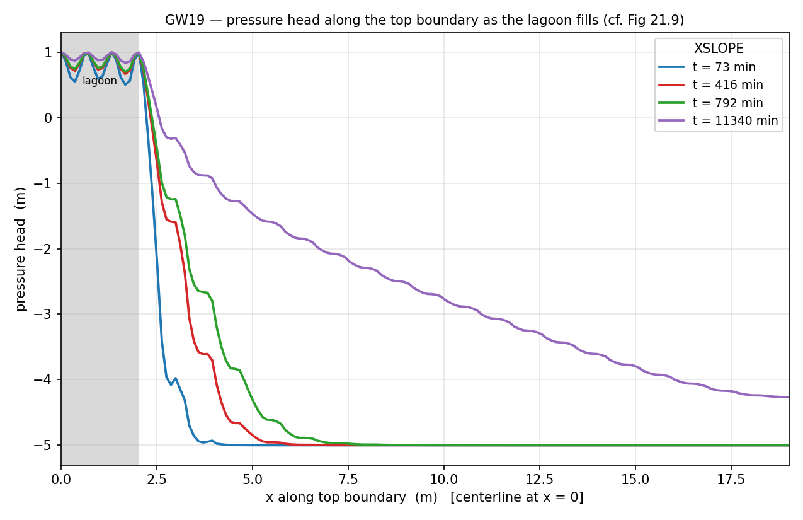

<!-- test: file=files/rocscience_gw/gw019.xlsx, type=tseep_head, target_size=0.8, time=73, max_head_change_frac=0.25, points=1:8:5.215;3:8:5.039;1:5:5.000, tolerance=0.15, benchmark=GW19-t73 -->
<!-- test: file=files/rocscience_gw/gw019.xlsx, type=tseep_head, target_size=0.8, time=416, max_head_change_frac=0.25, points=1:8:7.421;3:8:6.399;1:5:5.443, tolerance=0.15, benchmark=GW19-t416 -->
<!-- test: file=files/rocscience_gw/gw019.xlsx, type=tseep_head, target_size=0.8, time=792, max_head_change_frac=0.25, points=1:8:7.934;3:8:7.130;1:5:6.133, tolerance=0.15, benchmark=GW19-t792 -->
<!-- test: file=files/rocscience_gw/gw019.xlsx, type=tseep_head, target_size=0.8, time=11340, max_head_change_frac=0.25, points=1:8:9.478;3:8:9.048;1:5:8.625, tolerance=0.15, benchmark=GW19-t11340 -->

### GW20: Transient seepage in a layered slope {#gw20}

**Input files:** [gw020.xlsx](files/rocscience_gw/gw020.xlsx)

The steady [GW7](#gw7) Rulon & Freeze sandbox (2.4 × 1.0 m, a medium-sand slope with a thin
fine-sand lens) re-run **transiently** as rainfall switches on at $t=0$. The geometry,
materials and boundary layout are GW7's exactly; the transient additions are storage
($S_s=\gamma_w m_v=9.81\times0.002=0.0196\ \text{m}^{-1}$, $S_y=0.3$) and a rainfall flux
that is **zero at $t=0$ and steps to the GW7 value $2.1\times10^{-4}$ m/s** for $t>0$.

The initial condition is the $t=0$ steady solve with no infiltration — only the tailwater
head 0.3 at the toe holds, so the water table sits at el 0.3 (0.1 m above the toe). When the
rainfall (above the fine sand's $k_s=5.5\times10^{-5}$ m/s) switches on, water perches on the
fine lens and the perched mound builds toward the steady GW7 result. Report times are the
vendor schedule: 4.6 / 31 / 208 s (the medium-sand diffusion time over 1 m is $\approx14$ s,
so the 208 s frame has essentially reached the steady perched state).

The published target is **total head along a query line** (Fig 22.7, vs Ref [1]) plus
total-head contours at the three times — chart-only. The query-line profile below shows the
head gradient concentrating across the low-permeability lens as the mound develops — the
perching physics that GW7 verified at steady state. XSLOPE's own solved heads at four interior
stations are locked as a regression guard; the early frames carry the SWCC-mapping timing
caveat.

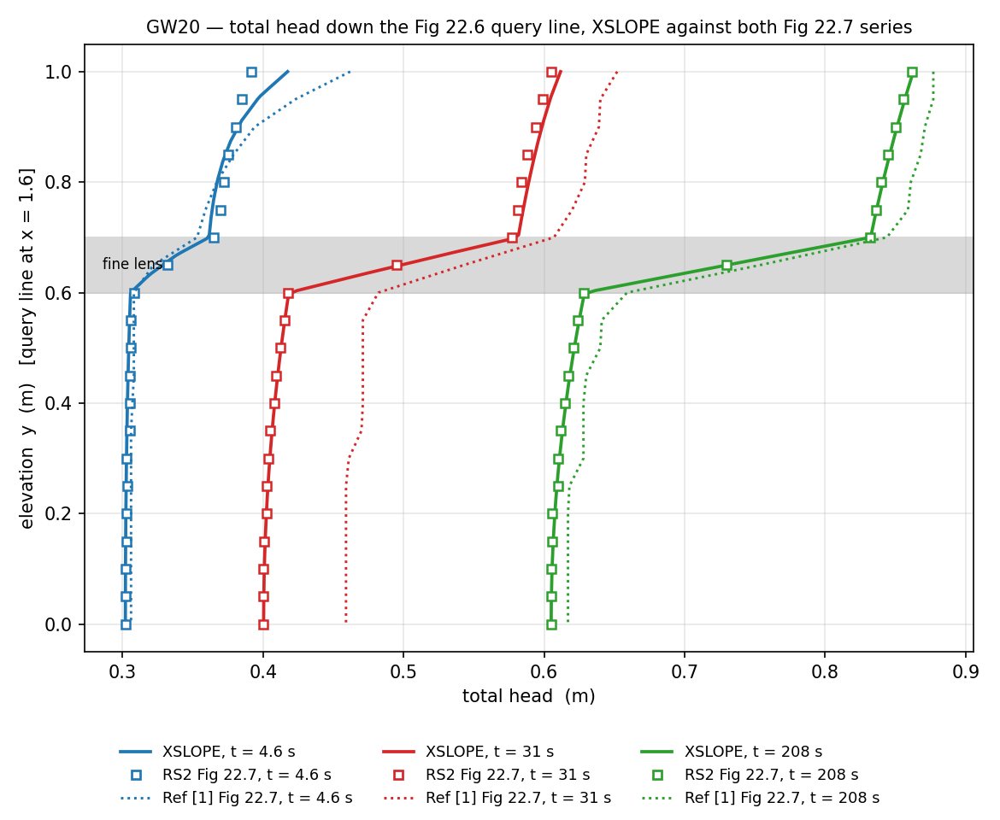

<!-- test: file=files/rocscience_gw/gw020.xlsx, type=tseep_head, target_size=0.04, time=4.6, max_head_change_frac=0.25, points=2.2:0.95:0.333;2:0.85:0.301;2:0.75:0.300;1.6:0.72:0.300, tolerance=0.15, benchmark=GW20-t4.6 -->
<!-- test: file=files/rocscience_gw/gw020.xlsx, type=tseep_head, target_size=0.04, time=31, max_head_change_frac=0.25, points=2.2:0.95:0.453;2:0.85:0.365;2:0.75:0.329;1.6:0.72:0.313, tolerance=0.15, benchmark=GW20-t31 -->
<!-- test: file=files/rocscience_gw/gw020.xlsx, type=tseep_head, target_size=0.04, time=208, max_head_change_frac=0.25, points=2.2:0.95:0.690;2:0.85:0.648;2:0.75:0.633;1.6:0.72:0.554, tolerance=0.15, benchmark=GW20-t208 -->

### GW21: Transient flow in a fully confined aquifer {#gw21}

**Input files:** [gw021a.xlsx](files/rocscience_gw/gw021a.xlsx) (IC = 0) ·
[gw021b.xlsx](files/rocscience_gw/gw021b.xlsx) (IC = 5 ft)

A 100 ft × 5 ft fully confined, fully saturated aquifer (imperial units): $k=4$ ft/hr,
$m_v=0.1$, $\gamma_w=62.4$, giving $S_s=6.24\ \text{ft}^{-1}$ and diffusivity
$D=T/S=k/(\gamma_w m_v)=0.641\ \text{ft}^2/\text{hr}$. The head at the left face is stepped up
5 ft at $t=0$; the aquifer is long enough that the far end stays undisturbed at 600 hr (the
front reaches $\sqrt{4Dt}\approx39$ ft), so the head rise follows J. G. Ferris' semi-infinite
solution (Tao & Xi 2006),

$$ \Delta h(x,t)=\Delta H\,\operatorname{erfc}\!\left(\frac{x}{\sqrt{4Dt}}\right). $$

Case 1 starts from zero head; case 2 from a uniform 5 ft steady head and steps to 10 ft.
XSLOPE reproduces the erfc profile at 600 hr to within **0.015 ft** across the domain (below).
The tags lock the closed-form head at five stations, tolerance 0.05 ft.

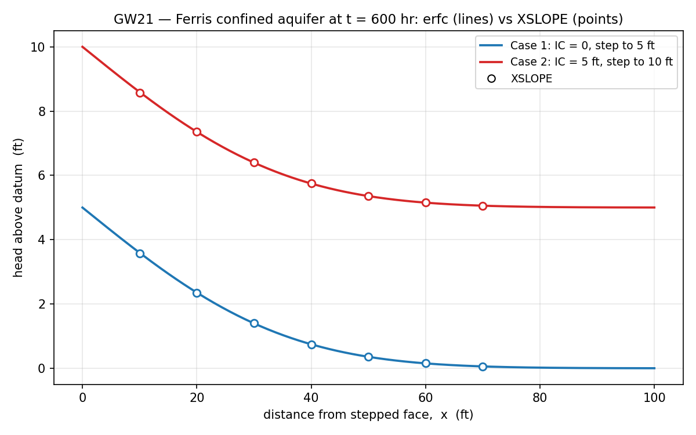

<!-- test: file=files/rocscience_gw/gw021a.xlsx, type=tseep_head, target_size=0.8, time=600, points=10:2.5:103.592;20:2.5:102.354;30:2.5:101.397;40:2.5:100.746;50:2.5:100.357, tolerance=0.05, benchmark=GW21a -->
<!-- test: file=files/rocscience_gw/gw021b.xlsx, type=tseep_head, target_size=0.8, time=600, points=10:2.5:108.592;20:2.5:107.354;30:2.5:106.397;40:2.5:105.746;50:2.5:105.357, tolerance=0.05, benchmark=GW21b -->

## The SEEP2D cross-check: where does the free surface daylight? {#seep2d-crosscheck}

Several problems on this page reproduce a published profile in shape but sit a little
high, and what they share is a free surface on a steep exit face. The question is whether
XSLOPE places the **release point** — the top of the saturated seepage face, where the
phreatic surface daylights — differently from other codes.

That question is answerable directly, because XSLOPE's seepage solver is in the SEEP2D family. The
original USACE/WES SEEP2D Fortran program is run on the *identical* tri3 mesh, the
identical boundary conditions and the identical unsaturated law (SEEP2D's `iuntyp`:
linear front, or van Genuchten — both codes use the same Mualem–van Genuchten form, so
α and n carry straight across), and the two solutions are compared node for node. The
harness is `benchmarks/run_seep2d_compare.py --gw`.

| problem | law | release point, XSLOPE | release point, SEEP2D | head RMS | head range |
|---|---|---|---|---|---|
| gw004 | linear front | 0.500 | 0.500 (0.0) | 0.0004 | 0–4 |
| gw006a | van Genuchten | 0.000 | 0.000 (0.0) | 0.0000 | 0–10 |
| gw009a | van Genuchten | 8.846 | 8.462 (+0.384) | 0.0026 | 0–18.5 |
| gw010 | van Genuchten | 4.872 | 4.872 (0.000) | 0.0006 | 2–10 |
| gw012 | linear front | face dry | face dry | 0.034 | 0–50 |
| gw013 | linear front | face dry | face dry | 0.070 | 0–50 |

**The release point agrees.** It is identical on gw004, gw006a and gw010; both codes
leave the face fully drained on gw012 and gw013; and gw009a differs by 0.384 — a single
element at that mesh. The head fields agree to a relative RMS of order 10⁻⁴ throughout.
XSLOPE does not release low. Where this corpus sits above a published profile, the
difference is between the SEEP2D family and the reference code's exit-face convention,
not an XSLOPE defect, so those problems are locked on XSLOPE's own values with the
offset reported.

One difference remains between the two codes. On the **van Genuchten** problems the total
discharge reads 3.5–4.7% below SEEP2D (gw009a 2.299×10⁻⁵ vs 2.412×10⁻⁵; gw010
6.070×10⁻⁵ vs 6.294×10⁻⁵) even though the heads agree to 10⁻⁴ — while the linear-front
problems agree on discharge to better than 0.15%. The split follows the unsaturated law
exactly, and it is *not* XSLOPE's kr floor: dropping `kr_min` from 10⁻⁴ to zero leaves
the discharge unchanged to six figures. Since the head field is right and only the
integrated flux differs, the likely cause is where each code evaluates the strongly
nonlinear kr(ψ) when it forms an element's conductivity. It does not affect pore
pressures or stability, which read the head field.

### The specified-flux boundary, against SEEP2D {#flux-crosscheck}

The same harness verifies the
[specified-flux (Neumann) boundary](../seep/overview.md#specified-flux-boundary-conditions-neumann),
because SEEP2D supports one natively. It is entered as *flowrate cards* — a boundary segment
and a flux — and SEEP2D forms its own consistent nodal loads from them (`seep2d.f`, the
`nflcd` block: `fx(i) += ½·L·q` at each end of the segment, and it sets the flux flags itself).
So SEEP2D is handed the raw segment and flux, never XSLOPE's assembled vector, and the two
codes' assemblies are compared rather than one being fed the other's answer.

The test problem is a confined rectangle, 10 × 4, isotropic *k* = 2, with a fixed head on one
side and a uniform inflow *q* on the other, no-flow above and below. One-dimensional Darcy
gives the head exactly: *h*(*x*) = *q*(*L* − *x*)/*k*, with total inflow *q*·*H*.

| | XSLOPE | SEEP2D |
|---|---|---|
| max abs. error vs the exact solution | **2.5×10⁻¹⁹** | 5.0×10⁻⁹ |
| total inflow (exact: 1.760000×10⁻⁵) | **1.760000×10⁻⁵** | 1.759800×10⁻⁵ (+2.0×10⁻⁹) |
| max abs. difference, XSLOPE − SEEP2D | \-- | **5.0×10⁻⁹** (2.3×10⁻⁴ of the head range) |

*XSLOPE reproduces the closed form to machine precision, and matches SEEP2D to that code's own
iteration tolerance.*

Machine-precision agreement on the *head field* — not merely on the total — is the check that
matters. A linear head field only satisfies **A**·**h** = **f** when **f** is the *consistent*
load vector, so an incorrect distribution along an edge (½, ½, 0 across a quadratic edge, say)
would still sum to *q·L* and pass a total-flux check while breaking the solution. It does not.
The quadratic weights (⅙, ⅙, ⅔ at corner, corner and midside) are verified the same way, and a
zero flux reproduces the no-flux answer bitwise.

## Methodology

Same rules as the [Slide2 corpus](rocscience.md): problems are built from the manual's tabulated
data and coordinate-labeled figures; where a figure is unlabeled, geometry is extracted by
axis-calibrated pixel measurement and validated against printed solution quantities; every built
problem is locked into `run_tests.py` via test tags. Seepage problems compare flow rates,
phreatic-surface positions, and head/pressure profiles rather than factors of safety. Three tag
types carry the locks: `type=seep` (flowrate, live mesh + solve at `target_size`),
`type=seep_head` (solved total head at named `x:y:h` points, interpolated from the four nearest
nodes), and `type=tseep_head` — the transient sibling of `seep_head`, which meshes and samples
head the identical way but pulls the field from the frame of a transient solve at a given save
time `t` (`time=…`, an entry the solver lands on exactly). A `type=tseep_head` tag names a file
carrying a v18 `tseep` sheet; optional `dt_max` / `max_head_change_frac` / `theta` tune the
stepper. Where a problem's published answer is itself a chart curve (GW6/GW7), a
tolerance-banded profile lock is planned but not yet implemented.
