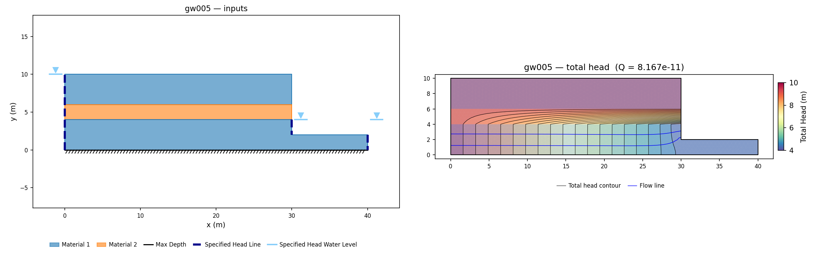
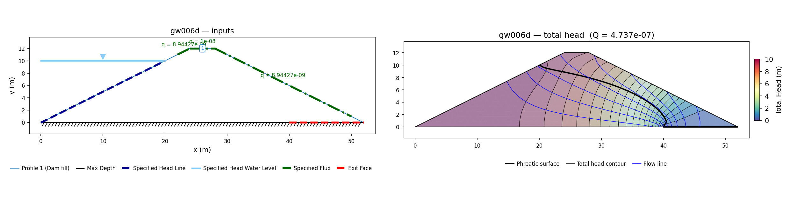

# Rocscience Slide2 Groundwater Corpus

The [Slide2 Groundwater Verification Manual](https://www.rocscience.com/help/slide2/verification-theory/verification-manuals)
(Rocscience, 2022) verifies Slide2's finite-element groundwater engine against closed-form
solutions (Polubarinova-Kochina, Vedernikov, Terzaghi consolidation) and published numerical
benchmarks. This page compares XSLOPE's finite-element seepage solver against the same
21 problems. Each problem has a row in the summary table; each built problem has an XSLOPE
input file, a results section, and figures. The quantities compared are seepage-specific —
flow rates, free-surface positions, head and pressure profiles — rather than factors of
safety.

Full bibliographic details for the author-year citations on this page are on the
shared [References](references.md) page.

<!-- test: file=files/rocscience_gw/gw001.xlsx, type=seep, target_size=0.2, expected_flowrate=2.500e-05, tolerance=0.02, benchmark=GW1-q -->
<!-- test: file=files/rocscience_gw/gw001.xlsx, type=seep_head, target_size=0.2, points=2:2:4.052;4:2:4.150;6:2:4.030, tolerance=0.02, benchmark=GW1-h -->
<!-- test: file=files/rocscience_gw/gw002.xlsx, type=seep, target_size=0.10, expected_flowrate=4.534e-06, tolerance=0.02, benchmark=GW2-q -->
<!-- test: file=files/rocscience_gw/gw002.xlsx, type=seep_head, target_size=0.10, points=4:1:0.500;4.5:0.866:0.381;5:0:0.263;6:0:0.202, tolerance=0.01, benchmark=GW2-h -->
<!-- test: file=files/rocscience_gw/gw003.xlsx, type=seep, target_size=0.10, expected_flowrate=2.351e-07, tolerance=0.02, benchmark=GW3-q -->
<!-- test: file=files/rocscience_gw/gw003.xlsx, type=seep_head, target_size=0.10, points=0:-4:4.47;10:-4:3.40;14:-4:2.44;20:-4:1.05;30:-4:0.19, tolerance=0.05, benchmark=GW3-h -->
<!-- test: file=files/rocscience_gw/gw004.xlsx, type=seep, target_size=0.06, max_iter=2500, expected_flowrate=5.487e-08, tolerance=0.02, benchmark=GW4-q -->
<!-- test: file=files/rocscience_gw/gw004.xlsx, type=seep_head, target_size=0.06, max_iter=2500, points=6:1:3.906;12:1:3.183;16:1:2.441;20:0.5:1.356, tolerance=0.01, benchmark=GW4-h -->
<!-- test: file=files/rocscience_gw/gw005.xlsx, type=seep, target_size=0.5, expected_flowrate=8.165e-11, tolerance=0.05, benchmark=GW5-q -->
<!-- test: file=files/rocscience_gw/gw005.xlsx, type=seep_head, target_size=0.5, points=5:2:9.041;15:2:7.090;25:2:5.093;15:8:9.855;35:1:4.087, tolerance=0.05, benchmark=GW5-h -->
<!-- test: file=files/rocscience_gw/gw006a.xlsx, type=seep, target_size=1.0, max_iter=2000, expected_flowrate=2.808e-07, tolerance=0.05, benchmark=GW6a-q -->
<!-- test: file=files/rocscience_gw/gw006a.xlsx, type=seep_head, target_size=1.0, max_iter=2000, points=26:0.05:7.2516;26:2:7.2571;26:4:7.3727;26:6:7.5047, tolerance=0.05, benchmark=GW6a-h -->
<!-- test: file=files/rocscience_gw/gw006b.xlsx, type=seep, target_size=1.0, max_iter=2000, expected_flowrate=1.692e-06, tolerance=0.05, benchmark=GW6b-q -->
<!-- test: file=files/rocscience_gw/gw006b.xlsx, type=seep_head, target_size=1.0, max_iter=2000, points=26:0.05:6.5688;26:2:6.7452;26:4:7.2663;26:6:7.8577, tolerance=0.05, benchmark=GW6b-h -->
<!-- test: file=files/rocscience_gw/gw006c.xlsx, type=seep, target_size=1.0, max_iter=2000, expected_flowrate=4.879e-08, tolerance=0.05, benchmark=GW6c-q -->
<!-- test: file=files/rocscience_gw/gw006c.xlsx, type=seep_head, target_size=1.0, max_iter=2000, points=26:0.05:5.7966;26:2:5.7860;26:4:6.3611;26:6:7.0788, tolerance=0.05, benchmark=GW6c-h -->
<!-- test: file=files/rocscience_gw/gw006d.xlsx, type=seep, target_size=1.0, max_iter=2000, expected_flowrate=4.737e-07, tolerance=0.05, benchmark=GW6d-q -->
<!-- test: file=files/rocscience_gw/gw006d.xlsx, type=seep_head, target_size=1.0, max_iter=2000, points=26:0.05:7.8970;26:2:7.9161;26:4:8.0363;26:6:8.1847;26:8:8.4101;26:10:8.6738;26:12:9.1446, tolerance=0.05, benchmark=GW6d-h -->
<!-- test: file=files/rocscience_gw/gw006e.xlsx, type=seep, target_size=1.0, max_iter=2000, expected_flowrate=1.777e-07, tolerance=0.05, benchmark=GW6e-q -->
<!-- test: file=files/rocscience_gw/gw006e.xlsx, type=seep_head, target_size=1.0, max_iter=2000, points=26:0.05:8.3539;26:2:8.3537;26:4:8.4092;26:6:8.4682, tolerance=0.05, benchmark=GW6e-h -->
<!-- test: file=files/rocscience_gw/gw009a.xlsx, type=seep, expected_flowrate=2.3069e-05, tolerance=0.05, benchmark=GW9a-q -->
<!-- test: file=files/rocscience_gw/gw009b.xlsx, type=seep, expected_flowrate=4.2824e-06, tolerance=0.05, benchmark=GW9b-q -->
<!-- test: file=files/rocscience_gw/gw010.xlsx, type=seep, target_size=0.25, max_iter=1500, expected_flowrate=6.07e-05, tolerance=0.05, benchmark=GW10-q -->
<!-- test: file=files/rocscience_gw/gw012.xlsx, type=seep, target_size=1.0, max_iter=1500, expected_flowrate=4.137e-04, tolerance=0.05, benchmark=GW12-q -->
<!-- test: file=files/rocscience_gw/gw013.xlsx, type=seep, target_size=1.0, max_iter=1500, expected_flowrate=2.086e-02, tolerance=0.05, benchmark=GW13-q -->

Problems 1–13 are steady-state; problems 15–21 are **transient**, solved with XSLOPE's
[transient seepage solver](../seep/transient.md). Problems 1, 7 and 8 apply a uniform
infiltration rate to the ground surface, which has no fixed-head equivalent, and are built on
the
[specified-flux (Neumann) boundary condition](../seep/overview.md#specified-flux-boundary-conditions-neumann).
Problem 14 is the one blocked row.

## Status

**Match to the published value**

| Symbol | Meaning |
|---|---|
| 🟢 | within 3% of the vendor and/or reference figure |
| 🟡 | 3–6% |
| 🔴 | more than 6% |
| 🟣 | in progress |
| ⊘ | insufficient data or out of scope |

The dot scores the **match quality of what is locked**, not how much of a problem is built; the partial/blocked detail is in the row text.

Status values follow the [shared vocabulary](rocscience.md)
used across this section (**built**, *covered*, *partial*, *planned*, *blocked*,
*no lock possible*, *not supported*).

| # | Match | Problem | Results | Notes |
|---:|:-:|---|---|---|
| [1](#gw1) | 🟢 | Shallow unconfined flow with rainfall | Crest x_a ≈ 4.1 vs Slide 4.06 (~0.05 m) · h_max 4.61 vs Slide 4.49 (~0.12 m) · Q = P·L = 2.5×10⁻⁵ locked | slightly-high free-surface family, above Haar's Dupuit closed form (SEEP2D cross-check) |
| [2](#gw2) | 🟢 | Flow around cylinder | Solved heads within 0.0013 m of Slide at every printed point · closed form matched within its own idealization error | |
| [3](#gw3) | 🟢 | Confined flow under dam foundation | Head profiles under and beyond the dam within 0.08 m of the published Rushton & Redshaw / Slide chart everywhere | |
| [4](#gw4) | 🔴 | Steady unconfined flow through earth dam | Phreatic surface within 0.02–0.06 m of the Kozeny basic parabola over the dam body · y₁ above the drain toe 0.401 vs RS2's own solve of this model 0.395 (+1.5%) · drain-face entry offset x₁ 0.272 vs 0.226 (**+20.4%**, and it sets the dot) | RS2's Table 4.1 publishes both quantities and governs; x₁ turns on an unsaturated curve the vendor file does not store |
| [5](#gw5) | 🟢 | Unsaturated flow behind an embankment | Q = 8.165×10⁻¹¹ vs the one-dimensional closed form *k·b·i* = 8.0×10⁻¹¹ (+2.1%) · solved pressure head inside Fig 5-4's own 1 m colour bands at 46 of 49 grid points | **built**; chart-keyed target, locked on XSLOPE's own field |
| [6](#gw6) | ⊘ | Steady-state seepage through saturated–unsaturated soils | Pressure head along line 1-1, against Slide: cases 2 and 5 within 0.10 m, cases 1 and 4 within 0.37 m, case 3 the outlier at 0.98 m near the crest, where Slide and Ref[1] themselves differ by 0.9 m | **built** (5 of 5 cases); chart-only target, locked on XSLOPE's own field; one conductivity curve serves all five |
| [7](#gw7) | 🟢 | Seepage within layered slope | Total head along the manual's own query line within 0.005 m rms of the Fig 22.7 steady markers over 21 stations (≈1% of the profile's head range) · water table at the toe el 0.30 vs the stated Slide / Rulon & Freeze 0.3 m · perched zone and slope-face spring reproduced | **built**; problem 7's own figures are chart-only, so the numeric target comes from problem 22's Fig 22.7 steady frame |
| [8](#gw8) | 🟢 | Flow through ditch-drained soils | Flux boundary exact — total inflow = *q*·*L*, the confined response matching the closed form to six figures · water table within 0.004–0.006 m of the Fig 8.3/8.4 line over the whole span · Fig 8.3's labeled pressure-head contours within 0.010 m rms over 14 stations | **built**; flux rate and Soil B's Gardner *a* taken from the vendor model where it disagrees with the printed tables |
| [9](#gw9) | 🟢 | Seepage through dam | Dam 1: Q = 1.384×10⁻³ vs Slide 1.378×10⁻³ m³/(min·m) (+0.4%) · dam 2: Q = 4.28×10⁻⁶ vs Slide 4.23×10⁻⁶ m³/(s·m) (+1.2%) | **built** (both dams); body k read from Bowles (1984) Fig E9-2b, not the Chapuis caption |
| [10](#gw10) | 🟢 | Steady unconfined flow, van Genuchten permeability | Q = 6.070×10⁻⁵ vs Slide 6.066×10⁻⁵ (+0.1%) · vs Clement 6.076×10⁻⁵ (−0.1%) · phreatic exit el. 4.87 vs Slide 5.0 (−0.13 m) · vs Clement 4.8 (+0.07 m) | |
| [11](#gw11) | 🔴 | Earth/rock-fill dam, Gardner permeability function | Free-surface release point el. 17.90 vs Slide 19.397 (−1.50 m) · vs ABAQUS 19.64 (−1.74 m) · the free surface itself within 0.76 m rms of Slide's own drawn line over 18 stations | **built** (case 1 of 2, discrepancy); unsaturated law, mesh size, element order, the *k*r floor and the exit-face extent are each measured and none moves the release point |
| [12](#gw12) | 🟢 | Seepage from a trapezoidal ditch into a deep drainage layer | Q = 4.137×10⁻⁴ vs Slide 4.093×10⁻⁴ (+1.1%) · vs Vedernikov theory 4.0×10⁻⁴ (+3.4%) · flow-bulb half-width ≈42 vs Slide 41 (+1) · vs theory 40 (+2) | |
| [13](#gw12) | 🟢 | Seepage from a triangular ditch into a deep drainage layer | Q = 2.086×10⁻² vs Slide 2.050×10⁻² (+1.8%) · vs Vedernikov theory 2.0×10⁻² (+4.3%) | |
| [14](#gw14) | ⊘ | Unsaturated soil column | | *blocked* — the closed form assumes an exponential conductivity law XSLOPE does not implement |
| [15](#gw15) | 🟢 | 1-D consolidation, uniform initial excess pore pressure | Isochrones within ≈0.3% of u₀ of the Terzaghi Eq 17.3 closed form | **built** (both cases) |
| [16](#gw16) | 🟢 | Pore pressure dissipation of stratified soil | Within ≈0.3–0.5% of u₀ of the recomputed Pyrah 1996 two-layer eigen-series | **built** (3 cases) |
| [17](#gw17) | ⊘ | Transient seepage, earth fill dam with toe drain | At 15 h XSLOPE's *h* = 7 front stands 1.1–1.8 m inside the upstream face against RS2's 1.5–3.3 m · the steady field reproduces the Fig 19-5 total-head contours, and the 16383 h frame is still short of it, settling to within 0.01 m of steady by ≈5×10⁴ h | **built** (both vendor stage times + steady); contour-only target, locked as a regression guard |
| [18](#gw18) | 🟢 | Transient seepage through an earth fill dam | Toe-slope total head within 0.058 m rms of the digitized Fig 20.5 profile at t = 0.6 h and 0.197 m rms at t = 19656 h, over 11 stations · XSLOPE's steady profile within 0.127 m rms of Fig 20.5's 19656 h curve | **built** (both vendor stage times + steady); the elastic *S*s acts in the saturated zone only, as Slide's *m*v does — the term that sets the drainage time-scale of every transient row here |
| [19](#gw19) | 🟢 | Transient seepage below a lagoon | Near-steady (11340 min) pressure head along the top boundary within 0.045 m rms of the digitized Fig 21.9 markers over 20 stations — under 1% of the driving head · early frames 0.07–0.35 m rms, XSLOPE's mound running slightly *ahead* of RS2's | **built** (all four frames); both vendor curves are reproduced rather than fitted, and the near-steady frame is locked against the vendor profile |
| [20](#gw20) | ⊘ | Transient seepage in a layered slope | RS2 reaches the steady query-line profile of Fig 22.7 by 208 s and XSLOPE by 400 s: the two differ by 0.105 m rms along the line at 208 s and by 0.005 m once both are steady | **built** (all three frames); the vendor-facing lock for this geometry is [GW7](#gw7)'s steady profile, and the transient frames carry a measured ≈2× timing offset |
| [21](#gw21) | 🟢 | Transient seepage through a fully confined aquifer | Within ≈0.02 ft of the Ferris erfc closed form at 600 hr | **built** (both cases) |

## Methodology

Each problem is built from the manual's tabulated data and coordinate-labeled
figures; where a figure is unlabeled, the geometry is extracted by
axis-calibrated pixel measurement and validated against printed solution
quantities. Transient problems are compared at the published save times.

Where a published answer is itself a chart, the treatment depends on what the
chart resolves. A contour plate with a numeric key gives a band per sampled
point, and the comparison reports the fraction of points inside the vendor's
band; a plate without a key supports only a qualitative reading. A line or
marker plot on labeled axes is digitized and compared numerically, calibrated
where possible on a value the model fixes and the chart must show. Every chart
target is locked on XSLOPE's own solved field, with the chart comparison
reported beside it.

## Steady-state problems {#steady-state}

### GW1: Shallow unconfined flow with rainfall {#gw1}

**Input files:** [gw001.xlsx](files/rocscience_gw/gw001.xlsx)

Flow between two long parallel rivers 10 m apart (Haar 1990; the Dupuit–Forchheimer recharge
problem), the manual's first specified-flux case. A 10 × 5 m block with river heads
h₁ = 3.75 m and h₂ = 3.0 m on its vertical edges, a uniform rainfall P = 2.5×10⁻⁶ m/s
infiltrating the top, and k = 1×10⁻⁵ m/s. The recharge builds an **internal** free surface
that mounds above both river levels with no daylighting seepage face, so the top edge is
declared both the flux boundary and an inactive exit face, which puts the solver on the
unsaturated free-surface path the internal mound needs.

| Quantity | XSLOPE | Slide | Haar eqs 1.2–1.3 |
|---|---|---|---|
| x_a (crest position) | ≈ 4.1 | 4.06 (~0.05 m) | 3.98 (+0.12 m) |
| h_max (crest elevation) | 4.61 | 4.49 (+0.12 m) | 4.25 (+0.36 m) |
| Q (m³/s per m) | 2.500×10⁻⁵ | — | P·L = 2.5×10⁻⁵ (0.0%) |

The mound crest lands within ~0.05 m of Slide in position and ~0.12 m in height, the same
slightly-high free-surface bias the [SEEP2D cross-check](#seep2d-crosscheck) documents
across this panel; both finite-element solutions sit above Haar's Dupuit closed form, which
neglects the vertical flow near the crest. The flowrate lock Q = P·L is exact by
construction, and a head regression at three interior stations guards the mound shape.

### GW2: Flow around cylinder {#gw2}

**Input files:** [gw002.xlsx](files/rocscience_gw/gw002.xlsx)

Confined potential flow past a cylinder (Streeter's closed form; Desai & Kundu's finite
elements): a half-domain 8 × 4 m with a semicircular notch of radius 1 m at the bottom
center and fixed heads of 1.0 and 0.0 on the vertical edges. The domain is fully
saturated, so the head field is determined by geometry and boundary heads alone.

| Point | XSLOPE | Slide | Closed form | Desai & Kundu |
|---|---|---|---|---|
| (4, 1) | 0.500 | 0.500 (0.000 m) | 0.500 (0.000 m) | 0.500 (0.000 m) |
| (4.5, 0.866) | 0.381 | 0.381 (0.000 m) | 0.375 (+0.006 m) | 0.378 (+0.003 m) |
| (5, 0) | 0.263 | 0.263 (0.000 m) | 0.250 (+0.013 m) | 0.277 (−0.014 m) |
| (6, 0) | 0.202 | 0.203 (−0.001 m) | 0.188 (+0.014 m) | 0.213 (−0.011 m) |
| (8, 0) | 0.000 | 0.000 (0.000 m) | −0.031 (+0.031 m) | 0.000 (0.000 m) |

The two finite-element solutions agree with each other within 0.0013 m everywhere; both depart
from the closed form near the downstream edge, where the analytical solution assumes an
infinite domain, so its −0.031 at the finite model's zero-head boundary measures that
idealization rather than an error. Flowrate is locked as a regression value.

### GW3: Confined flow under a dam foundation {#gw3}

**Input files:** [gw003.xlsx](files/rocscience_gw/gw003.xlsx)

The classic flow-net problem (Rushton & Redshaw): a 40 × 10 m soil block with head 5 m on the
ground surface upstream of the dam, head 0 downstream, and the dam base impervious between
them.

| Station (line 1-1, y = −4) | XSLOPE | Slide |
|---|---|---|
| x = 0 | 4.47 | 4.50 (−0.03 m) |
| x = 10 | 3.40 | 3.45 (−0.05 m) |
| x = 14 | 2.44 | 2.47 (−0.03 m) |
| x = 20 | 1.05 | 1.05 (0.00 m) |
| x = 30 | 0.19 | 0.20 (−0.01 m) |
| x = 40 | 0.08 | 0.07 (+0.01 m) |

| Profile | XSLOPE | Slide |
|---|---|---|
| line 2-2 (x = 20), head span | 0.17–1.30 | 0.24–1.30 |

Both tables compare against Slide, whose markers coincide with Rushton & Redshaw's own
flow-net values on both published profile lines, so one column carries both sources. Heads
along those lines fall within 0.08 m of the chart everywhere.

The head gradient is unbounded at (20, 0), where the impervious dam base meets the
zero-head boundary, and the top of line 2-2 sits on that corner — which is why line 2-2
is quoted as a band rather than a delta, and why this problem is solved at `target_size`
0.1 rather than the panel's 0.4.

Flowrate 2.351×10⁻⁷ m³/s per m is locked as a regression value: the manual publishes head
profiles for this problem, not a discharge.

### GW4: Steady unconfined flow through an earth dam {#gw4}

**Input files:** [gw004.xlsx](files/rocscience_gw/gw004.xlsx)

Free-surface seepage through a small dam with a **trapezoidal toe drain**, against Kozeny's
basic parabola: reservoir head 4 m on the upstream face, and a seepage exit face over the dry
upstream face, the crest, the downstream slope and the drain's contact face, with the drain toe
pinned at total head 0. The free-surface shape is independent of *k*.

**The drain contact is inclined, not vertical.** In the vendor model `groundwater #004.fez`
the downstream slope runs *past* the printed dimension chain, then falls back down-left along
the drain's contact face to the toe: Fig 4.1 draws the trapezoidal drain that face bounds,
Fig 4.2 puts the seepage-face markers along it, and the printed chain measures to the *base
toe*. That geometry decides the whole row, because **y₁ is defined at the drain** — Fig 4.5
dimensions it as the free-surface height directly above the toe, and x₁ as the horizontal
offset from the toe to where the free surface enters the drain face.

| Quantity | XSLOPE | RS2 (this model) | Slide | Eqs 4.1–4.2 |
|---|---|---|---|---|
| Phreatic el. at x = 14 | 2.878 | — | — | 2.814 (+0.064 m) |
| Phreatic el. at x = 18 | 2.024 | — | — | 2.007 (+0.017 m) |
| Phreatic el. at x = 20 | 1.427 | — | — | 1.444 (−0.017 m) |
| y₁, free surface above the toe | 0.401 | 0.395 (+1.5%) | 0.442 (−9.3%) | 0.486 (−17.5%) |
| x₁, drain-face entry offset (**sets the dot**) | 0.272 | 0.226 (+20.4%) | 0.227 (+19.8%) | 0.243 (+11.9%) |
| Q (m³/s per m) | 5.487×10⁻⁸ | — | — | k·y₁ = 4.86×10⁻⁸ (+12.9%) |

The governing comparison is **RS2's own Table 4.1**, because the file this problem is built
from is RS2's and RS2 publishes its solve of it (y₁ 0.395, x₁ 0.226). Slide's 0.442 / 0.227
is the same model before conversion; the two vendors are 11% apart from each other on y₁,
and both sit below the Eq 4.1 idealization.

x₁ is the weaker of the two, and it is the one that sets the dot: RS2's Table 4.1 publishes
both quantities, so the worse of them governs. Both are read where the free surface turns
nearly vertical into the drain, so both need a fine mesh — the tags run at `target_size` 0.06.
x₁ also depends on the one input this model does not carry: the vendor material is
`gw_mode 0 / stype General`, RS2's built-in Simple curve, whose parameters the file does not
store, so XSLOPE stands a linear front (kr = 10⁻³ at 0.25 m of suction) in for it,
and moving that front moves x₁.

### GW5: Unsaturated flow behind an embankment {#gw5}

**Input file:** [gw005.xlsx](files/rocscience_gw/gw005.xlsx)

A permeability-contrast problem taken from the FLAC manual (Coetzee et al. 1995) and
extended by the Slide manual to two materials: a 30 m × 10 m block with a 2 m downstream shelf
running out to *x* = 40, crossed by a 2 m band at 4 ≤ *y* ≤ 6 whose saturated conductivity is
10⁻¹³ m/s against 10⁻¹⁰ m/s in the host. Total head is 10 m on the left face and 4 m on the
downstream step and end faces, every other edge is impermeable, and the published model
declares no seepage face. Geometry, conductivities and boundary cards are read from the vendor
RS2 model (`groundwater #005.fez`), so none of this row's inputs are digitized.

Both of the vendor's conductivity functions are two-point **constant** curves, so — despite
the section title — the published model is a constant-conductivity linear problem in which
the unsaturated law never enters. The XSLOPE file reproduces that with *k*ᵣ ≡ 1. The 1000×
band isolates the block above it, which stagnates just below the reservoir head, while the
head below falls essentially linearly from 10 to 4 across the 30 m.

**Flowrate, against the one-dimensional closed form.** Almost all the flow passes through
the 4 m of host below the band, so *k·b·i* = 10⁻¹⁰ × 4 × (6/30) = 8.0×10⁻¹¹ m³/s per m.
XSLOPE reads 8.165×10⁻¹¹ (+2.1%).

**Pressure head, against Figure 5-4.** The manual's own comparison is with FLAC and is
presented as contour plates, but Fig 5-4 carries a numeric key: pressure head 0 → 10 m in ten
1 m bands. Read off a 300 dpi render calibrated on the domain outline, XSLOPE's solved pressure
head falls inside RS2's own band at **46 of 49** grid points across the whole domain, and the
three exceptions miss a band edge by less than the ±0.5 m the banding itself resolves.

The published target is a chart, so the lock is XSLOPE's own flowrate and total-head field.

### GW6: Steady-state seepage through saturated–unsaturated soils {#gw6}

**Input files:** [gw006a.xlsx](files/rocscience_gw/gw006a.xlsx) (case 1, isotropic) /
[gw006b.xlsx](files/rocscience_gw/gw006b.xlsx) (case 2, 9:1 anisotropy) /
[gw006c.xlsx](files/rocscience_gw/gw006c.xlsx) (case 3, core) /
[gw006d.xlsx](files/rocscience_gw/gw006d.xlsx) (case 4, infiltration) /
[gw006e.xlsx](files/rocscience_gw/gw006e.xlsx) (case 5, seepage face)

Fredlund & Rahardjo (1993)'s saturated–unsaturated earth dam — 12 m high, symmetric 2:1
faces, reservoir at 10 m, a 12 m horizontal drain at the downstream toe — run through five
cases. The published target in every case is the pressure-head profile along **line 1-1**, the
crest centerline at x = 26, a chart with no tabulated value and no numeric key, so each case
locks XSLOPE's own flowrate and total-head field. All five cases' material and boundary data
are read from the vendor RS2 models (`groundwater #006_01…05.slw`).

**The conductivity function.** Every case shares one unsaturated curve, published in the
vendor models as a table: k_s = 10⁻⁷ m/s, air entry 1 m, then log-linear in suction at ⅓ decade
per metre to ψ = 10 m and ⅕ decade per metre beyond. XSLOPE carries van Genuchten, Gardner and
linear-front laws rather than a table, so the curve is fit; a least-squares Mualem–van Genuchten
fit over the 0–8 m of suction the five solved fields occupy holds the vendor table to
**0.030 decades rms**.

**Case 1 — isotropic dam with a 12 m horizontal drain.** Slide's and Fredlund & Rahardjo's
published curves coincide within 0.2 m along the crest centerline.

| Elevation on the crest line | XSLOPE pressure head | Slide | F&R |
|---|---|---|---|
| 0 | 7.20 | 7.15 (+0.05 m) | ≈7.3 (≈−0.10 m) |
| 2 | 5.26 | 5.15 (+0.11 m) | ≈5.3 (≈−0.04 m) |
| 4 | 3.37 | 3.25 (+0.12 m) | ≈3.4 (≈−0.03 m) |
| 6 | 1.50 | 1.30 (+0.20 m) | ≈1.45 (≈+0.05 m) |
| 8 | −0.36 | −0.60 (+0.24 m) | ≈−0.45 (≈+0.09 m) |

*The profile shape reproduces exactly and the curve sits 0.05–0.24 m above Slide's, between
the two published curves over the lower half of the line. The offset does not move with mesh
refinement, and XSLOPE's free surface daylights where SEEP2D's does on the identical mesh —
see [the SEEP2D cross-check](#seep2d-crosscheck) below.*

Flowrate 2.808×10⁻⁷ m³/s per m (locked with the total-head field).

**Case 2 — anisotropic dam (kₕ = 9 kᵥ) with the horizontal drain.** The horizontal
conductivity is nine times the vertical (kₕ = 9×10⁻⁷, kᵥ = 10⁻⁷ m/s), which spreads the flow
and lowers the phreatic surface. Fredlund & Rahardjo's curve is indistinguishable from
Slide's on Fig 6.9 at the scale the chart can be read to, so one column carries both:

| Elevation on line 1-1 | XSLOPE pressure head | Slide (Fig 6.9) |
|---|---|---|
| 0 | 6.52 | ≈6.5 (≈+0.02 m) |
| 2 | 4.75 | ≈4.7 (≈+0.05 m) |
| 4 | 3.27 | ≈3.2 (≈+0.07 m) |
| 6 | 1.86 | ≈1.85 (≈+0.01 m) |
| 8 | 0.42 | ≈0.4 (≈+0.02 m) |

Flowrate 1.692×10⁻⁶ m³/s per m (locked with the total-head field).

**Case 3 — isotropic dam with a low-permeability core and the horizontal drain.** A
rectangular central core with saturated k = 10⁻⁹ m/s, 100× lower than the shell, forces
almost the whole head drop across its 4 m width (Fig 6.13's crowded contours) and throttles
the flowrate to 4.879×10⁻⁸ m³/s per m. Along line 1-1, now inside the core, XSLOPE reproduces
the profile shape and sits at the high end of the published scatter:

| Elevation on line 1-1 | XSLOPE pressure head | Slide (Fig 6.14) | Ref[1] |
|---|---|---|---|
| 0 | 5.75 | ≈5.9 (≈−0.15 m) | ≈5.8 (≈−0.05 m) |
| 2 | 3.79 | ≈3.9 (≈−0.11 m) | ≈3.9 (≈−0.11 m) |
| 4 | 2.36 | ≈2.1 (≈+0.26 m) | ≈2.1 (≈+0.26 m) |
| 6 | 1.08 | ≈0.4 (≈+0.68 m) | ≈0.7 (≈+0.38 m) |
| 8 | −0.22 | ≈−1.2 (≈+0.98 m) | ≈−0.3 (≈+0.08 m) |

*The published Slide and Ref[1] curves themselves diverge 0.9 m at elevation 8; XSLOPE tracks
the shape, running below both over the lower half of the line and above Slide near the crest.
Of the five cases this one reaches the deepest suction, so it samples the part of the
conductivity curve that falls fastest.*

**Case 4 — isotropic dam under steady-state infiltration.** Rain falls on the exposed surface
while the toe drain still runs. The vendor applies it as fourteen traction cards of **vertical**
flux 10⁻⁸ m/s, from (22, 11) across the crest and down to (50, 1) — one element short of the
fixed-head node at each end. A vertical rain rate is not the number a normal-flux boundary
takes, so the surface goes in as three blocks: q_n = 10⁻⁸ cos(arctan ½) = 8.944×10⁻⁹ on the
2:1 faces and the full 10⁻⁸ across the horizontal crest.

Figure 6.18 is the one target on this problem printed as **markers rather than a curve** —
Slide and Ref[1] at every metre of elevation — so it can be read to about 0.05 m, and all
thirteen stations are compared:

| Elevation on line 1-1 | XSLOPE pressure head | Slide (Fig 6.18) | Ref[1] |
|---|---|---|---|
| 0 | 7.85 | ≈7.73 (≈+0.12 m) | ≈7.49 (≈+0.36 m) |
| 2 | 5.92 | ≈5.77 (≈+0.15 m) | ≈5.53 (≈+0.39 m) |
| 4 | 4.04 | ≈3.88 (≈+0.16 m) | ≈3.64 (≈+0.40 m) |
| 6 | 2.18 | ≈2.05 (≈+0.13 m) | ≈1.79 (≈+0.39 m) |
| 8 | 0.41 | ≈0.25 (≈+0.16 m) | ≈−0.01 (≈+0.42 m) |
| 10 | −1.33 | ≈−1.52 (≈+0.19 m) | ≈−1.78 (≈+0.45 m) |
| 12 (crest) | −2.86 | ≈−3.23 (≈+0.37 m) | ≈−3.36 (≈+0.50 m) |

*Over all thirteen stations XSLOPE tracks Slide to 0.19 m rms and Ref[1] to 0.42 m rms, flat
at 0.12–0.19 m up the saturated part of the line and opening to 0.37 m at the crest node, where
the profile is steepest. It is not discretization: rebuilding the vendor's own 195-node mesh
and its fourteen traction cards node for node moves the crest line by at most 0.023 m.*

Infiltration lifts line 1-1 by 0.65 m at the base, widening to 1.33 m at the crest as the
unsaturated zone takes the rain, and pushes the phreatic surface downstream — the effect the
case is posed to show. The drain is XSLOPE's exit face here, as on cases 1–3, rather than the
specified head of 0 the vendor writes: without an exit face the model has no free surface to
track and would solve confined, dropping the unsaturated law this problem is about.

Flowrate 4.737×10⁻⁷ m³/s per m (locked with the total-head field), of which the rain accounts
for 2.800×10⁻⁷.

**Case 5 — isotropic dam with a downstream seepage face (no drain).** The horizontal toe
drain is replaced by the "unknown boundary condition": the crest and the whole downstream
slope are a seepage face where the phreatic surface may daylight, and without the drain that
surface rides higher. As on case 2, Fredlund & Rahardjo's curve and Slide's coincide on
Fig 6.23 within the chart's read precision, so one column carries both:

| Elevation on line 1-1 | XSLOPE pressure head | Slide (Fig 6.23) |
|---|---|---|
| 0 | 8.30 | ≈8.4 (≈−0.10 m) |
| 2 | 6.35 | ≈6.4 (≈−0.05 m) |
| 4 | 4.41 | ≈4.5 (≈−0.09 m) |
| 6 | 2.47 | ≈2.5 (≈−0.03 m) |
| 8 | 0.52 | ≈0.55 (≈−0.03 m) |

Flowrate 1.777×10⁻⁷ m³/s per m (locked with the total-head field).

### GW7: Seepage within a layered slope {#gw7}

**Input file:** [gw007.xlsx](files/rocscience_gw/gw007.xlsx)

Rulon & Freeze's sandbox slope (after Fredlund & Rahardjo 1993): a medium-sand slope holding
a thin fine-sand lens. Geometry from the vendor RS2 model — a 2.4 × 1.0 m box with a 2:1
downstream slope from the crest at (1.6, 1.0) to the toe at (0, 0.2), and the fine lens as the
y = 0.6–0.7 band; conductivity curves from the manual's Fig 7.2, fit here by Mualem–van
Genuchten (medium ks = 1.4×10⁻³ m/s, fine ks = 5.5×10⁻⁵ m/s). A uniform 2.1×10⁻⁴ m/s falls on
the crest, the submerged toe is a tailwater head of 0.3 m, and the rest of the slope is a
seepage face.

The infiltration rate exceeds the fine sand's saturated conductivity, so the recharge
cannot drain vertically through the lens: it **perches** a water table on top of the fine
band and sheds laterally to daylight as a slope-face spring — the physical result Rulon &
Freeze observed. XSLOPE reproduces the perched saturated zone above the lens, the free
surface daylighting on the slope, and the main water table exiting at the toe.

| Quantity | XSLOPE | Slide (after Rulon & Freeze) | Mass balance on the flux boundary |
|---|---|---|---|
| water table at the toe | el 0.30 | 0.3 m stated (0.00 m) | — |
| Q, m³/s per m | 1.680×10⁻⁴ | — | q·L = 1.68×10⁻⁴ (0.0%) |

**The steady profile has a numeric target, in a later chapter.** Problem 7's own figures are
chart curves with no tabulated number, but manual problem 22 ([GW20](#gw20)) re-runs this
identical slope transiently, and its Fig 22.7 plots total head along a vertical query line at
*x* = 1.6 with marker values for RS2 at 4.6, 31 and 208 s. The 208 s frame has reached steady
state, which is this problem. The chart calibrates itself against the model's initial total
head of 0.300, so the digitization is good to ≈0.005 m. Along that query line XSLOPE's steady
field matches RS2's markers to **0.005 m rms and 0.013 m at worst over 21 stations** — about
1% of the 0.56 m head range along the profile — and puts the step across the fine lens in the
right place:

| $y$ on the query line ($x=1.6$) | 1.00 | 0.85 | 0.70 | 0.65 | 0.60 | 0.30 | 0.00 |
|---|---|---|---|---|---|---|---|
| XSLOPE total head | 0.868 | 0.850 | 0.827 | 0.743 | 0.632 | 0.614 | 0.607 |
| Fig 22.7, RS2 at 208 s | 0.862 | 0.845 | 0.832 | 0.730 | 0.628 | 0.610 | 0.605 |

The same chart's Ref [1] (Fredlund & Rahardjo) curve runs a little above both, so XSLOPE sits
between the two sources and closer to RS2. Five stations of the profile are locked alongside
the flowrate (Q = q·L, exact by construction on the flux boundary) and a three-station
regression on the solved field.

<!-- test: file=files/rocscience_gw/gw007.xlsx, type=seep, target_size=0.04, max_iter=1000, expected_flowrate=1.680e-04, tolerance=0.02, benchmark=GW7-q -->
<!-- test: file=files/rocscience_gw/gw007.xlsx, type=seep_head, target_size=0.04, max_iter=1000, points=1:0.1:0.518;2:0.1:0.642;2.2:0.3:0.657, tolerance=0.02, benchmark=GW7-h -->
<!-- test: file=files/rocscience_gw/gw007.xlsx, type=seep_head, target_size=0.04, max_iter=1000, points=1.6:0.05:0.608;1.6:0.3:0.614;1.6:0.6:0.632;1.6:0.8:0.844;1.6:1:0.868, tolerance=0.02, benchmark=GW7-q22 -->

### GW8: Flow through ditch-drained soils {#gw8}

**Input file:** [gw008.xlsx](files/rocscience_gw/gw008.xlsx)

A ditch-drained two-layer aquifer after Gureghian (1981), and the corpus' exercise of the
[specified-flux boundary](#flux-crosscheck) — the whole problem is driven by rainfall
infiltration on the ground surface, so it cannot be posed at all without one. A half-drain
spacing of 1.0 m over an impermeable base at 0.5 m depth; a coarse Soil A in the lowest 0.1 m
(*k* = 1.111111×10⁻³ m/s, Gardner *a* = 1000, *n* = 4.5) beneath a finer Soil B
(*k* = 1.111111×10⁻⁴ m/s, *a* = 277.777, *n* = 4.2); a uniform infiltration of
4.4444×10⁻⁵ m/s on the top; the water-free ditch as a seepage face on the left wall.

**Two inputs are taken from the vendor model rather than the printed tables**, because the two
disagree. The manual's text prints the infiltration as 4.4×10⁻⁶ m/s and its Table 8.1 prints
Soil B's Gardner *a* as 2777.7; the Slide model converted to `groundwater #008.fez` carries
4.4444×10⁻⁵ m/s on all twenty top-boundary flux edges and *a* = 277.777. Both substitutions
are measured. A two-layer Dupuit calculation at the symmetry divide gives a mound of 0.063 m
from the printed flux and 0.240 m from the vendor's, and both published figures draw the water
table at ≈0.25 m there; and on Fig 8.3's own labeled pressure-head contours *a* = 277.777
reproduces all fourteen digitized station values to 0.010 m rms, while *a* = 2777.7 never
reaches enough suction to draw the −0.17 m and −0.20 m contours the figure shows at all.

**The flux boundary behaves exactly.** Total applied inflow is *q*·*L* = 4.44440×10⁻⁵ at every
mesh size tested, from 243 to 14 867 nodes; the confined form of the same model produces a head
rise of 0.163998 m against the one-dimensional hand calculation
*q*·(0.4/*k*B + 0.1/*k*A) = 0.163998 m, agreeing to six figures.

**The published water table and pressure-head contours are reproduced.**

| Station (*x*) | XSLOPE water table | Slide (after Gureghian), Figs 8.3, 8.4 |
|---|---|---|
| 0.02 | 0.045 | 0.041 (+0.004 m) |
| 0.25 | 0.130 | 0.125 (+0.005 m) |
| 0.50 | 0.201 | 0.197 (+0.005 m) |
| 0.75 | 0.240 | 0.234 (+0.006 m) |
| 0.98 | 0.253 | 0.247 (+0.006 m) |

| Quantity | XSLOPE | Slide (after Gureghian) |
|---|---|---|
| water table at the symmetry edge | 0.253 m | ≈0.25 m |
| pressure head at 14 stations on Fig 8.3's −0.10 to −0.20 m contours | within 0.010 m rms / 0.019 m worst of the drawn contours | — |
| total head, top of the symmetry edge | 0.347 m | between the figure's −0.14 and −0.17 m suction contours |

The solved water table sits a uniform 0.004–0.006 m above the digitized line over the whole
1.0 m span — 2.4% of the 0.25 m divide mound at its largest, the same slightly-high free-surface
bias the [SEEP2D cross-check](#seep2d-crosscheck) documents across this panel. The flowrate lock
(*q*·*L*, exact by construction) is joined by a five-station head lock.

<!-- test: file=files/rocscience_gw/gw008.xlsx, type=seep, target_size=0.025, element_type=tri3, expected_flowrate=4.4444e-05, tolerance=0.02, benchmark=GW8-q -->
<!-- test: file=files/rocscience_gw/gw008.xlsx, type=seep_head, target_size=0.025, element_type=tri3, points=0.25:0.25:0.183;0.5:0.25:0.220;0.75:0.25:0.243;1:0.25:0.253;1:0.5:0.347, tolerance=0.01, benchmark=GW8-h -->

### GW9: Seepage through dam {#gw9}

**Input files:** [gw009a.xlsx](files/rocscience_gw/gw009a.xlsx) (dam 1) ·
[gw009b.xlsx](files/rocscience_gw/gw009b.xlsx) (dam 2, toe drain)

Bowles' homogeneous dam, the flow-net textbook example re-solved numerically by Chapuis,
Chenaf & Bowles (2001) and by Slide: base 100 m, crest 10 m at el. 20 (2.5:1 upstream,
2:1 downstream), reservoir head 18.5 m, ks = 6.67×10⁻⁶ m/s with the manual's printed
8-point unsaturated conductivity table, fit here by a Mualem–van Genuchten curve
(α = 0.2835, n = 2.765).

| | XSLOPE | Slide | SEEP/W (fine) | Bowles (flow nets) |
|---|---|---|---|---|
| Q, m³/(min·m) | 1.384×10⁻³ | 1.378×10⁻³ (+0.4%) | 1.37×10⁻³ (+1.0%) | 1.10–1.28×10⁻³ |

**Dam 2 — Bowles' dam with a toe drain** (Bowles 1984, Example 9-2 / Fig E9-2b, p. 248;
Slide manual §9.2, Fig 9.5; Chapuis et al. 2001, Fig 5). Base 190 m, crest 10 m wide at el. 45,
symmetric 2:1 faces, reservoir head 40 m. A coarse toe drain (ks = 1.0×10⁻⁴ m/s) fills the
downstream-toe triangle (100, 0)–(190, 0)–(145, 22.5). The body's saturated conductivity is
ks = 2.0×10⁻⁷ m/s, carrying the dam-1 unsaturated k(u) curve.

| | XSLOPE | Slide | SEEP/W (2328 el.) | Bowles (flow net) |
|---|---|---|---|---|
| Q, m³/(s·m) | 4.28×10⁻⁶ | 4.23×10⁻⁶ (+1.2%) | 4.23×10⁻⁶ (+1.2%) | 3.8×10⁻⁶ (+12.6%) |

XSLOPE matches the two numerical benchmarks to 1.2% and Bowles' flow net to its graphical
accuracy. Note the units: dam 2 is worked per **second** (Bowles solves it in cm/s), where
dam 1 was per minute.

*Provenance.* The body conductivity comes straight from Bowles (1984), Fig E9-2b, which prints
k = 2×10⁻⁵ cm/s = 2.0×10⁻⁷ m/s and whose flow net gives the same 3.8×10⁻⁶ m³/(s·m) as an
independent hand-check. That figure resolves two errata in the secondary sources: the Chapuis
et al. (2001) Fig 5 caption's 2.0×10⁻⁶ m/s is a −6/−7 exponent slip, which run through the
model puts Q an order of magnitude high; and the published Q, tabulated as m³/(min·m) beside
dam 1, is per second. The locked value is XSLOPE's own Q at Bowles' conductivity.

### GW10: Steady unconfined flow, van Genuchten permeability {#gw10}

**Input files:** [gw010.xlsx](files/rocscience_gw/gw010.xlsx)

Clement, Wise, Molz & Wen (1996)'s unconfined square domain, the manual's designated
van Genuchten test: a 10 × 10 m block with head 10 on the left edge, tailwater 2 on the right,
an exit face above the tailwater, and vG conductivity (α = 0.64, n = 4.65) — an exact
capability match for the solver's `vg` option.

| | XSLOPE | Slide | Clement et al. |
|---|---|---|---|
| Q (m³/s per m) | 6.070×10⁻⁵ | 6.066×10⁻⁵ (+0.1%) | 6.076×10⁻⁵ (−0.1%) |
| Phreatic exit elevation | 4.87 | 5.0 (−0.13 m) | 4.8 (+0.07 m) |

The manual's "seepage face" column tabulates the phreatic exit *elevation*, not a face
length. Only the tailwater-2 case carries published numbers and is locked.

### GW11: Earth/rock-fill dam, Gardner permeability function {#gw11}

**Input file:** [gw011.xlsx](files/rocscience_gw/gw011.xlsx)

A 45 m homogeneous earth/rock-fill dam after Zhang et al. (2001), and the manual's dedicated
test of the **Gardner** relative-conductivity function, $k_r = 1/(1 + a\,\psi^n)$, with the
published $a$ = 0.15 and $n$ = 6. Crest 17 m, upstream run 89.1 m, downstream run 76.9 m,
impermeable base; reservoir at el. 40 m, no tailwater; the whole downstream slope is an exit
face. The published quantity is the **release point** — the elevation at which the free surface
daylights on the downstream face.

| | release point |
|---|---|
| XSLOPE (Gardner `unsat=gard`, `target_size` = 1.0) | 17.90 m |
| Slide | 19.397 m (−1.50 m) |
| ABAQUS (Zhang et al.) | 19.64 m (−1.74 m) |

*XSLOPE releases about 1.5 m low, and the difference is unexplained.*

**The free-surface field itself agrees much more closely than the release point does.** Fig 11.2
draws Slide's own free surface across the whole dam; digitized at 18 stations, XSLOPE tracks it
to **0.76 m rms and 1.23 m worst**, 1.7% and 2.7% of the 45 m dam. XSLOPE sits above Slide's
line near the reservoir and crosses below it through the downstream half, so the gap is a
difference in the surface's slope across the dam body that accumulates into the release point,
not a discontinuity at the exit.

Five inputs the release point could be sensitive to are measured below, and none of
them carries the gap:

| candidate | test | release point |
|---|---|---|
| unsaturated law | Gardner (the manual's own), van Genuchten, linear front | 17.4–17.9 m |
| mesh size | `target_size` 2.0 / 1.0 / 0.6 (1.3 k → 14.5 k nodes) | 17.79 / 17.90 / 17.76 m |
| element order | tri6 at the vendor's own element count (794 vs its 865), and tri6 at `target_size` 1.0 | 17.81 / 17.90 m |
| relative-conductivity floor | $k_{r,\min}$ = 10⁻⁴ / 10⁻⁶ / 10⁻⁸ / 10⁻¹² | 17.90 m at every value |
| exit-face extent | adding the dry upstream face and the crest, and pinning the vendor's total head 0 at the toe (183, 0) | 17.90 m |

There is no trend with refinement, and at the finest mesh even the next face node above the
release point stays more than a metre below Slide's, so the gap is not a nodal-resolution
artifact. Two notes on reading the manual: its text gives the downstream slope as 1:1.171
where the printed dimensions on Fig. 11.1 give 76.9/45 = 1.709, a digit transposition, and the
figure's dimensions are used here; and $k_s$ is not printed for this case, which is why the
regression tag below locks XSLOPE's own flowrate rather than a published one.

GW11 is the single exit-face problem in this panel where XSLOPE releases low. The
[SEEP2D cross-check](#seep2d-crosscheck) below puts XSLOPE on the *same* release point as the
original USACE code on every other exit-face problem, so the difference is specific to this
problem. Case 2 of the manual's problem, the zoned dam with a foundation and toe drain, is
not built.

<!-- test: file=files/rocscience_gw/gw011.xlsx, type=seep, target_size=1.0, max_iter=2000, expected_flowrate=7.820e-07, tolerance=0.05, benchmark=GW11-q -->
<!-- test: file=files/rocscience_gw/gw011.xlsx, type=seep_head, target_size=1.0, max_iter=2000, points=60:20:39.09;95:20:33.75;120:20:27.85;140:15:21.82;155:10:15.63, tolerance=0.05, benchmark=GW11-h -->

### GW12 / GW13: Ditch seepage into a deep drainage layer (Vedernikov) {#gw12}

**Input files:** [gw012.xlsx](files/rocscience_gw/gw012.xlsx) (trapezoidal) ·
[gw013.xlsx](files/rocscience_gw/gw013.xlsx) (triangular)

Vedernikov's closed-form solutions for steady seepage from a channel into a deep drainage
layer, modeled as half-domains by symmetry with the ditch perimeter at head 50 and the deep
drain at head 0 on the base. The seepage detaches below the ditch and descends as a bulb whose
width the theory predicts.

| | XSLOPE | Slide | Vedernikov |
|---|---|---|---|
| Trapezoidal: Q per half | 4.137×10⁻⁴ | 4.093×10⁻⁴ (+1.1%) | 4.0×10⁻⁴ (+3.4%) |
| Trapezoidal: bulb half-width | ≈42 | 41 (+1) | 40 (+2) |
| Triangular: Q per half | 2.086×10⁻² | 2.050×10⁻² (+1.8%) | 2.0×10⁻² (+4.3%) |

The detached-bulb iteration converges cleanly at 1,500 free-surface iterations (the
`max_iter` tag key); the default 400 is not enough for these geometries.

### GW14: Unsaturated soil column {#gw14}

The manual's steady capillary-profile problem, after
[Gardner (1958)](https://doi.org/10.1097/00010694-195804000-00006): a 1 m soil column carrying
a steady vertical flux — evaporation drawing water up, or infiltration pushing it down — whose
steady suction profile Gardner solves in closed form.

The problem is blocked because the published profile and XSLOPE's conductivity model are not
the same function. Gardner's analytical profile is derived for the **exponential**
conductivity law k = ks·e^(αψ), which the vendor RS2 model is configured to match, while
XSLOPE's `gard` option is the power form kr = 1/(1 + a·ψⁿ) that SEEP/W and Slide carry;
fitting the one to the other would change the quantity under test rather than verify it. The
manual publishes only the Fig 14.3/14.4 charts, so there is no tabulated Slide value to
compare a differently-shaped profile against either. What remains lockable is a 1-D
through-flux, which the [flux cross-check](#flux-crosscheck) verifies to machine precision.

## Transient problems {#transient}

These problems exercise XSLOPE's uncoupled
[transient seepage solver](../seep/transient.md). Three of them — GW15, GW16 and GW21 — have a
closed-form or recomputed-series target, so the lock is the analytical value itself and the
tolerance only absorbs the numerical (mesh + backward-Euler) error, which is reported for each.

Those three are modelled as **saturated** columns and strips, with the excess pore pressure
carried on an arbitrary datum offset — a constant baseline head $h_\text{ref}$ added to every
node — so the pressure head stays positive everywhere and the storage is $S_s$ throughout. The
offset cancels out of the excess head $h-h_\text{ref}$ and selects the solver's saturated
branch, where the governing equation is exactly the linear diffusion
$\partial h/\partial t = c_v\nabla^2 h$. The uniform non-steady initial condition is set with
a repeated-time **step series**, so the `tseep` sheet alone defines the transient model.

### GW15: Terzaghi 1-D consolidation {#gw15}

**Input files:** [gw015a.xlsx](files/rocscience_gw/gw015a.xlsx) (double drainage) ·
[gw015b.xlsx](files/rocscience_gw/gw015b.xlsx) (single drainage)

The manual's designated consolidation test: a 1 m clay column with a uniform initial excess
pore pressure $u_0$ dissipating by one-dimensional flow. Case 1 drains at **both** faces
(drainage path $H=0.5$ m); case 2 drains at the **top only** over an impermeable base
($H=1.0$ m). The excess pore pressure follows Terzaghi's (1943) Eq 17.3,

$$ \frac{u_e}{u_0}=\sum_{m=0}^{\infty}\frac{2}{M}\sin\!\left(M Z\right)e^{-M^2 T_v},
\qquad M=\tfrac{\pi}{2}(2m+1),\quad T_v=\frac{c_v t}{H^2}, $$

with the normalized depth $Z=z/H$ measured from a drained face. The material is
$m_v=0.01\ \text{kPa}^{-1}$, $k=10^{-5}$ m/s, giving $S_s=\gamma_w m_v=0.0981\ \text{m}^{-1}$ and
$c_v=k/S_s=1.02\times10^{-4}\ \text{m}^2/\text{s}$; the published target is dimensionless, so
$c_v$ only sets the real-time scale.

XSLOPE reproduces the isochrones at every interior sample point and time:

| Case | Drainage path $H$ | Δ vs Terzaghi Eq 17.3 (max over the sampled depths and times) |
|---|---|---|
| 1 — drained at both faces | 0.5 m | 0.73% of $u_0$ |
| 2 — drained at the top only | 1.0 m | 0.47% of $u_0$ |

Both maxima fall at the **earliest** sampled time, where the isochrone is steepest and a
uniform initial condition is hardest to resolve. The tags lock the closed-form total head
$h_\text{ref}+u_0\,(u_e/u_0)$ at three depths and two time factors per case, tolerance 0.6 m.

<!-- test: file=files/rocscience_gw/gw015a.xlsx, type=tseep_head, target_size=0.02, time=500, points=0.125:0.25:154.766;0.125:0.5:176.533;0.125:0.75:154.766, tolerance=0.6, benchmark=GW15a-t500 -->
<!-- test: file=files/rocscience_gw/gw015a.xlsx, type=tseep_head, target_size=0.02, time=1000, points=0.125:0.25:132.924;0.125:0.5:146.551;0.125:0.75:132.924, tolerance=0.6, benchmark=GW15a-t1000 -->
<!-- test: file=files/rocscience_gw/gw015b.xlsx, type=tseep_head, target_size=0.02, time=2000, points=0.125:0.25:170.955;0.125:0.5:154.766;0.125:0.75:129.887, tolerance=0.6, benchmark=GW15b-t2000 -->
<!-- test: file=files/rocscience_gw/gw015b.xlsx, type=tseep_head, target_size=0.02, time=4000, points=0.125:0.25:143.010;0.125:0.5:132.924;0.125:0.75:117.821, tolerance=0.6, benchmark=GW15b-t4000 -->

### GW16: Pore-pressure dissipation in stratified soil {#gw16}

**Input files:** [gw016a.xlsx](files/rocscience_gw/gw016a.xlsx) (uniform) ·
[gw016b.xlsx](files/rocscience_gw/gw016b.xlsx) (A over B) ·
[gw016c.xlsx](files/rocscience_gw/gw016c.xlsx) (B over A)

Pyrah's (1996) two-layer consolidation column: a 1 m column, drained at the top and
impermeable at the base, of two 0.5 m layers with **the same coefficient of consolidation**
$c_v=1$ but different conductivity and compressibility — Soil A ($k=1$, $m_v=1$) and Soil B
($k=10$, $m_v=10$), in consistent units with $\gamma_w=1$. Because $c_v$ is uniform, the
dissipation is shaped entirely by the $k/m_v$ contrast at the layer interface, which is Pyrah's
point: **layer order matters even when $c_v$ does not.** Case 1 is a uniform column (a Terzaghi
check); cases 2 and 3 swap the layer order.

The analytical solution is a **recomputed eigenfunction series** rather than a digitized
chart: with equal $c_v$ the excess pore pressure satisfies $\partial u_e/\partial t=\partial^2
u_e/\partial z^2$ in both layers, so $u_e=\sum_n c_n Z_n(z)\,e^{-\beta_n^2 t}$ with
eigenfunctions $Z_n$ that satisfy $Z'(0)=0$ at the impermeable base, $Z(L)=0$ at the drained
top, and continuity of head **and of Darcy flux** at the interface. For two equal-thickness
layers that collapses to $k_\text{bot}\tan^2(\beta/2)=k_\text{top}$, with the coefficients
$c_n$ from the $S_s$-weighted projection of the uniform initial condition. Layer-order labels
follow the **upper/lower** reading ("A/B" = A on top).

XSLOPE tracks the recomputed series across all three cases:

| Case | Layer order | Δ vs the recomputed eigenfunction series (max over the sampled depths and times) |
|---|---|---|
| 1 | uniform column | 0.19% of $u_0$ |
| 2 | Soil A over Soil B | 0.52% of $u_0$ |
| 3 | Soil B over Soil A | 0.47% of $u_0$ |

As in [GW15](#gw15) each maximum falls at the earliest sampled time. The interface kink and
the effect of layer order are clear in the isochrones: with the low-permeability Soil A **on
top** (case 2) the underlying Soil B stays near its initial pressure far longer. The tags lock
the closed-form head at three depths and two times per case, tolerance 4–6 m (of $u_0=1000$),
with small time steps (`max_head_change_frac=0.005`) since the residual error at the interface
is temporal.

<!-- test: file=files/rocscience_gw/gw016a.xlsx, type=tseep_head, target_size=0.02, time=0.2, max_head_change_frac=0.005, points=0.25:0.25:816.227;0.25:0.5:653.176;0.25:0.75:402.084, tolerance=4.0, benchmark=GW16a-t0.2 -->
<!-- test: file=files/rocscience_gw/gw016a.xlsx, type=tseep_head, target_size=0.02, time=0.5, max_head_change_frac=0.005, points=0.25:0.25:442.557;0.25:0.5:362.188;0.25:0.75:241.899, tolerance=4.0, benchmark=GW16a-t0.5 -->
<!-- test: file=files/rocscience_gw/gw016b.xlsx, type=tseep_head, target_size=0.02, time=0.2, max_head_change_frac=0.005, points=0.25:0.25:1046.604;0.25:0.5:1013.431;0.25:0.75:562.623, tolerance=6.0, benchmark=GW16b-t0.2 -->
<!-- test: file=files/rocscience_gw/gw016b.xlsx, type=tseep_head, target_size=0.02, time=0.5, max_head_change_frac=0.005, points=0.25:0.25:945.851;0.25:0.5:916.037;0.25:0.75:512.850, tolerance=6.0, benchmark=GW16b-t0.5 -->
<!-- test: file=files/rocscience_gw/gw016c.xlsx, type=tseep_head, target_size=0.02, time=0.2, max_head_change_frac=0.005, points=0.25:0.25:601.928;0.25:0.5:340.125;0.25:0.75:255.692, tolerance=6.0, benchmark=GW16c-t0.2 -->
<!-- test: file=files/rocscience_gw/gw016c.xlsx, type=tseep_head, target_size=0.02, time=0.5, max_head_change_frac=0.005, points=0.25:0.25:181.529;0.25:0.5:131.238;0.25:0.75:119.462, tolerance=6.0, benchmark=GW16c-t0.5 -->

### GW17: Transient seepage through an earth fill dam with a toe drain {#gw17}

**Input files:** [gw017.xlsx](files/rocscience_gw/gw017.xlsx)

The same dam as [GW18](#gw18) but **with a 12 m toe drain** — a 0.5 m deep high-k strip under
the downstream toe held at total head 0, which draws the phreatic surface down so the
downstream slope stays largely unsaturated. The reservoir is raised 4 m → 10 m at $t=0$ as in
GW18. Every hydraulic input comes from the vendor model `groundwater #019`: $k_s=10^{-7}$ m/s
for the fill and $10^{-2}$ m/s for the drain, $S_s=0.03\ \text{m}^{-1}$, $S_y=0.3$ from its
water-content table, and a Mualem–van Genuchten fit ($\alpha=0.232\ \text{m}^{-1}$, $n=2.93$)
to its 5-point conductivity table. Unlike [GW18](#gw18) this model's retention range is the
same order as its conductivity curve, so one van Genuchten pair carries both.

The published targets are total-head and pressure-head **contours** at 15 h and 16383 h
(Figs 19-4…19-7, vs FlexPDE and SEEP/W, Pentland et al. 2001) — chart-only, no tabulated
profile. Both vendor stage times are solved and locked, along with XSLOPE's own steady
field, as regression guards on XSLOPE's own values.

**The early frame lands where the vendor puts it.** Sampled at five elevations, XSLOPE's
$h=7$ m contour stands **1.1 to 1.8 m** inside the upstream face at 15 h against RS2's wetting
ramp at **1.5 to 3.3 m**: the reservoir raise has barely entered the fill in both.

**The late frame is a timing difference, not a field difference.** XSLOPE's steady total-head
field reproduces Fig 19-5 as described — reservoir head 10 drawn down through the dam to the
toe drain at 0, phreatic surface descending to the drain — but it is not yet fully there at
16383 h, where RS2 essentially is. XSLOPE's four station heads read 6.35 / 6.55 / 3.96 / 2.93
there against a steady 7.06 / 7.25 / 5.77 / 4.21, settling to within 0.01 m of steady by
$\approx5\times10^{4}$ h; the two stations furthest from steady sit between the crest and the
drain, where the drain paces the last of the drawdown. At 238 nodes this is one of the coarsest
transient meshes in the corpus, and a triangulation change moves those station heads by a few
tenths of a metre while leaving the shape of the field unchanged, which is why the locks are
XSLOPE's own values.

*Reading Fig 19-4: its colour ramp runs the opposite way to Fig 19-5's on the same page, so
read with Fig 19-5's key it places the 15 h front at the wrong end of the dam.*

<!-- test: file=files/rocscience_gw/gw017.xlsx, type=tseep_head, target_size=1.5, time=15, max_head_change_frac=0.25, points=26:4:2.103;26:8:2.134;32:10:1.518;36:8:1.028, tolerance=0.15, benchmark=GW17-t15 -->
<!-- test: file=files/rocscience_gw/gw017.xlsx, type=tseep_head, target_size=1.5, time=16383, max_head_change_frac=0.25, points=26:4:6.346;26:8:6.548;32:10:3.955;36:8:2.928, tolerance=0.15, benchmark=GW17-t16383 -->
<!-- test: file=files/rocscience_gw/gw017.xlsx, type=tseep_head, target_size=1.5, time=200000, max_head_change_frac=0.25, points=26:4:7.061;26:8:7.250;32:10:5.765;36:8:4.212, tolerance=0.15, benchmark=GW17-tsteady -->

### GW18: Transient seepage through an earth fill dam {#gw18}

**Input files:** [gw018.xlsx](files/rocscience_gw/gw018.xlsx)

The Fredlund & Rahardjo (1993) 12 m earth-fill dam — the same body as the steady
[GW6](#gw6) family (base 52 m, 4 m crest, symmetric 2:1 faces) — with the reservoir
**quickly raised from 4 m to 10 m at $t=0$** and no drain, so the phreatic surface rises
through the dam and daylights on the downstream slope. Storage is
$S_s=\gamma_w m_v = 9.81\times0.002=0.0196\ \text{m}^{-1}$ (the vendor RS2 model carries
$m_v=0.002$ where the manual *text* prints 0.003; the model value is what produced RS2's own
Fig 20.5 result), and saturated conductivity $k_s=10^{-7}$ m/s. The reservoir raise is a
**submerged-only Dirichlet series** on the upstream face: the $t=0$ steady solve at reservoir
4 sets the initial condition, then every upstream node with $y\le h(t)$ is held at $h(t)$ and
the nodes above become exit-face nodes.

**The two unsaturated curves are transcribed independently**, because the vendor ships them
that way and they live on completely different scales: `groundwater #020`'s conductivity table
runs to 100 kPa of suction while its water-content table runs to **4000**, a hundred times
further, so a single $(\alpha, n)$ cannot carry both. XSLOPE's Gardner option keeps them apart
— $k_r$ from the power law ($a=0.0404$, $n=4.15$, fitted to the conductivity table), and the
drainage capacity from an independent linear band $S_y/|h_0|$ that *is* the vendor's retention
line, reproduced rather than fitted.

The published target is **total head sampled along the toe slope**, compared with Fig 20.5
at the vendor's own two stage times, $t=0.6$ h and $t=19656$ h. Fig 20.5 is a labeled
chart, so it is digitized at all eleven of its own $x$ stations; XSLOPE's steady profile is
solved and locked as a third frame.

| $x$ (m) | 28 | 30 | 32 | 34 | 36 | 38 | 40 | 42 | 44 | 46 | 48 |
|---|---|---|---|---|---|---|---|---|---|---|---|
| Fig 20.5, $t=0.6$ h | 2.887 | 2.775 | 2.687 | 2.560 | 2.448 | 2.323 | 2.177 | 2.047 | 1.882 | 1.680 | 1.406 |
| XSLOPE, $t=0.6$ h | 2.862 | 2.756 | 2.637 | 2.510 | 2.380 | 2.253 | 2.107 | 1.960 | 1.810 | 1.636 | 1.368 |
| Fig 20.5, $t=19656$ h | 8.330 | 8.001 | 7.639 | 7.238 | 6.794 | 6.286 | 5.683 | 4.970 | 4.019 | 3.014 | 2.009 |
| XSLOPE, $t=19656$ h | 8.051 | 7.718 | 7.360 | 6.979 | 6.570 | 6.112 | 5.540 | 4.838 | 4.000 | 3.084 | 2.000 |
| XSLOPE, steady | 8.128 | 7.805 | 7.456 | 7.079 | 6.668 | 6.201 | 5.613 | 4.886 | 4.000 | 3.086 | 2.000 |

| frame | rms | worst |
|---|---|---|
| $t=0.6$ h vs Fig 20.5 at 0.6 h | 0.058 m | 0.087 m |
| $t=19656$ h vs Fig 20.5 at 19656 h | 0.197 m | **0.283 m** |
| XSLOPE steady vs Fig 20.5 at 19656 h | 0.127 m | 0.202 m |

**The two solutions agree on the shape of the steady profile and on the timing of the
approach to it, and differ by about 0.2 m of head along it** — at the ≈0.2 m the chart can be
read to in rms, and past it over the upper third of the slope. By 19656 h XSLOPE has closed
to 0.073 m rms of its own steady profile, the same "already steady" state Fig 20.5's 19656 h
curve represents. At 228 nodes this is one of the coarsest transient meshes in the corpus,
and its station heads move under a triangulation change by the same order as the gap to the
digitized curve.

The **storage convention** is what sets that timing, here and on every transient row of this
page. XSLOPE applies the elastic specific storage $S_s$ in the saturated zone only and takes
the storage above the phreatic surface from the retention curve alone, the same convention
Slide and SEEP/W use. Here the two coefficients differ by a factor of about 27, because the
vendor's retention line is nearly flat over the suction the dam reaches, so which of the two
acts above the water table governs the drainage time-scale outright.

{width=600px}

<!-- test: file=files/rocscience_gw/gw018.xlsx, type=tseep_head, target_size=1.5, time=0.6, max_head_change_frac=0.25, points=30:11:2.756;35:8.5:2.460;40:6:2.107;45:3.5:1.707, tolerance=0.15, benchmark=GW18-t0.6 -->
<!-- test: file=files/rocscience_gw/gw018.xlsx, type=tseep_head, target_size=1.5, time=19656, max_head_change_frac=0.25, points=30:11:7.718;35:8.5:6.823;40:6:5.540;45:3.5:3.422, tolerance=0.15, benchmark=GW18-t19656 -->
<!-- test: file=files/rocscience_gw/gw018.xlsx, type=tseep_head, target_size=1.5, time=60000, max_head_change_frac=0.25, points=30:11:7.805;35:8.5:6.923;40:6:5.613;45:3.5:3.424, tolerance=0.15, benchmark=GW18-tsteady -->

### GW19: Transient seepage below a lagoon {#gw19}

**Input files:** [gw019.xlsx](files/rocscience_gw/gw019.xlsx)

A lined lagoon leaking into a two-layer aquifer, modelled as a **half-model** about the lagoon
centerline: 19 m wide × 10 m deep, a 1 m **soil liner** across the top over 9 m of **soil**.
A 2 m-wide lagoon is filled with 1 m of water at $t=0$ and leaks down through the liner.

From the vendor RS2 model both materials carry $m_v=0.002$ and porosity 0.7, with
$k_s=6\times10^{-4}$ m/min for the soil and $3.54\times10^{-4}$ m/min for the liner. Both of
the vendor's unsaturated curves are **reproduced rather than fitted**, the same split
[GW18](#gw18) uses: its three-point conductivity table is passed through exactly by the Gardner
law $k_r=1/(1+a\psi^n)$ at $n=3.459$, $a=0.0344$, and its water-content table is a straight
line, which is exactly the linear drainage band the Gardner option uses for moisture capacity.
The far field is held at total head 5, the regional water table 5 m below the surface, which is
also the **initial condition**; the lagoon then steps to total head 11 for $t>0$. Report times
are the vendor stage schedule: 73 / 416 / 792 / 11340 min.

The published target is **pressure head along the top boundary** (Fig 21.9, vs Ref [1]
Fredlund & Rahardjo). It has no tabulated companion, but it is a marker plot on labeled axes
carrying two anchors that fix its calibration independently of any reading — its far-field
markers sit at the initial water table and its lagoon markers at the 1 m of ponded water — so
digitized against those it resolves to ≈0.005 m.

**The near-steady frame.** Against RS2's own markers at 20 stations along the top boundary,
XSLOPE's 11340 min profile agrees to **0.045 m rms and 0.126 m at worst** — under 1% of the
driving head. Five of those stations are locked.

| $x$ (m) | 3 | 6 | 10 | 14 | 19 |
|---|---|---|---|---|---|
| XSLOPE pressure head | −0.37 | −1.83 | −2.73 | −3.54 | −4.15 |
| Fig 21.9 (RS2) | −0.48 (+0.10) | −1.79 (−0.05) | −2.76 (+0.03) | −3.57 (+0.04) | −4.18 (+0.02) |

**The early frames.** These track less closely than the near-steady one — 0.35 / 0.14 /
0.07 m rms at 73 / 416 / 792 min — and the residual has a consistent sign: XSLOPE's mound runs
slightly *ahead* of RS2's, and the lead closes monotonically as the field fills.

The rate the mound fills at is set by the moisture capacity, which is why this model is built
on the Gardner split: a single $(\alpha, n)$ fitted to the conductivity table would also have
to supply the capacity, which costs a factor of two to four in rms at every frame. The residual
lead is what remains once both curves are the vendor's own.

{width=600px}

<!-- test: file=files/rocscience_gw/gw019.xlsx, type=tseep_head, target_size=0.8, time=73, max_head_change_frac=0.25, points=1:8:6.088;3:8:5.417;1:5:5.033, tolerance=0.15, benchmark=GW19-t73 -->
<!-- test: file=files/rocscience_gw/gw019.xlsx, type=tseep_head, target_size=0.8, time=416, max_head_change_frac=0.25, points=1:8:7.706;3:8:6.960;1:5:5.924, tolerance=0.15, benchmark=GW19-t416 -->
<!-- test: file=files/rocscience_gw/gw019.xlsx, type=tseep_head, target_size=0.8, time=792, max_head_change_frac=0.25, points=1:8:8.113;3:8:7.416;1:5:6.464, tolerance=0.15, benchmark=GW19-t792 -->
<!-- test: file=files/rocscience_gw/gw019.xlsx, type=tseep_head, target_size=0.8, time=11340, max_head_change_frac=0.25, points=1:8:9.470;3:8:9.028;1:5:8.626, tolerance=0.15, benchmark=GW19-t11340 -->
<!-- test: file=files/rocscience_gw/gw019.xlsx, type=tseep_head, target_size=0.8, time=11340, max_head_change_frac=0.25, points=3:10:9.626;6:10:8.166;10:10:7.266;14:10:6.465;19:10:5.846, tolerance=0.15, benchmark=GW19-top-t11340 -->

### GW20: Transient seepage in a layered slope {#gw20}

**Input files:** [gw020.xlsx](files/rocscience_gw/gw020.xlsx)

The steady [GW7](#gw7) Rulon & Freeze sandbox re-run **transiently** as rainfall switches on
at $t=0$. The geometry, materials and boundary layout are GW7's exactly; the transient
additions are storage ($S_s=0.0196\ \text{m}^{-1}$, $S_y=0.2$ from the vendor's water-content
table) and a rainfall flux that is **zero at $t=0$ and steps to the GW7 value
$2.1\times10^{-4}$ m/s** for $t>0$. The initial condition is the $t=0$ steady solve with no
infiltration, so the water table sits at the tailwater el 0.3; when the rainfall switches on,
water perches on the fine lens and the perched mound builds toward the steady GW7 result.
Report times are the vendor schedule: 4.6 / 31 / 208 s.

The published target is **total head along a query line**, vertical at $x=1.6$ m and running
the full 1 m from the base to the crest, which Fig 22.7 plots for RS2 and Ref [1] at the three
times. That chart has no tabulated companion but calibrates itself: its 4.6 s markers at the
base of the line read 0.302–0.305 against the model's initial total head of 0.300, so the
digitization is good to ≈0.005 m.

**RS2 is at steady state by 208 s; XSLOPE arrives around 400 s.** RS2's 208 s markers sit on
the steady field, which XSLOPE's own steady solve of the identical slope ([GW7](#gw7))
reproduces to 0.005 m rms over 21 stations. XSLOPE's *transient* run is not quite there at
208 s — still 0.105 m rms below, uniformly along the whole line — but it reaches the profile
by 400 s and then holds it:

| frame | rms Δ vs the Fig 22.7 RS2 markers | worst |
|---|---|---|
| $t$ = 4.6 s | 0.037 m | 0.073 m |
| $t$ = 31 s | 0.155 m | 0.244 m |
| $t$ = 208 s | 0.105 m | 0.126 m |
| $t$ = 400 s | 0.004 m | 0.010 m |
| $t$ = 800 s and beyond | 0.005 m | 0.011 m |

So the end state is right and the approach to it is roughly twice as slow. Unlike
[GW18](#gw18), the residual here is not a storage-*convention* difference — the perching
mechanism runs almost entirely in the unsaturated zone, where the retention capacity governs
and the elastic $S_s$ never enters. It is the retention *shape*: both curves come from the
vendor's own tables, but a single $(\alpha, n)$ has to carry both, so the moisture capacity
follows the conductivity curve, which falls over ~1 m of suction here, rather than the
vendor's retention line, which falls over 10 m. That changes the rate at which the perched
mound fills but not the state it fills to, which is what the table measures. XSLOPE's own
solved heads at four interior stations are locked at the three report times as a regression
guard; the vendor-facing lock for this geometry is GW7's.

{width=600px}

<!-- test: file=files/rocscience_gw/gw020.xlsx, type=tseep_head, target_size=0.04, time=4.6, max_head_change_frac=0.25, points=2.2:0.95:0.357;2:0.85:0.305;2:0.75:0.300;1.6:0.72:0.300, tolerance=0.15, benchmark=GW20-t4.6 -->
<!-- test: file=files/rocscience_gw/gw020.xlsx, type=tseep_head, target_size=0.04, time=31, max_head_change_frac=0.25, points=2.2:0.95:0.490;2:0.85:0.412;2:0.75:0.375;1.6:0.72:0.337, tolerance=0.15, benchmark=GW20-t31 -->
<!-- test: file=files/rocscience_gw/gw020.xlsx, type=tseep_head, target_size=0.04, time=208, max_head_change_frac=0.25, points=2.2:0.95:0.809;2:0.85:0.780;2:0.75:0.768;1.6:0.72:0.715, tolerance=0.15, benchmark=GW20-t208 -->

### GW21: Transient flow in a fully confined aquifer {#gw21}

**Input files:** [gw021a.xlsx](files/rocscience_gw/gw021a.xlsx) (IC = 0) ·
[gw021b.xlsx](files/rocscience_gw/gw021b.xlsx) (IC = 5 ft)

A 100 ft × 5 ft fully confined, fully saturated aquifer (imperial units): $k=4$ ft/hr,
$m_v=0.1$, $\gamma_w=62.4$, giving $S_s=6.24\ \text{ft}^{-1}$ and diffusivity
$D=0.641\ \text{ft}^2/\text{hr}$. The head at the left face is stepped up 5 ft at $t=0$, and
the aquifer is long enough that the far end stays undisturbed at 600 hr, so the head rise
follows J. G. Ferris' semi-infinite solution (Tao & Xi 2006),

$$ \Delta h(x,t)=\Delta H\,\operatorname{erfc}\!\left(\frac{x}{\sqrt{4Dt}}\right). $$

Case 1 starts from zero head; case 2 from a uniform 5 ft steady head and steps to 10 ft.
XSLOPE reproduces the erfc profile at 600 hr to within **0.015 ft** across the domain (below).
The tags lock the closed-form head at five stations, tolerance 0.05 ft.

{width=600px}

<!-- test: file=files/rocscience_gw/gw021a.xlsx, type=tseep_head, target_size=0.8, time=600, points=10:2.5:103.592;20:2.5:102.354;30:2.5:101.397;40:2.5:100.746;50:2.5:100.357, tolerance=0.05, benchmark=GW21a -->
<!-- test: file=files/rocscience_gw/gw021b.xlsx, type=tseep_head, target_size=0.8, time=600, points=10:2.5:108.592;20:2.5:107.354;30:2.5:106.397;40:2.5:105.746;50:2.5:105.357, tolerance=0.05, benchmark=GW21b -->

## SEEP2D cross-check: free-surface daylight point {#seep2d-crosscheck}

Several problems on this page reproduce a published profile in shape but sit a little high,
and what they share is a free surface on a steep exit face — so the question is whether XSLOPE
places the **release point**, the top of the saturated seepage face where the phreatic surface
daylights, differently from other codes. XSLOPE's seepage solver is in the SEEP2D family, so
that is answerable directly: the original USACE/WES SEEP2D Fortran program is run on the
*identical* tri3 mesh, boundary conditions and unsaturated law, and the two solutions are
compared node for node (`benchmarks/run_seep2d_compare.py --gw`).

| problem | law | release point, XSLOPE | release point, SEEP2D | head RMS | head range |
|---|---|---|---|---|---|
| gw004 | linear front | 0.500 | 0.500 (0.0) | 0.0004 | 0–4 |
| gw006a | van Genuchten | 0.000 | 0.000 (0.0) | 0.0000 | 0–10 |
| gw009a | van Genuchten | 8.846 | 8.462 (+0.384) | 0.0026 | 0–18.5 |
| gw010 | van Genuchten | 4.872 | 4.872 (0.000) | 0.0006 | 2–10 |
| gw012 | linear front | face dry | face dry | 0.034 | 0–50 |
| gw013 | linear front | face dry | face dry | 0.070 | 0–50 |

**The release point agrees.** It is identical on gw004, gw006a and gw010; both codes leave
the face fully drained on gw012 and gw013; and gw009a differs by one element at that mesh.
The head fields agree to a relative RMS of order 10⁻⁴ throughout. Where this corpus sits
above a published profile, the difference is therefore between the SEEP2D family and the
reference code's exit-face convention, not an XSLOPE defect, so those problems are locked on
XSLOPE's own values with the offset reported.

One difference remains between the two codes. On the **van Genuchten** problems the total
discharge reads 3.5–4.7% below SEEP2D (gw009a 2.307×10⁻⁵ vs 2.421×10⁻⁵; gw010
6.070×10⁻⁵ vs 6.294×10⁻⁵) even though the heads agree to 10⁻⁴, while the linear-front
problems agree on discharge to better than 0.15%. The split follows the unsaturated law
exactly and is not XSLOPE's kr floor — dropping `kr_min` from 10⁻⁴ to zero leaves the
discharge unchanged to six figures — which points to where each code evaluates the strongly
nonlinear kr(ψ) in forming an element's conductivity. It does not affect pore pressures or
stability, which read the head field.

## SEEP2D cross-check: the specified-flux boundary {#flux-crosscheck}

The same harness verifies the
[specified-flux (Neumann) boundary](../seep/overview.md#specified-flux-boundary-conditions-neumann),
because SEEP2D supports one natively as *flowrate cards* — a boundary segment and a flux — from
which it forms its own consistent nodal loads, so the two codes' assemblies are compared
against each other rather than one being fed the other's answer. The test problem is a confined
rectangle, 10 × 4, isotropic *k* = 2, with a fixed head on one side and a uniform inflow *q* on
the other: one-dimensional Darcy gives the head exactly as
*h*(*x*) = *q*(*L* − *x*)/*k*.

| | XSLOPE | SEEP2D |
|---|---|---|
| max abs. error vs the exact solution | **2.5×10⁻¹⁹** | 5.0×10⁻⁹ |
| total inflow (exact: 1.760000×10⁻⁵) | **1.760000×10⁻⁵** | 1.759800×10⁻⁵ (+2.0×10⁻⁹) |
| max abs. difference, XSLOPE − SEEP2D | \-- | **5.0×10⁻⁹** (2.3×10⁻⁴ of the head range) |

*XSLOPE reproduces the closed form to machine precision, and matches SEEP2D to that code's own
iteration tolerance.*

Machine-precision agreement on the *head field* — not merely on the total — is the check that
matters. A linear head field only satisfies **A**·**h** = **f** when **f** is the *consistent*
load vector, so a wrong distribution along an edge would still sum to *q·L* and pass a
total-flux check while breaking the solution. The quadratic weights (⅙, ⅙, ⅔ at corner, corner
and midside) are verified the same way, and a zero flux reproduces the no-flux answer
bitwise.
