# Rocscience RS2 (SSRM) Corpus

This page tracks the [RS2 Slope Stability Verification Manual](https://www.rocscience.com/help/rs2/verification-theory/verification-manuals) (Rocscience) the way the
[Slide2 corpus](rocscience.md) tracks its manual — Parts I–III, 68 problems, and the separate
later Part 4 manual, 52 more. It is organised by
**source manual**, not by solver: the great majority of rows verify XSLOPE's FEM/**SSRM**
solver against RS2's own SSR column, which is what the manual exists to publish. The
long-standing SSRM anchors (Griffiths & Lane 1999 and the feature samples) live on the
[SSRM benchmarks page](ssrm.md).

A minority of rows are verified with **limit equilibrium instead, and say so** — because the
problem's published target is an LEM quantity rather than an SSR factor of safety. Three kinds
occur: problems whose target is a critical seismic coefficient k꜀, which XSLOPE reaches by
searching the LEM minimum to FS = 1 ([#68](#rs2-68)); problems that are *themselves*
LEM-versus-SRM studies, where the manual prints both columns and XSLOPE locks against each
with the matching engine ([#61](#rs2-61), whose cases 1 and 3 are LEM and case 2 constrained
SSRM); and problems whose published answer is a multi-method LEM table or a limit-analysis
bound, where the manual's own SSR figure describes a different mechanism from the one the
problem poses ([#51](#p4-vp51), [#60](#rs2-60)).
Each such row names the column it reproduces, so an LEM number on this page is always
a deliberate comparison against a published LEM value — never an SSR result in disguise.

Full bibliographic details for the author-year citations on this page are on the
shared [References](references.md) page.

**Match to the published value**

| Symbol | Meaning |
|---|---|
| 🟢 | within 3% of the vendor and/or reference figure |
| 🟡 | 3–6% |
| 🔴 | more than 6% |
| 🟣 | in progress |
| ⊘ | insufficient data or out of scope |

The dot scores the **match quality of what is locked**, not how much of a problem is built — a
partly built problem is scored on the stages that are built, and the partial/blocked detail is in
the row text. **Only same-method pairings derive a dot.** Most rows here are strength-reduction
rows, and their pairing is XSLOPE's SSRM against RS2's own SSR column — the same method under two
names; another program's strength-reduction factor (PLAXIS, Z-Soil, GEO FEM, a published FEM/FDM
referee) pairs the same way. On the rows verified with limit equilibrium instead
([#51](#p4-vp51), [#60](#rs2-60), [#61](#rs2-61) cases 1 and 3, [#68](#rs2-68)) the method the
source itself names governs like-for-like, and where the source names no method the fallback is
XSLOPE's Spencer or Morgenstern-Price against the published headline value. A pairing whose two
sides are different methods — XSLOPE's SSRM against a vendor LEM factor, or XSLOPE's
Morgenstern-Price against Slide2's GLE — is reported as information only and never governs a dot.
Neither does an unconstrained XSLOPE search against an unconstrained search of the vendor's,
since two programs' searches may settle on different mechanisms, nor a band stitched together from several programs' answers.
A comparison is scored at the source's own precision: a difference smaller than the source's
printed or figure resolution counts as a match, and no dot rests on precision the source does
not have.
The problem's *published* answer — the referee/consensus value, or the source author's own
factor — is a reference authority in its own right, whatever engine produced it: there the
authority is the source, not the method. So is a closed form or theoretical solution, which
governs only where XSLOPE is itself within band of it. Where a row has more than one valid
pairing the dot takes the **best of them**; where a row locks several cases, the worst locked
case sets the dot. These conventions apply to every summary table on this page.

**How the tables show it.** Every valid pairing carries its difference inline, in parentheses,
computed source-relative, (XSLOPE − source) / source, to one decimal. Where a table gives each
authority a column of its own the difference sits beside the value it is measured against —
`RS2 SSRM 1.33 (−2.0%)`; where a table gives the authority one column and the readings several,
it sits beside each reading instead, against the authority the row names. So a column carries a percentage
exactly when it is a pairing the dot could rest on: the vendor's own strength-reduction column,
another program's strength-reduction or FEM/FDM factor, a closed form, and the problem's published
referee value. Columns that are **cross-method** for the row — a limit-equilibrium factor beside a
strength-reduction row, or a strength-reduction factor beside one of this page's LEM rows — are
shown as bare values, because they are context rather than a pairing. Against a published *range*
the entry reads `(inside)` where XSLOPE falls within it and otherwise carries the difference to
the nearer bound. A source author's numbers can fall on either side of that line, and which side
depends on how the source published them: a single headline factor for the problem is the
published answer and takes a percentage whatever engine produced it (Low's 1.44, Perry's 0.98),
while a per-method table from the same author is a set of method-specific values, so each entry is
read like any other cross-method column and stays bare (Yamagami & Ueta's Bishop, Fredlund &
Krahn's four methods).

**Which published number a row is scored against.** Rocscience ships *two* RS2 models for many of
these problems: an RS2-native rebuild, published in Parts I–III and numbered by the RS2 problem
number, and a Slide2-import model, published in Part IV and numbered by the Slide2 verification
problem. The two are not interchangeable — for several problems the native model is unconstrained
while the Part IV model carries an SSR search or exclusion polygon, and the two published factors
differ by up to 7%. So every row here is scored against **the published number produced by the same
vendor model the corpus file was built from**: a file built from the Slide2 problem (every
`vpNNN.xlsx`, by construction the model RS2 imported as its Part IV VP*NNN*) is scored against the
Part IV value, and a file built from RS2's own native rebuild is scored against the Parts I–III
value. The other model's number is reported where it is informative, always labeled as that
model's, and never used to derive the dot. Where a row's own run state differs from the one that
produced its number — an unconstrained run against a zone-constrained published value — the row
says so and the gap is attributed.

Where a problem shares its geometry with a built Slide2 problem, the SSRM analysis runs on
the **same corpus input file** — the extraction is already validated there. SSRM results
take their elastic constants from the vendor model wherever the `.fez` publishes them, and
where it does not the corpus builder assigns E and ν by soil type — inferred from the
material's own c, φ and strength option, near the midpoint of the range the
[FEM overview](../fem/overview.md) tabulates. A strength-reduction factor is invariant to E
and only mildly sensitive to ν, so the choice does not move a lock; it keeps the displacement
output physical. The flow rule is ψ = 0 throughout, the Griffiths convention, and the LEM
problems carry the constants as inert values. They also start from the **vendor's own initial
stress state**:
RS2 authors its verification models with an isotropic at-rest field stress
(Kx = Kz = 1), so every SSRM row on this page runs
[`k0 = 1`](../fem/overview.md#k0-initial-stress) rather than XSLOPE's default elastic
gravity turn-on, whose lateral stress σh = ν/(1−ν)·σv is a property
of the stiffness rather than of the soil. Roughly half the locks are unchanged by it to
three decimals; the rest move a percent or two, and the moves concentrate on the lightly
confined, near-cohesionless models where confinement decides when a face yields.
SSRM factors are quoted at the tagged mesh size, and each row's tolerance is set wide enough
to cover the percent or two a strength-reduction factor drifts under refinement. A recurring
pattern on this corpus: fine-mesh SSRM finds shallow-skin mechanisms that published
coarse-mesh SSRM analyses miss or deliberately suppress with a "can't fail" elastic region
([#23](#rs2-23)) — where the vendor model states that region element by element, the row
carries it and reports both answers; where the published value rests on a region the vendor
does not pin down, the problem is not lockable and the row says so. The skin is usually a
purely frictional (c = 0) face, whose surface-parallel closed form tan φ / tan β is the true
global minimum and is what an unfiltered SSRM reports ([#4](#rs2-4), [#24](#rs2-24),
[#40](#rs2-40), [#43](#rs2-39)/VP81, VP69). Where the deeper mechanism is the published one,
the row reports **both** — the deep value obtained either with the
[`min_slip_depth` filter](../fem/overview.md#surficial-skin-failures-and-the-minimum-slip-depth-filter)
([#40](#rs2-40), [#66](#rs2-66)) or, where the vendor model states one, by carrying the source's
own SSR search or exclusion polygon ([#4](#rs2-4), [#43](#rs2-39), [P4-VP6](#p4-vp6),
[P4-VP67](#p4-vp67), [P4-VP68](#p4-vp68), [P4-VP69](#p4-vp69)). Both values are *locked* where
both are reproducible — [#4](#rs2-4), [#40](#rs2-40), [#66](#rs2-66), [P4-VP67](#p4-vp67) and
[P4-VP68](#p4-vp68) each carry two tags. On [#43](#rs2-39) and [P4-VP69](#p4-vp69) the
unconstrained twin is reported rather than locked, and [P4-VP6](#p4-vp6)'s shallow twin is
[#4](#rs2-4)'s own lock on a different file.

The same theme sets how far a *mesh* can be trusted. Where the failure mechanism is
pinned by geometry — a weak seam, a bedrock contact — the SSRM factor barely moves with
refinement (#18 returns the same value at two mesh sizes). Where nothing pins it, the
shear band is free to keep localizing as the elements shrink, because Mohr-Coulomb
without a regularizing length scale has nothing to stop it, and the factor drifts without
reaching a plateau (#14, under ru = 0.5). Such a problem is reported with its
whole mesh sweep and locked at a pinned mesh to guard XSLOPE's own behaviour, not advertised
as a converged value.

A large fraction of the RS2 manual's problems are **SSRM renditions of the same problems as
the Slide2 LEM manual**, so those rows share the corpus input file with their Slide2
counterpart and differ only in the solver applied to it. Problems 56–58 additionally carry
published FS values from **Z-Soil, PLAXIS, and GEO FEM**, giving multi-program SSRM
cross-bearings.

## Methodology

Geometry comes from the manuals' coordinate-labeled figures, or directly from the
[Slide2 corpus](rocscience.md) input files where the two manuals share a problem.
Strength-reduction runs are meshed coarsely — an SSRM solve costs minutes rather
than seconds — and the stated tolerances cover the mesh dependence that
coarseness carries.

The SSRM figures below carry four panels in a 2 × 2 grid: the FEM inputs
(geometry, material zones, water, reinforcement, loads) and the maximum shear
strain at the critical SRF above; the mesh with its material zones and boundary
conditions, and the displacement vectors at the same SRF, below. Variants that
reach no equilibrium show the inputs panel alone — there is no failure mechanism
to plot — and limit-equilibrium figures are side-by-side pairs. Each caption
says which it is.

**Constraint without a polygon.** RS2 states most of its strength-reduction constraints as an
`SSR_polygonal_zones` ring, which reads out of the vendor file exactly and is what the rows above
carry. It states some of them a second way instead: by duplicating a material as a linear-elastic
twin and assigning it to part of the mesh, so that region cannot yield however far the strength is
reduced. That is the same constraint in strength terms, stated without a polygon. Twelve
vendor models constrain only this way; each is treated at the row named beside
it:

| Vendor model | Set | Domain held elastic | Where it is treated |
|---|---|---:|---|
| `#009` | native | 0.9% | [RS2-9](#rs2-9) — reproduced as the elastic face skin |
| `#023` | native | 51.1% | [RS2-23](#rs2-23) — reproduced as the two elastic outer zones |
| `#024_01`, `#024_02` | native | 0.3% | [RS2-24](#rs2-24) — the face-skin strip, replicated as `vp032a_skin` / `vp032c_skin` |
| `#028_01/02/03` | native | 63.4 / 63.0 / 63.0% | [RS2-28](#rs2-28) — reproduced as the elastic outer zone |
| `#041_01` | native | 70.9% | [RS2-41](#rs2-39) (the Fig 14.4 embankment, Slide2 VP79) |
| `#043_01` | native | 57.7% | [RS2-43](#rs2-39) — the native shallow model |
| `#060-slope7` | import | 33.9% | [RS2 Part IV VP60](#p4-vp60) |
| `#079…inf-s` | import | 70.9% | [RS2-41](#rs2-39) |
| `#081…inf-s` | import | 57.7% | [RS2-43](#rs2-39) |

A row that reproduces the partition carries it — as the `elastic_materials` run
option, or as a file-level elastic material where the vendor splits the mesh; a
row that does not notes that its published value came from a constrained vendor
run.

Equilibrium at each trial strength is judged by the per-node out-of-balance
force test (Dawson, Roth & Drescher 1999); a trial that does not reach it is
judged by the solver's **hybrid** criterion, which requires displacement
evidence before calling the trial failed. The iteration budget is 16 000, and
40 000 on the one case that needs a refined band ([RS2-62](#rs2-62)). Some
sections also quote secondary mesh-sweep values obtained under a global-norm
convergence test; these indicate the mesh trend and are not directly comparable
with the primary values.

## Status

**Status terms** follow the [shared definitions](rocscience.md) used across
this section — **built**, *covered*, *partial*, *planned*, *blocked*, *no lock possible*,
*not supported*. They appear in the Results text of each row rather than in a column of
their own.

**Completeness.** Where a problem cannot be reproduced, the row says why rather than leaving a blank.
The one *no lock possible* row is final, a measured pore-pressure-grid embankment: RS2-8's
pressures are construction-induced values read off equal-pressure lines drawn on the manual's
figure, with no flow field behind them. Its companion [RS2-9](#rs2-9) prints the same kind of data
as a coordinate table together with the interpolation method RS2 applied to it, and is built and
locked on a pore-pressure sidecar synthesized from that table. Some *published* SSRM values depend
on a "can't fail" elastic region rather than on the mechanics; where the vendor model states that
region — as an element-by-element material partition or an SSR polygon — the row carries it and
locks against the constrained value ([#9](#rs2-9), [#23](#rs2-23), [#24](#rs2-24),
[#43](#rs2-39)). Each *blocked* row names
its gap; some FE-seepage cases do not converge on the high-contrast tri6 mesh. XSLOPE's
uncoupled transient-seepage solver carries the RS2 Part IV VP102 rapid-drawdown series. RS2-67
needs no literal-time march at all: its Case 2 (steady) and Case 4 (RS2's fully-drained drawn-down
steady state) are each reconstructed by an own steady-seepage solve from the vendor BC block (built
and locked, within 1.2% of RS2's own SSR — see [RS2-67](#rs2-67)), and the transient solver independently reproduces RS2's own
90 h drawdown field as a fidelity check. Where a
transient snapshot's *solved* pore-pressure field survives in the vendor computed `.fea`, the
SSRM-under-that-field mechanics are also verifiable by importing the field directly (RS2-67
Case 3, both faces — see [RS2-67](#rs2-67)). A Part IV pair of USACE upstream-pool dams (VP65/66) and the safety-map dam
(VP42) are analyzed from piezometric lines rather than seepage fields, and a piezometric line has to
agree with the water the section actually stands in. Where standing water is present its weight is
part of the total stress the pore pressure is subtracted from — under a pond σ′ = γ′z, positive at
every depth — so a piezometric surface is a sound full-field pore pressure for a finite element
model exactly when the pond that sustains it is carried as a load, and the two have to be declared
together. Read against the source models that way, the three dams differ:
[VP66](#p4-vp66) is ponded on both faces and locks; [VP65](#p4-vp65) is ponded upstream only, and
its piezometric line stops where the pool elevation meets the downstream face rather than crossing
the section — carried that way it equilibrates and brackets a complete strength reduction, reported
rather than locked because the vendor's factor is constrained to the published circle and this one
is not;
[VP42](rocscience.md#vp42)'s phreatic exits at the downstream toe at elevation zero in both vendor
models of the problem, and with it there the dam equilibrates too, the residual gap being the
c = 0 shell localization [RS2-40](#rs2-40) documents. Everything
else is built and locked at its tagged mesh; the corpus is complete relative to what is
independently verifiable.

### Part I (1–34)

| # | Match | Problem | Results | Notes |
|---:|:-:|---|---|---|
| [1](#rs2-1) | 🟢 | Simple slope stability assessment | SSRM 0.986 vs RS2 SSRM 0.99 (−0.4%) | |
| [2](#rs2-2) | 🟢 | Non-homogeneous slope | SSRM 1.347 vs RS2 SSRM 1.36 (−1.0%) | |
| [3](#rs2-3) | 🟢 | Non-homogeneous slope with seismic load (0.15g) | SSRM 0.958 vs RS2 SSRM 0.97 (−1.2%) | |
| [4](#rs2-4) | 🟢 | Dry Talbingo dam | Unconstrained: SSRM 1.672 vs closed form tan45/tan30.9 = 1.669 (+0.2%) · SSR Exclusion Area: SSRM 1.844 vs RS2 Part IV VP5 SSR 1.9 (−2.9%) | Two mechanisms, both locked; Part I's own 1.88 is the native model's unconstrained number. |
| [5](#rs2-5) | 🟢 | Water table with weak seam | SSRM 1.280 vs RS2 SSRM 1.26 (+1.6%) | |
| [6](#rs2-6) | 🟢 | Slope with load and pore pressure by water table (ACADS 4) | SSRM 0.777 vs ACADS referee 0.78 (−0.4%) | **built** (caveat) — +12.6% above RS2's own SSRM 0.69, and above Slide2's MC-optimized LEM. |
| [7](#rs2-7) | 🟢 | Pore pressure by digitized total head grid (ACADS 5) | SSRM 1.473 vs RS2 SSRM 1.48 (−0.5%) | Runs on the FE-seepage model built for Slide2 VP10. |
| [8](#rs2-8) | ⊘ | Saint-Alban test embankment | | *no lock possible* — the grid encodes measured construction-induced pressures; RS2 SSRM 0.96 vs Pilot 1.04 recorded. |
| [9](#rs2-9) | 🟢 | Cubzac-les-Ponts test embankment | SSRM 1.287 vs RS2 SSRM 1.31 (−1.8%) | Pore pressures synthesized from the manual's printed 44-point table and the vendor model's water-table line, 95 points in all; the vendor's elastic face layer carried as `elastic_materials`. Pilot 1.24. |
| [10](#rs2-10) | 🟢 | Simple slope II (Arai & Tagyo ex. 1) | SSRM 1.411 vs RS2 SSRM 1.40 (+0.8%) | |
| [11](#rs2-11) | 🟢 | Layered slope (Arai & Tagyo ex. 2) | SSRM 0.406 vs RS2 SSRM 0.41 (−1.0%) | Scored against the Part IV VP15 model this file is built from; RS2's two models are input-identical and differ only in the SRF tensile setting, and the native twin's factor is 0.39. RS2's own SSRM is the only valid pairing — the 0.39–0.43 cross-bearing is stitched from two other programs' searches, which the conventions exclude. |
| [12](#rs2-12) | 🟢 | Simple slope + water table (Arai & Tagyo ex. 3) | SSRM 1.098 vs RS2 SSRM 1.09 (+0.7%) | |
| [13](#rs2-13) | 🟢 | Simple slope III (Yamagami & Ueta) | SSRM 1.332 vs RS2 SSRM 1.33 (+0.2%) | |
| [14](#rs2-14) | 🔴 | Simple slope, pore pressure by ru | SSRM 0.916 vs RS2 SSRM 0.98 (−6.5%) | **built** (caveat) — the factor never becomes mesh-independent; the tag pins 2.0 m as a regression lock. |
| [15](#rs2-15) | 🟢 | Layered slope II (Greco ex. 4 / Yamagami & Ueta) | SSRM 1.372 vs RS2 SSRM 1.38 (−0.6%) | Scored against the Part IV VP19 model this file is built from. |
| [16](#rs2-16) | 🟢 | Layered slope and water table with weak seam (Greco ex. 5 / Chen & Shao) | SSRM 0.978 inside Greco 0.973–1.1 · vs RS2 SSRM 1.02 (−4.1%) | Greco's own published range is the source author's and governs. Nearly mesh-invariant (0.959 at 2.2 m). |
| [17](#rs2-17) | 🟢 | Slope with three pore pressure conditions (Fredlund & Krahn) | Dry: SSRM 1.987 vs RS2 SSRM 1.98 (+0.4%) · ru = 0.25: SSRM 1.692 vs RS2 SSRM 1.68 (+0.7%) | **built** (dry + ru); the water-table case is not built. |
| [18](#rs2-18) | 🟡 | Three pore pressure conditions and a weak seam (Fredlund & Krahn) | Dry: SSRM 1.323 vs RS2 SSRM 1.26 (+5.0%) · ru = 0.25: SSRM 1.042 vs RS2 SSRM 0.99 (+5.3%) | **built** (dry + ru). Both files are the Slide2 VP22 model, so the Part IV values are the pairing. RS2 solved this problem twice, unconstrained both times, and its two answers differ by ~6%; its native rebuild publishes 1.34 / 1.05, which XSLOPE sits −1.3% and −0.8% from. |
| [19](#rs2-19) | 🟢 | Undrained layered slope (Low 1989) | SSRM 1.477 vs Low 1.44 (+2.6%) · vs RS2 SSRM 1.41 (+4.8%) | **built** (caveat) — Low's own factor governs; quoted at the tagged mesh, and the two SSRM values straddle the LEM. |
| [20](#rs2-20) | 🟢 | Slope with vertical load (Prandtl's wedge) | SSRM 1.003 vs RS2 SSRM 1.01 (−0.7%) | Prandtl theory 1.0 is a reference authority in its own right here. |
| [21](#rs2-21) | 🟢 | Bearing capacity test prism (Prandtl II) | SSRM 1.011 vs RS2 SSRM 1.01 (+0.1%) | Converging on Prandtl theory 1.0. |
| [22](#rs2-22) | 🟢 | Layered slope with undulating bedrock | SSRM 1.534 vs RS2 SSRM 1.52 (+0.9%) | **built** (SSRM variant), on the vendor's boundary-load cap, carried at the vendor's own vertical load direction. |
| [23](#rs2-23) | 🟢 | Underwater slope with linearly varying cohesion | Under RS2's own elastic partition: SSRM 1.112 vs RS2 SSRM 1.12 (−0.7%) | **built** — the vendor model states the "can't fail" region element by element (a full-depth vertical band, not the text's "above el. −20 and right of the bench"), and the corpus carries it. Partition removed, the same model reads 0.215. |
| [24](#rs2-24) | 🔴 | Layered slope with geosynthetic reinforcement | Elastic face skin (H = 7): SSRM 1.080 vs RS2 SSRM 1.15 (−6.1%) · elastic face skin (H = 8.75): SSRM 0.957 vs RS2 SSRM 0.95 (+0.7%) | Each leg is scored against the vendor factor produced under the same construction. Both RS2 factors come from native models that hold a 14-element face strip elastic, so both are paired to the skin runs; the two unconstrained locks (0.850 and 0.870, the true global minima) have no vendor pairing, because RS2 publishes no unconstrained factor for either case. |
| [25](#rs2-25) | 🔴 | Syncrude tailings dyke (El-Ramly et al. 2003) | SSRM 1.202 vs RS2 SSRM 1.29 (−6.8%) | **built** (caveat) — refinement widens the gap rather than closing it: 1.174 at a 2.5 m mesh against the 1.202 locked at 5 m. |
| [26](#rs2-26) | 🟢 | Clarence Cannon dam (Wolff & Harr 1987) | SSRM 2.274 vs RS2 SSRM 2.29 (−0.7%) | |
| [27](#rs2-27) | 🟢 | Homogeneous slope, pore pressure by ru | SSRM 1.342 vs RS2 SSRM 1.31 (+2.4%) | **built** — regression lock at the 1.0 m mesh, flat from there down. |
| [28](#rs2-28) | 🟢 | Excavated slope, FE groundwater and matric suction (Ng & Shi 1998) | H = 61: SSRM 1.606 vs RS2 SSR 1.64 (−2.1%) · H = 62: SSRM 1.506 vs RS2 SSR 1.55 (−2.8%) · H = 63: SSRM 1.381 vs RS2 SSR 1.41 (−2.1%) | **built** (three heads). The corpus derives from the native `#028` variant, whose material partition holds 63% of the domain elastic, so the Part I §28 values govern. |
| [29](#rs2-29) | 🟢 | Geosynthetic-reinforced embankment on soft soil (Tandjiria 2002) | Sand: SSRM 1.219 vs RS2 SSRM 1.22 (−0.1%) · Clay: SSRM 0.997 vs RS2 SSR 0.99 (+0.7%) | **built** (both cases). The sand model runs unconstrained, as both vendor twins did; the clay model states its tension crack as geometry (crest cut at 2c/γ plus the removed weight as surcharge) and is transcribed that way. |
| [30](#rs2-30) | 🟢 | Homogeneous slope, power-curve strength (Perry 1993) | SSRM 0.992 vs RS2 SSR 0.97 (+2.3%) | Run under the vendor model's own three SSR exclusion areas, carried in the file as "SSR elastic" overlays. Unconstrained the file reads 0.898, on the native rebuild's own 0.91. |
| [31](#rs2-31) | 🟢 | M-C vs power curve (Baker 2003 ex. 1) | M-C: SSRM 1.529 vs RS2 SSRM 1.53 (−0.1%) · M-C local-linear: SSRM 0.969 vs RS2 SSRM 0.98 (−1.1%) · power curve: SSRM 0.973 vs Baker 0.97 (+0.3%) · GHB fit: SSRM 1.115 vs RS2 SSRM 1.11 (+0.5%) | **built** (four cases); the power curve is scored against the authorities sharing its strength model, since RS2's own table labels its 1.11 "SRF (Generalized Hoek-Brown)". |
| [32](#rs2-32) | 🟢 | M-C vs power curve II (Baker 2003 ex. 2) | M-C: SSRM 2.790 vs RS2 SSRM 2.83 (−1.4%) · power curve: SSRM 2.637 vs RS2 SSRM 2.63 (+0.3%) | **built** (both halves). RS2 solves the power-curve half on two different strength models; the pairing is its own power-curve model (Part IV VP45, 2.63). The native `#032-powercurve` model is a fitted Generalized Hoek-Brown envelope, and its 2.74 is a different strength model's answer. |
| [33](#rs2-33) | 🟢 | Homogeneous slope with tension crack and water table (P&D test slope 2) | SSRM 1.269 vs RS2 SSRM 1.28 (−0.9%) | **built** (caveat) — the dry tension crack has no FEM representation. |
| [34](#rs2-34) | 🟢 | M-C vs power curve III (Baker 2003 ex. 3, London clay) | M-C: SSRM 1.373 vs RS2 SSRM 1.38 (−0.5%) · power curve: SSRM 1.497 vs RS2 SSRM 1.47 (+1.8%) | **built** (both halves). |

### Part II (35–58)

| # | Match | Problem | Results | Notes |
|---:|:-:|---|---|---|
| [35](#p4-vp70) | 🟢 | Submerged slope (D&W Fig 6.27) | SSRM 1.594 vs D&W referee 1.60 (−0.4%) | *covered* by the Part IV build [P4-VP70](#p4-vp70) on the Slide2 [VP70](rocscience.md#vp70) file; Part II's RS2 SSRM 1.64 and Part IV's 1.58 bracket it. |
| [36](#rs2-36) | 🟢 | Seepage analysis, homogeneous slope (D&W Fig 6.37) | FE seepage: SSRM 1.111 vs RS2 SSRM 1.12 (−0.8%) · piezo approximation: SSRM 1.111 vs RS2 SSRM 1.12 (−0.8%) | **built** (both cases). |
| [37](#rs2-37) | ⊘ | Embankment with layered foundation (D&W Fig 6.39) | | *reported, no lock* — the two programs find different mechanisms: RS2's is the artesian downstream-toe slide, XSLOPE's the deep surface at 1.31. |
| [38](#rs2-38) | 🟢 | Cohesionless embankment on saturated clay foundation (D&W Fig 7.12) | SSRM 1.190 vs RS2 SSRM 1.17 (+1.7%) | Part 2's own SSRM is 1.21; RS2 re-ran the problem between the two manuals. |
| [39](#rs2-39) | ⊘ | Homogeneous embankment dam, FE seepage (D&W Fig 7.19) | | *deferred* with the other FE-seepage cases — the third member of the [RS2-41/43](#rs2-39) family; the LEM build is Slide2 [VP76](rocscience.md#vp76). |
| [40](#rs2-40) | 🟡 | Dam with impermeable foundation (D&W Fig 7.24) | Filter off: SSRM 1.160 vs closed form 1.190 (−2.5%) · `min_slip_depth` = 30 ft: SSRM 1.452 vs RS2 SSRM 1.53 (−5.1%) | **built** (piezo case). Two mechanisms, both locked; the deep one is flat from a 50 ft cutoff up. Mesh-sensitive, so both are regression locks. FE-seepage case blocked. |
| [41](#rs2-39) | 🟢 | Earth embankment, infinite-slope mechanism (D&W Fig 14.4) | SSRM 1.431 vs D&W referee 1.44 (−0.6%) | **built** (caveat) — the elastic-foundation deep run, 1.444, lands on RS2's deep 1.43 independently. |
| [42](#rs2-42) | 🟢 | James dike | SSRM 1.214 vs RS2 SSRM 1.19 (+2.0%) | Scored against the Part IV VP75 model this file is built from; the input-identical native twin, which differs only in its SRF tensile setting and a coarser mesh, publishes 1.26. |
| [43](#rs2-39) | 🟢 | Earth embankment, infinite-slope mechanism (D&W Fig 14.7) | SSRM 1.209 vs RS2 Part IV VP81 case 1 SSR 1.23 (−1.7%) | **built** (caveat) — run under the vendor model's own SSR Exclusion Area; unconstrained the c = 0 skin localizes at 1.116. |
| [44](#rs2-44) | 🟢 | Seepage analysis for an earth embankment (D&W Fig 14.20-a) | SSRM 1.490 vs RS2 SSRM 1.51 (−1.3%) | |
| [45](#rs2-45) | 🟢 | Varying undrained shear strength profiles (D&W Fig 14.20-b) | vp083a: SSRM 1.314 vs RS2 SSRM 1.32 (−0.5%) · vp083b: SSRM 1.314 vs RS2 SSRM 1.32 (−0.5%) | **built** (caveat). |
| [46](#rs2-46) | 🟢 | Varying undrained strength profiles II (D&W Fig 15.9, cu = 300 + cz·z) | a: SSRM 0.787 vs RS2 SSRM 0.78 (+0.9%) · b: SSRM 0.929 vs RS2 SSRM 0.93 (−0.1%) · c: SSRM 1.057 vs RS2 SSRM 1.05 (+0.7%) · d: SSRM 1.145 vs RS2 SSRM 1.15 (−0.4%) | |
| [47](#rs2-47) | 🟢 | Purely cohesive slope, varying thickness (D&W Fig 14.3) | 30 ft: SSRM 1.061 vs RS2 SSRM 1.06 (+0.1%) · 46.5 ft: SSRM 1.045 vs RS2 SSRM 1.06 (−1.4%) · 60 ft: SSRM 1.045 vs RS2 SSRM 1.07 (−2.3%) | **built** (all 3 thicknesses); scored against the Part IV VP78 case-(a) models these files are built from. |
| [48](#rs2-48) | 🟡 | Multi-tiered geotextile wall, baseline (Leshchinsky & Han 2004) | SSRM 0.944 vs L&H FDM referee 0.99 (−4.6%) | **built** — regression lock at the 1.0 m mesh; 10.1% below RS2's own SSR 1.05, a facing-column discretization residual. |
| [49](#rs2-49) | ⊘ | Geotextile wall, fill-quality variant | | *reported, no lock* — converges inside the family band, no comparison derived. |
| [50](#rs2-50) | ⊘ | Geotextile wall, 4.2 m reinforcement variant | | *reported, no lock* — refinement-sensitive, not converged. |
| [51](#rs2-51-wall) | ⊘ | Geotextile wall, dual reinforcement type | | *reported, no lock* — refinement-sensitive, not converged. |
| [52](#rs2-52) | ⊘ | Geotextile wall, weak-foundation variant |  | *reported, no lock* — bearing failure on the c = 0 / φ = 18° foundation, and the one variant with a derived comparison: SSRM 0.783 against RS2's own SSR 0.84 and the L&H FLAC referee 0.86, and 0.760 on the vendor's own 24 m section. Neither reading is locked, so no dot rests on them. Trimming the section to the vendor's extent moves the factor down, not up, so the front-of-toe foundation run is not the explanation. |
| [53](#rs2-53) | ⊘ | Geotextile wall, water variant | | *reported, no lock* — converges inside the family band, no comparison derived. |
| [54](#rs2-54) | ⊘ | Geotextile wall, crest-surcharge variant | | *reported, no lock* — refinement-sensitive, not converged. |
| [55](#rs2-55) | ⊘ | Geotextile wall, tier-count variant | | *reported, no lock* — converges inside the family band, no comparison derived. |
| [56](#rs2-56) | 🟢 | Homogeneous slope vs Z-Soil, PLAXIS, GEO FEM (Pruska 2003, H = 7 m, 5 cases) | Case 2 (weakest): SSRM 0.664 vs RS2 SSRM 0.67 (−0.9%) · Case 5 (strongest): SSRM 2.096 vs RS2 SSRM 2.14 (−2.1%) | All five within ±2.3% of RS2's M-C and inside the four-program band; case 4 (−2.3%) is the widest and sets the dot. Full tables in [the Pruska section](#pruska). |
| [57](#rs2-57) | 🟢 | Pruska H = 10.5 m, 6 cases | Case 1 (weakest): SSRM 0.439 vs RS2 SSRM 0.44 (−0.2%) · Case 6 (strongest): SSRM 1.401 vs RS2 SSRM 1.42 (−1.3%) | All six within ±1.7% of RS2's M-C; case 4 (−1.7%) is the widest and sets the dot. Full tables in [the Pruska section](#pruska). |
| [58](#rs2-58) | 🟢 | Pruska H = 14 m, 6 cases | Case 1: SSRM 0.339 vs RS2 SSRM 0.33 (+2.7%) · Case 5: SSRM 0.714 vs RS2 SSRM 0.72 (−0.8%) · Case 6: SSRM 1.066 vs RS2 SSRM 1.06 (+0.6%) | **built** (6 of 6) — all six within ±2.7%; case 1 is the widest and sets the dot. |

### Part III (59–68)

| # | Match | Problem | Results | Notes |
|---:|:-:|---|---|---|
| [59](#rs2-59) | 🟢 | Three-layered soil slope | SSRM 1.572 vs RS2 SSRM 1.57 (+0.1%) | Görög & Török (2007) Budapest landslide; the critical mechanism is non-circular, so a circular search misfinds a deeper surface and this is an SSRM problem. |
| [60](#rs2-60) | 🟢 | Generalized Hoek–Brown, homogeneous slope | β = 15°: Spencer 1.009 vs Slide2 1.011 (−0.2%) · β = 30°: Spencer 0.989 vs Slide2 0.992 (−0.3%) · β = 45°: Spencer 1.035 vs Slide2 1.035 (0.0%) | **built** (LEM), three slope angles at GSI = 70 with the vendor σci. SSRM is not locked on this problem. |
| [61](#rs2-61) | 🟢 | Local and global minima, homogeneous slope | Case 1: Spencer 1.338 vs Slide2 1.336 (+0.1%) · Case 3: Spencer 1.437 vs Slide2 1.443 (−0.4%) · Case 2: constrained SSRM 1.398 vs RS2 SSRM 1.36 (+2.8%) | **built** (cases 1, 3, 2) — one geometry, four search regions; case 2 uses RS2's own Search-Area polygon. Case 4 blocked. |
| [62](#rs2-62) | 🟡 | Three-layered slope with a soft band | SSRM 0.781 vs RS2 SSR 0.81 (−3.6%) | **built** (Analysis III) — the decisive input is the vendor per-material tensile strength reduced with the SRF; without it the FE equilibrates at F ≥ 1.3. |
| [63](#rs2-63) | 🟢 | Homogeneous slope assessment | Spencer 1.398 vs Slide2 1.380 (+1.3%) · SSRM 1.409 vs RS2 SSRM 1.38 (+2.1%) | Cheng et al. (2007), 11 m homogeneous slope. |
| [64](#rs2-64) | 🔴 | Three homogeneous landslides | C1: SSRM 5.166 vs RS2 SSR 5.14 (+0.5%) · C3: SSRM 4.783 vs RS2 SSR 4.69 (+2.0%) · C5: SSRM 5.579 vs RS2 SSR 5.47 (+2.0%) · C7: SSRM 1.639 vs RS2 SSR 1.70 (−3.6%) · C11: SSRM 1.403 vs RS2 SSR 1.46 (−3.9%) · C12: SSRM 1.147 vs RS2 SSR 1.22 (−6.0%) · C2: SSRM 6.486 vs RS2 SSR 6.10 (+6.3%) · C4: SSRM 5.336 vs RS2 SSR 4.95 (+7.8%) | **partial** (8 of 12 locked; C6 and C8–C10 blocked). Teoman et al. (2004) Ankara clay E90 highway, each case pinned by RS2 to a digitized proposed slip surface. C4 sets the dot; on it and C2 the Teoman and Slide2 Bishop columns (5.32 / 5.32 and 6.67 / 6.64) sit beside XSLOPE, but they are cross-method and cannot carry the comparison. |
| [65](#rs2-65) | 🟢 | Tailings dam | SSRM 1.306 vs RS2 SSRM 1.29 (+1.2%) | Tzenkov (2008) Padina dam, 8 materials on a 225 × 77 m section, locked at the vendor's own mesh density. The reference FEM 1.41 and the LEM columns are cross-bearings that do not govern. |
| [66](#rs2-66) | 🟡 | Embankment basal stability | Face skin, h₁ = 2 m: SSRM 1.044 vs closed form 1.050 (−0.6%) · deep, h₁ = 2 m: SSRM 1.131 vs RS2 SSR 1.13 (+0.1%) · deep, h₁ = 4 m: SSRM 1.131 vs RS2 SSR 1.19 (−5.0%) | **built** — two mechanisms, both locked across all five soft-layer thicknesses; the deep run uses `min_slip_depth` = 4 m, and every file meshes its soft band at 1.05 m. The deep leg at h₁ = 4 m is the widest same-method difference in the family and sets the dot; the section also reads the family on RS2's own published meshes. |
| [67](#rs2-67) | 🟢 | Earth dam under steady & transient unsaturated seepage | Case 1 (dry): SSRM 2.479 vs RS2 SSR 2.48 (0.0%) · Case 2 (steady): SSRM 1.680 vs RS2 SSR 1.70 (−1.2%) · Case 3 (90 h, downstream): SSRM 1.820 vs RS2 SSR 1.83 (−0.5%) · Case 3 (90 h, upstream): SSRM 2.008 vs RS2 SSR 2.04 (−1.6%) · Case 4 (1500 h, downstream): SSRM 2.320 vs RS2 SSR 2.34 (−0.9%) · Case 4 (1500 h, upstream): SSRM 2.742 vs RS2 SSR 2.76 (−0.7%) | **built** (6 of 6 locked). Three run on RS2's own imported drawdown pore-pressure fields; three reconstruct the flow by an own steady solve from the vendor's boundary conditions. |
| [68](#rs2-68) | 🔴 | Seismically loaded slopes | Case 1 Spencer: k꜀ 0.132 vs Loukidis Spencer 0.131 (+0.8%) · Case 2 Spencer: k꜀ 0.433 vs Loukidis Spencer 0.431 (+0.5%) · Case 3 Bishop: k꜀ 0.169 vs Slide2 Bishop 0.155 (+9.0%) · Case 3 Spencer: k꜀ 0.167 vs Loukidis Spencer 0.155 (+7.7%) | The target is a **critical seismic coefficient** k꜀, not a factor of safety, reached by a `critical_kc` bisection. Case 3 sets the dot on its Bishop leg. Loukidis publishes a Spencer k꜀ but no Bishop k꜀ for this example — the RS2 manual columns it the other way round — so Slide2 is the Bishop authority. Every input class verifies against the vendor `#068_03` model; RS2's own SSRM k꜀ 0.161 is a strength-reduction number and stays a cross-bearing. |

### Part IV — RS2 *Slope Stability Verification Manual, Pt 4* (catalog)

Parts I–III of the RS2 manual seeded the corpus rows above. **Part 4** is a separate, later
manual (© 2021) and the newest of the four. It is not a fresh set of problems so much as an
RS2 shear-strength-reduction **re-verification of 52 Slide2 verification problems** (numbered
by their Slide2 VP id, #1–#102), run against the reference literature and Slide2's own LEM.
It is the authoritative source of most of the "RS2 SSRM x.xx" numbers already cited in the
Part I–III rows. Cataloged here so the corpus tracks it, in the same table format as
Parts I–III above: the **#** column links to the section that carries the work — a piggyback on
the RS2-N section that already runs the SSRM comparison, or a dedicated Part IV build section
below — and the **Results** column gives the headline comparison and the manual's published RS2
SSRM against its reference/Slide2 figures (representative case where a problem has several).
Every row's dot derives from the comparison its own Results cell states, which for a
piggyback row may cover fewer cases than the corpus row it links to.

| # | Match | Problem | Results | Notes |
|---:|:-:|---|---|---|
| [1](#rs2-1) | 🟢 | Slope, homogeneous (ACADS 1a) | SSRM 0.986 vs RS2 SSRM 0.99 (−0.4%) | Piggyback on [RS2-1](#rs2-1). Part IV publishes RS2 SSRM 0.98; ref 1.00 [Giam]. |
| [2](#p4-vp2) | 🟢 | Slope, homogeneous, tension crack (ACADS 1b) | SSRM 1.644 vs RS2 SSRM 1.63 (+0.9%) | Own SSRM build carrying the vendor's T = 0 crack zone; ref 1.65 [Giam]. |
| [3](#rs2-2) | 🟢 | Slope, 3 materials (ACADS 1c) | SSRM 1.347 vs RS2 SSRM 1.36 (−1.0%) | Piggyback on [RS2-2](#rs2-2). Part IV publishes RS2 SSRM 1.34; ref 1.39. |
| [4](#rs2-3) | 🟢 | Slope, 3 materials, seismic (ACADS 1d) | SSRM 0.958 vs RS2 SSRM 0.97 (−1.2%) | Piggyback on [RS2-3](#rs2-3). Part IV publishes RS2 SSRM 0.95; ref 1.00. |
| [5](#rs2-4) | 🟢 | Dam, 4 materials (ACADS 2a) | Unconstrained: SSRM 1.672 vs closed form 1.669 (+0.2%) · SSR Exclusion Area: SSRM 1.844 vs RS2 SSRM 1.9 (−2.9%) | Locked twice on [RS2-4](#rs2-4), the second under this manual's own SSR Exclusion Area. Slide2 1.948, ref 1.95 [Giam]. |
| [6](#p4-vp6) | 🟢 | Dam, 4 materials, predefined surface (ACADS 2b) | SSRM 2.166 vs RS2 SSRM 2.15 (+0.7%) | Own SSRM build, constrained to RS2's 37-vertex Search Area from `#006.fez`, which holds the mechanism on ACADS 2(b)'s upstream circle. |
| [7](#rs2-5) | 🟢 | Slope, 2 materials, weak layer (ACADS 3a) | SSRM 1.280 vs RS2 SSRM 1.26 (+1.6%) | Piggyback on [RS2-5](#rs2-5). Part IV publishes RS2 SSRM 1.24; ref 1.24–1.27. |
| [9](#rs2-6) | 🟢 | Weak layer, water table, load (ACADS 4) | SSRM 0.777 vs ACADS referee 0.78 (−0.4%) | Piggyback on [RS2-6](#rs2-6). Part IV publishes RS2 SSRM 0.76. |
| [10](#rs2-7) | 🟢 | Homogeneous, pore-pressure grid, ponded (ACADS 5) | SSRM 1.473 vs RS2 SSRM 1.48 (−0.5%) | Piggyback on [RS2-7](#rs2-7). Part IV publishes RS2 SSRM 1.46; ref 1.53. |
| [14](#rs2-10) | 🟢 | Slope, homogeneous (Arai & Tagyo 1) | SSRM 1.411 vs RS2 SSRM 1.40 (+0.8%) | Piggyback on [RS2-10](#rs2-10). Part IV publishes RS2 SSRM 1.37–1.39. |
| [15](#rs2-11) | 🟢 | Slope, 3 materials, weak layer (Arai & Tagyo 2) | SSRM 0.406 vs RS2 SSRM 0.41 (−1.0%) | Piggyback on [RS2-11](#rs2-11). Parts I–III publish RS2 SSRM 0.39 on the input-identical native twin; Kim/Greco 0.39–0.44. |
| [16](#rs2-12) | 🟢 | Slope, homogeneous, water table (Arai & Tagyo 3) | SSRM 1.098 vs RS2 SSRM 1.09 (+0.7%) | Piggyback on [RS2-12](#rs2-12). |
| [17](#rs2-13) | 🟢 | Slope, homogeneous (Yamagami & Ueta) | SSRM 1.332 vs RS2 SSRM 1.33 (+0.2%) | Piggyback on [RS2-13](#rs2-13). Part IV publishes RS2 SSRM 1.32. |
| [19](#rs2-15) | 🟢 | Slope, 4 materials (Greco ex. 4) | SSRM 1.372 vs RS2 SSRM 1.38 (−0.6%) | Piggyback on [RS2-15](#rs2-15); Greco/Spencer 1.40–1.42. |
| [21](#rs2-17) | 🟢 | Homogeneous, ru (Fredlund & Krahn) | Dry: SSRM 1.987 vs RS2 SSRM 1.98 (+0.4%) · ru = 0.25: SSRM 1.692 vs RS2 SSRM 1.68 (+0.7%) | Piggyback on [RS2-17](#rs2-17). Part IV publishes RS2 SSRM 1.98 / 1.68 / 1.77. |
| [22](#rs2-18) | 🟡 | Weak layer, ru (Fredlund & Krahn) | Dry: SSRM 1.323 vs RS2 SSRM 1.26 (+5.0%) · ru = 0.25: SSRM 1.042 vs RS2 SSRM 0.99 (+5.3%) | Piggyback on [RS2-18](#rs2-18). Part IV publishes 1.26 / 0.99 / 1.15 against the native model's 1.34 / 1.05 / 1.13 — the vendor's own scatter, both unconstrained. |
| [24](#rs2-19) | 🟢 | Slope, 3 materials (Low 1989) | SSRM 1.477 vs Low 1.44 (+2.6%) · vs RS2 SSRM 1.41 (+4.8%) | Piggyback on [RS2-19](#rs2-19); Low's own factor governs, as on that row. Part IV publishes RS2 SSRM 1.42. |
| [25](#rs2-20) | 🟢 | Bearing-capacity slope (Prandtl / Chen & Shao) | SSRM 1.003 vs RS2 SSRM 1.01 (−0.7%) | Piggyback on [RS2-20](#rs2-20); Chen & Shao 1.05. |
| [26](#rs2-21) | 🟢 | Bearing-capacity prism (Prandtl II) | SSRM 1.011 vs RS2 SSRM 1.01 (+0.1%) | Piggyback on [RS2-21](#rs2-21). Part IV publishes RS2 SSRM 1.00; theory 1.0. |
| [32](#rs2-24) | 🔴 | Reinforced embankment, 7 materials (Borges 2002) | Elastic face skin (H = 7): SSRM 1.080 vs RS2 SSRM 1.15 (−6.1%) · elastic face skin (H = 8.75): SSRM 0.957 vs RS2 SSRM 0.95 (+0.7%) | Piggyback on [RS2-24](#rs2-24). Part IV publishes RS2 SSRM 1.24 / 1.21 / 0.98, each produced under a search or exclusion polygon; the two locked runs are scored against the native factors matching their own construction. Borges 1.25 / 1.19 / 0.99. |
| [38](#rs2-28) | 🟢 | Excavated slope, FE seepage, suction (Ng & Shi 1998) | H = 61: SSRM 1.606 vs RS2 SSR 1.64 (−2.1%) · H = 62: SSRM 1.506 vs RS2 SSR 1.55 (−2.8%) · H = 63: SSRM 1.381 vs RS2 SSR 1.41 (−2.1%) | Piggyback on [RS2-28](#rs2-28), which is built from the native `#028` models; the Part I §28 values govern. |
| [39](#rs2-29) | 🟢 | Reinforced embankment, geosynthetic (Tandjiria 2002) | Sand: SSRM 1.219 vs RS2 SSRM 1.22 (−0.1%) · Clay: SSRM 0.997 vs RS2 SSR 0.99 (+0.7%) | Piggyback on [RS2-29](#rs2-29), both cases; the clay lock pairs with RS2's own Part I model. Part IV publishes RS2 SSRM 0.97 / 1.42 / 1.22 / 1.39. |
| [40](#rs2-30) | 🟢 | Homogeneous, power curve, sensitivity (Perry 1993) | SSRM 0.992 vs RS2 SSR 0.97 (+2.3%) | Piggyback on [RS2-30](#rs2-30); run under the vendor's own three exclusion areas, carried in the file. Perry 0.98. |
| [41](#p4-vp41) | 🟢 | Homogeneous, power curve, ru (Jiang/Baker 2003) | SSRM 1.656 vs RS2 SSRM 1.64 (+1.0%) | Own SSRM build; Bishop 1.66 / Janbu 1.60–1.67. |
| [42](rocscience.md#vp42) | ⊘ | Dam, safety-map example (Baker & Leshchinsky 2001) |  | *reported, no lock* — SSRM 1.653 against RS2 SSRM 1.84, the c = 0 granular-shell localization [RS2-40](#rs2-40) documents; the LEM side reproduces the reference cluster on all three surfaces (Spencer 1.926 / 1.882 / 1.939 vs 1.925 / 1.91 / 1.934). B&L 1.91. |
| [44](#rs2-31) | 🟢 | Homogeneous, M-C vs power curve (Baker 2003 ex. 1) | M-C: SSRM 1.529 vs RS2 SSRM 1.53 (−0.1%) · M-C local-linear: SSRM 0.969 vs RS2 SSRM 0.98 (−1.1%) · power curve: SSRM 0.973 vs Baker 0.97 (+0.3%) · GHB fit: SSRM 1.115 vs RS2 SSRM 1.11 (+0.5%) | Piggyback on [RS2-31](#rs2-31), four cases. Part IV publishes RS2 SSRM 0.96 / 1.5 / 0.93. |
| [45](#rs2-32) | 🟢 | Homogeneous, M-C vs power curve (Baker 2003 ex. 2) | M-C: SSRM 2.790 vs RS2 SSRM 2.83 (−1.4%) · power curve: SSRM 2.637 vs RS2 SSRM 2.63 (+0.3%) | Piggyback on [RS2-32](#rs2-32). Part IV publishes RS2 SSRM 2.65 / 2.78 / 2.63; 2.63 is its power-curve model and governs that half. Parts I–III's 2.74 comes from a Generalized Hoek-Brown fit of the same envelope. |
| [51](#p4-vp51) | 🟢 | 4 materials, water table, TC, seismic, 12-method (Zhu 2003) | Spencer 1.300 vs Slide2 1.293 (+0.5%) | Own Part IV build, LEM (partial) — [details](#p4-vp51). RS2 SSRM 1.22; Slide2 GLE 1.304. |
| [56](#rs2-33) | 🟢 | Homogeneous, water table, TC (Pockoski & Duncan slope 2) | SSRM 1.269 vs RS2 SSRM 1.28 (−0.9%) | Piggyback on [RS2-33](#rs2-33). Part IV publishes RS2 SSRM 1.26; an eight-program LEM table spans 1.02–1.32. |
| [57](#p4-vp57) | 🟢 | Layered, TC (Pockoski & Duncan slope 3) | SSRM 1.323 vs RS2 SSRM 1.32 (+0.2%) | Own SSRM build carrying the vendor's T = 0 crack zone; the eight-program LEM table sits near 1.40. |
| [60](#p4-vp60) | 🟢 | Soil-nailed wall (Pockoski & Duncan slope 7) | SSRM 0.991 vs RS2 SSRM 0.98 (+1.1%) | Own SSRM build with five passive nail rows rooted in the vertical wall face, just under XSLOPE's own Spencer 1.010. GOLD-NAIL 0.91 / UTEXAS4 1.02. |
| [61](#rs2-34) | 🟢 | Homogeneous, composite surfaces (Baker 2003 ex. 3) | M-C: SSRM 1.373 vs RS2 SSRM 1.38 (−0.5%) · power curve: SSRM 1.497 vs RS2 SSRM 1.47 (+1.8%) | Piggyback on [RS2-34](#rs2-34). Part IV publishes RS2 SSRM 1.34 / 1.45; Baker 1.35 / 1.48. |
| [62](#rs2-68) | 🟢 | Homogeneous, ru, seismic k꜀ (Loukidis 2003 ex. 1) | Spencer: k꜀ 0.132 vs Loukidis Spencer 0.131 (+0.8%) | Piggyback on [RS2-68](#rs2-68), Case 1. RS2 SSRM 0.96. |
| [63](#rs2-68) | 🔴 | 3 materials, seismic k꜀ (Loukidis 2003 ex. 2) | Bishop: k꜀ 0.169 vs Slide2 Bishop 0.155 (+9.0%) · Spencer: k꜀ 0.167 vs Loukidis Spencer 0.155 (+7.7%) | Piggyback on [RS2-68](#rs2-68), Case 3. The paper's Table 3 publishes Spencer 0.155 and no Bishop value for this example, so Slide2 is the Bishop authority. RS2's own SSRM k꜀ is 0.161, a cross-bearing here; Part IV's 0.99 is the SSR factor of safety RS2 reports at the paper's fixed k = 0.155, not a k꜀. |
| [64](#p4-vp64) | 🟢 | Embankment, 3 layers, water table, TC (USACE 2003 Fig 4-1) | SSRM 2.369 vs RS2 SSRM 2.37 (0.0%) | Own SSRM build; Spencer 2.44 [USACE]. The vendor's 65-vertex SSR corridor is documented, not carried — it is thinner than the corpus mesh. |
| [65](#p4-vp65) | ⊘ | Embankment, water table, ponded (USACE 2003 Fig 4-2) |  | *reported, no lock* — own SSRM build, unconstrained, at 1.909 on an upstream mechanism; RS2's 2.60 is constrained to the published circle by an SSR corridor the corpus mesh cannot resolve, so the two are not a pairing. Ref 2.71. |
| [66](#p4-vp66) | 🟢 | Embankment, water table, ponded (USACE 2003 Fig 4-3) | SSRM 2.172 vs RS2 SSRM 2.22 (−2.2%) | Own SSRM build, ponded on both faces as the vendor model is. USACE 2.30. |
| [67](#p4-vp67) | 🟢 | Embankment, 2 materials, end of construction (USACE 2003 F-5) | SSR Exclusion Area: SSRM 1.303 vs RS2 SSRM 1.33 (−2.0%) | Own SSRM build; unconstrained it finds the true global minimum at 1.076. Ref 1.33. |
| [68](#p4-vp68) | 🟢 | Slope, homogeneous, φ = 0 (USACE 2003 E-10) | SSR Search Area: SSRM 1.203 vs RS2 SSRM 1.17 (+2.8%) | Own SSRM build, two answers: every published number describes one *specified* circle, and RS2's SSR is constrained to it by the 30-vertex Search Area in `#068.fez`. Unconstrained, 1.016 on a weaker mechanism. Slide2 1.241, ref 1.33 [USACE]. |
| [69](#p4-vp69) | 🟢 | Embankment, 2 materials, steady seepage (USACE 2003 F-6) | SSR Search Area: SSRM 1.944 vs RS2 SSRM 1.94 (+0.2%) | **built** (caveat) — RS2's published factor is constrained by the 38-vertex Search Area in `#069.fez`, which the tag carries verbatim. Both zones are c = 0, so the factor drifts with refinement (2.019 / 1.969 / 1.944 / 1.931 at 8 / 6.5 / 5 / 4 ft); the tag pins the 5 ft mesh. Unconstrained, 1.508. USACE 2.01, Slide2 Spencer 2.026. |
| [70](#p4-vp70) | 🟢 | Submerged homogeneous slope (Duncan & Wright Fig 6.27) | SSRM 1.594 vs RS2 SSRM 1.58 (+0.9%) | Own SSRM build; Spencer 1.60, ref 1.60. |
| [71](#rs2-36) | 🟢 | Homogeneous, FE seepage (Duncan & Wright Fig 6.37) | FE seepage: SSRM 1.111 vs RS2 SSRM 1.12 (−0.8%) · piezo approximation: SSRM 1.111 vs RS2 SSRM 1.12 (−0.8%) | Piggyback on [RS2-36](#rs2-36); Spencer 1.13 / 1.14. |
| [72](#rs2-37) | ⊘ | Embankment dam, 4 materials, FE seepage (D&W Fig 6.39) |  | *reported, no lock* — the two programs find different mechanisms. RS2 SSRM 1.00–1.49 vs Spencer 1.16–1.63. |
| [74](#rs2-38) | 🟢 | Cohesionless embankment on clay (D&W Fig 7.12) | SSRM 1.190 vs RS2 SSRM 1.17 (+1.7%) | Piggyback on [RS2-38](#rs2-38); Spencer 1.20. |
| [75](#rs2-42) | 🟢 | James Bay dyke, 4 materials (D&W Fig 7.16) | SSRM 1.214 vs RS2 SSRM 1.19 (+2.0%) | Piggyback on [RS2-42](#rs2-42). Parts I–III publish RS2 SSRM 1.26 on the input-identical native twin; circular 1.45 / non-circular 1.17. |
| [76](#rs2-39) | ⊘ | Homogeneous embankment dam, FE seepage (D&W Fig 7.19) |  | *deferred* — the SSRM sibling of [RS2-41/43](#rs2-39); the LEM build is Slide2 [VP76](rocscience.md#vp76). RS2 SSRM 0.97 / 0.98 vs Slide2 Spencer 1.08 / 1.10, D&W 1.08–1.19. Part 4 does not cover Slide2 VP77, the dam of [RS2-40](#rs2-40). |
| [78](#rs2-47) | 🟢 | Purely cohesive slope, thickness variants (D&W Fig 14.3) | 30 ft: SSRM 1.061 vs RS2 SSRM 1.06 (+0.1%) · 46.5 ft: SSRM 1.045 vs RS2 SSRM 1.06 (−1.4%) · 60 ft: SSRM 1.045 vs RS2 SSRM 1.07 (−2.3%) | Piggyback on [RS2-47](#rs2-47), all three thicknesses on the case-(a) models; D&W 1.12–1.14. |
| [79](#rs2-39) | 🟢 | Earth embankment, infinite-slope failure (D&W Fig 14.4) | SSRM 1.431 vs D&W referee 1.44 (−0.6%) | Piggyback on [RS2-41](#rs2-39); the deep run reads 1.419. Part IV publishes RS2 SSRM 1.41 / 1.45; ref 1.40 / 1.44. |
| [81](#rs2-39) | 🟢 | Earth embankment, infinite-slope failure (D&W Fig 14.7) | SSRM 1.209 vs RS2 SSRM 1.23 (−1.7%) | Piggyback on [RS2-43](#rs2-39), under the vendor model's own SSR Exclusion Area. Part IV case 2 publishes 1.15; ref 1.21 / 1.15. |
| [82](#rs2-44) | 🟢 | Earth embankment, water table (D&W Fig 14.20-a) | SSRM 1.490 vs RS2 SSRM 1.51 (−1.3%) | Piggyback on [RS2-44](#rs2-44). Part IV publishes RS2 SSRM 1.50; Spencer 1.54. |
| [83](#rs2-45) | 🟢 | Embankment wall (D&W Fig 14.20-b) | vp083a: SSRM 1.314 vs RS2 SSRM 1.32 (−0.5%) · vp083b: SSRM 1.314 vs RS2 SSRM 1.32 (−0.5%) | Piggyback on [RS2-45](#rs2-45). Part IV publishes RS2 SSRM 1.29 / 1.30; Spencer 1.28 / 1.33. |
| [102](#p4-vp102) | 🔴 | Homogeneous earth dam, rapid drawdown (Huang & Jia) | Dry: SSRM 2.455 vs RS2 SSRM 2.43 (+1.0%) · drawdown φb = 0°, worst frame (300 h): SSRM 1.987 vs RS2 SSR 2.06 (−3.5%) · φb = 37°, worst frame (1500 h): SSRM 2.687 vs RS2 SSR 2.48 (+8.3%) | **built** (dry + transient) — own SSRM build plus the 60–1500 h drawdown curve from XSLOPE's own transient seepage solve. The φb = 37° late frame sets the dot: the credit is uncapped on both sides — every `#102_3_*` model sets φb = 37° with a zero air-entry value and the material suction cutoff off — and it grows with the drainage, buying about twice the factor of safety that separates the vendor's own two columns. The same uncapped machinery is within 2.1% on [RS2-28](#rs2-28), so the gap sits in the size of the suction field rather than the strength model. The φb = 0° baseline is within 3.5% at every frame. The vendor SSR Search Area is carried in the files and is inert: the dry case returns the same 2.455. Spencer 2.455, ref 2.43. |

**Part 4 in summary:** 52 problems cataloged. 37 of them are already corpus rows and piggyback
on the RS2-N section that carries the comparison. Fourteen carry their own Part IV build on a
shared Slide2 file: thirteen strength-reduction builds — VP2, VP6, VP41, VP57, VP60, VP64, VP65,
VP66, VP67, VP68, VP69, VP70 and VP102 — and one limit-equilibrium build, the twelve-method Zhu
comparison ([VP51](#p4-vp51)), each with a section below. The remaining problem, the safety-map dam
([VP42](rocscience.md#vp42)), is built and solved but reported without a lock, as is the
Part IV build of VP65. Of the thirteen strength-reduction builds: VP2 (ACADS 1b) at SSRM
1.644 vs RS2 SSRM 1.63, carrying the crack the way RS2 does — an explicit near-surface T = 0
zone rather than a truncated surface — alongside the
[VP2](rocscience.md#vp2) LEM lock ([details](#p4-vp2)); VP64 (USACE 2003 Fig 4-1) at SSRM
2.369 vs RS2 SSRM 2.37, with the trench-pinched sand blanket laid as two tiling polygons so
the downstream shell rests on a closed continuum, alongside the
[VP64](rocscience.md#vp64) LEM lock, Spencer 2.488 ([details](#p4-vp64)); VP67
(USACE 2003 F-5) with two builds — the unconstrained SSRM finds
the true global minimum at 1.076 (a deep foundation mechanism, matched by XSLOPE's own
unconstrained LEM search at Spencer 1.075), while reproducing RS2's SSR Exclusion Area below
El. 81 lifts the mechanism onto the toe circle at 1.303, against RS2's constrained
SSRM 1.33 ([details](#p4-vp67)); and VP6 (ACADS 2b Talbingo) confined to
RS2's SSR Search Area read verbatim from the vendor `#006.fez` (SSRM 2.166 vs RS2 SSRM 2.15)
alongside the [VP6](rocscience.md#vp6) LEM lock ([details](#p4-vp6)); and the two USACE pool dams
VP65 and VP66, whose sources pond them differently — VP66 on both faces, locking at SSRM 2.172
against RS2's 2.22, and VP65 upstream only, reported at 1.909 against a vendor factor its SSR
corridor constrains ([details](#p4-vp65)). The other seven
own builds — the Baker/Jiang power-curve slope (VP41), the Pockoski & Duncan slope 3 and soil-nailed
wall (VP57, VP60), the USACE φ = 0 ponded slope (VP68), the USACE steady-seepage embankment (VP69),
the Duncan & Wright submerged slope (VP70)
and the Huang & Jia rapid-drawdown dam (VP102) — have no separate corpus RS2-N row and are
verified in their own sections below. (VP70's Parts I–III counterpart is problem 35, which
this same build covers.)

---

## Problem details

### RS2-1: Simple slope stability assessment {#rs2-1}

Slide2 counterpart: [VP1](rocscience.md#vp1) (ACADS 1a).

**Input files:** [xslope_acads_simple.xlsx](../lem/files/xslope_acads_simple.xlsx)

| Method | XSLOPE | RS2 SSRM | Slide2 LEM | ACADS referee |
|---|---|---|---|---|
| SSRM | 0.986 | 0.99 (−0.4%) | Bishop 0.987 | 1.00 (−1.4%) |

<!-- test: file=../lem/files/xslope_acads_simple.xlsx, type=fem_ssrm, expected_fs=0.986, element_type=tri6, target_size=0.9, tolerance=0.01, f_min=0.7, f_max=1.3, max_iter=16000, tension_srf=false, k0=1, benchmark=RS2-1 -->

### RS2-2: Non-homogeneous slope {#rs2-2}

Slide2 counterpart: [VP3](rocscience.md#vp3).

**Input files:** [vp003.xlsx](files/rocscience/vp003.xlsx)

| Method | XSLOPE | RS2 SSRM | Slide2 LEM | ACADS referee |
|---|---|---|---|---|
| SSRM | 1.347 | 1.36 (−1.0%) | Spencer 1.375 | 1.39 (−3.1%) |

<!-- test: file=files/rocscience/vp003.xlsx, type=fem_ssrm, expected_fs=1.347, element_type=tri6, target_size=0.9, tolerance=0.01, f_min=1.0, f_max=1.7, max_iter=16000, tension_srf=false, k0=1, benchmark=RS2-2 -->

### RS2-3: Non-homogeneous slope with seismic load (0.15g) {#rs2-3}

Slide2 counterpart: [VP4](rocscience.md#vp4).

**Input files:** [vp004.xlsx](files/rocscience/vp004.xlsx)

| Method | XSLOPE | RS2 SSRM | Slide2 LEM | ACADS referee |
|---|---|---|---|---|
| SSRM | 0.958 | 0.97 (−1.2%) | Spencer 0.991 | 1.00 (−4.2%) |

k is entered negative per the FEM sign convention — this is a left-facing slope, so the
pseudo-static force acts in −x, while the LEM takes the magnitude and directs it from the
failure surface.

<!-- test: file=files/rocscience/vp004.xlsx, type=fem_ssrm, expected_fs=0.958, element_type=tri6, target_size=0.9, tolerance=0.01, f_min=0.7, f_max=1.3, max_iter=16000, tension_srf=false, k0=1, benchmark=RS2-3 -->

### RS2-4: Dry Talbingo dam {#rs2-4}

Slide2 counterpart: [VP5](rocscience.md#vp5).

**Input files:** [vp005.xlsx](files/rocscience/vp005.xlsx)

| Case | XSLOPE SSRM | Published |
|---|---|---|
| Unconstrained (true global minimum) | 1.672 | closed form tan 45° / tan 30.9° = **1.669** (+0.2%) |
| RS2's own model: SSR Exclusion Area | 1.844 | RS2 SSRM **1.9** (−2.9%, Part 4 VP5, the model this file's zone comes from) |

**Two mechanisms.** Every zone of this dam is cohesionless except the clay core, so the classical
answer for a face is the surface-parallel (infinite-slope) slide FS = tan φ / tan β, which is
*independent of depth* — the steepest face governs. XSLOPE's unfiltered SSRM finds exactly that,
on the steeper **downstream bench**: at failure the shear strain is a thin surface band along the
two steepest bench segments (30.9° and 30.8°), entirely inside the c = 0 downstream Rockfill, and
tan 45° / tan 30.9° = 1.669 against the FEM's 1.672 (+0.2%). That is the true global minimum of
the model as built. Displacement magnitude is no guide to it — a 162 m fill at E = 50 MPa settles
several metres under the gravity turn-on, so the largest-|u| nodes sit on the crest at every trial
factor; the strain field is what identifies the mechanism.

RS2 reports a **crest / inclined-core** shear band instead — in *both* of its published models,
but for two different reasons, and the distinction matters for what each number can be compared
with.

Part 4's Figure 5.3 for this dam is annotated "SSR Exclusion Area" across the whole downstream
benched shell, and the Part 4 (Slide2-import) model carries that ring verbatim:
`slope stability #005.fez` writes an `SSR_polygonal_zones` block whose header flags the ten-vertex ring
(386.9, 130.6)…(394.1, 130.6) as an *exclusion* area — material inside it is **not** reduced. RS2
therefore holds the downstream shell at full strength, which takes the bench skin out of the
competition by construction. That is the model XSLOPE's constrained row reproduces: applying the
same ring on top of the isotropic field stress both rows carry, XSLOPE returns **1.844**, −2.9% on
Part 4's SSR **1.9**. The mechanism it lands on is the one the figure draws — the top of the
inclined clay core under the crest, fanning down its upstream flank.

Part 1's 1.88 is a *different* model's number and is not that comparison's partner. It came from
the RS2-native `#004` model, which carries **no constraint polygon at all** — an unconstrained run
that nonetheless reports the crest/core band. RS2's strength reduction simply never resolved the
downstream-bench minimum on that model; the mechanism is there in the geometry, and XSLOPE's own
unconstrained run finds it at 1.672. So 1.88 is not an unconstrained reference value for the bench
mechanism, and the unconstrained row is anchored on the closed form instead, as the table above
shows. The two vendor numbers landing within 1.1% of each other is a consequence of RS2 finding the
same band either way, not evidence that the exclusion area is inert.

`solve_ssrm`'s `ssr_zone` has one sense, *reduce inside*, so an exclusion area enters as its
**complement** within the dam outline: the ring (0, 0)–(315.5, 162)–(319.5, 162)–(321.6, 162)–
(327.6, 162)–(386.9, 130.6)–(386.9, 0), i.e. everything upstream of x = 386.9.
`benchmarks/rocscience/rs2_ssr_zones.py` decodes the vendor zone-kind flag, performs that
conversion, and refuses to write an exclusion ring into an `ssr_zone` tag unconverted. Both rows
start from the same K = 1 field stress (the page convention), so what separates them is the
exclusion area alone: 1.672 unconstrained against 1.844 with the downstream shell held — XSLOPE's
own measurement of the zone's effect on this dam, +10.3%.

**What the other published numbers are.** Slide2's 1.948 is a *limit-equilibrium* answer on the
gentler **upstream** face — every LEM method collapses to tan φ / tan β on a cohesionless face, and
tan 45° / tan 27.2° = 1.948 — which Part 4 Figure 5.3 draws as the surface overlay hugging that
face; the ACADS referee 1.95 is the same face. So the published figures for this dam are two
mechanisms in two methods: RS2's 1.88 / 1.9 is strength reduction on the crest/core band, and
1.948 / 1.95 is limit equilibrium on the upstream infinite slope. The seeded LEM search
([VP5](rocscience.md#vp5)) stays on the upstream circle in the input file and locks 1.955.
[RS2 Part IV VP6](#p4-vp6) is a third station on the same dam: confining reduction to RS2's
upstream SSR *Search* Area (37 vertices, read verbatim from `#006.fez`) holds the mechanism on
ACADS 2(b)'s specified circle and gives 2.166 against RS2's SSRM 2.15.

**Mesh.** Both rows are locked at the 6.5 m tri6 mesh, 3 166 elements against the vendor model's
2 204, so XSLOPE's mesh is the finer of the two. Both mechanisms drift mildly downward
under refinement — the c = 0 skin as this page documents for skins generally — so the finer mesh
is the conservative side of that drift, and the constrained row's −2.9% would narrow rather than
widen at the vendor's own density. Both are regression anchors at a vendor-comparable mesh.
Everything else in the file matches the vendor `.fea` field by field: geometry, the four zones'
strengths, E = 50 000 kPa, ν = 0.4, and the per-material tensile caps 0 / 0 / 0 / 85 kPa held
static under reduction (`tensilestrength_SRF: 0`).

*Closed-form check: across φ = 35–45° (c = 0 materials only) the SSRM tracks tan φ / tan 30.9° at a
constant ratio, which is what identifies the mechanism.*

<!-- test: file=files/rocscience/vp005.xlsx, type=mesh_elements, element_type=tri6, target_size=6.5, expected_elements=3166, benchmark=RS2-4-mesh -->
<!-- test: file=files/rocscience/vp005.xlsx, type=fem_ssrm, expected_fs=1.672, element_type=tri6, target_size=6.5, tolerance=0.01, f_min=1.5, f_max=2.3, max_iter=16000, tension_srf=false, k0=1, benchmark=RS2-4 -->
<!-- test: file=files/rocscience/vp005.xlsx, type=fem_ssrm, expected_fs=1.844, element_type=tri6, target_size=6.5, tolerance=0.02, f_min=1.5, f_max=2.3, max_iter=16000, tension_srf=false, k0=1, ssr_zone=0;0;315.5;162;319.5;162;321.6;162;327.6;162;386.9;130.6;386.9;0, benchmark=RS2-4-zone -->

**Unconstrained — the downstream bench skin (vp005)**

**Under Part 4's SSR Exclusion Area — the crest / core band (vp005)**

### RS2-5: Water table with weak seam {#rs2-5}

Slide2 counterpart: **VP7** (inventory-only on the LEM page — no detail section to link).

**Input files:** [xslope_acads_weak_layer.xlsx](../lem/files/xslope_acads_weak_layer.xlsx)

| Method | XSLOPE | RS2 SSRM | Slide2 LEM | ACADS referee |
|---|---|---|---|---|
| SSRM | 1.280 | 1.26 (+1.6%) | Spencer 1.258 | 1.24–1.27 (+0.8%) |

The geometry and both material strengths reproduce the RS2 verification `.fez` for this
problem exactly. Its groundwater setup, however, differs: the library `.fez` supplied for
Problem 5 carries no water table (a dry variant, pore pressure zero at every node), whereas
the manual's problem statement — "Water Table with Weak Seam" — and this reconstruction both
place the phreatic surface at the base of the weak seam (y = 26.5). Because that seam is
purely frictional (c = 0, φ = 10°), the water table is what drives the factor down to the
published 1.26; XSLOPE's wet reconstruction reproduces that value (1.280), so the file is
kept as the faithful build of the published problem.

<!-- test: file=../lem/files/xslope_acads_weak_layer.xlsx, type=fem_ssrm, expected_fs=1.280, element_type=tri6, target_size=2.0, tolerance=0.01, f_min=0.9, f_max=1.6, max_iter=16000, tension_srf=false, k0=1, benchmark=RS2-5 -->

### RS2-6: Slope with load and pore pressure by water table (ACADS 4) {#rs2-6}

Slide2 counterpart: [VP9](rocscience.md#vp9). Built with a caveat.

**Input files:** [vp009.xlsx](files/rocscience/vp009.xlsx)

| Method | XSLOPE | ACADS referee | RS2 SSRM | ACADS survey mean | Slide2 LEM | XSLOPE LEM |
|---|---|---|---|---|---|---|
| SSRM | 0.777 | 0.78 (−0.4%) | 0.69 (+12.6%) | 0.808 | 0.68–0.71 (MC-optimized) | 0.724 |

XSLOPE's SSRM lands on the ACADS referee value but sits +12.6% above RS2's SSRM, and above
Slide2's LEM as well.
The published values themselves span 0.68–0.81 on this thin-weak-seam problem — the same
spread as [#16](#rs2-16).

<!-- test: file=files/rocscience/vp009.xlsx, type=fem_ssrm, expected_fs=0.777, element_type=tri6, target_size=1.3, tolerance=0.02, f_min=0.3, f_max=1.3, max_iter=16000, tension_srf=false, k0=1, benchmark=RS2-6 -->

### RS2-7: Pore pressure by digitized total head grid (ACADS 5) {#rs2-7}

Slide2 counterpart: [VP10](rocscience.md#vp10).

**Input files:** [vp010.xlsx](files/rocscience/vp010.xlsx)

| Method | XSLOPE | RS2 SSRM | Slide2 LEM | Giam |
|---|---|---|---|---|
| SSRM | 1.473 | 1.48 (−0.5%) | 1.498–1.501 | 1.53 (−3.7%) |

The SSRM runs on the FE-seepage model XSLOPE built for Slide2 [VP10](rocscience.md#vp10) (the
grid is a stand-in for the flow solution; sidecars are tri6 so the SSRM plasticity is not
volumetrically locked).

<!-- test: file=files/rocscience/vp010.xlsx, type=fem_ssrm, expected_fs=1.473, tolerance=0.01, f_min=1.0, f_max=2.2, max_iter=16000, tension_srf=false, k0=1, benchmark=RS2-7 -->

### RS2-8: Saint-Alban test embankment {#rs2-8}

Slide2 counterpart: [VP11](rocscience.md#vp11).

| Method | XSLOPE | RS2 SSRM | Pilot |
|---|---|---|---|
| SSRM | *no lock possible* | 0.96 | 1.04 recorded |

The grid encodes measured construction-induced pressures (see the Slide2 corpus VP11 row) rather
than a computed flow field, and the manual states it as equal-pressure lines drawn on the geometry
figure rather than as a coordinate table, so there is nothing here XSLOPE can reproduce as a lock.
Its companion [RS2-9](#rs2-9) prints its grid as a table and is built.

### RS2-9: Cubzac-les-Ponts test embankment {#rs2-9}

Slide2 counterpart: [VP13](rocscience.md#vp13).

**Input files:** [rs2_9.xlsx](files/rocscience/rs2_9.xlsx) — with the
`rs2_9_mesh.json` / `rs2_9_seep.csv` sidecars beside it, which carry the mesh and its nodal pore
pressures.

A 4.5 m embankment (c' = 0, φ' = 35°, γ = 21.2 kN/m³) on 9 m of soft clay — 3 m of upper clay
(c' = 10 kPa, φ' = 24°, γ = 15.5 kN/m³) over 6 m of lower clay (10 kPa, 28.4°, 15.5) — built and
loaded to failure in 1974. Two features of the problem set it apart from the rest of the corpus,
and the file carries both explicitly.

**The pore pressures are measured, not computed.** There is no flow field behind them: they are
construction-induced pressures under an embankment taken to failure. The manual prints them as a
44-point table — four equal-pressure contours (125 / 100 / 50 / 25 kPa) crossed at thirteen
stations from x = 11.5 to 42 m — and draws the water table at el 8, where u = 0 across the full
width; the vendor model carries that line as 51 further grid points, 95 in all. The manual also
names the interpolation it used, a thin plate spline, so the file's pore-pressure sidecar is that
spline through the same 95 points, evaluated on the file's own mesh and clamped at u ≥ 0. The `u = 'seep'` sidecar here is **synthesized from published data** rather than solved by
XSLOPE or imported from a vendor field, and the builder records where every number came from.

The field reproduces all 44 printed points exactly and returns |u| ≤ 0.8 kPa along the el 8
water table. Every node it takes negative lies at
or above el 8, where the section is unsaturated and RS2 reads no pore pressure either, so the clamp
is a boundary condition rather than a repair. Pressures span 0 to 181 kPa, the maximum under the
crest at the base of the section, where the total overburden is 235 kPa. u stays below the
overburden everywhere except a band about 3 m either side of the toe — 68 of 2326 nodes, peak
u/σv = 1.18 — and that exceedance is in the printed data rather than the interpolation:
the table's own points at (27, 3.1) and (27, 6.1) stand at 1.09 and 1.11 times the soil column
above them.

**The face is held elastic.** From the manual: "Verification is for a deep failure so support of
the face is required since the factor of safety against embankment face failure is 1.11. This is
accomplished by using a thin layer of elastic (infinite strength) material on the face of the
embankment." The vendor model pins that layer down exactly — the quad (25.5, 9) – (19, 13.5) –
(20, 13.5) – (26.5, 9), 4.5 m², 0.9% of the domain — so it is transcribed as its own material and
run through the tag's `elastic_materials`, as [RS2-23](#rs2-23) and [RS2-24](#rs2-24) carry
theirs. ([RS2-28](#rs2-28) states the same kind of partition the other way the Methodology
describes, as a file-level elastic material.)

| Method | XSLOPE | RS2 SSRM | Pilot |
|---|---|---|---|
| SSRM (1.0 m mesh) | 1.287 | 1.31 (−1.8%) | Bishop 1.24 recorded |

XSLOPE's SSRM lands at **1.287**, −1.8% on RS2's own SSR 1.31; the manual's LEM cluster for the
same problem runs 1.306–1.336. ψ = 0. The tensile caps are the vendor model's — T = 0 on the
embankment, 10 kPa on both clays — held static through the reduction (`tensilestrength_SRF = 0`),
and E = 50 000 kPa / ν = 0.4 throughout is the vendor model's own.

<!-- test: file=files/rocscience/rs2_9.xlsx, type=fem_ssrm, expected_fs=1.287, element_type=tri6, target_size=1.0, tolerance=0.02, f_min=0.8, f_max=2.2, max_iter=16000, tension_srf=false, k0=1, elastic_materials=Embankment (elastic face skin), benchmark=RS2-9 -->

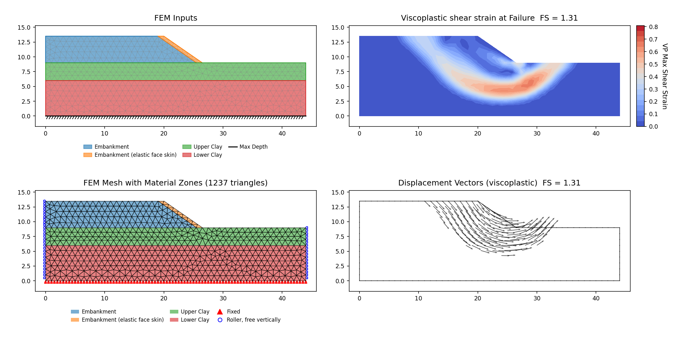

### RS2-10: Simple slope II (Arai & Tagyo ex. 1) {#rs2-10}

Slide2 counterpart: [VP14](rocscience.md#vp14) (Arai & Tagyo 1).

**Input files:** [xslope_arai_tagyo.xlsx](../lem/files/xslope_arai_tagyo.xlsx)

| Method | XSLOPE | RS2 SSRM | XSLOPE LEM | Slide2 LEM |
|---|---|---|---|---|
| SSRM | 1.411 | 1.40 (+0.8%) | Bishop 1.404 / Spencer 1.401 | 1.409 / 1.406 |

<!-- test: file=../lem/files/xslope_arai_tagyo.xlsx, type=fem_ssrm, expected_fs=1.411, element_type=tri6, target_size=2.2, tolerance=0.02, f_min=1.2, f_max=1.7, max_iter=16000, tension_srf=false, k0=1, benchmark=RS2-10 -->

### RS2-11: Layered slope (Arai & Tagyo ex. 2) {#rs2-11}

Slide2 counterpart: [VP15](rocscience.md#vp15).

**Input files:** [vp015.xlsx](files/rocscience/vp015.xlsx)

| Method | XSLOPE | RS2 SSRM | Greco/Kim pattern search | XSLOPE LEM |
|---|---|---|---|---|
| SSRM | 0.406 | 0.41 (−1.0%) | 0.39–0.43 | 0.419–0.422 |

*Scored against Part IV VP15's RS2 SSRM 0.41, the value published for the model vp015.xlsx is
built from. RS2 ran this deck twice and the two runs are input-identical field for field: the
Parts I–III native `#011` model and the Part IV Slide2-import `#015` model differ only in how
the strength reduction treats tension — the native run reduces tensile strength brittly
(residual T = 0), the import run holds it perfectly plastic (Tr = T), which is what
XSLOPE's FEM does. The native model's published factor is 0.39, and XSLOPE's 0.406 sits inside
the vendor's own 0.39–0.41 spread on identical inputs. RS2's own SSRM is the only pairing that
governs here: the 0.39–0.43 figure is a band stitched from Greco's and Kim's separate pattern
searches, which the page's conventions exclude, and Arai & Tagyo's own factor is a Bishop
value — a different method.*

<!-- test: file=files/rocscience/vp015.xlsx, type=fem_ssrm, expected_fs=0.406, element_type=tri6, target_size=1.9, tolerance=0.02, f_min=0.25, f_max=0.65, max_iter=16000, tension_srf=false, k0=1, benchmark=RS2-11 -->

### RS2-12: Simple slope + water table (Arai & Tagyo ex. 3) {#rs2-12}

Slide2 counterpart: [VP16](rocscience.md#vp16).

**Input files:** [vp016.xlsx](files/rocscience/vp016.xlsx)

| Method | XSLOPE | RS2 SSRM | XSLOPE LEM |
|---|---|---|---|
| SSRM | 1.098 | 1.09 (+0.7%) | Bishop 1.112 / Spencer 1.113 |

The FEM piezo pore pressure uses the vertical-distance convention, consistent with the LEM
slicer and the published analyses.

<!-- test: file=files/rocscience/vp016.xlsx, type=fem_ssrm, expected_fs=1.098, element_type=tri6, target_size=1.3, tolerance=0.02, f_min=0.9, f_max=1.45, max_iter=16000, tension_srf=false, k0=1, benchmark=RS2-12 -->

### RS2-13: Simple slope III (Yamagami & Ueta) {#rs2-13}

Slide2 counterpart: [VP17](rocscience.md#vp17).

**Input files:** [vp017.xlsx](files/rocscience/vp017.xlsx)

| Method | XSLOPE | RS2 SSRM | Greco Spencer | XSLOPE LEM | Yamagami & Ueta |
|---|---|---|---|---|---|
| SSRM | 1.332 | 1.33 (+0.2%) | 1.33 | Bishop 1.342 / Spencer 1.340 | 1.348 / 1.339 |

<!-- test: file=files/rocscience/vp017.xlsx, type=fem_ssrm, expected_fs=1.332, element_type=tri6, target_size=0.5, tolerance=0.02, f_min=1.1, f_max=1.65, max_iter=16000, tension_srf=false, k0=1, benchmark=RS2-13 -->

### RS2-14: Simple slope, pore pressure by ru {#rs2-14}

Slide2 counterpart: [VP18](rocscience.md#vp18) (this problem is Slide2 VP18, not VP21). Built
with a caveat.

**Input files:** [vp018.xlsx](files/rocscience/vp018.xlsx)

| Method | XSLOPE | RS2 SSRM | Slide2 Spencer | Baker | XSLOPE LEM |
|---|---|---|---|---|---|
| SSRM (regression lock at the 2.0 m mesh) | 0.916 | 0.98 (−6.5%) | 1.01 | 1.02 | Spencer 1.033 |

The SSRM factor on *this* model does not
become mesh-independent: 0.972 → 0.916 → 0.859 → 0.859 as the target size goes 2.8 → 2.0 →
1.4 → 1.0 m, the last two rungs landing in one cell of the strength-reduction bracket rather
than on a demonstrated plateau. The tag pins 2.0 m (0.916) as a regression lock, chosen
mid-sweep rather than at either end; what the model supports is a value between roughly 0.86 and
0.97, below RS2 SSRM 0.98, Slide2 Spencer 1.01 and Baker 1.02.

The drift belongs to the pore-pressure state rather than to the geometry. With ru = 0.5
half the overburden is cancelled, leaving so little effective confinement that the shear band keeps
localizing as the elements shrink — unregularized Mohr-Coulomb has no length scale to stop it, and
a tension cutoff changes nothing. The same loading is what makes [#27](#rs2-27) mesh-sensitive at
the milder ru = 0.2, where it settles instead of drifting. LEM locks Spencer 1.033 on the
same file.

<!-- test: file=files/rocscience/vp018.xlsx, type=fem_ssrm, expected_fs=0.972, element_type=tri6, target_size=2.8, tolerance=0.02, f_min=0.7, f_max=1.3, max_iter=16000, tension_srf=false, k0=1, benchmark=RS2-14-m2.8 -->
<!-- test: file=files/rocscience/vp018.xlsx, type=fem_ssrm, expected_fs=0.859, element_type=tri6, target_size=1.4, tolerance=0.02, f_min=0.7, f_max=1.3, max_iter=16000, tension_srf=false, k0=1, benchmark=RS2-14-m1.4 -->
<!-- test: file=files/rocscience/vp018.xlsx, type=fem_ssrm, expected_fs=0.859, element_type=tri6, target_size=1.0, tolerance=0.02, f_min=0.7, f_max=1.3, max_iter=16000, tension_srf=false, k0=1, benchmark=RS2-14-m1.0 -->
<!-- test: file=files/rocscience/vp018.xlsx, type=fem_ssrm, expected_fs=0.916, element_type=tri6, target_size=2.0, tolerance=0.02, f_min=0.7, f_max=1.3, max_iter=16000, tension_srf=false, k0=1, benchmark=RS2-14 -->

### RS2-15: Layered slope II (Greco ex. 4 / Yamagami & Ueta) {#rs2-15}

Slide2 counterpart: [VP19](rocscience.md#vp19).

**Input files:** [vp019.xlsx](files/rocscience/vp019.xlsx)

| Method | XSLOPE | RS2 SSRM (Part IV VP19) | Slide2 Spencer | Greco |
|---|---|---|---|---|
| SSRM | 1.372 | 1.38 (−0.6%) | 1.398 | 1.40–1.42 |

This file is the Slide2 VP19 model, so its pairing is Part IV VP19's SSR **1.38** (−0.6%). RS2's
Part IV model constrains that run — its `.fez` carries a four-vertex SSR Search Area, the manual
noting it "was used to define the slope limits in RS2" — where the corpus run is unconstrained;
the two agree anyway, and RS2's own native rebuild (Part I problem 15, unconstrained) publishes
1.39 on the same slope, so nothing on this problem turns on the constraint.

<!-- test: file=files/rocscience/vp019.xlsx, type=fem_ssrm, expected_fs=1.372, element_type=tri6, target_size=4.33, tolerance=0.02, f_min=1.1, f_max=1.7, max_iter=16000, tension_srf=false, k0=1, benchmark=RS2-15 -->

### RS2-16: Layered slope and water table with weak seam (Greco ex. 5 / Chen & Shao) {#rs2-16}

Slide2 counterpart: [VP20](rocscience.md#vp20).

**Input files:** [vp020.xlsx](files/rocscience/vp020.xlsx)

| Method | XSLOPE | Governing | RS2 SSRM | Slide2 Spencer | XSLOPE LEM |
|---|---|---|---|---|---|
| SSRM | 0.978 | Greco 0.973–1.1 (inside) | 1.02 (−4.1%) | 1.093 circular / 1.007 noncircular | 1.086–1.091 |

*Greco's own published range is the source author's factor and governs; RS2's SSRM is the
same-method vendor pairing at −4.1%. Nearly mesh-invariant: 0.978 at 4.0 and 3.0 m, easing to
0.959 at 2.2 m. The LEM locks
run on the same file.*

The model's base is an *inclined* polygon boundary. Displacements are fixed along the whole
bottom polyline (see [#22](#rs2-22)) rather than only at the nodes of the single lowest
elevation; supported at one corner alone, a body on an inclined base reaches equilibrium at
no F at all.

<!-- test: file=files/rocscience/vp020.xlsx, type=fem_ssrm, expected_fs=0.978, element_type=tri6, target_size=4.0, tolerance=0.02, f_min=0.8, f_max=1.4, max_iter=16000, tension_srf=false, k0=1, benchmark=RS2-16-m4.0 -->
<!-- test: file=files/rocscience/vp020.xlsx, type=fem_ssrm, expected_fs=0.959, element_type=tri6, target_size=2.2, tolerance=0.02, f_min=0.8, f_max=1.4, max_iter=16000, tension_srf=false, k0=1, benchmark=RS2-16-m2.2 -->
<!-- test: file=files/rocscience/vp020.xlsx, type=fem_ssrm, expected_fs=0.978, element_type=tri6, target_size=3.0, tolerance=0.02, f_min=0.8, f_max=1.4, max_iter=16000, tension_srf=false, k0=1, benchmark=RS2-16 -->

### RS2-17: Slope with three pore pressure conditions (Fredlund & Krahn) {#rs2-17}

Slide2 counterpart: [VP21](rocscience.md#vp21).
Built for the dry and ru cases.

**Input files:** [vp021a.xlsx](files/rocscience/vp021a.xlsx),
[vp021b.xlsx](files/rocscience/vp021b.xlsx)

| Method | XSLOPE | RS2 SSRM (Part IV VP21) | Slide2 | Fredlund & Krahn |
|---|---|---|---|---|
| SSRM (vp021a, dry) | 1.987 | 1.98 (+0.4%) | M-P 2.075 | 2.076 |
| SSRM (vp021b, ru = 0.25) | 1.692 | 1.68 (+0.7%) | 1.760–1.763 | 1.761–1.766 |

Both files are the Slide2 VP21 model, so the pairings are Part IV VP21's SSR column, which prints
a value for every one of the three pore-pressure cases (1.98 / 1.68 / 1.77) — as does RS2's own
native rebuild at Part I problem 17 (2.0 / 1.68 / 1.78). Neither model carries an SSR polygon on
any case. The water-table case (VP21 case 3) is not built.

<!-- test: file=files/rocscience/vp021a.xlsx, type=fem_ssrm, expected_fs=1.987, element_type=tri6, target_size=3.0, tolerance=0.02, f_min=1.6, f_max=2.5, max_iter=16000, tension_srf=false, k0=1, benchmark=RS2-17 -->
<!-- test: file=files/rocscience/vp021b.xlsx, type=fem_ssrm, expected_fs=1.692, element_type=tri6, target_size=3.0, tolerance=0.02, f_min=1.2, f_max=2.2, max_iter=16000, tension_srf=false, k0=1, benchmark=RS2-17b -->

**Dry case (vp021a)**

**ru = 0.25 case (vp021b)**

### RS2-18: Three pore pressure conditions and a weak seam (Fredlund & Krahn) {#rs2-18}

Slide2 counterpart: [VP22](rocscience.md#vp22). Built for the dry and ru cases.

**Input files:** [vp022a.xlsx](files/rocscience/vp022a.xlsx),
[vp022b.xlsx](files/rocscience/vp022b.xlsx)

| Method | XSLOPE | RS2 SSRM (native) | RS2 SSRM (Part IV) | Slide2 | Fredlund & Krahn |
|---|---|---|---|---|---|
| SSRM (vp022a, dry) | 1.323 | 1.34 | 1.26 (+5.0%) | Bishop 1.382 | — |
| SSRM (vp022b, ru = 0.25) | 1.042 | 1.05 | 0.99 (+5.3%) | 1.124 | 1.124 |

*Both files are the Slide2 VP22 model, so the Part IV column is the pairing. The native column is
the same vendor's second solution of the same problem, −1.3% and −0.8% from XSLOPE.*

This one returns the *same* factor at 3.0 m and 2.0 m — the mechanism is pinned by the weak
seam, a geometric feature, so it cannot migrate with refinement. The contrast with
[#14](#rs2-14) is the point: there, nothing pins the band. The water-table case is not built.

**RS2 solved this problem twice, and the provenance rule fixes which answer the row is scored
against.** The corpus files are the Slide2 VP22 model, so the pairing is the Part IV value, as on
every other `vpNNN.xlsx` row. Neither vendor model is constrained on these two cases: the Part IV
`.fez` files for cases 1 and 2 carry no SSR polygon (only the un-built case 3, water table,
does), and RS2's native rebuild is unconstrained as well, over geometry identical to the Part IV
twin's. That both runs are unconstrained makes the native column an informative second reading of
the same problem rather than a second pairing.

RS2's native model (Part II problem 18) publishes **1.34 / 1.05 / 1.13** for the three cases and
its Part IV twin publishes **1.26 / 0.99 / 1.15** — about 6% apart on cases 1 and 2. That spread
is the vendor's own scatter between two runs of one problem, and it is wider than the distance
from either of them to XSLOPE, which lands at +5.0% and +5.3% on the Part IV pair and −1.3% and
−0.8% on the native one. The dot follows the Part IV pairing, so this row is scored at the wider
of the two. Where a vendor's own two answers disagree by more than the thing being measured, that
spread is part of what the published value is worth, and the section records both readings.

<!-- test: file=files/rocscience/vp022a.xlsx, type=fem_ssrm, expected_fs=1.323, element_type=tri6, target_size=2.0, tolerance=0.02, f_min=1.0, f_max=1.7, max_iter=16000, tension_srf=false, k0=1, benchmark=RS2-18-m2.0 -->
<!-- test: file=files/rocscience/vp022a.xlsx, type=fem_ssrm, expected_fs=1.323, element_type=tri6, target_size=3.0, tolerance=0.02, f_min=1.0, f_max=1.7, max_iter=16000, tension_srf=false, k0=1, benchmark=RS2-18 -->
<!-- test: file=files/rocscience/vp022b.xlsx, type=fem_ssrm, expected_fs=1.042, element_type=tri6, target_size=3.0, tolerance=0.02, f_min=0.8, f_max=1.8, max_iter=16000, tension_srf=false, k0=1, benchmark=RS2-18b -->

**Dry case (vp022a)**

**ru = 0.25 case (vp022b)**

### RS2-19: Undrained layered slope (Low 1989) {#rs2-19}

Slide2 counterpart: [VP24](rocscience.md#vp24) (this problem is Slide2 VP24). Built with a
caveat.

**Input files:** [vp024.xlsx](files/rocscience/vp024.xlsx)

| Method | XSLOPE | Governing | RS2 SSRM | Slide2 LEM |
|---|---|---|---|---|
| SSRM | 1.477 at the tagged mesh | Low 1.44 (+2.6%) | 1.41 (+4.8%) | 1.439 |

*Low's own factor is the source author's and governs; RS2's SSRM is the same-method vendor
pairing at +4.8%, and the two SSRM values straddle the LEM.*

The geometry follows the RS2 vendor `.fez`: three equal 4.5 m layers (crest y = 13.5, slope
break x = 33.5), which makes the weak Middle layer (c = 20) a full 4.5 m thick. The two SSRM
values straddle the LEM from opposite sides on this φ = 0 slope; the XSLOPE factor is quoted at
the tagged mesh per the page convention.

<!-- test: file=files/rocscience/vp024.xlsx, type=fem_ssrm, expected_fs=1.477, element_type=tri6, target_size=1.0, tolerance=0.02, f_min=1.1, f_max=1.8, max_iter=16000, tension_srf=false, k0=1, benchmark=RS2-19 -->

### RS2-20: Slope with vertical load (Prandtl's wedge) {#rs2-20}

Slide2 counterpart: [VP25](rocscience.md#vp25).

**Input files:** [vp025.xlsx](files/rocscience/vp025.xlsx)

| Method | XSLOPE | RS2 SSRM (Part IV VP25) | Prandtl theory | Slide2 Spencer |
|---|---|---|---|---|
| SSRM | 1.003 | 1.01 (−0.7%) | 1.0 (+0.3%) | 1.051 on the specified surface |

The file is the Slide2 VP25 model, so its pairing is Part IV VP25's SSR **1.01** (−0.7%). That
vendor run was constrained — `#025.fez` carries a ten-vertex SSR Exclusion Area, which the manual
says was used "to ensure the predetermined Slide2 geometry" — where the corpus run is
unconstrained; on this problem the mechanism is the Prandtl wedge either way, and RS2's own
unconstrained native rebuild (Part I problem 20) publishes 1.0. The closed form is 1.0 and is a
reference authority in its own right here.

<!-- test: file=files/rocscience/vp025.xlsx, type=fem_ssrm, expected_fs=1.003, element_type=tri6, target_size=0.8, tolerance=0.01, f_min=0.5, f_max=1.6, max_iter=16000, tension_srf=false, k0=1, benchmark=RS2-20 -->

### RS2-21: Bearing capacity test prism (Prandtl II) {#rs2-21}

Slide2 counterpart: [VP26](rocscience.md#vp26).

**Input files:** [vp026.xlsx](files/rocscience/vp026.xlsx)

| Method | XSLOPE | RS2 SSRM | Prandtl theory | Slide2 Spencer |
|---|---|---|---|---|
| SSRM | 1.011 | 1.01 (+0.1%) | 1.0 (+1.1%) | 0.941 on the specified surface |

*The SSRM converges on the theory value from above.*

<!-- test: file=files/rocscience/vp026.xlsx, type=fem_ssrm, expected_fs=1.011, element_type=tri6, target_size=0.8, tolerance=0.01, f_min=0.5, f_max=1.6, max_iter=16000, tension_srf=false, k0=1, benchmark=RS2-21 -->

### RS2-22: Layered slope with undulating bedrock {#rs2-22}

Slide2 counterpart: [VP27](rocscience.md#vp27). Built on an SSRM variant.

**Input files:** [vp027_fem.xlsx](files/rocscience/vp027_fem.xlsx)

| Method | XSLOPE | Published |
|---|---|---|
| SSRM | 1.534 | RS2 SSRM 1.52 (+0.9%) |

*Measured on the vendor's own model formulation.*

Two features of the FEM matter on this model. Displacements are fixed along the whole bottom
*polyline* of the domain rather than only the nodes at the lowest elevation, which an
undulating bedrock base requires (as at [#16](#rs2-16)); and the FEM applies the
phreatic-inclination (Hu) correction this problem specifies, matching the LEM's
Type=phreatic path.

The SSRM runs on [vp027_fem.xlsx](files/rocscience/vp027_fem.xlsx), which reconstructs the
RS2 vendor `.fez`. The published model caps the crest with a **zero-strength** layer
(c = 0, φ = 0) — a limit-equilibrium device, dead weight riding above the failure surface. A
null Mohr-Coulomb yield surface has no continuum equivalent, so the RS2 vendor does not mesh
that cap as a material at all: it applies the cap's dead weight as two boundary distributed
loads (a 0 → 1280 psf triangular taper over x = 101–138 as the cap thins to the crest edge,
then a uniform 1280 psf to x = 200), on a single-material continuum carried at a constant
total unit weight γ = 124.2 pcf. This reconstruction adopts that formulation in every
respect: loads, magnitudes, extents, unit weight, the vendor's 9-vertex phreatic
(Hu-corrected) water table — and the load **direction**.

**The load direction is worth 1.577 → 1.534 in the SSRM, 2.8%.** The vendor declares both crest
loads `type: "vertical"`: dead weight, with no horizontal component. XSLOPE's default is to
apply a distributed load perpendicular to the loaded surface, which is right for water
pressure and wrong for a surcharge; the `dloads` sheet's
[Direction](../usage/input_template.md#worksheet-dloads) option selects between the two, and
this file sets both blocks to `vertical`. The loaded crest runs (101, 88) → (200, 99), an
inclination of 6.34°, so the surface-normal reading would add a horizontal thrust of
tan 6.34° = 11.1% of the surcharge, directed into the hill and against the sliding direction
— i.e. stabilizing. The surface-normal reading 1.577 sits +3.8%
from RS2's 1.52, and the vendor's own vertical direction 1.534 sits +0.9%.

The limit-equilibrium slicer is about three times as sensitive to it. On the problem's own
published critical circle (center 59.52, 219.21; R = 157.68) at 50 slices, holding every
other input fixed:

| Method | load resolved normal | load resolved vertical | normal reads |
|---|---|---|---|
| Ordinary (OMS) | 1.568 | 1.456 | +7.7% |
| Bishop simplified | 1.601 | 1.492 | +7.3% |
| Spencer | 1.600 | 1.491 | +7.3% |

The difference between +7.3% there and +2.8% in the SSRM is not a discrepancy: the LEM figure
is the effect on one prescribed circle, where the thrust acts along the whole loaded crest of
a fixed surface, while the SSRM is free to find a mechanism that engages less of that crest.
The circle measurement therefore brackets the effect from above, and only the SSRM number
scores this row.

vp027's LEM locks stand on the as-published [vp027.xlsx](files/rocscience/vp027.xlsx), which carries no
distributed loads at all and is unaffected.

<!-- test: file=files/rocscience/vp027_fem.xlsx, type=fem_ssrm, expected_fs=1.534, element_type=tri6, target_size=2.5, tolerance=0.02, f_min=1.2, f_max=1.9, max_iter=16000, tension_srf=false, k0=1, benchmark=RS2-22 -->

### RS2-23: Underwater slope with linearly varying cohesion {#rs2-23}

Slide2 counterpart: [VP29](rocscience.md#vp29). Duncan's (2000) LASH terminal slope at the
Port of San Francisco: San Francisco Bay Mud, Su = 100 psf at el. −20 growing
9.8 psf/ft with depth, γ = 100 pcf, fully submerged below el. 0.

**Input files:** [vp029_split.xlsx](files/rocscience/vp029_split.xlsx) — the
[VP29](rocscience.md#vp29) model with RS2's own strength-reduction constraint carried as a
material partition.

**Where RS2's "can't fail" region is.** The published text places the elastic region "above
elevation −20 and to the right of the bench". The vendor model places it elsewhere: in
`slope stability #023` the Mohr-Coulomb elements (471 of 969) union to a seven-vertex polygon
that is a **full-depth vertical band** between two clean cuts at x = 70.755 and x = 350.168 —
the same two x values the file carries as internal material boundary lines, and identical from
a 0.05 ft to a 2 ft simplify tolerance. The corpus file reproduces that band, which covers
48.8% of the domain by area against the vendor's own 48.9% element-area fraction (48.6% by element count); the two pieces outside it
carry identical soil properties and are held elastic at solve time. Both materials take the
vendor's elastic pair (ν = 0.4, E = 10⁶ psf) and the band carries `rock1`'s cap T = 100 psf.

| Case | XSLOPE SSRM | RS2 SSRM | LEM anchor ([VP29](rocscience.md#vp29)) |
|---|---|---|---|
| Under RS2's own partition (vp029_split) | **1.112** | 1.12 (−0.7%) | Spencer 1.145 on Duncan's surface |
| Same model, partition removed | 0.215 | — | — |

The second row is what makes the first a comparison rather than a coincidence. Remove the
partition from the same model and the reduction goes straight to the shallow skin above
el. −20 at **0.215**; put it back and the factor rises to 1.112. Nothing else changes between
the two, so the 1.112 is a measurement of the vendor's constraint acting on this slope's
mechanics, and it sits 0.7% below RS2's published 1.12 with the LEM anchor bracketing it from
above, as an SSRM/LEM pair should.

<!-- test: file=files/rocscience/vp029_split.xlsx, type=fem_ssrm, expected_fs=0.215, element_type=tri6, target_size=6.0, tolerance=0.02, f_min=0.1, f_max=1.5, max_iter=16000, tension_srf=false, k0=1, benchmark=RS2-23-nopartition -->
<!-- test: file=files/rocscience/vp029_split.xlsx, type=fem_ssrm, expected_fs=1.112, element_type=tri6, target_size=6.0, tolerance=0.02, f_min=0.8, f_max=1.5, max_iter=16000, tension_srf=false, k0=1, elastic_materials=Bay Mud (elastic outer 1);Bay Mud (elastic outer 2), benchmark=RS2-23 -->

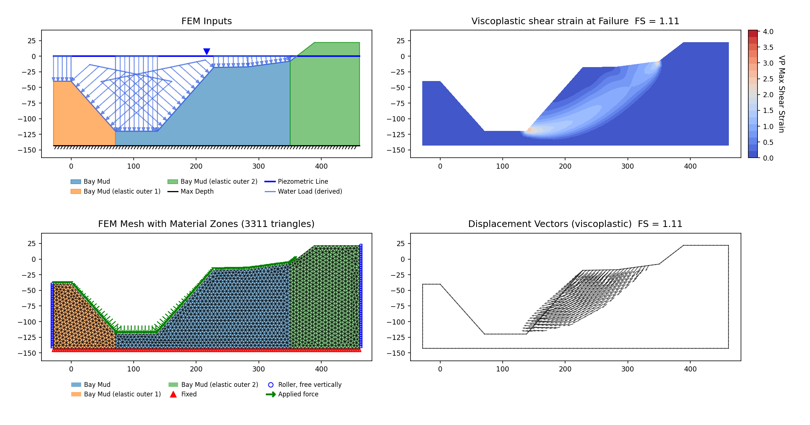

### RS2-24: Layered slope with geosynthetic reinforcement {#rs2-24}

Slide2 counterpart: [VP32](rocscience.md#vp32).

**Input files:** [vp032a.xlsx](files/rocscience/vp032a.xlsx) (unconstrained) ·
[vp032a_skin.xlsx](files/rocscience/vp032a_skin.xlsx) (elastic face skin) ·
[vp032c.xlsx](files/rocscience/vp032c.xlsx) ·
[vp032c_skin.xlsx](files/rocscience/vp032c_skin.xlsx) (elastic face skin)

**Both** cases have two answers, and all four are reproduced: the **unconstrained** critical SRF
(a shallow cohesionless face skin) and the **deep reinforced** SRF that RS2 forces with a
"can't-fail" elastic face-skin zone. RS2's two published factors, 1.15 and 0.95, are both the
second kind — its `#024_01` and `#024_02` models each assign 14 elements of the face strip to
duplicate materials with *"Plasticity Specifications: None"*.

| Method | XSLOPE | RS2 SSRM | Which vendor model |
|---|---|---|---|
| SSRM, unconstrained (vp032a, H = 7) | 0.850 | — | true global minimum; no unconstrained vendor run exists |
| SSRM, elastic face skin (vp032a_skin, H = 7) | 1.080 | 1.15 (−6.1%) | Part I problem 24 case 1, the native model this construction is read from |
| SSRM, unconstrained (vp032c, H = 8.75) | 0.870 | — | true global minimum; no unconstrained vendor run exists here either |
| SSRM, elastic face skin (vp032c_skin, H = 8.75) | 0.957 | 0.95 (+0.7%) | Part I problem 24 case 2, which carries the same skin |

*Geotextile as an FEM truss with the vendor `.fez` stiffness EA = 2×10⁵ kN/m and capacity
Ft = 200 kN/m, running the full 48.9 m (x = −50 to −1.107). The vendor's brittle residual
Ftr = 0 is not carried — xslope's FEM reinforcement has no post-peak-drop path — so the bar
holds its capacity after yield (a documented residual-law difference).*

**Unconstrained minimum (vp032a, 0.850).** vp032a fails as a partly-restrained cohesionless face
skin, like [RS2-4](#rs2-4)/[RS2-40](#rs2-40): both embankment fills are c = 0 on 39.1° faces, so
the unreinforced infinite-slope band is tan 35°/tan 39.1° = 0.861 (upper fill) to
tan 33°/tan 39.1° = 0.799 (lower); the stiff geotextile lifts the SSRM to 0.850, near the top of
that band, with the out-of-balance nodes still hugging the face. This is the true global minimum with every
zone reduced. Applying the vendor geotextile's stress-dependent bond as a
[bond-slip](../fem/reinforcement.md#bond-slip-load-transfer-optional) load-transfer envelope
(joint c = 0, φ = 30.96°) does not move the SSRM at all — the governing failure is
the unreinforced cohesionless face skin, which the geotextile bond does not restrain.

The Slide2-import model carries a constraint on this case — `#032-1` draws an SSR *search* area
and makes the materials outside it linear-elastic duplicates — so its published factor describes a
constrained run. RS2 publishes no *unconstrained* factor for this case at all, so the 0.850 lock
has no vendor partner; it is anchored by the closed-form band above and reported as the model's
own global minimum.

**Elastic face skin (vp032a_skin, 1.080) vs RS2's 1.15.** This file is built from RS2's *native*
`#024_01` model rather than the Slide2-import twin, so its pairing is that model's own published
value — Part I problem 24's SSRM **1.15**. RS2's 1.15 is likewise not the
unconstrained minimum: the vendor `.fez` (#024_01) defines an internal boundary
(boundary 9: (−9.5, 7) → (−2.214, 1) → (−2.093, 0.9) → (−1, 0)) tracing a ~0.75–1 m strip inboard
of the 39.1° face, and assigns the elements inside it to duplicate materials ("embankment
upper/lower elastic") with **Plasticity Specifications: None** — identical c/φ/γ to the embankment
fills but purely elastic, so the SRF sweep can never fail the cohesionless face skin. That forces
the mechanism onto the deep reinforced surface. vp032a_skin.xlsx replicates the construction
exactly: the same strip is carved into its own two zones (meshing to 10 upper + 4 lower elements,
matching the vendor's element bboxes) with identical properties, held elastic via
`elastic_materials`; the split is inert to a normal MC solve. The constrained SSRM gives **1.080**
(−6.1% vs RS2's 1.15), and the critical shear band drops off the face onto the deep reinforced
surface — confirming the skin redirected the mechanism, exactly as vp067c's SSR Exclusion Area
does for [RS2-P4-VP67](#p4-vp67).

The same `.fez` also draws an SSR *exclusion* area (`#032-2`) over a thicker wedge that contains
the whole strip — all 14 strip elements lie inside it — so the two are alternative readings of one
construction rather than two constraints to stack. Held elastic, the wedge reads **1.255**, +9.1%
on RS2's 1.15, where the strip's 1.080 is −6.1% on the same 1.15: the strip is the closer of the
two, and it is the reading this row locks. That 1.255 predates the current mesher and the corpus
carries no wedge variant to rebuild it on, so it is quoted without a mesh of its own — and on a
model whose factor of safety follows the element size, a factor without its mesh is a bearing
rather than a lock.

**vp032c (H = 8.75, 0.870) is unconstrained, and so has no vendor partner.** It fails as a
shallow toe/foundation mechanism, and the tag value sits just above the face-skin closed form
(0.80–0.86) rather than inside it; refine the mesh and the closed form takes over, as it does
for vp032a. That resolution dependence is the same one
[RS2-48](#rs2-48) describes: the failing band runs through c = 0 fill, which carries no length
scale of its own, so it collapses onto the element size and the factor of safety falls as the
face is resolved more finely. The tag is a regression lock at the 2.2 m mesh, not a
mesh-converged value. Like vp032a it is reported as the model's own global
minimum, because **neither** published RS2 factor for this case is an unconstrained run.

**Elastic face skin (vp032c_skin, 0.957) vs RS2's 0.95.** `#024_02` carries the identical
construction to `#024_01` — internal boundary 9 traced from (−11.7, 8.75) through
(−2.223, 1) and (−2.101, 0.9) to (−1, 0), and 14 elements inside it (4 lower + 10 upper) assigned
to the duplicate "Plasticity Specifications: None" materials. vp032c_skin carves that same strip
into its own two zones, 7.480 + 0.996 = **8.4766 m²** against the vendor's own 8.4766 m², and
holds them elastic through `elastic_materials`. At the vendor's own mesh density (2 468 tri6
against its 2 462 over the same 2 468 m²) the constrained SSRM is **0.957**, +0.7% on RS2's 0.95;
at the coarser 2.2 m mesh the unconstrained twin uses it reads 1.012. The skin is what separates
this case from its unconstrained twin: carrying it lifts the factor of safety clear of the
unconstrained 0.870 and onto the vendor's own value.

**Mesh.** Both skin rows are locked at a 1.65 m target size, which is the size that reproduces
the vendor's discretization — 2 431 tri6 on the H = 7 model against RS2's own 2 442, and 2 468 on
the H = 8.75 model against its 2 462. The density is matched because on this problem it
decides the answer. The band that fails runs through c = 0 fill, which carries no length scale of
its own, so the mechanism localizes on the element size and the factor of safety falls as the
face is resolved. On vp032a_skin it reads 1.234 at 827 elements, 1.223 at 1 407, 1.080 at 2 431,
1.091 at 2 916 and 1.015 at 4 373, with node placement scattering adjacent stations enough to
cross; nowhere in that range does it settle. Placement decides it as much as count: solved on the
vendor's own H = 7 mesh, its 2 442 elements read node for node from the published model, the same
solver reads 1.048 where XSLOPE's 2 431-element mesh reads 1.080 — eleven elements apart, on a
model whose band carries no length scale. RS2's 1.15 is bound to its own discretization the
same way, so the comparison is made at the vendor's element count rather than at a mesh of
XSLOPE's choosing. It is the resolution dependence [RS2-48](#rs2-48) describes, and the same one
the unconstrained vp032c run above carries.

**One construction difference this row carries.** RS2's `#024` models do not mesh the section as
one body: the solid mesh is split along the geotextile into two, 39 coincident node pairs joined
by a frictional slip interface (c = 0, φ = 30.96°) with the geotextile itself as beam elements
along it. XSLOPE transcribes a bonded continuum with a truss and has no interface element, so the
difference between this row and RS2's factor is a construction difference as well as a solver one.

Part IV VP32 case 3 publishes **0.98** for the Slide2-import model `#032-3`, a third constraint
again — a search area matched by a linear-elastic material partition outside it. Each vendor
factor for this problem is produced under its own construction, and each locked run above is
quoted against the vendor model built the same way as it is.

RS2's fully labeled figures also supplied the geometry that unlocked Slide2's
[VP32](rocscience.md#vp32) — LEM locks on the three printed circles live there.

<!-- test: file=files/rocscience/vp032a.xlsx, type=fem_ssrm, expected_fs=0.850, element_type=tri6, target_size=1.5, tolerance=0.02, f_min=0.9, f_max=1.6, max_iter=16000, tension_srf=false, k0=1, benchmark=RS2-24a -->
<!-- test: file=files/rocscience/vp032a_skin.xlsx, type=fem_ssrm, expected_fs=1.080, element_type=tri6, target_size=1.65, tolerance=0.02, f_min=0.9, f_max=1.6, max_iter=16000, elastic_materials=Upper embankment (elastic skin);Lower embankment (elastic skin), tension_srf=false, k0=1, benchmark=RS2-24a-skin -->
<!-- test: file=files/rocscience/vp032c.xlsx, type=fem_ssrm, expected_fs=0.870, element_type=tri6, target_size=2.2, tolerance=0.02, f_min=0.7, f_max=1.4, max_iter=16000, tension_srf=false, k0=1, benchmark=RS2-24b -->
<!-- test: file=files/rocscience/vp032c_skin.xlsx, type=fem_ssrm, expected_fs=0.957, element_type=tri6, target_size=1.65, tolerance=0.02, f_min=0.7, f_max=1.4, max_iter=16000, elastic_materials=Upper embankment (elastic skin);Lower embankment (elastic skin), tension_srf=false, k0=1, benchmark=RS2-24b-skin -->

**H = 7 case, unconstrained (vp032a) — partly-restrained cohesionless face skin**

**H = 7 case, elastic face skin (vp032a_skin) — deep reinforced mechanism**

**H = 8.75 case, unconstrained (vp032c) — toe/foundation mechanism**

**H = 8.75 case, elastic face skin (vp032c_skin) — deep reinforced mechanism**

### RS2-25: Syncrude tailings dyke (El-Ramly et al. 2003) {#rs2-25}

Slide2 counterpart: [VP33](rocscience.md#vp33). Built with a caveat.

**Input files:** [vp033.xlsx](files/rocscience/vp033.xlsx)

| Method | XSLOPE | RS2 SSRM | Slide2 | El-Ramly | XSLOPE LEM |
|---|---|---|---|---|---|
| SSRM | 1.202 | 1.29 (−6.8%) | Bishop 1.305 | 1.31 | 1.320 on Slide's circle, 1.261 free composite |

Geometry, material zonation, unit weights and elastic constants follow the RS2 vendor `.fez`
(`slope stability #025.fez`): the 15-vertex external boundary, the four internal material
interfaces, the diagonal Pgc/Kca wedge cut, and ν = 0.4 with E = 50 000 kPa on every zone. The
vendor file gives Clayey till (Pgc) φ = 7.5°, equal to the clay-shale. The weak presheared
clay-shale rewards
less-constrained searches (XSLOPE's own LEM: 1.320 on Slide's circle, 1.261 free composite
search).

**Refinement does not close the deficit; it widens it.** The Glacio-fluvial sand band is only
3.3 m thick — thinner than one element at the tagged 5 m size, so it carries a single row of
quadratic triangles, and resolution is the natural place to look for a −6.8% deficit. It is not
there. At a 2.5 m target size the model meshes to 5 239 elements against the
tagged mesh's 1 457, and the strength reduction reads **1.174**, further below RS2's 1.29 rather
than nearer it; finer meshes continue in the same direction with no plateau. Nor is the tagged mesh
coarse against the vendor's own: RS2 solved this dyke at essentially the same density, 3 527 nodes
and 1 698 quadratic triangles against the tag's 3 080 and 1 457, marginally finer only in the two
upper thin bands.

**The corpus file carries one piezometric line where the vendor model carries two.** This is the
problem RS2 titles *"…with Multiple Phreatic Surfaces"*: its `.fea` assigns piezometric line 4 to
the Tailing sand and line 5 to the four zones beneath (`material piezos: {1:4, 2:5, 3:5, 4:5, 5:5}`),
and line 4 sits 0.7–3.6 m higher — 3.63 m at x = 125, 2.25 m at x = 250, closing to zero at
x = 475. The corpus file applies line 5 throughout, so 577 m² of the Tailing sand that the vendor
has saturated is dry here and the pore pressure along the tailings-sand base runs about 20% low.
That is a real difference from the vendor model and it is the caveat on this row — but it is the
*more* favourable of the two readings, since less pore pressure makes a slope read stronger, so it
cannot be what puts XSLOPE below the vendor.

The row's strength-reduction factor also sits 4.7 and 8.9% below XSLOPE's own two limit-equilibrium
readings on the same file, as well as 6.8% below RS2's SSR. That places this dyke with the small
group of models on this page whose SSRM falls further below the LEM on the same inputs than the
usual strength-reduction margin, which is a property of the solver rather than of this file: its
geometry, strengths, unit weights and elastic constants all match the vendor model field by field.
The value is locked at the tagged mesh as a regression anchor and the deficit is reported.

<!-- test: file=files/rocscience/vp033.xlsx, type=mesh_elements, element_type=tri6, target_size=5.0, expected_elements=1457, expected_nodes=3080, benchmark=RS2-25-mesh -->
<!-- test: file=files/rocscience/vp033.xlsx, type=mesh_elements, element_type=tri6, target_size=2.5, expected_elements=5239, benchmark=RS2-25-mesh-fine -->
<!-- test: file=files/rocscience/vp033.xlsx, type=fem_ssrm, expected_fs=1.174, element_type=tri6, target_size=2.5, tolerance=0.02, f_min=0.9, f_max=1.8, max_iter=16000, k0=1, benchmark=RS2-25-m2.5 -->
<!-- test: file=files/rocscience/vp033.xlsx, type=fem_ssrm, expected_fs=1.202, element_type=tri6, target_size=5.0, tolerance=0.02, f_min=0.9, f_max=1.8, max_iter=16000, k0=1, benchmark=RS2-25 -->

### RS2-26: Clarence Cannon dam (Wolff & Harr 1987) {#rs2-26}

Slide2 counterpart: [VP34](rocscience.md#vp34).

**Input files:** [vp034.xlsx](files/rocscience/vp034.xlsx)

| Method | XSLOPE | RS2 SSRM | Slide2 | Wolff & Harr | XSLOPE LEM |
|---|---|---|---|---|---|
| SSRM | 2.274 | 2.29 (−0.7%) | GLE 2.333 / Spencer 2.383 | 2.36 | M-P 2.384 |

Polygon zones with the chimney drain. This file reconstructs Slide2's VP34 model of the dam
(four zones: Phase I and Phase II fill, a sand drain, and a foundation sand), and its LEM lock
tracks Slide2's published Spencer/GLE. The RS2 vendor `.fez` models the same dam with a more
detailed six-zone section — a layered, higher-strength foundation (φ = 50° / 35°, γ = 150 pcf),
a distinct L-shaped filter/chimney drain (φ = 35°), and a high-strength downstream Spoil Fill
wedge (c = 3000 psf, φ = 60°). Those extra zones all sit **below or outside the governing
mechanism**: the critical surface runs 45° through the Phase II shell, horizontal along the
Phase I base at el. 516, and exits at the downstream waterline — never dropping into the
foundation (el. ≤ 514) or crossing the Spoil Fill. They therefore do not drive the modest
−0.7% SSRM gap, and are not reproduced here so as to keep the file faithful to the Slide2 VP34
model it is locked against.

*The SSRM value moved when the file gained its tailwater.* The model's piezometric line
stands above the downstream ground, so the section carries a pond on the downstream face. Its
weight is derived automatically (62 816 lb/ft) and applied as a traction. It is worth +0.9% to
the SSRM, 2.2535 without it against the 2.274 locked above, and nothing at all to the LEM rows:
the Slide2 circle exits at the waterline and never crosses the loaded stretch.

<!-- test: file=files/rocscience/vp034.xlsx, type=fem_ssrm, expected_fs=2.274, element_type=tri6, target_size=15.0, tolerance=0.02, f_min=1.7, f_max=3.0, max_iter=16000, tension_srf=false, k0=1, benchmark=RS2-26 -->

### RS2-27: Homogeneous slope, pore pressure by ru {#rs2-27}

Slide2 counterpart: [VP36](rocscience.md#vp36) (Li & Lumb 1987 / Hassan & Wolff 1999). Built;
the ru mesh-sensitivity documented on [RS2-14](#rs2-14) is mild enough here to settle.

**Input files:** [vp036.xlsx](files/rocscience/vp036.xlsx)

| Method | XSLOPE | RS2 SSRM | Slide2 | Hassan & Wolff |
|---|---|---|---|---|
| SSRM (regression lock at the 1.0 m mesh) | 1.342 | 1.31 (+2.4%) | Bishop 1.339 | 1.334 (deterministic) |

This homogeneous 2:1 slope (c' = 18 kPa, φ' = 30°, γ = 18 kN/m³, ru = 0.2) is the
deterministic core of the [VP36](rocscience.md#vp36) reliability benchmark. Its ru
loading is the same mechanism that makes [RS2-14](#rs2-14) mesh-dependent — ru cancels
part of the confinement, and unregularized Mohr-Coulomb has no length scale to arrest a localizing
band — but the milder ru = 0.2 here settles rather than drifts: 1.373 / 1.342 / 1.342 at
1.5 / 1.0 / 0.7 m target sizes, flat from the tagged mesh down. The tag pins the 1.0 m mesh (1.342),
which lands on the deterministic Slide2 Bishop 1.339 and Hassan & Wolff 1.334 and sits +2.4% above
RS2's SSRM 1.31.

<!-- test: file=files/rocscience/vp036.xlsx, type=fem_ssrm, expected_fs=1.373, element_type=tri6, target_size=1.5, tolerance=0.02, f_min=1.1, f_max=1.6, max_iter=16000, tension_srf=false, k0=1, benchmark=RS2-27-m1.5 -->
<!-- test: file=files/rocscience/vp036.xlsx, type=fem_ssrm, expected_fs=1.342, element_type=tri6, target_size=0.7, tolerance=0.02, f_min=1.1, f_max=1.6, max_iter=16000, tension_srf=false, k0=1, benchmark=RS2-27-m0.7 -->
<!-- test: file=files/rocscience/vp036.xlsx, type=fem_ssrm, expected_fs=1.342, element_type=tri6, target_size=1.0, tolerance=0.02, f_min=1.1, f_max=1.6, max_iter=16000, tension_srf=false, k0=1, benchmark=RS2-27 -->

### RS2-28: Excavated slope with FE groundwater and matric suction (Ng & Shi 1998) {#rs2-28}

Slide2 counterpart: [VP38](rocscience.md#vp38). A 28° Hong Kong cut (24 m soil over 6 m
bedrock); a steady unsaturated FE groundwater analysis at three far-field heads (H = 61 /
62 / 63 m) supplies both the positive and the negative (matric-suction) pore pressures, and
the SSRM reduces strength to failure. Material (manual Table 1): c′ = 10 kPa, φ′ = 38°,
φ_b = 15°, γ = 16 kN/m³.

**Input files:** [rs2_28a.xlsx](files/rocscience/rs2_28a.xlsx) /
[b](files/rocscience/rs2_28b.xlsx) / [c](files/rocscience/rs2_28c.xlsx) — geometry
from the vendor `.fea` external boundary; XSLOPE's own steady unsaturated Gardner seepage
supplies u (the [VP38](rocscience.md#vp38) pattern; the vendor result file is empty, so no
solved field can be imported). The domain is split into a Mohr-Coulomb corridor near the cut
('Cut soil', carrying φ_b) and an elastic outer zone ('Elastic outer'), reproducing the
vendor `.fea` material partition (`rock1` Mohr-Coulomb / `rock2` `Plasticity: None`). Both
materials carry the vendor's own elastic pair (ν = 0.4, E = 50 000 kPa), and the corridor
carries `rock1`'s tensile cap T = 10 kPa, held static through the reduction as the vendor
model does (`tensilestrength_SRF: 0`).

**Which vendor model these files are built from, and what that fixes the target to.** This problem
exists in the archive **four** ways over the identical 97.9 × 82.3 m domain: RS2's native
`#028_01/02/03` (one per far-field head), and both a native and an imported copy of `#038-1/-2/-3`.
The corpus files are built from the native `#028_0N` boundary and its material partition, which
holds **63%** of the domain elastic and draws **no SSR polygon at all** — the partition itself is
the constraint. The `#038-*` variants hold 53% and draw a polygon as well. So the values this row
is scored *against* are the Part I §28 table above (1.64 / 1.55 / 1.41), not the §38 numbers; a
rebuild from `#038-*` would change both the constraint and the target together.

| H | XSLOPE SSRM | RS2 (SSR) | Slide2 | [Ng & Shi (1998)](https://doi.org/10.1016/S0266-352X(97)00036-0) |
|---|---|---|---|---|
| 61 m | **1.606** | 1.64 (−2.1%) | 1.616 (−0.6%) | 1.636 (−1.8%) |
| 62 m | **1.506** | 1.55 (−2.8%) | 1.535 (−1.9%) | 1.527 (−1.4%) |
| 63 m | **1.381** | 1.41 (−2.1%) | 1.399 (−1.3%) | 1.436 (−3.8%) |

*Published values are from the RS2 *Slope Stability Verification Manual, Part 1*, §28
(Table 2). The manual's §38-derived cross-reference elsewhere quoting "1.56 / 1.46 / 1.32"
does not match this table.*

**The left edge is a boundary, not a slope.** The model is truncated far behind the cut, and
the vendor treats that truncation face as a support: all of its nodes are fixed in both
directions, with a constant total head of 6 m prescribed along the same line. The face is
drawn 0.13 m off vertical over its 30.7 m height, which leaves it neither a base segment nor
a side edge at the domain's x-extreme, so a literal transcription meshes it traction-free —
and the seepage field puts up to +172 kPa of pore pressure on it. A traction-free face under
that pore pressure carries an effective *tension* well beyond the Mohr-Coulomb apex at any
strength-reduction factor, so nothing equilibrates however strong the soil is made. The
corpus files draw the edge exactly vertical, which is what the vendor's restraint means
physically and what puts the face on the standard side-roller support.

**How suction is credited.** The manual's Table 1 gives Ng & Shi's modified Mohr-Coulomb
criterion, τ = c′ + (σ_n − u_a) tan φ′ + (u_a − u_w) tan φ_b with φ_b = 15°, and the corridor
material carries that angle.

**The tensile cap binds.** `rock1`'s T = 10 kPa sits below its own c′/tan φ′ apex of 12.8 kPa,
and the suction credit raises that apex further wherever the soil is unsaturated, so the cap is
an active limit on this problem rather than a formality. It is transcribed from the vendor model
and the locks are taken with it.

<!-- test: file=files/rocscience/rs2_28a.xlsx, type=fem_ssrm, expected_fs=1.606, tolerance=0.02, f_min=1.2, f_max=2.0, max_iter=16000, tension_srf=false, k0=1, benchmark=RS2-28a -->

<!-- test: file=files/rocscience/rs2_28b.xlsx, type=fem_ssrm, expected_fs=1.506, tolerance=0.02, f_min=1.2, f_max=2.0, max_iter=16000, tension_srf=false, k0=1, benchmark=RS2-28b -->

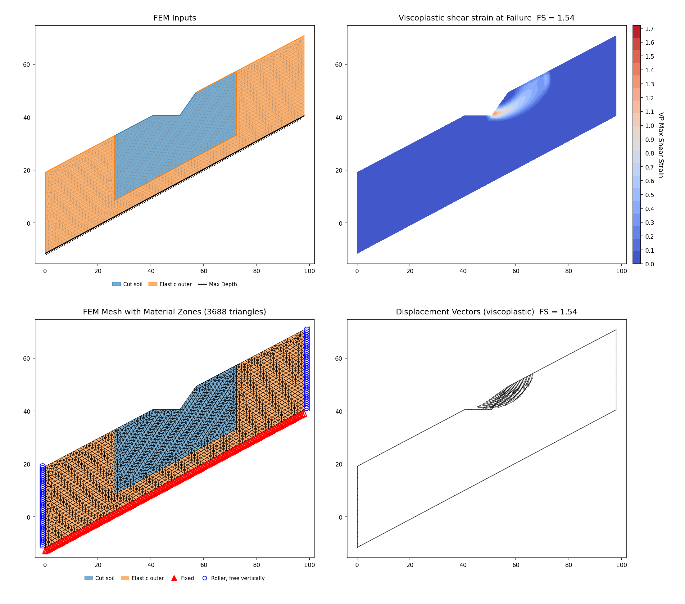

<!-- test: file=files/rocscience/rs2_28c.xlsx, type=fem_ssrm, expected_fs=1.381, tolerance=0.02, f_min=1.2, f_max=2.0, max_iter=16000, tension_srf=false, k0=1, benchmark=RS2-28c -->

### RS2-29: Geosynthetic-reinforced embankment on soft soil (Tandjiria 2002) {#rs2-29}

Slide2 counterpart: [VP39](rocscience.md#vp39). The manual's §29/§30 headings are swapped.
Built for both published cases — the sand embankment first, then RS2's own clay model.

**Input files:** [vp039c.xlsx](files/rocscience/vp039c.xlsx) (sand) /
[rs2_29clay.xlsx](files/rocscience/rs2_29clay.xlsx) (clay)

| Method | XSLOPE | RS2 SSRM (Part IV VP39 case 3) | Slide2 Spencer | Tandjiria |
|---|---|---|---|---|
| SSRM (sand case, vp039c, unconstrained) | 1.219 | 1.22 (−0.1%) | 1.209 | 1.219 |

**Which vendor model this file is, and why it runs unconstrained.** vp039c is the Slide2 VP39
**case 3** model — sand fill, *no reinforcement* — so its pairing is Part IV VP39 case 3's SSR
**1.22**, which the lock matches to −0.1%. That vendor model carries **no** SSR polygon
(`slope stability #039-sand-no reinforcement.fez` has an empty `SSR_polygonal_zones` block), and
neither does RS2's own native rebuild of the same case (Part I problem 29, "sand embankment with
no reinforcement", published 1.25). Both vendor twins ran the problem unconstrained, so the
corpus run does too, and the three answers agree within 2.5%.

The exclusion area in this problem's `.fez` family belongs to a **different case**:
`slope stability #039-sand-reinforcement.fez` — case 4, the *reinforced* sand embankment — writes
an `SSR_polygonal_zones` block flagged as an exclusion area over the embankment face, and its own
published SSR is **1.39**, not 1.22. It constrains that model and not this one, so the
unreinforced row runs unconstrained, as both of its own vendor twins did.

Unconstrained, the reduction localizes on a shallow compound
surface through the c = 0 fill face and the soft-clay toe (the above-tolerance band sits at
~0.4 m median depth on the 6-m embankment). The pure fill-skin closed form,
tan 37°/tan 31° = 1.254, sits just above both published values but is not that unconstrained
minimum.

(The sand case's nominal crack is procedural: c = 0 gives zero theoretical crack depth, and
removing it moves the LEM under 1%.)

<!-- test: file=files/rocscience/vp039c.xlsx, type=fem_ssrm, expected_fs=1.219, element_type=tri6, target_size=0.7, tolerance=0.02, f_min=0.9, f_max=1.7, max_iter=16000, tension_srf=false, k0=1, benchmark=RS2-29 -->

#### The clay case: RS2's tension crack is geometry

RS2 models the *unreinforced clay* embankment as a separate file
(`slope stability #029_clay`, published SSR **0.99**), and that model states the tension crack
**geometrically** rather than constitutively. The crest is cut at el 6.94 — 2.06 m below the 9.0 m embankment
crest, which is exactly the theoretical crack depth 2c/γ = 2 × 20 / 19.4 = 2.06 m — and the
removed wedge's weight is put straight back on the cut surface as a vertical surcharge,
γ z = 39.964 kPa: uniform where the wedge was a full-thickness slab (x = 0–10) and tapering to
nothing where it thinned out against the 30° face (x = 13.568). Both materials are
Mohr-Coulomb c = 20 kPa, φ = 0, γ = 19.4 kN/m³, E = 50 000 kPa, ν = 0.4, each capped at
T = 20 kPa. There is no water anywhere in it: no piezometric line, no groundwater grid,
ru = 0 on both materials, and both distributed loads flagged as soil weight rather
than water.

`rs2_29clay.xlsx` transcribes that model on the vendor's own external boundary. Its toe sits at
x = 20.3923, which makes the face exactly 30°, where the Slide2 figure the vp039 family is
built from rounds the toe to x = 20; on the otherwise identical model that rounding is worth
+1.9% (0.978 → 0.997), so the two geometries are kept apart rather than shared.

| Method | XSLOPE | RS2 SSR (Part I #29, clay) | RS2 SSR (Part IV VP39 case 1) |
|---|---|---|---|
| SSRM (clay case, rs2_29clay) | 0.997 | 0.99 (+0.7%) | 0.97 |

Part I's 0.99 governs — it is the published factor for the model this file transcribes. Part
IV's VP39 case 1 is a *different* model of the same problem: it leaves the crest uncut and
splits the top 2 m off as its own zero-tension material zone instead.

**What the crack is worth, and where the water goes.** On vp039a's stored circle the
limit-equilibrium value decomposes cleanly: Bishop **1.042** with no crack, **0.983** with the
crack cut dry (−5.7%), and **0.968** once the crack is filled with water (−1.5% further) — the
last of those is what the [VP39a](rocscience.md#vp39) LEM row locks. RS2's 0.99 contains the
first reduction and not the second: its geometry removes the same 2.06 m, and its model has no
water to put in the cavity. The hydrostatic thrust on the crack wall is therefore the only part
of the LEM number with no counterpart in either continuum model, and it accounts for 1.5%, not
for the whole distance between 1.042 and 0.968.

**The brittle cap is not what decides it.** The vendor drops each material's tensile strength
from T = 20 to 0 the moment it fails in tension, a path XSLOPE's constant cap cannot follow.
Here it makes no difference: run at the peak cap the file carries (T = 20) and at the residual
(T = 0), the model reads the same 0.997 either way. With the crack already cut out of the
geometry there is no crest tension left for the cap to govern.

<!-- test: file=files/rocscience/rs2_29clay.xlsx, type=fem_ssrm, expected_fs=0.997, element_type=tri6, target_size=0.7, tolerance=0.02, f_min=0.8, f_max=1.4, max_iter=16000, tension_srf=false, k0=1, benchmark=RS2-29-clay -->

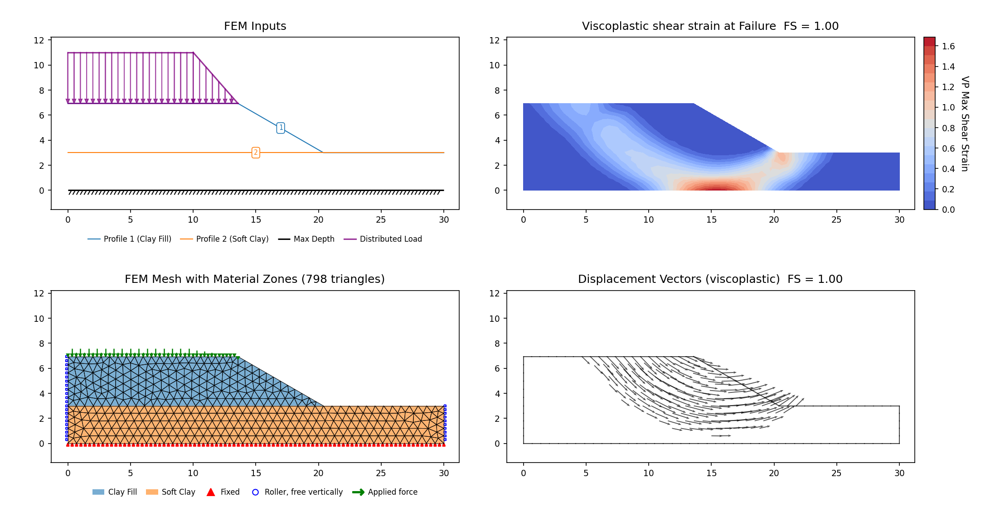

### RS2-30: Homogeneous slope, power-curve strength (Perry 1993) {#rs2-30}

Slide2 counterpart: [VP40](rocscience.md#vp40). Swapped heading (see [#29](#rs2-29)).

**Input files:** [vp040.xlsx](files/rocscience/vp040.xlsx)

| Method | XSLOPE | RS2 SSR (Part IV VP40, constrained) | RS2 SSR (native #030, unconstrained) | Slide2 Janbu | Perry |
|---|---|---|---|---|---|
| SSRM, under the vendor model's own SSR exclusion areas | 0.992 | 0.97 (+2.3%) | 0.91 | 0.944 | 0.98 (+1.2%) |

The FEM linearizes the reduced envelope at the current stress per iteration.

**Which vendor model this file is.** Both RS2 models of this slope share the geometry exactly
(the same six-vertex section, (0, 53)–(4, 53)–(105, 2.8)–(115, 2.8) over a base at el. −10), so
geometry does not decide it — the **strength model** does. `vp040.xlsx` carries Perry's power
curve τ = A σ'b with A = 2, b = 0.7, which is what the Slide2-import model `#040`
carries (`PowerCurve`); RS2's native rebuild `#030` carries a *Generalized Hoek-Brown* envelope
fitted to the same data, the same substitution its table labels explicitly at
[#31](#rs2-31). The file is therefore the Part IV VP40 model, and its pairing is that model's
published SSR **0.97**.

**The vendor's constraint is carried in the file.** `#040` draws three SSR exclusion areas — one
of them wholly interior, so the reducible region is a polygon with a hole, the band along Perry's
specified failure surface — and the materials inside them are linear elastic, the same partition
in strength terms (50.65% of the domain by the vendor's own materials, 50.4% by the polygons). The
two readings agreeing to a quarter of a percent is what identifies the partition and the polygons
as one construction. The published 0.97 was produced with that constraint in place, so
`vp040.xlsx` carries all three rings as v20 polygon-sheet overlay rows under the **"SSR
elastic"** sentinel (Mat ID −3): the vendor does not merely hold these regions at full strength,
it gives them a material that cannot yield at all, and on a sub-unity model a full-strength hold
does not bracket the solve. Constrained that way the reduction is pushed off the shallow band and
the SSRM lands at **0.992**, +2.3% on the published 0.97 — a like-for-like comparison, both sides
constrained the same way.

RS2's own native `#030` rebuild of this slope carries no constraint of any kind and publishes
0.91, which is the vendor's own measure of what its zone is worth here. The column above records
it; the lock pairs with the constrained model this file is built from.

<!-- test: file=files/rocscience/vp040.xlsx, type=fem_ssrm, expected_fs=0.992, element_type=tri6, target_size=2.0, tolerance=0.02, f_min=0.5, f_max=1.5, max_iter=16000, k0=1, benchmark=RS2-30 -->

### RS2-31: M-C vs power curve (Baker 2003 ex. 1) {#rs2-31}

Slide2 counterpart: [VP44](rocscience.md#vp44). Built, four cases.

**Input files:** [vp044a.xlsx](files/rocscience/vp044a.xlsx),
[vp044b.xlsx](files/rocscience/vp044b.xlsx),
[vp044c.xlsx](files/rocscience/vp044c.xlsx),
[vp044d.xlsx](files/rocscience/vp044d.xlsx)

| Case | XSLOPE SSRM | Governing published | Slide2 |
|---|---|---|---|
| vp044b — M-C, c′ = 11.64 kPa, φ′ = 24.7° | 1.529 | RS2 SSRM **1.53** (−0.1%) | — |
| vp044c — M-C, local-linear c′ = 0.39 kPa, φ′ = 38.6° | 0.969 | RS2 SSRM **0.98** (−1.1%) | — |
| vp044a — Baker's power curve, τ = 1.107·σn0.86 | 0.973 | **Baker 0.97** (+0.3%) | Janbu 0.921 / Spencer 0.960 |
| vp044d — RS2's Generalized Hoek-Brown fit of that curve | 1.115 | RS2 SSRM **1.11** (+0.5%) | — |

**The power-curve problem is solved with two different strength models, and RS2 says so in
print.** Its Part 1 results table labels the row itself — "Power Curve | SRF (Generalized
Hoek-Brown) | 1.11" — and the vendor model matches: `slope stability #031-powecurve.fea` carries
`Plasticity Specifications: GeneralizedHoekBrown / ucs: 113.132 mb: 1.68063 s: 2.60484e-05
a: 0.61921`. RS2 fits a Generalized Hoek-Brown envelope to Baker's curve and reduces that.
The Slide2-import twin of the same problem keeps the literal law instead
(`#044-powercurve.fea`: `Plasticity Specifications: PowerCurve / a: 1.10721 b: 0.86`), which is
what vp044a carries — so the two vendor files confirm which *criterion* each program applies. They
carry no solved factor of safety: the `.fez` family holds inputs only, with no results member, and
neither manual publishes an SSR for the import twin.

**Why the substitution matters on this slope.** The two envelopes cross at σn ≈ 40 kPa,
and below it the fit is the stronger of the two — by 14% at 12.5 kPa, by 25% at 5 kPa and by 43% at
1 kPa. This 6 m slope never gets near the crossover: the effective normal stresses on its critical
surface run about 0.6–12.5 kPa (Slide2 publishes a maximum of 11.51 kPa for the same case), so the
fit hands the whole failure surface materially more strength than Baker's law does. That is why
RS2's 1.11 sits 15.6% above Slide2's own Spencer on an identical slope, and why the difference is a
strength-model difference rather than a solver one — the fit was made for a stress range this
slope does not reach.

**vp044d closes the comparison.** Carrying RS2's own envelope through XSLOPE's `hb` material
option, the SSRM returns **1.115** against
RS2's 1.11 (+0.5%). The four Hoek-Brown inputs — σci = 113.132 kPa, GSI = 5,
mi = 50, D = 0 — are **back-derived** from the vendor's mb / s / a rather
than published (they reproduce all three to six significant figures, and neither manual prints a
GSI or mi for this problem); the builder docstring records that. The envelope's own
tensile strength is nil (−0.002 kPa), consistent with the power curve's T = 0, so the file carries
no cap.

**Initial stress.** RS2 writes an isotropic gravity field stress (Kx = Kz = 1) into these models,
and all four cases carry it — the page's K0 = 1 convention. XSLOPE's own default would be the
elastic gravity turn-on, K₀ = ν/(1−ν) = 0.667 at ν = 0.4, and the difference is worth a few
percent on a near-cohesionless material and nothing at all on a cohesive one, which is why
vp044c and the power-curve case are sensitive to it and vp044b is not.

<!-- test: file=files/rocscience/vp044b.xlsx, type=fem_ssrm, expected_fs=1.529, element_type=tri6, target_size=0.5, tolerance=0.02, f_min=1.1, f_max=2.0, max_iter=16000, tension_srf=false, k0=1, benchmark=RS2-31a -->
<!-- test: file=files/rocscience/vp044c.xlsx, type=fem_ssrm, expected_fs=0.969, element_type=tri6, target_size=0.5, tolerance=0.02, f_min=0.6, f_max=1.4, max_iter=16000, tension_srf=false, k0=1, benchmark=RS2-31b -->
<!-- test: file=files/rocscience/vp044a.xlsx, type=fem_ssrm, expected_fs=0.973, element_type=tri6, target_size=0.5, tolerance=0.02, f_min=0.5, f_max=1.6, max_iter=16000, k0=1, benchmark=RS2-31c -->
<!-- test: file=files/rocscience/vp044d.xlsx, type=fem_ssrm, expected_fs=1.115, element_type=tri6, target_size=0.5, tolerance=0.02, f_min=0.7, f_max=1.6, max_iter=16000, k0=1, benchmark=RS2-31d -->

**Mohr-Coulomb case (vp044b)**

**Mohr-Coulomb case (vp044c)**

**Power-curve case (vp044a)**

**RS2's Generalized Hoek-Brown fit of the same curve (vp044d)**

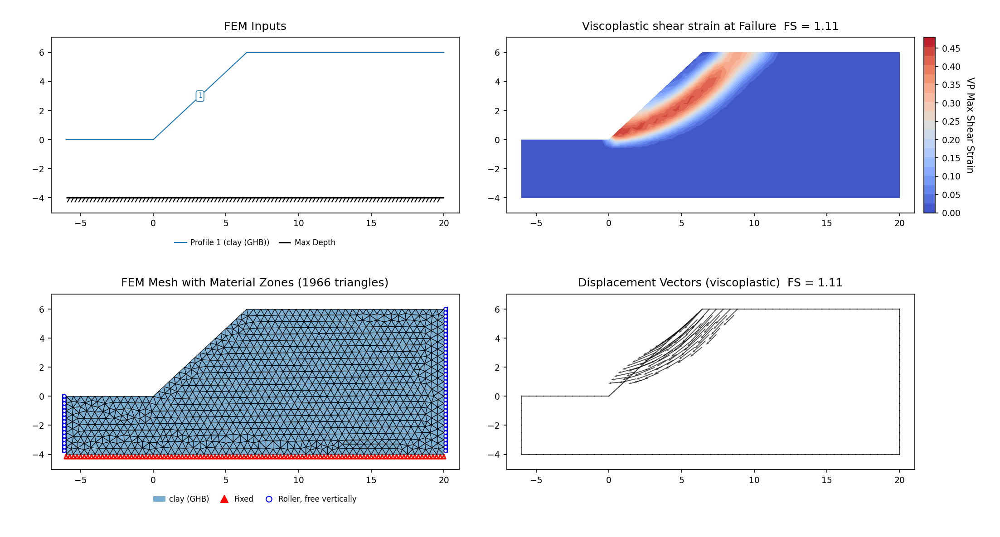

### RS2-32: M-C vs power curve II (Baker 2003 ex. 2) {#rs2-32}

Slide2 counterpart: [VP45](rocscience.md#vp45). Built, both halves. The RS2 manual's problem 32
heading names a different problem from the one its body presents: the body is Baker's example 2,
the linear-versus-power-curve envelope pair reproduced here, the same off-by-one heading slip the
manual carries at §29/§30 and §33.

**Input files:** [vp045a.xlsx](files/rocscience/vp045a.xlsx),
[vp045b.xlsx](files/rocscience/vp045b.xlsx)

| Method | XSLOPE | RS2 SSRM | Slide2 Spencer |
|---|---|---|---|
| SSRM (vp045a, M-C) | 2.790 | 2.83 (−1.4%) | — |
| SSRM (vp045b, power curve) | 2.637 | 2.63 (+0.3%) | 2.662 |

RS2 solves the power-curve half twice, on two different strength models, and publishes a
factor for each. Part IV's VP45 model carries the literal power law as a native `PowerCurve`
plasticity material, and its SSR is **2.63** — the same strength model XSLOPE's vp045b carries
(Baker's τ = 1.107·σn0.86), so that is the pairing this half is scored
against. The Parts I–III native model `#032-powercurve` instead re-expresses the same envelope
as a fitted **Generalized Hoek-Brown** material (σci = 157.6 kPa,
mb = 1.681, s = 2.6×10⁻⁵, a = 0.619); its published 2.74 is that fit's answer, not
the power curve's, and is reported here as context only. Converting the GHB fit back to
shear–normal space (Balmer transform) shows it running a few percent stronger than the literal
curve over the slope's working-stress range, which is why it sits above both power-curve
answers. Slide2's Spencer on the same literal curve (2.662) is a cross-method reading that
brackets XSLOPE from the other side.

<!-- test: file=files/rocscience/vp045a.xlsx, type=fem_ssrm, expected_fs=2.790, element_type=tri6, target_size=1.0, tolerance=0.02, f_min=2.3, f_max=3.4, max_iter=16000, tension_srf=false, k0=1, benchmark=RS2-32 -->
<!-- test: file=files/rocscience/vp045b.xlsx, type=fem_ssrm, expected_fs=2.637, element_type=tri6, target_size=1.0, tolerance=0.02, f_min=1.8, f_max=3.6, max_iter=16000, k0=1, benchmark=RS2-32b -->

**Mohr-Coulomb case (vp045a)**

**Power-curve case (vp045b)**

### RS2-33: Homogeneous slope with tension crack and water table (P&D test slope 2) {#rs2-33}

Slide2 counterpart: [VP56](rocscience.md#vp56). Swapped heading. Built with a caveat.

**Input files:** [vp056.xlsx](files/rocscience/vp056.xlsx)

| Method | XSLOPE | RS2 SSRM | Eight-program LEM table |
|---|---|---|---|
| SSRM | 1.269 | 1.28 (−0.9%) | 1.03–1.32 |

The model's dry tension crack has no FEM representation, worth ~2–3% here.

<!-- test: file=files/rocscience/vp056.xlsx, type=fem_ssrm, expected_fs=1.269, element_type=tri6, target_size=4.0, tolerance=0.02, f_min=0.9, f_max=1.7, max_iter=16000, tension_srf=false, k0=1, benchmark=RS2-33 -->

### RS2-34: M-C vs power curve III (Baker 2003 ex. 3, London clay) {#rs2-34}

Slide2 counterpart: [VP61](rocscience.md#vp61). Built, both halves.

**Input files:** [vp061a.xlsx](files/rocscience/vp061a.xlsx),
[vp061b.xlsx](files/rocscience/vp061b.xlsx)

| Method | XSLOPE | RS2 SSRM | Slide2 Spencer | Baker |
|---|---|---|---|---|
| SSRM (vp061b, M-C) | 1.373 | 1.38 (−0.5%) | — | — |
| SSRM (vp061a, power curve) | 1.497 | 1.47 (+1.8%) | 1.47 | 1.48 |

<!-- test: file=files/rocscience/vp061b.xlsx, type=fem_ssrm, expected_fs=1.373, element_type=tri6, target_size=0.5, tolerance=0.02, f_min=1.0, f_max=1.9, max_iter=16000, tension_srf=false, k0=1, benchmark=RS2-34 -->
<!-- test: file=files/rocscience/vp061a.xlsx, type=fem_ssrm, expected_fs=1.497, element_type=tri6, target_size=0.5, tolerance=0.02, f_min=1.0, f_max=2.2, max_iter=16000, k0=1, benchmark=RS2-34b -->

**Mohr-Coulomb case (vp061b)**

**Power-curve case (vp061a)**

### RS2-36: Seepage analysis, homogeneous slope (D&W Fig 6.37) {#rs2-36}

Slide2 counterpart: [VP71](rocscience.md#vp71) (= Slide2 VP71, not
[VP70](rocscience.md#vp70)). Built, both cases.

**Input files:** [vp071a.xlsx](files/rocscience/vp071a.xlsx),
[vp071b.xlsx](files/rocscience/vp071b.xlsx)

| Method | XSLOPE | RS2 SSRM | Referee | XSLOPE LEM |
|---|---|---|---|---|
| SSRM (vp071a, FE seepage) | 1.111 | 1.12 (−0.8%) | 1.138 (−2.4%) | 1.132 |
| SSRM (vp071b, piezo approximation) | 1.111 | 1.12 (−0.8%) | 1.141 (−2.6%) | 1.132 |

The seep case runs on tri6 sidecars.

<!-- test: file=files/rocscience/vp071a.xlsx, type=fem_ssrm, expected_fs=1.111, tolerance=0.01, f_min=0.7, f_max=1.6, max_iter=16000, tension_srf=false, k0=1, benchmark=RS2-36a -->
<!-- test: file=files/rocscience/vp071b.xlsx, type=fem_ssrm, expected_fs=1.111, element_type=tri6, target_size=4.4, tolerance=0.01, f_min=0.7, f_max=1.6, max_iter=16000, tension_srf=false, k0=1, benchmark=RS2-36b -->

**FE-seepage case (vp071a)**

**Piezometric-line case (vp071b)**

### RS2-37: Embankment with layered foundation (D&W Fig 6.39) {#rs2-37}

Slide2 counterpart: [VP72](rocscience.md#vp72). Reported, no lock.

| Method | XSLOPE | RS2 SSRM (table) | RS2 SSRM (convergence graph) | Slide2 | Referee | XSLOPE LEM | Notes |
|---|---|---|---|---|---|---|---|
| SSRM | 1.31 (deep mechanism) | 0.95 | 1.1 | 1.15 / 1.16 | 1.11 | 1.339 on the tangent circle | no delta — the two programs describe different mechanisms |

The two programs are not finding the same mechanism. Reproducing the toe mechanism needs
toe-refined meshing — noted with the artesian-toe discussion in the Slide2
[VP72](rocscience.md#vp72) section. The vendor's own SSR polygon on this problem is a
mechanism-selection corridor of the [VP64](#p4-vp64) kind — a ~12.5 m band traced along the slip
surface it wants, 0.7% of the domain — and it is documented rather than carried: it is thinner
than this model's mesh, so transcribing it would rasterise to a band too ragged to form a
mechanism, and a finer mesh would be required first.

### RS2-38: Cohesionless embankment on saturated clay foundation (D&W Fig 7.12) {#rs2-38}

Slide2 counterpart: [VP74](rocscience.md#vp74) (Duncan & Wright 2005, Fig 7.12).

**Input files:** [vp074.xlsx](files/rocscience/vp074.xlsx)

A cohesionless sand embankment (c = 0, φ = 40°, γ = 140 pcf) on a saturated clay foundation
(c = 2500 psf, φ = 0, γ = 140 pcf). The critical surface is the deep foundation mechanism through the
undrained clay. The FEM elastic constants are the vendor model's own, E = 1×10⁶ psf and ν = 0.4 on
both materials.

| Method | XSLOPE | RS2 SSRM (Part 4) | RS2 SSRM (Part 2) | Slide2 Spencer | D&W referee | XSLOPE LEM |
|---|---|---|---|---|---|---|
| SSRM (7.0 m mesh) | 1.190 | 1.17 (+1.7%) | 1.21 | 1.20 circular / 1.18 non-circular | 1.22 (Bishop) / 1.19 (Spencer) | Bishop/Spencer/Janbu 1.219 / 1.194 / 1.161 |

XSLOPE's SSRM lands at **1.190**, just above RS2's Part 4 SSRM 1.17 and Slide2's non-circular 1.18, and −1.7%
from RS2's Part 2 SSRM 1.21 (RS2 re-ran the problem between the two manuals). ψ = 0. Locked at the
7.0 m mesh on this 700-ft-wide section.

<!-- test: file=files/rocscience/vp074.xlsx, type=fem_ssrm, expected_fs=1.190, element_type=tri6, target_size=7.0, tolerance=0.02, f_min=0.9, f_max=1.6, max_iter=16000, tension_srf=false, k0=1, benchmark=RS2-38 -->

### RS2-39/41/43: Earth embankment, infinite-slope mechanism (Duncan & Wright) {#rs2-39}

RS2 Parts I–III problems 41 (Slide2 [VP79](rocscience.md#vp79), D&W Fig 14.4) and 43 (Slide2
[VP81](rocscience.md#vp81), D&W Fig 14.7) are cohesionless embankments (c = 0, φ = 30°) on an
undrained φ = 0 foundation, each analyzed for two mechanisms: a **very shallow infinite-slope skin**
in the embankment, and a **deep** surface RS2 forces by holding the foundation linear-elastic so the
slip cannot enter it. Problem 39 (VP76, D&W Fig 7.19) is the FE-seepage member of the same family and
is deferred with the other FE-seepage cases. The infinite-slope skin is the natural unconstrained
SSRM mechanism; the deep case is run with `elastic_materials=['Foundation']` (RS2's elastic
foundation), and VP81's vendor model additionally carries an SSR Exclusion Area, which its lock
reproduces.

**Input files:** [vp079.xlsx](files/rocscience/vp079.xlsx) (RS2-41, Fig 14.4) ·
[vp081.xlsx](files/rocscience/vp081.xlsx) (RS2-43, Fig 14.7)

| Case | XSLOPE SSRM | Governing published | RS2 SSRM | Slide2 Bishop/Spencer |
|---|---|---|---|---|
| VP79 infinite slope (unconstrained) | 1.431 | D&W referee 1.44 (−0.6%) | 1.47 (−2.7%) | 1.44 |
| VP79 deep mechanism (foundation held elastic) | 1.444 | D&W 1.40 (+3.1%) | 1.43 (+1.0%) | — |
| VP81 under the vendor model's SSR Exclusion Area | 1.209 | RS2 SSRM 1.23 (−1.7%) — Part IV VP81 case 1, deep | 1.23 (−1.7%) | 1.15–1.16 (infinite) |
| VP81 deep mechanism (foundation held elastic) | 1.116 | — | — | — |

*The VP79 deep run is mechanism-pinned and lands on RS2's deep 1.43 independently. VP81's
elastic-foundation run returns 1.116, the same value its unconstrained run gives, because the
c = 0 embankment skin still governs even with the foundation elastic.*

On **VP79** the unconstrained SSRM finds the infinite-slope skin at **1.431**, −0.6% from the Duncan &
Wright referee 1.44 and inside the RS2 1.43–1.47 band; the elastic-foundation deep run (1.444) lands
on RS2's deep 1.43 independently. **VP81 carries a constraint its own vendor model states**:
`slope stability #081_-_duncan_page220_figure_14-7_deep.fez` writes an `SSR_polygonal_zones` block
flagged as an *exclusion* area, holding a small block of the section — 2.7% of the domain — at full
strength while everything else is reduced. Carried as its complement (`ssr_zone` has one sense,
*reduce inside*, so an exclusion enters as the ten-vertex ring covering the rest), the SSRM reads
**1.209**, −1.7% on that model's own published value: the `_deep` file is **Part IV VP81 case 1**,
whose SSR is **1.23**. The 1.19 published for this problem is a *different* model's number —
RS2's native rebuild at Part II problem 43, and its **shallow** infinite-slope case at that (the
native model's deep case publishes 1.23 as well). That native shallow model is one of the archive's
constraint-by-material cases: it holds 57.7% of the domain elastic with no polygon at all, which is
how RS2 kept its slip surface out of the foundation.
Unconstrained the corpus file reads 1.116, the c = 0 cohesionless skin localizing on
the fine tri6 mesh with no length scale to arrest it (the same behavior documented on
[RS2-40](#rs2-40)); holding the foundation elastic does not separate the deep mechanism from it,
returning that same 1.116. Locked at the 1.5 m mesh. ψ = 0; E = 1×10⁶ psf and
ν = 0.4, the vendor model's own constants.

<!-- test: file=files/rocscience/vp079.xlsx, type=fem_ssrm, expected_fs=1.431, element_type=tri6, target_size=1.5, tolerance=0.02, f_min=1.1, f_max=1.9, max_iter=16000, tension_srf=false, k0=1, benchmark=RS2-41 -->
<!-- test: file=files/rocscience/vp081.xlsx, type=fem_ssrm, expected_fs=1.209, element_type=tri6, target_size=1.5, tolerance=0.02, f_min=0.9, f_max=1.5, max_iter=16000, tension_srf=false, ssr_zone=128;34;128;15;128;0;0;0;0;15;35;15;39.1558;15;71.1539;29.9985;73;34;128;34, k0=1, benchmark=RS2-43 -->

**VP79 (RS2-41, D&W Fig 14.4)**

**VP81 (RS2-43, D&W Fig 14.7)**

### RS2-40: Dam with impermeable foundation (D&W Fig 7.24) {#rs2-40}

Slide2 counterpart: [VP77](rocscience.md#vp77). Built for the piezo case.

**Input files:** [vp077b.xlsx](files/rocscience/vp077b.xlsx)

| Case | XSLOPE SSRM | Published |
|---|---|---|
| Filter off (true global minimum) | 1.160 | saturated seepage-parallel infinite slope **1.190** (−2.5%) |
| `min_slip_depth` = 30 ft (deep) | 1.452 | RS2 SSRM **1.53** (−5.1%) |

**Two mechanisms.** As on the dry Talbingo dam ([RS2-4](#rs2-4)), the cohesionless downstream
shell can fail as a surface-parallel skin rather than a deep rotation, and here the piezometric
line daylights on that face near the toe, so the skin is *saturated*: its closed form is the
seepage-parallel infinite slope, (140 − 62.4)/140 × tan 38° / tan 20° = **1.190**. With the depth
filter off the SSRM finds exactly that mechanism — at failure the shear strain concentrates
between x = 1172 and 1233 at 1–8 ft below the downstream 2.75:1 face, the stretch running from
where the piezometric line daylights (x = 1182, el 148) down to the toe (1240.5, 127), and the
per-node out-of-balance nodes sit on the same stretch (x ∈ [1162, 1234]). The FEM reads 1.160,
2.5% below the idealized value: the finite, partially saturated toe geometry softens it, so this
skin's analytic anchor is looser than RS2-4's — but a shell-φ sweep tracks the anchor law at
a *constant* ratio across φ = 30–42°, which is what identifies the mechanism.

RS2 reports the other one, and its manual draws it. Figure 7 (maximum shear strain at critical
SRF 1.53) shows a surface that starts at the crest, cuts down through the clay core, reaches the
foundation contact at el 127 near the core's downstream toe and continues as a basal shear band
under the downstream shell out to the toe. Excluding anything shallower than 30 ft with
[`min_slip_depth`](../fem/overview.md#surficial-skin-failures-and-the-minimum-slip-depth-filter)
returns exactly that band — 80–121 ft below the ground surface, running out from the core's
downstream toe — at **1.452**, −5.1% on RS2's 1.53. Neither figure nor text on RS2's side carries
an "SSR Search Area" or "SSR Exclusion Area" annotation for this problem, so its 1.53 is an
unconstrained strength reduction that simply localizes on the deeper surface; the depth filter is
how XSLOPE asks the same question.

| `min_slip_depth` (ft) | off | 15 | 20 | 30 | 50 | 80 |
|---|---|---|---|---|---|---|
| XSLOPE SSRM | 1.160 | 1.246 | 1.349 | **1.452** | 1.470 | 1.470 |

The 50 and 80 ft values are identical to seven decimals — a 30 ft plateau on a 211 ft dam, the
plateau test the filter's documentation prescribes, so the number belongs to the mechanism and not
to the cutoff. The 30 ft cutoff the tag pins reads 1.452 against that plateau's 1.470, −1.2%: it
is the first cutoff clear of the skin, and every cutoff from there up selects the same basal band.

**Mesh, and what the deep lock is.** A deep mechanism's factor follows the element size until the
zone that carries it is resolved, and [RS2-66](#rs2-66) shows that in both directions: its basal
squeeze scatters while the soft band it runs through holds about one element row, and stands still
— 1.131 at a 4 m global size and at 3 m, 1.144 at 2.2 m — once that band is meshed at the vendor's
own density. This dam's deep surface is still following the mesh: the same filtered run gives
1.452 at the tagged 12.4 ft mesh (2 223 tri6) and 1.384 at the 8 ft mesh (5 220 tri6), −4.7%. The
skin drifts the same way under refinement, the localization behaviour this page documents for
c = 0 skins. Both rows are therefore **regression locks at the tagged mesh**, and the −5.1%
against RS2 is quoted at that mesh.

**What cannot be checked here.** There is no vendor RS2 model for this problem: the Slide2-import
set of the RS2 verification archive runs #076 straight to #078, with no #077 of any kind. So
unlike most rows on this page there is nothing to transcribe tensile caps, tension-SRF, initial
stress, boundary fixity or a vendor mesh from, and those inputs are unverifiable rather than
missing. Two of them are inert anyway: both fills are cohesionless with no tensile cap, so a
cap-less run is bit-identical whichever way the tension-SRF flag is set. The initial stress is the
page's K0 = 1 field and the flow rule is ψ = 0, the Griffiths convention this corpus uses;
neither has a vendor counterpart on this problem to be measured against.

**Limit equilibrium answers only the deep question.** A circle cannot represent a thin
surface-parallel skin at all, so this dam's LEM locks on the specified deep circle are
cross-bearings for the *deep* mechanism only:

| Method (specified deep circle) | XSLOPE LEM | Slide2 |
|---|---|---|
| Bishop | 1.591 | 1.584 |
| Spencer | 1.659 | 1.648 |
| Morgenstern-Price | 1.670 | — |

The filtered SSRM's 1.452 sits below them by the usual SSRM-below-LEM margin. The apparent
LEM/SSRM disagreement on this dam is a mechanism-representation artifact, not a discrepancy.

*The FE-seepage sub-case (vp077a: pore pressures from a finite-element seepage solve
rather than a drawn piezometric line; D&W Table 7.9 lists PHASE2 SRF 1.57 alongside
Spencer 1.67–1.70) is blocked, and the obstruction is the downstream
seepage face rather than the core. The seepage sidecar is node-aligned to the SSRM mesh,
so seepage and SSRM share one mesh: the seepage solve converges cleanly on tri3 (447
iterations, exit face stable, q ≈ 8.2×10⁻⁶) but SSRM requires tri6, on which the
quadratic midside relative-conductivity sampling whips the daylighting front. Refining
the two core boundaries — a 100× k-jump between the clay core (k = 1.67×10⁻⁷) and the
shell (1.67×10⁻⁵) — with an interface-aware mesh size field halves the tri6 residual
floor (to ≈1.1×10⁻⁴, at the 1×10⁻⁴ tolerance), so the core contrast contributes to it;
it does not converge the solve. What blocks the solve is the
downstream free-surface exit face: the seepage-face active set never
settles (it cycles among 5–11 of 97 exit-face nodes at the daylighting toe), every
toggle spikes the head-change residual and restarts the decay, and the flow-closure
ratio stays O(10–100) against its 1×10⁻³ tolerance throughout, which is not relaxed to
obtain a solution. This is the tri3/tri6 trade at its sharpest — a converged seepage field needs
tri3 while a trustworthy SSRM needs tri6, and one shared mesh cannot be both.*

<!-- test: file=files/rocscience/vp077b.xlsx, type=mesh_elements, element_type=tri6, target_size=12.4, expected_elements=2223, benchmark=RS2-40-mesh -->
<!-- test: file=files/rocscience/vp077b.xlsx, type=mesh_elements, element_type=tri6, target_size=8.0, expected_elements=5220, benchmark=RS2-40-mesh-fine -->
<!-- test: file=files/rocscience/vp077b.xlsx, type=fem_ssrm, expected_fs=1.160, element_type=tri6, target_size=12.4, tolerance=0.02, f_min=1.1, f_max=2.2, max_iter=16000, k0=1, benchmark=RS2-40 -->
<!-- test: file=files/rocscience/vp077b.xlsx, type=fem_ssrm, expected_fs=1.384, element_type=tri6, target_size=8.0, tolerance=0.02, f_min=1.1, f_max=2.2, max_iter=16000, min_slip_depth=30, k0=1, benchmark=RS2-40-deep-m8 -->
<!-- test: file=files/rocscience/vp077b.xlsx, type=fem_ssrm, expected_fs=1.246, element_type=tri6, target_size=12.4, tolerance=0.02, f_min=1.1, f_max=2.2, max_iter=16000, min_slip_depth=15, k0=1, benchmark=RS2-40-d15 -->
<!-- test: file=files/rocscience/vp077b.xlsx, type=fem_ssrm, expected_fs=1.349, element_type=tri6, target_size=12.4, tolerance=0.02, f_min=1.1, f_max=2.2, max_iter=16000, min_slip_depth=20, k0=1, benchmark=RS2-40-d20 -->
<!-- test: file=files/rocscience/vp077b.xlsx, type=fem_ssrm, expected_fs=1.470, element_type=tri6, target_size=12.4, tolerance=0.02, f_min=1.1, f_max=2.2, max_iter=16000, min_slip_depth=50, k0=1, benchmark=RS2-40-d50 -->
<!-- test: file=files/rocscience/vp077b.xlsx, type=fem_ssrm, expected_fs=1.470, element_type=tri6, target_size=12.4, tolerance=0.02, f_min=1.1, f_max=2.2, max_iter=16000, min_slip_depth=80, k0=1, benchmark=RS2-40-d80 -->
<!-- test: file=files/rocscience/vp077b.xlsx, type=fem_ssrm, expected_fs=1.452, element_type=tri6, target_size=12.4, tolerance=0.02, f_min=1.1, f_max=2.2, max_iter=16000, min_slip_depth=30, k0=1, benchmark=RS2-40-deep -->

**Filter off — the saturated downstream face skin (vp077b)**

**`min_slip_depth` = 30 ft — the basal band RS2 draws (vp077b)**

### RS2-42: James dike {#rs2-42}

Slide2 counterpart: [VP75](rocscience.md#vp75).

**Input files:** [vp075.xlsx](files/rocscience/vp075.xlsx)

| Method | XSLOPE | RS2 SSRM | Slide2 noncircular LEM | D&W non-circular |
|---|---|---|---|---|
| SSRM | 1.214 | 1.19 (+2.0%) | 1.11–1.16 | 1.17 |

*Scored against Part IV VP75's RS2 SSRM 1.19, the value published for the model vp075.xlsx is
transcribed from. As on [RS2-11](#rs2-11), RS2 ran this deck twice on input-identical decks that
differ only in the SRF tensile setting — the Parts I–III native `#042` model reduces tensile
strength brittly and publishes 1.26 on a 1080-element mesh, the Part IV import holds tension
perfectly plastic on 3031 elements, which matches both XSLOPE's tensile behaviour and its mesh
density.*

<!-- test: file=files/rocscience/vp075.xlsx, type=fem_ssrm, expected_fs=1.214, element_type=tri6, target_size=1.85, tolerance=0.02, f_min=0.8, f_max=1.8, max_iter=16000, tension_srf=false, k0=1, benchmark=RS2-42 -->

### RS2-44: Seepage analysis for an earth embankment (D&W Fig 14.20-a) {#rs2-44}

Slide2 counterpart: [VP82](rocscience.md#vp82) (= Slide2 VP82, not
[VP76](rocscience.md#vp76) — §39's body carries VP76).

**Input files:** [vp082.xlsx](files/rocscience/vp082.xlsx)

| Method | XSLOPE | RS2 SSRM | Slide2 LEM | Referee |
|---|---|---|---|---|
| SSRM | 1.490 | 1.51 (−1.3%) | 1.532 / 1.541 | 1.528–1.542 (−2.5%) |

<!-- test: file=files/rocscience/vp082.xlsx, type=fem_ssrm, expected_fs=1.490, element_type=tri6, target_size=2.0, tolerance=0.02, f_min=1.0, f_max=2.1, max_iter=16000, tension_srf=false, k0=1, benchmark=RS2-44 -->

### RS2-45: Varying undrained shear strength profiles (D&W Fig 14.20-b) {#rs2-45}

Slide2 counterpart: [VP83](rocscience.md#vp83). Built with a caveat.

**Input files:** [vp083a.xlsx](files/rocscience/vp083a.xlsx),
[vp083b.xlsx](files/rocscience/vp083b.xlsx)

| Method | XSLOPE | RS2 SSRM | D&W referee |
|---|---|---|---|
| SSRM (vp083a) | 1.314 | 1.32 (−0.5%) | 1.28–1.33 (inside) |
| SSRM (vp083b) | 1.314 | 1.32 (−0.5%) | 1.28–1.33 (inside) |

Both cases land inside the referee band under the per-node criterion. [RS2-19](#rs2-19),
the other φ = 0 foundation problem, reads +4.8% against RS2's own SSRM and keeps its caveat.

<!-- test: file=files/rocscience/vp083a.xlsx, type=fem_ssrm, expected_fs=1.314, element_type=tri6, target_size=4.0, tolerance=0.02, f_min=0.9, f_max=1.9, max_iter=16000, tension_srf=false, k0=1, benchmark=RS2-45a -->
<!-- test: file=files/rocscience/vp083b.xlsx, type=fem_ssrm, expected_fs=1.314, element_type=tri6, target_size=4.0, tolerance=0.02, f_min=0.9, f_max=1.9, max_iter=16000, tension_srf=false, k0=1, benchmark=RS2-45b -->

**Case a (vp083a)**

**Case b (vp083b)**

### RS2-46: Varying undrained strength profiles II (D&W Fig 15.9, cu = 300 + cz·z) {#rs2-46}

Slide2 counterpart: [VP84](rocscience.md#vp84).

**Input files:** [vp084a–d](files/rocscience/vp084a.xlsx)

| Method | XSLOPE | RS2 SSRM | Duncan & Wright |
|---|---|---|---|
| SSRM (vp084a) | 0.787 | 0.78 (+0.9%) | 0.75 (+4.9%) |
| SSRM (vp084b) | 0.929 | 0.93 (−0.1%) | 0.90 (+3.2%) |
| SSRM (vp084c) | 1.057 | 1.05 (+0.7%) | 1.03 (+2.6%) |
| SSRM (vp084d) | 1.145 | 1.15 (−0.4%) | 1.13 (+1.3%) |

*XSLOPE sits +1.3 to +4.9% above the Duncan & Wright column, the φ = 0 pattern.*

<!-- test: file=files/rocscience/vp084a.xlsx, type=fem_ssrm, expected_fs=0.787, element_type=tri6, target_size=4.0, tolerance=0.02, f_min=0.4, f_max=1.3, max_iter=16000, tension_srf=false, k0=1, benchmark=RS2-46a -->
<!-- test: file=files/rocscience/vp084b.xlsx, type=fem_ssrm, expected_fs=0.929, element_type=tri6, target_size=4.0, tolerance=0.02, f_min=0.5, f_max=1.4, max_iter=16000, tension_srf=false, k0=1, benchmark=RS2-46b -->
<!-- test: file=files/rocscience/vp084c.xlsx, type=fem_ssrm, expected_fs=1.057, element_type=tri6, target_size=4.0, tolerance=0.02, f_min=0.6, f_max=1.5, max_iter=16000, tension_srf=false, k0=1, benchmark=RS2-46c -->
<!-- test: file=files/rocscience/vp084d.xlsx, type=fem_ssrm, expected_fs=1.145, element_type=tri6, target_size=4.0, tolerance=0.02, f_min=0.7, f_max=1.7, max_iter=16000, tension_srf=false, k0=1, benchmark=RS2-46d -->

**Case a (vp084a)**

**Case b (vp084b)**

**Case c (vp084c)**

**Case d (vp084d)**

### RS2-47: Purely cohesive slope, varying thickness (D&W Fig 14.3) {#rs2-47}

Slide2 counterpart: [VP78](rocscience.md#vp78). All three foundation-thickness variants built.

**Input files:** [vp078.xlsx](files/rocscience/vp078.xlsx) (30 ft) ·
[vp078b.xlsx](files/rocscience/vp078b.xlsx) (46.5 ft) ·
[vp078c.xlsx](files/rocscience/vp078c.xlsx) (60 ft)

A pure-cohesive slope (c = 1000 psf, φ = 0, γ = 100 pcf), 50-ft face at 1:0.8, over a firm-based
foundation of varying thickness. D&W Fig 14.3 plots FS against that thickness; RS2 re-runs the
30 / 46.5 / 60 ft cases by strength reduction. The three geometries are RS2's own external boundary
read verbatim from the vendor `.fez` (`#047_01/02/03`): the firm base stays at y = 0 and the
foundation *surface* is raised, so the base sits progressively deeper below the toe.

| Method | XSLOPE | RS2 SSRM (Part IV VP78 case a) | D&W referee |
|---|---|---|---|
| SSRM (30-ft foundation, vp078) | 1.061 | 1.06 (+0.1%) | 1.124–1.135 (−5.6%, toe circle) / 1.139–1.141 (base tangent) |
| SSRM (46.5-ft foundation, vp078b) | 1.045 | 1.06 (−1.4%) | — |
| SSRM (60-ft foundation, vp078c) | 1.045 | 1.07 (−2.3%) | — |

**Which vendor models these are.** Each corpus file reproduces the external boundary of the
Part IV **case-(a)** model for its thickness — the toe-failure case — vertex for vertex
(0/240/80 · 0/240/96.5 · −10/270/110). The native `#047_01/02/03` twins draw the same boundaries,
but the case-(b) tangent-failure models do not (case 2b widens to −20…260), so the case-(a)
lineage is the one the files match. Their published values are **1.06 / 1.06 / 1.07**, and the
locks sit +0.1 / −1.4 / −2.3% from them.

XSLOPE tracks RS2's slight decrease-then-plateau with depth, and on the 30-ft case sits *between*
the two published anchors — just above RS2's 1.06 and below D&W's 1.124–1.141. The RS2 manual's
VP78 write-up says of these models that "to force RS2 to iterate for SRF associated with a failure
surface passing through the toe of the slope, a SSR Exclusion Area was used" (the technique
reproduced for [RS2-P4-VP67](#p4-vp67)), and the case-(a) `.fez` files do carry it: a four-vertex
exclusion rectangle holding 19.0 / 22.4 / 23.5% of the domain. The corpus runs are unconstrained
and land on the constrained values anyway, which this problem lets one check directly — RS2 also
ships the case-(b) models *without* a polygon, published at 1.04 / 1.04 / 1.04 against the
case-(a) 1.06 / 1.06 / 1.07, so the vendor's own measurement of its zone here is +1.9 / +1.9 /
+2.9%, the same order as the residual. RS2's native rebuild of
the same three thicknesses (Part II problem 47, unconstrained) publishes 1.03 / 1.02 / 1.02; that
is the other model's number and does not set this row's dot. Each is regression-locked
at its XSLOPE value (4.0 m tri6 mesh).

<!-- test: file=files/rocscience/vp078.xlsx, type=fem_ssrm, expected_fs=1.061, element_type=tri6, target_size=4.0, tolerance=0.02, f_min=0.6, f_max=1.6, max_iter=16000, tension_srf=false, k0=1, benchmark=RS2-47 -->
<!-- test: file=files/rocscience/vp078b.xlsx, type=fem_ssrm, expected_fs=1.045, element_type=tri6, target_size=4.0, tolerance=0.02, f_min=0.6, f_max=1.6, max_iter=16000, tension_srf=false, k0=1, benchmark=RS2-47b -->
<!-- test: file=files/rocscience/vp078c.xlsx, type=fem_ssrm, expected_fs=1.045, element_type=tri6, target_size=4.0, tolerance=0.02, f_min=0.6, f_max=1.6, max_iter=16000, tension_srf=false, k0=1, benchmark=RS2-47c -->

### RS2-48–55: Multi-tiered geotextile walls (Leshchinsky & Han 2004) {#rs2-48}

Slide2 counterparts: [VP87](rocscience.md#vp87)–VP94 (one-for-one, verified; only VP87 has a
detail section on the LEM page). Baseline SSRM built; parametric variants partial.

The SSRM enforces the geotextile tensile-capacity cap, so a strength-reduced wall fails through
the reinforced mass and the factor of safety responds to the reinforcement. On the baseline
three-tier wall it lands on the referee stability and below RS2's own strength-reduction figure:

| Method | XSLOPE | L&H FDM referee | RS2 SSR | L&H Bishop | RS2 LEM | Slide2 Bishop |
|---|---|---|---|---|---|---|
| SSRM (baseline wall, vp087, Ta = 10 kN/m) | 0.944 (lock) | 0.99 (−4.6%) | **1.05** (−10.1%) | 1.00 | Bishop 1.02 / Spencer 1.03 / GLE 1.03 | 1.040 |

(RS2's own numbers are from Part 2 of its verification manual, problem 48, which imports this
Slide2 model; Slide2's fuller LEM table is on [VP87](rocscience.md#vp87).)

**The baseline locks at 0.944, under the vendor's own tensile caps and at-rest initial stress.** The
vendor model caps tensile strength on every material, T = 0 on the reinforced granular fill
included, and those caps are carried into the XSLOPE model. The elastic
constants are the vendor model's as well — E = 50,000 kPa and ν = 0.4 on all three materials, read
from the `.fez` rather than estimated from soil type. A strength-reduction factor is invariant to E
but not to ν, so the vendor ν is the constant that sets it. RS2 also initializes every element — the
0.3 m facing-block columns included — at an isotropic at-rest stress state (`Kx = Kz = 1`), which is
the [K0 initial stress](../fem/overview.md#k0-initial-stress) every lock on this page carries; on an
almost purely frictional facing (c = 2.5 kPa, φ = 34°) that confinement decides how early the facing
yields. The tensile caps also decide which
convergence criterion can bracket this wall. A pure non-convergence criterion cannot: it reads every
trial that fails to reach equilibrium as a collapse, and a T = 0 fill that settles into a stationary
state at elastic displacement scale looks exactly like one, so the bisection is handed a failure side
that does not exist and returns no factor of safety. The hybrid criterion — the default — keeps
non-convergence as the trigger but requires displacement evidence before calling a trial failed,
which separates the settled state from a real collapse and brackets the wall at 0.944.

Against the reference spread, 0.944 sits 10.1% below RS2's own SSR of 1.05 and 4.6% below
Leshchinsky & Han's FDM referee value of 0.99 (and 5.6% below their Bishop 1.00). RS2's SSR is the highest
figure in its own table, 6.1% above the referee its manual cites, and the residual against it is a
**facing-column** effect. XSLOPE brackets RS2's 1.05 from both sides: the **0.944** lock with the
facing free to fail, and **1.080** with the facing held linear-elastic. The only difference between
the two is whether the 0.3 m block columns can yield. The
discretization of those columns separates them. XSLOPE meshes each 0.3 × 3.0 m column with
25 six-node triangles; RS2's `.fez` uses 10. A nearly unconfined frictional column can localize a
shear band across 25 elements and effectively cannot across 10, so XSLOPE's strength reduction
fails the facing locally where RS2's published shear-strain plot carries a compound surface through
the reinforced mass. RS2's reporting convention accounts for a little more of the residual, in the
same direction: its published factor is the last **converged** SRF, and its own convergence graph
(1.05 converged, 1.06 first failed) reads ≈1.055 on the bracket-midpoint convention XSLOPE uses.

RS2 also flanks each geotextile layer with slip interfaces, which XSLOPE does not model: the sheet
is bonded to the soil and pull-out is represented as a capacity limit instead. A bonded sheet is the
stiffer composite and XSLOPE already reads *below* RS2, so that formulation difference cannot be
what separates them — it would have to move the factor the other way. The LEM side of the same
wall does reproduce the references
([VP87](rocscience.md#vp87): Bishop 1.031 vs Slide2 1.040), so the difference is confined to the SSRM
side of the problem.

**Input files:** [vp087.xlsx](files/rocscience/vp087.xlsx) (baseline) through
[vp094.xlsx](files/rocscience/vp094.xlsx). Geotextile modelled as an FEM truss with the
vendor `.fez` stiffness EA = 6300 kN/m (cbeam1).

On the water variant (vp092 / [VP92](rocscience.md#vp87)), the reinforced granular fill is
modelled as free-draining (pore pressure on the foundation only), following L&H (2004) and
Slide2's own model, which this file is locked against. The RS2 vendor `.fez` instead applies
the piezometric-line pore pressure across the whole mesh, wetting the fill below the pond, which
puts the LEM well below Slide2's published 1.037; the drained-fill model is the one both
references use and the one the file carries.

Across the seven parametric variants (vp088–vp094 — fill quality, reinforcement length/type,
foundation soil, water, surcharge, tier count), the SSRM converges on four, landing 0.78–1.14
and bracketing the published ≈1.0 (as RS2's own four-program spread, 0.86–1.04, does — the
lowest, vp091, is the c = 0/φ = 18° foundation case that fails in bearing, where L&H's FLAC
likewise drops to 0.86). Three do not reach equilibrium on this mesh — vp089 (short 4.2 m
reinforcement), vp090 (dual geotextile type) and vp093 (crest surcharge) drop to the
auto-bracket floor, a mesh/reinforcement-geometry convergence gap. With feature-aware mesh refinement near the reinforcement lines
(`refine_factor`), all three do reach equilibrium, but at refinement-sensitive rather than
mesh-converged factors — vp089 0.923 (factor 3) / 0.863 (factor 4), vp090 0.908 / 0.277,
vp093 0.824 / (no equilibrium at factor 4) — so none is lockable. The bond-slip load-transfer
model ([Bond-Slip Load Transfer](../fem/reinforcement.md#bond-slip-load-transfer-optional))
does not change this: on these wished-in-place walls the geotextile bars are not mobilized to
their pull-out capacity at the incipient failure state, so re-capping the pull-out envelope
leaves every one of those factors byte-identical.

The vendor `.fez` files for those three (`#050`/`#051`/`#054`) rule out the obvious modelling
differences. **Element type** — RS2 meshes these walls with
`lst_element` (the Linear Strain Triangle, the same 6-node quadratic triangle XSLOPE uses), so it is
not a tri3-vs-tri6 order gap. **Facing columns** — the vendor's `Blocks` material is ordinary
Mohr-Coulomb (c = 2.5, φ = 34) with `Apply_SSR` on, **not** a linear-elastic "can't-fail" zone; all
three materials are reduced, with no SSR exclusion or search area, so the facing is not holding the
mechanism up. **Tension cutoff** — the vendor carries a Rankine cutoff T = c on every material
(fill T = 0, foundation T = 10, blocks T = 2.5), and applying it faithfully
(`tension_cutoff_by_material`) leaves these three variants further below the published ≈ 1.0 and
still refinement-dependent, so the tension model is not what reconciles them (RS2 applies the same
cutoff and still reads ≈ 1.0). What remains is a **shear localization through the
c = 0 reinforced granular fill**: a cohesionless mass has no intrinsic length scale, so the failing
band collapses onto the element size and the factor tracks the mesh rather than converging. The three
variants are therefore reported rather than locked: the controlling difference is that fill
localization, not the element order, the facing or the tension cutoff, and any lock would be a
lock on the mesh choice. The baseline carries the same sensitivity in milder form — 0.931 /
0.944 / 0.994 at target sizes 0.7 / 1.0 / 1.5 m, a band that sits below RS2's 1.05 throughout — so
its tag is a regression lock at the 1.0 m mesh rather than a mesh-converged value. It is the only row in the
family that carries one.

#### The seven parametric variants, one by one

Each variant is its own problem in the RS2 manual, so each is listed separately in the summary
table above and anchored here. All seven share the baseline's model, mesh and reinforcement
treatment; what follows is only what distinguishes each one and where it ended up.

#### RS2-49: Geotextile wall, fill quality (vp088) {#rs2-49}

The reinforced fill's strength is reduced relative to the baseline. The SSRM reaches equilibrium
and lands inside the family band 0.78–1.14, but the c = 0 fill localization described above means
the value tracks the mesh rather than converging, so no individual comparison is derived and the
variant is reported without a lock. It reads **0.881**, inside the family band and below the
tier-count variant [RS2-55](#rs2-55)'s 0.959 on a different model.

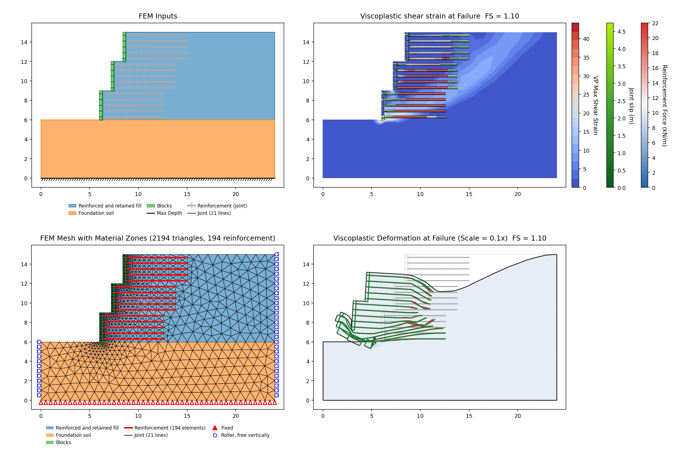

#### RS2-50: Geotextile wall, 4.2 m reinforcement (vp089) {#rs2-50}

The geotextile layers are shortened. No equilibrium is reached on the corpus mesh; with
feature-aware refinement near the reinforcement lines the run does equilibrate, but at two
levels far enough apart to be refinement-sensitivity rather than convergence, so the variant is
reported without a lock.

| Mesh | XSLOPE SSRM |
|---|---|
| corpus mesh | *no equilibrium* |
| `refine_factor` 3 | 0.923 |
| `refine_factor` 4 | 0.863 |

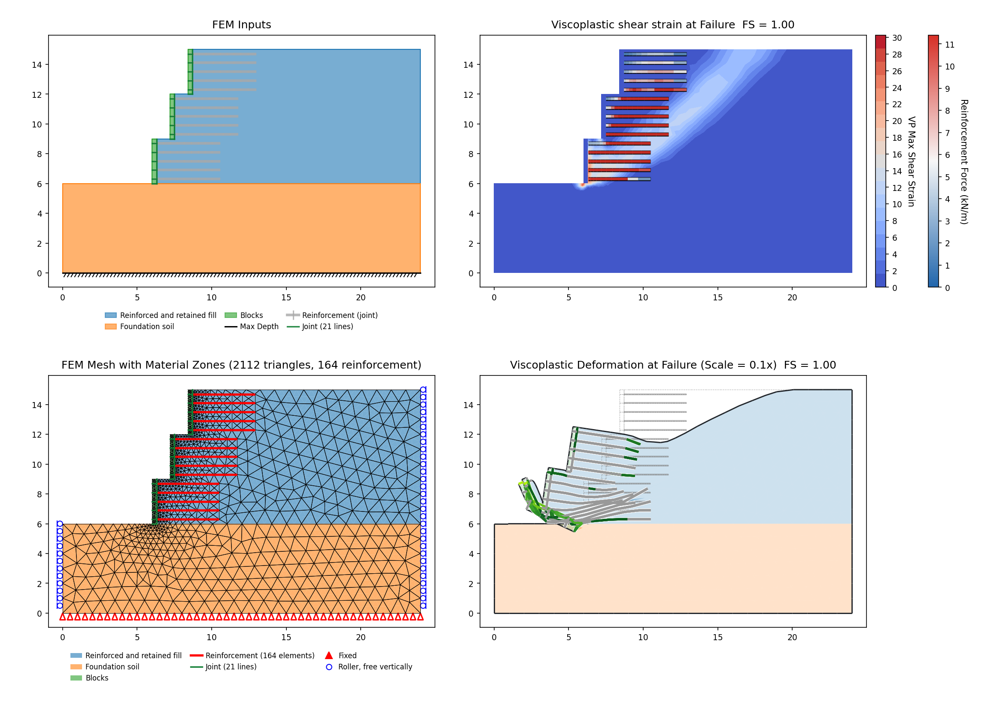

#### RS2-51: Geotextile wall, dual reinforcement type (vp090) {#rs2-51-wall}

Two geotextile grades in one wall. Same behaviour as RS2-50 and more pronounced — the finer of the
two refinements returns a collapse rather than a factor of safety. Reported without a lock.

| Mesh | XSLOPE SSRM |
|---|---|
| corpus mesh | *no equilibrium* |
| `refine_factor` 3 | 0.908 |
| `refine_factor` 4 | 0.277 (collapse) |

#### RS2-52: Geotextile wall, weak foundation (vp091) {#rs2-52}

The foundation is c = 0, φ = 18°, and the wall fails in bearing rather than through the reinforced
mass — the lowest factor in the family, and the one variant with a derived comparison.

| Model | XSLOPE | RS2 SSR | L&H FLAC referee |
|---|---|---|---|
| vp091 — the LEM file's 30 m section (reported, not locked) | 0.783 | 0.84 (−6.8%) | 0.86 (−9.0%) |
| vp091_fem — the vendor's own 24 m section (reported) | 0.760 | 0.84 (−9.5%) | 0.86 (−11.6%) |

RS2 publishes its own SSR for this variant — 0.84, alongside Spencer 0.96 and GLE 0.98 — so the
comparison that governs is strength reduction against strength reduction. Leshchinsky & Han's FLAC
referee 0.86 is the problem's published answer and reads wider still. Their FLAC drops on this case
for the same reason XSLOPE's SSRM does, so all three codes agree the mechanism moves into the
foundation.

**Two sections.** vp091 is the only file in this family whose foundation runs from x = −6 rather
than x = 0: the extra 36 m² exists so that Slide's printed critical circle, which daylights at
x = −1.6, can be seated for the LEM comparison. RS2's own #052 and the seven sibling corpus files
are all the 24 m section, and it is built here too
([vp091_fem.xlsx](files/rocscience/vp091_fem.xlsx)). A bearing mechanism is sensitive to the run of
ground in front of the toe, so the two sections could have been expected to differ widely; they do
not, and the shorter one reads **lower**, 0.783 → 0.760, further from RS2's 0.84 rather than nearer
it. The bearing capacity of a cohesionless foundation under a strength-reduced wall is
mesh-dependent in XSLOPE, which is why neither reading is locked.

#### RS2-53: Geotextile wall, water (vp092) {#rs2-53}

A pond against the wall. The reinforced granular fill is modelled free-draining — pore pressure on
the foundation only — following Leshchinsky & Han and Slide2's own model, which the LEM side of
this file is locked against; the discussion above records why the vendor's whole-mesh alternative
is not adopted. It converges — 1.135 under the family's K0 = 1 field stress on the 1.0 m
tri6 mesh, the highest factor in the family — but the same c = 0 fill localization makes the value
track the mesh, so no individual comparison is derived and the variant is reported without a lock.

#### RS2-54: Geotextile wall, crest surcharge (vp093) {#rs2-54}

A surcharge on the wall crest. No equilibrium on the corpus mesh, and refinement recovers one only
at the coarser of the two levels. Reported without a lock.

| Mesh | XSLOPE SSRM |
|---|---|
| corpus mesh | *no equilibrium* |
| `refine_factor` 3 | 0.824 |
| `refine_factor` 4 | *no equilibrium* |

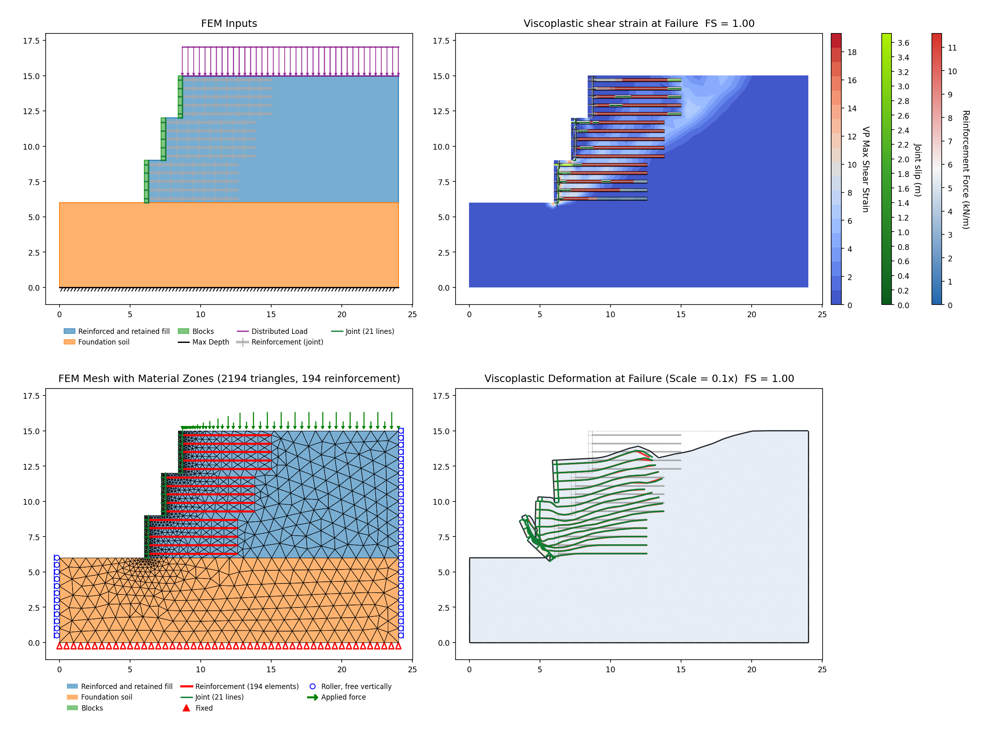

#### RS2-55: Geotextile wall, tier count (vp094) {#rs2-55}

The number of wall tiers is varied. Converges inside the family band; as with RS2-49 and RS2-53 no
individual comparison is derived, so it is reported without a lock. Its **0.959** sits above the
fill-quality variant [RS2-49](#rs2-49)'s 0.881, which is a different model.

<!-- test: file=files/rocscience/vp087.xlsx, type=fem_ssrm, expected_fs=0.931, element_type=tri6, target_size=0.7, tolerance=0.02, f_min=0.9, f_max=1.3, max_iter=16000, tension_srf=false, k0=1, benchmark=RS2-48-m0.7 -->
<!-- test: file=files/rocscience/vp087.xlsx, type=fem_ssrm, expected_fs=0.994, element_type=tri6, target_size=1.5, tolerance=0.02, f_min=0.9, f_max=1.3, max_iter=16000, tension_srf=false, k0=1, benchmark=RS2-48-m1.5 -->
<!-- test: file=files/rocscience/vp087.xlsx, type=fem_ssrm, expected_fs=1.080, element_type=tri6, target_size=1.0, tolerance=0.02, f_min=0.9, f_max=1.4, max_iter=16000, elastic_materials=Blocks, tension_srf=false, k0=1, benchmark=RS2-48-elastic-facing -->
<!-- test: file=files/rocscience/vp087.xlsx, type=fem_ssrm, expected_fs=0.944, element_type=tri6, target_size=1.0, tolerance=0.02, f_min=0.9, f_max=1.3, max_iter=16000, tension_srf=false, k0=1, benchmark=RS2-48 -->

### RS2 Part IV VP51: Four-material slope, water table, tension crack, seismic — 12-method comparison (Zhu et al. 2003) {#p4-vp51}

**Input files:** [rs2_51.xlsx](files/rocscience/rs2_51.xlsx) — Part 4 Verification Problem #51.

> Zhu, D.Y., Lee, C.F. & Jiang, H.D. (2003). "A generalised framework of limit equilibrium
> methods for slope stability analysis." *Géotechnique* 53(4), 377–395. *(RS2/Slide2 Slope
> Stability Verification Manual, Part 4, Problem #51.)*

A four-layer 1V:2H slope (toe (0,0) → crest (60,30)) whose strata dip parallel to the face:
Layer 1 (top, c = 20, φ = 32°, γ = 18.2), Layer 2 (c = 25, φ = 30°, γ = 18.0), Layer 3 (the
weak band, c = 40, **φ = 18°**, γ = 18.5) and Layer 4 (bottom, c = 40, φ = 28°, γ = 18.8). Pore
pressure comes from a 9-point piezometric surface connected to every material; a horizontal
seismic coefficient **k = 0.1** is applied; and a **dry tension crack** of the Rankine active
depth *h*c = 2c/(γ√Ka) ≈ 3.97 m sits in the top layer. The published task
is the factor of safety on a **given circular surface** with 100 slices, tolerance 0.001, over
twelve LEM methods. This is an LEM problem; the RS2 SSRM value of 1.22 in the catalog is an
independent finite-element mechanism, not the LEM target reproduced here.

**Partial — reconstructed surface.** The vendor `.fez` is an RS2 SSRM model that carries **no LEM
slip surface**, and the given circle and tension-crack depth are figure-only (Figs 51.1–51.3, not
in the `.fez` or the manual text). The circle here — center (32, 36), tangent at y = 1.0
(R = 35), daylighting from the lower face (x ≈ 13) to the back plateau (x ≈ 66) — was recovered
by inversion against the rigorous methods. Geometry, materials, the piezo line and k = 0.1 are
transcribed from `slope stability #051.fez` (k = 0.1 is the `.fea` body force bx = −0.1, which the
importer does not auto-apply). On this surface, at 100 slices:

| Method | XSLOPE | Slide2 | Zhu | Note |
|---|---|---|---|---|
| Ordinary (OMS) | 1.092 | 1.145 (−4.6%) | 1.066 (+2.4%) | lands inside the Slide2–Zhu spread |
| Bishop simplified | 1.316 | 1.278 (+3.0%) | 1.278 (+3.0%) |  |
| Janbu simplified | 1.196\* | 1.112 | 1.112 | \*XSLOPE reports Janbu **corrected** (f₀ ≈ 1.08); 1.196/1.08 ≈ **1.11** ✓, so the columns are not like-for-like |
| Corps of Engineers | 1.400 | 1.422 (−1.5%) | 1.377 (+1.7%) | inside the Slide2–Zhu spread |
| Lowe & Karafiath | 1.244 | 1.288 (−3.4%) | 1.290 (−3.6%) |  |
| **Spencer** | **1.300** | **1.293** (**+0.5%**) | **1.293** (**+0.5%**) |  |
| GLE / Morgenstern–Price | 1.282 | 1.304 | 1.303 (−1.6%) | half-sine interslice function; Slide2's column is GLE, which this page's conventions treat as a different method from XSLOPE's M-P, so it stays bare like the Janbu row |

Spencer — the headline LEM value the RS2 manual's Table 51.2 quotes — reproduces to +0.5%, and
Janbu once the corrected-vs-simplified convention is undone matches to within 0.5%; OMS and Corps
both land between the Slide2 and Zhu columns. Bishop (+3.0%), Lowe (−3.4%) and M-P (−1.6%) carry
the residual of fitting a figure-only circle plus method-implementation differences (XSLOPE's M-P
uses a half-sine interslice function and lands just below Spencer, where Zhu's GLE lands just
above). An unconstrained circular search does **not** reproduce this problem — it dives into a
spurious deep mechanism daylighting on the flats through the φ = 18° weak band (Spencer ≈ 0.99),
so the verification is locked as a single fixed circle, not a search.

<!-- test: file=files/rocscience/rs2_51.xlsx, type=single_circle, num_slices=100, fs_oms=1.092, fs_bishop=1.316, fs_janbu=1.196, fs_corps=1.400, fs_lowe=1.244, fs_spencer=1.300, fs_mprice=1.282, benchmark=RS2-P4-VP51 -->

### RS2-56: Homogeneous slope vs Z-Soil, PLAXIS, GEO FEM (Pruska 2003, H = 7 m, 5 cases) {#rs2-56}

New corpus files (no Slide2 counterpart). Built: all five cases.

**Input files:** [rs2_56c1.xlsx](files/rocscience/rs2_56c1.xlsx) ·
[rs2_56a.xlsx](files/rocscience/rs2_56a.xlsx) (case 2) ·
[rs2_56c3.xlsx](files/rocscience/rs2_56c3.xlsx) ·
[rs2_56c4.xlsx](files/rocscience/rs2_56c4.xlsx) ·
[rs2_56b.xlsx](files/rocscience/rs2_56b.xlsx) (case 5)

| Method | XSLOPE | Published |
|---|---|---|
| SSRM (rs2_56a — case 2, weakest; lock) | 0.664 | RS2 SSRM 0.67 (−0.9%) |
| SSRM (rs2_56b — case 5, strongest; lock) | 2.096 | RS2 SSRM 2.14 (−2.1%) |

*All five cases land within ±2.3% of RS2's M-C and inside the four-program band (Z-Soil, PLAXIS, GEO FEM); the two locks bracket the family, and case 4 (−2.3%) is the widest of the five and sets the dot. Full case-by-case tables — including the Z-Soil / PLAXIS / GEO FEM / Slide2 columns — are in [the Pruska cross-bearing section](#pruska).*

<!-- test: file=files/rocscience/rs2_56a.xlsx, type=fem_ssrm, expected_fs=0.664, element_type=tri6, target_size=0.8, tolerance=0.02, f_min=0.32, f_max=1.12, max_iter=16000, tension_srf=false, k0=1, benchmark=RS2-56a -->
<!-- test: file=files/rocscience/rs2_56b.xlsx, type=fem_ssrm, expected_fs=2.096, element_type=tri6, target_size=0.8, tolerance=0.02, f_min=1.79, f_max=2.59, max_iter=16000, tension_srf=false, k0=1, benchmark=RS2-56b -->

**Case 2 — weakest of the five (rs2_56a)**

**Case 5 — strongest of the five (rs2_56b)**

### RS2-57: Pruska H = 10.5 m, 6 cases {#rs2-57}

New corpus files. Built: all six cases.

**Input files:** [rs2_57a.xlsx](files/rocscience/rs2_57a.xlsx) (case 1) ·
[rs2_57c2.xlsx](files/rocscience/rs2_57c2.xlsx) ·
[rs2_57c3.xlsx](files/rocscience/rs2_57c3.xlsx) ·
[rs2_57c4.xlsx](files/rocscience/rs2_57c4.xlsx) ·
[rs2_57c5.xlsx](files/rocscience/rs2_57c5.xlsx) ·
[rs2_57b.xlsx](files/rocscience/rs2_57b.xlsx) (case 6)

| Method | XSLOPE | Published |
|---|---|---|
| SSRM (rs2_57a — case 1, weakest; lock) | 0.439 | RS2 SSRM 0.44 (−0.2%) |
| SSRM (rs2_57b — case 6, strongest; lock) | 1.401 | RS2 SSRM 1.42 (−1.3%) |

*All six cases land within ±1.7% of RS2's M-C; the two locks bracket the family, and case 4 (−1.7%) is the widest of the six and sets the dot. Full case-by-case tables — including the Z-Soil / PLAXIS / GEO FEM / Slide2 columns — are in [the Pruska cross-bearing section](#pruska).*

<!-- test: file=files/rocscience/rs2_57a.xlsx, type=fem_ssrm, expected_fs=0.439, element_type=tri6, target_size=0.8, tolerance=0.02, f_min=0.1, f_max=0.89, max_iter=16000, tension_srf=false, k0=1, benchmark=RS2-57a -->
<!-- test: file=files/rocscience/rs2_57b.xlsx, type=fem_ssrm, expected_fs=1.401, element_type=tri6, target_size=0.8, tolerance=0.02, f_min=1.07, f_max=1.87, max_iter=16000, tension_srf=false, k0=1, benchmark=RS2-57b -->

**Case 1 — weakest of the six (rs2_57a)**

**Case 6 — strongest of the six (rs2_57b)**

### RS2-58: Pruska H = 14 m, 6 cases {#rs2-58}

New corpus files. Built: all six cases.

**Input files:** [rs2_58a.xlsx](files/rocscience/rs2_58a.xlsx) (case 1) ·
[rs2_58c2.xlsx](files/rocscience/rs2_58c2.xlsx) ·
[rs2_58c3.xlsx](files/rocscience/rs2_58c3.xlsx) ·
[rs2_58c4.xlsx](files/rocscience/rs2_58c4.xlsx) ·
[rs2_58c5.xlsx](files/rocscience/rs2_58c5.xlsx) ·
[rs2_58b.xlsx](files/rocscience/rs2_58b.xlsx) (case 6)

| Method | XSLOPE | Published |
|---|---|---|
| SSRM (rs2_58a — case 1, weakest; lock) | 0.339 | RS2 SSRM 0.33 (+2.7%) |
| SSRM (rs2_58c5 — case 5, c = 5, φ = 30; lock) | 0.714 | RS2 SSRM 0.72 (−0.8%) |
| SSRM (rs2_58b — case 6, strongest; lock) | 1.066 | RS2 SSRM 1.06 (+0.6%) |

*All six land within ±2.7% of RS2's M-C, case 1 being the widest. Case 5 — the steepest, most
cohesionless material (c = 5, φ = 30 on the 54.5° face) on the tallest slope — is the third lock:
on its own corpus file it reads 0.714 against a tight published cluster (RS2 0.72, Z-Soil 0.75,
PLAXIS 0.74, GEO FEM 0.73, Slide2 0.73), inside all five. Full case-by-case tables in [the Pruska cross-bearing
section](#pruska).*

<!-- test: file=files/rocscience/rs2_58a.xlsx, type=fem_ssrm, expected_fs=0.339, element_type=tri6, target_size=0.8, tolerance=0.02, f_min=0.1, f_max=0.78, max_iter=16000, tension_srf=false, k0=1, benchmark=RS2-58a -->
<!-- test: file=files/rocscience/rs2_58c5.xlsx, type=fem_ssrm, expected_fs=0.714, element_type=tri6, target_size=0.8, tolerance=0.02, f_min=0.27, f_max=1.07, max_iter=16000, tension_srf=false, k0=1, benchmark=RS2-58c5 -->
<!-- test: file=files/rocscience/rs2_58b.xlsx, type=fem_ssrm, expected_fs=1.066, element_type=tri6, target_size=0.8, tolerance=0.02, f_min=0.71, f_max=1.51, max_iter=16000, tension_srf=false, k0=1, benchmark=RS2-58b -->

**Case 1 — weakest of the six (rs2_58a)**

**Case 5 — the steep cohesionless face (rs2_58c5)**

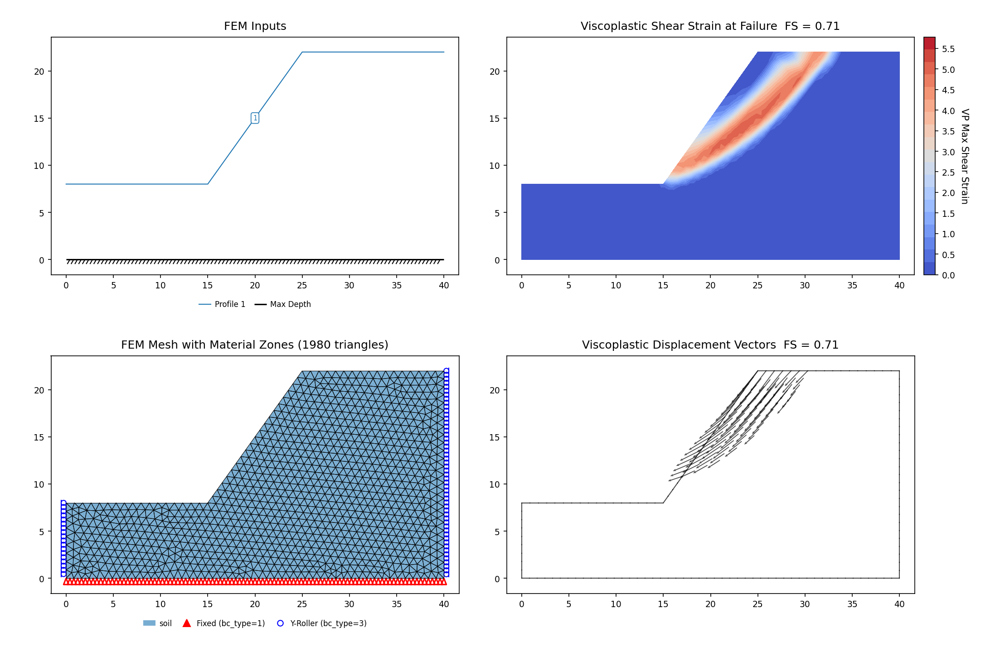

**Case 6 — strongest of the six (rs2_58b)**

---

## The Pruska cross-bearing (#56–58) {#pruska}

Pruska (2003) analyzed three homogeneous slopes (H = 7, 10.5, and 14 m over an 8-m
foundation) with five or six material sets each in four SSRM programs. RS2 reproduces the
study; XSLOPE's SSRM joins it here as a fifth column — all 17 cases land within ±2.7% of
RS2 and inside the four-program band. Every case is a committed corpus file, so every value
below is reproducible; the six that bracket the three families are regression-locked, as is the
steepest cohesionless case of the tallest slope.
(The study's Drucker-Prager columns are not comparable; XSLOPE, like Slide2, analyzes
Mohr-Coulomb only.)

**Elastic constants and tensile caps come from the shipped models, not the printed tables.**
Each section's Table 1 gives ν per case but prints E once, as a merged cell spanning every
row — "5,000". The models RS2 solved these SSR values with carry two pairs, keyed to the
material family: (ν, E) = (0.30, 5 000) for the γ = 24 / c = 20 cases and (0.35, 10 000) for
the γ = 18 / c = 5 cases. Every case also carries a real tensile cap, T = c, well inside the
uncapped Mohr-Coulomb apex (20 against 34.6 kPa on #56 case 5; 5 against 8.66 on #58 case 5).
Both are transcribed from the models.

**H = 7 m (#56):** cases (γ, c, φ) = (24,20,10), (18,5,10), (24,20,20), (18,5,20), (24,20,30)

| Case | XSLOPE | RS2 | Z-Soil | PLAXIS | GEO FEM | Slide2 LEM |
|---|---|---|---|---|---|---|
| 1 | 1.219 | 1.22 (−0.1%) | 1.21 (+0.7%) | 1.22 (−0.1%) | 1.31 (−6.9%) | 1.22 |
| 2 | 0.664 | 0.67 (−0.9%) | 0.71 (−6.5%) | 0.68 (−2.4%) | 0.73 (−9.0%) | 0.66 |
| 3 | 1.646 | 1.68 (−2.0%) | 1.64 (+0.4%) | 1.65 (−0.2%) | 1.71 (−3.7%) | 1.64 |
| 4 | 1.026 | 1.05 (−2.3%) | 0.95 (+8.0%) | 0.99 (+3.6%) | 1.17 (−12.3%) | 1.02 |
| 5 | 2.096 | 2.14 (−2.1%) | 1.98 (+5.9%) | 2.09 (+0.3%) | 2.19 (−4.3%) | 2.08 |

**H = 10.5 m (#57):** cases 1–6 = (18,5,10), (24,20,10), (18,5,20), (24,20,20), (18,5,30), (24,20,30)

| Case | XSLOPE | RS2 | Z-Soil | PLAXIS | GEO FEM | Slide2 LEM |
|---|---|---|---|---|---|---|
| 1 | 0.439 | 0.44 (−0.2%) | 0.46 (−4.6%) | 0.44 (−0.2%) | 0.48 (−8.5%) | 0.44 |
| 2 | 0.801 | 0.79 (+1.4%) | 0.83 (−3.5%) | 0.85 (−5.8%) | 0.91 (−12.0%) | 0.80 |
| 3 | 0.696 | 0.69 (+0.9%) | 0.71 (−2.0%) | 0.71 (−2.0%) | 0.73 (−4.7%) | 0.69 |
| 4 | 1.091 | 1.11 (−1.7%) | 1.14 (−4.3%) | 1.17 (−6.8%) | 1.18 (−7.5%) | 1.10 |
| 5 | 0.946 | 0.96 (−1.5%) | 0.98 (−3.5%) | 0.97 (−2.5%) | 1.03 (−8.2%) | 0.95 |
| 6 | 1.401 | 1.42 (−1.3%) | 1.52 (−7.8%) | 1.45 (−3.4%) | 1.54 (−9.0%) | 1.40 |

**H = 14 m (#58):** same six material cases as #57

| Case | XSLOPE | RS2 | Z-Soil | PLAXIS | GEO FEM | Slide2 LEM |
|---|---|---|---|---|---|---|
| 1 | 0.339 | 0.33 (+2.7%) | 0.34 (−0.3%) | 0.35 (−3.1%) | 0.35 (−3.1%) | 0.34 |
| 2 | 0.591 | 0.59 (+0.2%) | 0.61 (−3.1%) | 0.59 (+0.2%) | 0.63 (−6.2%) | 0.60 |
| 3 | 0.526 | 0.52 (+1.2%) | 0.54 (−2.6%) | 0.53 (−0.8%) | 0.59 (−10.8%) | 0.53 |
| 4 | 0.824 | 0.83 (−0.7%) | 0.84 (−1.9%) | 0.82 (+0.5%) | 0.86 (−4.2%) | 0.84 |
| 5 | 0.714 | 0.72 (−0.8%) | 0.75 (−4.8%) | 0.74 (−3.5%) | 0.73 (−2.2%) | 0.73 |
| 6 | 1.066 | 1.06 (+0.6%) | 1.07 (−0.4%) | 1.06 (+0.6%) | 1.10 (−3.1%) | 1.08 |

The widest difference in the study is +2.7%, on case 1 of the H = 14 m slope — the weakest material
on the tallest face, where RS2's own 0.33 is quoted to two decimals and one count in the last place
is 3.0%. The cases the four programs disagree about most among themselves (GEO FEM reads 23.2% above
Z-Soil on #56 case 4, 11.3% above PLAXIS on #58 case 3) are not the cases XSLOPE reads widest on.
Each slope's locks bracket its family — the weakest and strongest case — with the H = 14 m slope
also locking case 5, the steepest cohesionless face in the study.

### RS2-59: Stability of a three-layered soil slope (Görög & Török 2007) {#rs2-59}

**Input files:** [rs2_59.xlsx](files/rocscience/rs2_59.xlsx)

The Budapest (Rózsadomb) landslide, after

> [Görög, P. & Török, Á. (2007)](https://doi.org/10.5194/nhess-7-417-2007). *Slope stability assessment of weathered clay by using
> field data and computer modelling: a case study from Budapest.* Natural Hazards 45
> (as presented in the RS2 Slope Stability Verification Manual, Part III, Problem 59,
> "Stability of a Three-Layered Soil Slope", pp. 200–201).

A ~415 m wide × ~75 m tall real-coordinate hillslope in three layers: a YellowClay/Debris
cover (c = 50, φ = 15°, γ = 19), a thin weak **waste lens** (c = 1, φ = 5°, γ = 14) and a
strong GreyClay base (c = 250, φ = 30°, γ = 22). The waste lens is a wedge confined to the
left ~136 m — ~12.6 m thick at the toe face, tapering to zero at x = 136 — that daylights on
the toe. The critical mechanism is a **non-circular** translational slip riding the top of
the lens, which is what makes this an SSRM (not a circular-search) problem: an unconstrained
circular search misfinds the deeper competing surface (FS ≈ 1.9), whereas the SSRM localizes
the shear band through the c = 1 / φ = 5 lens on its own. Dry — no water table, tension crack,
seismic or loads. Elastic constants are the published Case-1 values (E = 50 000 kPa, ν = 0.4;
the vendor `.fez` reader does not parse E/ν); ψ = 0 (the Griffiths convention this corpus uses).

| Case | XSLOPE | RS2 SSRM | PLAXIS | Slide2 |
|---|---|---|---|---|
| Case 1 (published moduli), 3 m mesh | 1.572 | 1.57 (+0.1%) | 1.6 (−1.8%) | 1.567 |
| Case 2 (varying moduli) | — | 1.56 | 1.6 | 1.567 |

The published problem also runs a **Case 2** with varying moduli (GreyClay 20 000, YellowClay/
Debris 18 000, Waste 2 000 kPa). Since SSRM FS is insensitive to the elastic constants (an E-only
change), Case 2 is not a separate XSLOPE case and the row above carries the vendor columns only.

XSLOPE's SSRM lands effectively on the Slide2 / RS2 SSRM cluster and just below PLAXIS.
It is locked as a **regression** anchor at the 3 m mesh (a full solve on the ~415 m section),
landing on the LEM/RS2 cluster rather than advertised as converged, consistent with the mesh
discipline stated at the top of this page.

<!-- test: file=files/rocscience/rs2_59.xlsx, type=fem_ssrm, expected_fs=1.572, element_type=tri6, target_size=3.0, tolerance=0.02, f_min=1.3, f_max=1.9, max_iter=16000, tension_srf=true, k0=1, benchmark=RS2-59 -->

### RS2-60: Generalized Hoek-Brown, homogeneous slope (Li et al. 2008) {#rs2-60}

**Input files:** [rs2_60a.xlsx](files/rocscience/rs2_60a.xlsx) (β = 15°) ·
[rs2_60b.xlsx](files/rocscience/rs2_60b.xlsx) (β = 30°) ·
[rs2_60c.xlsx](files/rocscience/rs2_60c.xlsx) (β = 45°)

A homogeneous rock slope at three angles, after

> [Li, A.J., Merifield, R.S., & Lyamin, A.V. (2008)](https://doi.org/10.1016/j.ijrmms.2007.08.010). "Stability charts for rock slopes based
> on the Hoek-Brown failure criterion." *International Journal of Rock Mechanics and Mining
> Sciences* 45(5), 689–700.

GSI = 70, $m_i$ = 15, $D$ = 0, γ = 23 kN/m³, ν = 0.3, $H$ = 1 m. This is the companion to the
[Hammah benchmark](#hoek-brown) at the opposite end of the criterion: GSI = 70 is a strong,
lightly-jointed rock mass ($a$ = 0.501, essentially the classical exponent), where Hammah's
GSI = 5 is a badly broken one ($a$ = 0.619).

**The problem is normalized, and that is the trap.** Li's charts work in the dimensionless
ratio σci/(γH), and every case here sits at a *critical* ratio — the value at which the slope
is on the verge of collapse, so F ≈ 1 by construction. With $H$ = 1 m, γH is just 23 kPa, and
a critical ratio below one puts σci in the **sub-kPa to few-kPa range**. Those magnitudes look
absurd for rock, and they are supposed to: a 1 m slope in 0.6 kPa rock is the same problem as
a 100 m slope in 60 kPa rock. Entering σci in MPa, as Hoek-Brown convention invites, overstates
the strength a thousandfold and the slope becomes trivially stable.

**Where σci comes from.** The manual never prints it, so each case takes σci straight from the
RS2 vendor model (the material's Generalized Hoek-Brown σci field in the `.fez`). That choice
matters because the vendor files and Li's Table 1 do not fully agree:

| case | β | σci (vendor `.fez`) | implied σci/(γH) | Li Table 1 ratio | agree? |
|---|---:|---:|---:|---:|:--:|
| a | 15° | 0.598 kPa | 0.026 | 0.026 | yes |
| b | 30° | 1.61 kPa | 0.070 | 0.075 | no |
| c | 45° | 4.37 kPa | 0.190 | 0.176 | no |

Only case a's published ratio reproduces the vendor σci. Using Li's ratios for b and c would
give 1.725 and 4.048 kPa instead of the vendor's 1.61 and 4.37. XSLOPE uses the **vendor**
values, so the reconstruction is faithful to the RS2 model that actually produced the
published results rather than to a chart the model does not match.

**Factors of safety:**

| case | XSLOPE Bishop | XSLOPE Spencer | Slide2 Spencer | Li (limit analysis) |
|---|---|---|---|---|
| a (β = 15°) | 1.009 | 1.009 | 1.011 (−0.2%) | 1.0 (+0.9%) |
| b (β = 30°) | 0.987 | 0.989 | 0.992 (−0.3%) | 1.0 (−1.1%) |
| c (β = 45°) | 1.030 | 1.035 | 1.035 (0.0%) | 1.0 (+3.5%) |

*All three Spencer factors reproduce Slide2's own Spencer values almost exactly
(1.009 / 0.989 / 1.035 vs 1.011 / 0.992 / 1.035), confirming the Hoek-Brown implementation at
high GSI. Every case lands within 3.5% of unity, as a critical ratio should. SSRM is not
locked on this problem.*

**One more paper erratum, on case a.** Li's Table 1 labels its last block β = 10°, but the body
text and the charts say 15° (Fig. 5 is β = 15°; no β = 10° chart exists) — a typographical
error. RS2 read it as 15° too: its Slide2 value for case a (1.011) reproduces Li's own F for
that row.

<!-- test: file=files/rocscience/rs2_60a.xlsx, type=circular_search, method=spencer, expected_fs=1.009, num_slices=40, benchmark=RS2-60a -->
<!-- test: file=files/rocscience/rs2_60b.xlsx, type=circular_search, method=spencer, expected_fs=0.989, num_slices=40, benchmark=RS2-60b -->
<!-- test: file=files/rocscience/rs2_60c.xlsx, type=circular_search, method=spencer, expected_fs=1.035, num_slices=40, benchmark=RS2-60c -->

### RS2-61: Local and global minima, homogeneous slope (Cheng et al. 2007) {#rs2-61}

**Input files:** [rs2_61a.xlsx](files/rocscience/rs2_61a.xlsx) (one geometry; cases 1 & 3 locked
by circular LEM, case 2 locked by constrained SSRM, case 4 blocked)

A homogeneous benched slope, after

> [Cheng, Y.M., Lansivaara, T., & Wei, W.B. (2007)](https://doi.org/10.1016/j.compgeo.2006.10.011). "Two-dimensional slope stability analysis
> by limit equilibrium and strength reduction methods." *Computers and Geotechnics* 34, 137–150.

c = 5 kPa, φ = 30°, γ = 20 kN/m³. The problem exists to show how a search settles onto
*different* minima: case 1 is the unconstrained global minimum, while cases 2–4 fence an RS2
Polygon Search Area onto successive **local** minima. All four cases share the one geometry
([rs2_61a.xlsx](files/rocscience/rs2_61a.xlsx)); only the search region changes. Published:

| Case | Surface (RS2 fig.) | XSLOPE Spencer (LEM) | XSLOPE SSRM (SSR-zone) | XSLOPE Bishop | Slide2 | Cheng (ref) | RS2 SSR | Governing |
|---|---|---|---|---|---|---|---|---|
| 1 | mid-lower face (global) | **1.338** (locked) | — | 1.342 | 1.336 (+0.1%) | 1.327 (+0.8%) | 1.35 | Slide2 |
| 2 | deep toe-to-crest (Fig. 4) | *blocked* (~1.47) | **1.398** (locked) | — | 1.385 | 1.375 | 1.36 (+2.8%) | RS2 SSR |
| 3 | upper face, crest→bench (Fig. 5) | **1.437** (locked) | — | — | 1.443 (−0.4%) | 1.415 (+1.6%) | 1.42 | Slide2 |
| 4 | shallow near-crest (Fig. 6) | *blocked* (~1.63) | ~1.50 (blocked) | — | 1.397 | 1.40 | 1.42 (+5.6%) | RS2 SSR |

**Case 1 (global).** Seeding the circular search with a toe-to-crest circle refines onto the
global minimum, a mid-lower-face circle (center ≈ 18, 24; daylighting x ≈ 19–27). Spencer and
Bishop agree on it, and both land on the Slide2 and Cheng values, as the table records.

**Case 3 (upper-face local minimum).** `circular_search` takes optional search-window limits
(`center_box` / `entry_range` / `exit_range` / `tangent_depth`) — the LEM analog of RS2's SSR
Polygon Search Area and Slide2's slip-center / entry-and-exit limits. Confining the Spencer search
to the upper-face window read from **Fig. 5** — entry on the crest bench (x ≈ 42–54), exit at the
first bench (x ≈ 23–32), tangent bottoming at the bench elevation (y ≈ 16–22) — redirects it off the
global and onto the distinct upper-face local minimum, where Spencer lands on the published
Slide2 and Cheng values. The bounds come from the figure's mechanism, not from tuning to the number;
the same result holds across loosened variants of the window. (This is the "grid seed traps at
FS ≈ 1.44" family the paper illustrates, reached here by selecting the window rather than by accident.)

**Cases 2 and 4 — LEM route (blocked).** RS2's Case-2 (deep toe-to-crest) and
Case-4 (shallow near-crest) minima come from a *strength-reduction* search pinned by a polygon area;
they are **not local minima of the circular LEM problem** on this geometry. A Spencer search confined
to Fig. 4's toe-to-crest window pins against the window edge at FS ≈ 1.47 (the deep family drains
toward the global, with no interior minimum), and one confined to Fig. 6's near-crest window returns
FS ≈ 1.63 (a shallow c = 5 circle on the 32° upper face is genuinely stronger). Neither reproduces
the published Cheng/Slide2 columns, so the LEM route to those columns is blocked; the FEM route
below reaches them.

**Cases 2 and 4 — FEM route, against RS2's SSR column.** `solve_ssrm`
accepts an `ssr_zone` polygon (RS2's "SSR Search Area"): strength reduction is applied only to
elements whose centroid lies inside the polygon, and everything outside is held at full strength.
The constraint polygon is **RS2's own**, read verbatim from the vendor model files — the
`SSR_polygonal_zones` block in the `.fez`/`.fea` (parsed by `benchmarks/rocscience/rs2_ssr_zones.py`
from the native `slope stability #061_02.fez` / `#061_04.fez`); RS2-61 carries no material partition,
so the polygon is the whole constraint. Confining the SSRM to Fig. 4's deep toe-to-crest zone reproduces Case 2: **SSRM 1.398
vs RS2 SSRM 1.36 (+2.8%)** — inside the corpus's usual SSRM-vs-published band (cf. [RS2-63](#rs2-63)
+2.1%) — locked at the 1.0 m tri6 mesh. Case 4's near-crest zone confines the mechanism to the
correct shallow surface but returns **SSRM ≈ 1.50 vs RS2 SSRM 1.42 (+5.6%)**: the confined near-crest
mechanism in c = 5/φ = 30 is genuinely stiffer in XSLOPE's SSRM than in RS2's, and wider than
Case 2's +2.8% on the same geometry, so Case 4 is reported rather than locked.

<!-- test: file=files/rocscience/rs2_61a.xlsx, type=circular_search, method=spencer, expected_fs=1.338, num_slices=40, benchmark=RS2-61a -->
<!-- test: file=files/rocscience/rs2_61a.xlsx, type=circular_search, method=spencer, expected_fs=1.437, num_slices=40, entry_range=42;54, exit_range=23;32, tangent_depth=16;22, benchmark=RS2-61-case3 -->
<!-- test: file=files/rocscience/rs2_61a.xlsx, type=fem_ssrm, expected_fs=1.398, element_type=tri6, target_size=1.0, tolerance=0.02, f_min=1.0, f_max=2.0, max_iter=16000, ssr_zone=8.516;12.255;8.686;6.779;21.55;8.975;28.407;13.412;31.455;18.522;32.3046;20.2236;28.228;21.032;26.57;17.894;22.043;13.995;8.516;12.255, tension_srf=true, k0=1, benchmark=RS2-61-case2 -->

**Case 2 — deep toe-to-crest, constrained SSRM (rs2_61a)**

### RS2-62: Three-layered slope with a soft band (Cheng et al. 2007) {#rs2-62}

**Input files:** [rs2_62a.xlsx](files/rocscience/rs2_62a.xlsx) (Analysis I, 28 m) ·
[b](files/rocscience/rs2_62b.xlsx) (II, 20 m) · [c](files/rocscience/rs2_62c.xlsx) (III, 12 m)

A three-layer slope carrying a thin **soft band** (Soil 2: c = 0, φ = 25°) that dips through it
between a stronger cap (Soil 1: c = 20, φ = 35°) and base (Soil 3: c = 10, φ = 35°); γ = 19,
E = 14 MPa, ν = 0.3 throughout. From the same Cheng, Lansivaara & Wei (2007) paper as
[RS2-61](#rs2-61)/[63](#rs2-63). Three geometries narrow the band's daylight width (Analysis
I / II / III = 28 / 20 / 12 m domains), and each was run at two dilation angles — Case 1 (ψ = 0)
and Case 2 (ψ = φ, associated). **This is a hard, code-divergent benchmark by design**: for the
same ψ = 0 input, Plaxis and RS2 return ≈ 0.8–0.9 while Flac3D returns 1.03–1.64.

| Analysis | XSLOPE SSRM (ψ = 0) | RS2 SSR | Plaxis | Flac3D | Status |
|---|---|---|---|---|---|
| I (28 m) | ≈ 1.0 (coarse mesh) | 0.88 | 0.86 | 1.64 | not locked |
| II (20 m) | ≈ 1.0 (coarse mesh) | 0.89 | 0.85 | 1.30 | not locked |
| III (12 m) | **0.781** | 0.81 (−3.6%) | 0.82 (−4.8%) | 1.03 (−24.2%) | locked |

Case 2 (ψ = φ, associated flow) is **out of scope by construction** — XSLOPE's SSRM is
non-associated only (ψ = 0, the Griffiths convention). Its published values are recorded for
completeness and no dot rests on them:

| Analysis | RS2 SSR | Plaxis | Flac3D |
|---|---|---|---|
| I (28 m) | 0.98 | 0.97 | 1.61 |
| II (20 m) | 0.98 | 0.97 | 1.28 |
| III (12 m) | 0.93 | 0.94 | 1.03 |

Two things control this problem, and only one of them is physical.

**Band thickness (≈ 0.4 m) sets the mechanism.** The SSRM reproduces the Plaxis/RS2 ψ = 0
cluster only when the mesh resolves the soft band, so feature-aware refinement
(`refine_factor=3, refine_features=thin_zones`) drives ≥ 3 elements across it. Below that the
band is invisible to the solver and the slope reads as far too stable — a uniform 0.5 m mesh
gives 0.998, and `refine_factor=2` (2 elements across the band) gives 1.18. Analyses I and II
show the same under-resolution (≈ 1.0), and band-only refinement does not fix them because
their wider-domain mechanism runs through the far field, so only the compact Analysis III
geometry is locked; it is the representative case for the family.

**The far-field mesh size sets the numerics.** The viscoplastic
pseudo-time step is bounded by a stability limit that tightens as sin²φ grows, and SSRM raises
the *reduced* friction angle atan(tan φ / F) without bound as F falls — 35° becomes 60° at
F = 0.4 and 74° at F = 0.2. XSLOPE's timestep clamps to that limit at each trial's reduced
angle. Without the clamp, trials at low F oscillate indefinitely and a non-convergence
criterion scores them as collapse even though displacement never leaves its elastic value; because
this slope is unstable (FS < 1), bracketing it *requires* visiting those low-F trials, so such
phantom failures reach the answer and the factor of safety moves with the mesh for numerical
rather than physical reasons, scattering across 0.21 – 0.93.

**The decisive input on this problem is tensile strength.** The vendor `.fez` assigns each material
an explicit tensile cap (`t_cut` = 20 / 0 /
10 kPa, equal to its cohesion) and reduces it with the SRF (`tensilestrength_SRF: 1`). Without
those caps, Mohr-Coulomb gives the cap soil an implicit tensile strength of c/tan φ ≈ 28 kPa,
which holds the steep entry cut at the crest shut — and the FE then *genuinely* equilibrates far
past the vendors' answer (budget-independent states to F ≥ 1.3, displacements ~1.8× elastic at
F = 1). With the vendor caps carried into the model and reduced with the SRF, the band mechanism
mobilizes exactly as limit equilibrium predicts: F = 0.75 converges at 1.03× elastic in ~10k
iterations, F = 0.80 runs away (1.7× elastic, growing to 10.7× by F = 1.0), and the bisection
returns **0.781** — 0.4% from XSLOPE's own Spencer on the same mechanism (0.784), 3.6% conservative
of RS2 (0.81) and 4.8% of Plaxis (0.82).

Three cross-checks anchor the number. The geometry and strengths match the vendor model
vertex-for-vertex; XSLOPE's Spencer on the toe-exit band surface independently gives
0.784; and the compiled and reference SSRM kernels agree on this configuration, because failure
here is decided by displacement runaway with a wide margin rather than by a marginal convergence
verdict — the two kernels differ by 0.58 on a configuration that sits on that knife-edge.

The mesh requirements stand: the ≈ 0.4 m band must be resolved (`refine_factor=3,
refine_features=thin_zones`; an unresolved band reads ≈ 1.0), and the far field is bounded by
the global size ceiling. Analyses I and II remain unlocked — band-only refinement does not
capture their wider-domain mechanism.

**The vendor's own refinement region is not transcribed.** `#062_05`'s `disc regions:` block
declares an interior refinement rectangle, x ∈ [2.407, 9.534], y ∈ [3.874, 9.342], at 0.084 m
against a 0.687 m boundary discretization. The corpus mesh instead reaches the band through
`refine_features=thin_zones`, which leaves it finer than the vendor's in the band itself and
coarser in the cap above it, where this problem's tensile entry cut forms. That is a real
difference from the vendor model, and it is the caveat on the −3.6% rather than an explanation
of it.

<!-- test: file=files/rocscience/rs2_62c.xlsx, type=fem_ssrm, expected_fs=0.781, element_type=tri6, target_size=0.45, tolerance=0.02, f_min=0.5, f_max=1.3, max_iter=40000, refine_factor=3, refine_features=thin_zones, tension_srf=true, k0=1, benchmark=RS2-62c -->

**Analysis III — 12 m domain, ψ = 0 (rs2_62c)**

### RS2-63: Slope stability assessment of a homogeneous slope (Cheng et al. 2007) {#rs2-63}

**Input files:** [rs2_63.xlsx](files/rocscience/rs2_63.xlsx)

An 11 m homogeneous slope, from the same Cheng, Lansivaara & Wei (2007) paper as
[RS2-61](#rs2-61). c = 10 kPa, φ = 30°, γ = 20 kN/m³ — a single, well-defined mechanism, so
LEM and SSRM agree:

| Method | XSLOPE | Governing published | XSLOPE Bishop | Cheng et al. |
|---|---|---|---|---|
| Spencer | 1.398 | Slide2 1.380 (+1.3%) | 1.401 | 1.383 (+1.1%) |
| SSRM | 1.409 | RS2 SSRM 1.38 (+2.1%) | — | — |

Both XSLOPE values run 1.1–2.1% above the published cluster (LEM 1.398 and SSRM 1.409 against a
1.38–1.383 reference band) — a consistent, small offset rather than a method disagreement.

<!-- test: file=files/rocscience/rs2_63.xlsx, type=circular_search, method=spencer, expected_fs=1.398, num_slices=40, benchmark=RS2-63-lem -->
<!-- test: file=files/rocscience/rs2_63.xlsx, type=fem_ssrm, expected_fs=1.409, element_type=tri6, target_size=1.0, tolerance=0.02, f_min=0.8, f_max=2.0, max_iter=16000, tension_srf=true, k0=1, benchmark=RS2-63 -->

### RS2-64: Slope stability assessment of three homogeneous landslides (Teoman et al. 2004) {#rs2-64}

**Input files:** [rs2_64a.xlsx](files/rocscience/rs2_64a.xlsx) (C1, ST orig, *locked*) ·
[c](files/rocscience/rs2_64c.xlsx) (C3, *locked*) · [e](files/rocscience/rs2_64e.xlsx) (C5, *locked*) ·
[b](files/rocscience/rs2_64b.xlsx) (C2, ST failed, *locked SSRM*) ·
[d](files/rocscience/rs2_64d.xlsx) (C4, ST failed, *locked SSRM*) ·
[g](files/rocscience/rs2_64g.xlsx) (C7, LT orig, *locked SSRM*) · [k](files/rocscience/rs2_64k.xlsx)
(C11, LT orig, *locked SSRM*) · f (C6, ST failed), h/i/j/l (long-term) — built, measured head-to-head, blocked ·
[l_split](files/rocscience/rs2_64l_split.xlsx) (C12, *locked SSRM*) /
[h_split](files/rocscience/rs2_64h_split.xlsx) (C8, reported)
— C8 and C12 rebuilt as the vendor material partition for the `elastic_materials` run option.

Three road-cut landslides in Ankara clay along the E90 highway, after

> [Teoman, M.B., Topal, T. & Isik, N.S. (2004)](https://doi.org/10.1007/s00254-003-0954-3). "Assessment of slope stability in Ankara clay: a case
> study along E90 highway." *(RS2 Slope Stability Verification Manual, Part III, Problem 64, pp. 219–227.)*

Each of the three slopes is modelled in its **Original** (pre-slide) and **Failed** (post-slide, with a
scarp) profile, under a **short-term** (total-stress, dry) and a **long-term** (fully saturated + a 0.03 g
horizontal pseudo-static coefficient) scenario — **12 single-material Mohr-Coulomb cases** in all. Strengths,
elastic constants and tensile caps are all read straight from the vendor `.fez` — E = 50 000 kPa
throughout, ν = 0.3 except on Cases 2, 7 and 12 where the vendor sets 0.4, ψ = 0.
The manual reports three FS columns: RS2 SSRM, the Teoman reference (Bishop),
and Slide2 Bishop.

The decisive detail is **how RS2 obtained its SSR column**: *"The RS2 SSR Search Area option was used to
obtain the factor of safety for each of the proposed slip surfaces."* RS2 pinned each strength-reduction run
to a narrow band hugging a digitized *proposed* slip surface (manual Fig. 4). Reading the native `.fez`
directly, that band is present **two ways at once**: (1) an explicit `SSR_polygonal_zones` **Search-Area
polygon**, and (2) a **material partition** — the Mohr-Coulomb material (`rock1`) is placed only in a
corridor along the proposed surface (≈ 10–25% of the elements), while the rest of the domain is a second
material (`rock2`) with *"Plasticity Specifications: None"* — linear-elastic, so it **cannot yield** under
any strength-reduction factor. The two regions nearly coincide; both confine the mechanism to the corridor.

**The two regions are not identical.** The search polygon is 6.9 to 39.2% larger than the
Mohr-Coulomb corridor in every one of the twelve cases, so RS2's reducible region is strictly their
intersection. Each corpus file carries the vendor's search polygon, which is the larger of the two;
the strip between them is soil the mechanism does not use on any case but C4.

XSLOPE reproduces this with `solve_ssrm`'s `ssr_zone`, using **RS2's own Search-Area polygon read verbatim**
from each `.fez` (`benchmarks/rocscience/rs2_ssr_zones.py`; the per-element material corridor, recovered from
the same file, gives an equivalent constraint, spot-checked against the polygon on C2). One honest
approximation remains: `ssr_zone` holds the outside-corridor elements at **full Mohr-Coulomb strength**,
whereas the vendor makes them **elastic**. Full-strength material can still yield where the stress is high
enough; elastic material never can. Where the base slope is stable at full strength this is immaterial and
the confinement reproduces RS2's mechanism; where the base slope is **sub-unity** (unconstrained FS < 1), a
failing skin *outside* the corridor cannot be suppressed by holding it at full strength, and the constrained
solve reports the slope unstable (FS < 0.1). The two sub-unity cases (C8, C12) are therefore rebuilt as the
explicit **material partition** RS2 uses: `solve_ssrm`'s `elastic_materials` run option (RS2's "Plasticity
Specifications: None") makes the outside-corridor material genuinely linear-elastic — it cannot yield under
any strength-reduction factor. The corridor is the vendor's per-element `rock1` footprint, read verbatim from
the `.fez` (`benchmarks/rocscience/rs2_ssr_zones.read_mc_footprint`) and hard-coded into `rs2_64h_split.xlsx`
/ `rs2_64l_split.xlsx`; the elastic outside is the domain minus that corridor, an identical-strength
material named at solve time. That difference comes out in several pieces, and every one of them is
carried, so the split file spans exactly the domain its single-material twin does: the corridor ring
is the vendor's per-element staircase, so where it runs along the face it zig-zags below the true
ground surface and the wedge between the two — 0.68 m deep over 11.4 m of face on C8, 0.90 m over
4.25 m on C12 — comes out as a thin outer piece of its own. This is orthogonal to `ssr_zone`
(full strength but still yields); the vendor's material partition alone confines the mechanism, so
no SSR polygon is composed.

The three **short-term Original** slopes have simple convex profiles whose unconstrained global minimum
coincides with the pinned surface, so they lock **unconstrained** against RS2's SSR column; the two smooth
**long-term Original** slopes (C7, C11) lock **constrained** — SSRM inside each case's `SSR_polygonal_zones`
polygon, read verbatim from its vendor `.fez` (`#064_02`…`#064_12`, matched to each `.xlsx` by content:
strengths and domain width, not filename order) — also against RS2's SSRM. The scarped **short-term Failed**
slopes C2 and C4 lock **constrained**, and against RS2's SSRM like the rest: RS2's own SSR column is the
same method under two names, and it is the only pairing on this row that can carry a difference. On those
two cases it sits well below RS2's own Bishop columns, which is discussed below. All twelve cases, measured
head-to-head:

| Case | Geometry | XSLOPE SSRM | RS2 SSR | Teoman ref* | Slide2 | Lock verifies vs | Status |
|---|---|---|---|---|---|---|---|
| C1 | Slope 1 ST Original | **5.166** | 5.14 (+0.5%) | 5.25 | 5.24 | RS2 SSRM (+0.5%) | *locked* |
| C3 | Slope 2 ST Original | **4.783** | 4.69 (+2.0%) | 4.87 | 4.89 | RS2 SSRM (+2.0%) | *locked* |
| C5 | Slope 3 ST Original | **5.579** | 5.47 (+2.0%) | 5.44 | 5.45 | RS2 SSRM (+2.0%) | *locked* |
| C7 | Slope 1 LT Original | **1.639** | 1.70 (−3.6%) | 1.79 | 1.68 | RS2 SSRM (−3.6%), & Slide2 1.68 | *locked* |
| C11 | Slope 3 LT Original | **1.403** | 1.46 (−3.9%) | 1.51 | 1.51 | RS2 SSRM (−3.9%) | *locked* |
| C2 | Slope 1 ST Failed | **6.486** | 6.10 (+6.3%) | 6.67 | 6.64 | RS2 SSRM (+6.3%) | *locked* |
| C4 | Slope 2 ST Failed | **5.336** | 4.95 (+7.8%) | 5.32 | 5.32 | RS2 SSRM (+7.8%) — **sets the dot** | *locked* |
| C6 | Slope 3 ST Failed | 7.836 | 6.97 (+12.4%) | 7.02 | 6.96 | — (overshoots all: +11.6% / +12.6%) | blocked |
| C9 | Slope 2 LT Original | 1.372 | 1.30 (+5.5%) | 1.30 | 1.30 | — (+5.5%) | blocked |
| C10 | Slope 2 LT Failed | 1.041 | 1.09 (−4.5%) | 1.08 | 1.07 | — (−4.5%) | blocked |
| C8 | Slope 1 LT Failed | 0.901 (elastic split) | 0.99 (−9.0%) | 1.13 | 1.09 | — (−9.0%) | blocked |
| C12 | Slope 3 LT Failed | **1.147** (elastic split) | 1.22 (−6.0%) | 1.13 | 1.15 | RS2 SSRM (−6.0%) | *locked* |

*\*Ref = Teoman et al. (SLOPE/W v.4 Bishop); Slide2 = Slide2 5.0 Bishop. Each percentage is
against the authority named beside it in the "Lock verifies vs" column.*

**The five Original locks** (C1/C3/C5 unconstrained, C7/C11 constrained) sit +0.5 to +2.0% / −3.6 to −3.9% from RS2's
SSRM; the +0.5 to +2% offset matches the usual SSRM-vs-published gap
(cf. [RS2-63](#rs2-63), +2.1%) and shrinks under refinement. They are locked at the 1.0 m tri6 mesh.

**C2 and C4 are the row's widest same-method differences, at +6.3% and +7.8%.** On these two
scarped short-term Failed geometries RS2's *own* SSR column sits **7–9% below its own Bishop columns**
(C2 6.10 vs 6.67 / 6.64, −8.5%; C4 4.95 vs 5.32 / 5.32, −7.0%), whereas on the Originals RS2's SSRM and Bishop
agree. XSLOPE's constrained SSRM lands on the Bishop cluster instead — 6.486 beside Teoman 6.67 and Slide2
6.64, 5.336 beside 5.32 and 5.32 — so Teoman, Slide2 and XSLOPE triangulate against each other while RS2's
strength-reduction column stands apart from all three. That agreement is a **cross-bearing**, not a pairing:
Bishop is a limit-equilibrium method and this row's quantity is a strength-reduction factor, so it is
reported as context and cannot carry the comparison. Against the only same-method authority the problem
publishes, C2 is +6.3% and C4 +7.8%, and C4 sets this row's dot.

**The vendor's tensile-strength caps are part of the RS2-vs-Bishop gap.** Both locks above are
solved with the tensile caps the vendor models carry, and a strength-reduction analysis feels a
tensile cap where a Bishop analysis on a pinned circular surface essentially does not. That is one
of the mechanisms separating RS2's SSRM from its own Bishop columns, and it does not account for the
whole gap; the residual divergence is **unexplained**. It is not a
truncated strength-reduction sweep: the SRF control block of each vendor `.fea`
(`#064_02` / `#064_04` / `#064_06`) reads `auto_SRF = ON` with `initial_SRF = 1`, `final_SRF = 2`,
`change_in_SRF = 0.2`, `delta_FS = 0.01`, `tolerance_SRF = 0.001` — but RS2's reported short-term SSRM values
(5.14 … 6.97) all lie far **above** `final_SRF = 2`, so the automatic search is *not* capped by that field (it
is a vestigial default). Nothing further in the files evidences a cause.

**C6 does not triangulate and stays blocked.** Unlike C2/C4, RS2's SSRM for C6 *agrees* with its own Bishop
(6.97 vs 7.02 / 6.96); it is XSLOPE's constrained SSRM 7.836 that overshoots **every** column — RS2 +12.4%,
Teoman +11.6%, Slide2 +12.6%. C6 is the narrowest scarped geometry (its `#064_06` corridor is ≈ 8 m wide
against ≈ 15 m for C4, at identical strengths); the tight corridor forces a stiffer mechanism than any
published surface, so C6 is reported, not locked.

**Refinement (C9 / C10 / C8), one mesh step 1.0 → 0.5 m.** Halving the family target size pushes every
localizing mechanism **down** (as at [RS2-65](#rs2-65)); none lands in band: C9 1.372 → **1.219** (brackets
RS2 1.30 but neither mesh is within 5%), C10 1.041 → **1.013** (−7.1% vs RS2 1.09, further away), C8
0.901 → **0.872** (further below RS2 0.99). C8's gap is a mechanism and mesh effect rather than a water
error: its piezometric-line pore pressures reproduce the vendor's own solved nodal field to within
0.25% over the 368 corridor nodes that field puts under water. All four non-locking cases are
reported rather than locked.

**C12 locks against RS2's SSRM at the edge of the band, and lands on the Bishop cluster.** Its
constrained factor is **1.147** against RS2's 1.22 (−6.0%). It is the [C2/C4](#rs2-64) situation
with the sign reversed: RS2's own SSR sits *above* its own Bishop columns here (1.22 against Teoman 1.13 and
Slide2 1.15, +8.0% / +6.1%), and XSLOPE's constrained SSRM lands on those columns instead
(−0.3% from Slide2, +1.5% from Teoman). The lock is quoted against RS2's SSRM because that is the
same method under two names and the file is built from RS2's own `#064_12` partition; the Bishop
agreement is the cross-bearing, not the pairing.

The 0.03 g pseudo-static coefficient acts in the destabilizing direction on every long-term case
(RS2 `bx = +0.03`, downslope for these left-high slopes).

**The manual's Bishop columns are not reachable by circular search.** Teoman's and Slide2's Bishop
values are taken on a digitized proposed surface the paper does not publish. An unconstrained
circular search tracks them on the smooth short-term originals but finds a lower minimum than the
pinned surface elsewhere — for the scarped failed profiles, a 2–3 m localized skin — and confining
the search to the crest-to-toe mechanism the figures draw removes those skins without closing the
gap. The circular-search LEM route to the Bishop columns is therefore blocked, and this row's
comparisons are strength-reduction against strength-reduction throughout. The eight SSRM locks
below — C1/C3/C5 unconstrained, C2/C4/C7/C11 inside the vendor SSR-zone, C12 on the vendor material
partition — all verify against RS2's own SSRM.

<!-- test: file=files/rocscience/rs2_64a.xlsx, type=fem_ssrm, expected_fs=5.166, element_type=tri6, target_size=1.0, tolerance=0.02, f_min=4.0, f_max=7.0, max_iter=16000, tension_srf=true, k0=1, benchmark=RS2-64a -->
<!-- test: file=files/rocscience/rs2_64c.xlsx, type=fem_ssrm, expected_fs=4.783, element_type=tri6, target_size=1.0, tolerance=0.02, f_min=3.5, f_max=6.5, max_iter=16000, tension_srf=true, k0=1, benchmark=RS2-64c -->
<!-- test: file=files/rocscience/rs2_64e.xlsx, type=fem_ssrm, expected_fs=5.579, element_type=tri6, target_size=1.0, tolerance=0.02, f_min=4.0, f_max=7.5, max_iter=16000, tension_srf=true, k0=1, benchmark=RS2-64e -->
<!-- test: file=files/rocscience/rs2_64b.xlsx, type=fem_ssrm, expected_fs=6.486, element_type=tri6, target_size=1.0, tolerance=0.02, f_min=5.5, f_max=8.0, max_iter=16000, ssr_zone=8.586;8.21;5.834;6.959;6.985;3.006;10.538;-0.747;16.793;-1.748;22.947;-1.097;24.499;1.555;22.797;3.006;20.445;1.305;17.043;1.005;11.939;1.805;9.54718;4.7567;9.637;7.109, tension_srf=true, k0=1, benchmark=RS2-64b -->
<!-- test: file=files/rocscience/rs2_64d.xlsx, type=fem_ssrm, expected_fs=5.336, element_type=tri6, target_size=1.0, tolerance=0.02, f_min=4.5, f_max=6.5, max_iter=16000, ssr_zone=4.467;6.136;3.297;3.758;6.455;0.717;11.056;-1.272;17.645;-1.272;18.737;0.795;17.489;1.691;15.345;0.561;10.003;1.418;5.949;4.031;4.467;6.136, tension_srf=true, k0=1, benchmark=RS2-64d -->
<!-- test: file=files/rocscience/rs2_64g.xlsx, type=fem_ssrm, expected_fs=1.639, element_type=tri6, target_size=1.0, tolerance=0.02, f_min=1.0, f_max=2.5, max_iter=16000, ssr_zone=6.726;7.086;5.442;5.549;6.703;3.353;8.58;0.973;12.299;-1.186;15.538;-1.726;19.497;-1.846;22.991;0.615;19.668;1.926;17.788;0.352;12.322;1.445;9.131;3.675;6.726;7.086, tension_srf=true, k0=1, benchmark=RS2-64g -->
<!-- test: file=files/rocscience/rs2_64k.xlsx, type=fem_ssrm, expected_fs=1.403, element_type=tri6, target_size=1.0, tolerance=0.02, f_min=0.9, f_max=2.2, max_iter=16000, ssr_zone=3.413;5.74;2.387;4.091;3.413;2.113;5.538;0.391;9.604;-1.404;12.242;-1.404;14.0932;-0.511713;14.0932;1.014;11.839;1.014;10.593;0.465;8.175;1.454;5.831;2.699;4.45466;4.16031;3.413;5.74, tension_srf=true, k0=1, benchmark=RS2-64k -->
<!-- test: file=files/rocscience/rs2_64l_split.xlsx, type=fem_ssrm, expected_fs=1.147, element_type=tri6, target_size=1.0, tolerance=0.02, f_min=0.8, f_max=2.0, max_iter=16000, elastic_materials=rock2a;rock2b, tension_srf=true, k0=1, benchmark=RS2-64l-split -->

**Case 1 — Slope 1 short-term Original (rs2_64a)**

**Case 2 — Slope 1 short-term Failed (rs2_64b)**

**Case 4 — Slope 2 short-term Failed (rs2_64d)**

**Case 7 — Slope 1 long-term Original (rs2_64g)**

**Case 11 — Slope 3 long-term Original (rs2_64k)**

**Case 12 — Slope 3 long-term Failed, vendor material partition (rs2_64l_split)**

### RS2-65: Slope stability assessment of a tailings dam (Tzenkov 2008) {#rs2-65}

**Input files:** [rs2_65.xlsx](files/rocscience/rs2_65.xlsx)

The Padina tailings dam, after

> Tzenkov, A. (2008). *(as cited in the RS2 Slope Stability Verification Manual, Part III,
> Problem 65, "Slope Stability Assessment of a Tailings Dam", Table 1, pp. 230–231).*

A 225 m wide × 77 m tall cross-section of an **eight-material** tailings dam with a
**phreatic surface**. Twelve zones tile the domain with no gaps or overlaps (union area =
domain area = 13 262 m²): a Marl base, Marly-Clay and Alluvial-Clay bands, a Counterfill
body, the Tailings core (c = 0, φ = 34.8°) and the Rockfill/Fill embankment shells. Pore
pressure is applied from a single 14-point phreatic surface connected to every material
(static groundwater — the vendor `.fez` carries no FE seepage solution to read). Strength
parameters are Table 1 = the `.fez`; the elastic constants E, ν are Table 1 (the `.fez`
imports E = 0, so they must be supplied for the FE build); ψ = 0 (the Griffiths convention
this corpus uses).

| Method | XSLOPE | RS2 SSRM | Slide2 LEM | Reference LEM | Reference FEM |
|---|---|---|---|---|---|
| SSRM (2.2 m mesh, the vendor's own density) | 1.306 | 1.29 (+1.2%) | 1.41 circular / 1.33 non-circular | 1.39 | 1.41 (−7.4%) |

**The lock is taken at RS2's own discretization.** Every physical input on this eight-material
section transcribes verbatim; the one remaining difference from the vendor model was mesh density.
RS2 solves 5 224 six-node triangles on 10 687 nodes, where a 3 m target size gives 3 798 on
7 803 — about 1.5× coarser linearly in the Rockfill shell where the band localizes. The mesh is one
of the inputs the `.fez` specifies, so the lock is taken at the vendor's own ~2.2 m size, where the
SSRM reads **1.306**, +1.2% from RS2's 1.29 and inside the published 1.29–1.41 band.

**The factor does not descend steadily toward that value.** Across the refinement range it reads
**1.344 / 1.344 / 1.294** at 8 / 5 / 3 m and then returns to the 1.306 locked at 2.2 m: the four
readings span 1.294 to 1.344 and the finest mesh is not the lowest. So the lock is a regression
anchor at a stated discretization, in the sense the page's mesh discipline describes, and no
refinement limit is claimed for it.

<!-- test: file=files/rocscience/rs2_65.xlsx, type=mesh_elements, element_type=tri6, target_size=3.0, expected_elements=3798, expected_nodes=7803, benchmark=RS2-65-mesh -->
<!-- test: file=files/rocscience/rs2_65.xlsx, type=fem_ssrm, expected_fs=1.344, element_type=tri6, target_size=8.0, tolerance=0.02, f_min=1.1, f_max=1.5, max_iter=16000, tension_srf=true, k0=1, benchmark=RS2-65-m8 -->
<!-- test: file=files/rocscience/rs2_65.xlsx, type=fem_ssrm, expected_fs=1.344, element_type=tri6, target_size=5.0, tolerance=0.02, f_min=1.1, f_max=1.5, max_iter=16000, tension_srf=true, k0=1, benchmark=RS2-65-m5 -->
<!-- test: file=files/rocscience/rs2_65.xlsx, type=fem_ssrm, expected_fs=1.294, element_type=tri6, target_size=3.0, tolerance=0.02, f_min=1.1, f_max=1.5, max_iter=16000, tension_srf=true, k0=1, benchmark=RS2-65-m3 -->
<!-- test: file=files/rocscience/rs2_65.xlsx, type=fem_ssrm, expected_fs=1.306, element_type=tri6, target_size=2.2, tolerance=0.02, f_min=1.1, f_max=1.5, max_iter=16000, tension_srf=true, k0=1, benchmark=RS2-65 -->

### RS2-66: Embankment basal stability (Nakamura et al. 2008) {#rs2-66}

**Input files:** [rs2_66a.xlsx](files/rocscience/rs2_66a.xlsx) (h₁ = 2 m) ·
[b](files/rocscience/rs2_66b.xlsx) (4 m) · [c](files/rocscience/rs2_66c.xlsx) (6 m) ·
[d](files/rocscience/rs2_66d.xlsx) (8 m) · [e](files/rocscience/rs2_66e.xlsx) (10 m)

A 10 m high embankment on soft ground, after

> [Nakamura, A., Cai, F., & Ugai, K. (2008)](https://doi.org/10.1201/9780203885284-c107). "Embankment basal stability analysis using shear
> strength reduction finite element method." *(as cited in the RS2 Slope Stability Verification
> Manual, Part III, Problem 66).*

A cohesionless fill (c = 0, φ = 35°, 1.5:1 side slopes, 20 m crest, 10 m high) is placed on a
**soft** upper foundation stratum (φ = 0, c = 35 kPa) of thickness h₁ over a firm 10 m bearing
stratum (φ = 0, c = 100 kPa); γ = 18.82 kN/m³ throughout, with the vendor model's own elastic
constants (E = 20 000 kPa, ν = 0.3) and its flat 50 kPa tensile cap on all three materials. The
soft-layer thickness h₁ is the varied parameter (2, 4, 6, 8, 10 m). Every file in the family
declares a mesh refinement polygon over its soft stratum at one size, 1.05 m — the vendor's own
band density at h₁ = 2 m and finer than his at the thicker bands; the *Mesh* discussion below is
why.

**Two mechanisms.** The slope carries two competing failure modes, and they answer different
questions. One is the **deep basal squeeze** through the soft φ = 0 band — the mechanism the
manual's shear-strain figures show, the one its SSR column reports, and the one h₁ governs. The
other is a **surficial skin on the c = 0 embankment face**: the 1.5H:1V faces are purely
frictional, so a surface-parallel slide has the depth-independent closed form
FS = tan 35° / tan 33.69° = **1.050**, the same value at every h₁ because it involves neither the
foundation nor its thickness. That skin is the corpus's recurring c = 0 mechanism, met on
[RS2-4](#rs2-4), [RS2-24](#rs2-24), [RS2-40](#rs2-40), [VP81](#rs2-39) and VP69.

The skin is the more critical of the two, so an unfiltered SSRM reports it: across the family the
filter-off value is **1.031** at three of the five thicknesses, −1.8% on the closed-form 1.050,
with **1.044** on the thinnest band and **1.019** on the thickest — nearly one number rather than
a trend in h₁, exactly as a depth-independent mechanism should behave —
and at the critical SRF the 25 largest-displacement nodes all lie on the two embankment faces
within 1.2 m of the surface, 17 of them on it, while the largest displacement anywhere in the
foundation is 0.017 m against 3.298 m at the face. Setting
`min_slip_depth` = 4 m — below the fill skin, above the basal band — excludes the skin and returns
the deep mechanism, the filter described under
[surficial failures and the minimum-slip-depth filter](../fem/overview.md#surficial-skin-failures-and-the-minimum-slip-depth-filter).
Both mechanisms are locked:

| h₁ (m) | XSLOPE SSRM, filter off (face skin) | XSLOPE SSRM, `min_slip_depth` = 4 m (deep) | RS2 SSR | Slide2 Spencer | Nakamura LEM | Nakamura FEM |
|---|---|---|---|---|---|---|
| 2 | 1.044 | 1.131 | 1.13 (+0.1%) | 1.05 | 1.21 | 1.24 (−8.8%) |
| 4 | 1.031 | 1.131 | 1.19 (−5.0%) | 1.16 | 1.22 | 1.16 (−2.5%) |
| 6 | 1.031 | 1.094 | 1.13 (−3.2%) | 1.10 | 1.22 | 1.16 (−5.7%) |
| 8 | 1.031 | 1.056 | 1.08 (−2.2%) | 1.13 | 1.10 | 1.10 (−4.0%) |
| 10 | 1.019 | 1.031 | 1.05 (−1.8%) | 1.05 | 1.08 | 1.08 (−4.5%) |

**Which mechanism each published column reports.** RS2's SSR column is the deep mechanism
throughout, and the filtered XSLOPE row tracks it to +0.1 / −5.0 / −3.2 / −2.2 / −1.8% at
h₁ = 2 / 4 / 6 / 8 / 10 m. The Slide2 Spencer column in the same table is **not one mechanism**: at
h₁ = 2 m and h₁ = 10 m it reports 1.05, the face-skin closed form to three significant figures, and
the manual's h₁ = 2 m figure draws its critical surface as a thin sliver on the embankment face;
at h₁ = 4 / 6 / 8 m it reports the deeper surface (1.16 / 1.10 / 1.13). At h₁ = 10 m the two
XSLOPE columns nearly meet (1.019 filter off, 1.031 filtered): the soft layer is thick enough that
the deep squeeze has weakened almost to the skin's own level, and the filter buys little.
Comparing one XSLOPE number
against "the nearest published value" therefore compares different mechanisms at different
stations; the two columns above keep the comparison like for like.

**Mesh.** Both mechanisms run through material with no length scale of its own — the c = 0 fill on
the face, the φ = 0 clay under it — so both follow the element size. The soft band is what decides
the deep one, and at the model's 3 m global size it would carry about one element row: 121
elements across the h₁ = 2 m band at a characteristic size of 2.227 m, where RS2's own `#066_01`
puts 508 at 1.087 m, about two. A band count here is the number of elements the mesh assigns to
the soft stratum, and its characteristic size is √(2A/n) over the band's area A — the leg of the
right triangle that carries the average element's area. Under-resolved, the deep factor is set by
where the nodes land rather than by how fine the mesh is — at h₁ = 2 m it reads 1.169, 1.269,
1.106 and 1.106 at global sizes of 4, 3, 2.2 and 1.5 m, a swing with no trend in it.

Every file in the family therefore declares a refinement polygon over its soft stratum at 1.05 m,
one size across the family: at h₁ = 2 m that is the vendor's own band density — 607 elements at
0.994 m against RS2's 508 at 1.087 m — and at the thicker bands it is about twice as fine as his,
0.922 to 0.975 m against his 1.66 to 2.06 m. One size keeps the five rows comparable with each
other. With the band resolved the deep factor holds still while the rest of the mesh changes
— 1.131 at a 4 m global size, 1.131 at 3 m and 1.144 at 2.2 m — and that is where the rows above
are locked.

**The family's band size, not the detector's.** `detect_thin_zones` flags the same polygon and asks
for a size finer than the one the vendor works at: 0.658 m at h₁ = 2 m, which puts 3 038 elements
in that band at 0.444 m, six times RS2's count. Both targets were measured across the family, and
so was the band left unrefined:

| h₁ (m) | RS2 SSR | deep, band unrefined | deep, band at 1.05 m | deep, at the detector's target | filter off, band unrefined | filter off, band at 1.05 m |
|---|---|---|---|---|---|---|
| 2 | 1.13 | 1.269 (+12.3%) | 1.131 (+0.1%) | 1.081 (−4.3%) | 1.031 | 1.044 |
| 4 | 1.19 | 1.181 (−0.8%) | 1.131 (−5.0%) | 1.119 (−6.0%) | 1.044 | 1.031 |
| 6 | 1.13 | 1.106 (−2.1%) | 1.094 (−3.2%) | 1.069 (−5.4%) | 1.044 | 1.031 |
| 8 | 1.08 | 1.081 (+0.1%) | 1.056 (−2.2%) | 1.069 (−1.0%) | 1.044 | 1.031 |
| 10 | 1.05 | 1.044 (−0.6%) | 1.031 (−1.8%) | 1.044 (−0.6%) | 1.044 | 1.019 |

The unrefined column sits nearer the SSR column at four of the five thicknesses, and that nearness
carries no weight: it comes from a band the mesh does not resolve, and the h₁ = 2 m station shows
what such a value is worth — 1.269 at the 3 m size and 1.106 at 2.2 m out of the same model. At
1.05 m every station lands below the SSR column except the thinnest, which lands on it, and the
family moves in one direction rather than scattering. The detector's target is finer
than the vendor's at the thin end and coarser at the thick end, because it sizes from the band's
own thickness rather than from the mesh RS2 used; it lands further from the SSR column than the
1.05 m band at three of the five stations, and at the thinnest band — the station the manual
figures and the one this row's difference turns on — it reads 1.081 where the 1.05 m band
reads 1.131.

**The depth cutoff.** The family's cutoff is 4 m, below the fill skin and above the basal band. At
h₁ = 4 m it is on a plateau: 1.131 under a 4, 6 or 8 m cutoff alike. At
h₁ = 2 m it is not: 4 m returns 1.131, and 6 or 8 m return 1.206, a different and higher reading.
The cutoff is therefore read on the model in hand rather than carried across the family.

**The flow rule is the one modelling difference this build cannot follow.** Nakamura and RS2 run
associated (ψ = φ) where XSLOPE is non-associated throughout (ψ = 0, the Griffiths convention this
corpus uses). The vendor model states it: dilation 35° in the fill, zero in both clays. It is
confined to the granular fill, because both φ = 0 clays are dilationless either
way. Everything else — the boundary fixity, the isotropic K = 1 field stress and the vendor's flat
50 kPa tensile cap — is transcribed from the vendor model and carried in every lock above.

**On RS2's own mesh.** The vendor's verification models carry the meshes they were solved on, and
reading one node for node takes discretization out of the comparison. On RS2's own elements, and
under the same 4 m cutoff, the deep family reads:

| h₁ (m) | XSLOPE SSRM on RS2's mesh | RS2 SSR |
|---|---|---|
| 2 | 1.094 | 1.13 (−3.2%) |
| 4 | 1.106 | 1.19 (−7.1%) |
| 6 | 1.106 | 1.13 (−2.1%) |
| 8 | 1.069 | 1.08 (−1.0%) |
| 10 | 1.031 | 1.05 (−1.8%) |

The residual is one-signed: with the mesh held identical, XSLOPE sits below the SSR column at
every thickness. The flow rule above runs in that direction: an associated fill dilates on
shearing where a non-associated one does not, which raises a frictional collapse load rather than
lowering it. How much of the difference it carries is not measured here. These meshes are vendor
content and are not part of the corpus, and the comparison regenerates from the vendor's own
published model files.

<!-- test: file=files/rocscience/rs2_66a.xlsx, type=fem_ssrm, expected_fs=1.044, element_type=tri6, target_size=3.0, tolerance=0.02, f_min=0.8, f_max=1.6, max_iter=16000, tension_srf=true, k0=1, benchmark=RS2-66a -->
<!-- test: file=files/rocscience/rs2_66b.xlsx, type=fem_ssrm, expected_fs=1.031, element_type=tri6, target_size=3.0, tolerance=0.02, f_min=0.8, f_max=1.6, max_iter=16000, tension_srf=true, k0=1, benchmark=RS2-66b -->
<!-- test: file=files/rocscience/rs2_66c.xlsx, type=fem_ssrm, expected_fs=1.031, element_type=tri6, target_size=3.0, tolerance=0.02, f_min=0.8, f_max=1.6, max_iter=16000, tension_srf=true, k0=1, benchmark=RS2-66c -->
<!-- test: file=files/rocscience/rs2_66d.xlsx, type=fem_ssrm, expected_fs=1.031, element_type=tri6, target_size=3.0, tolerance=0.02, f_min=0.8, f_max=1.6, max_iter=16000, tension_srf=true, k0=1, benchmark=RS2-66d -->
<!-- test: file=files/rocscience/rs2_66e.xlsx, type=fem_ssrm, expected_fs=1.019, element_type=tri6, target_size=3.0, tolerance=0.02, f_min=0.8, f_max=1.6, max_iter=16000, tension_srf=true, k0=1, benchmark=RS2-66e -->

<!-- test: file=files/rocscience/rs2_66a.xlsx, type=fem_ssrm, expected_fs=1.131, element_type=tri6, target_size=3.0, tolerance=0.02, f_min=0.8, f_max=1.6, max_iter=16000, tension_srf=true, min_slip_depth=4, k0=1, benchmark=RS2-66a-deep -->
<!-- test: file=files/rocscience/rs2_66b.xlsx, type=fem_ssrm, expected_fs=1.131, element_type=tri6, target_size=3.0, tolerance=0.02, f_min=0.8, f_max=1.6, max_iter=16000, tension_srf=true, min_slip_depth=4, k0=1, benchmark=RS2-66b-deep -->
<!-- test: file=files/rocscience/rs2_66c.xlsx, type=fem_ssrm, expected_fs=1.094, element_type=tri6, target_size=3.0, tolerance=0.02, f_min=0.8, f_max=1.6, max_iter=16000, tension_srf=true, min_slip_depth=4, k0=1, benchmark=RS2-66c-deep -->
<!-- test: file=files/rocscience/rs2_66d.xlsx, type=fem_ssrm, expected_fs=1.056, element_type=tri6, target_size=3.0, tolerance=0.02, f_min=0.8, f_max=1.6, max_iter=16000, tension_srf=true, min_slip_depth=4, k0=1, benchmark=RS2-66d-deep -->
<!-- test: file=files/rocscience/rs2_66e.xlsx, type=fem_ssrm, expected_fs=1.031, element_type=tri6, target_size=3.0, tolerance=0.02, f_min=0.8, f_max=1.6, max_iter=16000, tension_srf=true, min_slip_depth=4, k0=1, benchmark=RS2-66e-deep -->

The first two figures below are the filter-off runs: at h₁ = 2 m the strain concentrates in the
face skin, while at h₁ = 10 m the two mechanisms nearly meet — 1.019 filter off against 1.031
filtered — and the contours fill the soft layer.
The third is the filtered run on the same model and the same mesh, showing what the 4 m cutoff
selects instead. The intermediate thicknesses are not drawn separately: filter off, the skin is
the same depth-independent mechanism at every h₁, and filtered, they are the same basal squeeze
through a thicker band.

**Thinnest soft band — h₁ = 2 m (rs2_66a)**

**Thickest soft band — h₁ = 10 m (rs2_66e)**

**Thinnest soft band, deep mechanism — h₁ = 2 m, `min_slip_depth` = 4 m (rs2_66a)**

### RS2-67: Earth dam under steady & transient unsaturated seepage (Huang & Jia 2009) {#rs2-67}

**Input files:** [rs2_67a.xlsx](files/rocscience/rs2_67a.xlsx) (Case 1, dry) ·
[rs2_67b.xlsx](files/rocscience/rs2_67b.xlsx) (Case 2, steady — own-flow) ·
[rs2_67c.xlsx](files/rocscience/rs2_67c.xlsx) (Case 3, 90 h downstream) ·
[rs2_67d.xlsx](files/rocscience/rs2_67d.xlsx) (Case 3, 90 h upstream) ·
[rs2_67e.xlsx](files/rocscience/rs2_67e.xlsx) (Case 4, 1500 h downstream — own-flow) ·
[rs2_67f.xlsx](files/rocscience/rs2_67f.xlsx) (Case 4, 1500 h upstream — own-flow)

A homogeneous earth dam evaluated at successive seepage states, after

> [Huang, M., & Jia, C-Q. (2009)](https://doi.org/10.1016/j.compgeo.2008.03.006). "Strength reduction FEM in stability analysis of soil slopes
> subjected to transient unsaturated seepage." *Computers and Geotechnics* 36(1–2), 93–101.
> *(as cited in the RS2 Slope Stability Verification Manual, Part III, Problem 67).*

The dam is a single Mohr-Coulomb material (c = 13.8 kPa, φ = 37°, γ = 18.2 kN/m³, E = 10⁵ kPa,
ν = 0.3), 21.3 m tall above the benches on a 191.4 m base, with a 1V:3.1H upstream face and a
1V:2.4H downstream face over toe benches both at el 7.30 and a 7.30 m crest at el 28.60 — the
dimensions printed on the manual's Figure 1. The manual runs six SSRM stages: **Case 1** dry; **Case 2** with
a steady downstream free surface; **Case 3** the downstream and upstream faces 90 h after a rapid
drawdown; **Case 4** the same faces at 1500 h. The two sub-analyses per drawdown time share one
snapshot pore-pressure field — they differ only in which face the SSR search targets (the upstream
run confines strength reduction to RS2's upstream Search Area, so the mechanism is the upstream
slope rather than the weaker downstream one).

**Which geometry.** The vendor ships this dam twice. The authored section — benches both at
el 7.30, crest el 28.60, crest width 7.30 m, base 191.4 m — is the one in the dry, steady and
1500 h files, and every one of those dimensions is printed on the manual's own Figure 1. The two
90 h files carry a slightly rotated re-import of the same dam (benches 6.663 / 6.86, crest 28.162,
left edge not quite vertical), 4.2% lighter by section area. Cases 1, 2 and 4 are built on the
authored section; Cases 3 downstream and upstream keep the re-imported one, because their pore
pressures **are** the vendor's own 90 h mesh and the geometry has to agree with the field it
carries.

The choice is not cosmetic. On the authored section the tailwater el 7.30 sits exactly **on** the
downstream bench, so the downstream pool has zero depth — which is why the steady and 1500 h vendor
files carry no downstream load at all — and the upstream driving head is (24.4 − 7.3) = 17.10 m
rather than the 17.74 m the re-imported bench elevation would give.

**How the transient stages are built.** The 90 h drawdown snapshots take the fastest fidelity
route: RS2's *computed* `.fea` for each carries the **solved pore-pressure field as a per-node
block**, and that field is imported directly through XSLOPE's existing external-pore-pressure path
(`u='seep'` — an RS2 mesh + nodal-u pair written to the same `*_mesh.json` / `*_seep.csv` sidecar
format the FE-seepage problems use). The SSRM then runs on RS2's own mesh with RS2's own snapshot
pore pressures. **This isolates the SSRM-under-transient-pore-pressure mechanics; the transient
seepage *solution* is RS2's, imported.** XSLOPE's own uncoupled [transient-seepage solver](../seep/transient.md)
independently reproduces that 90 h field to <0.3 m on the upstream (drawdown-driven) face — see
*Own transient-flow cross-check* below — so the imported route isolates the mechanics rather than
standing in for the flow solver. The adapter (`benchmarks/rocscience/`
`rs2_transient_seep.py`) reorders the vendor tri6 connectivity to XSLOPE's node convention and
carries the nodal u across unchanged; interpolating the imported field back at vendor node
locations recovers the stored values to < 5×10⁻⁴ kPa. Each snapshot field is, to machine
precision, hydrostatic below a 14-point phreatic surface (nodal residual < 10⁻³ kPa), i.e. RS2
represents each transient state as a water-table position rather than a spatially complex field.

The stages whose computed `.fea` carries a recoverable field are imported directly: the **dry**
case (Case 1, u = 0 everywhere) and both **90 h** faces (Case 3). The **steady** (Case 2) and
**1500 h** (Case 4) computed files carry **no recoverable solved field** — neither a nodal
pore-pressure block nor a phreatic-line geometry (empty groundwater grid, zero material
piezometrics). Both are instead **reconstructed from the vendor groundwater BC block**, and both
turn out to be *steady* problems. Case 2, at full pool, retains the BC block in its `.fea`
(upstream reservoir total head 24.4 m, downstream tailwater 7.3 m, downstream seepage face), so
XSLOPE solves its own steady unconfined seepage and feeds the field through `u='seep'`. **Case 4 is
the decisive read of the vendor model:** its groundwater `.slw` (`#067_05` downstream / `#067_06`
upstream) is a *single steady groundwater stage* with every specified-head node drawn fully down to
the tailwater (total head 7.3) and `initial pore pressure: 0`. RS2 therefore represents the
"1500 h" stage not as a literal-time transient snapshot but as the **fully-drained steady state**
at the drawn-down pool — the long-time limit of the drawdown. XSLOPE reconstructs it exactly as
Case 2, with the pool lowered from 24.4 to 7.3: the steady field relaxes to a flat water table at
el 7.3 (hydrostatic pore pressure below it), independent of the conductivity magnitude. In Case 2
the reservoir also enters as an external hydrostatic normal load on the wetted upstream boundary
(following the full-reservoir dam treatment of the Griffiths & Lane Ex. 6 build,
`benchmarks/build_ssrm.py`): without that face load the pressured upstream toe has no confining
water pressure and fails immediately. Case 4 carries no face load on either side, because at
el 7.3 both pools stand exactly at bench level and have no depth — matching the vendor files,
which declare no distributed loads at all on those stages. The specified-head boundaries follow
the vendor's own node sets: heads on the benches and the submerged upstream face, a seepage face
over the dam body, and no head on either vertical end boundary, which the vendor leaves no-flow.

**Own transient-flow cross-check.** XSLOPE's uncoupled transient solver is exercised directly on
this dam (`benchmarks/rocscience/make_rs2_67_fielddiff.py`): starting from the steady full pool
(el 24.4), the reservoir is stepped to the tailwater (el 7.3) at *t* = 0 and the dam drains with
RS2's own hydraulics (k = 1 × 10⁻⁷ m/s, m_v = 2 × 10⁻⁴). The march runs on the same 90 h section
as the field it is compared against, so what the comparison measures is flow, not geometry. At 90 h the computed phreatic surface
overlays RS2's own imported 90 h field to a mean 0.02 m (max 0.28 m) on the upstream face — a
direct fidelity check of the transient *flow* solver against the vendor's solved field — parting
only in the thin crest/core (whole-section RMS 3.4 m). With RS2's slow conductivity the same march
is still far from drained at 1500 h (crest head ≈ 23 m of the 24.4 → 7.3 span), which is exactly
why RS2 renders Case 4 by the drained steady limit rather than the literal-time march.

| Stage | XSLOPE SSRM | RS2 SSR | Slide2 (Bishop / Janbu / Spencer / GLE) | ref LEM | ref FEM | status |
|---|---|---|---|---|---|---|
| Case 1 — dry | **2.479** | 2.48 (0.0%) | 2.45 / 2.32 / 2.44 / 2.42 | 2.43 | 2.50 (−0.8%) | **built** |
| Case 2 — steady, downstream | **1.680** | 1.70 (−1.2%) | 1.64 / 1.55 / 1.73 / 1.71 | 1.70 | 1.78 (−5.6%) | **built** — own flow field |
| Case 3 — 90 h, downstream | **1.820** | 1.83 (−0.5%) | 1.77 / 1.68 / 1.88 / 1.85 | 1.92 | 2.08 (−12.5%) | **built** |
| Case 3 — 90 h, upstream | **2.008** | 2.04 (−1.6%) | 1.99 / 1.89 / 2.07 / 2.06 | 2.03 | — | **built** |
| Case 4 — 1500 h, downstream | **2.320** | 2.34 (−0.9%) | 2.22 / 2.09 / 2.35 / 2.31 | 2.38 | 2.42 (−4.1%) | **built** — own flow field |
| Case 4 — 1500 h, upstream | **2.742** | 2.76 (−0.7%) | 2.66 / 2.52 / 2.79 / 2.76 | 2.80 | — | **built** — own flow field |

All six stages land within 1.6% of RS2's own SSR column, and four of the six within 1%.

The three imported-field stages carry RS2's own mesh and RS2's own pore pressures, so they isolate
the strength-reduction mechanics: the dry case (2.479) also confirms the transcribed section
against the whole reference cluster (Slide2/LEM/FEM 2.42–2.50), and the 90 h downstream run
(1.820, unconstrained) and upstream run (2.008, confined to RS2's upstream Search Area) reproduce
RS2 SSR 1.83 / 2.04 on the imported drawdown field.

Cases 2 and 4 are reconstructed from the vendor groundwater BC block as own steady-seepage solves,
and they behave as one packet. Case 2 (full pool) gives SSRM 1.680 against RS2's 1.70, inside the
Slide2 LEM method spread (Janbu 1.55 – Bishop 1.64 – GLE 1.71 – Spencer 1.73). Case 4 (drawn down
to el 7.3) gives 2.320 downstream and 2.742 upstream against 2.34 / 2.76, again inside the Slide2
spreads (2.09–2.35 and 2.52–2.79). Reconstructing the field from the vendor's boundary conditions
therefore costs about a percent, not several: the whole of the earlier own-flow offset was the
geometry frame and the water register that came with it, not the flow solve. Nor was the
unsaturated curve ever a candidate — with RS2's built-in permeability model (the "Simple" model,
"General" soil type, which Rocscience documents as an approximation for phreatic-surface location)
reproduced as a tabulated curve, the Case-2 head field is nearly SWCC-invariant (phreatic moves
≤ 0.07 m mean), and Case 4 is a zero-flow equilibrium at the drawn-down pool, so its field is
conductivity-independent outright.

FS rises monotonically as the dam drains, so the governing minimum across the drawdown sequence is
the steady full pool (Case 2); Cases 3 and 4 verify the safer rising states.

<!-- test: file=files/rocscience/rs2_67a.xlsx, type=fem_ssrm, expected_fs=2.479, element_type=tri6, target_size=4.0, tolerance=0.02, f_min=1.5, f_max=3.0, max_iter=16000, tension_srf=true, k0=1, benchmark=RS2-67a -->
<!-- test: file=files/rocscience/rs2_67c.xlsx, type=fem_ssrm, expected_fs=1.820, tolerance=0.02, f_min=1.0, f_max=3.0, max_iter=16000, tension_srf=true, k0=1, benchmark=RS2-67c -->
<!-- test: file=files/rocscience/rs2_67d.xlsx, type=fem_ssrm, expected_fs=2.008, tolerance=0.02, f_min=1.0, f_max=3.0, max_iter=16000, ssr_zone=-6.95691;-29.8799;102.318;-29.8799;102.318;66.9821;-6.95691;66.9821, tension_srf=true, k0=1, benchmark=RS2-67d -->
<!-- test: file=files/rocscience/rs2_67b.xlsx, type=fem_ssrm, expected_fs=1.680, tolerance=0.02, f_min=1.0, f_max=3.0, max_iter=16000, tension_srf=true, k0=1, benchmark=RS2-67b -->
<!-- test: file=files/rocscience/rs2_67e.xlsx, type=fem_ssrm, expected_fs=2.320, tolerance=0.02, f_min=1.0, f_max=3.0, max_iter=16000, tension_srf=true, k0=1, benchmark=RS2-67e -->
<!-- test: file=files/rocscience/rs2_67f.xlsx, type=fem_ssrm, expected_fs=2.742, tolerance=0.02, f_min=1.0, f_max=3.0, max_iter=16000, ssr_zone=-5.89862;-33.6746;102.478;-33.6746;102.478;70.3747;-5.89862;70.3747, tension_srf=true, k0=1, benchmark=RS2-67f -->

Two of the six stages are drawn, one for each mechanism the row carries. The unconstrained
stages differ only in the pore-pressure field they run on, and the two upstream stages differ
only in the drawdown time, so the remaining four repeat one of these two pictures.

**Case 2 — steady full pool, own flow field (rs2_67b)**

**Case 3 — 90 h after drawdown, upstream Search Area (rs2_67d)**

### RS2-68: Stability of seismically loaded slopes (Loukidis et al. 2003) {#rs2-68}

**Input files:** [rs2_68a.xlsx](files/rocscience/rs2_68a.xlsx) (Case 1, ru = 0.5) ·
[b](files/rocscience/rs2_68b.xlsx) (Case 2, dry) · [c](files/rocscience/rs2_68c.xlsx) (Case 3, 3-layer)

The one problem on this page whose target is **not a factor of safety** but a
**critical seismic coefficient** k꜀, after

> [Loukidis, D., Bandini, P., & Salgado, R. (2003)](https://doi.org/10.1680/geot.2003.53.5.463). "Stability of seismically loaded slopes
> using limit analysis." *Géotechnique*, 53(5), 463–479. *(RS2 Slope Stability Verification
> Manual, Part III, Problem 68.)*

k꜀ is the horizontal pseudo-static coefficient at which the slope is **just stable** — the k
for which the searched minimum FS = 1. Three cases share a 25 m, 1V:3H homogeneous slope
(c = 25 kPa, φ = 30°, γ = 20 kN/m³) except where noted: **Case 1** adds a pore-pressure ratio
ru = 0.5; **Case 2** is dry; **Case 3** replaces the homogeneous body with three
dipping rock bands on a benched profile — an upper wedge (c = 4, φ = 30, γ = 17), a
weak-friction middle band (c = 25, **φ = 15**, γ = 19) that the mechanism rides, and a strong
base (c = 15, φ = 45, γ = 19).

This is one of the [limit-equilibrium rows](#methodology) on this page: the
harness searches the **LEM** minimum to FS = 1, so the comparison below is against the
manual's LEM columns (Bishop / Spencer / Slide2) and the reference limit-analysis bounds.
RS2's own SSRM k꜀ (0.125 / 0.413 / 0.161) is quoted as reference. No SSRM value on this row is
locked, but the strength-reduction leg has been **measured** on Case 3 and is reported under
[the SSRM cross-check](#rs2-68-ssrm) below.

XSLOPE reproduces k꜀ with a `critical_kc` harness: FS falls monotonically as k rises, so k꜀ is
a single crossing. A circular search at the bracket midpoint fixes the near-critical circle;
k is then bisected on that fixed circle (fast single-circle solves) until FS = 1, and a
confirming full search at that k re-checks that the true minimum surface there is also FS ≈ 1
(adopting the migrated circle and re-bisecting if not). The pseudo-static direction is set
automatically from the (left-facing) slope.

**Governing comparisons** — one authority per column, like-for-like on method:

| Case | Method | XSLOPE k꜀ | Slide2 | Loukidis (same method) |
|---|---|---|---|---|
| 1 (ru = 0.5) | Bishop | 0.127 | 0.118 (+7.6%) | 0.127 (0.0%) |
| 1 (ru = 0.5) | Spencer | 0.132 | 0.132 (0.0%) | 0.131 (+0.8%) |
| 2 (dry) | Bishop | 0.426 | 0.425 (+0.2%) | 0.426 (0.0%) |
| 2 (dry) | Spencer | 0.433 | 0.431 (+0.5%) | 0.431 (+0.5%) |
| 3 (3-layer) | Bishop | 0.169 | 0.155 (+9.0%) | — |
| 3 (3-layer) | Spencer | 0.167 | 0.151 (+10.6%) | 0.155 (+7.7%) |

The governing authority is Loukidis's own same-method k꜀ where the paper publishes one. It does
for cases 1 and 2 in both methods, and for case 3 in **Spencer** — the paper's Table 3 for its
example 2 lists Spencer's method 0.155, alongside the finite element 0.161, Sarma 0.159 and the
0.148/0.172 bounds, and it publishes **no Bishop value for that example at all**. (The RS2
manual's own §68 Case 3 table places 0.155 in a *Reference Bishop* column and leaves its
*Reference Spencer* column blank, which reverses the source. The paper draws Bishop and Spencer
critical surfaces only for its example 1, in Fig. 7.) So case 3's Bishop column has one
authority, Slide2's 0.155, and its Spencer column has the paper's 0.155. The largest governing
difference on the row is the +9.0% Bishop leg, and it sets the dot.

**Cross-bearings** — these are *context*, not governing pairings, and no dot rests on them:

| Case | Loukidis FEM | Loukidis log-spiral | Limit analysis UB / LB | RS2 SSRM |
|---|---|---|---|---|
| 1 (ru = 0.5) | 0.132 | 0.132 | 0.145 / 0.126 | 0.125 |
| 2 (dry) | 0.433 | 0.432 | 0.454 / 0.423 | 0.413 |
| 3 (3-layer) | 0.161 | — | 0.172 / 0.148 | 0.161 |

The homogeneous cases land squarely on the reference: Case 1 Spencer (0.132) and Case 2 both
methods (0.426 / 0.433) match the Slide2 and reference LEM columns to ~0.001–0.002, and Case 1
Bishop (0.127) sits exactly on the reference Bishop (0.127) — it is Slide2's own Bishop
(0.118) that is the low outlier there. The homogeneous critical mechanism is a **deep,
large-radius** arc (for the gentle 1V:3H face the seismic surface reaches well below the toe),
consistent with the published failure-surface figures.

**Case 3 runs high**, +9.0% against Slide2's Bishop and +7.7% against the paper's Spencer, and
no single cause accounts for the gap. The governing surface rides the thin φ = 15° band, and Slide2
reaches its Spencer k꜀ with a Monte-Carlo-optimised non-circular path, so surface shape is a
plausible part of the Spencer leg. It does not carry the Bishop leg: Bishop's method is circular
by construction and Slide2 reaches 0.155 with a circular surface, so a circular search reaching
0.169 is finding a different circle rather than being unable to represent the mechanism. The
XSLOPE values do fall inside the reference upper/lower-bound bracket [0.148, 0.172] and beside
RS2's own SSRM and the reference FEM (0.161), but those are cross-method readings and do not
soften the same-method result.

**The inputs are not the difference.** Every input class was checked against the vendor model
`slope stability #068_03.fez` this row is built from. The three zone polygons reproduce the
vendor's own meshed material regions to an intersection-over-union of 1.0000 and to within
0.004 m² of area on 10 288.75 m² of section; c′, φ′ and the unit weights (4/30/17, 25/15/19,
15/45/19) match the vendor material records exactly, the unit weights after resolving RS2's
solid density and porosity back to bulk; and there is no groundwater on either side. The
pseudo-static force matches too: the vendor writes a uniform body force bx = −k per
element, which is k·W acting through each element's centroid — the same line of action as
XSLOPE's seismic moment arm, which uses the slice center of gravity ycg. Cases 1 and
2 exercise that arm on deep, large-radius surfaces and land within 0.8%, so the convention is
independently confirmed. The residual is a difference in the located LEM minimum, not in the
model it is located on.

#### The SSRM cross-check on Case 3 — measured, not locked {#rs2-68-ssrm}

Part IV states this problem the other way round from Part III: instead of searching for k꜀, it
fixes k at Loukidis's own 0.155 and reports the factor of safety there — RS2 SSR **0.99**,
Slide2 Spencer and GLE 0.994 on a Monte-Carlo-optimised non-circular path, Loukidis's Spencer
1.000 by construction. That is a strength-reduction target XSLOPE can pair with like for like,
on the same `rs2_68c` file, with `k_seismic` = 0.155 driving toward the face (the sign the
vendor model writes as a uniform body force bx = −k).

That factor never stops moving under mesh refinement. It falls at every step of a target-size
sweep from 4.0 m down to 1.5 m — a seven-fold increase in element count, from 1 593 to 10 803
tri6 — and it is still falling on the finest mesh, crossing RS2's own SSR 0.99 on the way down.
There is no length scale for the series to converge to: the mechanism rides a thin φ = 15° band,
and unregularized Mohr-Coulomb fixes no thickness for that band, so each refinement resolves it
thinner and the slope weaker. Locking any mesh of that sweep would let the mesh choice decide the
row's dot, so no strength-reduction value on this problem is locked, and the SSRM route to a
critical seismic coefficient inherits the same drift. The vendor's tensile caps
(T = 4 / 25 / 15, `tensilestrength_SRF` on) are carried in the measurement.

**The search is not what separates them.** A circular minimum lower than the one `rs2_68c`'s
shipped seed finds would put k꜀ down at 0.155 with no change to the model, so the seed matters.
Held at the published k = 0.155, the shipped seed and an automatic 300-circle grid-and-tangent
sweep find the same surface, and the broader search finds a *worse* one — Bishop **1.035** from the
seed against **1.049** from the sweep. Neither reaches FS = 1 at the published coefficient, so the
+9.0% is not a search that stopped early. The circular-versus-non-circular reading is not available
either: Bishop is circular by construction and both Bishop authorities reach 0.155 with circular
surfaces. The residual is a difference in the located minimum rather than in the line of action or
the surface, and it is unexplained. These are **k꜀ locks (not FS)**, recorded as regression anchors
at the values XSLOPE's circular search actually returns.

<!-- test: file=files/rocscience/rs2_68a.xlsx, type=critical_kc, method=bishop, expected_kc=0.127, k_min=0.08, k_max=0.18, kc_tol=0.01, num_slices=40, benchmark=RS2-68a-bishop -->
<!-- test: file=files/rocscience/rs2_68a.xlsx, type=critical_kc, method=spencer, expected_kc=0.132, k_min=0.08, k_max=0.18, kc_tol=0.01, num_slices=40, benchmark=RS2-68a-spencer -->
<!-- test: file=files/rocscience/rs2_68b.xlsx, type=critical_kc, method=bishop, expected_kc=0.426, k_min=0.38, k_max=0.48, kc_tol=0.01, num_slices=40, benchmark=RS2-68b-bishop -->
<!-- test: file=files/rocscience/rs2_68b.xlsx, type=critical_kc, method=spencer, expected_kc=0.433, k_min=0.38, k_max=0.48, kc_tol=0.01, num_slices=40, benchmark=RS2-68b-spencer -->
<!-- test: file=files/rocscience/rs2_68c.xlsx, type=mesh_elements, element_type=tri6, target_size=4.0, expected_elements=1593, benchmark=RS2-68-mesh-coarse -->
<!-- test: file=files/rocscience/rs2_68c.xlsx, type=mesh_elements, element_type=tri6, target_size=1.5, expected_elements=10803, benchmark=RS2-68-mesh-fine -->
<!-- test: file=files/rocscience/rs2_68c.xlsx, type=critical_kc, method=bishop, expected_kc=0.169, k_min=0.11, k_max=0.20, kc_tol=0.01, num_slices=40, benchmark=RS2-68c-bishop -->
<!-- test: file=files/rocscience/rs2_68c.xlsx, type=critical_kc, method=spencer, expected_kc=0.167, k_min=0.11, k_max=0.20, kc_tol=0.01, num_slices=40, benchmark=RS2-68c-spencer -->

**Case 2 — dry homogeneous slope (rs2_68b)**

**Case 3 — three-layer, band-riding slope (rs2_68c)**

## Part IV SSRM builds on shared Slide2 geometry {#part-iv-ssrm}

RS2's Part IV catalog above re-verifies its Slide2 problems by shear-strength reduction. Where
a Part IV problem shares its geometry with a built Slide2/LEM lock, the same corpus file also
carries its **own** SSRM run against RS2's published SSRM, since an LEM lock does not stand in
for the SSRM comparison. These sections carry those SSRM builds on the shared files.

### RS2 Part IV VP2: Homogeneous slope with tension crack (ACADS 1b) {#p4-vp2}

Slide2/LEM counterpart: [VP2](rocscience.md#vp2) (Giam & Donald 1989, ACADS 1(b)). RS2 Part IV
re-runs this slope by shear-strength reduction (Table 2.2), so the shared file also carries a
real SSRM lock, not just the LEM cross-reference.

**Input files:** [vp002.xlsx](files/rocscience/vp002.xlsx)

A single-material slope: c' = 32 kPa, φ' = 10°, γ = 20 kN/m³. The LEM version
[VP2](rocscience.md#vp2) carries a water-filled tension crack (depth 2c/(γ√Ka), per Craig)
that trims the resisting soil. RS2's own SSRM does *not* leave the crack out, and it does not
model it by truncation either: its vendor `.fez` represents it physically, as a near-surface
material zone parallel to the ground surface carrying a **tensile-strength cutoff T = 0**,
over a deep substrate with T = 32 kPa. The file carries both, so each solver sees the crack
the way its own model states it — the LEM reads `tcrack_depth`, the FEM reads the zone. Both
caps are reduced along with c' and tan φ' through the strength reduction, matching the
vendor's `tensilestrength_SRF = 1`.

The zone's base is laid at the file's own crack depth, 3.814 m. The vendor puts it 3.87 m
down, 0.06 m lower; at that depth the SSRM answers the same to three figures, but the sliver
band it leaves between the two lines is thinner than the slicer resolves, so one elevation
serves both. A T = 0 crest zone opens in tension more readily than the body around it and pulls
the SRF down. ([RS2-29](#rs2-29)'s clay model reaches the same end by geometry instead, cutting
the crest away and replacing its weight with a surcharge.) XSLOPE's SSRM is compared to RS2's SSRM
1.63, not to the crack-reduced LEM (Spencer ~1.59). ψ = 0 (the Griffiths convention this
corpus uses); E and ν are the vendor model's own elastics (E = 50 000 kPa, ν = 0.4), inert for
the factor of safety.

| Method | XSLOPE | RS2 SSRM | Giam & Donald reference | Slide2 Spencer |
|---|---|---|---|---|
| SSRM (1 m mesh) | 1.644 | 1.63 (+0.9%) | 1.65 (−0.4%) | 1.592 |

XSLOPE's SSRM lands at **1.644**, +0.9% above RS2's SSRM 1.63 and −0.4% from the Giam & Donald
reference 1.65. The value is **mesh-converged**: 1.669 / 1.644 / 1.644 / 1.644 at
3 / 1.5 / 1.0 / 0.7 m target sizes (flat from 1.5 m down — at 3 m the zone is about one
element thick and the cutoff barely engages). Locked at the 1.0 m mesh.

<!-- test: file=files/rocscience/vp002.xlsx, type=fem_ssrm, expected_fs=1.669, element_type=tri6, target_size=3.0, tolerance=0.02, f_min=1.2, f_max=2.0, max_iter=16000, tension_srf=true, k0=1, benchmark=RS2-P4-VP2-m3.0 -->
<!-- test: file=files/rocscience/vp002.xlsx, type=fem_ssrm, expected_fs=1.644, element_type=tri6, target_size=1.5, tolerance=0.02, f_min=1.2, f_max=2.0, max_iter=16000, tension_srf=true, k0=1, benchmark=RS2-P4-VP2-m1.5 -->
<!-- test: file=files/rocscience/vp002.xlsx, type=fem_ssrm, expected_fs=1.644, element_type=tri6, target_size=0.7, tolerance=0.02, f_min=1.2, f_max=2.0, max_iter=16000, tension_srf=true, k0=1, benchmark=RS2-P4-VP2-m0.7 -->
<!-- test: file=files/rocscience/vp002.xlsx, type=fem_ssrm, expected_fs=1.644, element_type=tri6, target_size=1.0, tolerance=0.02, f_min=1.2, f_max=2.0, max_iter=16000, tension_srf=true, k0=1, benchmark=RS2-P4-VP2 -->

### RS2 Part IV VP6: Talbingo dam, specified upstream circle (ACADS 2b) {#p4-vp6}

Slide2/LEM counterpart: [VP6](rocscience.md#vp6) (ACADS 2(b), Giam & Donald 1989). This is the
**same four-zone Talbingo dam** as [RS2-4](#rs2-4) (ACADS 2(a)); the two problems differ only in
which mechanism is sought. RS2-4's **unconstrained** SSRM finds the true global minimum — the
steeper 30.9° downstream bench (**1.672**, a surface-parallel infinite-slope slide). ACADS 2(b)
instead asks for the factor on a **single specified upstream circle**, and RS2 obtains its
published SSRM of **2.15** by confining strength reduction to an **SSR Search Area** hugging that
upstream face.

**Input files:** [vp006.xlsx](files/rocscience/vp006.xlsx) — the same dam as
[vp005.xlsx](files/rocscience/vp005.xlsx), carrying the ACADS 2(b) specified circle.

The constraint polygon is **RS2's own**, read verbatim from the vendor model file (the
`SSR_polygonal_zones` block of `slope stability #006.fez`, parsed by
`benchmarks/rocscience/rs2_ssr_zones.py`): a 37-vertex ring over the upstream face and core, in
the same coordinate frame as the corpus file (both span x [0, 648], y [0, 162]). `solve_ssrm`'s
`ssr_zone` confines strength reduction to elements inside it and holds the downstream shell and
deep interior at full strength — redirecting the mechanism off the downstream infinite-slope
minimum and onto the upstream circle through the cohesive core (c = 85 kPa). The vendor `.fez`
additionally makes its abutment/foundation blocks linear-elastic (`Plasticity: None`); `ssr_zone`
approximates that by holding the outside-polygon elements at full Mohr-Coulomb strength — the same
approximation stated for [RS2-61](#rs2-61)/[RS2-64](#rs2-64). ψ = 0; E and ν are the file's inert
FEM elastics.

| Method | XSLOPE | RS2 SSRM | Slide2 (specified upstream circle) | Giam & Donald reference |
|---|---|---|---|---|
| SSRM, unconstrained (→ [RS2-4](#rs2-4)) | 1.672 | — (downstream bench, true global min) | — | — |
| SSRM, SSR Search Area (upstream circle) | 2.166 | 2.15 (+0.7%) | Bishop 2.208 / Spencer 2.292 / GLE 2.301 | 2.29 (−5.4%) |

XSLOPE's constrained SSRM lands at **2.166**, +0.7% on RS2's SSRM 2.15. Locked at the RS2-4 mesh
(6.5 m tri6). The upstream-face confinement lifts the factor from the unconstrained 1.672
(downstream bench) to the upstream-circle 2.166, reproducing RS2's ACADS 2(b) answer — confirming
that the split between the two is a **mechanism choice, not a discrepancy**. The 2(a) problem's own
constraint is different again: RS2 solves it with an SSR *Exclusion* Area over the downstream shell
rather than a search area over the upstream face, and [RS2-4](#rs2-4) locks that configuration
separately at 1.844 against RS2's 1.88 / 1.9.

<!-- test: file=files/rocscience/vp006.xlsx, type=fem_ssrm, expected_fs=2.166, element_type=tri6, target_size=6.5, tolerance=0.02, f_min=1.8, f_max=2.5, max_iter=16000, ssr_zone=337.693;156.655;332.733;149.028;321.296;131.643;301.471;106.786;282.104;86.9617;253.282;65.612;218.97;44.5673;191.673;33.2825;160.106;24.1326;129.302;18.6427;106.884;16.5077;82.3323;16.5077;59.6101;20.1677;46.2384;23.742;43.4453;27.1826;26.5181;18.6427;29.4837;15.139;45.1228;9.79785;62.5076;7.05289;90.1096;5.22292;107.647;5.22292;124.269;5.22292;147.754;7.66288;167.883;10.8653;189.996;16.9652;206.923;22.7602;226.464;30.2593;250.08;42.5849;274.937;59.2071;299.184;79.9468;312.146;94.4341;328.442;115.178;340.663;132.406;348.593;150.686;350.477;154.416;339.88;160.039;337.693;156.655, tension_srf=true, k0=1, benchmark=RS2-P4-VP6 -->

### RS2 Part IV VP41: Homogeneous slope, power curve + ru (Jiang, Baker & Yamagami 2003) {#p4-vp41}

Slide2/LEM counterpart: [VP41](rocscience.md#vp41). RS2 Part IV (Table 41.2) re-runs this slope by
shear-strength reduction, exercising the FEM's **power-curve strength and ru pore pressure
together**.

**Input files:** [vp041.xlsx](files/rocscience/vp041.xlsx)

A homogeneous slope whose strength follows the power curve τ = 1.4·(σ')0.8 (A = 1.4,
B = 0.8, γ = 20 kN/m³), with ru = 0.3. The non-linear envelope is locked separately on RS2-30/31/32/34 and the ru option on
RS2-14/17b/18b; this problem exercises the two together.

| Method | XSLOPE | RS2 SSRM | Slide2 | Charles & Soares | Baker | Perry | XSLOPE LEM |
|---|---|---|---|---|---|---|---|
| SSRM (1.5 m mesh) | 1.656 | 1.64 (+1.0%) | Spencer 1.666 / GLE 1.653 | Bishop 1.66 | Janbu 1.60 | rigorous Janbu 1.67 | Bishop 1.668 / Spencer 1.670 |

XSLOPE's SSRM lands at **1.656**, +1.0% above RS2's SSRM 1.64 and inside the 1.56–1.67 published band.
It is mesh-stable (1.669 / 1.656 at 2.5 / 1.5 m target sizes). Locked at the 1.5 m mesh. ψ = 0; E and
ν are the file's inert elastics (E = 8 000 kPa, ν = 0.45, assigned by soil type — the vendor
model publishes none for a power-curve material).

<!-- test: file=files/rocscience/vp041.xlsx, type=fem_ssrm, expected_fs=1.656, element_type=tri6, target_size=1.5, tolerance=0.02, f_min=1.2, f_max=2.0, max_iter=16000, k0=1, benchmark=RS2-P4-VP41 -->

### RS2 Part IV VP57: Layered slope with weak seam, water table (Pockoski & Duncan slope 3) {#p4-vp57}

Slide2/LEM counterpart: [VP57](rocscience.md#vp57). RS2 Part IV (Table 57.2) re-runs this layered
slope by shear-strength reduction.

**Input files:** [vp057.xlsx](files/rocscience/vp057.xlsx)

Sandy clay (c = 300 psf, φ = 35°, γ = 130 pcf) over a highly plastic clay seam (c = 0, φ = 25°), with
a water table and a dry tension crack. The critical mechanism rides the weak c = 0 seam. The FEM
elastic constants are the vendor model's own, E = 1×10⁶ psf and ν = 0.4 on every material.

The tension crack is stated twice, once for each solver. The LEM reads `tcrack_depth` and truncates
the surface; the FEM reads the **crack zone** the vendor model carries in its place — a twin of the
sandy clay with a **tensile-strength cutoff T = 0**, filling the wedge between the ground surface and
the crack line (0, 100)–(125, 144)–(200, 144), 6 ft deep under the crest and tapering to nothing at
the base of the slope. Both are transcribed, so each solver sees the crack the way its own model
states it.

| Method | XSLOPE | RS2 SSRM | Slide2 Spencer | SLOPE/W | XSTABL | XSLOPE LEM |
|---|---|---|---|---|---|---|
| SSRM (3.0 m mesh) | 1.323 | 1.32 (+0.2%) | 1.40 composite / 1.42 not-composite | 1.40 | 1.41 | Bishop/Spencer 1.389 / 1.396 composite |

XSLOPE's SSRM lands at **1.323**, +0.2% on RS2's own SSRM 1.32 — the reduction rides the weak c = 0
seam, the same mechanism by which RS2's SSRM itself sits below the composite LEM cluster (~1.40).
Unlike [VP2](#p4-vp2), the crest cutoff itself does nothing here: the mechanism is a deep slide
along the c = 0 seam and never opens the crest in tension. The zone is carried for fidelity to the
vendor model rather than because it moves the answer. Locked at 3.0 m. ψ = 0.

<!-- test: file=files/rocscience/vp057.xlsx, type=fem_ssrm, expected_fs=1.323, element_type=tri6, target_size=3.0, tolerance=0.02, f_min=1.0, f_max=1.7, max_iter=16000, tension_srf=true, k0=1, benchmark=RS2-P4-VP57 -->

### RS2 Part IV VP60: Soil-nailed wall (Pockoski & Duncan slope 7) {#p4-vp60}

Slide2/LEM counterpart: [VP60](rocscience.md#vp60). RS2 Part IV re-runs this nailed wall by
shear-strength reduction.

**Input files:** [vp060.xlsx](files/rocscience/vp060.xlsx)

A near-vertical wall in undrained sandy clay (c = 800 psf, φ = 0, γ = 120 pcf) retained by five
passive soil-nail rows (15° declination, heads on the wall face at El. 23 / 18 / 13 / 8 / 3),
with a dry 7-ft tension crack and overlapping crest surcharges (250 psf full-width + 500 psf over
the first 7.3 ft). The nails carry an FEM axial rigidity (EA ≈ 2000·T_max, the grouted-nail
convention); the soil elastic constants are the vendor model's own, E = 1×10⁶ psf and ν = 0.4.

| Method | XSLOPE | RS2 SSRM | XSLOPE LEM | Slide2 | UTEXAS4 | GOLD-NAIL |
|---|---|---|---|---|---|---|
| SSRM (2.0 ft mesh) | 0.991 | 0.98 (+1.1%) | Spencer 1.010 / Janbu 1.043 | Spencer 1.009 / Janbu 1.041 | 1.02 / 1.08 | 0.91 |

*The XSLOPE and Slide2 LEM values are on Slide's printed circle; the published spread is 0.91–1.02.*

The inclined nails root **on the vertical wall face**. A long inclined 1D line rooted on a domain
boundary is meshed by splitting the soil surface along the line (an OCC boolean-fragment build) so
the nail nodes are shared with the 2D mesh by construction, rather than embedded and edge-recovered
— which leaves such wall-rooted lines non-conforming. With the nails conforming, XSLOPE's SSRM
lands at **0.991** — squarely inside the published 0.91–1.02 spread, just under XSLOPE's own LEM
Spencer 1.010. For undrained φ = 0 clay the nail bond is adhesion-governed
(stress-independent), so the standard fixed-ramp pull-out is faithful and no bond-slip envelope is
needed. Mesh-stable (0.991 at both 2.0 and 1.5 ft); the conforming mesh equilibrates at a uniform
size without feature refinement. ψ = 0.

**The vendor model holds a third of the domain elastic, and this run does not.** `#060-slope7` states a strength-reduction constraint the way the Methodology table records for
eleven other models: a duplicate of the firm-soil foundation carrying *"Plasticity
Specifications: None"* over 33.9% of the domain by area, which cannot yield at any
strength-reduction factor. RS2's published 0.98 was produced with it; the corpus run above is
unconstrained. The two agree to +1.1% anyway, but the comparison is not constrained-against-constrained the way
[P4-VP67](#p4-vp67) and [P4-VP69](#p4-vp69) are, and the partition is the reason this row's
agreement carries a caveat.

**The vendor's tension zone is recorded rather than carried.** Slide's tension crack for this
problem is an inclined line, and `#060-slope7.fez` states it as geometry: a twin of the sandy clay
with a **tensile-strength cutoff T = 0** filling everything above a boundary that leaves the wall
face at el 22.5 and runs 40 ft down at the nails' own 15° declination to (38.637, 12.147) before
running flat to the right edge — Slide's printed truncation point (17.157, 18.003), where the
critical arc meets the crack, lies on it. That zone is 23% of the domain and covers the whole upper
retained mass. Transcribed as a second material it costs **7.6%** of the factor: SSRM **0.916**
against the 0.991 locked above, which moves the row from +1.1% on RS2's own SSR 0.98 to −6.5%. RS2
publishes 0.98 *with* the zone in place, so what separates the two is the treatment of a zero
tensile cutoff on a φ = 0 clay rather than the geometry. The zone is therefore recorded here
rather than carried, and the crack stays stated the LEM way, through `tcrack_depth`.

<!-- test: file=files/rocscience/vp060.xlsx, type=fem_ssrm, expected_fs=0.991, element_type=tri6, target_size=2.0, tolerance=0.02, f_min=0.7, f_max=1.3, max_iter=16000, tension_srf=true, k0=1, benchmark=RS2-P4-VP60 -->

### RS2 Part IV VP64: USACE end-of-construction dam (Fig 4-1) {#p4-vp64}

Slide2/LEM counterpart: [VP64](rocscience.md#vp64) (USACE EM 1110-2-1902 Fig 4-1). RS2 Part IV
publishes an SSRM of **2.37** (Table 64.2; Slide2 Spencer 2.445).

**Input files:** [vp064.xlsx](files/rocscience/vp064.xlsx)

The dam is a symmetric 50-ft embankment (c = 1000 psf, φ = 5°) over a 10-ft sand blanket
(c = 0, φ = 35°), foundation clay (c = 3000, φ = 0°) and rock, with an embankment core trench
cutting through the sand to the clay.

| Method | XSLOPE | RS2 SSRM | Slide2 Spencer | USACE Spencer | XSLOPE LEM Spencer |
|---|---|---|---|---|---|
| SSRM (6 ft mesh) | 2.369 | 2.37 (0.0%) | 2.445 | 2.44 | 2.488 |

The core trench pinches the sand blanket to zero thickness, splitting it into an upstream and a
downstream wedge. The blanket is therefore laid as two explicit polygons, one on each side of the
trench, rather than as a stacked profile line: polygon extraction from a stacked profile keeps only
the upstream wedge, dropping the downstream sand (x ≈ 17…225, y = −10…0) and leaving a ~10-ft void
under the downstream shell that collapses under gravity at any strength. With the domain tiling as a
closed continuum the SSRM converges to **2.369**, on RS2's SSRM 2.37. The geometry follows USACE's 4H:1V Fig 4-1
(toes at ±217, the run 200 = 4×50 exactly) and the source's moist/saturated unit weights, not
the steeper single-bulk Slide2-Import conversion of the same problem. The
[VP64](rocscience.md#vp64) LEM lock (Spencer 2.488) is unchanged.

**The vendor zone here is a mechanism-selection corridor, and it is documented rather than
carried.** `#064.fez` holds a 65-vertex SSR *search area* that is not a region but a ~6 ft ribbon
traced along Slide2's Spencer critical circle, from the crest down to the downstream toe — 96.2% of
the domain is outside it and held at full strength. It is RS2's way of reproducing a specified
Slide2 slip surface by strength reduction, the idiom the manual states in prose on VP6, VP19 and
VP25. Because the ring is drawn *around* the mechanism, the constrained and unconstrained answers
coincide by construction, which is why the unconstrained lock reproduces the constrained published
2.37. The corridor is not transcribed because it is thinner than the corpus mesh: at
target_size = 6.0 ft it is about one element across, so as an `ssr_zone` it rasterises to a ragged
one-element chain that cannot form a mechanism at all and drives the SSRM toward f_max. Carrying it
would require refining to four or more elements across the band (target_size ≤ 1.5 ft), so
the corridor is recorded here and the unconstrained lock stands.

**So is the crest tension zone.** `#064.fez` fills the crest block — x ±16, el 43–50 against its own
crest — with a twin of the embankment carrying a **tensile-strength cutoff T = 0**, which is how RS2
imports Slide's 7-ft crest crack. Transcribed onto this file's crest (x ±17, the same 7 ft) the SSRM
reads **2.331**, moving the row off RS2's own SSR 2.37 rather than onto it, so it too is recorded
rather than carried and the crack stays stated through `tcrack_depth`.

<!-- test: file=files/rocscience/vp064.xlsx, type=fem_ssrm, expected_fs=2.369, element_type=tri6, target_size=6.0, tolerance=0.02, f_min=2.0, f_max=2.8, max_iter=16000, tension_srf=true, k0=1, benchmark=RS2-P4-VP64 -->

### RS2 Part IV VP65 / VP66: USACE upstream-pool dams (Fig 4-2, Fig 4-3) {#p4-vp65}

Slide2/LEM counterparts: [VP65](rocscience.md#vp65) and [VP66](rocscience.md#vp66). Two dams of one
family — the [VP64](#p4-vp64) embankment under a pool at el. 20 — so they are treated together. Own
SSRM builds on the shared Slide2 files.

**Input files:** [vp065.xlsx](files/rocscience/vp065.xlsx) · [vp066.xlsx](files/rocscience/vp066.xlsx)

| Case | XSLOPE SSRM | RS2 SSR | USACE |
|---|---|---|---|
| VP66 (Fig 4-3), ponded both faces | **2.172** | 2.22 (−2.2%) | 2.30 |
| VP65 (Fig 4-2), ponded upstream only | 1.909 *(measured, not locked)* | 2.60 | 2.71 |

**The two dams are watered differently, and the source says so twice each.** VP66 stands in water on
both faces: Figure 66.1 draws the inverted-triangle water symbol and the ponded-water hatch upstream
and downstream alike, and its piezometric line runs the full width of the section at el. 20. RS2's
Slide2-import model `#066` states the same pair — a piezometric line spanning (−222, 20) to
(222, 20), and water tractions in *two* groups, x −220.7…−140.5 and x 139.2…220.7, the second at the
same 1 213 psf maximum as the first, where x = 139.2 is exactly where el. 20 meets the downstream
face. VP65 stands in water on the upstream face only: Figure 65.1 hatches ponded water upstream and
nowhere else, and its piezometric line stops short of the downstream face rather than crossing the
section. `#065` states that pair too — a piezometric line ending at x = 117.778, water tractions on
the upstream face alone, and a solved nodal pore-pressure field that is hydrostatic to el. 20 for
x ≤ 117.8 and **exactly zero beyond it, at every elevation**. Each corpus file carries its own
model's pair, and beyond a piezometric line's own extent XSLOPE assigns no pore pressure in the FEM,
as in the LEM.

That is what makes a piezometric surface a sound full-field pore pressure here rather than an
impossible one. Where standing water is present, its weight is part of the total stress the pore
pressure is subtracted from: under a pond σ′ = γ′z, positive at every depth. The pond and the
piezometric surface it sustains have to be declared together, and the difference between these two
dams is which faces have one. Neither problem's published slip circle reaches the downstream face —
VP65's daylights near x = 27 — so the limit-equilibrium factors on
[VP65](rocscience.md#vp65) and [VP66](rocscience.md#vp66) are the same under either treatment.

**VP66 locks; VP65 is reported against a constrained vendor factor.** With the downstream pond its
model carries, VP66's SSRM is **2.172** against RS2's SSR 2.22, inside the band the corpus locks
within. VP65 equilibrates under gravity and brackets a complete strength reduction at **1.909**, 26.6%
below RS2's 2.60. The water is not what separates them: VP65's own model states its truncated
piezometric line and its upstream-only pond together, the file carries both, and beyond the line's
extent XSLOPE assigns no pore pressure in the FEM, as in the LEM.

What separates them is which mechanism each factor describes. XSLOPE's SSRM here is
**unconstrained**, and it fails the *upstream* slope, shear concentrating in the base of the
upstream embankment around x ≈ −145…−95 at el. 2–4 — just above the published circle, which bottoms
at el. −10 under the crest. RS2's 2.60 is obtained inside the SSR corridor described below, traced
along that same published circle, on which XSLOPE's own Bishop reads 2.725 and Slide2's 2.716. An
unconstrained factor against a zone-constrained one is not a pairing, so the row is reported rather
than locked.

Both vendor models carry that corridor, a mechanism-selection ribbon of the [VP64](#p4-vp64) kind —
6.6 ft wide on VP65 and 9.2 ft on VP66, each traced along the problem's published upstream circle.
Neither is transcribed. Both are thinner than the corpus mesh, and `#065` draws its corridor on a
section of its own — crest el. 45, toes at ±200, against the el. 50 / ±217 section Figure 65.1
labels — so it does not land on the corpus geometry at all. The factors above are therefore
unconstrained runs: on VP66 that still lands within 2.2% of the vendor's constrained value, and on
VP65 it does not.

<!-- test: file=files/rocscience/vp066.xlsx, type=fem_ssrm, expected_fs=2.172, element_type=tri6, target_size=6.0, tolerance=0.02, f_min=1.7, f_max=3.0, max_iter=16000, tension_srf=true, k0=1, benchmark=RS2-P4-VP66 -->

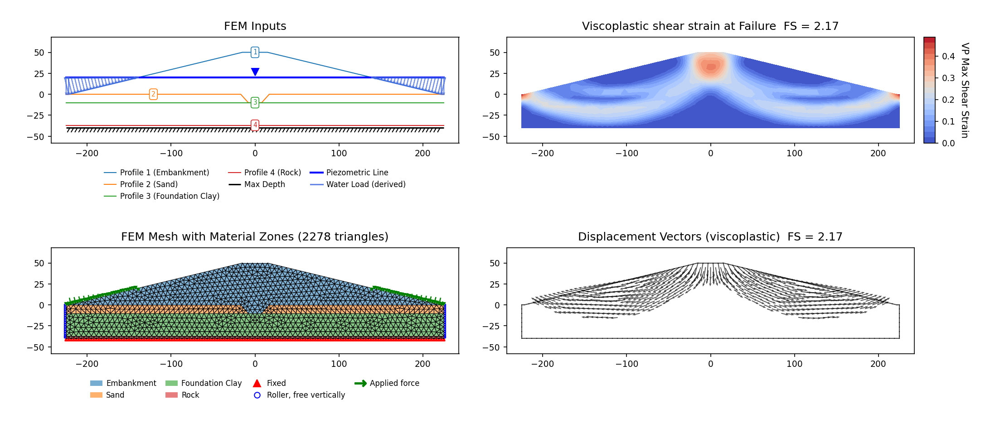

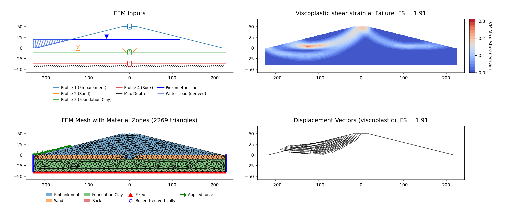

### RS2 Part IV VP69: USACE steady-seepage embankment (example F-6) {#p4-vp69}

Slide2/LEM counterpart: [VP69](rocscience.md#vp69) (USACE EM 1110-2-1902 example F-6). Own SSRM
build, with two answers: the model's own global minimum and the vendor's constrained one.

**Input files:** [vp069.xlsx](files/rocscience/vp069.xlsx)

A 112 ft embankment (c′ = 0, φ′ = 34°, γ = 130 pcf) on a granular foundation (c′ = 0, φ′ = 35°,
γ = 125 pcf) under steady seepage, with the pool at el. 100 and the tailwater ponding the toe at
el. 22.5. E and ν are the vendor model's own, E = 1×10⁶ psf and ν = 0.4 on both materials, and
both carry its tensile cap T = 0 — inert on a c = 0 material, whose Mohr-Coulomb apex is already
at zero.

| Case | XSLOPE SSRM | RS2 SSR | USACE | Slide2 Spencer |
|---|---|---|---|---|
| SSRM, under RS2's own SSR Search Area (5 ft mesh) | **1.944** | 1.94 (+0.2%) | 2.01 | 2.026 |
| SSRM, unconstrained, same mesh (measured, not locked) | 1.508 | — | — | — |

**Where RS2's constraint is.** `slope stability #069.fez` states it twice. It carries an
`SSR_polygonal_zones` ring flagged as a Search Area — 38 vertices running from the crest at
(33.6, 107.3) down through the foundation to the toe at (408.0, 0.2) and back — and, saying the
same thing a second way, a material partition that leaves only 1 030 of its 9 626 elements
Mohr-Coulomb over that same corridor and makes the other 8 596 `Plasticity: None`. Both mean
*reduce strength only along the deep surface*, and the tag carries the polygon verbatim.

The corridor is a band rather than a region, so it has to be checked against the mesh before it
can be carried. It rasterizes faithfully: at 8 / 6.5 / 5 / 4 ft target sizes the elements whose
centroids fall inside it are 10.4 / 10.5 / 10.4 / 10.7% of the mesh, against the vendor's own
10.7% Mohr-Coulomb element fraction, and the polygon's area is within 1.8% of the vendor's
footprint. This is not the one-element-ribbon case that [VP64](#p4-vp64) and [RS2-37](#rs2-37)
record but do not carry — those masks are too ragged to form a mechanism at all.

**The constrained factor is mesh-sensitive.** Across that same sweep it reads 2.019 / 1.969 /
1.944 / 1.931, settling toward ≈ 1.93 (the last refinement step moves it 0.7%). Since the mask
is faithful at every one of those meshes, the drift is not a rasterization artifact — it is the
c = 0 band continuing to localize, the behaviour [RS2-14](#rs2-14) and [RS2-40](#rs2-40)
document. The tag therefore pins the 5 ft mesh, the coarsest at which the band spans two
elements across its thinnest section, and the lock is a regression lock rather than a converged
value.

**Unconstrained, and why a depth filter is the wrong instrument here.** Both zones are c = 0, so
with every element reduced the mechanism is a shallow cohesionless face skin — **1.508** at the
tagged mesh, the pattern [RS2-40](#rs2-40) documents in full. The `min_slip_depth` filter that row
uses to recover a deep mechanism lifts the factor here too, but it does not settle on one: this
112 ft embankment has no cutoff plateau of the kind the 211 ft dam of RS2-40 has, so no filtered
value is a property of the mechanism rather than of the cutoff. A depth-filtered *unconstrained*
run is in any case not the experiment RS2 ran. Where the vendor model states the constraint
outright, carrying it is the closer reproduction, and it puts XSLOPE inside the published spread
rather than beside it. RS2's own SSR 1.94 is the pairing, and the problem's two limit-equilibrium
figures are cross-method context rather than pairings: USACE's 2.01 sits 3.6% above RS2's 1.94, and
Slide2's Spencer 2.026 sits 4.4% above the same 1.94.

<!-- test: file=files/rocscience/vp069.xlsx, type=fem_ssrm, expected_fs=2.019, element_type=tri6, target_size=8.0, tolerance=0.02, f_min=1.6, f_max=2.4, max_iter=16000, tension_srf=true, k0=1, ssr_zone=33.597;107.325;24.959;104.224;24.959;99.5;29.831;86.063;54.416;49.74;70.805;30.25;117.538;-4.523;144.115;-21.134;189.962;-35.53;242.817;-43.261;274.99;-43.261;309.124;-35.806;331.749;-30.967;357.775;-22.859;378.551;-15.274;395.712;-7.552;408.011;0.18;408.011;3.031;397.188;4.415;394.659;1.915;378.932;-6.122;363.678;-11.366;342.512;-18.23;324.016;-22.997;289.408;-27.383;261.664;-28.622;242.89;-27.381;222.062;-24.152;195;-16.402;165.067;-7.522;139.718;6.525;121.957;15.244;104.035;28.322;89.666;40.593;71.905;57.385;56.889;71.916;44.296;89.677;36.646;102.583, benchmark=RS2-P4-VP69-m8 -->
<!-- test: file=files/rocscience/vp069.xlsx, type=fem_ssrm, expected_fs=1.969, element_type=tri6, target_size=6.5, tolerance=0.02, f_min=1.6, f_max=2.4, max_iter=16000, tension_srf=true, k0=1, ssr_zone=33.597;107.325;24.959;104.224;24.959;99.5;29.831;86.063;54.416;49.74;70.805;30.25;117.538;-4.523;144.115;-21.134;189.962;-35.53;242.817;-43.261;274.99;-43.261;309.124;-35.806;331.749;-30.967;357.775;-22.859;378.551;-15.274;395.712;-7.552;408.011;0.18;408.011;3.031;397.188;4.415;394.659;1.915;378.932;-6.122;363.678;-11.366;342.512;-18.23;324.016;-22.997;289.408;-27.383;261.664;-28.622;242.89;-27.381;222.062;-24.152;195;-16.402;165.067;-7.522;139.718;6.525;121.957;15.244;104.035;28.322;89.666;40.593;71.905;57.385;56.889;71.916;44.296;89.677;36.646;102.583, benchmark=RS2-P4-VP69-m6.5 -->
<!-- test: file=files/rocscience/vp069.xlsx, type=fem_ssrm, expected_fs=1.931, element_type=tri6, target_size=4.0, tolerance=0.02, f_min=1.6, f_max=2.4, max_iter=16000, tension_srf=true, k0=1, ssr_zone=33.597;107.325;24.959;104.224;24.959;99.5;29.831;86.063;54.416;49.74;70.805;30.25;117.538;-4.523;144.115;-21.134;189.962;-35.53;242.817;-43.261;274.99;-43.261;309.124;-35.806;331.749;-30.967;357.775;-22.859;378.551;-15.274;395.712;-7.552;408.011;0.18;408.011;3.031;397.188;4.415;394.659;1.915;378.932;-6.122;363.678;-11.366;342.512;-18.23;324.016;-22.997;289.408;-27.383;261.664;-28.622;242.89;-27.381;222.062;-24.152;195;-16.402;165.067;-7.522;139.718;6.525;121.957;15.244;104.035;28.322;89.666;40.593;71.905;57.385;56.889;71.916;44.296;89.677;36.646;102.583, benchmark=RS2-P4-VP69-m4 -->
<!-- test: file=files/rocscience/vp069.xlsx, type=fem_ssrm, expected_fs=1.944, element_type=tri6, target_size=5.0, tolerance=0.02, f_min=1.6, f_max=2.4, max_iter=16000, tension_srf=true, k0=1, ssr_zone=33.597;107.325;24.959;104.224;24.959;99.5;29.831;86.063;54.416;49.74;70.805;30.25;117.538;-4.523;144.115;-21.134;189.962;-35.53;242.817;-43.261;274.99;-43.261;309.124;-35.806;331.749;-30.967;357.775;-22.859;378.551;-15.274;395.712;-7.552;408.011;0.18;408.011;3.031;397.188;4.415;394.659;1.915;378.932;-6.122;363.678;-11.366;342.512;-18.23;324.016;-22.997;289.408;-27.383;261.664;-28.622;242.89;-27.381;222.062;-24.152;195;-16.402;165.067;-7.522;139.718;6.525;121.957;15.244;104.035;28.322;89.666;40.593;71.905;57.385;56.889;71.916;44.296;89.677;36.646;102.583, benchmark=RS2-P4-VP69 -->

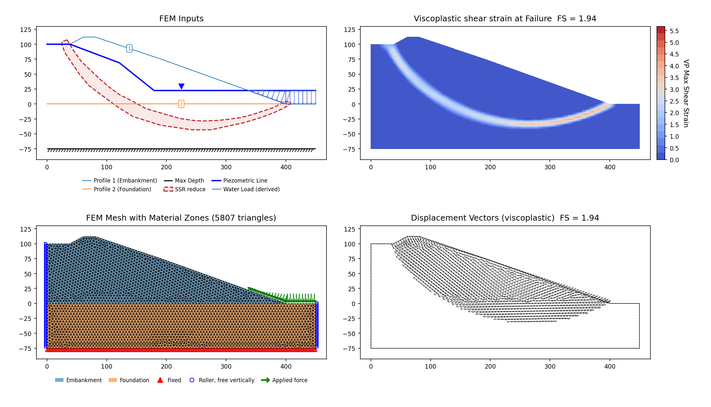

### RS2 Part IV VP67: USACE end-of-construction embankment (example F-5) {#p4-vp67}

Slide2/LEM counterpart: [VP67](rocscience.md#vp67) (USACE EM 1110-2-1902 example F-5). This
problem has two distinct answers, and both are reproduced: the **unconstrained** critical SRF
(a deep foundation mechanism) and the **toe-circle** SRF that RS2 forces with an SSR Exclusion
Area to obtain its published SSRM of **1.33**.

**Input files:** [vp067.xlsx](files/rocscience/vp067.xlsx) (unconstrained) ·
[vp067c.xlsx](files/rocscience/vp067c.xlsx) (SSR exclusion below El. 81)

A 91-ft embankment (c = 1780 psf, φ = 5°, γ = 135 pcf) on a 100-ft soft, undrained foundation
(c = 1600 psf, φ = 2°, γ = 127 pcf) over a rigid base, at end of construction. ψ = 0; E and ν are
the vendor model's own, E = 1×10⁶ psf and ν = 0.4 on all three materials.

| Method | XSLOPE | RS2 SSRM | Slide2 Spencer | USACE | XSLOPE LEM Spencer |
|---|---|---|---|---|---|
| SSRM, unconstrained (8 ft mesh) | 1.076 | — (true global minimum) | — | — | 1.075 (free circular search) |
| SSRM, SSR exclusion below El. 81 (8 ft mesh) | 1.303 | 1.33 (−2.0%) | 1.328 | 1.33 | 1.316 |

*The LEM columns on the constrained row are on the specified toe circle; XSLOPE's unconstrained
LEM search confirms the deep minimum independently.*

**Unconstrained minimum (1.076).** With every zone reduced, the SSRM finds a deep translational
mechanism riding the foundation/bedrock contact through the soft φ = 2° clay — daylighting near
the upstream toe, sliding along the base, and rising through the downstream face. It is
bedrock-contact-pinned and essentially mesh-independent (1.076 at both 8 and 4 ft target sizes).
XSLOPE's own unconstrained LEM circular search finds the same deep family (Spencer 1.075), so
the two solvers agree on the true global minimum. This is the mechanism a single USACE
specified circle — centered 259 ft above the toe (R = 278), bottoming only ~19 ft into the
foundation — does not probe.

**Toe-circle SRF (1.303) vs RS2's 1.33.** RS2's published 1.33 is likewise not the unconstrained
minimum: it is obtained by barring strength reduction in the foundation below the lowest point
of the specified circle (≈ El. 81), an **SSR Exclusion Area** that forces the mechanism up onto
the toe circle (RS2 manual Part 4, p. 124, figs 67.2/67.3). RS2 documents the technique on its
VP78 example: *"To force RS2 to iterate for SRF associated with a failure surface passing
through the toe of the slope, a SSR Exclusion Area was used."* Reproducing that constraint —
vp067c splits the foundation at El. 81 into identical upper and lower zones and excludes the
lower zone from reduction — XSLOPE's SSRM gives **1.303**, matching RS2's constrained SSRM 1.33
(and the specified-circle LEM Spencer 1.316). The critical shear band moves up into the
embankment and shallow foundation (El. 97–159), the toe-circle family, confirming the
exclusion redirected the mechanism away from the deep foundation.

<!-- test: file=files/rocscience/vp067.xlsx, type=fem_ssrm, expected_fs=1.076, element_type=tri6, target_size=8.0, tolerance=0.02, f_min=0.9, f_max=1.8, max_iter=16000, tension_srf=true, k0=1, benchmark=RS2-P4-VP67 -->
<!-- test: file=files/rocscience/vp067c.xlsx, type=fem_ssrm, expected_fs=1.303, element_type=tri6, target_size=8.0, tolerance=0.02, f_min=1.2, f_max=1.5, max_iter=16000, ssr_exclude=Foundation lower, tension_srf=true, k0=1, benchmark=RS2-P4-VP67c -->

**Unconstrained critical SRF (vp067)**

**SSR Exclusion Area below El. 81 (vp067c)**

### RS2 Part IV VP68: Undrained φ = 0 three-layer slope, ponded (USACE E-10) {#p4-vp68}

Slide2/LEM counterpart: [VP68](rocscience.md#vp68) (USACE EM 1110-2-1902 example E-10). RS2 Part IV
(Table 68.2) re-runs this undrained slope by shear-strength reduction. Built, with two locked
answers — the model's own global minimum and the vendor's constrained one.

**Input files:** [vp068.xlsx](files/rocscience/vp068.xlsx)

An undrained three-layer slope (c = 600 / 400 / 500 psf, all φ = 0, γ = 120 / 100 / 105 pcf) with 8 ft
of water ponded against it (pool el 0). φ = 0 so strength reduction acts on cohesion alone; the
elastic constants are the vendor model's own, E = 1×10⁶ psf and ν = 0.4 on all three layers, as are
the tensile caps (600 / 400 / 500 psf, reduced with the SRF). This is a **total-stress** problem:
every layer is undrained, so the pool acts as a load and nothing else, and the file carries no
piezometric line — matching the vendor model, whose solved nodal pore pressure is zero everywhere.
ψ = 0.

| Case | XSLOPE SSRM (2.0 ft mesh) | RS2 SSRM | Slide2 | USACE E-10 chart | XSLOPE LEM Bishop |
|---|---|---|---|---|---|
| Unconstrained (global minimum) | 1.016 | — | — | — | 1.039 (free search) |
| RS2's SSR Search Area | 1.203 | **1.17** (+2.8%) | Bishop 1.241 / GLE 1.244 | 1.33 (−9.5%) | 1.234 |

*The Slide2, USACE and XSLOPE LEM columns on the constrained row are all on the specified circle.*

**Every published number for this problem is an answer about one specified circle.** RS2's 1.17,
Slide2's 1.241 and USACE's 1.33 all describe the toe circle centered at (48.4, 28) with R = 48,
tangent to the base — and RS2's strength reduction is *constrained* to it. The vendor model carries
that constraint explicitly: `slope stability #068.fez` writes an `SSR_polygonal_zones` block with a
30-vertex **SSR Search Area**, and RS2's own Figure 68.3 is annotated with its label and dashed
outline. Its first 23 vertices trace the specified circle; the remaining seven close the ring down
the left edge, along the base and up the right edge, so the region enclosed is the material *below*
the circle — 30% of the model domain, a drawn corridor rather than a bounding box. Reduction never touches the mass
above the circle. Carried verbatim onto the tag as an `ssr_zone`, it moves XSLOPE from 1.016 to
**1.203** and moves the mechanism onto the base-tangent surface RS2's figure draws: +2.8% against
RS2's 1.17 at the tagged 2.0 ft mesh.

**Unconstrained, the slope has a weaker mechanism, and two independent methods find it.** With no
search area the reduction localizes a band along the base of the *weakest* layer (Soil 2,
c = 400 psf), emerging at the toe — not a surficial skin, since φ = 0 everywhere leaves no
cohesionless face to slide. A free grid-seeded circular search lands on the same feature
independently: its critical Bishop circle is tangent to the Soil 2 / Soil 3 contact at el −8.0 and
reads 1.039, about 2% above the SSRM. So the unconstrained minimum is real and sits well below the
specified circle (1.234); it is locked as the model's own global minimum, alongside the constrained
row that answers RS2's question.

**Mesh.** The unconstrained branch drifts down with refinement, 1.016 → 0.997 between the tagged
2.0 ft mesh (1 499 tri6) and a 1.2 ft mesh (4 132 tri6). The constrained branch does not survive that refinement at all: on the 1.2 ft mesh
the search area's held-at-full-strength surroundings leave the confined mechanism with no
equilibrium at any strength-reduction factor, the sub-unity limit of the `ssr_zone` approximation
described on [RS2-64](#rs2-64). The constrained row is therefore quoted and locked at the tagged
mesh, +2.8% on RS2's 1.17.

The rest of the model matches the vendor `.fea` field by field: geometry to the vertex, the three
strengths, the unit weights recovered from its solid properties, the elastic pair, the caps, the
tension-SRF flag, and the three ponded-water load segments.

<!-- test: file=files/rocscience/vp068.xlsx, type=mesh_elements, element_type=tri6, target_size=2.0, expected_elements=1499, benchmark=RS2-P4-VP68-mesh -->
<!-- test: file=files/rocscience/vp068.xlsx, type=mesh_elements, element_type=tri6, target_size=1.2, expected_elements=4132, benchmark=RS2-P4-VP68-mesh-fine -->
<!-- test: file=files/rocscience/vp068.xlsx, type=fem_ssrm, expected_fs=0.997, element_type=tri6, target_size=1.2, tolerance=0.02, f_min=0.8, f_max=1.4, max_iter=16000, tension_srf=true, k0=1, benchmark=RS2-P4-VP68-m1.2 -->
<!-- test: file=files/rocscience/vp068.xlsx, type=fem_ssrm, expected_fs=1.016, element_type=tri6, target_size=2.0, tolerance=0.02, f_min=0.8, f_max=1.4, max_iter=16000, tension_srf=true, k0=1, benchmark=RS2-P4-VP68 -->
<!-- test: file=files/rocscience/vp068.xlsx, type=fem_ssrm, expected_fs=1.203, element_type=tri6, target_size=2.0, tolerance=0.02, f_min=0.8, f_max=1.4, max_iter=16000, tension_srf=true, ssr_zone=92.8636;16;92.1089;13.5678;89.5431;7.89038;87.3049;3.11374;85.0122;-0.270854;82.4464;-3.19143;79.635;-6.76709;76.8782;-9.03258;71.9651;-12.2534;67.6798;-14.6281;60.8833;-16.839;56.5707;-17.6578;52.0124;-18.504;48.7097;-18.8588;45.9256;-18.8588;41.804;-18.4221;37.9281;-17.6851;34.8438;-16.839;30.4766;-15.3377;26.7917;-13.5909;22.3426;-10.9978;19.7496;-9.27823;18.1938;-8;18.1938;-7.12192;16.365;-7.12192;16.365;-20;95.5679;-20;96.3634;16;96.4959;18.5104;93.1817;18.1127, k0=1, benchmark=RS2-P4-VP68-zone -->

**Unconstrained — the model's own global minimum (vp068)**

**RS2's own SSR Search Area — the specified circle (vp068)**

### RS2 Part IV VP70: Submerged homogeneous slope (Duncan & Wright Fig 6.27) {#p4-vp70}

Slide2/LEM counterpart: [VP70](rocscience.md#vp70). RS2 Part IV (Table 70.2/70.3) re-runs this
submerged slope by shear-strength reduction. The point of the problem is that the factor of safety is
independent of pool depth (30 ft vs 60 ft above the crest); RS2 reports SSRM 1.58 for both. This build
also covers **RS2 Part II §35** ("Submerged slope"), which is the identical Duncan & Wright Fig 6.27
model (native `.fez` #035: c′ = 100 psf, φ = 20°, γ = 128 pcf), which RS2 publishes separately, so
the two RS2 manuals bracket XSLOPE's value around the D&W referee — both columns are in the table
below.

**Input files:** [vp070a.xlsx](files/rocscience/vp070a.xlsx) (pool 30 ft above crest)

A homogeneous slope (c = 100 psf, φ = 20°, γ = 128 pcf) fully submerged under a pool 30 ft above the
crest, with the pond pressure applied over the whole submerged surface and pore pressures from the
piezometric line. The FEM elastic constants are the vendor model's own, E = 1×10⁶ psf and ν = 0.4.

| Method | XSLOPE | RS2 SSRM (Part IV VP70) | RS2 SSRM (Part II §35, native) | D&W referee | Slide2 | XSLOPE LEM |
|---|---|---|---|---|---|---|
| SSRM (3.0 m mesh) | 1.594 | 1.58 (+0.9%) | 1.64 (−2.8%) | 1.60 (−0.4%) | Bishop 1.603 / Spencer 1.599 | Bishop 1.596 / Spencer 1.593 |

*The XSLOPE LEM values are identical at both pool depths.*

XSLOPE's SSRM lands at **1.594**, +0.9% above RS2's SSRM 1.58 and −0.4% from the Duncan & Wright
referee 1.60 — the pond-load and pore-pressure treatments balance over the submerged surface, the
same consistency check the [VP70](rocscience.md#vp70) LEM lock makes. Mesh-stable near 1.59. Locked at
3.0 m. ψ = 0.

<!-- test: file=files/rocscience/vp070a.xlsx, type=fem_ssrm, expected_fs=1.594, element_type=tri6, target_size=3.0, tolerance=0.02, f_min=1.2, f_max=2.0, max_iter=16000, tension_srf=true, k0=1, benchmark=RS2-P4-VP70 -->

### RS2 Part IV VP102: Homogeneous earth dam, dry (Huang & Jia 2008) {#p4-vp102}

Slide2/LEM counterpart: [VP102](rocscience.md#vp102). RS2 Part IV reports an SSRM for the dry dam
(Table 102.2) and for the *transient* rapid-drawdown series — Table 102.3 for φb = 0° and
Table 102.4 for φb = 37° — at 60–1500 h. XSLOPE reproduces all three from its own uncoupled
transient seepage solve (the same flow solve that feeds the Slide2-LEM curve in
[VP102](rocscience.md#vp102)).

**Input files:** [vp102a.xlsx](files/rocscience/vp102a.xlsx) (dry) ·
[vp102t_60](files/rocscience/vp102t_60.xlsx) / [100](files/rocscience/vp102t_100.xlsx) / [300](files/rocscience/vp102t_300.xlsx) / [600](files/rocscience/vp102t_600.xlsx) / [1500.xlsx](files/rocscience/vp102t_1500.xlsx) (drawdown snapshots)

A homogeneous earth dam (c' = 13.8 kPa, φ' = 37°, γ = 18.2 kN/m³). The elastic pair comes from the
shipped `.fez`, E = 50 000 kPa and ν = 0.4 on both its materials; both manuals *print* E = 1×10⁵ kPa
and ν = 0.3 (Slide2 Table 102.1, RS2 Part IV Table 102.1), one of the places where the vendor's
printed table and its own model disagree. Strength reduction is insensitive to E either way. ψ = 0
throughout.

**The vendor's SSR Search Area is carried in the files.** Every published VP102 SSR value —
the dry factor and both drawdown columns — was produced with a constraint: each vendor `.fez`
writes an `SSR_polygonal_zones` block holding a five-vertex *search area*, an axis-aligned
rectangle over the **downstream half** of the section from x = 99.75 (the crest's downstream
break) out to x ≈ 186, spanning the full height and beyond it top and bottom. Reduction applies
only inside it, so 47% of the domain is reduced and the upstream 53% is held at full
strength (measured on the corpus mesh: 465 of 980 elements inside, 47.2% by area). The corpus files carry that
rectangle verbatim as a v20 polygon-sheet overlay row (sentinel Mat ID −1, "SSR reduce"), read
from `#102_1` for the dry file and from the `#102_2_*` drawdown models for the snapshots — the
`#102_3_*` family writes the same rectangle with slightly different out-of-domain top and bottom
edges, so all three clip the 0–29 m dam identically. It is a fidelity transcription, not a
correction: the critical mechanism on this dam is a downstream-face wedge and already lies inside
the rectangle, so the constraint is inert here — the dry case returns 2.455 with the zone carried,
the same value to every printed digit as an unconstrained run. With it carried, neither side of the comparison is constrained differently from the other.

**How RS2 enforces that rectangle.** RS2 does not apply the search area as an overlay: it splits
the mesh along the rectangle and gives the outside region a second material with *"Plasticity
Specifications: None"*, in `#102_1` and in every `#102_2_*` / `#102_3_*` file alike. That material
cannot yield at any strength-reduction factor, whereas the "SSR reduce" overlay the corpus files
carry holds the outside at *full* strength, which still yields if the stress reaches the unreduced
envelope. The two are the same constraint on the dry case, where the mechanism is nowhere near the
boundary between them; on the drawdown frames they are not interchangeable, and the overlay the
files carry is the one every locked value below is taken under.

**Dry case.**

| Method | XSLOPE | RS2 SSRM | Huang & Jia FEM | Slide2 Spencer | XSLOPE LEM |
|---|---|---|---|---|---|
| SSRM (2.5 m mesh) | 2.455 | 2.43 (+1.0%) | 2.43 (+1.0%) | 2.455 | Bishop 2.452 / Spencer 2.451 |

XSLOPE's SSRM lands at **2.455**, +1.0% above RS2's SSRM and Huang & Jia's own FEM (both 2.43) and
on top of both Slide2's Spencer (2.455) and XSLOPE's own LEM (2.45) — the critical mechanism is a
shallow downstream-face wedge, mildly mesh-sensitive (2.455 / 2.441 at 2.5 / 1.5 m). Locked at
2.5 m.

<!-- test: file=files/rocscience/vp102a.xlsx, type=fem_ssrm, expected_fs=2.455, element_type=tri6, target_size=2.5, tolerance=0.02, f_min=1.9, f_max=2.8, max_iter=16000, tension_srf=true, k0=1, benchmark=RS2-P4-VP102 -->

**Transient drawdown SSRM.** After the reservoir drops from el. 24 to el. 7 at *t* = 0, the dam drains
and the strength-reduction factor rises monotonically (the governing minimum is the initial steady
state; the manual notes the critical SRF occurs at the initial stage). Each snapshot's *u* = 'seep'
field comes from the single transient seepage solve described under [VP102](rocscience.md#vp102)
(isotropic *k* = 6×10⁻⁵ m/s = 0.216 m/hr, *S*s = 0.0196 /m, *S*y = 0.4, Gardner
SWCC *a* = 0.1, *n* = 3), meshed as tri6 so the SSRM runs on the snapshot's own quadratic mesh. Case 2
takes φb = 0° (suction credits no strength — the clamped baseline); Case 3 sets
φb = 37° through the run's `suction_phi_b` option, so matric suction above the phreatic
surface adds apparent cohesion s·tan φb (the same extended-Mohr-Coulomb feature verified on
VP38).

| Stage | Case 2 XSLOPE (φb = 0°) | Case 2 RS2 SSR | Case 3 XSLOPE (φb = 37°) | Case 3 RS2 SSR |
|---|---|---|---|---|
| 60 h | 1.713 | 1.77 (−3.2%) | 1.779 | 1.82 (−2.3%) |
| 300 h | 1.987 | 2.06 (−3.5%) | 2.162 | 2.14 (+1.0%) |
| 1500 h | 2.304 | 2.29 (+0.6%) | 2.687 | 2.48 (+8.3%) |

*Case 2 runs 3.2–3.5% below the RS2 SSR drawdown column over the first 300 h and crosses it by
1500 h (+0.6%). That is the same shape the Slide2-LEM curve shows on the same flow solve, from the
same cause: the substituted Gardner retention curve holds water in the unsaturated zone more tightly
than RS2's built-in "Silt" pair, so XSLOPE's dissipation front runs slightly *behind* the vendor's
early on. The dry case, which has no water in it at all, sits +1.0% instead.*

*Case 3 adds the φb = 37° suction credit, and it grows with the drainage: +1.0% at 300 h
and +8.3% above the RS2 SSR value by 1500 h, the frame with the most suction to credit. **The vendor's
basis for that column is what the corpus carries.** Every `#102_3_*` model — all twelve files, and
every stage within them — sets φb = 37° on the dam material with an air-entry value of
zero, against φb = 0° on the paired `#102_2_*` twins; the suction cutoff on the material is
switched off, and the one pore-pressure cutoff the drawdown models do enable is the effective-stress
clamp at zero that XSLOPE applies as well (suction raises no effective stress in either code; it
enters only through the φb term). The credit is uncapped on both sides.*

*What the 8.3% measures is the size of the suction field, not the strength model. At 1500 h XSLOPE's
field puts 46% of the mesh in suction and reaches 204 kPa, an apparent cohesion of up to 154 kPa
against c′ = 13.8 kPa, and the factor of safety it buys is about twice what separates the vendor's own
two columns (+0.383 against +0.19 at 1500 h, +0.175 against +0.08 at 300 h). The extended
Mohr-Coulomb machinery itself is exercised uncapped under the identical vendor settings by
[RS2-28](#rs2-28), at φb = 15° on a steady unsaturated field, and lands within 2.1% of
RS2's SSR at all three heads with no positive bias — so the difference here rides in on the same
substituted Gardner curve that sets the Case 2 shape. The vendor's material record carries a 43 kPa
air-entry value but leaves it switched off, and no cap is fitted here either, because the vendor
model applies none.*

<!-- test: file=files/rocscience/vp102t_60.xlsx, type=fem_ssrm, expected_fs=1.713, element_type=tri6, target_size=2.5, tolerance=0.02, f_min=1.5, f_max=2.9, max_iter=16000, tension_srf=true, k0=1, benchmark=RS2-P4-VP102-t-60-c2 -->
<!-- test: file=files/rocscience/vp102t_300.xlsx, type=fem_ssrm, expected_fs=1.987, element_type=tri6, target_size=2.5, tolerance=0.02, f_min=1.5, f_max=2.9, max_iter=16000, tension_srf=true, k0=1, benchmark=RS2-P4-VP102-t-300-c2 -->
<!-- test: file=files/rocscience/vp102t_1500.xlsx, type=fem_ssrm, expected_fs=2.304, element_type=tri6, target_size=2.5, tolerance=0.02, f_min=1.5, f_max=2.9, max_iter=16000, tension_srf=true, k0=1, benchmark=RS2-P4-VP102-t-1500-c2 -->
<!-- test: file=files/rocscience/vp102t_60.xlsx, type=fem_ssrm, expected_fs=1.779, element_type=tri6, target_size=2.5, tolerance=0.02, f_min=1.5, f_max=2.9, max_iter=16000, suction_phi_b=Material 1:37, tension_srf=true, k0=1, benchmark=RS2-P4-VP102-t-60-c3 -->
<!-- test: file=files/rocscience/vp102t_300.xlsx, type=fem_ssrm, expected_fs=2.162, element_type=tri6, target_size=2.5, tolerance=0.02, f_min=1.5, f_max=2.9, max_iter=16000, suction_phi_b=Material 1:37, tension_srf=true, k0=1, benchmark=RS2-P4-VP102-t-300-c3 -->
<!-- test: file=files/rocscience/vp102t_1500.xlsx, type=fem_ssrm, expected_fs=2.687, element_type=tri6, target_size=2.5, tolerance=0.02, f_min=1.5, f_max=2.9, max_iter=16000, suction_phi_b=Material 1:37, tension_srf=true, k0=1, benchmark=RS2-P4-VP102-t-1500-c3 -->

One frame of each case is drawn: the mechanism is the same downstream-face wedge at every frame
of a monotone sequence, so the remaining four repeat one of these two pictures.

**Case 2 — 300 h after drawdown, φb = 0° (vp102t_300)**

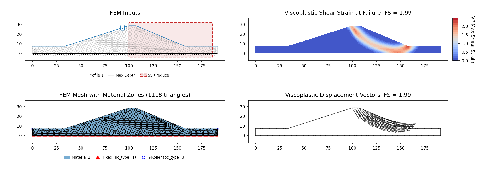

**Case 3 — 1500 h after drawdown, φb = 37° (vp102t_1500)**

## Hoek-Brown verification (Hammah et al. 2005) {#hoek-brown}

The `hb` strength option is verified end-to-end — LEM *and* SSRM — against Example 1 of the
Rocscience method paper that introduced Hoek-Brown shear-strength reduction. It is the
low-GSI counterpart to [RS2-60](#rs2-60) above, which exercises the same criterion at
GSI = 70:

> Hammah, R.E., Yacoub, T.E., Corkum, B., & Curran, J.H. (2005). "The shear strength
> reduction method for the generalized Hoek-Brown criterion." *Proc. 40th U.S. Symposium
> on Rock Mechanics (ARMA/USRMS)*, Anchorage, Paper 05-810.

A 10 m high homogeneous rock slope at 45° in a very weak rock mass: $\sigma_{ci}$ = 30 MPa,
GSI = 5, $m_i$ = 2, $D$ = 0, $\gamma$ = 25 kN/m³, $E$ = 5000 MPa, $\nu$ = 0.3. This is a
demanding test of the criterion rather than of the geometry — at GSI = 5 the envelope is
strongly curved, and the exponent $a$ = 0.619 is far from the $a$ = 0.5 special case.

**Derived constants.** mb and a reproduce the paper's Table 1 to its printed digits;
s differs by 4.2%, the paper's 2.5 × 10⁻⁵ being a rounded print of exp(−95/9):

| | XSLOPE | Hammah et al. |
|---|---|---|
| $m_b$ | 0.0672 | 0.067 |
| $s$ | 2.605e-5 | 2.5e-5 |
| $a$ | 0.6192 | 0.619 |

**Factors of safety:**

| Method | XSLOPE | Hammah et al. |
|---|---|---|
| Bishop simplified | 1.150 | 1.153 (−0.3%) |
| Spencer | 1.152 | 1.152 (0.0%) |
| Janbu corrected | 1.144 | — |
| Morgenstern-Price | 1.148 | — |
| SSRM | 1.159 | 1.15 (+0.8%) |

*Hammah et al. report the same SSRM 1.15 for the generalized Hoek-Brown criterion and for its
equivalent Mohr-Coulomb form.*

The paper dimensions only the slope itself (10 m high, 10 m run) and leaves the foundation
depth and lateral extents unstated. The answer does not depend on them: foundation depths of
2, 4, 6 and 10 m all return Bishop 1.150 / Spencer 1.152, because the critical mechanism
exits at the toe. The SSRM approaches the published value from above as the mesh refines, and is
quoted here at the tagged 0.9 m mesh.

Corps of Engineers (1.191) and Lowe & Karafiath (1.166) both converge on this slope. They
are the two methods that struggle on *strong* rock masses, where the instantaneous friction
angle at low confinement exceeds ~55°; at GSI = 5 the envelope is weak enough that they are
well behaved. See the note in the [LEM overview](../lem/overview.md#hoek-brown-strength).

<!-- test: file=files/rocscience/hammah_hb1.xlsx, type=circular_search, num_slices=40, fs_bishop=1.150, fs_spencer=1.152, fs_janbu=1.144, fs_mprice=1.148, benchmark=HB-lem -->
<!-- test: file=files/rocscience/hammah_hb1.xlsx, type=fem_ssrm, expected_fs=1.159, element_type=tri6, target_size=0.9, tolerance=0.01, f_min=0.8, f_max=1.6, max_iter=16000, k0=1, benchmark=HB-ssrm -->

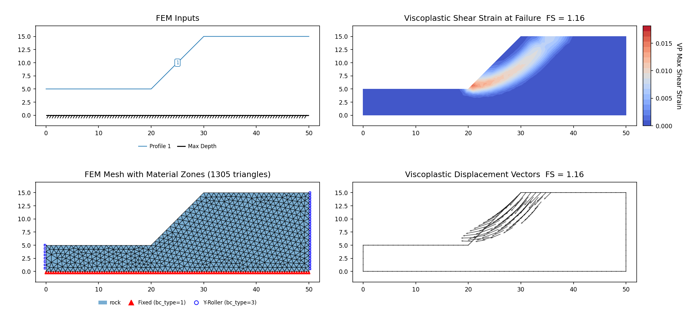
