# Rocscience RS2 (SSRM) Corpus

This page tracks the [RS2 Slope Stability Verification Manual](https://www.rocscience.com/help/rs2/verification-theory/verification-manuals) (Rocscience, Parts I–III,
68 problems) the way the [Slide2 corpus](rocscience.md) tracks its manual. It is organised by
**source manual**, not by solver: the great majority of rows verify XSLOPE's FEM/**SSRM**
solver against RS2's own SSR column, which is what the manual exists to publish. The
long-standing SSRM anchors (Griffiths & Lane 1999 and the feature samples) live on the
[SSRM benchmarks page](ssrm.md).

A minority of rows are verified with **limit equilibrium instead, and say so** — because the
problem's published target is an LEM quantity rather than an SSR factor of safety. Two kinds
occur: problems whose target is a critical seismic coefficient k꜀, which XSLOPE reaches by
searching the LEM minimum to FS = 1 ([#68](#rs2-68)); and problems that are *themselves*
LEM-versus-SRM studies, where the manual prints both columns and XSLOPE locks against each
with the matching engine ([#61](#rs2-61), whose cases 1 and 3 are LEM and case 2 constrained
SSRM). Each such row names the column it reproduces, so an LEM number on this page is always
a deliberate comparison against a published LEM value — never an SSR result in disguise.

Full bibliographic details for the author-year citations on this page are on the
shared [References](references.md) page.

Where a problem shares its geometry with a built Slide2 problem, the SSRM analysis runs on
the **same corpus input file** — the extraction is already validated there. SSRM results
use the Griffiths elastic convention (E = 10⁵ kPa, or its psf equivalent on the imperial
problems; ν = 0.3, ψ = 0). SSRM factors are insensitive to these, so the corpus builder
fills them into any material that does not publish its own, and the LEM problems carry
them as inert values. SSRM factors are quoted at the tagged mesh size: SSRM drifts a
percent or two with refinement, so tolerances are honest rather than tight. A recurring
pattern on this corpus: fine-mesh SSRM finds shallow-skin mechanisms that published
coarse-mesh SSRM analyses miss or deliberately suppress with a "can't fail" elastic region
(#23) — where the published value depends on such an artifice rather than the mechanics,
the problem is recorded as not lockable rather than tuned to match.

The same theme sets how far a *mesh* can be trusted. Where the failure mechanism is
pinned by geometry — a weak seam, a bedrock contact — the SSRM factor barely moves with
refinement (#18 returns the same value at two mesh sizes). Where nothing pins it, the
shear band is free to keep localizing as the elements shrink, because Mohr-Coulomb
without a regularizing length scale has nothing to stop it, and the factor drifts without
reaching a plateau (#14, under ru = 0.5). Such a problem is reported with its
whole mesh sweep and locked at a pinned mesh as a *regression* test, not advertised as a
converged value.

A large fraction of the RS2 manual's problems are **SSRM renditions of the same problems as
the Slide2 LEM manual**, so those rows share the corpus input file with their Slide2
counterpart and differ only in the solver applied to it. Problems 56–58 additionally carry
published FS values from **Z-Soil, PLAXIS, and GEO FEM**, giving multi-program SSRM
cross-bearings.

## Methodology

Same discipline as the [Slide2 corpus](rocscience.md): geometry from the manuals'
coordinate-labeled figures (or reused directly from the Slide2 corpus input files where the
problem is shared), results locked into `run_tests.py` via `fem_ssrm` test tags. An SSRM run
costs about a minute, so the corpus leans on coarse meshes with tolerances wide enough to be
honest about the mesh dependence.

Each figure in the problem details below has two panels: the **left** panel is the FEM
model (elements, materials, boundary conditions) and the **right** panel is the maximum
shear strain contours at the critical SRF.

All `fem_ssrm` locks use the per-node force-equilibrium convergence criterion (Dawson,
Roth & Drescher 1999) at `max_iter = 16000`. Some sections also quote secondary mesh-sweep
values obtained under a global-norm convergence test, which are indicative of the mesh
trend rather than directly comparable with the locked values.

## Status

Status values follow the [shared vocabulary](rocscience.md) used across
this section (**built**, *covered*, *partial*, *planned*, *blocked*, *no lock possible*,
*not supported*).

**Completeness.** Where a problem cannot be reproduced, the row says why rather than leaving a blank.
The *no lock possible* rows are final, and split into two kinds: the measured pore-pressure-grid
embankments (RS2-8/9), whose printed grids are construction-induced pressures with no flow field
behind them; and cases whose *published* SSRM value depends on a "can't fail" elastic region rather
than the mechanics (RS2-9/23), which is a vendor modelling artifice with no reproducible physics
target — XSLOPE can model such regions (elastic materials, `ssr_zone`), but the vendor does not
pin down the artifice's geometry, so those slopes are anchored by their LEM lock instead. Each *blocked* row names
its gap; some FE-seepage cases do not converge on the high-contrast tri6 mesh. XSLOPE's
uncoupled transient-seepage solver carries the RS2 Part IV VP102 rapid-drawdown series. RS2-67
needs no literal-time march at all: its Case 2 (steady) and Case 4 (RS2's fully-drained drawn-down
steady state) are each reconstructed by an own steady-seepage solve from the vendor BC block (built
and regression-locked — see [RS2-67](#rs2-67)), and the transient solver independently reproduces RS2's own
90 h drawdown field as a fidelity check. Where a
transient snapshot's *solved* pore-pressure field survives in the vendor computed `.fea`, the
SSRM-under-that-field mechanics are also verifiable by importing the field directly (RS2-67
Case 3, both faces — see [RS2-67](#rs2-67)). A Part IV pair of USACE upstream-pool dams (VP65/66) and the safety-map dam
(VP42) share a different construct: their LEM files carry a flat piezometric *line* at
the pool elevation across the whole domain, which is a valid LEM u-source on the upstream slip surface
but as a full-field FEM pore pressure over-pressures the dry downstream c = 0 materials (uplift with
no balancing water load) — the pool dams never equilibrate, and VP42 equilibrates only onto a
non-physical c = 0 downstream blowout at SSRM ≈ 0.66, far below its physical value; a proper seepage
field, not a piezometric line, is what an SSRM of these dams needs. A related c = 0 limit shows up where the
cohesionless skin simply keeps localizing on the fine mesh (VP69 reported at 1.576 vs RS2 1.94, the
RS2-40 pattern). Everything
else is built and regression-locked at its tagged mesh; the corpus is complete relative to what is
independently verifiable.

### Part I (1–34)

*Match to the published value:* 🟢 within 3% of the vendor and/or reference figure · 🟡 3–6% · 🔴 more than 6% · 🟣 under construction · ⊘ insufficient data or out of scope.

| # | Match | Problem | Results |
|---:|:-:|---|---|
| [1](#rs2-1) | 🟢 | Simple slope stability assessment | SSRM 0.958 vs RS2 SSRM 0.99, Slide Bishop 0.987, ACADS referee 1.00. |
| [2](#rs2-2) | 🟢 | Non-homogeneous slope | SSRM 1.353 vs RS2 1.36, Slide Spencer 1.375, referee 1.39. |
| [3](#rs2-3) | 🟢 | Non-homogeneous slope with seismic load (0.15g) | SSRM 0.958 vs RS2 0.97, Slide Spencer 0.991, referee 1.00. |
| [4](#rs2-4) | 🔴 | Dry Talbingo dam | SSRM finds the true global minimum — the steeper downstream-bench skin (tan45/tan30.9 = 1.669) — at 1.666; the published RS2 1.88 / Slide 1.948 / referee 1.95 are the gentler upstream face. |
| [5](#rs2-5) | 🟢 | Water table with weak seam | SSRM 1.264 vs RS2 1.26, Slide Spencer 1.258, referee 1.24–1.27. |
| [6](#rs2-6) | 🟢 | Slope with load and pore pressure by water table (ACADS 4) | **built** (caveat). SSRM 0.79 vs ACADS survey mean 0.808 and referee 0.78 — but +15% above RS2's SSRM 0.69 and Slide2's MC-optimized LEM 0.68–0.71. |
| [7](#rs2-7) | 🟢 | Pore pressure by digitized total head grid (ACADS 5) | SSRM 1.464 vs RS2 SSRM 1.48 (−1.1%), on the FE-seepage model XSLOPE built for Slide2 VP10. Slide2 LEM 1.498–1.501, Giam 1.53. |
| [8](#rs2-8) | ⊘ | Saint-Alban test embankment | *no lock possible*. The grid encodes measured construction-induced pressures (see the Slide2 corpus VP11 row); RS2 SSRM 0.96 vs Pilot 1.04 recorded. |
| [9](#rs2-9) | ⊘ | Cubzac-les-Ponts test embankment | *no lock possible*. Measured pore-pressure grid plus a "can't fail" elastic face layer; RS2 SSRM 1.31 vs Pilot 1.24 recorded. |
| [10](#rs2-10) | 🟢 | Simple slope II (Arai & Tagyo ex. 1) | SSRM 1.41 vs RS2 SSRM 1.40 (+0.8%), mesh-converged; LEM locks Bishop 1.404 / Spencer 1.401. |
| [11](#rs2-11) | 🟢 | Layered slope (Arai & Tagyo ex. 2) | SSRM 0.42 vs RS2 SSRM 0.39 and Greco/Kim pattern-search 0.39–0.43; LEM locks 0.419–0.422. |
| [12](#rs2-12) | 🟢 | Simple slope + water table (Arai & Tagyo ex. 3) | SSRM 1.10 vs RS2 SSRM 1.09 (+0.7%); LEM locks Bishop 1.112 / Spencer 1.113. |
| [13](#rs2-13) | 🟢 | Simple slope III (Yamagami & Ueta) | SSRM 1.33 vs RS2 SSRM 1.33 and Greco Spencer 1.33; LEM locks Bishop 1.342 / Spencer 1.340. |
| [14](#rs2-14) | 🟡 | Simple slope, pore pressure by ru | **built** (caveat). The SSRM factor does not become mesh-independent on this model; the tag pins 2.0 m (0.934) as a regression lock, against RS2 SSRM 0.98, Slide2 Spencer 1.01 and Baker 1.02. |
| [15](#rs2-15) | 🟢 | Layered slope II (Greco ex. 4 / Yamagami & Ueta) | SSRM 1.37 vs RS2 SSRM 1.39, Slide2 Spencer 1.398, Greco 1.40–1.42; mesh-converged. |
| [16](#rs2-16) | 🟢 | Layered slope and water table with weak seam (Greco ex. 5 / Chen & Shao) | SSRM 0.968 vs RS2 SSRM 1.02, Slide2 Spencer 1.093 circular / 1.007 noncircular, Greco 0.973–1.1; LEM locks 1.086–1.091. |
| [17](#rs2-17) | 🟢 | Slope with three pore pressure conditions (Fredlund & Krahn) | **built** (dry + ru). Dry SSRM 1.99 vs RS2 SSRM 2.0, Slide2 M-P 2.075, F&K 2.076; ru = 0.25 SSRM 1.692 against F&K 1.761–1.766. |
| [18](#rs2-18) | 🟢 | Three pore pressure conditions and a weak seam (Fredlund & Krahn) | **built** (dry + ru). Dry SSRM 1.31 vs RS2 SSRM 1.34, Slide2 Bishop 1.382; ru = 0.25 SSRM 1.042 against Slide2 1.124 and F&K 1.124. |
| [19](#rs2-19) | 🟢 | Undrained layered slope (Low 1989) | **built** (caveat). SSRM 1.48 at the tagged mesh vs RS2 SSRM 1.41, Slide2 LEM 1.439, Low 1.44. |
| [20](#rs2-20) | 🟢 | Slope with vertical load (Prandtl's wedge) | SSRM 1.00 vs Prandtl theory 1.0 and RS2 SSRM 1.0; Slide2 Spencer 1.051 on the specified surface. |
| [21](#rs2-21) | 🟢 | Bearing capacity test prism (Prandtl II) | SSRM 1.003, converging on theory 1.0; RS2 SSRM 1.01; Slide2 Spencer 0.941 on the specified surface. |
| [22](#rs2-22) | 🟡 | Layered slope with undulating bedrock | **built** (SSRM variant). SSRM 1.577 vs RS2 SSRM **1.52** (+3.7%), on the vendor's boundary-load cap. |
| [23](#rs2-23) | ⊘ | Underwater slope with linearly varying cohesion | *no lock possible*. RS2's published SSRM (1.12) depends on a "can't fail" elastic region **whose boundary its text and figure draw differently** — XSLOPE supports such regions (elastic materials and `ssr_zone`), so the obstacle is the ambiguous vendor geometry, not a missing capability: the two readings give 0.87 and 0.92 and a lock would test where the patch is drawn. This slope's anchor remains the LEM lock ([VP29](rocscience.md#vp29), Spencer 1.145 on Duncan's surface). |
| [24](#rs2-24) | 🟡 | Layered slope with geosynthetic reinforcement | With the vendor geotextile stiffness (EA = 2×10⁵ kN/m): unconstrained SSRM 0.905 (H=7, the c=0 face skin, partly restrained — the true global minimum) and, replicating RS2's can't-fail elastic face-skin zone via `elastic_materials`, constrained SSRM 1.201 (+4.4% vs RS2's deep-mechanism 1.15); plus 0.946 (H=8.75, toe/foundation mechanism, −0.4% vs RS2 0.95). |
| [25](#rs2-25) | 🔴 | Syncrude tailings dyke (El-Ramly et al. 2003) | **built** (caveat). SSRM 1.19 vs RS2 SSRM 1.29, Slide2 Bishop 1.305, El-Ramly 1.31. |
| [26](#rs2-26) | 🟢 | Clarence Cannon dam (Wolff & Harr 1987) | SSRM 2.24 vs RS2 SSRM 2.29 (−2.1%); Slide2 GLE 2.333 / Spencer 2.383, W&H 2.36, XSLOPE LEM M-P 2.384. |
| [27](#rs2-27) | 🟢 | Homogeneous slope, pore pressure by ru | **built** (caveat). Li & Lumb ru = 0.2 slope. SSRM 1.344 at the 1.0 m regression lock vs RS2 SSRM 1.31, Slide2 Bishop 1.339, Hassan & Wolff 1.334; mesh-sensitive like RS2-14. |
| [28](#rs2-28) | ⊘ | Excavated slope, FE groundwater and matric suction (Ng & Shi 1998) | **built** (blocked). Slide2 [VP38](rocscience.md#vp38). RS2 SSRM 1.64 / 1.55 / 1.41 (manual Part 1 §28 — *not* the "1.56/1.46/1.32" quoted elsewhere). Blocked: the vendor `.fea` ships suction OFF (`UseUnsaturated: 0`, `Phi_b: 0`), crediting it instead through effective stress at φ′; and the ≈200 kPa far-field-head pore pressure prevents the viscoplastic SSRM from converging at any F. See the section. |
| [29](#rs2-29) | 🟢 | Geosynthetic-reinforced embankment on soft soil (Tandjiria 2002) | **built** (sand case). SSRM 1.181 vs RS2 SSRM 1.25, Spencer 1.209, Tandjiria 1.219 (a shallow compound mechanism through the c=0 fill face and soft-clay toe). The clay case is final — *no lock possible*, its FS is governed by a water-filled tension crack, an LEM construct with no continuum counterpart (see the section). |
| [30](#rs2-30) | 🟢 | Homogeneous slope, power-curve strength (Perry 1993) | SSRM 0.898 vs RS2 SRF 0.91 (−1.3%); Slide2 Janbu 0.944, Perry 0.98. |
| [31](#rs2-31) | 🔴 | M-C vs power curve (Baker 2003 ex. 1) | **built** (all three halves). M-C SSRM 1.529 / 0.931 vs RS2 1.53 / 0.98; power-curve SSRM 0.921. |
| [32](#rs2-32) | 🟡 | Heading mismatch — body is Baker's example 2 | **built** (both halves). M-C SSRM 2.790 vs RS2 2.83 (−1.4%); power-curve SSRM 2.623 vs RS2 2.74 (−4.3%), Slide2 Spencer 2.662. |
| [33](#rs2-33) | 🟢 | Homogeneous slope with tension crack and water table (P&D test slope 2) | **built** (caveat). SSRM 1.244 vs RS2 SSRM 1.28 and an eight-program LEM table spanning 1.03–1.32. |
| [34](#rs2-34) | 🟢 | M-C vs power curve III (Baker 2003 ex. 3, London clay) | **built** (both halves). M-C SSRM 1.345 vs RS2 1.38; power-curve SSRM 1.478 vs RS2 1.47 / Slide2 Spencer 1.47 / Baker 1.48 (+0.5%). |

### Part II (35–58)

*Match to the published value:* 🟢 within 3% of the vendor and/or reference figure · 🟡 3–6% · 🔴 more than 6% · 🟣 under construction · ⊘ insufficient data or out of scope.

| # | Match | Problem | Results |
|---:|:-:|---|---|
| 35 | 🟢 | Submerged slope (D&W Fig 6.27) | *covered*. → [P4-VP70](#p4-vp70) (own SSRM build, 1.594). The same Duncan & Wright (2005) Fig 6.27 submerged slope as Slide2 [VP70](rocscience.md#vp70); the Part II manual body cites Slide2 VP70 (the earlier "VP64 family" label was a mislabel, confirmed against native `.fez` #035: c′ = 100 psf, φ = 20°, γ = 128 pcf). Part II RS2 SSRM 1.64 / Part IV RS2 SSRM 1.58 bracket XSLOPE SSRM 1.594 and the D&W referee 1.60. |
| [36](#rs2-36) | 🟢 | Seepage analysis, homogeneous slope (D&W Fig 6.37) | **built** (both cases). SSRM 1.097 on the FE-seepage model and 1.111 on the piezo approximation vs RS2 SSRM 1.12 / 1.12; referee 1.138/1.141; XSLOPE LEM locks 1.132. |
| [37](#rs2-37) | ⊘ | Embankment with layered foundation (D&W Fig 6.39) | *reported, no lock*. RS2's SSRM is the artesian downstream-toe slide (0.95 in its table, 1.1 in its own convergence graph); XSLOPE's SSRM finds the deep mechanism at 1.31. |
| [38](#rs2-38) | 🟢 | Cohesionless embankment on saturated clay foundation | Sand on saturated clay (D&W Fig 7.12). SSRM 1.168 vs RS2 SSRM 1.17 (Part 4) / 1.21 (Part 2), Slide2 non-circular 1.18. |
| [41, 43](#rs2-39) | 🟡 | Earth embankment, infinite-slope mechanism | **built** (caveat). Infinite-slope skins: SSRM 1.430 (VP79, on D&W 1.44) / 1.097 (VP81, c=0 skin ~5% low). Problem 39 (VP76, Fig 7.19) is the FE-seepage sibling, deferred. |
| [40](#rs2-40) | 🔴 | Dam with impermeable foundation (D&W Fig 7.24) | **built** (piezo case). SSRM finds the saturated-toe skin at 1.126 (true global minimum, ~5% below the idealized toe infinite slope); RS2 SSRM 1.53 reports a deeper face. FE-seepage case blocked. |
| [42](#rs2-42) | 🟡 | James dike | SSRM 1.214 vs RS2 SSRM 1.26 (−3.7%); Slide2 noncircular LEM 1.11–1.16, referee 1.17. |
| [44](#rs2-44) | 🟢 | Seepage analysis for an earth embankment (D&W Fig 14.20-a) | SSRM 1.490 vs RS2 SSRM 1.51 (−1.3%); Slide2 LEM 1.532/1.541, referee 1.528–1.542. |
| [45](#rs2-45) | 🟢 | Varying undrained shear strength profiles (D&W Fig 14.20-b) | **built** (caveat). SSRM 1.31 / 1.31 vs RS2 SSRM 1.32 / 1.32 (D&W referee 1.28–1.33). |
| [46](#rs2-46) | 🟢 | Varying undrained strength profiles II (D&W Fig 15.9, cu = 300 + cz·z) | SSRM 0.79 / 0.93 / 1.06 / 1.15 vs RS2 SSRM 0.78 / 0.93 / 1.05 / 1.15 (±1%); D&W 0.75 / 0.90 / 1.03 / 1.13. |
| [47](#rs2-47) | 🟡 | Purely cohesive slope, varying thickness (D&W Fig 14.3) | **built** (all 3 thicknesses). 30 ft: SSRM 1.08 vs RS2 1.03; 46.5/60 ft: 1.061 vs RS2 1.02 (+4.0%). D&W referee 1.124–1.135. |
| [48–55](#rs2-48) | 🟡 | Multi-tiered geotextile walls (Leshchinsky & Han 2004) | **built** (baseline) / partial. Slide2 [VP87](rocscience.md#vp87)–VP94. The SSRM enforces the geotextile tensile-capacity cap; the baseline wall (vp087) locks at SSRM 0.956 under the vendor's T = 0 fill cap vs L&H ≈1.0 / Slide 1.04 — a ~4% difference that remains unexplained. Of the seven parametric variants, four converge (0.76–1.10, bracketing ≈1.0) and three (vp089 / vp090 / vp093) localize a shear band in the c = 0 reinforced fill, which is neither an element-order effect, nor a can't-fail facing, nor the vendor's T = c cutoff (that moves the factor further off). |
| [56](#rs2-56) | 🟡 | Homogeneous slope vs Z-Soil, PLAXIS, GEO FEM (Pruska 2003, H = 7 m, 5 cases) | All five within ±3.3% of RS2's M-C and inside the four-program band; locks bracket the family (0.664 / 2.096). Full tables in [the Pruska section](#pruska). |
| [57](#rs2-57) | 🟡 | Pruska H = 10.5 m, 6 cases | All six within ±3.6% of RS2's M-C; locks 0.440 / 1.389. Full tables in [the Pruska section](#pruska). |
| [58](#rs2-58) | 🟡 | Pruska H = 14 m, 6 cases | **built** (5 of 6). Four within ±3.6%; case 5 reads 0.667 vs a published 0.72–0.75 cluster and is not locked (a mesh-dependent localization); locks 0.328 / 1.029. |

### Part III (59–68)

*Match to the published value:* 🟢 within 3% of the vendor and/or reference figure · 🟡 3–6% · 🔴 more than 6% · 🟣 under construction · ⊘ insufficient data or out of scope.

| # | Match | Problem | Results |
|---:|:-:|---|---|
| [59](#rs2-59) | 🟢 | Three-layered soil slope | [Görög & Török (2007)](https://doi.org/10.5194/nhess-7-417-2007) Budapest landslide. The critical mechanism is **non-circular**, riding a thin weak "waste" lens (c = 1, φ = 5) — so this is an SSRM problem (a circular search misfinds the deeper competing surface, FS ≈ 1.9). SSRM 1.572 at the 3 m lock mesh vs Slide2 1.567 / RS2 SSRM 1.57 / PLAXIS 1.6 — lands on the Slide2/RS2 cluster (+0.3% / +0.1%). Mesh-sensitive: 1.61 at coarse meshes drifts to 1.572 once the tapering lens localizes. |
| [60](#rs2-60) | 🟢 | Generalized Hoek–Brown, homogeneous slope | **built** (LEM). Three slope angles from [Li, Merifield & Lyamin (2008)](https://doi.org/10.1016/j.ijrmms.2007.08.010) at GSI = 70, the strong-rock end of the criterion. With the vendor σci (0.598 / 1.61 / 4.37 kPa), Spencer 1.009 / 0.989 / 1.035 reproduces Slide2 Spencer 1.011 / 0.992 / 1.035. SSRM is not locked on this problem. |
| [61](#rs2-61) | 🟢 | Local and global minima, homogeneous slope | **built** (cases 1, 3, 2). [Cheng, Lansivaara & Wei (2007)](https://doi.org/10.1016/j.compgeo.2006.10.011); one geometry, four search regions. Case 1 (global) Spencer 1.338 vs Slide2 1.336. Case 3 (upper-face local min) locked with the `circular_search` search-window limits — Spencer 1.437 vs Slide2 1.443 (−0.4 %). Case 2 (deep toe-to-crest) is locked by **constrained SSRM** with RS2's own SSR-Search-Area polygon (read verbatim from the vendor `.fez`) — 1.398 vs RS2 SSRM 1.36 (+2.8 %). Case 4 is blocked (SSRM ~1.50 vs 1.42, +5.5 %), as is the LEM route to the Cheng/Slide2 columns. |
| [62](#rs2-62) | 🟡 | Three-layered slope with a soft band | **built** (Analysis III). Cheng et al. (2007). SSRM (ψ = 0, vendor tensile strengths + tension SRF) **0.781** vs RS2 SSR 0.81 / Plaxis 0.82 / XSLOPE's own Spencer on the band mechanism 0.784. The decisive input is the per-material tensile strength (t_cut = 20/0/10 kPa in the vendor `.fez`, reduced with the SRF): without it, Mohr-Coulomb hands the cap soil ~28 kPa of fictitious tension that holds the crest cut shut and the FE genuinely equilibrates to F ≥ 1.3. Flac3D's associated-flow 1.03 is the code-split the problem exists to expose. |
| [63](#rs2-63) | 🟢 | Homogeneous slope assessment | Cheng et al. (2007), 11 m homogeneous slope. Spencer 1.398 and SSRM 1.409 vs Slide2 1.380 / RS2 SSRM 1.38 / Cheng 1.383 (a consistent +1.5%). |
| [64](#rs2-64) | 🟣 | Three homogeneous landslides | **partial** (7 of 12). [Teoman, Topal & Isik (2004)](https://doi.org/10.1007/s00254-003-0954-3), Ankara clay E90 highway. **12 cases** (3 slopes × original/failed × short-/long-term). RS2 pinned each SSRM run to a digitized *proposed* slip surface (manual Fig. 4), carried in the vendor `.fez` two ways — an **SSR Search-Area polygon** and a **Mohr-Coulomb corridor** with the rest of the domain made elastic (`Plasticity: None`). XSLOPE reproduces this with `solve_ssrm`'s `ssr_zone` (RS2's polygon read verbatim), holding elements outside at full strength (an approximation of the elastic zone). The 3 **short-term originals** matched unconstrained (5.201 / 4.807 / 5.647 vs 5.14 / 4.69 / 5.47, +1–3%); the smooth **long-term originals** C7 (1.674 vs 1.70, −1.5%) and C11 (1.403 vs 1.46, −3.9%) lock constrained. On the scarped **short-term failed** C2/C4 RS2's own SSRM sits ~7–9% below its own Bishop columns, and XSLOPE lands on Bishop (C2 6.584 vs 6.67/6.64, −1.3%; C4 5.320 vs 5.32, exactly on) — **locked to the triangulated Teoman/Slide2 reference**; C6 (7.836) instead overshoots every column (RS2 there agrees with its own Bishop) and stays blocked. The vendor SRF blocks carry `auto_SRF=ON` with no sweep cap, so the difference is not a truncated sweep; carrying the vendor's tensile caps moves C2/C4 down toward RS2's SSRM and accounts for part of the RS2-vs-Bishop gap but not all of it, and the residual is unexplained. Refinement (1.0→0.5 m) pushes C9/C10/C8 further down, none into band. C8's pore pressures agree with the vendor nodal field to <0.1%. The 0.03 g seismic coefficient is destabilizing (C9 1.32 → 1.22). |
| [65](#rs2-65) | 🟢 | Tailings dam | Tzenkov (2008) Padina dam, **8 materials**, 12 zones, phreatic surface on the 225 × 77 m section. SSRM 1.331 at the 3 m lock mesh vs Slide2 circular 1.41 / non-circular 1.33 / RS2 SSRM 1.29 / ref LEM 1.39 / FEM 1.41 — lands on Slide2's non-circular LEM and inside the published 1.29–1.41 band. Mesh-sensitive: 1.381 / 1.369 / 1.331 at 8 / 5 / 3 m, drifting down from the LEM/FEM cluster toward RS2's SSRM as the band localizes. |
| [66](#rs2-66) | 🔴 | Embankment basal stability | [Nakamura, Cai & Ugai (2008)](https://doi.org/10.1201/9780203885284-c107), 5 soft-layer thicknesses (h₁ = 2–10 m). SSRM 1.04–1.08 across the family vs Slide2 Spencer 1.05–1.16 / RS2 SSRM 1.05–1.19 / LEM–FEM ref 1.08–1.24 — a few percent low (ψ = 0 vs the reference ψ = φ; thin φ = 0 band is mesh-sensitive). Regression-locked at a common 3 m mesh. |
| [67](#rs2-67) | 🟢 | Earth dam under steady & transient unsaturated seepage | **built** (6 of 6 locked: 3 vendor-match <1%, 3 own-flow regression locks). [Huang & Jia (2009)](https://doi.org/10.1016/j.compgeo.2008.03.006) homogeneous dam. The 90 h drawdown pore-pressure fields are **imported** from RS2's own computed `.fea` nodal blocks through the `u='seep'` path (RS2 mesh + nodal u → seep sidecars) — verifying the SSRM-under-transient-*u* mechanics; XSLOPE's own transient-seepage solver independently reproduces the 90 h upstream phreatic to <0.3 m (fidelity cross-check). SSRM 2.455 / 1.820 / 2.023 vs RS2 SSRM 2.48 / 1.83 / 2.04 (all within 1%); the 90 h upstream run confines the SSRM to RS2's upstream Search Area. Each snapshot field is hydrostatic below a 14-point phreatic surface (nodal residual < 10⁻³ kPa). Cases 2 (steady) and 4 (1500 h) carry no recoverable solved field, but their `.fea`/`.slw` retain the groundwater BC block; RS2 renders each — the full pool for Case 2, the fully-drained drawn-down pool (el 7.3) for Case 4 — as a steady state, so the flow is reconstructed by an own steady-seepage solve. SSRM 1.648 / 2.258 / 2.648 vs RS2 SSR 1.70 / 2.34 / 2.76 — each within the Slide2 LEM method spread but 3–4% below RS2 (a structural FE/SSR formulation difference — a sandbox reproduction of RS2's own built-in permeability curve leaves the field and FS essentially unchanged), regression-locked at XSLOPE's own values with the deltas documented. These three are the only corpus cases with a reservoir load on a submerged downstream bench, and the vendor traces that pool line right-to-left; the direction of a boundary traction is taken from the owning element's geometry, so it does not depend on the order in which the load line's points are written. |
| [68](#rs2-68) | 🟡 | Seismically loaded slopes | [Loukidis, Bandini & Salgado (2003)](https://doi.org/10.1680/geot.2003.53.5.463). Target is a **critical seismic coefficient** k꜀ (the k giving FS = 1), not an FS — locked via a new `critical_kc` bisection harness. Homogeneous Cases 1/2 (ru = 0.5 / dry): k꜀ 0.127–0.432 (Bishop/Spencer) on the Slide2/reference LEM to ~0.001; Case 3 (3-layer, band-riding) 0.167–0.169 vs Slide2 0.151–0.155 — high by ~10% (circular can't ride the φ = 15° band as tightly as non-circular) but inside the UB/LB bracket [0.148, 0.172] and on RS2 SSRM/FEM 0.161. |

### Part IV — RS2 *Slope Stability Verification Manual, Pt 4* (catalog)

Parts I–III of the RS2 manual seeded the corpus rows above. **Part 4** is a separate, later
manual (© 2021) and the newest of the four. It is not a fresh set of problems so much as an
RS2 shear-strength-reduction **re-verification of 52 Slide2 verification problems** (numbered
by their Slide2 VP id, #1–#102), run against the reference literature and Slide2's own LEM.
It is the authoritative source of most of the "RS2 SSRM x.xx" numbers already cited in the
Part I–III rows. Cataloged here so the corpus tracks it, in the same table format as
Parts I–III above. The **XSLOPE file / results** column carries a consistent cross-reference:
a piggyback → RS2-N section that already runs the SSRM comparison, a dedicated Part IV
build section below (VP2 / VP64 / VP67), or a *new* / *planned* marker — followed by the
manual's published RS2 SSRM and its reference/Slide2 figures (representative case where a
problem has several). The **new** rows have no existing corpus counterpart.

*Match to the published value:* 🟢 within 3% of the vendor and/or reference figure · 🟡 3–6% · 🔴 more than 6% · 🟣 under construction · ⊘ insufficient data or out of scope.

| # | Match | Problem | Results |
|---:|:-:|---|---|
| 1 | 🟢 | Slope, homogeneous (ACADS 1a) | → [RS2-1](#rs2-1). RS2 SSRM 0.98 vs ref 1.00 [Giam]. |
| 2 | 🟢 | Slope, homogeneous, tension crack (ACADS 1b) | → [P4-VP2](#p4-vp2) (own SSRM build). RS2 SSRM 1.63 vs ref 1.65 [Giam]. |
| 3 | 🟢 | Slope, 3 materials (ACADS 1c) | → [RS2-2](#rs2-2). RS2 SSRM 1.34 vs ref 1.39. |
| 4 | 🟢 | Slope, 3 materials, seismic (ACADS 1d) | → [RS2-3](#rs2-3). RS2 SSRM 0.95 vs ref 1.00. |
| 5 | 🔴 | Dam, 4 materials (ACADS 2a) | → [RS2-4](#rs2-4). RS2 SSRM —; ref 1.95. |
| 6 | 🟢 | Dam, 4 materials, predefined surface (ACADS 2b) | → [P4-VP6](#p4-vp6) (own SSRM build, constrained). Same Talbingo dam as [RS2-4](#rs2-4); its unconstrained SSRM finds the true global minimum (1.666, downstream bench). Confining strength reduction to RS2's SSR Search Area (read verbatim from the vendor `#006.fez`, 37 vertices) holds the mechanism on ACADS 2(b)'s upstream circle: SSRM 2.145 vs RS2 SSRM 2.15. |
| 7 | 🟢 | Slope, 2 materials, weak layer (ACADS 3a) | → [RS2-5](#rs2-5). RS2 SSRM 1.24 vs ref 1.24–1.27. |
| 9 | 🟢 | Weak layer, water table, load (ACADS 4) | → [RS2-6](#rs2-6). RS2 SSRM 0.76 vs ref 0.78. |
| 10 | 🟢 | Homogeneous, pore-pressure grid, ponded (ACADS 5) | → [RS2-7](#rs2-7). RS2 SSRM 1.46 vs ref 1.53. |
| 14 | 🟢 | Slope, homogeneous (Arai & Tagyo 1) | → [RS2-10](#rs2-10). RS2 SSRM 1.37–1.39. |
| 15 | 🟢 | Slope, 3 materials, weak layer (Arai & Tagyo 2) | → [RS2-11](#rs2-11). RS2 SSRM 0.41 vs Kim/Greco 0.39–0.44. |
| 16 | 🟢 | Slope, homogeneous, water table (Arai & Tagyo 3) | → [RS2-12](#rs2-12). RS2 SSRM 1.09. |
| 17 | 🟢 | Slope, homogeneous (Yamagami & Ueta) | → [RS2-13](#rs2-13). RS2 SSRM 1.32. |
| 19 | 🟢 | Slope, 4 materials (Greco ex. 4) | → [RS2-15](#rs2-15). RS2 SSRM 1.38 vs Greco/Spencer 1.40–1.42. |
| 21 | 🟢 | Homogeneous, ru (Fredlund & Krahn) | → [RS2-17](#rs2-17). RS2 SSRM 1.98 / 1.68 / 1.77. |
| 22 | 🟢 | Weak layer, ru (Fredlund & Krahn) | → [RS2-18](#rs2-18). RS2 SSRM 1.26 / 0.99 / 1.15. |
| 24 | 🟢 | Slope, 3 materials (Low 1989) | → [RS2-19](#rs2-19). RS2 SSRM 1.42 vs Low 1.44. |
| 25 | 🟢 | Bearing-capacity slope (Prandtl / Chen & Shao) | → [RS2-20](#rs2-20). RS2 SSRM 1.01 vs Chen & Shao 1.05. |
| 26 | 🟢 | Bearing-capacity prism (Prandtl II) | → [RS2-21](#rs2-21). RS2 SSRM 1.00 vs theory 1.0. |
| 32 | 🟡 | Reinforced embankment, 7 materials (Borges 2002) | → [RS2-24](#rs2-24). RS2 SSRM 1.24 / 1.21 / 0.98 vs Borges 1.25 / 1.19 / 0.99. |
| 38 | ⊘ | Excavated slope, FE seepage, suction (Ng & Shi 1998) | **built** (blocked). → [RS2-28](#rs2-28). RS2 SSRM 1.64 / 1.55 / 1.41 (manual Part 1 §28). Blocked — vendor `.fea` ships suction OFF; ≈200 kPa seepage pore pressure prevents SSRM convergence. |
| 39 | 🟢 | Reinforced embankment, geosynthetic (Tandjiria 2002) | → [RS2-29](#rs2-29). RS2 SSRM 0.97 / 1.42 / 1.22 / 1.39. |
| 40 | 🟢 | Homogeneous, power curve, sensitivity (Perry 1993) | → [RS2-30](#rs2-30). RS2 SSRM 0.97 vs Perry 0.98. |
| 41 | 🟢 | Homogeneous, power curve, ru (Jiang/Baker 2003) | → [P4-VP41](#p4-vp41) (own SSRM build, 1.647). RS2 SSRM 1.64 vs Bishop 1.66 / Janbu 1.60–1.67. |
| 42 | ⊘ | Dam, safety-map example (Baker & Leshchinsky 2001) | *reported, no lock*. On the LEM side XSLOPE reproduces the tightly clustered references on all three reference surfaces (XSLOPE Spencer 1.926 / 1.882 / 1.939 vs Slide 1.925 / Baker 1.91 / SLOPE/W 1.934); see the Slide2 [VP42](rocscience.md#vp42) section. The FEM does equilibrate on this file, but the flat piezometric *line* applied as a full-field FEM pore field over-pressures the dry downstream c = 0 granular fill (uplift with no balancing water load) and localizes a non-physical blowout at SSRM ≈ 0.66 — far below the physical mechanism, so no lock (the same c = 0 + water over-pressure construct as the pool dams). RS2 SSRM 1.84 lands near the published cluster. |
| 44 | 🔴 | Homogeneous, M-C vs power curve (Baker 2003 ex. 1) | → [RS2-31](#rs2-31). RS2 SSRM 0.96 / 1.5 / 0.93. |
| 45 | 🟡 | Homogeneous, M-C vs power curve (Baker 2003 ex. 2) | → [RS2-32](#rs2-32). RS2 SSRM 2.65 / 2.78 / 2.63. |
| 51 | 🟢 | 4 materials, water table, TC, seismic, 12-method (Zhu 2003) | → [RS2-51](#rs2-51) (LEM, partial). RS2 SSRM 1.22 vs Slide2 Spencer 1.293 / GLE 1.304. |
| 56 | 🟢 | Homogeneous, water table, TC (Pockoski & Duncan slope 2) | → [RS2-33](#rs2-33). RS2 SSRM 1.26 vs 8-program 1.02–1.32. |
| 57 | 🟢 | Layered, TC (Pockoski & Duncan slope 3) | → [P4-VP57](#p4-vp57) (own SSRM build, 1.301). RS2 SSRM 1.32 vs 8-program ~1.40. |
| 60 | 🟢 | Soil-nailed wall (Pockoski & Duncan slope 7) | → [P4-VP60](#p4-vp60) (own SSRM build, 1.009, matching XSLOPE LEM Spencer 1.010). Five passive soil-nail rows in undrained φ=0 clay with the heads on the vertical wall face; the inclined wall-rooted nails conform into the FEM mesh (OCC-fragment build for lines the geo-kernel embed cannot recover). RS2 SSRM 0.98 vs GOLD-NAIL 0.91 / UTEXAS4 1.02. |
| 61 | 🟢 | Homogeneous, composite surfaces (Baker 2003 ex. 3) | → [RS2-34](#rs2-34). RS2 SSRM 1.34 / 1.45 vs Baker 1.35 / 1.48. |
| 62 | 🟡 | Homogeneous, ru, seismic k꜀ (Loukidis 2003 ex. 1) | → [RS2-68](#rs2-68). RS2 SSRM 0.96. |
| 63 | 🟡 | 3 materials, seismic k꜀ (Loukidis 2003 ex. 2) | → [RS2-68](#rs2-68). RS2 SSRM 0.99. |
| 64 | 🟢 | Embankment, 3 layers, water table, TC (USACE 2003 Fig 4-1) | → [P4-VP64](#p4-vp64) (own SSRM build, 2.356). RS2 SSRM 2.37 vs Spencer 2.44 [USACE]. |
| 65 | ⊘ | Embankment, water table, ponded (USACE 2003 Fig 4-2) | *blocked*. The shared LEM file carries a flat piezometric line at the pool elevation across the whole 450-ft domain — valid for LEM's upstream slip surface, but as a full-field FEM pore pressure it over-pressures the dry downstream c=0 sand/clay/rock (uplift with no balancing water load), yielding nearly every element so the FEM cannot equilibrate at any strength. RS2 SSRM 2.60 vs ref 2.71. |
| 66 | ⊘ | Embankment, water table, ponded (USACE 2003 Fig 4-3) | *blocked*. Same flat-full-field-piezo incompatibility as VP65 (identical dam family). RS2 SSRM 2.22 vs ref 2.30. |
| 67 | 🟢 | Embankment, 2 materials, end of construction (USACE 2003 F-5) | → [P4-VP67](#p4-vp67) (own SSRM build, 1.076 unconstrained / 1.303 SSR-exclusion). RS2 SSRM 1.33 vs ref 1.33. |
| 68 | 🔴 | Slope, homogeneous, φ = 0 (USACE 2003 E-10) | **built** (caveat). → [P4-VP68](#p4-vp68) (own SSRM build, 1.034). RS2 SSRM 1.17 vs ref 1.33. |
| 69 | ⊘ | Embankment, 2 materials, steady seepage (USACE 2003 F-6) | *reported, no lock*. Both zones are c = 0 (φ = 34 / 35); the unconstrained SSRM localizes a shallow cohesionless skin at 1.576, ~19% below RS2's SSRM 1.94 (which rides a deeper surface) — the same c = 0 skin-localization documented on RS2-40, too far off to lock. RS2 SSRM 1.94 vs ref 2.01. |
| 70 | 🟢 | Submerged homogeneous slope (Duncan & Wright Fig 6.27) | → [P4-VP70](#p4-vp70) (own SSRM build, 1.594). RS2 SSRM 1.58 vs Spencer 1.60, ref 1.60. |
| 71 | 🟢 | Homogeneous, FE seepage (Duncan & Wright Fig 6.37) | → [RS2-36](#rs2-36). RS2 SSRM 1.11 / 1.12 vs Spencer 1.13 / 1.14. |
| 72 | ⊘ | Embankment dam, 4 materials, FE seepage (D&W Fig 6.39) | *reported, no lock* (see [RS2-37](#rs2-37)). RS2 SSRM 1.00–1.49 vs Spencer 1.16–1.63. |
| 74 | 🟢 | Cohesionless embankment on clay (D&W Fig 7.12) | → [RS2-38](#rs2-38) (SSRM 1.168). RS2 SSRM 1.17 vs Spencer 1.20. |
| 75 | 🟡 | James Bay dyke, 4 materials (D&W Fig 7.16) | → [RS2-42](#rs2-42). RS2 SSRM 1.19 vs circ 1.45 / non-circ 1.17. |
| 76 | 🔴 | Homogeneous embankment dam, FE seepage (D&W Fig 7.19) | → [RS2-40](#rs2-40). RS2 SSRM 0.97 / 0.98 vs ref 1.08–1.19. |
| 78 | 🟡 | Purely cohesive slope, thickness variants (D&W Fig 14.3) | → [RS2-47](#rs2-47) (all three: 30/46.5/60 ft). SSRM 1.077 / 1.061 / 1.061 vs RS2 SSRM 1.03 / 1.02 / 1.02; D&W 1.12–1.14. |
| 79 | 🟢 | Earth embankment, infinite-slope failure (D&W Fig 14.4) | → [RS2-41](#rs2-39) (infinite 1.430 / deep 1.419). RS2 SSRM 1.41 / 1.45 vs ref 1.40 / 1.44. |
| 81 | 🟡 | Earth embankment, infinite-slope failure (D&W Fig 14.7) | **built** (caveat). → [RS2-43](#rs2-39) (infinite 1.097, c=0 skin ~5% low). RS2 SSRM 1.23 / 1.15 vs ref 1.21 / 1.15. |
| 82 | 🟢 | Earth embankment, water table (D&W Fig 14.20-a) | → [RS2-44](#rs2-44). RS2 SSRM 1.50 vs Spencer 1.54. |
| 83 | 🟢 | Embankment wall (D&W Fig 14.20-b) | → [RS2-45](#rs2-45). RS2 SSRM 1.29 / 1.30 vs Spencer 1.28 / 1.33. |
| 102 | 🟢 | Homogeneous earth dam, rapid drawdown (Huang & Jia) | **built** (dry + transient). → [P4-VP102](#p4-vp102) (own SSRM build, 2.370 dry). RS2 SSRM 2.43 (dry) vs Spencer 2.46, ref 2.43; plus the 60–1500 h drawdown SSRM curve (φb = 0° and 37°) from XSLOPE's own transient seepage solve. |

**Part 4 in summary:** 52 problems cataloged. 35 are already in the corpus as RS2-1…47 rows.
Four carry their own Part IV SSRM build on a shared Slide2 file: VP2 (ACADS 1b) at SSRM
1.669 vs RS2 SSRM 1.63 — RS2's SSRM carries the crack as an explicit near-surface T = 0 zone
that XSLOPE's material schema does not represent — alongside the
[VP2](rocscience.md#vp2) LEM lock ([details](#p4-vp2)); VP64 (USACE 2003 Fig 4-1) at SSRM
2.356 vs RS2 SSRM 2.37, with the trench-pinched sand blanket laid as two tiling polygons so
the downstream shell rests on a closed continuum, alongside the
[VP64](rocscience.md#vp64) LEM lock, Spencer 2.488 ([details](#p4-vp64)); VP67
(USACE 2003 F-5) with two builds — the unconstrained SSRM finds
the true global minimum at 1.076 (a deep foundation mechanism, matched by XSLOPE's own
unconstrained LEM search at Spencer 1.075), while reproducing RS2's SSR Exclusion Area below
El. 81 lifts the mechanism onto the toe circle at 1.303, against RS2's constrained
SSRM 1.33 ([details](#p4-vp67)); and VP6 (ACADS 2b Talbingo) confined to
RS2's SSR Search Area read verbatim from the vendor `#006.fez` (SSRM 2.145 vs RS2 SSRM 2.15)
alongside the [VP6](rocscience.md#vp6) LEM lock ([details](#p4-vp6)). Two more map to corpus
rows (RS2-68 Loukidis, **built**; RS2-28/38, **built (blocked)**; RS2-39-41-43, *planned*).
The remaining **≈12** have no earlier corpus counterpart: the rest of
the USACE 2003 embankment set (VP65/66/68/69, four problems), the Pockoski & Duncan slope 3 and
soil-nail wall (VP57, VP60),
Zhu's 12-method slope (VP51), the Baker/Jiang power-curve and Baker–Leshchinsky safety-map
problems (VP41, VP42), the Duncan & Wright submerged slope (VP70), and the Huang & Jia
rapid-drawdown dam (VP102).

---

## Problem details

### RS2-1: Simple slope stability assessment {#rs2-1}

Slide2 counterpart: [VP1](rocscience.md#vp1) (ACADS 1a).

**Input files:** [xslope_acads_simple.xlsx](../lem/files/xslope_acads_simple.xlsx)

| Method | XSLOPE | Published |
|---|---|---|
| SSRM | 0.958 | RS2 SSRM 0.99 |

*Cross-bearings: Slide2 Bishop 0.987 (LEM); ACADS referee 1.00.*

FS reads 0.967 at half the element size — SSRM values are quoted at the tagged mesh.

<!-- test: file=../lem/files/xslope_acads_simple.xlsx, type=fem_ssrm, expected_fs=0.958, element_type=tri6, target_size=0.9, tolerance=0.01, f_min=0.7, f_max=1.3, max_iter=16000, tension_srf=false, benchmark=RS2-1 -->

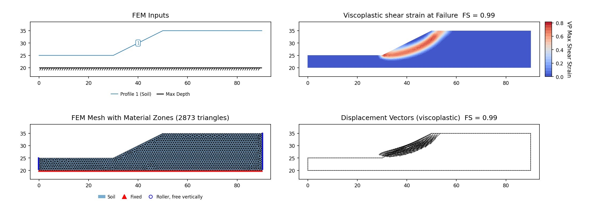

### RS2-2: Non-homogeneous slope {#rs2-2}

Slide2 counterpart: [VP3](rocscience.md#vp3).

**Input files:** [vp003.xlsx](files/rocscience/vp003.xlsx)

| Method | XSLOPE | Published |
|---|---|---|
| SSRM | 1.353 | RS2 SSRM 1.36 |

*Cross-bearings: Slide2 Spencer 1.375 (LEM); ACADS referee 1.39.*

<!-- test: file=files/rocscience/vp003.xlsx, type=fem_ssrm, expected_fs=1.353, element_type=tri6, target_size=0.9, tolerance=0.01, f_min=1.0, f_max=1.7, max_iter=16000, tension_srf=false, benchmark=RS2-2 -->

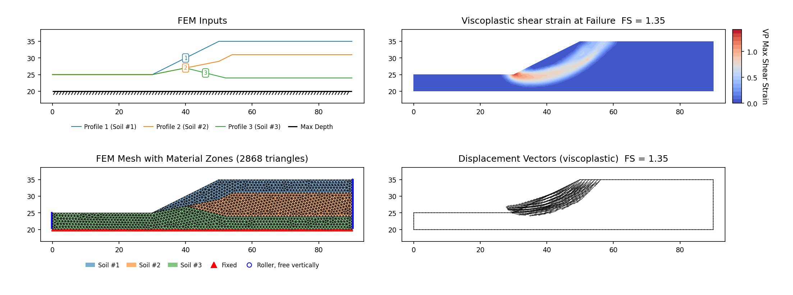

### RS2-3: Non-homogeneous slope with seismic load (0.15g) {#rs2-3}

Slide2 counterpart: [VP4](rocscience.md#vp4).

**Input files:** [vp004.xlsx](files/rocscience/vp004.xlsx)

| Method | XSLOPE | Published |
|---|---|---|
| SSRM | 0.958 | RS2 SSRM 0.97 |

*Cross-bearings: Slide2 Spencer 0.991 (LEM); ACADS referee 1.00.*

k is entered negative per the FEM sign convention — this is a left-facing slope, so the
pseudo-static force acts in −x, while the LEM takes the magnitude and directs it from the
failure surface.

<!-- test: file=files/rocscience/vp004.xlsx, type=fem_ssrm, expected_fs=0.958, element_type=tri6, target_size=0.9, tolerance=0.01, f_min=0.7, f_max=1.3, max_iter=16000, tension_srf=false, benchmark=RS2-3 -->

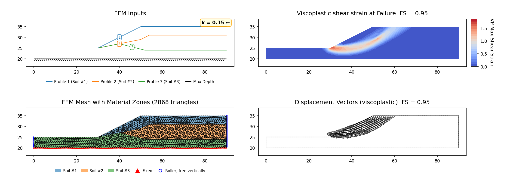

### RS2-4: Dry Talbingo dam {#rs2-4}

Slide2 counterpart: [VP5](rocscience.md#vp5).

**Input files:** [vp005.xlsx](files/rocscience/vp005.xlsx)

| Method | XSLOPE | Published |
|---|---|---|
| SSRM | 1.666 | RS2 SSRM 1.88 (upstream face) |

For a dry cohesionless dam the critical mechanism is a surface-parallel (infinite-slope)
slide, FS = tan φ / tan β, which is *independent of depth* — so the steepest face governs. The
per-node SSRM criterion finds the true global minimum on the steeper **downstream** bench
(30.9°): tan 45° / tan 30.9° = 1.669, and the FEM returns 1.666 (−0.2%). The published values
report the gentler, constrained **upstream** face (27.2°, the end-of-construction problem):
tan 45° / tan 27.2° = 1.948 — Slide2 reports 1.948 (all LEM methods collapse to
tan φ / tan β on a cohesionless face) and the ACADS referee 1.95; RS2's SSRM 1.88 is
consistent with the same upstream-face problem, though its manual does not state which
mechanism its mesh resolved. Both faces are correct
infinite-slope answers; XSLOPE reports the more critical one. The seeded LEM search
([VP5](rocscience.md#vp5)) stays on the upstream circle in the input file and locks 1.955, so
the LEM and SSRM entries for this dam report different faces by construction, not a discrepancy.
[RS2 Part IV VP6](#p4-vp6) runs the **constrained** SSRM on this same dam: confining strength
reduction to RS2's upstream SSR Search Area (read verbatim from the vendor `#006.fez`) lifts the
factor from this 1.666 downstream minimum to **2.145** on the upstream circle, reproducing RS2's
ACADS 2(b) SSRM 2.15 — so the two answers are one mechanism choice apart, not a disagreement.

*Closed-form check: across φ = 35–45° (c = 0 materials only) the SSRM tracks tan φ / tan 30.9° to 0.3%.*

<!-- test: file=files/rocscience/vp005.xlsx, type=fem_ssrm, expected_fs=1.666, element_type=tri6, target_size=6.5, tolerance=0.01, f_min=1.5, f_max=2.3, max_iter=16000, tension_srf=false, benchmark=RS2-4 -->

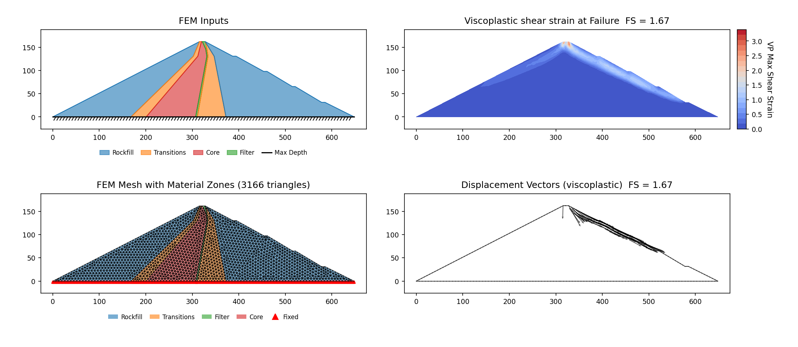

### RS2-5: Water table with weak seam {#rs2-5}

Slide2 counterpart: **VP7** (inventory-only on the LEM page — no detail section to link).

**Input files:** [xslope_acads_weak_layer.xlsx](../lem/files/xslope_acads_weak_layer.xlsx)

| Method | XSLOPE | Published |
|---|---|---|
| SSRM | 1.264 | RS2 SSRM 1.26 |

*Mesh-stable: 1.280 at 1.2 m. Cross-bearings: Slide2 Spencer 1.258 (LEM); ACADS referee 1.24–1.27.*

The geometry and both material strengths reproduce the RS2 verification `.fez` for this
problem exactly. Its groundwater setup, however, differs: the library `.fez` supplied for
Problem 5 carries no water table (a dry variant, pore pressure zero at every node), whereas
the manual's problem statement — "Water Table with Weak Seam" — and this reconstruction both
place the phreatic surface at the base of the weak seam (y = 26.5). Because that seam is
purely frictional (c = 0, φ = 10°), the water table is what drives the factor down to the
published 1.26; XSLOPE's wet reconstruction reproduces that value (1.264), so the file is
kept as the faithful build of the published problem.

<!-- test: file=../lem/files/xslope_acads_weak_layer.xlsx, type=fem_ssrm, expected_fs=1.264, element_type=tri6, target_size=2.0, tolerance=0.01, f_min=0.9, f_max=1.6, max_iter=16000, tension_srf=false, benchmark=RS2-5 -->

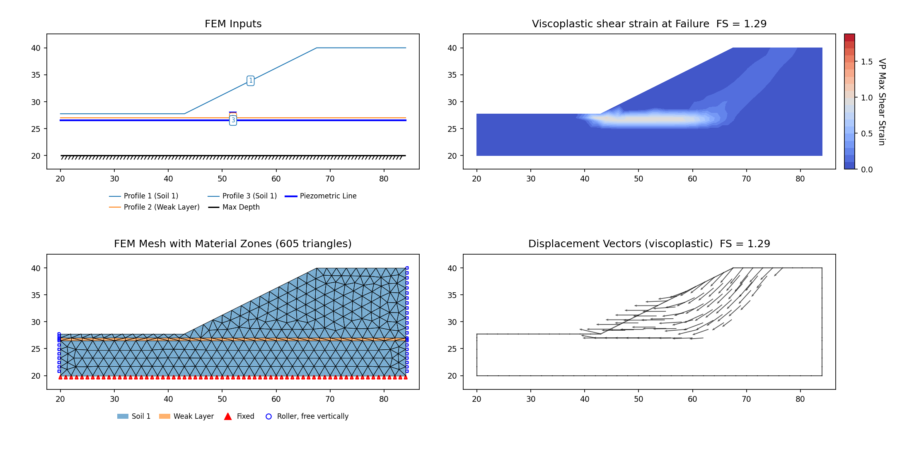

### RS2-6: Slope with load and pore pressure by water table (ACADS 4) {#rs2-6}

Slide2 counterpart: [VP9](rocscience.md#vp9). Built with a caveat.

**Input files:** [vp009.xlsx](files/rocscience/vp009.xlsx)

| Method | XSLOPE | Published |
|---|---|---|
| SSRM | 0.79 | RS2 SSRM 0.69 |

*Cross-bearings: ACADS survey mean 0.808 and referee 0.78; Slide2's MC-optimized LEM 0.68–0.71; XSLOPE's own LEM locks 0.724.*

XSLOPE's SSRM lands on the ACADS survey mean but sits +18% above RS2's SSRM and Slide2's LEM.
The published values themselves span 0.68–0.81 on this thin-weak-seam problem — the same
spread as [#16](#rs2-16).

<!-- test: file=files/rocscience/vp009.xlsx, type=fem_ssrm, expected_fs=0.792, element_type=tri6, target_size=1.3, tolerance=0.02, f_min=0.3, f_max=1.3, max_iter=16000, tension_srf=false, benchmark=RS2-6 -->

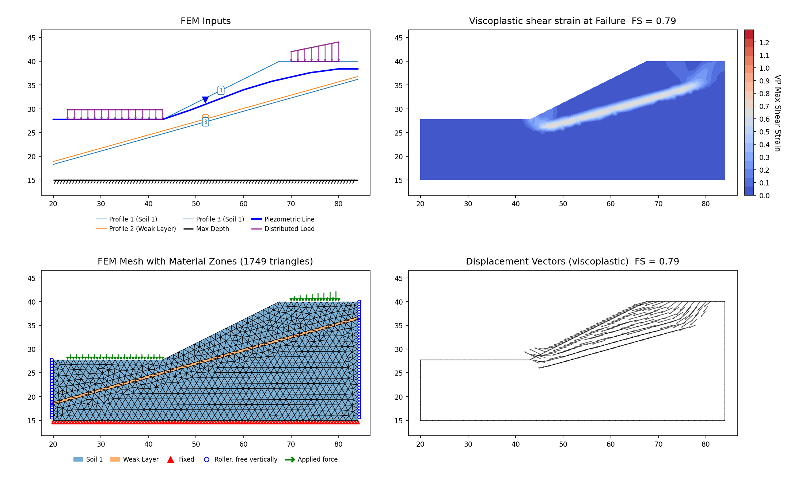

### RS2-7: Pore pressure by digitized total head grid (ACADS 5) {#rs2-7}

Slide2 counterpart: [VP10](rocscience.md#vp10).

**Input files:** [vp010.xlsx](files/rocscience/vp010.xlsx)

| Method | XSLOPE | Published |
|---|---|---|
| SSRM | 1.464 | RS2 SSRM 1.48 (−1.1%) |

*Cross-bearings: Slide2 LEM 1.498–1.501; Giam 1.53.*

The SSRM runs on the FE-seepage model XSLOPE built for Slide2 [VP10](rocscience.md#vp10) (the
grid is a stand-in for the flow solution; sidecars are tri6 so the SSRM plasticity is not
volumetrically locked).

<!-- test: file=files/rocscience/vp010.xlsx, type=fem_ssrm, expected_fs=1.464, tolerance=0.01, f_min=1.0, f_max=2.2, max_iter=16000, tension_srf=false, benchmark=RS2-7 -->

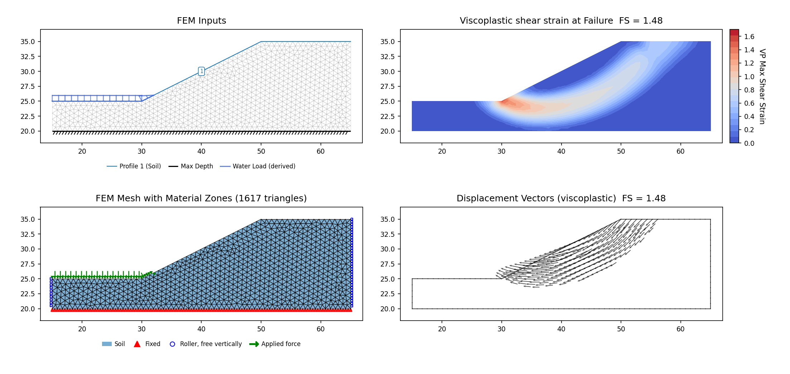

### RS2-8: Saint-Alban test embankment {#rs2-8}

Slide2 counterpart: **VP11** (inventory-only on the LEM page — no detail section to link).

| Method | XSLOPE | Published |
|---|---|---|
| SSRM | *no lock possible* | RS2 SSRM 0.96 |

*Cross-bearings: Pilot 1.04 recorded.*

The grid encodes measured construction-induced pressures (see the Slide2 corpus VP11 row), so
there is nothing here XSLOPE can reproduce as a lock.

### RS2-9: Cubzac-les-Ponts test embankment {#rs2-9}

Slide2 counterpart: **VP13** (inventory-only on the LEM page — no detail section to link).

| Method | XSLOPE | Published |
|---|---|---|
| SSRM | *no lock possible* | RS2 SSRM 1.31 |

*Cross-bearings: Pilot 1.24 recorded.*

Measured pore-pressure grid plus a "can't fail" elastic face layer suppressing the true face
failure (FS 1.11 per RS2's own text).

### RS2-10: Simple slope II (Arai & Tagyo ex. 1) {#rs2-10}

Slide2 counterpart: [VP14](rocscience.md#vp14) (Arai & Tagyo 1).

**Input files:** [xslope_arai_tagyo.xlsx](../lem/files/xslope_arai_tagyo.xlsx)

| Method | XSLOPE | Published |
|---|---|---|
| SSRM | 1.41 | RS2 SSRM 1.40 (+0.8%) |

*Mesh-converged (1.428→1.434 over a 2.9× size change). Cross-bearings: XSLOPE LEM locks Bishop 1.404 / Spencer 1.401 vs Slide2 1.409 / 1.406.*

<!-- test: file=../lem/files/xslope_arai_tagyo.xlsx, type=fem_ssrm, expected_fs=1.411, element_type=tri6, target_size=2.2, tolerance=0.02, f_min=1.2, f_max=1.7, max_iter=16000, tension_srf=false, benchmark=RS2-10 -->

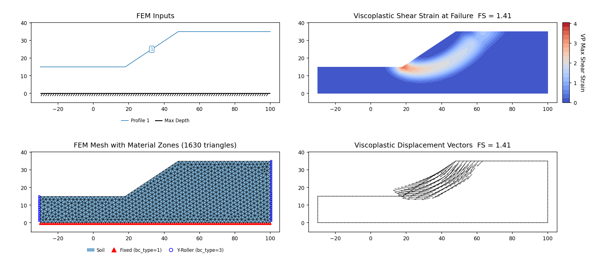

### RS2-11: Layered slope (Arai & Tagyo ex. 2) {#rs2-11}

Slide2 counterpart: [VP15](rocscience.md#vp15).

**Input files:** [vp015.xlsx](files/rocscience/vp015.xlsx)

| Method | XSLOPE | Published |
|---|---|---|
| SSRM | 0.42 | RS2 SSRM 0.39 |

*Cross-bearings: Greco/Kim pattern-search 0.39–0.43; XSLOPE LEM locks 0.419–0.422.*

<!-- test: file=files/rocscience/vp015.xlsx, type=fem_ssrm, expected_fs=0.419, element_type=tri6, target_size=1.9, tolerance=0.02, f_min=0.25, f_max=0.65, max_iter=16000, tension_srf=false, benchmark=RS2-11 -->

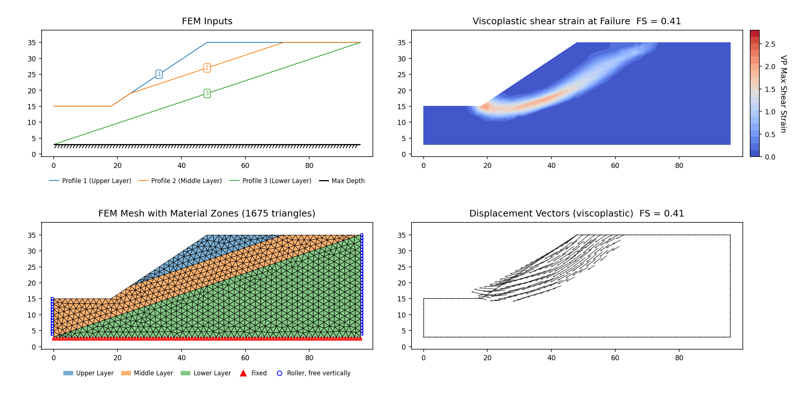

### RS2-12: Simple slope + water table (Arai & Tagyo ex. 3) {#rs2-12}

Slide2 counterpart: [VP16](rocscience.md#vp16).

**Input files:** [vp016.xlsx](files/rocscience/vp016.xlsx)

| Method | XSLOPE | Published |
|---|---|---|
| SSRM | 1.10 | RS2 SSRM 1.09 (+0.7%) |

*Cross-bearings: XSLOPE LEM locks Bishop 1.112 / Spencer 1.113.*

The FEM piezo pore pressure uses the vertical-distance convention, consistent with the LEM
slicer and the published analyses.

<!-- test: file=files/rocscience/vp016.xlsx, type=fem_ssrm, expected_fs=1.098, element_type=tri6, target_size=1.3, tolerance=0.02, f_min=0.9, f_max=1.45, max_iter=16000, tension_srf=false, benchmark=RS2-12 -->

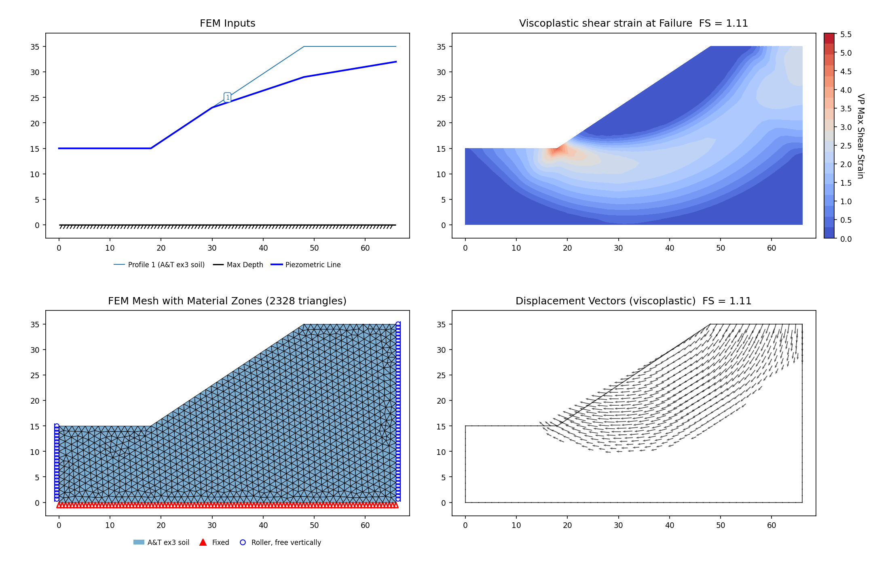

### RS2-13: Simple slope III (Yamagami & Ueta) {#rs2-13}

Slide2 counterpart: [VP17](rocscience.md#vp17).

**Input files:** [vp017.xlsx](files/rocscience/vp017.xlsx)

| Method | XSLOPE | Published |
|---|---|---|
| SSRM | 1.33 | RS2 SSRM 1.33 |

*Cross-bearings: Greco Spencer 1.33; XSLOPE LEM locks Bishop 1.342 / Spencer 1.340 vs Y&U 1.348 / 1.339.*

<!-- test: file=files/rocscience/vp017.xlsx, type=fem_ssrm, expected_fs=1.332, element_type=tri6, target_size=0.5, tolerance=0.02, f_min=1.1, f_max=1.65, max_iter=16000, tension_srf=false, benchmark=RS2-13 -->

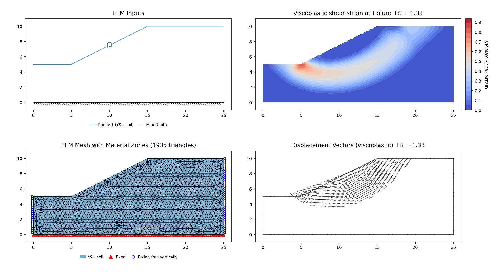

### RS2-14: Simple slope, pore pressure by ru {#rs2-14}

Slide2 counterpart: [VP18](rocscience.md#vp18) (this problem is Slide2 VP18, not VP21). Built
with a caveat.

**Input files:** [vp018.xlsx](files/rocscience/vp018.xlsx)

| Method | XSLOPE | Published |
|---|---|---|
| SSRM (regression lock at the 2.0 m mesh) | 0.934 | RS2 SSRM 0.98 |

*Cross-bearings: Slide2 Spencer 1.01; Baker 1.02; XSLOPE LEM locks Spencer 1.033 on the same file.*

The SSRM factor on *this* model does not
become mesh-independent: 0.986 → 0.948 → 0.902 → 0.873 as the target size goes 2.8 → 2.0 →
1.4 → 1.0 m, with no plateau. The tag pins 2.0 m (0.948) as a regression lock, chosen
mid-sweep rather than at the coarse end that happens to sit on RS2's 0.98 — the honest
reading is a value between roughly 0.87 and 0.99, straddling RS2 SSRM 0.98, Slide2 Spencer
1.01 and Baker 1.02.

The drift is a property of the model, not the ru plumbing: run the same slope dry
and the same meshes converge (2.127 → 2.135, +0.4%). With ru = 0.5 half the
overburden is cancelled, leaving so little effective confinement that the shear band keeps
localizing as the elements shrink — unregularized Mohr-Coulomb has no length scale to stop
it, and a tension cutoff changes nothing (0.987/0.948/0.901/0.870). LEM locks Spencer 1.033
on the same file.

<!-- test: file=files/rocscience/vp018.xlsx, type=fem_ssrm, expected_fs=0.934, element_type=tri6, target_size=2.0, tolerance=0.02, f_min=0.7, f_max=1.3, max_iter=16000, tension_srf=false, benchmark=RS2-14 -->

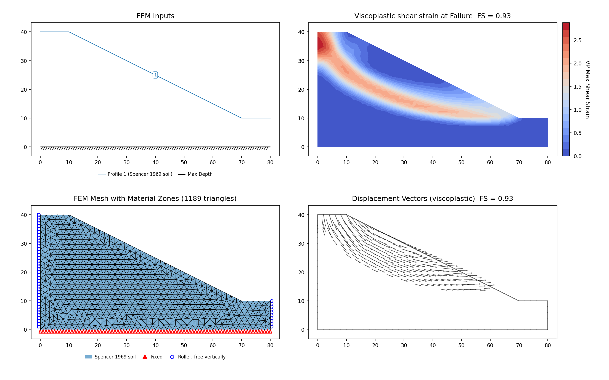

### RS2-15: Layered slope II (Greco ex. 4 / Yamagami & Ueta) {#rs2-15}

Slide2 counterpart: [VP19](rocscience.md#vp19).

**Input files:** [vp019.xlsx](files/rocscience/vp019.xlsx)

| Method | XSLOPE | Published |
|---|---|---|
| SSRM | 1.37 | RS2 SSRM 1.39 |

*Mesh-converged (1.386→1.377 over a 1.7× size change). Cross-bearings: Slide2 Spencer 1.398; Greco 1.40–1.42.*

<!-- test: file=files/rocscience/vp019.xlsx, type=fem_ssrm, expected_fs=1.372, element_type=tri6, target_size=4.33, tolerance=0.02, f_min=1.1, f_max=1.7, max_iter=16000, tension_srf=false, benchmark=RS2-15 -->

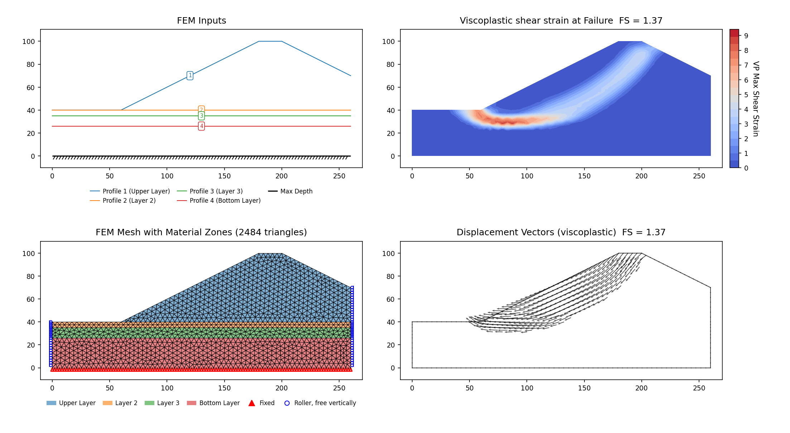

### RS2-16: Layered slope and water table with weak seam (Greco ex. 5 / Chen & Shao) {#rs2-16}

Slide2 counterpart: [VP20](rocscience.md#vp20).

**Input files:** [vp020.xlsx](files/rocscience/vp020.xlsx)

| Method | XSLOPE | Published |
|---|---|---|
| SSRM | 0.968 | RS2 SSRM 1.02 |

*Mesh sweep: 0.983 at 4.0 m, 0.961 at 2.2 m. Cross-bearings: Slide2 Spencer 1.093 circular / 1.007 noncircular; Greco 0.973–1.1; XSLOPE LEM locks 1.086–1.091 on the same file.*

The model's base is an *inclined* polygon boundary. Displacements are fixed along the whole
bottom polyline (see [#22](#rs2-22)) rather than only at the nodes of the single lowest
elevation; supported at one corner alone, a body on an inclined base reaches equilibrium at
no F at all.

<!-- test: file=files/rocscience/vp020.xlsx, type=fem_ssrm, expected_fs=0.968, element_type=tri6, target_size=3.0, tolerance=0.02, f_min=0.8, f_max=1.4, max_iter=16000, tension_srf=false, benchmark=RS2-16 -->

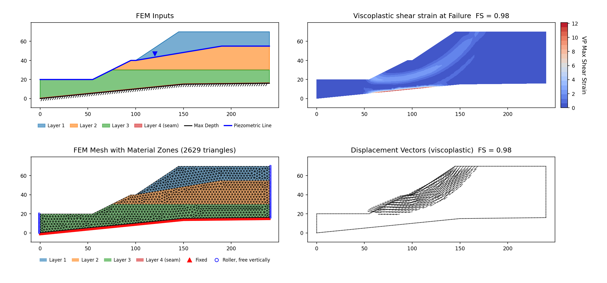

### RS2-17: Slope with three pore pressure conditions (Fredlund & Krahn) {#rs2-17}

Slide2 counterpart: **VP21** (inventory-only on the LEM page — no detail section to link).
Built for the dry and ru cases.

**Input files:** [vp021a.xlsx](files/rocscience/vp021a.xlsx),
[vp021b.xlsx](files/rocscience/vp021b.xlsx)

| Method | XSLOPE | Published |
|---|---|---|
| SSRM (vp021a, dry) | 1.99 | RS2 SSRM 2.0 |
| SSRM (vp021b, ru = 0.25) | 1.692 | — (RS2's table records no SSRM for this sub-case) |

*Cross-bearings — dry: Slide2 M-P 2.075, F&K 2.076. ru = 0.25: F&K's LEM 1.761–1.766 and Slide2's 1.760–1.763; mesh-stable (1.696 at 2.0 m) — the usual few percent of SSRM-under-LEM.*

RS2's table records no SSRM for the ru sub-case, so that sub-case has no vendor
cross-check. The water-table case (VP21 case 3) is not built.

<!-- test: file=files/rocscience/vp021a.xlsx, type=fem_ssrm, expected_fs=1.987, element_type=tri6, target_size=3.0, tolerance=0.02, f_min=1.6, f_max=2.5, max_iter=16000, tension_srf=false, benchmark=RS2-17 -->
<!-- test: file=files/rocscience/vp021b.xlsx, type=fem_ssrm, expected_fs=1.692, element_type=tri6, target_size=3.0, tolerance=0.02, f_min=1.2, f_max=2.2, max_iter=16000, tension_srf=false, benchmark=RS2-17b -->

**Dry case (vp021a)**

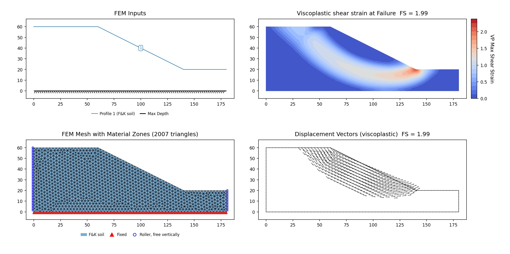

**ru = 0.25 case (vp021b)**

### RS2-18: Three pore pressure conditions and a weak seam (Fredlund & Krahn) {#rs2-18}

Slide2 counterpart: [VP22](rocscience.md#vp22). Built for the dry and ru cases.

**Input files:** [vp022a.xlsx](files/rocscience/vp022a.xlsx),
[vp022b.xlsx](files/rocscience/vp022b.xlsx)

| Method | XSLOPE | Published |
|---|---|---|
| SSRM (vp022a, dry) | 1.31 | RS2 SSRM 1.34 |
| SSRM (vp022b, ru = 0.25) | 1.042 | — (RS2's table records no SSRM for this sub-case) |

*Cross-bearings — dry: Slide2 Bishop 1.382. ru = 0.25: Slide2 1.124 and F&K 1.124.*

This one returns the *same* factor at 3.0 m and 2.0 m — the mechanism is pinned by the weak
seam, a geometric feature, so it cannot migrate with refinement. The contrast with
[#14](#rs2-14) is the point: there, nothing pins the band. RS2 records no SSRM for this
sub-case either (as at [#17](#rs2-17)); the water-table case is likewise not built.

<!-- test: file=files/rocscience/vp022a.xlsx, type=fem_ssrm, expected_fs=1.312, element_type=tri6, target_size=3.0, tolerance=0.02, f_min=1.0, f_max=1.7, max_iter=16000, tension_srf=false, benchmark=RS2-18 -->
<!-- test: file=files/rocscience/vp022b.xlsx, type=fem_ssrm, expected_fs=1.042, element_type=tri6, target_size=3.0, tolerance=0.02, f_min=0.8, f_max=1.8, max_iter=16000, tension_srf=false, benchmark=RS2-18b -->

**Dry case (vp022a)**

**ru = 0.25 case (vp022b)**

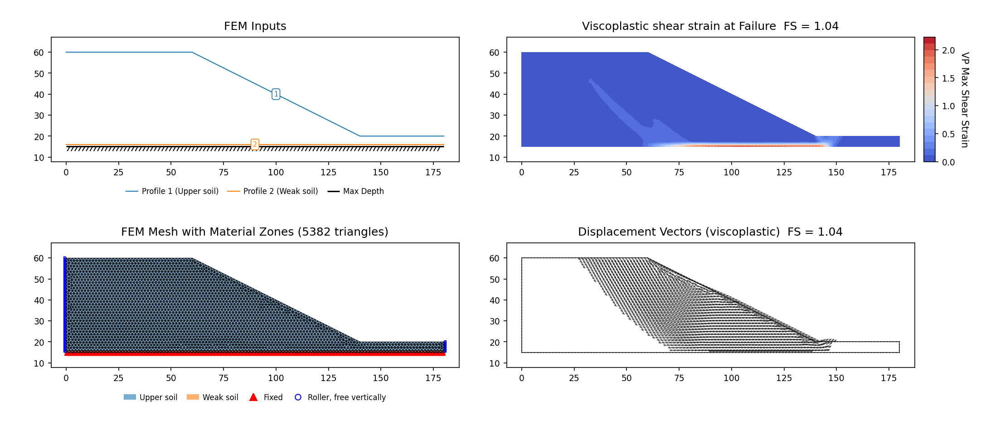

### RS2-19: Undrained layered slope (Low 1989) {#rs2-19}

Slide2 counterpart: [VP24](rocscience.md#vp24) (this problem is Slide2 VP24). Built with a
caveat.

**Input files:** [vp024.xlsx](files/rocscience/vp024.xlsx)

| Method | XSLOPE | Published |
|---|---|---|
| SSRM | 1.48 at the tagged mesh | RS2 SSRM 1.41 |

*Cross-bearings: Slide2 LEM 1.439; Low 1.44.*

The geometry follows the RS2 vendor `.fez`: three equal 4.5 m layers (crest y = 13.5, slope
break x = 33.5), which makes the weak Middle layer (c = 20) a full 4.5 m thick. The two SSRM
values straddle the LEM from opposite sides on this φ = 0 slope, and the XSLOPE factor drifts
−2% with refinement; quoted at the tagged mesh per the page convention.

<!-- test: file=files/rocscience/vp024.xlsx, type=fem_ssrm, expected_fs=1.477, element_type=tri6, target_size=1.0, tolerance=0.02, f_min=1.1, f_max=1.8, max_iter=16000, tension_srf=false, benchmark=RS2-19 -->

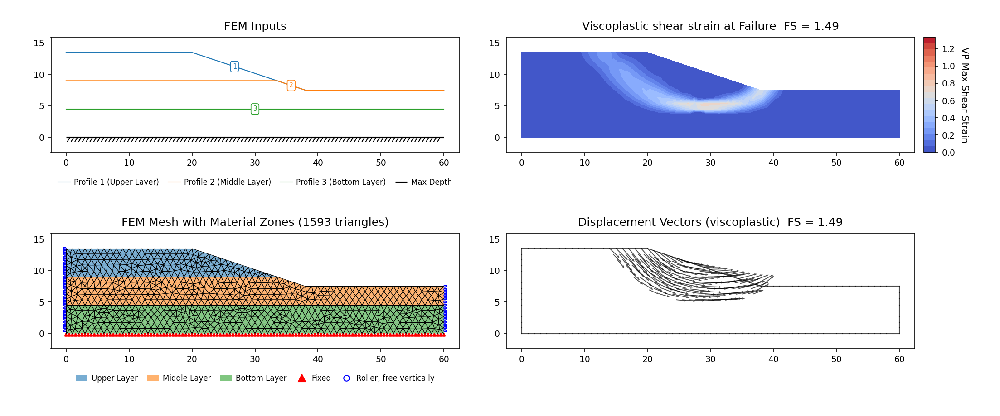

### RS2-20: Slope with vertical load (Prandtl's wedge) {#rs2-20}

Slide2 counterpart: [VP25](rocscience.md#vp25).

**Input files:** [vp025.xlsx](files/rocscience/vp025.xlsx)

| Method | XSLOPE | Published |
|---|---|---|
| SSRM | 1.00 (mesh pair 1.011→1.003) | RS2 SSRM 1.0 |

*Cross-bearings: Prandtl theory 1.0; Slide2 Spencer reads 1.051 on the specified surface.*

<!-- test: file=files/rocscience/vp025.xlsx, type=fem_ssrm, expected_fs=1.003, element_type=tri6, target_size=0.8, tolerance=0.01, f_min=0.5, f_max=1.6, max_iter=16000, tension_srf=false, benchmark=RS2-20 -->

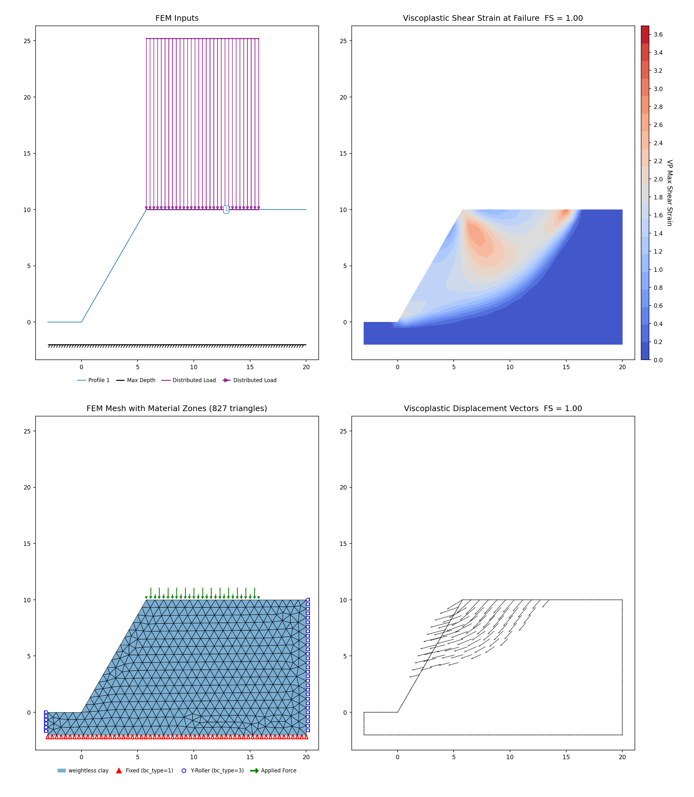

### RS2-21: Bearing capacity test prism (Prandtl II) {#rs2-21}

Slide2 counterpart: **VP26** (inventory-only on the LEM page — no detail section to link).

**Input files:** [vp026.xlsx](files/rocscience/vp026.xlsx)

| Method | XSLOPE | Published |
|---|---|---|
| SSRM | 1.003 | RS2 SSRM 1.01 |

*Converging on Prandtl theory 1.0. Cross-bearings: Slide2 Spencer 0.941 on the specified surface.*

<!-- test: file=files/rocscience/vp026.xlsx, type=fem_ssrm, expected_fs=1.003, element_type=tri6, target_size=0.8, tolerance=0.01, f_min=0.5, f_max=1.6, max_iter=16000, tension_srf=false, benchmark=RS2-21 -->

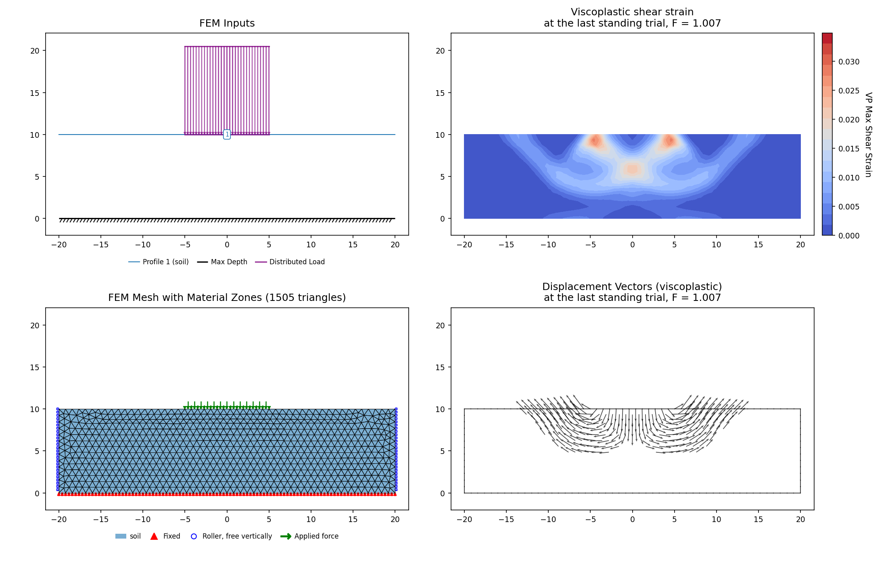

### RS2-22: Layered slope with undulating bedrock {#rs2-22}

Slide2 counterpart: [VP27](rocscience.md#vp27). Built on an SSRM variant.

**Input files:** [vp027_fem.xlsx](files/rocscience/vp027_fem.xlsx)

| Method | XSLOPE | Published |
|---|---|---|
| SSRM | 1.577 | RS2 SSRM 1.52 |

*+3.7% vs RS2's SSRM, on the vendor's own model formulation.*

Two features of the FEM matter on this model. Displacements are fixed along the whole bottom
*polyline* of the domain rather than only the nodes at the lowest elevation, which an
undulating bedrock base requires (as at [#16](#rs2-16)); and the FEM applies the
phreatic-inclination (Hu) correction this problem specifies, matching the LEM's
Type=phreatic path.

The SSRM runs on [vp027_fem.xlsx](files/rocscience/vp027_fem.xlsx), which reconstructs the
RS2 vendor `.fez`. The published model caps the crest with a **zero-strength** layer
(c = 0, φ = 0) — a limit-equilibrium device, dead weight riding above the failure surface. A
null Mohr-Coulomb yield surface has no continuum equivalent, so the RS2 vendor does not mesh
that cap as a material at all: it applies the cap's dead weight as two boundary distributed
loads (a 0 → 1280 psf triangular taper over x = 101–138 as the cap thins to the crest edge,
then a uniform 1280 psf to x = 200), on a single-material continuum carried at a constant
total unit weight γ = 124.2 pcf. This reconstruction adopts that formulation faithfully —
loads, unit weight, and the vendor's 9-vertex phreatic (Hu-corrected) water table — so the
crest cap is represented exactly as the published problem intends, with no strength
substitution. The result reads +3.7% above RS2's SSRM. Meshing the cap as a zero-strength material instead
reads +0.9%, but only through offsetting errors — extra crest strength, a lighter split unit
weight and a wetter water table pulling in opposite directions. vp027's LEM locks stand on
the as-published file.

<!-- test: file=files/rocscience/vp027_fem.xlsx, type=fem_ssrm, expected_fs=1.577, element_type=tri6, target_size=2.5, tolerance=0.02, f_min=1.2, f_max=1.9, max_iter=16000, tension_srf=false, benchmark=RS2-22 -->

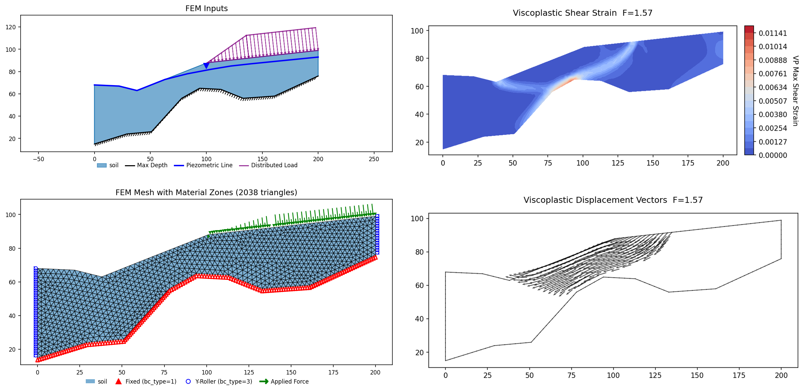

### RS2-23: Underwater slope with linearly varying cohesion {#rs2-23}

Slide2 counterpart: [VP29](rocscience.md#vp29).

| Method | XSLOPE | Published |
|---|---|---|
| SSRM | *no lock possible* | RS2 SSRM 1.12 |

*Stand-ins for the two readings of the "can't fail" region give 0.87 and 0.92; the unsuppressed SSRM minimum is 0.21. The slope's anchor remains the LEM lock ([VP29](rocscience.md#vp29), Spencer 1.145 on Duncan's surface).*

RS2's published SSRM depends on a "can't fail" elastic region whose boundary its text and
figure draw differently; without the patch the true SSRM minimum is the shallow skin above
el. −20 (FS 0.21) that the artifice suppresses. The comparison would test where the patch is
drawn, not the mechanics.

### RS2-24: Layered slope with geosynthetic reinforcement {#rs2-24}

Slide2 counterpart: [VP32](rocscience.md#vp32).

**Input files:** [vp032a.xlsx](files/rocscience/vp032a.xlsx) (unconstrained) ·
[vp032a_skin.xlsx](files/rocscience/vp032a_skin.xlsx) (elastic face skin) ·
[vp032c.xlsx](files/rocscience/vp032c.xlsx)

The H = 7 case has two answers, and both are reproduced: the **unconstrained** critical SRF (a
shallow cohesionless face skin) and the **deep reinforced** SRF that RS2 forces with a
"can't-fail" elastic face-skin zone to obtain its published SSRM of **1.15**.

| Method | XSLOPE | Published |
|---|---|---|
| SSRM, unconstrained (vp032a, H = 7) | 0.905 | — (true global minimum) |
| SSRM, elastic face skin (vp032a_skin, H = 7) | 1.201 | RS2 SSRM 1.15 |
| SSRM (vp032c, H = 8.75) | 0.946 | RS2 SSRM 0.95 |

*Geotextile as an FEM truss with the vendor `.fez` stiffness EA = 2×10⁵ kN/m and capacity
Ft = 200 kN/m, running the full 48.9 m (x = −50 to −1.107). The vendor's brittle residual
Ftr = 0 is not carried — xslope's FEM reinforcement has no post-peak-drop path — so the bar
holds its capacity after yield (a documented residual-law difference).*

**Unconstrained minimum (vp032a, 0.905).** vp032a fails as a partly-restrained cohesionless face
skin, like [RS2-4](#rs2-4)/[RS2-40](#rs2-40): both embankment fills are c = 0 on 39.1° faces, so
the unreinforced infinite-slope band is tan 35°/tan 39.1° = 0.861 (upper fill) to
tan 33°/tan 39.1° = 0.799 (lower); the stiff geotextile lifts the SSRM above that band to 0.905,
with the out-of-balance nodes still hugging the face. This is the true global minimum with every
zone reduced. Applying the vendor geotextile's stress-dependent bond as a
[bond-slip](../fem/reinforcement.md#bond-slip-load-transfer-optional) load-transfer envelope
(joint c = 0, φ = 30.96°) leaves the SSRM at 0.905 to every decimal — the governing failure is
the unreinforced cohesionless face skin, which the geotextile bond does not restrain.

**Elastic face skin (vp032a_skin, 1.201) vs RS2's 1.15.** RS2's published 1.15 is likewise not the
unconstrained minimum: the vendor `.fez` (#024_01) defines an internal boundary
(boundary 9: (−9.5, 7) → (−2.214, 1) → (−2.093, 0.9) → (−1, 0)) tracing a ~0.75–1 m strip inboard
of the 39.1° face, and assigns the elements inside it to duplicate materials ("embankment
upper/lower elastic") with **Plasticity Specifications: None** — identical c/φ/γ to the embankment
fills but purely elastic, so the SRF sweep can never fail the cohesionless face skin. That forces
the mechanism onto the deep reinforced surface. vp032a_skin.xlsx replicates the construction
exactly: the same strip is carved into its own two zones (meshing to 10 upper + 4 lower elements,
matching the vendor's element bboxes) with identical properties, held elastic via
`elastic_materials`; the split is inert to a normal MC solve. The constrained SSRM gives **1.201**
(+4.4% vs RS2's 1.15), and the critical shear band drops off the face onto the deep reinforced
surface — confirming the skin redirected the mechanism, exactly as vp067c's SSR Exclusion Area
does for [RS2-P4-VP67](#p4-vp67).

**vp032c (H = 8.75, 0.946)** fails as a shallow toe/foundation mechanism, −0.4% vs RS2's 0.95. The
face-skin closed form (0.80–0.86) does *not* govern at the tag mesh (2.2 m under-resolves the face
band); at finer meshes it may, as it does for vp032a.

RS2's fully labeled figures also supplied the geometry that unlocked Slide2's
[VP32](rocscience.md#vp32) — LEM locks on the three printed circles live there.

<!-- test: file=files/rocscience/vp032a.xlsx, type=fem_ssrm, expected_fs=0.905, element_type=tri6, target_size=1.5, tolerance=0.02, f_min=0.9, f_max=1.6, max_iter=16000, tension_srf=false, benchmark=RS2-24a -->
<!-- test: file=files/rocscience/vp032a_skin.xlsx, type=fem_ssrm, expected_fs=1.201, element_type=tri6, target_size=1.5, tolerance=0.02, f_min=0.9, f_max=1.6, max_iter=16000, elastic_materials=Upper embankment (elastic skin);Lower embankment (elastic skin), tension_srf=false, benchmark=RS2-24a-skin -->
<!-- test: file=files/rocscience/vp032c.xlsx, type=fem_ssrm, expected_fs=0.946, element_type=tri6, target_size=2.2, tolerance=0.02, f_min=0.7, f_max=1.4, max_iter=16000, tension_srf=false, benchmark=RS2-24b -->

**H = 7 case, unconstrained (vp032a) — partly-restrained cohesionless face skin**

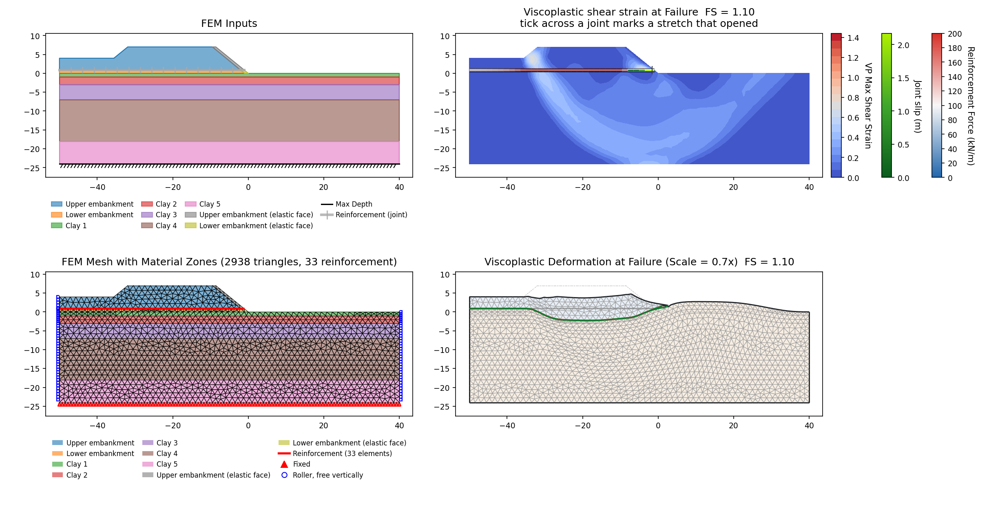

**H = 7 case, elastic face skin (vp032a_skin) — deep reinforced mechanism**

**H = 8.75 case (vp032c) — toe/foundation mechanism**

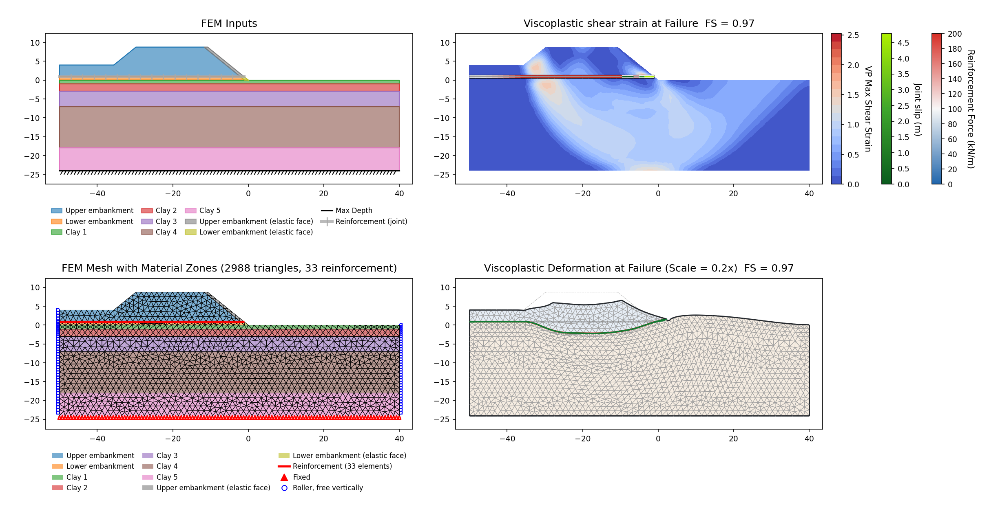

### RS2-25: Syncrude tailings dyke (El-Ramly et al. 2003) {#rs2-25}

Slide2 counterpart: [VP33](rocscience.md#vp33). Built with a caveat.

**Input files:** [vp033.xlsx](files/rocscience/vp033.xlsx)

| Method | XSLOPE | Published |
|---|---|---|
| SSRM | 1.19 | RS2 SSRM 1.29 |

*Cross-bearings: Slide2 Bishop 1.305; El-Ramly 1.31; XSLOPE's own LEM 1.320 on Slide's circle and 1.261 on a free composite search.*

Geometry, material zonation and unit weights follow the RS2 vendor `.fez`: the 15-vertex
external boundary, the four internal material interfaces, and the diagonal Pgc/Kca wedge
cut. The vendor file gives Clayey till (Pgc) φ = 7.5° (equal to the clay-shale), correcting
the earlier assumption that carried it at the sandy till's φ = 34°. The weak presheared
clay-shale rewards less-constrained searches (XSLOPE's own LEM: 1.320 on Slide's circle,
1.261 free composite search, SSRM 1.19); locked at the tagged mesh.

<!-- test: file=files/rocscience/vp033.xlsx, type=fem_ssrm, expected_fs=1.188, element_type=tri6, target_size=5.0, tolerance=0.02, f_min=0.9, f_max=1.8, max_iter=16000, benchmark=RS2-25 -->

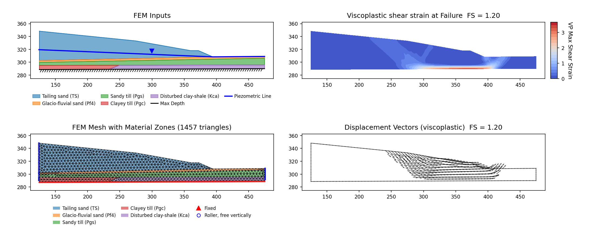

### RS2-26: Clarence Cannon dam (Wolff & Harr 1987) {#rs2-26}

Slide2 counterpart: [VP34](rocscience.md#vp34).

**Input files:** [vp034.xlsx](files/rocscience/vp034.xlsx)

| Method | XSLOPE | Published |
|---|---|---|
| SSRM | 2.24 | RS2 SSRM 2.29 (−2.1%) |

*Cross-bearings: Slide2 GLE 2.333 / Spencer 2.383; W&H 2.36; XSLOPE LEM M-P 2.384.*

Polygon zones with the chimney drain. This file reconstructs Slide2's VP34 model of the dam
(four zones: Phase I and Phase II fill, a sand drain, and a foundation sand), and its LEM lock
tracks Slide2's published Spencer/GLE. The RS2 vendor `.fez` models the same dam with a more
detailed six-zone section — a layered, higher-strength foundation (φ = 50° / 35°, γ = 150 pcf),
a distinct L-shaped filter/chimney drain (φ = 35°), and a high-strength downstream Spoil Fill
wedge (c = 3000 psf, φ = 60°). Those extra zones all sit **below or outside the governing
mechanism**: the critical surface runs 45° through the Phase II shell, horizontal along the
Phase I base at el. 516, and exits at the downstream waterline — never dropping into the
foundation (el. ≤ 514) or crossing the Spoil Fill. They therefore do not drive the modest
−2% SSRM gap, and are not reproduced here so as to keep the file faithful to the Slide2 VP34
model it is locked against.

<!-- test: file=files/rocscience/vp034.xlsx, type=fem_ssrm, expected_fs=2.243, element_type=tri6, target_size=15.0, tolerance=0.02, f_min=1.7, f_max=3.0, max_iter=16000, tension_srf=false, benchmark=RS2-26 -->

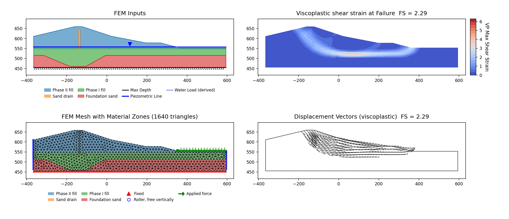

### RS2-27: Homogeneous slope, pore pressure by ru {#rs2-27}

Slide2 counterpart: [VP36](rocscience.md#vp36) (Li & Lumb 1987 / Hassan & Wolff 1999). Built
with a caveat — the same ru mesh-sensitivity documented on [RS2-14](#rs2-14).

**Input files:** [vp036.xlsx](files/rocscience/vp036.xlsx)

| Method | XSLOPE | Published |
|---|---|---|
| SSRM (regression lock at the 1.0 m mesh) | 1.344 | RS2 SSRM 1.31 |

*Cross-bearings: Slide2 Bishop 1.339; Hassan & Wolff (deterministic) 1.334.*

This homogeneous 2:1 slope (c' = 18 kPa, φ' = 30°, γ = 18 kN/m³, ru = 0.2) is the
deterministic core of the [VP36](rocscience.md#vp36) reliability benchmark. As on
[RS2-14](#rs2-14), the SSRM factor does not become mesh-independent under
ru loading: 1.394 / 1.344 / 1.294 at 1.5 / 1.0 / 0.7 m target sizes, drifting without a
plateau because ru cancels part of the confinement and unregularized Mohr-Coulomb has no
length scale to arrest the localizing band. The milder ru = 0.2 here drifts less steeply
than RS2-14's ru = 0.5. The tag pins the 1.0 m mesh (1.344), which lands on the
deterministic Slide2 Bishop 1.339 and Hassan & Wolff 1.334 and sits +2.6% above RS2's SSRM 1.31; the
honest reading is a value between roughly 1.29 and 1.39, straddling all three references.

<!-- test: file=files/rocscience/vp036.xlsx, type=fem_ssrm, expected_fs=1.344, element_type=tri6, target_size=1.0, tolerance=0.02, f_min=1.1, f_max=1.6, max_iter=16000, tension_srf=false, benchmark=RS2-27 -->

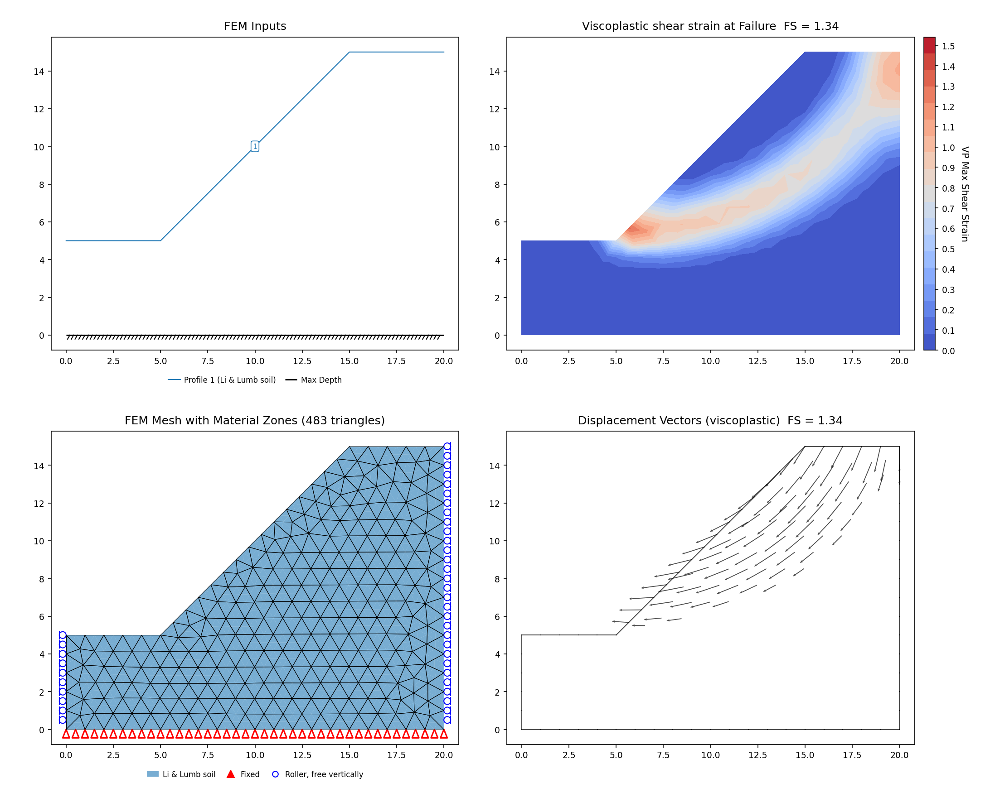

### RS2-28: Excavated slope with FE groundwater and matric suction (Ng & Shi 1998) {#rs2-28}

Slide2 counterpart: [VP38](rocscience.md#vp38). A 28° Hong Kong cut (24 m soil over 6 m
bedrock); a steady unsaturated FE groundwater analysis at three far-field heads (H = 61 /
62 / 63 m) supplies both the positive and the negative (matric-suction) pore pressures, and
the SSRM reduces strength to failure. Material (manual Table 1): c′ = 10 kPa, φ′ = 38°,
φ_b = 15°, γ = 16 kN/m³.

**Input files:** [rs2_28a.xlsx](files/rocscience/rs2_28a.xlsx) /
[b](files/rocscience/rs2_28b.xlsx) / [c](files/rocscience/rs2_28c.xlsx) — geometry
from the vendor `.fea` external boundary; XSLOPE's own steady unsaturated Gardner seepage
supplies u (the [VP38](rocscience.md#vp38) pattern; the vendor result file is empty, so no
solved field can be imported). The domain is split into a Mohr-Coulomb corridor near the cut
('Cut soil', carrying φ_b) and an elastic outer zone ('Elastic outer'), reproducing the
vendor `.fea` material partition (`rock1` Mohr-Coulomb / `rock2` `Plasticity: None`).

| H | RS2 (SSR) | Slide2 | [Ng & Shi (1998)](https://doi.org/10.1016/S0266-352X(97)00036-0) |
|---|---|---|---|
| 61 m | 1.64 | 1.616 | 1.636 |
| 62 m | 1.55 | 1.535 | 1.527 |
| 63 m | 1.41 | 1.399 | 1.436 |

*Published values are from the RS2 *Slope Stability Verification Manual, Part 1*, §28
(Table 2). The manual's §38-derived cross-reference elsewhere quoting "1.56 / 1.46 / 1.32"
does not match this table.*

**Status — blocked.** Two independent obstacles, documented rather than tuned away:

1. **Suction basis.** All three vendor `.fea` models carry the plasticity line
   `C: 10 phi: 38 … Phi_b: 0 Air_Entry: 0 UseUnsaturated: 0` with `negative_pp_cutoff: 0`.
   RS2 therefore does **not** credit suction through the reduced-φ_b apparent-cohesion form;
   it retains the negative pore pressure in the effective stress at the full φ′ = 38° (i.e.
   φ_b = φ′), reduced by the SRF. The manual's Table 1 instead documents Ng & Shi's φ_b = 15°,
   which the Slide2 limit-equilibrium result uses. The two routes bracket the published
   spread (RS2's φ′ = 38° credit sits just above the φ_b = 15° Slide2 values). XSLOPE's FEM
   suction option is the apparent-cohesion form; the manual's φ_b = 15° is baked into the
   corridor material, so the reproduction targets the Ng & Shi / Slide2 basis, not RS2's
   effective-stress-at-φ′ basis.

2. **FEM convergence.** The far-field head drives a large positive pore pressure through the
   saturated foundation (up to ≈ 200 kPa). XSLOPE's viscoplastic solver does not reach the
   Dawson per-node force equilibrium at any strength-reduction factor (it fails to converge
   even at F = 0.10, i.e. 10× strength), in either pore-pressure formulation and with or
   without the elastic corridor — the water body load / submerged-boundary effective tension
   dominates the residual, so the SSRM cannot bracket a critical F. This is a solver
   limitation for extreme seepage loading, not a strength result. The cases are shipped built
   (geometry, seepage sidecars, material partition) as the basis for a future lock once the
   solver handles this loading.

### RS2-29: Geosynthetic-reinforced embankment on soft soil (Tandjiria 2002) {#rs2-29}

Slide2 counterpart: [VP39](rocscience.md#vp39). The manual's §29/§30 headings are swapped.
Built for the sand case.

**Input files:** [vp039c.xlsx](files/rocscience/vp039c.xlsx)

| Method | XSLOPE | Published |
|---|---|---|
| SSRM (sand case, vp039c) | 1.181 | RS2 SSRM 1.25 |

*Cross-bearings: Spencer 1.209; Tandjiria 1.219.*

The governing mechanism is a shallow compound surface through the c = 0 fill face and
the soft-clay toe (the above-tolerance band sits at ~0.4 m median depth on the 6-m
embankment). The pure fill-skin closed form, tan 37°/tan 31° = 1.254, coincides with
RS2's published 1.25 but is not the minimum here.

**The clay case (RS2 SSRM 0.99) is final: no lock is possible, by design.** Its LEM value
(VP39a, locked at 0.968) is governed by a water-filled tension crack — a limit-equilibrium
construct, surface truncation plus a hydrostatic thrust on the crack wall, with no
continuum counterpart. RS2's own #29 SSRM models draw the same line: their geometry contains
no crack construct at all (a two-material Mohr-Coulomb continuum, unreinforced, no water),
and tension is handled constitutively — a tensile strength the SSRM does not reduce,
dropping to zero on brittle tensile failure — so a "crack" in the FEM is an emergent
tensile-failure zone, never an input. XSLOPE's crack-free SSRM reads 1.05, on top of a
no-crack LEM run (Bishop 1.042): the correct continuum answer. The remaining distance to
0.968 is the crack truncation and the water thrust, and the water is the hard stop — a
continuum has no cavity to pressurize. (The sand case's nominal crack is procedural:
c = 0 gives zero theoretical crack depth, and removing it moves the LEM under 1%.)

<!-- test: file=files/rocscience/vp039c.xlsx, type=fem_ssrm, expected_fs=1.181, element_type=tri6, target_size=0.7, tolerance=0.02, f_min=0.9, f_max=1.7, max_iter=16000, tension_srf=false, benchmark=RS2-29 -->

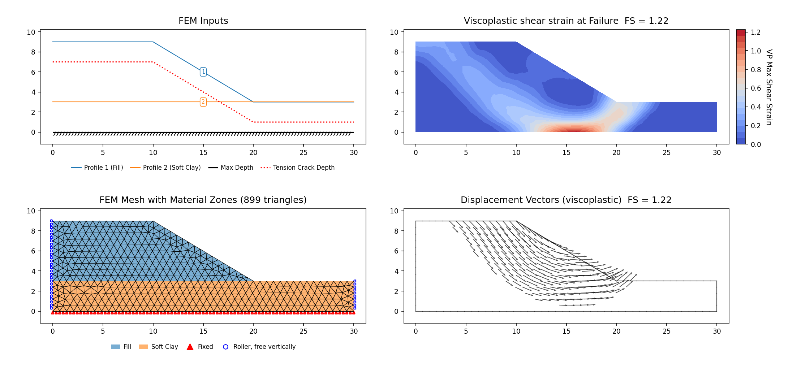

### RS2-30: Homogeneous slope, power-curve strength (Perry 1993) {#rs2-30}

Slide2 counterpart: [VP40](rocscience.md#vp40). Swapped heading (see [#29](#rs2-29)).

**Input files:** [vp040.xlsx](files/rocscience/vp040.xlsx)

| Method | XSLOPE | Published |
|---|---|---|
| SSRM | 0.898 | RS2 SRF 0.91 (−1.3%) |

*Cross-bearings: Slide2 Janbu 0.944; Perry 0.98.*

The FEM linearizes the reduced envelope at the current stress per iteration.

<!-- test: file=files/rocscience/vp040.xlsx, type=fem_ssrm, expected_fs=0.898, element_type=tri6, target_size=2.0, tolerance=0.02, f_min=0.5, f_max=1.5, max_iter=16000, benchmark=RS2-30 -->

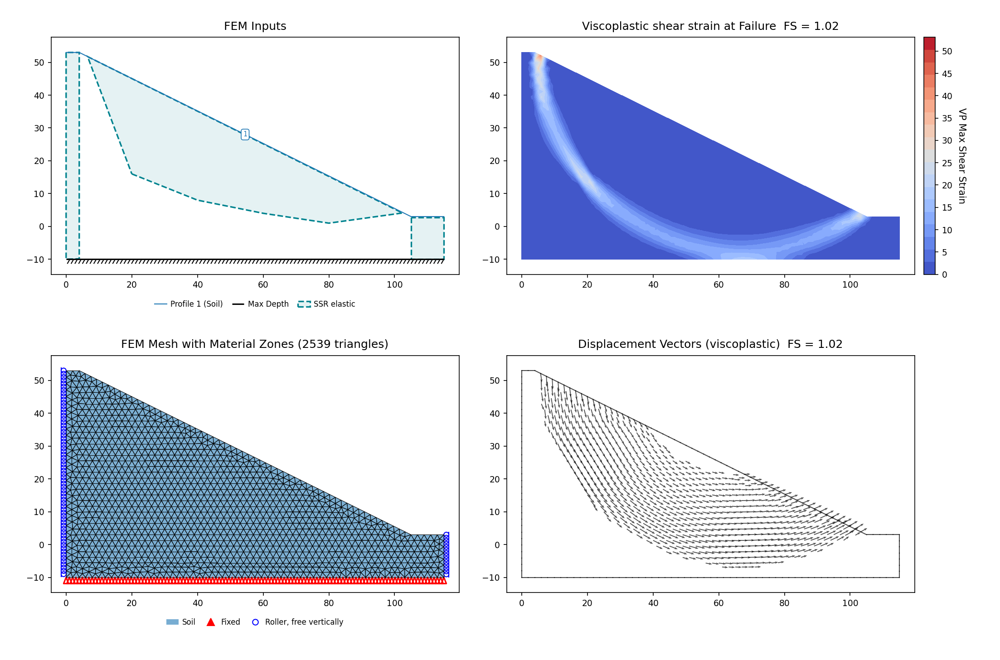

### RS2-31: M-C vs power curve (Baker 2003 ex. 1) {#rs2-31}

Slide2 counterpart: [VP44](rocscience.md#vp44). Built, all three halves.

**Input files:** [vp044a.xlsx](files/rocscience/vp044a.xlsx),
[vp044b.xlsx](files/rocscience/vp044b.xlsx),
[vp044c.xlsx](files/rocscience/vp044c.xlsx)

| Method | XSLOPE | Published |
|---|---|---|
| SSRM (vp044b, M-C) | 1.529 | RS2 SSRM 1.53 |
| SSRM (vp044c, M-C) | 0.931 | RS2 SSRM 0.98 |
| SSRM (vp044a, power curve) | 0.921 | RS2 SSRM 1.11 |

*Cross-bearings on the power-curve case: Slide2's own published band is Janbu 0.92 / Spencer 0.96, Baker ~0.97.*

XSLOPE's power-curve SSRM sits squarely on Slide2's band; RS2's 1.11 sits 15% above Slide2's
LEM on the same problem and is the outlier. The reason is a strength-model difference: XSLOPE
carries Baker's literal power law (τ = 1.107·σn0.86), whereas RS2's own
#031 `.fez` re-expresses it as a fitted Generalized Hoek-Brown envelope (σci =
113.1 kPa, mb = 1.681, s = 2.6×10⁻⁵, a = 0.619), which delivers materially more
shear strength at the low normal stresses that govern this near-failing shallow slope.
RS2's own Slide2-import twin of this problem keeps the literal PowerCurve criterion and agrees
with XSLOPE — confirming the reconstruction is faithful to Baker's source curve and the GHB
fit is RS2's internal approximation.

<!-- test: file=files/rocscience/vp044b.xlsx, type=fem_ssrm, expected_fs=1.529, element_type=tri6, target_size=0.5, tolerance=0.02, f_min=1.1, f_max=2.0, max_iter=16000, tension_srf=false, benchmark=RS2-31a -->
<!-- test: file=files/rocscience/vp044c.xlsx, type=fem_ssrm, expected_fs=0.931, element_type=tri6, target_size=0.5, tolerance=0.02, f_min=0.6, f_max=1.4, max_iter=16000, tension_srf=false, benchmark=RS2-31b -->
<!-- test: file=files/rocscience/vp044a.xlsx, type=fem_ssrm, expected_fs=0.921, element_type=tri6, target_size=0.5, tolerance=0.02, f_min=0.5, f_max=1.6, max_iter=16000, benchmark=RS2-31c -->

**Mohr-Coulomb case (vp044b)**

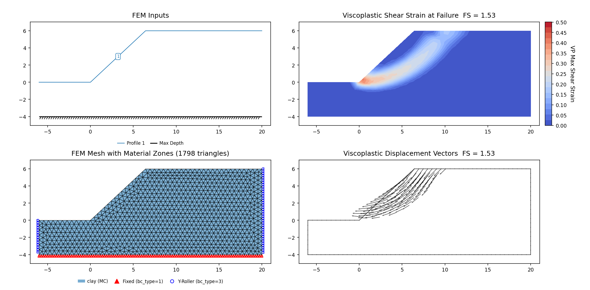

**Mohr-Coulomb case (vp044c)**

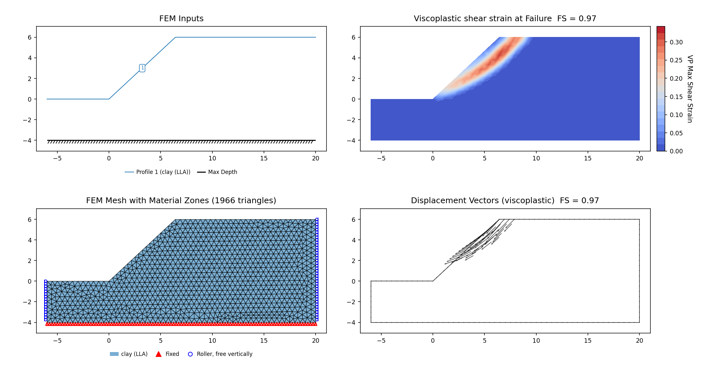

**Power-curve case (vp044a)**

### RS2-32: Heading mismatch — body is Baker's example 2 {#rs2-32}

Slide2 counterpart: [VP45](rocscience.md#vp45). Built, both halves.

**Input files:** [vp045a.xlsx](files/rocscience/vp045a.xlsx),
[vp045b.xlsx](files/rocscience/vp045b.xlsx)

| Method | XSLOPE | Published |
|---|---|---|
| SSRM (vp045a, M-C) | 2.790 | RS2 SSRM 2.83 (−1.4%) |
| SSRM (vp045b, power curve) | 2.623 | RS2 SSRM 2.74 (−4.3%) |

*Cross-bearings: Slide2 Spencer 2.662.*

The −4.3% gap on the power-curve half is a genuine strength-model difference, not a
reconstruction error. XSLOPE's material carries Baker's published power law directly
(τ = 1.107·σn0.86). RS2 has no native arbitrary-power-curve plasticity
model, so its own `.fez` re-expresses the same envelope as a fitted Generalized Hoek-Brown
material (σci = 157.6 kPa, mb = 1.681, s = 2.6×10⁻⁵, a = 0.619).
Converting that GHB fit back to shear–normal space (Balmer transform) shows it running a few
percent stronger than the literal curve over the slope's working-stress range, which is why
RS2's 2.74 sits above XSLOPE's 2.623 — Slide2's Spencer on the *same* literal power curve
(2.662) brackets XSLOPE, confirming XSLOPE reproduces Baker's actual curve while RS2's GHB-fit
is the outlier of the three.

<!-- test: file=files/rocscience/vp045a.xlsx, type=fem_ssrm, expected_fs=2.790, element_type=tri6, target_size=1.0, tolerance=0.02, f_min=2.3, f_max=3.4, max_iter=16000, tension_srf=false, benchmark=RS2-32 -->
<!-- test: file=files/rocscience/vp045b.xlsx, type=fem_ssrm, expected_fs=2.623, element_type=tri6, target_size=1.0, tolerance=0.02, f_min=1.8, f_max=3.6, max_iter=16000, benchmark=RS2-32b -->

**Mohr-Coulomb case (vp045a)**

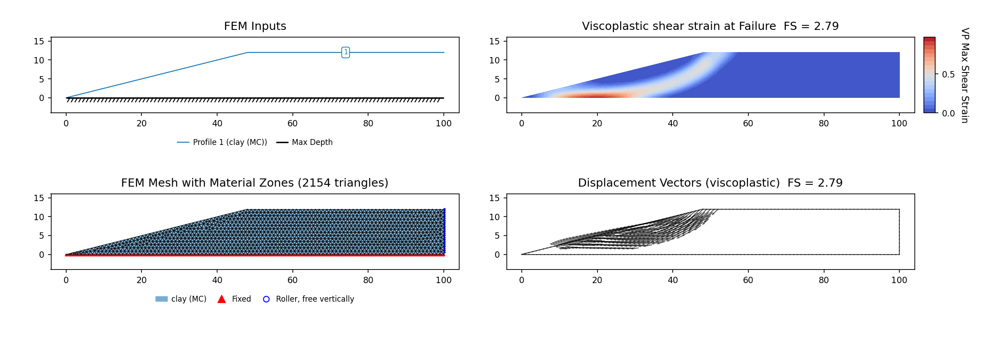

**Power-curve case (vp045b)**

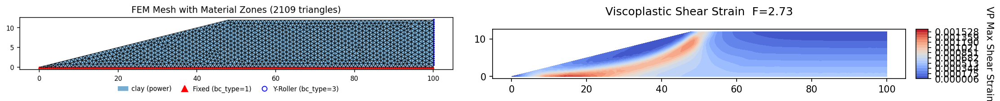

### RS2-33: Homogeneous slope with tension crack and water table (P&D test slope 2) {#rs2-33}

Slide2 counterpart: [VP56](rocscience.md#vp56). Swapped heading. Built with a caveat.

**Input files:** [vp056.xlsx](files/rocscience/vp056.xlsx)

| Method | XSLOPE | Published |
|---|---|---|
| SSRM | 1.244 | RS2 SSRM 1.28 |

*Cross-bearings: an eight-program LEM table spanning 1.03–1.32.*

The model's dry tension crack has no FEM representation, worth ~2–3% here.

<!-- test: file=files/rocscience/vp056.xlsx, type=fem_ssrm, expected_fs=1.244, element_type=tri6, target_size=4.0, tolerance=0.02, f_min=0.9, f_max=1.7, max_iter=16000, tension_srf=false, benchmark=RS2-33 -->

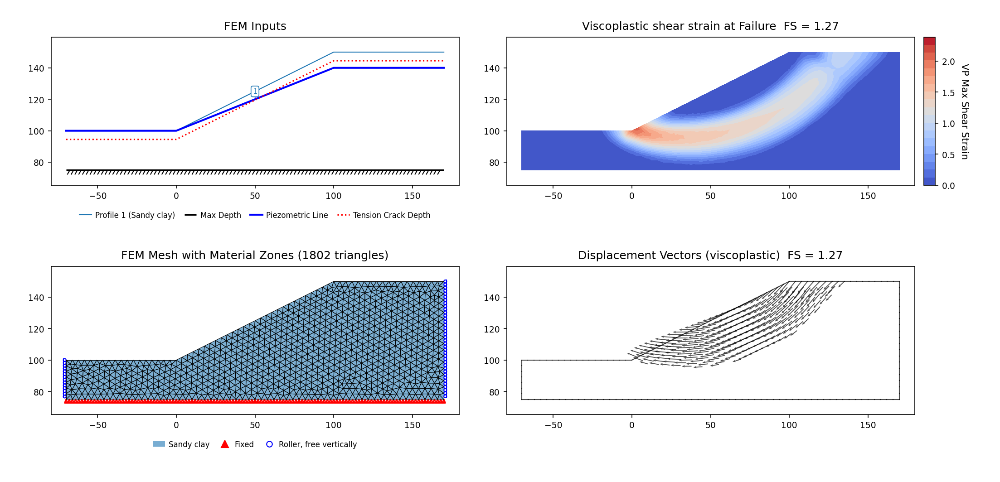

### RS2-34: M-C vs power curve III (Baker 2003 ex. 3, London clay) {#rs2-34}

Slide2 counterpart: [VP61](rocscience.md#vp61). Built, both halves.

**Input files:** [vp061a.xlsx](files/rocscience/vp061a.xlsx),
[vp061b.xlsx](files/rocscience/vp061b.xlsx)

| Method | XSLOPE | Published |
|---|---|---|
| SSRM (vp061b, M-C) | 1.345 | RS2 SSRM 1.38 |
| SSRM (vp061a, power curve) | 1.478 | RS2 SSRM 1.47 (+0.5%) |

*Cross-bearings on the power-curve case: Slide2 Spencer 1.47; Baker 1.48.*

<!-- test: file=files/rocscience/vp061b.xlsx, type=fem_ssrm, expected_fs=1.345, element_type=tri6, target_size=0.5, tolerance=0.02, f_min=1.0, f_max=1.9, max_iter=16000, tension_srf=false, benchmark=RS2-34 -->
<!-- test: file=files/rocscience/vp061a.xlsx, type=fem_ssrm, expected_fs=1.478, element_type=tri6, target_size=0.5, tolerance=0.02, f_min=1.0, f_max=2.2, max_iter=16000, benchmark=RS2-34b -->

**Mohr-Coulomb case (vp061b)**

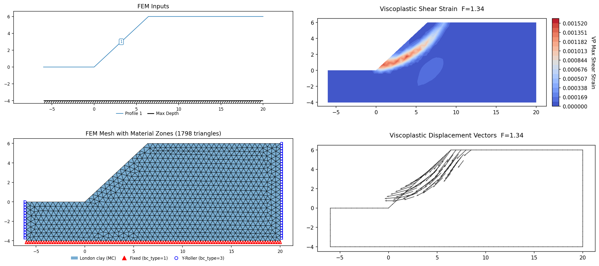

**Power-curve case (vp061a)**

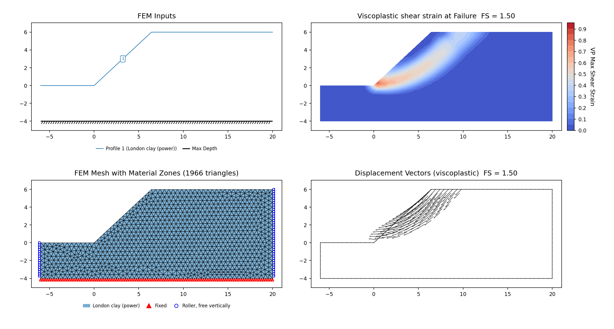

### RS2-36: Seepage analysis, homogeneous slope (D&W Fig 6.37) {#rs2-36}

Slide2 counterpart: [VP71](rocscience.md#vp71) (= Slide2 VP71, not
[VP70](rocscience.md#vp70)). Built, both cases.

**Input files:** [vp071a.xlsx](files/rocscience/vp071a.xlsx),
[vp071b.xlsx](files/rocscience/vp071b.xlsx)

| Method | XSLOPE | Published |
|---|---|---|
| SSRM (vp071a, FE seepage) | 1.097 | RS2 SSRM 1.12 |
| SSRM (vp071b, piezo approximation) | 1.111 | RS2 SSRM 1.12 |

*Cross-bearings: referee 1.138/1.141; XSLOPE LEM locks 1.132.*

The seep case runs on tri6 sidecars.

<!-- test: file=files/rocscience/vp071a.xlsx, type=fem_ssrm, expected_fs=1.097, tolerance=0.01, f_min=0.7, f_max=1.6, max_iter=16000, tension_srf=false, benchmark=RS2-36a -->
<!-- test: file=files/rocscience/vp071b.xlsx, type=fem_ssrm, expected_fs=1.111, element_type=tri6, target_size=4.4, tolerance=0.01, f_min=0.7, f_max=1.6, max_iter=16000, tension_srf=false, benchmark=RS2-36b -->

**FE-seepage case (vp071a)**

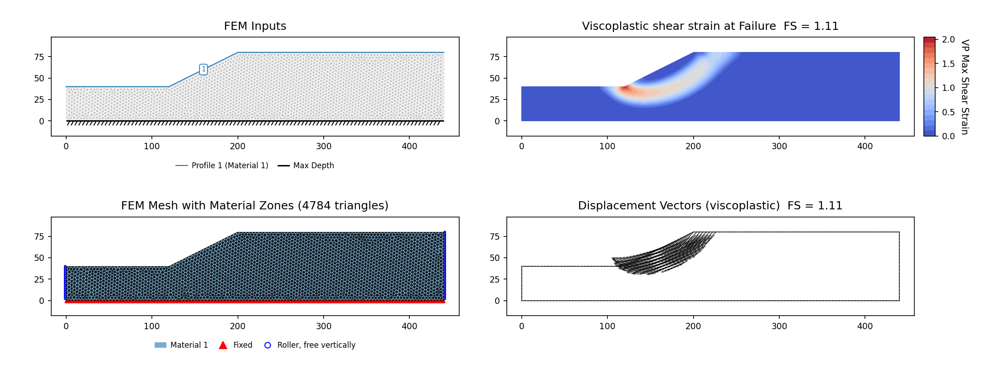

**Piezometric-line case (vp071b)**

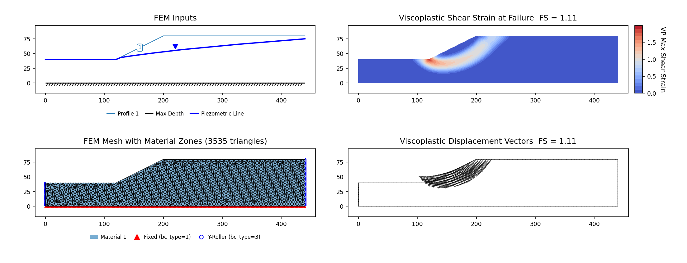

### RS2-37: Embankment with layered foundation (D&W Fig 6.39) {#rs2-37}

Slide2 counterpart: [VP72](rocscience.md#vp72). Reported, no lock.

| Method | XSLOPE | Published |
|---|---|---|
| SSRM | 1.31 (deep mechanism) | RS2 SSRM 0.95 in its table, 1.1 in its own convergence graph (artesian downstream-toe slide) |

*Cross-bearings: XSLOPE LEM on the tangent circle 1.339; Slide2 1.15/1.16; referee 1.11.*

The two programs are not finding the same mechanism. Reproducing the toe mechanism needs
toe-refined meshing — noted with the artesian-toe discussion in the Slide2
[VP72](rocscience.md#vp72) section.

### RS2-38: Cohesionless embankment on saturated clay foundation (D&W Fig 7.12) {#rs2-38}

Slide2 counterpart: [VP74](rocscience.md#vp74) (Duncan & Wright 2005, Fig 7.12).

**Input files:** [vp074.xlsx](files/rocscience/vp074.xlsx)

A cohesionless sand embankment (c = 0, φ = 40°, γ = 140 pcf) on a saturated clay foundation
(c = 2500 psf, φ = 0, γ = 140 pcf). The critical surface is the deep foundation mechanism through the
undrained clay. The FEM elastic constants are the vendor model's own, E = 1×10⁶ psf and ν = 0.4 on
both materials.

| Method | XSLOPE | Published |
|---|---|---|
| SSRM (7.0 m mesh) | 1.168 | RS2 SSRM 1.17 (Part 4) / 1.21 (Part 2) |

*Cross-bearings: Slide2 Spencer 1.20 circular / 1.18 non-circular; Duncan & Wright referee 1.22
(Bishop) / 1.19 (Spencer); XSLOPE LEM Bishop/Spencer/Janbu 1.219 / 1.194 / 1.161.*

XSLOPE's SSRM lands at **1.168**, on RS2's Part 4 SSRM 1.17 and Slide2's non-circular 1.18, and −3.5%
from RS2's Part 2 SSRM 1.21 (RS2 re-ran the problem between the two manuals). ψ = 0. Locked at the
7.0 m mesh on this 700-ft-wide section.

<!-- test: file=files/rocscience/vp074.xlsx, type=fem_ssrm, expected_fs=1.168, element_type=tri6, target_size=7.0, tolerance=0.02, f_min=0.9, f_max=1.6, max_iter=16000, tension_srf=false, benchmark=RS2-38 -->

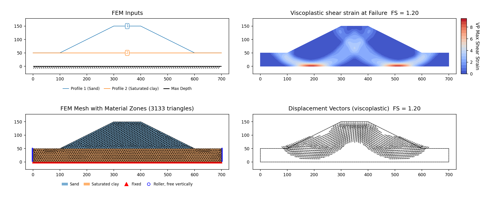

### RS2-39/41/43: Earth embankment, infinite-slope mechanism (Duncan & Wright) {#rs2-39}

RS2 Parts I–III problems 41 (Slide2 [VP79](rocscience.md#vp79), D&W Fig 14.4) and 43 (Slide2
[VP81](rocscience.md#vp81), D&W Fig 14.7) are cohesionless embankments (c = 0, φ = 30°) on an
undrained φ = 0 foundation, each analyzed for two mechanisms: a **very shallow infinite-slope skin**
in the embankment, and a **deep** surface RS2 forces by holding the foundation linear-elastic so the
slip cannot enter it. Problem 39 (VP76, D&W Fig 7.19) is the FE-seepage member of the same family and
is deferred with the other FE-seepage cases. The infinite-slope skin is the natural unconstrained
SSRM mechanism; the deep case is run with `elastic_materials=['Foundation']` (RS2's elastic
foundation).

**Input files:** [vp079.xlsx](files/rocscience/vp079.xlsx) (RS2-41, Fig 14.4) ·
[vp081.xlsx](files/rocscience/vp081.xlsx) (RS2-43, Fig 14.7)

| Case | XSLOPE SSRM | Published |
|---|---|---|
| VP79 infinite slope (unconstrained) | 1.430 | RS2 SSRM 1.47; D&W referee 1.44 |
| VP81 infinite slope (unconstrained) | 1.097 | RS2 SSRM 1.19; D&W referee 1.15 |

*Cross-bearings — the deep mechanism (foundation held elastic): VP79 1.419 vs RS2 SSRM 1.43 / D&W 1.40
(mechanism-pinned, a clean match); VP81 1.082, where the c = 0 embankment skin still governs even
with the foundation elastic, so the deep RS2 value (1.23) is not separable without a surficial-depth
filter. Slide2 Bishop/Spencer: VP79 1.44 / VP81 1.15–1.16 (infinite).*

On **VP79** the unconstrained SSRM finds the infinite-slope skin at **1.430**, −0.7% from the Duncan &
Wright referee 1.44 and inside the RS2 1.43–1.47 band; the elastic-foundation deep run (1.419) lands
on RS2's deep 1.43 independently. On **VP81** the skin localizes to **1.097**, ~5% below the referee
1.15 — the c = 0 cohesionless skin keeps localizing on the fine tri6 mesh with no length scale to
arrest it (the same behavior documented on [RS2-40](#rs2-40)), so this is locked as a regression value
at the 1.5 m mesh, honestly below the reference rather than tuned up to it. ψ = 0; E = 1×10⁶ psf and
ν = 0.4, the vendor model's own constants.

<!-- test: file=files/rocscience/vp079.xlsx, type=fem_ssrm, expected_fs=1.430, element_type=tri6, target_size=1.5, tolerance=0.02, f_min=1.1, f_max=1.9, max_iter=16000, tension_srf=false, benchmark=RS2-41 -->
<!-- test: file=files/rocscience/vp081.xlsx, type=fem_ssrm, expected_fs=1.097, element_type=tri6, target_size=1.5, tolerance=0.02, f_min=0.9, f_max=1.5, max_iter=16000, tension_srf=false, benchmark=RS2-43 -->

**VP79 (RS2-41, D&W Fig 14.4)**

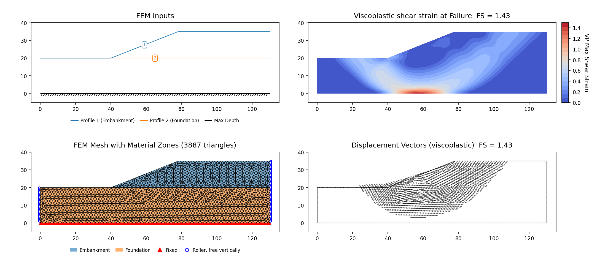

**VP81 (RS2-43, D&W Fig 14.7)**

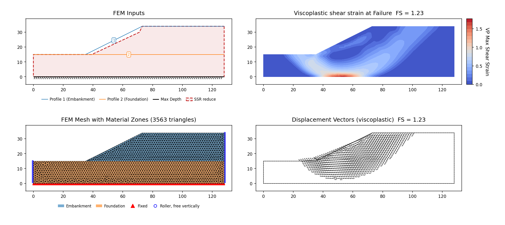

### RS2-40: Dam with impermeable foundation (D&W Fig 7.24) {#rs2-40}

Slide2 counterpart: [VP77](rocscience.md#vp77). Built for the piezo case.

**Input files:** [vp077b.xlsx](files/rocscience/vp077b.xlsx)

| Method | XSLOPE | Published |
|---|---|---|
| SSRM (vp077b, piezo case) | 1.126 | RS2 SSRM 1.53 |

As with the dry Talbingo dam (RS2-4), the cohesionless downstream shell fails as a
surface-parallel skin rather than a deep rotation. Here the piezometric line daylights at the
toe, so the governing mechanism is the *saturated* toe: the seepage-parallel infinite-slope
limit is (140 − 62.4)/140 × tan 38° / tan 20° = 1.190, and the per-node SSRM returns 1.126. The
per-node out-of-balance nodes sit exactly on the daylighting toe (x ∈ [1162, 1234]). The finite,
partially-saturated toe geometry softens the FEM ~5% below the idealized infinite slope, so this
skin's analytic anchor is looser than RS2-4's ±0.5% — but a shell-φ sweep tracks the
anchor law at a *constant* ratio (0.943–0.953 across φ = 30–42°), confirming the toe-skin
mechanism with the same rigor as RS2-4's sweep. The published RS2 SSRM 1.53 evidently
reports a deeper mechanism (which one its mesh resolved is not stated in its manual);
XSLOPE reports the more critical toe skin as the true global minimum.

*The FE-seepage sub-case (vp077a: pore pressures from a finite-element seepage solve
rather than a drawn piezometric line; D&W Table 7.9 lists PHASE2 SRF 1.57 alongside
Spencer 1.67–1.70) is blocked, and the obstruction is the downstream
seepage face rather than the core. The seepage sidecar is node-aligned to the SSRM mesh,
so seepage and SSRM share one mesh: the seepage solve converges cleanly on tri3 (447
iterations, exit face stable, q ≈ 8.2×10⁻⁶) but SSRM requires tri6, on which the
quadratic midside relative-conductivity sampling whips the daylighting front. Refining
the two core boundaries — a 100× k-jump between the clay core (k = 1.67×10⁻⁷) and the
shell (1.67×10⁻⁵) — with an interface-aware mesh size field halves the tri6 residual
floor (to ≈1.1×10⁻⁴, at the 1×10⁻⁴ tolerance), so the core contrast contributes to it;
it does not converge the solve. What blocks the solve is the
downstream free-surface exit face: the seepage-face active set never
settles (it cycles among 5–11 of 97 exit-face nodes at the daylighting toe), every
toggle spikes the head-change residual and restarts the decay, and the flow-closure
ratio stays O(10–100) against its 1×10⁻³ tolerance throughout, which is not relaxed to
obtain a solution. This is the tri3/tri6 trade at its sharpest — a converged seepage field needs
tri3 while a trustworthy SSRM needs tri6, and one shared mesh cannot be both.*

<!-- test: file=files/rocscience/vp077b.xlsx, type=fem_ssrm, expected_fs=1.126, element_type=tri6, target_size=12.4, tolerance=0.02, f_min=1.1, f_max=2.2, max_iter=16000, benchmark=RS2-40 -->

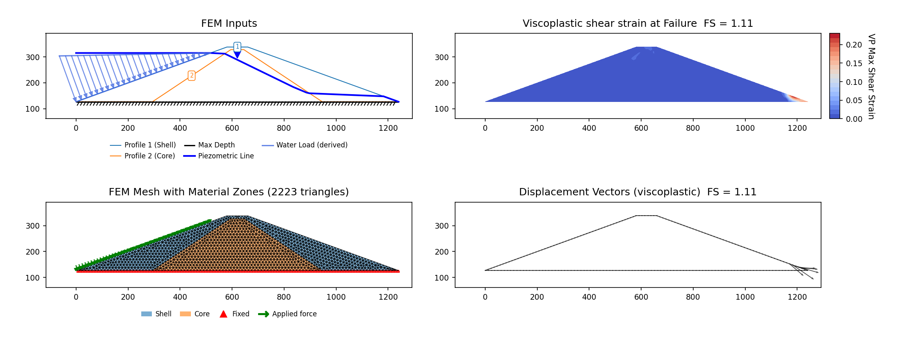

### RS2-42: James dike {#rs2-42}

Slide2 counterpart: [VP75](rocscience.md#vp75).

**Input files:** [vp075.xlsx](files/rocscience/vp075.xlsx)

| Method | XSLOPE | Published |
|---|---|---|
| SSRM | 1.214 | RS2 SSRM 1.26 (−3.7%) |

*Cross-bearings: Slide2 noncircular LEM 1.11–1.16; referee 1.17.*

<!-- test: file=files/rocscience/vp075.xlsx, type=fem_ssrm, expected_fs=1.214, element_type=tri6, target_size=1.85, tolerance=0.02, f_min=0.8, f_max=1.8, max_iter=16000, tension_srf=false, benchmark=RS2-42 -->

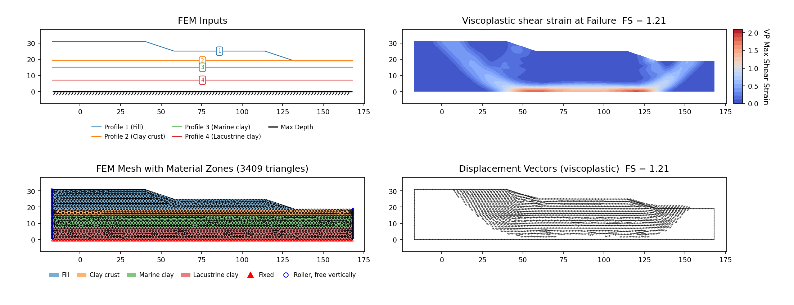

### RS2-44: Seepage analysis for an earth embankment (D&W Fig 14.20-a) {#rs2-44}

Slide2 counterpart: [VP82](rocscience.md#vp82) (= Slide2 VP82, not
[VP76](rocscience.md#vp76) — §39's body carries VP76).

**Input files:** [vp082.xlsx](files/rocscience/vp082.xlsx)

| Method | XSLOPE | Published |
|---|---|---|
| SSRM | 1.490 | RS2 SSRM 1.51 (−1.3%) |

*Cross-bearings: Slide2 LEM 1.532/1.541; referee 1.528–1.542.*

<!-- test: file=files/rocscience/vp082.xlsx, type=fem_ssrm, expected_fs=1.490, element_type=tri6, target_size=2.0, tolerance=0.02, f_min=1.0, f_max=2.1, max_iter=16000, tension_srf=false, benchmark=RS2-44 -->

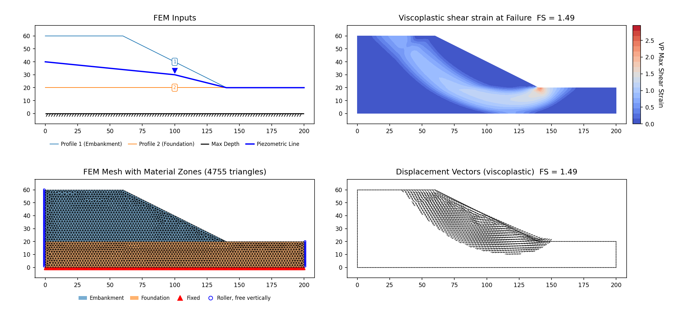

### RS2-45: Varying undrained shear strength profiles (D&W Fig 14.20-b) {#rs2-45}

Slide2 counterpart: [VP83](rocscience.md#vp83). Built with a caveat.

**Input files:** [vp083a.xlsx](files/rocscience/vp083a.xlsx),
[vp083b.xlsx](files/rocscience/vp083b.xlsx)

| Method | XSLOPE | Published |
|---|---|---|
| SSRM (vp083a) | 1.31 | RS2 SSRM 1.32 |
| SSRM (vp083b) | 1.31 | RS2 SSRM 1.32 |

*Cross-bearings: D&W referee 1.28–1.33.*

Both cases land inside the referee band under the per-node criterion. [RS2-19](#rs2-19),
the other φ = 0 foundation problem, reads +4.7% and keeps its caveat.

<!-- test: file=files/rocscience/vp083a.xlsx, type=fem_ssrm, expected_fs=1.314, element_type=tri6, target_size=4.0, tolerance=0.02, f_min=0.9, f_max=1.9, max_iter=16000, tension_srf=false, benchmark=RS2-45a -->
<!-- test: file=files/rocscience/vp083b.xlsx, type=fem_ssrm, expected_fs=1.314, element_type=tri6, target_size=4.0, tolerance=0.02, f_min=0.9, f_max=1.9, max_iter=16000, tension_srf=false, benchmark=RS2-45b -->

**Case a (vp083a)**

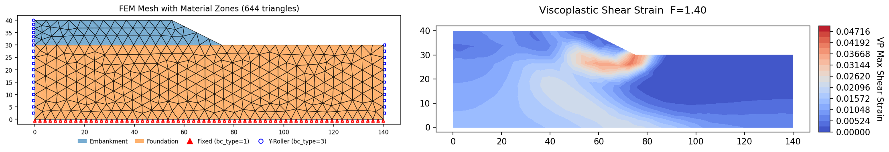

**Case b (vp083b)**

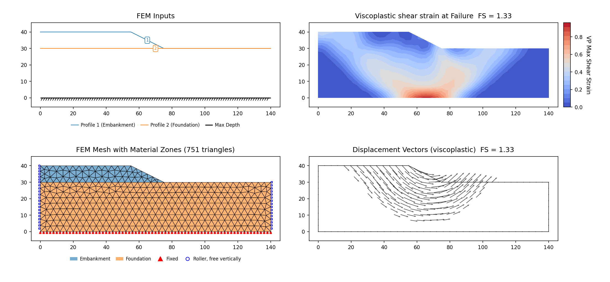

### RS2-46: Varying undrained strength profiles II (D&W Fig 15.9, cu = 300 + cz·z) {#rs2-46}

Slide2 counterpart: [VP84](rocscience.md#vp84).

**Input files:** [vp084a–d](files/rocscience/vp084a.xlsx)

| Method | XSLOPE | Published |
|---|---|---|
| SSRM (vp084a) | 0.79 | RS2 SSRM 0.78 |
| SSRM (vp084b) | 0.93 | RS2 SSRM 0.93 |
| SSRM (vp084c) | 1.06 | RS2 SSRM 1.05 |
| SSRM (vp084d) | 1.15 | RS2 SSRM 1.15 |

*+2–3%, the φ=0 pattern. Cross-bearings: D&W 0.75 / 0.90 / 1.03 / 1.13 for the four cases in the same order.*

<!-- test: file=files/rocscience/vp084a.xlsx, type=fem_ssrm, expected_fs=0.787, element_type=tri6, target_size=4.0, tolerance=0.02, f_min=0.4, f_max=1.3, max_iter=16000, tension_srf=false, benchmark=RS2-46a -->
<!-- test: file=files/rocscience/vp084b.xlsx, type=fem_ssrm, expected_fs=0.929, element_type=tri6, target_size=4.0, tolerance=0.02, f_min=0.5, f_max=1.4, max_iter=16000, tension_srf=false, benchmark=RS2-46b -->
<!-- test: file=files/rocscience/vp084c.xlsx, type=fem_ssrm, expected_fs=1.057, element_type=tri6, target_size=4.0, tolerance=0.02, f_min=0.6, f_max=1.5, max_iter=16000, tension_srf=false, benchmark=RS2-46c -->
<!-- test: file=files/rocscience/vp084d.xlsx, type=fem_ssrm, expected_fs=1.145, element_type=tri6, target_size=4.0, tolerance=0.02, f_min=0.7, f_max=1.7, max_iter=16000, tension_srf=false, benchmark=RS2-46d -->

**Case a (vp084a)**

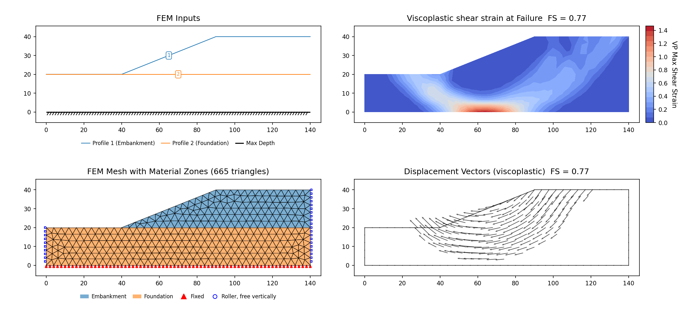

**Case b (vp084b)**

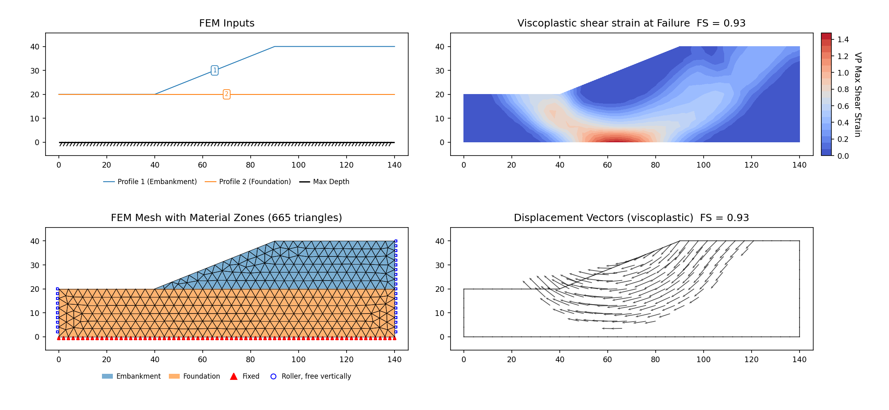

**Case c (vp084c)**

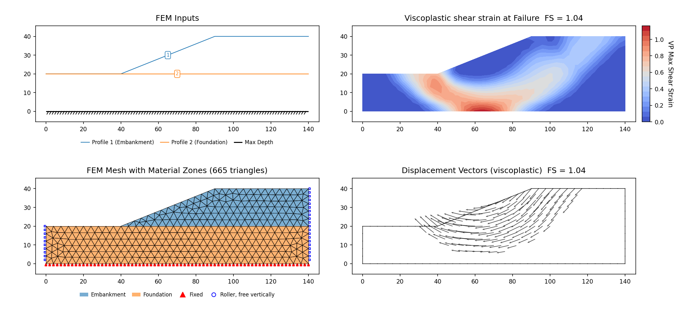

**Case d (vp084d)**

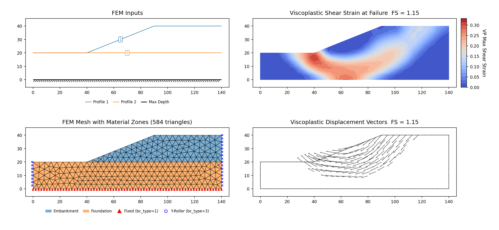

### RS2-47: Purely cohesive slope, varying thickness (D&W Fig 14.3) {#rs2-47}

Slide2 counterpart: [VP78](rocscience.md#vp78). All three foundation-thickness variants built.

**Input files:** [vp078.xlsx](files/rocscience/vp078.xlsx) (30 ft) ·
[vp078b.xlsx](files/rocscience/vp078b.xlsx) (46.5 ft) ·
[vp078c.xlsx](files/rocscience/vp078c.xlsx) (60 ft)

A pure-cohesive slope (c = 1000 psf, φ = 0, γ = 100 pcf), 50-ft face at 1:0.8, over a firm-based
foundation of varying thickness. D&W Fig 14.3 plots FS against that thickness; RS2 re-runs the
30 / 46.5 / 60 ft cases by strength reduction. The three geometries are RS2's own external boundary
read verbatim from the vendor `.fez` (`#047_01/02/03`): the firm base stays at y = 0 and the
foundation *surface* is raised, so the base sits progressively deeper below the toe.

| Method | XSLOPE | Published |
|---|---|---|
| SSRM (30-ft foundation, vp078) | 1.077 | RS2 SSRM 1.03 |
| SSRM (46.5-ft foundation, vp078b) | 1.061 | RS2 SSRM 1.02 |
| SSRM (60-ft foundation, vp078c) | 1.061 | RS2 SSRM 1.02 |

*Cross-bearings (30-ft case): D&W referee 1.124–1.135 (toe circle) / 1.139–1.141 (base tangent).*

XSLOPE tracks RS2's slight decrease-then-plateau with depth (1.077 → 1.061 → 1.061, against RS2's
1.03 → 1.02 → 1.02) at a consistent **+4–5 %** offset, and on the 30-ft case sits *between* the two
published anchors — above RS2's 1.03 and below D&W's 1.124–1.141. Although the RS2 manual's VP78
write-up notes that "to force RS2 to iterate for SRF associated with a failure surface passing
through the toe of the slope, a SSR Exclusion Area was used" (the technique reproduced for
[RS2-P4-VP67](#p4-vp67)), the **shared vendor `#047` files carry no such polygon** — a single
Mohr-Coulomb material with `Apply_SSR` on, no SSR search area — so all three run as a plain
unconstrained SSRM, faithful to what the shared files actually specify. Each is regression-locked
at its XSLOPE value (4.0 m tri6 mesh).

<!-- test: file=files/rocscience/vp078.xlsx, type=fem_ssrm, expected_fs=1.077, element_type=tri6, target_size=4.0, tolerance=0.02, f_min=0.6, f_max=1.6, max_iter=16000, tension_srf=false, benchmark=RS2-47 -->
<!-- test: file=files/rocscience/vp078b.xlsx, type=fem_ssrm, expected_fs=1.061, element_type=tri6, target_size=4.0, tolerance=0.02, f_min=0.6, f_max=1.6, max_iter=16000, tension_srf=false, benchmark=RS2-47b -->
<!-- test: file=files/rocscience/vp078c.xlsx, type=fem_ssrm, expected_fs=1.061, element_type=tri6, target_size=4.0, tolerance=0.02, f_min=0.6, f_max=1.6, max_iter=16000, tension_srf=false, benchmark=RS2-47c -->

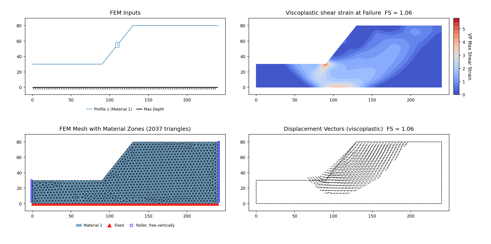

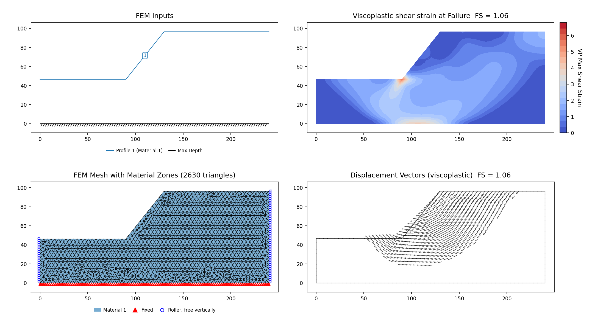

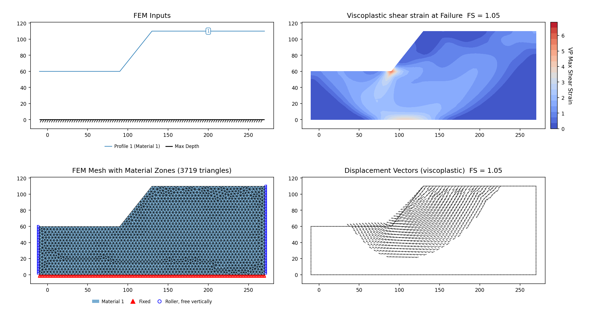

### RS2-48–55: Multi-tiered geotextile walls (Leshchinsky & Han 2004) {#rs2-48}

Slide2 counterparts: [VP87](rocscience.md#vp87)–VP94 (one-for-one, verified; only VP87 has a
detail section on the LEM page). Baseline SSRM built; parametric variants partial.

The SSRM enforces the geotextile tensile-capacity cap, so a strength-reduced wall fails through
the reinforced mass and the factor of safety responds to the reinforcement. On the baseline
three-tier wall it lands just below the published stability:

| Method | XSLOPE | Published |
|---|---|---|
| SSRM (baseline wall, vp087, Ta = 10 kN/m) | 0.956 (lock) | RS2 SSR **1.05** (Bishop 1.02 / Spencer 1.03 / GLE 1.03); L&H referee 0.99 (FDM) / 1.00 (Bishop); Slide2 Bishop 1.040 |

(RS2's own numbers are from Part 2 of its verification manual, problem 48, which imports this
Slide2 model; Slide2's fuller LEM table is on [VP87](rocscience.md#vp87).)

**The baseline locks at 0.956, under the vendor's own tensile caps.** The vendor model caps tensile
strength on every material, T = 0 on the reinforced granular fill included, and those caps are
carried into the XSLOPE model. The elastic
constants are the vendor model's as well — E = 50,000 kPa and ν = 0.4 on all three materials, read
from the `.fez` rather than estimated from soil type. A strength-reduction factor is invariant to E
but not to ν, so the vendor ν is the constant that sets it. The tensile caps also decide which
convergence criterion can bracket this wall. A pure non-convergence criterion cannot: it reads every
trial that fails to reach equilibrium as a collapse, and a T = 0 fill that settles into a stationary
state at elastic displacement scale looks exactly like one, so the bisection is handed a failure side
that does not exist and returns no factor of safety. The hybrid criterion — the default — keeps
non-convergence as the trigger but requires displacement evidence before calling a trial failed,
which separates the settled state from a real collapse and brackets the wall at 0.956.

The difference from the references is **unexplained**: 0.956 sits 9.0% below RS2's own SSR of 1.05
and 3–4% below L&H. Two modelling differences are known. RS2
initializes every element — the 0.3 m facing-block columns included — at an isotropic at-rest
stress state (`Kx = Kz = 1`), while XSLOPE has no initial-stress input and generates lateral stress
by elastic gravity turn-on, which leaves the thin facing columns at roughly a fifth of RS2's
confinement. On an almost purely frictional facing (c = 2.5 kPa, φ = 34°) that could decide
the mechanism: XSLOPE's strength reduction fails the top facing column locally, where RS2's
published shear-strain plot shows the global compound surface through the reinforced mass. It does
not account for the difference, though — initializing the model at RS2's own at-rest field
(K0 = 1) leaves the result where it was. (Holding the blocks elastic does give 1.119 with a global
fill mechanism, bracketing RS2's 1.05 from above, but an elastic facing cannot fail at all, a
stronger condition than any initial-stress state.) The second difference is RS2's slip interfaces
along each geotextile layer, which XSLOPE does not model; the geotextile is bonded to the soil
and pull-out is represented as a capacity limit instead.
The XSLOPE geometry also digitizes the geotextile ends from the block
front face rather than the back face; taken alone, moving them removes the incidental
facing/fill tie the current geometry provides and drops the row to 0.675. The LEM side of the same
wall does reproduce the references
([VP87](rocscience.md#vp87): Bishop 1.031 vs Slide2 1.040), so the difference is confined to the SSRM
side of the problem.

**Input files:** [vp087.xlsx](files/rocscience/vp087.xlsx) (baseline) through
[vp094.xlsx](files/rocscience/vp094.xlsx). Geotextile modelled as an FEM truss with the
vendor `.fez` stiffness EA = 6300 kN/m (cbeam1).

On the water variant (vp092 / [VP92](rocscience.md#vp87)), the reinforced granular fill is
modelled as free-draining (pore pressure on the foundation only), following L&H (2004) and
Slide2's own model, which this file is locked against. The RS2 vendor `.fez` instead applies
the piezometric-line pore pressure across the whole mesh, wetting the fill below the pond;
adopting that would drop the LEM Bishop factor to 0.885, well below Slide2's published 1.037,
so the drained-fill model is retained.

Across the seven parametric variants (vp088–vp094 — fill quality, reinforcement length/type,
foundation soil, water, surcharge, tier count), the SSRM converges on four, landing 0.76–1.10
and bracketing the published ≈1.0 (as RS2's own four-program spread, 0.86–1.04, does — the
lowest, vp091, is the c = 0/φ = 18° foundation case that fails in bearing, where L&H's FLAC
likewise drops to 0.86). Three do not reach equilibrium on this mesh — vp089 (short 4.2 m
reinforcement), vp090 (dual geotextile type) and vp093 (crest surcharge) drop to the
auto-bracket floor, a mesh/reinforcement-geometry convergence gap. With feature-aware mesh refinement near the reinforcement lines
(`refine_factor`), all three do reach equilibrium, but at refinement-sensitive rather than
mesh-converged factors — vp089 0.923 (factor 3) / 0.863 (factor 4), vp090 0.908 / 0.277,
vp093 0.824 / (no equilibrium at factor 4) — so none is lockable. The bond-slip load-transfer
model ([Bond-Slip Load Transfer](../fem/reinforcement.md#bond-slip-load-transfer-optional))
does not change this: on these wished-in-place walls the geotextile bars are not mobilized to
their pull-out capacity at the incipient failure state, so re-capping the pull-out envelope
leaves every one of those factors byte-identical.

The vendor `.fez` files for those three (`#050`/`#051`/`#054`) rule out the obvious modelling
differences. **Element type** — RS2 meshes these walls with
`lst_element` (the Linear Strain Triangle, the same 6-node quadratic triangle XSLOPE uses), so it is
not a tri3-vs-tri6 order gap. **Facing columns** — the vendor's `Blocks` material is ordinary
Mohr-Coulomb (c = 2.5, φ = 34) with `Apply_SSR` on, **not** a linear-elastic "can't-fail" zone; all
three materials are reduced, with no SSR exclusion or search area, so the facing is not holding the
mechanism up. **Tension cutoff** — the vendor carries a Rankine cutoff T = c on every material
(fill T = 0, foundation T = 10, blocks T = 2.5); applying it
faithfully (`tension_cutoff_by_material`) moves the factor the *wrong* way and does not steady it — on
vp089 (the representative straggler) it drops the SSRM from 0.919 to **0.694** at refine_factor 3, and
reads **0.781** at factor 4 (against the 0.863 no-cutoff baseline) — further *below* the published
≈ 1.0 and still refinement-dependent, so the tension model is not the reconciling ingredient (RS2
applies the same cutoff and still reads ≈ 1.0). What remains is a **shear localization through the
c = 0 reinforced granular fill**: a cohesionless mass has no intrinsic length scale, so the failing
band collapses onto the element size and the factor tracks the mesh rather than converging. The three
variants are therefore reported rather than locked: the controlling difference is that fill
localization, not the element order, the facing or the tension cutoff, and locking them would mean
tuning the mesh to the answer. Only the baseline carries a regression lock.

<!-- test: file=files/rocscience/vp087.xlsx, type=fem_ssrm, expected_fs=0.956, element_type=tri6, target_size=1.0, tolerance=0.02, f_min=0.9, f_max=1.3, max_iter=16000, tension_srf=false, benchmark=RS2-48 -->

### RS2-51: Four-material slope, water table, tension crack, seismic — 12-method comparison (Zhu et al. 2003) {#rs2-51}

**Input files:** [rs2_51.xlsx](files/rocscience/rs2_51.xlsx) — Part 4 Verification Problem #51.

> Zhu, D.Y., Lee, C.F. & Jiang, H.D. (2003). "A generalised framework of limit equilibrium
> methods for slope stability analysis." *Géotechnique* 53(4), 377–395. *(RS2/Slide2 Slope
> Stability Verification Manual, Part 4, Problem #51.)*

A four-layer 1V:2H slope (toe (0,0) → crest (60,30)) whose strata dip parallel to the face:
Layer 1 (top, c = 20, φ = 32°, γ = 18.2), Layer 2 (c = 25, φ = 30°, γ = 18.0), Layer 3 (the
weak band, c = 40, **φ = 18°**, γ = 18.5) and Layer 4 (bottom, c = 40, φ = 28°, γ = 18.8). Pore
pressure comes from a 9-point piezometric surface connected to every material; a horizontal
seismic coefficient **k = 0.1** is applied; and a **dry tension crack** of the Rankine active
depth *h*c = 2c/(γ√Ka) ≈ 3.97 m sits in the top layer. The published task
is the factor of safety on a **given circular surface** with 100 slices, tolerance 0.001, over
twelve LEM methods. This is an LEM problem; the RS2 SSRM value of 1.22 in the catalog is an
independent finite-element mechanism, not the LEM target reproduced here.

**Partial — reconstructed surface.** The vendor `.fez` is an RS2 SSRM model that carries **no LEM
slip surface**, and the given circle and tension-crack depth are figure-only (Figs 51.1–51.3, not
in the `.fez` or the manual text). The circle here — centre (32, 36), tangent at y = 1.0
(R = 35), daylighting from the lower face (x ≈ 13) to the back plateau (x ≈ 66) — was recovered
by inversion against the rigorous methods. Geometry, materials, the piezo line and k = 0.1 are
transcribed from `slope stability #051.fez` (k = 0.1 is the `.fea` body force bx = −0.1, which the
importer does not auto-apply). On this surface, at 100 slices:

| Method | XSLOPE | Slide2 | Zhu | Note |
|---|---|---|---|---|
| Ordinary (OMS) | 1.092 | 1.145 | 1.066 | lands inside the Slide2–Zhu spread |
| Bishop simplified | 1.316 | 1.278 | 1.278 | +3.0% |
| Janbu simplified | 1.196\* | 1.112 | 1.112 | \*XSLOPE reports Janbu **corrected** (f₀ ≈ 1.08); 1.196/1.08 ≈ **1.11** ✓ |
| Corps of Engineers | 1.400 | 1.422 | 1.377 | inside the Slide2–Zhu spread |
| Lowe & Karafiath | 1.244 | 1.288 | 1.290 | −3.4% |
| **Spencer** | **1.300** | **1.293** | **1.293** | **+0.5%** |
| GLE / Morgenstern–Price | 1.282 | 1.304 | 1.303 | −1.7% (half-sine interslice function) |

Spencer — the headline LEM value the RS2 manual's Table 51.2 quotes — reproduces to +0.5%, and
Janbu once the corrected-vs-simplified convention is undone matches to within 0.5%; OMS and Corps
both land between the Slide2 and Zhu columns. Bishop (+3.0%), Lowe (−3.4%) and M-P (−1.7%) carry
the residual of fitting a figure-only circle plus method-implementation differences (XSLOPE's M-P
uses a half-sine interslice function and lands just below Spencer, where Zhu's GLE lands just
above). An unconstrained circular search does **not** reproduce this problem — it dives into a
spurious deep mechanism daylighting on the flats through the φ = 18° weak band (Spencer ≈ 0.99),
so the verification is locked as a single fixed circle, not a search.

<!-- test: file=files/rocscience/rs2_51.xlsx, type=single_circle, num_slices=100, fs_oms=1.092, fs_bishop=1.316, fs_janbu=1.196, fs_corps=1.400, fs_lowe=1.244, fs_spencer=1.300, fs_mprice=1.282, benchmark=RS2-51 -->

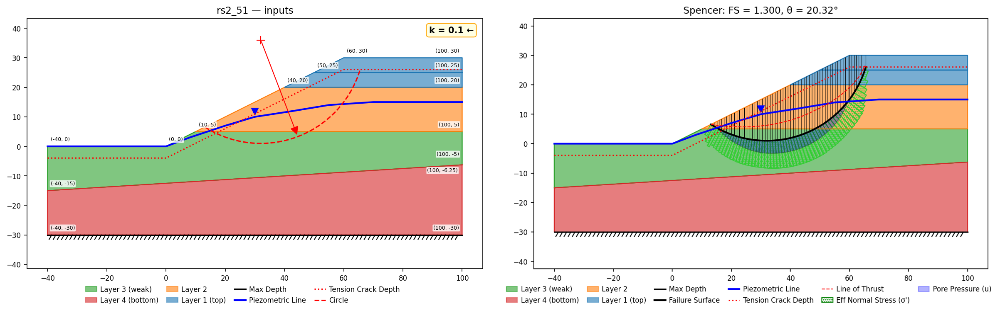

### RS2-56: Homogeneous slope vs Z-Soil, PLAXIS, GEO FEM (Pruska 2003, H = 7 m, 5 cases) {#rs2-56}

New corpus files (no Slide2 counterpart). Built: all five cases run.

**Input files:** [rs2_56a.xlsx](files/rocscience/rs2_56a.xlsx),
[rs2_56b.xlsx](files/rocscience/rs2_56b.xlsx)

| Method | XSLOPE | Published |
|---|---|---|
| SSRM (rs2_56a — case 2, weakest; lock) | 0.664 | RS2 SSRM 0.67 |
| SSRM (rs2_56b — case 5, strongest; lock) | 2.096 | RS2 SSRM 2.14 |

*All five cases land within ±3.3% of RS2's M-C and inside the four-program band (Z-Soil, PLAXIS, GEO FEM); the two locks bracket the family. Full case-by-case tables — including the Z-Soil / PLAXIS / GEO FEM / Slide2 columns — are in [the Pruska cross-bearing section](#pruska).*

<!-- test: file=files/rocscience/rs2_56a.xlsx, type=fem_ssrm, expected_fs=0.664, element_type=tri6, target_size=0.8, tolerance=0.02, f_min=0.32, f_max=1.12, max_iter=16000, tension_srf=false, benchmark=RS2-56a -->
<!-- test: file=files/rocscience/rs2_56b.xlsx, type=fem_ssrm, expected_fs=2.096, element_type=tri6, target_size=0.8, tolerance=0.02, f_min=1.79, f_max=2.59, max_iter=16000, tension_srf=false, benchmark=RS2-56b -->

**Case 2 — weakest of the five (rs2_56a)**

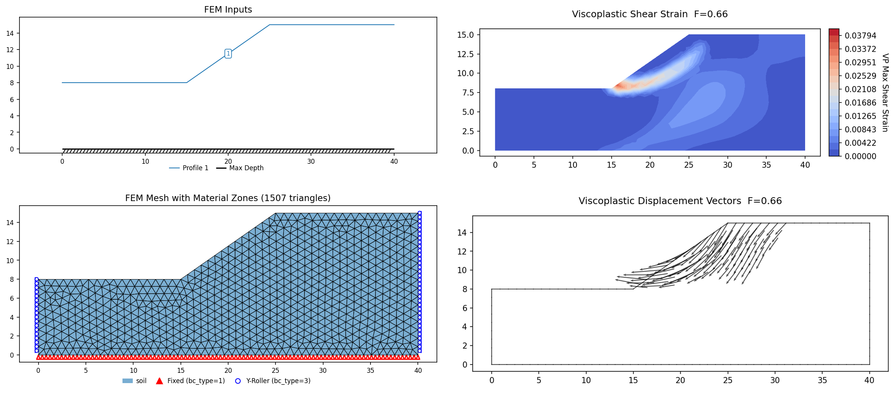

**Case 5 — strongest of the five (rs2_56b)**

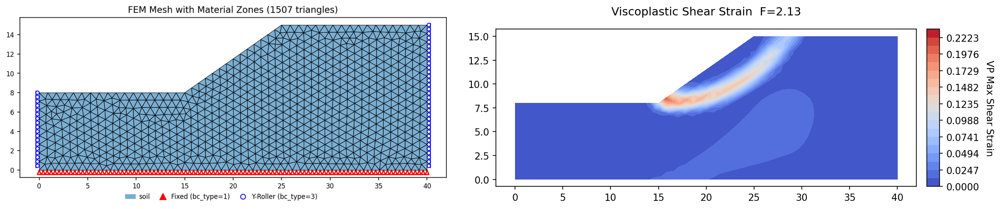

### RS2-57: Pruska H = 10.5 m, 6 cases {#rs2-57}

New corpus files. Built: all six cases run.

**Input files:** [rs2_57a.xlsx](files/rocscience/rs2_57a.xlsx),
[rs2_57b.xlsx](files/rocscience/rs2_57b.xlsx)

| Method | XSLOPE | Published |
|---|---|---|
| SSRM (rs2_57a — case 1, weakest; lock) | 0.440 | RS2 SSRM 0.44 |
| SSRM (rs2_57b — case 6, strongest; lock) | 1.389 | RS2 SSRM 1.42 |

*All six cases land within ±3.6% of RS2's M-C; the two locks bracket the family. Full case-by-case tables — including the Z-Soil / PLAXIS / GEO FEM / Slide2 columns — are in [the Pruska cross-bearing section](#pruska).*

<!-- test: file=files/rocscience/rs2_57a.xlsx, type=fem_ssrm, expected_fs=0.440, element_type=tri6, target_size=0.8, tolerance=0.02, f_min=0.1, f_max=0.89, max_iter=16000, tension_srf=false, benchmark=RS2-57a -->
<!-- test: file=files/rocscience/rs2_57b.xlsx, type=fem_ssrm, expected_fs=1.389, element_type=tri6, target_size=0.8, tolerance=0.02, f_min=1.07, f_max=1.87, max_iter=16000, tension_srf=false, benchmark=RS2-57b -->

**Case 1 — weakest of the six (rs2_57a)**

**Case 6 — strongest of the six (rs2_57b)**

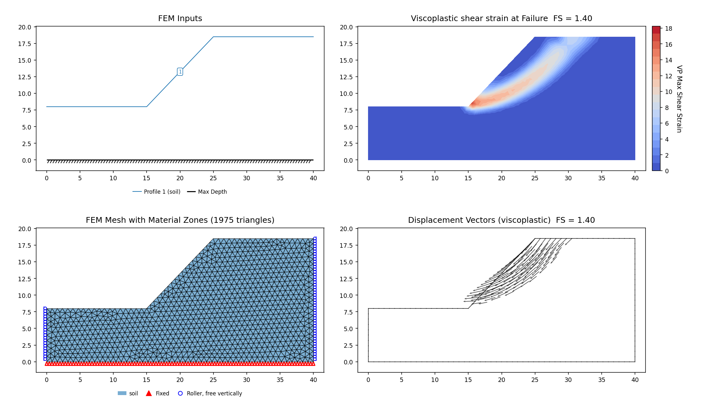

### RS2-58: Pruska H = 14 m, 6 cases {#rs2-58}

New corpus files. Built (5 of 6).

**Input files:** [rs2_58a.xlsx](files/rocscience/rs2_58a.xlsx),
[rs2_58b.xlsx](files/rocscience/rs2_58b.xlsx)

| Method | XSLOPE | Published |
|---|---|---|
| SSRM (rs2_58a — case 1, weakest; lock) | 0.328 | RS2 SSRM 0.33 |
| SSRM (rs2_58b — case 6, strongest; lock) | 1.029 | RS2 SSRM 1.06 |
| SSRM (case 5, c = 5, φ = 30; unlocked — mesh-dependent localization) | 0.667 | RS2 SSRM 0.72 |

*Four of the six land within ±3.6%; the two locks bracket the family. Case 5 reads 0.667 against a
tight published 0.72–0.75 cluster (RS2 0.72, Z-Soil 0.75, PLAXIS 0.74, GEO FEM 0.73, Slide2 0.73)
and stays unlocked — **it is a mesh-dependent shallow-skin localization, not a converged FS**: on
this tallest slope (H = 14 m) case 5 is the steepest, most cohesionless material (c = 5, φ = 30 on
the 54.5° face), and its critical mechanism is a surface-parallel band that **sharpens rather than
converges** with refinement — SSRM 0.672 → 0.634 → 0.616 at 0.8 / 0.5 / 0.35 m target sizes (the
c ≈ 0 skin pattern of [RS2-40](#rs2-40) / VP69). The identical material one slope
down (H = 10.5 m, 46.4° face) instead converges and agrees (0.944 vs RS2 0.96), so this is the
steep-face-plus-low-cohesion geometry localizing, not a setup error. Matching RS2's coarser-mesh
0.72 would mean coarsening the mesh to the answer, so the case is reported rather than locked. Full
case-by-case tables in [the Pruska cross-bearing section](#pruska).*

<!-- test: file=files/rocscience/rs2_58a.xlsx, type=fem_ssrm, expected_fs=0.328, element_type=tri6, target_size=0.8, tolerance=0.02, f_min=0.1, f_max=0.78, max_iter=16000, tension_srf=false, benchmark=RS2-58a -->
<!-- test: file=files/rocscience/rs2_58b.xlsx, type=fem_ssrm, expected_fs=1.029, element_type=tri6, target_size=0.8, tolerance=0.02, f_min=0.71, f_max=1.51, max_iter=16000, tension_srf=false, benchmark=RS2-58b -->

**Case 1 — weakest of the six (rs2_58a)**

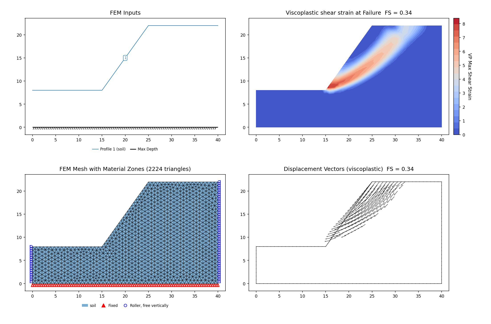

**Case 6 — strongest of the six (rs2_58b)**

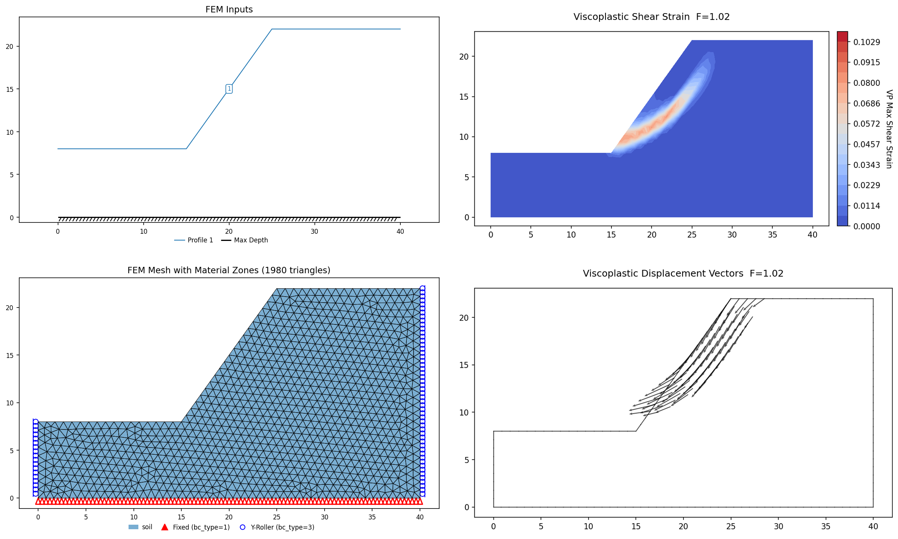

---

## The Pruska cross-bearing (#56–58) {#pruska}

Pruska (2003) analyzed three homogeneous slopes (H = 7, 10.5, and 14 m over an 8-m
foundation) with five or six material sets each in four SSRM programs. RS2 reproduces the
study; XSLOPE's SSRM joins it here as a fifth column — 16 of the 17 cases land within
±4% of RS2 and inside the four-program band. (The study's Drucker-Prager columns are not
comparable; XSLOPE, like Slide2, analyzes Mohr-Coulomb only. Elastic constants are the
paper's published E = 5,000 kPa and per-case ν, not the corpus's usual convention.)

**H = 7 m (#56):** cases (γ, c, φ) = (24,20,10), (18,5,10), (24,20,20), (18,5,20), (24,20,30)

| Case | XSLOPE | RS2 | Z-Soil | PLAXIS | GEO FEM | Slide2 LEM |
|---|---|---|---|---|---|---|
| 1 | 1.254 | 1.22 | 1.21 | 1.22 | 1.31 | 1.22 |
| 2 | 0.667 | 0.67 | 0.71 | 0.68 | 0.73 | 0.66 |
| 3 | 1.689 | 1.68 | 1.64 | 1.65 | 1.71 | 1.64 |
| 4 | 1.016 | 1.05 | 0.95 | 0.99 | 1.17 | 1.02 |
| 5 | 2.131 | 2.14 | 1.98 | 2.09 | 2.19 | 2.08 |

**H = 10.5 m (#57):** cases 1–6 = (18,5,10), (24,20,10), (18,5,20), (24,20,20), (18,5,30), (24,20,30)

| Case | XSLOPE | RS2 | Z-Soil | PLAXIS | GEO FEM | Slide2 LEM |
|---|---|---|---|---|---|---|
| 1 | 0.449 | 0.44 | 0.46 | 0.44 | 0.48 | 0.44 |
| 2 | 0.818 | 0.79 | 0.83 | 0.85 | 0.91 | 0.80 |
| 3 | 0.687 | 0.69 | 0.71 | 0.71 | 0.73 | 0.69 |
| 4 | 1.107 | 1.11 | 1.14 | 1.17 | 1.18 | 1.10 |
| 5 | 0.944 | 0.96 | 0.98 | 0.97 | 1.03 | 0.95 |
| 6 | 1.411 | 1.42 | 1.52 | 1.45 | 1.54 | 1.40 |

**H = 14 m (#58):** same six material cases as #57

| Case | XSLOPE | RS2 | Z-Soil | PLAXIS | GEO FEM | Slide2 LEM |
|---|---|---|---|---|---|---|
| 1 | 0.342 | 0.33 | 0.34 | 0.35 | 0.35 | 0.34 |
| 2 | 0.606 | 0.59 | 0.61 | 0.59 | 0.63 | 0.60 |
| 3 | 0.523 | 0.52 | 0.54 | 0.53 | 0.59 | 0.53 |
| 4 | 0.833 | 0.83 | 0.84 | 0.82 | 0.86 | 0.84 |
| 5 | 0.667 | 0.72 | 0.75 | 0.74 | 0.73 | 0.73 |
| 6 | 1.057 | 1.06 | 1.07 | 1.06 | 1.10 | 1.08 |

Case 5 of the H = 14 m slope is the one outlier (−7.4% against a tight published cluster; the same
materials at H = 10.5 m agree within 1.6%). On this tallest slope,
case 5 (c = 5, φ = 30) is steep enough (54.5° face) and cohesionless enough that the SSRM localizes
a **shallow surface-parallel band that sharpens with mesh refinement** rather than converging —
FS 0.672 → 0.634 → 0.616 at 0.8 / 0.5 / 0.35 m — the c ≈ 0-skin behaviour of [RS2-40](#rs2-40)/VP69.
The same material at the gentler H = 10.5 m face (46.4°) converges and agrees (0.944 vs RS2 0.96),
confirming it is the steep-face geometry, not the inputs. It is therefore reported and **excluded
from the regression locks as a mesh-dependent localization** (matching RS2's coarser 0.72 would mean
tuning the mesh to the answer). Each slope's locks bracket its family (the weakest and strongest case).

### RS2-59: Stability of a three-layered soil slope (Görög & Török 2007) {#rs2-59}

**Input files:** [rs2_59.xlsx](files/rocscience/rs2_59.xlsx)

The Budapest (Rózsadomb) landslide, after

> Görög, P. & Török, Á. (2007). *Slope stability assessment of weathered clay by using
> field data and computer modelling: a case study from Budapest.* Natural Hazards 45
> (as presented in the RS2 Slope Stability Verification Manual, Part III, Problem 59,
> "Stability of a Three-Layered Soil Slope", pp. 200–201).

A ~415 m wide × ~75 m tall real-coordinate hillslope in three layers: a YellowClay/Debris
cover (c = 50, φ = 15°, γ = 19), a thin weak **waste lens** (c = 1, φ = 5°, γ = 14) and a
strong GreyClay base (c = 250, φ = 30°, γ = 22). The waste lens is a wedge confined to the
left ~136 m — ~12.6 m thick at the toe face, tapering to zero at x = 136 — that daylights on
the toe. The critical mechanism is a **non-circular** translational slip riding the top of
the lens, which is what makes this an SSRM (not a circular-search) problem: an unconstrained
circular search misfinds the deeper competing surface (FS ≈ 1.9), whereas the SSRM localizes
the shear band through the c = 1 / φ = 5 lens on its own. Dry — no water table, tension crack,
seismic or loads. Elastic constants are the published Case-1 values (E = 50 000 kPa, ν = 0.4;
the vendor `.fez` reader does not parse E/ν); ψ = 0 (the Griffiths convention this corpus uses).

| Method | XSLOPE | Published |
|---|---|---|
| SSRM (3 m mesh) | 1.572 | RS2 SSRM 1.57 |

*Published cross-bearings: Slide2 1.567; PLAXIS 1.6.*

The published problem also runs a **Case 2** with varying moduli (GreyClay 20 000, YellowClay/
Debris 18 000, Waste 2 000 kPa) — RS2 SSRM 1.56 / Slide2 1.567 / PLAXIS 1.6. Since SSRM FS is
insensitive to the elastic constants (an E-only change), Case 2 is not a separate XSLOPE case.

XSLOPE's SSRM lands at **1.572**, effectively on the Slide2 1.567 / RS2 SSRM 1.57 cluster (+0.3% /
+0.1%) and just below PLAXIS 1.6. The value is **mesh-sensitive** through the tapering lens: coarse
meshes read ≈ **1.61** (1.6125 / 1.609 at 8 / 4 m target sizes, near PLAXIS) and drift down to
**1.572** at the 3 m mesh once the lens localizes (≈ 2 elements through its thinning thickness).
It is locked as a **regression** anchor at the 3 m mesh (a full solve on the ~415 m section),
landing on the LEM/RS2 cluster rather than advertised as converged, consistent with the mesh
discipline stated at the top of this page.

<!-- test: file=files/rocscience/rs2_59.xlsx, type=fem_ssrm, expected_fs=1.572, element_type=tri6, target_size=3.0, tolerance=0.02, f_min=1.3, f_max=1.9, max_iter=16000, tension_srf=true, benchmark=RS2-59 -->

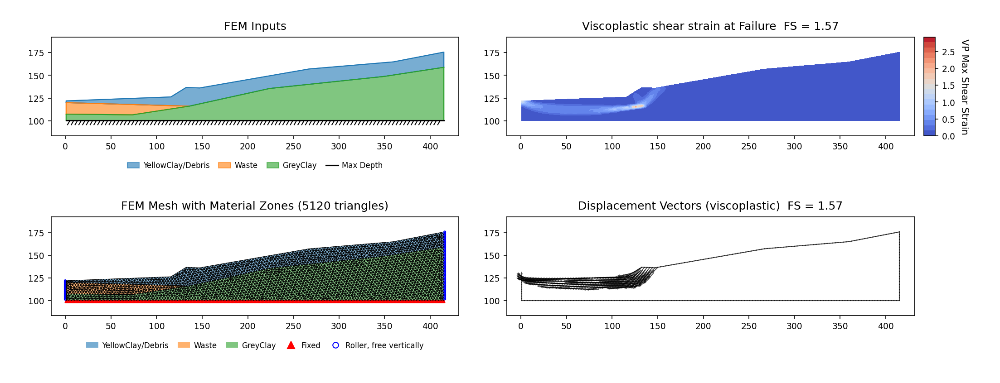

### RS2-60: Generalized Hoek-Brown, homogeneous slope (Li et al. 2008) {#rs2-60}

**Input files:** [rs2_60a.xlsx](files/rocscience/rs2_60a.xlsx) (β = 15°) ·
[rs2_60b.xlsx](files/rocscience/rs2_60b.xlsx) (β = 30°) ·
[rs2_60c.xlsx](files/rocscience/rs2_60c.xlsx) (β = 45°)

A homogeneous rock slope at three angles, after

> Li, A.J., Merifield, R.S., & Lyamin, A.V. (2008). "Stability charts for rock slopes based
> on the Hoek-Brown failure criterion." *International Journal of Rock Mechanics and Mining
> Sciences* 45(5), 689–700.

GSI = 70, $m_i$ = 15, $D$ = 0, γ = 23 kN/m³, ν = 0.3, $H$ = 1 m. This is the companion to the
[Hammah benchmark](#hoek-brown) at the opposite end of the criterion: GSI = 70 is a strong,
lightly-jointed rock mass ($a$ = 0.501, essentially the classical exponent), where Hammah's
GSI = 5 is a badly broken one ($a$ = 0.619).

**The problem is normalized, and that is the trap.** Li's charts work in the dimensionless
ratio σci/(γH), and every case here sits at a *critical* ratio — the value at which the slope
is on the verge of collapse, so F ≈ 1 by construction. With $H$ = 1 m, γH is just 23 kPa, and
a critical ratio below one puts σci in the **sub-kPa to few-kPa range**. Those magnitudes look
absurd for rock, and they are supposed to: a 1 m slope in 0.6 kPa rock is the same problem as
a 100 m slope in 60 kPa rock. Entering σci in MPa, as Hoek-Brown convention invites, overstates
the strength a thousandfold and the slope becomes trivially stable.

**Where σci comes from.** The manual never prints it, so each case takes σci straight from the
RS2 vendor model (the material's Generalized Hoek-Brown σci field in the `.fez`). That choice
matters because the vendor files and Li's Table 1 do not fully agree:

| case | β | σci (vendor `.fez`) | implied σci/(γH) | Li Table 1 ratio | agree? |
|---|---:|---:|---:|---:|:--:|
| a | 15° | 0.598 kPa | 0.026 | 0.026 | yes |
| b | 30° | 1.61 kPa | 0.070 | 0.075 | no |
| c | 45° | 4.37 kPa | 0.190 | 0.176 | no |

Only case a's published ratio reproduces the vendor σci. Using Li's ratios for b and c would
give 1.725 and 4.048 kPa instead of the vendor's 1.61 and 4.37. XSLOPE uses the **vendor**
values, so the reconstruction is faithful to the RS2 model that actually produced the
published results rather than to a chart the model does not match.

**Factors of safety:**

| case | Bishop | Spencer | Li (limit analysis) | Slide2 Spencer |
|---|---|---|---|---|
| a (β = 15°) | 1.009 | 1.009 | 1.0 | 1.011 |
| b (β = 30°) | 0.987 | 0.989 | 1.0 | 0.992 |
| c (β = 45°) | 1.030 | 1.035 | 1.0 | 1.035 |

*All three Spencer factors reproduce Slide2's own Spencer values almost exactly
(1.009 / 0.989 / 1.035 vs 1.011 / 0.992 / 1.035), confirming the Hoek-Brown implementation at
high GSI. Every case lands within 1–3.5% of unity, as a critical ratio should. SSRM is not
locked on this problem.*

**One more paper erratum, on case a.** Li's Table 1 labels its last block β = 10°, but the body
text and the charts say 15° (Fig. 5 is β = 15°; no β = 10° chart exists) — a typographical
error. RS2 read it as 15° too: its Slide2 value for case a (1.011) reproduces Li's own F for
that row.

<!-- test: file=files/rocscience/rs2_60a.xlsx, type=circular_search, method=spencer, expected_fs=1.009, num_slices=40, benchmark=RS2-60a -->
<!-- test: file=files/rocscience/rs2_60b.xlsx, type=circular_search, method=spencer, expected_fs=0.989, num_slices=40, benchmark=RS2-60b -->
<!-- test: file=files/rocscience/rs2_60c.xlsx, type=circular_search, method=spencer, expected_fs=1.035, num_slices=40, benchmark=RS2-60c -->

### RS2-61: Local and global minima, homogeneous slope (Cheng et al. 2007) {#rs2-61}

**Input files:** [rs2_61a.xlsx](files/rocscience/rs2_61a.xlsx) (one geometry; cases 1 & 3 locked
by circular LEM, case 2 locked by constrained SSRM, case 4 blocked)

A homogeneous benched slope, after

> Cheng, Y.M., Lansivaara, T., & Wei, W.B. (2007). "Two-dimensional slope stability analysis
> by limit equilibrium and strength reduction methods." *Computers and Geotechnics* 34, 137–150.

c = 5 kPa, φ = 30°, γ = 20 kN/m³. The problem exists to show how a search settles onto
*different* minima: case 1 is the unconstrained global minimum, while cases 2–4 fence an RS2
Polygon Search Area onto successive **local** minima. All four cases share the one geometry
([rs2_61a.xlsx](files/rocscience/rs2_61a.xlsx)); only the search region changes. Published:

| Case | Surface (RS2 fig.) | RS2 SSR | Cheng (ref) | Slide2 | XSLOPE Spencer (LEM) | XSLOPE SSRM (SSR-zone) |
|---|---|---|---|---|---|---|
| 1 | mid-lower face (global) | 1.35 | 1.327 | 1.336 | **1.338** (locked) | — |
| 2 | deep toe-to-crest (Fig. 4) | 1.36 | 1.375 | 1.385 | *blocked* (~1.47) | **1.398** (locked, +2.8 %) |
| 3 | upper face, crest→bench (Fig. 5) | 1.42 | 1.415 | 1.443 | **1.437** (locked) | — |
| 4 | shallow near-crest (Fig. 6) | 1.42 | 1.40 | 1.397 | *blocked* (~1.63) | ~1.50 (+5.5 %, blocked) |

**Case 1 (global).** Seeding the circular search with a toe-to-crest circle refines onto the
global minimum, a mid-lower-face circle (center ≈ 18, 24; daylighting x ≈ 19–27): Spencer 1.338
vs Slide2 1.336 (+0.1 %), Cheng 1.327, RS2 SSRM 1.35. *Cross-bearing: Bishop 1.342 (XSLOPE).*

**Case 3 (upper-face local minimum).** `circular_search` takes optional search-window limits
(`center_box` / `entry_range` / `exit_range` / `tangent_depth`) — the LEM analog of RS2's SSR
Polygon Search Area and Slide2's slip-centre / entry-and-exit limits. Confining the Spencer search
to the upper-face window read from **Fig. 5** — entry on the crest bench (x ≈ 42–54), exit at the
first bench (x ≈ 23–32), tangent bottoming at the bench elevation (y ≈ 16–22) — redirects it off the
global and onto the distinct upper-face local minimum: **Spencer 1.437** vs Slide2 1.443 (−0.4 %),
Cheng 1.415, RS2 1.42. The bounds come from the figure's mechanism, not from tuning to the number;
the same result holds across loosened variants of the window. (This is the "grid seed traps at
FS ≈ 1.44" family the paper illustrates, reached here by selecting the window rather than by accident.)

**Cases 2 and 4 — LEM route (blocked).** RS2's Case-2 (deep toe-to-crest) and
Case-4 (shallow near-crest) minima come from a *strength-reduction* search pinned by a polygon area;
they are **not local minima of the circular LEM problem** on this geometry. A Spencer search confined
to Fig. 4's toe-to-crest window pins against the window edge at FS ≈ 1.47 (the deep family drains
toward the global, with no interior minimum), and one confined to Fig. 6's near-crest window returns
FS ≈ 1.63 (a shallow c = 5 circle on the 32° upper face is genuinely stronger). Neither reproduces
the published Cheng/Slide2 columns, and forcing agreement would mean tuning the bounds to the answer,
so the LEM route to those columns is blocked.

**Cases 2 and 4 — FEM route, against RS2's SSR column.** `solve_ssrm`
accepts an `ssr_zone` polygon (RS2's "SSR Search Area"): strength reduction is applied only to
elements whose centroid lies inside the polygon, and everything outside is held at full strength.
The constraint polygon is **RS2's own**, read verbatim from the vendor model files — the
`SSR_polygonal_zones` block in the `.fez`/`.fea` (parsed by `benchmarks/rocscience/rs2_ssr_zones.py`
from the native `slope stability #061_02.fez` / `#061_04.fez`); RS2-61 carries no material partition,
so the polygon is the whole constraint. Confining the SSRM to Fig. 4's deep toe-to-crest zone reproduces Case 2: **SSRM 1.398
vs RS2 SSRM 1.36 (+2.8 %)** — inside the corpus's usual SSRM-vs-published band (cf. [RS2-63](#rs2-63)
+1.5 %) — locked at the 1.0 m tri6 mesh. Case 4's near-crest zone confines the mechanism to the
correct shallow surface but returns **SSRM ≈ 1.50 vs RS2 SSRM 1.42 (+5.5 %)**: the confined near-crest
mechanism in c = 5/φ = 30 is genuinely stiffer in XSLOPE's SSRM than in RS2's, a gap wider than the
±4 % band the corpus locks within, so Case 4 is reported rather than locked.

<!-- test: file=files/rocscience/rs2_61a.xlsx, type=circular_search, method=spencer, expected_fs=1.338, num_slices=40, benchmark=RS2-61a -->
<!-- test: file=files/rocscience/rs2_61a.xlsx, type=circular_search, method=spencer, expected_fs=1.437, num_slices=40, entry_range=42;54, exit_range=23;32, tangent_depth=16;22, benchmark=RS2-61-case3 -->
<!-- test: file=files/rocscience/rs2_61a.xlsx, type=fem_ssrm, expected_fs=1.398, element_type=tri6, target_size=1.0, tolerance=0.02, f_min=1.0, f_max=2.0, max_iter=16000, ssr_zone=8.516;12.255;8.686;6.779;21.55;8.975;28.407;13.412;31.455;18.522;32.3046;20.2236;28.228;21.032;26.57;17.894;22.043;13.995;8.516;12.255, tension_srf=true, benchmark=RS2-61-case2 -->

**Case 2 — deep toe-to-crest, constrained SSRM (rs2_61a)**

### RS2-62: Three-layered slope with a soft band (Cheng et al. 2007) {#rs2-62}

**Input files:** [rs2_62a.xlsx](files/rocscience/rs2_62a.xlsx) (Analysis I, 28 m) ·
[b](files/rocscience/rs2_62b.xlsx) (II, 20 m) · [c](files/rocscience/rs2_62c.xlsx) (III, 12 m)

A three-layer slope carrying a thin **soft band** (Soil 2: c = 0, φ = 25°) that dips through it
between a stronger cap (Soil 1: c = 20, φ = 35°) and base (Soil 3: c = 10, φ = 35°); γ = 19,
E = 14 MPa, ν = 0.3 throughout. From the same Cheng, Lansivaara & Wei (2007) paper as
[RS2-61](#rs2-61)/[63](#rs2-63). Three geometries narrow the band's daylight width (Analysis
I / II / III = 28 / 20 / 12 m domains), and each was run at two dilation angles — Case 1 (ψ = 0)
and Case 2 (ψ = φ, associated). **This is a hard, code-divergent benchmark by design**: for the
same ψ = 0 input, Plaxis and RS2 return ≈ 0.8–0.9 while Flac3D returns 1.03–1.64.

| Analysis | XSLOPE SSRM (ψ = 0) | RS2 SSR | Plaxis | Flac3D |
|---|---|---|---|---|
| I (28 m) | ≈ 1.0 (coarse mesh) | 0.88 | 0.86 | 1.64 |
| II (20 m) | ≈ 1.0 (coarse mesh) | 0.89 | 0.85 | 1.30 |
| III (12 m) | **0.781** | 0.81 | 0.82 | 1.03 |

*Case 2 (ψ = φ) reference values — RS2 0.98 / 0.98 / 0.93, Plaxis 0.97 / 0.97 / 0.94, Flac3D
1.61 / 1.28 / 1.03 — are not reproducible here: XSLOPE's SSRM is non-associated only (ψ = 0,
the Griffiths convention), so the associated-flow column is out of scope by construction.*

Two things control this problem, and only one of them is physical.

**Band thickness (≈ 0.4 m) sets the mechanism.** The SSRM reproduces the Plaxis/RS2 ψ = 0
cluster only when the mesh resolves the soft band, so feature-aware refinement
(`refine_factor=3, refine_features=thin_zones`) drives ≥ 3 elements across it. Below that the
band is invisible to the solver and the slope reads as far too stable — a uniform 0.5 m mesh
gives 0.998, and `refine_factor=2` (2 elements across the band) gives 1.18. Analyses I and II
show the same under-resolution (≈ 1.0), and band-only refinement does not fix them because
their wider-domain mechanism runs through the far field, so only the compact Analysis III
geometry is locked; it is the representative case for the family.

**The far-field mesh size sets the numerics.** The viscoplastic
pseudo-time step is bounded by a stability limit that tightens as sin²φ grows, and SSRM raises
the *reduced* friction angle atan(tan φ / F) without bound as F falls — 35° becomes 60° at
F = 0.4 and 74° at F = 0.2. XSLOPE's timestep clamps to that limit at each trial's reduced
angle. Without the clamp, trials at low F oscillate indefinitely and a non-convergence
criterion scores them as collapse even though displacement never leaves its elastic value; because
this slope is unstable (FS < 1), bracketing it *requires* visiting those low-F trials, so such
phantom failures reach the answer and the factor of safety moves with the mesh for numerical
rather than physical reasons, scattering across 0.21 – 0.93.

**The decisive input on this problem is tensile strength.** The vendor `.fez` assigns each material
an explicit tensile cap (`t_cut` = 20 / 0 /
10 kPa, equal to its cohesion) and reduces it with the SRF (`tensilestrength_SRF: 1`). Without
those caps, Mohr-Coulomb gives the cap soil an implicit tensile strength of c/tan φ ≈ 28 kPa,
which holds the steep entry cut at the crest shut — and the FE then *genuinely* equilibrates far
past the vendors' answer (budget-independent states to F ≥ 1.3, displacements ~1.8× elastic at
F = 1). With the vendor caps carried into the model and reduced with the SRF, the band mechanism
mobilizes exactly as limit equilibrium predicts: F = 0.75 converges at 1.03× elastic in ~10k
iterations, F = 0.80 runs away (1.7× elastic, growing to 10.7× by F = 1.0), and the bisection
returns **0.781** — 0.4% from XSLOPE's own Spencer on the same mechanism (0.784), 3.6% conservative
of RS2 (0.81) and 4.8% of Plaxis (0.82).

Three cross-checks anchor the number. The geometry and strengths match the vendor model
vertex-for-vertex; XSLOPE's Spencer on the toe-exit band surface independently gives
0.784; and the compiled and reference SSRM kernels agree on this configuration, because failure
here is decided by displacement runaway with a wide margin rather than by a marginal convergence
verdict — the two kernels differ by 0.58 on a configuration that sits on that knife-edge.

The mesh requirements stand: the ≈ 0.4 m band must be resolved (`refine_factor=3,
refine_features=thin_zones`; an unresolved band reads ≈ 1.0), and the far field is bounded by
the global size ceiling. Analyses I and II remain unlocked — band-only refinement does not
capture their wider-domain mechanism.

<!-- test: file=files/rocscience/rs2_62c.xlsx, type=fem_ssrm, expected_fs=0.781, element_type=tri6, target_size=0.45, tolerance=0.02, f_min=0.5, f_max=1.3, max_iter=40000, refine_factor=3, refine_features=thin_zones, tension_srf=true, benchmark=RS2-62c -->

**Analysis III — 12 m domain, ψ = 0 (rs2_62c)**

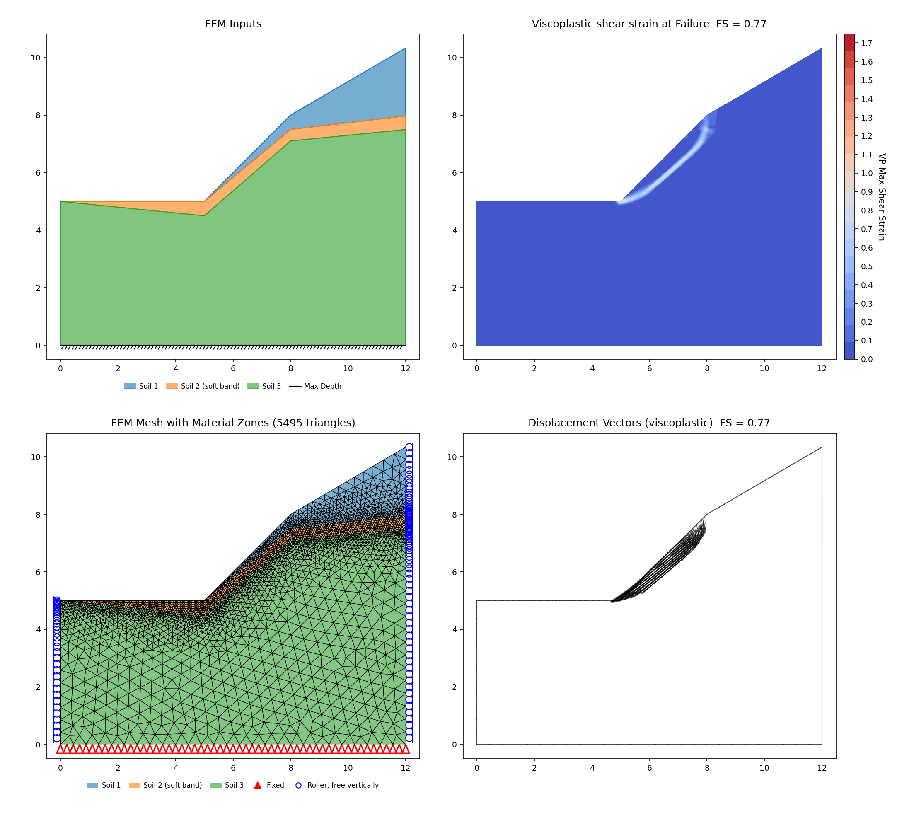

### RS2-63: Slope stability assessment of a homogeneous slope (Cheng et al. 2007) {#rs2-63}

**Input files:** [rs2_63.xlsx](files/rocscience/rs2_63.xlsx)

An 11 m homogeneous slope, from the same Cheng, Lansivaara & Wei (2007) paper as
[RS2-61](#rs2-61). c = 10 kPa, φ = 30°, γ = 20 kN/m³ — a single, well-defined mechanism, so
LEM and SSRM agree:

| Method | XSLOPE | Published |
|---|---|---|
| Spencer | 1.398 | Slide2 1.380 |
| SSRM | 1.409 | RS2 SSRM 1.38 |

*Cross-bearings: Bishop 1.401 (XSLOPE); Cheng et al. limit-equilibrium 1.383.*

Both XSLOPE values run ~1.5% above the published cluster (LEM 1.398 and SSRM 1.409 against a
1.38–1.383 reference band) — a consistent, small offset rather than a method disagreement.

<!-- test: file=files/rocscience/rs2_63.xlsx, type=circular_search, method=spencer, expected_fs=1.398, num_slices=40, benchmark=RS2-63-lem -->
<!-- test: file=files/rocscience/rs2_63.xlsx, type=fem_ssrm, expected_fs=1.409, element_type=tri6, target_size=1.0, tolerance=0.02, f_min=0.8, f_max=2.0, max_iter=16000, tension_srf=true, benchmark=RS2-63 -->

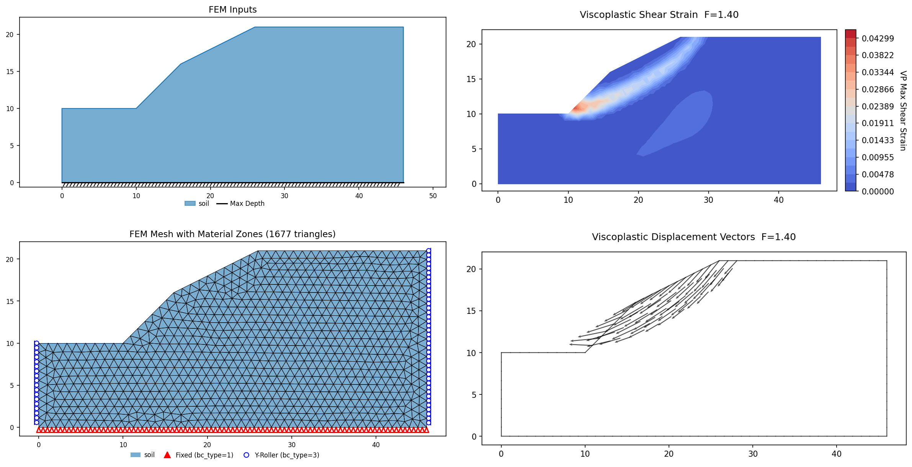

### RS2-64: Slope stability assessment of three homogeneous landslides (Teoman et al. 2004) {#rs2-64}

**Input files:** [rs2_64a.xlsx](files/rocscience/rs2_64a.xlsx) (C1, ST orig, *locked*) ·
[c](files/rocscience/rs2_64c.xlsx) (C3, *locked*) · [e](files/rocscience/rs2_64e.xlsx) (C5, *locked*) ·
[b](files/rocscience/rs2_64b.xlsx) (C2, ST failed, *locked SSRM vs Bishop*) ·
[d](files/rocscience/rs2_64d.xlsx) (C4, ST failed, *locked SSRM vs Bishop*) ·
[g](files/rocscience/rs2_64g.xlsx) (C7, LT orig, *locked SSRM*) · [k](files/rocscience/rs2_64k.xlsx)
(C11, LT orig, *locked SSRM*) · f (C6, ST failed), h/i/j/l (long-term) — built, measured head-to-head, blocked ·
[h_split](files/rocscience/rs2_64h_split.xlsx) / [l_split](files/rocscience/rs2_64l_split.xlsx)
(C8/C12 rebuilt as the vendor material partition for the `elastic_materials` run option).

Three road-cut landslides in Ankara clay along the E90 highway, after

> Teoman, M.B., Topal, T. & Isik, N.S. (2004). "Assessment of slope stability in Ankara clay: a case
> study along E90 highway." *(RS2 Slope Stability Verification Manual, Part III, Problem 64, pp. 219–227.)*

Each of the three slopes is modelled in its **Original** (pre-slide) and **Failed** (post-slide, with a
scarp) profile, under a **short-term** (total-stress, dry) and a **long-term** (fully saturated + a 0.03 g
horizontal pseudo-static coefficient) scenario — **12 single-material Mohr-Coulomb cases** in all. Strengths
are Tables 1–2 (read straight from the vendor `.fez`); elastic constants are the corpus convention
(E = 14 000 kPa, ν = 0.3, ψ = 0). The manual reports three FS columns: RS2 SSRM, the Teoman reference (Bishop),
and Slide2 Bishop.

The decisive detail is **how RS2 obtained its SSR column**: *"The RS2 SSR Search Area option was used to
obtain the factor of safety for each of the proposed slip surfaces."* RS2 pinned each strength-reduction run
to a narrow band hugging a digitized *proposed* slip surface (manual Fig. 4). Reading the native `.fez`
directly, that band is present **two ways at once**: (1) an explicit `SSR_polygonal_zones` **Search-Area
polygon**, and (2) a **material partition** — the Mohr-Coulomb material (`rock1`) is placed only in a
corridor along the proposed surface (≈ 10–25 % of the elements), while the rest of the domain is a second
material (`rock2`) with *"Plasticity Specifications: None"* — linear-elastic, so it **cannot yield** under
any strength-reduction factor. The two regions nearly coincide; both confine the mechanism to the corridor.

XSLOPE reproduces this with `solve_ssrm`'s `ssr_zone`, using **RS2's own Search-Area polygon read verbatim**
from each `.fez` (`benchmarks/rocscience/rs2_ssr_zones.py`; the per-element material corridor, recovered from
the same file, gives an equivalent constraint — spot-checked to within 0.8 % on C2). One honest
approximation remains: `ssr_zone` holds the outside-corridor elements at **full Mohr-Coulomb strength**,
whereas the vendor makes them **elastic**. Full-strength material can still yield where the stress is high
enough; elastic material never can. Where the base slope is stable at full strength this is immaterial and
the confinement reproduces RS2's mechanism; where the base slope is **sub-unity** (unconstrained FS < 1), a
failing skin *outside* the corridor cannot be suppressed by holding it at full strength, and the constrained
solve reports the slope unstable (FS < 0.1). The two sub-unity cases (C8, C12) are therefore rebuilt as the
explicit **material partition** RS2 uses: `solve_ssrm`'s `elastic_materials` run option (RS2's "Plasticity
Specifications: None") makes the outside-corridor material genuinely linear-elastic — it cannot yield under
any strength-reduction factor. The corridor is the vendor's per-element `rock1` footprint, read verbatim from
the `.fez` (`benchmarks/rocscience/rs2_ssr_zones.read_mc_footprint`) and hard-coded into `rs2_64h_split.xlsx`
/ `rs2_64l_split.xlsx`; the elastic outer zone is the domain minus that corridor, an identical-strength
material named at solve time. This is orthogonal to `ssr_zone` (full strength but still yields); the vendor's
material partition alone confines the mechanism, so no SSR polygon is composed.

The three **short-term Original** slopes have simple convex profiles whose unconstrained global minimum
coincides with the pinned surface, so they lock **unconstrained** against RS2's SSR column; the two smooth
**long-term Original** slopes (C7, C11) lock **constrained** — SSRM inside each case's `SSR_polygonal_zones`
polygon, read verbatim from its vendor `.fez` (`#064_02`…`#064_12`, matched to each `.xlsx` by content:
strengths and domain width, not filename order) — also against RS2's SSRM. The scarped **short-term Failed**
slopes C2 and C4 lock **constrained against the Bishop reference** (Teoman / Slide2) rather than RS2's SSRM
(explained below). All twelve cases, measured head-to-head:

| Case | Geometry | XSLOPE SSRM | RS2 SSR | Ref* / Slide2 | Lock verifies vs | Δ | Status |
|---|---|---|---|---|---|---|---|
| C1 | Slope 1 ST Original | **5.201** | 5.14 | 5.25 / 5.24 | RS2 SSRM | +1.2% | *locked* |
| C3 | Slope 2 ST Original | **4.807** | 4.69 | 4.87 / 4.89 | RS2 SSRM | +2.5% | *locked* |
| C5 | Slope 3 ST Original | **5.647** | 5.47 | 5.44 / 5.45 | RS2 SSRM | +3.2% | *locked* |
| C7 | Slope 1 LT Original | **1.674** | 1.70 | 1.79 / 1.68 | RS2 SSRM (& Slide2 1.68) | −1.5% | *locked* |
| C11 | Slope 3 LT Original | **1.403** | 1.46 | 1.51 / 1.51 | RS2 SSRM | −3.9% | *locked* |
| C2 | Slope 1 ST Failed | **6.584** | 6.10 | 6.67 / 6.64 | **Bishop** (Teoman/Slide2) | −1.3% / −0.8% | *locked* |
| C4 | Slope 2 ST Failed | **5.320** | 4.95 | 5.32 / 5.32 | **Bishop** (Teoman/Slide2) | 0.0% | *locked* |
| C6 | Slope 3 ST Failed | 7.836 | 6.97 | 7.02 / 6.96 | — (overshoots all) | +11.6% / +12.6% | blocked |
| C9 | Slope 2 LT Original | 1.372 | 1.30 | 1.30 / 1.30 | — | +5.5% | blocked |
| C10 | Slope 2 LT Failed | 1.041 | 1.09 | 1.08 / 1.07 | — | −4.5% | blocked |
| C8 | Slope 1 LT Failed | 0.883 (elastic split) | 0.99 | 1.13 / 1.09 | — | −10.8% | blocked |
| C12 | Slope 3 LT Failed | *no equilibrium* (elastic split) | 1.22 | 1.13 / 1.15 | — | — | blocked |

*\*Ref = Teoman et al. (SLOPE/W v.4 Bishop); Slide2 = Slide2 5.0 Bishop. Δ is vs the column named under
"Lock verifies vs"; the C2/C4 rows show vs Teoman / Slide2.*

**The five Original locks** (C1/C3/C5 unconstrained, C7/C11 constrained) sit +1–3 % / −1.5…−3.9 % from RS2's
SSRM, inside the ±4 % band the corpus locks within; the +1–3 % offset matches the usual SSRM-vs-published gap
(cf. [RS2-63](#rs2-63), +1.5 %) and shrinks under refinement. They are locked at the 1.0 m tri6 mesh.

**C2 and C4 lock against the Bishop reference, not RS2's SSRM.** On these two
scarped short-term Failed geometries RS2's *own* SSR column sits **8–9 % below its own Bishop columns**
(C2 6.10 vs 6.67 / 6.64, −8.5 %; C4 4.95 vs 5.32 / 5.32, −7.0 %), whereas on the Originals RS2's SSRM and Bishop
agree. XSLOPE's constrained SSRM lands **on the Bishop reference** for C2 (6.584 vs Teoman 6.67 / Slide2 6.64,
−1.3 % / −0.8 %) and C4 (5.320 vs 5.32 / 5.32, exactly on) — triangulating Teoman + Slide2 + XSLOPE against
each other — so both are locked to that better-supported column.

**The vendor's tensile-strength caps are part of the RS2-vs-Bishop gap.** Both locks above are solved with
the tensile caps the vendor models carry. Run without them the same two cases read 6.701 and 5.398, so the
caps move both **downward** — away from the Bishop columns and *toward* RS2's own SSRM (6.10 / 4.95).
Capping tensile strength is therefore one of the mechanisms separating RS2's
SSRM from its Bishop columns: a strength-reduction analysis feels the cap, a Bishop analysis on a pinned
circular surface essentially does not. It does **not** account for the whole gap — the caps close roughly a
sixth of C2's 8.5 % and a tenth of C4's 7.0 % — and the residual divergence is **unexplained**. It is not a
truncated strength-reduction sweep: the SRF control block of each vendor `.fea`
(`#064_02` / `#064_04` / `#064_06`) reads `auto_SRF = ON` with `initial_SRF = 1`, `final_SRF = 2`,
`change_in_SRF = 0.2`, `delta_FS = 0.01`, `tolerance_SRF = 0.001` — but RS2's reported short-term SSRM values
(5.14 … 6.97) all lie far **above** `final_SRF = 2`, so the automatic search is *not* capped by that field (it
is a vestigial default). Nothing further in the files evidences a cause.

**C6 does not triangulate and stays blocked.** Unlike C2/C4, RS2's SSRM for C6 *agrees* with its own Bishop
(6.97 vs 7.02 / 6.96); it is XSLOPE's constrained SSRM 7.836 that overshoots **every** column — RS2 +12.4 %,
Teoman +11.6 %, Slide2 +12.6 %. C6 is the narrowest scarped geometry (its `#064_06` corridor is ≈ 8 m wide
against ≈ 15 m for C4, at identical strengths); the tight corridor forces a stiffer mechanism than any
published surface, so C6 is reported, not locked.

**Refinement (C9 / C10 / C8), one mesh step 1.0 → 0.5 m.** Halving the family target size pushes every
localizing mechanism **down** (as at [RS2-65](#rs2-65)); none lands in band: C9 1.372 → **1.219** (brackets
RS2 1.30 but neither mesh is within ±4 %), C10 1.041 → **1.013** (−7.0 % vs RS2 1.09, further away), C8
0.883 → **≈ 0.86** (further below RS2 0.99). For C8 the exact vendor material corridor — all 89
element-boundary vertices, no Douglas-Peucker simplification — **cannot
be meshed as a conforming two-material partition**: differencing the raw element-staircase footprint from
the domain leaves a ≈ 1×10⁻⁵ m²
sliver overlap that fails the tiling check, so the Douglas-Peucker-simplified corridor is the finest
meshable representation of it. C8's **pore pressures agree with the vendor's
solved nodal field**: xslope's piezometric-line pressures reproduce RS2's per-node `u` to within 0.1 % (mean
ratio 1.0002 over 271 corridor nodes), so the C8 gap is a mechanism/mesh effect, not a water error. All five
non-locking cases are reported rather than locked.

C12 does not bracket at all: the thin saturated Mohr-Coulomb corridor, confined by the surrounding elastic
material, reaches no equilibrium at any strength-reduction factor under the long-term pore pressure. A dry
check of the same partition brackets ≈ 1.4, consistent with RS2's wet 1.22 once water is added — the partition
geometry is sound; the constrained saturated corridor is where the viscoplastic solve stops short.

The seismic coefficient acts in the destabilizing direction: on C9 the 0.03 g pseudo-static coefficient
(RS2 `bx = +0.03`, downslope for these left-high slopes) lowers FS from 1.32 (k = 0) to 1.22 (k = +0.03) and
*raises* it to 1.42 at k = −0.03.

The `circular_search` search-window limits (used to lock [RS2-61](#rs2-61) Case 3) are the LEM route to the
manual's **Bishop** reference columns (Teoman / Slide2), the same surfaces RS2 pinned
its SSRM to. They narrow the gap but do not close it. Unconstrained circular Bishop already tracks Slide2 Bishop on
the smooth **short-term originals** (C1 5.18 / C3 4.77 / C5 5.55 vs Slide2 5.24 / 4.89 / 5.45, within ≈ 2 %),
and one failed case, C10, coincides outright (1.06 vs 1.07). Elsewhere the unconstrained search finds a
*lower* minimum than the pinned surface — for the scarped **failed** profiles a 2–3 m localized skin (C6 x =
1.8–3.6, C12 x = 2.4–3.7). Confining the search to the full crest-to-toe mechanism from the figures removes
those skins and recovers the intended surface, and a toe-daylighting `tangent_depth` keeps the smooth
long-term originals off the foundation, but the residual gap stays 3–13 % (e.g. C7 1.63 / C9 1.24 / C11 1.43
vs Slide2 1.68 / 1.30 / 1.51; C6 6.48 / C12 1.30 vs 6.96 / 1.15). That residual is XSLOPE's circular minimum
sitting genuinely below Teoman's digitized surface, and closing it would mean tuning the bounds to the
number, so the **circular-search LEM route to the Bishop (Teoman / Slide2) columns is blocked**.

A second route recovers Teoman's (unpublished) digitized slip surface
directly from the corridor and runs *that fixed surface* through LEM. The medial line between the corridor's
two long edges (`rs2_ssr_zones.corridor_centerline`, a simple PCA-split-and-average of the ring, no
medial-axis library) is taken as a non-circular surface. On the smooth **C7** original it is near-critical:
a rigorous non-circular LEM (Spencer — xslope's Bishop is circular-only) gives **1.776**, on Teoman's Bishop
1.79 (−0.8 %). On the scarped **C2** the same medial surface is *not* critical and over-estimates (Spencer
7.75 vs Bishop 6.67, +16 %), as any un-optimised hand-traced surface does. That route is **reported only, not
locked**: the centerline construction holds on a well-behaved case, but the raw medial line is
not a substitute for the digitized surface on the scarped geometries. The seven SSRM locks below — five
against RS2's SSRM (C1/C3/C5 unconstrained, C7/C11 SSR-zone) and two (C2/C4) against the Bishop reference —
are the head-to-head matches.

<!-- test: file=files/rocscience/rs2_64a.xlsx, type=fem_ssrm, expected_fs=5.201, element_type=tri6, target_size=1.0, tolerance=0.02, f_min=4.0, f_max=7.0, max_iter=16000, tension_srf=true, benchmark=RS2-64a -->
<!-- test: file=files/rocscience/rs2_64c.xlsx, type=fem_ssrm, expected_fs=4.807, element_type=tri6, target_size=1.0, tolerance=0.02, f_min=3.5, f_max=6.5, max_iter=16000, tension_srf=true, benchmark=RS2-64c -->
<!-- test: file=files/rocscience/rs2_64e.xlsx, type=fem_ssrm, expected_fs=5.647, element_type=tri6, target_size=1.0, tolerance=0.02, f_min=4.0, f_max=7.5, max_iter=16000, tension_srf=true, benchmark=RS2-64e -->
<!-- test: file=files/rocscience/rs2_64b.xlsx, type=fem_ssrm, expected_fs=6.584, element_type=tri6, target_size=1.0, tolerance=0.02, f_min=5.5, f_max=8.0, max_iter=16000, ssr_zone=8.586;8.21;5.834;6.959;6.985;3.006;10.538;-0.747;16.793;-1.748;22.947;-1.097;24.499;1.555;22.797;3.006;20.445;1.305;17.043;1.005;11.939;1.805;9.54718;4.7567;9.637;7.109, tension_srf=true, benchmark=RS2-64b -->
<!-- test: file=files/rocscience/rs2_64d.xlsx, type=fem_ssrm, expected_fs=5.320, element_type=tri6, target_size=1.0, tolerance=0.02, f_min=4.5, f_max=6.5, max_iter=16000, ssr_zone=4.467;6.136;3.297;3.758;6.455;0.717;11.056;-1.272;17.645;-1.272;18.737;0.795;17.489;1.691;15.345;0.561;10.003;1.418;5.949;4.031;4.467;6.136, tension_srf=true, benchmark=RS2-64d -->
<!-- test: file=files/rocscience/rs2_64g.xlsx, type=fem_ssrm, expected_fs=1.674, element_type=tri6, target_size=1.0, tolerance=0.02, f_min=1.0, f_max=2.5, max_iter=16000, ssr_zone=6.726;7.086;5.442;5.549;6.703;3.353;8.58;0.973;12.299;-1.186;15.538;-1.726;19.497;-1.846;22.991;0.615;19.668;1.926;17.788;0.352;12.322;1.445;9.131;3.675;6.726;7.086, tension_srf=true, benchmark=RS2-64g -->
<!-- test: file=files/rocscience/rs2_64k.xlsx, type=fem_ssrm, expected_fs=1.403, element_type=tri6, target_size=1.0, tolerance=0.02, f_min=0.9, f_max=2.2, max_iter=16000, ssr_zone=3.413;5.74;2.387;4.091;3.413;2.113;5.538;0.391;9.604;-1.404;12.242;-1.404;14.0932;-0.511713;14.0932;1.014;11.839;1.014;10.593;0.465;8.175;1.454;5.831;2.699;4.45466;4.16031;3.413;5.74, tension_srf=true, benchmark=RS2-64k -->

**Case 1 — Slope 1 short-term Original (rs2_64a)**

**Case 2 — Slope 1 short-term Failed (rs2_64b)**

**Case 4 — Slope 2 short-term Failed (rs2_64d)**

**Case 7 — Slope 1 long-term Original (rs2_64g)**

**Case 11 — Slope 3 long-term Original (rs2_64k)**

### RS2-65: Slope stability assessment of a tailings dam (Tzenkov 2008) {#rs2-65}

**Input files:** [rs2_65.xlsx](files/rocscience/rs2_65.xlsx)

The Padina tailings dam, after

> Tzenkov, A. (2008). *(as cited in the RS2 Slope Stability Verification Manual, Part III,
> Problem 65, "Slope Stability Assessment of a Tailings Dam", Table 1, pp. 230–231).*

A 225 m wide × 77 m tall cross-section of an **eight-material** tailings dam with a
**phreatic surface**. Twelve zones tile the domain with no gaps or overlaps (union area =
domain area = 13 262 m²): a Marl base, Marly-Clay and Alluvial-Clay bands, a Counterfill
body, the Tailings core (c = 0, φ = 34.8°) and the Rockfill/Fill embankment shells. Pore
pressure is applied from a single 14-point phreatic surface connected to every material
(static groundwater — the vendor `.fez` carries no FE seepage solution to read). Strength
parameters are Table 1 = the `.fez`; the elastic constants E, ν are Table 1 (the `.fez`
imports E = 0, so they must be supplied for the FE build); ψ = 0 (the Griffiths convention
this corpus uses).

| Method | XSLOPE | Published |
|---|---|---|
| SSRM (3 m mesh) | 1.331 | RS2 SSRM 1.29 |

*Published cross-bearings: Slide2 circular LEM 1.41; Slide2 non-circular LEM 1.33; reference
LEM 1.39; reference FEM 1.41.*

XSLOPE's SSRM lands at **1.331**, matching Slide2's non-circular LEM (1.33) exactly and sitting
inside the published 1.29–1.41 band. The value is **mesh-sensitive**: the tailings/embankment
shear band keeps localizing as the elements shrink, so FS drifts down with refinement —
**1.381 / 1.369 / 1.331** at target sizes 8 / 5 / 3 m. Coarse meshes read on the LEM/FEM/Slide2-
circular cluster (1.39–1.41); the 3 m lock has drifted onto the Slide2 non-circular value and
toward RS2's own SSRM (1.29), which is the low member of the published set. It is therefore
locked as a **regression** anchor at the 3 m mesh (a full solve on the 225 m section), not
advertised as converged, consistent with the mesh discipline stated at the top of this page.

<!-- test: file=files/rocscience/rs2_65.xlsx, type=fem_ssrm, expected_fs=1.331, element_type=tri6, target_size=3.0, tolerance=0.02, f_min=1.1, f_max=1.5, max_iter=16000, tension_srf=true, benchmark=RS2-65 -->

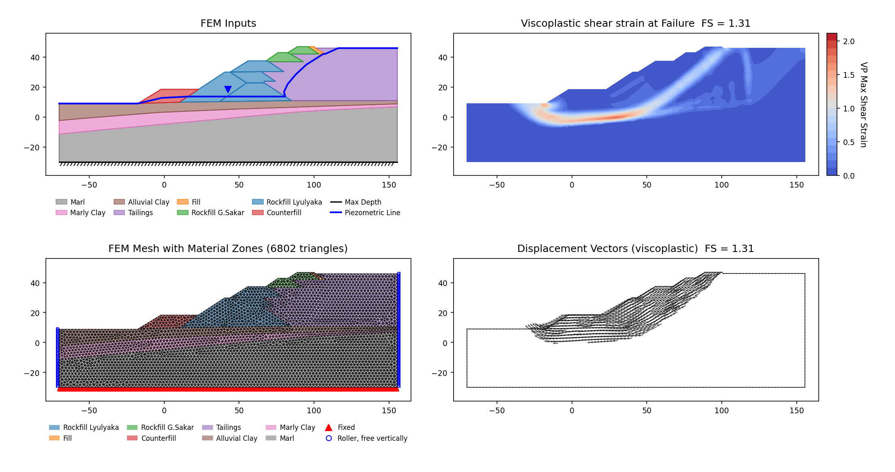

### RS2-66: Embankment basal stability (Nakamura et al. 2008) {#rs2-66}

**Input files:** [rs2_66a.xlsx](files/rocscience/rs2_66a.xlsx) (h₁ = 2 m) ·
[b](files/rocscience/rs2_66b.xlsx) (4 m) · [c](files/rocscience/rs2_66c.xlsx) (6 m) ·
[d](files/rocscience/rs2_66d.xlsx) (8 m) · [e](files/rocscience/rs2_66e.xlsx) (10 m)

A 10 m high embankment on soft ground, after

> Nakamura, A., Cai, F., & Ugai, K. (2008). "Embankment basal stability analysis using shear
> strength reduction finite element method." *(as cited in the RS2 Slope Stability Verification
> Manual, Part III, Problem 66).*

A cohesionless fill (c = 0, φ = 35°, 1.5:1 side slopes, 20 m crest, 10 m high) is placed on a
**soft** upper foundation stratum (φ = 0, c = 35 kPa) of thickness h₁ over a firm 10 m bearing
stratum (φ = 0, c = 100 kPa); γ = 18.82 kN/m³ throughout. The soft-layer thickness h₁ is the
varied parameter (2, 4, 6, 8, 10 m). The failure mechanism is a **basal squeeze** through the
soft φ = 0 band, so the factor of safety is governed by the band, not the fill.

| h₁ (m) | XSLOPE SSRM | Slide2 Spencer | RS2 SSR | Nakamura LEM | Nakamura FEM |
|---:|---|---|---|---|---|
| 2 | 1.081 | 1.05 | 1.13 | 1.21 | 1.24 |
| 4 | 1.069 | 1.16 | 1.19 | 1.22 | 1.16 |
| 6 | 1.056 | 1.10 | 1.13 | 1.22 | 1.16 |
| 8 | 1.044 | 1.13 | 1.08 | 1.10 | 1.10 |
| 10 | 1.056 | 1.05 | 1.05 | 1.08 | 1.08 |

XSLOPE's SSRM clusters at 1.04–1.08 across the family, running a few percent below the RS2 SSRM
and Slide2 Spencer references (best at h₁ = 10 m: 1.056 vs 1.05 / 1.05). Two effects sit under
the offset. First, **flow rule**: Nakamura and RS2 use an associated rule (ψ = φ), while XSLOPE's
SSRM runs non-associated (ψ = 0, the Griffiths convention this corpus uses) — the difference is
confined to the granular fill, since the governing φ = 0 clay is dilationless either way. Second,
**mesh**: the thin soft band is a φ = 0 shear band with no length scale to pin it, so it keeps
localizing as the elements shrink — the h₁ = 2 m case reads 1.081 at the tagged 3 m mesh but
1.006 at 1.5 m. The values are therefore locked as **regression** anchors at a common coarse
(3 m) mesh, not advertised as converged, consistent with the mesh discipline stated at the top
of this page.

<!-- test: file=files/rocscience/rs2_66a.xlsx, type=fem_ssrm, expected_fs=1.081, element_type=tri6, target_size=3.0, tolerance=0.02, f_min=0.8, f_max=1.6, max_iter=16000, tension_srf=true, benchmark=RS2-66a -->
<!-- test: file=files/rocscience/rs2_66b.xlsx, type=fem_ssrm, expected_fs=1.069, element_type=tri6, target_size=3.0, tolerance=0.02, f_min=0.8, f_max=1.6, max_iter=16000, tension_srf=true, benchmark=RS2-66b -->
<!-- test: file=files/rocscience/rs2_66c.xlsx, type=fem_ssrm, expected_fs=1.056, element_type=tri6, target_size=3.0, tolerance=0.02, f_min=0.8, f_max=1.6, max_iter=16000, tension_srf=true, benchmark=RS2-66c -->
<!-- test: file=files/rocscience/rs2_66d.xlsx, type=fem_ssrm, expected_fs=1.044, element_type=tri6, target_size=3.0, tolerance=0.02, f_min=0.8, f_max=1.6, max_iter=16000, tension_srf=true, benchmark=RS2-66d -->
<!-- test: file=files/rocscience/rs2_66e.xlsx, type=fem_ssrm, expected_fs=1.056, element_type=tri6, target_size=3.0, tolerance=0.02, f_min=0.8, f_max=1.6, max_iter=16000, tension_srf=true, benchmark=RS2-66e -->

**Thinnest soft band — h₁ = 2 m (rs2_66a)**

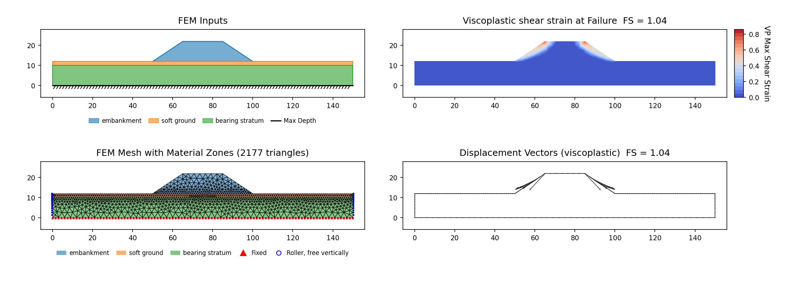

**Thickest soft band — h₁ = 10 m (rs2_66e)**

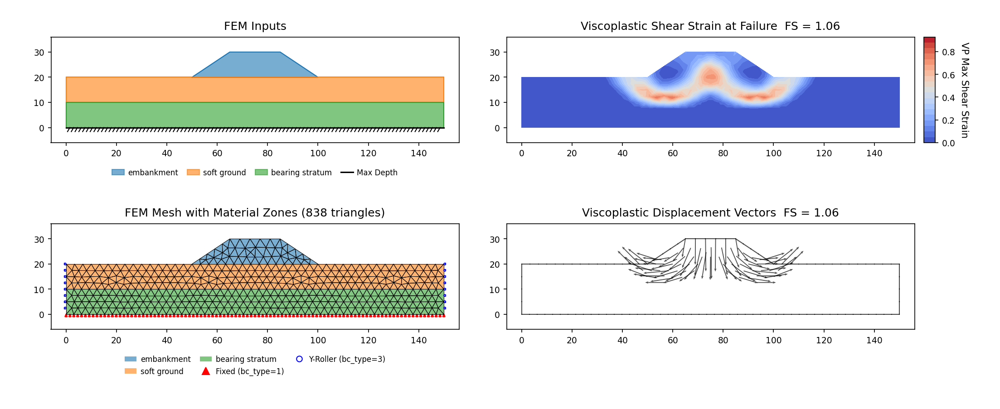

### RS2-67: Earth dam under steady & transient unsaturated seepage (Huang & Jia 2009) {#rs2-67}

**Input files:** [rs2_67a.xlsx](files/rocscience/rs2_67a.xlsx) (Case 1, dry) ·
[rs2_67b.xlsx](files/rocscience/rs2_67b.xlsx) (Case 2, steady — own-flow) ·
[rs2_67c.xlsx](files/rocscience/rs2_67c.xlsx) (Case 3, 90 h downstream) ·
[rs2_67d.xlsx](files/rocscience/rs2_67d.xlsx) (Case 3, 90 h upstream) ·
[rs2_67e.xlsx](files/rocscience/rs2_67e.xlsx) (Case 4, 1500 h downstream — own-flow) ·
[rs2_67f.xlsx](files/rocscience/rs2_67f.xlsx) (Case 4, 1500 h upstream — own-flow)

A homogeneous earth dam evaluated at successive seepage states, after

> Huang, M., & Jia, C-Q. (2009). "Strength reduction FEM in stability analysis of soil slopes
> subjected to transient unsaturated seepage." *Computers and Geotechnics* 36(1–2), 93–101.
> *(as cited in the RS2 Slope Stability Verification Manual, Part III, Problem 67).*

The dam is a single Mohr-Coulomb material (c = 13.8 kPa, φ = 37°, γ = 18.2 kN/m³, E = 10⁵ kPa,
ν = 0.3), ~28 m tall on a ~191 m base, with a ~1V:3H upstream face and a ~1V:2.4H downstream face
over toe berms at el 6.66 / 6.86. The manual runs six SSRM stages: **Case 1** dry; **Case 2** with
a steady downstream free surface; **Case 3** the downstream and upstream faces 90 h after a rapid
drawdown; **Case 4** the same faces at 1500 h. The two sub-analyses per drawdown time share one
snapshot pore-pressure field — they differ only in which face the SSR search targets (the upstream
run confines strength reduction to RS2's upstream Search Area, so the mechanism is the upstream
slope rather than the weaker downstream one).

**How the transient stages are built.** The 90 h drawdown snapshots take the fastest fidelity
route: RS2's *computed* `.fea` for each carries the **solved pore-pressure field as a per-node
block**, and that field is imported directly through XSLOPE's existing external-pore-pressure path
(`u='seep'` — an RS2 mesh + nodal-u pair written to the same `*_mesh.json` / `*_seep.csv` sidecar
format the FE-seepage problems use). The SSRM then runs on RS2's own mesh with RS2's own snapshot
pore pressures. **This isolates the SSRM-under-transient-pore-pressure mechanics; the transient
seepage *solution* is RS2's, imported.** XSLOPE's own uncoupled [transient-seepage solver](../seep/transient.md)
independently reproduces that 90 h field to <0.3 m on the upstream (drawdown-driven) face — see
*Own transient-flow cross-check* below — so the imported route isolates the mechanics rather than
standing in for the flow solver. The adapter (`benchmarks/rocscience/`
`rs2_transient_seep.py`) reorders the vendor tri6 connectivity to XSLOPE's node convention and
carries the nodal u across unchanged; interpolating the imported field back at vendor node
locations recovers the stored values to < 5×10⁻⁴ kPa. Each snapshot field is, to machine
precision, hydrostatic below a 14-point phreatic surface (nodal residual < 10⁻³ kPa), i.e. RS2
represents each transient state as a water-table position rather than a spatially complex field.

The stages whose computed `.fea` carries a recoverable field are imported directly: the **dry**
case (Case 1, u = 0 everywhere) and both **90 h** faces (Case 3). The **steady** (Case 2) and
**1500 h** (Case 4) computed files carry **no recoverable solved field** — neither a nodal
pore-pressure block nor a phreatic-line geometry (empty groundwater grid, zero material
piezometrics). Both are instead **reconstructed from the vendor groundwater BC block**, and both
turn out to be *steady* problems. Case 2, at full pool, retains the BC block in its `.fea`
(upstream reservoir total head 24.4 m, downstream tailwater 7.3 m, downstream seepage face), so
XSLOPE solves its own steady unconfined seepage and feeds the field through `u='seep'`. **Case 4 is
the decisive read of the vendor model:** its groundwater `.slw` (`#067_05` downstream / `#067_06`
upstream) is a *single steady groundwater stage* with every specified-head node drawn fully down to
the tailwater (total head 7.3) and `initial pore pressure: 0`. RS2 therefore represents the
"1500 h" stage not as a literal-time transient snapshot but as the **fully-drained steady state**
at the drawn-down pool — the long-time limit of the drawdown. XSLOPE reconstructs it exactly as
Case 2, with the pool lowered from 24.4 to 7.3: the steady field relaxes to a flat water table at
el 7.3 (hydrostatic pore pressure below it), independent of the conductivity magnitude. In both
cases the residual pool also enters as an external hydrostatic normal load on the submerged toe
faces (following the full-reservoir dam treatment of the Griffiths & Lane Ex. 6 build,
`benchmarks/build_ssrm.py`): without that face load the pressured upstream toe has no confining
water pressure and fails immediately.

**Own transient-flow cross-check.** XSLOPE's uncoupled transient solver is exercised directly on
this dam (`benchmarks/rocscience/make_rs2_67_fielddiff.py`): starting from the steady full pool
(el 24.4), the reservoir is stepped to the tailwater (el 7.3) at *t* = 0 and the dam drains with
RS2's own hydraulics (k = 1 × 10⁻⁷ m/s, m_v = 2 × 10⁻⁴). At 90 h the computed phreatic surface
overlays RS2's own imported 90 h field to a mean 0.02 m (max 0.28 m) on the upstream face — a
direct fidelity check of the transient *flow* solver against the vendor's solved field — parting
only in the thin crest/core (whole-section RMS 3.4 m). With RS2's slow conductivity the same march
is still far from drained at 1500 h (crest head ≈ 23 m of the 24.4 → 7.3 span), which is exactly
why RS2 renders Case 4 by the drained steady limit rather than the literal-time march.

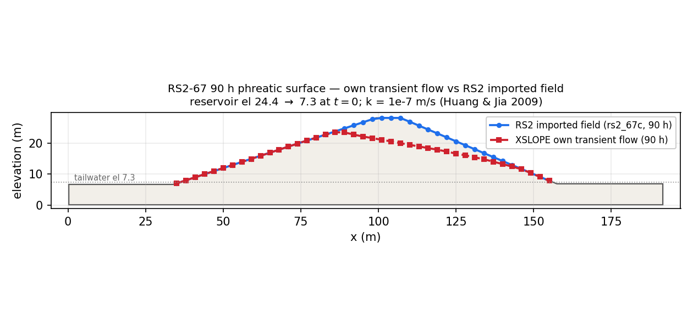

| Stage | XSLOPE SSRM | RS2 SSR | Slide2 (Bishop / Janbu / Spencer / GLE) | ref LEM / FEM | status |
|---|---|---|---|---|---|
| Case 1 — dry | **2.455** | 2.48 | 2.45 / 2.32 / 2.44 / 2.42 | 2.43 / 2.50 | **built** (−1.0%) |
| Case 2 — steady, downstream | **1.648** | 1.70 | 1.64 / 1.55 / 1.73 / 1.71 | 1.70 / 1.78 | **built** — own-flow regression lock (−3.1% vs RS2) |
| Case 3 — 90 h, downstream | **1.820** | 1.83 | 1.77 / 1.68 / 1.88 / 1.85 | 1.92 / 2.08 | **built** (−0.5%) |
| Case 3 — 90 h, upstream | **2.023** | 2.04 | 1.99 / 1.89 / 2.07 / 2.06 | 2.03 / — | **built** (−0.8%) |
| Case 4 — 1500 h, downstream | **2.258** | 2.34 | 2.22 / 2.09 / 2.35 / 2.31 | 2.38 / 2.42 | **built** — own-flow regression lock (−3.5% vs RS2) |
| Case 4 — 1500 h, upstream | **2.648** | 2.76 | 2.66 / 2.52 / 2.79 / 2.76 | 2.80 / — | **built** — own-flow regression lock (−4.1% vs RS2) |

The three built stages land within 1% of RS2's own SSR column. The dry case (2.455) confirms the
transcribed geometry against the whole reference cluster (Slide2/LEM/FEM 2.42–2.50). The 90 h
downstream run (1.820, unconstrained) and upstream run (2.023, confined to RS2's upstream Search
Area) reproduce RS2 SSRM 1.83 / 2.04 on RS2's imported drawdown field, closing the SSRM-mechanics
portion of the problem while the transient-flow portion stays with RS2.

Cases 2 and 4 are instead reconstructed from the vendor groundwater BC block as own steady-seepage
solves, and behave as one packet. Case 2 (full pool) gives SSRM 1.648, within the Slide2 LEM
method spread (Janbu 1.55 – Bishop 1.64 – GLE 1.71 – Spencer 1.73) but ~3% below the RS2 SSR
reference (1.70). Case 4 (drawn down to el 7.3) gives SSRM 2.258 downstream and 2.648 upstream,
each again inside the Slide2 method spread (2.09 – 2.35 and 2.52 – 2.79) but −3.5% / −4.1% below
RS2's 2.34 / 2.76. Because each exceeds the corpus vendor-match tolerance, all three own-flow rows carry
**regression locks at XSLOPE's own values** (1.648 / 2.258 / 2.648), with the differences against the
RS2 SSR column (−3.1% / −3.5% / −4.1%) reported rather than presented as vendor matches —
the same disposition as RS2-66a. The locks guard XSLOPE's own deterministic behavior; the offsets
are systematic and one-directional (conservative). The mechanics are not in question — the imported-field
Case-3 rows match RS2 to < 1%, and XSLOPE's transient-flow solver reproduces RS2's 90 h field to
<0.3 m on the upstream face. Nor is the unsaturated curve the cause: with RS2's built-in
permeability model (the "Simple" model, "General" soil type —
which Rocscience documents as an approximation for phreatic-surface location) reproduced as a
tabulated curve, the Case-2 head field is nearly SWCC-invariant (phreatic moves ≤ 0.07 m mean)
and every realistic curve moves FS *down* from the case's own baseline, never toward RS2's 1.70.
Case 4 is a zero-flow equilibrium at the drawn-down pool, so its field is conductivity-independent
outright.
The offsets are therefore structural — element formulation, flow rule, SSR criterion, and mesh
differences between the two FE implementations — consistent with the < 1% agreement whenever both
codes share the same pore-pressure field. FS rises monotonically as the dam drains, so the governing minimum across the drawdown
sequence is the steady full pool (Case 2); Cases 3 and 4 verify the safer rising states.

**A note on the downstream pool load.** These three cases are the only ones in the corpus that carry a
reservoir load on a *submerged downstream bench*, and the vendor file traces that pool line from the
far right boundary back toward the dam toe — right to left. That makes the traction direction matter
here in a way it does not elsewhere. Deriving the inward normal by rotating the load line's tangent
identifies the inside only for a line written left to right; across the whole verification corpus the
only load segments for which that rule points *outward* are the nine that make up this pool line in
the three cases, where it would apply the 4.32 kPa pool pressure as uplift on the bench rather than
as confinement. XSLOPE takes the direction from geometry instead:
a loaded boundary edge belongs to exactly one element, so the traction is pointed at that element's
centroid (interior edges, with two owners, use the tangent rule), and the same test is made against
the elements touching each loaded node in the lumped fallback path. Every other benchmark's load
lines are unaffected, as are this problem's own siblings (Case 1 dry, Case 3 both faces, which
carry no downstream pool load). With the pool pressing into the bench, the vendor's T = 0 tensile cap
changes Case 2's factor by nothing at all — the confined bench never goes into tension. The loader
also orients any right-to-left load line to increasing X as it is read, so the
limit-equilibrium path, which interpolates the load intensity on an assumed-ascending X array, is
insensitive to authoring order too.

<!-- test: file=files/rocscience/rs2_67a.xlsx, type=fem_ssrm, expected_fs=2.455, element_type=tri6, target_size=4.0, tolerance=0.02, f_min=1.5, f_max=3.0, max_iter=16000, tension_srf=true, benchmark=RS2-67a -->
<!-- test: file=files/rocscience/rs2_67c.xlsx, type=fem_ssrm, expected_fs=1.820, tolerance=0.02, f_min=1.0, f_max=3.0, max_iter=16000, tension_srf=true, benchmark=RS2-67c -->
<!-- test: file=files/rocscience/rs2_67d.xlsx, type=fem_ssrm, expected_fs=2.023, tolerance=0.02, f_min=1.0, f_max=3.0, max_iter=16000, ssr_zone=-6.95691;-29.8799;102.318;-29.8799;102.318;66.9821;-6.95691;66.9821, tension_srf=true, benchmark=RS2-67d -->
<!-- test: file=files/rocscience/rs2_67b.xlsx, type=fem_ssrm, expected_fs=1.648, tolerance=0.02, f_min=1.0, f_max=3.0, max_iter=16000, tension_srf=true, benchmark=RS2-67b -->
<!-- test: file=files/rocscience/rs2_67e.xlsx, type=fem_ssrm, expected_fs=2.258, tolerance=0.02, f_min=1.0, f_max=3.0, max_iter=16000, tension_srf=true, benchmark=RS2-67e -->
<!-- test: file=files/rocscience/rs2_67f.xlsx, type=fem_ssrm, expected_fs=2.648, tolerance=0.02, f_min=1.0, f_max=3.0, max_iter=16000, ssr_zone=-6.95691;-29.8799;102.318;-29.8799;102.318;66.9821;-6.95691;66.9821, tension_srf=true, benchmark=RS2-67f -->

### RS2-68: Stability of seismically loaded slopes (Loukidis et al. 2003) {#rs2-68}

**Input files:** [rs2_68a.xlsx](files/rocscience/rs2_68a.xlsx) (Case 1, ru = 0.5) ·
[b](files/rocscience/rs2_68b.xlsx) (Case 2, dry) · [c](files/rocscience/rs2_68c.xlsx) (Case 3, 3-layer)

The one problem on this page whose target is **not a factor of safety** but a
**critical seismic coefficient** k꜀, after

> Loukidis, D., Bandini, P., & Salgado, R. (2003). "Stability of seismically loaded slopes
> using limit analysis." *Géotechnique*, 53(5), 463–479. *(RS2 Slope Stability Verification
> Manual, Part III, Problem 68.)*

k꜀ is the horizontal pseudo-static coefficient at which the slope is **just stable** — the k
for which the searched minimum FS = 1. Three cases share a 25 m, 1V:3H homogeneous slope
(c = 25 kPa, φ = 30°, γ = 20 kN/m³) except where noted: **Case 1** adds a pore-pressure ratio
ru = 0.5; **Case 2** is dry; **Case 3** replaces the homogeneous body with three
dipping rock bands on a benched profile — an upper wedge (c = 4, φ = 30, γ = 17), a
weak-friction middle band (c = 25, **φ = 15**, γ = 19) that the mechanism rides, and a strong
base (c = 15, φ = 45, γ = 19).

This is one of the [limit-equilibrium rows](#rocscience-rs2-ssrm-corpus) on this page: the
harness searches the **LEM** minimum to FS = 1, so the comparison below is against the
manual's LEM columns (Bishop / Spencer / Slide2) and the reference limit-analysis bounds.
RS2's own SSRM k꜀ (0.125 / 0.413 / 0.161) is quoted as reference but is **not** reproduced
here — XSLOPE's SSRM is not exercised on this problem, unlike the SSR rows elsewhere on the
page. (A `back_analysis` sweep on `global:k_seismic` in `mode='fem'` would produce an SSRM
k꜀ directly.)

XSLOPE reproduces k꜀ with a `critical_kc` harness: FS falls monotonically as k rises, so k꜀ is
a single crossing. A circular search at the bracket midpoint fixes the near-critical circle;
k is then bisected on that fixed circle (fast single-circle solves) until FS = 1, and a
confirming full search at that k re-checks that the true minimum surface there is also FS ≈ 1
(adopting the migrated circle and re-bisecting if not). The pseudo-static direction is set
automatically from the (left-facing) slope.

| Case | Method | XSLOPE k꜀ | Slide2 | Reference |
|---|---|---|---|---|
| 1 (ru = 0.5) | Bishop | 0.127 | 0.118 | Bishop 0.127, FEM 0.132, UB 0.145 / LB 0.126 |
| 1 (ru = 0.5) | Spencer | 0.132 | 0.132 | Spencer 0.131, log-spiral 0.132, RS2 SSRM 0.125 |
| 2 (dry) | Bishop | 0.426 | 0.425 | Bishop 0.426, FEM 0.433, UB 0.454 / LB 0.423 |
| 2 (dry) | Spencer | 0.433 | 0.431 | Spencer 0.431, log-spiral 0.432, RS2 SSRM 0.413 |
| 3 (3-layer) | Bishop | 0.169 | 0.155 | RS2 SSRM 0.161, FEM 0.161, UB 0.172 / LB 0.148 |
| 3 (3-layer) | Spencer | 0.167 | 0.151 | UB 0.172 / LB 0.148, RS2 SSRM 0.161 |

The homogeneous cases land squarely on the reference: Case 1 Spencer (0.132) and Case 2 both
methods (0.426 / 0.433) match the Slide2 and reference LEM columns to ~0.001–0.002, and Case 1
Bishop (0.127) sits exactly on the reference Bishop (0.127) — it is Slide2's own Bishop
(0.118) that is the low outlier there. The homogeneous critical mechanism is a **deep,
large-radius** arc (for the gentle 1V:3H face the seismic surface reaches well below the toe),
consistent with the published failure-surface figures.

**Case 3 runs high** against the Slide2 LEM (0.169 / 0.167 vs 0.155 / 0.151, +9–10%). The
governing surface rides the thin φ = 15° band, which is intrinsically **non-circular**; a
circular search cannot follow the band as tightly as Slide2's rigorous non-circular surface,
so it settles on a slightly less critical mechanism and therefore a higher k꜀. The XSLOPE
values still fall inside the reference upper/lower-bound bracket [0.148, 0.172] and sit on
RS2's own SSRM and the reference FEM (0.161), so they are honest circular-search k꜀ — the gap
is the circular-vs-band limitation, not a solver error. These are **k꜀ locks (not FS)**,
recorded as regression anchors at the values XSLOPE's circular search actually returns.

<!-- test: file=files/rocscience/rs2_68a.xlsx, type=critical_kc, method=bishop, expected_kc=0.127, k_min=0.08, k_max=0.18, kc_tol=0.01, num_slices=40, benchmark=RS2-68a-bishop -->
<!-- test: file=files/rocscience/rs2_68a.xlsx, type=critical_kc, method=spencer, expected_kc=0.132, k_min=0.08, k_max=0.18, kc_tol=0.01, num_slices=40, benchmark=RS2-68a-spencer -->
<!-- test: file=files/rocscience/rs2_68b.xlsx, type=critical_kc, method=bishop, expected_kc=0.426, k_min=0.38, k_max=0.48, kc_tol=0.01, num_slices=40, benchmark=RS2-68b-bishop -->
<!-- test: file=files/rocscience/rs2_68b.xlsx, type=critical_kc, method=spencer, expected_kc=0.433, k_min=0.38, k_max=0.48, kc_tol=0.01, num_slices=40, benchmark=RS2-68b-spencer -->
<!-- test: file=files/rocscience/rs2_68c.xlsx, type=critical_kc, method=bishop, expected_kc=0.169, k_min=0.11, k_max=0.20, kc_tol=0.01, num_slices=40, benchmark=RS2-68c-bishop -->
<!-- test: file=files/rocscience/rs2_68c.xlsx, type=critical_kc, method=spencer, expected_kc=0.167, k_min=0.11, k_max=0.20, kc_tol=0.01, num_slices=40, benchmark=RS2-68c-spencer -->

**Case 2 — dry homogeneous slope (rs2_68b)**

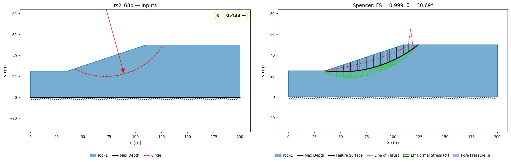

**Case 3 — three-layer, band-riding slope (rs2_68c)**

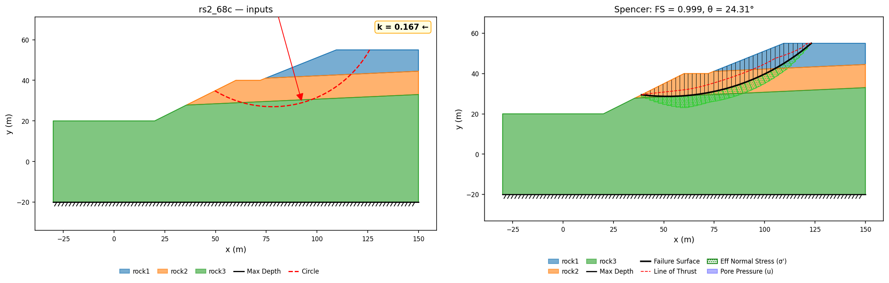

## Part IV SSRM builds on shared Slide2 geometry {#part-iv-ssrm}

RS2's Part IV catalog above re-verifies its Slide2 problems by shear-strength reduction. Where
a Part IV problem shares its geometry with a built Slide2/LEM lock, the same corpus file also
carries its **own** SSRM run against RS2's published SSRM, since an LEM lock does not stand in
for the SSRM comparison. These sections carry those SSRM builds on the shared files.

### RS2 Part IV VP2: Homogeneous slope with tension crack (ACADS 1b) {#p4-vp2}

Slide2/LEM counterpart: [VP2](rocscience.md#vp2) (Giam & Donald 1989, ACADS 1(b)). RS2 Part IV
re-runs this slope by shear-strength reduction (Table 2.2), so the shared file also carries a
real SSRM lock, not just the LEM cross-reference.

**Input files:** [vp002.xlsx](files/rocscience/vp002.xlsx)

A single-material slope: c' = 32 kPa, φ' = 10°, γ = 20 kN/m³. The LEM version
[VP2](rocscience.md#vp2) carries a water-filled tension crack (depth 2c/(γ√Ka), per Craig)
that trims the resisting soil. RS2's own SSRM does *not* leave the crack out: its vendor
`.fez` represents it physically, as a near-surface material zone (extending 3.87 m below and
parallel to the ground surface — within 0.06 m of the Craig crack depth this file's LEM
sibling uses) carrying a **tensile-strength cutoff T = 0**, over a deep substrate with
T = 32 kPa. XSLOPE's Mohr-Coulomb material has no per-material tensile-cutoff field, so its
SSRM runs a single material with no near-surface tension limit — the missing cutoff is the
most likely source of the small +2.4% high-side offset, since a real T = 0 crest zone opens
in tension more readily and would pull RS2's SRF down relative to a model without it. (Unlike
[RS2-29](#rs2-29), whose clay case has no crack construct at all, VP2's vendor model
does carry this explicit T = 0 zone.) XSLOPE's SSRM is compared to RS2's SSRM 1.63, not to the
crack-reduced LEM (Spencer ~1.59). ψ = 0 (the Griffiths convention this corpus uses); E and ν
are the file's inert FEM elastics (E = 1e5, ν = 0.3).

| Method | XSLOPE | Published |
|---|---|---|
| SSRM (1 m mesh) | 1.669 | RS2 SSRM 1.63 |

*Published cross-bearings: Giam & Donald reference 1.65; Slide2 Spencer 1.592.*

XSLOPE's SSRM lands at **1.669**, +2.4% above RS2's SSRM 1.63 and +1.2% above the Giam & Donald
reference 1.65 — a small, consistent positive offset, the same sign and size as
[RS2-63](#rs2-63). The value is **mesh-converged**: 1.694 / 1.681 / 1.669 / 1.669 at
3 / 1.5 / 1.0 / 0.7 m target sizes (flat from 1.0 m down). Locked at the 1.0 m mesh.

<!-- test: file=files/rocscience/vp002.xlsx, type=fem_ssrm, expected_fs=1.669, element_type=tri6, target_size=1.0, tolerance=0.02, f_min=1.2, f_max=2.0, max_iter=16000, tension_srf=true, benchmark=RS2-P4-VP2 -->

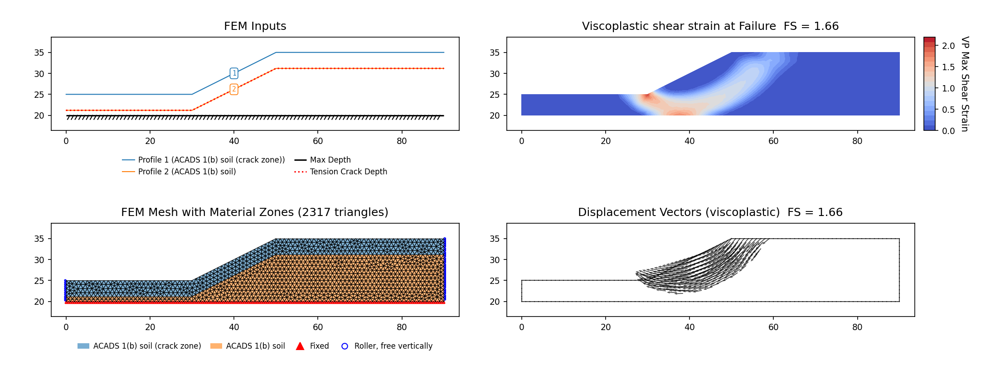

### RS2 Part IV VP6: Talbingo dam, specified upstream circle (ACADS 2b) {#p4-vp6}

Slide2/LEM counterpart: [VP6](rocscience.md#vp6) (ACADS 2(b), Giam & Donald 1989). This is the
**same four-zone Talbingo dam** as [RS2-4](#rs2-4) (ACADS 2(a)); the two problems differ only in
which mechanism is sought. RS2-4's **unconstrained** SSRM finds the true global minimum — the
steeper 30.9° downstream bench (**1.666**, a surface-parallel infinite-slope slide). ACADS 2(b)
instead asks for the factor on a **single specified upstream circle**, and RS2 obtains its
published SSRM of **2.15** by confining strength reduction to an **SSR Search Area** hugging that
upstream face.

**Input files:** [vp006.xlsx](files/rocscience/vp006.xlsx) — the same dam as
[vp005.xlsx](files/rocscience/vp005.xlsx), carrying the ACADS 2(b) specified circle.

The constraint polygon is **RS2's own**, read verbatim from the vendor model file (the
`SSR_polygonal_zones` block of `slope stability #006.fez`, parsed by
`benchmarks/rocscience/rs2_ssr_zones.py`): a 37-vertex ring over the upstream face and core, in
the same coordinate frame as the corpus file (both span x [0, 648], y [0, 162]). `solve_ssrm`'s
`ssr_zone` confines strength reduction to elements inside it and holds the downstream shell and
deep interior at full strength — redirecting the mechanism off the downstream infinite-slope
minimum and onto the upstream circle through the cohesive core (c = 85 kPa). The vendor `.fez`
additionally makes its abutment/foundation blocks linear-elastic (`Plasticity: None`); `ssr_zone`
approximates that by holding the outside-polygon elements at full Mohr-Coulomb strength — the same
approximation stated for [RS2-61](#rs2-61)/[RS2-64](#rs2-64). ψ = 0; E and ν are the file's inert
FEM elastics.

| Method | XSLOPE | Published |
|---|---|---|
| SSRM, unconstrained (→ [RS2-4](#rs2-4)) | 1.666 | — (downstream bench, true global min) |
| SSRM, SSR Search Area (upstream circle) | 2.145 | RS2 SSRM 2.15 |

*Cross-bearings on the specified upstream circle: Slide2 Bishop 2.208 / Spencer 2.292 / GLE 2.301;
Giam & Donald reference 2.29.*

XSLOPE's constrained SSRM lands at **2.145**, −0.2% on RS2's SSRM 2.15. Locked at the RS2-4 mesh
(6.5 m tri6). The upstream-face confinement lifts the factor from the unconstrained 1.666
(downstream bench) to the upstream-circle 2.145, reproducing RS2's ACADS 2(b) answer — confirming
that the [RS2-4](#rs2-4) 1.666 / 2.15 split is a **mechanism choice, not a discrepancy**.

<!-- test: file=files/rocscience/vp006.xlsx, type=fem_ssrm, expected_fs=2.145, element_type=tri6, target_size=6.5, tolerance=0.02, f_min=1.8, f_max=2.5, max_iter=16000, ssr_zone=337.693;156.655;332.733;149.028;321.296;131.643;301.471;106.786;282.104;86.9617;253.282;65.612;218.97;44.5673;191.673;33.2825;160.106;24.1326;129.302;18.6427;106.884;16.5077;82.3323;16.5077;59.6101;20.1677;46.2384;23.742;43.4453;27.1826;26.5181;18.6427;29.4837;15.139;45.1228;9.79785;62.5076;7.05289;90.1096;5.22292;107.647;5.22292;124.269;5.22292;147.754;7.66288;167.883;10.8653;189.996;16.9652;206.923;22.7602;226.464;30.2593;250.08;42.5849;274.937;59.2071;299.184;79.9468;312.146;94.4341;328.442;115.178;340.663;132.406;348.593;150.686;350.477;154.416;339.88;160.039;337.693;156.655, tension_srf=true, benchmark=RS2-P4-VP6 -->

### RS2 Part IV VP41: Homogeneous slope, power curve + ru (Jiang, Baker & Yamagami 2003) {#p4-vp41}

Slide2/LEM counterpart: [VP41](rocscience.md#vp41). RS2 Part IV (Table 41.2) re-runs this slope by
shear-strength reduction, exercising the FEM's **power-curve strength and ru pore pressure
together**.

**Input files:** [vp041.xlsx](files/rocscience/vp041.xlsx)

A homogeneous slope whose strength follows the power curve τ = 1.4·(σ')0.8 (A = 1.4,
B = 0.8, γ = 20 kN/m³), with ru = 0.3. The non-linear envelope is locked separately on RS2-30/31/32/34 and the ru option on
RS2-14/17b/18b; this problem exercises the two together.

| Method | XSLOPE | Published |
|---|---|---|
| SSRM (1.5 m mesh) | 1.647 | RS2 SSRM 1.64 (+0.4%) |

*Cross-bearings: Slide2 Spencer 1.666 / GLE 1.653; Charles & Soares Bishop 1.66; Baker Janbu 1.60;
Perry rigorous Janbu 1.67; XSLOPE LEM Bishop 1.668 / Spencer 1.670.*

XSLOPE's SSRM lands at **1.647**, +0.4% above RS2's SSRM 1.64 and inside the 1.56–1.67 published band.
It is mesh-stable (1.666 / 1.647 at 2.5 / 1.5 m target sizes). Locked at the 1.5 m mesh. ψ = 0; E and
ν are the file's inert metric elastics (E = 1e5 kPa, ν = 0.3).

<!-- test: file=files/rocscience/vp041.xlsx, type=fem_ssrm, expected_fs=1.647, element_type=tri6, target_size=1.5, tolerance=0.02, f_min=1.2, f_max=2.0, max_iter=16000, benchmark=RS2-P4-VP41 -->

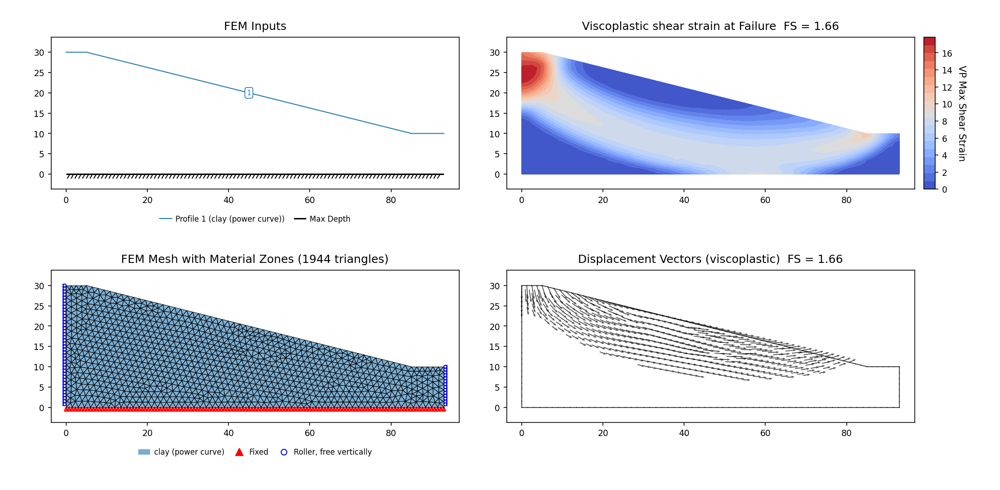

### RS2 Part IV VP57: Layered slope with weak seam, water table (Pockoski & Duncan slope 3) {#p4-vp57}

Slide2/LEM counterpart: [VP57](rocscience.md#vp57). RS2 Part IV (Table 57.2) re-runs this layered
slope by shear-strength reduction.

**Input files:** [vp057.xlsx](files/rocscience/vp057.xlsx)

Sandy clay (c = 300 psf, φ = 35°, γ = 130 pcf) over a highly plastic clay seam (c = 0, φ = 25°), with
a water table and a dry tension crack. The critical mechanism rides the weak c = 0 seam. The FEM
elastic constants are the vendor model's own, E = 1×10⁶ psf and ν = 0.4 on both materials.

| Method | XSLOPE | Published |
|---|---|---|
| SSRM (3.0 m mesh) | 1.301 | RS2 SSRM 1.32 (−1.4%) |

*Cross-bearings: Slide2 Spencer 1.40 composite / 1.42 not-composite; SLOPE/W 1.40, XSTABL 1.41; XSLOPE
LEM Bishop/Spencer 1.389 / 1.396 composite.*

XSLOPE's SSRM lands at **1.301**, −1.4% from RS2's own SSRM 1.32 — the reduction rides the weak c = 0
seam, the same mechanism by which RS2's SSRM itself sits below the composite LEM cluster (~1.40). Mesh
stable across the seam (~1.30 at 3.0 and 2.0 m). Locked at 3.0 m. ψ = 0.

<!-- test: file=files/rocscience/vp057.xlsx, type=fem_ssrm, expected_fs=1.301, element_type=tri6, target_size=3.0, tolerance=0.02, f_min=1.0, f_max=1.7, max_iter=16000, tension_srf=true, benchmark=RS2-P4-VP57 -->

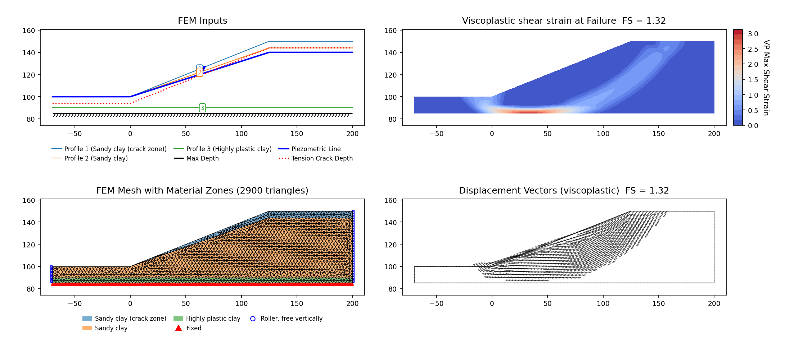

### RS2 Part IV VP60: Soil-nailed wall (Pockoski & Duncan slope 7) {#p4-vp60}

Slide2/LEM counterpart: [VP60](rocscience.md#vp60). RS2 Part IV re-runs this nailed wall by
shear-strength reduction.

**Input files:** [vp060.xlsx](files/rocscience/vp060.xlsx)

A near-vertical wall in undrained sandy clay (c = 800 psf, φ = 0, γ = 120 pcf) retained by five
passive soil-nail rows (15° declination, heads on the wall face at El. 23 / 18 / 13 / 8 / 3),
with a dry 7-ft tension crack and overlapping crest surcharges (250 psf full-width + 500 psf over
the first 7.3 ft). The nails carry an FEM axial rigidity (EA ≈ 2000·T_max, the grouted-nail
convention); the soil elastic constants are the vendor model's own, E = 1×10⁶ psf and ν = 0.4.

| Method | XSLOPE | Published |
|---|---|---|
| SSRM (2.0 m mesh) | 1.009 | RS2 SSRM 0.98 (+3.0%) |

*Cross-bearings: XSLOPE LEM Spencer 1.010 / Janbu 1.043 (on Slide's printed circle); Slide2
Spencer 1.009 / Janbu 1.041; UTEXAS4 1.02 / 1.08; GOLD-NAIL 0.91. The published SSRM spread is
0.91–1.02.*

The inclined nails root **on the vertical wall face**. A long inclined 1D line rooted on a domain
boundary is meshed by splitting the soil surface along the line (an OCC boolean-fragment build) so
the nail nodes are shared with the 2D mesh by construction, rather than embedded and edge-recovered
— which leaves such wall-rooted lines non-conforming. With the nails conforming, XSLOPE's SSRM
lands at **1.009** — squarely inside the published 0.91–1.02 spread and matching XSLOPE's own LEM
Spencer 1.010 to three figures. For undrained φ = 0 clay the nail bond is adhesion-governed
(stress-independent), so the standard fixed-ramp pull-out is faithful and no bond-slip envelope is
needed. Mesh-stable (1.009 at both 2.0 and 1.5 m); the conforming mesh equilibrates at a uniform
size without feature refinement. ψ = 0.

<!-- test: file=files/rocscience/vp060.xlsx, type=fem_ssrm, expected_fs=1.009, element_type=tri6, target_size=2.0, tolerance=0.02, f_min=0.7, f_max=1.3, max_iter=16000, tension_srf=true, benchmark=RS2-P4-VP60 -->

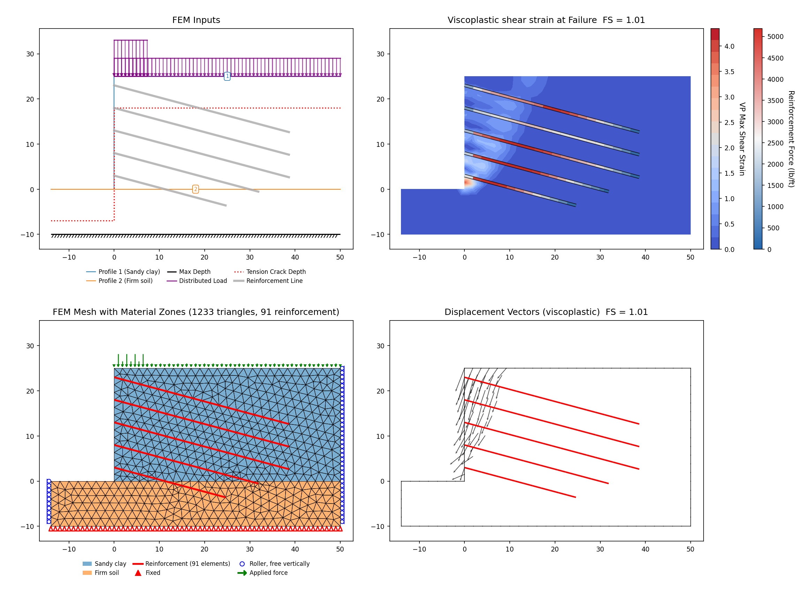

### RS2 Part IV VP64: USACE end-of-construction dam (Fig 4-1) {#p4-vp64}

Slide2/LEM counterpart: [VP64](rocscience.md#vp64) (USACE EM 1110-2-1902 Fig 4-1). RS2 Part IV
publishes an SSRM of **2.37** (Table 64.2; Slide2 Spencer 2.445).

**Input files:** [vp064.xlsx](files/rocscience/vp064.xlsx)

The dam is a symmetric 50-ft embankment (c = 1000 psf, φ = 5°) over a 10-ft sand blanket
(c = 0, φ = 35°), foundation clay (c = 3000, φ = 0°) and rock, with an embankment core trench
cutting through the sand to the clay.

| Method | XSLOPE | Published |
|---|---|---|
| SSRM (6 m mesh) | 2.356 | RS2 SSRM 2.37 (−0.6%) |

*Cross-bearings: Slide2 Spencer 2.445; USACE Spencer 2.44; XSLOPE LEM Spencer 2.488.*

The core trench pinches the sand blanket to zero thickness, splitting it into an upstream and a
downstream wedge. The blanket is therefore laid as two explicit polygons, one on each side of the
trench, rather than as a stacked profile line: polygon extraction from a stacked profile keeps only
the upstream wedge, dropping the downstream sand (x ≈ 17…225, y = −10…0) and leaving a ~10-ft void
under the downstream shell that collapses under gravity at any strength. With the domain tiling as a
closed continuum the SSRM converges to **2.356**, −0.6% from RS2's SSRM. The geometry follows USACE's 4H:1V Fig 4-1
(toes at ±217, the run 200 = 4×50 exactly) and the source's moist/saturated unit weights, not
the steeper single-bulk Slide2-Import conversion of the same problem. The
[VP64](rocscience.md#vp64) LEM lock (Spencer 2.488) is unchanged.

<!-- test: file=files/rocscience/vp064.xlsx, type=fem_ssrm, expected_fs=2.356, element_type=tri6, target_size=6.0, tolerance=0.02, f_min=2.0, f_max=2.8, max_iter=16000, tension_srf=true, benchmark=RS2-P4-VP64 -->

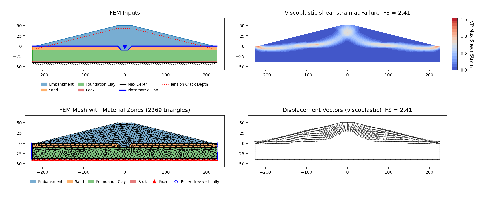

### RS2 Part IV VP67: USACE end-of-construction embankment (example F-5) {#p4-vp67}

Slide2/LEM counterpart: [VP67](rocscience.md#vp67) (USACE EM 1110-2-1902 example F-5). This
problem has two distinct answers, and both are reproduced: the **unconstrained** critical SRF
(a deep foundation mechanism) and the **toe-circle** SRF that RS2 forces with an SSR Exclusion
Area to obtain its published SSRM of **1.33**.

**Input files:** [vp067.xlsx](files/rocscience/vp067.xlsx) (unconstrained) ·
[vp067c.xlsx](files/rocscience/vp067c.xlsx) (SSR exclusion below El. 81)

A 91-ft embankment (c = 1780 psf, φ = 5°, γ = 135 pcf) on a 100-ft soft, undrained foundation
(c = 1600 psf, φ = 2°, γ = 127 pcf) over a rigid base, at end of construction. ψ = 0; E and ν are
the vendor model's own, E = 1×10⁶ psf and ν = 0.4 on all three materials.

| Method | XSLOPE | Published |
|---|---|---|
| SSRM, unconstrained (8 m mesh) | 1.076 | — (true global minimum) |
| SSRM, SSR exclusion below El. 81 (8 m mesh) | 1.303 | RS2 SSRM 1.33 |

*Cross-bearings on the specified toe circle: Slide2 Spencer 1.328, USACE 1.33, XSLOPE LEM
Spencer 1.316. XSLOPE's unconstrained LEM circular search (Spencer 1.075) confirms the deep
minimum independently.*

**Unconstrained minimum (1.076).** With every zone reduced, the SSRM finds a deep translational
mechanism riding the foundation/bedrock contact through the soft φ = 2° clay — daylighting near
the upstream toe, sliding along the base, and rising through the downstream face. It is
bedrock-contact-pinned and essentially mesh-independent (1.076 at both 8 and 4 m target sizes).
XSLOPE's own unconstrained LEM circular search finds the same deep family (Spencer 1.075), so
the two solvers agree on the true global minimum. This is the mechanism a single USACE
specified circle — centred 259 ft above the toe (R = 278), bottoming only ~19 ft into the
foundation — does not probe.

**Toe-circle SRF (1.303) vs RS2's 1.33.** RS2's published 1.33 is likewise not the unconstrained
minimum: it is obtained by barring strength reduction in the foundation below the lowest point
of the specified circle (≈ El. 81), an **SSR Exclusion Area** that forces the mechanism up onto
the toe circle (RS2 manual Part 4, p. 124, figs 67.2/67.3). RS2 documents the technique on its
VP78 example: *"To force RS2 to iterate for SRF associated with a failure surface passing
through the toe of the slope, a SSR Exclusion Area was used."* Reproducing that constraint —
vp067c splits the foundation at El. 81 into identical upper and lower zones and excludes the
lower zone from reduction — XSLOPE's SSRM gives **1.303**, matching RS2's constrained SSRM 1.33
(and the specified-circle LEM Spencer 1.316). The critical shear band moves up into the
embankment and shallow foundation (El. 97–159), the toe-circle family, confirming the
exclusion redirected the mechanism away from the deep foundation.

<!-- test: file=files/rocscience/vp067.xlsx, type=fem_ssrm, expected_fs=1.076, element_type=tri6, target_size=8.0, tolerance=0.02, f_min=0.9, f_max=1.8, max_iter=16000, tension_srf=true, benchmark=RS2-P4-VP67 -->
<!-- test: file=files/rocscience/vp067c.xlsx, type=fem_ssrm, expected_fs=1.303, element_type=tri6, target_size=8.0, tolerance=0.02, f_min=1.2, f_max=1.5, max_iter=16000, ssr_exclude=Foundation lower, tension_srf=true, benchmark=RS2-P4-VP67c -->

**Unconstrained critical SRF (vp067)**

**SSR Exclusion Area below El. 81 (vp067c)**

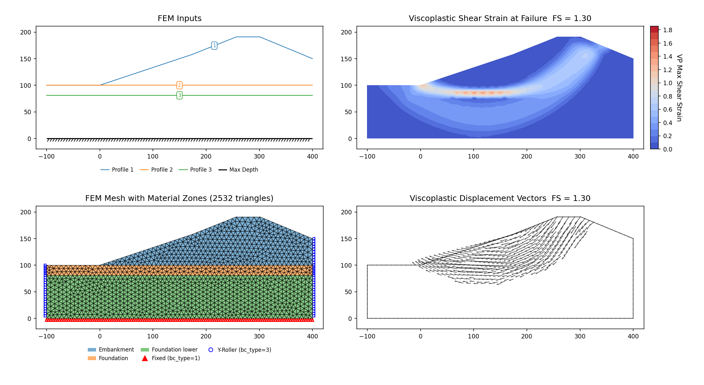

### RS2 Part IV VP68: Undrained φ = 0 three-layer slope, ponded (USACE E-10) {#p4-vp68}

Slide2/LEM counterpart: [VP68](rocscience.md#vp68) (USACE EM 1110-2-1902 example E-10). RS2 Part IV
(Table 68.2) re-runs this undrained slope by shear-strength reduction. Built with a caveat.

**Input files:** [vp068.xlsx](files/rocscience/vp068.xlsx)

An undrained three-layer slope (c = 600 / 400 / 500 psf, all φ = 0, γ = 120 / 100 / 105 pcf) with 8 ft
of water ponded against it (pool el 0). φ = 0 so strength reduction acts on cohesion alone; the
elastic constants are the vendor model's own, E = 1×10⁶ psf and ν = 0.4 on all three layers.

| Method | XSLOPE | Published |
|---|---|---|
| SSRM (2.0 m mesh) | 1.034 | RS2 SSRM 1.17 |

*Cross-bearings: Slide2 Bishop / M-P 1.234 / 1.244; USACE E-10 chart 1.33; XSLOPE LEM Bishop 1.234 on
the specified circle.*

XSLOPE's free SSRM lands at **1.034**, ~12% below RS2's own SSRM 1.17 and ~16% below the Slide2 LEM on
the specified toe circle (1.234) — the reduction finds a weaker layered mechanism than the single
specified circle probes, and is nearly mesh-flat (1.034 / 1.033 at 2.0 / 1.2 m). RS2's SSRM
already undershoots the LEM here (1.17 vs 1.24), and its own USACE reference is 1.33; XSLOPE extends
that trend rather than reversing it, so the value is locked as a regression at the 2.0 m mesh, honestly
below the references. ψ = 0.

<!-- test: file=files/rocscience/vp068.xlsx, type=fem_ssrm, expected_fs=1.034, element_type=tri6, target_size=2.0, tolerance=0.02, f_min=0.8, f_max=1.4, max_iter=16000, tension_srf=true, benchmark=RS2-P4-VP68 -->

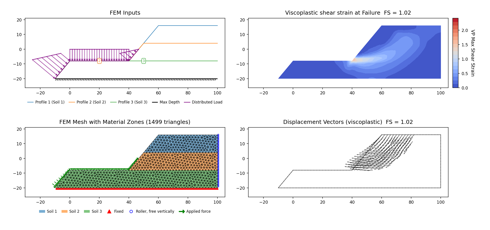

### RS2 Part IV VP70: Submerged homogeneous slope (Duncan & Wright Fig 6.27) {#p4-vp70}

Slide2/LEM counterpart: [VP70](rocscience.md#vp70). RS2 Part IV (Table 70.2/70.3) re-runs this
submerged slope by shear-strength reduction. The point of the problem is that the factor of safety is
independent of pool depth (30 ft vs 60 ft above the crest); RS2 reports SSRM 1.58 for both. This build
also covers **RS2 Part II §35** ("Submerged slope"), which is the identical Duncan & Wright Fig 6.27
model (native `.fez` #035: c′ = 100 psf, φ = 20°, γ = 128 pcf) — Part II reports RS2 SSRM 1.64 for it,
so the two RS2 manuals bracket XSLOPE's 1.594 (1.58 / 1.64) around the D&W referee 1.60.

**Input files:** [vp070a.xlsx](files/rocscience/vp070a.xlsx) (pool 30 ft above crest)

A homogeneous slope (c = 100 psf, φ = 20°, γ = 128 pcf) fully submerged under a pool 30 ft above the
crest, with the pond pressure applied over the whole submerged surface and pore pressures from the
piezometric line. The FEM elastic constants are the vendor model's own, E = 1×10⁶ psf and ν = 0.4.

| Method | XSLOPE | Published |
|---|---|---|
| SSRM (3.0 m mesh) | 1.594 | RS2 SSRM 1.58 (+0.9%) |

*Cross-bearings: Slide2 Bishop/Spencer 1.603/1.599; Duncan & Wright referee 1.60; XSLOPE LEM
Bishop/Spencer 1.596/1.593, identical at both pool depths.*

XSLOPE's SSRM lands at **1.594**, +0.9% above RS2's SSRM 1.58 and −0.4% from the Duncan & Wright
referee 1.60 — the pond-load and pore-pressure treatments balance over the submerged surface, the
same consistency check the [VP70](rocscience.md#vp70) LEM lock makes. Mesh-stable near 1.59. Locked at
3.0 m. ψ = 0.

<!-- test: file=files/rocscience/vp070a.xlsx, type=fem_ssrm, expected_fs=1.594, element_type=tri6, target_size=3.0, tolerance=0.02, f_min=1.2, f_max=2.0, max_iter=16000, tension_srf=true, benchmark=RS2-P4-VP70 -->

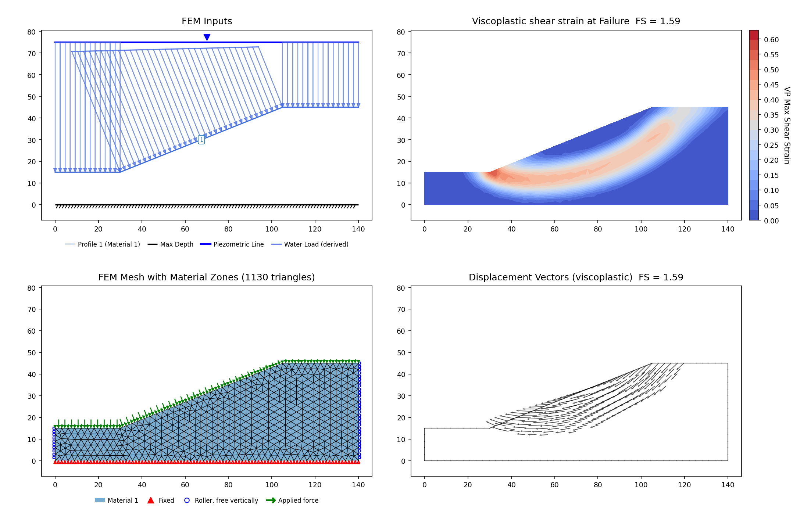

### RS2 Part IV VP102: Homogeneous earth dam, dry (Huang & Jia 2008) {#p4-vp102}

Slide2/LEM counterpart: [VP102](rocscience.md#vp102). RS2 Part IV reports an SSRM for the dry dam
(Table 102.2) and for the *transient* rapid-drawdown series — Table 102.3 for φb = 0° and
Table 102.4 for φb = 37° — at 60–1500 h. XSLOPE reproduces all three from its own uncoupled
transient seepage solve (the same flow solve that feeds the Slide2-LEM curve in
[VP102](rocscience.md#vp102)).

**Input files:** [vp102a.xlsx](files/rocscience/vp102a.xlsx) (dry) ·
[vp102t_60/100/300/600/1500.xlsx](files/rocscience/vp102t_1500.xlsx) (drawdown snapshots)

A homogeneous earth dam (c' = 13.8 kPa, φ' = 37°, γ = 18.2 kN/m³). The manual publishes E = 1×10⁵ kPa,
ν = 0.3 — the Griffiths elastic convention this corpus uses anyway. ψ = 0 throughout.

**Dry case.**

| Method | XSLOPE | Published |
|---|---|---|
| SSRM (2.5 m mesh) | 2.370 | RS2 SSRM 2.43 (−2.5%) |

*Cross-bearings: Huang & Jia strength-reduction FEM 2.43; Slide2 Spencer 2.46; XSLOPE LEM
Bishop/Spencer 2.381/2.379.*

XSLOPE's SSRM lands at **2.370**, −2.5% below RS2's SSRM and Huang & Jia's own FEM (both 2.43), sitting
on XSLOPE's own LEM (2.38) — the critical mechanism is a shallow downstream-face wedge, mildly
mesh-sensitive (2.370 / 2.355 at 2.5 / 1.5 m). Locked at 2.5 m.

<!-- test: file=files/rocscience/vp102a.xlsx, type=fem_ssrm, expected_fs=2.370, element_type=tri6, target_size=2.5, tolerance=0.02, f_min=1.9, f_max=2.8, max_iter=16000, tension_srf=true, benchmark=RS2-P4-VP102 -->

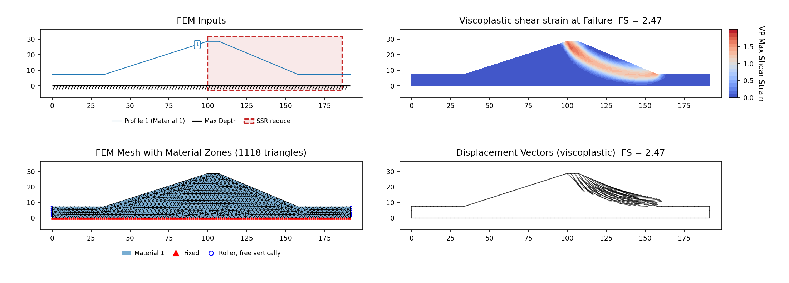

**Transient drawdown SSRM.** After the reservoir drops from el. 24 to el. 7 at *t* = 0, the dam drains
and the strength-reduction factor rises monotonically (the governing minimum is the initial steady
state; the manual notes the critical SRF occurs at the initial stage). Each snapshot's *u* = 'seep'
field comes from the single transient seepage solve described under [VP102](rocscience.md#vp102)
(isotropic *k* = 6×10⁻⁵ m/s = 0.216 m/hr, *S*s = 0.0196 /m, *S*y = 0.4, Gardner
SWCC *a* = 0.1, *n* = 3), meshed as tri6 so the SSRM runs on the snapshot's own quadratic mesh. Case 2
takes φb = 0° (suction credits no strength — the clamped baseline); Case 3 sets
φb = 37° through the run's `suction_phi_b` option, so matric suction above the phreatic
surface adds apparent cohesion s·tan φb (the same extended-Mohr-Coulomb feature verified on
VP38).

| Stage | Case 2 (φb = 0°) XSLOPE / RS2 SSR | Case 3 (φb = 37°) XSLOPE / RS2 SSR |
|---|---|---|
| 60 h | 1.670 / 1.77 (−5.9%) | 1.724 / 1.82 (−5.3%) |
| 300 h | 1.888 / 2.06 (−8.3%) | 2.052 / 2.14 (−4.1%) |
| 1500 h | 2.195 / 2.29 (−4.1%) | 2.566 / 2.48 (+3.5%) |

*Case 2 tracks the RS2 SSR drawdown column 4–8% low, the same direction as the dry case (−2.5%) and
the Slide2-LEM curve; the drift is largest at the 300 h mid-frame, where the mapped Gardner retention
curve puts XSLOPE's dissipation front slightly ahead of RS2's built-in "Silt" SWCC (the recurring
SWCC-timing caveat). Case 3's φb = 37° suction credit is applied without a suction cap, which
by 1500 h lifts XSLOPE +3.5% above the RS2 SSR value — and to within −1.9% of the Slide2 Spencer column
for that table (2.615); a suction cap calibrated to the vendor SWCC would pull it down further, but is
not fitted here. The two later Case-3 frames sit 2–3% below what an uncapped run gives (300 h 2.052 vs
2.096, 1500 h 2.566 vs 2.643): the vendor's tensile-strength caps bound the tensile strength that the
suction credit would otherwise contribute. The locked values are XSLOPE's own
regression outputs (deterministic SSRM), documented against the published columns rather than tuned to
them.*

<!-- test: file=files/rocscience/vp102t_60.xlsx, type=fem_ssrm, expected_fs=1.670, element_type=tri6, target_size=2.5, tolerance=0.02, f_min=1.5, f_max=2.9, max_iter=16000, tension_srf=true, benchmark=RS2-P4-VP102-t-60-c2 -->
<!-- test: file=files/rocscience/vp102t_300.xlsx, type=fem_ssrm, expected_fs=1.888, element_type=tri6, target_size=2.5, tolerance=0.02, f_min=1.5, f_max=2.9, max_iter=16000, tension_srf=true, benchmark=RS2-P4-VP102-t-300-c2 -->
<!-- test: file=files/rocscience/vp102t_1500.xlsx, type=fem_ssrm, expected_fs=2.195, element_type=tri6, target_size=2.5, tolerance=0.02, f_min=1.5, f_max=2.9, max_iter=16000, tension_srf=true, benchmark=RS2-P4-VP102-t-1500-c2 -->
<!-- test: file=files/rocscience/vp102t_60.xlsx, type=fem_ssrm, expected_fs=1.724, element_type=tri6, target_size=2.5, tolerance=0.02, f_min=1.5, f_max=2.9, max_iter=16000, suction_phi_b=Material 1:37, tension_srf=true, benchmark=RS2-P4-VP102-t-60-c3 -->
<!-- test: file=files/rocscience/vp102t_300.xlsx, type=fem_ssrm, expected_fs=2.052, element_type=tri6, target_size=2.5, tolerance=0.02, f_min=1.5, f_max=2.9, max_iter=16000, suction_phi_b=Material 1:37, tension_srf=true, benchmark=RS2-P4-VP102-t-300-c3 -->
<!-- test: file=files/rocscience/vp102t_1500.xlsx, type=fem_ssrm, expected_fs=2.566, element_type=tri6, target_size=2.5, tolerance=0.02, f_min=1.5, f_max=2.9, max_iter=16000, suction_phi_b=Material 1:37, tension_srf=true, benchmark=RS2-P4-VP102-t-1500-c3 -->

## Hoek-Brown verification (Hammah et al. 2005) {#hoek-brown}

The `hb` strength option is verified end-to-end — LEM *and* SSRM — against Example 1 of the
Rocscience method paper that introduced Hoek-Brown shear-strength reduction. It is the
low-GSI counterpart to [RS2-60](#rs2-60) above, which exercises the same criterion at
GSI = 70:

> Hammah, R.E., Yacoub, T.E., Corkum, B., & Curran, J.H. (2005). "The shear strength
> reduction method for the generalized Hoek-Brown criterion." *Proc. 40th U.S. Symposium
> on Rock Mechanics (ARMA/USRMS)*, Anchorage, Paper 05-810.

A 10 m high homogeneous rock slope at 45° in a very weak rock mass: $\sigma_{ci}$ = 30 MPa,
GSI = 5, $m_i$ = 2, $D$ = 0, $\gamma$ = 25 kN/m³, $E$ = 5000 MPa, $\nu$ = 0.3. This is a
demanding test of the criterion rather than of the geometry — at GSI = 5 the envelope is
strongly curved, and the exponent $a$ = 0.619 is far from the $a$ = 0.5 special case.

**Derived constants** reproduce the paper's Table 1 exactly:

| | XSLOPE | Hammah et al. |
|---|---|---|
| $m_b$ | 0.0672 | 0.067 |
| $s$ | 2.605e-5 | 2.5e-5 |
| $a$ | 0.6192 | 0.619 |

**Factors of safety:**

| Method | XSLOPE | Hammah et al. |
|---|---|---|
| Bishop simplified | 1.150 | 1.153 |
| Spencer | 1.152 | 1.152 |
| Janbu corrected | 1.144 | — |
| Morgenstern-Price | 1.148 | — |
| SSRM | 1.153 | 1.15 (generalized Hoek-Brown *and* equivalent Mohr-Coulomb) |

The paper dimensions only the slope itself (10 m high, 10 m run) and leaves the foundation
depth and lateral extents unstated. The answer does not depend on them: foundation depths of
2, 4, 6 and 10 m all return Bishop 1.150 / Spencer 1.152, because the critical mechanism
exits at the toe. SSRM converges on the published value from above as the mesh refines
(1.165 at 1.0 m, 1.158 at 0.6 m), and is quoted here at the tagged 0.9 m mesh.

Corps of Engineers (1.191) and Lowe & Karafiath (1.166) both converge on this slope. They
are the two methods that struggle on *strong* rock masses, where the instantaneous friction
angle at low confinement exceeds ~55°; at GSI = 5 the envelope is weak enough that they are
well behaved. See the note in the [LEM overview](../lem/overview.md#hoek-brown-strength).

<!-- test: file=files/rocscience/hammah_hb1.xlsx, type=circular_search, num_slices=40, fs_bishop=1.150, fs_spencer=1.152, fs_janbu=1.144, fs_mprice=1.148, benchmark=HB-lem -->
<!-- test: file=files/rocscience/hammah_hb1.xlsx, type=fem_ssrm, expected_fs=1.153, element_type=tri6, target_size=0.9, tolerance=0.01, f_min=0.8, f_max=1.6, max_iter=16000, benchmark=HB-ssrm -->
