# Rocscience RS2 (SSRM) Corpus

The [RS2 Slope Stability Verification
Manual](https://www.rocscience.com/help/rs2/verification-theory/verification-manuals) (Rocscience)
publishes 68 slope stability problems in Parts I–III, and a separate, later Part 4 manual (© 2021)
re-verifies 52 Slide2 verification problems by shear strength reduction. Most rows below verify
XSLOPE's FEM/**SSRM** solver against RS2's own SSR column, which is what the manuals exist to
publish; a few verify a published limit-equilibrium quantity instead and name the column they
reproduce. The four summary tables give each problem's headline comparison, a [match
dot](index.md#how-the-match-dots-are-scored) and a link to the section that builds it. The
long-standing SSRM anchors (Griffiths & Lane 1999 and the feature samples) are on the [SSRM
benchmarks page](ssrm.md), and full bibliographic details for the author-year citations here are on
the shared [References](references.md) page.

## Methodology

- **Models.** Geometry and properties come from the manuals' coordinate-labeled figures and the
  vendor `.fez` models; a problem also built in the [Slide2 corpus](rocscience.md) uses that same
  input file.
- **Which vendor model.** Rocscience publishes two RS2 models for many problems, a native rebuild
  (Parts I–III) and a Slide2 import (Part IV), which can differ in their constraints. A row is
  scored against the model its corpus file was built from; the other model's number is labeled as
  such.
- **Elastic constants and tensile caps** follow the vendor model.
- **Initial stress** is the at-rest field `k0 = 1` on every strength-reduction row.
- **Flow rule.** Every strength-reduction row runs ψ = 0.
- **Strength-reduction constraints.** A constraint the vendor model states (an SSR search polygon,
  an elastic twin) is carried in the file, or the row says why it is not.
- **Deep mechanisms.** Where the published mechanism is deeper than the unconstrained one, the row
reports both, the deep value under the [`min_slip_depth`
filter](../fem/overview.md#surficial-skin-failures-and-the-minimum-slip-depth-filter).
- **Referee.** Each row is scored against one referee: a closed form for the stated inputs where
  one exists, otherwise the published answer the row names, which on most rows is RS2's own SSR
  column. Other published values are shown beside it and do not set the dot.
- **Limit-equilibrium rows.** A few rows are verified by limit equilibrium because their published
  target is an LEM quantity: a critical seismic coefficient ([#68](#rs2-68)), an LEM-versus-SRM
  column ([#61](#rs2-61)), a multi-method table or limit-analysis value ([#51](#p4-vp51),
  [#60](#rs2-60)). Each such row names the column it reproduces.
- **Part IV rows.** Of the 52 Part IV problems, 37 share the build of the Parts I–III row they
  link to. The other fifteen have a section of their own: fourteen on this page — the
  twelve-method Zhu comparison ([VP51](#p4-vp51)), built by limit equilibrium, and thirteen
  strength-reduction builds on a shared Slide2 file ([VP2](#p4-vp2), [VP6](#p4-vp6),
  [VP41](#p4-vp41), [VP57](#p4-vp57), [VP60](#p4-vp60), [VP64](#p4-vp64), [VP65/VP66](#p4-vp65),
  [VP67](#p4-vp67), [VP68](#p4-vp68), [VP69](#p4-vp69), [VP70](#p4-vp70) and
  [VP102](#p4-vp102)) — and the safety-map dam on the Slide2 page ([VP42](rocscience.md#vp42)).
  VP70's Parts I–III counterpart is problem 35, which the same build covers.
- **Part IV strength-reduction builds.** Where a Part IV problem shares its file with a Slide2
  limit-equilibrium row, the file also carries its own SSRM run against RS2's published SSR, since
  a limit-equilibrium match does not stand in for a strength-reduction one.
- **Builders.** `benchmarks/rocscience/build_rs2.py` writes the input files and
  `make_rs2_figures.py` the figures.

## Status

Status terms follow the [shared definitions](index.md#status-terms) and match dots the
[shared scoring](index.md#how-the-match-dots-are-scored).

### Part I (1–34)

| # | Match | Problem | Results | Notes |
|---:|:-:|---|---|---|
| [1](#rs2-1) | 🟢 | Simple slope stability assessment | SSRM 0.986 vs RS2 SSRM 0.99 (−0.4%) | |
| [2](#rs2-2) | 🟢 | Non-homogeneous slope | SSRM 1.347 vs RS2 SSRM 1.36 (−1.0%) | |
| [3](#rs2-3) | 🟢 | Non-homogeneous slope with seismic load (0.15g) | SSRM 0.948 vs RS2 SSRM 0.97 (−2.3%) | |
| [4](#rs2-4) | 🟢 | Dry Talbingo dam | Unconstrained: SSRM 1.672 vs closed form tan45/tan30.9 = 1.669 (+0.2%) · SSR Exclusion Area: SSRM 1.894 vs RS2 Part IV VP5 SSR 1.9 (−0.3%) | Two mechanisms, both scored; Part I's own 1.88 is the native model's unconstrained number. |
| [5](#rs2-5) | 🟢 | Water table with weak seam | SSRM 1.286 vs RS2 SSRM 1.26 (+2.1%) | |
| [6](#rs2-6) | 🟢 | Slope with load and pore pressure by water table (ACADS 4) | SSRM 0.792 vs ACADS referee 0.78 (+1.5%) | (caveat) +14.8% above RS2's own SSRM 0.69, and above Slide2's MC-optimized LEM. |
| [7](#rs2-7) | 🟢 | Pore pressure by digitized total head grid (ACADS 5) | SSRM 1.483 vs RS2 SSRM 1.48 (+0.2%) | Runs on the FE-seepage model built for Slide2 VP10. |
| [8](#rs2-8) | ⊘ | Saint-Alban test embankment | | *blocked* — the manual gives the measured pore-pressure grid only as contours drawn on its figure, with no coordinates; RS2 SSRM 0.96 vs Pilot 1.04 recorded. |
| [9](#rs2-9) | 🟢 | Cubzac-les-Ponts test embankment | SSRM 1.309 vs RS2 SSRM 1.31 (−0.1%) | Pore pressures synthesized from the manual's printed 44-point table and the vendor model's water-table line, 95 points in all; the vendor's elastic face layer carried as `elastic_materials`. Pilot 1.24. |
| [10](#rs2-10) | 🟢 | Simple slope II (Arai & Tagyo ex. 1) | SSRM 1.411 vs RS2 SSRM 1.40 (+0.8%) | |
| [11](#rs2-11) | 🟢 | Layered slope (Arai & Tagyo ex. 2) | SSRM 0.406 vs RS2 SSRM 0.41 (−1.0%) | Scored against the Part IV VP15 model this file is built from; the input-identical native twin, which differs only in the SRF tensile setting, gives 0.39. The 0.39–0.43 band is stitched from two other programs' searches and is not a referee. |
| [12](#rs2-12) | 🟢 | Simple slope + water table (Arai & Tagyo ex. 3) | SSRM 1.115 vs RS2 SSRM 1.09 (+2.3%) | |
| [13](#rs2-13) | 🟢 | Simple slope III (Yamagami & Ueta) | SSRM 1.332 vs RS2 SSRM 1.33 (+0.2%) | |
| [14](#rs2-14) | 🟡 | Simple slope, pore pressure by ru | SSRM 0.934 vs RS2 SSRM 0.98 (−4.7%) | (caveat) the factor never becomes mesh-independent; the row reports the 2.0 m mesh. |
| [15](#rs2-15) | 🟢 | Layered slope II (Greco ex. 4 / Yamagami & Ueta) | SSRM 1.372 vs RS2 SSRM 1.38 (−0.6%) | Scored against the Part IV VP19 model this file is built from. |
| [16](#rs2-16) | 🟢 | Layered slope and water table with weak seam (Greco ex. 5 / Chen & Shao) | SSRM 0.978 inside Greco 0.973–1.1 · vs RS2 SSRM 1.02 (−4.1%) | Greco's own published range is the source author's and is the referee. Nearly mesh-invariant (0.997 at 4.0 m). |
| [17](#rs2-17) | 🟢 | Slope with three pore pressure conditions (Fredlund & Krahn) | Dry: SSRM 1.987 vs RS2 SSRM 1.98 (+0.4%) · ru = 0.25: SSRM 1.692 vs RS2 SSRM 1.68 (+0.7%) | *partial* (dry + ru) — the water-table case is not built. |
| [18](#rs2-18) | 🟢 | Three pore pressure conditions and a weak seam (Fredlund & Krahn) | Dry: SSRM 1.334 vs RS2 SSRM 1.34 (−0.4%) · ru = 0.25: SSRM 1.042 vs RS2 SSRM 1.05 (−0.8%) | *partial* (dry + ru) — the water-table case is not built. RS2 publishes two runs from input-identical files — 1.34 / 1.05 on its own model, 1.26 / 0.99 on the Slide2 VP22 model imported into RS2 — and the row is scored on RS2's own run. |
| [19](#rs2-19) | 🟡 | Undrained layered slope (Low 1989) | SSRM 1.488 vs Low 1.44 (+3.3%) · vs RS2 SSRM 1.41 (+5.5%) | (caveat) Low's own factor is the referee; the two SSRM values straddle the LEM. |
| [20](#rs2-20) | 🟢 | Slope with vertical load (Prandtl's wedge) | SSRM 1.003 vs Prandtl closed form 1.0 (+0.3%) · vs RS2 SSRM 1.01 (−0.7%) | The Prandtl closed form is the referee; RS2's SSR is shown beside it. |
| [21](#rs2-21) | 🟢 | Bearing capacity test prism (Prandtl II) | SSRM 1.011 vs Prandtl closed form 1.0 (+1.1%) · vs RS2 SSRM 1.01 (+0.1%) | The Prandtl closed form is the referee; RS2's SSR is shown beside it. One trial does not settle within the iteration limit. |
| [22](#rs2-22) | 🟢 | Layered slope with undulating bedrock | SSRM 1.523 vs RS2 SSRM 1.52 (+0.2%) | (SSRM variant) on the vendor's boundary-load cap, carried at the vendor's own vertical load direction. |
| [23](#rs2-23) | 🟢 | Underwater slope with linearly varying cohesion | Under RS2's own elastic partition: SSRM 1.112 vs RS2 SSRM 1.12 (−0.7%) | The vendor model states the "can't fail" region element by element (a full-depth vertical band, not the text's "above el. −20 and right of the bench"), and the file carries it. Partition removed, the same model reads 0.215. |
| [24](#rs2-24) | 🟡 | Layered slope with geosynthetic reinforcement | 1.104 / 0.975 | RS2 SSR 1.15 (−4.0%) and 0.95 (+2.6%). Modeled as the vendor models are: the mesh split along the geotextile, the two faces on a frictional slip interface, and the ~1 m elastic strip up the embankment face. |
| [25](#rs2-25) | 🔴 | Syncrude tailings dyke (El-Ramly et al. 2003) | SSRM 1.202 vs RS2 SSRM 1.29 (−6.8%) | (caveat) refinement widens the gap rather than closing it: 1.188 at a 2.5 m mesh against 1.202 at 5 m. |
| [26](#rs2-26) | 🟢 | Clarence Cannon dam (Wolff & Harr 1987) | SSRM 2.294 vs RS2 SSRM 2.29 (+0.2%) | |
| [27](#rs2-27) | 🟢 | Homogeneous slope, pore pressure by ru | SSRM 1.342 vs RS2 SSRM 1.31 (+2.4%) | Reported at the 1.0 m mesh, flat from there down. |
| [28](#rs2-28) | 🟢 | Excavated slope, FE groundwater and matric suction (Ng & Shi 1998) | H = 61: SSRM 1.669 vs RS2 SSR 1.64 (+1.8%) · H = 62: SSRM 1.544 vs RS2 SSR 1.55 (−0.4%) · H = 63: SSRM 1.406 vs RS2 SSR 1.41 (−0.3%) | (three heads) The files derive from the native `#028` variant, whose material partition holds 63% of the domain elastic, so the Part I §28 values are the referee. |
| [29](#rs2-29) | 🟢 | Geosynthetic-reinforced embankment on soft soil (Tandjiria 2002) | Sand: SSRM 1.219 vs RS2 SSRM 1.22 (−0.1%) · Clay: SSRM 0.997 vs RS2 SSR 0.99 (+0.7%) | (both cases) The sand model runs unconstrained, as both vendor twins did; the clay model states its tension crack as geometry (crest cut at 2c/γ plus the removed weight as surcharge) and is transcribed that way. |
| [30](#rs2-30) | 🟡 | Homogeneous slope, power-curve strength (Perry 1993) | SSRM 1.023 vs RS2 SSR 0.97 (+5.5%) | Run under the vendor model's own three SSR exclusion areas, carried in the file as "SSR elastic" overlays. Unconstrained the file reads 0.898, on the native rebuild's own 0.91. |
| [31](#rs2-31) | 🟢 | M-C vs power curve (Baker 2003 ex. 1) | M-C: SSRM 1.529 vs RS2 SSRM 1.53 (−0.1%) · M-C local-linear: SSRM 0.969 vs RS2 SSRM 0.98 (−1.1%) · power curve: SSRM 0.973 vs Baker 0.97 (+0.3%) · GHB fit: SSRM 1.115 vs RS2 SSRM 1.11 (+0.5%) | (four cases) The power curve is scored against Baker, since RS2's own table labels its 1.11 "SRF (Generalized Hoek-Brown)". |
| [32](#rs2-32) | 🟢 | M-C vs power curve II (Baker 2003 ex. 2) | M-C: SSRM 2.790 vs RS2 SSRM 2.83 (−1.4%) · power curve: SSRM 2.637 vs RS2 SSRM 2.63 (+0.3%) | (both halves) The power-curve referee is RS2's own power-curve model (Part IV VP45, 2.63); the native `#032-powercurve` model is a fitted Generalized Hoek-Brown envelope, and its 2.74 is a different strength model's answer. |
| [33](#rs2-33) | 🟢 | Homogeneous slope with tension crack and water table (P&D test slope 2) | SSRM 1.269 vs RS2 SSRM 1.28 (−0.9%) | (caveat) the dry tension crack has no FEM representation. |
| [34](#rs2-34) | 🟢 | M-C vs power curve III (Baker 2003 ex. 3, London clay) | M-C: SSRM 1.373 vs RS2 SSRM 1.38 (−0.5%) · power curve: SSRM 1.497 vs RS2 SSRM 1.47 (+1.8%) | (both halves) |

### Part II (35–58)

| # | Match | Problem | Results | Notes |
|---:|:-:|---|---|---|
| [35](#p4-vp70) | 🟢 | Submerged slope (D&W Fig 6.27) | SSRM 1.594 vs D&W referee 1.60 (−0.4%) | *covered* by the Part IV build [P4-VP70](#p4-vp70) on the Slide2 [VP70](rocscience.md#vp70) file; Part II's RS2 SSRM 1.64 and Part IV's 1.58 lie either side of it. |
| [36](#rs2-36) | 🟢 | Seepage analysis, homogeneous slope (D&W Fig 6.37) | FE seepage: SSRM 1.111 vs RS2 SSRM 1.12 (−0.8%) · piezo approximation: SSRM 1.111 vs RS2 SSRM 1.12 (−0.8%) | (both cases) |
| [37](#rs2-37) | ⊘ | Embankment with layered foundation (D&W Fig 6.39) | | *unconfirmed* — the two programs find different mechanisms: RS2's is the artesian downstream-toe slide, XSLOPE's a deeper surface. |
| [38](#rs2-38) | 🟢 | Cohesionless embankment on saturated clay foundation (D&W Fig 7.12) | SSRM 1.201 vs RS2 SSRM 1.17 (+2.6%) | Part 2's own SSRM is 1.21; RS2 re-ran the problem between the two manuals. |
| [39](#rs2-39) | ⊘ | Homogeneous embankment dam, FE seepage (D&W Fig 7.19) | | *planned* — the FE-seepage member of the [RS2-41/43](#rs2-39) family; the LEM build is Slide2 [VP76](rocscience.md#vp76). |
| [40](#rs2-40) | 🟡 | Dam with impermeable foundation (D&W Fig 7.24) | Piezometric, filter off: SSRM 1.109 vs closed form 1.190 (−6.8%) · Piezometric, `min_slip_depth` = 30 ft: SSRM 1.521 vs RS2 SSRM 1.53 (−0.6%) · FE seepage: SSRM 1.590 vs RS2 SSRM 1.52 (+4.6%) | (both seepage cases) The piezometric case carries two mechanisms; the deep one holds from a 30 ft cutoff to a 50 ft one and follows the element size, as the skin does. The closed form prices a uniformly saturated infinite slope, where the skin the model finds is saturated only between the piezometric daylight and the toe, so it is shown beside and the RS2 legs set the dot. |
| [41](#rs2-39) | 🟢 | Earth embankment, infinite-slope mechanism (D&W Fig 14.4) | SSRM 1.431 vs D&W referee 1.44 (−0.6%) | (caveat) the unconstrained skin is the mechanism, and it lands inside RS2's own 1.43–1.47 band. |
| [42](#rs2-42) | 🟢 | James dike | SSRM 1.214 vs RS2 SSRM 1.19 (+2.0%) | Scored against the Part IV VP75 model this file is built from; the input-identical native twin, which differs only in its SRF tensile setting and a coarser mesh, publishes 1.26. |
| [43](#rs2-39) | 🟢 | Earth embankment, infinite-slope mechanism (D&W Fig 14.7) | SSRM 1.228 vs RS2 Part IV VP81 case 1 SSR 1.23 (−0.2%) | (caveat) run under the vendor model's own SSR Exclusion Area; unconstrained the c = 0 skin localizes at 1.116. |
| [44](#rs2-44) | 🟢 | Seepage analysis for an earth embankment (D&W Fig 14.20-a) | SSRM 1.490 vs RS2 SSRM 1.51 (−1.3%) | |
| [45](#rs2-45) | 🟢 | Varying undrained shear strength profiles (D&W Fig 14.20-b) | vp083a: SSRM 1.314 vs RS2 SSRM 1.32 (−0.5%) · vp083b: SSRM 1.330 vs RS2 SSRM 1.32 (+0.8%) | (caveat) |
| [46](#rs2-46) | 🟢 | Varying undrained strength profiles II (D&W Fig 15.9, cu = 300 + cz·z) | a: SSRM 0.773 vs RS2 SSRM 0.78 (−0.9%) · b: SSRM 0.929 vs RS2 SSRM 0.93 (−0.1%) · c: SSRM 1.043 vs RS2 SSRM 1.05 (−0.7%) · d: SSRM 1.145 vs RS2 SSRM 1.15 (−0.4%) | |
| [47](#rs2-47) | 🟢 | Purely cohesive slope, varying thickness (D&W Fig 14.3) | 30 ft: SSRM 1.061 vs RS2 SSRM 1.06 (+0.1%) · 46.5 ft: SSRM 1.061 vs RS2 SSRM 1.06 (+0.1%) · 60 ft: SSRM 1.045 vs RS2 SSRM 1.07 (−2.3%) | (all 3 thicknesses) scored against the Part IV VP78 case-(a) models these files are built from. |
| [48](#rs2-48) | 🔴 | Multi-tiered geotextile wall, baseline (Leshchinsky & Han 2004) | SSRM 1.057 vs Leshchinsky &amp; Han FDM referee 0.99 (+6.8%) | Modeled as the paper's dry stack — elastic blocks on friction joints, sheets on their own interfaces — at the paper's reinforcement stiffness J = 1000 kN/m. RS2's own SSR 1.05 comes from a facing meshed as one body and is shown beside it. |
| [49](#rs2-49) | ⊘ | Geotextile wall, fill-quality variant | | *unconfirmed* — two trials of the search do not settle within the iteration limit. |
| [50](#rs2-50) | 🟢 | Geotextile wall, 4.2 m reinforcement variant | SSRM 0.998 vs L&amp;H FDM referee 0.98 (+1.8%) | RS2 SSR 0.93 shown beside — see [RS2-48](#rs2-48). |
| [51](#rs2-51-wall) | ⊘ | Geotextile wall, dual reinforcement type | | *unconfirmed* — a step of refinement moves the factor by twice the search tolerance. |
| [52](#rs2-52) | ⊘ | Geotextile wall, weak-foundation variant | | *unconfirmed* — one trial of the search does not settle within the iteration limit. The two codes do not describe the same mechanism — see the section. |
| [53](#rs2-53) | ⊘ | Geotextile wall, water variant | | *unconfirmed* — two trials do not settle within the iteration limit on each of two meshes, and a step of refinement moves the factor by six times the search tolerance. |
| [54](#rs2-54) | ⊘ | Geotextile wall, crest-surcharge variant | | *unconfirmed* — a step of refinement moves the factor by twice the search tolerance. Modeled at the paper's Ta = 11.6 kN/m, the strength the referee's wall carries; the vendor model ships the baseline's 10 kN/m. |
| [55](#rs2-55) | 🟢 | Geotextile wall, tier-count variant | SSRM 1.018 vs L&amp;H FDM referee 1.00 (+1.8%) | RS2 SSR 1.04 shown beside — see [RS2-48](#rs2-48). |
| [56](#rs2-56) | 🟢 | Homogeneous slope vs Z-Soil, PLAXIS, GEO FEM (Pruska 2003, H = 7 m, 5 cases) | Case 2 (weakest): SSRM 0.664 vs RS2 SSRM 0.67 (−0.9%) · Case 5 (strongest): SSRM 2.096 vs RS2 SSRM 2.14 (−2.1%) | The weakest and strongest cases are scored; case 5 is the wider of them and sets the dot. |
| [57](#rs2-57) | 🟢 | Pruska H = 10.5 m, 6 cases | Case 1 (weakest): SSRM 0.439 vs RS2 SSRM 0.44 (−0.2%) · Case 6 (strongest): SSRM 1.401 vs RS2 SSRM 1.42 (−1.3%) | The weakest and strongest cases are scored; case 6 is the wider of them and sets the dot. |
| [58](#rs2-58) | 🟢 | Pruska H = 14 m, 6 cases | Case 1: SSRM 0.339 vs RS2 SSRM 0.33 (+2.7%) · Case 5: SSRM 0.714 vs RS2 SSRM 0.72 (−0.8%) · Case 6: SSRM 1.066 vs RS2 SSRM 1.06 (+0.6%) | Three cases scored; case 1 is the widest and sets the dot. |

### Part III (59–68)

| # | Match | Problem | Results | Notes |
|---:|:-:|---|---|---|
| [59](#rs2-59) | 🟢 | Three-layered soil slope | SSRM 1.572 vs RS2 SSRM 1.57 (+0.1%) | Görög & Török (2007) Budapest landslide; the critical mechanism is non-circular, so a circular search finds a deeper surface and this is an SSRM problem. |
| [60](#rs2-60) | 🟡 | Generalized Hoek–Brown, homogeneous slope | β = 15°: Spencer 1.009 vs Li 1.0 (+0.9%) · β = 30°: Spencer 0.989 vs Li 1.0 (−1.1%) · β = 45°: Spencer 1.035 vs Li 1.0 (+3.5%) | (LEM) three slope angles at GSI = 70 with the vendor σci, scored against Li's limit-analysis F = 1.0; Slide2's Spencer 1.011 / 0.992 / 1.035 is shown beside it. |
| [61](#rs2-61) | 🟢 | Local and global minima, homogeneous slope | Case 1: Spencer 1.338 vs Slide2 1.336 (+0.1%) · Case 3: Spencer 1.437 vs Slide2 1.443 (−0.4%) · Case 2: constrained SSRM 1.383 vs RS2 SSRM 1.36 (+1.7%) | (cases 1, 3, 2) one geometry, four search regions; case 2 uses RS2's own Search-Area polygon. Case 4's constrained run reads further above RS2 than case 2 does and is not scored. |
| [62](#rs2-62) | 🟡 | Three-layered slope with a soft band | SSRM 0.769 vs RS2 SSR 0.81 (−5.1%) | (Analysis III) the decisive input is the vendor per-material tensile strength reduced with the SRF; without it the FE equilibrates at F ≥ 1.3. |
| [63](#rs2-63) | 🟢 | Homogeneous slope assessment | Spencer 1.398 vs Slide2 1.380 (+1.3%) · SSRM 1.391 vs RS2 SSRM 1.38 (+0.8%) | Cheng et al. (2007), 11 m homogeneous slope. |
| [64](#rs2-64) | 🔴 | Three homogeneous landslides | C1: SSRM 5.189 vs RS2 SSR 5.14 (+1.0%) · C3: SSRM 4.807 vs RS2 SSR 4.69 (+2.5%) · C5: SSRM 5.620 vs RS2 SSR 5.47 (+2.7%) · C7: SSRM 1.639 vs RS2 SSR 1.70 (−3.6%) · C11: SSRM 1.413 vs RS2 SSR 1.46 (−3.2%) · C12: SSRM 1.147 vs RS2 SSR 1.22 (−6.0%) · C2: SSRM 6.564 vs RS2 SSR 6.10 (+7.6%) · C4: SSRM 5.461 vs RS2 SSR 4.95 (+10.3%) | *partial* — 8 of 12 cases scored; C6 and C8–C10 are built and measured but not scored. Teoman et al. (2004) Ankara clay E90 highway, each case pinned by RS2 to a digitized proposed slip surface. C4 sets the dot; on it and C2 the Teoman and Slide2 Bishop columns (5.32 / 5.32 and 6.67 / 6.64) sit beside XSLOPE, but they are cross-method and cannot carry the comparison. |
| [65](#rs2-65) | 🟢 | Tailings dam | SSRM 1.306 vs RS2 SSRM 1.29 (+1.2%) | Tzenkov (2008) Padina dam, 8 materials on a 225 × 77 m section, at the vendor's own mesh density. The reference FEM 1.41 and the LEM columns are shown beside it. |
| [66](#rs2-66) | 🟢 | Embankment basal stability | Face skin, worst case (h₁ = 4, 6 and 8 m): SSRM 1.031 vs closed form 1.050 (−1.8%) · thinnest and thickest bands (h₁ = 2 and 10 m): SSRM 1.044 vs 1.050 (−0.6%) | Two mechanisms, both scored across all five soft-layer thicknesses; the deep run uses `min_slip_depth` = 4 m. The dot is the face skin's, against a closed form that does not depend on the flow rule. The deep family (1.169 at h₁ = 2 and 4 m, 1.044–1.094 at 6, 8 and 10 m) is shown beside RS2's SSR column: every published strength-reduction solution of this problem runs associated flow, ψ = φ, where XSLOPE runs ψ = 0. |
| [67](#rs2-67) | 🟢 | Earth dam under steady & transient unsaturated seepage | Case 1 (dry): SSRM 2.502 vs RS2 SSR 2.48 (+0.9%) · Case 2 (steady): SSRM 1.695 vs RS2 SSR 1.70 (−0.3%) · Case 3 (90 h, downstream): SSRM 1.820 vs RS2 SSR 1.83 (−0.5%) · Case 3 (90 h, upstream): SSRM 2.023 vs RS2 SSR 2.04 (−0.8%) · Case 4 (1500 h, downstream): SSRM 2.320 vs RS2 SSR 2.34 (−0.9%) · Case 4 (1500 h, upstream): SSRM 2.742 vs RS2 SSR 2.76 (−0.7%) | (6 of 6) Three run on RS2's own imported drawdown pore-pressure fields; three reconstruct the flow by an own steady solve from the vendor's boundary conditions. |
| [68](#rs2-68) | 🟢 | Seismically loaded slopes | Case 1 Spencer: k꜀ 0.132 inside Loukidis limit analysis 0.126–0.145 · Case 2 Spencer: k꜀ 0.433 inside Loukidis limit analysis 0.423–0.454 · Case 3 Bishop: k꜀ 0.169 inside Loukidis limit analysis 0.148–0.172 · Case 3 Spencer: k꜀ 0.167 inside Loukidis limit analysis 0.148–0.172 | The target is a **critical seismic coefficient** k꜀, not a factor of safety, reached by a `critical_kc` bisection, and the referee is Loukidis's limit-analysis bounds, which contain every XSLOPE value. Loukidis's Spencer 0.155 and Slide2's Bishop 0.155 on case 3 are shown beside them; RS2's own SSRM k꜀ 0.161 is a strength-reduction number. |

### Part IV — RS2 *Slope Stability Verification Manual, Pt 4* (catalog)

| # | Match | Problem | Results | Notes |
|---:|:-:|---|---|---|
| [1](#rs2-1) | 🟢 | Slope, homogeneous (ACADS 1a) | SSRM 0.986 vs RS2 SSRM 0.99 (−0.4%) | Same build as [RS2-1](#rs2-1). Part IV publishes RS2 SSRM 0.98; ref 1.00 [Giam]. |
| [2](#p4-vp2) | 🟢 | Slope, homogeneous, tension crack (ACADS 1b) | SSRM 1.656 vs RS2 SSRM 1.63 (+1.6%) | Own SSRM build carrying the vendor's T = 0 crack zone; ref 1.65 [Giam]. |
| [3](#rs2-2) | 🟢 | Slope, 3 materials (ACADS 1c) | SSRM 1.347 vs RS2 SSRM 1.36 (−1.0%) | Same build as [RS2-2](#rs2-2). Part IV publishes RS2 SSRM 1.34; ref 1.39. |
| [4](#rs2-3) | 🟢 | Slope, 3 materials, seismic (ACADS 1d) | SSRM 0.948 vs RS2 SSRM 0.97 (−2.3%) | Same build as [RS2-3](#rs2-3). Part IV publishes RS2 SSRM 0.95; ref 1.00. |
| [5](#rs2-4) | 🟢 | Dam, 4 materials (ACADS 2a) | Unconstrained: SSRM 1.672 vs closed form 1.669 (+0.2%) · SSR Exclusion Area: SSRM 1.894 vs RS2 SSRM 1.9 (−0.3%) | Scored twice on [RS2-4](#rs2-4), the second under this manual's own SSR Exclusion Area. Slide2 1.948, ref 1.95 [Giam]. |
| [6](#p4-vp6) | 🟢 | Dam, 4 materials, predefined surface (ACADS 2b) | SSRM 2.188 vs RS2 SSRM 2.15 (+1.8%) | Own SSRM build, constrained to RS2's 37-vertex Search Area from `#006.fez`, which holds the mechanism on ACADS 2(b)'s upstream circle. |
| [7](#rs2-5) | 🟢 | Slope, 2 materials, weak layer (ACADS 3a) | SSRM 1.286 vs RS2 SSRM 1.26 (+2.1%) | Same build as [RS2-5](#rs2-5). Part IV publishes RS2 SSRM 1.24; ref 1.24–1.27. |
| [9](#rs2-6) | 🟢 | Weak layer, water table, load (ACADS 4) | SSRM 0.792 vs ACADS referee 0.78 (+1.5%) | Same build as [RS2-6](#rs2-6). Part IV publishes RS2 SSRM 0.76. |
| [10](#rs2-7) | 🟢 | Homogeneous, pore-pressure grid, ponded (ACADS 5) | SSRM 1.483 vs RS2 SSRM 1.48 (+0.2%) | Same build as [RS2-7](#rs2-7). Part IV publishes RS2 SSRM 1.46; ref 1.53. |
| [14](#rs2-10) | 🟢 | Slope, homogeneous (Arai & Tagyo 1) | SSRM 1.411 vs RS2 SSRM 1.40 (+0.8%) | Same build as [RS2-10](#rs2-10). Part IV publishes RS2 SSRM 1.37–1.39. |
| [15](#rs2-11) | 🟢 | Slope, 3 materials, weak layer (Arai & Tagyo 2) | SSRM 0.406 vs RS2 SSRM 0.41 (−1.0%) | Same build as [RS2-11](#rs2-11). Parts I–III publish RS2 SSRM 0.39 on the input-identical native twin; Kim/Greco 0.39–0.44. |
| [16](#rs2-12) | 🟢 | Slope, homogeneous, water table (Arai & Tagyo 3) | SSRM 1.115 vs RS2 SSRM 1.09 (+2.3%) | Same build as [RS2-12](#rs2-12). |
| [17](#rs2-13) | 🟢 | Slope, homogeneous (Yamagami & Ueta) | SSRM 1.332 vs RS2 SSRM 1.33 (+0.2%) | Same build as [RS2-13](#rs2-13). Part IV publishes RS2 SSRM 1.32. |
| [19](#rs2-15) | 🟢 | Slope, 4 materials (Greco ex. 4) | SSRM 1.372 vs RS2 SSRM 1.38 (−0.6%) | Same build as [RS2-15](#rs2-15); Greco/Spencer 1.40–1.42. |
| [21](#rs2-17) | 🟢 | Homogeneous, ru (Fredlund & Krahn) | Dry: SSRM 1.987 vs RS2 SSRM 1.98 (+0.4%) · ru = 0.25: SSRM 1.692 vs RS2 SSRM 1.68 (+0.7%) | Same build as [RS2-17](#rs2-17). Part IV publishes RS2 SSRM 1.98 / 1.68 / 1.77. |
| [22](#rs2-18) | 🟢 | Weak layer, ru (Fredlund & Krahn) | Dry: SSRM 1.334 vs RS2 SSRM 1.34 (−0.4%) · ru = 0.25: SSRM 1.042 vs RS2 SSRM 1.05 (−0.8%) | Same build as [RS2-18](#rs2-18). RS2 publishes two runs from input-identical files — 1.34 / 1.05 / 1.13 on its own model, 1.26 / 0.99 / 1.15 on the Slide2 model imported into RS2 — and the row is scored on RS2's own run. |
| [24](#rs2-19) | 🟡 | Slope, 3 materials (Low 1989) | SSRM 1.488 vs Low 1.44 (+3.3%) · vs RS2 SSRM 1.41 (+5.5%) | Same build as [RS2-19](#rs2-19); Low's own factor is the referee, as on that row. Part IV publishes RS2 SSRM 1.42. |
| [25](#rs2-20) | 🟢 | Bearing-capacity slope (Prandtl / Chen & Shao) | SSRM 1.003 vs Prandtl closed form 1.0 (+0.3%) · vs RS2 SSRM 1.01 (−0.7%) | Same build as [RS2-20](#rs2-20); Chen & Shao 1.05. |
| [26](#rs2-21) | 🟢 | Bearing-capacity prism (Prandtl II) | SSRM 1.011 vs Prandtl closed form 1.0 (+1.1%) · vs RS2 SSRM 1.01 (+0.1%) | Same build as [RS2-21](#rs2-21). Part IV publishes RS2 SSRM 1.00. |
| [32](#rs2-24) | 🟡 | Reinforced embankment, 7 materials (Borges 2002) | 1.104 / 0.975 | The same two sections [RS2-24](#rs2-24) builds, scored there against Part I. Part IV publishes RS2 SSRM 1.24 / 1.21 / 0.98 under an SSR search polygon and a wider elastic region; Borges 1.25 / 1.19 / 0.99. The limit-equilibrium build of the same problem is Slide2 [VP32](rocscience.md#vp32). |
| [38](#rs2-28) | 🟢 | Excavated slope, FE seepage, suction (Ng & Shi 1998) | H = 61: SSRM 1.669 vs RS2 SSR 1.64 (+1.8%) · H = 62: SSRM 1.544 vs RS2 SSR 1.55 (−0.4%) · H = 63: SSRM 1.406 vs RS2 SSR 1.41 (−0.3%) | Same build as [RS2-28](#rs2-28), which is built from the native `#028` models; the Part I §28 values are the referee. |
| [39](#rs2-29) | 🟢 | Reinforced embankment, geosynthetic (Tandjiria 2002) | Sand: SSRM 1.219 vs RS2 SSRM 1.22 (−0.1%) · Clay: SSRM 0.997 vs RS2 SSR 0.99 (+0.7%) | Same build as [RS2-29](#rs2-29), both cases; the clay case pairs with RS2's own Part I model. Part IV publishes RS2 SSRM 0.97 / 1.42 / 1.22 / 1.39. |
| [40](#rs2-30) | 🟡 | Homogeneous, power curve, sensitivity (Perry 1993) | SSRM 1.023 vs RS2 SSR 0.97 (+5.5%) | Same build as [RS2-30](#rs2-30); run under the vendor's own three exclusion areas, carried in the file. Perry 0.98. |
| [41](#p4-vp41) | 🟢 | Homogeneous, power curve, ru (Jiang/Baker 2003) | SSRM 1.656 vs RS2 SSRM 1.64 (+1.0%) | Own SSRM build; Bishop 1.66 / Janbu 1.60–1.67. |
| [42](rocscience.md#vp42) | ⊘ | Dam, safety-map example (Baker & Leshchinsky 2001) |  | *unconfirmed* — SSRM 1.653 against RS2 SSRM 1.84; the c = 0 granular shell localizes with the mesh, as [RS2-40](#rs2-40) documents. The LEM side reproduces the reference cluster on all three surfaces (Spencer 1.926 / 1.882 / 1.939 vs 1.925 / 1.91 / 1.934). B&L 1.91. |
| [44](#rs2-31) | 🟢 | Homogeneous, M-C vs power curve (Baker 2003 ex. 1) | M-C: SSRM 1.529 vs RS2 SSRM 1.53 (−0.1%) · M-C local-linear: SSRM 0.969 vs RS2 SSRM 0.98 (−1.1%) · power curve: SSRM 0.973 vs Baker 0.97 (+0.3%) · GHB fit: SSRM 1.115 vs RS2 SSRM 1.11 (+0.5%) | Same build as [RS2-31](#rs2-31), four cases. Part IV publishes RS2 SSRM 0.96 / 1.5 / 0.93. |
| [45](#rs2-32) | 🟢 | Homogeneous, M-C vs power curve (Baker 2003 ex. 2) | M-C: SSRM 2.790 vs RS2 SSRM 2.83 (−1.4%) · power curve: SSRM 2.637 vs RS2 SSRM 2.63 (+0.3%) | Same build as [RS2-32](#rs2-32). Part IV publishes RS2 SSRM 2.65 / 2.78 / 2.63; 2.63 is its power-curve model and the referee for that half. Parts I–III's 2.74 comes from a Generalized Hoek-Brown fit of the same envelope. |
| [51](#p4-vp51) | 🟢 | 4 materials, water table, TC, seismic, 12-method (Zhu 2003) | Spencer 1.300 vs Slide2 1.293 (+0.5%) | Own Part IV build, LEM, on a reconstructed circle — [details](#p4-vp51). RS2 SSRM 1.22; Slide2 GLE 1.304. |
| [56](#rs2-33) | 🟢 | Homogeneous, water table, TC (Pockoski & Duncan slope 2) | SSRM 1.269 vs RS2 SSRM 1.28 (−0.9%) | Same build as [RS2-33](#rs2-33). Part IV publishes RS2 SSRM 1.26; an eight-program LEM table spans 1.02–1.32. |
| [57](#p4-vp57) | 🟢 | Layered, TC (Pockoski & Duncan slope 3) | SSRM 1.323 vs RS2 SSRM 1.32 (+0.2%) | Own SSRM build carrying the vendor's T = 0 crack zone; the eight-program LEM table sits near 1.40. |
| [60](#p4-vp60) | 🟢 | Soil-nailed wall (Pockoski & Duncan slope 7) | SSRM 1.009 vs RS2 SSRM 0.98 (+3.0%) | Own SSRM build with five passive nail rows rooted in the vertical wall face, just under XSLOPE's own Spencer 1.010. GOLD-NAIL 0.91 / UTEXAS4 1.02. |
| [61](#rs2-34) | 🟢 | Homogeneous, composite surfaces (Baker 2003 ex. 3) | M-C: SSRM 1.373 vs RS2 SSRM 1.38 (−0.5%) · power curve: SSRM 1.497 vs RS2 SSRM 1.47 (+1.8%) | Same build as [RS2-34](#rs2-34). Part IV publishes RS2 SSRM 1.34 / 1.45; Baker 1.35 / 1.48. |
| [62](#rs2-68) | 🟢 | Homogeneous, ru, seismic k꜀ (Loukidis 2003 ex. 1) | Spencer: k꜀ 0.132 inside Loukidis limit analysis 0.126–0.145 | Same build as [RS2-68](#rs2-68), Case 1. RS2 SSRM 0.96. |
| [63](#rs2-68) | 🟢 | 3 materials, seismic k꜀ (Loukidis 2003 ex. 2) | Bishop: k꜀ 0.169 inside Loukidis limit analysis 0.148–0.172 · Spencer: k꜀ 0.167 inside Loukidis limit analysis 0.148–0.172 | Same build as [RS2-68](#rs2-68), Case 3. Loukidis's Spencer 0.155 and Slide2's Bishop 0.155 are shown beside the bounds. RS2's own SSRM k꜀ is 0.161; Part IV's 0.99 is the SSR factor of safety RS2 reports at the paper's fixed k = 0.155, not a k꜀. |
| [64](#p4-vp64) | 🟢 | Embankment, 3 layers, water table, TC (USACE 2003 Fig 4-1) | SSRM 2.406 vs RS2 SSRM 2.37 (+1.5%) | Own SSRM build; Spencer 2.44 [USACE]. The vendor's 65-vertex SSR corridor is thinner than the corpus mesh and is not carried. |
| [65](#p4-vp65) | ⊘ | Embankment, water table, ponded (USACE 2003 Fig 4-2) |  | *unconfirmed* — own SSRM build, unconstrained, at 1.909 on an upstream mechanism; RS2's 2.60 is constrained to the published circle by an SSR corridor thinner than the corpus mesh, so the two are not a pairing. Ref 2.71. |
| [66](#p4-vp65) | 🟢 | Embankment, water table, ponded (USACE 2003 Fig 4-3) | SSRM 2.172 vs RS2 SSRM 2.22 (−2.2%) | Own SSRM build, ponded on both faces as the vendor model is. USACE 2.30. |
| [67](#p4-vp67) | 🟢 | Embankment, 2 materials, end of construction (USACE 2003 F-5) | SSR Exclusion Area: SSRM 1.303 vs RS2 SSRM 1.33 (−2.0%) | Own SSRM build; unconstrained it finds the true global minimum at 1.076. Ref 1.33. |
| [68](#p4-vp68) | 🟡 | Slope, homogeneous, φ = 0 (USACE 2003 E-10) | SSR Search Area: SSRM 1.222 vs RS2 SSRM 1.17 (+4.4%) | Own SSRM build, two answers: every published number describes one *specified* circle, and RS2's SSR is constrained to it by the 30-vertex Search Area in `#068.fez`. Unconstrained, 1.016 on a weaker mechanism. Slide2 1.241, ref 1.33 [USACE]. |
| [69](#p4-vp69) | 🟢 | Embankment, 2 materials, steady seepage (USACE 2003 F-6) | SSR Search Area: SSRM 1.944 vs RS2 SSRM 1.94 (+0.2%) | (caveat) RS2's published factor is constrained by the 38-vertex Search Area in `#069.fez`, which the file carries verbatim. Both zones are c = 0, so the factor drifts with refinement (2.031 / 1.981 / 1.944 / 1.931 at 8 / 6.5 / 5 / 4 ft); the row reports the 5 ft mesh. Unconstrained, 1.508. USACE 2.01, Slide2 Spencer 2.026. |
| [70](#p4-vp70) | 🟢 | Submerged homogeneous slope (Duncan & Wright Fig 6.27) | SSRM 1.594 vs RS2 SSRM 1.58 (+0.9%) | Own SSRM build; Spencer 1.60, ref 1.60. |
| [71](#rs2-36) | 🟢 | Homogeneous, FE seepage (Duncan & Wright Fig 6.37) | FE seepage: SSRM 1.111 vs RS2 SSRM 1.12 (−0.8%) · piezo approximation: SSRM 1.111 vs RS2 SSRM 1.12 (−0.8%) | Same build as [RS2-36](#rs2-36); Spencer 1.13 / 1.14. |
| [72](#rs2-37) | ⊘ | Embankment dam, 4 materials, FE seepage (D&W Fig 6.39) |  | *unconfirmed* — the two programs find different mechanisms. RS2 SSRM 1.00–1.49 vs Spencer 1.16–1.63. |
| [74](#rs2-38) | 🟢 | Cohesionless embankment on clay (D&W Fig 7.12) | SSRM 1.201 vs RS2 SSRM 1.17 (+2.6%) | Same build as [RS2-38](#rs2-38); Spencer 1.20. |
| [75](#rs2-42) | 🟢 | James Bay dyke, 4 materials (D&W Fig 7.16) | SSRM 1.214 vs RS2 SSRM 1.19 (+2.0%) | Same build as [RS2-42](#rs2-42). Parts I–III publish RS2 SSRM 1.26 on the input-identical native twin; circular 1.45 / non-circular 1.17. |
| [76](#rs2-39) | ⊘ | Homogeneous embankment dam, FE seepage (D&W Fig 7.19) |  | *planned* — the SSRM sibling of [RS2-41/43](#rs2-39); the LEM build is Slide2 [VP76](rocscience.md#vp76). RS2 SSRM 0.97 / 0.98 vs Slide2 Spencer 1.08 / 1.10, D&W 1.08–1.19. Part 4 does not cover Slide2 VP77, the dam of [RS2-40](#rs2-40). |
| [78](#rs2-47) | 🟢 | Purely cohesive slope, thickness variants (D&W Fig 14.3) | 30 ft: SSRM 1.061 vs RS2 SSRM 1.06 (+0.1%) · 46.5 ft: SSRM 1.061 vs RS2 SSRM 1.06 (+0.1%) · 60 ft: SSRM 1.045 vs RS2 SSRM 1.07 (−2.3%) | Same build as [RS2-47](#rs2-47), all three thicknesses on the case-(a) models; D&W 1.12–1.14. |
| [79](#rs2-39) | 🟢 | Earth embankment, infinite-slope failure (D&W Fig 14.4) | SSRM 1.431 vs D&W referee 1.44 (−0.6%) | Same build as [RS2-41](#rs2-39); the deep run reads 1.419. Part IV publishes RS2 SSRM 1.41 / 1.45; ref 1.40 / 1.44. |
| [81](#rs2-39) | 🟢 | Earth embankment, infinite-slope failure (D&W Fig 14.7) | SSRM 1.228 vs RS2 SSRM 1.23 (−0.2%) | Same build as [RS2-43](#rs2-39), under the vendor model's own SSR Exclusion Area. Part IV case 2 publishes 1.15; ref 1.21 / 1.15. |
| [82](#rs2-44) | 🟢 | Earth embankment, water table (D&W Fig 14.20-a) | SSRM 1.490 vs RS2 SSRM 1.51 (−1.3%) | Same build as [RS2-44](#rs2-44). Part IV publishes RS2 SSRM 1.50; Spencer 1.54. |
| [83](#rs2-45) | 🟢 | Embankment wall (D&W Fig 14.20-b) | vp083a: SSRM 1.314 vs RS2 SSRM 1.32 (−0.5%) · vp083b: SSRM 1.330 vs RS2 SSRM 1.32 (+0.8%) | Same build as [RS2-45](#rs2-45). Part IV publishes RS2 SSRM 1.29 / 1.30; Spencer 1.28 / 1.33. |
| [102](#p4-vp102) | 🔴 | Homogeneous earth dam, rapid drawdown (Huang & Jia) | Dry: SSRM 2.470 vs RS2 SSRM 2.43 (+1.6%) · drawdown φb = 0°, worst frame (60 h): SSRM 1.713 vs RS2 SSR 1.77 (−3.2%) · φb = 37°, worst frame (1500 h): SSRM 2.687 vs RS2 SSR 2.48 (+8.3%) | (dry + transient) own SSRM build plus the 60–1500 h drawdown curve from XSLOPE's own transient seepage solve. The φb = 37° late frame sets the dot: the suction credit is uncapped on both sides — every `#102_3_*` model sets φb = 37° with a zero air-entry value and the material suction cutoff off — and it grows with the drainage. The same uncapped machinery is within 1.8% on [RS2-28](#rs2-28), so the gap sits in the size of the suction field rather than the strength model. The φb = 0° baseline is within 3.2% at every frame. The vendor SSR Search Area is carried in the files and is inert: the dry case returns the same 2.470. Spencer 2.455, ref 2.43. |

---

## Problem details

### 🟢 RS2-1: Simple slope stability assessment {#rs2-1}

Slide2 counterpart: [VP1](rocscience.md#vp1) (ACADS 1a).

**Input files:** [xslope_acads_simple.xlsx](../lem/files/xslope_acads_simple.xlsx)

| Method | XSLOPE | RS2 SSRM | Slide2 LEM | ACADS referee |
|---|---|---|---|---|
| SSRM | 0.986 | 0.99 (−0.4%) | Bishop 0.987 | 1.00 (−1.4%) |

<!-- test: file=../lem/files/xslope_acads_simple.xlsx, type=fem_ssrm, expected_fs=0.986, element_type=tri6, target_size=0.9, tolerance=0.01, f_min=0.7, f_max=1.3, max_iter=16000, tension_srf=false, k0=1, benchmark=RS2-1, f_stand=0.98125, f_fail=0.990625, check=edges -->

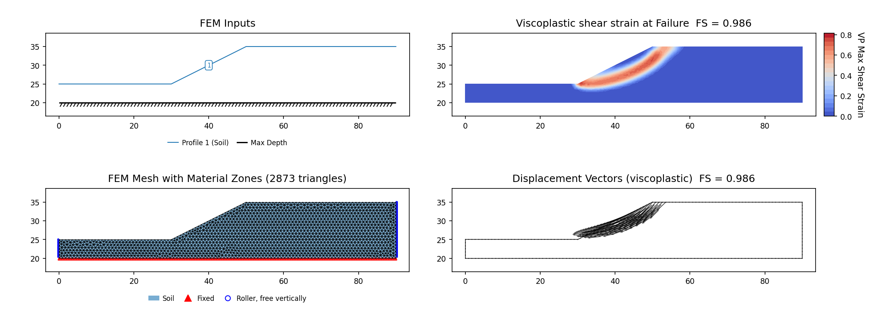

### 🟢 RS2-2: Non-homogeneous slope {#rs2-2}

Slide2 counterpart: [VP3](rocscience.md#vp3).

**Input files:** [vp003.xlsx](files/rocscience/vp003.xlsx)

| Method | XSLOPE | RS2 SSRM | Slide2 LEM | ACADS referee |
|---|---|---|---|---|
| SSRM | 1.347 | 1.36 (−1.0%) | Spencer 1.375 | 1.39 (−3.1%) |

<!-- test: file=files/rocscience/vp003.xlsx, type=fem_ssrm, expected_fs=1.347, element_type=tri6, target_size=0.9, tolerance=0.01, f_min=1.0, f_max=1.7, max_iter=16000, tension_srf=false, k0=1, benchmark=RS2-2, f_stand=1.34453125, f_fail=1.35, check=edges -->

### 🟢 RS2-3: Non-homogeneous slope with seismic load (0.15g) {#rs2-3}

Slide2 counterpart: [VP4](rocscience.md#vp4).

**Input files:** [vp004.xlsx](files/rocscience/vp004.xlsx)

| Method | XSLOPE | RS2 SSRM | Slide2 LEM | ACADS referee |
|---|---|---|---|---|
| SSRM | 0.948 | 0.97 (−2.3%) | Spencer 0.991 | 1.00 (−5.2%) |

k is entered negative per the FEM sign convention — this is a left-facing slope, so the
pseudo-static force acts in −x, while the LEM takes the magnitude and directs it from the
failure surface.

<!-- test: file=files/rocscience/vp004.xlsx, type=fem_ssrm, expected_fs=0.948, element_type=tri6, target_size=0.9, tolerance=0.01, f_min=0.7, f_max=1.3, max_iter=16000, tension_srf=false, k0=1, benchmark=RS2-3, f_stand=0.94375, f_fail=0.953125, check=edges -->

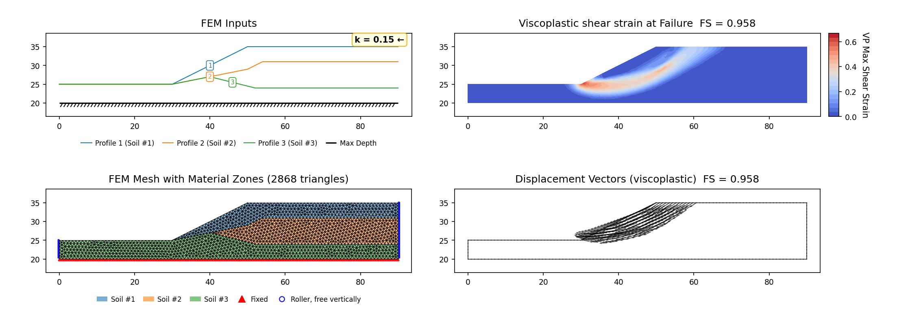

### 🟢 RS2-4: Dry Talbingo dam {#rs2-4}

Slide2 counterpart: [VP5](rocscience.md#vp5).

**Input files:** [vp005.xlsx](files/rocscience/vp005.xlsx)

| Case | XSLOPE SSRM | Published |
|---|---|---|
| Unconstrained (true global minimum) | 1.672 | closed form tan 45° / tan 30.9° = **1.669** (+0.2%) |
| RS2's own model: SSR Exclusion Area | 1.894 | RS2 SSRM **1.9** (−0.3%, Part 4 VP5, the model this file's zone comes from) |

**Two mechanisms.** Every zone of this dam is cohesionless except the clay core, so a face can
fail as the surface-parallel slide FS = tan φ / tan β, independent of depth. XSLOPE's
unconstrained SSRM finds that slide as a thin band along the steepest downstream bench segments
(30.9° and 30.8°), on the closed form. RS2 reports a crest / inclined-core band instead: Part 4's
`slope stability #005.fez` holds the whole downstream shell at full strength with an SSR Exclusion
Area, the constrained row carries that ring verbatim, and it lands on the mechanism the manual's
Figure 5.3 draws. Part 1's 1.88 comes from the native `#004` model, which carries no constraint,
and is not that comparison's partner. The two vendor numbers landing within 1.1% of each other
reflect RS2 finding the same band either way, not an inert exclusion area. Slide2's 1.948 and the
ACADS referee 1.95 are limit-equilibrium answers on the gentler upstream face, and
[RS2 Part IV VP6](#p4-vp6) confines the same dam to that face.

Both rows are taken at the 6.5 m tri6 mesh, 3,166 elements against the vendor model's 2,204, and
both mechanisms drift mildly downward under refinement.

<!-- test: file=files/rocscience/vp005.xlsx, type=mesh_elements, element_type=tri6, target_size=6.5, expected_elements=3166, benchmark=RS2-4-mesh -->
<!-- test: file=files/rocscience/vp005.xlsx, type=fem_ssrm, expected_fs=1.672, element_type=tri6, target_size=6.5, tolerance=0.01, f_min=1.5, f_max=2.3, max_iter=16000, tension_srf=false, k0=1, benchmark=RS2-4 -->
<!-- test: file=files/rocscience/vp005.xlsx, type=fem_ssrm, expected_fs=1.894, element_type=tri6, target_size=6.5, tolerance=0.02, f_min=1.5, f_max=2.3, max_iter=16000, tension_srf=false, k0=1, ssr_zone=0;0;315.5;162;319.5;162;321.6;162;327.6;162;386.9;130.6;386.9;0, benchmark=RS2-4-zone, f_stand=1.8875, f_fail=1.9, check=edges -->

**Unconstrained — the downstream bench skin (vp005)**

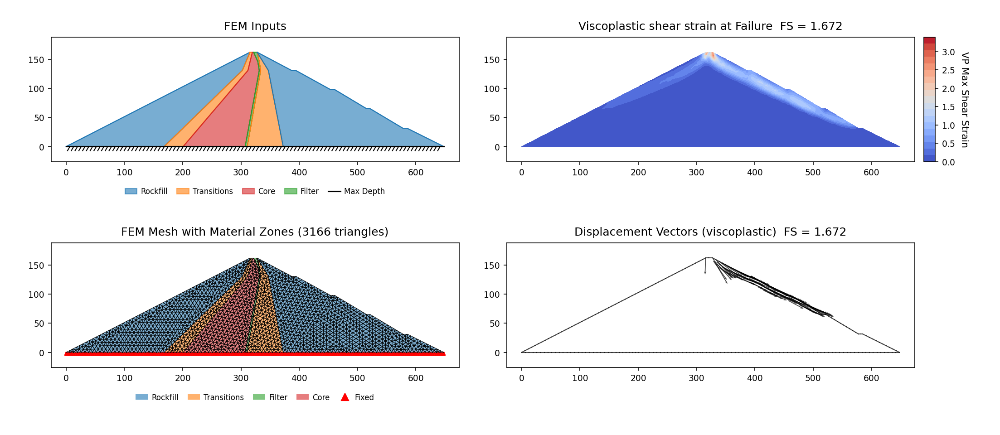

**Under Part 4's SSR Exclusion Area — the crest / core band (vp005)**

### 🟢 RS2-5: Water table with weak seam {#rs2-5}

Slide2 counterpart: **VP7** (inventory-only on the LEM page — no detail section to link).

**Input files:** [xslope_acads_weak_layer.xlsx](../lem/files/xslope_acads_weak_layer.xlsx)

| Method | XSLOPE | RS2 SSRM | Slide2 LEM | ACADS referee |
|---|---|---|---|---|
| SSRM | 1.286 | 1.26 (+2.1%) | Spencer 1.258 | 1.24–1.27 (+1.3%) |

The library `.fez` supplied for this problem carries no water table, where the manual's problem
statement, "Water Table with Weak Seam", and this file both place the phreatic surface at the base
of the weak seam (y = 26.5). The seam is purely frictional (c = 0, φ = 10°), so the water table is
what brings the factor down to the published 1.26, and the wet file is the faithful build.

<!-- test: file=../lem/files/xslope_acads_weak_layer.xlsx, type=fem_ssrm, expected_fs=1.286, element_type=tri6, target_size=2.0, tolerance=0.01, f_min=0.9, f_max=1.6, max_iter=16000, tension_srf=false, k0=1, benchmark=RS2-5, f_stand=1.2828125, f_fail=1.28828125, check=edges -->

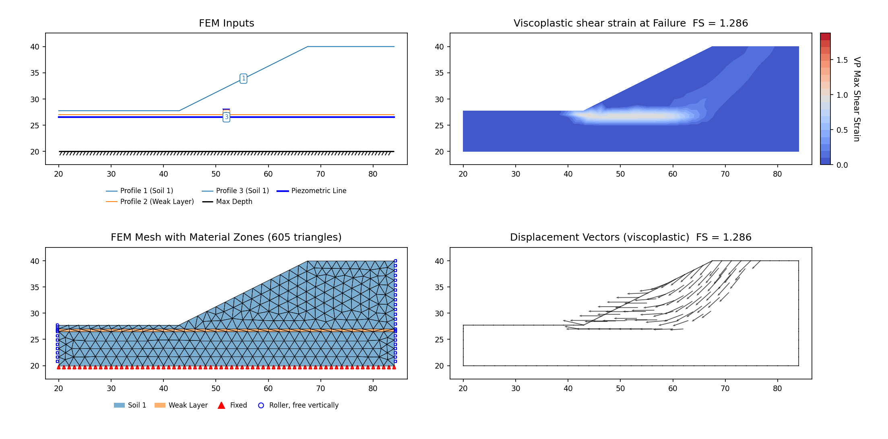

### 🟢 RS2-6: Slope with load and pore pressure by water table (ACADS 4) {#rs2-6}

Slide2 counterpart: [VP9](rocscience.md#vp9).

**Input files:** [vp009.xlsx](files/rocscience/vp009.xlsx)

| Method | XSLOPE | ACADS referee | RS2 SSRM | ACADS survey mean | Slide2 LEM | XSLOPE LEM |
|---|---|---|---|---|---|---|
| SSRM | 0.792 | 0.78 (+1.5%) | 0.69 (+14.8%) | 0.808 | 0.68–0.71 (MC-optimized) | 0.724 |

XSLOPE's SSRM lands on the ACADS referee value but sits +14.8% above RS2's SSRM, and above
Slide2's LEM as well — the published values for this thin-weak-seam problem are widely spread,
as they are at [#16](#rs2-16).

<!-- test: file=files/rocscience/vp009.xlsx, type=fem_ssrm, expected_fs=0.792, element_type=tri6, target_size=1.3, tolerance=0.02, f_min=0.3, f_max=1.3, max_iter=16000, tension_srf=false, k0=1, benchmark=RS2-6, f_stand=0.784375, f_fail=0.8, check=edges -->

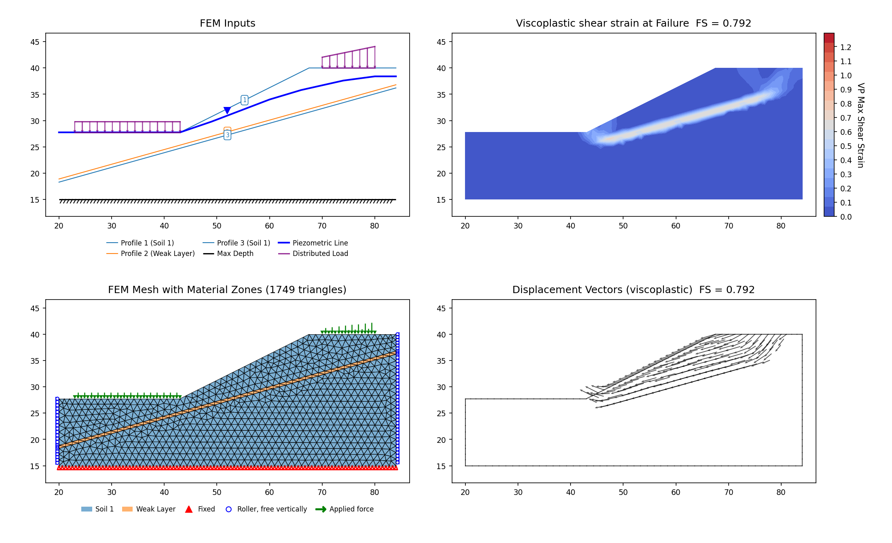

### 🟢 RS2-7: Pore pressure by digitized total head grid (ACADS 5) {#rs2-7}

Slide2 counterpart: [VP10](rocscience.md#vp10).

**Input files:** [vp010.xlsx](files/rocscience/vp010.xlsx)

| Method | XSLOPE | RS2 SSRM | Slide2 LEM | Giam |
|---|---|---|---|---|
| SSRM | 1.483 | 1.48 (+0.2%) | 1.498–1.501 | 1.53 (−3.1%) |

The SSRM runs on the FE-seepage model XSLOPE built for Slide2 [VP10](rocscience.md#vp10), meshed
in tri6.

<!-- test: file=files/rocscience/vp010.xlsx, type=fem_ssrm, expected_fs=1.483, tolerance=0.01, f_min=1.0, f_max=2.2, max_iter=16000, tension_srf=false, k0=1, benchmark=RS2-7, f_stand=1.478125, f_fail=1.4875, check=edges -->

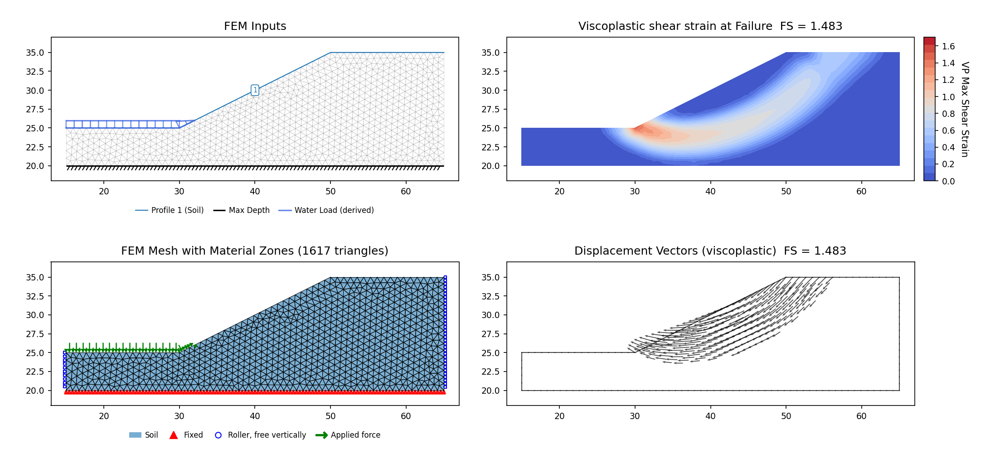

### ⊘ RS2-8: Saint-Alban test embankment {#rs2-8}

Slide2 counterpart: [VP11](rocscience.md#vp11).

| Method | XSLOPE | RS2 SSRM | Pilot |
|---|---|---|---|
| SSRM | *blocked* | 0.96 | 1.04 recorded |

The pore pressures are measured construction-induced pressures (see the Slide2 corpus VP11 row),
and the manual gives them only as equal-pressure lines drawn on the geometry figure, with no
coordinate table, so the grid cannot be transcribed. Its companion [RS2-9](#rs2-9) prints its grid
as a table and is built.

### 🟢 RS2-9: Cubzac-les-Ponts test embankment {#rs2-9}

Slide2 counterpart: [VP13](rocscience.md#vp13).

**Input files:** [rs2_9.xlsx](files/rocscience/rs2_9.xlsx) — with the
`rs2_9_mesh.json` / `rs2_9_seep.csv` files beside it, which carry the mesh and its nodal pore
pressures.

A 4.5 m embankment (c' = 0, φ' = 35°) on 9 m of soft clay in two layers, built and loaded to
failure in 1974. Its pore pressures are measured, not computed: the manual prints them as a
44-point table and draws the water table at el 8, and the vendor model adds 51 points along that
line, 95 in all. The file's pore-pressure field is the thin plate spline the manual names, through
those 95 points on the file's own mesh; it reproduces all 44 printed points, and the builder
records where every number came from. The manual also holds the face elastic, "since the factor of
safety against embankment face failure is 1.11", and the file carries the vendor's elastic face
layer as its own material, run through `elastic_materials` as on [RS2-23](#rs2-23).

| Method | XSLOPE | RS2 SSRM | Pilot |
|---|---|---|---|
| SSRM (1.0 m mesh) | 1.309 | 1.31 (−0.1%) | Bishop 1.24 recorded |

<!-- test: file=files/rocscience/rs2_9.xlsx, type=fem_ssrm, expected_fs=1.309, element_type=tri6, target_size=1.0, tolerance=0.02, f_min=0.8, f_max=2.2, max_iter=16000, tension_srf=false, k0=1, elastic_materials=Embankment (elastic face skin), benchmark=RS2-9, f_stand=1.303125, f_fail=1.3140625, check=edges -->

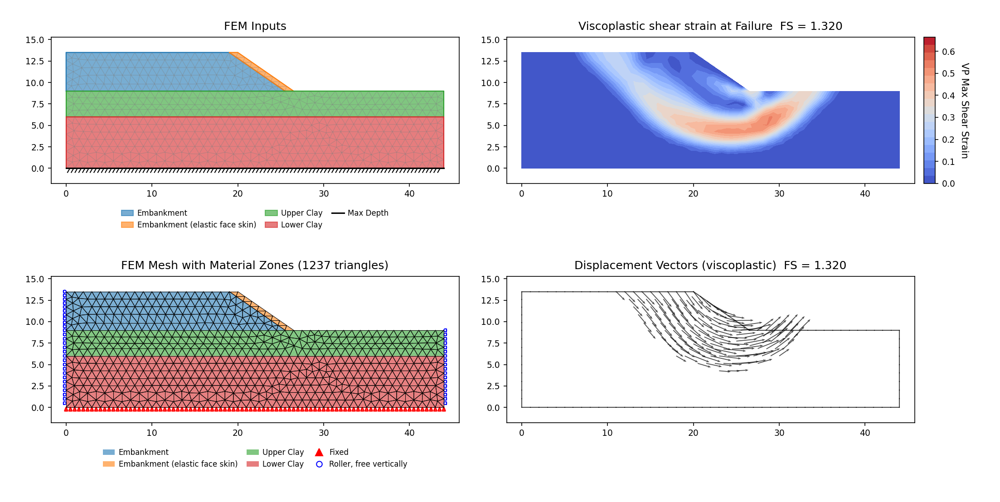

### 🟢 RS2-10: Simple slope II (Arai & Tagyo ex. 1) {#rs2-10}

Slide2 counterpart: [VP14](rocscience.md#vp14) (Arai & Tagyo 1).

**Input files:** [xslope_arai_tagyo.xlsx](../lem/files/xslope_arai_tagyo.xlsx)

| Method | XSLOPE | RS2 SSRM | XSLOPE LEM | Slide2 LEM |
|---|---|---|---|---|
| SSRM | 1.411 | 1.40 (+0.8%) | Bishop 1.404 / Spencer 1.401 | 1.409 / 1.406 |

<!-- test: file=../lem/files/xslope_arai_tagyo.xlsx, type=fem_ssrm, expected_fs=1.411, element_type=tri6, target_size=2.2, tolerance=0.02, f_min=1.2, f_max=1.7, max_iter=16000, tension_srf=false, k0=1, benchmark=RS2-10, f_stand=1.403125, f_fail=1.41875, check=edges -->

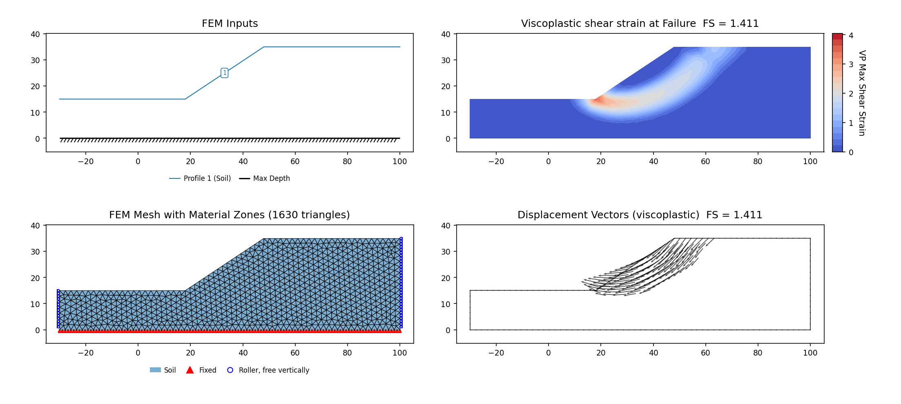

### 🟢 RS2-11: Layered slope (Arai & Tagyo ex. 2) {#rs2-11}

Slide2 counterpart: [VP15](rocscience.md#vp15).

**Input files:** [vp015.xlsx](files/rocscience/vp015.xlsx)

| Method | XSLOPE | RS2 SSRM | Greco/Kim pattern search | XSLOPE LEM |
|---|---|---|---|---|
| SSRM | 0.406 | 0.41 (−1.0%) | 0.39–0.43 | 0.419–0.422 |

The row is scored against Part IV VP15's RS2 SSRM 0.41, the value published for the model
vp015.xlsx is built from. RS2 ran this problem twice on input-identical models that differ only in
how the strength reduction treats tension — the native `#011` run drops tensile strength to zero on
failure, the Part IV `#015` import holds it, as XSLOPE's FEM does — and publishes 0.39 for the
native one, so XSLOPE sits inside the vendor's own spread on identical inputs.

<!-- test: file=files/rocscience/vp015.xlsx, type=fem_ssrm, expected_fs=0.406, element_type=tri6, target_size=1.9, tolerance=0.02, f_min=0.25, f_max=0.65, max_iter=16000, tension_srf=false, k0=1, benchmark=RS2-11, f_stand=0.4, f_fail=0.4125, check=edges -->

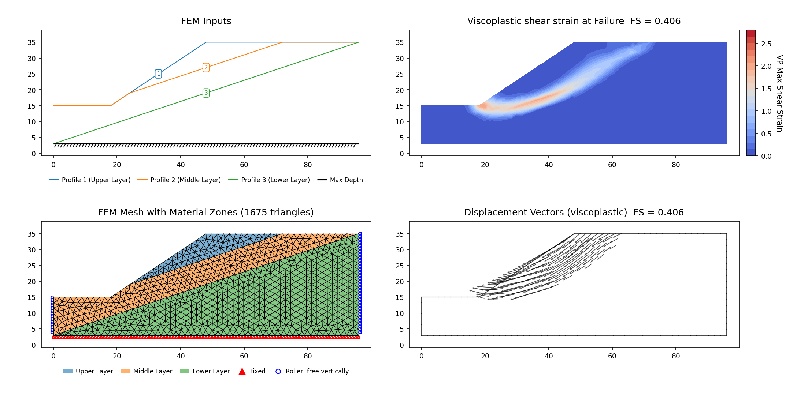

### 🟢 RS2-12: Simple slope + water table (Arai & Tagyo ex. 3) {#rs2-12}

Slide2 counterpart: [VP16](rocscience.md#vp16).

**Input files:** [vp016.xlsx](files/rocscience/vp016.xlsx)

| Method | XSLOPE | RS2 SSRM | XSLOPE LEM |
|---|---|---|---|
| SSRM | 1.115 | 1.09 (+2.3%) | Bishop 1.112 / Spencer 1.113 |

The FEM piezo pore pressure uses the vertical-distance convention, consistent with the LEM
slicer and the published analyses.

<!-- test: file=files/rocscience/vp016.xlsx, type=fem_ssrm, expected_fs=1.115, element_type=tri6, target_size=1.3, tolerance=0.02, f_min=0.9, f_max=1.45, max_iter=16000, tension_srf=false, k0=1, benchmark=RS2-12, f_stand=1.10625, f_fail=1.1234375, check=edges -->

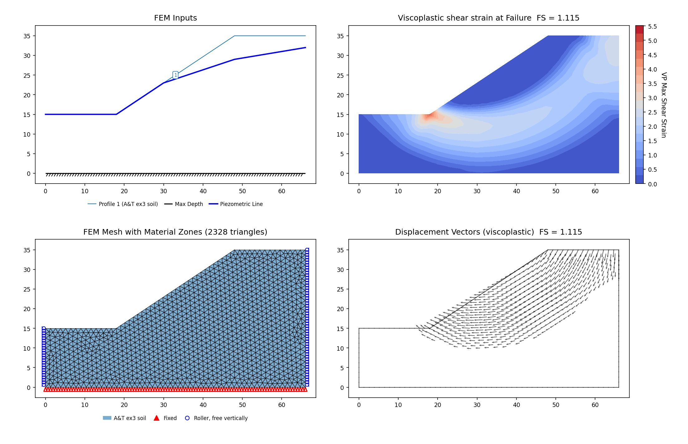

### 🟢 RS2-13: Simple slope III (Yamagami & Ueta) {#rs2-13}

Slide2 counterpart: [VP17](rocscience.md#vp17).

**Input files:** [vp017.xlsx](files/rocscience/vp017.xlsx)

| Method | XSLOPE | RS2 SSRM | Greco Spencer | XSLOPE LEM | Yamagami & Ueta |
|---|---|---|---|---|---|
| SSRM | 1.332 | 1.33 (+0.2%) | 1.33 | Bishop 1.342 / Spencer 1.340 | 1.348 / 1.339 |

<!-- test: file=files/rocscience/vp017.xlsx, type=fem_ssrm, expected_fs=1.332, element_type=tri6, target_size=0.5, tolerance=0.02, f_min=1.1, f_max=1.65, max_iter=16000, tension_srf=false, k0=1, benchmark=RS2-13, f_stand=1.3234375, f_fail=1.340625, check=edges -->

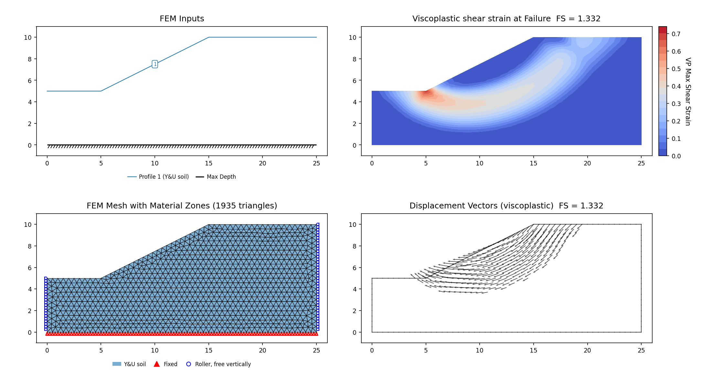

### 🟡 RS2-14: Simple slope, pore pressure by ru {#rs2-14}

Slide2 counterpart: [VP18](rocscience.md#vp18) (this problem is Slide2 VP18, not VP21).

**Input files:** [vp018.xlsx](files/rocscience/vp018.xlsx)

| Method | XSLOPE | RS2 SSRM | Slide2 Spencer | Baker | XSLOPE LEM |
|---|---|---|---|---|---|
| SSRM (2.0 m mesh) | 0.934 | 0.98 (−4.7%) | 1.01 | 1.02 | Spencer 1.033 |

The factor falls at every refinement step and does not settle: 0.972 → 0.934 → 0.878 → 0.859 as
the element size goes 2.8 → 2.0 → 1.4 → 1.0 m, and the row reports the 2.0 m value. With
ru = 0.5 half the overburden is canceled, leaving so little effective confinement that
the shear band keeps localizing as the elements shrink; [#27](#rs2-27), at ru = 0.2,
settles instead.

<!-- test: file=files/rocscience/vp018.xlsx, type=fem_ssrm, expected_fs=0.972, element_type=tri6, target_size=2.8, tolerance=0.02, f_min=0.7, f_max=1.3, max_iter=16000, tension_srf=false, k0=1, benchmark=RS2-14-m2.8, f_stand=0.9625, f_fail=0.98125, check=edges -->
<!-- test: file=files/rocscience/vp018.xlsx, type=fem_ssrm, expected_fs=0.878, element_type=tri6, target_size=1.4, tolerance=0.02, f_min=0.7, f_max=1.3, max_iter=16000, tension_srf=false, k0=1, benchmark=RS2-14-m1.4, f_stand=0.86875, f_fail=0.8875, check=edges -->
<!-- test: file=files/rocscience/vp018.xlsx, type=fem_ssrm, expected_fs=0.859, element_type=tri6, target_size=1.0, tolerance=0.02, f_min=0.7, f_max=1.3, max_iter=16000, tension_srf=false, k0=1, benchmark=RS2-14-m1.0, f_stand=0.85, f_fail=0.86875, check=edges -->
<!-- test: file=files/rocscience/vp018.xlsx, type=fem_ssrm, expected_fs=0.934, element_type=tri6, target_size=2.0, tolerance=0.02, f_min=0.7, f_max=1.3, max_iter=16000, tension_srf=false, k0=1, benchmark=RS2-14, f_stand=0.925, f_fail=0.94375, check=edges -->

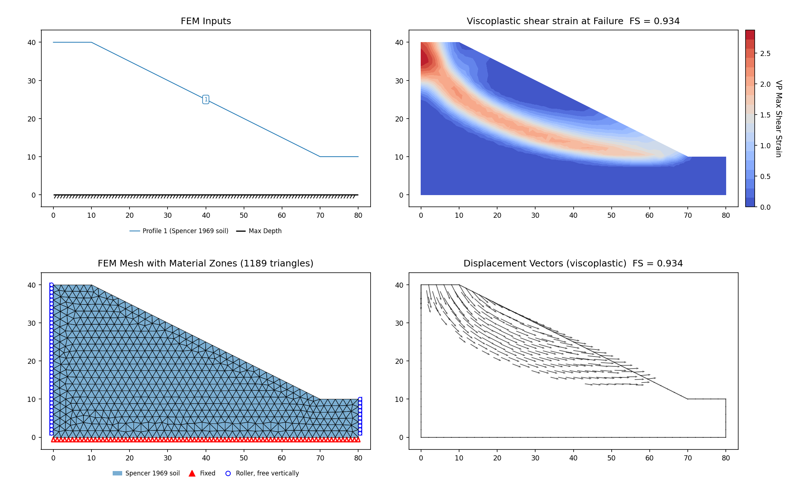

### 🟢 RS2-15: Layered slope II (Greco ex. 4 / Yamagami & Ueta) {#rs2-15}

Slide2 counterpart: [VP19](rocscience.md#vp19).

**Input files:** [vp019.xlsx](files/rocscience/vp019.xlsx)

| Method | XSLOPE | RS2 SSRM (Part IV VP19) | Slide2 Spencer | Greco |
|---|---|---|---|---|
| SSRM | 1.372 | 1.38 (−0.6%) | 1.398 | 1.40–1.42 |

The file is the Slide2 VP19 model, so its referee is Part IV VP19's SSR 1.38. That vendor run is
constrained by a four-vertex SSR Search Area and the corpus run is not; the two agree anyway, and
RS2's unconstrained native rebuild (Part I problem 15) publishes 1.39 on the same slope.

<!-- test: file=files/rocscience/vp019.xlsx, type=fem_ssrm, expected_fs=1.372, element_type=tri6, target_size=4.33, tolerance=0.02, f_min=1.1, f_max=1.7, max_iter=16000, tension_srf=false, k0=1, benchmark=RS2-15, f_stand=1.3625, f_fail=1.38125, check=edges -->

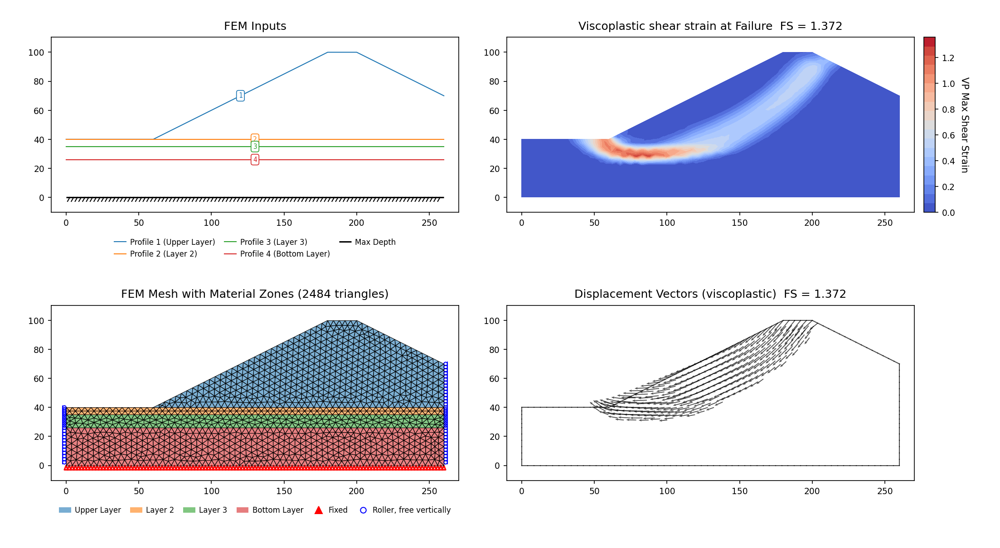

### 🟢 RS2-16: Layered slope and water table with weak seam (Greco ex. 5 / Chen & Shao) {#rs2-16}

Slide2 counterpart: [VP20](rocscience.md#vp20).

**Input files:** [vp020.xlsx](files/rocscience/vp020.xlsx)

| Method | XSLOPE | Governing | RS2 SSRM | Slide2 Spencer | XSLOPE LEM |
|---|---|---|---|---|---|
| SSRM | 0.978 | Greco 0.973–1.1 (inside) | 1.02 (−4.1%) | 1.093 circular / 1.007 noncircular | 1.086–1.091 |

Greco's own published range is the source author's factor and is the referee; RS2's SSRM is shown
beside it at −4.1%. A step of refinement moves the factor little: 0.997 at 4.0 m, 0.978 at 3.0 and
2.2 m. The model's base is an inclined polygon boundary, fixed along its whole length rather than at
the nodes of the lowest elevation alone (as at [#22](#rs2-22)).

<!-- test: file=files/rocscience/vp020.xlsx, type=fem_ssrm, expected_fs=0.997, element_type=tri6, target_size=4.0, tolerance=0.02, f_min=0.8, f_max=1.4, max_iter=16000, tension_srf=false, k0=1, benchmark=RS2-16-m4.0, f_stand=0.9875, f_fail=1.00625, check=edges -->
<!-- test: file=files/rocscience/vp020.xlsx, type=fem_ssrm, expected_fs=0.978, element_type=tri6, target_size=2.2, tolerance=0.02, f_min=0.8, f_max=1.4, max_iter=16000, tension_srf=false, k0=1, benchmark=RS2-16-m2.2, f_stand=0.96875, f_fail=0.9875, check=edges -->
<!-- test: file=files/rocscience/vp020.xlsx, type=fem_ssrm, expected_fs=0.978, element_type=tri6, target_size=3.0, tolerance=0.02, f_min=0.8, f_max=1.4, max_iter=16000, tension_srf=false, k0=1, benchmark=RS2-16, f_stand=0.96875, f_fail=0.9875, check=edges -->

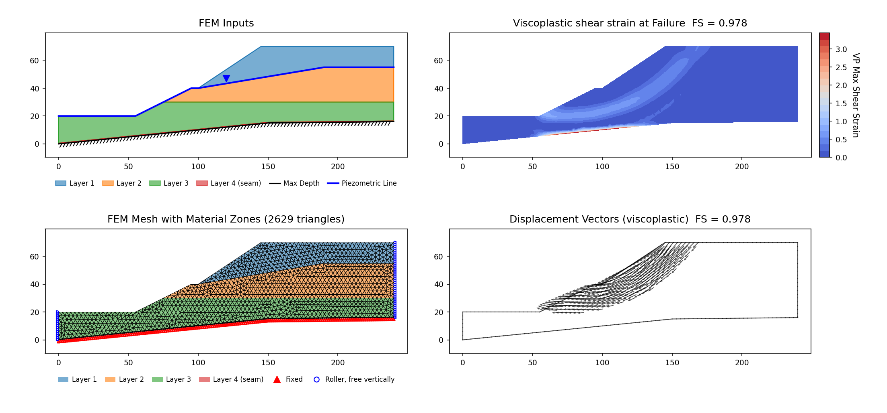

### 🟢 RS2-17: Slope with three pore pressure conditions (Fredlund & Krahn) {#rs2-17}

Slide2 counterpart: [VP21](rocscience.md#vp21).

**Input files:** [vp021a.xlsx](files/rocscience/vp021a.xlsx),
[vp021b.xlsx](files/rocscience/vp021b.xlsx)

| Method | XSLOPE | RS2 SSRM (Part IV VP21) | Slide2 | Fredlund & Krahn |
|---|---|---|---|---|
| SSRM (vp021a, dry) | 1.987 | 1.98 (+0.4%) | M-P 2.075 | 2.076 |
| SSRM (vp021b, ru = 0.25) | 1.692 | 1.68 (+0.7%) | 1.760–1.763 | 1.761–1.766 |

Both files are the Slide2 VP21 model, so the referee is Part IV VP21's SSR column; no vendor model
of this problem carries an SSR polygon. The water-table case (VP21 case 3) is not built.

<!-- test: file=files/rocscience/vp021a.xlsx, type=fem_ssrm, expected_fs=1.987, element_type=tri6, target_size=3.0, tolerance=0.02, f_min=1.6, f_max=2.5, max_iter=16000, tension_srf=false, k0=1, benchmark=RS2-17, f_stand=1.9796875, f_fail=1.99375, check=edges -->
<!-- test: file=files/rocscience/vp021b.xlsx, type=fem_ssrm, expected_fs=1.692, element_type=tri6, target_size=3.0, tolerance=0.02, f_min=1.2, f_max=2.2, max_iter=16000, tension_srf=false, k0=1, benchmark=RS2-17b, f_stand=1.684375, f_fail=1.7, check=edges -->

**Dry case (vp021a)**

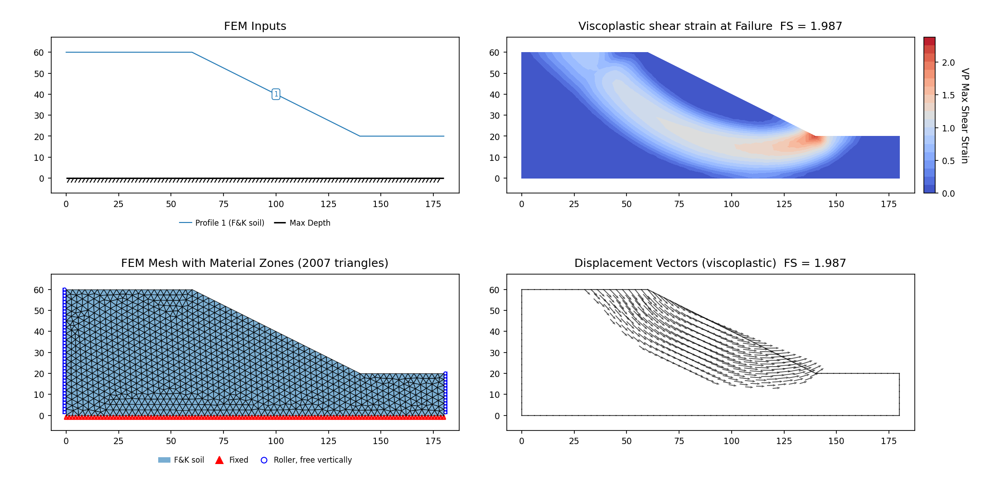

**ru = 0.25 case (vp021b)**

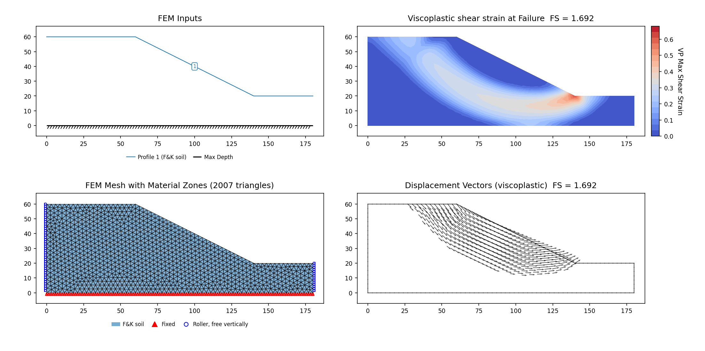

### 🟢 RS2-18: Three pore pressure conditions and a weak seam (Fredlund & Krahn) {#rs2-18}

Slide2 counterpart: [VP22](rocscience.md#vp22).

**Input files:** [vp022a.xlsx](files/rocscience/vp022a.xlsx),
[vp022b.xlsx](files/rocscience/vp022b.xlsx)

| Method | XSLOPE | RS2, its own model | RS2, imported Slide2 model | Slide2 | Fredlund & Krahn |
|---|---|---|---|---|---|
| SSRM (vp022a, dry) | 1.334 | 1.34 (−0.4%) | 1.26 | Bishop 1.382 | — |
| SSRM (vp022b, ru = 0.25) | 1.042 | 1.05 (−0.8%) | 0.99 | 1.124 | 1.124 |

RS2 publishes two solutions of this problem from input-identical files that differ in mesh
density and in whether the tensile strength is reduced with the shear strength; on the
ru case the two vendor answers are 6.1% apart. XSLOPE lands within 0.8% of RS2's own
model on both cases, and the row is scored against it. The dry case returns the same factor at
2.0 m and 1.5 m, the mechanism following the weak seam. The water-table case, the only one whose
vendor model carries an SSR polygon, is not built.

<!-- test: file=files/rocscience/vp022a.xlsx, type=fem_ssrm, expected_fs=1.334, element_type=tri6, target_size=2.0, tolerance=0.02, f_min=1.0, f_max=1.7, max_iter=16000, tension_srf=false, k0=1, benchmark=RS2-18-m2.0, f_stand=1.328125, f_fail=1.3390625, check=edges -->
<!-- test: file=files/rocscience/vp022a.xlsx, type=fem_ssrm, expected_fs=1.334, element_type=tri6, target_size=1.5, tolerance=0.02, f_min=1.0, f_max=1.7, max_iter=16000, tension_srf=false, k0=1, benchmark=RS2-18, f_stand=1.328125, f_fail=1.3390625, check=edges -->
<!-- test: file=files/rocscience/vp022b.xlsx, type=fem_ssrm, expected_fs=1.042, element_type=tri6, target_size=1.5, tolerance=0.02, f_min=0.8, f_max=1.8, max_iter=16000, tension_srf=false, k0=1, benchmark=RS2-18b, f_stand=1.034375, f_fail=1.05, check=edges -->

**Dry case (vp022a)**

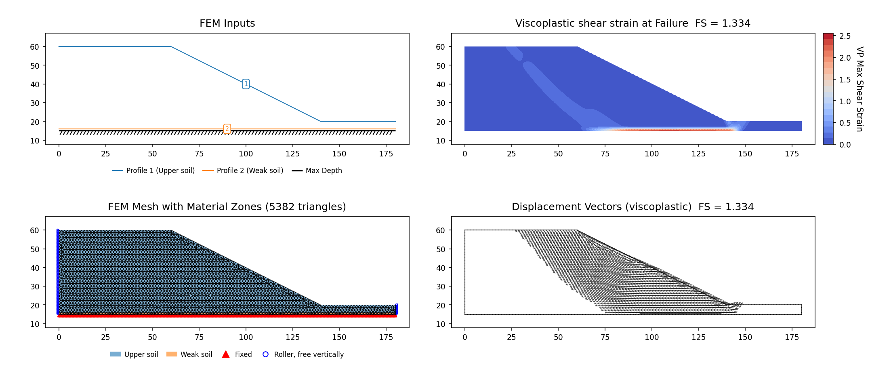

**ru = 0.25 case (vp022b)**

### 🟡 RS2-19: Undrained layered slope (Low 1989) {#rs2-19}

Slide2 counterpart: [VP24](rocscience.md#vp24) (this problem is Slide2 VP24).

**Input files:** [vp024.xlsx](files/rocscience/vp024.xlsx)

| Method | XSLOPE | Referee | RS2 SSRM | Slide2 LEM |
|---|---|---|---|---|
| SSRM (1.0 m mesh) | 1.488 | Low 1.44 (+3.3%) | 1.41 (+5.5%) | 1.439 |

Low's own factor is the source author's and is the referee; RS2's SSRM is shown beside it at
+5.5%, and the two SSRM values straddle the LEM. The geometry follows the RS2 vendor `.fez`: three
equal 4.5 m layers, so the weak middle layer (c = 20) is a full 4.5 m thick.

<!-- test: file=files/rocscience/vp024.xlsx, type=fem_ssrm, expected_fs=1.488, element_type=tri6, target_size=1.0, tolerance=0.02, f_min=1.1, f_max=1.8, max_iter=16000, tension_srf=false, k0=1, benchmark=RS2-19, f_stand=1.4828125, f_fail=1.49375, check=edges -->

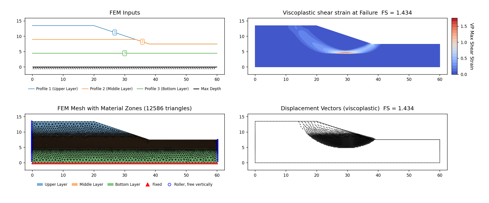

### 🟢 RS2-20: Slope with vertical load (Prandtl's wedge) {#rs2-20}

Slide2 counterpart: [VP25](rocscience.md#vp25).

**Input files:** [vp025.xlsx](files/rocscience/vp025.xlsx)

| Method | XSLOPE | RS2 SSRM (Part IV VP25) | Prandtl theory | Slide2 Spencer |
|---|---|---|---|---|
| SSRM | 1.003 | 1.01 (−0.7%) | 1.0 (+0.3%) | 1.051 on the specified surface |

Prandtl's closed form, 1.0, is the referee. The file is the Slide2 VP25 model, and RS2's SSR for
it, 1.01, comes from a run constrained by a ten-vertex SSR Exclusion Area "to ensure the
predetermined Slide2 geometry", where the corpus run is unconstrained; the mechanism is the Prandtl
wedge either way, and RS2's unconstrained native rebuild (Part I problem 20) publishes 1.0.

<!-- test: file=files/rocscience/vp025.xlsx, type=fem_ssrm, expected_fs=1.003, element_type=tri6, target_size=0.8, tolerance=0.01, f_min=0.5, f_max=1.6, max_iter=16000, tension_srf=false, k0=1, benchmark=RS2-20, f_stand=0.9984375, f_fail=1.00703125, check=edges -->

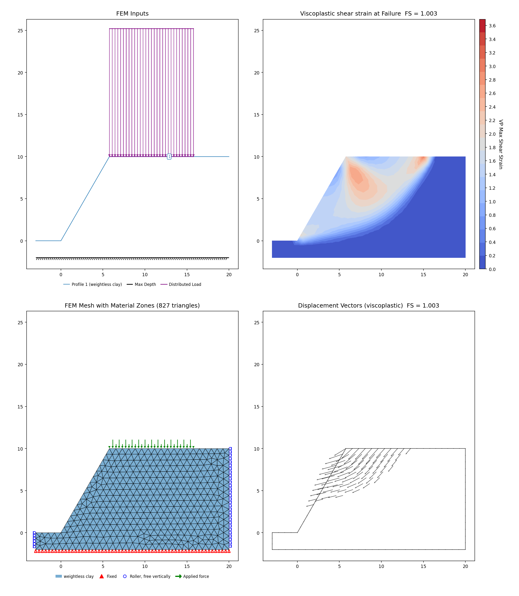

### 🟢 RS2-21: Bearing capacity test prism (Prandtl II) {#rs2-21}

Slide2 counterpart: [VP26](rocscience.md#vp26).

**Input files:** [vp026.xlsx](files/rocscience/vp026.xlsx)

| Method | XSLOPE | RS2 SSRM | Prandtl theory | Slide2 Spencer |
|---|---|---|---|---|
| SSRM | 1.011 | 1.01 (+0.1%) | 1.0 (+1.1%) | 0.941 on the specified surface |

Prandtl's closed form, 1.0, is the referee, and the SSRM approaches it from above.

<!-- test: file=files/rocscience/vp026.xlsx, type=fem_ssrm, expected_fs=1.011, element_type=tri6, target_size=0.8, tolerance=0.01, f_min=0.5, f_max=1.6, max_iter=16000, tension_srf=false, k0=1, benchmark=RS2-21, f_stand=1.00703125, f_fail=1.015625, check=edges -->

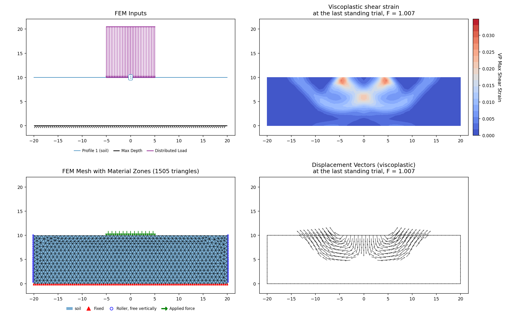

### 🟢 RS2-22: Layered slope with undulating bedrock {#rs2-22}

Slide2 counterpart: [VP27](rocscience.md#vp27).

**Input files:** [vp027_fem.xlsx](files/rocscience/vp027_fem.xlsx)

| Method | XSLOPE | Published |
|---|---|---|
| SSRM | 1.523 | RS2 SSRM 1.52 (+0.2%) |

The published model caps the crest with a zero-strength layer (c = 0, φ = 0), a limit-equilibrium
device with no continuum equivalent, so the vendor applies the cap's dead weight as two boundary
distributed loads on a single-material continuum instead. The file adopts that formulation —
loads, extents, unit weight (γ = 124.2 pcf), the vendor's Hu-corrected water table, and the load
direction. Both loads are vertical dead weight, so the `dloads` sheet's
[Direction](../usage/input_template.md#worksheet-dloads) is set to `vertical`; the default
surface-normal reading would add a horizontal thrust into the hill on the 6.34° crest and lift the
factor above the vendor's. Displacements are fixed along the whole bottom polyline, which an
undulating base requires. The limit-equilibrium rows stand on the as-published
[vp027.xlsx](files/rocscience/vp027.xlsx), which carries no distributed loads.

<!-- test: file=files/rocscience/vp027_fem.xlsx, type=fem_ssrm, expected_fs=1.523, element_type=tri6, target_size=2.5, tolerance=0.02, f_min=1.2, f_max=1.9, max_iter=16000, tension_srf=false, k0=1, benchmark=RS2-22, f_stand=1.5171875, f_fail=1.528125, check=edges -->

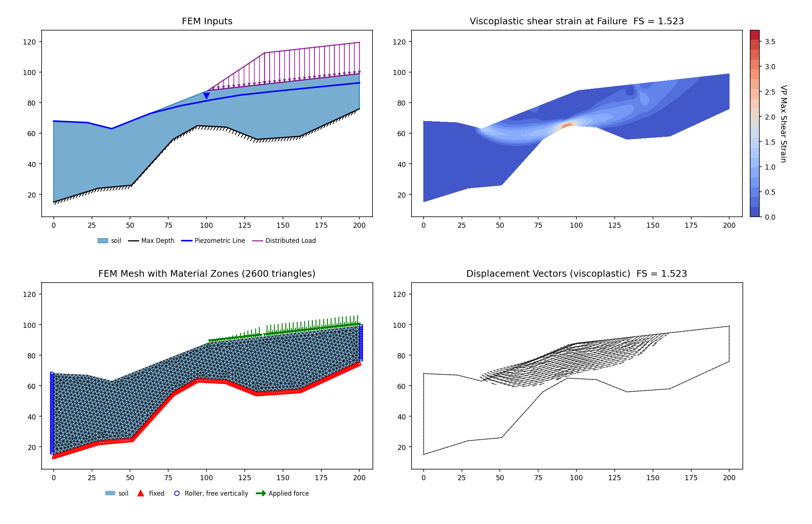

### 🟢 RS2-23: Underwater slope with linearly varying cohesion {#rs2-23}

Slide2 counterpart: [VP29](rocscience.md#vp29). Duncan's (2000) LASH terminal slope at the
Port of San Francisco: San Francisco Bay Mud, Su = 100 psf at el. −20 growing
9.8 psf/ft with depth, γ = 100 pcf, fully submerged below el. 0.

**Input files:** [vp029_split.xlsx](files/rocscience/vp029_split.xlsx) — the
[VP29](rocscience.md#vp29) model with RS2's own strength-reduction constraint carried as a
material partition.

The published text places RS2's "can't fail" region "above elevation −20 and to the right of the
bench". The vendor model places it elsewhere: its Mohr-Coulomb elements form a full-depth vertical
band between two cuts, and the file reproduces that band (48.8% of the domain by area against the
vendor's own 48.9% element-area fraction), holding the two pieces outside it elastic.

| Case | XSLOPE SSRM | RS2 SSRM | LEM anchor ([VP29](rocscience.md#vp29)) |
|---|---|---|---|
| Under RS2's own partition (vp029_split) | **1.112** | 1.12 (−0.7%) | Spencer 1.145 on Duncan's surface |
| Same model, partition removed | 0.215 | — | — |

The second row is what makes the first a comparison: remove the partition from the same model and
the reduction goes straight to the shallow skin above el. −20.

<!-- test: file=files/rocscience/vp029_split.xlsx, type=fem_ssrm, expected_fs=0.215, element_type=tri6, target_size=6.0, tolerance=0.02, f_min=0.1, f_max=1.5, max_iter=16000, tension_srf=false, k0=1, benchmark=RS2-23-nopartition, f_stand=0.209375, f_fail=0.2203125, check=edges -->
<!-- test: file=files/rocscience/vp029_split.xlsx, type=fem_ssrm, expected_fs=1.112, element_type=tri6, target_size=6.0, tolerance=0.02, f_min=0.8, f_max=1.5, max_iter=16000, tension_srf=false, k0=1, elastic_materials=Bay Mud (elastic outer 1);Bay Mud (elastic outer 2), benchmark=RS2-23, f_stand=1.10625, f_fail=1.1171875, check=edges -->

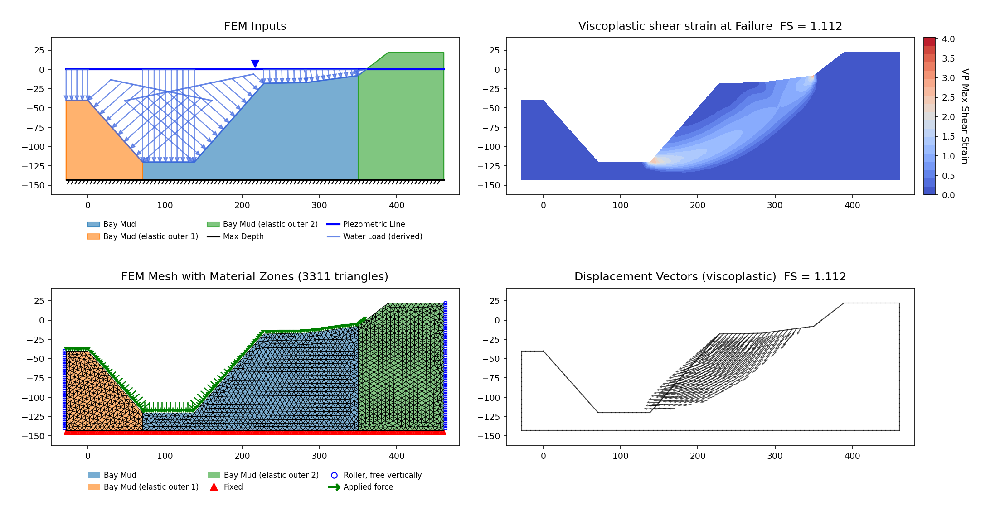

### 🟡 RS2-24: Layered slope with geosynthetic reinforcement {#rs2-24}

Slide2 counterpart: [VP32](rocscience.md#vp32).

The problem is a 7 m and an 8.75 m embankment of two cohesionless fills on five soft clay layers,
with a single geosynthetic sheet at the fill base (Borges & Cardoso 2002).

**Input files:** [vp032a_fem.xlsx](files/rocscience/vp032a_fem.xlsx) (7 m),
[vp032c_fem.xlsx](files/rocscience/vp032c_fem.xlsx) (8.75 m).

| Case | XSLOPE SSRM | RS2 SSR (Part I) | Borges & Cardoso |
|---|---|---|---|
| 7 m embankment | 1.104 | 1.15 (−4.0%) | 1.25 |
| 8.75 m embankment | 0.975 | 0.95 (+2.6%) | 0.99 |

**The sheet is an interface, not a bonded bar.** RS2's `#024` models split the solid mesh along the
geotextile, join the two faces with frictional slip joints, and run a tension-only member between
them whose ends belong to no solid element, so the sheet's whole grip on the ground is the
interface. These files carry that construction: the reinforcement line is flagged `Joint` with the
vendor's joint and sheet properties, and the strength reduction reduces the interface with the
soil. The vendor also leaves a strip about 1 m wide up the face, from toe to crest, with no
plasticity at all, and the files hold it elastic, as [RS2-23](#rs2-23) holds RS2's elastic
partition; take the strip away and the same model slips on the face instead:

| 7 m embankment | XSLOPE SSRM |
|---|---|
| face strip held elastic, as the vendor models build it | 1.104 |
| face strip yielding with the rest of the fill | 0.822 |

A step of refinement from 2.0 m to 1.5 m raises each case by 0.024 (1.080 → 1.104 and
0.951 → 0.975), and the two 1.5 m values land on either side of RS2's own. Part IV publishes
1.24 / 1.21 / 0.98 for this problem from Slide2 imports with an SSR search polygon and a much
larger elastic region, a different constraint on the same problem, so the rows here are scored
against Part I. The limit-equilibrium side is Slide2 [VP32](rocscience.md#vp32).

<!-- test: file=files/rocscience/vp032a_fem.xlsx, type=fem_ssrm, expected_fs=1.104, element_type=tri6, target_size=1.5, tolerance=0.02, f_min=0.5, f_max=2.0, max_iter=16000, tension_srf=false, k0=1, elastic_materials=Upper embankment (elastic face);Lower embankment (elastic face), benchmark=RS2-24a -->
<!-- test: file=files/rocscience/vp032a_fem.xlsx, type=fem_ssrm, expected_fs=1.080, element_type=tri6, target_size=2.0, tolerance=0.02, f_min=0.5, f_max=2.0, max_iter=16000, tension_srf=false, k0=1, elastic_materials=Upper embankment (elastic face);Lower embankment (elastic face), benchmark=RS2-24a-m2.0 -->
<!-- test: file=files/rocscience/vp032a_fem.xlsx, type=fem_ssrm, expected_fs=0.822, element_type=tri6, target_size=2.0, tolerance=0.02, f_min=0.5, f_max=2.0, max_iter=16000, tension_srf=false, k0=1, benchmark=RS2-24a-noskin -->
<!-- test: file=files/rocscience/vp032c_fem.xlsx, type=fem_ssrm, expected_fs=0.975, element_type=tri6, target_size=1.5, tolerance=0.02, f_min=0.5, f_max=2.0, max_iter=16000, tension_srf=false, k0=1, elastic_materials=Upper embankment (elastic face);Lower embankment (elastic face), benchmark=RS2-24b -->
<!-- test: file=files/rocscience/vp032c_fem.xlsx, type=fem_ssrm, expected_fs=0.951, element_type=tri6, target_size=2.0, tolerance=0.02, f_min=0.5, f_max=2.0, max_iter=16000, tension_srf=false, k0=1, elastic_materials=Upper embankment (elastic face);Lower embankment (elastic face), benchmark=RS2-24b-m2.0 -->

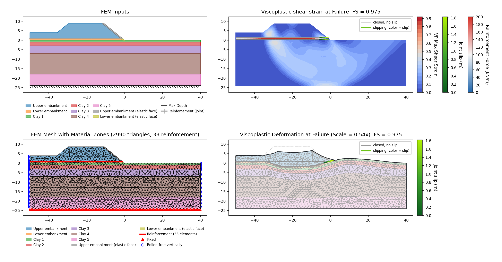

### 🔴 RS2-25: Syncrude tailings dyke (El-Ramly et al. 2003) {#rs2-25}

Slide2 counterpart: [VP33](rocscience.md#vp33).

**Input files:** [vp033.xlsx](files/rocscience/vp033.xlsx)

| Method | XSLOPE | RS2 SSRM | Slide2 | El-Ramly | XSLOPE LEM |
|---|---|---|---|---|---|
| SSRM | 1.202 | 1.29 (−6.8%) | Bishop 1.305 | 1.31 | 1.320 on Slide's circle |

Geometry, material zones, unit weights and elastic constants follow the RS2 vendor `.fez`
(`slope stability #025.fez`). Refinement widens the deficit rather than closing it: at a 2.5 m
element size the model meshes to 5,239 elements against 1,457 (3,080 nodes) at the 5 m size and
reads **1.188**, further below RS2's 1.29, with finer meshes continuing in the same direction.

The vendor model carries two piezometric lines, the second 0.7–3.6 m lower under the four zones
beneath the Tailing sand; the file applies the lower line throughout, so the pore pressure along
the tailings-sand base runs about 20% low. That is the caveat on this row, and it makes the file
read stronger, not weaker, so it cannot be what puts XSLOPE below the vendor.

<!-- test: file=files/rocscience/vp033.xlsx, type=mesh_elements, element_type=tri6, target_size=5.0, expected_elements=1457, expected_nodes=3080, benchmark=RS2-25-mesh -->
<!-- test: file=files/rocscience/vp033.xlsx, type=mesh_elements, element_type=tri6, target_size=2.5, expected_elements=5239, benchmark=RS2-25-mesh-fine -->
<!-- test: file=files/rocscience/vp033.xlsx, type=fem_ssrm, expected_fs=1.188, element_type=tri6, target_size=2.5, tolerance=0.02, f_min=0.9, f_max=1.8, max_iter=16000, k0=1, benchmark=RS2-25-m2.5, f_stand=1.18125, f_fail=1.1953125, check=edges -->
<!-- test: file=files/rocscience/vp033.xlsx, type=fem_ssrm, expected_fs=1.202, element_type=tri6, target_size=5.0, tolerance=0.02, f_min=0.9, f_max=1.8, max_iter=16000, k0=1, benchmark=RS2-25, f_stand=1.1953125, f_fail=1.209375, check=edges -->

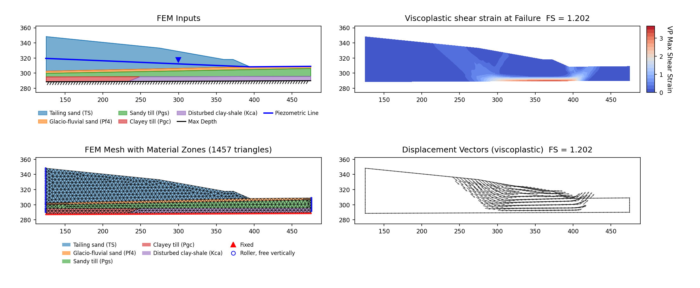

### 🟢 RS2-26: Clarence Cannon dam (Wolff & Harr 1987) {#rs2-26}

Slide2 counterpart: [VP34](rocscience.md#vp34).

**Input files:** [vp034.xlsx](files/rocscience/vp034.xlsx)

| Method | XSLOPE | RS2 SSRM | Slide2 | Wolff & Harr | XSLOPE LEM |
|---|---|---|---|---|---|
| SSRM | 2.294 | 2.29 (+0.2%) | GLE 2.333 / Spencer 2.383 | 2.36 | M-P 2.384 |

The file reconstructs Slide2's four-zone VP34 model of the dam. The RS2 vendor `.fez` has a
six-zone section whose extra zones all sit below or outside the governing mechanism, so they are
not reproduced. The piezometric line stands above the downstream ground, so the section carries
that pond's weight as a traction on the downstream face.

<!-- test: file=files/rocscience/vp034.xlsx, type=fem_ssrm, expected_fs=2.294, element_type=tri6, target_size=15.0, tolerance=0.02, f_min=1.7, f_max=3.0, max_iter=16000, tension_srf=false, k0=1, benchmark=RS2-26, f_stand=2.2890625, f_fail=2.29921875, check=edges -->

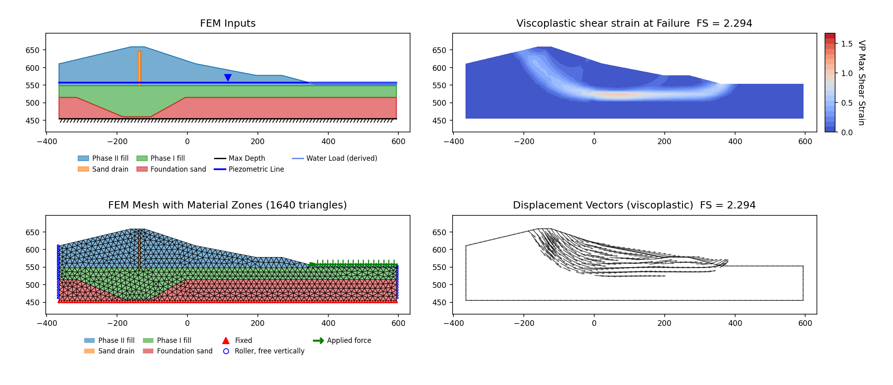

### 🟢 RS2-27: Homogeneous slope, pore pressure by ru {#rs2-27}

Slide2 counterpart: [VP36](rocscience.md#vp36) (Li & Lumb 1987 / Hassan & Wolff 1999).

**Input files:** [vp036.xlsx](files/rocscience/vp036.xlsx)

| Method | XSLOPE | RS2 SSRM | Slide2 | Hassan & Wolff |
|---|---|---|---|---|
| SSRM (1.0 m mesh) | 1.342 | 1.31 (+2.4%) | Bishop 1.339 | 1.334 (deterministic) |

This homogeneous 2:1 slope (c' = 18 kPa, φ' = 30°, ru = 0.2) is the deterministic core
of the [VP36](rocscience.md#vp36) reliability benchmark. Its ru loading is what makes
[RS2-14](#rs2-14) mesh-dependent, but here the factor settles: 1.373 / 1.342 / 1.342 at 1.5 / 1.0 /
0.7 m.

<!-- test: file=files/rocscience/vp036.xlsx, type=fem_ssrm, expected_fs=1.373, element_type=tri6, target_size=1.5, tolerance=0.02, f_min=1.1, f_max=1.6, max_iter=16000, tension_srf=false, k0=1, benchmark=RS2-27-m1.5, f_stand=1.365625, f_fail=1.38125, check=edges -->
<!-- test: file=files/rocscience/vp036.xlsx, type=fem_ssrm, expected_fs=1.342, element_type=tri6, target_size=0.7, tolerance=0.02, f_min=1.1, f_max=1.6, max_iter=16000, tension_srf=false, k0=1, benchmark=RS2-27-m0.7, f_stand=1.334375, f_fail=1.35, check=edges -->
<!-- test: file=files/rocscience/vp036.xlsx, type=fem_ssrm, expected_fs=1.342, element_type=tri6, target_size=1.0, tolerance=0.02, f_min=1.1, f_max=1.6, max_iter=16000, tension_srf=false, k0=1, benchmark=RS2-27, f_stand=1.334375, f_fail=1.35, check=edges -->

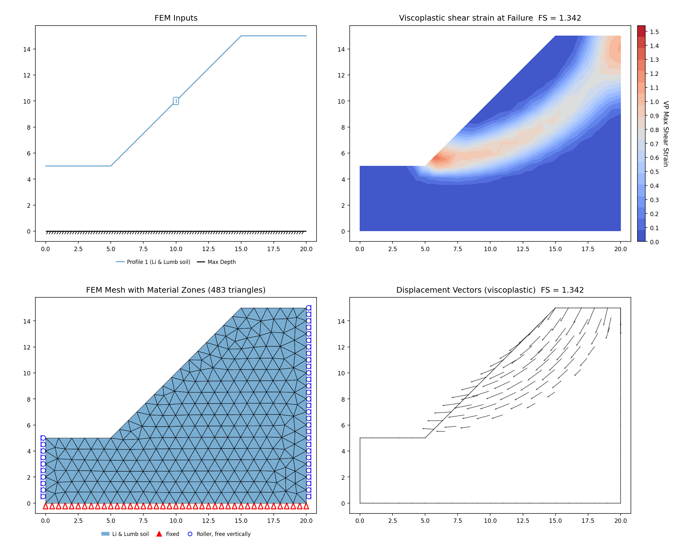

### 🟢 RS2-28: Excavated slope with FE groundwater and matric suction (Ng & Shi 1998) {#rs2-28}

Slide2 counterpart: [VP38](rocscience.md#vp38). A 28° Hong Kong cut (24 m soil over 6 m
bedrock); a steady unsaturated FE groundwater analysis at three far-field heads (H = 61 /
62 / 63 m) supplies both the positive and the negative (matric-suction) pore pressures, and
the SSRM reduces strength to failure. Material (manual Table 1): c′ = 10 kPa, φ′ = 38°,
φ_b = 15°, γ = 16 kN/m³.

**Input files:** [rs2_28a.xlsx](files/rocscience/rs2_28a.xlsx) /
[b](files/rocscience/rs2_28b.xlsx) / [c](files/rocscience/rs2_28c.xlsx) — geometry from the vendor
`.fea` external boundary, with XSLOPE's own steady unsaturated Gardner seepage supplying u because
the vendor result file is empty. The domain is split into a Mohr-Coulomb corridor near the cut and
an elastic outer zone, reproducing the vendor's own material partition; both materials carry its
elastic pair (ν = 0.4, E = 50,000 kPa), and the corridor carries `rock1`'s tensile cap T = 10 kPa,
held static through the reduction as the vendor model does.

The files are built from RS2's native `#028_0N` models, one per head, whose material partition
holds 63% of the domain elastic and is the whole constraint, so the row is scored against Part I
§28. The corridor's tensile cap is an active limit here, because the suction credit raises the
Mohr-Coulomb apex above it.

| H | XSLOPE SSRM | RS2 (SSR) | Slide2 | [Ng & Shi (1998)](https://doi.org/10.1016/S0266-352X(97)00036-0) |
|---|---|---|---|---|
| 61 m | **1.669** | 1.64 (+1.8%) | 1.616 (+3.3%) | 1.636 (+2.0%) |
| 62 m | **1.544** | 1.55 (−0.4%) | 1.535 (+0.6%) | 1.527 (+1.1%) |
| 63 m | **1.406** | 1.41 (−0.3%) | 1.399 (+0.5%) | 1.436 (−2.1%) |

*Published values are from the RS2 *Slope Stability Verification Manual, Part 1*, §28
(Table 2). The manual's §38-derived cross-reference elsewhere quoting "1.56 / 1.46 / 1.32"
does not match this table.*

The vendor fixes the model's truncated left edge in both directions, and the files draw it exactly
vertical, as that restraint means; drawn 0.13 m off vertical as in the vendor file, it would mesh
traction-free under pore pressure that no strength can hold.

<!-- test: file=files/rocscience/rs2_28a.xlsx, type=fem_ssrm, expected_fs=1.669, tolerance=0.02, f_min=1.2, f_max=2.0, max_iter=16000, tension_srf=false, k0=1, benchmark=RS2-28a, f_stand=1.6625, f_fail=1.675, check=edges -->

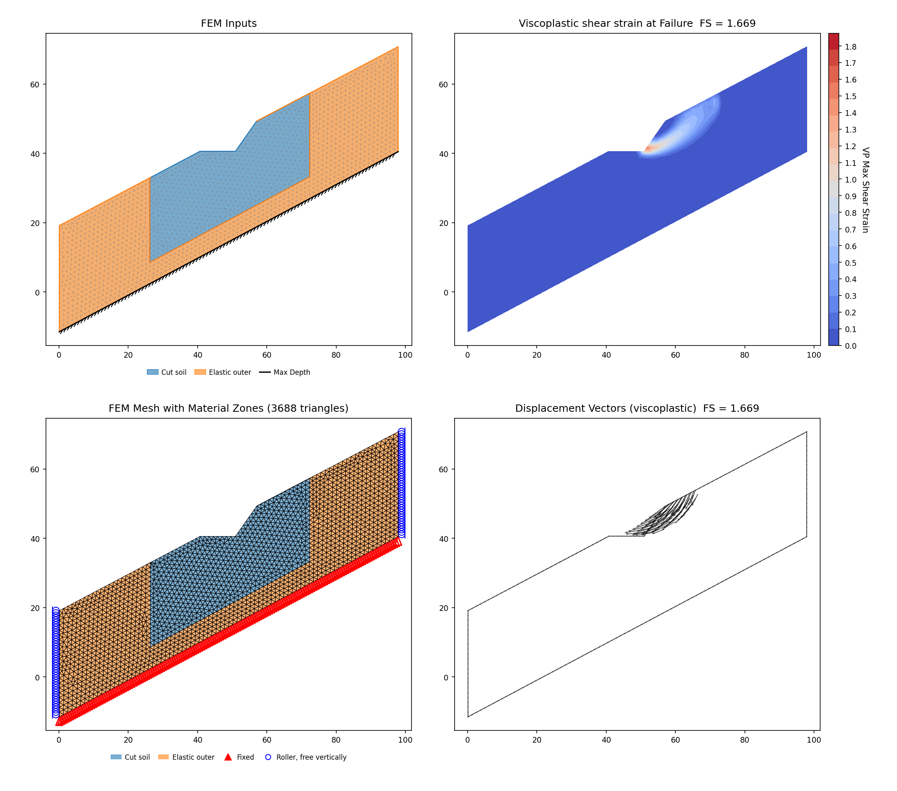

<!-- test: file=files/rocscience/rs2_28b.xlsx, type=fem_ssrm, expected_fs=1.544, tolerance=0.02, f_min=1.2, f_max=2.0, max_iter=16000, tension_srf=false, k0=1, benchmark=RS2-28b, f_stand=1.5375, f_fail=1.55, check=edges -->

<!-- test: file=files/rocscience/rs2_28c.xlsx, type=fem_ssrm, expected_fs=1.406, tolerance=0.02, f_min=1.2, f_max=2.0, max_iter=16000, tension_srf=false, k0=1, benchmark=RS2-28c, f_stand=1.4, f_fail=1.4125, check=edges -->

### 🟢 RS2-29: Geosynthetic-reinforced embankment on soft soil (Tandjiria 2002) {#rs2-29}

Slide2 counterpart: [VP39](rocscience.md#vp39). The manual's §29/§30 headings are swapped.
Both published cases are built — the sand embankment first, then RS2's own clay model.

**Input files:** [vp039c.xlsx](files/rocscience/vp039c.xlsx) (sand) /
[rs2_29clay.xlsx](files/rocscience/rs2_29clay.xlsx) (clay)

| Method | XSLOPE | RS2 SSRM (Part IV VP39 case 3) | RS2 SSRM (native #29) | Slide2 Spencer | Tandjiria |
|---|---|---|---|---|---|
| SSRM (sand case, vp039c, unconstrained) | 1.219 | 1.22 (−0.1%) | 1.25 | 1.209 | 1.219 |

vp039c is the Slide2 VP39 **case 3** model — sand fill, no reinforcement — so its referee is Part
IV VP39 case 3's SSR 1.22. Neither that model nor RS2's native rebuild carries an SSR polygon, so
the corpus run is unconstrained too, and the three answers agree within 2.5%; the reduction
localizes on a shallow compound surface through the c = 0 fill face and the soft-clay toe.

<!-- test: file=files/rocscience/vp039c.xlsx, type=fem_ssrm, expected_fs=1.219, element_type=tri6, target_size=0.7, tolerance=0.02, f_min=0.9, f_max=1.7, max_iter=16000, tension_srf=false, k0=1, benchmark=RS2-29, f_stand=1.2125, f_fail=1.225, check=edges -->

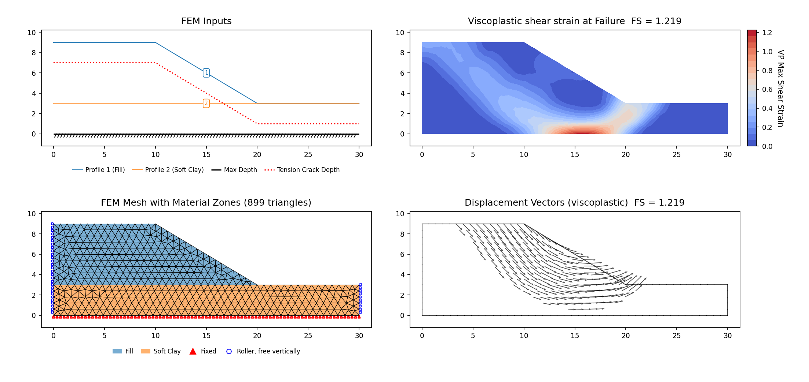

#### The clay case: RS2's tension crack is geometry

RS2's unreinforced clay model (`slope stability #029_clay`, SSR 0.99) cuts the crest 2.06 m down,
the crack depth 2c/γ, and puts the removed wedge's weight back on the cut as a vertical surcharge;
both materials are c = 20 kPa, φ = 0, capped at T = 20 kPa. `rs2_29clay.xlsx` transcribes that model
on the vendor's own boundary, whose toe makes the face exactly 30°, where the Slide2 figure rounds
the toe; on the otherwise identical model that rounding is worth +1.9% (0.978 → 0.997), so the two
geometries are kept apart.

| Method | XSLOPE | RS2 SSR (Part I #29, clay) | RS2 SSR (Part IV VP39 case 1) |
|---|---|---|---|
| SSRM (clay case, rs2_29clay) | 0.997 | 0.99 (+0.7%) | 0.97 |

Part I's 0.99 is the referee, the published factor for the model this file transcribes; Part IV's
VP39 case 1 is a different model that leaves the crest uncut. The vendor drops each material's
tensile strength to zero once it fails in tension, which XSLOPE's constant cap cannot follow, but
with the crack cut out of the geometry the model reads the same at the peak cap and at the
residual.

<!-- test: file=files/rocscience/rs2_29clay.xlsx, type=fem_ssrm, expected_fs=0.997, element_type=tri6, target_size=0.7, tolerance=0.02, f_min=0.8, f_max=1.4, max_iter=16000, tension_srf=false, k0=1, benchmark=RS2-29-clay, f_stand=0.9875, f_fail=1.00625, check=edges -->

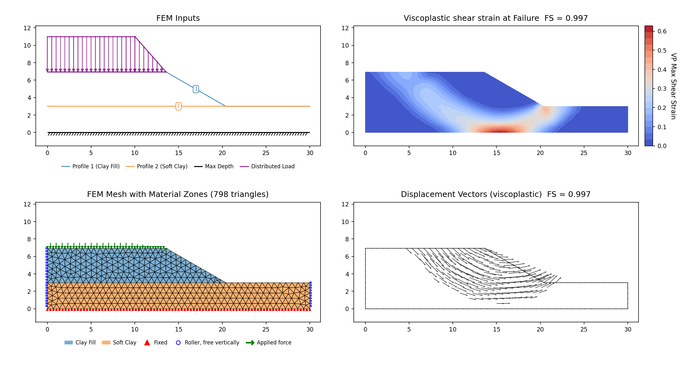

### 🟡 RS2-30: Homogeneous slope, power-curve strength (Perry 1993) {#rs2-30}

Slide2 counterpart: [VP40](rocscience.md#vp40). Swapped heading (see [#29](#rs2-29)).

**Input files:** [vp040.xlsx](files/rocscience/vp040.xlsx)

| Method | XSLOPE | RS2 SSR (Part IV VP40, constrained) | RS2 SSR (native #030, unconstrained) | Slide2 Janbu | Perry |
|---|---|---|---|---|---|
| SSRM, under the vendor model's own SSR exclusion areas | 1.023 | 0.97 (+5.5%) | 0.91 | 0.944 | 0.98 (+4.4%) |

`vp040.xlsx` carries Perry's power curve τ = A σ'b (A = 2, b = 0.7), as the Slide2-import
model `#040` does, where RS2's native rebuild `#030` carries a fitted Generalized Hoek-Brown
envelope; so the file is the Part IV VP40 model, and its referee is that model's SSR 0.97. `#040`
draws three SSR exclusion areas whose materials cannot yield (50.65% of the domain by the vendor's
own materials, 50.4% by the polygons, the two readings agreeing to a quarter of a percent), and the
file carries all three as "SSR elastic" overlays. Constrained that way the SSRM lands at **1.023**,
+5.5% on the published 0.97, a difference the like-for-like pairing does not account for.

<!-- test: file=files/rocscience/vp040.xlsx, type=fem_ssrm, expected_fs=1.023, element_type=tri6, target_size=2.0, tolerance=0.02, f_min=0.5, f_max=1.5, max_iter=16000, k0=1, benchmark=RS2-30 -->

### 🟢 RS2-31: M-C vs power curve (Baker 2003 ex. 1) {#rs2-31}

Slide2 counterpart: [VP44](rocscience.md#vp44).

**Input files:** [vp044a.xlsx](files/rocscience/vp044a.xlsx),
[vp044b.xlsx](files/rocscience/vp044b.xlsx),
[vp044c.xlsx](files/rocscience/vp044c.xlsx),
[vp044d.xlsx](files/rocscience/vp044d.xlsx)

| Case | XSLOPE SSRM | Governing published | Slide2 |
|---|---|---|---|
| vp044b — M-C, c′ = 11.64 kPa, φ′ = 24.7° | 1.529 | RS2 SSRM **1.53** (−0.1%) | — |
| vp044c — M-C, local-linear c′ = 0.39 kPa, φ′ = 38.6° | 0.969 | RS2 SSRM **0.98** (−1.1%) | — |
| vp044a — Baker's power curve, τ = 1.107·σn0.86 | 0.973 | **Baker 0.97** (+0.3%) | Janbu 0.921 / Spencer 0.960 |
| vp044d — RS2's Generalized Hoek-Brown fit of that curve | 1.115 | RS2 SSRM **1.11** (+0.5%) | — |

**The power-curve problem is solved with two different strength models.** RS2's Part 1 table
labels its row "Power Curve | SRF (Generalized Hoek-Brown) | 1.11", and its model carries a
Generalized Hoek-Brown fit to Baker's curve, where the Slide2-import twin keeps the literal law
that vp044a carries. The two envelopes cross at σn ≈ 40 kPa, and below it the fit is
the stronger — by 14% at 12.5 kPa, by 25% at 5 kPa and by 43% at 1 kPa — while the normal stresses
on this 6 m slope's critical surface run about 0.6–12.5 kPa. That is why RS2's 1.11 sits 15.6%
above Slide2's own Spencer on an identical slope.

**vp044d closes the comparison.** Carrying RS2's own envelope through XSLOPE's `hb` material
option, the SSRM returns **1.115** against RS2's 1.11 (+0.5%). Its Hoek-Brown inputs are
back-derived from the vendor's mb / s / a and reproduce all three to six significant
figures.

<!-- test: file=files/rocscience/vp044b.xlsx, type=fem_ssrm, expected_fs=1.529, element_type=tri6, target_size=0.5, tolerance=0.02, f_min=1.1, f_max=2.0, max_iter=16000, tension_srf=false, k0=1, benchmark=RS2-31a, f_stand=1.521875, f_fail=1.5359375, check=edges -->
<!-- test: file=files/rocscience/vp044c.xlsx, type=fem_ssrm, expected_fs=0.969, element_type=tri6, target_size=0.5, tolerance=0.02, f_min=0.6, f_max=1.4, max_iter=16000, tension_srf=false, k0=1, benchmark=RS2-31b, f_stand=0.9625, f_fail=0.975, check=edges -->
<!-- test: file=files/rocscience/vp044a.xlsx, type=fem_ssrm, expected_fs=0.973, element_type=tri6, target_size=0.5, tolerance=0.02, f_min=0.5, f_max=1.6, max_iter=16000, k0=1, benchmark=RS2-31c, f_stand=0.9640625, f_fail=0.98125, check=edges -->
<!-- test: file=files/rocscience/vp044d.xlsx, type=fem_ssrm, expected_fs=1.115, element_type=tri6, target_size=0.5, tolerance=0.02, f_min=0.7, f_max=1.6, max_iter=16000, k0=1, benchmark=RS2-31d, f_stand=1.1078125, f_fail=1.121875, check=edges -->

**Mohr-Coulomb case (vp044b)**

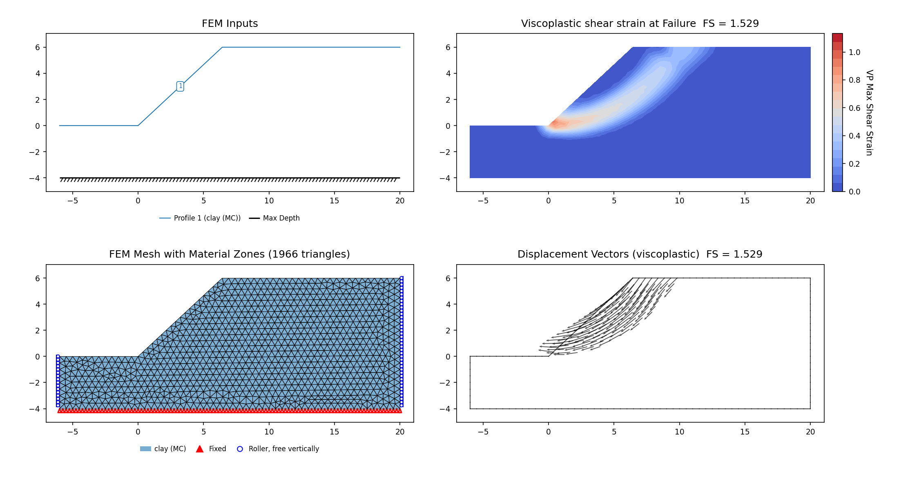

**Mohr-Coulomb case (vp044c)**

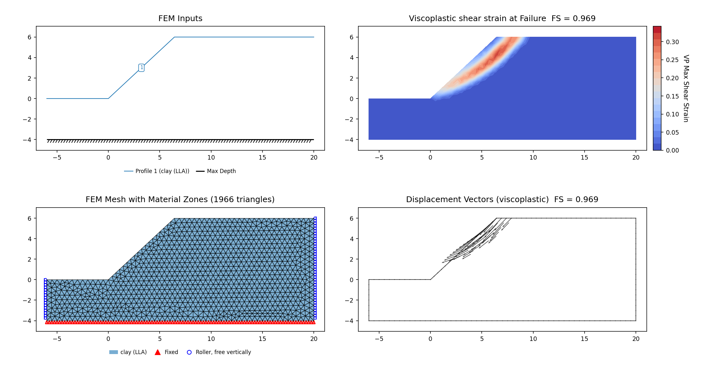

**Power-curve case (vp044a)**

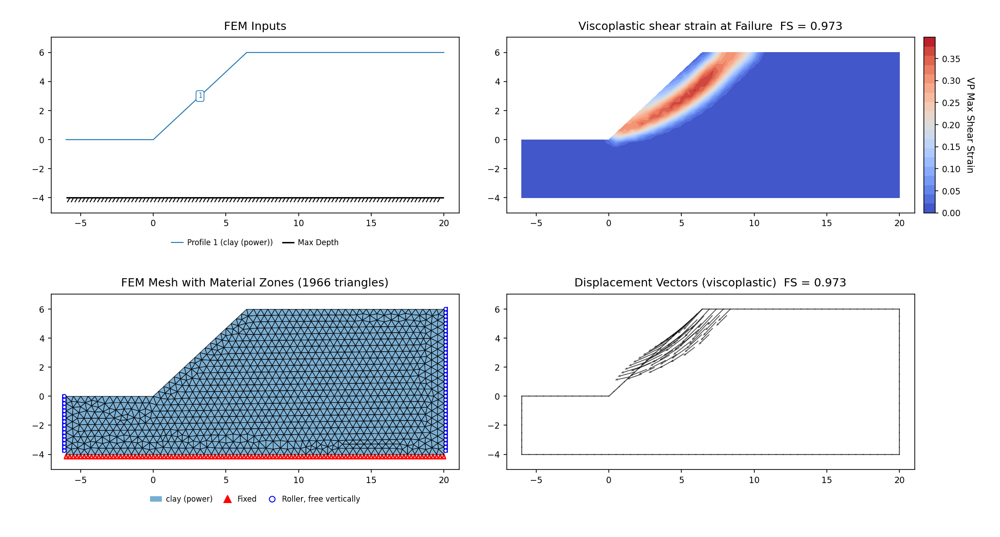

**RS2's Generalized Hoek-Brown fit of the same curve (vp044d)**

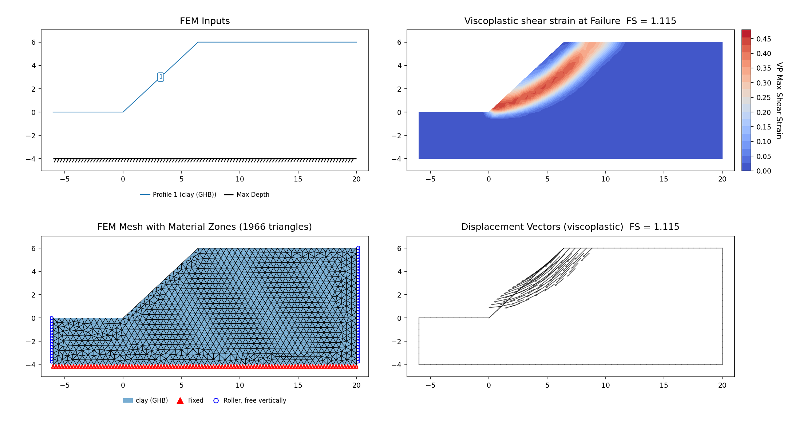

### 🟢 RS2-32: M-C vs power curve II (Baker 2003 ex. 2) {#rs2-32}

Slide2 counterpart: [VP45](rocscience.md#vp45). The RS2 manual's problem 32 heading names a
different problem from the one its body presents, Baker's example 2, which is reproduced here.

**Input files:** [vp045a.xlsx](files/rocscience/vp045a.xlsx),
[vp045b.xlsx](files/rocscience/vp045b.xlsx)

| Method | XSLOPE | RS2 SSRM (Part IV VP45) | RS2 SSRM (native #32, GHB fit) | Slide2 Spencer |
|---|---|---|---|---|
| SSRM (vp045a, M-C) | 2.790 | 2.83 (−1.4%) | — | — |
| SSRM (vp045b, power curve) | 2.637 | 2.63 (+0.3%) | 2.74 | 2.662 |

RS2 solves the power-curve half on two strength models. Part IV's VP45 model carries the literal
power law, as vp045b does, and is this half's referee; the native `#032-powercurve` model carries a
fitted Generalized Hoek-Brown envelope, which runs a few percent stronger over the slope's
working-stress range and sits above both power-curve answers.

<!-- test: file=files/rocscience/vp045a.xlsx, type=fem_ssrm, expected_fs=2.790, element_type=tri6, target_size=1.0, tolerance=0.02, f_min=2.3, f_max=3.4, max_iter=16000, tension_srf=false, k0=1, benchmark=RS2-32 -->
<!-- test: file=files/rocscience/vp045b.xlsx, type=fem_ssrm, expected_fs=2.637, element_type=tri6, target_size=1.0, tolerance=0.02, f_min=1.8, f_max=3.6, max_iter=16000, k0=1, benchmark=RS2-32b, f_stand=2.6296875, f_fail=2.64375, check=edges -->

**Mohr-Coulomb case (vp045a)**

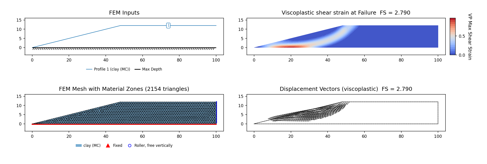

**Power-curve case (vp045b)**

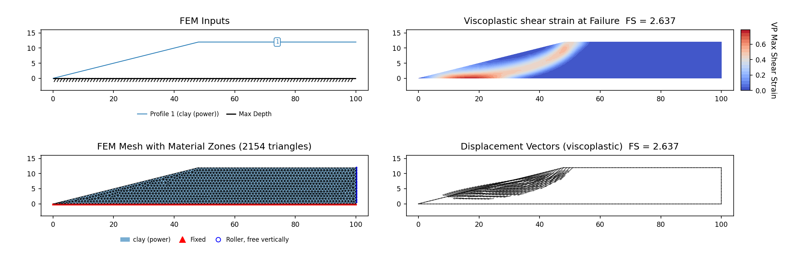

### 🟢 RS2-33: Homogeneous slope with tension crack and water table (P&D test slope 2) {#rs2-33}

Slide2 counterpart: [VP56](rocscience.md#vp56). Swapped heading.

**Input files:** [vp056.xlsx](files/rocscience/vp056.xlsx)

| Method | XSLOPE | RS2 SSRM | Eight-program LEM table |
|---|---|---|---|
| SSRM | 1.269 | 1.28 (−0.9%) | 1.03–1.32 |

The model's dry tension crack has no FEM representation, worth ~2–3% here.

<!-- test: file=files/rocscience/vp056.xlsx, type=fem_ssrm, expected_fs=1.269, element_type=tri6, target_size=4.0, tolerance=0.02, f_min=0.9, f_max=1.7, max_iter=16000, tension_srf=false, k0=1, benchmark=RS2-33, f_stand=1.2625, f_fail=1.275, check=edges -->

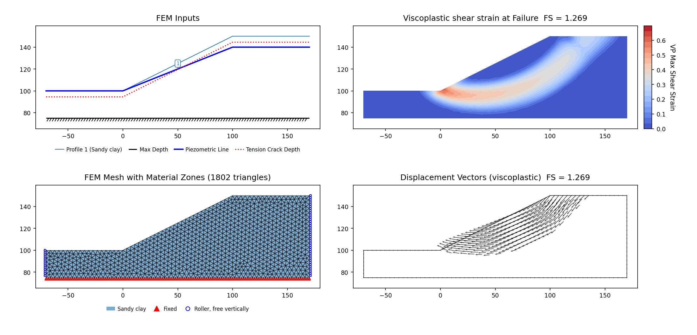

### 🟢 RS2-34: M-C vs power curve III (Baker 2003 ex. 3, London clay) {#rs2-34}

Slide2 counterpart: [VP61](rocscience.md#vp61).

**Input files:** [vp061a.xlsx](files/rocscience/vp061a.xlsx),
[vp061b.xlsx](files/rocscience/vp061b.xlsx)

| Method | XSLOPE | RS2 SSRM | Slide2 Spencer | Baker |
|---|---|---|---|---|
| SSRM (vp061b, M-C) | 1.373 | 1.38 (−0.5%) | — | — |
| SSRM (vp061a, power curve) | 1.497 | 1.47 (+1.8%) | 1.47 | 1.48 |

<!-- test: file=files/rocscience/vp061b.xlsx, type=fem_ssrm, expected_fs=1.373, element_type=tri6, target_size=0.5, tolerance=0.02, f_min=1.0, f_max=1.9, max_iter=16000, tension_srf=false, k0=1, benchmark=RS2-34, f_stand=1.365625, f_fail=1.3796875, check=edges -->
<!-- test: file=files/rocscience/vp061a.xlsx, type=fem_ssrm, expected_fs=1.497, element_type=tri6, target_size=0.5, tolerance=0.02, f_min=1.0, f_max=2.2, max_iter=16000, k0=1, benchmark=RS2-34b, f_stand=1.4875, f_fail=1.50625, check=edges -->

**Mohr-Coulomb case (vp061b)**

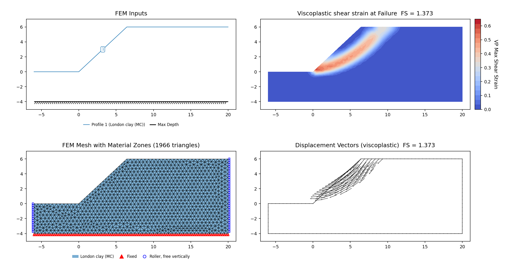

**Power-curve case (vp061a)**

### 🟢 RS2-36: Seepage analysis, homogeneous slope (D&W Fig 6.37) {#rs2-36}

Slide2 counterpart: [VP71](rocscience.md#vp71) (= Slide2 VP71, not
[VP70](rocscience.md#vp70)).

**Input files:** [vp071a.xlsx](files/rocscience/vp071a.xlsx),
[vp071b.xlsx](files/rocscience/vp071b.xlsx)

| Method | XSLOPE | RS2 SSRM | Referee | XSLOPE LEM |
|---|---|---|---|---|
| SSRM (vp071a, FE seepage) | 1.111 | 1.12 (−0.8%) | 1.138 (−2.4%) | 1.132 |
| SSRM (vp071b, piezo approximation) | 1.111 | 1.12 (−0.8%) | 1.141 (−2.6%) | 1.132 |

The seepage case runs on a tri6 mesh.

<!-- test: file=files/rocscience/vp071a.xlsx, type=fem_ssrm, expected_fs=1.111, tolerance=0.01, f_min=0.7, f_max=1.6, max_iter=16000, tension_srf=false, k0=1, benchmark=RS2-36a, f_stand=1.1078125, f_fail=1.11484375, check=edges -->
<!-- test: file=files/rocscience/vp071b.xlsx, type=fem_ssrm, expected_fs=1.111, element_type=tri6, target_size=4.4, tolerance=0.01, f_min=0.7, f_max=1.6, max_iter=16000, tension_srf=false, k0=1, benchmark=RS2-36b, f_stand=1.1078125, f_fail=1.11484375, check=edges -->

**FE-seepage case (vp071a)**

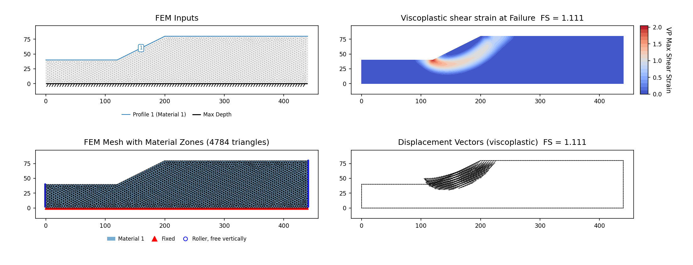

**Piezometric-line case (vp071b)**

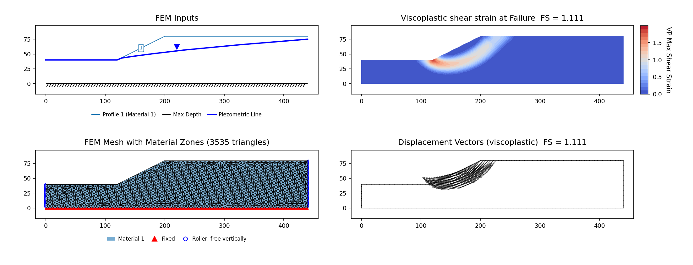

### ⊘ RS2-37: Embankment with layered foundation (D&W Fig 6.39) {#rs2-37}

Slide2 counterpart: [VP72](rocscience.md#vp72).

| Published | RS2 SSRM (table) | RS2 SSRM (convergence graph) | Slide2 | Referee |
|---|---|---|---|---|
| D&W Fig 6.39 | 0.95 | 1.1 | 1.15 / 1.16 | 1.11 |

*Unconfirmed*: the two programs do not find the same mechanism — RS2's is the artesian
downstream-toe slide, where XSLOPE's strength reduction localizes on a deeper surface — so no
difference is derived. The vendor's SSR polygon on this problem is a ~12.5 m band traced along the
slip surface it wants, 0.7% of the domain, thinner than this model's mesh, so it is not carried;
the artesian toe is discussed in the Slide2 [VP72](rocscience.md#vp72) section.

### 🟢 RS2-38: Cohesionless embankment on saturated clay foundation (D&W Fig 7.12) {#rs2-38}

Slide2 counterpart: [VP74](rocscience.md#vp74) (Duncan & Wright 2005, Fig 7.12).

**Input files:** [vp074.xlsx](files/rocscience/vp074.xlsx)

A cohesionless sand embankment (c = 0, φ = 40°) on a saturated clay foundation (c = 2500 psf,
φ = 0); the critical surface is the deep foundation mechanism through the undrained clay.

| Method | XSLOPE | RS2 SSRM (Part 4) | RS2 SSRM (Part 2) | Slide2 Spencer | D&W referee | XSLOPE LEM |
|---|---|---|---|---|---|---|
| SSRM (7.0 m mesh) | 1.201 | 1.17 (+2.6%) | 1.21 | 1.20 circular / 1.18 non-circular | 1.22 (Bishop) / 1.19 (Spencer) | Bishop/Spencer/Janbu 1.219 / 1.194 / 1.161 |

RS2 re-ran this problem between its two manuals, and XSLOPE sits between the two published
factors.

<!-- test: file=files/rocscience/vp074.xlsx, type=fem_ssrm, expected_fs=1.201, element_type=tri6, target_size=7.0, tolerance=0.02, f_min=0.9, f_max=1.6, max_iter=16000, tension_srf=false, k0=1, benchmark=RS2-38, f_stand=1.1953125, f_fail=1.20625, check=edges -->

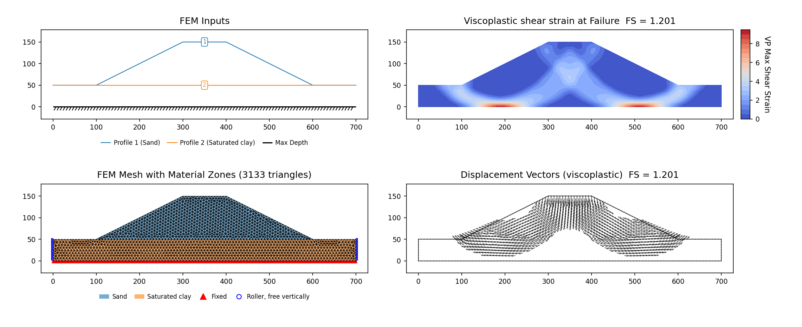

### 🟢 RS2-39/41/43: Earth embankment, infinite-slope mechanism (Duncan & Wright) {#rs2-39}

RS2 Parts I–III problems 41 (Slide2 [VP79](rocscience.md#vp79), D&W Fig 14.4) and 43 (Slide2
[VP81](rocscience.md#vp81), D&W Fig 14.7) are cohesionless embankments (c = 0, φ = 30°) on an
undrained φ = 0 foundation, each analyzed for a very shallow infinite-slope skin and a deep
surface. Problem 39 (VP76, D&W Fig 7.19), the FE-seepage member of the family, is *planned*.

**Input files:** [vp079.xlsx](files/rocscience/vp079.xlsx) (RS2-41, Fig 14.4) ·
[vp081.xlsx](files/rocscience/vp081.xlsx) (RS2-43, Fig 14.7)

| Case | XSLOPE SSRM | Governing published | RS2 SSRM | Slide2 Bishop/Spencer |
|---|---|---|---|---|
| VP79 infinite slope (unconstrained) | 1.431 | D&W referee 1.44 (−0.6%) | 1.47 (−2.7%) | 1.44 |
| VP81 under the vendor model's SSR Exclusion Area | 1.228 | RS2 SSRM 1.23 (−0.2%) — Part IV VP81 case 1, deep | 1.23 (−0.2%) | 1.15–1.16 (infinite) |

On VP79 the unconstrained SSRM finds the infinite-slope skin, −0.6% from the Duncan & Wright
referee and inside the RS2 1.43–1.47 band. VP81's vendor model
(`slope stability #081_-_duncan_page220_figure_14-7_deep.fez`) holds a small block, 2.7% of the
domain, at full strength with an SSR Exclusion Area; carried as its complement, the SSRM reads
**1.228**, −0.2% on that model's own published value, Part IV VP81 case 1's SSR 1.23.
The 1.19 published for this problem is a different model's number, RS2's native shallow case at
Part II problem 43. Unconstrained, the file localizes the c = 0 skin on the fine mesh, as on
[RS2-40](#rs2-40). Both are taken at the 1.5 m mesh.

<!-- test: file=files/rocscience/vp079.xlsx, type=fem_ssrm, expected_fs=1.431, element_type=tri6, target_size=1.5, tolerance=0.02, f_min=1.1, f_max=1.9, max_iter=16000, tension_srf=false, k0=1, benchmark=RS2-41, f_stand=1.425, f_fail=1.4375, check=edges -->
<!-- test: file=files/rocscience/vp081.xlsx, type=fem_ssrm, expected_fs=1.228, element_type=tri6, target_size=1.5, tolerance=0.02, f_min=0.9, f_max=1.5, max_iter=16000, tension_srf=false, ssr_zone=128;34;128;15;128;0;0;0;0;15;35;15;39.1558;15;71.1539;29.9985;73;34;128;34, k0=1, benchmark=RS2-43, f_stand=1.21875, f_fail=1.2375, check=edges -->

**VP79 (RS2-41, D&W Fig 14.4)**

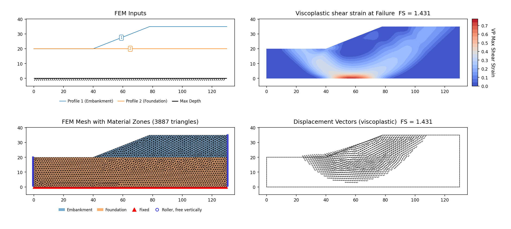

**VP81 (RS2-43, D&W Fig 14.7)**

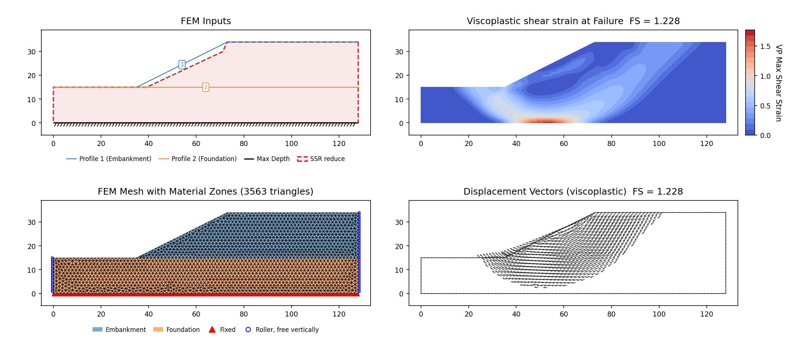

### 🟡 RS2-40: Dam with impermeable foundation (D&W Fig 7.24) {#rs2-40}

Slide2 counterpart: [VP77](rocscience.md#vp77). RS2 runs the dam twice, once with a
finite-element seepage field and once with a drawn piezometric line, and publishes an SSR for
each; both are built here.

**Input files:** [vp077b.xlsx](files/rocscience/vp077b.xlsx) (piezometric),
[vp077a.xlsx](files/rocscience/vp077a.xlsx) (finite-element seepage)

| Case | XSLOPE SSRM | Published |
|---|---|---|
| Piezometric, filter off (true global minimum) | 1.109 | saturated seepage-parallel infinite slope **1.190** (−6.8%) |
| Piezometric, `min_slip_depth` = 30 ft (deep) | 1.521 | RS2 SSRM **1.53** (−0.6%) |
| Finite-element seepage | 1.590 | RS2 SSRM **1.52** (+4.6%) |

**Two mechanisms.** As on [RS2-4](#rs2-4), the cohesionless downstream shell can fail as a
surface-parallel skin, and here the piezometric line daylights on that face near the toe, so the
skin is saturated; its closed form is the seepage-parallel infinite slope, **1.190**. With the
depth filter off the SSRM finds that skin and reads 1.109 against it, −6.8%: the closed form
prices a uniformly saturated infinite slope, where the band the model finds is finite and saturated
only between the daylight and the toe, so it is shown beside and does not set the dot. RS2 reports
the other mechanism, a surface from the crest down through the clay core and out along the
foundation contact under the downstream shell. Excluding anything shallower than 30 ft with
[`min_slip_depth`](../fem/overview.md#surficial-skin-failures-and-the-minimum-slip-depth-filter)
returns that band, at **1.521**, −0.6% on RS2's 1.53:

| `min_slip_depth` (ft) | off | 15 | 20 | 30 | 50 | 80 |
|---|---|---|---|---|---|---|
| XSLOPE SSRM | 1.109 | 1.229 | 1.452 | **1.521** | 1.521 | 1.583 |

The 30 and 50 ft cutoffs return the same 1.521, so the deep answer is the one they agree on; at
80 ft the cutoff excludes the upper reach of the basal band along with the skin. A step of
refinement moves the deep value from 1.521 at the 12.4 ft mesh (2,223 tri6) to 1.470 at 8 ft
(5,220 tri6), and the skin drifts as well, so both are reported at the 12.4 ft mesh.

**The finite-element seepage case** runs [vp077a.xlsx](files/rocscience/vp077a.xlsx), the file the
limit-equilibrium side is scored on ([VP77](rocscience.md#vp77)): it solves the model's own
boundary set on the 12.4 ft tri6 mesh and reduces the strengths on that mesh and field. It reads
**1.590**, +4.6% on RS2's 1.52; excluding everything shallower than 30 ft returns **1.607**, one
step of the search higher, so there is no shallow skin to exclude on this case.

<!-- test: file=files/rocscience/vp077b.xlsx, type=mesh_elements, element_type=tri6, target_size=12.4, expected_elements=2223, benchmark=RS2-40-mesh -->
<!-- test: file=files/rocscience/vp077b.xlsx, type=mesh_elements, element_type=tri6, target_size=8.0, expected_elements=5220, benchmark=RS2-40-mesh-fine -->
<!-- test: file=files/rocscience/vp077b.xlsx, type=fem_ssrm, expected_fs=1.109, element_type=tri6, target_size=12.4, tolerance=0.02, f_min=1.1, f_max=2.2, max_iter=16000, k0=1, benchmark=RS2-40 -->
<!-- test: file=files/rocscience/vp077b.xlsx, type=fem_ssrm, expected_fs=1.470, element_type=tri6, target_size=8.0, tolerance=0.02, f_min=1.1, f_max=2.2, max_iter=16000, min_slip_depth=30, k0=1, benchmark=RS2-40-deep-m8, f_stand=1.4609375, f_fail=1.478125, check=edges -->
<!-- test: file=files/rocscience/vp077b.xlsx, type=fem_ssrm, expected_fs=1.229, element_type=tri6, target_size=12.4, tolerance=0.02, f_min=1.1, f_max=2.2, max_iter=16000, min_slip_depth=15, k0=1, benchmark=RS2-40-d15, f_stand=1.2203125, f_fail=1.2375, check=edges -->
<!-- test: file=files/rocscience/vp077b.xlsx, type=fem_ssrm, expected_fs=1.452, element_type=tri6, target_size=12.4, tolerance=0.02, f_min=1.1, f_max=2.2, max_iter=16000, min_slip_depth=20, k0=1, benchmark=RS2-40-d20, f_stand=1.44375, f_fail=1.4609375, check=edges -->
<!-- test: file=files/rocscience/vp077b.xlsx, type=fem_ssrm, expected_fs=1.521, element_type=tri6, target_size=12.4, tolerance=0.02, f_min=1.1, f_max=2.2, max_iter=16000, min_slip_depth=50, k0=1, benchmark=RS2-40-d50, f_stand=1.5125, f_fail=1.5296875, check=edges -->
<!-- test: file=files/rocscience/vp077b.xlsx, type=fem_ssrm, expected_fs=1.583, element_type=tri6, target_size=12.4, tolerance=0.02, f_min=1.1, f_max=2.2, max_iter=16000, min_slip_depth=80, k0=1, benchmark=RS2-40-d80, f_stand=1.58125, f_fail=1.5984375, check=edges -->
<!-- test: file=files/rocscience/vp077b.xlsx, type=fem_ssrm, expected_fs=1.521, element_type=tri6, target_size=12.4, tolerance=0.02, f_min=1.1, f_max=2.2, max_iter=16000, min_slip_depth=30, k0=1, benchmark=RS2-40-deep, f_stand=1.5125, f_fail=1.5296875, check=edges -->
<!-- test: file=files/rocscience/vp077a.xlsx, type=fem_ssrm, expected_fs=1.590, element_type=tri6, target_size=12.4, tolerance=0.02, f_min=1.1, f_max=2.2, max_iter=16000, k0=1, seep=steady, benchmark=RS2-40-seep, f_stand=1.58125, f_fail=1.5984375, check=edges -->
<!-- test: file=files/rocscience/vp077a.xlsx, type=fem_ssrm, expected_fs=1.607, element_type=tri6, target_size=12.4, tolerance=0.02, f_min=1.1, f_max=2.2, max_iter=16000, min_slip_depth=30, k0=1, seep=steady, benchmark=RS2-40-seep-d30, f_stand=1.5984375, f_fail=1.615625, check=edges -->

**Filter off — the saturated downstream face skin (vp077b)**

**`min_slip_depth` = 30 ft — the basal band RS2 draws (vp077b)**

**Finite-element seepage, unconstrained (vp077a)**

### 🟢 RS2-42: James dike {#rs2-42}

Slide2 counterpart: [VP75](rocscience.md#vp75).

**Input files:** [vp075.xlsx](files/rocscience/vp075.xlsx)

| Method | XSLOPE | RS2 SSRM (Part IV VP75) | RS2 SSRM (native #42) | Slide2 noncircular LEM | D&W non-circular |
|---|---|---|---|---|---|
| SSRM | 1.214 | 1.19 (+2.0%) | 1.26 | 1.11–1.16 | 1.17 |

The row is scored against Part IV VP75's RS2 SSRM, the value published for the model vp075.xlsx is
transcribed from. As on [RS2-11](#rs2-11), RS2 ran this problem twice on input-identical models
that differ only in the SRF tensile setting; the Part IV import holds tension as XSLOPE does, on a
mesh of 3031 elements against the native model's 1080.

<!-- test: file=files/rocscience/vp075.xlsx, type=fem_ssrm, expected_fs=1.214, element_type=tri6, target_size=1.85, tolerance=0.02, f_min=0.8, f_max=1.8, max_iter=16000, tension_srf=false, k0=1, benchmark=RS2-42, f_stand=1.20625, f_fail=1.221875, check=edges -->

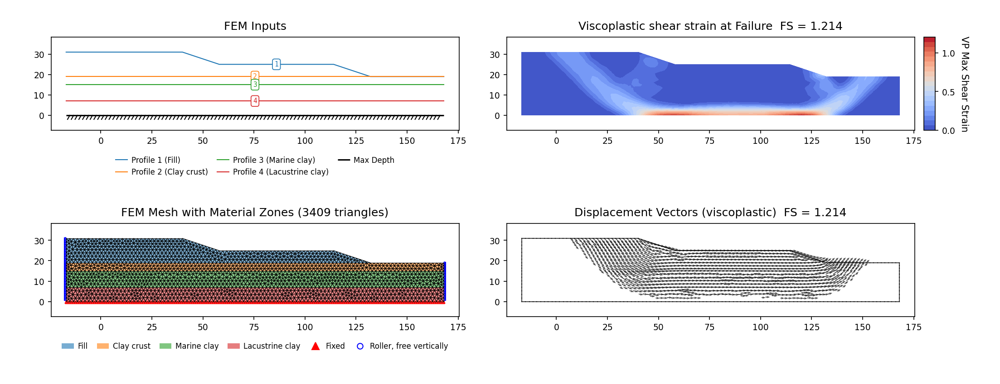

### 🟢 RS2-44: Seepage analysis for an earth embankment (D&W Fig 14.20-a) {#rs2-44}

Slide2 counterpart: [VP82](rocscience.md#vp82) (= Slide2 VP82, not
[VP76](rocscience.md#vp76) — §39's body carries VP76).

**Input files:** [vp082.xlsx](files/rocscience/vp082.xlsx)

| Method | XSLOPE | RS2 SSRM | Slide2 LEM | Referee |
|---|---|---|---|---|
| SSRM | 1.490 | 1.51 (−1.3%) | 1.532 / 1.541 | 1.528–1.542 (−2.5%) |

<!-- test: file=files/rocscience/vp082.xlsx, type=fem_ssrm, expected_fs=1.490, element_type=tri6, target_size=2.0, tolerance=0.02, f_min=1.0, f_max=2.1, max_iter=16000, tension_srf=false, k0=1, benchmark=RS2-44, f_stand=1.48125, f_fail=1.4984375, check=edges -->

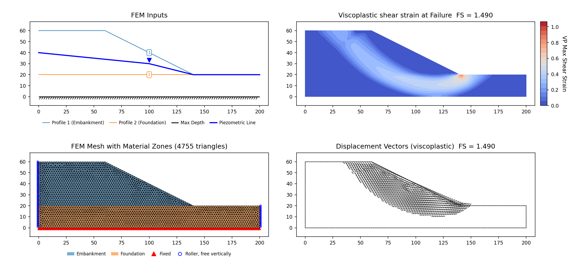

### 🟢 RS2-45: Varying undrained shear strength profiles (D&W Fig 14.20-b) {#rs2-45}

Slide2 counterpart: [VP83](rocscience.md#vp83).

**Input files:** [vp083a.xlsx](files/rocscience/vp083a.xlsx),
[vp083b.xlsx](files/rocscience/vp083b.xlsx)

| Method | XSLOPE | RS2 SSRM | D&W referee |
|---|---|---|---|
| SSRM (vp083a) | 1.314 | 1.32 (−0.5%) | 1.28–1.33 (inside) |
| SSRM (vp083b) | 1.330 | 1.32 (+0.8%) | 1.28–1.33 (inside) |

Both cases land inside the referee band. [RS2-19](#rs2-19), the other φ = 0 foundation problem,
reads +5.5% against RS2's own SSRM and keeps its caveat.

<!-- test: file=files/rocscience/vp083a.xlsx, type=fem_ssrm, expected_fs=1.314, element_type=tri6, target_size=4.0, tolerance=0.02, f_min=0.9, f_max=1.9, max_iter=16000, tension_srf=false, k0=1, benchmark=RS2-45a, f_stand=1.30625, f_fail=1.321875, check=edges -->
<!-- test: file=files/rocscience/vp083b.xlsx, type=fem_ssrm, expected_fs=1.330, element_type=tri6, target_size=4.0, tolerance=0.02, f_min=0.9, f_max=1.9, max_iter=16000, tension_srf=false, k0=1, benchmark=RS2-45b, f_stand=1.321875, f_fail=1.3375, check=edges -->

**Case a (vp083a)**

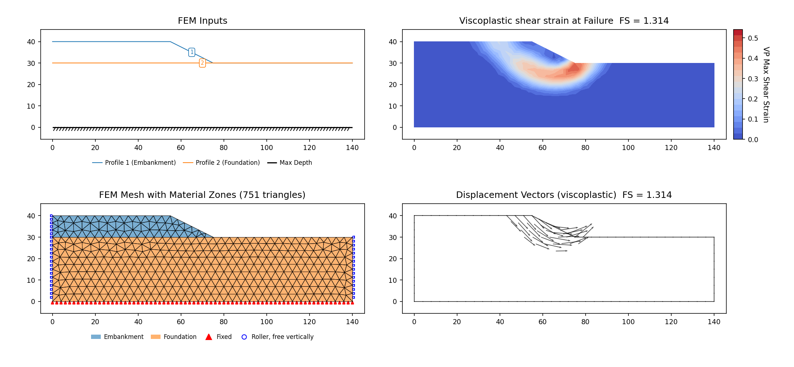

**Case b (vp083b)**

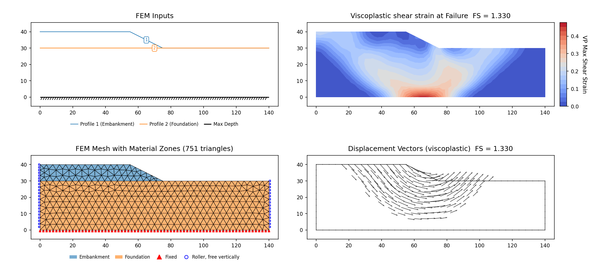

### 🟢 RS2-46: Varying undrained strength profiles II (D&W Fig 15.9, cu = 300 + cz·z) {#rs2-46}

Slide2 counterpart: [VP84](rocscience.md#vp84).

**Input files:** [vp084a–d](files/rocscience/vp084a.xlsx)

| Method | XSLOPE | RS2 SSRM | Duncan & Wright |
|---|---|---|---|
| SSRM (vp084a) | 0.773 | 0.78 (−0.9%) | 0.75 (+3.1%) |
| SSRM (vp084b) | 0.929 | 0.93 (−0.1%) | 0.90 (+3.2%) |
| SSRM (vp084c) | 1.043 | 1.05 (−0.7%) | 1.03 (+1.3%) |
| SSRM (vp084d) | 1.145 | 1.15 (−0.4%) | 1.13 (+1.3%) |

*XSLOPE sits +1.3 to +3.2% above the Duncan & Wright column, the φ = 0 pattern.*

<!-- test: file=files/rocscience/vp084a.xlsx, type=fem_ssrm, expected_fs=0.773, element_type=tri6, target_size=4.0, tolerance=0.02, f_min=0.4, f_max=1.3, max_iter=16000, tension_srf=false, k0=1, benchmark=RS2-46a, f_stand=0.765625, f_fail=0.7796875, check=edges -->
<!-- test: file=files/rocscience/vp084b.xlsx, type=fem_ssrm, expected_fs=0.929, element_type=tri6, target_size=4.0, tolerance=0.02, f_min=0.5, f_max=1.4, max_iter=16000, tension_srf=false, k0=1, benchmark=RS2-46b, f_stand=0.921875, f_fail=0.9359375, check=edges -->
<!-- test: file=files/rocscience/vp084c.xlsx, type=fem_ssrm, expected_fs=1.043, element_type=tri6, target_size=4.0, tolerance=0.02, f_min=0.6, f_max=1.5, max_iter=16000, tension_srf=false, k0=1, benchmark=RS2-46c, f_stand=1.0359375, f_fail=1.05, check=edges -->
<!-- test: file=files/rocscience/vp084d.xlsx, type=fem_ssrm, expected_fs=1.145, element_type=tri6, target_size=4.0, tolerance=0.02, f_min=0.7, f_max=1.7, max_iter=16000, tension_srf=false, k0=1, benchmark=RS2-46d, f_stand=1.1375, f_fail=1.153125, check=edges -->

**Case a (vp084a)**

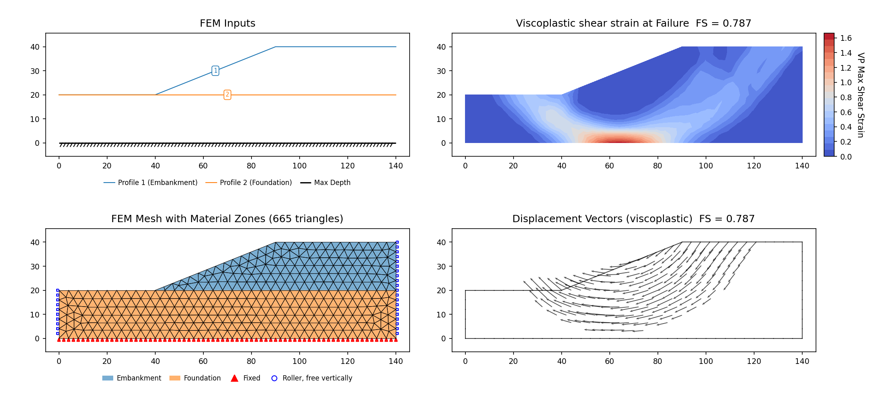

**Case b (vp084b)**

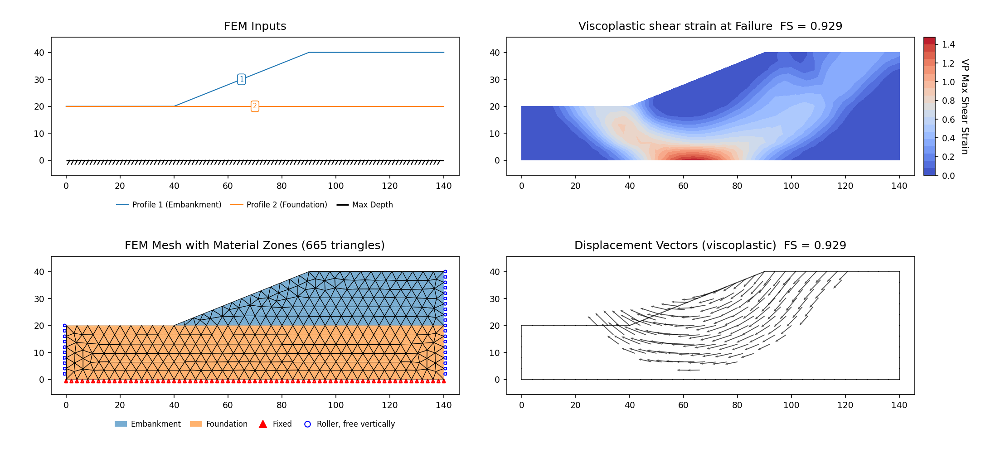

**Case c (vp084c)**

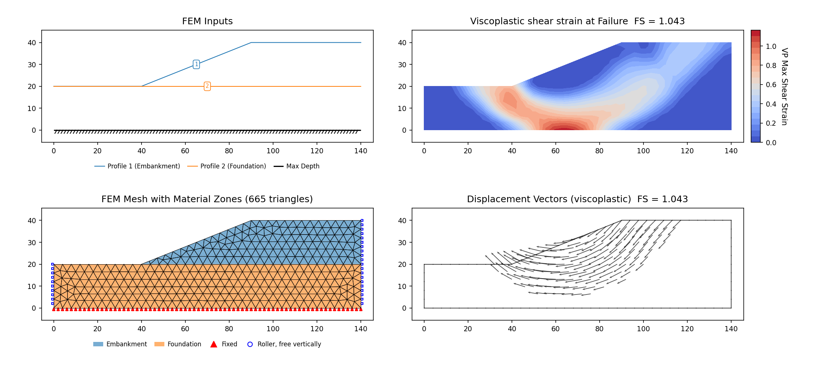

**Case d (vp084d)**

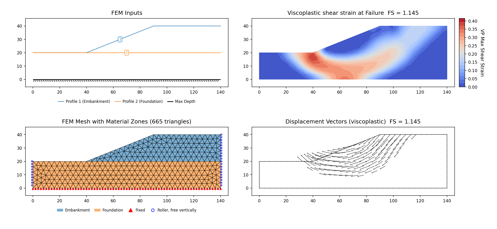

### 🟢 RS2-47: Purely cohesive slope, varying thickness (D&W Fig 14.3) {#rs2-47}

Slide2 counterpart: [VP78](rocscience.md#vp78).

**Input files:** [vp078.xlsx](files/rocscience/vp078.xlsx) (30 ft) ·
[vp078b.xlsx](files/rocscience/vp078b.xlsx) (46.5 ft) ·
[vp078c.xlsx](files/rocscience/vp078c.xlsx) (60 ft)

A purely cohesive slope (c = 1000 psf, φ = 0) over a firm-based foundation of varying thickness;
D&W Fig 14.3 plots FS against that thickness, and RS2 re-runs the 30 / 46.5 / 60 ft cases by
strength reduction. Each file reproduces the external boundary of the Part IV case-(a) model for
its thickness, the toe-failure case, so the table pairs against those models' published values.

| Method | XSLOPE | RS2 SSRM (Part IV VP78 case a) | D&W referee |
|---|---|---|---|
| SSRM (30-ft foundation, vp078) | 1.061 | 1.06 (+0.1%) | 1.124–1.135 (−5.6%, toe circle) / 1.139–1.141 (base tangent) |
| SSRM (46.5-ft foundation, vp078b) | 1.061 | 1.06 (+0.1%) | — |
| SSRM (60-ft foundation, vp078c) | 1.045 | 1.07 (−2.3%) | — |

XSLOPE stays within 2.3% of RS2 at all three thicknesses. The case-(a) `.fez` files carry a
four-vertex SSR Exclusion Area "to force RS2 to iterate for SRF associated with a failure surface
passing through the toe of the slope"; the corpus runs are unconstrained and land on the
constrained values anyway, at the 4.0 m mesh.

<!-- test: file=files/rocscience/vp078.xlsx, type=fem_ssrm, expected_fs=1.061, element_type=tri6, target_size=4.0, tolerance=0.02, f_min=0.6, f_max=1.6, max_iter=16000, tension_srf=false, k0=1, benchmark=RS2-47, f_stand=1.053125, f_fail=1.06875, check=edges -->
<!-- test: file=files/rocscience/vp078b.xlsx, type=fem_ssrm, expected_fs=1.061, element_type=tri6, target_size=4.0, tolerance=0.02, f_min=0.6, f_max=1.6, max_iter=16000, tension_srf=false, k0=1, benchmark=RS2-47b, f_stand=1.053125, f_fail=1.06875, check=edges -->
<!-- test: file=files/rocscience/vp078c.xlsx, type=fem_ssrm, expected_fs=1.045, element_type=tri6, target_size=4.0, tolerance=0.02, f_min=0.6, f_max=1.6, max_iter=16000, tension_srf=false, k0=1, benchmark=RS2-47c, f_stand=1.0375, f_fail=1.053125, check=edges -->

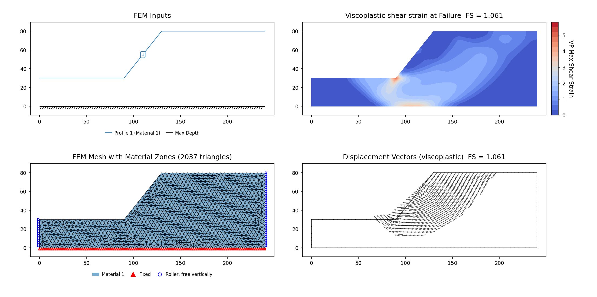

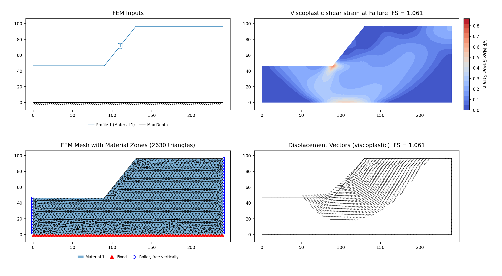

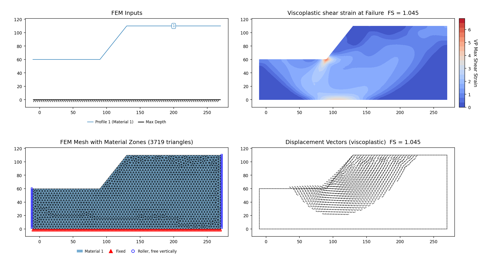

### 🔴 RS2-48–55: Multi-tiered geotextile walls (Leshchinsky & Han 2004) {#rs2-48}

Slide2 counterparts: [VP87](rocscience.md#vp87)–VP94 (one-for-one; only VP87 has a detail
section on the LEM page). Three 3 m tiers of reinforced granular fill stand behind 0.3 m
facing-block columns, each tier carrying geotextile sheets at an allowable strength Ta;
RS2's problems 48–55 import this Slide2 model. Each sheet is a reinforcement line with
`Joint = Yes`, the mesh split along it as in RS2's `#048` model. The files depart from the vendor
models in three places:

- **Facing.** The vendor's is a Mohr-Coulomb column at c = 2.5 kPa, a value the paper "used for
  blocks to prevent possible local failure of the block facing"; XSLOPE stacks elastic blocks on
  friction joints, as the referee's FLAC model articulates its column, so Leshchinsky & Han's FDM
  factor is each row's referee and RS2's SSR, from a facing meshed as one body, is shown beside it.
- **Sheet stiffness** is the paper's J = EA = 1000 kN/m, where the vendor states EA as 1000 × the
  sheet's length; J from 1000 to 100,000 kN/m moved FLAC from 0.99 to 1.03.
- **Water.** The water variant's reinforced fill is free-draining, as in the paper and Slide2's
  model.

Every row allows 250,000 iterations per trial, and a step of refinement takes the element size
from 1.0 m to 0.7 m. Where that step moves a factor by more than one step of the search, the shear
band is localizing through the c = 0 fill, which has no length scale of its own.

| Published (baseline wall) | RS2 SSR | RS2 LEM (Bishop / Spencer / GLE) | L&H FDM referee | L&H Bishop | Slide2 Bishop |
|---|---|---|---|---|---|
| Leshchinsky & Han 2004 | 1.05 | 1.02 / 1.03 / 1.03 | 0.99 | 1.00 | 1.040 |

Each variant carries its own published set, from the same manual pages as the baseline's
(pages 132, 135, 138, 141, 144, 147, 150 and 153):

| Variant (RS2 problem) | L&H FDM referee | RS2 SSR | RS2 LEM Bishop / Spencer / GLE |
|---|---|---|---|
| 48 — baseline | 0.99 | 1.05 | 1.02 / 1.03 / 1.03 |
| 49 — fill quality | 0.99 | 1.08 | 0.98 / 0.97 / 0.97 |
| 50 — reinforcement length | 0.98 | 0.93 | 0.93 / 0.92 / 0.91 |
| 51 — reinforcement type | 1.01 | 1.00 | 0.92 / 0.91 / 0.91 |
| 52 — foundation strength | 0.86 | 0.84 | — / 0.96 / 0.98 |
| 53 — water | 1.01 | 1.03 | 0.92 / 1.00 / 1.13 |
| 54 — surcharge | 1.02 | 0.92 | 0.87 / 0.91 / 0.91 |
| 55 — tier number | 1.00 | 1.04 | 0.92 / 0.94 / 0.94 |

**Input files:** [vp087_fem.xlsx](files/rocscience/vp087_fem.xlsx) (baseline) through
[vp094_fem.xlsx](files/rocscience/vp094_fem.xlsx) — the strength-reduction siblings of the
limit-equilibrium files [vp087.xlsx](files/rocscience/vp087.xlsx)–[vp094.xlsx](files/rocscience/vp094.xlsx),
which keep the sheets 0.25 m inside the facing columns because that is where the eight
Slide2 circles were measured.

#### 🔴 RS2-48: Multi-tiered geotextile wall, baseline (vp087_fem) {#rs2-48-baseline}

The three-tier wall as the paper builds it: fill c = 0, φ = 34°, Ta = 10 kN/m, sheets
6.3 m long. A step of refinement moves the factor by one step of the search.

| XSLOPE SSRM | L&H FDM referee | RS2 SSR |
|---|---|---|
| **1.057** | 0.99 (+6.8%) | 1.05 |

<!-- test: file=files/rocscience/vp087_fem.xlsx, type=fem_ssrm, expected_fs=1.057, element_type=tri6, target_size=1.0, tolerance=0.02, f_min=0.5, f_max=3.0, max_iter=250000, max_iter_ceiling=500000, ssr_exclude=Blocks, tension_srf=false, k0=1, benchmark=RS2-48, f_stand=1.046875, f_fail=1.06640625, check=edges, tier=gate -->

#### ⊘ RS2-49: Geotextile wall, fill quality (vp088_fem) {#rs2-49}

The reinforced fill is reduced to φ = 25° with Ta raised to 22 kN/m. The sheets keep the
vendor's δ = 28.35°, the angle whose tangent is 0.8 tan 34°, where the paper's rule on this fill
would give about 20.5°. *Unconfirmed*: two trials of the search do not settle within the iteration
limit, while a step of refinement does not move the factor.

| XSLOPE SSRM | L&H FDM referee | RS2 SSR |
|---|---|---|
| *unconfirmed* | 0.99 | 1.08 |

The published factors disagree with each other too: RS2's limit-equilibrium columns for problem 49
read 0.98 / 0.97 / 0.97 against its own SSR of 1.08, with the referee at 0.99 between them, and the
sibling [vp088](rocscience.md#vp87) reproduces Slide2's Bishop factor for the same wall. Replacing
the elastic facing with a Mohr-Coulomb one does not bring the factor down toward the referee's: at
ten times the paper's block cohesion the wall stands at a small fraction of its present factor, so
the elastic facing bounds the family rather than accounting for the difference. At the standing
factor no soil element is yielding and the interfaces reach their limit, where Leshchinsky & Han's
mechanism is a shear zone through the reinforced mass.

#### 🟢 RS2-50: Geotextile wall, 4.2 m reinforcement (vp089_fem) {#rs2-50}

The geotextile layers are shortened to 4.2 m, and the band runs behind them, through fill they no
longer cross. A step of refinement moves the factor by one step of the search.

| XSLOPE SSRM | L&H FDM referee | RS2 SSR |
|---|---|---|
| **0.998** | 0.98 (+1.8%) | 0.93 |

<!-- test: file=files/rocscience/vp089_fem.xlsx, type=fem_ssrm, expected_fs=0.998, element_type=tri6, target_size=1.0, tolerance=0.02, f_min=0.5, f_max=3.0, max_iter=250000, max_iter_ceiling=500000, ssr_exclude=Blocks, tension_srf=false, k0=1, benchmark=RS2-50, f_stand=0.98828125, f_fail=1.0078125, check=edges, tier=gate -->

#### ⊘ RS2-51: Geotextile wall, dual reinforcement type (vp090_fem) {#rs2-51-wall}

Two geotextile grades in one wall: the lower seven layers at Ta = 11.0 kN/m, the upper
eight at 7.5, with the vendor's Ks = 10,000 on the lower seven against 100,000 above.
*Unconfirmed*: every trial settles, and a step of refinement moves the factor by twice the search
tolerance.

| XSLOPE SSRM | L&H FDM referee | RS2 SSR |
|---|---|---|
| *unconfirmed* | 1.01 | 1.00 |

#### ⊘ RS2-52: Geotextile wall, weak foundation (vp091_fem) {#rs2-52}

The foundation is c = 0, φ = 18°, and this is the lowest factor in the family for all three codes.
*Unconfirmed*: one trial of the search does not settle within the iteration limit.

| XSLOPE SSRM | L&H FDM referee | RS2 SSR |
|---|---|---|
| *unconfirmed* | 0.86 | 0.84 |

The two codes do not describe the same mechanism. Leshchinsky & Han's referee fails on a
deep-seated bearing wedge that turns under the toe and daylights several meters out in the
foundation (their Fig. 6), and their paper calls FLAC's surface "somewhat unrealistic as it emerges
very steeply", so the published factor is the least settled in the family on its authors' own
account. XSLOPE's strain concentrates in a patch under the toe of the lowest facing column, and what
gives way is the interfaces rather than the soil. The limit-equilibrium sibling vp091 runs its
foundation from x = −6 so that Slide's printed circle can be seated; this file and RS2's `#052`
are the 24 m section.

#### ⊘ RS2-53: Geotextile wall, water (vp092_fem) {#rs2-53}

A pond against the wall, with the reinforced fill free-draining. *Unconfirmed*: two trials of the
search do not settle within the iteration limit on each of two meshes, and a step of refinement
moves the factor by six times the search tolerance, so it is the family's least settled row.

| XSLOPE SSRM | L&H FDM referee | RS2 SSR |
|---|---|---|
| *unconfirmed* | 1.01 | 1.03 |

#### ⊘ RS2-54: Geotextile wall, crest surcharge (vp093_fem) {#rs2-54}

A uniform 20 kPa surcharge on the uppermost tier, from the back face of the top facing column to
the far boundary, as the vendor model applies it. *Unconfirmed*: every trial settles, and a step of
refinement moves the factor by twice the search tolerance, the band localizing at the toe of the
lowest facing column through the c = 0 reinforced fill.

| XSLOPE SSRM | L&H FDM referee | RS2 SSR |
|---|---|---|
| *unconfirmed* | 1.02 | 0.92 |

This is the one variant whose two published models are not the same wall. Leshchinsky & Han's
surcharge "increased the required strength of reinforcement from 10 kN/m to 11.6 kN/m", and the
RS2 manual's support table prints 11.6 too, while the model RS2 ships carries the baseline's
10 kN/m. This file carries 11.6, the strength the referee ran; the limit-equilibrium sibling
[vp093](rocscience.md#vp87) carries 10, as Slide2's model does. At the incipient failure state the
sheets have reached their allowable tension wherever the failing band crosses them, so the wall's
strength follows Ta directly.

#### 🟢 RS2-55: Geotextile wall, tier count (vp094_fem) {#rs2-55}

The same 9 m of height in five 1.8 m tiers offset 0.6 m, three sheets per tier. A step of
refinement moves the factor by one step of the search; the five shorter tiers put more sheets
across the failing band than the three tall ones do.

| XSLOPE SSRM | L&H FDM referee | RS2 SSR |
|---|---|---|
| **1.018** | 1.00 (+1.8%) | 1.04 |

<!-- test: file=files/rocscience/vp094_fem.xlsx, type=fem_ssrm, expected_fs=1.018, element_type=tri6, target_size=1.0, tolerance=0.02, f_min=0.5, f_max=3.0, max_iter=250000, max_iter_ceiling=500000, ssr_exclude=Blocks, tension_srf=false, k0=1, benchmark=RS2-55, f_stand=1.0078125, f_fail=1.02734375, check=edges, tier=gate -->

### 🟢 RS2-56: Homogeneous slope vs Z-Soil, PLAXIS, GEO FEM (Pruska 2003, H = 7 m, 5 cases) {#rs2-56}

Pruska (2003) analyzed three homogeneous slopes (H = 7, 10.5 and 14 m over an 8 m foundation),
each with five or six material sets, in four strength-reduction programs, and RS2 reproduces the
study; this row is the 7 m slope. Every case is a corpus file, and the weakest and strongest are
scored. The elastic constants and tensile caps are the shipped models', not the printed tables':
(ν, E) = (0.30, 5,000) for the γ = 24 / c = 20 cases and (0.35, 10,000) for the γ = 18 / c = 5
cases, where Table 1 prints E = 5,000 once for every row, and each case carries a tensile cap
T = c. The study's Drucker-Prager columns are not compared; XSLOPE, like Slide2, analyzes
Mohr-Coulomb only. The four programs disagree among themselves more than XSLOPE differs from RS2:
GEO FEM reads 23.2% above Z-Soil on #56 case 4.

**Input files:** [rs2_56c1.xlsx](files/rocscience/rs2_56c1.xlsx) ·
[rs2_56a.xlsx](files/rocscience/rs2_56a.xlsx) (case 2) ·
[rs2_56c3.xlsx](files/rocscience/rs2_56c3.xlsx) ·
[rs2_56c4.xlsx](files/rocscience/rs2_56c4.xlsx) ·
[rs2_56b.xlsx](files/rocscience/rs2_56b.xlsx) (case 5)

| Method | XSLOPE | Published |
|---|---|---|
| SSRM (rs2_56a — case 2, weakest) | 0.664 | RS2 SSRM 0.67 (−0.9%) |
| SSRM (rs2_56b — case 5, strongest) | 2.096 | RS2 SSRM 2.14 (−2.1%) |

**H = 7 m (#56):** cases (γ, c, φ) = (24,20,10), (18,5,10), (24,20,20), (18,5,20), (24,20,30)

| Case | RS2 | Z-Soil | PLAXIS | GEO FEM | Slide2 LEM |
|---|---|---|---|---|---|
| 1 | 1.22 | 1.21 | 1.22 | 1.31 | 1.22 |
| 2 | 0.67 | 0.71 | 0.68 | 0.73 | 0.66 |
| 3 | 1.68 | 1.64 | 1.65 | 1.71 | 1.64 |
| 4 | 1.05 | 0.95 | 0.99 | 1.17 | 1.02 |
| 5 | 2.14 | 1.98 | 2.09 | 2.19 | 2.08 |

<!-- test: file=files/rocscience/rs2_56a.xlsx, type=fem_ssrm, expected_fs=0.664, element_type=tri6, target_size=0.8, tolerance=0.02, f_min=0.32, f_max=1.12, max_iter=16000, tension_srf=false, k0=1, benchmark=RS2-56a, f_stand=0.6575, f_fail=0.67, check=edges -->
<!-- test: file=files/rocscience/rs2_56b.xlsx, type=fem_ssrm, expected_fs=2.096, element_type=tri6, target_size=0.8, tolerance=0.02, f_min=1.79, f_max=2.59, max_iter=16000, tension_srf=false, k0=1, benchmark=RS2-56b, f_stand=2.09, f_fail=2.1025, check=edges -->

**Case 2 — weakest of the five (rs2_56a)**

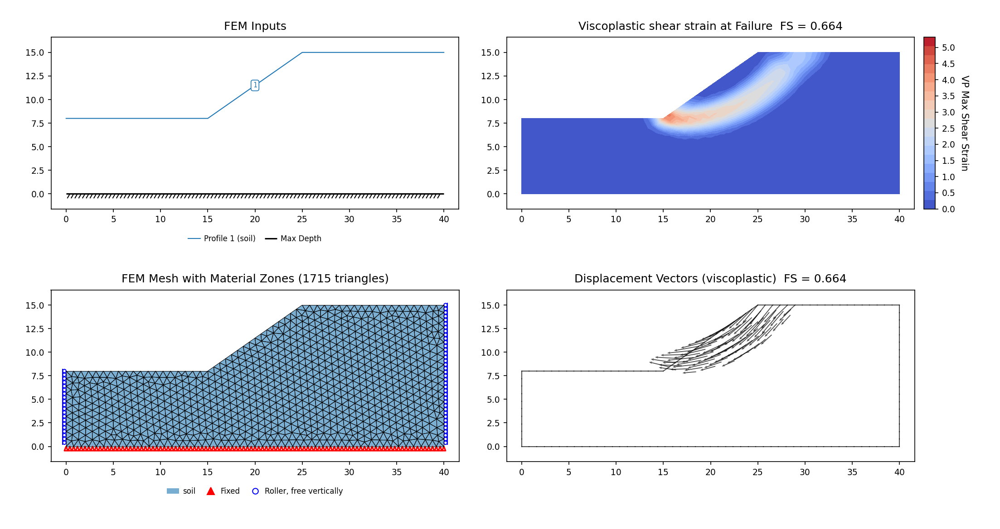

**Case 5 — strongest of the five (rs2_56b)**

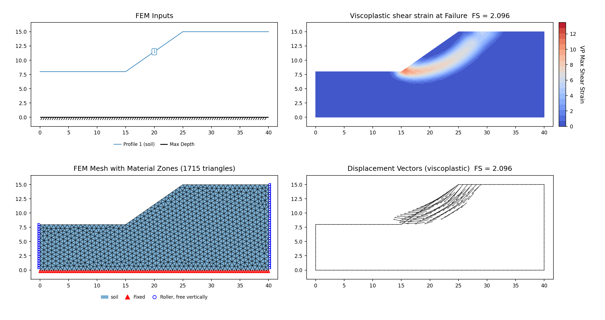

### 🟢 RS2-57: Pruska H = 10.5 m, 6 cases {#rs2-57}

The 10.5 m slope of the same study in six material cases, with the constants of
[RS2-56](#rs2-56); the weakest and strongest are scored.

**Input files:** [rs2_57a.xlsx](files/rocscience/rs2_57a.xlsx) (case 1) ·
[rs2_57c2.xlsx](files/rocscience/rs2_57c2.xlsx) ·
[rs2_57c3.xlsx](files/rocscience/rs2_57c3.xlsx) ·
[rs2_57c4.xlsx](files/rocscience/rs2_57c4.xlsx) ·
[rs2_57c5.xlsx](files/rocscience/rs2_57c5.xlsx) ·
[rs2_57b.xlsx](files/rocscience/rs2_57b.xlsx) (case 6)

| Method | XSLOPE | Published |
|---|---|---|
| SSRM (rs2_57a — case 1, weakest) | 0.439 | RS2 SSRM 0.44 (−0.2%) |
| SSRM (rs2_57b — case 6, strongest) | 1.401 | RS2 SSRM 1.42 (−1.3%) |

**H = 10.5 m (#57):** cases 1–6 = (18,5,10), (24,20,10), (18,5,20), (24,20,20), (18,5,30), (24,20,30)

| Case | RS2 | Z-Soil | PLAXIS | GEO FEM | Slide2 LEM |
|---|---|---|---|---|---|
| 1 | 0.44 | 0.46 | 0.44 | 0.48 | 0.44 |
| 2 | 0.79 | 0.83 | 0.85 | 0.91 | 0.80 |
| 3 | 0.69 | 0.71 | 0.71 | 0.73 | 0.69 |
| 4 | 1.11 | 1.14 | 1.17 | 1.18 | 1.10 |
| 5 | 0.96 | 0.98 | 0.97 | 1.03 | 0.95 |
| 6 | 1.42 | 1.52 | 1.45 | 1.54 | 1.40 |

<!-- test: file=files/rocscience/rs2_57a.xlsx, type=fem_ssrm, expected_fs=0.439, element_type=tri6, target_size=0.8, tolerance=0.02, f_min=0.1, f_max=0.89, max_iter=16000, tension_srf=false, k0=1, benchmark=RS2-57a, f_stand=0.43328125, f_fail=0.445625, check=edges -->
<!-- test: file=files/rocscience/rs2_57b.xlsx, type=fem_ssrm, expected_fs=1.401, element_type=tri6, target_size=0.8, tolerance=0.02, f_min=1.07, f_max=1.87, max_iter=16000, tension_srf=false, k0=1, benchmark=RS2-57b, f_stand=1.395, f_fail=1.4075, check=edges -->

**Case 1 — weakest of the six (rs2_57a)**

**Case 6 — strongest of the six (rs2_57b)**

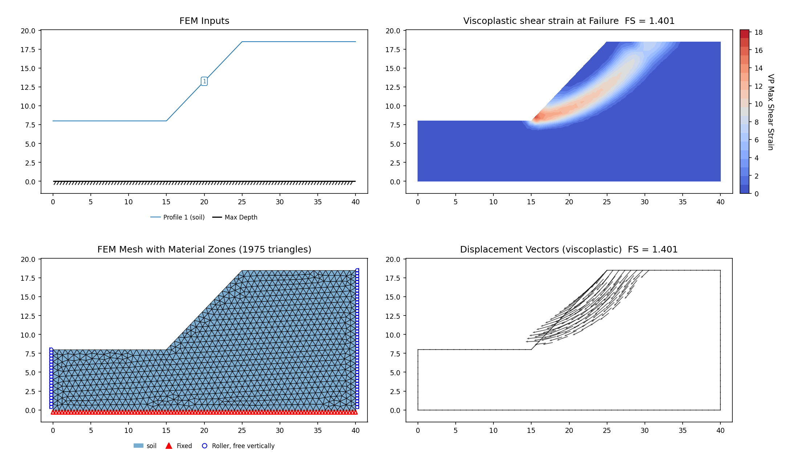

### 🟢 RS2-58: Pruska H = 14 m, 6 cases {#rs2-58}

The 14 m slope of the same study in the same six cases; the weakest, the strongest and case 5, the
steep c = 5, φ = 30 face on the tallest slope, are scored.

**Input files:** [rs2_58a.xlsx](files/rocscience/rs2_58a.xlsx) (case 1) ·
[rs2_58c2.xlsx](files/rocscience/rs2_58c2.xlsx) ·
[rs2_58c3.xlsx](files/rocscience/rs2_58c3.xlsx) ·
[rs2_58c4.xlsx](files/rocscience/rs2_58c4.xlsx) ·
[rs2_58c5.xlsx](files/rocscience/rs2_58c5.xlsx) ·
[rs2_58b.xlsx](files/rocscience/rs2_58b.xlsx) (case 6)

| Method | XSLOPE | Published |
|---|---|---|
| SSRM (rs2_58a — case 1, weakest) | 0.339 | RS2 SSRM 0.33 (+2.7%) |
| SSRM (rs2_58c5 — case 5, c = 5, φ = 30) | 0.714 | RS2 SSRM 0.72 (−0.8%) |
| SSRM (rs2_58b — case 6, strongest) | 1.066 | RS2 SSRM 1.06 (+0.6%) |

**H = 14 m (#58):** same six material cases as #57

| Case | RS2 | Z-Soil | PLAXIS | GEO FEM | Slide2 LEM |
|---|---|---|---|---|---|
| 1 | 0.33 | 0.34 | 0.35 | 0.35 | 0.34 |
| 2 | 0.59 | 0.61 | 0.59 | 0.63 | 0.60 |
| 3 | 0.52 | 0.54 | 0.53 | 0.59 | 0.53 |
| 4 | 0.83 | 0.84 | 0.82 | 0.86 | 0.84 |
| 5 | 0.72 | 0.75 | 0.74 | 0.73 | 0.73 |
| 6 | 1.06 | 1.07 | 1.06 | 1.10 | 1.08 |

GEO FEM reads 11.3% above PLAXIS on #58 case 3, and RS2's own column is quoted to two
decimals, so on case 1, which sets this row's dot, one count in the last place is worth 3.0%.

<!-- test: file=files/rocscience/rs2_58a.xlsx, type=fem_ssrm, expected_fs=0.339, element_type=tri6, target_size=0.8, tolerance=0.02, f_min=0.1, f_max=0.78, max_iter=16000, tension_srf=false, k0=1, benchmark=RS2-58a, f_stand=0.33375, f_fail=0.344375, check=edges -->
<!-- test: file=files/rocscience/rs2_58c5.xlsx, type=fem_ssrm, expected_fs=0.714, element_type=tri6, target_size=0.8, tolerance=0.02, f_min=0.27, f_max=1.07, max_iter=16000, tension_srf=false, k0=1, benchmark=RS2-58c5, f_stand=0.7075, f_fail=0.72, check=edges -->
<!-- test: file=files/rocscience/rs2_58b.xlsx, type=fem_ssrm, expected_fs=1.066, element_type=tri6, target_size=0.8, tolerance=0.02, f_min=0.71, f_max=1.51, max_iter=16000, tension_srf=false, k0=1, benchmark=RS2-58b, f_stand=1.06, f_fail=1.0725, check=edges -->

**Case 1 — weakest of the six (rs2_58a)**

**Case 5 — the steep cohesionless face (rs2_58c5)**

**Case 6 — strongest of the six (rs2_58b)**

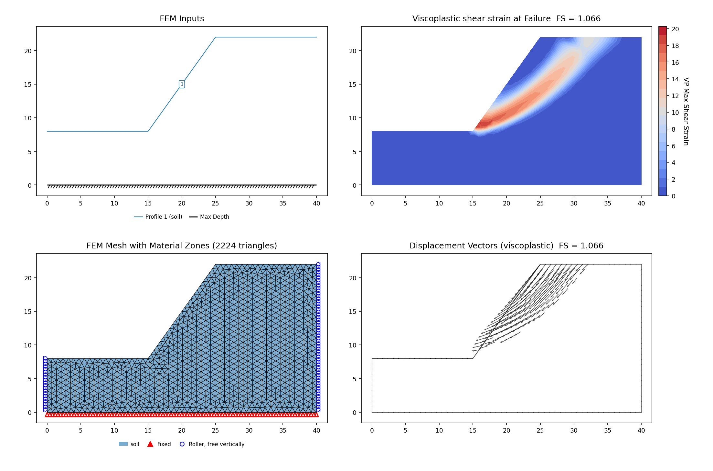

### 🟢 RS2-59: Stability of a three-layered soil slope (Görög & Török 2007) {#rs2-59}

**Input files:** [rs2_59.xlsx](files/rocscience/rs2_59.xlsx)

The Budapest (Rózsadomb) landslide, after

> [Görög, P. & Török, Á. (2007)](https://doi.org/10.5194/nhess-7-417-2007). *Slope stability assessment of weathered clay by using
> field data and computer modeling: a case study from Budapest.* Natural Hazards 45
> (as presented in the RS2 Slope Stability Verification Manual, Part III, Problem 59,
> "Stability of a Three-Layered Soil Slope", pp. 200–201).

A ~415 m wide, ~75 m tall hillslope in three layers: a clay and debris cover (c = 50, φ = 15°), a
thin weak **waste lens** (c = 1, φ = 5°) that daylights at the toe, and a strong gray-clay base
(c = 250, φ = 30°). The critical mechanism is a non-circular slip riding the top of the lens, so an
unconstrained circular search finds a deeper surface (FS ≈ 1.9) while the SSRM localizes through
the lens on its own. Case 2 of the published problem changes only the moduli, which a
strength-reduction factor does not depend on, so it is not a separate XSLOPE case.

| Case | XSLOPE | RS2 SSRM | PLAXIS | Slide2 |
|---|---|---|---|---|
| Case 1 (published moduli), 3 m mesh | 1.572 | 1.57 (+0.1%) | 1.6 (−1.8%) | 1.567 |
| Case 2 (varying moduli) | — | 1.56 | 1.6 | 1.567 |

<!-- test: file=files/rocscience/rs2_59.xlsx, type=fem_ssrm, expected_fs=1.572, element_type=tri6, target_size=3.0, tolerance=0.02, f_min=1.3, f_max=1.9, max_iter=16000, tension_srf=true, k0=1, benchmark=RS2-59 -->

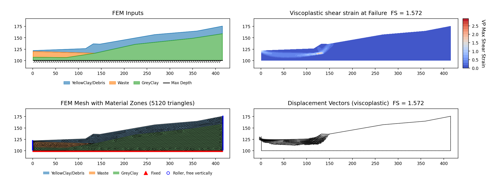

### 🟡 RS2-60: Generalized Hoek-Brown, homogeneous slope (Li et al. 2008) {#rs2-60}

**Input files:** [rs2_60a.xlsx](files/rocscience/rs2_60a.xlsx) (β = 15°) ·
[rs2_60b.xlsx](files/rocscience/rs2_60b.xlsx) (β = 30°) ·
[rs2_60c.xlsx](files/rocscience/rs2_60c.xlsx) (β = 45°)

A homogeneous rock slope at three angles, after

> [Li, A.J., Merifield, R.S., & Lyamin, A.V. (2008)](https://doi.org/10.1016/j.ijrmms.2007.08.010). "Stability charts for rock slopes based
> on the Hoek-Brown failure criterion." *International Journal of Rock Mechanics and Mining
> Sciences* 45(5), 689–700.

GSI = 70, $m_i$ = 15, $D$ = 0, γ = 23 kN/m³, ν = 0.3, $H$ = 1 m. Li's charts work in the
dimensionless ratio σci/(γH), and every case sits at a critical ratio, so F ≈ 1 by construction;
with $H$ = 1 m that puts σci in the sub-kPa to few-kPa range. The manual never prints σci, so each
case takes it from the RS2 vendor model, which matches Li's Table 1 ratio on case a but not on b
and c:

| case | β | published σci (vendor `.fez`) | ratio implied by the published σci | Li (2008) Table 1 ratio | agree? |
|---|---:|---:|---:|---:|:--:|
| a | 15° | 0.598 kPa | 0.026 | 0.026 | yes |
| b | 30° | 1.61 kPa | 0.070 | 0.075 | no |
| c | 45° | 4.37 kPa | 0.190 | 0.176 | no |

**Factors of safety.** Li's limit-analysis F = 1.0 is the referee; Slide2's Spencer is shown beside
it.

| case | XSLOPE Bishop | XSLOPE Spencer | Li (limit analysis) | Slide2 Spencer |
|---|---|---|---|---|
| a (β = 15°) | 1.009 | 1.009 | 1.0 (+0.9%) | 1.011 (−0.2%) |
| b (β = 30°) | 0.987 | 0.989 | 1.0 (−1.1%) | 0.992 (−0.3%) |
| c (β = 45°) | 1.030 | 1.035 | 1.0 (+3.5%) | 1.035 (0.0%) |

Li's Table 1 labels case a's block β = 10°, but the text and the charts say 15°, and RS2's Slide2
value for that case reproduces Li's F at 15°.

<!-- test: file=files/rocscience/rs2_60a.xlsx, type=circular_search, method=spencer, expected_fs=1.009, num_slices=40, benchmark=RS2-60a -->
<!-- test: file=files/rocscience/rs2_60b.xlsx, type=circular_search, method=spencer, expected_fs=0.989, num_slices=40, benchmark=RS2-60b -->
<!-- test: file=files/rocscience/rs2_60c.xlsx, type=circular_search, method=spencer, expected_fs=1.035, num_slices=40, benchmark=RS2-60c -->

### 🟢 RS2-61: Local and global minima, homogeneous slope (Cheng et al. 2007) {#rs2-61}

**Input files:** [rs2_61a.xlsx](files/rocscience/rs2_61a.xlsx) (one geometry; cases 1 & 3 by
circular LEM, case 2 by constrained SSRM, case 4 not scored)

A homogeneous benched slope, after

> [Cheng, Y.M., Lansivaara, T., & Wei, W.B. (2007)](https://doi.org/10.1016/j.compgeo.2006.10.011). "Two-dimensional slope stability analysis
> by limit equilibrium and strength reduction methods." *Computers and Geotechnics* 34, 137–150.

c = 5 kPa, φ = 30°, γ = 20 kN/m³. The problem shows how a search settles onto different minima:
case 1 is the unconstrained global minimum, while cases 2–4 fence an RS2 Polygon Search Area onto
successive local minima of the one geometry. Published:

| Case | Surface (RS2 fig.) | XSLOPE Spencer (LEM) | XSLOPE SSRM (SSR-zone) | XSLOPE Bishop | Slide2 | Cheng (ref) | RS2 SSR | Referee |
|---|---|---|---|---|---|---|---|---|
| 1 | mid-lower face (global) | **1.338** | — | 1.342 | 1.336 (+0.1%) | 1.327 (+0.8%) | 1.35 | Slide2 |
| 2 | deep toe-to-crest (Fig. 4) | — | **1.383** | — | 1.385 | 1.375 | 1.36 (+1.7%) | RS2 SSR |
| 3 | upper face, crest→bench (Fig. 5) | **1.437** | — | — | 1.443 (−0.4%) | 1.415 (+1.6%) | 1.42 | Slide2 |
| 4 | shallow near-crest (Fig. 6) | — | not scored | — | 1.397 | 1.40 | 1.42 | RS2 SSR |

**Cases 1 and 3, by limit equilibrium.** Started from a toe-to-crest circle, the circular search
finds case 1's global minimum, where Spencer and Bishop agree. For case 3, `circular_search`'s
window limits (`entry_range` / `exit_range` / `tangent_depth`), the LEM analog of RS2's Search
Area, confine the Spencer search to the upper-face window read from Fig. 5, and it lands on the
published Slide2 and Cheng values. Cases 2 and 4 are not local minima of the circular LEM problem
on this geometry, so the circular search has nothing to find there.

**Cases 2 and 4, by strength reduction.** `solve_ssrm`'s `ssr_zone` applies reduction only inside
RS2's own Search-Area polygon, read verbatim from the native `#061_02.fez` / `#061_04.fez`.
Case 2 reads **SSRM 1.383 vs RS2 SSRM 1.36 (+1.7%)**, inside the corpus's usual
SSRM-vs-published band (cf. [RS2-63](#rs2-63) +0.8%), at the 1.0 m tri6 mesh. Case 4's zone
confines the mechanism to the right shallow surface, but XSLOPE reads it stiffer than RS2 and
further above RS2's value than case 2, so case 4 is not scored.

<!-- test: file=files/rocscience/rs2_61a.xlsx, type=circular_search, method=spencer, expected_fs=1.338, num_slices=40, benchmark=RS2-61a -->
<!-- test: file=files/rocscience/rs2_61a.xlsx, type=circular_search, method=spencer, expected_fs=1.437, num_slices=40, entry_range=42;54, exit_range=23;32, tangent_depth=16;22, benchmark=RS2-61-case3 -->
<!-- test: file=files/rocscience/rs2_61a.xlsx, type=fem_ssrm, expected_fs=1.383, element_type=tri6, target_size=1.0, tolerance=0.02, f_min=1.0, f_max=2.0, max_iter=16000, ssr_zone=8.516;12.255;8.686;6.779;21.55;8.975;28.407;13.412;31.455;18.522;32.3046;20.2236;28.228;21.032;26.57;17.894;22.043;13.995;8.516;12.255, tension_srf=true, k0=1, benchmark=RS2-61-case2, f_stand=1.375, f_fail=1.390625, check=edges -->

**Case 2 — deep toe-to-crest, constrained SSRM (rs2_61a)**

### 🟡 RS2-62: Three-layered slope with a soft band (Cheng et al. 2007) {#rs2-62}

**Input files:** [rs2_62a.xlsx](files/rocscience/rs2_62a.xlsx) (Analysis I, 28 m) ·
[b](files/rocscience/rs2_62b.xlsx) (II, 20 m) · [c](files/rocscience/rs2_62c.xlsx) (III, 12 m)

A three-layer slope carrying a thin **soft band** (Soil 2: c = 0, φ = 25°) between a stronger cap
and base, from the same Cheng, Lansivaara & Wei (2007) paper as [RS2-61](#rs2-61)/[63](#rs2-63).
Three geometries narrow the band's daylight width, and each was run at two dilation angles. The
benchmark divides the codes by design: for the same ψ = 0 input, Plaxis and RS2 return ≈ 0.8–0.9
while Flac3D returns 1.03–1.64.

| Analysis | XSLOPE SSRM (ψ = 0) | RS2 SSR | Plaxis | Flac3D | Status |
|---|---|---|---|---|---|
| I (28 m) | ≈ 1.0 (coarse mesh) | 0.88 | 0.86 | 1.64 | *unconfirmed* |
| II (20 m) | ≈ 1.0 (coarse mesh) | 0.89 | 0.85 | 1.30 | *unconfirmed* |
| III (12 m) | **0.769** | 0.81 (−5.1%) | 0.82 (−6.2%) | 1.03 (−25.3%) | scored |

Case 2 (ψ = φ, associated flow) is *not supported*: XSLOPE's SSRM is non-associated only. Its
published values are recorded and no dot rests on them:

| Analysis | RS2 SSR | Plaxis | Flac3D |
|---|---|---|---|
| I (28 m) | 0.98 | 0.97 | 1.61 |
| II (20 m) | 0.98 | 0.97 | 1.28 |
| III (12 m) | 0.93 | 0.94 | 1.03 |

The SSRM reproduces the ψ = 0 cluster only when the mesh resolves the ≈ 0.4 m band, which
`refine_features=thin_zones` does on Analysis III. Analyses I and II are *unconfirmed*: their
wider-domain mechanism runs through the far field, band-only refinement does not resolve it, and
they read ≈ 1.0. The decisive input is tensile strength: the vendor `.fez` gives each material a
tensile cap equal to its cohesion and reduces it with the SRF, and without those caps the cap soil
holds the crest's entry cut shut and the FE equilibrates far past the vendors' answer. With them the
bisection returns **0.769**. The vendor's own refinement rectangle over the band is not transcribed;
the corpus mesh is finer than it in the band and coarser in the cap above, where the entry cut
forms, which is the caveat on the −5.1%.

<!-- test: file=files/rocscience/rs2_62c.xlsx, type=fem_ssrm, expected_fs=0.769, element_type=tri6, target_size=0.45, tolerance=0.02, f_min=0.5, f_max=1.3, max_iter=40000, refine_factor=3, refine_features=thin_zones, tension_srf=true, k0=1, benchmark=RS2-62c -->

**Analysis III — 12 m domain, ψ = 0 (rs2_62c)**

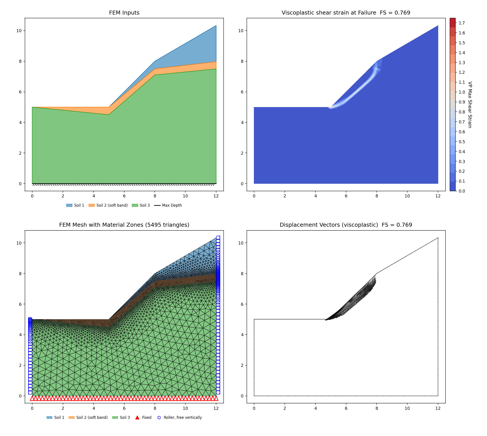

### 🟢 RS2-63: Slope stability assessment of a homogeneous slope (Cheng et al. 2007) {#rs2-63}

**Input files:** [rs2_63.xlsx](files/rocscience/rs2_63.xlsx)

An 11 m homogeneous slope, from the same Cheng, Lansivaara & Wei (2007) paper as
[RS2-61](#rs2-61). c = 10 kPa, φ = 30°, γ = 20 kN/m³ — a single, well-defined mechanism, so
LEM and SSRM agree:

| Method | XSLOPE | Governing published | XSLOPE Bishop | Cheng et al. |
|---|---|---|---|---|
| Spencer | 1.398 | Slide2 1.380 (+1.3%) | 1.401 | 1.383 (+1.1%) |
| SSRM | 1.391 | RS2 SSRM 1.38 (+0.8%) | — | — |

Both XSLOPE values run just above the published cluster — a consistent, small offset rather than a
method disagreement.

<!-- test: file=files/rocscience/rs2_63.xlsx, type=circular_search, method=spencer, expected_fs=1.398, num_slices=40, benchmark=RS2-63-lem -->
<!-- test: file=files/rocscience/rs2_63.xlsx, type=fem_ssrm, expected_fs=1.391, element_type=tri6, target_size=1.0, tolerance=0.02, f_min=0.8, f_max=2.0, max_iter=16000, tension_srf=true, k0=1, benchmark=RS2-63 -->

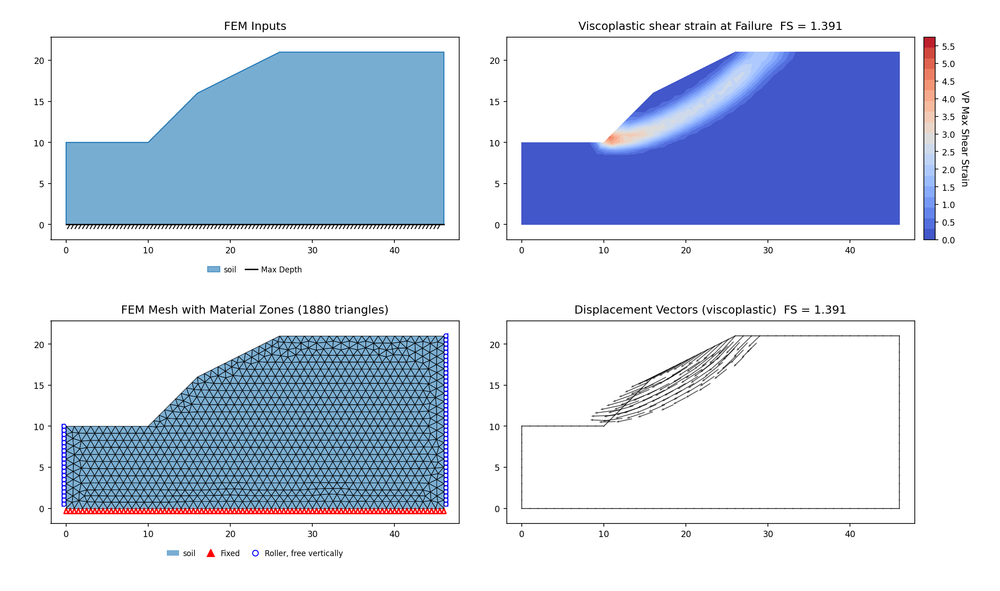

### 🔴 RS2-64: Slope stability assessment of three homogeneous landslides (Teoman et al. 2004) {#rs2-64}

**Input files:** scored — [a](files/rocscience/rs2_64a.xlsx) (C1) ·
[c](files/rocscience/rs2_64c.xlsx) (C3) · [e](files/rocscience/rs2_64e.xlsx) (C5) ·
[b](files/rocscience/rs2_64b.xlsx) (C2) · [d](files/rocscience/rs2_64d.xlsx) (C4) ·
[g](files/rocscience/rs2_64g.xlsx) (C7) · [k](files/rocscience/rs2_64k.xlsx) (C11) ·
[l_split](files/rocscience/rs2_64l_split.xlsx) (C12). Built, not scored — f (C6), h/i/j/l, and
[h_split](files/rocscience/rs2_64h_split.xlsx) (C8). C8 and C12 are rebuilt as the vendor material
partition for the `elastic_materials` run option.

Three road-cut landslides in Ankara clay along the E90 highway, after

> [Teoman, M.B., Topal, T. & Isik, N.S. (2004)](https://doi.org/10.1007/s00254-003-0954-3). "Assessment of slope stability in Ankara clay: a case
> study along E90 highway." *(RS2 Slope Stability Verification Manual, Part III, Problem 64, pp. 219–227.)*

Each slope is modeled in its Original (pre-slide) and Failed (post-slide) profile, short-term (dry)
and long-term (saturated, with a 0.03 g horizontal coefficient acting downslope): 12
single-material Mohr-Coulomb cases, their inputs read from the vendor `.fez`. RS2 pinned each
strength reduction to a band along a digitized proposed surface, stated both as a search polygon
and as a material partition that leaves only that corridor able to yield. Each file carries the
search polygon through `solve_ssrm`'s `ssr_zone`, which holds the elements outside it at full
strength where the vendor makes them elastic; on the sub-unity cases (C8, C12) that cannot suppress
a failing skin outside the corridor, so those two carry the vendor's partition through
`elastic_materials`. The three short-term Originals, whose global minimum is the pinned surface,
run unconstrained. C6 and C8–C10 are built and measured but not scored, matching no published
value.

| Case | Geometry | XSLOPE SSRM | RS2 SSR | Teoman ref* | Slide2 | Scored against |
|---|---|---|---|---|---|---|
| C1 | Slope 1 ST Original | **5.189** | 5.14 (+1.0%) | 5.25 | 5.24 | RS2 SSRM (+1.0%) |
| C3 | Slope 2 ST Original | **4.807** | 4.69 (+2.5%) | 4.87 | 4.89 | RS2 SSRM (+2.5%) |
| C5 | Slope 3 ST Original | **5.620** | 5.47 (+2.7%) | 5.44 | 5.45 | RS2 SSRM (+2.7%) |
| C7 | Slope 1 LT Original | **1.639** | 1.70 (−3.6%) | 1.79 | 1.68 | RS2 SSRM (−3.6%), & Slide2 1.68 |
| C11 | Slope 3 LT Original | **1.413** | 1.46 (−3.2%) | 1.51 | 1.51 | RS2 SSRM (−3.2%) |
| C2 | Slope 1 ST Failed | **6.564** | 6.10 (+7.6%) | 6.67 | 6.64 | RS2 SSRM (+7.6%) |
| C4 | Slope 2 ST Failed | **5.461** | 4.95 (+10.3%) | 5.32 | 5.32 | RS2 SSRM (+10.3%) — **sets the dot** |
| C12 | Slope 3 LT Failed | **1.147** (elastic split) | 1.22 (−6.0%) | 1.13 | 1.15 | RS2 SSRM (−6.0%) |

*\*Ref = Teoman et al. (SLOPE/W v.4 Bishop); Slide2 = Slide2 5.0 Bishop. Each percentage is
against the authority named beside it in the "Scored against" column.*

The five Originals are taken at the 1.0 m tri6 mesh. The widest differences are on the scarped
short-term Failed geometries, C2 (6.564 against 6.10, +7.6%) and C4 (5.461 against 4.95, +10.3%),
where RS2's own SSR sits below its own Bishop columns (C2 6.10 vs 6.67 / 6.64, −8.5%; C4 4.95 vs
5.32 / 5.32, −7.0%) and XSLOPE's constrained SSRM sits with the Bishop cluster instead. That
agreement is cross-method, so it is shown beside and C4 sets the dot. The vendor's tensile caps,
which every case carries, account for part of the gap; the rest is unexplained.

<!-- test: file=files/rocscience/rs2_64a.xlsx, type=fem_ssrm, expected_fs=5.189, element_type=tri6, target_size=1.0, tolerance=0.02, f_min=4.0, f_max=7.0, max_iter=16000, tension_srf=true, k0=1, benchmark=RS2-64a, f_stand=5.18359375, f_fail=5.1953125, check=edges -->
<!-- test: file=files/rocscience/rs2_64c.xlsx, type=fem_ssrm, expected_fs=4.807, element_type=tri6, target_size=1.0, tolerance=0.02, f_min=3.5, f_max=6.5, max_iter=16000, tension_srf=true, k0=1, benchmark=RS2-64c, f_stand=4.80078125, f_fail=4.8125, check=edges -->
<!-- test: file=files/rocscience/rs2_64e.xlsx, type=fem_ssrm, expected_fs=5.620, element_type=tri6, target_size=1.0, tolerance=0.02, f_min=4.0, f_max=7.5, max_iter=16000, tension_srf=true, k0=1, benchmark=RS2-64e, f_stand=5.61328125, f_fail=5.626953125, check=edges -->
<!-- test: file=files/rocscience/rs2_64b.xlsx, type=fem_ssrm, expected_fs=6.564, element_type=tri6, target_size=1.0, tolerance=0.02, f_min=5.5, f_max=8.0, max_iter=16000, ssr_zone=8.586;8.21;5.834;6.959;6.985;3.006;10.538;-0.747;16.793;-1.748;22.947;-1.097;24.499;1.555;22.797;3.006;20.445;1.305;17.043;1.005;11.939;1.805;9.54718;4.7567;9.637;7.109, tension_srf=true, k0=1, benchmark=RS2-64b, f_stand=6.5546875, f_fail=6.57421875, check=edges -->
<!-- test: file=files/rocscience/rs2_64d.xlsx, type=fem_ssrm, expected_fs=5.461, element_type=tri6, target_size=1.0, tolerance=0.02, f_min=4.5, f_max=6.5, max_iter=16000, ssr_zone=4.467;6.136;3.297;3.758;6.455;0.717;11.056;-1.272;17.645;-1.272;18.737;0.795;17.489;1.691;15.345;0.561;10.003;1.418;5.949;4.031;4.467;6.136, tension_srf=true, k0=1, benchmark=RS2-64d, f_stand=5.453125, f_fail=5.46875, check=edges -->
<!-- test: file=files/rocscience/rs2_64g.xlsx, type=fem_ssrm, expected_fs=1.639, element_type=tri6, target_size=1.0, tolerance=0.02, f_min=1.0, f_max=2.5, max_iter=16000, ssr_zone=6.726;7.086;5.442;5.549;6.703;3.353;8.58;0.973;12.299;-1.186;15.538;-1.726;19.497;-1.846;22.991;0.615;19.668;1.926;17.788;0.352;12.322;1.445;9.131;3.675;6.726;7.086, tension_srf=true, k0=1, benchmark=RS2-64g, f_stand=1.6328125, f_fail=1.64453125, check=edges -->
<!-- test: file=files/rocscience/rs2_64k.xlsx, type=fem_ssrm, expected_fs=1.413, element_type=tri6, target_size=1.0, tolerance=0.02, f_min=0.9, f_max=2.2, max_iter=16000, ssr_zone=3.413;5.74;2.387;4.091;3.413;2.113;5.538;0.391;9.604;-1.404;12.242;-1.404;14.0932;-0.511713;14.0932;1.014;11.839;1.014;10.593;0.465;8.175;1.454;5.831;2.699;4.45466;4.16031;3.413;5.74, tension_srf=true, k0=1, benchmark=RS2-64k, f_stand=1.4078125, f_fail=1.41796875, check=edges -->
<!-- test: file=files/rocscience/rs2_64l_split.xlsx, type=fem_ssrm, expected_fs=1.147, element_type=tri6, target_size=1.0, tolerance=0.02, f_min=0.8, f_max=2.0, max_iter=16000, elastic_materials=rock2a;rock2b, tension_srf=true, k0=1, benchmark=RS2-64l-split -->

**Case 1 — Slope 1 short-term Original (rs2_64a)**

**Case 2 — Slope 1 short-term Failed (rs2_64b)**

**Case 4 — Slope 2 short-term Failed (rs2_64d)**

**Case 7 — Slope 1 long-term Original (rs2_64g)**

**Case 11 — Slope 3 long-term Original (rs2_64k)**

**Case 12 — Slope 3 long-term Failed, vendor material partition (rs2_64l_split)**

### 🟢 RS2-65: Slope stability assessment of a tailings dam (Tzenkov 2008) {#rs2-65}

**Input files:** [rs2_65.xlsx](files/rocscience/rs2_65.xlsx)

The Padina tailings dam, after

> Tzenkov, A. (2008). *(as cited in the RS2 Slope Stability Verification Manual, Part III,
> Problem 65, "Slope Stability Assessment of a Tailings Dam", Table 1, pp. 230–231).*

A 225 m wide, 77 m tall section of an eight-material tailings dam with a phreatic surface: a marl
base, clay bands, a counterfill, the tailings core (c = 0, φ = 34.8°) and the rockfill shells. Pore
pressure comes from a single phreatic surface connected to every material, since the vendor `.fez`
carries no seepage solution. The elastic constants are Table 1's, because the `.fez` imports
E = 0.

| Method | XSLOPE | RS2 SSRM | Slide2 LEM | Reference LEM | Reference FEM |
|---|---|---|---|---|---|
| SSRM (2.2 m mesh, the vendor's own density) | 1.306 | 1.29 (+1.2%) | 1.41 circular / 1.33 non-circular | 1.39 | 1.41 (−7.4%) |

The value is taken at the vendor's own discretization: RS2 solves 5,224 six-node triangles on
10,687 nodes, where a 3 m element size gives 3,798 on 7,803 nodes, so the row runs at ~2.2 m. The
factor does not descend steadily under refinement, reading **1.344 / 1.356 / 1.294** at 8 / 5 / 3 m
before 1.306 at 2.2 m. The reference FEM 1.41 is the source author's and is shown beside the RS2
referee.

<!-- test: file=files/rocscience/rs2_65.xlsx, type=mesh_elements, element_type=tri6, target_size=3.0, expected_elements=3798, expected_nodes=7803, benchmark=RS2-65-mesh -->
<!-- test: file=files/rocscience/rs2_65.xlsx, type=fem_ssrm, expected_fs=1.344, element_type=tri6, target_size=8.0, tolerance=0.02, f_min=1.1, f_max=1.5, max_iter=16000, tension_srf=true, k0=1, benchmark=RS2-65-m8 -->
<!-- test: file=files/rocscience/rs2_65.xlsx, type=fem_ssrm, expected_fs=1.356, element_type=tri6, target_size=5.0, tolerance=0.02, f_min=1.1, f_max=1.5, max_iter=16000, tension_srf=true, k0=1, benchmark=RS2-65-m5, f_stand=1.35, f_fail=1.3625, check=edges -->
<!-- test: file=files/rocscience/rs2_65.xlsx, type=fem_ssrm, expected_fs=1.294, element_type=tri6, target_size=3.0, tolerance=0.02, f_min=1.1, f_max=1.5, max_iter=16000, tension_srf=true, k0=1, benchmark=RS2-65-m3 -->
<!-- test: file=files/rocscience/rs2_65.xlsx, type=fem_ssrm, expected_fs=1.306, element_type=tri6, target_size=2.2, tolerance=0.02, f_min=1.1, f_max=1.5, max_iter=16000, tension_srf=true, k0=1, benchmark=RS2-65 -->

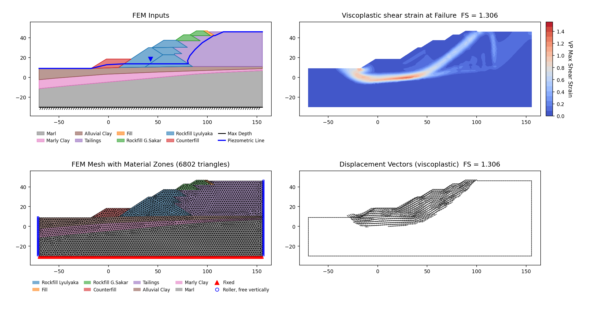

### 🟢 RS2-66: Embankment basal stability (Nakamura et al. 2008) {#rs2-66}

**Input files:** [rs2_66a.xlsx](files/rocscience/rs2_66a.xlsx) (h₁ = 2 m) ·
[b](files/rocscience/rs2_66b.xlsx) (4 m) · [c](files/rocscience/rs2_66c.xlsx) (6 m) ·
[d](files/rocscience/rs2_66d.xlsx) (8 m) · [e](files/rocscience/rs2_66e.xlsx) (10 m)

A 10 m high embankment on soft ground, after

> [Nakamura, A., Cai, F., & Ugai, K. (2008)](https://doi.org/10.1201/9780203885284-c107). "Embankment basal stability analysis using shear
> strength reduction finite element method." *(as cited in the RS2 Slope Stability Verification
> Manual, Part III, Problem 66).*

A cohesionless fill (c = 0, φ = 35°, 1.5:1 side slopes) on a soft φ = 0 stratum of thickness h₁
(2 to 10 m) over a firm φ = 0 stratum, with the vendor model's elastic constants and its 50 kPa
tensile cap. Two mechanisms compete. The deep basal squeeze through the soft band is the one the
manual draws and its SSR column reports. The shallower one is a skin on the c = 0 face, whose
closed form, FS = tan 35° / tan 33.69° = **1.050**, does not depend on h₁ or on the flow rule; an
unfiltered SSRM finds it, and `min_slip_depth` = 4 m excludes it and returns the deep mechanism:

| h₁ (m) | XSLOPE SSRM, filter off (face skin) | XSLOPE SSRM, `min_slip_depth` = 4 m (deep) | RS2 SSR | Slide2 Spencer | Nakamura LEM | Nakamura FEM |
|---|---|---|---|---|---|---|
| 2 | 1.044 | 1.169 | 1.13 | 1.05 | 1.21 | 1.24 |
| 4 | 1.031 | 1.169 | 1.19 | 1.16 | 1.22 | 1.16 |
| 6 | 1.031 | 1.094 | 1.13 | 1.10 | 1.22 | 1.16 |
| 8 | 1.031 | 1.069 | 1.08 | 1.13 | 1.10 | 1.10 |
| 10 | 1.044 | 1.044 | 1.05 | 1.05 | 1.08 | 1.08 |

The face skin is this row's referee pairing, and its worst case, 1.031 at three thicknesses, is
−1.8% on the closed form's 1.050. The deep values are shown beside RS2's SSR column rather than scored
against it, because every published strength-reduction solution of this problem runs associated
flow (ψ = φ) where XSLOPE runs ψ = 0. The Slide2 Spencer column reports the face skin at h₁ = 2 and
10 m and the deeper surface at 4, 6 and 8 m. Both mechanisms run through material with no length
scale of its own, so every file meshes its soft band at 1.05 m.

<!-- test: file=files/rocscience/rs2_66a.xlsx, type=fem_ssrm, expected_fs=1.044, element_type=tri6, target_size=3.0, tolerance=0.02, f_min=0.8, f_max=1.6, max_iter=16000, tension_srf=true, k0=1, benchmark=RS2-66a -->
<!-- test: file=files/rocscience/rs2_66b.xlsx, type=fem_ssrm, expected_fs=1.031, element_type=tri6, target_size=3.0, tolerance=0.02, f_min=0.8, f_max=1.6, max_iter=16000, tension_srf=true, k0=1, benchmark=RS2-66b -->
<!-- test: file=files/rocscience/rs2_66c.xlsx, type=fem_ssrm, expected_fs=1.031, element_type=tri6, target_size=3.0, tolerance=0.02, f_min=0.8, f_max=1.6, max_iter=16000, tension_srf=true, k0=1, benchmark=RS2-66c -->
<!-- test: file=files/rocscience/rs2_66d.xlsx, type=fem_ssrm, expected_fs=1.031, element_type=tri6, target_size=3.0, tolerance=0.02, f_min=0.8, f_max=1.6, max_iter=16000, tension_srf=true, k0=1, benchmark=RS2-66d, f_stand=1.025, f_fail=1.0375, check=edges -->
<!-- test: file=files/rocscience/rs2_66e.xlsx, type=fem_ssrm, expected_fs=1.044, element_type=tri6, target_size=3.0, tolerance=0.02, f_min=0.8, f_max=1.6, max_iter=16000, tension_srf=true, k0=1, benchmark=RS2-66e, f_stand=1.0375, f_fail=1.05, check=edges -->
<!-- test: file=files/rocscience/rs2_66a.xlsx, type=fem_ssrm, expected_fs=1.169, element_type=tri6, target_size=3.0, tolerance=0.02, f_min=0.8, f_max=1.6, max_iter=16000, tension_srf=true, min_slip_depth=4, k0=1, benchmark=RS2-66a-deep, f_stand=1.1625, f_fail=1.175, check=edges -->
<!-- test: file=files/rocscience/rs2_66b.xlsx, type=fem_ssrm, expected_fs=1.169, element_type=tri6, target_size=3.0, tolerance=0.02, f_min=0.8, f_max=1.6, max_iter=16000, tension_srf=true, min_slip_depth=4, k0=1, benchmark=RS2-66b-deep, f_stand=1.1625, f_fail=1.175, check=edges -->
<!-- test: file=files/rocscience/rs2_66c.xlsx, type=fem_ssrm, expected_fs=1.094, element_type=tri6, target_size=3.0, tolerance=0.02, f_min=0.8, f_max=1.6, max_iter=16000, tension_srf=true, min_slip_depth=4, k0=1, benchmark=RS2-66c-deep, f_stand=1.0875, f_fail=1.1, check=edges -->
<!-- test: file=files/rocscience/rs2_66d.xlsx, type=fem_ssrm, expected_fs=1.069, element_type=tri6, target_size=3.0, tolerance=0.02, f_min=0.8, f_max=1.6, max_iter=16000, tension_srf=true, min_slip_depth=4, k0=1, benchmark=RS2-66d-deep, f_stand=1.0625, f_fail=1.075, check=edges -->
<!-- test: file=files/rocscience/rs2_66e.xlsx, type=fem_ssrm, expected_fs=1.044, element_type=tri6, target_size=3.0, tolerance=0.02, f_min=0.8, f_max=1.6, max_iter=16000, tension_srf=true, min_slip_depth=4, k0=1, benchmark=RS2-66e-deep, f_stand=1.0375, f_fail=1.05, check=edges -->

The first two figures are the filter-off runs at the thinnest and thickest bands; the third is the
filtered run on the thinnest band.

**Thinnest soft band — h₁ = 2 m (rs2_66a)**

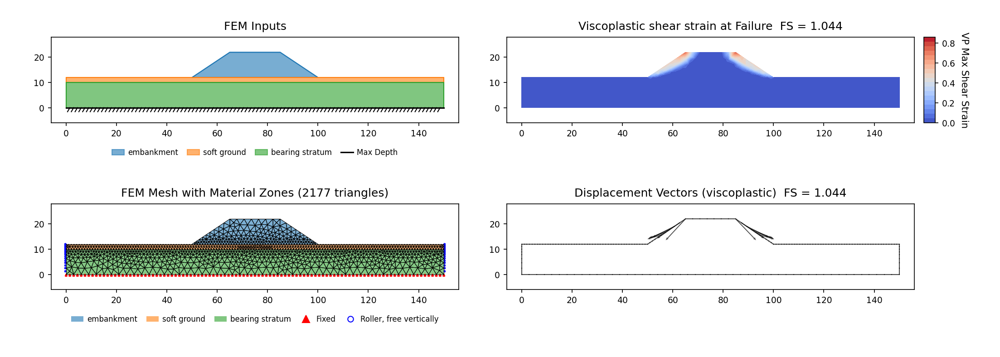

**Thickest soft band — h₁ = 10 m (rs2_66e)**

**Thinnest soft band, deep mechanism — h₁ = 2 m, `min_slip_depth` = 4 m (rs2_66a)**

### 🟢 RS2-67: Earth dam under steady & transient unsaturated seepage (Huang & Jia 2009) {#rs2-67}

**Input files:** [rs2_67a.xlsx](files/rocscience/rs2_67a.xlsx) (Case 1, dry) ·
[rs2_67b.xlsx](files/rocscience/rs2_67b.xlsx) (Case 2, steady — own-flow) ·
[rs2_67c.xlsx](files/rocscience/rs2_67c.xlsx) (Case 3, 90 h downstream) ·
[rs2_67d.xlsx](files/rocscience/rs2_67d.xlsx) (Case 3, 90 h upstream) ·
[rs2_67e.xlsx](files/rocscience/rs2_67e.xlsx) (Case 4, 1500 h downstream — own-flow) ·
[rs2_67f.xlsx](files/rocscience/rs2_67f.xlsx) (Case 4, 1500 h upstream — own-flow)

A homogeneous earth dam evaluated at successive seepage states, after

> [Huang, M., & Jia, C-Q. (2009)](https://doi.org/10.1016/j.compgeo.2008.03.006). "Strength reduction FEM in stability analysis of soil slopes
> subjected to transient unsaturated seepage." *Computers and Geotechnics* 36(1–2), 93–101.
> *(as cited in the RS2 Slope Stability Verification Manual, Part III, Problem 67).*

A single Mohr-Coulomb dam (c = 13.8 kPa, φ = 37°) in six strength-reduction stages: **Case 1** dry;
**Case 2** steady seepage at full pool; **Case 3** the downstream and upstream faces 90 h after a
rapid drawdown; **Case 4** the same faces at 1500 h. The upstream stages confine reduction to RS2's
upstream Search Area. The dry and 90 h stages run on RS2's own solved pore-pressure fields,
imported node by node, and the 90 h files keep the vendor's slightly rotated re-import of the
section so the geometry agrees with the field it carries. Cases 2 and 4 carry no recoverable
field, so XSLOPE solves its own steady seepage from the vendor's boundary conditions; Case 4's
vendor model is a single steady stage at the drawn-down pool, so it is solved as the drained
steady state. XSLOPE's own transient solve reproduces RS2's 90 h phreatic surface to a mean 0.01 m
on the upstream face:

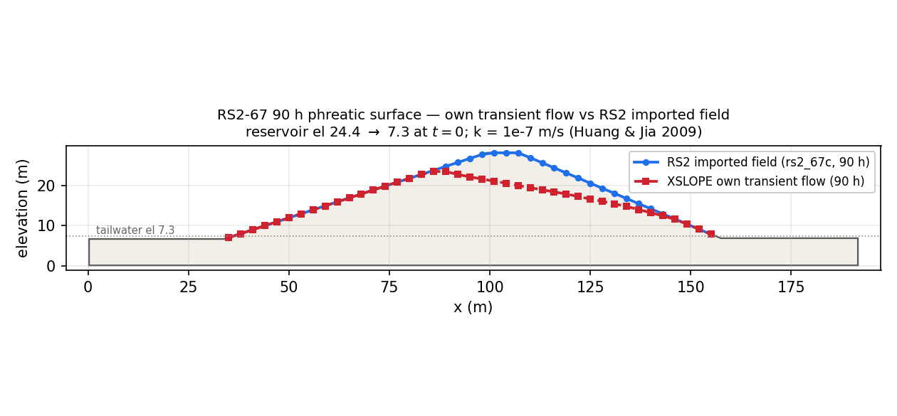

| Stage | XSLOPE SSRM | RS2 SSR | Slide2 (Bishop / Janbu / Spencer / GLE) | ref LEM | ref FEM | pore pressure |
|---|---|---|---|---|---|---|
| Case 1 — dry | **2.502** | 2.48 (+0.9%) | 2.45 / 2.32 / 2.44 / 2.42 | 2.43 | 2.50 (+0.1%) | — |
| Case 2 — steady, downstream | **1.695** | 1.70 (−0.3%) | 1.64 / 1.55 / 1.73 / 1.71 | 1.70 | 1.78 (−4.8%) | own flow field |
| Case 3 — 90 h, downstream | **1.820** | 1.83 (−0.5%) | 1.77 / 1.68 / 1.88 / 1.85 | 1.92 | 2.08 (−12.5%) | RS2's field |
| Case 3 — 90 h, upstream | **2.023** | 2.04 (−0.8%) | 1.99 / 1.89 / 2.07 / 2.06 | 2.03 | — | RS2's field |
| Case 4 — 1500 h, downstream | **2.320** | 2.34 (−0.9%) | 2.22 / 2.09 / 2.35 / 2.31 | 2.38 | 2.42 (−4.1%) | own flow field |
| Case 4 — 1500 h, upstream | **2.742** | 2.76 (−0.7%) | 2.66 / 2.52 / 2.79 / 2.76 | 2.80 | — | own flow field |

All six stages land within 1% of RS2's own SSR column. Huang & Jia's own FEM values are shown
beside it.

<!-- test: file=files/rocscience/rs2_67a.xlsx, type=fem_ssrm, expected_fs=2.502, element_type=tri6, target_size=4.0, tolerance=0.02, f_min=1.5, f_max=3.0, max_iter=16000, tension_srf=true, k0=1, benchmark=RS2-67a, f_stand=2.49609375, f_fail=2.5078125, check=edges -->
<!-- test: file=files/rocscience/rs2_67c.xlsx, type=fem_ssrm, expected_fs=1.820, tolerance=0.02, f_min=1.0, f_max=3.0, max_iter=16000, tension_srf=true, k0=1, benchmark=RS2-67c, f_stand=1.8125, f_fail=1.828125, check=edges -->
<!-- test: file=files/rocscience/rs2_67d.xlsx, type=fem_ssrm, expected_fs=2.023, tolerance=0.02, f_min=1.0, f_max=3.0, max_iter=16000, ssr_zone=-6.95691;-29.8799;102.318;-29.8799;102.318;66.9821;-6.95691;66.9821, tension_srf=true, k0=1, benchmark=RS2-67d, f_stand=2.015625, f_fail=2.03125, check=edges -->
<!-- test: file=files/rocscience/rs2_67b.xlsx, type=fem_ssrm, expected_fs=1.695, tolerance=0.02, f_min=1.0, f_max=3.0, max_iter=16000, tension_srf=true, k0=1, benchmark=RS2-67b, f_stand=1.6875, f_fail=1.703125, check=edges -->
<!-- test: file=files/rocscience/rs2_67e.xlsx, type=fem_ssrm, expected_fs=2.320, tolerance=0.02, f_min=1.0, f_max=3.0, max_iter=16000, tension_srf=true, k0=1, benchmark=RS2-67e, f_stand=2.3125, f_fail=2.328125, check=edges -->
<!-- test: file=files/rocscience/rs2_67f.xlsx, type=fem_ssrm, expected_fs=2.742, tolerance=0.02, f_min=1.0, f_max=3.0, max_iter=16000, ssr_zone=-5.89862;-33.6746;102.478;-33.6746;102.478;70.3747;-5.89862;70.3747, tension_srf=true, k0=1, benchmark=RS2-67f -->

**Case 2 — steady full pool, own flow field (rs2_67b)**

**Case 3 — 90 h after drawdown, upstream Search Area (rs2_67d)**

### 🟢 RS2-68: Stability of seismically loaded slopes (Loukidis et al. 2003) {#rs2-68}

**Input files:** [rs2_68a.xlsx](files/rocscience/rs2_68a.xlsx) (Case 1, ru = 0.5) ·
[b](files/rocscience/rs2_68b.xlsx) (Case 2, dry) · [c](files/rocscience/rs2_68c.xlsx) (Case 3,
3-layer)

The one problem on this page whose target is **not a factor of safety** but a
**critical seismic coefficient** k꜀, after

> [Loukidis, D., Bandini, P., & Salgado, R. (2003)](https://doi.org/10.1680/geot.2003.53.5.463). "Stability of seismically loaded slopes
> using limit analysis." *Géotechnique*, 53(5), 463–479. *(RS2 Slope Stability Verification
> Manual, Part III, Problem 68.)*

k꜀ is the horizontal pseudo-static coefficient for which the searched minimum FS = 1. Three cases
share a 25 m, 1V:3H slope (c = 25 kPa, φ = 30°): **Case 1** adds ru = 0.5, **Case 2** is
dry, and **Case 3** replaces the body with three dipping bands, the mechanism riding a weak middle
band at φ = 15°. XSLOPE finds k꜀ by limit equilibrium, bisecting k to the single crossing of
FS = 1 and confirming with a full search. Loukidis's limit-analysis bounds are the referee, and
they contain every XSLOPE value; Loukidis's own same-method values and Slide2's are shown beside
them.

| Case | Method | XSLOPE k꜀ | Loukidis limit analysis LB–UB | Loukidis (same method) | Slide2 |
|---|---|---|---|---|---|
| 1 (ru = 0.5) | Bishop | 0.127 | 0.126–0.145 (inside) | 0.127 (0.0%) | 0.118 (+7.6%) |
| 1 (ru = 0.5) | Spencer | 0.132 | 0.126–0.145 (inside) | 0.131 (+0.8%) | 0.132 (0.0%) |
| 2 (dry) | Bishop | 0.426 | 0.423–0.454 (inside) | 0.426 (0.0%) | 0.425 (+0.2%) |
| 2 (dry) | Spencer | 0.433 | 0.423–0.454 (inside) | 0.431 (+0.5%) | 0.431 (+0.5%) |
| 3 (3-layer) | Bishop | 0.169 | 0.148–0.172 (inside) | — | 0.155 (+9.0%) |
| 3 (3-layer) | Spencer | 0.167 | 0.148–0.172 (inside) | 0.155 (+7.7%) | 0.151 (+10.6%) |

| Case | Loukidis FEM | Loukidis log-spiral | RS2 SSRM |
|---|---|---|---|
| 1 (ru = 0.5) | 0.132 | 0.132 | 0.125 |
| 2 (dry) | 0.433 | 0.432 | 0.413 |
| 3 (3-layer) | 0.161 | — | 0.161 |

Loukidis's Table 3 lists Spencer's method for case 3 and publishes no Bishop value; the RS2
manual's own table places that value in a Bishop column, reversing the source. The homogeneous
cases land on the published limit-equilibrium values on deep, large-radius arcs. On case 3 XSLOPE's
0.169 is +9.0% above Slide2's Bishop 0.155 and its 0.167 is +7.7% above Loukidis's Spencer 0.155.
The three zone polygons, strengths and unit weights match the vendor model `#068_03`, and its
uniform body force bx = −k acts along the same line as XSLOPE's seismic force; a
300-circle grid search at the published coefficient finds no surface reaching FS = 1, so the
residual is a difference in the located limit-equilibrium minimum, and it is unexplained.

#### The SSRM cross-check on Case 3 {#rs2-68-ssrm}

Part IV fixes k at Loukidis's coefficient and reports the factor of safety there:

| Published at k = 0.155 g | RS2 SSR | Slide2 (Spencer / GLE) | Loukidis Spencer |
|---|---|---|---|
| RS2 Part IV Table 68.2 | 0.99 | 0.994 | 1.000 |

On the same `rs2_68c` file at `k_seismic` = 0.155 g, XSLOPE's strength-reduction factor falls at
every step of refinement from a 4.0 m to a 1.5 m element size (1,593 to 10,803 tri6) and is still
falling on the finest mesh, crossing RS2's SSR on the way down. The mechanism rides the thin
φ = 15° band, to which unregularized Mohr-Coulomb gives no thickness, so no strength-reduction value
on this problem is scored.

<!-- test: file=files/rocscience/rs2_68a.xlsx, type=critical_kc, method=bishop, expected_kc=0.127, k_min=0.08, k_max=0.18, kc_tol=0.01, num_slices=40, benchmark=RS2-68a-bishop -->
<!-- test: file=files/rocscience/rs2_68a.xlsx, type=critical_kc, method=spencer, expected_kc=0.132, k_min=0.08, k_max=0.18, kc_tol=0.01, num_slices=40, benchmark=RS2-68a-spencer -->
<!-- test: file=files/rocscience/rs2_68b.xlsx, type=critical_kc, method=bishop, expected_kc=0.426, k_min=0.38, k_max=0.48, kc_tol=0.01, num_slices=40, benchmark=RS2-68b-bishop -->
<!-- test: file=files/rocscience/rs2_68b.xlsx, type=critical_kc, method=spencer, expected_kc=0.433, k_min=0.38, k_max=0.48, kc_tol=0.01, num_slices=40, benchmark=RS2-68b-spencer -->
<!-- test: file=files/rocscience/rs2_68c.xlsx, type=mesh_elements, element_type=tri6, target_size=4.0, expected_elements=1593, benchmark=RS2-68-mesh-coarse -->
<!-- test: file=files/rocscience/rs2_68c.xlsx, type=mesh_elements, element_type=tri6, target_size=1.5, expected_elements=10803, benchmark=RS2-68-mesh-fine -->
<!-- test: file=files/rocscience/rs2_68c.xlsx, type=critical_kc, method=bishop, expected_kc=0.169, k_min=0.11, k_max=0.20, kc_tol=0.01, num_slices=40, benchmark=RS2-68c-bishop -->
<!-- test: file=files/rocscience/rs2_68c.xlsx, type=critical_kc, method=spencer, expected_kc=0.167, k_min=0.11, k_max=0.20, kc_tol=0.01, num_slices=40, benchmark=RS2-68c-spencer -->

**Case 2 — dry homogeneous slope (rs2_68b)**

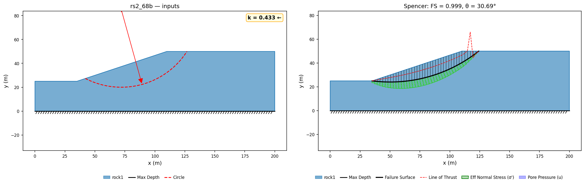

**Case 3 — three-layer, band-riding slope (rs2_68c)**

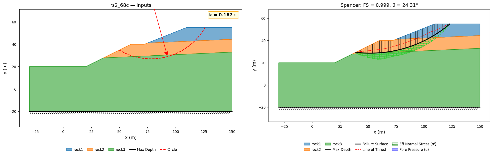

### 🟢 RS2 Part IV VP2: Homogeneous slope with tension crack (ACADS 1b) {#p4-vp2}

Slide2/LEM counterpart: [VP2](rocscience.md#vp2) (Giam & Donald 1989, ACADS 1(b)). RS2 Part IV
re-runs this slope by shear-strength reduction (Table 2.2).

**Input files:** [vp002.xlsx](files/rocscience/vp002.xlsx)

A single-material slope (c' = 32 kPa, φ' = 10°) with a tension crack. RS2's vendor `.fez` states
the crack as a near-surface zone carrying a tensile cutoff T = 0 over a substrate at T = 32 kPa,
both reduced with the strength, and the file carries both statements: the LEM reads
`tcrack_depth`, the FEM reads the zone, whose base is laid at the file's own crack depth, 3.814 m,
against the vendor's 3.87 m. ([RS2-29](#rs2-29)'s clay model reaches the same end by geometry
instead.)

| Method | XSLOPE | RS2 SSRM | Giam & Donald reference | Slide2 Spencer |
|---|---|---|---|---|
| SSRM (1 m mesh) | 1.656 | 1.63 (+1.6%) | 1.65 (+0.4%) | 1.592 |

The factor holds under refinement: 1.681 / 1.656 / 1.656 / 1.644 at 3 / 1.5 / 1.0 / 0.7 m, within
one step of the search from 1.5 m down; at 3 m the zone is about one element thick.

<!-- test: file=files/rocscience/vp002.xlsx, type=fem_ssrm, expected_fs=1.681, element_type=tri6, target_size=3.0, tolerance=0.02, f_min=1.2, f_max=2.0, max_iter=16000, tension_srf=true, k0=1, benchmark=RS2-P4-VP2-m3.0, f_stand=1.675, f_fail=1.6875, check=edges -->
<!-- test: file=files/rocscience/vp002.xlsx, type=fem_ssrm, expected_fs=1.656, element_type=tri6, target_size=1.5, tolerance=0.02, f_min=1.2, f_max=2.0, max_iter=16000, tension_srf=true, k0=1, benchmark=RS2-P4-VP2-m1.5, f_stand=1.65, f_fail=1.6625, check=edges -->
<!-- test: file=files/rocscience/vp002.xlsx, type=fem_ssrm, expected_fs=1.644, element_type=tri6, target_size=0.7, tolerance=0.02, f_min=1.2, f_max=2.0, max_iter=16000, tension_srf=true, k0=1, benchmark=RS2-P4-VP2-m0.7, f_stand=1.6375, f_fail=1.65, check=edges -->
<!-- test: file=files/rocscience/vp002.xlsx, type=fem_ssrm, expected_fs=1.656, element_type=tri6, target_size=1.0, tolerance=0.02, f_min=1.2, f_max=2.0, max_iter=16000, tension_srf=true, k0=1, benchmark=RS2-P4-VP2, f_stand=1.65, f_fail=1.6625, check=edges -->

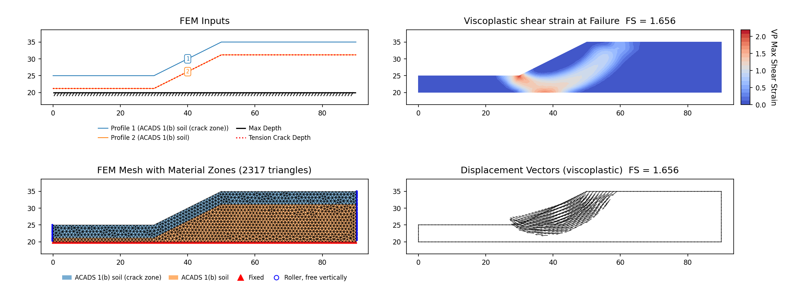

### 🟢 RS2 Part IV VP6: Talbingo dam, specified upstream circle (ACADS 2b) {#p4-vp6}

Slide2/LEM counterpart: [VP6](rocscience.md#vp6) (ACADS 2(b), Giam & Donald 1989). The same
four-zone Talbingo dam as [RS2-4](#rs2-4), whose unconstrained SSRM finds the downstream bench
(1.672); ACADS 2(b) asks instead for the factor on a single specified upstream circle, and RS2
obtains its 2.15 by confining strength reduction to an SSR Search Area over that face.

**Input files:** [vp006.xlsx](files/rocscience/vp006.xlsx) — the same dam as
[vp005.xlsx](files/rocscience/vp005.xlsx), carrying the ACADS 2(b) specified circle.

The file carries RS2's own 37-vertex search ring from `slope stability #006.fez` as an `ssr_zone`,
holding everything outside it at full strength; the vendor makes its abutment and foundation
blocks elastic instead, the same approximation stated for [RS2-61](#rs2-61)/[RS2-64](#rs2-64).

| Method | XSLOPE | RS2 SSRM | Slide2 (specified upstream circle) | Giam & Donald reference |
|---|---|---|---|---|
| SSRM, unconstrained (→ [RS2-4](#rs2-4)) | 1.672 | — (downstream bench, true global min) | — | — |
| SSRM, SSR Search Area (upstream circle) | 2.188 | 2.15 (+1.8%) | Bishop 2.208 / Spencer 2.292 / GLE 2.301 | 2.29 (−4.5%) |

Confinement lifts the factor from 1.672 on the downstream bench to 2.188 on the upstream circle, so
the split between the two is a choice of mechanism, not a discrepancy. The row is taken at the
RS2-4 mesh (6.5 m tri6).

<!-- test: file=files/rocscience/vp006.xlsx, type=fem_ssrm, expected_fs=2.188, element_type=tri6, target_size=6.5, tolerance=0.02, f_min=1.8, f_max=2.5, max_iter=16000, ssr_zone=337.693;156.655;332.733;149.028;321.296;131.643;301.471;106.786;282.104;86.9617;253.282;65.612;218.97;44.5673;191.673;33.2825;160.106;24.1326;129.302;18.6427;106.884;16.5077;82.3323;16.5077;59.6101;20.1677;46.2384;23.742;43.4453;27.1826;26.5181;18.6427;29.4837;15.139;45.1228;9.79785;62.5076;7.05289;90.1096;5.22292;107.647;5.22292;124.269;5.22292;147.754;7.66288;167.883;10.8653;189.996;16.9652;206.923;22.7602;226.464;30.2593;250.08;42.5849;274.937;59.2071;299.184;79.9468;312.146;94.4341;328.442;115.178;340.663;132.406;348.593;150.686;350.477;154.416;339.88;160.039;337.693;156.655, tension_srf=true, k0=1, benchmark=RS2-P4-VP6, f_stand=2.1828125, f_fail=2.19375, check=edges -->

### 🟢 RS2 Part IV VP41: Homogeneous slope, power curve + ru (Jiang, Baker & Yamagami 2003) {#p4-vp41}

Slide2/LEM counterpart: [VP41](rocscience.md#vp41). RS2 Part IV (Table 41.2) re-runs this slope by
shear-strength reduction, exercising the FEM's **power-curve strength and ru pore pressure
together**.

**Input files:** [vp041.xlsx](files/rocscience/vp041.xlsx)

A homogeneous slope whose strength follows the power curve τ = 1.4·(σ')0.8, with
ru = 0.3.

| Method | XSLOPE | RS2 SSRM | Slide2 | Charles & Soares | Baker | Perry | XSLOPE LEM |
|---|---|---|---|---|---|---|---|
| SSRM (1.5 m mesh) | 1.656 | 1.64 (+1.0%) | Spencer 1.666 / GLE 1.653 | Bishop 1.66 | Janbu 1.60 | rigorous Janbu 1.67 | Bishop 1.668 / Spencer 1.670 |

XSLOPE's SSRM lands inside the published LEM cluster and holds between the 2.5 m and 1.5 m element
sizes. The vendor model publishes no elastic constants for a power-curve material, so the file
assigns them by soil type.

<!-- test: file=files/rocscience/vp041.xlsx, type=fem_ssrm, expected_fs=1.656, element_type=tri6, target_size=1.5, tolerance=0.02, f_min=1.2, f_max=2.0, max_iter=16000, k0=1, benchmark=RS2-P4-VP41, f_stand=1.65, f_fail=1.6625, check=edges -->

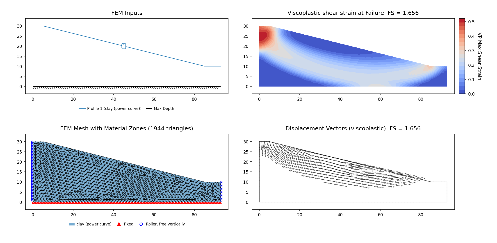

### 🟢 RS2 Part IV VP51: Four-material slope, water table, tension crack, seismic — 12-method comparison (Zhu et al. 2003) {#p4-vp51}

**Input files:** [rs2_51.xlsx](files/rocscience/rs2_51.xlsx) — Part 4 Verification Problem #51.

> Zhu, D.Y., Lee, C.F. & Jiang, H.D. (2003). "A generalised framework of limit equilibrium
> methods for slope stability analysis." *Géotechnique* 53(4), 377–395. *(RS2/Slide2 Slope
> Stability Verification Manual, Part 4, Problem #51.)*

A four-layer 1V:2H slope with a weak φ = 18° band, a piezometric surface, a horizontal seismic
coefficient k = 0.1 and a dry tension crack. The published task is the factor of safety on a given
circle over twelve LEM methods, so this is an LEM row; the RS2 SSRM value of 1.22 in the catalog is
an independent finite-element mechanism, not the LEM target reproduced here. The vendor `.fez`
carries no slip surface and the circle is figure-only, so the circle here — center (32, 36), R = 35
— was recovered by inversion against the rigorous methods, with everything else transcribed from
`slope stability #051.fez`. On it, at 100 slices:

| Method | XSLOPE | Slide2 | Zhu | Note |
|---|---|---|---|---|
| Ordinary (OMS) | 1.092 | 1.145 (−4.6%) | 1.066 (+2.4%) | lands inside the Slide2–Zhu spread |
| Bishop simplified | 1.316 | 1.278 (+3.0%) | 1.278 (+3.0%) |  |
| Janbu simplified | 1.196\* | 1.112 | 1.112 | \*XSLOPE reports Janbu **corrected** (f₀ ≈ 1.08); 1.196/1.08 ≈ **1.11** ✓, so the columns are not like-for-like |
| Corps of Engineers | 1.400 | 1.422 (−1.5%) | 1.377 (+1.7%) | inside the Slide2–Zhu spread |
| Lowe & Karafiath | 1.244 | 1.288 (−3.4%) | 1.290 (−3.6%) |  |
| **Spencer** | **1.300** | **1.293** (**+0.5%**) | **1.293** (**+0.5%**) |  |
| GLE / Morgenstern–Price | 1.282 | 1.304 | 1.303 (−1.6%) | half-sine interslice function; Slide2's column is GLE, which this page's conventions treat as a different method from XSLOPE's M-P, so it stays bare like the Janbu row |

Spencer, the value the manual's Table 51.2 quotes, reproduces to +0.5%, and Janbu matches once the
corrected-versus-simplified convention is undone. The other methods carry the residual of fitting a
figure-only circle plus method-implementation differences. An unconstrained circular search dives
into a deep mechanism through the weak band, so the row is a single fixed circle, not a search.

<!-- test: file=files/rocscience/rs2_51.xlsx, type=single_circle, num_slices=100, fs_oms=1.092, fs_bishop=1.316, fs_janbu=1.196, fs_corps=1.400, fs_lowe=1.244, fs_spencer=1.300, fs_mprice=1.282, benchmark=RS2-P4-VP51 -->

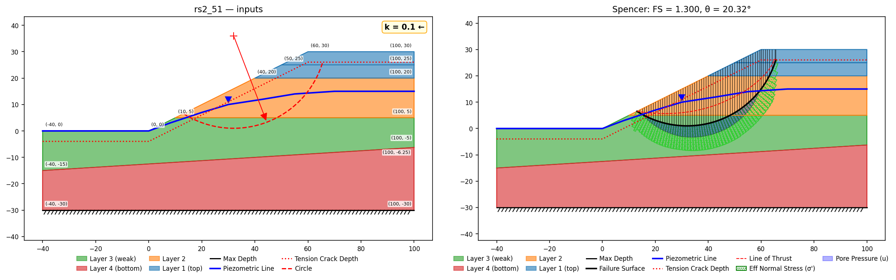

### 🟢 RS2 Part IV VP57: Layered slope with weak seam, water table (Pockoski & Duncan slope 3) {#p4-vp57}

Slide2/LEM counterpart: [VP57](rocscience.md#vp57). RS2 Part IV (Table 57.2) re-runs this layered
slope by shear-strength reduction.

**Input files:** [vp057.xlsx](files/rocscience/vp057.xlsx)

Sandy clay (c = 300 psf, φ = 35°) over a clay seam (c = 0, φ = 25°), with a water table and a dry
tension crack. As on [VP2](#p4-vp2), the LEM reads the crack through `tcrack_depth` and the FEM
reads the vendor's T = 0 crack zone, a wedge 6 ft deep under the crest tapering to nothing at the
base of the slope.

| Method | XSLOPE | RS2 SSRM | Slide2 Spencer | SLOPE/W | XSTABL | XSLOPE LEM |
|---|---|---|---|---|---|---|
| SSRM (3.0 m mesh) | 1.323 | 1.32 (+0.2%) | 1.40 composite / 1.42 not-composite | 1.40 | 1.41 | Bishop/Spencer 1.389 / 1.396 composite |

The reduction rides the weak c = 0 seam, the same mechanism that puts RS2's own SSRM below the
composite LEM cluster (~1.40). The crest cutoff does nothing here, since the slide never opens the
crest in tension. ψ = 0.

<!-- test: file=files/rocscience/vp057.xlsx, type=fem_ssrm, expected_fs=1.323, element_type=tri6, target_size=3.0, tolerance=0.02, f_min=1.0, f_max=1.7, max_iter=16000, tension_srf=true, k0=1, benchmark=RS2-P4-VP57, f_stand=1.3171875, f_fail=1.328125, check=edges -->

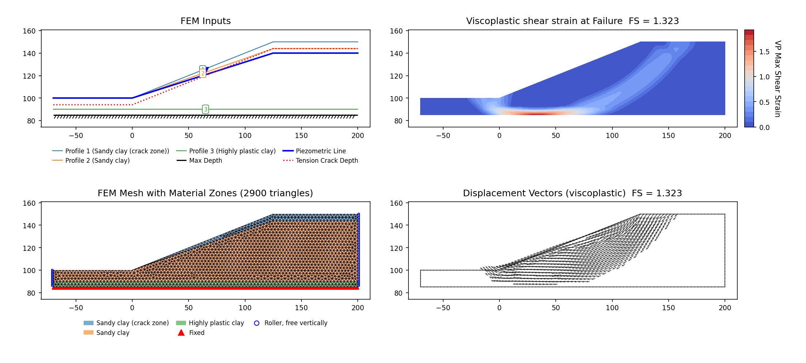

### 🟢 RS2 Part IV VP60: Soil-nailed wall (Pockoski & Duncan slope 7) {#p4-vp60}

Slide2/LEM counterpart: [VP60](rocscience.md#vp60). RS2 Part IV re-runs this nailed wall by
shear-strength reduction.

**Input files:** [vp060.xlsx](files/rocscience/vp060.xlsx)

A near-vertical wall in undrained sandy clay (c = 800 psf, φ = 0) retained by five passive
soil-nail rows at 15° declination, with a dry 7-ft tension crack and crest surcharges. The nails
carry an FEM axial rigidity EA ≈ 2000·T_max, and their lines split the soil surface so the nail
nodes are shared with the 2D mesh.

| Method | XSLOPE | RS2 SSRM | Slide2 | UTEXAS4 | GOLD-NAIL |
|---|---|---|---|---|---|
| SSRM (2.0 ft mesh) | 1.009 | 0.98 (+3.0%) | Spencer 1.009 / Janbu 1.041 | 1.02 / 1.08 | 0.91 |

*The Slide2 values are on Slide's printed circle; the published spread is 0.91–1.02.*

XSLOPE's SSRM lands inside the published 0.91–1.02 spread. The row carries a caveat: the vendor
model holds 33.9% of the domain elastic, a linear-elastic twin of the foundation that cannot
yield, and RS2's published 0.98 was produced with it, where this run is unconstrained. The vendor
also states Slide's inclined tension crack as a T = 0 zone covering the whole upper retained mass,
23% of the domain; carried as a second material it drops the factor well below RS2's own SSR,
which RS2 publishes with the zone in place, so the zone is recorded and the crack is carried
through `tcrack_depth`.

<!-- test: file=files/rocscience/vp060.xlsx, type=fem_ssrm, expected_fs=1.009, element_type=tri6, target_size=2.0, tolerance=0.02, f_min=0.7, f_max=1.3, max_iter=16000, tension_srf=true, k0=1, benchmark=RS2-P4-VP60, f_stand=1, f_fail=1.01875, check=edges -->

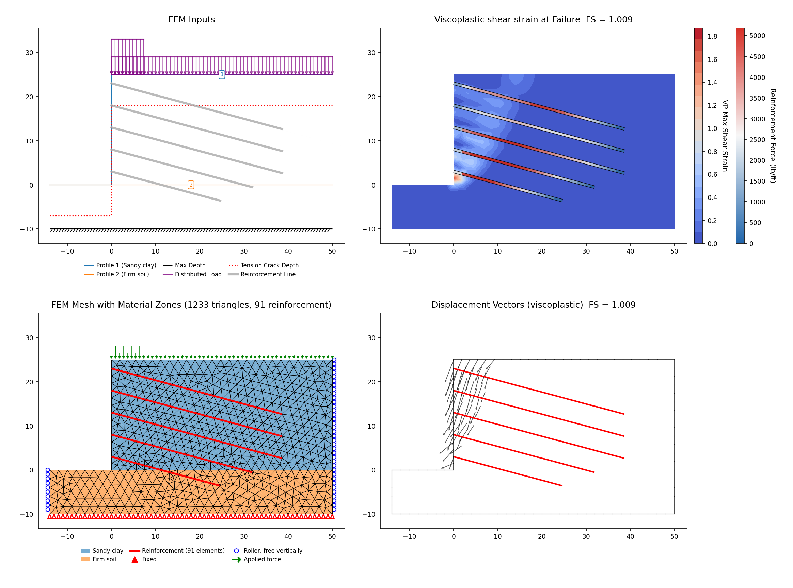

### 🟢 RS2 Part IV VP64: USACE end-of-construction dam (Fig 4-1) {#p4-vp64}

Slide2/LEM counterpart: [VP64](rocscience.md#vp64) (USACE EM 1110-2-1902 Fig 4-1). RS2 Part IV
publishes an SSRM of **2.37** (Table 64.2; Slide2 Spencer 2.445).

**Input files:** [vp064.xlsx](files/rocscience/vp064.xlsx)

A symmetric 50-ft embankment over a sand blanket, foundation clay and rock, with a core trench
cutting through the sand to the clay. The trench splits the blanket in two, so the file lays it as
two polygons, which the section needs to close as a continuum.

| Method | XSLOPE | RS2 SSRM | Slide2 Spencer | USACE Spencer | XSLOPE LEM Spencer |
|---|---|---|---|---|---|
| SSRM (6 ft mesh) | 2.406 | 2.37 (+1.5%) | 2.445 | 2.44 | 2.488 |

`#064.fez` holds a 65-vertex SSR search area, a ~6 ft ribbon traced along Slide2's Spencer circle,
which RS2 uses to reproduce a specified surface by strength reduction. At the 6 ft element size it
is about one element across and cannot form a mechanism, so it is not carried; drawn around the
mechanism, it would give the same answer the unconstrained run gives. The vendor's T = 0 crest
zone, RS2's import of Slide's 7-ft crack, is carried as the same 7 ft through `tcrack_depth`.

<!-- test: file=files/rocscience/vp064.xlsx, type=fem_ssrm, expected_fs=2.406, element_type=tri6, target_size=6.0, tolerance=0.02, f_min=2.0, f_max=2.8, max_iter=16000, tension_srf=true, k0=1, benchmark=RS2-P4-VP64, f_stand=2.4, f_fail=2.4125, check=edges -->

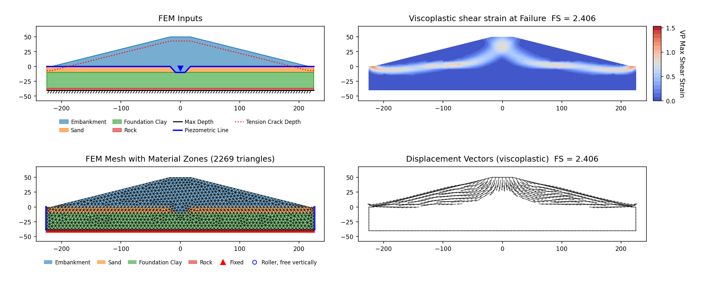

### 🟢 RS2 Part IV VP65 / VP66: USACE upstream-pool dams (Fig 4-2, Fig 4-3) {#p4-vp65}

Slide2/LEM counterparts: [VP65](rocscience.md#vp65) and [VP66](rocscience.md#vp66). Two dams of one
family — the [VP64](#p4-vp64) embankment under a pool at el. 20 — so they are treated together. Own
SSRM builds on the shared Slide2 files.

**Input files:** [vp065.xlsx](files/rocscience/vp065.xlsx) · [vp066.xlsx](files/rocscience/vp066.xlsx)

| Case | XSLOPE SSRM | RS2 SSR | USACE |
|---|---|---|---|
| VP66 (Fig 4-3), ponded both faces | **2.172** | 2.22 (−2.2%) | 2.30 |
| VP65 (Fig 4-2), ponded upstream only | *unconfirmed* | 2.60 | 2.71 |

**The two dams are watered differently.** VP66 stands in water on both faces, and RS2's `#066`
states a piezometric line across the full width with water tractions on both faces. VP65 is ponded
upstream only, and `#065` stops its piezometric line short of the downstream face, with water
tractions upstream alone and zero pore pressure beyond the line. Each file carries its own model's
pair, because under standing water the pond's weight is part of the total stress the pore pressure
is subtracted from, so a piezometric surface is a sound pore pressure only with its pond carried as
a load.

**VP65.** *Unconfirmed*: its unconstrained SSRM fails the upstream slope, just above the
published circle, well below RS2's 2.60, which RS2 obtains inside an SSR corridor traced along that
circle; an unconstrained factor against a constrained one is not a pairing. Both vendor models
carry such a corridor, 6.6 ft wide on VP65 and 9.2 ft on VP66, thinner than the corpus mesh, and
`#065` draws its corridor on a section of its own, so neither is carried and both factors are
unconstrained runs: on VP66 that still lands within 2.2% of the vendor's constrained value.

<!-- test: file=files/rocscience/vp066.xlsx, type=fem_ssrm, expected_fs=2.172, element_type=tri6, target_size=6.0, tolerance=0.02, f_min=1.7, f_max=3.0, max_iter=16000, tension_srf=true, k0=1, benchmark=RS2-P4-VP66 -->

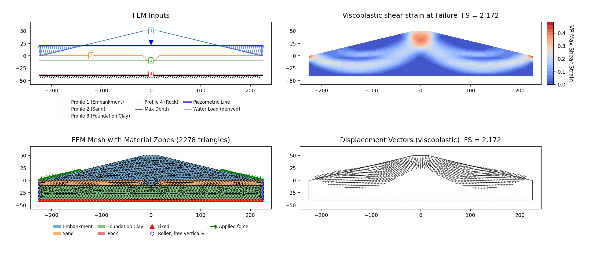

### 🟢 RS2 Part IV VP67: USACE end-of-construction embankment (example F-5) {#p4-vp67}

Slide2/LEM counterpart: [VP67](rocscience.md#vp67) (USACE EM 1110-2-1902 example F-5). This
problem has two distinct answers, and both are reproduced: the **unconstrained** critical SRF
(a deep foundation mechanism) and the **toe-circle** SRF that RS2 forces with an SSR Exclusion
Area to obtain its published SSRM of **1.33**.

**Input files:** [vp067.xlsx](files/rocscience/vp067.xlsx) (unconstrained) ·
[vp067c.xlsx](files/rocscience/vp067c.xlsx) (SSR exclusion below El. 81)

A 91-ft embankment on a 100-ft soft, undrained foundation over a rigid base, at end of
construction.

| Method | XSLOPE | RS2 SSRM | Slide2 Spencer | USACE |
|---|---|---|---|---|
| SSRM, unconstrained (8 ft mesh) | 1.076 | — (true global minimum) | — | — |
| SSRM, SSR exclusion below El. 81 (8 ft mesh) | 1.303 | 1.33 (−2.0%) | 1.328 | 1.33 |

*The Slide2 and USACE columns on the constrained row are on the specified toe circle.*

Unconstrained, the SSRM finds a deep translational mechanism riding the foundation/bedrock contact
through the soft φ = 2° clay, the same between the 8 and 4 ft element sizes, and XSLOPE's own
circular LEM search finds the same deep family; the USACE specified circle does not probe it. RS2's
1.33 bars strength reduction in the foundation below the circle's lowest point (≈ El. 81);
vp067c splits the foundation there and excludes the lower zone, and the band moves up onto the toe
circle at **1.303**.

<!-- test: file=files/rocscience/vp067.xlsx, type=fem_ssrm, expected_fs=1.076, element_type=tri6, target_size=8.0, tolerance=0.02, f_min=0.9, f_max=1.8, max_iter=16000, tension_srf=true, k0=1, benchmark=RS2-P4-VP67, f_stand=1.06875, f_fail=1.0828125, check=edges -->
<!-- test: file=files/rocscience/vp067c.xlsx, type=fem_ssrm, expected_fs=1.303, element_type=tri6, target_size=8.0, tolerance=0.02, f_min=1.2, f_max=1.5, max_iter=16000, ssr_exclude=Foundation lower, tension_srf=true, k0=1, benchmark=RS2-P4-VP67c, f_stand=1.29375, f_fail=1.3125, check=edges -->

**Unconstrained critical SRF (vp067)**

**SSR Exclusion Area below El. 81 (vp067c)**

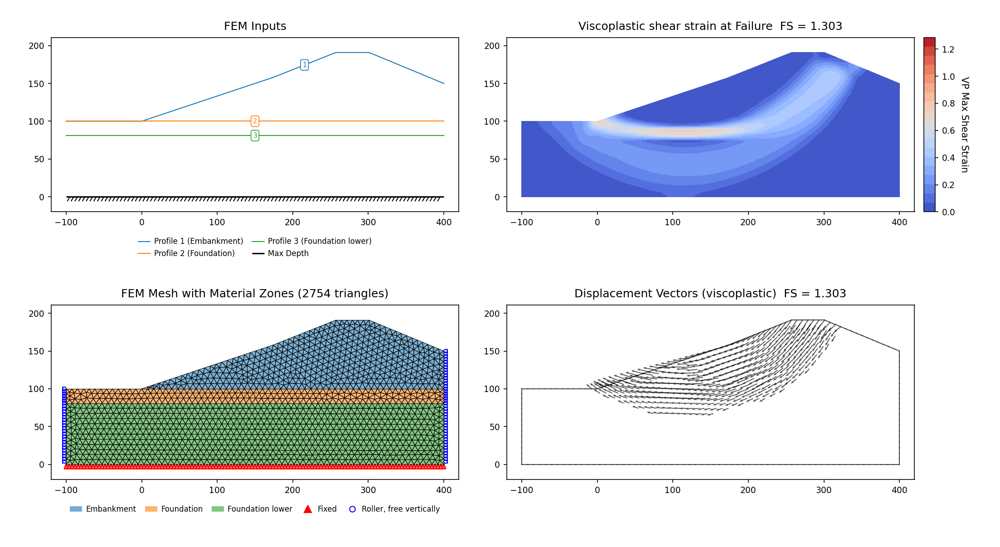

### 🟡 RS2 Part IV VP68: Undrained φ = 0 three-layer slope, ponded (USACE E-10) {#p4-vp68}

Slide2/LEM counterpart: [VP68](rocscience.md#vp68) (USACE EM 1110-2-1902 example E-10). RS2 Part IV
(Table 68.2) re-runs this undrained slope by shear-strength reduction, and the row reports two
answers: the model's own global minimum and the vendor's constrained one.

**Input files:** [vp068.xlsx](files/rocscience/vp068.xlsx)

An undrained three-layer slope (all φ = 0) with 8 ft of water ponded against it. Every layer is
undrained, so the pool acts as a load and nothing else, and the file carries no piezometric line,
matching the vendor model's zero pore pressure.

| Case | XSLOPE SSRM (2.0 ft mesh) | RS2 SSRM | Slide2 | USACE E-10 chart |
|---|---|---|---|---|
| Unconstrained (global minimum) | 1.016 | — | — | — |
| RS2's SSR Search Area | 1.222 | **1.17** (+4.4%) | Bishop 1.241 / GLE 1.244 | 1.33 (−8.1%) |

*The Slide2 and USACE columns on the constrained row are both on the specified circle.*

Every published number describes one specified toe circle, and RS2's strength reduction is
constrained to it: `#068.fez` writes a 30-vertex SSR Search Area enclosing the material below the
circle, 30% of the domain. Carried as an `ssr_zone`, it moves XSLOPE from 1.016 to **1.222**, onto
the base-tangent surface RS2's figure draws. Unconstrained, the reduction localizes along the base
of the weakest layer, and a free circular search finds the same feature, so 1.016 is the model's
own global minimum. It holds under refinement, at 2.0 ft (1,499 tri6) and 1.2 ft (4,132 tri6),
while the constrained branch finds no equilibrium at any factor at 1.2 ft, the sub-unity limit of
the `ssr_zone` approximation described on [RS2-64](#rs2-64), so the constrained value is reported at
2.0 ft.

<!-- test: file=files/rocscience/vp068.xlsx, type=mesh_elements, element_type=tri6, target_size=2.0, expected_elements=1499, benchmark=RS2-P4-VP68-mesh -->
<!-- test: file=files/rocscience/vp068.xlsx, type=mesh_elements, element_type=tri6, target_size=1.2, expected_elements=4132, benchmark=RS2-P4-VP68-mesh-fine -->
<!-- test: file=files/rocscience/vp068.xlsx, type=fem_ssrm, expected_fs=1.016, element_type=tri6, target_size=1.2, tolerance=0.02, f_min=0.8, f_max=1.4, max_iter=16000, tension_srf=true, k0=1, benchmark=RS2-P4-VP68-m1.2, f_stand=1.00625, f_fail=1.025, check=edges -->
<!-- test: file=files/rocscience/vp068.xlsx, type=fem_ssrm, expected_fs=1.016, element_type=tri6, target_size=2.0, tolerance=0.02, f_min=0.8, f_max=1.4, max_iter=16000, tension_srf=true, k0=1, benchmark=RS2-P4-VP68, f_stand=1.00625, f_fail=1.025, check=edges -->
<!-- test: file=files/rocscience/vp068.xlsx, type=fem_ssrm, expected_fs=1.222, element_type=tri6, target_size=2.0, tolerance=0.02, f_min=0.8, f_max=1.4, max_iter=16000, tension_srf=true, ssr_zone=92.8636;16;92.1089;13.5678;89.5431;7.89038;87.3049;3.11374;85.0122;-0.270854;82.4464;-3.19143;79.635;-6.76709;76.8782;-9.03258;71.9651;-12.2534;67.6798;-14.6281;60.8833;-16.839;56.5707;-17.6578;52.0124;-18.504;48.7097;-18.8588;45.9256;-18.8588;41.804;-18.4221;37.9281;-17.6851;34.8438;-16.839;30.4766;-15.3377;26.7917;-13.5909;22.3426;-10.9978;19.7496;-9.27823;18.1938;-8;18.1938;-7.12192;16.365;-7.12192;16.365;-20;95.5679;-20;96.3634;16;96.4959;18.5104;93.1817;18.1127, k0=1, benchmark=RS2-P4-VP68-zone, f_stand=1.2125, f_fail=1.23125, check=edges -->

**Unconstrained — the model's own global minimum (vp068)**

**RS2's own SSR Search Area — the specified circle (vp068)**

### 🟢 RS2 Part IV VP69: USACE steady-seepage embankment (example F-6) {#p4-vp69}

Slide2/LEM counterpart: [VP69](rocscience.md#vp69) (USACE EM 1110-2-1902 example F-6). Own SSRM
build under the vendor's constraint.

**Input files:** [vp069.xlsx](files/rocscience/vp069.xlsx)

A 112 ft embankment (c′ = 0, φ′ = 34°) on a granular foundation (c′ = 0, φ′ = 35°) under steady
seepage, with the pool at el. 100 and the tailwater ponding the toe.

| Case | XSLOPE SSRM | RS2 SSR | USACE | Slide2 Spencer |
|---|---|---|---|---|
| SSRM, under RS2's own SSR Search Area (5 ft mesh) | **1.944** | 1.94 (+0.2%) | 2.01 | 2.026 |

`slope stability #069.fez` constrains the reduction to a 38-vertex corridor along the deep surface,
and the file carries the polygon verbatim; unlike [VP64](#p4-vp64) and [RS2-37](#rs2-37), the
corridor spans more than one element at the meshes used here. Both zones are c = 0, so the factor
keeps falling under refinement, 2.031 / 1.981 / 1.944 / 1.931 at 8 / 6.5 / 5 / 4 ft, as the band
localizes; the row reports the 5 ft mesh, the coarsest at which the band spans two elements. With
every element reduced the mechanism is a shallow cohesionless face skin, as on [RS2-40](#rs2-40),
and this embankment has no `min_slip_depth` plateau, so carrying the vendor's own constraint is the
closer reproduction.

<!-- test: file=files/rocscience/vp069.xlsx, type=fem_ssrm, expected_fs=2.031, element_type=tri6, target_size=8.0, tolerance=0.02, f_min=1.6, f_max=2.4, max_iter=16000, tension_srf=true, k0=1, ssr_zone=33.597;107.325;24.959;104.224;24.959;99.5;29.831;86.063;54.416;49.74;70.805;30.25;117.538;-4.523;144.115;-21.134;189.962;-35.53;242.817;-43.261;274.99;-43.261;309.124;-35.806;331.749;-30.967;357.775;-22.859;378.551;-15.274;395.712;-7.552;408.011;0.18;408.011;3.031;397.188;4.415;394.659;1.915;378.932;-6.122;363.678;-11.366;342.512;-18.23;324.016;-22.997;289.408;-27.383;261.664;-28.622;242.89;-27.381;222.062;-24.152;195;-16.402;165.067;-7.522;139.718;6.525;121.957;15.244;104.035;28.322;89.666;40.593;71.905;57.385;56.889;71.916;44.296;89.677;36.646;102.583, benchmark=RS2-P4-VP69-m8, f_stand=2.025, f_fail=2.0375, check=edges -->
<!-- test: file=files/rocscience/vp069.xlsx, type=fem_ssrm, expected_fs=1.981, element_type=tri6, target_size=6.5, tolerance=0.02, f_min=1.6, f_max=2.4, max_iter=16000, tension_srf=true, k0=1, ssr_zone=33.597;107.325;24.959;104.224;24.959;99.5;29.831;86.063;54.416;49.74;70.805;30.25;117.538;-4.523;144.115;-21.134;189.962;-35.53;242.817;-43.261;274.99;-43.261;309.124;-35.806;331.749;-30.967;357.775;-22.859;378.551;-15.274;395.712;-7.552;408.011;0.18;408.011;3.031;397.188;4.415;394.659;1.915;378.932;-6.122;363.678;-11.366;342.512;-18.23;324.016;-22.997;289.408;-27.383;261.664;-28.622;242.89;-27.381;222.062;-24.152;195;-16.402;165.067;-7.522;139.718;6.525;121.957;15.244;104.035;28.322;89.666;40.593;71.905;57.385;56.889;71.916;44.296;89.677;36.646;102.583, benchmark=RS2-P4-VP69-m6.5, f_stand=1.975, f_fail=1.9875, check=edges -->
<!-- test: file=files/rocscience/vp069.xlsx, type=fem_ssrm, expected_fs=1.931, element_type=tri6, target_size=4.0, tolerance=0.02, f_min=1.6, f_max=2.4, max_iter=16000, tension_srf=true, k0=1, ssr_zone=33.597;107.325;24.959;104.224;24.959;99.5;29.831;86.063;54.416;49.74;70.805;30.25;117.538;-4.523;144.115;-21.134;189.962;-35.53;242.817;-43.261;274.99;-43.261;309.124;-35.806;331.749;-30.967;357.775;-22.859;378.551;-15.274;395.712;-7.552;408.011;0.18;408.011;3.031;397.188;4.415;394.659;1.915;378.932;-6.122;363.678;-11.366;342.512;-18.23;324.016;-22.997;289.408;-27.383;261.664;-28.622;242.89;-27.381;222.062;-24.152;195;-16.402;165.067;-7.522;139.718;6.525;121.957;15.244;104.035;28.322;89.666;40.593;71.905;57.385;56.889;71.916;44.296;89.677;36.646;102.583, benchmark=RS2-P4-VP69-m4, f_stand=1.925, f_fail=1.9375, check=edges -->
<!-- test: file=files/rocscience/vp069.xlsx, type=fem_ssrm, expected_fs=1.944, element_type=tri6, target_size=5.0, tolerance=0.02, f_min=1.6, f_max=2.4, max_iter=16000, tension_srf=true, k0=1, ssr_zone=33.597;107.325;24.959;104.224;24.959;99.5;29.831;86.063;54.416;49.74;70.805;30.25;117.538;-4.523;144.115;-21.134;189.962;-35.53;242.817;-43.261;274.99;-43.261;309.124;-35.806;331.749;-30.967;357.775;-22.859;378.551;-15.274;395.712;-7.552;408.011;0.18;408.011;3.031;397.188;4.415;394.659;1.915;378.932;-6.122;363.678;-11.366;342.512;-18.23;324.016;-22.997;289.408;-27.383;261.664;-28.622;242.89;-27.381;222.062;-24.152;195;-16.402;165.067;-7.522;139.718;6.525;121.957;15.244;104.035;28.322;89.666;40.593;71.905;57.385;56.889;71.916;44.296;89.677;36.646;102.583, benchmark=RS2-P4-VP69, f_stand=1.9375, f_fail=1.95, check=edges -->

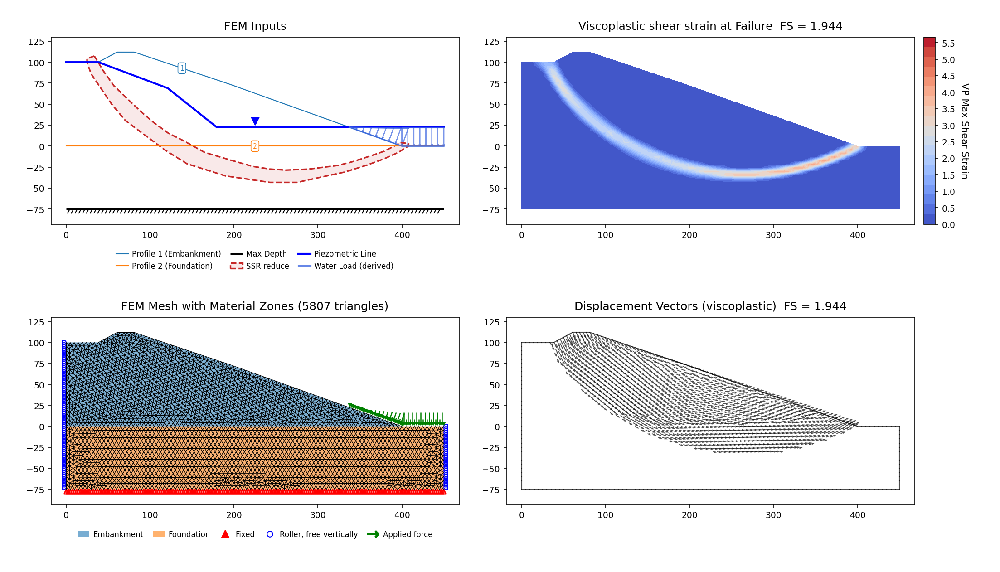

### 🟢 RS2 Part IV VP70: Submerged homogeneous slope (Duncan & Wright Fig 6.27) {#p4-vp70}

Slide2/LEM counterpart: [VP70](rocscience.md#vp70). RS2 Part IV (Table 70.2/70.3) re-runs this
submerged slope by shear-strength reduction; the factor of safety is independent of pool depth, and
RS2 reports SSRM 1.58 at both 30 ft and 60 ft above the crest. The same build covers RS2 Part II
§35, the identical model, so both RS2 manuals appear in the table below.

**Input files:** [vp070a.xlsx](files/rocscience/vp070a.xlsx) (pool 30 ft above crest)

A homogeneous slope (c = 100 psf, φ = 20°) under a pool 30 ft above the crest, with the pond
pressure on the whole submerged surface and pore pressures from the piezometric line.

| Method | XSLOPE | RS2 SSRM (Part IV VP70) | RS2 SSRM (Part II §35, native) | D&W referee | Slide2 | XSLOPE LEM |
|---|---|---|---|---|---|---|
| SSRM (3.0 m mesh) | 1.594 | 1.58 (+0.9%) | 1.64 (−2.8%) | 1.60 (−0.4%) | Bishop 1.603 / Spencer 1.599 | Bishop 1.596 / Spencer 1.593 |

*The XSLOPE LEM values are identical at both pool depths.*

The pond-load and pore-pressure treatments balance over the submerged surface, the same check the
[VP70](rocscience.md#vp70) LEM row makes.

<!-- test: file=files/rocscience/vp070a.xlsx, type=fem_ssrm, expected_fs=1.594, element_type=tri6, target_size=3.0, tolerance=0.02, f_min=1.2, f_max=2.0, max_iter=16000, tension_srf=true, k0=1, benchmark=RS2-P4-VP70, f_stand=1.5875, f_fail=1.6, check=edges -->

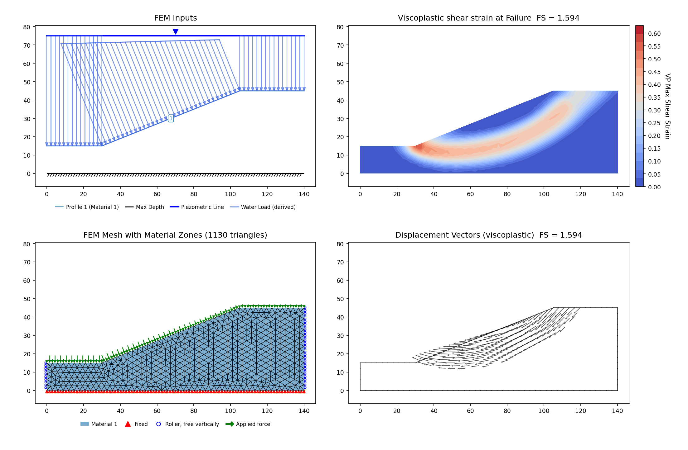

### 🔴 RS2 Part IV VP102: Homogeneous earth dam, dry (Huang & Jia 2008) {#p4-vp102}

Slide2/LEM counterpart: [VP102](rocscience.md#vp102). RS2 Part IV reports an SSRM for the dry dam
(Table 102.2) and for the *transient* rapid-drawdown series — Table 102.3 for φb = 0° and
Table 102.4 for φb = 37° — at 60–1500 h. XSLOPE reproduces all three from its own uncoupled
transient seepage solve (the same flow solve that feeds the Slide2-LEM curve in
[VP102](rocscience.md#vp102)).

**Input files:** [vp102a.xlsx](files/rocscience/vp102a.xlsx) (dry) ·
[vp102t_60](files/rocscience/vp102t_60.xlsx) / [100](files/rocscience/vp102t_100.xlsx) /
[300](files/rocscience/vp102t_300.xlsx) / [600](files/rocscience/vp102t_600.xlsx) /
[1500.xlsx](files/rocscience/vp102t_1500.xlsx) (drawdown snapshots)

A homogeneous earth dam (c' = 13.8 kPa, φ' = 37°). Every published VP102 value was produced under
a five-vertex SSR Search Area over the downstream half of the section, and the files carry it; the
critical mechanism, a downstream-face wedge, lies inside it, so it is inert here, and the dry case
returns the same value with and without it.

**Dry case.**

| Method | XSLOPE | RS2 SSRM | Huang & Jia FEM | Slide2 Spencer | XSLOPE LEM |
|---|---|---|---|---|---|
| SSRM (2.5 m mesh) | 2.470 | 2.43 (+1.6%) | 2.43 (+1.6%) | 2.455 | Bishop 2.452 / Spencer 2.451 |

<!-- test: file=files/rocscience/vp102a.xlsx, type=fem_ssrm, expected_fs=2.470, element_type=tri6, target_size=2.5, tolerance=0.02, f_min=1.9, f_max=2.8, max_iter=16000, tension_srf=true, k0=1, benchmark=RS2-P4-VP102, f_stand=2.4625, f_fail=2.4765625, check=edges -->
<!-- test: file=files/rocscience/vp102t_60.xlsx, type=fem_ssrm, expected_fs=1.713, element_type=tri6, target_size=2.5, tolerance=0.02, f_min=1.5, f_max=2.9, max_iter=16000, tension_srf=true, k0=1, benchmark=RS2-P4-VP102-t-60-c2, f_stand=1.7078125, f_fail=1.71875, check=edges -->
<!-- test: file=files/rocscience/vp102t_300.xlsx, type=fem_ssrm, expected_fs=1.998, element_type=tri6, target_size=2.5, tolerance=0.02, f_min=1.5, f_max=2.9, max_iter=16000, tension_srf=true, k0=1, benchmark=RS2-P4-VP102-t-300-c2, f_stand=1.9921875, f_fail=2.003125, check=edges -->
<!-- test: file=files/rocscience/vp102t_1500.xlsx, type=fem_ssrm, expected_fs=2.304, element_type=tri6, target_size=2.5, tolerance=0.02, f_min=1.5, f_max=2.9, max_iter=16000, tension_srf=true, k0=1, benchmark=RS2-P4-VP102-t-1500-c2, f_stand=2.2984375, f_fail=2.309375, check=edges -->
<!-- test: file=files/rocscience/vp102t_60.xlsx, type=fem_ssrm, expected_fs=1.779, element_type=tri6, target_size=2.5, tolerance=0.02, f_min=1.5, f_max=2.9, max_iter=16000, suction_phi_b=Material 1:37, tension_srf=true, k0=1, benchmark=RS2-P4-VP102-t-60-c3, f_stand=1.7734375, f_fail=1.784375, check=edges -->
<!-- test: file=files/rocscience/vp102t_300.xlsx, type=fem_ssrm, expected_fs=2.173, element_type=tri6, target_size=2.5, tolerance=0.02, f_min=1.5, f_max=2.9, max_iter=16000, suction_phi_b=Material 1:37, tension_srf=true, k0=1, benchmark=RS2-P4-VP102-t-300-c3, f_stand=2.1671875, f_fail=2.178125, check=edges -->
<!-- test: file=files/rocscience/vp102t_1500.xlsx, type=fem_ssrm, expected_fs=2.687, element_type=tri6, target_size=2.5, tolerance=0.02, f_min=1.5, f_max=2.9, max_iter=16000, suction_phi_b=Material 1:37, tension_srf=true, k0=1, benchmark=RS2-P4-VP102-t-1500-c3, f_stand=2.68125, f_fail=2.6921875, check=edges -->

The dry-case factor moves mildly between the 2.5 and 1.5 m element sizes.

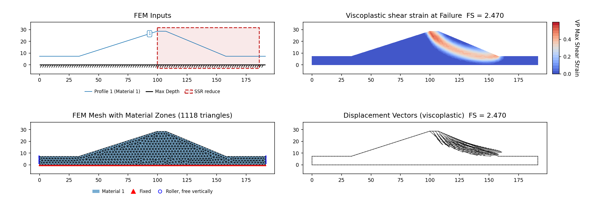

**Transient drawdown SSRM.** After the reservoir drops from el. 24 to el. 7, the dam drains and the
factor rises. Case 2 takes φb = 0°, so suction credits no strength; Case 3 sets
φb = 37°, so matric suction above the phreatic surface adds apparent cohesion
s·tan φb.

| Stage | Case 2 XSLOPE (φb = 0°) | Case 2 RS2 SSR | Case 3 XSLOPE (φb = 37°) | Case 3 RS2 SSR |
|---|---|---|---|---|
| 60 h | 1.713 | 1.77 (−3.2%) | 1.779 | 1.82 (−2.3%) |
| 300 h | 1.998 | 2.06 (−3.0%) | 2.173 | 2.14 (+1.5%) |
| 1500 h | 2.304 | 2.29 (+0.6%) | 2.687 | 2.48 (+8.3%) |

Case 2 runs 3.0–3.2% below the RS2 column over the first 300 h and crosses it by 1500 h (+0.6%),
the shape the Slide2-LEM curve shows on the same flow solve: the substituted Gardner retention
curve holds water more tightly than RS2's built-in "Silt" pair, so XSLOPE's field drains slightly
behind the vendor's early on. Case 3's suction credit grows with the drainage, to 2.687, +8.3%
above RS2's 2.48 at 1500 h, the frame with the most suction; every `#102_3_*` model sets
φb = 37° with a zero air-entry value and the suction cutoff off, so the credit is
uncapped on both sides. At that frame XSLOPE's field puts 46% of the mesh in suction, up to 204
kPa. The same machinery under the same vendor settings on [RS2-28](#rs2-28) lands within 2.1% of
RS2's SSR at all three heads, so the difference here rides in on the substituted Gardner curve.

One frame of each case is drawn; the mechanism is the same downstream-face wedge at every frame.

**Case 2 — 300 h after drawdown, φb = 0° (vp102t_300)**

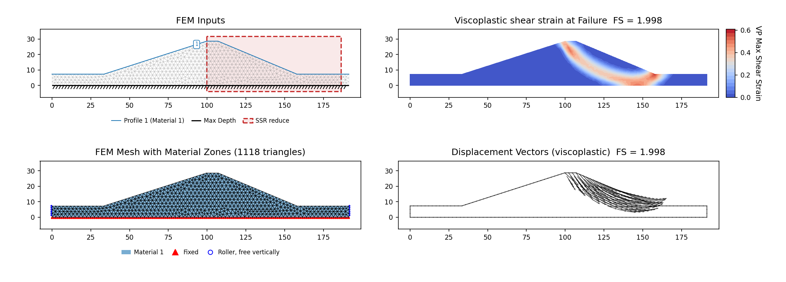

**Case 3 — 1500 h after drawdown, φb = 37° (vp102t_1500)**

