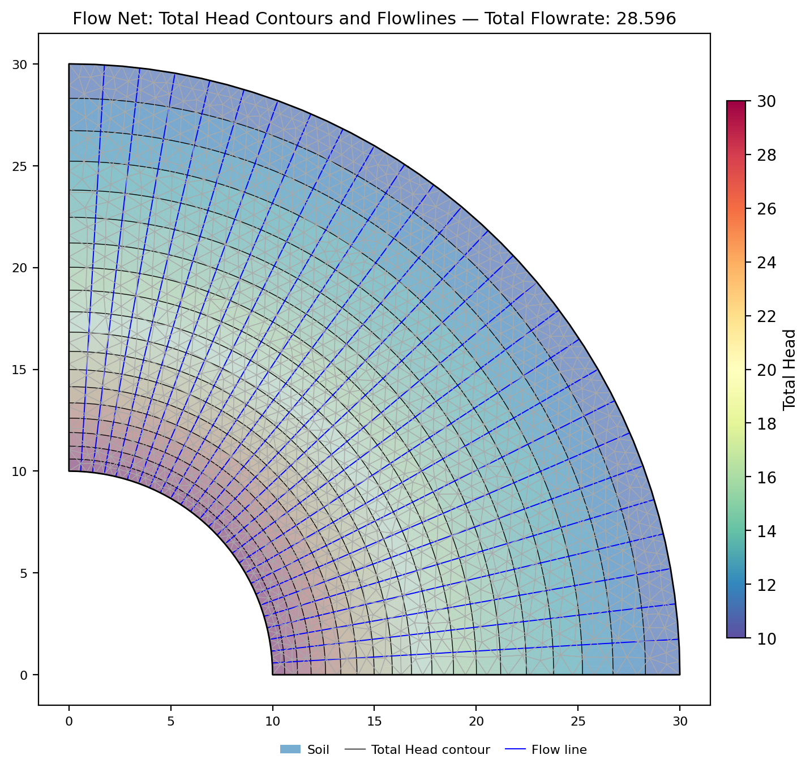
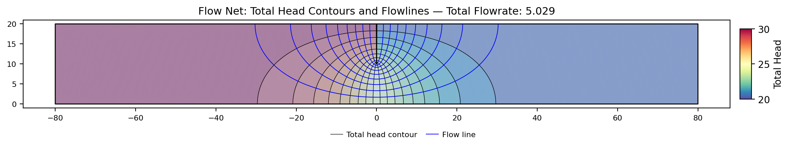
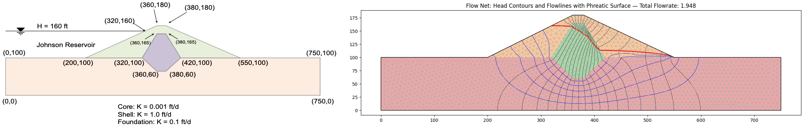

# Finite-Element Seepage Benchmarks

The two analytical-anchor benchmarks below were developed as seepage sample
problems and now live here; the remaining worked examples are in the
[seepage sample problems](../seep/samples.md).

Full bibliographic details for the author-year citations on this page are on the
shared [References](references.md) page.

### Confined Radial Flow {#verification-confined-radial}

A quarter-annulus confined flow problem: inner arc (r = 10) at head 30, outer arc
(r = 30) at head 10, straight radial edges as no-flow streamlines. This is best read
as a **plan-view** model — it is one quadrant of the classic Thiem problem of radial
flow to a well in a confined aquifer, not a vertical cross-section. Confined,
fully saturated flow is governed by Laplace's equation in total head alone, with no
gravity term, so the orientation of the model plane is mathematically irrelevant —
which is exactly what makes this a clean test of the FE Laplacian operator,
conductivity handling, and discharge integration. Steady flow has the exact solution
`q = k*(pi/2)*(h1-h2)/ln(r2/r1) = 28.596` (k = 1) and a logarithmic head profile.
Built via the **polygon** input by `benchmarks/build_seep.py::build_confined_radial`;
this is the analytical anchor for the seepage verification suite.

[xslope_confined_radial.xlsx](../seep/files/xslope_confined_radial.xlsx)

{width=800}

Results against the exact solution:

| Quantity | XSLOPE (tri6) | Exact | Diff |
|---|---|---|---|
| Discharge q | 28.5961 | 28.5960 | <0.01% |
| Max nodal head error | 0.004 | 0 | 0.02% of total drop |

The result is mesh-converged (identical at 2k and 6k nodes; quad8 gives the
same value), and tri3 linear elements agree to +0.01%. The only error source
is faceting of the curved arcs by the polygon boundary. See the
[Verification](../verification/seep.md) page.

**Source:** standard exact solution of Laplace's equation in polar coordinates
(e.g. Bear, *Dynamics of Fluids in Porous Media*).

<!-- test: file=../seep/files/xslope_confined_radial.xlsx, type=seep, expected_flowrate=28.596, element_type=tri6, target_size=2.0, tolerance=0.01, benchmark=SEEP-1 -->

### Partially Penetrating Sheetpile {#verification-sheetpile}

A single sheetpile cutoff of depth s = 10 in a homogeneous confined stratum of
thickness T = 20, head loss H = 10 across the wall, k = 1. The boundary heads
are 30 upstream and 20 downstream: the downstream head equals the stratum top,
so the section is physically consistent as a vertical cross-section (pressure
is non-negative everywhere, with 10 units of ponded water upstream); only the
difference H = 10 enters the confined solution. Pavlovsky's exact
conformal-mapping solution gives `q = k*H*K(lam')/(2*K(lam))` with
`lam = sin(pi*s/(2T))`; at s/T = 1/2 the modulus is self-dual so **q = k*H/2 = 5.0
exactly**. A second exact check: the head on the wall plane below the tip is
exactly (H1+H2)/2 by antisymmetry. The wall uses the same V-notch crack idiom as
the clay-blanket sample. Built by `benchmarks/build_seep.py::build_sheetpile`
(s/T = 0.75 companion file also available, exact q = 3.4032).

[xslope_sheetpile_s50.xlsx](../seep/files/xslope_sheetpile_s50.xlsx)

The flow net (head contours and flowlines) for the s/T = 0.5 case:

{width=1100}

Results against the exact form factor (tri6, two mesh densities):

| Case | XSLOPE q | Exact q | Diff | Head below wall tip |
|---|---|---|---|---|
| s/T = 0.50 (59k nodes) | 5.010 | 5.000 | +0.20% | 25.0000 (exact: 25) |
| s/T = 0.75 (59k nodes) | 3.412 | 3.403 | +0.27% | 25.0000 (exact: 25) |

The error halves with mesh refinement (set by the r^-1/2 singularity at the
wall tip) and converges to the exact value from above. The head on the wall
plane below the tip equals (h1+h2)/2 exactly — an antisymmetry property of the
exact solution that the FE solution reproduces to four decimals. The
Pavlovsky form factor itself was additionally confirmed by an independent
finite-difference solution of the same boundary-value problem (~0.4-0.5%
agreement at three penetration ratios). See the
[Verification](../verification/seep.md) page.

**Sources:** Harr, M.E. (1962), *Groundwater and Seepage*, McGraw-Hill;
Polubarinova-Kochina, P.Ya. (1962), *Theory of Ground Water Movement*,
Princeton University Press.

<!-- test: file=../seep/files/xslope_sheetpile_s50.xlsx, type=seep, expected_flowrate=5.0, element_type=tri6, target_size=1.0, tolerance=0.01, benchmark=SEEP-1c -->

### SEEP2D cross-check — Johnson Reservoir (established code)

Sample write-up: [seepage samples — Johnson Reservoir](../seep/samples.md#johnson-reservoir)
(a standing sample problem before it became a verification cross-check).
Input file: [xslope_johnson_res.xlsx](../seep/files/xslope_johnson_res.xlsx).

The Johnson Reservoir zoned earth dam (permeable shell, low-permeability core,
foundation; reservoir at el. 160 ft, tailwater at el. 100 ft) was exported to a
SEEP2D input file — the **exact same tri3 mesh topology, boundary conditions,
and material parameters** — and solved with the original USACE/WES SEEP2D
Fortran program. Identical-mesh comparison over all 2,604 nodes:

| Quantity | XSLOPE | SEEP2D | Diff |
|---|---|---|---|
| Total discharge q (ft³/day per ft) | 1.9575 | 1.9603 | −0.14% |
| Nodal heads | RMS Δh = 0.105 ft | (60-ft head range) | 0.18% |

The largest local head difference (~2 ft) occurs adjacent to the free surface,
where the two codes' unsaturated relative-permeability treatments differ in
detail; the bulk flow field agrees to about 0.1 ft.

**Van Genuchten discharge vs SEEP2D — a known reporting offset, not a solver
difference.** On problems with van Genuchten conductivity, XSLOPE's total
discharge reads 3.5–4.7% below SEEP2D's self-reported flow (gw009a
2.299×10⁻⁵ vs 2.412×10⁻⁵; gw010 6.07×10⁻⁵ vs 6.29×10⁻⁵) even though the head
fields agree to a relative RMS of ~10⁻⁴ and the linear-front problems above
agree to better than 0.15%. The difference was traced to SEEP2D's flow
*reporting*, not to either code's physics: both codes integrate the relative
conductivity properly (SEEP2D at 16 Gauss points from nodal pressures — the
two element formulations are mathematically equivalent for linear triangles),
and on SEEP2D's own converged heads the assembled nodal reaction matches
XSLOPE's value. SEEP2D's printed flow is accumulated during its seepage-face
iteration and lags the heads it reports beside it; the offset does not shrink
with mesh refinement. XSLOPE reports the conservative Galerkin flux — inflow
equals outflow to machine precision — and is deliberately left unchanged.
Heads, pore pressures, and stability results are unaffected (they read the
head field, which the two codes agree on).
