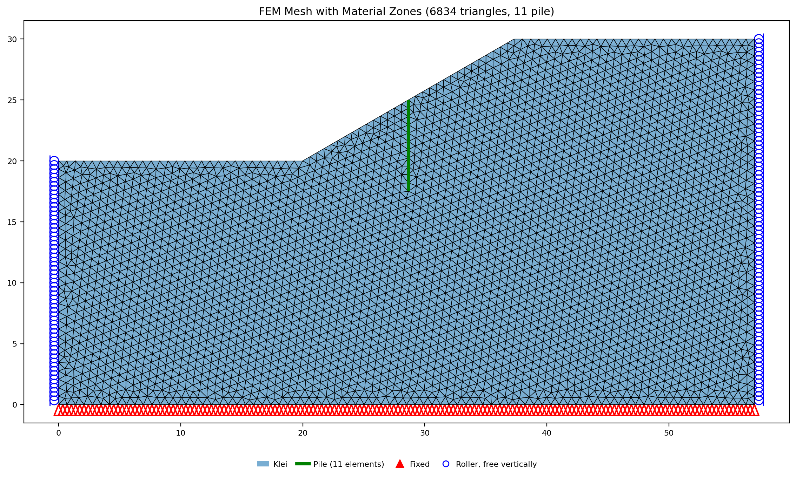
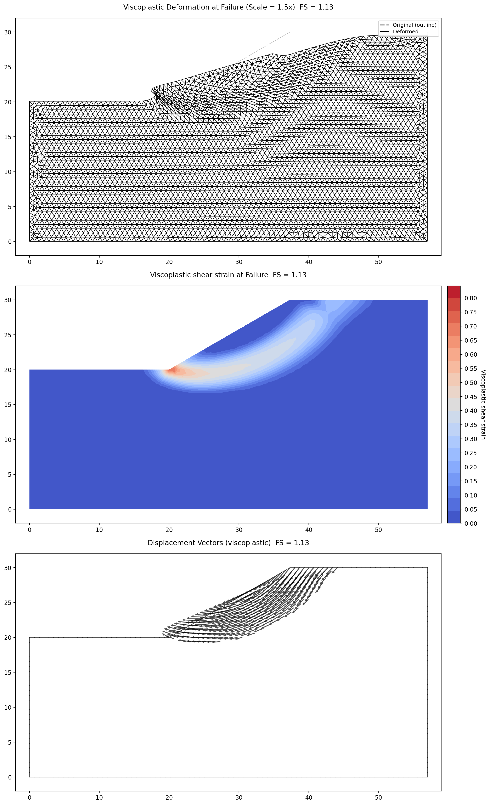
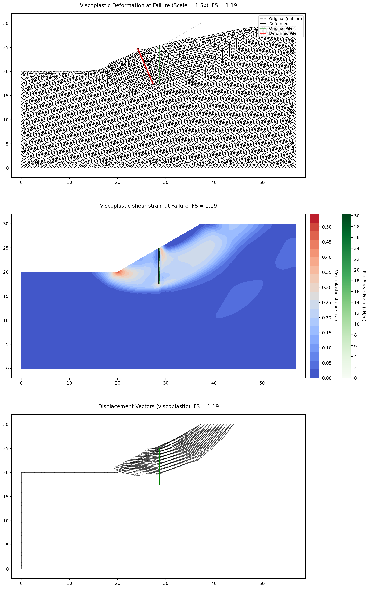
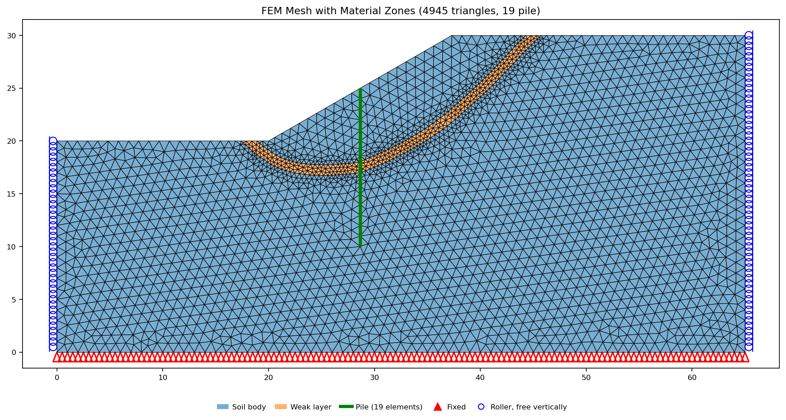
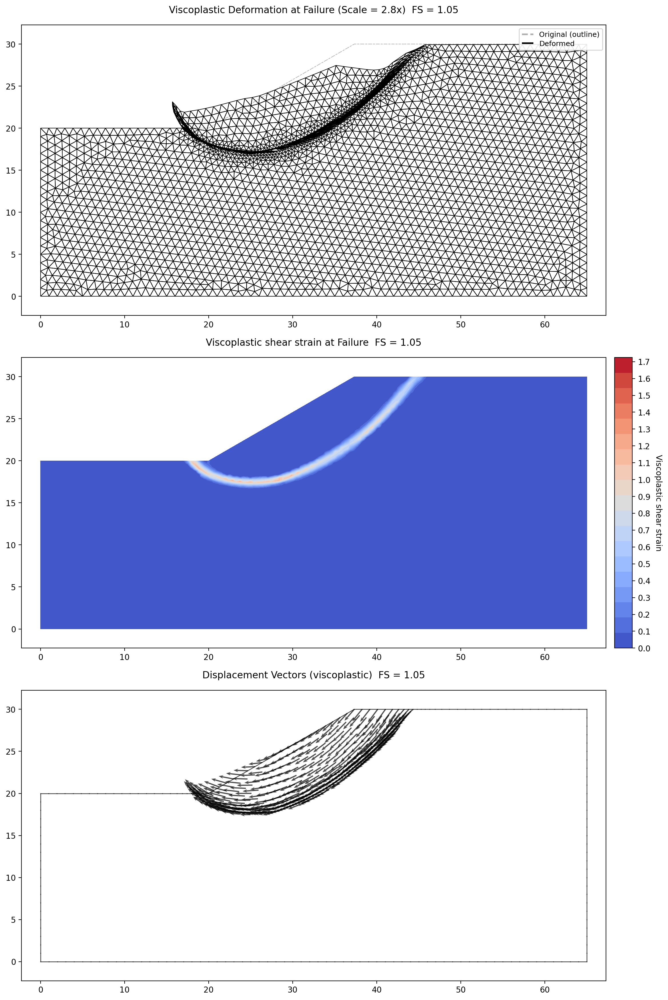
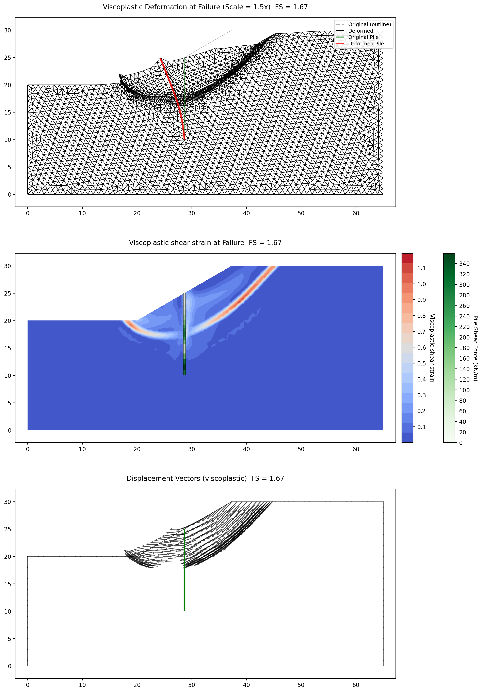

# Finite-Element Slope Stability (SSRM) Benchmarks

The SSRM implementation uses the Smith & Griffiths 4-component plane-strain
Mohr-Coulomb viscoplastic formulation. The factor of safety is found by
bisection on the **hybrid failure criterion** — the default — which treats a
trial as failed when the viscoplastic iteration cannot reach equilibrium *and*
the displacement field shows genuine growth, so a slope that has merely settled
into a stationary state is not mistaken for a collapsing one (see
[FEM Overview](../fem/overview.md)). The displacement-versus-$F$ catastrophe
sweep is available as a secondary diagnostic and is shown below for Example 1. Pore
pressures (where present) enter through the effective-stress formulation, and
reservoir loads are applied as consistent boundary tractions, so submerged
problems converge without any special criterion (see
[FEM Overview](../fem/overview.md)).

Full bibliographic details for the author-year citations on this page are on the
shared [References](references.md) page.

**Match to the published value**

| Symbol | Meaning |
|---|---|
| 🟢 | within 3% of the vendor and/or reference figure |
| 🟡 | 3–6% |
| 🔴 | more than 6% |
| 🟣 | in progress |
| ⊘ | insufficient data or out of scope |

The dot scores the **match quality of what is locked**, not how much of a problem is built; the partial/blocked detail is in the row text.

Every dot below is scored against **the source's own published result for the same
problem, read with the matching failure criterion**. Griffiths & Lane's factors of safety are FE readings
taken at non-convergence of a displacement test, and they are printed to limited precision —
Examples 1 and 2 on a 0.05 trial grid, the Fig. 7 sweep "to the nearest 0.05" (p. 394),
Example 6 to 0.1. Deltas are stated against the printed value as printed; where a classical
chart solution is also quoted (Taylor, Morgenstern, Bishop & Morgenstern, Cousins) it is
labelled as such and kept as context, never as the basis of the dot. A source's single
headline factor of safety is its published answer and takes a delta whatever engine
produced it — carrying a delta is a separate question from governing the dot; where the
same source prints a per-method table, each value is read like any
other column — same-method entries pair and carry a delta, cross-method entries stay bare.
Torggler's factors of safety are PLAXIS $\Sigma M_{sf}$ values printed to three decimals,
alongside a SLIDE limit-equilibrium table read the same way.

| # | Match | Problem | Results | Notes |
|---:|:-:|---|---|---|
| [1](#verification-griffiths1) | 🟢 | Example 1 — homogeneous slope | Displacement-vs-$F$ upturn $F \approx 1.40$ vs Griffiths & Lane FE 1.4 (0.0%) · bisection FS 1.36 vs their FE 1.4 (−2.9%) | criterion-matched FE-vs-FE reading is the basis of the dot |
| [2](#verification-griffiths2) | 🟢 | Example 2 — homogeneous slope with a foundation layer | Upturn $F \approx 1.4$ vs Griffiths & Lane FE 1.4 (0.0%) · bisection FS 1.34 vs their FE 1.4 (−4.3%) · Spencer toe circle 1.37 vs the paper's "correct" 1.4 (−2.1%) | the foundation leaves the factor of safety unchanged, as the paper argues |
| [3](#verification-griffiths3) | 🟢 | Example 3 — undrained clay slope with a thin weak layer | Worst station $c_{u2}/c_{u1} = 0.2$: Janbu 0.462 vs the paper's own Janbu three-line wedge 0.45–0.50 (inside the band) · Spencer 0.462 on the same surface · circular search 1.23 vs the paper's stated ≈1.3 (−5.4%) | scored at the source's own 0.05 read-off resolution |
| [4](#verification-griffiths4) | 🟢 | Example 4 — undrained clay slope over a weak foundation | SSRM 1.45 vs Griffiths & Lane FE 1.45 (0.0%) · SSRM 2.034 vs their FE 2.03 (+0.2%) · relative jump ×1.40 vs their ×1.40 (0.0%) | the critical mechanism flips base → toe, as in the paper's Fig. 11 |
| [5](#verification-griffiths5) | 🟢 | Example 5 — "slow" drawdown sweep | Submerged plateau 1.86 vs Griffiths & Lane FE 1.85 (+0.5%) · minimum 1.31 vs their FE 1.30 at $L/H = 0.7$ (+0.8%) · drained end 1.39 vs their FE 1.40 (−0.7%) | the three refined quad8 locks read 1.1–2.9% below the printed FE values |
| [6](#verification-griffiths6) | 🟢 | Example 6 — two-sided earth dam | Full reservoir 1.87 vs Griffiths & Lane FE 1.9 (−1.6%) · before filling 2.42 vs their FE 2.4 (+0.8%) | FE against FE, both printed to 0.1 |
| [7](#verification-torggler3a) | 🟢 | Torggler §3 — homogeneous slope with a 7.5 m plate | Unsupported 1.129 vs Torggler PLAXIS 1.111 (+1.6%) · with plate 1.195 vs his 1.175 (+1.7%) · plate shear in the lower lobe 25.8 kN/m vs his 21 kN (+22.9%) | the plate variant without interfaces is XSLOPE's shared-node beam; the factors of safety pair closely and the plate's internal forces run above his |
| [8](#verification-torggler3b) | 🟢 | Torggler §4 — weak-layer slope with a 15 m plate | Unsupported 1.055 vs Torggler PLAXIS 1.045 (+1.0%) · with plate 1.673 vs his 1.725 (−3.0%) · plate peak moment 1176 kNm/m vs his 1250 kNm/m (−5.9%) · plate peak shear 359 kN/m vs his 500 kN/m (−28.2%) | the factors of safety and the bending moment pair; the weak band still shears where his supported mechanism leaves it |

### Griffiths & Lane (1999) Example 1 — Homogeneous Slope {#verification-griffiths1}

A homogeneous 2:1 slope at $c/\gamma H = 0.05$, $\phi = 20°$ — the base SSRM benchmark.

| Quantity | XSLOPE | Griffiths & Lane FE | Note |
|---|---|---|---|
| Displacement-vs-$F$ upturn (their criterion) | $F \approx 1.40$ | **1.4** (0.0%) | their Table 2 and Fig. 2 |
| SSRM FS (quad8, bisection on XSLOPE's equilibrium criterion) | 1.36 | 1.4 (−2.9%) | |

Cross-bearings on the same XSLOPE number — context, not the basis of the dot:

| Quantity | XSLOPE | Cross-bearing | Note |
|---|---|---|---|
| SSRM FS, against the classical chart | 1.36 | Bishop & Morgenstern (1960) chart 1.380 (−1.4%) | printed on their Fig. 2 |
| SSRM FS, against their trial table | 1.36 | the highest trial their Table 2 converged, **1.35** (+0.7%) | they fail at 1.40 |

*The dot is scored on the first row — XSLOPE's upturn against the displacement-based reading
Griffiths & Lane themselves report. The two criteria bracket the same failure: XSLOPE's
bisection falls inside their own trial bracket — above the highest trial their Table 2
converged and below the trial they report as failing — and its upturn lands on their
reported FOS.*

This is the benchmark problem from [Griffiths & Lane (1999)](https://doi.org/10.1680/geot.1999.49.3.387), "Slope stability analysis by finite elements,"
*Geotechnique*, 49(3), 387-403. It features a homogeneous slope with the following properties:

| Property | Value |
|----------|-------|
| Cohesion, $c$ | 312.5 psf |
| Friction angle, $\phi$ | 20 degrees |
| Unit weight, $\gamma$ | 125 pcf |
| Young's modulus, $E'$ | 2,088,500 psf |
| Poisson's ratio, $\nu'$ | 0.3 |

The elastic constants are Griffiths & Lane's printed nominal values (their p.390: "in the
absence of meaningful data for $E'$ and $\nu'$, they can be given nominal values, e.g.
$E' = 10^5$ kN/m$^2$ and $\nu' = 0.3$"), which the paper applies throughout — carried here
and converted to English units: $E' = 1\times10^5$ kPa $= 2{,}088{,}500$ psf, $\nu' = 0.3$.
As everywhere in the SSRM the factor of safety is independent of the elastic constants; they
only set the displacement scale.

The dimensionless parameter $c/\gamma H = 0.05$ with $\phi = 20°$ gives an expected factor of safety of
approximately 1.4 (Griffiths & Lane, 1999, Table 2 and Fig. 2).

Excel input file: [xslope_griffiths1.xlsx](../fem/files/xslope_griffiths1.xlsx)

Inputs plotted with the XSLOPE plot_inputs() function:

{width=1000}

FEM mesh with boundary conditions. Fixed supports (triangles) at the base, x-rollers (circles) on the sides:

{width=1000}

SSRM results. XSLOPE's strict true-equilibrium convergence criterion and
[Griffiths & Lane's (1999)](https://doi.org/10.1680/geot.1999.49.3.387) more tolerant
convergence check bracket the same failure: their check accepts slow residual creep that
XSLOPE's equilibrium criterion rejects, and their own Table 2 converges at F = 1.35 (in 792
iterations, against 41 at F = 1.30) and fails at 1.40, where the dimensionless displacement
$E'\delta_{max}/\gamma H^2$ jumps from 0.544 to 1.476. Their reported FOS of 1.4 is that first
failed trial on a 0.05 grid. A third, independent bearing comes from the
[Bishop & Morgenstern (1960)](https://doi.org/10.1680/geot.1960.10.4.129) stability chart.
The plots below show the
solution at the computed factor of safety (F = 1.36). The top plot shows the deformed mesh;
the middle plot shows the viscoplastic shear strain concentration, which reveals the circular
failure mechanism without any prior assumption about its shape or location; the bottom plot
shows the displacement vectors.

{width=1000}

The displacement-versus-F sweep — the failure evidence Griffiths & Lane themselves present
(their Fig. 2) — shows the upturn exactly at F ≈ 1.40: the maximum displacement is
essentially flat through F = 1.35, jumps almost tenfold at F = 1.40, and stands more than an
order of magnitude above that flat branch by F = 1.6.

{width=700}

<!-- test: file=../fem/files/xslope_griffiths1.xlsx, type=fem_ssrm, expected_fs=1.359, element_type=quad8, target_size=3.5, tolerance=0.01, f_min=1.0, f_max=1.8, max_iter=16000, benchmark=SSRM-1 -->
<!-- Element-type coverage: SSRM on each quadratic type (tri6, quad8, quad9). Slower (SSRM x3), so benchmark-gated. -->
<!-- test: file=../fem/files/xslope_griffiths1.xlsx, type=fem_elements, expected_fs=1.36, tolerance=0.04, target_size=3.5, f_min=1.0, f_max=1.8, max_iter=4000, benchmark=SSRM-elements -->
<!-- SSRM auto-bracketing: a deliberately-wrong [F_min,F_max] must still find the FS. Coarse tri6 mesh (~1.39, fast) so these run un-gated. -->
<!-- test: file=../fem/files/xslope_griffiths1.xlsx, type=fem_ssrm, expected_fs=1.39, element_type=tri6, target_size=6, tolerance=0.05, f_min=1.5, f_max=1.9, max_iter=4000 -->
<!-- test: file=../fem/files/xslope_griffiths1.xlsx, type=fem_ssrm, expected_fs=1.39, element_type=tri6, target_size=6, tolerance=0.05, f_min=0.5, f_max=0.9, max_iter=4000 -->

### Griffiths & Lane (1999) Example 2 — Homogeneous Slope with a Foundation Layer {#verification-griffiths2}

The Example 1 slope with a foundation layer of the same soil beneath it — the paper's
demonstration that finite elements find the true mechanism where a limit-equilibrium search
can be misled.

| Quantity | XSLOPE | Griffiths & Lane (1999) | Note |
|---|---|---|---|
| Displacement-vs-$F$ upturn (their criterion) | $F \approx 1.4$ | FE FOS **1.4** (0.0%) | "essentially unchanged from example 1" (p. 392, their Fig. 2) |
| SSRM FS (quad8, bisection on XSLOPE's equilibrium criterion) | 1.34 | FE FOS 1.4 (−4.3%) | |
| Spencer, unconstrained circular search (toe circle) | 1.37 | the paper's "correct" FOS of **1.4** (−2.1%) | which it obtains only by forcing the circle through the toe (p. 394) |

Cross-bearings on the false base circle — context, not the basis of the dot:

| Quantity | XSLOPE | Cross-bearing | Note |
|---|---|---|---|
| Spencer, circles forced tangent to the foundation base (false base circle) | 1.70 | the proprietary slip-circle program's **1.7** (0%) | for that assumed circle (p. 394) |
| — same, against the classical chart | 1.70 | Bishop & Morgenstern (1960) base-circle chart 1.752 (−3.0%) | which the paper quotes as "one possible solution" |

*The dot is scored on the first row. Example 1, without the foundation, reads 1.36 — adding
the layer leaves the factor of safety essentially unchanged, which is the paper's point.*

This is Example 2 of [Griffiths & Lane (1999)](https://doi.org/10.1680/geot.1999.49.3.387)
(their Fig. 5): the Example 1 slope with a foundation layer of the **same soil** added
beneath it, thickness $H/2$, so the firm base now sits at depth $D = 1.5\,H$ below the
crest. Every material property and the slope geometry are unchanged from Example 1 — only
the foundation is added.

| Property | Value |
|----------|-------|
| Cohesion, $c'$ | 312.5 psf |
| Friction angle, $\phi'$ | 20 degrees |
| Unit weight, $\gamma$ | 125 pcf |
| Young's modulus, $E'$ | 2,088,500 psf |
| Poisson's ratio, $\nu'$ | 0.3 |
| Foundation | $H/2$ = 25 ft of the same soil below the toe ($D = 1.5$) |

The elastic constants are Griffiths & Lane's printed nominal values (their p.390:
"in the absence of meaningful data for $E'$ and $\nu'$, they can be given nominal values,
e.g. $E' = 10^5$ kN/m$^2$ and $\nu' = 0.3$") — the same values used in Example 1, carried
here and converted to English units: $E' = 1\times10^5$ kPa $= 2{,}088{,}500$ psf,
$\nu' = 0.3$. As everywhere in the SSRM the factor of safety is independent of them.

The dimensionless strength is again $c'/\gamma H = 0.05$ with $\phi' = 20°$. The domain uses
the printed dimensions of Fig. 1 — a $1.2\,H$ (60 ft) crest platform, the 2:1 face, and a
$2\,H$ (100 ft) runout past the toe — with the $H/2$ foundation from the Example 2 text
($D = 1.5$). (Example 1 as modelled here omits the runout because with the base at toe
level a mechanism cannot reach it; with a foundation beneath the toe the runout gives any
deeper surface room to form.)

Excel input file: [xslope_griffiths2.xlsx](../fem/files/xslope_griffiths2.xlsx)

Inputs plotted with the XSLOPE plot_inputs() function:

{width=1000}

FEM mesh with boundary conditions. Fixed supports (triangles) at the base, x-rollers
(circles) on the sides:

{width=1000}

SSRM results. The computed factor of safety matches Example 1's, confirming Griffiths &
Lane's central point: adding the foundation layer does **not** change the factor of safety,
because the critical mechanism stays a toe failure. Their own FE result is likewise
unchanged from Example 1. The plots below show the solution at the developed failure
state. The middle
panel — the viscoplastic shear-strain concentration — is the key image: the shear band
runs from the crest and **exits at the toe** (x = 160, y = 0), staying well above the
foundation base at y = −25. The mechanism finds the toe on its own, with no assumption
about the slip surface.

{width=1000}

**The false base circle.** The Bishop & Morgenstern (1960) base-circle charts and the
proprietary slip-circle program the paper cites both sit well above the true value, because
each assumes a failure circle tangent to the base of the foundation. [Cousins' (1978)](https://doi.org/10.1061/AJGEB6.0000585)
toe-circle charts, on the other hand, are reported by the paper as agreeing with the FE
result: with a foundation layer the critical circular mechanism "at its lowest point passes
fractionally below the base of the slope" and gives a slightly lower factor of safety than
the no-foundation case (p. 394). No numeric Cousins value is printed there, so the chart
enters here as a statement about the *mechanism*, not as a number. The lesson is that a
limit-equilibrium method requires the user to steer the search onto the correct family of
surfaces; assume a base circle and the answer is 25% unconservative (1.752 / 1.4).

XSLOPE's own limit-equilibrium search reproduces both sides of this exactly. An
unconstrained global circular search (Spencer, grid seed) settles on a **toe circle** —
critical center (143.3, 114.1), lowest point y = −1.2, just below the toe and far above the
foundation base — agreeing with the SSRM result, and matching the mechanism the paper
attributes to Cousins' charts to the letter: the lowest point passes fractionally below the
base of the slope. When the same
search is confined to circles tangent to the foundation base (the assumption behind the
chart value), it returns the paper's false base-circle result. XSLOPE's default search is
not misled: left free, it finds the toe.

<!-- test: file=../fem/files/xslope_griffiths2.xlsx, type=fem_ssrm, expected_fs=1.341, element_type=quad8, target_size=3.5, tolerance=0.01, f_min=1.0, f_max=1.8, max_iter=16000, benchmark=SSRM-G2 -->
<!-- Coarse tri6 quick SSRM (ungated): confirms the foundation layer leaves the toe-failure FS unchanged. -->
<!-- test: file=../fem/files/xslope_griffiths2.xlsx, type=fem_ssrm, expected_fs=1.36, element_type=tri6, target_size=6, tolerance=0.05, f_min=1.0, f_max=1.8, max_iter=4000 -->
<!-- LEM teaching point: the unconstrained global search finds the TOE circle (true mechanism, ~1.37); forcing tangency to the foundation base reproduces the paper's false base circle (~1.70). -->
<!-- test: file=../fem/files/xslope_griffiths2.xlsx, type=circular_search, method=spencer, seed=grid, num_slices=40, expected_fs=1.366, tolerance=0.02 -->
<!-- test: file=../fem/files/xslope_griffiths2.xlsx, type=circular_search, method=spencer, seed=grid, num_slices=40, tangent_depth=-25;-23, expected_fs=1.702, tolerance=0.02 -->

### Griffiths & Lane (1999) Example 3 — Undrained Clay Slope with a Thin Weak Layer {#verification-griffiths3}

An undrained clay slope containing a thin weak layer, swept across six values of the
strength ratio $c_{u2}/c_{u1}$ to reproduce the paper's Fig. 7.

| Case | XSLOPE | Griffiths & Lane (1999), Fig. 7 | Note |
|---|---|---|---|
| SSRM, $c_{u2}/c_{u1} = 1.0$ | 1.45 tri6 · **1.45** quad8 | FE 1.50 (−3.3% / −3.3%) | |
| SSRM, $0.8$ | 1.41 tri6 | FE 1.45 (−2.8%) | |
| SSRM, $0.6$ (transition) | 1.38 tri6 | FE 1.40 (−1.4%) | transition |
| SSRM, $0.5$ | 1.19 tri6 | FE 1.25 (−4.8%) | |
| SSRM, $0.4$ | 0.93 tri6 | FE 1.05 (−11.4%) | undecided trial at the ceiling |
| SSRM, $0.2$ | 0.48 tri6 · **0.45** quad8 | FE 0.60 (−20.0% / −25.0%) | |
| **Non-circular Spencer / Janbu at $0.2$** | **0.462 / 0.462** | **Janbu three-line wedge, 0.45–0.50 (inside the band)** | Fig. 7 at the paper's 0.05 resolution |
| Circular search at $0.2$ (wrong mechanism family) | 1.23 | circular mechanism ≈1.3 (−5.4%) | stated in the text, p. 396 |

*The dot is scored on the bolded row — the same method on the same mechanism. At
$c_{u2}/c_{u1} = 1$ the paper's text anchors on Taylor's (1937) classical $\phi_u = 0$
stability-number solution, FOS = 1.47; its own FE point plots at 1.50 in Fig. 7 while Fig. 10
plots the identical physical case at 1.45, so the paper's own reading of that station spans
1.45–1.50. Every Fig. 7 comparison value here is graphical, read from the plotted points,
and Griffiths & Lane report their FE results only "to the nearest 0.05" (p. 394). At
$c_{u2}/c_{u1} = 0.4$ the trial at the bracket's upper edge, F = 0.95, reached the iteration
ceiling with its out-of-balance force still falling, so that edge is an undecided trial rather
than a measured failure.*

This is Example 3 of [Griffiths & Lane (1999)](https://doi.org/10.1680/geot.1999.49.3.387)
(their Fig. 6): an **undrained** ($\phi_u = 0$) clay slope on a foundation layer
($D = 2$) that contains a **thin layer of weaker clay**. The surrounding clay is held
at $c_{u1}/\gamma H = 0.25$; the thin-layer strength $c_{u2}$ is varied, and the
behaviour is governed by the ratio $c_{u2}/c_{u1}$. The weak layer runs parallel to the
slope face through the slope body, turns horizontal through the foundation, and outcrops
at 45 degrees beyond the toe — Griffiths & Lane liken it to a thin weak liner in a
landfill. The lesson of the example is that lowering $c_{u2}$ eventually switches the
failure from a circular base slide to a non-circular slide that **follows the weak
layer**, and a limit-equilibrium search that assumes a circle would badly overestimate
the factor of safety once that switch has occurred.

The outer geometry, units and elastic constants are Example 4's: $H = 50$ ft,
$\gamma = 125$ pcf, $c_{u1} = 1562.5$ psf ($c_{u1}/\gamma H = 0.25$), $\phi_u = 0$, with
the firm base a full $2H$ below the crest ($D = 2$). The elastic constants are Griffiths &
Lane's printed nominal values (their p.390: "in the absence of meaningful data for $E'$ and
$\nu'$, they can be given nominal values, e.g. $E' = 10^5$ kN/m$^2$ and $\nu' = 0.3$"),
carried to both materials and converted to English units: $E' = 1\times10^5$ kPa
$= 2{,}088{,}500$ psf, $\nu' = 0.3$. As everywhere in the SSRM the factor of safety is
independent of the elastic constants; they only set the displacement scale.

| Property | Value |
|---|---|
| Surrounding clay, $c_{u1}$ | 1562.5 psf ($c_{u1}/\gamma H = 0.25$) |
| Thin-layer strength, $c_{u2}$ | $c_{u2}/c_{u1} \times c_{u1}$ (ratio varied) |
| Friction angle, $\phi_u$ | 0 degrees |
| Unit weight, $\gamma$ | 125 pcf |
| Slope | 2:1, $H = 50$ ft (crest $y = 100$, toe $(200, 50)$, firm base $y = 0$) |
| Geometry | $2H$ crest platform, 2:1 face, $2H$ runout, $D = 2$ |

**The weak-layer geometry is fully dimensioned in Fig. 6.** The published figure carries
printed $H$-fraction callouts along every reach, and the XSLOPE band reproduces each one
exactly ($H = 50$, $y$ upward):

- **Crest.** The band daylights on the crest platform between $x = 0.6H = 30$ (its deeper,
  lower boundary — the printed $0.6H$ from the crest edge) and $x = 0.8H = 40$ (its upper
  boundary nearer the face); the platform closes as $0.6H + 0.2H + 1.2H = 2H$, matching the
  printed $2H$ platform and $1.2H$ spans.
- **Slope reach.** Both boundaries run parallel to the printed 2:1 face.
- **Foundation reach.** The band flattens horizontally, its top $0.4H$ below the runout
  surface ($y = 30$) and its bottom $0.4H$ above the firm base ($y = 20$) — the two printed
  $0.4H$ callouts — which fix the band thickness at $H - 0.4H - 0.4H = 0.2H = 10$ ft by
  arithmetic.
- **Outcrop.** Both boundaries kick up at 45 degrees (the printed 1:1) beyond the toe, the
  upper daylighting at $x = 260$ (toe $+\,1.2H$) and the lower at $x = 270$ (right edge
  $-\,0.6H$); the runout closes as $1.2H + 0.2H + 0.6H = 2H$, matching the printed $2H$,
  $1.2H$ and $0.6H$ spans.

The **governing band thickness is $0.2H = 10$ ft** in the horizontal foundation reach, pinned
by the $0.4H + 0.4H$ callouts above; where the band parallels the 2:1 face it measures about
$0.1H$ perpendicular — the same $0.2H$ surface offset projected onto the slope. The domain is
tiled by **three explicit polygons** so the band is its own material region: a surrounding-clay
wedge between the band and the slope face, the $c_{u2}$ band itself, and the surrounding-clay
body below the band.

The band polygon carries its own local element **Size of 2.5 ft**, a quarter of its $0.2H$
thickness, so about four element rows resolve the shear through the band on either element
type; the rest of the domain meshes at the global target size. The band is the feature that
governs the answer once $c_{u2}/c_{u1}$ is low enough for the failure to follow it, so its
resolution is declared on the model rather than left to the global size. The half-thickness
variant below scales the same Size with the thickness, keeping its band equally resolved.

Excel input files, one per station:
[$c_{u2}/c_{u1} = 1.0$](../fem/files/xslope_griffiths3_r1.xlsx),
[$0.8$](../fem/files/xslope_griffiths3_r0p8.xlsx),
[$0.6$](../fem/files/xslope_griffiths3_r0p6.xlsx),
[$0.5$](../fem/files/xslope_griffiths3_r0p5.xlsx),
[$0.4$](../fem/files/xslope_griffiths3_r0p4.xlsx),
[$0.2$](../fem/files/xslope_griffiths3_r0p2.xlsx);
plus the half-thickness variant
[$0.2$ (thin band)](../fem/files/xslope_griffiths3_r0p2_thin.xlsx).

Inputs plotted with the XSLOPE plot_inputs() function — the surrounding clay (blue) and
the thin weak layer (orange) tracing the dimensioned path of Fig. 6:

{width=1000}

FEM mesh with boundary conditions. Fixed supports (triangles) at the base, x-rollers
(circles) on the sides; the mesh conforms to the thin band as its own zone:

{width=1000}

**The sweep.** The XSLOPE SSRM factor of safety, computed across the six ratios,
reproduces the Fig. 7 curve — a base-circle plateau for $c_{u2}/c_{u1} \gtrsim 0.6$ and a
roughly linear fall below it as the weak-layer mechanism takes over. The coarse-tri6
sweep tracks the shape; the two refined quad8 points and the Taylor anchor are overlaid:

{width=700}

All XSLOPE numbers are computed on the published Fig. 6 geometry; because the comparison
values are figure-read, the sweep rows carry wide tolerances on the *target*, not on the
model geometry. The curve matches Fig. 7
in the three features that matter: the **plateau** holds near the Taylor base-circle value
while $c_{u2}/c_{u1} \gtrsim 0.6$ (the thin layer is too strong to matter), the **transition**
sits at $c_{u2}/c_{u1} \approx 0.6$ exactly where Griffiths & Lane place it, and below it the
factor of safety **falls roughly linearly** toward the weak-layer strength. The XSLOPE points
sit a few percent below the graphical FE curve in the falling regime — the strict-true-
equilibrium offset seen throughout these examples — but the shape and the transition are
reproduced.

**The two mechanisms (Fig. 8).** The refined quad8 solutions bracket the mechanism change.
At $c_{u2}/c_{u1} = 1$ the band is the same clay as its surroundings, so the failure is
an essentially **circular base slide** tangent to the firm base — Taylor's mechanism and
Griffiths & Lane's Fig. 8(a):

{width=1000}

Both results figures are titled with the **critical factor of safety** — the value at the
verge of failure — and show the fully developed **post-failure mechanism** the slope
collapses into once its strength is reduced to that value: the shear-strain concentration
and the displacement field of the slide. The $c_{u2}/c_{u1} = 1$ figure above is titled
**FS = 1.45**; the $c_{u2}/c_{u1} = 0.2$ figure below is titled **FS = 0.45** (the 0.4531
bracket midpoint). Both mechanism figures show the refined quad8 solutions, not the coarser
tri6 sweep — whose $c_{u2}/c_{u1} = 0.2$ station reads 0.48 in the summary table above.

At $c_{u2}/c_{u1} = 0.2$ the shear strain concentrates into a narrow band that **follows
the weak layer** — down parallel to the face, along the horizontal foundation reach, and
kicking up to daylight beyond the toe — a highly concentrated non-circular slide, exactly
Griffiths & Lane's Fig. 8(c):

{width=1000}

**Cross-check against Example 4.** At $c_{u2}/c_{u1} = 1$ the thin layer carries the same
strength as the surrounding clay, so the model is materially identical to the homogeneous
$D = 2$ slope of [Example 4](#verification-griffiths4) at its ratio-1 station. The refined
quad8 SSRM returns **FS = 1.45**, the same value Example 4 r1 returns on its own mesh (the
only difference is the extra mesh boundaries where the band sits), landing on Griffiths &
Lane's own Fig. 10 FE point for that case (1.45) exactly, and a few percent below Taylor's 1.47 —
the same base-circle limit. The paper plots the same physical case at 1.50 in Fig. 7 and at
1.45 in Fig. 10; XSLOPE sits at the lower end of that pair.

**What sets the weak-ratio result: how finely the band is resolved.** Once the failure follows
the band, the factor of safety is governed by the number of element rows carrying the shear
through it, not by how finely the rest of the domain is meshed. Measured at
$c_{u2}/c_{u1} = 0.2$ on quad8 meshes, holding the bisection tolerance fixed so the rows differ
only by mesh:

| Band resolution | Element rows across the $0.2H$ band | Elements | XSLOPE SSRM FS |
|---|---|---|---|
| global size only, 3.5 ft | 3 (4.3 ft rows) | 2064 | 0.478 |
| global size only, 2.8 ft | 4 (2.6 ft rows) | 3115 | 0.467 |
| band Size 2.5 ft, global 3.5 ft (the model as built) | 4 (2.7 ft rows) | 2829 | 0.453 |

Leaving the band to the global size puts only three rows through a 10 ft band and reads high;
four rows brings the answer down and holds it there, which is why the band declares its own
element size. Griffiths & Lane's own mesh, read from their Fig. 8, is roughly uniform 5 ft —
about 1200 eight-node quadrilaterals with about two elements across the band — coarser through
the band than any row above.

The remaining difference between the XSLOPE value ($\approx 0.45$) and the graphically read FE
point ($\approx 0.60$) is a **convergence-criterion** difference, not a geometry or mesh
difference. XSLOPE's convergence test requires *both* a displacement-change (CHECON) test *and*
a nodal force-equilibrium test, iterating up to a high ceiling (16000 iterations); Griffiths &
Lane (p. 391) declare failure by non-convergence of a displacement test alone within an
iteration ceiling of 1000. Adopting that 1999 ceiling does not move the XSLOPE result toward
0.60: holding the force-equilibrium test in place and lowering the ceiling to 1000 iterations
*lowers* the factor of safety, because the ceiling starves the equilibrium iterations near
collapse and reports failure early rather than inflating the result. The published
$\approx 0.60$ therefore reflects Griffiths & Lane's specific 1999 solver and its "nearest 0.05"
graphical reporting, not a value a strict-equilibrium SSRM reproduces.

An independent check anchors the XSLOPE value instead: it lands on the paper's *own* Janbu
three-line wedge limit-equilibrium value ($\approx 0.48$ in Fig. 7) for the identical
layer-following mechanism of Fig. 8(c) — below the paper's graphical FE point. The XSLOPE value
agrees with the paper's wedge solution for the governing mechanism to within 4%.

**XSLOPE's own Spencer search reproduces the same mechanism and factor of safety.** Because
the mechanism is non-circular, the limit-equilibrium companion is a **non-circular** search
rather than a circle search. Seeded on the paper's own three-line wedge — down the band
parallel to the face, along the horizontal foundation reach, and up the 45-degree outcrop,
laid on the band centerline — the search settles on a surface that stays inside the $c_{u2}$
band over its entire length, entering at the crest daylight ($x \approx 30$) and exiting
within the band's own outcrop span ($260 \le x \le 270$). Both methods land on
the mesh-converged SSRM value of $\approx 0.45$ and just below the paper's own Janbu wedge
$\approx 0.48$, so the limit-equilibrium and continuum solutions agree on this mechanism. An
unconstrained *circular* search on the same model returns 1.23 — nearly three times the
non-circular value, and close to the $\approx 1.3$ the paper itself quotes for a circular
mechanism at this ratio (p. 396). That is the exact failure Griffiths & Lane use this
example to illustrate.

**Thickness robustness.** Halving the (published) $0.2H$ band at
$c_{u2}/c_{u1} = 0.2$ — with the band's local element Size halved alongside it, so both
models resolve their band to the same number of element rows — moves the coarse-tri6 factor
of safety only from **0.48** to **0.51**, so the weak-ratio result is governed by $c_{u2}$
times the failure-path length rather than by the exact band thickness.

<!-- Gated quad8 SSRM locks (benchmark=SSRM-G3): the anchor (cu2=cu1, base circle) tight
     on the observed value; the weak ratio (cu2/cu1=0.2, layer-following) figure-read with
     a wide tolerance, since both the ~0.6 published FE point and the schematic band geometry
     are read off the figures. -->
<!-- test: file=../fem/files/xslope_griffiths3_r1.xlsx, type=fem_ssrm, expected_fs=1.4469, element_type=quad8, target_size=3.5, tolerance=0.01, f_min=1.0, f_max=1.8, max_iter=16000, benchmark=SSRM-G3 -->
<!-- test: file=../fem/files/xslope_griffiths3_r0p2.xlsx, type=fem_ssrm, expected_fs=0.45, element_type=quad8, target_size=3.5, tolerance=0.05, f_min=0.3, f_max=1.0, max_iter=16000, benchmark=SSRM-G3 -->
<!-- Coarse tri6 quick SSRM (ungated, wide figure-read tolerance): the Fig. 7 sweep — the
     base-circle plateau (>=0.6), the transition at ~0.6, and the roughly linear fall as the
     weak-layer mechanism takes over. -->
<!-- test: file=../fem/files/xslope_griffiths3_r0p8.xlsx, type=fem_ssrm, expected_fs=1.41, element_type=tri6, target_size=6, tolerance=0.05, f_min=1.0, f_max=1.8, max_iter=4000 -->
<!-- test: file=../fem/files/xslope_griffiths3_r0p6.xlsx, type=fem_ssrm, expected_fs=1.38, element_type=tri6, target_size=6, tolerance=0.05, f_min=0.9, f_max=1.7, max_iter=4000 -->
<!-- test: file=../fem/files/xslope_griffiths3_r0p5.xlsx, type=fem_ssrm, expected_fs=1.19, element_type=tri6, target_size=6, tolerance=0.05, f_min=0.8, f_max=1.6, max_iter=4000 -->
<!-- test: file=../fem/files/xslope_griffiths3_r0p4.xlsx, type=fem_ssrm, expected_fs=0.93, element_type=tri6, target_size=6, tolerance=0.05, f_min=0.6, f_max=1.4, max_iter=4000 -->
<!-- test: file=../fem/files/xslope_griffiths3_r0p2.xlsx, type=fem_ssrm, expected_fs=0.48, element_type=tri6, target_size=6, tolerance=0.05, f_min=0.3, f_max=1.1, max_iter=4000 -->
<!-- Thickness sensitivity: half-thickness band at cu2/cu1=0.2 barely moves the FS (0.49 -> 0.51),
     confirming the weak-ratio result is set by cu2 x path length, not the undimensioned band thickness. -->
<!-- test: file=../fem/files/xslope_griffiths3_r0p2_thin.xlsx, type=fem_ssrm, expected_fs=0.51, element_type=tri6, target_size=6, tolerance=0.05, f_min=0.3, f_max=1.1, max_iter=4000 -->
<!-- LEM companion at the weak ratio: the mechanism is NON-circular, so the cross-check is a
     non-circular search seeded on the paper's own three-line wedge (the band centerline, carried
     in the file's non-circ sheet). Both methods land on the converged SSRM ~0.45 and just under
     the paper's Janbu wedge ~0.47, on a surface that stays inside the cu2 band end to end. -->
<!-- test: file=../fem/files/xslope_griffiths3_r0p2.xlsx, type=noncircular_search, num_slices=40, fs_spencer=0.462, fs_janbu=0.462, tolerance=0.02 -->

### Griffiths & Lane (1999) Example 4 — Undrained Clay Slope over a Weak Foundation {#verification-griffiths4}

An undrained clay slope over a foundation of different strength, at two bracket cases that
straddle a change of failure mechanism.

| Case | XSLOPE | Griffiths & Lane (1999), Fig. 10 |
|---|---|---|
| SSRM, $c_{u2}/c_{u1} = 1$ — deep base circle | 1.44 tri6 · **1.45** quad8 | **FE 1.45** (−0.7% / 0.0%) |
| SSRM, $c_{u2}/c_{u1} = 2$ — shallow toe circle | 2.075 tri6 · **2.034** quad8 | **FE 2.03** (+2.2% / +0.2%) |
| Relative jump, ratio 1 → ratio 2 | ×1.40 | FE ×1.40 (0.0%) |
| Spencer circular search, $c_{u2}/c_{u1} = 1$ (base circle) | 1.47 | their base-circle limit-equilibrium curve, 1.46 (+0.7%) |
| Spencer circular search, $c_{u2}/c_{u1} = 2$ (toe circle) | 2.02 | their toe-circle limit-equilibrium curve, 2.04 (−1.0%) |

*The dot is scored FE against FE, on the first two rows. Griffiths & Lane print two classical
anchors on the same figure — Taylor's (1937) $\phi_u = 0$ stability-number solutions, FOS =
1.47 for the base circle at $c_{u2} = c_{u1}$ and FOS = 2.10 for the toe circle at
$c_{u2} \gg c_{u1}$ (a jump of ×1.43). Both the paper's FE points and XSLOPE's sit a few
percent below those chart values; the anchors are context, not the comparison. All Fig. 10
values here are read from the plotted curves.*

This is Example 4 of [Griffiths & Lane (1999)](https://doi.org/10.1680/geot.1999.49.3.387)
(their Fig. 9): an **undrained** ($\phi_u = 0$) clay slope resting on a foundation layer,
with the two layers assigned different undrained strengths. The slope body carries a
constant $c_{u1}/\gamma H = 0.25$; the foundation strength $c_{u2}$ is varied, and the
behaviour is governed by the strength ratio $c_{u2}/c_{u1}$. The firm base sits at depth
$D = 2$ (a full $2H$ below the crest); the foundation layer is $H$ thick, and the material
boundary is the toe elevation, which is also the ground surface of the runout.

| Property | Value |
|----------|-------|
| Slope undrained strength, $c_{u1}$ | 1562.5 psf ($c_{u1}/\gamma H = 0.25$) |
| Foundation undrained strength, $c_{u2}$ | $c_{u2}/c_{u1} \times c_{u1}$ (ratio varied) |
| Friction angle, $\phi_u$ | 0 degrees |
| Unit weight, $\gamma$ | 125 pcf |
| Slope height, $H$ | 50 ft (crest at $y=100$, toe at $y=50$, firm base at $y=0$) |
| Geometry | $2H$ crest platform, 2:1 face, $2H$ runout, $D = 2$ |

The domain is tiled by two explicit material polygons — the slope body $c_{u1}$ and the
foundation $c_{u2}$ — because the layer boundary coincides with the runout surface, so a
profile-line stack would leave a zero-thickness $c_{u1}$ sliver over the runout. Elastic
constants are Griffiths & Lane's printed nominal values (their p.390: "in the absence of
meaningful data for $E'$ and $\nu'$, they can be given nominal values, e.g.
$E' = 10^5$ kN/m$^2$ and $\nu' = 0.3$"), which the paper applies throughout — carried here
to both materials and converted to English units: $E' = 1\times10^5$ kPa $= 2{,}088{,}500$
psf, $\nu' = 0.3$. The SSRM factor of safety is independent of the elastic constants; they
only set the displacement scale.

Two bracket cases are built: **$c_{u2}/c_{u1} = 1$** (the foundation is as weak as the
slope) and **$c_{u2}/c_{u1} = 2$** (the foundation is firmly stronger). Griffiths & Lane's
Fig. 10 shows the computed factor of safety flattening onto a toe-circle plateau for
$c_{u2}/c_{u1} \gtrsim 1.5$; the ratio-2 case sits firmly on that plateau (figure-confirmed),
and the ratio-1 case is the homogeneous base-circle limit.

Excel input files:
[xslope_griffiths4_r1.xlsx](../fem/files/xslope_griffiths4_r1.xlsx) ($c_{u2}/c_{u1} = 1$),
[xslope_griffiths4_r2.xlsx](../fem/files/xslope_griffiths4_r2.xlsx) ($c_{u2}/c_{u1} = 2$)

Inputs plotted with the XSLOPE plot_inputs() function (geometry is identical for both
cases; only the foundation strength differs):

{width=1000}

FEM mesh with boundary conditions. Fixed supports (triangles) at the base, x-rollers
(circles) on the sides:

{width=1000}

Results. The two cases straddle a change of failure mechanism, which is the point of the
example. Griffiths & Lane's own finite-element results for this problem are the curve in
their Fig. 10; XSLOPE lands within 1% of it at both bracket cases, and reproduces the
relative jump between them to the same 1%. Also printed on that figure are Taylor's (1937)
classical stability-number solutions — the deep **base circle** at $c_{u2} = c_{u1}$
(FOS = 1.47) and the shallow **toe circle** at $c_{u2} \gg c_{u1}$ (FOS = 2.10). Both
Griffiths & Lane's FE points and XSLOPE's sit a few percent below those chart values, so
the classical anchors are context here rather than the target.

The critical mechanism flips between the two cases, exactly the transition Griffiths & Lane
show in their Fig. 11 (whose three panels are drawn at $c_{u2}/c_{u1} = 0.6$, 1.5 and 2.0).
For $c_{u2}/c_{u1} = 1$ (base case), the shear-strain concentration dips to the firm base at
$y = 0$ and passes along it — the deep-seated base mechanism of their Fig. 11(a):

{width=1000}

For $c_{u2}/c_{u1} = 2$ (toe case), the shear band runs from the crest and exits at the toe
($x = 200$, $y = 50$), staying entirely within the weaker upper clay and never entering the
stronger foundation — the shallow toe mechanism of their Fig. 11(c), which is drawn at this
same ratio of 2.0. The stronger foundation has
lifted the factor of safety and forced the failure surface up out of the foundation layer:

{width=1000}

XSLOPE's own limit-equilibrium search reproduces the same flip. An unconstrained global
circular search (Spencer, grid seed) settles on a **base circle** for the ratio-1 case —
critical surface bottoming at $y \approx 0$, tangent to the firm base — matching both the
paper's own base-circle limit-equilibrium curve and Taylor's base-circle chart. For the
ratio-2 case the same search settles on a **toe circle**
bottoming at $y \approx 50$ (the toe elevation), confined to the upper clay. The
limit-equilibrium method finds the correct mechanism family on its own here, and the SSRM
and Spencer results agree on both the factor of safety and the base→toe transition.

<!-- test: file=../fem/files/xslope_griffiths4_r1.xlsx, type=fem_ssrm, expected_fs=1.447, element_type=quad8, target_size=3.5, tolerance=0.01, f_min=1.0, f_max=1.8, max_iter=16000, benchmark=SSRM-G4 -->
<!-- test: file=../fem/files/xslope_griffiths4_r2.xlsx, type=fem_ssrm, expected_fs=2.034, element_type=quad8, target_size=3.5, tolerance=0.01, f_min=1.8, f_max=2.4, max_iter=16000, benchmark=SSRM-G4 -->
<!-- Coarse tri6 quick SSRM (ungated): base case (cu2=cu1) and toe case (cu2=2cu1); confirms the mechanism flip lifts the FS from ~1.44 to ~2.0. -->
<!-- test: file=../fem/files/xslope_griffiths4_r1.xlsx, type=fem_ssrm, expected_fs=1.44, element_type=tri6, target_size=6, tolerance=0.05, f_min=1.0, f_max=1.8, max_iter=4000 -->
<!-- test: file=../fem/files/xslope_griffiths4_r2.xlsx, type=fem_ssrm, expected_fs=2.075, element_type=tri6, target_size=6, tolerance=0.05, f_min=1.6, f_max=2.4, max_iter=4000 -->
<!-- LEM companions: the unconstrained global search finds the BASE circle (~1.47, tangent to the firm base) at cu2=cu1 and the TOE circle (~2.02, confined to the upper clay) at cu2=2cu1 — the same base->toe flip as the SSRM and Taylor's charts. -->
<!-- test: file=../fem/files/xslope_griffiths4_r1.xlsx, type=circular_search, method=spencer, seed=grid, num_slices=40, expected_fs=1.468, tolerance=0.02 -->
<!-- test: file=../fem/files/xslope_griffiths4_r2.xlsx, type=circular_search, method=spencer, seed=grid, num_slices=40, expected_fs=2.022, tolerance=0.02 -->

### Griffiths & Lane (1999) Example 5 — "Slow" Drawdown Sweep {#verification-griffiths5}

The Example 1 slope with a reservoir lowered from above the crest to the toe, swept across
eight drawdown ratios $L/H$ to reproduce the paper's Fig. 15.

| $L/H$ | XSLOPE SSRM (coarse tri6) | quad8 (refined) | Griffiths & Lane FE (Fig. 15) | Note |
|---|---|---|---|---|
| −0.2 | 1.86 | — | 1.85 (+0.5%) | submerged plateau |
| 0.0 | 1.86 | 1.83 | 1.85 (+0.5% / −1.1%) | |
| 0.2 | 1.58 | — | 1.60 (−1.3%) | |
| 0.4 | 1.41 | — | 1.40 (+0.7%) | |
| 0.5 | 1.34 | — | 1.35 (−0.7%) | |
| 0.7 | 1.31 | 1.28 | 1.30 (+0.8% / −1.5%) | **minimum** |
| 0.9 | 1.35 | — | 1.35 (0.0%) | |
| 1.0 | 1.39 | 1.36 | 1.40 (−0.7% / −2.9%) | |

*The dot is scored FE against FE, on the coarse-tri6 sweep, which tracks Griffiths & Lane's
own Fig. 15 curve within 1.3% at every one of the eight stations. The three refined quad8 locks
read 1.1–2.9% below the printed FE values — the criterion offset documented in Example 1,
where XSLOPE's equilibrium-based bisection settles inside the paper's own trial bracket
rather than on the trial it reports as failing. The paper's FE points fall on a 0.05 grid; its stated
minimum is $\approx 1.3$ at $L/H = 0.7$, and its plotted floor is flat at 1.30 across
$L/H = 0.6$–$0.8$. The two classical chart anchors printed on the same figure —
[Morgenstern (1963)](https://doi.org/10.1680/geot.1963.13.2.121) $F = 1.85$ at $L/H = 0$ and
Bishop & Morgenstern (1960) FOS = 1.4 at $L/H = 1$ — are context; the paper's own FE points
land on both.*

This is Example 5 of [Griffiths & Lane (1999)](https://doi.org/10.1680/geot.1999.49.3.387)
(their Figs 12-15): the Example 1 homogeneous 2:1 slope with a **horizontal free
surface** at a depth $L$ below the crest, analysed across a range of drawdown ratios
$L/H$. The problem is a **"slow" drawdown** — a reservoir standing against the slope
face is lowered from above the crest ($L/H < 0$, slope fully submerged) to the toe
($L/H = 1$, drained), with the free surface inside the slope tracking the reservoir
level. Sweeping $L/H$ reproduces the factor-of-safety curve of Fig. 15, so this
benchmark exercises the pore-pressure and reservoir-load treatment across the whole
drawdown range rather than at a single point.

Every comparison value above is read from the paper's Fig. 15 — the plotted FE points
station by station, plus the two labelled chart anchors — and corroborated by the paper's
stated minimum in the text. Every XSLOPE number is computed.

| Property | Value |
|---|---|
| Cohesion, $c'$ | 312.5 psf ($c'/\gamma H = 0.05$) |
| Friction angle, $\phi'$ | 20 degrees |
| Unit weight, $\gamma$ | 125 pcf (total, above **and** below the free surface) |
| Young's modulus, $E'$ | 2,088,500 psf |
| Poisson's ratio, $\nu'$ | 0.3 |
| Slope | 2:1, $H = 50$ ft (crest at $y = 50$, toe at $(160, 0)$, firm base at $y = 0$) |
| Free surface | horizontal, at $y_{fs} = 50 - L$; $L/H$ swept from $-0.2$ to $1.0$ |

The geometry and material are Example 1's. A **constant total unit weight** is carried
above and below the water level (paper text): the gravity load uses total $\gamma$ and
the pore pressures are subtracted at the Gauss points (XSLOPE's effective-stress
formulation). The elastic constants are Griffiths & Lane's printed nominal values (their
p.390: "in the absence of meaningful data for $E'$ and $\nu'$, they can be given nominal
values, e.g. $E' = 10^5$ kN/m$^2$ and $\nu' = 0.3$") — the same values used in Example 1,
converted to English units: $E' = 1\times10^5$ kPa $= 2{,}088{,}500$ psf, $\nu' = 0.3$ —
and, as everywhere in the SSRM, the factor of safety is independent of them.

The water is applied exactly as in Griffiths & Lane's Figs 12-13, using the same
piezometric-line plus reservoir-load machinery as the Example 6 dam:

- **Free surface (Fig. 12).** A horizontal piezometric line at $y_{fs}$; the pore
  pressure is $\gamma_w \times$ the vertical depth below it, and zero above it. A free
  surface at the toe ($L/H = 1$) is therefore the drained slope.
- **Reservoir load (Fig. 13).** A normal pressure on the submerged outer face, zero at
  the waterline and rising linearly to $\gamma_w\, y_{fs}$ at the toe, applied as
  consistent boundary tractions. For $L/H < 0$ the submerged crest platform additionally
  carries the constant overburden $\gamma_w (y_{fs} - 50)$. For $L/H = 1$ there is no
  submerged face and no reservoir load.

Excel input files, one per station:
[$L/H = -0.2$](../fem/files/xslope_griffiths5_m0p2.xlsx),
[$0$](../fem/files/xslope_griffiths5_0.xlsx),
[$0.2$](../fem/files/xslope_griffiths5_0p2.xlsx),
[$0.4$](../fem/files/xslope_griffiths5_0p4.xlsx),
[$0.5$](../fem/files/xslope_griffiths5_0p5.xlsx),
[$0.7$](../fem/files/xslope_griffiths5_0p7.xlsx),
[$0.9$](../fem/files/xslope_griffiths5_0p9.xlsx),
[$1.0$](../fem/files/xslope_griffiths5_1.xlsx).

Inputs plotted with the XSLOPE plot_inputs() function (representative station,
$L/H = 0.5$): the horizontal free surface cuts the slope at mid-height and the reservoir
pressure loads the submerged lower face:

{width=1000}

FEM mesh with boundary conditions. Fixed supports (triangles) at the base, rollers
(circles) on the upslope boundary, and the reservoir traction (arrows) on the submerged
face:

{width=1000}

**The sweep.** The XSLOPE SSRM factor of safety, computed at eight stations, reproduces
the Fig. 15 curve — the coarse-tri6 sweep tracks its shape, the refined quad8 points and
the two published chart anchors are overlaid:

{width=700}

The curve matches Fig. 15 point for point — within 1.3% of the paper's own plotted FE value at
every station. The factor of safety sits on a flat plateau
while the slope is submerged ($L/H \le 0$) — unaffected by the depth of water above the
crest, as the paper notes — on the 1.85 that is both the paper's FE plateau and Morgenstern's
(1963) chart value. It falls
through the drawdown range to a **minimum at $L/H = 0.7$**, the location the paper states and
within 1% of its depth, then rises at the drained state to 1.39 against the paper's 1.40, which
is also Bishop & Morgenstern's (1960) chart value. The minimum is the physical heart of the example: the cohesive
strength is unaffected by buoyancy, so as the water is
drawn down the added soil weight has a proportionally greater destabilizing effect than
the added frictional strength until $L/H = 0.7$, beyond which the friction gain wins and
the factor of safety recovers.

Three stations — the two chart anchors and the minimum — are also solved on the refined
quad8 mesh, reading 1.1–2.9% below the paper's FE points there. This is the same
convergence-criterion offset documented in Example 1: the finer quad8 results sit below the
tolerant-convergence FE curve that the coarse tri6 sweep happens to track. The drained
anchor ($L/H = 1$) is the Example 1 dry slope and returns 1.36 against Example 1's own 1.37,
so the criterion comparison made there carries over intact — XSLOPE's bisection settles
inside Griffiths & Lane's own trial bracket, and its displacement upturn on the 1.40 they
report. The reservoir-loaded stations converge on quad8 under the consistently integrated
boundary tractions.

The solution at the minimum station ($L/H = 0.7$, quad8, $F = 1.28$). The shear-strain
concentration and displacement vectors show the rotational drawdown mechanism through the
partly submerged slope, exiting near the toe:

{width=1000}

The solution at the fully reservoir-loaded anchor ($L/H = 0$, $F = 1.83$). The whole face
is submerged and the free surface is at the crest; the mechanism is a deep rotational
slide over the loaded face:

{width=1000}

<!-- test: file=../fem/files/xslope_griffiths5_0.xlsx, type=fem_ssrm, expected_fs=1.834, element_type=quad8, target_size=3.5, tolerance=0.01, f_min=1.5, f_max=2.3, max_iter=16000, benchmark=SSRM-G5 -->
<!-- test: file=../fem/files/xslope_griffiths5_0p7.xlsx, type=fem_ssrm, expected_fs=1.278, element_type=quad8, target_size=3.5, tolerance=0.01, f_min=0.9, f_max=1.7, max_iter=16000, benchmark=SSRM-G5 -->
<!-- test: file=../fem/files/xslope_griffiths5_1.xlsx, type=fem_ssrm, expected_fs=1.361, element_type=quad8, target_size=3.5, tolerance=0.01, f_min=0.9, f_max=1.8, max_iter=16000, benchmark=SSRM-G5 -->
<!-- Coarse tri6 quick SSRM (ungated): the drawdown sweep reproducing Fig. 15 — submerged plateau (~1.86), the ~0.7 minimum (~1.31), and the drained end (~1.39). -->
<!-- test: file=../fem/files/xslope_griffiths5_m0p2.xlsx, type=fem_ssrm, expected_fs=1.86, element_type=tri6, target_size=6, tolerance=0.05, f_min=1.5, f_max=2.3, max_iter=4000 -->
<!-- test: file=../fem/files/xslope_griffiths5_0.xlsx, type=fem_ssrm, expected_fs=1.86, element_type=tri6, target_size=6, tolerance=0.05, f_min=1.5, f_max=2.3, max_iter=4000 -->
<!-- test: file=../fem/files/xslope_griffiths5_0p4.xlsx, type=fem_ssrm, expected_fs=1.41, element_type=tri6, target_size=6, tolerance=0.05, f_min=1.0, f_max=1.9, max_iter=4000 -->
<!-- test: file=../fem/files/xslope_griffiths5_0p7.xlsx, type=fem_ssrm, expected_fs=1.31, element_type=tri6, target_size=6, tolerance=0.05, f_min=0.9, f_max=1.7, max_iter=4000 -->
<!-- test: file=../fem/files/xslope_griffiths5_1.xlsx, type=fem_ssrm, expected_fs=1.39, element_type=tri6, target_size=6, tolerance=0.05, f_min=0.9, f_max=1.8, max_iter=4000 -->

### Griffiths & Lane (1999) Example 6 — Two-Sided Earth Dam {#verification-griffiths6}

An actual earth dam cross-section, analysed with the reservoir full and before filling.

| Case | XSLOPE | Griffiths & Lane FE | Note |
|---|---|---|---|
| SSRM, full reservoir (free surface) | 1.87 | **1.9** (−1.6%) | their Figs 18, 20, 21 |
| SSRM, before filling (no free surface) | 2.42 | **2.4** (+0.8%) | their Figs 18, 19, 21 |
| Reservoir effect, wet/dry | 0.77 | 0.79 (−2.5%) | from their FE 1.9 / 2.4; their limit equilibrium gives 0.79 again, from 1.90 / 2.42 |

Cross-bearing against the paper's own limit-equilibrium solution:

| Case | XSLOPE | Griffiths & Lane limit equilibrium | Note |
|---|---|---|---|
| Spencer, full reservoir | 1.915 | 1.90 (+0.8%) | p. 400 |

*The dot is scored FE against FE, on the first two rows. Griffiths & Lane print their FE
factors of safety for this example to 0.1.*

The second SSRM verification benchmark, from [Griffiths, D.V. & Lane, P.A. (1999)](https://doi.org/10.1680/geot.1999.49.3.387), *Géotechnique* 49(3),
Example 6: an actual earth dam cross-section (Torres & Coffman, 1997) with
homogenized properties, analyzed both with the reservoir full (free surface
sloping from the upstream face to the downstream toe) and before filling (no
free surface).

| Property | Value |
|---|---|
| Cohesion, $c'$ | 13.8 kPa |
| Friction angle, $\phi'$ | 37° |
| Unit weight, $\gamma$ | 18.2 kN/m³ (above and below the water table) |
| Foundation layer | 7.3 m thick |
| Dam height | 21.3 m above foundation, crest 7.3 m wide |
| Faces | upstream ≈ 18°, downstream ≈ 23° |
| Reservoir | 17.1 m above foundation level |

Pore pressures are taken as $\gamma_w$ × vertical depth below the free surface
(a piezometric line, per the paper), and the reservoir water load is applied as
a normal pressure on the submerged upstream boundary — both exactly as
described by Griffiths & Lane.

Excel input files:
[xslope_griffiths6_full.xlsx](../fem/files/xslope_griffiths6_full.xlsx) (reservoir full),
[xslope_griffiths6_dry.xlsx](../fem/files/xslope_griffiths6_dry.xlsx) (before filling)

{width=1000}

Solution for the before-filling (dry) case at the computed factor of safety (F = 2.42). The
shear strain concentration and displacement vectors show the critical mechanism passing
beneath the crest and exiting on the downstream face:

{width=1000}

Solution for the full-reservoir case at the computed factor of safety (F = 1.87). With the
free surface in place, the downstream slope is the weaker side: the shear strain band runs
from the crest to the downstream toe, and the displacement vectors show the rotational
sliding mass — the same surface found by Griffiths & Lane and by XSLOPE's own Spencer
analysis. The wet case uses quadratic triangles (tri6): the submerged upstream skin
carries small persistent stresses near the yield surface, and the quad8 element's
reduced-integration hourglass mode is susceptible to such forcing (see the
[FEM Overview](../fem/overview.md) discussion of submerged boundaries).

{width=1000}

The wet case is a strong test of the pore-pressure treatment. Under the
effective-stress formulation with consistently integrated boundary loads, the
submerged soil simply carries its buoyant weight: a solve at F = 1 converges in
a handful of iterations with an essentially elastic strain field (flooded
ground at working strength sits quietly — a sanity check worth running on any
submerged model), and the failure boundary emerges sharply at F = 1.87 under
the default failure criterion. The agreement with limit equilibrium is
striking: XSLOPE's own Spencer analysis of the same section finds the same
downstream critical surface as the paper's, and the relative reservoir effect
matches the paper.

<!-- test: file=../fem/files/xslope_griffiths6_dry.xlsx, type=fem_ssrm, expected_fs=2.422, element_type=quad8, target_size=2, tolerance=0.01, f_min=2.0, f_max=2.8, max_iter=16000, benchmark=SSRM-2 -->
<!-- test: file=../fem/files/xslope_griffiths6_full.xlsx, type=fem_ssrm, expected_fs=1.867, element_type=tri6, target_size=2, tolerance=0.01, f_min=1.6, f_max=2.2, max_iter=16000, benchmark=SSRM-2 -->

### Torggler (2016) §3 — Homogeneous slope with a vertical plate {#verification-torggler3a}

A 10 m slope at 30° in a soft Mohr-Coulomb clay, unsupported and then supported by
a 7.5 m vertical plate at mid-slope — the only published SSRM benchmark that gives
both the factor of safety and the plate's internal forces.

| Quantity | XSLOPE | Torggler PLAXIS | Note |
|---|---|---|---|
| SSRM FS, unsupported (tri6, 6,793 elements) | 1.129 | **1.111** (+1.6%) | his Table 2 / Table 3 |
| SSRM FS, plate without interfaces (tri6, 6,834 elements) | 1.195 | **1.175** (+1.7%) | his §3.2.1 |
| Plate peak shear, lower lobe, at failure | 25.8 kN/m | **21 kN** (+22.9%) | at a depth of −5.80 m against his −4.85 m; his §3.2, Fig. 14 |

Same-method limit-equilibrium pairings against his SLIDE circular column:

| Method | XSLOPE | SLIDE (Table 3, circular) |
|---|---|---|
| Bishop simplified | 1.135 | 1.138 (−0.3%) |
| Spencer | 1.132 | 1.130 (+0.2%) |
| Morgenstern-Price | 1.132 | GLE/Morgenstern-Price 1.131 (+0.1%) |

The plate's shear reverses sign along its length: an upper lobe peaking at
30.3 kN/m at a depth of −1.70 m and a lower one peaking at 25.8 kN/m at −5.80 m. The
lower lobe is the branch Torggler's Fig. 14 reads, so it is the one paired above.

*The dot is scored on the two SSRM rows — FE against FE on the mechanism each
engine finds for itself. The plate variant compared is the one without interfaces,
because a plate sharing nodes with the soil is exactly XSLOPE's beam formulation;
the interface variant reads 1.168 and Torggler reports the internal forces of the
two as almost identical.*

Torggler's SLIDE Janbu row is the uncorrected simplified method and XSLOPE's Janbu
carries the correction factor, so those two are not a pair and no delta is taken;
Torggler himself flags his Janbu figures as too small.

This is the benchmark problem from [Torggler (2016)](https://diglib.tugraz.at/download.php?id=5891c94c5ba8d&location=browse),
"Numerical Studies of Embedded Beam Row in Safety Analysis in PLAXIS 2D," MSc thesis,
Graz University of Technology, §3.

| Property | Value |
|----------|-------|
| Slope height / angle | 10 m / 30 degrees |
| Domain | 57.0 m wide × 30.0 m high, toe at (20, 20) |
| Cohesion, $c$ | 10 kPa |
| Friction angle, $\phi$ | 15 degrees |
| Unit weight, $\gamma = \gamma_{sat}$ | 16 kN/m³ |
| Young's modulus, $E$ | 2,000 kPa |
| Poisson's ratio, $\nu$ | 0.4 |
| Plate $EA$ / $EI$ | 2.0 × 10⁶ kN/m / 4.0 × 10⁴ kNm²/m |
| Plate length / station | 7.5 m, vertical, head at (28.66, 25.0) |

The plate stiffnesses are entered as the section Torggler's Table 5 gives for the
equivalent dowel — $E$ = 2.0 × 10⁸ kPa, $A$ = 0.01 m², $I$ = 2.0 × 10⁻⁴ m⁴ at 1.0 m
spacing — because XSLOPE smears a pile row as $EA/S$ and $EI/S$, so those four
numbers reproduce his $EA$ and $EI$ exactly. A 1.0 m spacing is a continuous wall,
which is what a 2D plate element is. Fig. 17 dimensions the plate 8.66 m from the
crest and 8.66 m from the toe, so its head sits at mid-slope where the ground is
at elevation 25.0. The plate's own weight — Table 4 gives $w$ = 0.6 kN/m per metre
of wall, so 4.5 kN/m over the 7.5 m plate — is not carried, because XSLOPE's beam
elements are weightless.

Torggler runs both models non-associated at $\psi$ = 0 (his Tables 1 and 10), which
is the flow rule XSLOPE's viscoplastic solver applies to every Mohr-Coulomb
material — its plastic potential takes zero dilation by formulation, so there is
nothing to transcribe.

Excel input files: [xslope_torggler_3a_nopile.xlsx](../fem/files/xslope_torggler_3a_nopile.xlsx),
[xslope_torggler_3a_plate.xlsx](../fem/files/xslope_torggler_3a_plate.xlsx)

{width=900}

{width=900}

{width=900}

**Mesh convergence.** Torggler publishes his own mesh study (his Table 2: 1.106 at
560 elements rising to 1.111 at 33,581), so the same question is answered here at
three element sizes rather than at one:

| Target size | tri6 elements | SSRM FS, unsupported | SSRM FS, with plate |
|---|---:|---:|---:|
| 2.0 m | 860 | 1.155 | — |
| 1.0 m | 3,345 | 1.136 | 1.195 |
| 0.7 m | 6,793 | 1.129 | 1.195 |

The unsupported factor of safety falls with refinement, the last halving of element
area moving it from 1.136 to 1.129 (−0.6%); the supported one reads the same at both
sizes. The locks are taken at 0.7 m.

<!-- test: file=../fem/files/xslope_torggler_3a_nopile.xlsx, type=fem_ssrm, expected_fs=1.129, element_type=tri6, target_size=0.7, tolerance=0.01, f_min=1.0, f_max=1.25, max_iter=8000, benchmark=SSRM-TORGGLER -->
<!-- test: file=../fem/files/xslope_torggler_3a_plate.xlsx, type=fem_ssrm, expected_fs=1.195, element_type=tri6, target_size=0.7, tolerance=0.01, f_min=1.05, f_max=1.30, max_iter=8000, benchmark=SSRM-TORGGLER -->
<!-- test: file=../fem/files/xslope_torggler_3a_nopile.xlsx, type=circular_search, method=bishop, num_slices=40, expected_fs=1.135, tolerance=0.01, benchmark=SSRM-TORGGLER -->
<!-- test: file=../fem/files/xslope_torggler_3a_nopile.xlsx, type=circular_search, method=spencer, num_slices=40, expected_fs=1.132, tolerance=0.01, benchmark=SSRM-TORGGLER -->
<!-- test: file=../fem/files/xslope_torggler_3a_nopile.xlsx, type=circular_search, method=mprice, num_slices=40, expected_fs=1.132, tolerance=0.01, benchmark=SSRM-TORGGLER -->

### Torggler (2016) §4 — Slope with a weak layer and a 15 m plate {#verification-torggler3b}

The same slope carrying a 1 m band of near-cohesionless soil along a published
failure line, unsupported and then supported by a 15 m vertical plate at mid-slope.
Both factors of safety pair with his, and so does the plate's peak bending moment;
the plate's peak shear runs well below his.

| Quantity | XSLOPE | Torggler PLAXIS | Note |
|---|---|---|---|
| SSRM FS, unsupported (tri6, 4,929 elements) | 1.055 | **1.045** (+1.0%) | his Table 11 / Table 12 |
| SSRM FS, plate without interfaces (tri6, 4,945 elements) | 1.673 | **1.725** (−3.0%) | his §4.2 |
| Plate peak moment, at failure | 1176 kNm/m | **1250 kNm/m** (−5.9%) | at a depth of −10.0 m against his −9.5 m; his Fig. 66, chart read |
| Plate peak shear, at failure | 359 kN/m | **500 kN/m** (−28.2%) | at a depth of −13.5 m against his −13 m; his Fig. 66, chart read |

Same-method limit-equilibrium pairing on his own published failure line:

| Method | XSLOPE | SLIDE (Table 12) |
|---|---|---|
| Spencer | 1.121 | 1.043 (+7.5%) |
| Morgenstern-Price | 1.093 | GLE/Morgenstern-Price 1.039 (+5.2%) |

*The dot is scored on the supported SSRM row.*

The limit-equilibrium pair is read on the Table 18 polyline itself — a fixed
surface — while SLIDE's figures come from a search, and the critical surface in a
1 m band of $c = 0.01$ kPa soil lies on the band's lower face rather than its
centre. Sweeping the surface across the band thickness moves Spencer from 1.121 at
the centreline to 1.074 at the lower face, which is 3.0% from SLIDE's 1.043, so
most of the centreline delta is the surface, not the method. XSLOPE's own
non-circular search cannot be used to close that gap here: it converges on a
saw-toothed surface at 0.338 whose facets alternate in and out of the band.

This is the benchmark problem from [Torggler (2016)](https://diglib.tugraz.at/download.php?id=5891c94c5ba8d&location=browse), §4.

| Property | Value |
|----------|-------|
| Domain | 65.0 m wide × 30.0 m high, toe at (20, 20) |
| Soil body: $c$ / $\phi$ / $E$ / $\nu$ | 10 kPa / 25° / 15,000 kPa / 0.3 |
| Weak layer: $c$ / $\phi$ / $E$ / $\nu$ | 0.01 kPa / 20° / 5,000 kPa / 0.3 |
| Unit weight, $\gamma$ (both) | 16 kN/m³ |
| Weak layer geometry | Table 18 polyline, 32 points, offset 0.5 m each side |
| Plate length / station | 15 m, vertical, head at (28.66, 25.0) |

The plate station is not printed in §4. It is read from Fig. 66, whose deviatoric-
strain panel places the plate head 5.0 m above the toe elevation — mid-slope, the
same station as §3 — to within the ±0.4 m the panel's 0.2 m-per-pixel scale
resolves. Torggler's §4.3.1 confirms the reading independently: he states the
unsupported failure mechanism is 7.5 m deep at the row, and the Table 18 line
passes 7.5 m below the surface at exactly mid-slope.

Excel input files: [xslope_torggler_3b_nopile.xlsx](../fem/files/xslope_torggler_3b_nopile.xlsx),
[xslope_torggler_3b_plate.xlsx](../fem/files/xslope_torggler_3b_plate.xlsx)

{width=900}

{width=900}

{width=900}

**Mesh convergence.** The weak layer carries a 0.5 m local element size of its own,
so the band is resolved at every global size:

| Target size | tri6 elements | SSRM FS, unsupported | SSRM FS, with plate |
|---|---:|---:|---:|
| 1.5 m | 3,152 | 1.055 | 1.673 |
| 1.0 m | 4,929 | 1.055 | 1.673 |

Both answers are identical at the two sizes, so neither the supported nor the
unsupported factor of safety is set by the discretization. The locks are taken
at 1.0 m.

**The plate is heavily engaged, and the band still shears.** In PLAXIS the
plate changes which mechanism controls: "Because the plate is modelled as elastic
material a different failure mechanism as compared to the unsupported case is
developed (failure in the weak layer is prevented by the plate)" (§4.2), and §4.3.1
places the supported mechanisms "outside the weakness zone." In XSLOPE the weak
layer still shears, from its daylight at the toe to its daylight on the plateau —
but no longer evenly. Each mechanism below is the at-failure field of its own run,
so the two rows are read for their shape along the band rather than against each
other:

| Model, at-failure field | Mean viscoplastic shear strain in the band, per 4 m reach from $x$ = 18 to $x$ = 46 |
|---|---|
| Unsupported, captured at $F$ = 1.21 | 0.807 · 0.733 · 0.703 · 0.724 · 0.701 · 0.725 · 0.612 |
| With plate, captured at $F$ = 1.92 | 0.786 · 0.538 · 0.373 · 0.568 · 0.846 · 0.966 · 0.917 |

Without the plate the band shears at much the same rate along its whole length.
With it, the reach the plate passes through — $x$ = 26 to 30, the plate at $x$ =
28.66 — carries the least strain of any reach, well under half the reaches upslope
of it, and the band is worked hardest where the mass has to shear past the plate
rather than at the plate itself.

The plate's internal actions reproduce his distributions in shape and in turning
point. Its bending moment peaks at 1176 kNm/m at a depth of −10.0 m against his
≈1250 kNm/m at −9.5 m, and its shear reverses sign along the member, peaking at
359 kN/m at −13.5 m against his ≈500 kN/m at −13 m. The moments pair to 5.9%; the
shears do not, XSLOPE's peak standing 28.2% below his.

What remains open is the part of the mechanism his supported model sheds and this
one does not. His plate takes the weak layer out of the failure entirely and
reaches 1.725; XSLOPE's leaves a band that still shears along its length and stops
3.0% below him, with the plate's peak shear 28.2% short. Neither the mesh nor the
unsupported model accounts for it: both factors of safety are unchanged between the
two element sizes above, and the same section without the plate lands 1.0% from the
published unsupported answer.

<!-- test: file=../fem/files/xslope_torggler_3b_nopile.xlsx, type=fem_ssrm, expected_fs=1.055, element_type=tri6, target_size=1.0, tolerance=0.01, f_min=0.9, f_max=1.2, max_iter=6000, benchmark=SSRM-TORGGLER -->
<!-- test: file=../fem/files/xslope_torggler_3b_plate.xlsx, type=fem_ssrm, expected_fs=1.673, element_type=tri6, target_size=1.0, tolerance=0.01, f_min=1.45, f_max=1.95, max_iter=8000, benchmark=SSRM-TORGGLER -->
<!-- test: file=../fem/files/xslope_torggler_3b_nopile.xlsx, type=single_noncirc, method=spencer, num_slices=40, expected_fs=1.121, tolerance=0.01, benchmark=SSRM-TORGGLER -->
<!-- test: file=../fem/files/xslope_torggler_3b_nopile.xlsx, type=single_noncirc, method=mprice, num_slices=40, expected_fs=1.093, tolerance=0.01, benchmark=SSRM-TORGGLER -->
