# Finite-Element Slope Stability (SSRM) Benchmarks

The SSRM implementation uses the Smith & Griffiths 4-component plane-strain
Mohr-Coulomb viscoplastic formulation. The factor of safety is found by
bisection on the **equilibrium (non-convergence) criterion** — the default —
which brackets the strength reduction at which the viscoplastic iteration can
no longer reach true equilibrium. The displacement-versus-$F$ catastrophe sweep
is available as a secondary diagnostic and is shown below for Example 1. Pore
pressures (where present) enter through the effective-stress formulation, and
reservoir loads are applied as consistent boundary tractions, so submerged
problems converge without any special criterion (see
[FEM Overview](../fem/overview.md)).

Full bibliographic details for the author-year citations on this page are on the
shared [References](references.md) page.

### Griffiths & Lane (1999) Example 1 — Homogeneous Slope {#verification-griffiths1}

This is the benchmark problem from Griffiths & Lane (1999), "Slope stability analysis by finite elements,"
*Geotechnique*, 49(3), 387-403. It features a homogeneous slope with the following properties:

| Property | Value |
|----------|-------|
| Cohesion, $c$ | 312.5 psf |
| Friction angle, $\phi$ | 20 degrees |
| Unit weight, $\gamma$ | 125 pcf |
| Young's modulus, $E$ | 700,000 psf |
| Poisson's ratio, $\nu$ | 0.3 |

The dimensionless parameter $c/\gamma H = 0.05$ with $\phi = 20°$ gives an expected factor of safety of
approximately 1.4 (Griffiths & Lane, 1999, Table 1).

Excel input file: [xslope_griffiths1.xlsx](../fem/files/xslope_griffiths1.xlsx)

Inputs plotted with the XSLOPE plot_inputs() function:

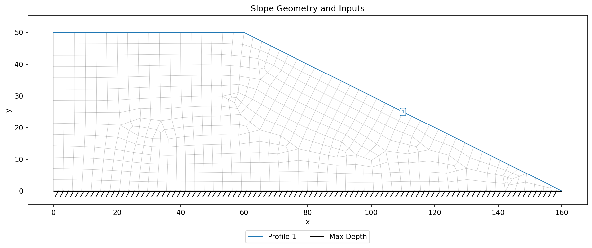{width=1000}

FEM mesh with boundary conditions. Fixed supports (triangles) at the base, x-rollers (circles) on the sides:

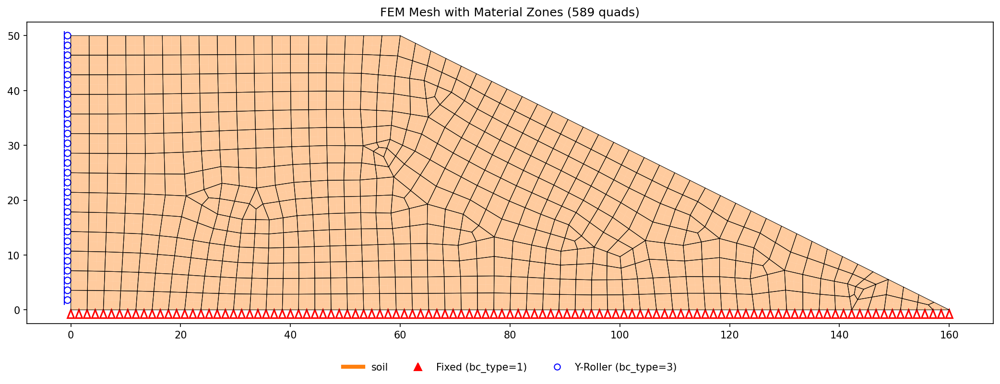{width=1000}

SSRM results. The computed factor of safety is **FS = 1.35** under XSLOPE's strict
true-equilibrium convergence criterion, with the displacement-vs-F upturn at **F ≈ 1.40** —
bracketing the published values: [Griffiths & Lane (1999)](https://doi.org/10.1680/geot.1999.49.3.387)
report FE FOS = 1.4 (their tolerant convergence check accepts slow residual creep that
XSLOPE's equilibrium criterion rejects; their Table 2 converges at F = 1.35 and fails at
1.40), and the [Bishop & Morgenstern (1960)](https://doi.org/10.1680/geot.1960.10.4.129)
stability chart gives 1.380. All three readings agree within ±4%. The plots below show the
solution at the computed factor of safety (F = 1.35). The top plot shows the deformed mesh;
the middle plot shows the viscoplastic shear strain concentration, which reveals the circular
failure mechanism without any prior assumption about its shape or location; the bottom plot
shows the displacement vectors.

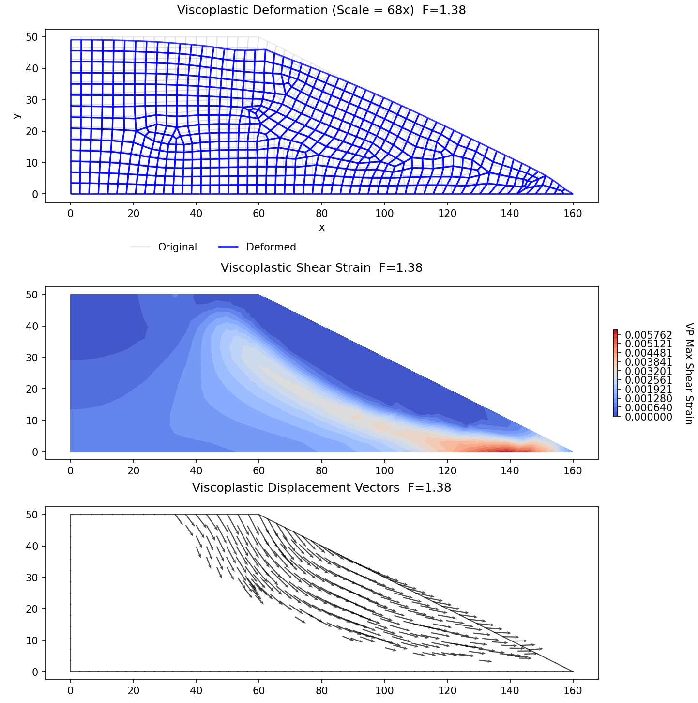{width=1000}

The displacement-versus-F sweep — the failure evidence Griffiths & Lane themselves present
(their Fig. 2) — shows the upturn exactly at F ≈ 1.40: the maximum displacement is
essentially flat through F = 1.35, then grows by 3× between F = 1.40 and 1.45 and an
order of magnitude by F = 1.6.

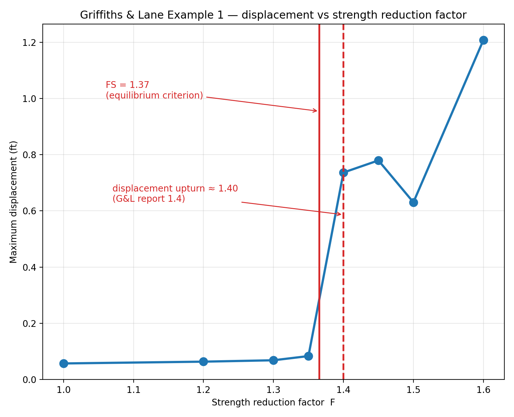{width=700}

This benchmark also appears on the
[Verification](../verification/ssrm.md) page.

<!-- test: file=../fem/files/xslope_griffiths1.xlsx, type=fem_ssrm, expected_fs=1.35, element_type=quad8, target_size=3.5, tolerance=0.01, f_min=1.0, f_max=1.8, max_iter=16000, benchmark=SSRM-1 -->
<!-- Element-type coverage: SSRM on each quadratic type (tri6, quad8, quad9). Slower (SSRM x3), so benchmark-gated. -->
<!-- test: file=../fem/files/xslope_griffiths1.xlsx, type=fem_elements, expected_fs=1.36, tolerance=0.04, target_size=3.5, f_min=1.0, f_max=1.8, max_iter=4000, benchmark=SSRM-elements -->
<!-- SSRM auto-bracketing: a deliberately-wrong [F_min,F_max] must still find the FS. Coarse tri6 mesh (~1.39, fast) so these run un-gated. -->
<!-- test: file=../fem/files/xslope_griffiths1.xlsx, type=fem_ssrm, expected_fs=1.39, element_type=tri6, target_size=6, tolerance=0.05, f_min=1.5, f_max=1.9, max_iter=4000 -->
<!-- test: file=../fem/files/xslope_griffiths1.xlsx, type=fem_ssrm, expected_fs=1.39, element_type=tri6, target_size=6, tolerance=0.05, f_min=0.5, f_max=0.9, max_iter=4000 -->

### Griffiths & Lane (1999) Example 2 — Homogeneous Slope with a Foundation Layer {#verification-griffiths2}

This is Example 2 of [Griffiths & Lane (1999)](https://doi.org/10.1680/geot.1999.49.3.387)
(their Fig. 5): the Example 1 slope with a foundation layer of the **same soil** added
beneath it, thickness $H/2$, so the firm base now sits at depth $D = 1.5\,H$ below the
crest. Every material property and the slope geometry are unchanged from Example 1 — only
the foundation is added.

| Property | Value |
|----------|-------|
| Cohesion, $c'$ | 312.5 psf |
| Friction angle, $\phi'$ | 20 degrees |
| Unit weight, $\gamma$ | 125 pcf |
| Young's modulus, $E$ | 700,000 psf |
| Poisson's ratio, $\nu$ | 0.3 |
| Foundation | $H/2$ = 25 ft of the same soil below the toe ($D = 1.5$) |

The dimensionless strength is again $c'/\gamma H = 0.05$ with $\phi' = 20°$. The domain uses
the printed dimensions of Fig. 1 — a $1.2\,H$ (60 ft) crest platform, the 2:1 face, and a
$2\,H$ (100 ft) runout past the toe — with the $H/2$ foundation from the Example 2 text
($D = 1.5$). (Example 1 as modelled here omits the runout because with the base at toe
level a mechanism cannot reach it; with a foundation beneath the toe the runout gives any
deeper surface room to form.)

Excel input file: [xslope_griffiths2.xlsx](../fem/files/xslope_griffiths2.xlsx)

Inputs plotted with the XSLOPE plot_inputs() function:

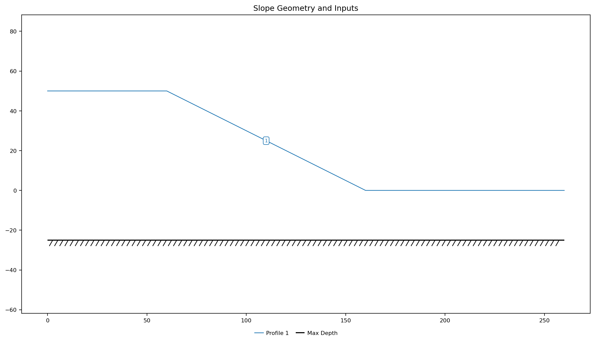{width=1000}

FEM mesh with boundary conditions. Fixed supports (triangles) at the base, x-rollers
(circles) on the sides:

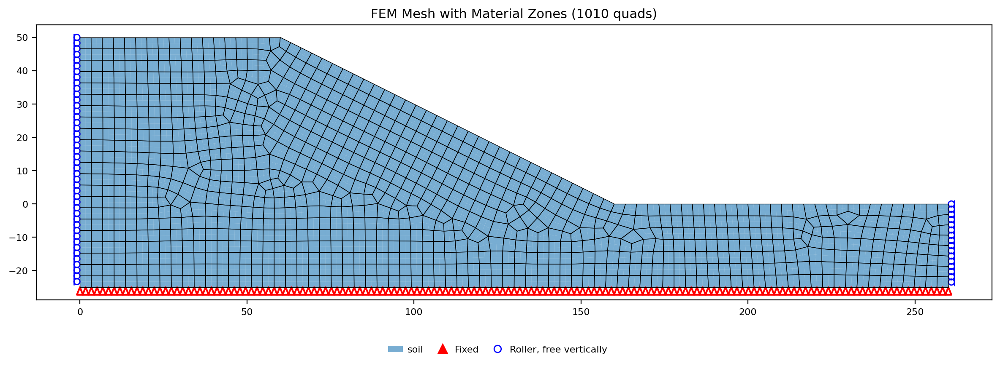{width=1000}

SSRM results. The computed factor of safety is **FS = 1.33** under XSLOPE's strict
true-equilibrium convergence criterion, with the displacement upturn at **F ≈ 1.4** — the
same value as Example 1 (there FS = 1.35), confirming Griffiths & Lane's central point:
adding the foundation layer does **not** change the factor of safety, because the critical
mechanism stays a toe failure. Griffiths & Lane report FE FOS ≈ 1.4, unchanged from
Example 1. The plots below show the solution at the developed failure state. The middle
panel — the viscoplastic shear-strain concentration — is the key image: the shear band
runs from the crest and **exits at the toe** (x = 160, y = 0), staying well above the
foundation base at y = −25. The mechanism finds the toe on its own, with no assumption
about the slip surface.

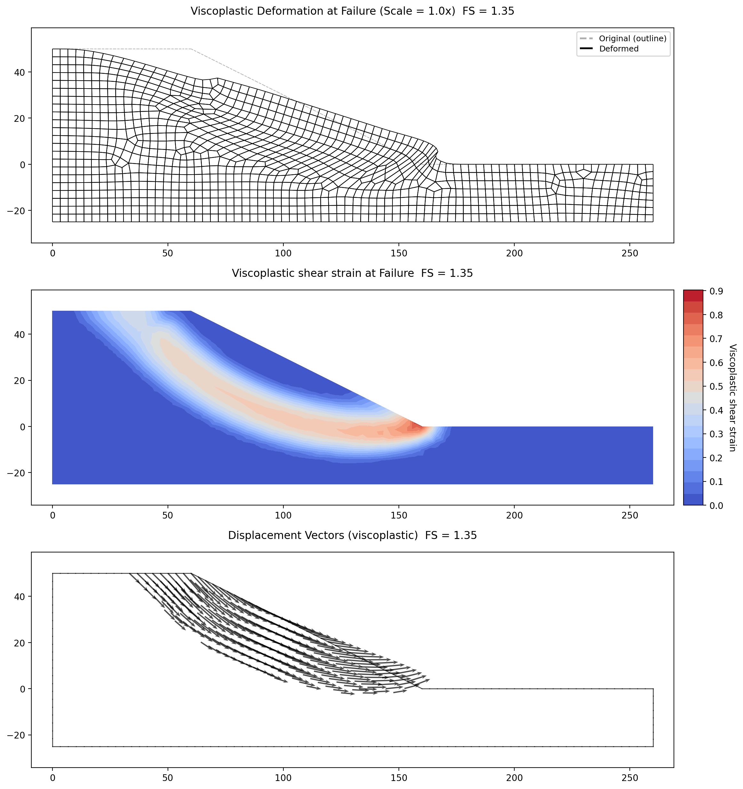{width=1000}

**The false base circle.** This example is Griffiths & Lane's signature demonstration that
finite elements find the true mechanism where a limit-equilibrium search can be misled. For
this slope-plus-foundation, the Bishop & Morgenstern (1960) base-circle charts give
FOS = 1.752, and a proprietary slip-circle program returned FOS = 1.7 when its failure
circle was forced tangent to the base of the foundation — both well above the true value.
Cousins' (1978) toe-circle charts, on the other hand, agree with the FE result at 1.4. The
lesson is that a limit-equilibrium method requires the user to steer the search onto the
correct family of surfaces; assume a base circle and the answer is 25% unconservative.

XSLOPE's own limit-equilibrium search reproduces both sides of this exactly. An
unconstrained global circular search (Spencer, grid seed) settles on a **toe circle** —
critical centre (143.3, 114.1), lowest point y = −1.2, just below the toe and far above the
foundation base — at **FS = 1.37**, agreeing with the SSRM result and with Cousins' toe
charts. When the same search is confined to circles tangent to the foundation base (the
assumption behind the chart value), it returns **FS = 1.70** — the paper's false base-circle
result. XSLOPE's default search is not misled: left free, it finds the toe.

<!-- test: file=../fem/files/xslope_griffiths2.xlsx, type=fem_ssrm, expected_fs=1.334, element_type=quad8, target_size=3.5, tolerance=0.01, f_min=1.0, f_max=1.8, max_iter=16000, benchmark=SSRM-G2 -->
<!-- Coarse tri6 quick SSRM (ungated): confirms the foundation layer leaves the toe-failure FS unchanged. -->
<!-- test: file=../fem/files/xslope_griffiths2.xlsx, type=fem_ssrm, expected_fs=1.36, element_type=tri6, target_size=6, tolerance=0.05, f_min=1.0, f_max=1.8, max_iter=4000 -->
<!-- LEM teaching point: the unconstrained global search finds the TOE circle (true mechanism, ~1.37); forcing tangency to the foundation base reproduces the paper's false base circle (~1.70). -->
<!-- test: file=../fem/files/xslope_griffiths2.xlsx, type=circular_search, method=spencer, seed=grid, num_slices=40, expected_fs=1.366, tolerance=0.02 -->
<!-- test: file=../fem/files/xslope_griffiths2.xlsx, type=circular_search, method=spencer, seed=grid, num_slices=40, tangent_depth=-25;-23, expected_fs=1.702, tolerance=0.02 -->

### Griffiths & Lane (1999) Example 3 — Undrained Clay Slope with a Thin Weak Layer {#verification-griffiths3}

This is Example 3 of [Griffiths & Lane (1999)](https://doi.org/10.1680/geot.1999.49.3.387)
(their Fig. 6): an **undrained** ($\phi_u = 0$) clay slope on a foundation layer
($D = 2$) that contains a **thin layer of weaker clay**. The surrounding clay is held
at $c_{u1}/\gamma H = 0.25$; the thin-layer strength $c_{u2}$ is varied, and the
behaviour is governed by the ratio $c_{u2}/c_{u1}$. The weak layer runs parallel to the
slope face through the slope body, turns horizontal through the foundation, and outcrops
at 45 degrees beyond the toe — Griffiths & Lane liken it to a thin weak liner in a
landfill. The lesson of the example is that lowering $c_{u2}$ eventually switches the
failure from a circular base slide to a non-circular slide that **follows the weak
layer**, and a limit-equilibrium search that assumes a circle would badly overestimate
the factor of safety once that switch has occurred.

The outer geometry, units and elastic constants are Example 4's: $H = 50$ ft,
$\gamma = 125$ pcf, $c_{u1} = 1562.5$ psf ($c_{u1}/\gamma H = 0.25$), $\phi_u = 0$, with
the firm base a full $2H$ below the crest ($D = 2$). $E$ and $\nu$ are the
[FEM Overview](../fem/overview.md) soil-type values (surrounding clay = Medium Clay,
$E = 668{,}300$ psf, $\nu = 0.40$; the weakest thin layer at $c_{u2}/c_{u1} = 0.2$
classifies Soft Clay, $E = 167{,}100$ psf, $\nu = 0.45$). As everywhere in the SSRM the
factor of safety is independent of the elastic constants.

| Property | Value |
|---|---|
| Surrounding clay, $c_{u1}$ | 1562.5 psf ($c_{u1}/\gamma H = 0.25$) |
| Thin-layer strength, $c_{u2}$ | $c_{u2}/c_{u1} \times c_{u1}$ (ratio varied) |
| Friction angle, $\phi_u$ | 0 degrees |
| Unit weight, $\gamma$ | 125 pcf |
| Slope | 2:1, $H = 50$ ft (crest $y = 100$, toe $(200, 50)$, firm base $y = 0$) |
| Geometry | $2H$ crest platform, 2:1 face, $2H$ runout, $D = 2$ |

**The weak-layer geometry is fully dimensioned in Fig. 6.** The published figure carries
printed $H$-fraction callouts along every reach, and the XSLOPE band reproduces each one
exactly ($H = 50$, $y$ upward):

- **Crest.** The band daylights on the crest platform between $x = 0.6H = 30$ (its deeper,
  lower boundary — the printed $0.6H$ from the crest edge) and $x = 0.8H = 40$ (its upper
  boundary nearer the face); the platform closes as $0.6H + 0.2H + 1.2H = 2H$, matching the
  printed $2H$ platform and $1.2H$ spans.
- **Slope reach.** Both boundaries run parallel to the printed 2:1 face.
- **Foundation reach.** The band flattens horizontally, its top $0.4H$ below the runout
  surface ($y = 30$) and its bottom $0.4H$ above the firm base ($y = 20$) — the two printed
  $0.4H$ callouts — which fix the band thickness at $H - 0.4H - 0.4H = 0.2H = 10$ ft by
  arithmetic.
- **Outcrop.** Both boundaries kick up at 45 degrees (the printed 1:1) beyond the toe, the
  upper daylighting at $x = 260$ (toe $+\,1.2H$) and the lower at $x = 270$ (right edge
  $-\,0.6H$); the runout closes as $1.2H + 0.2H + 0.6H = 2H$, matching the printed $2H$,
  $1.2H$ and $0.6H$ spans.

The **governing band thickness is $0.2H = 10$ ft** in the horizontal foundation reach, pinned
by the $0.4H + 0.4H$ callouts above; where the band parallels the 2:1 face it measures about
$0.1H$ perpendicular — the same $0.2H$ surface offset projected onto the slope. The domain is
tiled by **three explicit polygons** so the band is its own material region: a surrounding-clay
wedge between the band and the slope face, the $c_{u2}$ band itself, and the surrounding-clay
body below the band.

Excel input files, one per station:
[$c_{u2}/c_{u1} = 1.0$](../fem/files/xslope_griffiths3_r1.xlsx),
[$0.8$](../fem/files/xslope_griffiths3_r0p8.xlsx),
[$0.6$](../fem/files/xslope_griffiths3_r0p6.xlsx),
[$0.5$](../fem/files/xslope_griffiths3_r0p5.xlsx),
[$0.4$](../fem/files/xslope_griffiths3_r0p4.xlsx),
[$0.2$](../fem/files/xslope_griffiths3_r0p2.xlsx);
plus the half-thickness variant
[$0.2$ (thin band)](../fem/files/xslope_griffiths3_r0p2_thin.xlsx).

Inputs plotted with the XSLOPE plot_inputs() function — the surrounding clay (blue) and
the thin weak layer (orange) tracing the dimensioned path of Fig. 6:

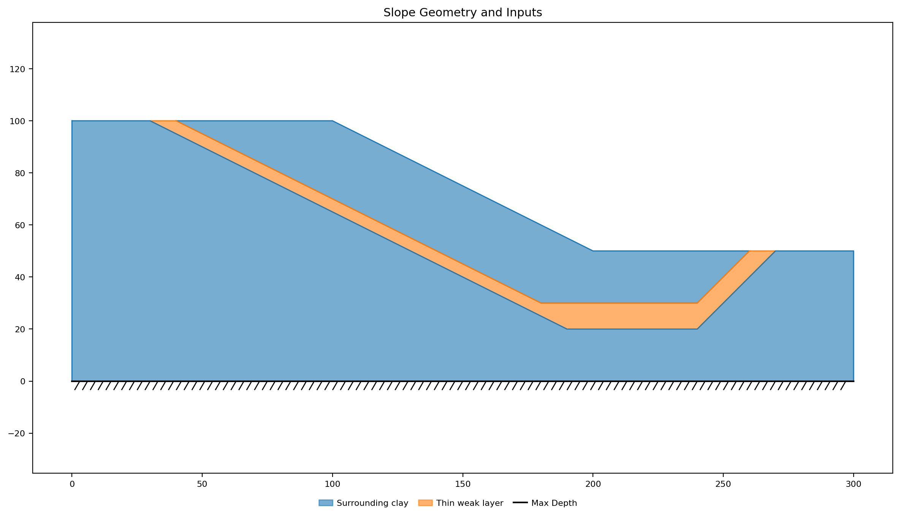{width=1000}

FEM mesh with boundary conditions. Fixed supports (triangles) at the base, x-rollers
(circles) on the sides; the mesh conforms to the thin band as its own zone:

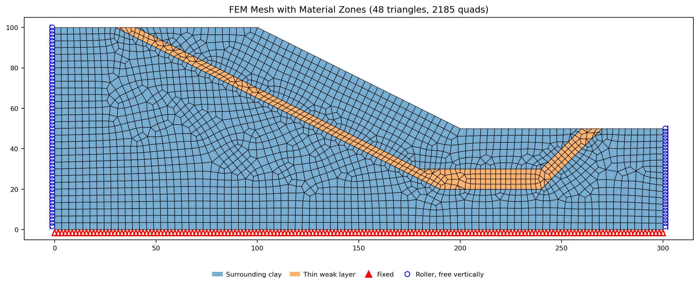{width=1000}

**The sweep.** The XSLOPE SSRM factor of safety, computed across the six ratios,
reproduces the Fig. 7 curve — a base-circle plateau for $c_{u2}/c_{u1} \gtrsim 0.6$ and a
roughly linear fall below it as the weak-layer mechanism takes over. The coarse-tri6
sweep tracks the shape; the two gated quad8 points and the Taylor anchor are overlaid:

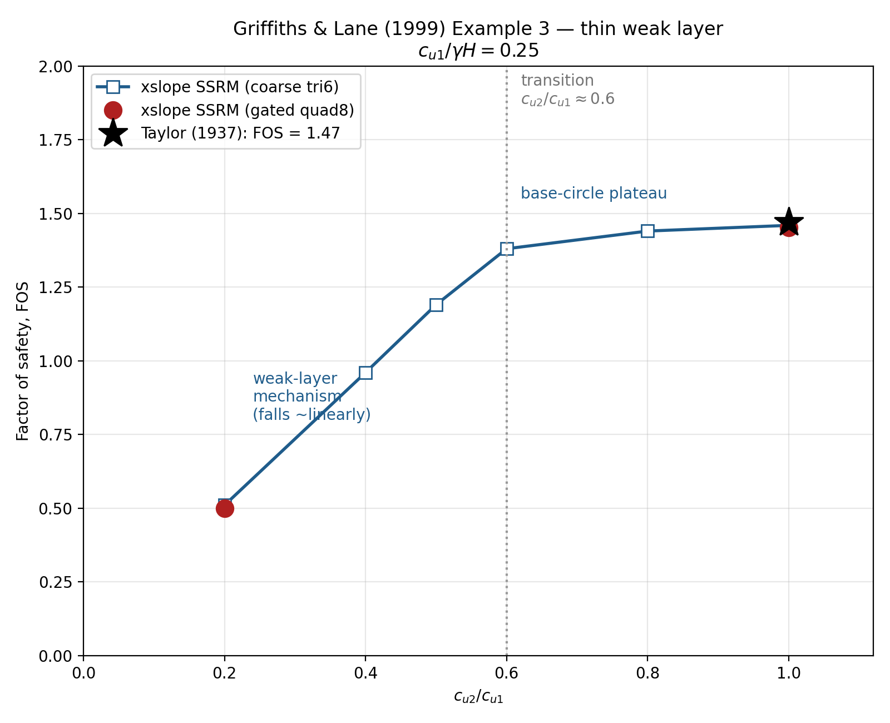{width=700}

| $c_{u2}/c_{u1}$ | XSLOPE SSRM (coarse tri6) | quad8 (gated) | Griffiths & Lane Fig. 7 (FE) |
|---|---|---|---|
| 1.0 | 1.45 | **1.44** | 1.47 (Taylor 1937, base circle) |
| 0.8 | 1.42 | — | ~1.45 |
| 0.6 | 1.37 | — | ~1.40 (transition) |
| 0.5 | 1.20 | — | ~1.25 |
| 0.4 | 0.97 | — | ~1.05 |
| 0.2 | 0.49 | **0.45** | ~0.60 |

All XSLOPE numbers are computed on the published Fig. 6 geometry; every Fig. 7 comparison
value is **graphical** — read from the paper's plotted FE points, which Griffiths & Lane
themselves report only "to the nearest 0.05" (p. 394) — so the sweep rows carry wide,
figure-read tolerances on the *target*, not on the model geometry. The curve matches Fig. 7
in the three features that matter: the **plateau** holds near the Taylor base-circle value
while $c_{u2}/c_{u1} \gtrsim 0.6$ (the thin layer is too strong to matter), the **transition**
sits at $c_{u2}/c_{u1} \approx 0.6$ exactly where Griffiths & Lane place it, and below it the
factor of safety **falls roughly linearly** toward the weak-layer strength. The XSLOPE points
sit a few percent below the graphical FE curve in the falling regime — the strict-true-
equilibrium offset seen throughout these examples — but the shape and the transition are
reproduced.

**The two mechanisms (Fig. 8).** The gated quad8 solutions bracket the mechanism change.
At $c_{u2}/c_{u1} = 1$ the band is the same clay as its surroundings, so the failure is
an essentially **circular base slide** tangent to the firm base — Taylor's mechanism and
Griffiths & Lane's Fig. 8(a):

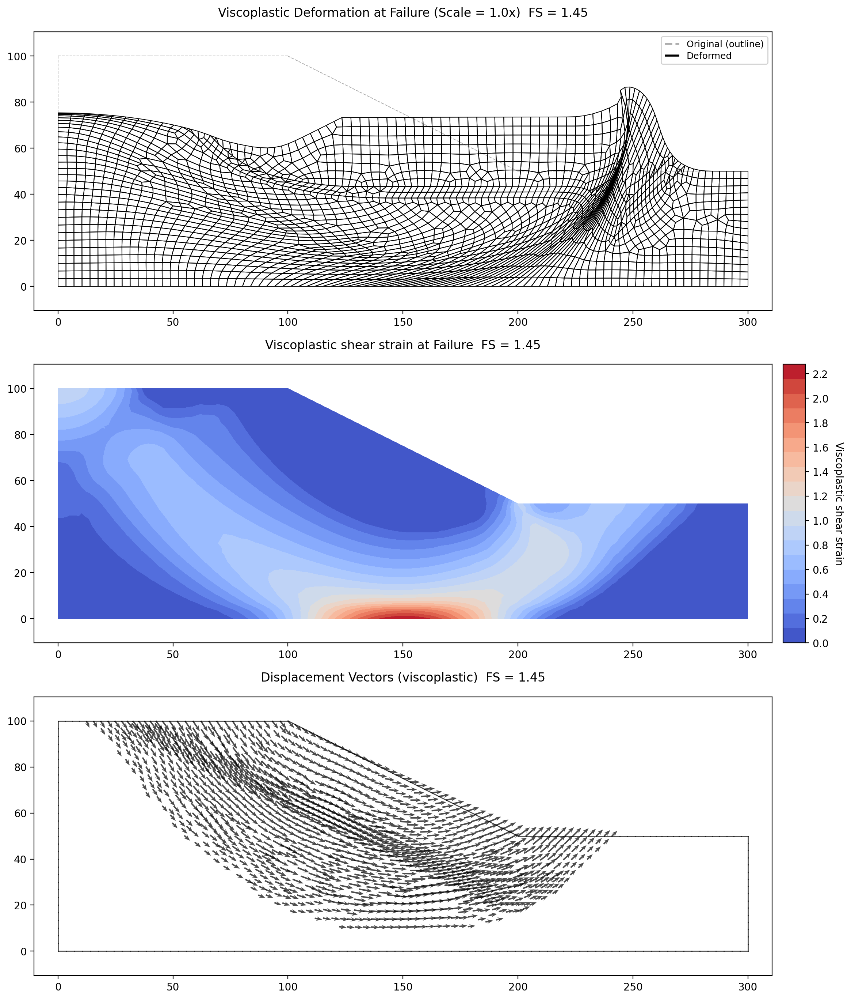{width=1000}

Both results figures render the **last converged viscoplastic state** — the lower edge of
the final bisection bracket — rather than the bracket midpoint that is reported as the
factor of safety, so the $F$ printed on a figure sits at or below its reported FS by no
more than the bracketing tolerance. On the tight-tolerance locks used throughout this page
(tolerance 0.01) the two agree to the printed digits, including the $c_{u2}/c_{u1} = 1$
figure above; on this example's wide, figure-read weak-ratio tolerance (0.05) the
difference shows — the gated-quad8 $c_{u2}/c_{u1} = 0.2$ figure below is rendered at
$F = 0.43$, just below its reported **FS = 0.45** (the 0.4531 bracket midpoint). Both
mechanism figures show the gated quad8 solutions, not the coarser tri6 sweep — whose
$c_{u2}/c_{u1} = 0.2$ station reads 0.49 in the table above.

At $c_{u2}/c_{u1} = 0.2$ the shear strain concentrates into a narrow band that **follows
the weak layer** — down parallel to the face, along the horizontal foundation reach, and
kicking up to daylight beyond the toe — a highly concentrated non-circular slide, exactly
Griffiths & Lane's Fig. 8(c):

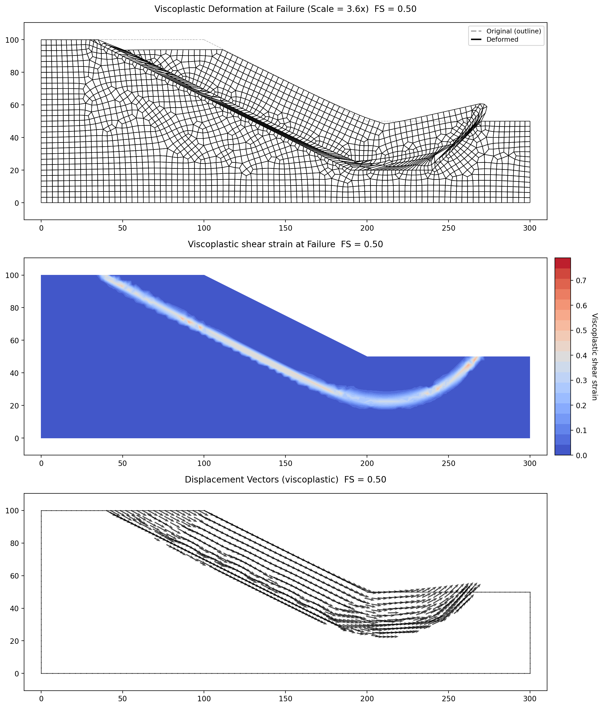{width=1000}

**Cross-check against Example 4.** At $c_{u2}/c_{u1} = 1$ the thin layer carries the same
strength as the surrounding clay, so the model is materially identical to the homogeneous
$D = 2$ slope of [Example 4](#verification-griffiths4) at its ratio-1 station. The gated
quad8 SSRM returns **FS = 1.44**, landing on Example 4 r1's 1.441 to within 0.001 (the
only difference is the extra mesh boundaries where the band sits) and a few percent below
Taylor's 1.47 — the same base-circle limit.

**Mesh convergence and the convergence criterion.** The weak-ratio lock was checked for mesh
convergence with a refinement ladder at $c_{u2}/c_{u1} = 0.2$, from a coarse tri6 smoke mesh
to a band-refined quad8 mesh:

| Mesh | Elements | XSLOPE SSRM FS |
|---|---|---|
| tri6, target 12 (smoke) | 326 | 0.497 |
| tri6, target 6 | 1356 | 0.475 |
| quad8, target 5.5 (matches Griffiths & Lane's mesh) | 1314 | 0.470 |
| quad8, target 3.5 (committed lock) | 3553 | 0.453 |
| quad8, target 3.5, band-refined | 9963 | 0.459 |

The factor of safety converges to $\approx 0.45$–$0.46$ as the mesh is refined, and the
committed quad8 lock sits inside that converged band; the refinement machinery is validated by
an anchor control at $c_{u2}/c_{u1} = 1$ on the same band-refined mesh, which returns
**FS = 1.4406** — identical to the committed ratio-1 lock. Griffiths & Lane's own mesh, read
from their Fig. 8, is roughly uniform 5 ft — about 1200 eight-node quadrilaterals with about
two elements across the band — essentially the quad8/5.5 row above, and coarser than the
committed lock.

The remaining difference between the converged XSLOPE value ($\approx 0.45$) and the
graphically read FE point ($\approx 0.60$) is a **convergence-criterion** difference, not a
geometry or mesh difference. XSLOPE declares a trial stable only when it satisfies *both* a
displacement-change (CHECON) test *and* a nodal force-equilibrium test, iterating up to a high
ceiling (16000 iterations); Griffiths & Lane (p. 391) declare failure by non-convergence of a
displacement test alone within an iteration ceiling of 1000. Two probes on the quad8/5.5 mesh
show that neither half of that 1999 convention moves the XSLOPE result toward 0.60. Holding the
force-equilibrium test in place but lowering the ceiling to 1000 iterations *lowers* the factor
of safety to **0.38** — the ceiling starves the equilibrium iterations near collapse and reports
failure early, rather than inflating the result. Removing the force-equilibrium test to leave
the displacement criterion alone has the opposite effect: the relative displacement test accepts
steady plastic creep as "converged," so the slope still registers as stable even at $F = 6$ (a
sixfold strength reduction) and no failure is detected at all. The published $\approx 0.60$
therefore reflects Griffiths & Lane's specific 1999 solver and its "nearest 0.05" graphical
reporting, not a value a strict-equilibrium SSRM should reproduce.

Two independent checks anchor the converged XSLOPE value instead. It is mesh-converged, per the
ladder above; and it lands on the paper's *own* Janbu three-line wedge limit-equilibrium value
($\approx 0.47$ in Fig. 7) for the identical layer-following mechanism of Fig. 8(c) — below the
paper's graphical FE point. The XSLOPE lock agrees with the paper's wedge solution for the
governing mechanism.

**Thickness robustness.** Halving the (published) $0.2H$ band and re-running at
$c_{u2}/c_{u1} = 0.2$ moves the coarse-tri6 factor of safety only from **0.49** to **0.51**,
confirming the weak-ratio result is governed by $c_{u2}$ times the failure-path length rather
than by the exact band thickness.

<!-- Gated quad8 SSRM locks (benchmark=SSRM-G3): the anchor (cu2=cu1, base circle) tight
     on the observed value; the weak ratio (cu2/cu1=0.2, layer-following) figure-read with
     a wide tolerance, since both the ~0.6 published FE point and the schematic band geometry
     are read off the figures. -->
<!-- test: file=../fem/files/xslope_griffiths3_r1.xlsx, type=fem_ssrm, expected_fs=1.4406, element_type=quad8, target_size=3.5, tolerance=0.01, f_min=1.0, f_max=1.8, max_iter=16000, benchmark=SSRM-G3 -->
<!-- test: file=../fem/files/xslope_griffiths3_r0p2.xlsx, type=fem_ssrm, expected_fs=0.45, element_type=quad8, target_size=3.5, tolerance=0.05, f_min=0.3, f_max=1.0, max_iter=16000, benchmark=SSRM-G3 -->
<!-- Coarse tri6 quick SSRM (ungated, wide figure-read tolerance): the Fig. 7 sweep — the
     base-circle plateau (>=0.6), the transition at ~0.6, and the roughly linear fall as the
     weak-layer mechanism takes over. -->
<!-- test: file=../fem/files/xslope_griffiths3_r0p8.xlsx, type=fem_ssrm, expected_fs=1.42, element_type=tri6, target_size=6, tolerance=0.05, f_min=1.0, f_max=1.8, max_iter=4000 -->
<!-- test: file=../fem/files/xslope_griffiths3_r0p6.xlsx, type=fem_ssrm, expected_fs=1.37, element_type=tri6, target_size=6, tolerance=0.05, f_min=0.9, f_max=1.7, max_iter=4000 -->
<!-- test: file=../fem/files/xslope_griffiths3_r0p5.xlsx, type=fem_ssrm, expected_fs=1.20, element_type=tri6, target_size=6, tolerance=0.05, f_min=0.8, f_max=1.6, max_iter=4000 -->
<!-- test: file=../fem/files/xslope_griffiths3_r0p4.xlsx, type=fem_ssrm, expected_fs=0.97, element_type=tri6, target_size=6, tolerance=0.05, f_min=0.6, f_max=1.4, max_iter=4000 -->
<!-- test: file=../fem/files/xslope_griffiths3_r0p2.xlsx, type=fem_ssrm, expected_fs=0.49, element_type=tri6, target_size=6, tolerance=0.05, f_min=0.3, f_max=1.1, max_iter=4000 -->
<!-- Thickness sensitivity: half-thickness band at cu2/cu1=0.2 barely moves the FS (0.49 -> 0.51),
     confirming the weak-ratio result is set by cu2 x path length, not the undimensioned band thickness. -->
<!-- test: file=../fem/files/xslope_griffiths3_r0p2_thin.xlsx, type=fem_ssrm, expected_fs=0.51, element_type=tri6, target_size=6, tolerance=0.05, f_min=0.3, f_max=1.1, max_iter=4000 -->

### Griffiths & Lane (1999) Example 4 — Undrained Clay Slope over a Weak Foundation {#verification-griffiths4}

This is Example 4 of [Griffiths & Lane (1999)](https://doi.org/10.1680/geot.1999.49.3.387)
(their Fig. 9): an **undrained** ($\phi_u = 0$) clay slope resting on a foundation layer,
with the two layers assigned different undrained strengths. The slope body carries a
constant $c_{u1}/\gamma H = 0.25$; the foundation strength $c_{u2}$ is varied, and the
behaviour is governed by the strength ratio $c_{u2}/c_{u1}$. The firm base sits at depth
$D = 2$ (a full $2H$ below the crest); the foundation layer is $H$ thick, and the material
boundary is the toe elevation, which is also the ground surface of the runout.

| Property | Value |
|----------|-------|
| Slope undrained strength, $c_{u1}$ | 1562.5 psf ($c_{u1}/\gamma H = 0.25$) |
| Foundation undrained strength, $c_{u2}$ | $c_{u2}/c_{u1} \times c_{u1}$ (ratio varied) |
| Friction angle, $\phi_u$ | 0 degrees |
| Unit weight, $\gamma$ | 125 pcf |
| Slope height, $H$ | 50 ft (crest at $y=100$, toe at $y=50$, firm base at $y=0$) |
| Geometry | $2H$ crest platform, 2:1 face, $2H$ runout, $D = 2$ |

The domain is tiled by two explicit material polygons — the slope body $c_{u1}$ and the
foundation $c_{u2}$ — because the layer boundary coincides with the runout surface, so a
profile-line stack would leave a zero-thickness $c_{u1}$ sliver over the runout. Elastic
constants are assigned by soil type from the [FEM Overview](../fem/overview.md) table:
$c_{u1} = 1562.5$ psf classifies Medium Clay ($E = 668{,}300$ psf, $\nu = 0.40$), and the
$c_{u2} = 3125$ psf foundation at ratio 2 classifies Stiff Clay ($E = 2{,}610{,}700$ psf,
$\nu = 0.30$). The SSRM factor of safety is independent of the elastic constants; they only
set the displacement scale.

Two bracket cases are built: **$c_{u2}/c_{u1} = 1$** (the foundation is as weak as the
slope) and **$c_{u2}/c_{u1} = 2$** (the foundation is firmly stronger). Griffiths & Lane's
Fig. 10 shows the computed factor of safety flattening onto a toe-circle plateau for
$c_{u2}/c_{u1} \gtrsim 1.5$; the ratio-2 case sits firmly on that plateau (figure-confirmed),
and the ratio-1 case is the homogeneous base-circle limit.

Excel input files:
[xslope_griffiths4_r1.xlsx](../fem/files/xslope_griffiths4_r1.xlsx) ($c_{u2}/c_{u1} = 1$),
[xslope_griffiths4_r2.xlsx](../fem/files/xslope_griffiths4_r2.xlsx) ($c_{u2}/c_{u1} = 2$)

Inputs plotted with the XSLOPE plot_inputs() function (geometry is identical for both
cases; only the foundation strength differs):

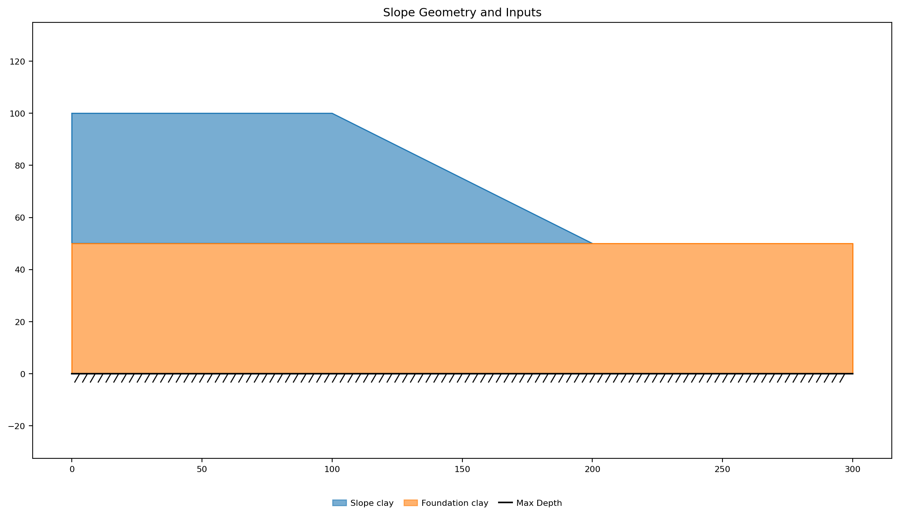{width=1000}

FEM mesh with boundary conditions. Fixed supports (triangles) at the base, x-rollers
(circles) on the sides:

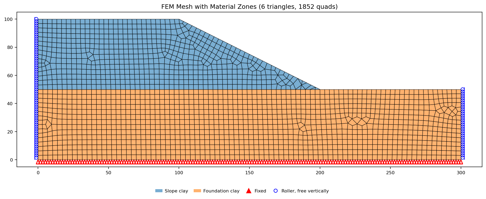{width=1000}

Results. The two cases straddle a change of failure mechanism, which is the point of the
example. The published anchors are Taylor's (1937) classical solutions, quoted by Griffiths
& Lane on Fig. 10: FOS = 1.47 for the deep **base circle** at $c_{u2} = c_{u1}$, and
FOS = 2.10 for the shallow **toe circle** at $c_{u2} \gg c_{u1}$.

| Case | $c_{u2}/c_{u1}$ | XSLOPE SSRM (quad8) | Taylor (1937) | Mechanism |
|---|---|---|---|---|
| r1 | 1 | 1.44 | 1.47 (base circle) | deep base |
| r2 | 2 | 2.00 | 2.10 (toe circle) | shallow toe |

Both XSLOPE values sit a few percent below the Taylor anchors — the same offset seen in
Examples 1 and 2, where XSLOPE's strict true-equilibrium convergence criterion rejects the
slow residual creep that a tolerant check accepts. The relative jump between the two cases
(1.44 → 2.00, a factor of 1.39) closely tracks the published jump (1.47 → 2.10, 1.43).

The critical mechanism flips between the two cases, exactly as in Griffiths & Lane's Fig. 11.
For $c_{u2}/c_{u1} = 1$ (base case), the shear-strain concentration dips to the firm base at
$y = 0$ and passes along it — a deep-seated base mechanism (their Fig. 11a):

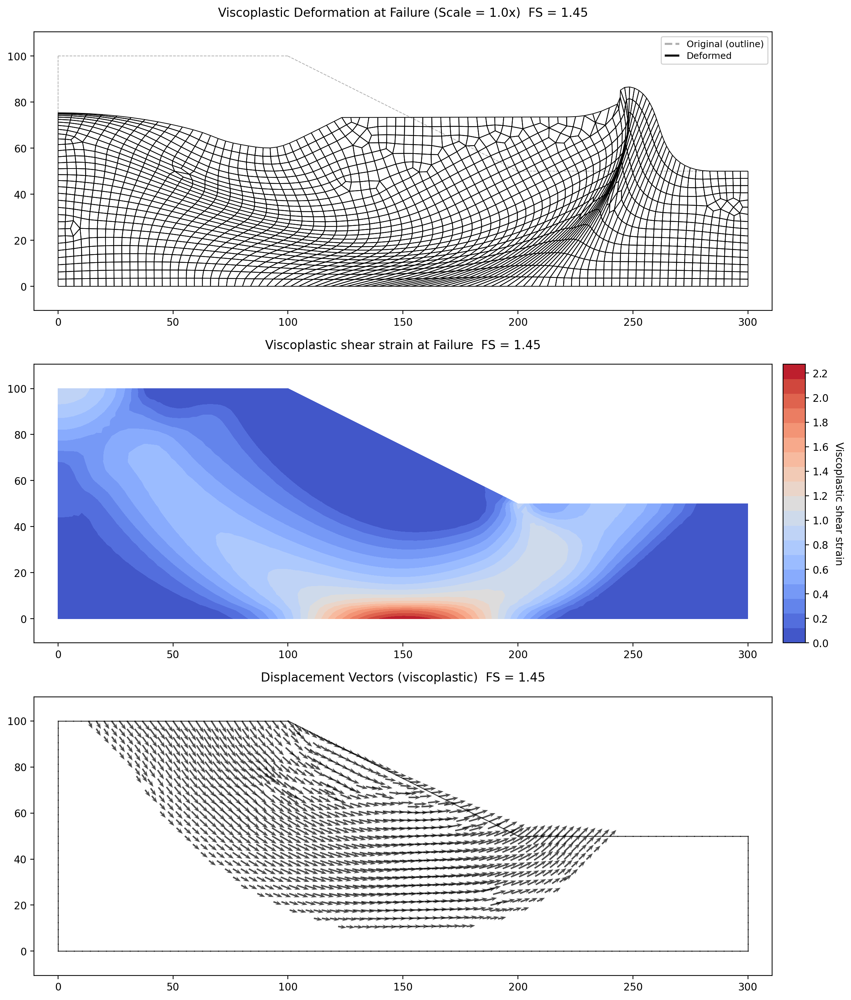{width=1000}

For $c_{u2}/c_{u1} = 2$ (toe case), the shear band runs from the crest and exits at the toe
($x = 200$, $y = 50$), staying entirely within the weaker upper clay and never entering the
stronger foundation — a shallow toe mechanism (their Fig. 11c). The stronger foundation has
lifted the factor of safety and forced the failure surface up out of the foundation layer:

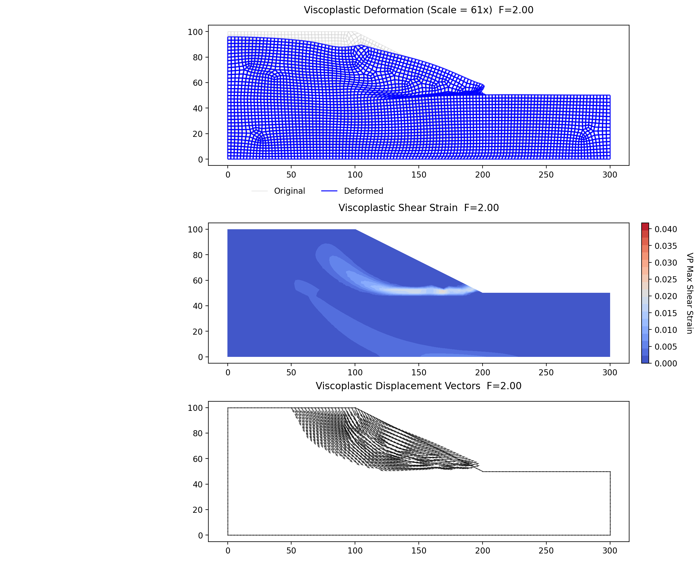{width=1000}

XSLOPE's own limit-equilibrium search reproduces the same flip. An unconstrained global
circular search (Spencer, grid seed) settles on a **base circle** for the ratio-1 case —
critical surface bottoming at $y \approx 0$, tangent to the firm base — at **FS = 1.47**,
matching Taylor's base-circle chart. For the ratio-2 case the same search settles on a
**toe circle** bottoming at $y \approx 50$ (the toe elevation), confined to the upper clay,
at **FS = 2.02**. The limit-equilibrium method finds the correct mechanism family on its own
here, and the SSRM and Spencer results agree on both the factor of safety and the base→toe
transition.

<!-- test: file=../fem/files/xslope_griffiths4_r1.xlsx, type=fem_ssrm, expected_fs=1.441, element_type=quad8, target_size=3.5, tolerance=0.01, f_min=1.0, f_max=1.8, max_iter=16000, benchmark=SSRM-G4 -->
<!-- test: file=../fem/files/xslope_griffiths4_r2.xlsx, type=fem_ssrm, expected_fs=2.002, element_type=quad8, target_size=3.5, tolerance=0.01, f_min=1.8, f_max=2.4, max_iter=16000, benchmark=SSRM-G4 -->
<!-- Coarse tri6 quick SSRM (ungated): base case (cu2=cu1) and toe case (cu2=2cu1); confirms the mechanism flip lifts the FS from ~1.44 to ~2.0. -->
<!-- test: file=../fem/files/xslope_griffiths4_r1.xlsx, type=fem_ssrm, expected_fs=1.44, element_type=tri6, target_size=6, tolerance=0.05, f_min=1.0, f_max=1.8, max_iter=4000 -->
<!-- test: file=../fem/files/xslope_griffiths4_r2.xlsx, type=fem_ssrm, expected_fs=2.02, element_type=tri6, target_size=6, tolerance=0.05, f_min=1.6, f_max=2.4, max_iter=4000 -->
<!-- LEM companions: the unconstrained global search finds the BASE circle (~1.47, tangent to the firm base) at cu2=cu1 and the TOE circle (~2.02, confined to the upper clay) at cu2=2cu1 — the same base->toe flip as the SSRM and Taylor's charts. -->
<!-- test: file=../fem/files/xslope_griffiths4_r1.xlsx, type=circular_search, method=spencer, seed=grid, num_slices=40, expected_fs=1.468, tolerance=0.02 -->
<!-- test: file=../fem/files/xslope_griffiths4_r2.xlsx, type=circular_search, method=spencer, seed=grid, num_slices=40, expected_fs=2.022, tolerance=0.02 -->

### Griffiths & Lane (1999) Example 5 — "Slow" Drawdown Sweep {#verification-griffiths5}

This is Example 5 of [Griffiths & Lane (1999)](https://doi.org/10.1680/geot.1999.49.3.387)
(their Figs 12-15): the Example 1 homogeneous 2:1 slope with a **horizontal free
surface** at a depth $L$ below the crest, analysed across a range of drawdown ratios
$L/H$. The problem is a **"slow" drawdown** — a reservoir standing against the slope
face is lowered from above the crest ($L/H < 0$, slope fully submerged) to the toe
($L/H = 1$, drained), with the free surface inside the slope tracking the reservoir
level. Sweeping $L/H$ reproduces the factor-of-safety curve of Fig. 15, so this
benchmark is a **capability showcase** for the pore-pressure and reservoir-load
treatment rather than a single tight lock.

Three quantities are read from the paper's figures: the shape of the FE curve in
Fig. 15, its stated minimum $\text{FOS} \approx 1.3$ at $L/H \approx 0.7$, and the two
labelled chart anchors ($F = 1.85$ at $L/H = 0$; $\text{FOS} = 1.4$ at $L/H = 1$).
Every XSLOPE number below is computed.

| Property | Value |
|---|---|
| Cohesion, $c'$ | 312.5 psf ($c'/\gamma H = 0.05$) |
| Friction angle, $\phi'$ | 20 degrees |
| Unit weight, $\gamma$ | 125 pcf (total, above **and** below the free surface) |
| Young's modulus, $E$ | 668,300 psf (Medium Clay) |
| Poisson's ratio, $\nu$ | 0.40 |
| Slope | 2:1, $H = 50$ ft (crest at $y = 50$, toe at $(160, 0)$, firm base at $y = 0$) |
| Free surface | horizontal, at $y_{fs} = 50 - L$; $L/H$ swept from $-0.2$ to $1.0$ |

The geometry and material are Example 1's. A **constant total unit weight** is carried
above and below the water level (paper text): the gravity load uses total $\gamma$ and
the pore pressures are subtracted at the Gauss points (XSLOPE's effective-stress
formulation). $E$ and $\nu$ are the [FEM Overview](../fem/overview.md) soil-type values
— $c' = 312.5$ psf classifies Medium Clay — and, as everywhere in the SSRM, the factor
of safety is independent of them.

The water is applied exactly as in Griffiths & Lane's Figs 12-13, using the same
piezometric-line plus reservoir-load machinery as the Example 6 dam:

- **Free surface (Fig. 12).** A horizontal piezometric line at $y_{fs}$; the pore
  pressure is $\gamma_w \times$ the vertical depth below it, and zero above it. A free
  surface at the toe ($L/H = 1$) is therefore the drained slope.
- **Reservoir load (Fig. 13).** A normal pressure on the submerged outer face, zero at
  the waterline and rising linearly to $\gamma_w\, y_{fs}$ at the toe, applied as
  consistent boundary tractions. For $L/H < 0$ the submerged crest platform additionally
  carries the constant overburden $\gamma_w (y_{fs} - 50)$. For $L/H = 1$ there is no
  submerged face and no reservoir load.

Excel input files, one per station:
[$L/H = -0.2$](../fem/files/xslope_griffiths5_m0p2.xlsx),
[$0$](../fem/files/xslope_griffiths5_0.xlsx),
[$0.2$](../fem/files/xslope_griffiths5_0p2.xlsx),
[$0.4$](../fem/files/xslope_griffiths5_0p4.xlsx),
[$0.5$](../fem/files/xslope_griffiths5_0p5.xlsx),
[$0.7$](../fem/files/xslope_griffiths5_0p7.xlsx),
[$0.9$](../fem/files/xslope_griffiths5_0p9.xlsx),
[$1.0$](../fem/files/xslope_griffiths5_1.xlsx).

Inputs plotted with the XSLOPE plot_inputs() function (representative station,
$L/H = 0.5$): the horizontal free surface cuts the slope at mid-height and the reservoir
pressure loads the submerged lower face:

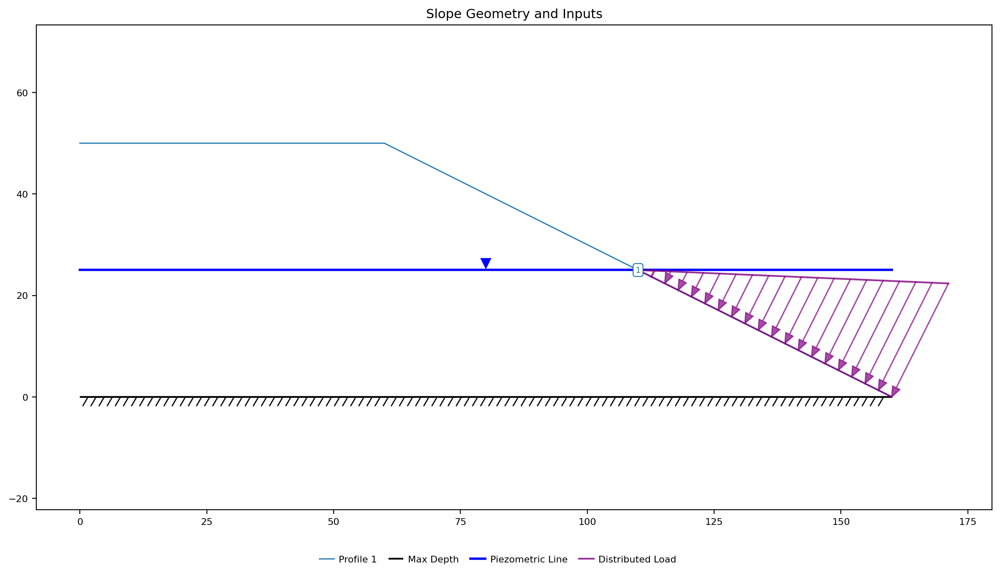{width=1000}

FEM mesh with boundary conditions. Fixed supports (triangles) at the base, rollers
(circles) on the upslope boundary, and the reservoir traction (arrows) on the submerged
face:

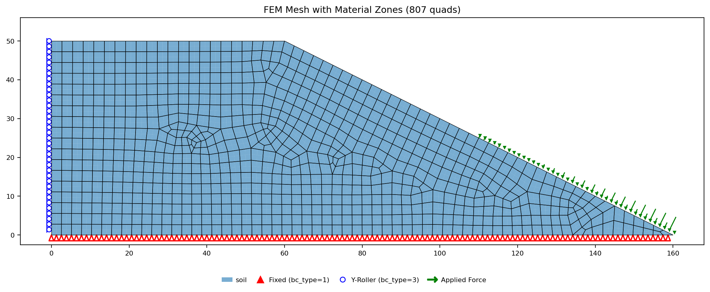{width=1000}

**The sweep.** The XSLOPE SSRM factor of safety, computed at eight stations, reproduces
the Fig. 15 curve — the coarse-tri6 sweep tracks its shape, the gated quad8 points and
the two published chart anchors are overlaid:

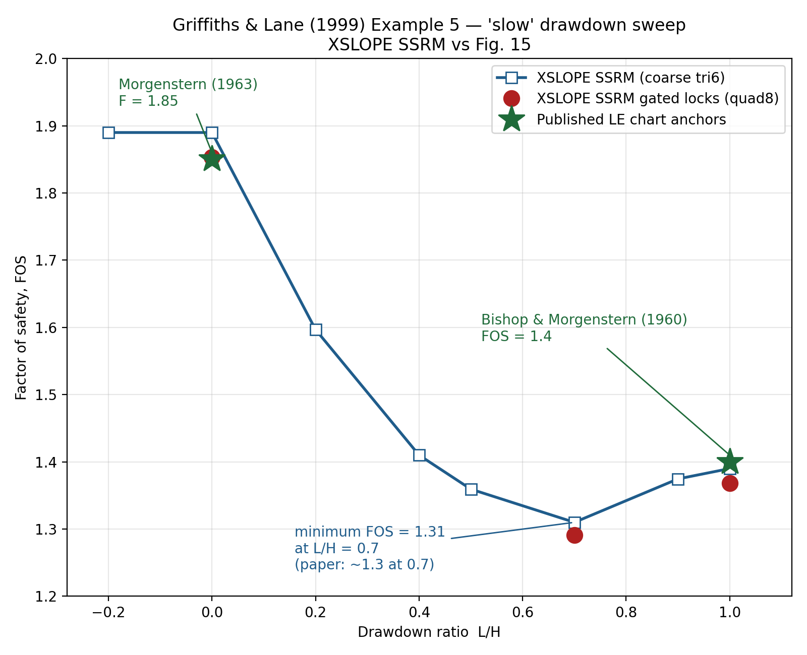{width=700}

| $L/H$ | XSLOPE SSRM (coarse tri6) | quad8 (gated) | Published |
|---|---|---|---|
| −0.2 | 1.86 | — | fully submerged plateau |
| 0.0 | 1.86 | 1.83 | Morgenstern (1963): $F = 1.85$ |
| 0.2 | 1.59 | — | |
| 0.4 | 1.41 | — | |
| 0.5 | 1.34 | — | |
| 0.7 | 1.31 | 1.27 | **minimum** — paper: $\approx 1.3$ at $L/H = 0.7$ |
| 0.9 | 1.36 | — | |
| 1.0 | 1.39 | 1.35 | Bishop & Morgenstern (1960): $\text{FOS} = 1.4$ |

The curve matches Fig. 15 point for point. The factor of safety sits on a flat plateau
of **1.86** while the slope is submerged ($L/H \le 0$) — unaffected by the depth of water
above the crest, as the paper notes — agreeing with Morgenstern's (1963) chart value of
1.85. It falls through the drawdown range to a **minimum of 1.31 at $L/H = 0.7$**, exactly
the location and depth of the paper's stated $\approx 1.3$, then rises to **1.39** at the
drained state, matching Bishop & Morgenstern's (1960) 1.4. The minimum is the physical
heart of the example: the cohesive strength is unaffected by buoyancy, so as the water is
drawn down the added soil weight has a proportionally greater destabilizing effect than
the added frictional strength until $L/H = 0.7$, beyond which the friction gain wins and
the factor of safety recovers.

The three gated stations — the two chart anchors and the minimum — carry benchmark-gated
quad8 locks: **1.83** at the submerged anchor ($L/H = 0$), **1.27** at the minimum
($L/H = 0.7$), and **1.35** at the drained anchor ($L/H = 1$, the same value as the
Example 1 dry slope). Each sits a few percent below the corresponding published value —
the identical strict-true-equilibrium offset documented in Examples 1, 2 and 4, where the
finer quad8 locks read below the tolerant-convergence FE curve that the coarse tri6 sweep
tracks. The reservoir-loaded stations converge on quad8 under the consistently integrated
boundary tractions.

The solution at the minimum station ($L/H = 0.7$, gated, $F = 1.27$). The shear-strain
concentration and displacement vectors show the rotational drawdown mechanism through the
partly submerged slope, exiting near the toe:

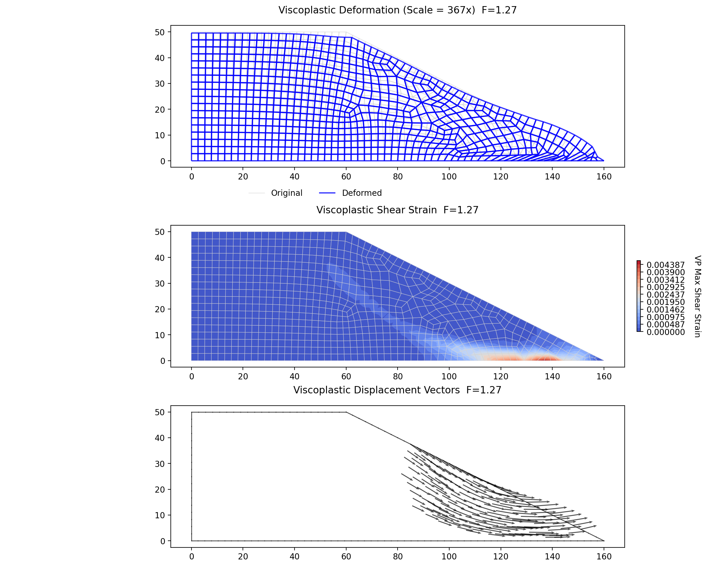{width=1000}

The solution at the fully reservoir-loaded anchor ($L/H = 0$, $F = 1.83$). The whole face
is submerged and the free surface is at the crest; the mechanism is a deep rotational
slide over the loaded face:

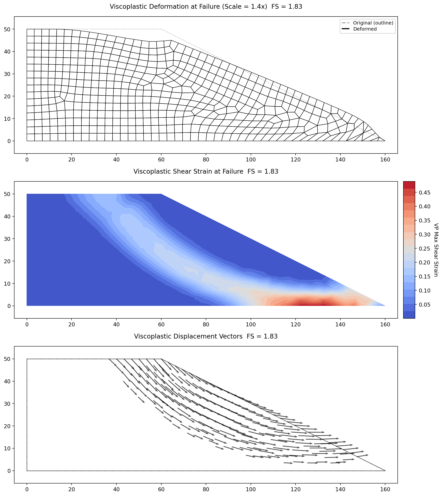{width=1000}

<!-- test: file=../fem/files/xslope_griffiths5_0.xlsx, type=fem_ssrm, expected_fs=1.828, element_type=quad8, target_size=3.5, tolerance=0.01, f_min=1.5, f_max=2.3, max_iter=16000, benchmark=SSRM-G5 -->
<!-- test: file=../fem/files/xslope_griffiths5_0p7.xlsx, type=fem_ssrm, expected_fs=1.272, element_type=quad8, target_size=3.5, tolerance=0.01, f_min=0.9, f_max=1.7, max_iter=16000, benchmark=SSRM-G5 -->
<!-- test: file=../fem/files/xslope_griffiths5_1.xlsx, type=fem_ssrm, expected_fs=1.354, element_type=quad8, target_size=3.5, tolerance=0.01, f_min=0.9, f_max=1.8, max_iter=16000, benchmark=SSRM-G5 -->
<!-- Coarse tri6 quick SSRM (ungated): the drawdown sweep reproducing Fig. 15 — submerged plateau (~1.86), the ~0.7 minimum (~1.31), and the drained end (~1.39). -->
<!-- test: file=../fem/files/xslope_griffiths5_m0p2.xlsx, type=fem_ssrm, expected_fs=1.86, element_type=tri6, target_size=6, tolerance=0.05, f_min=1.5, f_max=2.3, max_iter=4000 -->
<!-- test: file=../fem/files/xslope_griffiths5_0.xlsx, type=fem_ssrm, expected_fs=1.86, element_type=tri6, target_size=6, tolerance=0.05, f_min=1.5, f_max=2.3, max_iter=4000 -->
<!-- test: file=../fem/files/xslope_griffiths5_0p4.xlsx, type=fem_ssrm, expected_fs=1.41, element_type=tri6, target_size=6, tolerance=0.05, f_min=1.0, f_max=1.9, max_iter=4000 -->
<!-- test: file=../fem/files/xslope_griffiths5_0p7.xlsx, type=fem_ssrm, expected_fs=1.31, element_type=tri6, target_size=6, tolerance=0.05, f_min=0.9, f_max=1.7, max_iter=4000 -->
<!-- test: file=../fem/files/xslope_griffiths5_1.xlsx, type=fem_ssrm, expected_fs=1.39, element_type=tri6, target_size=6, tolerance=0.05, f_min=0.9, f_max=1.8, max_iter=4000 -->

### Griffiths & Lane (1999) Example 6 — Two-Sided Earth Dam {#verification-griffiths6}

The second SSRM verification benchmark, from [Griffiths, D.V. & Lane, P.A. (1999)](https://doi.org/10.1680/geot.1999.49.3.387), *Géotechnique* 49(3),
Example 6: an actual earth dam cross-section (Torres & Coffman, 1997) with
homogenized properties, analyzed both with the reservoir full (free surface
sloping from the upstream face to the downstream toe) and before filling (no
free surface).

| Property | Value |
|---|---|
| Cohesion, $c'$ | 13.8 kPa |
| Friction angle, $\phi'$ | 37° |
| Unit weight, $\gamma$ | 18.2 kN/m³ (above and below the water table) |
| Foundation layer | 7.3 m thick |
| Dam height | 21.3 m above foundation, crest 7.3 m wide |
| Faces | upstream ≈ 18°, downstream ≈ 23° |
| Reservoir | 17.1 m above foundation level |

Pore pressures are taken as $\gamma_w$ × vertical depth below the free surface
(a piezometric line, per the paper), and the reservoir water load is applied as
a normal pressure on the submerged upstream boundary — both exactly as
described by Griffiths & Lane.

Excel input files:
[xslope_griffiths6_full.xlsx](../fem/files/xslope_griffiths6_full.xlsx) (reservoir full),
[xslope_griffiths6_dry.xlsx](../fem/files/xslope_griffiths6_dry.xlsx) (before filling)

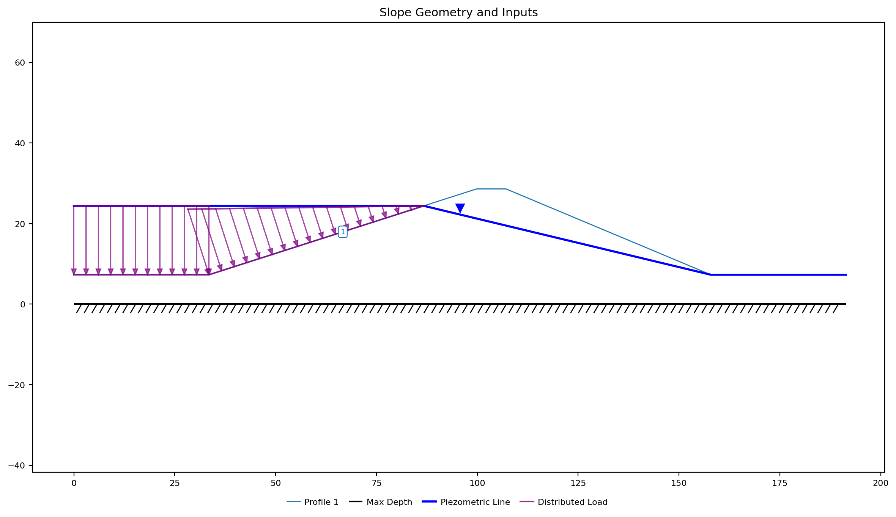{width=1000}

Results:

| Case | XSLOPE FOS | G&L FOS | Diff |
|---|---|---|---|
| Full reservoir (free surface) | 1.86 | ~1.9 | −2% |
| Before filling (no free surface) | 2.40 | ~2.4 | 0% |

Solution for the before-filling (dry) case at the computed factor of safety (F = 2.40). The
shear strain concentration and displacement vectors show the critical mechanism passing
beneath the crest and exiting on the downstream face:

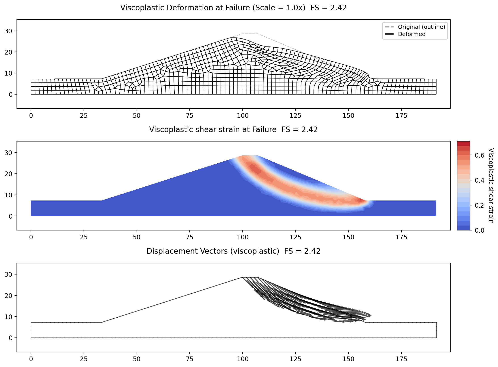{width=1000}

Solution for the full-reservoir case at the computed factor of safety (F = 1.86). With the
free surface in place, the downstream slope is the weaker side: the shear strain band runs
from the crest to the downstream toe, and the displacement vectors show the rotational
sliding mass — the same surface found by Griffiths & Lane and by XSLOPE's own Spencer
analysis. The wet case uses quadratic triangles (tri6): the submerged upstream skin
carries small persistent stresses near the yield surface, and the quad8 element's
reduced-integration hourglass mode is susceptible to such forcing (see the
[FEM Overview](../fem/overview.md) discussion of submerged boundaries).

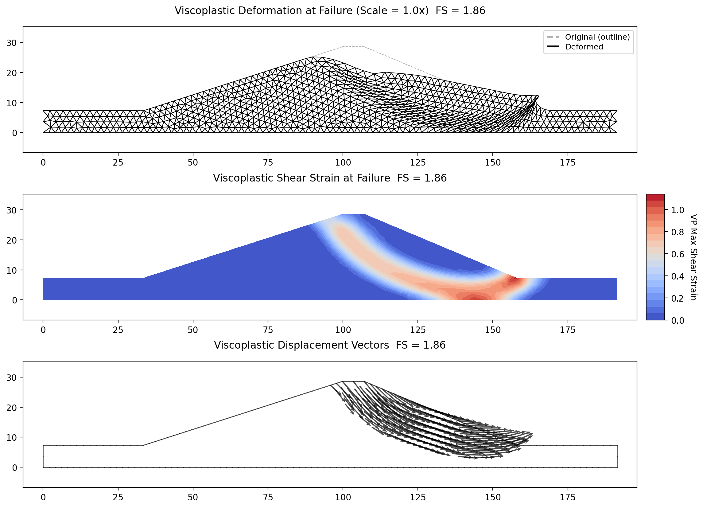{width=1000}

The wet case is a strong test of the pore-pressure treatment. Under the
effective-stress formulation with consistently integrated boundary loads, the
submerged soil simply carries its buoyant weight: a solve at F = 1 converges in
a handful of iterations with an essentially elastic strain field (flooded
ground at working strength sits quietly — a sanity check worth running on any
submerged model), and the failure boundary emerges sharply at F = 1.86 under
the default non-convergence criterion. The agreement with limit equilibrium is
striking: XSLOPE's own Spencer analysis of the same section gives 1.915 (vs the
paper's limit-equilibrium 1.90), with the same downstream critical surface, and
the relative reservoir effect matches the paper (wet/dry = 0.77 vs 0.79). See
the [Verification](../verification/ssrm.md) page.

<!-- test: file=../fem/files/xslope_griffiths6_dry.xlsx, type=fem_ssrm, expected_fs=2.40, element_type=quad8, target_size=2, tolerance=0.01, f_min=2.0, f_max=2.8, max_iter=16000, benchmark=SSRM-2 -->
<!-- test: file=../fem/files/xslope_griffiths6_full.xlsx, type=fem_ssrm, expected_fs=1.858, element_type=tri6, target_size=2, tolerance=0.01, f_min=1.6, f_max=2.2, max_iter=16000, benchmark=SSRM-2 -->

