# Finite-Element Slope Stability (SSRM) Benchmarks

The rows below verify XSLOPE's finite-element strength-reduction solver (SSRM) on the six
examples of [Griffiths & Lane (1999)](https://doi.org/10.1680/geot.1999.49.3.387), "Slope
stability analysis by finite elements," *Géotechnique* 49(3), 387–403, and on two problems of
[Torggler (2016)](https://diglib.tugraz.at/download.php?id=5891c94c5ba8d&location=browse),
"Numerical Studies of Embedded Beam Row in Safety Analysis in PLAXIS 2D," MSc thesis, Graz
University of Technology. Full bibliographic details for the author-year citations on this page
are on the shared [References](references.md) page.

## Methodology

- **Solver.** The Smith & Griffiths 4-component plane-strain Mohr-Coulomb viscoplastic
  formulation. The factor of safety is found by bisection on the hybrid failure criterion, the
  default: a trial fails when the viscoplastic iteration cannot reach equilibrium *and* the
  displacement field shows genuine growth (see [FEM Overview](../fem/overview.md)).
- **Water.** Pore pressures enter through the effective-stress formulation, and reservoir loads
  are applied as consistent boundary tractions.
- **Elastic constants.** Every Griffiths & Lane example carries the paper's nominal values,
  $E' = 10^5$ kN/m$^2$ and $\nu' = 0.3$ (p. 390), entered as $E' = 2{,}088{,}500$ psf. The
  factor of safety does not depend on them; they set only the displacement scale.
- **Restraints.** Fixed supports at the base and horizontal rollers on the sides, drawn on each
  mesh figure.
- **The source's failure test.** Griffiths & Lane declare failure when a displacement test alone
  does not converge (p. 391). XSLOPE also requires nodal force equilibrium, which rejects slow
  residual creep their test accepts.
- **Source precision.** Griffiths & Lane print Examples 1 and 2 on a 0.05 trial grid, read Fig. 7
  "to the nearest 0.05" (p. 394), and print Example 6 to 0.1. Values from Figs. 7, 10 and 15 are
  read off the plotted points. Torggler's factors are PLAXIS $\Sigma M_{sf}$ values printed to
  three decimals, beside a SLIDE limit-equilibrium table.
- **Meshes.** Parameter series run on a coarse tri6 mesh; the stations that carry the argument
  run again on a refined quad8 mesh.
- **Referee.** Where a stability chart covers the stated inputs it is the referee: Bishop &
  Morgenstern (1960) on Example 1 and the drained end of Example 5, Morgenstern (1963) on the
  submerged end of Example 5, and Taylor's (1937) $\phi_u = 0$ stability number on the
  homogeneous station of Examples 3 and 4. Example 2's chart prices a base circle the slope does
  not take, so its referee is the paper's toe-circle limit-equilibrium factor. Everywhere else
  the referee is the source's own finite-element value. Where a chart is the referee, the paper's
  FE value is shown beside it.
- **Figures.** Each results figure is titled with the critical factor of safety and shows the
  mechanism at failure: the deformed mesh, the viscoplastic shear-strain concentration and the
  displacement vectors.

## Status

Match dots and status terms follow the shared [definitions](index.md#status-terms) and
[scoring](index.md#how-the-match-dots-are-scored).

| # | Match | Problem | Results | Notes |
|---:|:-:|---|---|---|
| [1](#verification-griffiths1) | 🟢 | Example 1 — homogeneous slope | SSRM 1.37 vs Bishop & Morgenstern chart 1.380 (−0.7%) · Griffiths & Lane FE 1.4 (−2.1%) · displacement-vs-$F$ upturn $F \approx 1.40$ vs their FE 1.4 (0.0%) | |
| [2](#verification-griffiths2) | 🟢 | Example 2 — homogeneous slope with a foundation layer | SSRM 1.35 vs the paper's toe-circle limit equilibrium 1.4 (−3.6%, within the paper's one-decimal precision: 1.35 rounds to 1.4) · Griffiths & Lane FE 1.4 (−3.6%) · upturn $F \approx 1.4$ vs their FE 1.4 (0.0%) · Spencer toe circle 1.37 vs the paper's toe circle 1.4 (−2.1%) | the foundation leaves the factor of safety unchanged, as the paper argues |
| [3](#verification-griffiths3) | 🟢 | Example 3 — undrained clay slope with a thin weak layer | Worst station $c_{u2}/c_{u1} = 0.2$: Janbu 0.462 vs the paper's own Janbu three-line wedge 0.45–0.50 (inside the band) · Spencer 0.462 on the same surface · circular search 1.244 vs the paper's stated ≈1.3 (−4.3%) | scored at the source's own 0.05 read-off resolution |
| [4](#verification-griffiths4) | 🟢 | Example 4 — undrained clay slope over a weak foundation | SSRM 1.45 vs Taylor 1.47 (−1.4%) · SSRM 2.058 vs Griffiths & Lane FE 2.03 (+1.4%) · relative jump ×1.42 vs their ×1.40 (+1.4%) | the critical mechanism flips base → toe, as in the paper's Fig. 11 |
| [5](#verification-griffiths5) | 🟢 | Example 5 — "slow" drawdown | Submerged plateau 1.89 vs Griffiths & Lane FE 1.85 (+2.2%) · minimum 1.31 vs their FE 1.30 at $L/H = 0.7$ (+0.8%) · drained end 1.37 vs Bishop & Morgenstern chart 1.4 (−2.1%) · $L/H = 0$, 1.85 vs Morgenstern chart 1.85 (0.0%) | two of the three refined quad8 values read below the printed FE values and the third lands on one |
| [6](#verification-griffiths6) | 🟢 | Example 6 — two-sided earth dam | Full reservoir 1.87 vs Griffiths & Lane FE 1.9 (−1.6%) · before filling 2.42 vs their FE 2.4 (+0.8%) | FE against FE, both printed to 0.1 |
| [7](#verification-torggler3a) | 🟢 | Torggler §3 — homogeneous slope with a 7.5 m plate | Unsupported 1.129 vs Torggler PLAXIS 1.111 (+1.6%) · with plate 1.195 vs his 1.175 (+1.7%) · plate shear in the lower lobe 25.8 kN/m vs his 21 kN (+22.9%) | the dot scores the two factors of safety; the plate's internal force is shown for information. The plate variant without interfaces is XSLOPE's shared-node beam |
| [8](#verification-torggler3b) | 🟢 | Torggler §4 — weak-layer slope with a 15 m plate | Unsupported 1.064 vs Torggler PLAXIS 1.045 (+1.8%) · with plate 1.743 vs his 1.725 (+1.0%) | both factors of safety pair closely with his; the weak band still shears where his supported mechanism leaves it |

---

## The Rows

### 🟢 Griffiths & Lane (1999) Example 1 — Homogeneous Slope {#verification-griffiths1}

The paper's base SSRM benchmark: a homogeneous 2:1 slope at $c/\gamma H = 0.05$, $\phi = 20°$, with
the firm base at toe level. The referee is the Bishop & Morgenstern (1960) stability chart, which
the paper prints on its Fig. 2.

| Quantity | XSLOPE | Referee: Bishop & Morgenstern (1960) chart | Griffiths & Lane FE | Note |
|---|---|---|---|---|
| SSRM FS (quad8) | **1.37** | 1.380 (−0.7%) | 1.4 (−2.1%) | their Table 2 and Fig. 2 |
| Displacement-vs-$F$ upturn (their criterion) | $F \approx 1.40$ | — | 1.4 (0.0%) | their Fig. 2 |
| SSRM FS, against their trial table | 1.37 | — | highest trial their Table 2 converged, 1.35 (+1.5%) | they fail at 1.40 |

| Property | Value |
|----------|-------|
| Cohesion, $c$ | 312.5 psf |
| Friction angle, $\phi$ | 20 degrees |
| Unit weight, $\gamma$ | 125 pcf |
| Young's modulus, $E'$ | 2,088,500 psf |
| Poisson's ratio, $\nu'$ | 0.3 |

The two failure tests read the same failure from either side. XSLOPE's factor falls between the
highest trial Griffiths & Lane's Table 2 converges and the trial it fails at, and the maximum
displacement, their own evidence, is flat through $F = 1.35$ and jumps more than tenfold at
$F = 1.40$, their reported value, and stands more than an order of magnitude above that flat
branch by $F = 1.6$. The shear-strain concentration shows a circular mechanism found with no
assumption about its shape or location.

The slope is also checked on all three quadratic element types at 1.36, tri6, quad8 and quad9
agreeing to within 0.04 of it, so the answer does not turn on which element type is used.

**Input file:** [xslope_griffiths1.xlsx](../fem/files/xslope_griffiths1.xlsx).

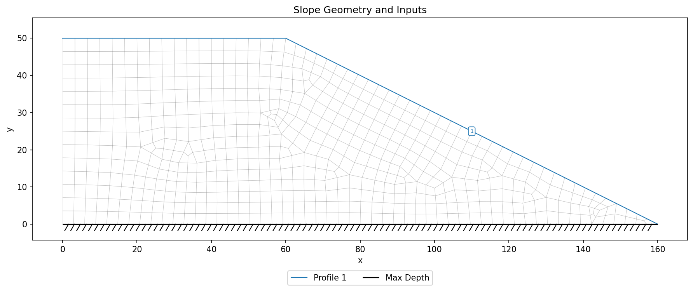{width=1000}

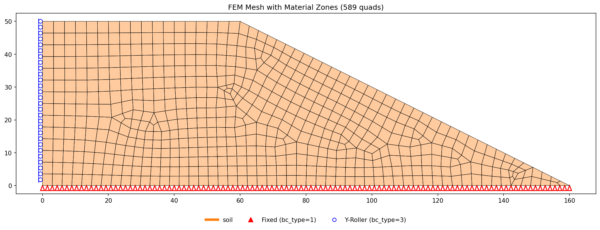{width=1000}

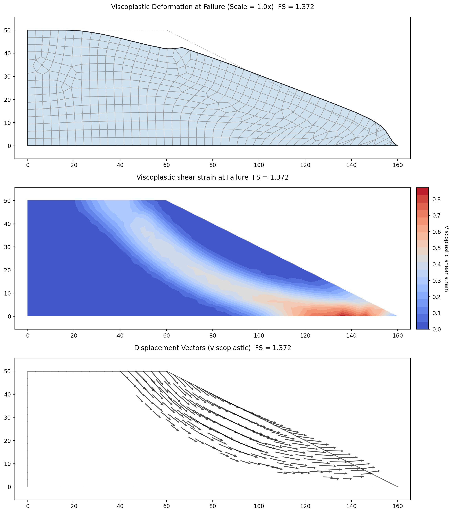{width=1000}

Maximum displacement against $F$, the paper's Fig. 2 criterion:

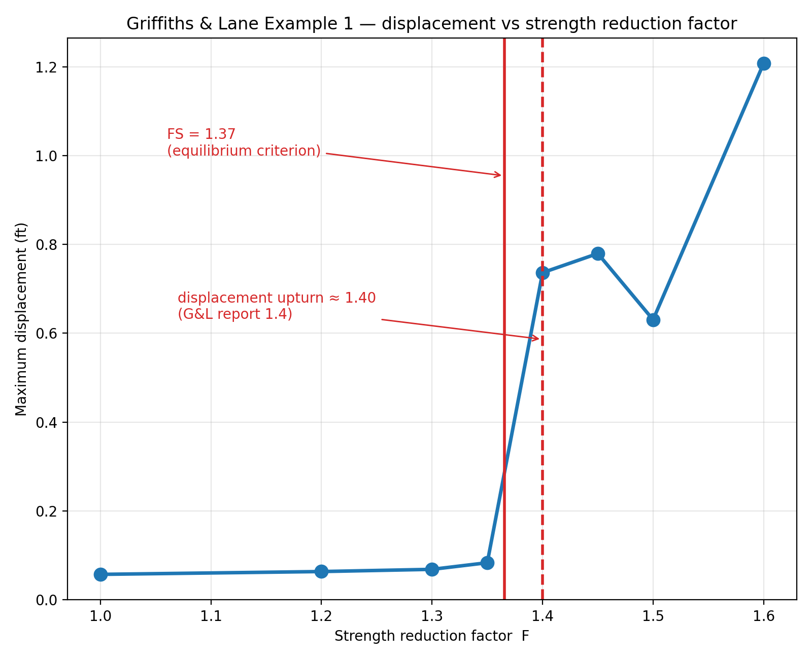{width=700}

<!-- test: file=../fem/files/xslope_griffiths1.xlsx, type=fem_ssrm, expected_fs=1.372, element_type=quad8, target_size=3.5, tolerance=0.01, f_min=1.0, f_max=1.8, max_iter=16000, benchmark=SSRM-1, f_stand=1.36875, f_fail=1.375, check=edges -->
<!-- Element-type coverage: SSRM on each quadratic type (tri6, quad8, quad9). Slower (SSRM x3), so benchmark-gated. -->
<!-- test: file=../fem/files/xslope_griffiths1.xlsx, type=fem_elements, expected_fs=1.36, tolerance=0.04, target_size=3.5, f_min=1.0, f_max=1.8, max_iter=4000, benchmark=SSRM-elements -->
<!-- SSRM auto-bracketing: a deliberately-wrong [F_min,F_max] must still find the FS. Coarse tri6 mesh (1.39 and 1.42, fast) so these run un-gated; the two windows widen onto adjacent intervals of the same 0.05 bisection. -->
<!-- test: file=../fem/files/xslope_griffiths1.xlsx, type=fem_ssrm, expected_fs=1.39, element_type=tri6, target_size=6, tolerance=0.05, f_min=1.5, f_max=1.9, max_iter=4000, f_stand=1.371875, f_fail=1.4125, check=edges -->
<!-- test: file=../fem/files/xslope_griffiths1.xlsx, type=fem_ssrm, expected_fs=1.42, element_type=tri6, target_size=6, tolerance=0.05, f_min=0.5, f_max=0.9, max_iter=4000 -->

### 🟢 Griffiths & Lane (1999) Example 2 — Homogeneous Slope with a Foundation Layer {#verification-griffiths2}

Example 1's slope and soil with a foundation of the same soil beneath it, $H/2$ thick, so the firm
base sits $1.5\,H$ below the crest (their Fig. 5). The paper shows that the foundation leaves the
factor of safety unchanged because the critical mechanism stays at the toe, and that a
limit-equilibrium search assuming a base circle is misled. The Bishop & Morgenstern chart prices
that base circle, so the referee is the paper's toe-circle limit-equilibrium factor, 1.4 (p. 394).

| Quantity | XSLOPE | Referee: the paper's toe circle | Griffiths & Lane FE | Note |
|---|---|---|---|---|
| SSRM FS (quad8) | **1.35** | 1.4 (−3.6%) | 1.4 (−3.6%) | |
| Displacement-vs-$F$ upturn (their criterion) | $F \approx 1.4$ | — | 1.4 (0.0%) | "essentially unchanged from example 1" (p. 392) |
| Spencer, unconstrained circular search (toe circle) | 1.37 | 1.4 (−2.1%) | — | the paper forces its circle through the toe |

| Quantity | XSLOPE | Cross-bearing | Note |
|---|---|---|---|
| Spencer, circles forced tangent to the foundation base (false base circle) | 1.70 | the proprietary slip-circle program's **1.7** (0%) | for that assumed circle (p. 394) |
| — same, against the classical chart | 1.70 | Bishop & Morgenstern (1960) base-circle chart 1.752 (−3.0%) | which the paper quotes as "one possible solution" |

| Property | Value |
|----------|-------|
| Cohesion, $c'$ | 312.5 psf |
| Friction angle, $\phi'$ | 20 degrees |
| Unit weight, $\gamma$ | 125 pcf |
| Young's modulus, $E'$ | 2,088,500 psf |
| Poisson's ratio, $\nu'$ | 0.3 |
| Foundation | $H/2$ = 25 ft of the same soil below the toe ($D = 1.5$) |

The SSRM factor reads below the paper's 1.4 by the failure-test difference of Example 1, while
the displacement upturn, their own test, lands on it. Example 1 reads 1.37 on the same quad8 mesh
against this model's 1.35, so the layer leaves the factor essentially unchanged. The shear band
runs from the crest and exits at the toe, well above the foundation base. XSLOPE's unconstrained
Spencer search settles on a toe circle whose lowest point passes just below the toe, the mechanism
the paper attributes to [Cousins' (1978)](https://doi.org/10.1061/AJGEB6.0000585) charts; confined
to circles tangent to the foundation base, the same search returns the false base circle.

A coarse tri6 run of this model reads 1.39 on its own mesh.

**Input file:** [xslope_griffiths2.xlsx](../fem/files/xslope_griffiths2.xlsx).

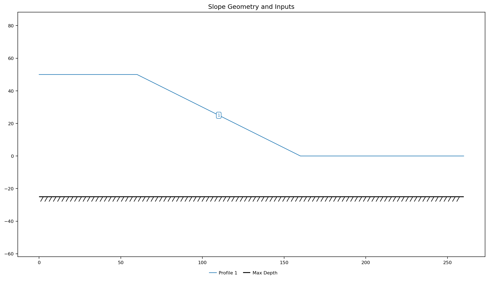{width=1000}

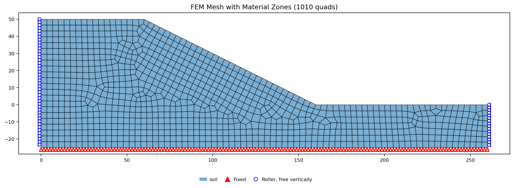{width=1000}

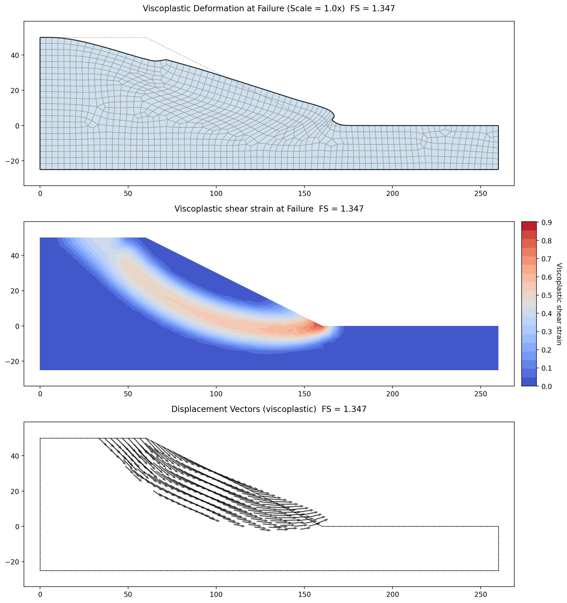{width=1000}

<!-- test: file=../fem/files/xslope_griffiths2.xlsx, type=fem_ssrm, expected_fs=1.347, element_type=quad8, target_size=3.5, tolerance=0.01, f_min=1.0, f_max=1.8, max_iter=16000, benchmark=SSRM-G2, f_stand=1.34375, f_fail=1.35, check=edges -->
<!-- Coarse tri6 quick SSRM (ungated): confirms the foundation layer leaves the toe-failure FS unchanged. -->
<!-- test: file=../fem/files/xslope_griffiths2.xlsx, type=fem_ssrm, expected_fs=1.39, element_type=tri6, target_size=6, tolerance=0.05, f_min=1.0, f_max=1.8, max_iter=4000, f_stand=1.375, f_fail=1.4, check=edges -->
<!-- LEM teaching point: the unconstrained global search finds the TOE circle (true mechanism, ~1.37); forcing tangency to the foundation base reproduces the paper's false base circle (~1.70). -->
<!-- test: file=../fem/files/xslope_griffiths2.xlsx, type=circular_search, method=spencer, seed=grid, num_slices=40, expected_fs=1.366, tolerance=0.02 -->
<!-- test: file=../fem/files/xslope_griffiths2.xlsx, type=circular_search, method=spencer, seed=grid, num_slices=40, tangent_depth=-25;-23, expected_fs=1.702, tolerance=0.02 -->

### 🟢 Griffiths & Lane (1999) Example 3 — Undrained Clay Slope with a Thin Weak Layer {#verification-griffiths3}

An undrained ($\phi_u = 0$) clay slope at $c_{u1}/\gamma H = 0.25$ with the firm base at $D = 2$,
cut by a thin layer of weaker clay that runs parallel to the face, horizontal through the
foundation, and out at 45 degrees beyond the toe (their Fig. 6). The layer follows every dimension
printed on Fig. 6 and is $0.2H = 10$ ft thick in the foundation reach. Its strength ratio
$c_{u2}/c_{u1}$ takes six values to reproduce Fig. 7: lowered far enough, it switches the failure
from a circular base slide to a slide along the layer, which a circular search misses. At a ratio
of 1 the referee is Taylor's (1937) stability number; no chart covers the other stations, and
their referee is the paper's FE point.

| $c_{u2}/c_{u1}$ | XSLOPE SSRM | Griffiths & Lane (1999), Fig. 7 | Note |
|---|---|---|---|
| 1.0 | **1.45** quad8 | Taylor (1937) 1.47 (−1.4%) | the paper's FE plots this case at 1.50 in Fig. 7 and at 1.45 in Fig. 10 |
| 0.8 | 1.44 tri6 | Griffiths & Lane FE 1.45 (−0.7%) | |
| 0.6 | 1.38 tri6 | Griffiths & Lane FE 1.40 (−1.4%) | transition |
| 0.5 | 1.19 tri6 | Griffiths & Lane FE 1.25 (−4.8%) | |
| 0.4 | 0.96 tri6 | Griffiths & Lane FE 1.05 (−8.6%) | |
| 0.2 | 0.51 tri6 · **0.50** quad8 | Griffiths & Lane FE 0.60 (−15.0% / −16.7%) | |

| Limit equilibrium at $c_{u2}/c_{u1} = 0.2$ | XSLOPE | Griffiths & Lane (1999) | Note |
|---|---|---|---|
| Non-circular Spencer / Janbu | 0.462 / 0.462 | Janbu three-line wedge, 0.45–0.50 (inside the band) | Fig. 7 at the paper's 0.05 resolution |
| Circular search (wrong mechanism family) | 1.244 | circular mechanism ≈1.3 (−4.3%) | stated in the text, p. 396 |

| Property | Value |
|---|---|
| Surrounding clay, $c_{u1}$ | 1562.5 psf ($c_{u1}/\gamma H = 0.25$) |
| Thin-layer strength, $c_{u2}$ | $c_{u2}/c_{u1} \times c_{u1}$ (ratio varied) |
| Friction angle, $\phi_u$ | 0 degrees |
| Unit weight, $\gamma$ | 125 pcf |
| Slope | 2:1, $H = 50$ ft (crest $y = 100$, toe $(200, 50)$, firm base $y = 0$) |
| Geometry | $2H$ crest platform, 2:1 face, $2H$ runout, $D = 2$ |

The curve keeps the shape of Fig. 7, a plateau down to $c_{u2}/c_{u1} \approx 0.6$ and a roughly
linear fall below it, but once the failure follows the layer the SSRM reads below the paper's FE
points, 0.50 against 0.60 at a ratio of 0.2 (−16.7%). There the
SSRM sits inside the paper's own Janbu three-line wedge band for the same layer-following
mechanism of Fig. 8(c), and XSLOPE's non-circular Spencer and Janbu searches, started on that
wedge, both return 0.462 on a surface that stays inside the layer end to end. An unconstrained
circular search returns 1.244, near the ≈1.3 the paper quotes for a circle at this ratio.

Halving the layer's thickness at a ratio of 0.2, with its element size halved alongside, moves
the coarse-tri6 factor only from 0.51 to 0.56.

**Input files**, one per station:
[$c_{u2}/c_{u1} = 1.0$](../fem/files/xslope_griffiths3_r1.xlsx),
[$0.8$](../fem/files/xslope_griffiths3_r0p8.xlsx),
[$0.6$](../fem/files/xslope_griffiths3_r0p6.xlsx),
[$0.5$](../fem/files/xslope_griffiths3_r0p5.xlsx),
[$0.4$](../fem/files/xslope_griffiths3_r0p4.xlsx),
[$0.2$](../fem/files/xslope_griffiths3_r0p2.xlsx);
plus the half-thickness variant
[$0.2$ (thin band)](../fem/files/xslope_griffiths3_r0p2_thin.xlsx).

The surrounding clay (blue) and the weak layer (orange):

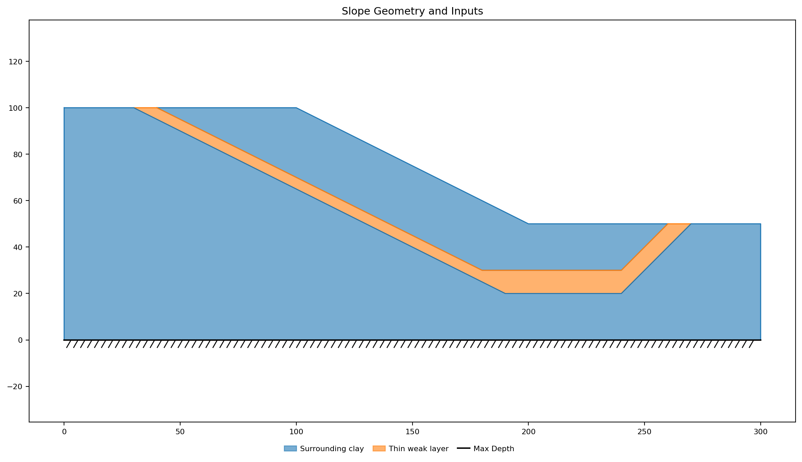{width=1000}

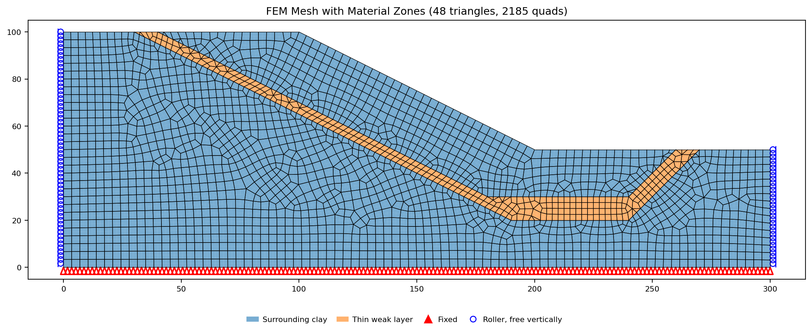{width=1000}

The factor of safety against $c_{u2}/c_{u1}$, the tri6 series with the quad8 points and Taylor's
value overlaid:

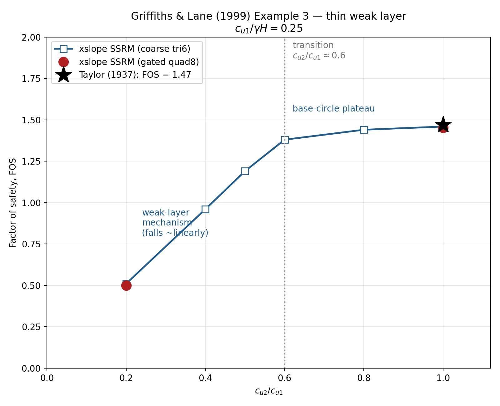{width=700}

At $c_{u2}/c_{u1} = 1$, a circular base slide tangent to the firm base, their Fig. 8(a):

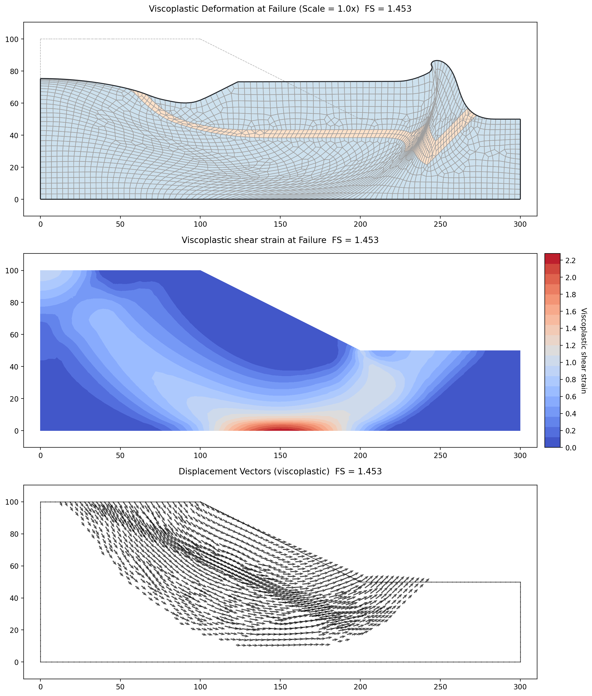{width=1000}

At $c_{u2}/c_{u1} = 0.2$, a narrow slide along the weak layer, their Fig. 8(c):

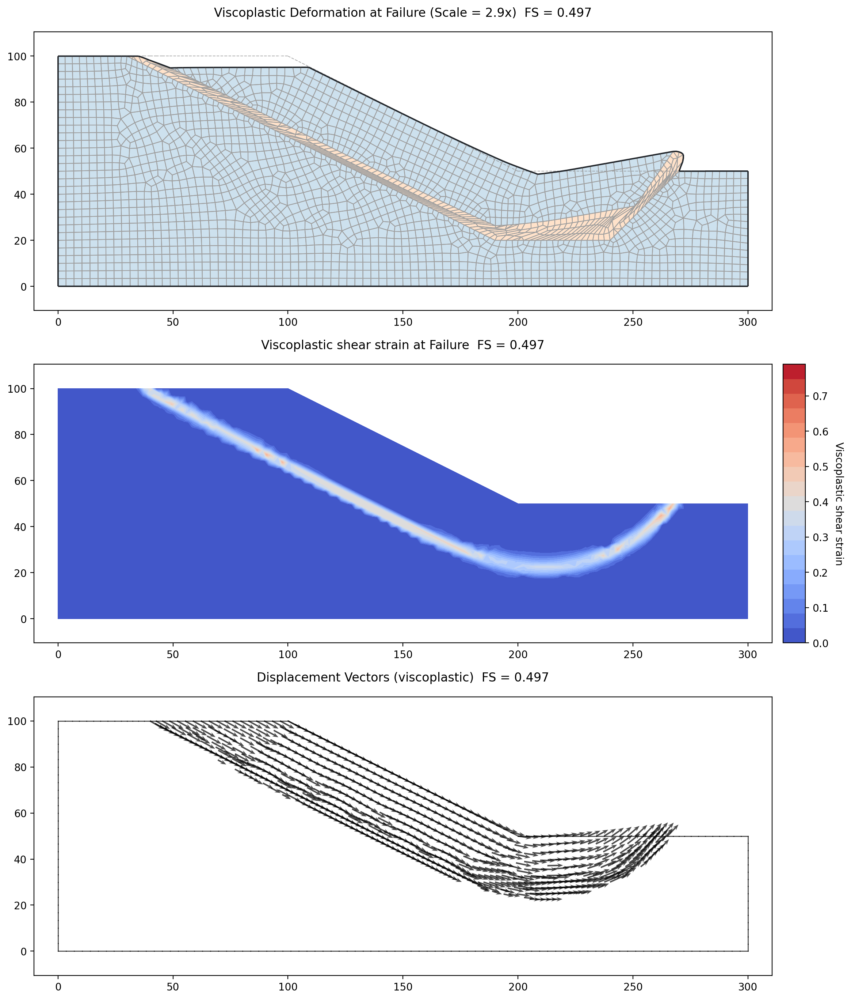{width=1000}

<!-- Gated quad8 SSRM locks (benchmark=SSRM-G3): the anchor (cu2=cu1, base circle) tight
     on the observed value; the weak ratio (cu2/cu1=0.2, layer-following) figure-read with
     a wide tolerance, since both the ~0.6 published FE point and the schematic band geometry
     are read off the figures. -->
<!-- test: file=../fem/files/xslope_griffiths3_r1.xlsx, type=fem_ssrm, expected_fs=1.4531, element_type=quad8, target_size=3.5, tolerance=0.01, f_min=1.0, f_max=1.8, max_iter=16000, benchmark=SSRM-G3, f_stand=1.45, f_fail=1.45625, check=edges -->
<!-- test: file=../fem/files/xslope_griffiths3_r0p2.xlsx, type=fem_ssrm, expected_fs=0.50, element_type=quad8, target_size=3.5, tolerance=0.05, f_min=0.3, f_max=1.0, max_iter=16000, benchmark=SSRM-G3, f_stand=0.475, f_fail=0.51875, check=edges -->
<!-- Coarse tri6 quick SSRM (ungated, wide figure-read tolerance): the Fig. 7 sweep — the
     base-circle plateau (>=0.6), the transition at ~0.6, and the roughly linear fall as the
     weak-layer mechanism takes over. -->
<!-- test: file=../fem/files/xslope_griffiths3_r0p8.xlsx, type=fem_ssrm, expected_fs=1.44, element_type=tri6, target_size=6, tolerance=0.05, f_min=1.0, f_max=1.8, max_iter=4000, f_stand=1.425, f_fail=1.45, check=edges -->
<!-- test: file=../fem/files/xslope_griffiths3_r0p6.xlsx, type=fem_ssrm, expected_fs=1.38, element_type=tri6, target_size=6, tolerance=0.05, f_min=0.9, f_max=1.7, max_iter=4000, f_stand=1.35, f_fail=1.4, check=edges -->
<!-- test: file=../fem/files/xslope_griffiths3_r0p5.xlsx, type=fem_ssrm, expected_fs=1.19, element_type=tri6, target_size=6, tolerance=0.05, f_min=0.8, f_max=1.6, max_iter=4000, f_stand=1.175, f_fail=1.2, check=edges -->
<!-- test: file=../fem/files/xslope_griffiths3_r0p4.xlsx, type=fem_ssrm, expected_fs=0.96, element_type=tri6, target_size=6, tolerance=0.05, f_min=0.6, f_max=1.4, max_iter=4000, f_stand=0.95, f_fail=0.975, check=edges -->
<!-- test: file=../fem/files/xslope_griffiths3_r0p2.xlsx, type=fem_ssrm, expected_fs=0.51, element_type=tri6, target_size=6, tolerance=0.05, f_min=0.3, f_max=1.1, max_iter=4000, f_stand=0.475, f_fail=0.51875, check=edges -->
<!-- Thickness sensitivity: half-thickness band at cu2/cu1=0.2 barely moves the FS (0.51 -> 0.56),
     confirming the weak-ratio result is set by cu2 x path length, not the undimensioned band thickness. -->
<!-- test: file=../fem/files/xslope_griffiths3_r0p2_thin.xlsx, type=fem_ssrm, expected_fs=0.56, element_type=tri6, target_size=6, tolerance=0.05, f_min=0.3, f_max=1.1, max_iter=4000, f_stand=0.55, f_fail=0.575, check=edges -->
<!-- LEM companion at the weak ratio: the mechanism is NON-circular, so the cross-check is a
     non-circular search seeded on the paper's own three-line wedge (the band centerline, carried
     in the file's non-circ sheet). Both methods return 0.462, under the converged SSRM ~0.50 and
     the paper's Janbu wedge ~0.47, on a surface that stays inside the cu2 band end to end. -->
<!-- test: file=../fem/files/xslope_griffiths3_r0p2.xlsx, type=noncircular_search, num_slices=40, fs_spencer=0.462, fs_janbu=0.462, tolerance=0.02 -->
<!-- The wrong mechanism family, locked so the contrast the example is built on is defended
     too: an unconstrained grid-seeded circular search at the same station, which cannot
     follow the band and reads nearly three times the non-circular answer. -->
<!-- test: file=../fem/files/xslope_griffiths3_r0p2.xlsx, type=circular_search, method=spencer, seed=grid, num_slices=40, expected_fs=1.244, tolerance=0.02 -->

### 🟢 Griffiths & Lane (1999) Example 4 — Undrained Clay Slope over a Weak Foundation {#verification-griffiths4}

An undrained clay slope at $c_{u1}/\gamma H = 0.25$ on a foundation layer $H$ thick of strength
$c_{u2}$, with the firm base at $D = 2$ (their Fig. 9). Two cases straddle the change of
mechanism in Fig. 10: a deep base circle at $c_{u2}/c_{u1} = 1$ and a shallow toe circle at 2. At
a ratio of 1 the referee is Taylor's (1937) base-circle stability number. Taylor's toe-circle
value is for a foundation far stronger than the slope ($c_{u2} \gg c_{u1}$), so at a ratio of 2
the referee is the paper's FE point.

| Case | XSLOPE | Referee | Also published |
|---|---|---|---|
| SSRM, $c_{u2}/c_{u1} = 1$ — deep base circle | 1.46 tri6 · **1.45** quad8 | Taylor (1937) 1.47 (−0.7% / −1.4%) | Griffiths & Lane FE 1.45 (+0.7% / 0.0%) |
| SSRM, $c_{u2}/c_{u1} = 2$ — shallow toe circle | 2.112 tri6 · **2.058** quad8 | Griffiths & Lane FE 2.03 (+4.0% / +1.4%) | Taylor (1937) toe circle, $c_{u2} \gg c_{u1}$, 2.10 |
| Relative jump, ratio 1 → ratio 2 | ×1.42 | Griffiths & Lane FE ×1.40 (+1.4%) | Taylor ×1.43 |
| Spencer circular search, $c_{u2}/c_{u1} = 1$ (base circle) | 1.47 | — | their base-circle limit-equilibrium curve, 1.46 (+0.7%) |
| Spencer circular search, $c_{u2}/c_{u1} = 2$ (toe circle) | 2.02 | — | their toe-circle limit-equilibrium curve, 2.04 (−1.0%) |

| Property | Value |
|----------|-------|
| Slope undrained strength, $c_{u1}$ | 1562.5 psf ($c_{u1}/\gamma H = 0.25$) |
| Foundation undrained strength, $c_{u2}$ | $c_{u2}/c_{u1} \times c_{u1}$ (ratio varied) |
| Friction angle, $\phi_u$ | 0 degrees |
| Unit weight, $\gamma$ | 125 pcf |
| Slope height, $H$ | 50 ft (crest at $y=100$, toe at $y=50$, firm base at $y=0$) |
| Geometry | $2H$ crest platform, 2:1 face, $2H$ runout, $D = 2$ |

The critical mechanism flips between the two cases as in the paper's Fig. 11. At a ratio of 1 the
shear band dips to the firm base and runs along it; at a ratio of 2 it runs from the crest to the
toe and never enters the stronger foundation, which lifts the factor of safety. XSLOPE's
unconstrained Spencer search makes the same flip on its own, a base circle tangent to the firm
base at a ratio of 1 and a toe circle confined to the upper clay at 2.

Refining from tri6 to quad8 lowers both factors, from 1.46 to 1.45 and from 2.112 to 2.058.

**Input files:**
[xslope_griffiths4_r1.xlsx](../fem/files/xslope_griffiths4_r1.xlsx) ($c_{u2}/c_{u1} = 1$),
[xslope_griffiths4_r2.xlsx](../fem/files/xslope_griffiths4_r2.xlsx) ($c_{u2}/c_{u1} = 2$).

The geometry is the same for both cases; only the foundation strength differs:

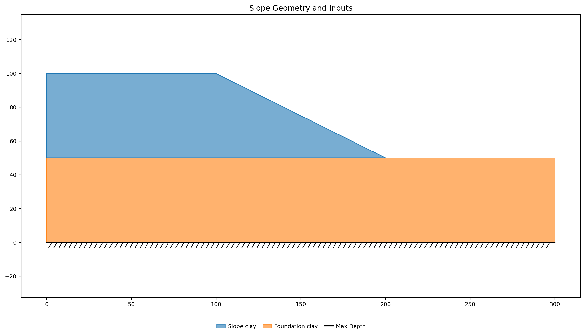{width=1000}

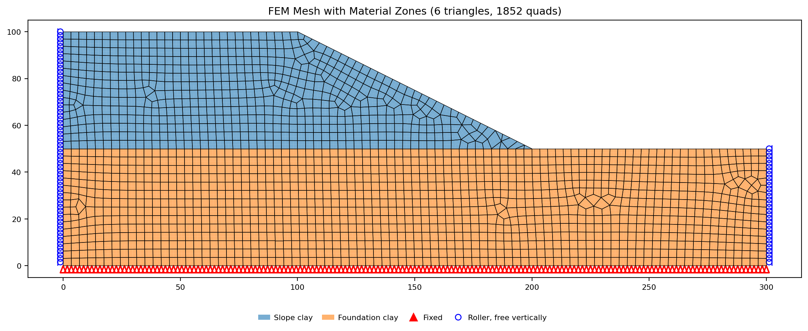{width=1000}

At $c_{u2}/c_{u1} = 1$, the deep base mechanism of their Fig. 11(a):

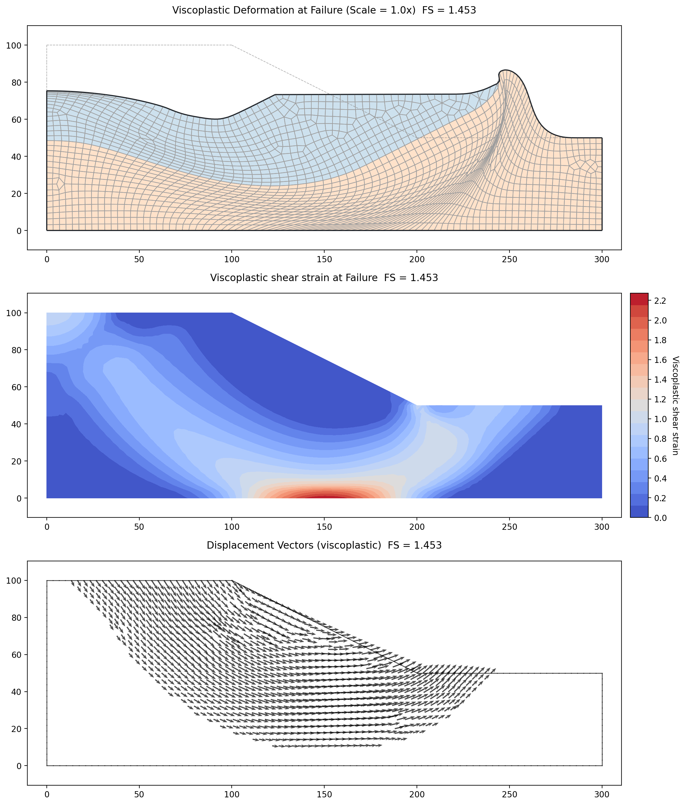{width=1000}

At $c_{u2}/c_{u1} = 2$, the shallow toe mechanism of their Fig. 11(c), drawn at the same ratio:

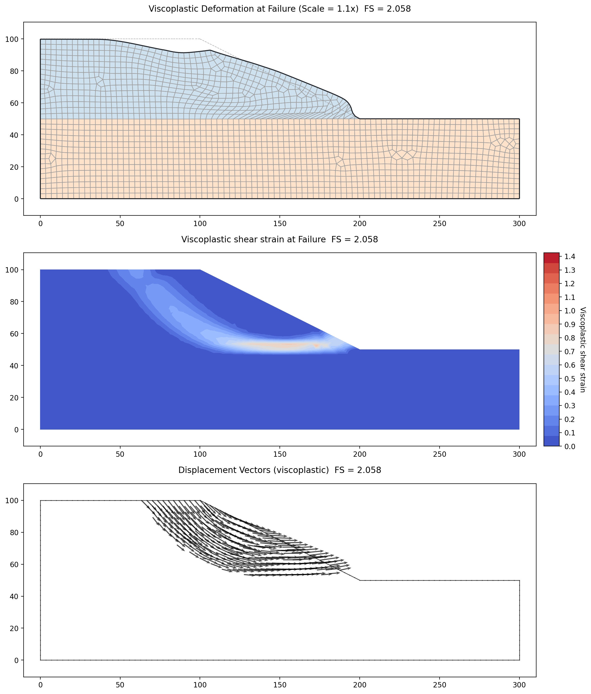{width=1000}

<!-- test: file=../fem/files/xslope_griffiths4_r1.xlsx, type=fem_ssrm, expected_fs=1.453, element_type=quad8, target_size=3.5, tolerance=0.01, f_min=1.0, f_max=1.8, max_iter=16000, benchmark=SSRM-G4, f_stand=1.45, f_fail=1.45625, check=edges -->
<!-- test: file=../fem/files/xslope_griffiths4_r2.xlsx, type=fem_ssrm, expected_fs=2.058, element_type=quad8, target_size=3.5, tolerance=0.01, f_min=1.8, f_max=2.4, max_iter=16000, benchmark=SSRM-G4, f_stand=2.053125, f_fail=2.0625, check=edges -->
<!-- Coarse tri6 quick SSRM (ungated): base case (cu2=cu1) and toe case (cu2=2cu1); confirms the mechanism flip lifts the FS from ~1.46 to ~2.1. -->
<!-- test: file=../fem/files/xslope_griffiths4_r1.xlsx, type=fem_ssrm, expected_fs=1.46, element_type=tri6, target_size=6, tolerance=0.05, f_min=1.0, f_max=1.8, max_iter=4000, f_stand=1.45, f_fail=1.475, check=edges -->
<!-- test: file=../fem/files/xslope_griffiths4_r2.xlsx, type=fem_ssrm, expected_fs=2.112, element_type=tri6, target_size=6, tolerance=0.05, f_min=1.6, f_max=2.4, max_iter=4000, f_stand=2.1, f_fail=2.125, check=edges -->
<!-- LEM companions: the unconstrained global search finds the BASE circle (~1.47, tangent to the firm base) at cu2=cu1 and the TOE circle (~2.02, confined to the upper clay) at cu2=2cu1 — the same base->toe flip as the SSRM and Taylor's charts. -->
<!-- test: file=../fem/files/xslope_griffiths4_r1.xlsx, type=circular_search, method=spencer, seed=grid, num_slices=40, expected_fs=1.468, tolerance=0.02 -->
<!-- test: file=../fem/files/xslope_griffiths4_r2.xlsx, type=circular_search, method=spencer, seed=grid, num_slices=40, expected_fs=2.022, tolerance=0.02 -->

### 🟢 Griffiths & Lane (1999) Example 5 — "Slow" Drawdown {#verification-griffiths5}

Example 1's slope with a horizontal free surface at depth $L$ below the crest, following a
reservoir lowered from above the crest ($L/H < 0$) to the toe ($L/H = 1$), their Figs 12–15.
The pore pressure is $\gamma_w$ times the depth below the free surface, the reservoir presses on
the submerged face, and the total unit weight is the same above and below the water. Two stations
carry a chart printed on Fig. 15, [Morgenstern (1963)](https://doi.org/10.1680/geot.1963.13.2.121)
at $L/H = 0$ and Bishop & Morgenstern (1960) at $L/H = 1$, and those are their referees; the
other stations are scored against the paper's FE points. Five stations are tabulated and three
more run on the curve below.

| $L/H$ | XSLOPE SSRM (coarse tri6) | quad8 (refined) | Griffiths & Lane FE (Fig. 15) | Referee | Note |
|---|---|---|---|---|---|
| −0.2 | 1.89 | — | 1.85 (+2.2%) | the FE point | submerged plateau |
| 0.0 | 1.89 | 1.85 | 1.85 (+2.2% / 0.0%) | Morgenstern (1963) chart 1.85 (+2.2% / 0.0%) | |
| 0.4 | 1.41 | — | 1.40 (+0.7%) | the FE point | |
| 0.7 | 1.31 | 1.29 | 1.30 (+0.8% / −0.8%) | the FE point | **minimum** |
| 1.0 | 1.39 | 1.37 | 1.40 (−0.7% / −2.1%) | Bishop & Morgenstern (1960) chart 1.4 (−0.7% / −2.1%) | |

| Property | Value |
|---|---|
| Cohesion, $c'$ | 312.5 psf ($c'/\gamma H = 0.05$) |
| Friction angle, $\phi'$ | 20 degrees |
| Unit weight, $\gamma$ | 125 pcf (total, above **and** below the free surface) |
| Young's modulus, $E'$ | 2,088,500 psf |
| Poisson's ratio, $\nu'$ | 0.3 |
| Slope | 2:1, $H = 50$ ft (crest at $y = 50$, toe at $(160, 0)$, firm base at $y = 0$) |
| Free surface | horizontal, at $y_{fs} = 50 - L$; $L/H$ swept from $-0.2$ to $1.0$ |

The factor of safety holds a plateau while the slope is submerged, falls to its minimum at
$L/H = 0.7$, where the paper places it, and recovers at the drained end. Cohesion is unaffected
by buoyancy, so as the water is drawn down the added soil weight destabilizes more than the added
friction stabilizes until $L/H = 0.7$, beyond which the friction gain wins. Two of the three
refined quad8 values read below the paper's FE points by the failure-test difference of Example 1;
the drained end is Example 1's slope and returns its 1.37.

**Input files**, one per station:
[$L/H = -0.2$](../fem/files/xslope_griffiths5_m0p2.xlsx),
[$0$](../fem/files/xslope_griffiths5_0.xlsx),
[$0.2$](../fem/files/xslope_griffiths5_0p2.xlsx),
[$0.4$](../fem/files/xslope_griffiths5_0p4.xlsx),
[$0.5$](../fem/files/xslope_griffiths5_0p5.xlsx),
[$0.7$](../fem/files/xslope_griffiths5_0p7.xlsx),
[$0.9$](../fem/files/xslope_griffiths5_0p9.xlsx),
[$1.0$](../fem/files/xslope_griffiths5_1.xlsx).

At $L/H = 0.5$ the free surface cuts the slope at mid-height and the reservoir pressure loads the
submerged lower face:

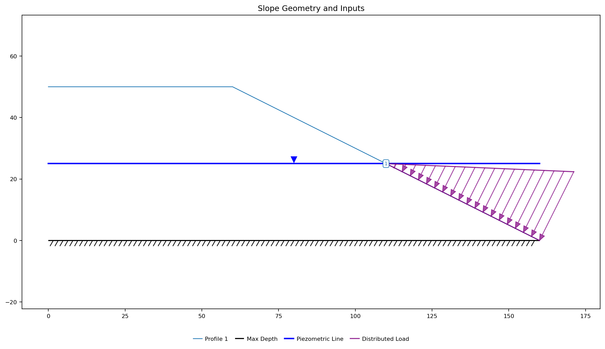{width=1000}

The reservoir traction (arrows) acts on the submerged face:

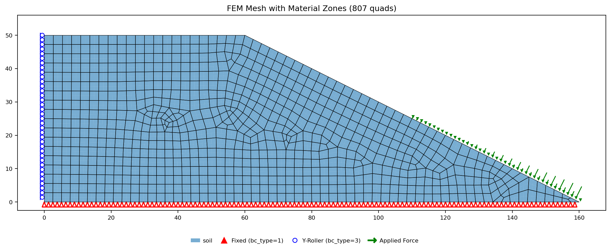{width=1000}

The factor of safety against $L/H$, the tri6 series with the quad8 points and the two chart values
overlaid:

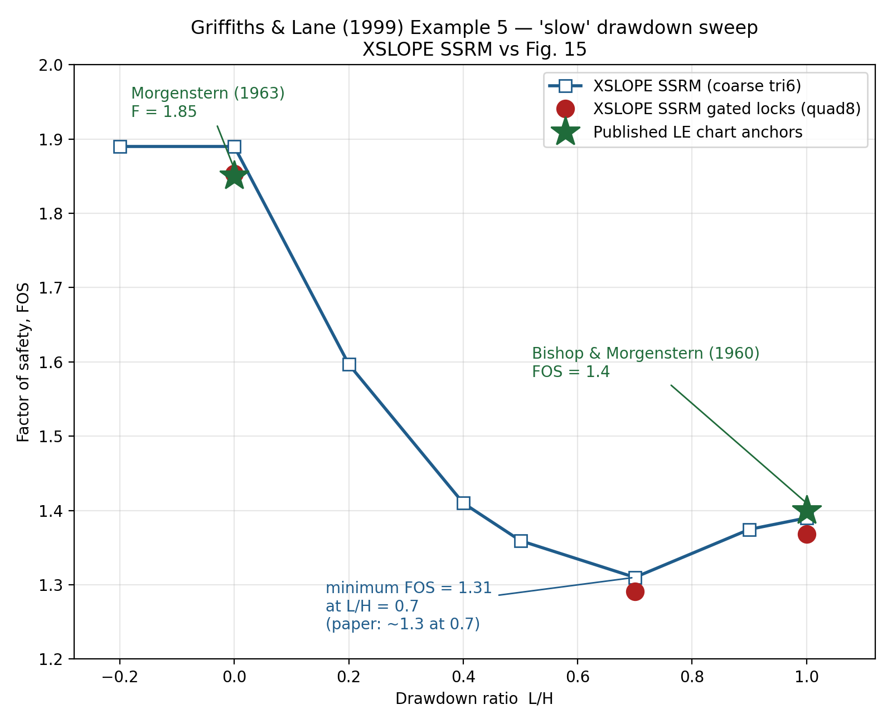{width=700}

At the minimum, $L/H = 0.7$ and $F = 1.29$, a rotational mechanism exits near the toe:

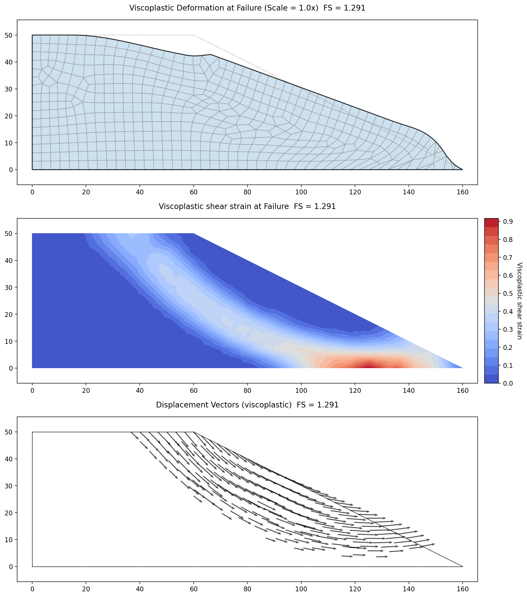{width=1000}

Fully loaded, $L/H = 0$ and $F = 1.85$, a deep rotational slide passes under the submerged face:

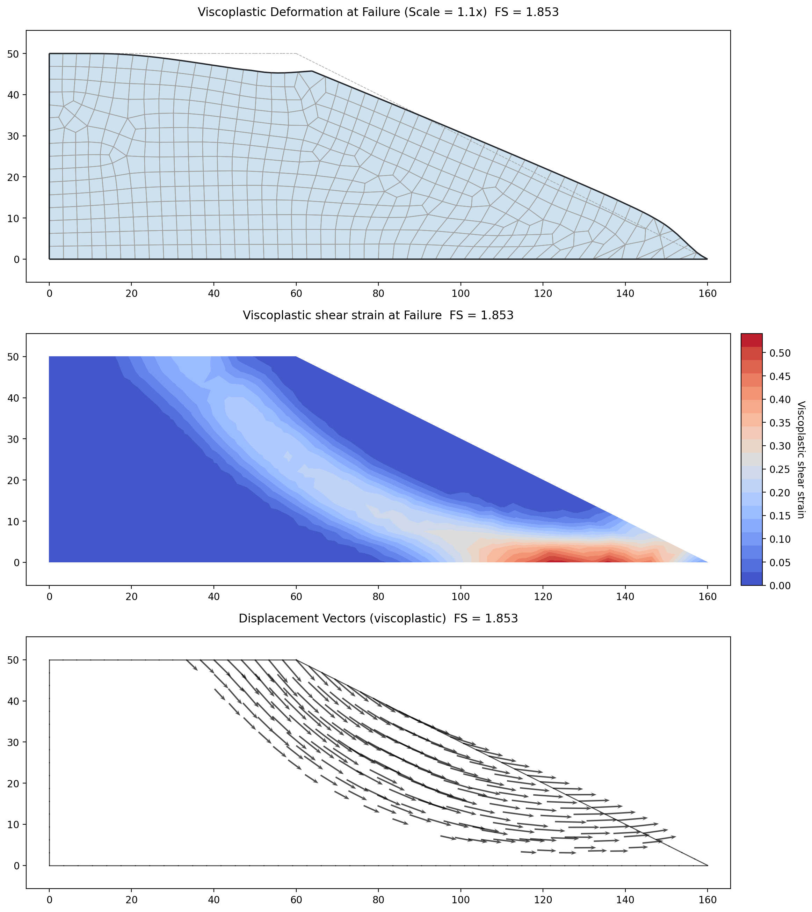{width=1000}

<!-- test: file=../fem/files/xslope_griffiths5_0.xlsx, type=fem_ssrm, expected_fs=1.853, element_type=quad8, target_size=3.5, tolerance=0.01, f_min=1.5, f_max=2.3, max_iter=16000, benchmark=SSRM-G5, f_stand=1.85, f_fail=1.85625, check=edges -->
<!-- test: file=../fem/files/xslope_griffiths5_0p7.xlsx, type=fem_ssrm, expected_fs=1.291, element_type=quad8, target_size=3.5, tolerance=0.01, f_min=0.9, f_max=1.7, max_iter=16000, benchmark=SSRM-G5, f_stand=1.2875, f_fail=1.29375, check=edges -->
<!-- test: file=../fem/files/xslope_griffiths5_1.xlsx, type=fem_ssrm, expected_fs=1.368, element_type=quad8, target_size=3.5, tolerance=0.01, f_min=0.9, f_max=1.8, max_iter=16000, benchmark=SSRM-G5, f_stand=1.3640625, f_fail=1.37109375, check=edges -->
<!-- Coarse tri6 quick SSRM (ungated): the drawdown sweep reproducing Fig. 15 — submerged plateau (~1.89), the ~0.7 minimum (~1.31), and the drained end (~1.39). -->
<!-- test: file=../fem/files/xslope_griffiths5_m0p2.xlsx, type=fem_ssrm, expected_fs=1.89, element_type=tri6, target_size=6, tolerance=0.05, f_min=1.5, f_max=2.3, max_iter=4000, f_stand=1.875, f_fail=1.9, check=edges -->
<!-- test: file=../fem/files/xslope_griffiths5_0.xlsx, type=fem_ssrm, expected_fs=1.89, element_type=tri6, target_size=6, tolerance=0.05, f_min=1.5, f_max=2.3, max_iter=4000, f_stand=1.875, f_fail=1.9, check=edges -->
<!-- test: file=../fem/files/xslope_griffiths5_0p4.xlsx, type=fem_ssrm, expected_fs=1.41, element_type=tri6, target_size=6, tolerance=0.05, f_min=1.0, f_max=1.9, max_iter=4000, f_stand=1.39375, f_fail=1.421875, check=edges -->
<!-- test: file=../fem/files/xslope_griffiths5_0p7.xlsx, type=fem_ssrm, expected_fs=1.31, element_type=tri6, target_size=6, tolerance=0.05, f_min=0.9, f_max=1.7, max_iter=4000, f_stand=1.3, f_fail=1.325, check=edges -->
<!-- test: file=../fem/files/xslope_griffiths5_1.xlsx, type=fem_ssrm, expected_fs=1.39, element_type=tri6, target_size=6, tolerance=0.05, f_min=0.9, f_max=1.8, max_iter=4000, f_stand=1.378125, f_fail=1.40625, check=edges -->

### 🟢 Griffiths & Lane (1999) Example 6 — Two-Sided Earth Dam {#verification-griffiths6}

An actual earth dam section (Torres & Coffman, 1997) with homogenized properties, analyzed with
the reservoir full, the free surface sloping from the upstream face to the downstream toe, and
before filling. The pore pressure is $\gamma_w$ times the depth below the free surface and the
reservoir load is a normal pressure on the submerged upstream face, both as the paper describes.
No chart covers the section, so the referee is the paper's FE value, printed to 0.1.

| Case | XSLOPE | Griffiths & Lane FE | Note |
|---|---|---|---|
| SSRM, full reservoir (free surface) | 1.87 | **1.9** (−1.6%) | their Figs 18, 20, 21 |
| SSRM, before filling (no free surface) | 2.42 | **2.4** (+0.8%) | their Figs 18, 19, 21 |
| Reservoir effect, wet/dry | 0.77 | 0.79 (−2.5%) | from their FE 1.9 / 2.4; their limit equilibrium gives 0.79 again, from 1.90 / 2.42 |

| Case | XSLOPE | Griffiths & Lane limit equilibrium | Note |
|---|---|---|---|
| Spencer, full reservoir | 1.915 | 1.90 (+0.8%) | p. 400 |

<!-- test: file=../fem/files/xslope_griffiths6_full.xlsx, type=circular_search, method=spencer, num_slices=40, expected_fs=1.915, tolerance=0.005, benchmark=SSRM-2 -->

| Property | Value |
|---|---|
| Cohesion, $c'$ | 13.8 kPa |
| Friction angle, $\phi'$ | 37° |
| Unit weight, $\gamma$ | 18.2 kN/m³ (above and below the water table) |
| Foundation layer | 7.3 m thick |
| Dam height | 21.3 m above foundation, crest 7.3 m wide |
| Faces | upstream ≈ 18°, downstream ≈ 23° |
| Reservoir | 17.1 m above foundation level |

With the reservoir full the downstream slope is the weaker side: the shear band runs from the
crest to the downstream toe, the surface the paper and XSLOPE's own Spencer analysis also find.
The full-reservoir case runs on tri6 elements because the submerged upstream skin carries small
persistent stresses near the yield surface, and the quad8 element's reduced-integration hourglass
mode is susceptible to such forcing (see the [FEM Overview](../fem/overview.md) discussion of
submerged boundaries).

**Input files:**
[xslope_griffiths6_full.xlsx](../fem/files/xslope_griffiths6_full.xlsx) (reservoir full),
[xslope_griffiths6_dry.xlsx](../fem/files/xslope_griffiths6_dry.xlsx) (before filling).

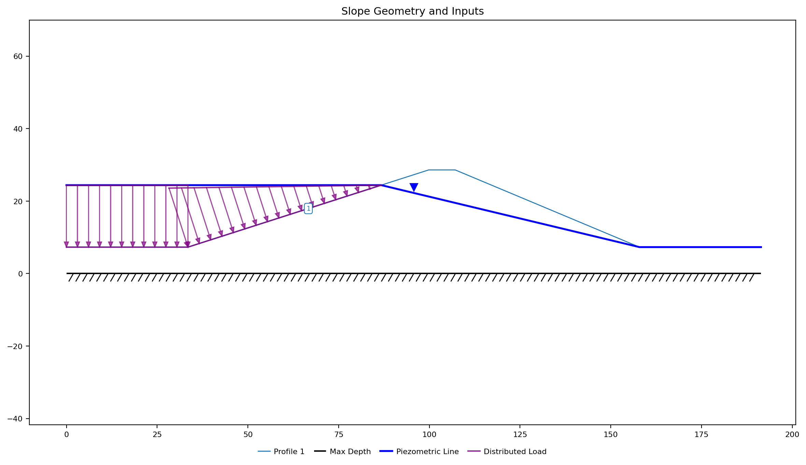{width=1000}

Before filling, $F = 2.42$: the mechanism passes beneath the crest and exits on the downstream
face.

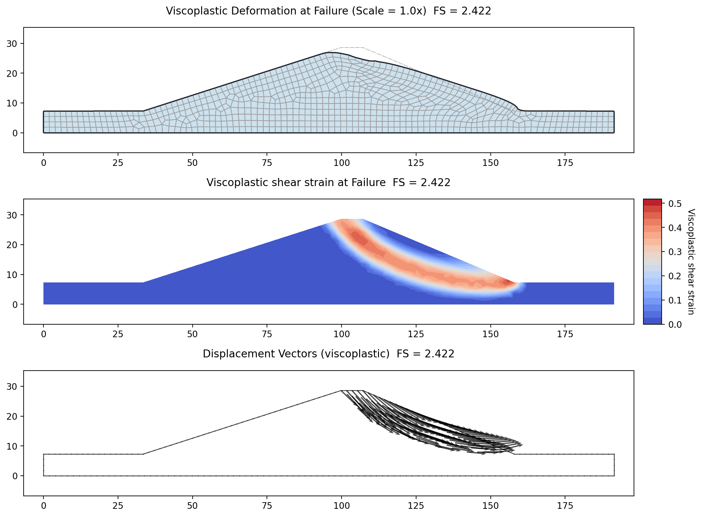{width=1000}

Reservoir full, $F = 1.87$: the rotational sliding mass on the downstream side.

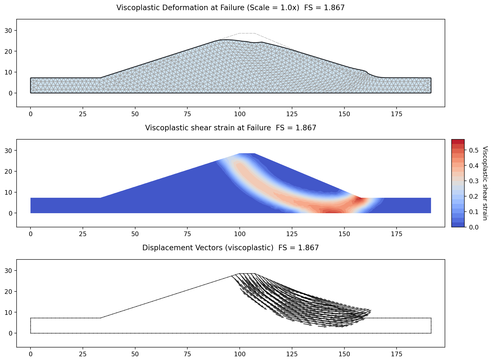{width=1000}

<!-- test: file=../fem/files/xslope_griffiths6_dry.xlsx, type=fem_ssrm, expected_fs=2.422, element_type=quad8, target_size=2, tolerance=0.01, f_min=2.0, f_max=2.8, max_iter=16000, benchmark=SSRM-2, f_stand=2.41875, f_fail=2.425, check=edges -->
<!-- test: file=../fem/files/xslope_griffiths6_full.xlsx, type=fem_ssrm, expected_fs=1.867, element_type=tri6, target_size=2, tolerance=0.01, f_min=1.6, f_max=2.2, max_iter=16000, benchmark=SSRM-2, f_stand=1.8625, f_fail=1.871875, check=edges -->

### 🟢 Torggler (2016) §3 — Homogeneous slope with a vertical plate {#verification-torggler3a}

A 10 m slope at 30° in a soft Mohr-Coulomb clay, unsupported and then supported by a 7.5 m
vertical plate at mid-slope, from Torggler's §3: the only published SSRM benchmark that gives both
the factor of safety and the plate's internal forces. No closed form covers it, so the referee is
Torggler's PLAXIS factor.

| Quantity | XSLOPE | Torggler PLAXIS | Note |
|---|---|---|---|
| SSRM FS, unsupported (tri6, 6,793 elements) | 1.129 | **1.111** (+1.6%) | his Table 2 / Table 3 |
| SSRM FS, plate without interfaces (tri6, 6,834 elements) | 1.195 | **1.175** (+1.7%) | his §3.2.1 |
| Plate peak shear, lower lobe, at failure | 25.8 kN/m | **21 kN** (+22.9%) | at a depth of −5.80 m against his −4.85 m; his §3.2, Fig. 14 |

Same-method limit-equilibrium pairings against his SLIDE circular column:

| Method | XSLOPE | SLIDE (Table 3, circular) |
|---|---|---|
| Bishop simplified | 1.135 | 1.138 (−0.3%) |
| Spencer | 1.132 | 1.130 (+0.2%) |
| Morgenstern-Price | 1.132 | GLE/Morgenstern-Price 1.131 (+0.1%) |

| Property | Value |
|----------|-------|
| Slope height / angle | 10 m / 30 degrees |
| Domain | 57.0 m wide × 30.0 m high, toe at (20, 20) |
| Cohesion, $c$ | 10 kPa |
| Friction angle, $\phi$ | 15 degrees |
| Unit weight, $\gamma = \gamma_{sat}$ | 16 kN/m³ |
| Young's modulus, $E$ | 2,000 kPa |
| Poisson's ratio, $\nu$ | 0.4 |
| Plate $EA$ / $EI$ | 2.0 × 10⁶ kN/m / 4.0 × 10⁴ kNm²/m |
| Plate length / station | 7.5 m, vertical, head at (28.66, 25.0) |

The plate is compared without interfaces, because a plate sharing nodes with the soil is exactly
XSLOPE's beam formulation and Torggler reports the internal forces of the two variants as almost
identical. Its shear reverses sign along its length, an upper lobe peaking at 30.3 kN/m at a depth
of −1.70 m and a lower one at 25.8 kN/m at −5.80 m; the lower is the branch his Fig. 14 reads.
The plate's own weight is not carried, because XSLOPE's beam elements are weightless. His SLIDE
Janbu row is the uncorrected simplified method while XSLOPE's Janbu carries the correction factor,
so that row is not paired.

Refining the target size from 1.0 m to 0.7 m moves the unsupported factor from 1.136 to 1.129
(−0.6%) and leaves the supported one at 1.195.

**Input files:** [xslope_torggler_3a_nopile.xlsx](../fem/files/xslope_torggler_3a_nopile.xlsx),
[xslope_torggler_3a_plate.xlsx](../fem/files/xslope_torggler_3a_plate.xlsx).

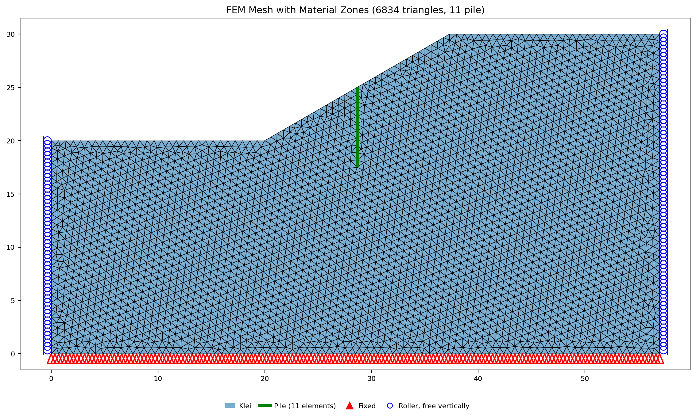{width=900}

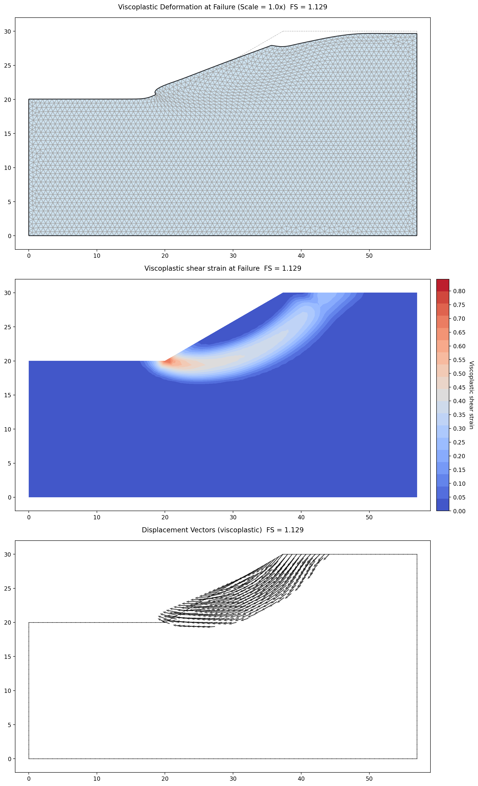{width=900}

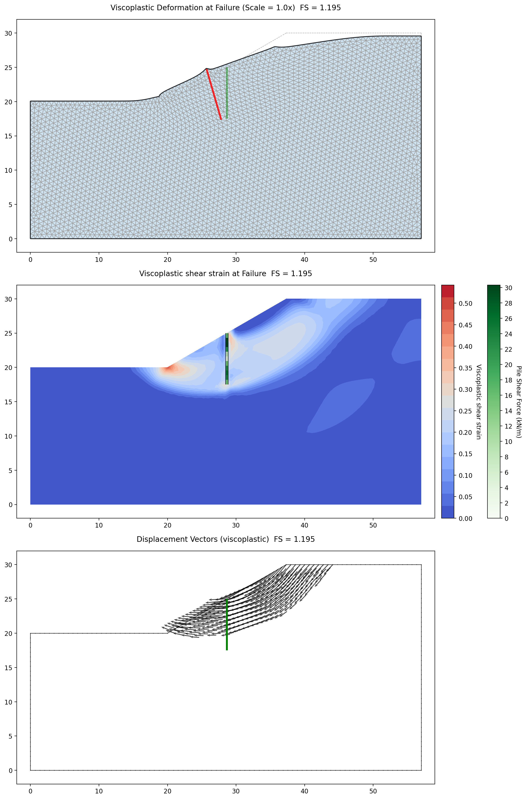{width=900}

<!-- test: file=../fem/files/xslope_torggler_3a_nopile.xlsx, type=fem_ssrm, expected_fs=1.129, element_type=tri6, target_size=0.7, tolerance=0.01, f_min=1.0, f_max=1.25, max_iter=8000, benchmark=SSRM-TORGGLER, f_stand=1.125, f_fail=1.1328125, check=edges -->
<!-- test: file=../fem/files/xslope_torggler_3a_plate.xlsx, type=fem_ssrm, expected_fs=1.195, element_type=tri6, target_size=0.7, tolerance=0.01, f_min=1.05, f_max=1.30, max_iter=8000, benchmark=SSRM-TORGGLER, f_stand=1.190625, f_fail=1.1984375, check=edges -->
<!-- test: file=../fem/files/xslope_torggler_3a_nopile.xlsx, type=circular_search, method=bishop, num_slices=40, expected_fs=1.135, tolerance=0.01, benchmark=SSRM-TORGGLER -->
<!-- test: file=../fem/files/xslope_torggler_3a_nopile.xlsx, type=circular_search, method=spencer, num_slices=40, expected_fs=1.132, tolerance=0.01, benchmark=SSRM-TORGGLER -->
<!-- test: file=../fem/files/xslope_torggler_3a_nopile.xlsx, type=circular_search, method=mprice, num_slices=40, expected_fs=1.132, tolerance=0.01, benchmark=SSRM-TORGGLER -->

### 🟢 Torggler (2016) §4 — Slope with a weak layer and a 15 m plate {#verification-torggler3b}

The §3 slope carrying a 1 m band of near-cohesionless soil along a published failure line (his
Table 18), unsupported and then supported by a 15 m vertical plate at mid-slope. The referee is
Torggler's PLAXIS factor.

| Quantity | XSLOPE | Torggler PLAXIS | Note |
|---|---|---|---|
| SSRM FS, unsupported | 1.064 | **1.045** (+1.8%) | his Table 11 / Table 12 |
| SSRM FS, plate without interfaces | 1.743 | **1.725** (+1.0%) | his §4.2 |

Same-method limit-equilibrium pairing on his own published failure line:

| Method | XSLOPE | SLIDE (Table 12) |
|---|---|---|
| Spencer | 1.121 | 1.043 (+7.5%) |
| Morgenstern-Price | 1.093 | GLE/Morgenstern-Price 1.039 (+5.2%) |

| Property | Value |
|----------|-------|
| Domain | 65.0 m wide × 30.0 m high, toe at (20, 20) |
| Soil body: $c$ / $\phi$ / $E$ / $\nu$ | 10 kPa / 25° / 15,000 kPa / 0.3 |
| Weak layer: $c$ / $\phi$ / $E$ / $\nu$ | 0.01 kPa / 20° / 5,000 kPa / 0.3 |
| Unit weight, $\gamma$ (both) | 16 kN/m³ |
| Weak layer geometry | Table 18 polyline, 32 points, offset 0.5 m each side |
| Plate length / station | 15 m, vertical, head at (28.66, 25.0) |

The two models describe the plate differently. In PLAXIS it moves the mechanism out of the weak
layer ("failure in the weak layer is prevented by the plate," §4.2); in XSLOPE the band still
shears from its daylight at the toe to its daylight on the plateau, least where the plate crosses
it. Both still arrive at nearly the same factor of safety. The limit-equilibrium pair is read on
the Table 18 line itself, a fixed surface, while SLIDE's figures come from a search, and in a band
of $c = 0.01$ kPa soil the critical surface lies on the band's lower face rather than its center,
so the two rows differ by where the surface sits as well as by method. The plate station, not
printed in §4, is read from Fig. 66 as the §3 station.

The weak layer carries a 0.5 m element size of its own; both factors are taken at a 1.0 m global
target.

**Input files:** [xslope_torggler_3b_nopile.xlsx](../fem/files/xslope_torggler_3b_nopile.xlsx),
[xslope_torggler_3b_plate.xlsx](../fem/files/xslope_torggler_3b_plate.xlsx).

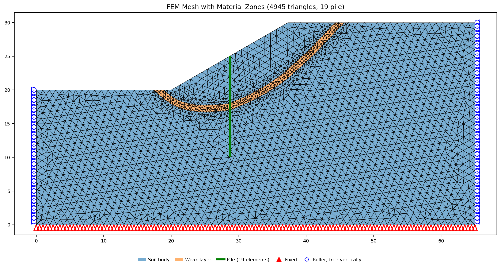{width=900}

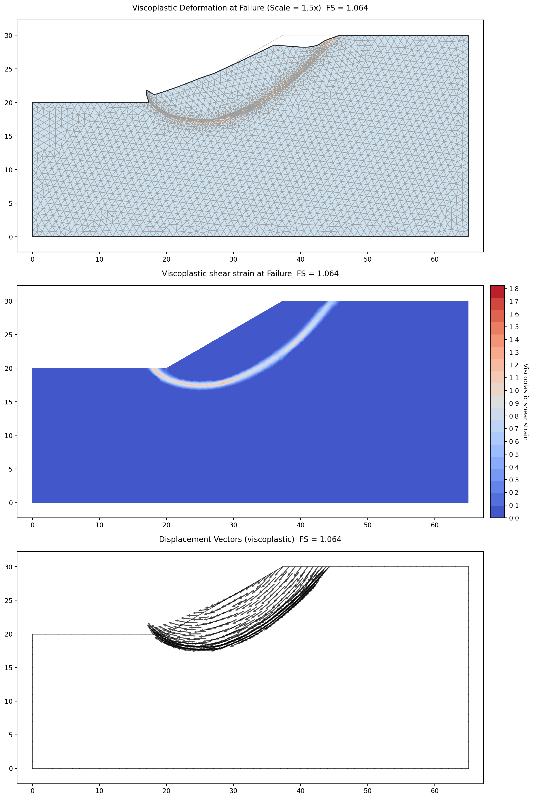{width=900}

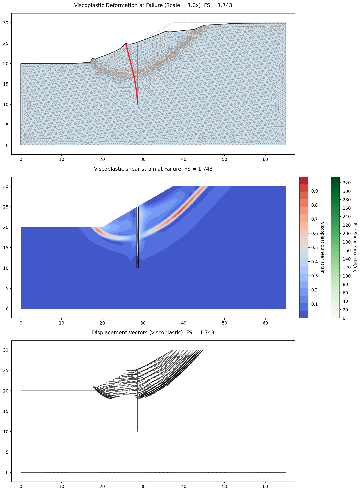{width=900}

<!-- test: file=../fem/files/xslope_torggler_3b_nopile.xlsx, type=fem_ssrm, expected_fs=1.064, element_type=tri6, target_size=1.0, tolerance=0.01, f_min=0.9, f_max=1.2, max_iter=6000, benchmark=SSRM-TORGGLER -->
<!-- test: file=../fem/files/xslope_torggler_3b_plate.xlsx, type=fem_ssrm, expected_fs=1.743, element_type=tri6, target_size=1.0, tolerance=0.01, f_min=1.45, f_max=1.95, max_iter=8000, benchmark=SSRM-TORGGLER, f_stand=1.7390625, f_fail=1.746875, check=edges -->
<!-- test: file=../fem/files/xslope_torggler_3b_nopile.xlsx, type=single_noncirc, method=spencer, num_slices=40, expected_fs=1.121, tolerance=0.01, benchmark=SSRM-TORGGLER -->
<!-- test: file=../fem/files/xslope_torggler_3b_nopile.xlsx, type=single_noncirc, method=mprice, num_slices=40, expected_fs=1.093, tolerance=0.01, benchmark=SSRM-TORGGLER -->
